# Learning in Imperfect Environment: Multi-Label Classification with Long-Tailed Distribution and Partial Labels

Wenqiao Zhang 1 Changshuo Liu 2 Lingze Zeng Bengchin Ooi 2 Siliang Tang 1 Yueting Zhuang

1 Zhejiang University, China, 2 National University of Singapore, Singapore,

wenqiaozhang@zju.edu.cn, liu717@comp.nus.edu.sg, Zenglz\_pro@163.com, ooibc@comp.nus.edu.sg, siliang@zju.edu.cn, yzhuang@zju.edu.cn

## Abstract

Conventional multi-label classification (MLC) methods assume that all samples are fully labeled and identically distributed. Unfortunately, this assumption is unrealistic in large-scale MLC data that has long-tailed (LT) distribution andpartial labels (PL). To address the problem, we introduce a novel task, Partial labeling and Long-Tailed Multi-Label Classification (PLT-MLC), to jointly consider the above two imperfect learning environments. Not surprisingly, we find that most LT-MLC and PL-MLC approachesfail to solve the PLT-MLC, resulting in significant performance degradation on the two proposed PLT-MLC benchmarks. Therefore, we propose an end-to-end learningframework: COrrection → ModificatIon → balanCe, abbreviated as COMIC. Our bootstrapping philosophy is to simultaneously correct the missing labels (Correction) with convinced prediction confidence over a class-aware threshold and to learnfrom these recall labels during training. We next propose a novel multi-focal modifier loss that simultaneously addresses head-tail imbalance and positive-negative imbalance to adaptively modify the attention to different samples (Modification) under the LT class distribution. In addition, we develop a balanced training strategy by distilling the model’s learning effect from head and tail samples, and thus design a balanced classifier (Balance) conditioned on the head and tail learning effect to maintain stable performancefor all samples. Our experimental study shows that the proposed COMIC significantly outperforms general MLC, LT-MLC and PL-MLC methods in terms ofeffectiveness and robustness on our newly created PLT-MLC datasets. Codes and benchmarks are available on the link https://https://github.com/wannature/COMIC

## 1. Introduction

In recent years, the development of deep learning prosperity to the field of computer vision [20, 17, 19, 16, 23, 22, 25,

24, 43, 42, 18]. Images typically contain multiple objects and concepts, highlighting the importance of multi-label classification (MLC) [34] for real-world tasks. Along with the wide adoption of deep learning, recent MLC approaches have made remarkable progress in visual recognition [36, 38], but the performance is limited by two common assumptions: all categories have comparable numbers of instances and each training instance has beenfully annotated with all the relevant labels. While this conventional setting provides a perfect training environment for various studies, it conceals a number of complexities that typically arise in real-world applications: i) Long-Tailed (LT) Class Distribution. With the growth of digital data, the crux of making a large-scale dataset is no longer about where to collect, but how to balance it [33]. However, the cost of expanding the dataset to a larger class vocabulary with balanced data is not linear — but exponential — since the data is inevitably long-tailed following Zipf’s distribution [30]. ii) Partial Labels (PL) of Instances. In the case of a large number of categories, it is difficult and even impractical to fully annotate all relevant labels for each image [39, 46]. Intuitively, humans tend to focus on different aspects of image contents due to human bias, i.e.,, their preference, personality and sentiment [41], which indirectly affects how and what we annotate. In fact, LT and PL are often co-occurring, and therefore, the MLC model must be sufficiently robust to handle different data distributions and imperfect datasets.

In this paper, we present a new challenge for MLC at scale, Partial labeling and Long-Tailed Multi-Label Classification (PLT-MLC), with concomitant existence of both PL setting [39] and LT distribution [33] problems. As captured in the overview of PLT-MLC in Figure 1 (a), it has the following three challenges: i) False Negative Training. Under the PL setting, the MLC model treats the un-annotated labels ( ) as negatives ( ), which may produce sub-optimal decision boundary as it adds noise of false negative labels (Figure 1 (b)). The situation is further exacerbated in the

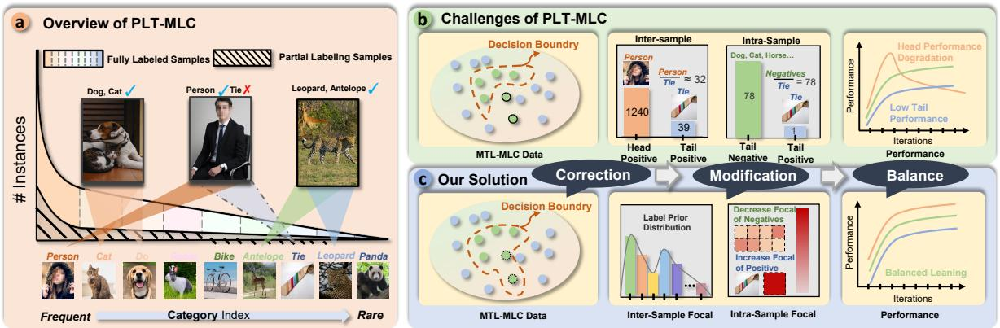  
Figure 1: (a) illustrates an overview of the proposed PLT-MLC task. (b) depicts three key challenges of a PLT-MLC task. (c) depicts a concise version of our proposed model for facilitating the PLT-MLC. ( : positive, : negative, : false negative, : corrected positive)

LT class distribution as some tail categories are prone to missing annotations in practice. For instance, in Figure 1 (a), “person” is the head class in the PLT-MLC dataset and is often notable in an image to labeling for annotators. In contrast, the “tie” often occupies a tiny region in the scene compared with the “person”. The annotator may miss the “tie” object, which will aggravate the LT distribution and further increase the difficulty of learning from tail classes. ii) Head-Tail and Positive-Negative Imbalance. There are two imbalance issues in a PLT-MLC task: inter-instance head-tail imbalance and intra-instance positive-negative imbalance. As shown in Figure 1 (b), the interinstance ratio of head positive ( ) “person” ( ) : tail positive ( ) “tie” ( ) ≈ 32 under the LT data distribution, and the intra-instance ratio of tail negative ( ) categories : tail positive ( )“tie” ( ) = 78 as an image only contains a small fraction of the positive labels. Consequently, a robust PLT-MLC model should address the co-occurring imbalances simultaneously. iii) Head Overfitting and Tail Underfitting. Different from the general LT distribution, the classification model downplays the minor tail and overplays the major head. The PLT-MLC has an extreme LT distribution and Figure 1(c) illustrates an interesting phenomenon of MLC model learning: the general classification model is prone to overfitting to head class with extensive samples and underfitting to tail classes with a few samples. This figure also indicates that only the medium class shows a steady growth in performance, which means that existing LT methods focusing on lifting up the tail performance may not solve the PLT-MLC problem satisfactorily.

Suppose a trained model is used to correct the missing labels and then an LT classifier is trained using the updated labels, we might not be able to obtain a satisfying PLT-MLC performance, either. While machine learning methods can easily detect the head samples, they may have difficulty in identifying the tail samples. As a result, the corrected labels may still exhibit an LT distribution that inevitably hurts balanced learning. Moreover, even when a general LT classifier affords the trade-off to improve the tail performance condi tioned on the head performance drop, it is still incapable of simultaneously addressing the issue of head overfitting and tail underfitting problem. Further, the decoupled learning paradigm is impractical since it needs the “stop” training and human “re-start” training, i.e., an end-to-end learning scheme is more desirable. Thus, these limitations motivate us to reconsider the solution for the PLT-MLC task.

To this end, we propose an end-to-end PLT-MLC framework: COrrection → ModificatIon → balanCe (Figure 1), called COMIC, which progressively addresses the three key PLT-MLC challenges. Step 1: The Correction module aims to gradually correct the missing labels according to the predicted confidence and dynamically adjusts the classified loss of the corrected samples under the real-time estimated class distribution. Step 2: After the label correction, the Modification module introduces a novel Multi-Focal Modifier (MFM) Loss, which contains two focal factors to address the two imbalance issues in PLT-MLC independently. Motivated by [3], the first is an intra-instance positive-negative factor that determines the concentration of learning on hard negatives and positives with different exponential decay factors. The second is an inter-instance head-tail factor that increases the impact of rare categories, ensuring that the loss contribution of rare samples will not be overwhelmed by frequent ones. Step 3: Finally, the Balance module measures the model’s optimization direction with a calculated moving average vector of the gradient over all past samples. And thus, we devise a head model and a tail model by subtracting or adding this moving vector, which can respectively improve head and tail performance. Subsequently, a balanced classifier deduces a balanced learning effect under the supervision of the head classifier and tail classifier. It protects the model training from being too medium biased, and hence the balanced classifier is able to achieve the balanced learning schema. Notably, our solution is an end-to-end learning framework, which is re-training-free and effectively enables balanced prediction.

Our contributions are three-fold: (1) We present a new challenging task: Partial labeling and Long-Tailed Multi-Label Classification (PLT-MLC), together with two newly designed benchmarks: PLT-COCO and PLT-VOC. (2) We propose an end-to-end PLT-MLC learning framework, called COMIC, to effectively perform the PLT-MLC task as a progressive learning paradigm, i.e., Correction → Modification → Balance. (3) Through an extensive experimental study, we show that our method improves all the prevalent LT and ML line-ups on PLT-MLC benchmarks by a large margin.

## 2. Related Works

Long-Tailed MLC. [37] is the first work that addresses the LT-MLC by extending the re-balanced sampling and costsensitive re-weighting methods. It proposes an optimized DB Focal method, which does improve the recognition performance of tail classes. Later work, [10] performs uniform and re-balanced samplings from the same training set. Then a two-branch network is developed to enforce the consistency between two branches for collaborative learning on both uniform and re-balanced samplings. However, the above works require careful data initialization, i.e., re-sampling, which is undesirable in practice. Moreover, these methods have not yet considered the missing labeling case, which may not sufficiently deal with the PLT-MLC.

MLC with Partial Labels. Multi-label tasks often involve incomplete training data, hence several methods have been proposed to solve the problem of multi-label learning with missing labels. A simple solution is to treat the missing labels as negative labels [31, 21, 4]. However, performance will drop because a lot of ground-truth positive labels are initialized as negative labels [12]. Current works on $\mathrm { P L } -$ MLC mainly focus on the design of networks and training schemes. The common practice is to utilize the customized networks to learn label correlations or classification confidence to realize correct recognition of missing labels [7, 44]. However, the corrected labels learned from a trained model are imbalanced due to the previous training dataset having an LT distribution. Using such recall labels will aggravate the LT distribution in the PLT-MLC dataset and result in an imbalanced performance.

Other Works. [40] learns to generate concept-invariant samples in the environment with semantic gap, which enables the model to classify the samples through causal intervention, yielding improved generalization guarantees; [18] collaborates a cascade of foundation models, thus learning superior interleaved multi-modal instruction-following ability from imperfect supervision.

## 3. Methodology

This section describes the proposed PLT-MLC framework. We will present each module and its training strategy.

## 3.1. Problem Formulation

Before presenting our method, we first introduce some basic notions and terminologies. We consider a partially annotated MLC dataset contains C classes and N i.i.d training samples ${ \cal S } = \{ ( \mathbb { Z } ^ { ( 1 ) } , y ^ { ( 1 ) } ) , \cdot \cdot \cdot , ( \mathbb { Z } ^ { ( N ) } , y ^ { ( N ) } ) \}$ , where $\boldsymbol { \mathcal { T } ^ { ( i ) } }$ denote $i ^ { t h }$ image and label $y ^ { ( i ) } = [ y _ { 1 } ^ { ( i ) } , \cdot \cdot \cdot , y _ { c } ^ { ( i ) } ] \in \{ 0 , 1 \} ^ { C }$ For a given $i ^ { t h }$ example and category $c , y _ { c } ^ { ( i ) } = 0 ,$ 1 respectively means the category is unknown and present. Our proposed COMIC solves the PLT-MLC problem in an end to-end learning manner: Correction → Modification → Balance, with Reflective Label Corrector (RLC, in Sec.3.2), Multi-Focal Modifier (MFM, in Sec.3.3) and Head-Tail Balancer (HTB, in Sec.3.3), as illustrated in Figure 2.

These three modules are designed to seek a balanced model $\mathcal { M } _ { b } ( \cdot ; \Theta _ { b } )$ , parameterized by $\Theta _ { b } ,$ , to predict the presence or absence of each class given an input image. We denote $p = [ p _ { 1 } , \cdot \cdot \cdot , p _ { c } ]$ as the class prediction, computed by the model: $p _ { c } = \sigma ( z _ { c } )$ where $\sigma$ is the sigmoid function, and $z _ { c }$ is the output logit corresponding to class $c .$ The optimized goal of COMIC can be defined as follows:

$$
\underbrace { \mathcal { L } ( ( S ) ; \Theta _ { b } ) } _ { \mathrm { C O M I C ~ L o s s } } = \underbrace { \lambda _ { c } \cdot \mathcal { L } _ { r l c } } _ { \mathrm { R L C ~ L o s s } } + \underbrace { \lambda _ { m } \cdot \mathcal { L } _ { m f m } } _ { \mathrm { M F M ~ L o s s } } + \underbrace { \lambda _ { b } \cdot \mathcal { L } _ { h t b } } _ { \mathrm { H T B ~ L o s s } }\tag{1}
$$

where $\mathcal { L } _ { r l c } , \mathcal { L } _ { m f m }$ and $\mathcal { L } _ { h t b }$ denote the loss of RLC, MFM and HTB, respectively. $\lambda _ { c } , \lambda _ { m }$ and $\lambda _ { b }$ are hyperparameters.

## 3.2. Reflective Label Corrector

Reflective Label Corrector (RLC) presents a real-time label correction method for missing labels to alleviate the effect of partially labeled samples. The core idea is to examine the label likelihood $p$ of each training image and recall the labels with convinced prediction confidence during training. Interestingly, we found that the model can distinguish a large number of missing labels with high prediction confidence in the early training stage, which implies that we can recall these missing labels during training to boost PTL-MLC learning. Here, we first define a threshold $\tau$ and then check the input sample’s label likelihood $p$ to check whether it is greater than $\tau$ and then calculate the average category possibility $P _ { c }$ of past trained data with class $c .$ If predicted probabilities $p _ { c }$ are highly confident, $i . e . , p _ { c } > \operatorname* { m a x } \{ \tau , P _ { c } \}$ we regard that the sample misses the label of class c and set a pseudo-label $\hat { y } _ { c }$

$$
\hat { y } _ { c } = \left\{ \begin{array} { l l } { 1 , } & { \mathrm { i f } p _ { c } > \operatorname* { m a x } \{ \tau , P _ { c } \} , y _ { c } = 0 } \\ { 0 , } & { \mathrm { o t h e r w i s e } } \end{array} \right.\tag{2}
$$

Thus, the loss of RLC module, $i . e . , \mathcal { L } _ { r l c }$ utilizes the MFM loss (refer the details in Sec. 3.3) with these corrected label

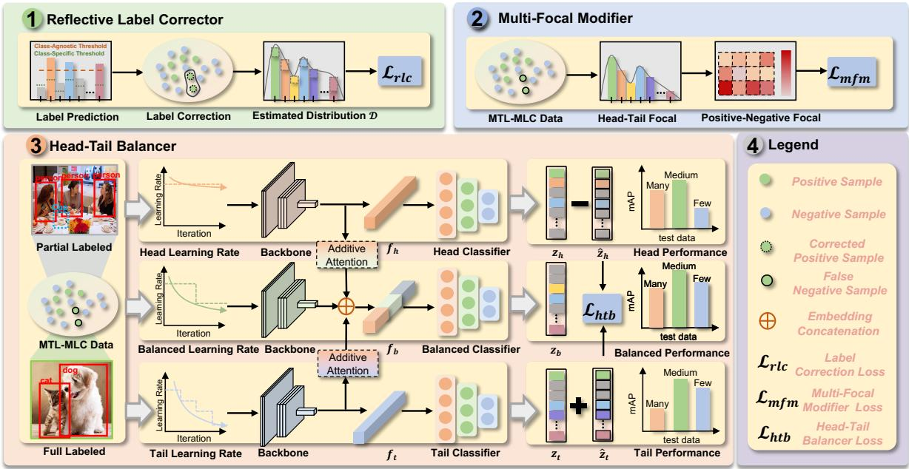  
Figure 2: Overview of COMIC. RLC module (Correction) corrects the missing labels along with the training and dynamicall re-weights the sample weight according to the estimated class distribution. MFM module (Modification) adjusts the focal of different instances according to head-tail and positive-negative imbalance under the extreme LT distribution. HTB module (Balance) measures the model’s optimization direction and correspondingly develops a balanced learning scheme to produce stable PLT-MLC performance.

$\hat { y }$ for model training:

$$
\begin{array} { r } { \mathcal { L } _ { r l c } ( p ) = \left\{ \begin{array} { l l } { \mathcal { L } _ { m f m } ^ { + } ( p ) , } & { \mathrm { i f ~ } \hat { y } = 1 } \\ { \mathbb { 1 } _ { ( y = 1 ) } \mathcal { L } _ { m f m } ^ { + } ( p ) + \mathbb { 1 } _ { ( \hat { y } = 0 ) } \mathcal { L } _ { m f m } ^ { - } ( p ) , \mathrm { o t h e r w i s e } } \end{array} \right. } \end{array}\tag{3}
$$

where $\mathcal { L } _ { m f m } ^ { + } ( p )$ and $\mathcal { L } _ { m f m } ^ { - } ( p )$ refer to the generalized MFM loss function for positives and negatives. Notably, we find that most of the corrected labels belong to head class, which may aggravate the LT distribution. To address this issue, we dynamically adjust the inter-sample head-tail factor $\gamma _ { h t } ^ { ( i ) }$ (details of this factor are explained in Sec. 3.3) according to the dynamic class distribution $\mathcal { D } _ { t } .$ , which can increase the focal weight for tail samples. In addition, we also multiply $\mathcal { L } _ { r l c } ( p )$ by a coefficient $\frac { B _ { s } } { \mathcal { N } _ { t } }$ in each training batch to constrain the loss value, where $\dot { B } _ { s }$ is the batch size and $\mathcal { N } _ { t }$ is the number of corrected labels.

Through this, RLC can gradually and dynamically correct the potential missing labels during training, which efficiently improves the classifier’s performance with recalled labels.

## 3.3. Multi-Focal Modifier

We first revisit the focal loss [26], which is a widelyused solution in the positive-negative imbalance problem. It redistributes the loss contribution of easy samples and hard samples, which greatly weakens the influence of the majority

of negative samples.

$$
\mathcal { L } _ { f l } ( p ) = \left\{ \begin{array} { l l } { \mathcal { L } _ { f l } ^ { + } = ( 1 - p ) ^ { \gamma } \mathrm { l o g } ( p ) , } & { \mathrm { i f ~ } y = 1 } \\ { \mathcal { L } _ { f l } ^ { - } = p ^ { \gamma } \mathrm { l o g } ( 1 - p ) , } & { \mathrm { i f ~ } y = 0 } \end{array} \right.\tag{4}
$$

where $\gamma$ is the focusing parameter, $\gamma = 0$ yields binary crossentropy. By setting $\gamma > 0 .$ , the contribution of easy negatives (with low probability, $\mathrm { p } \ll 0 . 5 )$ can be down-weighted in the loss, enabling the model to focus on harder samples.

However, the focal loss may not satisfactorily resolve the PLT-MLC problem due to two key aspects:

• Tail Positive Gradient Elimination. When using focal loss for multi-label training, there is an inner trade-off: high $\gamma$ sufficiently down-weights the contribution from easy negatives, but may eliminate the gradients from the tail positive samples [3].

• Head-Tail Imbalance. Imbalance among the positive categories also exists in MLC, i.e., head positive-tail positive imbalance. Rare categories suffer more from severe imbalance issues than frequent ones.

Thus, we propose a Multi-Focal Modifier (MFM) loss that decouples γ at two granularities of focal factors, i.e., an intra-sample positive-negative (P-N) factor $\gamma _ { p n }$ and an inter-sample head-tail (H-T) factor $\gamma _ { h t }$

$$
\gamma ^ { ( i ) } = \left\{ \gamma ^ { ( i ) + } = \gamma _ { p n } ^ { + } + w ^ { + } \cdot \gamma _ { h t } ^ { ( i ) } , \quad \mathrm { i f ~ } y = 1 \right.\tag{5}
$$

where $\gamma ^ { ( i ) + }$ and $\gamma ^ { ( i ) - }$ control the focal of samples with $i ^ { t h }$ class. Similar to $[ 3 ] , \gamma _ { p n } ^ { + }$ and $\gamma _ { p n } ^ { - }$ decouple the original decay rate γ as two factors, which respectively control the focal of the positive and negative samples. Since we are interested in emphasizing the contribution of positive samples, we set $\gamma _ { p n } ^ { - } \geq \gamma _ { p n } ^ { + }$ . We achieve better control over the contribution of positive and negative samples through the designed loss function, which assists the network to learn meaningful features from positive samples, despite their rarity. Another focal factor $\gamma _ { h t } ^ { ( i ) }$ is a variable parameter $( \geq 1 )$ associated with the imbalance degree of the $i ^ { t h }$ class. A bigger value of $\gamma _ { h t } ^ { ( i ) }$ will increase the weight of tail samples to encourage the model to pay more attention to the positive tail samples, and vice versa. $w ^ { + }$ and $w ^ { - }$ are the coefficients that adjust the weight at a fine-grained level. The $\gamma _ { h t } ^ { ( i ) }$ is the static class distribution D of training set with max normalization function ψ(·) [29] to adjust the head-tail focal.

After applying the decoupled $\gamma ^ { ( i ) + }$ and $\gamma ^ { ( i ) - }$ into our MFM loss, we obtain the loss function as follows (more discussions in the Appendix.):

$$
\mathcal { L } _ { m f m } ( \boldsymbol { p } ) = \{ \mathcal { L } _ { m f m } ^ { + } = \sum _ { i = 1 } ^ { C } ( 1 - \boldsymbol { p } ) ^ { \gamma ^ { ( i ) + } } \mathrm { l o g } ( \boldsymbol { p } ) , \quad \mathrm { i f ~ } \boldsymbol { y } = 1 \quad \mathrm { ~ } \quad\tag{6}
$$

By doing $\mathbf { s o } ,$ the MFM module utilizes the multi-grained focal to alleviate the two imbalance problems in the PLT-MLC task, yielding better classification results.

## 3.4. Head-Tail Balancer

As discussed in the introduction, the extreme LT dataset with numerous head samples and a small number of tail samples result in a head overfitting and tail underfitting learning effect. Only the medium samples present a superior performance during training, which fails to obtain the balanced performance for the overall samples. To address this issue, we develop a balanced strategy that measures the balanced learning effect under the supervision of the head classifier and tail classifier to achieve balanced results. Before we delve into the balanced learning, we first measure the moving average of the gradient in the SGD-based optimizer [32]:

$$
\mathbf { e } _ { t } = \mu \cdot \mathbf { e } _ { t - 1 } + \mathrm { s u m } ( g _ { t } ) , \forall t = 1 , \cdot \cdot \cdot , T .\tag{7}
$$

where $\operatorname { s u m } ( g _ { t } )$ is the accumulated gradient at iteration $t , \mu$ is the momentum decay. The average moving vector $\mathbf { e } _ { t }$ records the model’s optimization tendency by $\mathbf { e } _ { t - 1 }$ and sum $( g _ { t } )$

In our empirical study, we observe that only the medium samples obtain a stable learning effect from the early to late training stage, mainly due to the extreme LT distribution. To simulate the learning effect towards head/tail samples, as depicted in Figure $2 ( \mathrm { c } )$ , we reduce/add the moving vector $\mathbf { e } _ { t }$ at each step in head model $\mathcal { M } _ { h }$ and tail model $\mathcal { M } _ { t }$ respectively, to assist the balanced model $\mathcal { M } _ { b }$ for balanced learning. Notably, we set different learning rate decays for each model to further explore the balanced learning effect. The three models are parallel-trained with their own backbone and classifier. In the feature learning stage, we develop an additive attention [1] that computes the relevance of balanced features $\hat { \mathbf { f } } _ { b } ,$ , and head features $\mathbf { f } _ { h }$ , tail features $\mathbf { f } _ { t }$ extracted from corresponding backbones.

$$
\mathbf { f } _ { b } = \mathrm { A t t n } ( \hat { \mathbf { f } } _ { b } , [ \mathbf { f } _ { h } , \mathbf { f } _ { t } ] ) ) + \hat { \mathbf { f } } _ { b }\tag{8}
$$

where $A t t n ( \cdot )$ is the additive attention mechanism.

Then updated $\mathbf { f } _ { b } , \mathbf { f } _ { h } , \mathbf { f } _ { t }$ are input to their classifiers to obtain their logits. We develop the multi-head classifier with normalization [9, 28, 33], which has already been embraced by various methods of empirical practice. The multi-head strategy [35] equally divides the channel of weights and features into $N _ { g }$ groups, which can be considered as $N _ { g }$ times of fine-grained sampling.

$$
\mathbf { z } _ { x } = \frac { \rho } { N _ { g } } \sum _ { k = 1 } ^ { N _ { g } } \frac { w _ { k } ^ { \top } \mathbf { f } _ { x } } { ( | | w _ { k } | | + \eta ) | | \mathbf { f } _ { x } | | } , x \in \{ h , t , b \}\tag{9}
$$

where $\rho$ is a scaling factor akin to the inverse temperature in Gibbs distribution, η is a class-agnostic baseline energy. $w _ { k }$ is the $k ^ { t h }$ learned parameter matrix.

Subsequently, we measure the head and tail learning effect by subtracting and adding the average moving vector $\mathbf { e } _ { t }$ to the logits of head model and tail model, respectively:

$$
\hat { \mathbf { z } } _ { x } = \mathbf { z } _ { x } \pm \frac { \rho } { N _ { g } } \sum _ { k = 1 } ^ { N _ { g } } \frac { \sin ( \mathbf { z } _ { x } , \mathbf { e } _ { t } ) \cdot ( w _ { j } ) ^ { \top } \mathbf { e } _ { t } } { | | w _ { k } | | + \eta } , x \in \{ h , t \}\tag{10}
$$

where $s i m ( \cdot , \cdot )$ measures the cosine similarity of vectors.

After obtaining the logits of $\hat { \mathbf { z } } _ { h } , \hat { \mathbf { z } } _ { t }$ and $\mathbf { z } _ { b } .$ the balanced learning effect needs to distill the head and tail knowledge from $\hat { \mathbf { z } } _ { h }$ and $\hat { \mathbf { z } } _ { t }$ to enable the stable learning for all samples. Hence, we develop the head-tail loss:

$$
\mathcal { L } _ { h t b } = \kappa _ { h } \cdot \mathcal { L } ( \phi ( \hat { \mathbf { z } _ { h } } ) \cdot \phi ( \mathbf { z } _ { b } ) ) + \kappa _ { t } \cdot \mathcal { L } ( \phi ( \hat { \mathbf { z } _ { t } } ) \cdot \phi ( \mathbf { z } _ { b } ) )\tag{11}
$$

where $\mathcal { L }$ is $\mathcal { L } _ { m f m }$ and $\phi ( \cdot )$ is softmax function. $\kappa _ { h }$ and $\kappa _ { t }$ are adaptive weights for head and tail learning that calculated by $\begin{array} { r } { \kappa _ { h } \stackrel { \cdot } { = } \frac { ( \tilde { \mathcal { L } } ( z _ { h } ) ) ^ { \alpha } } { ( \mathcal { L } ( \hat { z _ { t } } ) ) ^ { \alpha } + ( \mathcal { L } ( \hat { z _ { h } } ) ) ^ { \alpha } } } \end{array}$ and $\begin{array} { r } { \kappa _ { t } = \frac { ( \bar { \mathcal { L } } ( \hat { z _ { t } } ) ) ^ { \alpha } } { ( \mathcal { L } ( \hat { z _ { t } } ) ) ^ { \alpha } + ( \mathcal { L } ( \hat { z _ { h } } ) ) ^ { \alpha } } , \mathrm { r e } \cdot } \end{array}$ spectively. α is a scaling factor and we study its effect in Sec. 4.3. Such loss can be regarded as the empirical risk minimization (ERM) [6], which adaptively distills the knowledge from the head and tail models, enabling the balanced model is not biased to medium samples and produces a balanced learning effect for the PLT-MLC task.

Table 1: Performance comparison of the proposed method and baselines on PLT-MLC datasets (PLT-COCO and PLT-VOC). E2E∗ indicates that the PLT model is learned in an end-to-end manner. A larger score has better performance. Improv. indicates performance improvement. Acronym notations of baselines can be found in Sec. 4.1. We color each row as the best , second best and lowest score
<table><tr><td rowspan=2 colspan=1>Category</td><td rowspan=2 colspan=1>Methods</td><td rowspan=2 colspan=1>E2E*</td><td rowspan=1 colspan=4>PLT-COCO Dataset</td><td rowspan=1 colspan=4>PLT-VOC Dataset</td></tr><tr><td rowspan=1 colspan=1>Many Shot</td><td rowspan=1 colspan=1>Medium Shot</td><td rowspan=1 colspan=1>Few Shot</td><td rowspan=1 colspan=1>Total Shot</td><td rowspan=1 colspan=1>Many Shot</td><td rowspan=1 colspan=1>Medium Shot</td><td rowspan=1 colspan=1>Few Shot</td><td rowspan=1 colspan=1>Total Shot</td></tr><tr><td rowspan=3 colspan=1>MLC</td><td rowspan=3 colspan=1>BCE [45]Focal [26]ASL [3]</td><td rowspan=1 colspan=1>0</td><td rowspan=1 colspan=1>42.57±0.11</td><td rowspan=1 colspan=1>56.67±0.19</td><td rowspan=1 colspan=1>46.40±0.60</td><td rowspan=1 colspan=1>48.92±0.23</td><td rowspan=1 colspan=1>67.37±0.18</td><td rowspan=1 colspan=1>88.27±0.39</td><td rowspan=1 colspan=1>83.79 ±0.41</td><td rowspan=1 colspan=1>78.79±0.14</td></tr><tr><td rowspan=2 colspan=1>00</td><td rowspan=1 colspan=1>41.05±0.07</td><td rowspan=1 colspan=1>58.33±0.12</td><td rowspan=1 colspan=1>53.58±0.31</td><td rowspan=1 colspan=1>51.39±0.15</td><td rowspan=1 colspan=1>67.02±0.11</td><td rowspan=1 colspan=1>87.49±0.18</td><td rowspan=1 colspan=1>82.82±0.78</td><td rowspan=1 colspan=1>78.13±0.23</td></tr><tr><td rowspan=1 colspan=1>41.60±0.17</td><td rowspan=1 colspan=1>58.15±0.15</td><td rowspan=1 colspan=1>52.67±0.17</td><td rowspan=1 colspan=1>51.20±0.08</td><td rowspan=1 colspan=1>67.67±0.10</td><td rowspan=1 colspan=1>87.79±0.13</td><td rowspan=1 colspan=1>82.23±0.55</td><td rowspan=1 colspan=1>78.35±0.11</td></tr><tr><td rowspan=3 colspan=1>LT-MLC</td><td rowspan=3 colspan=1>DB [37]DB-Focal [37]LWS [13]</td><td rowspan=3 colspan=1>00</td><td rowspan=3 colspan=1>44.83±0.3145.76±0.2544.86±0.58</td><td rowspan=1 colspan=1>58.96±0.24</td><td rowspan=1 colspan=1>53.82±0.47</td><td rowspan=1 colspan=1>52.16±0.36</td><td rowspan=1 colspan=1>69.22±0.28</td><td rowspan=1 colspan=1>88.56±0.42</td><td rowspan=1 colspan=1>83.72±0.35</td><td rowspan=1 colspan=1>78.86±0.23</td></tr><tr><td rowspan=1 colspan=1>59.74±0.21</td><td rowspan=1 colspan=1>53.85±0.16</td><td rowspan=1 colspan=1>52.57±0.27</td><td rowspan=1 colspan=1>68.96±0.22</td><td rowspan=1 colspan=1>88.89±0.18</td><td rowspan=1 colspan=1>83.42±0.20</td><td rowspan=1 colspan=1>78.90±0.26</td></tr><tr><td rowspan=1 colspan=1>58.79±0.63</td><td rowspan=1 colspan=1>53.48±0.51</td><td rowspan=1 colspan=1>52.86±0.60</td><td rowspan=1 colspan=1>69.08±0.44</td><td rowspan=1 colspan=1>88.24±0.55</td><td rowspan=1 colspan=1>83.46±0.47</td><td rowspan=1 colspan=1>78.28±0.49</td></tr><tr><td rowspan=4 colspan=1>PL-MLC</td><td rowspan=4 colspan=1>Pseudo-Label [15]ML-GCN [5]Hill [44]P-ASL [2]</td><td rowspan=4 colspan=1>000</td><td rowspan=2 colspan=1>41.41±0.41</td><td rowspan=1 colspan=1>57.46±0.35</td><td rowspan=1 colspan=1>53.12±0.33</td><td rowspan=1 colspan=1>51.67±0.37</td><td rowspan=1 colspan=1>67.38±0.24</td><td rowspan=1 colspan=1>87.58±0.35</td><td rowspan=1 colspan=1>83.26±0.42</td><td rowspan=1 colspan=1>78.32±0.30</td></tr><tr><td rowspan=2 colspan=1>42.50±0.16</td><td rowspan=1 colspan=1>58.46±0.61</td><td rowspan=1 colspan=1>53.74±0.48</td><td rowspan=1 colspan=1>52.14±0.55</td><td rowspan=1 colspan=1>68.46±0.44</td><td rowspan=1 colspan=1>88.17±0.61</td><td rowspan=1 colspan=1>82.46±0.38</td><td rowspan=1 colspan=1>79.02±0.56</td></tr><tr><td rowspan=2 colspan=1>43.09±0.05</td><td rowspan=2 colspan=1>56.89±0.1957.67±0.07</td><td rowspan=2 colspan=1>47.31±0.3753.46±0.22</td><td rowspan=1 colspan=1>49.28±0.09</td><td rowspan=1 colspan=1>68.79±0.15</td><td rowspan=1 colspan=1>86.70±0.17</td><td rowspan=1 colspan=1>78.15±0.99</td><td rowspan=1 colspan=1>77.40±0.22</td></tr><tr><td rowspan=1 colspan=1>51.75±0.17</td><td rowspan=1 colspan=1>68.95±0.22</td><td rowspan=1 colspan=1>87.24±0.13</td><td rowspan=1 colspan=1>83.37±0.33</td><td rowspan=1 colspan=1>78.96±0.16</td></tr><tr><td rowspan=2 colspan=1>PLT-MLC</td><td rowspan=2 colspan=1>Head Model (Ours)Tail Model (Ours)</td><td rowspan=2 colspan=1>00</td><td rowspan=2 colspan=1>47.59±0.0946.30±0.25</td><td rowspan=2 colspan=1>59.07±0.1258.76±0.29</td><td rowspan=2 colspan=1>52.35±0.2853.38±0.14</td><td rowspan=1 colspan=1>53.30±0.19</td><td rowspan=1 colspan=1>72.91±0.28</td><td rowspan=1 colspan=1>88.59±0.31</td><td rowspan=1 colspan=1>82.12±0.27</td><td rowspan=1 colspan=1>80.70±0.30</td></tr><tr><td rowspan=1 colspan=1>53.09±0.27</td><td rowspan=1 colspan=1>71.65±0.34</td><td rowspan=1 colspan=1>88.68±0.41</td><td rowspan=1 colspan=1>83.51±0.24</td><td rowspan=1 colspan=1>80.58±0.36</td></tr><tr><td rowspan=1 colspan=1></td><td rowspan=1 colspan=1>COMIC (Ours)</td><td rowspan=1 colspan=1>0</td><td rowspan=1 colspan=1>49.21±0.22</td><td rowspan=1 colspan=1>60.08±0.13</td><td rowspan=1 colspan=1>55.36±0.21</td><td rowspan=1 colspan=1>55.08±0.14</td><td rowspan=1 colspan=1>73.10±0.35</td><td rowspan=1 colspan=1>89.18±0.45</td><td rowspan=1 colspan=1>84.53±0.48</td><td rowspan=1 colspan=1>81.53±0.35</td></tr><tr><td rowspan=1 colspan=1>Improv. ↑</td><td rowspan=1 colspan=1></td><td rowspan=1 colspan=1></td><td rowspan=1 colspan=1>1.62~8.16</td><td rowspan=1 colspan=1>0.34~3.41</td><td rowspan=1 colspan=1>0.53~8.96</td><td rowspan=1 colspan=1>1.78~ 6.16</td><td rowspan=1 colspan=1>0.19~6.08</td><td rowspan=1 colspan=1>0.29~2.48</td><td rowspan=1 colspan=1>-0.3~6.38</td><td rowspan=1 colspan=1>0.83~4.13</td></tr></table>

Table 2: Ablation study of different modules. M,C,B represent correction, modification and balance learning, respectively.
<table><tr><td rowspan="2">Models</td><td colspan="3">Setting</td><td colspan="3">PLT-COCO Dataset</td></tr><tr><td>M</td><td>C</td><td>B</td><td>Total mAP</td><td>Average mAP</td><td>Recall</td></tr><tr><td>-RLC</td><td></td><td>0</td><td>0</td><td>54.70±0.13</td><td>54.42±0.15</td><td>85.26±0.08</td></tr><tr><td>-MFM</td><td>0</td><td></td><td>0</td><td>54.60±0.13</td><td>54.33±0.13</td><td>84.59±0.19</td></tr><tr><td>-HTB</td><td>0</td><td>0</td><td></td><td>53.65±0.31</td><td>53.36±0.31</td><td>84.19±0.23</td></tr><tr><td>COMIC</td><td>0</td><td>0</td><td>0</td><td>55.08±0.14</td><td>54.88±0.19</td><td>88.19±0.22</td></tr></table>

## 4. Experiments

## 4.1. Experimental Setup

Dataset Construction. The proposed method is analyzed on the created LT versions of two MLC benchmarks (COCO [27] and VOC [8]), called PLT-COCO and PLT-VOC, respectively. The missing rate of PLT-COCO is 40% and it contains 2,962 images from 80 classes. The maximum training number for each class is 1,240 and the minimum number is 6. We select 5000 images from the test set of COCO2017 for evaluation. PLT-VOC has the same missing rate setting and contains 2,569 images from 20 classes, in which the maximum training number for each class is 1,117 and the minimum number is 7. We evaluate the performance on VOC2007 test set with 4,952 images. More details about the dataset construction can be found in the Appendix.

Implementation Details. We employ the ResNet-50 [11] as the backbone model to conduct the PLT-MLC task. We train our model with a standard Adam [14] optimizer in all the experiments. The images will be randomly cropped and resized to 224 × 224 together with standard data augmentation. Besides, we use an identical set of hyperparameters (B=32, $\scriptstyle M o = 0 . 9 , E _ { m a x } = 4 0 ) ^ { 1 }$ across all the datasets. More details of implementation are in Appendix.

Evaluation Metrics. Following [37], we split these classes into three groups according to the number of their training examples: each head class contains over 100 samples as a many shot, each medium class has 20 to 100 samples as a medium shot, and each tail class has less than 20 samples as a low shot. The total shot indicates all the test samples. We evaluate mean average precision (mAP) for all the classes and recall for missing label settings.

Comparison of the Methods. To quantify the efficacy of the proposed framework, we use several baselines for performance comparison according to different aspects2. MLC methods: BCE [45], Focal [26], ASL [3]. LT-MLC methods: DB [37], DB-Focal [37] and LWS [13]. PL-MLC methods: Hill [44], Pseudo-Label [15], ML-GCN [5] and P-ASL [2].

## 4.2. Overall Performance

Table 1 summarizes the quantitative PLT-MLC results of our framework and baselines on PLT-COCO and PLT-VOC. We make the following observations: 1) In general, irrespective of the different shot scenarios, compared to SoTAs, COMIC achieves the best performance on almost all the metrics across both datasets. In particular, COMIC outperforms other baselines in terms of total shot’s mAP by a large margin (PLT-COCO: 1.78% ∼ 6.16%, PLT-VOC: $\underline { { 0 . 8 3 \% \sim 4 . 1 3 \% } }$ ) for PLT-MLC task. 2) Besides, we can observe from Table 1 that the LT methods outperform PL baselines in most X-shot situations. We believe the underlying reason behind this is that LT data distribution hurts the classification capability for MLC models more seriously than PL. Besides, the label correction may have aggravated the LT issue and further result in performance reduction. 3) Benefiting from the carefully designed HTB module, our COMIC not only achieves the highest total mAP score but also yields balanced results with a narrowed performance gap in different shot metrics. These results demonstrate the superiority of our proposed model.

Table 3: Performance comparison under different missing labeled settings. 0% indicates an LT dataset that is fully labeled.
<table><tr><td rowspan=2 colspan=1>MissingRatio</td><td rowspan=1 colspan=4>PLT-COCO Dataset</td></tr><tr><td rowspan=1 colspan=1>Total Shot</td><td rowspan=1 colspan=1>Many Shot</td><td rowspan=1 colspan=1>Medium Shot</td><td rowspan=1 colspan=1>Low Shot</td></tr><tr><td rowspan=1 colspan=1>0%30%40%50%</td><td rowspan=1 colspan=1> $5 7 . 0 7 { \pm } 0 . 0 9 $  $5 5 . 8 0 { \pm } 0 . 1 7 $  $5 4 . 7 5 { \pm } 0 . 1 9$  $5 4 . 6 9 { \pm } 0 . 1 5 $ </td><td rowspan=1 colspan=1> $5 2 . 2 1 { \pm } 0 . 1 1 $  $4 9 . 9 7 { \scriptstyle \pm 0 . 1 1 }$  $4 8 . 9 3 { \scriptstyle \pm 0 . 2 4 }$  $4 8 . 7 4 { \pm } 0 . 1 2 $ </td><td rowspan=1 colspan=1> $5 9 . 9 8 { \pm } 0 . 1 2 $  $6 2 . 5 9 { \pm } 0 . 1 5 $  $6 0 . 3 1 { \pm } 0 . 2 1 $  $5 6 . 6 8 { \pm } 0 . 1 6 $ </td><td rowspan=1 colspan=1> $6 1 . 1 2 { \pm } 0 . 2 4$  $5 4 . 5 6 { \pm } 0 . 1 7 $  $5 4 . 1 4 { \pm } 0 . 2 1 $  $5 7 . 2 5 { \pm } 0 . 2 4 $ </td></tr></table>

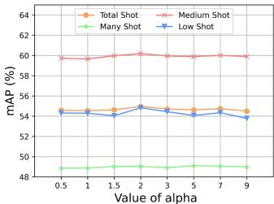

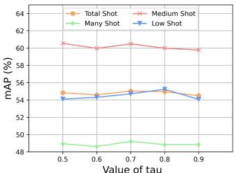  
(a) mAp of different α  
(b) mAp of different tau

Figure 3: Ablations with respect to coefficient α and τ.  
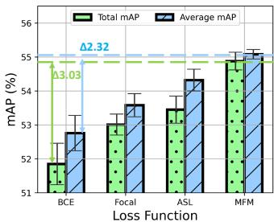

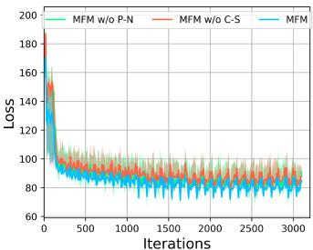  
(a) Performance Comparison of Losses  
(b) Loss Visualization  
Figure 4: MLT-MLC results using different losses.

## 4.3. Ablation Study

Effectiveness of Each Component. We conduct an ablation study to illustrate the effectiveness of each component in Table 2. Comparing COMIC and COMIC(-RLC) (Row 1 v.s

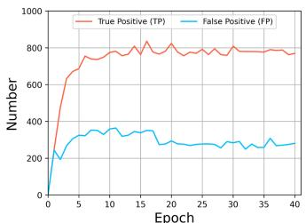  
(a) Number of TP and FP

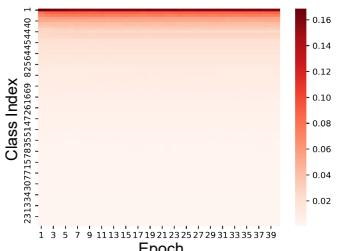  
(b) Dynamic Distribution Heat Map  
Figure 5: In-depth analysis of label correction.

Table 4: Ablation of MFM. ↓ indicates the mAP decay.
<table><tr><td colspan="2">MFM Factor</td><td colspan="4">PLT-COCO Dataset</td></tr><tr><td>P-N</td><td>H-T</td><td>Total Shot</td><td>Many Shot</td><td>Medium Shot</td><td>Low Shot</td></tr><tr><td></td><td>0</td><td>54.44 (↓ 0.64)</td><td> $4 8 . 6 5 \ : ( \downarrow 0 . 5 6 )$ </td><td> $6 0 . 0 0 \left( \downarrow 0 . 0 8 \right)$ </td><td>53.81 (↓ 1.55 )</td></tr><tr><td>0</td><td></td><td> $5 3 . 7 0 \left( \downarrow 1 . 3 8 \right)$ </td><td> $4 8 . 3 8 \left( \downarrow 0 . 8 3 \right)$ </td><td> $5 8 . 9 9 ( \downarrow 1 . 0 9 )$ </td><td> $5 2 . 9 1 \ ( \downarrow 2 . 4 5 )$ </td></tr><tr><td>0</td><td>0</td><td>55.08</td><td>49.21</td><td>60.08</td><td>55.36</td></tr></table>

Row 4), the label (Correction) mechanism contributes 0.38% improvement on total mAP. The results of Row 2 show the mAP improvement of the MFM (Modification). Meanwhile, Row 3 indicates that it suffers from noticeable performance degradation without the (Balance) learning. To sum up, we can observe that the improvement of each module is distinguishable. Combining all the components, our COMIC exhibits steady improvement over the baselines.

Ablation of Missing Rate. To study the effect of partial labels that affect COMIC’s results, we evaluate the performance under different missing rates (MR) of labels (from 0% ∼ 50%). Not surprisingly, when the MR decreases, the accuracy of COMIC increases on all the metrics. We also find that the performance gap between different shots is consistently small in all MR settings. The results demonstrate the generalizability of the proposed COMIC that it can produce stable and balanced results under different MR settings.

Hyperparameter α and τ . We investigate the impact of hyper-parameter α and τ for the PLT-MLC task. The mAPs of different hyper-parameter settings on PLT-COCO are shown in Figure 3. This figure suggests that the optimal choices of α and τ are around 2 and 0.7, respectively. Either increasing or decreasing these values results in performance decay.

## 4.4. In-Depth Analysis

We further validate several vital issues of the proposed Correction → ModificatIon → Balance learning paradigm by answering the three questions as follows.

Q1: Can the model trust the recalled labels distinguished by RLC? To build the insight on the effectiveness of the label correction mechanism in COMIC, we visualize the true positive (TP) and false positive (FP) in Figure 5(a)). This figure suggests that the RLC module can distinguish a large number of missing labels with high prediction confidence in the early training stage, meanwhile, sum(TP) ≫ sum(FP). However, Figure 5(b) of corrected samples also reveals LT class distribution with respect to the original training set. To address this issue, we dynamically adjust the sample weight conditioned on the real-time distribution to produce a stable performance.

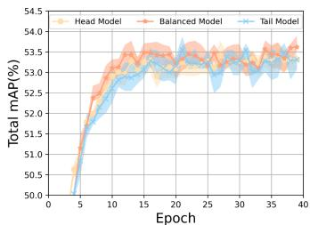  
(a) Separate Training

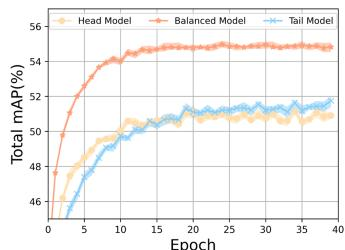  
(b) Joint Training

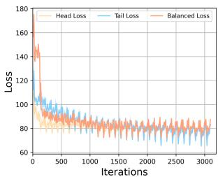  
(c) Loss Visualization

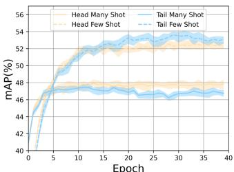  
(c) Head v.s Tail  
Figure 6: Analysis of balanced learning of COMIC. (a) and (b) depict the total mAP of separate and joint training of COMIC within the 40 epochs. (c) summarizes the loss visualization of head, balanced and tail models with joint training. (d) demonstrates head and tail models respectively optimize the head and tail class’s performance

Q2: How does the MFM module affect the PLT-MLC performance? Here, we evaluate the effectiveness of the multi-focal modifier (MFM) loss compared with different loss functions. Figure 4(a) shows the loss ablation results using different losses in our COMIC. Our developed MFM outperforms existing losses, as the designed loss considers the key point of the head-tail and positive-negative imbalance under the extreme LT distribution in the PLT-MLC task. There are two components in MFM, which are the positive-negative (P-N) factor and head-tail (H-T) factor. To demonstrate the effect of each component, we train the model with the individual factor in the proposed MFM. As shown in Table. 4, both the P-N factor and the H-T factor play significant roles in MFM. For the H-T factor, it achieves an improvement from 53.7% mAP to 55.08% mAP. Meanwhile, it brings a significant gain on tail categories with 2.45% mAP improvement, indicating its effectiveness to alleviate the severe positive-negative imbalance problems in the LT class distribution. As for the P-N factor, it brings a steady boost on all shot settings which means it can further alleviate the positive-negative issue. Additionally, Figure 4(b) indicates that the MFM loss decreases faster and smoother than the two variants of MFM without different factors, demonstrating its superiority in the PLT-MLC task further.

Q3: How does the HTB module benefit the balanced learning? We systematically present the explicit benefits of the balanced learning strategy in multi-view. 1) Figure 6 (a) and (b) show the comparison between separate and joint training of head, balanced and tail model with respect to the total mAP on PLT-COCO dataset. An interesting phenomenon is that the detached head and tail models slightly outperform the joint head and tail models but suffer from an unstable performance. In contrast, the accuracy of the joint trained balanced model increases much faster and smoother than the detached balanced model which also yields a stable performance and faster convergence speed. This phenomenon is reasonable as the main optimization objective in joint training is to improve the balanced model’s performance. It can be regarded as the knowledge distillation effect that enables the balanced model to learn from the head biased and tail biased model, and this in turn facilitates the PLT-MLC learning. 2) During the competition of head v.s tail, the head model’s loss drops faster (shown in Figure 6 (c)) and is biased to optimizing the head samples, while the tail model produces an opposite result. Such head and tail biased results form a foundation that enables our COMIC to be trained in a balanced and stable learning effect. 3) We also perform the analysis of the different balanced learning blocks in our COMIC. As presented in Table 6 (in the Appendix), the DL, NC and AMV contribute 0.05%, 1.08% and 0.37% improvement on total shot mAP. The observations and analysis verify the effectiveness of balanced learning for being able to study from the head and tail models, thereby achieving the PLT-MLC improvement.

## 5. Conclusions

We have presented a fire-new task called PLT-MLC and correspondingly developed a novel framework, named COMIC. COMIC simultaneously addresses the partial labeling and long-tailed environments in a Correction → Modification → Balance learning manner. On two newly proposed benchmarks, PLT-COCO and PLT-VOC, we demonstrate that the proposed framework significantly outperforms existing MLC, LT-MLC and PL-MLC approaches.

Acknowledgement This research is supported by Singapore Ministry of Education Academic Research Fund Tier 3 under MOE’s official grant number MOE2017-T3-1-007, Zhejiang NSF (LR21F020004), the NSFC (No. 62272411), Alibaba-Zhejiang University Joint Research Institute of Frontier Technologies, and Ant Group.

## References

[1] Dzmitry Bahdanau, Kyunghyun Cho, and Yoshua Bengio. Neural machine translation by jointly learning to align and translate. arXiv preprint arXiv:1409.0473, 2014.

[2] Emanuel Ben-Baruch, Tal Ridnik, Itamar Friedman, Avi Ben-Cohen, Nadav Zamir, Asaf Noy, and Lihi Zelnik-Manor. Multi-label classification with partial annotations using classaware selective loss. In Proceedings of the IEEE/CVF Conference on Computer Vision and Pattern Recognition, pages 4764–4772, 2022.

[3] Emanuel Ben-Baruch, Tal Ridnik, Nadav Zamir, Asaf Noy, Itamar Friedman, Matan Protter, and Lihi Zelnik-Manor. Asymmetric loss for multi-label classification. arXiv preprint arXiv:2009.14119, 2020.

[4] Serhat Selcuk Bucak, Rong Jin, and Anil K Jain. Multi-label learning with incomplete class assignments. In CVPR 2011, pages 2801–2808. IEEE, 2011.

[5] Zhao-Min Chen, Xiu-Shen Wei, Peng Wang, and Yanwen Guo. Multi-label image recognition with graph convolutional networks. In Proceedings of the IEEE/CVF conference on computer vision and pattern recognition, pages 5177–5186, 2019.

[6] Michele Donini, Luca Oneto, Shai Ben-David, John S Shawe-Taylor, and Massimiliano Pontil. Empirical risk minimization under fairness constraints. Advances in neural information processing systems, 31, 2018.

[7] Thibaut Durand, Nazanin Mehrasa, and Greg Mori. Learning a deep convnet for multi-label classification with partial labels. In Proceedings of the IEEE/CVF conference on computer vision and pattern recognition, pages 647–657, 2019.

[8] Mark Everingham, Luc Van Gool, Christopher KI Williams, John Winn, and Andrew Zisserman. The pascal visual object classes (voc) challenge. International journal of computer vision, 88(2):303–338, 2010.

[9] Spyros Gidaris and Nikos Komodakis. Dynamic few-shot visual learning without forgetting. In Proceedings of the IEEE conference on computer vision and pattern recognition, pages 4367–4375, 2018.

[10] Hao Guo and Song Wang. Long-tailed multi-label visual recognition by collaborative training on uniform and rebalanced samplings. In Proceedings of the IEEE/CVF Conference on Computer Vision and Pattern Recognition, pages 15089–15098, 2021.

[11] Kaiming He, Xiangyu Zhang, Shaoqing Ren, and Jian Sun. Deep residual learning for image recognition. In Proceedings of the IEEE conference on computer vision and pattern recognition, pages 770–778, 2016.

[12] Armand Joulin, Laurens van der Maaten, Allan Jabri, and Nicolas Vasilache. Learning visual features from large weakly supervised data. In European Conference on Computer Vision, pages 67–84. Springer, 2016.

[13] Bingyi Kang, Saining Xie, Marcus Rohrbach, Zhicheng Yan, Albert Gordo, Jiashi Feng, and Yannis Kalantidis. Decoupling representation and classifier for long-tailed recognition. arXiv preprint arXiv:1910.09217, 2019.

[14] Diederik P Kingma and Jimmy Ba. Adam: A method for stochastic optimization. arXiv preprint arXiv:1412.6980, 2014.

[15] Dong-Hyun Lee et al. Pseudo-label: The simple and efficient semi-supervised learning method for deep neural networks. In Workshop on challenges in representation learning, ICML, volume 3, page 896, 2013.

[16] Juncheng Li, Minghe Gao, Longhui Wei, Siliang Tang, Wen qiao Zhang, Mengze Li, Wei Ji, Qi Tian, Tat-Seng Chua, and Yueting Zhuang. Gradient-regulated meta-prompt learning for generalizable vision-language models. 2023.

[17] Juncheng Li, XIN HE, Longhui Wei, Long Qian, Linchao Zhu, Lingxi Xie, Yueting Zhuang, Qi Tian, and Siliang Tang. Finegrained semantically aligned vision-language pre-training. In Advances in Neural Information Processing Systems, 2022.

[18] Juncheng Li, Kaihang Pan, Zhiqi Ge, Minghe Gao, Hanwang Zhang, Wei Ji, Wenqiao Zhang, Tat-Seng Chua, Siliang Tang, and Yueting Zhuang. Empowering vision-language models to follow interleaved vision-language instructions, 2023.

[19] Juncheng Li, Siliang Tang, Linchao Zhu, Wenqiao Zhang, Yi Yang, Tat-Seng Chua, and Fei Wu. Variational crossgraph reasoning and adaptive structured semantics learning for compositional temporal grounding. IEEE Transactions on Pattern Analysis and Machine Intelligence, 2023.

[20] Juncheng Li, Xin Wang, Siliang Tang, Haizhou Shi, Fei Wu, Yueting Zhuang, and William Yang Wang. Unsupervised reinforcement learning of transferable meta-skills for embodied navigation. In Proceedings ofthe IEEE/CVF Conference on Computer Vision and Pattern Recognition, pages 12123– 12132, 2020.

[21] Li-Jia Li and Li Fei-Fei. Optimol: automatic online picture collection via incremental model learning. International journal of computer vision, 88(2):147–168, 2010.

[22] Mengze Li, Han Wang, Wenqiao Zhang, Jiaxu Miao, Zhou Zhao, Shengyu Zhang, Wei Ji, and Fei Wu. Winner: Weaklysupervised hierarchical decomposition and alignment for spatio-temporal video grounding. In Proceedings of the IEEE/CVF Conference on Computer Vision and Pattern Recognition, pages 23090–23099, 2023.

[23] Mengze Li, Tianbao Wang, Jiahe Xu, Kairong Han, Shengyu Zhang, Zhou Zhao, Jiaxu Miao, Wenqiao Zhang, Shiliang Pu, and Fei Wu. Multi-modal action chain abductive reasoning. In Proceedings ofthe 61st Annual Meeting ofthe Associationfor Computational Linguistics (Volume 1: Long Papers), pages 4617–4628, 2023.

[24] Mengze Li, Tianbao Wang, Haoyu Zhang, Shengyu Zhang, Zhou Zhao, Jiaxu Miao, Wenqiao Zhang, Wenming Tan, Jin Wang, Peng Wang, et al. End-to-end modeling via information tree for one-shot natural language spatial video grounding. In Proceedings ofthe 60th Annual Meeting ofthe Associationfor Computational Linguistics (Volume 1: Long Papers), pages 8707–8717, 2022.

[25] Mengze Li, Tianbao Wang, Haoyu Zhang, Shengyu Zhang, Zhou Zhao, Wenqiao Zhang, Jiaxu Miao, Shiliang Pu, and Fei Wu. Hero: Hierarchical spatio-temporal reasoning with contrastive action correspondence for end-to-end video object grounding. In Proceedings of the 30th ACM International Conference on Multimedia, pages 3801–3810, 2022.

[26] Tsung-Yi Lin, Priya Goyal, Ross Girshick, Kaiming He, and Piotr Dollár. Focal loss for dense object detection. In Proceedings ofthe IEEE international conference on computer vision, pages 2980–2988, 2017.

[27] Tsung-Yi Lin, Michael Maire, Serge Belongie, James Hays, Pietro Perona, Deva Ramanan, Piotr Dollár, and C Lawrence Zitnick. Microsoft coco: Common objects in context. In European conference on computer vision, pages 740–755. Springer, 2014.

[28] Ziwei Liu, Zhongqi Miao, Xiaohang Zhan, Jiayun Wang, Boqing Gong, and Stella X Yu. Large-scale long-tailed recognition in an open world. In Proceedings of the IEEE/CVF Conference on Computer Vision and Pattern Recognition, pages 2537–2546, 2019.

[29] SGOPAL Patro and Kishore Kumar Sahu. Normalization: A preprocessing stage. arXiv preprint arXiv:1503.06462, 2015.

[30] William J Reed. The pareto, zipf and other power laws. Economics letters, 74(1):15–19, 2001.

[31] Yu-Yin Sun, Yin Zhang, and Zhi-Hua Zhou. Multi-label learning with weak label. In Twenty-fourth AAAI conference on artificial intelligence, 2010.

[32] Ilya Sutskever, James Martens, George Dahl, and Geoffrey Hinton. On the importance of initialization and momentum in deep learning. In International conference on machine learning, pages 1139–1147. PMLR, 2013.

[33] Kaihua Tang, Jianqiang Huang, and Hanwang Zhang. Longtailed classification by keeping the good and removing the bad momentum causal effect. Advances in Neural Information Processing Systems, 33:1513–1524, 2020.

[34] Grigorios Tsoumakas and Ioannis Katakis. Multi-label classification: An overview. International Journal ofData Warehousing and Mining (IJDWM), 3(3):1–13, 2007.

[35] Ashish Vaswani, Noam Shazeer, Niki Parmar, Jakob Uszkoreit, Llion Jones, Aidan N Gomez, Łukasz Kaiser, and Illia Polosukhin. Attention is all you need. Advances in neural information processing systems, 30, 2017.

[36] Jonatas Wehrmann, Ricardo Cerri, and Rodrigo Barros. Hierarchical multi-label classification networks. In International conference on machine learning, pages 5075–5084. PMLR, 2018.

[37] Tong Wu, Qingqiu Huang, Ziwei Liu, Yu Wang, and Dahua Lin. Distribution-balanced loss for multi-label classification in long-tailed datasets. In European Conference on Computer Vision, pages 162–178. Springer, 2020.

[38] Pengcheng Yang, Xu Sun, Wei Li, Shuming Ma, Wei Wu, and Houfeng Wang. Sgm: sequence generation model for multi-label classification. arXiv preprint arXiv:1806.04822, 2018.

[39] Hsiang-Fu Yu, Prateek Jain, Purushottam Kar, and Inderjit Dhillon. Large-scale multi-label learning with missing labels. In International conference on machine learning, pages 593– 601. PMLR, 2014.

[40] Wenqiao Zhang, Changshuo Liu, Can Cui, and Beng Chin Ooi. Causal and collaborative proxy-tasks learning for semi-supervised domain adaptation. arXiv preprint arXiv:2303.17526, 2023.

[41] Wenqiao Zhang, Haochen Shi, Jiannan Guo, Shengyu Zhang, Qingpeng Cai, Juncheng Li, Sihui Luo, and Yueting Zhuang. Magic: Multimodal relational graph adversarial inference for diverse and unpaired text-based image captioning. In Proceedings ofthe AAAI Conference on Artificial Intelligence, volume 36, pages 3335–3343, 2022.

[42] Wenqiao Zhang, Siliang Tang, Yanpeng Cao, Shiliang Pu, Fei Wu, and Yueting Zhuang. Frame augmented alternat ing attention network for video question answering. IEEE Transactions on Multimedia, 22(4):1032–1041, 2019.

[43] Wenqiao Zhang, Lei Zhu, James Hallinan, Shengyu Zhang, Andrew Makmur, Qingpeng Cai, and Beng Chin Ooi. Boostmis: Boosting medical image semi-supervised learning with adaptive pseudo labeling and informative active annotation. In Proceedings of the IEEE/CVF Conference on Computer Vision and Pattern Recognition, pages 20666–20676, 2022.

[44] Youcai Zhang, Yuhao Cheng, Xinyu Huang, Fei Wen, Rui Feng, Yaqian Li, and Yandong Guo. Simple and robust loss design for multi-label learning with missing labels. arXiv preprint arXiv:2112.07368, 2021.

[45] Zhilu Zhang and Mert Sabuncu. Generalized cross entropy loss for training deep neural networks with noisy labels. Advances in neural information processing systems, 31, 2018.

[46] Pengfei Zhu, Qian Xu, Qinghua Hu, Changqing Zhang, and Hong Zhao. Multi-label feature selection with missing labels. Pattern Recognition, 74:488–502, 2018.