# Learning to Generate Semantic Layouts for Higher Text-Image Correspondence in Text-to-Image Synthesis

Minho Park\*, Jooyeol Yun\*, Seunghwan Choi, Jaegul Choo Korea Advanced Institute of Science and Technology (KAIST) Daejeon, Korea

{m.park, blizzard072, shadow2496, jchoo}@kaist.ac.kr

## Abstract

Existing text-to-image generation approaches have set high standards for photorealism and text-image correspondence, largely benefiting from web-scale text-image datasets, which can include up to 5 billion pairs. However, text-to-image generation models trained on domainspecific datasets, such as urban scenes, medical images, and faces, still suffer from low text-image correspondence due to the lack of text-image pairs. Additionally, collecting billions of text-image pairs for a specific domain can be time-consuming and costly. Thus, ensuring high text-image correspondence without relying on web-scale text-image datasets remains a challenging task. In this paper, we present a novel approach for enhancing text-image correspondence by leveraging available semantic layouts. Specifically, we propose a Gaussiancategorical diffusion process that simultaneously generates both images and corresponding layout pairs. Our experiments reveal that we can guide text-to-image generation models to be aware of the semantics of different image regions, by training the model to generate semantic labels for each pixel. We demonstrate that our approach achieves higher text-image correspondence compared to existing text-to-image generation approaches in the Multi-Modal CelebA-HQ and the Cityscapes dataset, where text-image pairs are scarce. Codes are available at https://pmh9960.github.io/research/GCDP.

## 1. Introduction

Text-to-image generation aims to materialize text descriptions into images, where the main challenge comes from ensuring high image quality and correspondence between input text and output images. While texts convey intuitive semantic depictions of images, they often lack detailed spatial descriptions. For example, text descriptions such as “A woman is wearing earrings." do not describe where the earrings are located within the image. Thus, when a small number of text-image pairs are given, it is challenging for a generative model to learn what part of the image corresponds to which words in the text.

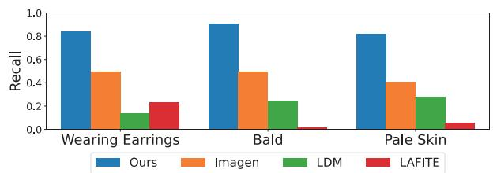  
Figure 1. Recall of facial attributes specified in the text descriptions. Text-to-image generation approaches trained on a subset of the Multi-Modal CelebA-HQ [17,22] often fail to reflect text conditions. Facial attributes are classified with a pretrained attribute classifier [30].

Overcome this hurdle, recent text-to-image generation approaches [28, 29, 31, 32] leverage web-scale text-image datasets [29, 33] containing up to 5 billion text-image pairs. With access to such data, generative models can fully learn the correspondence between input texts and output images and synthesize photorealistic images while properly reflecting text descriptions.

However, the cost of such large-scale training remains a major obstacle, often requiring weeks of training even with hundreds of GPUs, which limits participation in the subject to only a few researchers. Moreover, when generating images in a specific domain, such as faces or urban scenes, collecting billions of text-image pairs can be challenging due to the difficulties in collecting images. Even with a generalpurpose pretrained model, finetuning on datasets with large domain gaps (e.g., urban scenes or medical images) leads to poor image quality and low text-image correspondence. Recent text-to-image models trained on specific domains often fail to reflect text conditions in the absence of web-scale text-image pairs. To examine the issue in data-scarce scenarios, we evaluate text-to-image generation models trained on a subset of the Multi-Modal CelebA-HQ [17,22] dataset. As shown in Figure 1, existing models struggle to generate certain attributes specified in the given text conditions. Thus, ensuring high text-image correspondence remains a challenge for domain-specific generation.

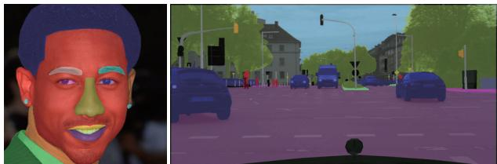

In this paper, we present a novel approach to achieve high text-image correspondence for domain-specific textto-image generation by leveraging semantic layouts. Rather than solely generating images based on text descriptions, we propose to concurrently generate both images and their corresponding semantic layouts. To this end, we design a Gaussian-categorical diffusion process that models the joint distribution of image-layout pairs. To the best of our knowledge, this is the first approach to combine Gaussian and categorical diffusion processes into a unified diffusion process. By generating semantic labels for each pixel in the image, our generative model can learn the semantics of different parts of the image, allowing it to effectively learn which text descriptions correspond to which locations in the image, even with limited text-image pairs.

We experiment our approach on subsets of the Multi-Modal CelebA-HQ [19, 22] to simulate cases where textimage pairs are limited and semantic layouts are available. We also add text descriptions to the Cityscapes dataset [6] to evaluate text-to-image generation in complex scenes with multiple objects, where learning text-image correspondence can be challenging. Our experiments and analyses reveal that modeling the joint image-layout distribution can effectively facilitate text-to-image generation models to achieve high text-image correspondence when web-scale text-image pairs are unavailable. We also demonstrate potential applications of the Gaussian-categorical diffusion models in semantic image synthesis and semantic segmentation, through cross-modal outpainting.

Our contributions are threefold:

• We define a Gaussian-categorical diffusion process for modeling joint image-layout distributions, which is the first approach to unify two diffusion processes for image-layout generation.

• Our experiments reveal that generating image-layout pairs can be a practical alternative to increase textimage correspondence in circumstances where collecting web-scale text-image pairs is infeasible.

• We present cross-modal outpainting, which demonstrates that Gaussian-categorical diffusion models are also capable of modeling conditional distributions for semantic image synthesis and semantic segmentation.

## 2. Related work

Text-to-image generation. Text-to-image generation [39, 40, 42, 43] have consistently advanced over the years benefiting from large pretrained text encoders [27, 29] and generative models [8, 12, 29]. Recent approaches [25, 28, 31, 32] tackle zero-shot text-to-image generation by training diffusion-based generative models on web-scale textimage datasets, such as the LAION-5B [33] or the DALL-E dataset [29], which scale from 250M to 5B text-image

“He is wearing earrings. He has high cheekbones, and goatee. He is smiling."

“An image of an urban street view with Poles, Sidewalks, People, Bicycles, Traffic signs, Cars, Buildings, Vegetations, Walls, Riders, Roads, Skies, Traffic lights and Terrains."

Figure 2. Samples of image, text, and layout triplets from the MM CelebA-HQ [17, 19, 22] and the Cityscapes dataset [6].

pairs. While zero-shot text-to-image generation can synthesize realistic images given general text descriptions, these approaches heavily rely on the large number of text-image pairs used for training to achieve high text-image correspondence. Thus, when these models are trained on specific datasets (e.g., MM CelebA-HQ [17, 19, 22, 38]) to generate images within a certain domain, they often fail to satisfy the given text conditions as seen in Figure 1. Collecting enough text-image pairs for a specific domain to ensure high text-image correspondence may be overly expensive since obtaining text descriptions often require human captioning. In this paper, we present an alternative approach for enhancing text-image correspondence without additional textimage pairs by leveraging semantic layouts.

Generating image-layout pairs. Modeling the joint image-layout distribution p(x, y) is an emerging field in image synthesis, where the goal is to generate both the image x and the corresponding semantic layout y. For the purpose of training semantic segmentation models with strong data augmentation, DatasetGAN [41] and Dataset-DDPM [3] represent the joint image-layout distribution as a composition of two models: an image generation model p(x) and a classifier p (y | x). During inference, the internal representations of p(x) (i.e., feature maps) are used as inputs of p (y | x), which then classifies each pixel to obtain an image-layout pair.

On the other hand, SB-GAN [2] and Semantic Palette [18] discover that joint modeling of the image-layout distribution can be advantageous for generating complex scenes. Specifically, they decompose the generation process into two steps, a layout generation step p(y) followed by a conditional image generation step p (x | y) given the generated layout. The authors argue that generating layouts with appropriate class proportions can effectively facilitate the scene generation process.

SemanticGAN [20] models p(x, y) with a single GAN [8] in the pursuit of semantic segmentation with outof-domain generalization. The results demonstrate that images and layouts can exhibit high alignment when generated through a single model.

In this work, we propose a Gaussian-categorical diffusion process to model $p ( x , y )$ with a single diffusion process. Our joint image-layout generation model is extended to the text-to-image generation task, where we achieve high text-image correspondence without requiring webscale text-image datasets. Specifically, we provide analyses demonstrating that our model is aware of the semantics of the generated image and properly reflects the text conditions.

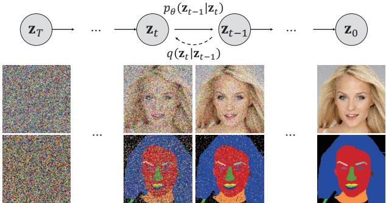  
Figure 3. Illustration of the Gaussian-categorical diffusion process on the image-layout distribution of MM CelebA-HQ [19, 22].

Diffusion process in arbitrary domains. Diffusion models [7, 12, 24, 35] synthesize data $\mathbf { x } _ { \mathrm { 0 } }$ in an iterative manner by repeatedly denoising pure noise $\mathbf { x } _ { T } .$ In image generation, the forward noising process $q \left( \mathbf { x } _ { t } \mid \mathbf { x } _ { t - 1 } \right)$ and the reverse denoising process pθ $\left( \mathbf { x } _ { t - 1 } \mid \mathbf { x } _ { t } \right)$ are defined using a predefined noise schedule $\beta _ { t }$

$$
q \left( \mathbf { x } _ { t } \mid \mathbf { x } _ { t - 1 } \right) : = \mathcal { N } ( \mathbf { x } _ { t } ; \sqrt { 1 - \beta _ { t } } \mathbf { x } _ { t - 1 } , \beta _ { t } \pmb { I } ) ,\tag{1}
$$

$$
p _ { \theta } \left( \mathbf { x } _ { t - 1 } \mid \mathbf { x } _ { t } \right) : = \mathcal { N } ( \mathbf { x } _ { t - 1 } ; \pmb { \mu } _ { \theta } ( \mathbf { x } _ { t } ) , \sigma _ { t } ^ { 2 } \pmb { I } ) ,\tag{2}
$$

where $t \in [ 1 , 2 , . . . , T ]$

Since the true reverse process $q \left( \mathbf { x } _ { t - 1 } \mid \mathbf { x } _ { t } \right)$ is intractable, the reverse process is approximated by minimizing the KL divergence with the posterior $q \left( \mathbf { x } _ { t - 1 } \mid \mathbf { x } _ { t } , \mathbf { x } _ { 0 } \right)$ with

$$
L _ { t } = D _ { \mathrm { K L } } ( q \left( \mathbf { x } _ { t - 1 } \mid \mathbf { x } _ { t } , \mathbf { x } _ { 0 } \right) \parallel p _ { \theta } \left( \mathbf { x } _ { t - 1 } \mid \mathbf { x } _ { t } \right) ) .\tag{3}
$$

To extend diffusion processes to categorical data [1, 15] such as text or semantic labels, a categorical noise is defined for the forward process, and the denoising diffusion process is constructed in a similar manner. For instance, Hoogeboom et al. [15] defines a categorical noise as

$$
\begin{array} { r l } & { q \left( \mathbf { x } _ { t } \mid \mathbf { x } _ { t - 1 } \right) : = { \mathcal { C } } ( \mathbf { x } _ { t } ; ( 1 - \beta _ { t } ) \mathbf { x } _ { t - 1 } + \beta _ { t } / K ) , } \\ & { ~ p _ { \theta } \left( \mathbf { x } _ { t - 1 } \mid \mathbf { x } _ { t } \right) : = { \mathcal { C } } ( \mathbf { x } _ { t - 1 } ; \mathbf { \Theta } _ { \theta } ( \mathbf { x } _ { t } ) ) , } \end{array}\tag{4}
$$

(5)

where C denotes a categorical distribution, $K$ is the number of categories, and Θ is the probability mass function (PMF) of the categorical distribution.

The key idea for defining a diffusion process in a certain distribution is to define a forward noising process $q \left( \mathbf { x } _ { t } \mid \mathbf { x } _ { t - 1 } \right)$ and derive a posterior $q \left( \mathbf { x } _ { t - 1 } \mid \mathbf { x } _ { t } , \mathbf { x } _ { 0 } \right)$ . In the following section, we define the forward and reverse processes of the Gaussian-categorical distribution, which can model the joint distribution of image-layout pairs.

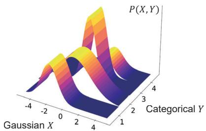  
Figure 4. Visualization of a Gaussian-categorical distribution with a single variable $( N = 1 , M = 1 , K = 4 ,$ and $S = 4 )$

## 3. Method

## 3.1. Gaussian-categorical distribution

In this section, we define the joint distribution of the Gaussian variable X and categorical variable Y. We parameterize the Gaussian-categorical distribution as follows,

$$
\begin{array} { r } { \left( X , Y \right) \sim \mathcal { N C } \left( \mathbf { x } , \mathbf { y } ; \pmb { \mu } , \pmb { \Sigma } , \pmb { \Theta } \right) , \qquad } \\ { X = \left[ X _ { 1 } , X _ { 2 } , . . . , X _ { N } \right] \in \mathbb { R } ^ { N } , \qquad } \\ { Y = \left[ Y _ { 1 } , Y _ { 2 } , . . . , Y _ { M } \right] \in \left\{ 1 , 2 , . . . , K \right\} ^ { M } \subset \mathbb { R } ^ { M } , } \\ { \pmb { \mu } \in \mathbb { R } ^ { S \times N } , \pmb { \Sigma } \in \mathbb { R } ^ { S \times N \times N } , \pmb { \Theta } \in \mathbb { R } ^ { M \times K } . } \end{array}\tag{6}
$$

Here, $\mu , \Sigma$ are the mean and variance of the Gaussian distribution, and Θ is the probability mass function (PMF) of the categorical distribution. Also, K is the number of possible states for $Y _ { i }$ and $S = K ^ { M }$ is the total number of states of $Y$ . It is worth noting that the dimensions of $\pmb { \mu }$ and $\pmb { \Sigma }$ which indicates that there is a Gaussian mean and variance for all possible categorical states in $Y$

The joint distribution of two random variables can be written as a product of a conditional and marginal distribution. Therefore, we can also express the Gaussiancategorical distribution as

$$
\begin{array} { c } { \mathcal { N C } ( \mathbf { x } , \mathbf { y } ;  { \boldsymbol { \mu } } , \boldsymbol { \Sigma } , \mathbf { \Theta } ) = \mathcal { C } ( \mathbf { y } ; \mathbf { \Theta } ) \cdot \mathcal { N } ( \mathbf { x } ;  { \boldsymbol { \mu } } _ { \mathbf { y } } ,  { \boldsymbol { \Sigma } } _ { \mathbf { y } } ) } \\ { \qquad \quad \mu _ { \mathbf { y } } \in \mathbb { R } ^ { N } ,  { \boldsymbol { \Sigma } } _ { \mathbf { y } } \in \mathbb { R } ^ { N \times N } . } \end{array}\tag{7}
$$

The probability density function (PDF) can be written as a weighted Gaussian distribution for each unique ${ \textbf { y } } \in$ $\{ 1 , 2 , \dot { \ldots } , K \} ^ { M }$ as

$$
\begin{array} { c } { \mathcal { N C } ( \mathbf { x } , \mathbf { y } ; \pmb { \mu } , \pmb { \Sigma } , \mathbf { \Theta } , \mathbf { \Theta } ) = \left( \displaystyle \prod _ { i = 1 } ^ { M } \Theta _ { i , \mathbf { y } _ { i } } \right) ( 2 \pi ) ^ { - \frac { N } { 2 } } \left| \pmb { \Sigma } _ { \mathbf { y } } \right| ^ { - \frac { 1 } { 2 } } } \\ { \displaystyle \exp \Big ( - \frac { 1 } { 2 } ( \mathbf { x } - \pmb { \mu } _ { \mathbf { y } } ) ^ { \top } \pmb { \Sigma } _ { \mathbf { y } } ^ { - 1 } \left( \mathbf { x } - \pmb { \mu } _ { \mathbf { y } } \right) \Big ) , } \end{array}\tag{8}
$$

where $\Theta _ { i , { \bf y } _ { i } }$ denotes the probability of $Y _ { i } = \mathbf { y } _ { i }$ , and $\mu _ { \mathbf { y } }$ $\Sigma _ { \mathbf { y } }$ indicates the mean and variance corresponding to state y, respectively.

## 3.2. Gaussian-categorical diffusion process

Similar to the diffusion process for images, we define our reverse process of image-layout distributions as a Gaussiancategorical transition with a Markov property. Specifically, we define the transition probability pθ $\left( \mathbf { z } _ { t - 1 } \mid \mathbf { z } _ { t } \right)$ as

$$
p _ { \theta } \left( \mathbf { z } _ { t - 1 } \mid \mathbf { z } _ { t } \right) : = \mathcal { N C } \left( \mathbf { z } _ { t - 1 } ; \mu _ { \theta } ( \mathbf { z } _ { t } ) , \Sigma _ { \theta } ( \mathbf { z } _ { t } ) , \Theta _ { \theta } ( \mathbf { z } _ { t } ) \right)\tag{9}
$$

where z represents the tuple $\displaystyle ( \mathbf { x } , \mathbf { y } )$ for simplicity.

We define the forward process of image-layout pairs $\mathbf { z } _ { 0 }$ under the Markov assumption as

$$
q \left( \mathbf { z } _ { t } \mid \mathbf { z } _ { t - 1 } \right) : = \mathcal { N C } \left( \mathbf { z } _ { t } ; \left[ \pmb { \mu } _ { t \mid t - 1 } \right] _ { \times S } , \left[ \pmb { \Sigma } _ { t \mid t - 1 } \right] _ { \times S } , \pmb { \Theta } _ { t \mid t - 1 } \right) ,\tag{10}
$$

$$
\begin{array} { r l } & { \pmb { \mu } _ { t | t - 1 } : = \sqrt { 1 - \beta _ { t } ^ { \mathcal { N } } } \mathbf { x } _ { t - 1 } , } \\ & { \pmb { \Sigma } _ { t | t - 1 } : = \beta _ { t } ^ { \mathcal { N } } \pmb { I } , } \\ & { \Theta _ { t | t - 1 } : = ( 1 - \beta _ { t } ^ { c } ) \mathbf { y } _ { t - 1 } + \beta _ { t } ^ { c } / K , } \end{array}
$$

where $\beta ^ { c }$ and $\beta ^ { N }$ are predefined noise schedules. We use the notation $[ \mathbf { v } ] _ { \times S }$ to indicate row-wise duplication of a vector $\mathbf { v } ( i . e . , [ \bar { \mathbf { v } } , \bar { \mathbf { v } } , . . . , \mathbf { v } ] ^ { T } )$ 1

Intuitively, the forward process is defined as independently applying the Gaussian and categorical noises following a normal distribution $\mathcal { N } ( \mathbf { 0 } , \pmb { I } )$ and a categorical distribution with uniform probability $\mathcal { C } ( 1 / K )$ , according to predefined noise schedules $\beta ^ { N } , \beta ^ { c }$ Given a large $T$ and appropriate noise schedules, the forward process leads to an isotropic Gaussian distribution and a uniform categorical distribution at the final state $\mathbf { z } _ { T }$

With $\alpha _ { t } : = 1 - \beta _ { t }$ and $\begin{array} { r } { \bar { \alpha } _ { t } : = \prod _ { s = 1 } ^ { t } \alpha _ { s } , } \end{array}$ we can derive a forward process to an arbitrary timestep as

$$
q \left( \mathbf { z } _ { t } \mid \mathbf { z } _ { 0 } \right) = \mathcal { N C } \left( \mathbf { z } _ { t } ; \left[ \pmb { \mu } _ { t \mid 0 } \right] _ { \times S } , \left[ \pmb { \Sigma } _ { t \mid 0 } \right] _ { \times S } , \Theta _ { t \mid 0 } \right) ,\tag{11}
$$

$$
\begin{array} { r l } & { \pmb { \mu } _ { t | 0 } : = \sqrt { \bar { \alpha } _ { t } ^ { N } } \mathbf { x } _ { 0 } , } \\ & { \pmb { \Sigma } _ { t | 0 } : = ( 1 - \bar { \alpha } _ { t } ^ { N } ) \pmb { I } , } \\ & { \pmb { \Theta } _ { t | 0 } : = ( 1 - \bar { \alpha } _ { t } ^ { c } ) \mathbf { y } _ { 0 } + \bar { \alpha } _ { t } ^ { c } / K . } \end{array}
$$

Finally, using Bayes theorem, we can derive the posterior $q \left( \mathbf { z } _ { t - 1 } \mid \mathbf { z } _ { t } , \mathbf { z } _ { 0 } \right)$ , which is summarized into the following form of a Gaussian-categorical distribution

$$
q \left( \mathbf { z } _ { t - 1 } \mid \mathbf { z } _ { t } , \mathbf { z } _ { 0 } \right) = \mathcal { N C } \left( \mathbf { z } _ { t - 1 } ; \left[ \widetilde { \pmb { \mu } } _ { t } \right] _ { \times S } , \left[ \widetilde { \pmb { \Sigma } } _ { t } \right] _ { \times S } , \widetilde { \pmb { \Theta } } _ { t } \right) ,\tag{12}
$$

$$
\begin{array} { c } { \displaystyle \widetilde { \mu } _ { t } : = \frac { \sqrt { \bar { \alpha } _ { t - 1 } ^ { N } } \beta _ { t } ^ { N } } { 1 - \bar { \alpha } _ { t } ^ { N } } \mathbf { x } _ { 0 } + \frac { \sqrt { \alpha _ { t } ^ { N } } ( 1 - \bar { \alpha } _ { t - 1 } ^ { N } ) } { 1 - \bar { \alpha } _ { t } ^ { N } } \mathbf { x } _ { t } , } \\ { \widetilde { \Sigma } _ { t } : = \big ( ( 1 - \bar { \alpha } _ { t - 1 } ^ { N } ) \beta _ { t } ^ { N } / ( 1 - \bar { \alpha } _ { t } ^ { N } ) \big ) \pmb { I } , } \\ { \widetilde { \Theta } _ { t } : = Z [ \alpha _ { t } ^ { c } \mathbf { y } _ { t } + ( 1 - \alpha _ { t } ^ { c } ) / K ] \odot [ \bar { \alpha } _ { t } ^ { c } \mathbf { y } _ { 0 } + ( 1 - \bar { \alpha } _ { t - 1 } ^ { c } ) / K ] , } \end{array}
$$

where $Z$ is a normalizing constant and  is the elementwise product. Detailed proofs for each step are provided in the appendix.

Note that parameters µ and Σ of the posterior are expressed in terms of $ { \widetilde { \mu } } _ { t } \in  { \mathbb { R } } ^ { N }$ and $ { \widetilde { \mathbf { \Sigma } } } _ { t } ^ { \ v { } } \in \mathbb { R } ^ { N \times N }$ , which have a reduced dimensions than the original parameters in Equation (6). This is due to the definition in Equation (10), where the Gaussian noise is applied independently of the categorical variable.

We can write the variational lower bound (VLB) as

$$
L _ { \mathrm { V L B } } : = L _ { 0 } + L _ { 1 } + L _ { 2 } + . . . + L _ { T } ,\tag{13}
$$

$$
L _ { 0 } : = - \log p _ { \theta } ( \mathbf { z } _ { 0 }  \mathbf { z } _ { 1 } ) ,\tag{14}
$$

$$
L _ { t - 1 } : = D _ { K L } \big ( q \left( \mathbf { z } _ { t - 1 } \mid \mathbf { z } _ { t } , \mathbf { z } _ { 0 } \right) \big \parallel p _ { \theta } \left( \mathbf { z } _ { t - 1 } \mid \mathbf { z } _ { t } \right) \big ) ,\tag{15}
$$

$$
L _ { T } : = D _ { K L } ( q ( \mathbf { z } _ { T } \mid \mathbf { z } _ { 0 } ) \parallel p _ { \theta } ( \mathbf { z } _ { T } ) ) .\tag{16}
$$

Since the posterior $q \left( \mathbf { z } _ { t - 1 } \mid \mathbf { z } _ { t } , \mathbf { z } _ { 0 } \right)$ is parameterized by $\widetilde { \mu } _ { t }$ and $\widetilde { \pmb { \Sigma } } _ { t }$ , we can also re-parameterize pθ as

$$
p _ { \theta } \left( \mathbf { z } _ { t - 1 } \mid \mathbf { z } _ { t } \right) : = \mathcal { N C } ( \mathbf { z } _ { t - 1 } ; [ \widetilde { \pmb { \mu } } _ { \theta } ( \mathbf { z } _ { t } ) ] \times s , [ \widetilde { \pmb { \Sigma } } _ { \theta } ( \mathbf { z } _ { t } ) ] \times s , \boldsymbol { \Theta } _ { \theta } ) ,\tag{17}
$$

$$
\begin{array} { r } { \widetilde { \pmb { \mu } } _ { \theta } ( \mathbf { z } _ { t } ) \in \mathbb { R } ^ { N } , \widetilde { \pmb { \Sigma } } _ { \theta } ( \mathbf { z } _ { t } ) \in \mathbb { R } ^ { N \times N } , \Theta _ { \theta } \in \mathbb { R } ^ { M \times K } , } \end{array}\tag{18}
$$

Thus, we can predict a reduced number of parameters to minimize the KL divergence term in Equation (15),

$$
D _ { K L } \big ( q \left( \mathbf { z } _ { t - 1 } \mid \mathbf { z } _ { t } , \mathbf { z } _ { 0 } \right) \big \parallel p _ { \theta } \left( \mathbf { z } _ { t - 1 } \mid \mathbf { z } _ { t } \right) \big )\tag{19}
$$

$$
= \mathbb { E } _ { q } \Big [ \frac { 1 } { 2 \sigma _ { t } ^ { 2 } } \left. \widetilde { \pmb { \mu } } _ { t } - \widetilde { \pmb { \mu } } _ { \theta } ( \mathbf { z } _ { t } ) \right. ^ { 2 } \Big ] + D _ { \mathrm { K L } } ( \widetilde { \Theta } _ { t } \left. \Theta _ { \theta } ( \mathbf { z } _ { t } ) \right) + C ,
$$

where $C$ is a constant irrelevant to learnable parameters $\theta .$ L0 is directly minimized through a closed-form solution and $L _ { T }$ does not involve any learnable parameters.

## 3.3. Architectural design

In order to treat image-layout pairs as a single data sample, we embed the semantic layouts $( i . e . ,$ one-hot vectors) into 3-channel vectors via learnable parameters and concatenate them with images along the channel dimension $( \mathbf { z } \in \mathbb { R } ^ { N \times N \times 6 } )$ . We adopt the U-Net [24] and the Efficient U-Net [32] following existing diffusion models and modify the input/output channels for image-layout input/outputs. For text conditioning, we utilize the T5-L [27] text encoder and condition the U-Net model similarly to Imagen [32].

We follow the cascaded diffusion [13] framework to generate high-resolution image-layout pairs, which involves a sequence of an image generation model followed by a super-resolution model. We find that resizing layouts to a small resolution $( e . g . , \ 6 4 \times 6 4 )$ often damages the integrity of semantic labels due to nearest-neighbor sampling on extreme scales. Thus, we generate 128 × 128 resolution images and then upsample to 256 × 256 resolution with a Gaussian-categorical super-resolution model. The superresolution model upsamples both images and layouts following the Gaussian-categorical diffusion. We adopt the classifier-free guidance on both the generation model and the super-resolution model.

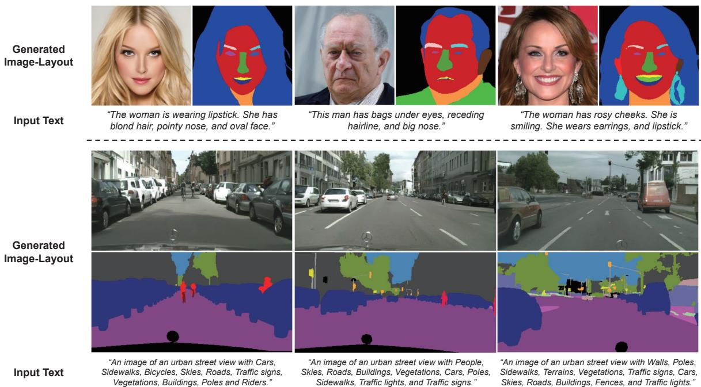  
Figure 5. Examples of text-guided generation of image-layout pairs from the Gaussian-categorical diffusion trained on MM CelebA-HQ-100 [17,22] and Cityscapes [6]. The text descriptions on the bottom are given as conditions to generate the image-label pairs.

## 4. Experiments

## 4.1. Text-image datasets

Multi-Modal CelebA-HQ. MM CelebA-HQ [17, 22, 38] is a collection of different annotations for the 30,000 images in the CelebA-HQ dataset [17, 22], including text descriptions, face attribute labels, and part-level segmentation labels. Part-level segmentation labels consist of 19 different classes (K=19) including all facial components and accessories. To train the Gaussian-categorical diffusion model, we use both the segmentation labels and the text descriptions provided in the dataset. We also construct subsets of the data, MM CelebA-HQ-25 and MM CelebA-HQ-50, by randomly selecting 25% and 50% of the images, respectively, to simulate data-scarce scenarios. We train and evaluate our models on 256 × 256 resolution images.

Cityscapes. Cityscapes [6] is an urban scene dataset with 3475 image-layout pairs of complex scenes containing multiple objects, including 20 different semantic classes (K = 20). To add text descriptions to each image, we list the class names in the following format:

## “An image of an urban scene with {classes}."

where classes are the unique class names in the corresponding semantic layout. The Cityscapes dataset presents a challenging domain for generating realistic images due to the limited number of available images and the diverse object locations in urban scenes. Since Cityscapes images have a unique aspect ratio of 2:1, we generate 512 × 256 resolution images. We include example text-image pairs in Figure 2.

## 4.2. Implementation details

For synthesizing image-layout pairs, N and M are equally set to the number of pixels in the image. Although the Gaussian-categorical diffusion process allows different noise schedules $\beta ^ { \bar { N } }$ and $\beta ^ { c }$ for images and layouts, we set both schedules to the cosine schedule [24]. We provide experiments on the effect of different noise schedules for $\beta ^ { c }$ in the supplementary section. We set T = 1000 and sample with 100 timesteps using the accelerated sampling technique [35].

## 4.3. Evaluating text-to-image generation

Text-to-image generation models are evaluated from two perspectives, image fidelity and text-image correspondence. We use the Fréchet Inception Distance (FID) [10] to measure the image fidelity. After the release of CLIP [26], the CLIP score [9] is often used to evaluate text-image correspondence for text-to-image generation. However, the CLIP score is known to have poor generalization abilities [26] when evaluating scenes with large domain gaps (i.e., Cityscapes) and also lacks interpretability in terms of understanding what element in the image causes a low or high CLIP score. In order to compensate for this drawback, we propose Semantic Recall to precisely measure the textimage correspondence for Cityscapes generation.

Semantic Recall. The Semantic Recall is analogous to the Semantic Object Accuracy (SOA) [11], which evaluates the generation of specific objects in text-to-image generation by utilizing pretrained object detectors. In our work, we use a pretrained semantic segmentation model [37] to detect the presence of classes described in text conditions. We determine that a class is detected in a generated image if it appears in the segmentation layout. The ground-truth classes for each image are identified by searching for class names in text descriptions. For example, an image generated with the text description “An urban scene with cars, roads, and traffic signs.", would be evaluated with the existence of cars, roads, and traffic signs. Therefore, we compute the Semantic Recall as the average ratio of correctly detected classes in the generated image to the total number of classes in the ground-truth layouts,

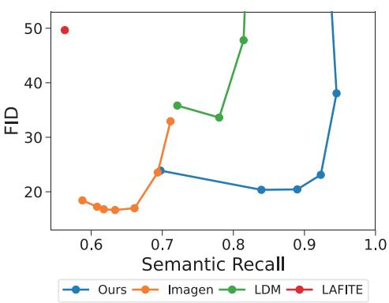  
(a) FID-Semantic Recall

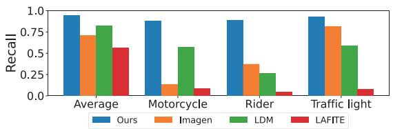

(b) Class-wise Semantic Recall  
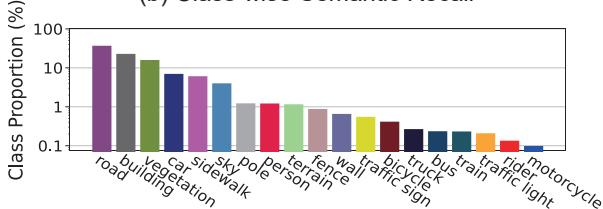  
(c) Class Proportion in Cityscapes  
Figure 6. (a) FID-Semantic Recall trade-off in the Cityscapes dataset. (b) Semantic Recall for minor classes. Semantic Recall is measured using the HRNet-w48 [37] model. (c) Proportion of each semantic class in the entire Cityscapes dataset. Class proportion is compared in log-scale for visibility

$$
{ \frac { 1 } { \mid { \mathcal { G } } \mid } } \sum _ { x _ { i } , y _ { i } \in { \mathcal { G } } } { \frac { \mid \operatorname { C l a s s e s } \sin F ( x _ { i } ) \cap \operatorname { C l a s s e s } \sin y _ { i } \mid } { \mid \operatorname { C l a s s e s } \sin y _ { i } \mid } } ,
$$

where G is the set of generated image-layout pairs $( x _ { i } , y _ { i } )$ and |· |indicates the cardinality of a given set. $F ( \cdot )$ is the pretrained semantic segmentation model [37].

Baselines. We compare our approach with state-of-theart performing diffusion-based models, Imagen [32] and the latent diffusion model (LDM) [31]. We also train a high-performing GAN-based approach Lafite [42] trained on MM CelebA-HQ and Cityscapes. For training LDM, we utilize the pretrained autoencoder from the Stable Diffusion project. Diffusion-based approaches utilize the classifierfree guidance [14] to control the performance trade-off between text-image correspondence and image fidelity. Thus, for these approaches, we sweep the guidance scale until the text-image correspondence measures saturate and report all FID-Semantic Recall or FID-CLIP score pairs.

Evaluation on Cityscapes. For the Cityscapes dataset [6], we report the FID and Semantic Recall performance tradeoff and also provide detailed recall scores for each class in Figure 6. Given the small number of text-image pairs (3475 pairs), existing text-to-image models face challenges in learning the text-image correspondence and achieving high text-image correspondence. However, the Gaussian-categorical diffusion effectively generates complex Cityscapes scenes while maintaining high Semantic Recall even with limited data. Additionally, the model achieves high recall rates for minor classes, such as the bicycle or the motorcycle class, which only constitute a small portion of the dataset. This indicates that generating semantic labels for each pixel facilitates the model to establish high text-image correspondence, especially for underrepresented classes.

Evaluation on MM CelebA-HQ. We further evaluate our method on the MM CelebA-HQ-25, 50, and 100, and report the FID-CLIP scores for each dataset. As shown in Figure 7, the Gaussian-categorical diffusion consistently outperforms existing text-to-image approaches at datasets with varying numbers of text-image pairs, exhibiting low FIDs and a high CLIP scores. We provide qualitative results of the Gaussian-categorical diffusion in Figure 5 and also compare the results with existing approaches in the supplementary material.

## 4.4. Analyzing the internal representations

In order to visualize the advantages of jointly generating image-layout pairs, we train a Gaussian diffusion model which generates images without corresponding semantic layouts. Then, we collect the internal features from the two models at different timesteps and cluster the features in an unsupervised manner with K-means clustering. As shown in Figure 8, the internal features of the Gaussiancategorical model form distinct clusters that correspond to different facial regions. Specifically, the internal features of the Gaussian-categorical diffusion model form clusters even in the early stages of generation (t = 800), correctly distinguishing hair, glasses and the background region.

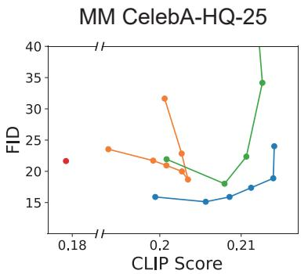

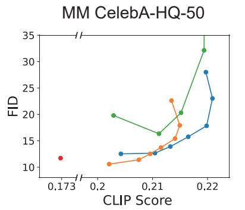

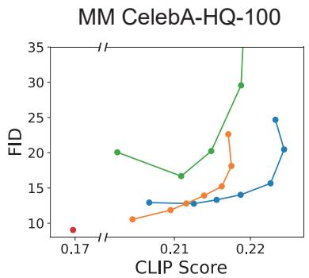

Figure 7. FID-CLIP score pairs for text-to-image generation models on different subsets of the MM CelebA-HQ dataset. The CLIP scores are measured with the ViT-L/14-336 model. The guidance scale is swept starting from 1 until saturation.  
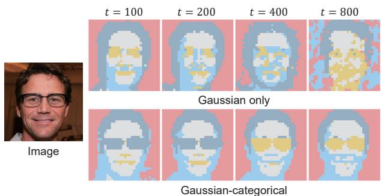  
Figure 8. Visualization of clustering results between the internal features of the Gaussian-categorical diffusion and the Gaussian diffusion.

The results reveal that the Gaussian-categorical diffusion model is highly aware of the semantics of the image during the generation process. This characteristic is advantageous in scenarios where a generative model needs to learn how to match specific parts of the image with corresponding input text descriptions, as the model is capable of understanding the semantic structure of the image. As such, training a Gaussian-categorical diffusion is a promising approach for achieving high correspondence between text descriptions and image pixels, particularly when there is a scarcity of text-image pairs available.

## 4.5. Image-layout fidelity and alignment

In this section, we evaluate whether generated images and layouts closely model the real distribution, and whether the generated pairs are semantically aligned. Following Semantic Palette [2, 18] we evaluate the image-layout alignment using the mean intersection over union (mIoU) between the generated layouts and the segmentation labels predicted by a pretrained HRNet [37]. Additionally, we use the Fréchet Segmentation Distance (FSD) [4], which replaces the Inception-V3 [36] features in the FID score [10] to pixel counts for each class, to evaluate the quality of generated layouts. Similar to the FID score, a low FSD indicates that the class distributions are close to the real distribution.

<table><tr><td>Methods</td><td>FID↓</td><td>mIoU↑</td><td>FSD↓</td></tr><tr><td>GANformer [16]</td><td>24.86</td><td></td><td>481.5</td></tr><tr><td>DatasetDDPM [3]</td><td>55.38</td><td>33.88</td><td>90.31</td></tr><tr><td>Semantic Palette [18]</td><td>52.13</td><td>53.17</td><td>48.29</td></tr><tr><td>Ours</td><td>20.36</td><td>65.80</td><td>42.22</td></tr></table>

Table 1. Image-layout alignment and FID of different Imagelayout generation approaches for scene generation in the Cityscapes [6] dataset.

We compare our results with existing unconditional image-layout generation approaches [3, 18] on the Cityscapes dataset. Additionally, we introduce a simple baseline (i.e., GANformer [16]) for image-layout generation, in which we generate images using a well-trained unconditional image generation model [16] and segment the images using a pretrained segmentation model [37]. Note that we cannot measure the mIoU for this baseline since the semantic layouts are predicted using the same pretrained network.

As shown in Table 1, the Gaussian-categorical diffusion process is highly effective in modeling the joint distribution of images and layouts even for complex urban scenes. By using a unified diffusion process, we are able to generate image-layout pairs that exhibit high alignment, closely resembling the real distribution. The ability of the Gaussian-categorical diffusion to effectively model the joint distribution of images and layouts offers promising avenues for future research in generative modeling. By leveraging the theoretical foundations established by our method, researchers can explore new approaches for dataset generation in a range of domains, from images and audios to semantic layouts and texts.

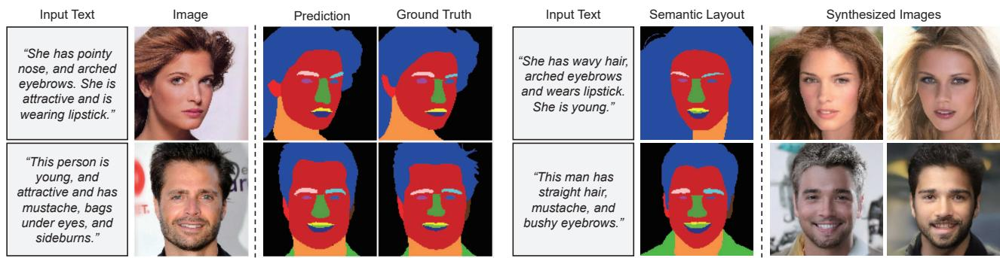  
(a) Text-guided Image-to-Layout Generation  
(b) Text-guided Layout-to-Image Generation  
Figure 9. Cross-modal outpainting for (a) text-guided image-to-layout generation and (b) text-guided layout-to-image generation. Segmentation layouts are generated with n = 1 resampling steps and images are generated with n = 5 resampling steps for each timestep.

## 4.6. Cross-modal outpainting

RePaint [23] enables existing diffusion models to inpaint a masked image by iteratively denoising the masked region given the known image (i.e., condition image). Specifically, for each timestep t, images are inpainted as follows:

$$
\begin{array} { r l } & { ~ x _ { t - 1 } ^ { \mathrm { k n o w n } } \sim \mathcal { N } ( \sqrt { \bar { \alpha } _ { t } } x _ { 0 } , ( 1 - \bar { \alpha } _ { t } ) \pmb { I } ) , } \\ & { ~ x _ { t - 1 } ^ { \mathrm { u n k n o w n } } \sim \mathcal { N } ( \pmb { \mu } _ { \theta } ( x _ { t } , t ) , \pmb { \Sigma } _ { \theta } ( x _ { t } , t ) ) , } \\ & { x _ { t - 1 } = m \odot x _ { t - 1 } ^ { \mathrm { k n o w n } } + ( 1 - m ) \odot x _ { t - 1 } ^ { \mathrm { u n k n o w n } } , } \end{array}
$$

where m is the mask for the known image. To ensure consistency between the inpainted regions and known regions, Repaint iterates the denoising process n times for each timestep.

The Repaint technique allows us to use the Gaussiancategorical diffusion model as a text-guided layout-toimage generation model (i.e., semantic image synthesis) by considering the layouts as an image-layout pair with the image part masked. Similarly, we can perform text-guided image-to-layout generation (i.e., semantic segmentation) by masking the layout in the image-layout pair. As shown in Figure 9, the Gaussian-categorical diffusion generates realistic images or layouts conditioned on text descriptions. The results demonstrate that a well-trained Gaussian-categorical diffusion can serve as a generative prior for conditional generation tasks. We describe the algorithm for cross-modal outpainting in the supplementary material.

## 5. Limitation

Although the Gaussian-categorical diffusion offers means for achieving high text-image correspondence without training on web-scale text-image pairs, training a Gaussian-categorical diffusion model requires additional semantic layout annotations of images. However, with the assistance of recent data annotation tools [5,34], annotating existing data can be a cost-effective option for text-to-image generation in scenarios where obtaining web-scale textimage pairs is costly (e.g., medical images, urban scenes, and aerial images).

We observe that training the Gaussian-categorical diffusion model on the MS-COCO dataset [21] produces poor quality images and layouts. We suspect that this is due to the highly diverse scenes in the COCO dataset, with 171 categories in the semantic layouts. Analyzing the challenges of training on the MS-COCO dataset is a potential area for future research. Nevertheless, we propose an effective approach for text-to-image generation in data-scarce scenarios, where collecting data is expensive and annotating existing images is affordable.

## 6. Conclusion

In this paper, we define the Gaussian-categorical diffusion process to model the joint distribution of imagelayout pairs. Our experiments demonstrate that the proposed model can ensure high text-image correspondence for text-to-image generation in specific domains, without relying on web-scale text-image pairs. Our approach outperforms existing approaches in terms of image quality and text-image correspondence.

Our visualizations of the internal representations of the Gaussian-categorical distribution demonstrate that the proposed model is aware of the semantics of the image, bridging the gap between highly semantic text descriptions and image pixels. Additionally, the high image-layout alignment of generated image-layout pairs and the results of cross-modal outpainting show that the model precisely captures the relationship between images and labels.

Overall, the Gaussian-categorical diffusion enables textto-image models to achieve high text-image correspondence by leveraging semantic labels when trained on a specific domain with limited text-image pairs. Our proposed model can also be utilized as a generative prior for conditional generation tasks, such as text-guided semantic image synthesis and text-guided semantic segmentation.

## Acknowledgement

This work was supported by the National Research Foundation of Korea (NRF) grant funded by the Korea government (MSIT) (No. NRF-2022R1A2B5B02001913), Electronics and Telecommunications Research Institute (ETRI) grant funded by the Korean government [22ZS1200, Fundamental Technology Research for Human-Centric Autonomous Intelligent Systems], and the KAIST-NAVER hypercreative AI center.

## References

[1] Jacob Austin, Daniel D Johnson, Jonathan Ho, Daniel Tarlow, and Rianne van den Berg. Structured denoising diffusion models in discrete state-spaces. NeurIPS, 34:17981– 17993,2021.3

[2] Samaneh Azadi, Michael Tschannen, Eric Tzeng, Sylvain Gelly, Trevor Darrell, and Mario Lucic. Semantic bottleneck scene generation. arXiv preprint arXiv:1911.11357, 2019.2, 7

[3] Dmitry Baranchuk, Andrey Voynov, Ivan Rubachev, Valentin Khrulkov, and Artem Babenko. Label-efficient semantic segmentation with diffusion models. In ICML, 2022. 2,7

[4] David Bau, Jun-Yan Zhu, Jonas Wulff, William Peebles, Hendrik Strobelt, Bolei Zhou, and Antonio Torralba. Seeing what a gan cannot generate. In ICCV, pages 4502–4511, 2019.7

[5] Xi Chen, Zhiyan Zhao, Yilei Zhang, Manni Duan, Donglian Qi, and Hengshuang Zhao. Focalclick: towards practical interactive image segmentation. In Proceedings of the IEEE/CVF Conference on Computer Vision and Pattern Recognition, pages 1300–1309, 2022. 8

[6] Marius Cordts, Mohamed Omran, Sebastian Ramos, Timo Rehfeld, Markus Enzweiler, Rodrigo Benenson, Uwe Franke, Stefan Roth, and Bernt Schiele. The cityscapes dataset for semantic urban scene understanding. In CVPR, 2016. 2, 5, 6, 7

[7] Prafulla Dhariwal and Alexander Nichol. Diffusion models beat gans on image synthesis. NeurIPS, 2021. 3

[8] Ian Goodfellow, Jean Pouget-Abadie, Mehdi Mirza, Bing Xu, David Warde-Farley, Sherjil Ozair, Aaron Courville, and Yoshua Bengio. Generative adversarial networks. Communications of the ACM, 63(11):139–144, 2020. 2

[9] Jack Hessel, Ari Holtzman, Maxwell Forbes, Ronan Le Bras, and Yejin Choi. Clipscore: A reference-free evaluation metric for image captioning. arXiv preprint arXiv:2104.08718, 2021.5

[10] Martin Heusel, Hubert Ramsauer, Thomas Unterthiner, Bernhard Nessler, and Sepp Hochreiter. Gans trained by a two time-scale update rule converge to a local nash equilibrium. NeurIPS, 30, 2017. 5, 7

[11] Tobias Hinz, Stefan Heinrich, and Stefan Wermter. Semantic object accuracy for generative text-to-image synthesis. IEEE TPMAI, 44(3):1552–1565, 2020. 5

[12] Jonathan Ho, Ajay Jain, and Pieter Abbeel. Denoising diffusion probabilistic models. NeurIPS, 33:6840–6851, 2020. 2, 3

[13] Jonathan Ho, Chitwan Saharia, William Chan, David J Fleet, Mohammad Norouzi, and Tim Salimans. Cascaded diffusion models for high fidelity image generation. JMLR, 2022. 4

[14] Jonathan Ho and Tim Salimans. Classifier-free diffusion guidance. In NeurIPS 2021 Workshop on Deep Generative Models and Downstream Applications, 2021. 6

[15] Emiel Hoogeboom, Didrik Nielsen, Priyank Jaini, Patrick Forré, and Max Welling. Argmax flows and multinomial diffusion: Learning categorical distributions. NeurIPS, 2021. 3

[16] Drew A Hudson and Larry Zitnick. Generative adversarial transformers. In ICML, pages 4487–4499. PMLR, 2021. 7

[17] Tero Karras, Timo Aila, Samuli Laine, and Jaakko Lehtinen. Progressive growing of gans for improved quality, stability, and variation. In ICLR, 2018. 1, 2, 5

[18] Guillaume Le Moing, Tuan-Hung Vu, Himalaya Jain, Patrick Pérez, and Mathieu Cord. Semantic palette: Guiding scene generation with class proportions. In CVPR, 2021. 2, 7

[19] Cheng-Han Lee, Ziwei Liu, Lingyun Wu, and Ping Luo. Maskgan: Towards diverse and interactive facial image manipulation. In CVPR, 2020. 2, 3

[20] Daiqing Li, Junlin Yang, Karsten Kreis, Antonio Torralba, and Sanja Fidler. Semantic segmentation with generative models: Semi-supervised learning and strong out-of-domain generalization. In Conference on Computer Vision and Pattern Recognition (CVPR), 2021. 2

[21] Tsung-Yi Lin, Michael Maire, Serge Belongie, James Hays Pietro Perona, Deva Ramanan, Piotr Dollár, and C Lawrence Zitnick. Microsoft coco: Common objects in context. In ECCV. Springer, 2014. 8

[22] Ziwei Liu, Ping Luo, Xiaogang Wang, and Xiaoou Tang. Deep learning face attributes in the wild. In ICCV, December 2015.1,2,3,5

[23] Andreas Lugmayr, Martin Danelljan, Andres Romero, Fisher Yu, Radu Timofte, and Luc Van Gool. Repaint: Inpainting using denoising diffusion probabilistic models. In CVPR, pages 11461–11471, 2022. 8

[24] Alexander Quinn Nichol and Prafulla Dhariwal. Improved denoising diffusion probabilistic models. In International Conference on Machine Learning, pages 8162–8171. PMLR, 2021.3,4,5

[25] Alexander Quinn Nichol, Prafulla Dhariwal, Aditya Ramesh, Pranav Shyam, Pamela Mishkin, Bob Mcgrew, Ilya Sutskever, and Mark Chen. GLIDE: Towards photorealistic image generation and editing with text-guided diffusion models. In ICML, 2022. 2

[26] Alec Radford, Jong Wook Kim, Chris Hallacy, Aditya Ramesh, Gabriel Goh, Sandhini Agarwal, Girish Sastry, Amanda Askell, Pamela Mishkin, Jack Clark, et al. Learning transferable visual models from natural language supervision. In ICML, pages 8748–8763. PMLR, 2021. 5

[27] Colin Raffel, Noam Shazeer, Adam Roberts, Katherine Lee, Sharan Narang, Michael Matena, Yanqi Zhou, Wei Li, and Peter J. Liu. Exploring the limits of transfer learning with a

unified text-to-text transformer. Journal of Machine Learning Research, 21(140):1–67, 2020. 2, 4

[28] Aditya Ramesh, Prafulla Dhariwal, Alex Nichol, Casey Chu, and Mark Chen. Hierarchical text-conditional image generation with clip latents. arXiv preprint arXiv:2204.06125, 2022. 1, 2

[29] Aditya Ramesh, Mikhail Pavlov, Gabriel Goh, Scott Gray, Chelsea Voss, Alec Radford, Mark Chen, and Ilya Sutskever. Zero-shot text-to-image generation. In ICML, pages 8821– 8831. PMLR, 2021. 1, 2

[30] Tal Ridnik, Gilad Sharir, Avi Ben-Cohen, Emanuel Ben-Baruch, and Asaf Noy. Ml-decoder: Scalable and versatile classification head. In WACV, pages 32–41, 2023. 1

[31] Robin Rombach, Andreas Blattmann, Dominik Lorenz, Patrick Esser, and Björn Ommer. High-resolution image synthesis with latent diffusion models. In CVPR, 2022. 1, 2, 6

[32] Chitwan Saharia, William Chan, Saurabh Saxena, Lala Li, Jay Whang, Emily Denton, Seyed Kamyar Seyed Ghasemipour, Burcu Karagol Ayan, S Sara Mahdavi, Rapha Gontijo Lopes, et al. Photorealistic text-to-image diffusion models with deep language understanding. arXiv preprint arXiv:2205.11487, 2022. 1, 2, 4, 6

[33] Christoph Schuhmann, Romain Beaumont, Richard Vencu, Cade Gordon, Ross Wightman, Mehdi Cherti, Theo Coombes, Aarush Katta, Clayton Mullis, Mitchell Wortsman, et al. Laion-5b: An open large-scale dataset for training next generation image-text models. arXiv preprint arXiv:2210.08402, 2022. 1, 2

[34] Konstantin Sofiuk, Ilya A Petrov, and Anton Konushin. Reviving iterative training with mask guidance for interactive segmentation. In 2022 IEEE International Conference on Image Processing (ICIP), pages 3141–3145. IEEE, 2022. 8

[35] Jiaming Song, Chenlin Meng, and Stefano Ermon. Denoising diffusion implicit models. arXiv preprint arXiv:2010.02502, 2020. 3, 5

[36] Christian Szegedy, Vincent Vanhoucke, Sergey Ioffe, Jonathon Shlens, and Zbigniew Wojna. Rethinking the inception architecture for computer vision, 2015. 7

[37] Jingdong Wang, Ke Sun, Tianheng Cheng, Borui Jiang, Chaorui Deng, Yang Zhao, Dong Liu, Yadong Mu, Mingkui Tan, Xinggang Wang, et al. Deep high-resolution representation learning for visual recognition. IEEE TPAMI, 43(10):3349–3364, 2020. 5, 6, 7

[38] Weihao Xia, Yujiu Yang, Jing-Hao Xue, and Baoyuan Wu. Tedigan: Text-guided diverse face image generation and manipulation. In CVPR, 2021. 2, 5

[39] Tao Xu, Pengchuan Zhang, Qiuyuan Huang, Han Zhang, Zhe Gan, Xiaolei Huang, and Xiaodong He. Attngan: Finegrained text to image generation with attentional generative adversarial networks. In CVPR, 2018. 2

[40] Han Zhang, Jing Yu Koh, Jason Baldridge, Honglak Lee, and Yinfei Yang. Cross-modal contrastive learning for text-toimage generation. In CVPR, pages 833–842, 2021. 2

[41] Yuxuan Zhang, Huan Ling, Jun Gao, Kangxue Yin, Jean-Francois Lafleche, Adela Barriuso, Antonio Torralba, and Sanja Fidler. Datasetgan: Efficient labeled data factory with minimal human effort. In CVPR, 2021. 2

[42] Yufan Zhou, Ruiyi Zhang, Changyou Chen, Chunyuan Li, Chris Tensmeyer, Tong Yu, Jiuxiang Gu, Jinhui Xu, and Tong Sun. Lafite: Towards language-free training for text-toimage generation. arXiv preprint arXiv:2111.13792, 2021. 2,6

[43] Minfeng Zhu, Pingbo Pan, Wei Chen, and Yi Yang. Dmgan: Dynamic memory generative adversarial networks for text-to-image synthesis. In CVPR, 2019. 2