# Learning to Transform for Generalizable Instance-wise Invariance

Utkarsh Singhal1 Carlos Esteves 3 Ameesh Makadia3 Stella X. Yu1,2 1 UC Berkeley 2 University of Michigan 3 Google Research

## Abstract

Computer vision research has long aimed to build systems that are robust to transformations found in natural data. Traditionally, this is done using data augmentation or hardcoding invariances into the architecture. However, too much or too little invariance can hurt, and the correct amount is unknown a priori and dependent on the instance. Ideally, the appropriate invariance would be learned from data and inferred at test-time.

We treat invariance as a prediction problem. Given any image, we predict a distribution over transformations can and average over them to make invariant predictions. Com bined with a graphical model approach, this distribution forms a flexible, generalizable, and adaptive form of invariance. Our experiments show that it can be used to align datasets and discover prototypes, adapt to out-of-distribution poses, and generalize invariance across classes. When as data augmentation, our method shows accuracy and robustness gains on CIFAR 10, CIFAR10-LT, and TinyImageNet.

## 1. Introduction

One of the most impressive abilities of the human visual system is its robustness to geometric transformations. Objects in the visual world often undergo rotation, translation, etc., producing innumerable variations in appearance. Nonetheless, we classify them reliably and efficiently.

In contrast, modern classifiers based on deep learning are brittle [1]. While these methods have achieved super-human accuracy on curated datasets such as ImageNet [2], they are often unreliable in real-world applications [3], leading to poor generalization and even fatal outcomes in systems relying on computer vision [4]. Due to this, robust classification has long been an aim of computer vision research [1, 5].

Any robust classifier must encode information about the expected geometric transformations, either explicitly (e.g., through augmentations or architecture) or implicitly (e.g., invariant features). In the case of humans, this knowledge generalizes to novel (but similar) categories for one-shot learning [6]. For unfamiliar categories or poses, we can learn the invariance over time [7]. Finally, while we quickly recognize objects in typical poses, we can also adapt to novel “out-of-distribution” poses with processes like mental rotation [8]. These properties help us robustly handle novel categories and novel poses (Figure 1). This paper asks:

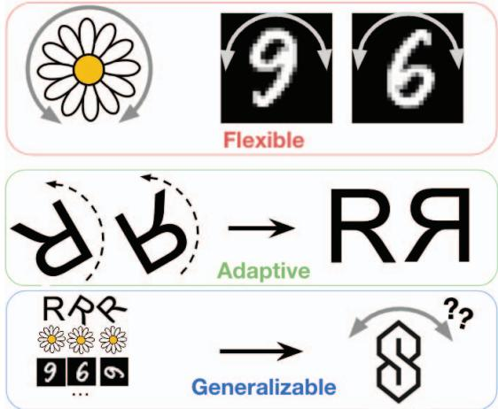  
Figure 1: Our goal is to build flexible, adaptive, and generalizable invariances. Flexible: Different objects require different degrees of invariance, and too much invariance can be harmful (e.g. in distinguishing between 6 vs. 9). The ideal invariance is flexible and instance-dependent. Adaptive: The model should be able to adapt to unexpected (out-ofdistribution) poses. The figure above shows mental rotation, where the symbols in unexpected poses are rotated to a familiar pose before being classified. Generalizable: Given previous knowledge of objects and their invariances, we should be able to generalize it to new objects.

Can we replicate this flexible, generalizable, and adaptive invariance in artificial neural networks?

For some transformations (e.g., translation), the invariance can be hard-coded into the architecture. This insight has led to important approaches like Convolutional Neural Networks [9, 10]. However, this approach imposes severe architecture restrictions and thus has limited applicability.

An alternative approach to robustness is data augmentation [12]. Input data is transformed through a predefined set of transformations, and the neural network learns to perform the task reliably despite these transformations. Its success and wide applicability have made it ubiquitous in deep learning. However, data augmentation is unreliable since the learned invariance breaks under distribution shifts and fails to transfer from head classes to tail classes in imbalanced classification settings [13].

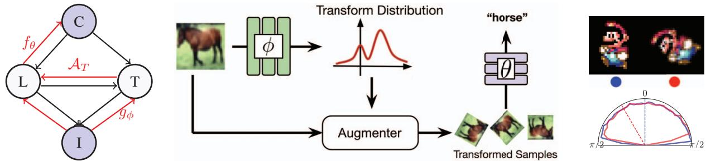  
Figure 2: Our model. (left) The graphical model inspired by the image model underlined in [11]. The image generation model (edges in black) assumes that the Latent Image L depends on class $C ,$ , and the transformation distribution $T$ depends on both. L and T determine the resulting image I. Notably, in contrast to [11], the transformation distribution depends on both class and latent, and every image does not share a single prototype. Since our goal is classification (image class), we learn the reverse process. The red arrows represent the conditional distributions we rely on. We learn an input-conditional transformation distribution and a classifier. Input-condition augmentation distribution $g _ { \phi }$ predicts transforms $T .$ , which along with the input image I, creates a distribution over the latent images L through the augmentation process $\boldsymbol { \mathcal { A } } _ { T }$ . Classifier $f _ { \theta }$ predicts C using L. (middle) Image classification pipeline. Our model predicts a distribution over image transformations. Samples from this distribution are passed to a differentiable augmenter which transforms the input image into a set of augmented images. The images are passed to a classifier, and predictions are averaged. (right) Visualization of the learned augmentation distribution for the Mario-Iggy Dataset. Mario-Iggy dataset consists of rotated versions of single Mario/Iggy images. Upright and Upside-down images are classified as different classes similar to 6 and 9 in digit classification. We show two input images and plot the orientation distribution of the transformed versions. Each direction in the polar plot indicates an image orientation. Dotted lines represent the orientations of samples from the original dataset, and the corresponding curve shows the distribution of orientations after being transformed by our augmenter. The large overlap between red and blue distributions indicates that the post-transformation distribution is approximately invariant to input orientation.

Both these approaches prescribe the invariances while assuming a known set of transformations. However, the correct set of invariances is often unknown a priori, and a mismatch can be harmful [14, 15, 12]. For instance, in fine-grained visual recognition, rotation invariance can help with flower categories but hurt animal recognition [16].

A recent line of methods [14, 17, 15] aims to learn the useful invariances. Augerino [14] learns a range of transformations shared across the entire dataset, producing better generalizing models. However, these methods use a fixed range of transformations for all inputs, thus failing to be flexible. InstaAug [15] learns an instance-specific augmentation range for each transformation, achieving higher accuracy on datasets such as TinyImageNet due to its flexibility. However, since InstaAug learns a range for each parameter separately, it cannot represent multi-modal or joint distributions (e.g., it cannot discover rotations from the set of all affine matrices). Additionally, these approaches fail to consider generalizability and adaptability [6] (Figure 1).

We take inspiration from Learned-Miller et al. [6] and model the relationship between the observed image and its class as a graphical model (Figure 2). Our experiments show that these properties emerge naturally in this framework.

Contributions: (1) We propose a normalizing flow model to learn the image-conditional transformation distribution. (2) Our model can represent multi-modal and joint distributions over transformations, being able to model more complex invariances, and (3) helps achieve higher test accuracy on datasets such as CIFAR10, CIFAR10-LongTail, and Tiny-ImageNet. Finally, (4) combined with our graphical model, this model forms a flexible, generalizable, and adaptive form of invariance. It can be used to (a) align the dataset and discover prototypes like congealing [6], (b) adapt to unexpected poses like mental rotation [7], and (c) transfer invariance across classes like GAN-based methods [13].

## 2. Related Work

Mental rotation in humans: Shepard and Metzler [8] were among the first to measure the amount of time taken by humans to recognize a rotated object. They found that the response time increased linearly with rotation, suggesting a dynamic process like mental rotation for recognizing objects in unfamiliar poses. Tarr and Pinker [18] further study mental rotation as a theory of object recognition in the human brain, contrasting it against invariant features and a multiple-view theory. Cooper and Shepard [19] found that revealing identity and orientation information beforehand allowed the subjects to make constant-time predictions. Hock and Tromley [20] found that the recognition time is nearly constant for characters perceived as “upright” over a large range of rotations. However, outside that range (and similarly for characters with narrow “upright” ranges), the recognition time follows the same linear relationship, indi cating mental rotation is required when the object is detected as “not upright.” Koriat and Norman [7] investigated mental rotation as a function of familiarity, finding that humans adapt to unfamiliar objects with extensive practice, gaining robustness to small rotations around the upright pose. The response curve thus becomes flatter around the upright pose. These works suggest a flexible, adaptive, and general form of robustness in the human visual system.

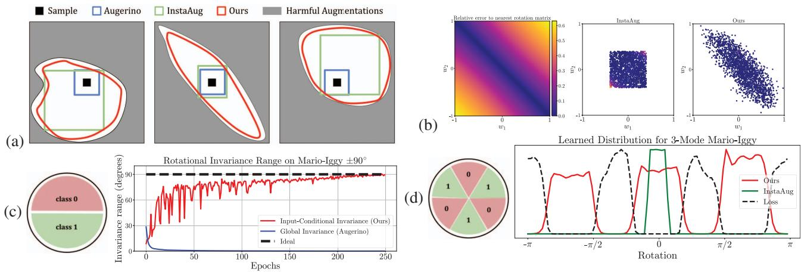

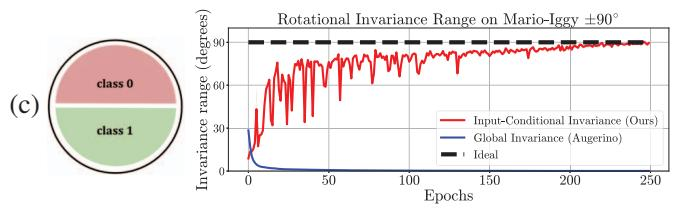

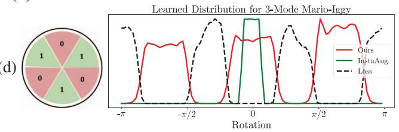  
Figure 3: Our normalizing flow model can represent input-dependent, multi-modal, and joint distributions over augmentation parameters. (a) We illustrate three samples, each with a different set of correct augmentations. Augerino learns a range shared between all samples, so the learned range is too restrictive. InstaAug learns an instance-wise range but cannot handle a non-axis-aligned augmentation set (middle). In contrast, our model can adapt to the loss landscape and produce the larges possible set. (b) InstaAug fails to represent non-axis-aligned distributions. The goal of the “rotation discovery” task is to learn the joint distribution of affine matrix parameters such that the result is rotation. $( w _ { 1 } , w _ { 2 } )$ pairs on diagonal $( \mathrm { i . e . , } w _ { 1 } = - w _ { 2 } )$ correspond to exact rotations and thus incur a small classification loss. The ideal distribution of augmentations is in the form of a diagonal strip (left). Our model learns the joint distribution and thus discovers rotations from the full set of affine parameters, while InstaAug fails. (c) Augerino [14] fails to learn augmentations in challenging settings. Learned rotation range for a version of Mario-Iggy with 90◦ rotation range. The class boundaries touch each other, so some instances lie close to the boundary, and thus global augmentation schemes like [14, 17] are forced to learn a range of 0. Our method learns the correct range. (d) InstaAug fails to capture multi-modal distribution for a multi-modal version of the Mario-Iggy dataset.

Invariance in Neural Networks: Neural networks invariant to natural transformations have long been a central goal in deep learning research [5]. Bouchacourt et al. [12] and Madan et al. [1] studied the invariances present in modern models. One of the earliest successes includes architectures like Convolutional Neural Networks [9, 10], and more recently, applications such as medical image analysis [21, 22, 23], cosmology [24, 25], and physics/chemistry [26, 27, 28]. Kondor and Trivedi [29] and Cohen et al. [30] established a general theory of equivariant neural networks based on representation theory. Finzi et al. [31] combined equivariant and non-equivariant blocks through a residual connection, allowing the model to use both features. Dao et al. [32] shows that to a first-order approximation, data augmentation is equivalent to averaging features over transformations. Bouchacourt et al. [12] found data augmentation to be crucial for invariance in many modern computer vision architectures. Zhou et al. [13] demonstrated a key failing of data augmentation in imbalanced classification and used a GAN to generate a broad set of transformations for every instance. In contrast, our method only uses image transformations and yet achieves comparable accuracy on CIFAR10LT. Additionally, we study the generalizability and adaptability of the learned transform distribution. Congealing [6] aligns all the images in a class, simultaneously producing a prototype and inferring the relative pose of each example. The aligned dataset can be used for robust recognition, and the learned pose distribution can be used for new classes. However, this method assumes the transformation distribution is class-wise, whereas we model it for every instance. Learned canonicalization [33] learns an energy function that is minimized at test time to align the input to a canonical orientation. Spatial Transformer Networks [34] predict a transformation from the input image in an attempt to rectify it and improve classification accuracy. However, STNs cannot represent a distribution of transformations. Probabilistic Spatial Transformer Networks [35] model the conditional distribution using a Gaussian distribution with mean and variance predicted by a neural network. In contrast, we use a normalizing flow model to model complex, multi-modal, and joint distributions. We also study the generalizability as well as adaptation.

Augerino: [14] aims to learn the ideal range of invariances for any given dataset. It uses the reparametrization trick and learns the range of uniform distribution over each transformation parameter separately (e.g., range of translations, rotations, etc.) . This ability allows Augerino to learn the useful range of augmentations (and thus invariances) di rectly and produce more robust models with higher general ization. However, Augerino is sensitive to the regularization amount and the parametrization of the augmentation range (Table 1). LILA [17] tackles this problem using marginal likelihood methods. However, for both Augerino and LILA, the resulting invariance is shared among all classes, even though different classes (such as 0 and 6 in a digit classification setting) may have entirely different ideal augmentation distributions. Figure 3 illustrates how these limitations lead Augerino to learn an overly restricted augmentation range.

InstaAug: [15] aims to fix the inflexibility of Augerino by predicting the augmentation ranges for every instance. This allows for larger effective ranges and thus better generalization in image classification and contrastive learning settings. However, while InstaAug is instance-wise, it models the range of each parameter separately (the mean-field assumption). Thus it cannot represent multi-modal or joint distributions. Like Augerino, the representational limitations greatly limit the set of learnable transformations, especially for complex augmentation classes like image cropping [15], necessitating tricks like selecting among a pre-defined set of image crops. Furthermore, like Augerino, InstaAug is sensitive to parametrization (see Figure 3 and Table 1).

## 3. Methods

We begin by describing our graphical model approach. We derive its inference equation and training loss and compare it to existing methods. We then construct a normalizing flow model to represent the conditional transform distribution. We also derive an analytical expression for the model’s approximate invariance. Finally, we describe the mean-shift algorithm for adapting to out-of-distribution poses.

Graphical model: We follow the model described in Figure 2. Here, $C$ refers to the class, I refers to the observed image, L refers to the latent image (equivalent to the prototype in [6]), and $T$ refers to the unobserved transformation parameters connecting the latent image and the observed image. The latent image is produced by passing the pair $( I , T )$ through a differentiable augmenter ${ \mathcal { A } } ,$ , which applies the transform to the observed image, i.e., $L = \mathcal { A } _ { T } ( I )$

One notable difference to [6] is that our distribution is instance-wise (similar to [15]), not class-wise. This allows for a more general conditional distribution model.

Given the values $C , L , T , I ,$ , the model defines a joint probability distribution $P ( C , L , T , I )$ :

$$
P ( C , L , T , I ) = P ( C | L ) P ( L | T , I ) P ( T | I ) P ( I )\tag{1}
$$

and the conditional class probability $P ( C | I )$ as:

$$
P ( C | I ) = \int _ { L , T } P ( T | I ) P ( L | T , I ) P ( C | L ) d L d T\tag{2}
$$

Since $L = \mathcal { A } _ { T } ( I )$ , this can be further simplified to:

$$
P ( C | I ) = \int _ { L , T } P ( T | I ) \delta ( L - \mathcal { A } _ { T } ( I ) ) P ( C | L ) d L d T\tag{3}
$$

$$
= \int _ { T } P ( T | I ) P ( C | L = A _ { T } ( I ) ) d T
$$

$$
= \mathbb { E } _ { T \sim P ( T | I ) } \big [ P ( C | L = A _ { T } ( I ) ) \big ]\tag{4}
$$

(5)

Thus the predicted class probability is averaged over transformations sampled from the conditional transform distribution $P ( T | I )$ . This is analogous to the idea of “test-time augmentations” used in image classification literature as well as Augerino and InstaAug [14, 15]. Augerino assumes that the transformation T is independent of I. InstaAug models $T$ as a uniform distribution conditioned on I. PSTN [35] arrives at the same expression and uses a Gaussian distribution. All these frameworks can be viewed as different approximations in this formulation.

Variational approximation: We approximate each of the key distributions $P ( C | L )$ and $P ( T | I )$ with neural networks. Our $f _ { \theta } ( C ; L )$ is a simple classifier that operates on the latent image $L ,$ and $g _ { \phi } ( T ; I )$ is a normalizing flow model [36] which takes in the image I:

$$
f _ { \theta } ( C ; L ) \approx P ( C | L ) , \quad g _ { \phi } ( T ; I ) \approx P ( T | I )\tag{6}
$$

Since $\mathit { \Pi } _ { L } ~ = ~ \mathcal { A } _ { T } ( I )$ , we use $f _ { \theta } ( C ; L ) , \ f _ { \theta } ( C ; T , I )$ and $f _ { \theta } ( C ; \mathcal { A } _ { T } ( I ) )$ interchangeably.

Inference: The expression for $P ( C | I )$ then becomes:

$$
\begin{array} { r l r } {  { p _ { \theta , \phi } ( C | I ) = \int _ { T } g _ { \phi } ( T ; I ) f _ { \theta } ( C ; \mathcal { A } _ { T } ( I ) ) d T } } \\ & { } & { = \mathbb { E } _ { T \sim g _ { \phi } ( T ; I ) } [ f _ { \theta } ( C ; \mathcal { A } _ { T } ( I ) ) ] } \end{array}\tag{7}
$$

(8)

This equation describes the act of sampling transformations from the normalizing flow model and averaging the classifier predictions over the sampled transformations.

Training Loss: During training, we observe $( I , C )$ pairs. We train the classifier $f _ { \theta }$ by maximizing a lower bound to the average log $p _ { \theta , \phi } ( C | I )$ . It is common to use Jensen’s inequality to make this tractable:

$$
\log p _ { \theta , \phi } ( C | I ) \geq \mathbb { E } _ { T \sim g _ { \phi } ( T ; I ) } \big [ \log f _ { \theta } ( C ; \mathcal { A } _ { T } ( I ) ) \big ]\tag{9}
$$

and maximize the resulting lower bound instead. This further reduces to the loss function $\mathcal { L } _ { \mathrm { c l a s s i f i e r } } \mathrm { : }$

$$
\mathcal { L } _ { \mathrm { c l a s s i f i e r } } = \mathbb { E } _ { T \sim g _ { \phi } ( T ; I ) } { \big [ } - \log f _ { \theta } ( C ; \mathcal { A } _ { T } ( I ) ) { \big ] }\tag{10}
$$

which is simply the cross-entropy loss averaged over sampled augmentations.

We would like the transform distribution $g _ { \phi } ( T ; I )$ to maximize log $p _ { \theta , \phi } ( C | I )$ by minimizing $\mathcal { L } _ { \mathrm { c l a s s i f i e r } }$ . However, in practice, this leads to $g _ { \phi }$ collapsing to a 0-variance distribution as the model overfits to the training data (as observed in Augerino [14] without regularization).

Instead, we define the target distribution $\tilde { p } _ { \theta , \phi } ^ { \lambda } ( T | C , I )$ as:

$$
\tilde { p } _ { \theta , \phi } ^ { \lambda } ( T | C , I ) = \frac { 1 } { Z } p _ { \theta } ( C | T , I ) ^ { \lambda }\tag{11}
$$

where $Z \in \mathbb { R } ^ { + }$ is a normalization constant and $\lambda \in \mathbb { R } ^ { + }$ is a temperature constant. This distribution assigns a higher probability to the transformations, leading to lower loss. λ here is analogous to the temperature parameter in softmax, and large values of $\lambda$ make the distribution highly peaked. In contrast, small values suppress peaks and make the distribution less ill-behaved as a target. $\lambda  0$ corresponds to a uniform distribution, whereas $\lambda  \infty$ collapses the distribution to the single transformation that minimizes the classification loss. We also note that when $\lambda = 1$ , the target distribution $\scriptstyle { \frac { 1 } { Z } } p _ { \theta } ( C | T , I )$ is exactly the posterior $p _ { \theta } ( T | C , I )$ of the transformation $T$ given observed $( C , I )$ , assuming uniform prior $P _ { \theta } ( T | I )$ . Different choices of this distribution lead to other possible loss functions, but we stick to uniform for simplicity. Next, we plug in $f _ { \boldsymbol { \theta } } { : }$

$$
\tilde { p } _ { \theta , \phi } ^ { \lambda } ( T ) = { \frac { 1 } { Z } } f _ { \theta } ( C ; I , T ) ^ { \lambda }\tag{12}
$$

Thus we train the transform distribution $g _ { \phi }$ by minimizing the KL divergence to the target, i.e.:

$$
\mathcal { L } _ { \mathrm { a u g m e n t e r } } = K L ( g _ { \phi } ( T ; I ) \| \tilde { p } _ { \theta , \phi } ^ { \lambda } ( T ) )\tag{13}
$$

$$
= \mathbb { E } _ { T \sim g _ { \phi } ( T ; I ) } \big [ \log g _ { \phi } ( T ; I ) - \log \tilde { p } _ { \theta , \phi } ^ { \lambda } ( T ) \big ]\tag{14}
$$

We plug in (15) and ignore the normalizing constant $Z \colon$

$$
\mathbb { E } _ { T \sim g _ { \phi } } \big [ \log g _ { \phi } ( T ; I ) - \lambda \log f _ { \theta } ( C ; T , I ) \big ]\tag{15}
$$

$$
= \lambda { \mathcal { L } } _ { \mathrm { c l a s s i f i e r } } - \mathbb { H } [ g _ { \phi } ]\tag{16}
$$

Finally, we rescale the loss to get:

$$
\mathcal { L } _ { \mathrm { a u g m e n t e r } } = \mathcal { L } _ { \mathrm { c l a s s i f i e r } } - \alpha \mathbb { H } [ g _ { \phi } ]\tag{17}
$$

where $\alpha \in \mathbb { R } ^ { + }$ is a regularization constant and $\mathbb { H } [ g _ { \phi } ]$ is the entropy of the distribution $g _ { \phi }$

This formulation is equivalent to regularizing the transform distribution $g _ { \phi }$ with an entropy term to prevent distribution collapse, similar to the augmentation range width regularization used in Augerino [14] and entropy regulariza tion used in InstaAug [15]. However, our derivation also explains why the collapse phenomenon occurs in the unregularized case. For $\alpha  0 \equiv \lambda  \infty$ , the augmenter minimizes KL divergence to a highly peaked distribution concentrated at the single loss-minimizing transformation, leading to distribution collapse.

Since our normalizing flow model produces log probability for each generated sample, we penalize log $g _ { \phi }$ for sampled transformations. The resulting loss is:

$$
\mathcal { L } _ { \mathrm { a u g m e n t e r } } = \mathcal { L } _ { \mathrm { c l a s s i f i e r } } + \alpha \mathbb { E } _ { T \sim g _ { \phi } } \big [ \log g _ { \phi } ( T ; I ) \big ]\tag{18}
$$

This regularization generalizes the ad-hoc regularizers used by previous methods (e.g. “width” in Augerino), which may not be suitable for general distributions.

Representing the conditional distribution: Our approach uses parametrized differentiable augmentations similar to Augerino. However, instead of learning the global range of transformations, we predict a distribution over the transformations conditioned on the input image. We use an input-conditional normalizing flow model [36].

A normalizing flow model starts with a simple pre-defined probability distribution $p _ { 0 } , \mathrm { e . g . }$ ., Normal distribution. For a sample $z _ { 0 } \sim p _ { 0 }$ , it successively applies transformations $f _ { 1 } , f _ { 2 } , \dots , f _ { K }$ , producing a more complicated distribution by the end. The log probability density of the final sample is given by log $\begin{array} { r } { p ( z _ { k } ) = \log p _ { 0 } ( z _ { 0 } ) - \log | \operatorname* { d e t } \frac { d z _ { k } } { d z _ { 0 } } | , } \end{array}$ , and the architecture is designed to allow efficient sampling and computation of log p. We use the samples to augment the input (Figure 2) and log p term in the loss. Our model is based on RealNVP [37], using a mixture of Gaussians as the base $p _ { 0 }$

Given any input image I, we use a convolutional feature extractor to extract an embedding vector e. This embedding vector is then projected down to a scale and bias used by each layer of the normalizing flow and the base distribution. This normalizing flow model outputs samples s from the augmentation distribution and their corresponding log-probabilities $\log p ( s )$ . These samples are passed to the differentiable augmentation, which transforms the input image to be processed by the model (Figure 2) using PyTorch’s grid sample. While we use affine image transformations for our experiments, our method generalizes to any differentiable transformation.

Approximate invariance: The approximate invariance in our method comes from (1) the classifier’s inherent insensitivity to transformations, (2) the width of the transform distribution being used for averaging, and (3) the canonicalization effect of the transform distribution. Each of these properties corresponds to a different theory of object recog nition explained by Tarr and Pinker [18] and connected to deep neural networks by Kaba et al. [33]. We formalize this intuitive argument as follows: Given an input image I, our model’s output is the classifier prediction averaged over $g _ { \phi } ( T ; I )$ , i.e. $p _ { \theta , \phi } ( C | I ) = \mathbb { E } _ { T \sim g _ { \phi } ( T ; I ) } \big [ f _ { \theta } ( C ; \mathcal { A } _ { T } ( I ) ) \big ]$ (see equation 9). This can be written as:

$$
p _ { \theta , \phi } ( C | I ) = \int _ { T } g _ { \phi } ( T ; I ) f _ { \theta } ( C ; \mathcal { A } _ { T } ( I ) ) d T
$$

Let a new image $I ^ { \prime }$ be formed by transforming the original

image by a transformation $\Delta T .$ , i.e. $I ^ { \prime } = \mathcal { A } _ { \Delta T } ( I )$ . Then:

$$
\begin{array} { l } { \displaystyle p _ { \theta , \phi } ( C | I ^ { \prime } ) = \int _ { T } g _ { \phi } ( T ; I ^ { \prime } ) f _ { \theta } ( C ; \mathcal { A } _ { T } ( I ^ { \prime } ) ) d T } \\ { \displaystyle } \\ { = \int _ { T } g _ { \phi } ( T ; \mathcal { A } _ { \Delta T } ( I ) ) f _ { \theta } ( C ; \mathcal { A } _ { T + \Delta T } ( I ) ) d T } \\ { \displaystyle } \\ { \displaystyle = \int _ { T } g _ { \phi } ( T - \Delta T ; I ^ { \prime } ) f _ { \theta } ( C ; \mathcal { A } _ { T } ( I ) ) d T } \end{array}
$$

Where the last step substitutes T for $T + \Delta T$ . Then, the change in prediction, denoted as err $\left( C ; I , I ^ { \prime } \right)$ , is:

$$
\begin{array} { c } { { \displaystyle \mathrm { e r r } ( C ; I , I ^ { \prime } ) = | p _ { \theta , \phi } ( C | I ) - p _ { \theta , \phi } ( C | I ^ { \prime } ) | } } \\ { { \displaystyle = \left| \int _ { T } \left[ g _ { \phi } ( T - \Delta T ; I ^ { \prime } ) - g _ { \phi } ( T ; I ) \right] f _ { \theta } ( C ; A _ { T } ( I ) ) d T \right| } } \end{array}
$$

Next, we will derive bounds on this quantity based on properties of $g _ { \phi }$ and $f _ { \theta }$

Let $S = \operatorname { s u p p } ( g _ { \phi } ( . ; I ) ) \cup \operatorname { s u p p } ( g _ { \phi } ( . ; I ^ { \prime } ) )$ is the support set of the transform distributions, i.e. all the samples for I and $I ^ { \prime }$ are inside S. We can thus limit the integration to S:

$$
= \Big | \int _ { T \in S } \big [ g _ { \phi } ( T - \Delta T ; I ^ { \prime } ) - g _ { \phi } ( T ; I ) \big ] f _ { \theta } ( C ; A _ { T } ( I ) ) d T \Big |
$$

Let’s now quantify the behavior of $f _ { \theta }$ on S. Let M be the maximum and m be the minimum of $f _ { \theta }$ on this set, i.e.

$$
M = \operatorname* { m a x } _ { t \in S } f _ { \theta } ( C ; \mathcal { A } _ { T } ( I ) ) , \quad m = \operatorname* { m i n } _ { t \in S } f _ { \theta } ( C ; \mathcal { A } _ { T } ( I ) ) ,
$$

Note that the first term $g _ { \phi } ( T - \Delta T ; I ^ { \prime } ) - g _ { \phi } ( T ; I )$ is the difference of two probability density functions and so integrates to 0. Thus, if we add a constant value to $f _ { \theta } ,$ , it doesn’t change the whole integral. Subtracting m, we get:

$$
\Big | \int _ { T \in S } \big [ g _ { \phi } ( T - \Delta T ; I ^ { \prime } ) - g _ { \phi } ( T ; I ) \big ] ( f _ { \theta } ( C ; T , I ) - m ) d T \Big |
$$

Using $\begin{array} { r } { | \int f ( x ) d x | \le \int | f ( x ) | d x \mathrm { a n d } | x y | = | x | | y | } \end{array}$ we have:

$$
\begin{array} { r l } {  { \sum _ { T \in S } \bigg | g _ { \phi } ( T - \Delta T ; I ^ { \prime } ) - g _ { \phi } ( T ; I ) \bigg | \bigg | f _ { \theta } ( C ; T , I ) - m \bigg | d T } } \\ & { \le ( M - m ) \int \bigg | g _ { \phi } ( T - \Delta T ; I ^ { \prime } ) - g _ { \phi } ( T ; I ) \bigg | d T } \\ & { \overset { T \in S } { = } 2 ( M - m ) \operatorname * { T V } [ g _ { \phi } ( T - \Delta T ; I ^ { \prime } ) \| g _ { \phi } ( T ; I ) ] } \end{array}
$$

where TV refers to the Total Variation Distance defined as $\begin{array} { r } { \mathrm { T V } [ \mathrm { p } \| \mathrm { q } ] = \frac { 1 } { 2 } \int | p ( \boldsymbol { x } ) - q ( \boldsymbol { x } ) | } \end{array}$ dx. In summary:

$$
\mathrm { e r r } ( C ; I , I ^ { \prime } ) \leq 2 ( M - m ) \mathrm { T V } [ g _ { \phi } ( T - \Delta T ; I ^ { \prime } ) | | g _ { \phi } ( T ; I ) ]
$$

Thus, the prediction change $( \mathrm { e r r } ( C ; I , I ^ { \prime } ) )$ is upper bounded by two factors: (1) $M - m ,$ which measures how much the classifier predictions change over the relevant range, and (2) The total variation distance between the original transform distribution $g _ { \phi } ( T ; I )$ and the new version $g _ { \phi } ( T - \Delta T ; I ^ { \prime } )$ This result explains how the method achieves approximate invariance. If the classifier features are invariant to the input transformations, we get $M - m \approx 0 .$ , and thus error 0. Similarly, if the transform distribution is approximately equivariant, i.e. $g _ { \phi } ( T - \Delta T ; I ^ { \prime } ) \approx g _ { \phi } ( T ; I )$ , then $T V \approx 0$ and it follows that error 0.

Mean-shift for handling out-of-distribution poses: While the conditional transformation distribution $g _ { \phi } ( T ; I )$ can adjust to in-distribution pose variation, this approach does not work for out-of-distribution poses (see Figure 7). We use a modified version of the well-known mean-shift algorithm. Instead of sampling points from a dataset and weighting them with a kernel, we directly use $g _ { \phi }$ samples.

The core idea is to push the image closer to a local mode where our models may work better. We start with image $I _ { 0 }$ and the transform parameter $T _ { 0 } = 0$ . Then, at every step:

$$
T _ { k } : = T _ { k - 1 } + \gamma \mathbb { E } _ { T \sim g _ { \phi } ( T ; I _ { k - 1 } ) } [ T ] , \quad I _ { k } : = \mathcal { A } _ { T _ { k } } ( I _ { 0 } )
$$

where $\gamma \in \mathbb { R } ^ { + }$ is the step size. In summary, the algorithm repeatedly samples from the conditional distribution, computes the mean, and accumulates the result into T.

Since our method learns an input-conditional probability distribution, the mean of the augmentation transformation $\mathbb { E } _ { T \sim g _ { \phi } ( T ; I ) } [ T ]$ for any given image is an estimate of the difference between the local mode and the current transform T. Thus each step moves the image closer to the local mode, which is the fixed point for this process.

## 4. Experiments

We benchmark accuracy on datasets such as CIFAR10 and TinyImageNet, and plot the learned transformation distribution for toy examples on Mario-Iggy [14] and MNIST. Finally, we test applications of the learned distribution.

CIFAR10: We benchmark our method against Augerino and LILA [17] on learning affine image transformations for CIFAR10 classification. We use the models and libraries provided by [17]. We use a RealNVP flow [37] with permutation mixing, 12 affine coupling layers, and a 2-layer MLP of width 64 for each layer. We turn the input into an embedding using a 5-layer CNN and append this embedding to each layer’s MLP input as well as project it to the parameters of the base distribution, which is a mixture of Gaussians. We also add a tanh at the end of the flow to ensure the produced distribution stays within bounds. Please see the supplementary material for more details. Using a modified ResNet18 [38], and train our model for 200 epochs. We report the accuracy in Section 3. Our method is able to achieve a 7.8% test accuracy gain compared to Augerino and 2.6% against LILA. We note that our method is still based on maximum likelihood; thus, LILA’s marginal likelihood method is complementary to ours. These methods may be combined for even higher accuracy in future work. We also report the accuracies for MNIST and FashionMNIST.

<table><tr><td>Method</td><td>CIFAR10</td><td>FMNIST</td><td>MNIST</td><td>CIFAR10-LT</td></tr><tr><td>Baseline</td><td> $7 4 . 1 \pm 0 . 5$ </td><td> $8 9 . 6 \pm 0 . 2$ </td><td> $9 9 . 1 \pm 0 . 0 2$ </td><td> $7 0 . 8 \pm 0 . 8$ </td></tr><tr><td>Augerino</td><td> $7 9 . 0 \pm 1$ </td><td> $9 0 . 1 \pm 0 . 1$ </td><td> $9 8 . 3 \pm 0 . 1 $ </td><td> $6 3 . 6 \pm 1 . 3$ </td></tr><tr><td>LILA</td><td> $\underline { { 8 4 . 2 \pm 0 . 8 } }$ </td><td> $9 1 . 9 \pm 0 . 2$ </td><td> ${ \bf 9 9 . 4 \pm 0 . 0 2 }$ </td><td> $7 6 . 4 \pm 0 . 9$ </td></tr><tr><td>Ours</td><td> $8 6 . 8 \pm 0 . 4 ( + 2 . 6 \% )$ </td><td> $9 2 . 3 \pm 1 . 4 ( + 0 . 4 \% )$ </td><td> $9 9 . 2 \pm 0 . 1$ </td><td> ${ \bf 7 8 . 1 \pm 1 } \left( + 1 . 7 \% \right)$ </td></tr></table>

<table><tr><td>Method</td><td>Acc (%)</td><td>with LRP(%)</td></tr><tr><td>Baseline Random Crop</td><td>55.1 64.5</td><td></td></tr><tr><td>Augerino</td><td>55.0</td><td></td></tr><tr><td>InstaAug</td><td>54.4</td><td>66.0</td></tr><tr><td>Ours</td><td>65.4</td><td>66.0</td></tr></table>

Table 1: (left) Classification accuracy on the modified ResNet used by LILA [17]. Numbers for baselines reproduced from [17]. Our method can learn a larger effective class of augmentations, helping the classifier achieve the highest test accuracy on CIFAR10 and CIFAR10-LT(rho=10). Imbalanced classification is a particularly challenging setting for learned invariances as the learned invariances do not transfer from head classes to tail classes [13]. We note that our method is complementary to LILA (i.e., marginal likelihood), and can be combined in future work. (right) TinyIN classification accuracy on PreActResNet used by InstaAug, with and without LRP (Location-relation parameterization). InstaAug is limited by its mean-field representation, performing poorly without LRP. In contrast, our method performs well regardless of parametrization

Imbalanced CIFAR-10 Classification: Imbalanced classification is a particularly challenging setting for invariance learning. As shown by [13], invariances learned through data augmentation do not transfer from head classes to tail classes. This is especially harmful since the tail classes, due to a small number of examples, benefit the most from the invariance. CIFAR10-LT is an imbalanced version of CIFAR10 where the smallest class is 10x smaller than the largest. Here, our model outperforms Augerino by 14.5% and LILA by 1.7% on this dataset.

Augerino 13-layer CIFAR10: We also evaluate our method on Augerino’s 13-layer network, re-using the same hyperparameters as the LILA experiments Section 3. Our method achieves 94.3% test accuracy (0.5% gain).

<table><tr><td></td><td>No Aug.</td><td>Fast AutoAug</td><td>Augerino</td><td>Ours</td></tr><tr><td>Acc</td><td>90.6</td><td>92.65</td><td>93.8</td><td>94.3</td></tr></table>

Table 2: Test accuracies for Augerino’s 13-layer model

TinyImageNet Classification: We evaluate our method against InstaAug on the TinyImageNet dataset. This 64x64 dataset contains 200 classes. The goal of this task is to learn cropping augmentations. A crop can be parametrized with four parameters: (centerx, centery, width, height), so we represent it with a 4-dimensional distribution. Please see the supplementary material for architectural details.

Cropping is a challenging augmentation to learn since the crop location and size are correlated. InstaAug’s mean-field representation cannot represent this, so achieves low accuracy without the location-related parameterization (LRP). LRP consists of 321 pre-defined crops and predicts the probability of each crop. This approach does not scale to high dimensional distributions (e.g. specifying more transformations). In contrast, our method can achieve high accuracy without LRP, beating InstaAug by nearly 11% (Table 1).

Learned invariance visualization Mario-Iggy [14] a toy dataset consisting of rotated versions of two images. Upright images and upside-down images are classified as different classes, and each sample lies within $\pm 4 5 ^ { \circ }$ of its class prototype (Figure 2). As the total range of rotations can be easily varied, this dataset is useful for studying learned invariance. We consider two variations: 90◦ rotation range, and Multi-modal dataset with 3 modes. Since the target distributions here are much simpler, our RealNVP model uses 4 affine coupling layers for this task. Please see supplementary material for architectural details.

The ideal augmentation distribution for Mario-Iggy dataset is 90◦ around the class prototype. As the input image rotates, the augmentation distribution shifts such that the resulting augmented image distribution is constant. Our model trained on Mario-Iggy is able to reliably learn an invariant augmentation distribution (Figure 3). In the challenging multimodal distribution setting, our model is able to represent the three modes, whereas InstaAug fails.

Representing joint distributions: We test the ability of our normalizing flow to represent joint distributions by intentionally sampling from a larger set of transformations and letting the model learn the useful subset. Specifically, we start from the Lie algebra parametrization of affine transforms (used by Augerino). For rotation by r radians, the transform

$$
\begin{array} { r } { \mathbf { a u o n \ : m a u r r i x : } \quad \mathbf { \hat { x } } . } \\ { T _ { \mathrm { A u g e r i n o } } ( r ) = \exp \left( \left[ \begin{array} { l l l } { 0 } & { r } & { 0 } \\ { - r } & { 0 } & { 0 } \\ { 0 } & { 0 } & { 1 } \end{array} \right] \right) } \end{array}\tag{19}
$$

For this experiment, we generalize this formulation as:

$$
T _ { \mathrm { D e c o u p l e d } } ( a , b , c , d , e , f ) = \exp \left( { \left[ \begin{array} { l l l } { a } & { b } & { c } \\ { d } & { e } & { f } \\ { 0 } & { 0 } & { 1 } \end{array} \right] } \right)\tag{20}
$$

This matrix represents a rotation if $b \ = \ - d .$ Since the Mario-Iggy dataset only contains rotations, the goal is to produce samples such that $b = - d$ . Samples that do not follow this constraint will be out-of-distribution. In Figure 3, we see that compared to our model, InstaAug [15] fails to learn rotation transforms on the Mario-Iggy dataset, even though skewed samples incur a higher loss. This is due to InstaAug’s mean-field model, which predicts the range for each parameter separately, thus preventing it from following the $b = - d$ constraint. In contrast, our model learns to represent this joint distribution accurately. We also measure the deviation of sampled transformations from a true rotation and plot that distribution in Figure 5. We find that the sampled distribution is concentrated close to the rotation transformations, showing that our method can start from a large group of transformations and learn to constrain it to only what is useful for the dataset and task.

Robustness against Rotation vs Class Size (RotMnist-LT)  
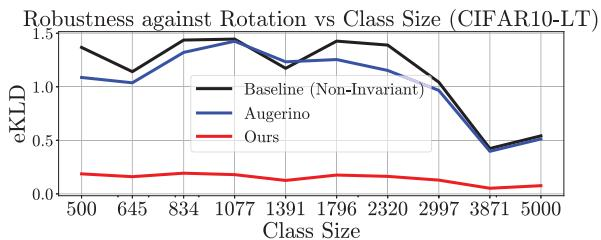

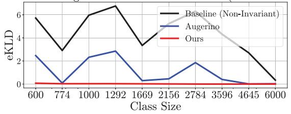  
Figure 4: Invariance transfer from head classes to tail classes in imbalanced classification. We follow Zhou et al. [13] (Fig 3) and plot the expected KL-divergence under image rotations for RotMNIST-LT and CIFAR10-LT (lower is better). RotMNIST-LT is a long-tail version of the MNIST dataset where each image has been randomly rotated. As Zhou et al. [13] shows, neural networks learn rotational invariance for head classes (indicated by low eKLD) but fail to transfer this invariance to tail classes. This problem persists for Augerino to a lesser extent. In contrast, our method successfully transfers invariance across classes. This effect is even more pronounced for CIFAR10-LT $( \pm 1 0 ^ { \circ }$ rotations)

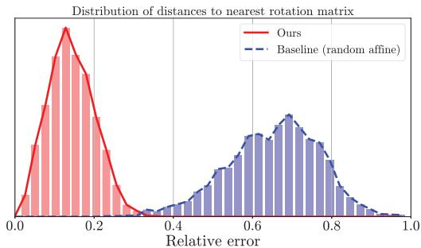  
Figure 5: Our model learns the rotation constraint from data. Here we plot the histogram of relative errors of the produced samples to the nearest rotation matrix and find that it is much smaller than random affine baseline.

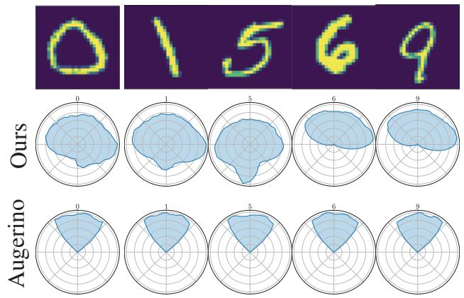

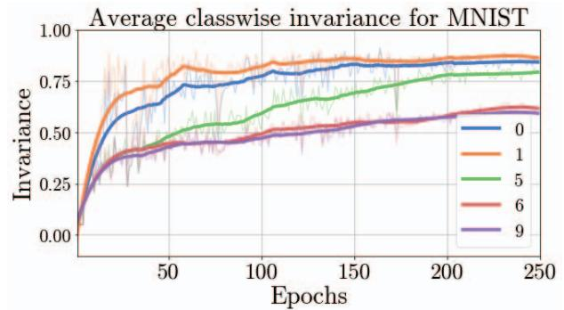  
Figure 6: Our method learns flexible instance-wise augmentation distributions. We illustrate learned invariance for a subset of MNIST digits (0,1,5,6,9). The classes 0,1,5 can be learned with full invariance, whereas 6 and 9 require partial invariance ( 90◦). Our model (top) can learn the correct instance-dependent range, whereas Augerino (middle) instead learns a much narrower shared invariance for all classes. (bottom) A plot of the classwise learned rotational invariance for our model over time. Classes 0,1, and 5 achieve close to full rotational invariance, whereas 6 and 9 achieve close $\mathrm { t o \pm 9 0 ^ { \circ } }$ rotational invariance.

Learning selective invariance for MNIST: We test our model’s selective invariance ability on the MNIST dataset (specifically classes 0,1,5,6,9) and visualize the augmenta tion range for a few examples as well as class averages (see Figure 6). For digits 0, 1, 5 which can be recognized from any rotation, the learned rotation range corresponds to the entire 360◦, whereas for 6 and 9 which may be confused with each other, the range is only 180◦. In contrast, augerino learns a constant range. We also plot the average rotation range for each class and observe the trend hold at class level.

Generalizing invariance across classes: Zhou et al. [13] shows that invariances learned from head classes fail to transfer to tail classes. This is a major drawback of traditional data augmentation methods. We test how our method generalizes across classes by plotting the same metric as [13] (expected KL divergence) across a range of rotations for CIFAR10-LT and RotMNIST-LT classifiers. Since RotMNIST-LT is a rotationally invariant dataset, we rotate all the images randomly in 180◦ range, whereas for CIFAR10-LT we use $\mathrm { a \pm 1 0 ^ { \circ } }$ range. Our model achieves significantly lower eKLD, especially for tail classes (Figure 4), indicating higher robustness.

(a)  
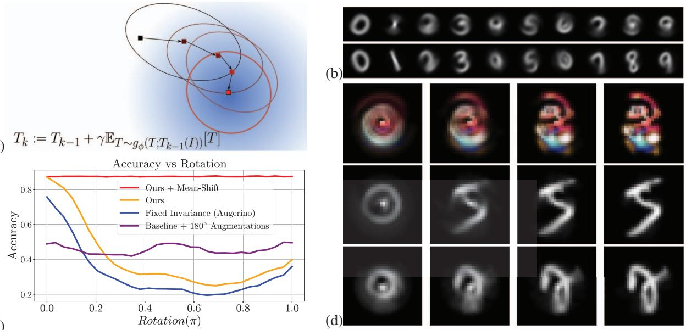

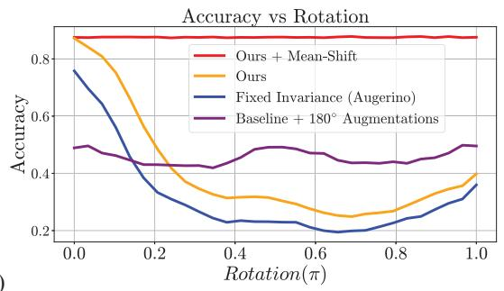  
(c)  
Figure 7: The conditional augmentation distribution can be used to align an image dataset, discover prototypes similar to congealing [6], and adapt to out-of-distribution poses. (a) A conceptual figure showing the modified mean-shift algorithm. For a given input, we repeatedly compute the mean of the conditional transform distribution and perturb the input in that direction, pushing the input close to a local mode. (b) Demonstration of an augmentation distribution aligning rotated ( 90◦) versions of a single image. We separately apply mean-shift to each rotated image and observe that they converge to the same mode. Unlike [6], there is no joint optimization, and each image is “aligned” separately. This alignment also works for MNIST images even though the model has only trained on Mario-Iggy. (c) Mean-shift algorithm can add robustness against unexpected poses without reducing accuracy. We plot each CIFAR10 model’s accuracy as images rotate at test time. Augerino is susceptible to large rotations since they are out-of-distribution for CIFAR10. The baseline trained with augmentations is robust but inaccurate. Our method with mean-shift achieves high accuracy for both in-distribution and out-of-distribution rotations. (d) We apply the model trained on Mario-Iggy to align each class in the MNIST test set, and we make the task more challenging by adding $\pm 4 5 ^ { \circ }$ rotations to each image. The top row shows the average class image before alignment, and the bottom row shows images after alignment. For classes such as 0, 1, 3, 8, 9, this model successfully discovers prototypes, whereas for classes such as 4, 6 the model fails due to multiple possible modes.

Aligning image datasets like in Congealing [6]: We apply the mean-shift algorithm using the augmentation distribution trained on the Mario-Iggy (45◦) dataset. The Mario-Iggy dataset contains rotated versions of the Mario image with one unknown prototype, making it ideal for this test.

For each image, we apply the mean-shift algorithm. Each step moves the image closer to the local mode. We apply this procedure for 50 iterations for every image separately. This process results in all the images in a small neighborhood agglomerating to the local prototype (Figure 7).

We also tested this approach on MNIST, an out-ofdistribution dataset for the mario-iggy model, and added 45◦ rotations for additional challenge. Surprisingly, the method still aligns images and discovers prototypes (Figure 7) despite not being trained on any MNIST images.

Robustness to out-of-distribution poses: We benchmark our model’s ability to handle out-of-distribution poses on CIFAR10 and measure how the mean-shift method helps the model adapt to unexpected poses. We plot the classification accuracy curves in Figure 7 as the inputs rotate. For the mean-shift algorithm, we sample 100 transform samples, γ = 0.1, and 10 iterations. The rotation-invariant baseline is robust but inaccurate. Augerino, which induces invariance to a small range of rotations, fails for large rotations. Our model without mean-shift also fails under large rotations. However, our method with mean-shift is accurate and robust.

Summary: We propose normalizing flows to learn the instance-wise distribution of image transformations. It helps us make robust and better generalizing classifiers, perform test-time alignment, discover prototypes, and transfer invariance. These results highlight the potential of flexible, adaptive, and general invariance in computer vision.

Acknowledgements: We thank the BAIR/Google fund for funding this project.

## References

[1] Spandan Madan, Tomotake Sasaki, Tzu-Mao Li, Xavier Boix, and Hanspeter Pfister. Small in-distribution changes in 3d perspective and lighting fool both cnns and transformers, 2021. 1, 3

[2] Jia Deng, Wei Dong, Richard Socher, Li-Jia Li, Kai Li, and Li Fei-Fei. Imagenet: A large-scale hierarchical image database. In 2009 IEEE conference on computer vision and pattern recognition, pages 248–255. Ieee, 2009. 1

[3] Vaishaal Shankar, Achal Dave, Rebecca Roelofs, Deva Ramanan, Benjamin Recht, and Ludwig Schmidt. Do image classifiers generalize across time? In Proceedings of the IEEE/CVF International Conference on Computer Vision, pages 9661–9669, 2021. 1

[4] NTS Board. Collision between vehicle controlled by developmental automated driving system and pedestrian. Transportation Safety Board, Washington, DC, USA, HAR19-03, 2019. 1

[5] Michael M. Bronstein, Joan Bruna, Taco Cohen, and Petar Velickoviˇ c. Geometric deep learning: Grids, groups, graphs,´ geodesics, and gauges, 2021. 1, 3

[6] E.G. Miller, N.E. Matsakis, and P.A. Viola. Learning from one example through shared densities on transforms. In Proceedings IEEE Conference on Computer Vision and Pattern Recognition. CVPR 2000 (Cat. No.PR00662), volume 1, pages 464–471 vol.1, 2000. 1, 2, 3, 4, 9

[7] Asher Koriat and Joel Norman. Mental rotation and visual familiarity. Perception & Psychophysics, 37(5):429–439, 1985. 1, 2, 3

[8] Roger N Shepard and Jacqueline Metzler. Mental rotation of three-dimensional objects. Science, 171(3972):701–703, 1971. 1, 2

[9] Yann LeCun, Patrick Haffner, Leon Bottou, and Yoshua Ben-´ gio. Object recognition with gradient-based learning. In Shape, contour and grouping in computer vision, pages 319– 345. Springer, 1999. 1, 3

[10] Kunihiko Fukushima. Neocognitron: A hierarchical neural network capable of visual pattern recognition. Neural networks, 1(2):119–130, 1988. 1, 3

[11] E.G. Learned-Miller. Data driven image models through continuous joint alignment. IEEE Transactions on Pattern Analysis and Machine Intelligence, 28(2):236–250, 2006. 2

[12] Diane Bouchacourt, Mark Ibrahim, and Ari Morcos. Grounding inductive biases in natural images: invariance stems from variations in data. In M. Ranzato, A. Beygelzimer, Y. Dauphin, P.S. Liang, and J. Wortman Vaughan, editors, Advances in Neural Information Processing Systems, volume 34, pages 19566–19579. Curran Associates, Inc., 2021. 1, 2, 3

[13] Allan Zhou, Fahim Tajwar, Alexander Robey, Tom Knowles, George J. Pappas, Hamed Hassani, and Chelsea Finn. Do deep networks transfer invariances across classes? 2022. 2, 3, 7, 8, 13

[14] Gregory Benton, Marc Finzi, Pavel Izmailov, and Andrew Gordon Wilson. Learning invariances in neural networks, 2020. 2, 3, 4, 5, 6, 7, 13

[15] Ning Miao, Tom Rainforth, Emile Mathieu, Yann Dubois, Yee Whye Teh, Adam Foster, and Hyunjik Kim. Instancespecific augmentation: Capturing local invariances, 2022. 2, 4, 5, 7, 13, 14

[16] Tete Xiao, Xiaolong Wang, Alexei A Efros, and Trevor Darrell. What should not be contrastive in contrastive learning. In International Conference on Learning Representations, 2021. 2

[17] Alexander Immer, Tycho F. A. van der Ouderaa, Gunnar Ratsch, Vincent Fortuin, and Mark van der Wilk. Invariance¨ learning in deep neural networks with differentiable laplace approximations, 2022. 2, 3, 4, 6, 7, 13

[18] Michael J Tarr and Steven Pinker. Mental rotation and orientation-dependence in shape recognition. Cognitive psychology, 21(2):233–282, 1989. 2, 5

[19] Lynn A Cooper and Roger N Shepard. Chronometric studies of the rotation of mental images. In Visual information processing, pages 75–176. Elsevier, 1973. 2

[20] Howard S Hock and Cheryl L Tromley. Mental rotation and perceptual uprightness. Perception & Psychophysics, 24(6):529–533, 1978. 2

[21] Marysia Winkels and Taco S. Cohen. Pulmonary nodule detection in CT scans with equivariant cnns. Medical Image Anal., 55:15–26, 2019. 3

[22] Maxime W Lafarge, Erik J Bekkers, Josien PW Pluim, Remco Duits, and Mitko Veta. Roto-translation equivariant convolutional networks: Application to histopathology image analysis. Medical Image Analysis, 68:101849, 2021. 3

[23] Simon Graham, David B. A. Epstein, and Nasir M. Rajpoot. Dense steerable filter cnns for exploiting rotational symmetry in histology images. IEEE Trans. Medical Imaging, 39(12):4124–4136, 2020. 3

[24] Sander Dieleman, Jeffrey De Fauw, and Koray Kavukcuoglu. Exploiting cyclic symmetry in convolutional neural networks. In Proceedings of the 33nd International Conference on Machine Learning, ICML 2016, New York City, NY, USA, June 19-24, 2016, pages 1889–1898, 2016. 3

[25] Nathanael Perraudin, Micha¨ el Defferrard, Tomasz Kacprzak,¨ and Raphael Sgier. Deepsphere: Efficient spherical convolu-¨ tional neural network with healpix sampling for cosmological applications. Astron. Comput., 27:130–146, 2019. 3

[26] Brandon M. Anderson, Truong-Son Hy, and Risi Kondor. Cormorant: Covariant molecular neural networks. In Advances in Neural Information Processing Systems 32: An nual Conference on Neural Information Processing Systems 2019, NeurIPS 2019, December 8-14, 2019, Vancouver, BC, Canada, pages 14510–14519, 2019. 3

[27] Kristof Schutt, Oliver T. Unke, and Michael Gastegger. Equiv-¨ ariant message passing for the prediction of tensorial properties and molecular spectra. In Proceedings of the 38th International Conference on Machine Learning, ICML 2021, 18-24 July 2021, Virtual Event, pages 9377–9388, 2021. 3

[28] John Jumper, Richard Evans, Alexander Pritzel, Tim Green, Michael Figurnov, Olaf Ronneberger, Kathryn Tunyasuvunakool, Russ Bates, Augustin Zˇ ´ıdek, Anna Potapenko, et al. Highly accurate protein structure prediction with alphafold. Nature, 596(7873):583–589, 2021. 3

[29] Risi Kondor and Shubhendu Trivedi. On the generalization of equivariance and convolution in neural networks to the action of compact groups. In International Conference on Machine Learning, ICML, 2018. 3

[30] Taco S Cohen, Mario Geiger, and Maurice Weiler. A general theory of equivariant cnns on homogeneous spaces. In Advances in Neural Information Processing Systems, pages 9142–9153, 2019. 3

[31] Marc Finzi, Gregory Benton, and Andrew G Wilson. Residual pathway priors for soft equivariance constraints. In Advances in Neural Information Processing Systems, volume 34, 2021. 3

[32] Tri Dao, Albert Gu, Alexander J. Ratner, Virginia Smith, Christopher De Sa, and Christopher Re. A kernel theory of´ modern data augmentation. ICML, 97:1528–1537, 2019. 3

[33] Sekou-Oumar Kaba, Arnab Kumar Mondal, Yan Zhang,´ Yoshua Bengio, and Siamak Ravanbakhsh. Equivariance with learned canonicalization functions. In NeurIPS 2022 Workshop on Symmetry and Geometry in Neural Representations, 2022. 3, 5

[34] Max Jaderberg, Karen Simonyan, Andrew Zisserman, and koray kavukcuoglu. Spatial transformer networks. In Advances in Neural Information Processing Systems, volume 28, 2015. 3

[35] Pola Schwobel, Frederik Rahbæk Warburg, Martin Jørgensen,¨ Kristoffer Hougaard Madsen, and Søren Hauberg. Probabilistic spatial transformer networks. In The 38th Conference on Uncertainty in Artificial Intelligence, 2022. 3, 4

[36] George Papamakarios, Eric Nalisnick, Danilo Jimenez Rezende, Shakir Mohamed, and Balaji Lakshminarayanan. Normalizing flows for probabilistic modeling and inference. Journal ofMachine Learning Research, 22(57):1–64, 2021. 4, 5

[37] Laurent Dinh, Jascha Sohl-Dickstein, and Samy Bengio. Density estimation using real NVP. In International Conference on Learning Representations, 2017. 5, 6, 12

[38] Kaiming He, Xiangyu Zhang, Shaoqing Ren, and Jian Sun. Deep residual learning for image recognition. In 2016 IEEE Conference on Computer Vision and Pattern Recognition, CVPR 2016, Las Vegas, NV, USA, June 27-30, 2016, pages 770–778, 2016. 6

[39] Vincent Stimper, David Liu, Andrew Campbell, Vincent Berenz, Lukas Ryll, Bernhard Scholkopf, and Jos ¨ e Miguel ´ Hernandez-Lobato. normflows: A PyTorch Package for Nor-´ malizing Flows. arXiv preprint arXiv:2302.12014, 2023. 12

[40] Eric Jang, Shixiang Gu, and Ben Poole. Categorical reparameterization with gumbel-softmax. In International Conference on Learning Representations, 2017. 12

[41] Ilya Loshchilov and Frank Hutter. Fixing weight decay regularization in adam. 2017. 13