# LinkGAN: Linking GAN Latents to Pixels for Controllable Image Synthesis

Jiapeng Zhu†\*1 Ceyuan Yang†2 Yujun Shen†3 Zifan Shi\*1 Bo Dai2 Deli Zhao4 Qifeng Chen1 1HKUST 2Shanghai AI Laboratory 3Ant Group 4Alibaba Group

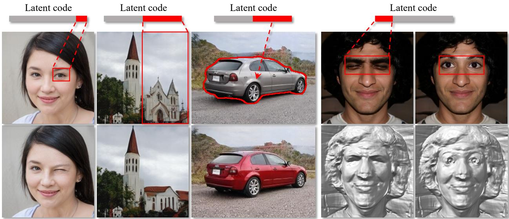  
Figure 1. Precise local control achieved by LinkGAN, where we can manipulate the image content within a spatial region (e.g., a single eye or the right half of the image) or a semantic category (e.g., car) simply by resampling the latent code on some sparse axes. Our approach works well for 2D image syntheses, like StyleGAN2 [27] (left three columns), and 3D-aware image synthesis, like EG3D [5] (right two columns). It is noteworthy that, under the 3D-aware case, we can control both the appearance and the underlying geometry.

## Abstract

This work presents an easy-to-use regularizer for GAN training, which helps explicitly link some axes of the latent space to a set of pixels in the synthesized image. Establishing such a connection facilitates a more convenient local control of GAN generation, where users can alter the image content only within a spatial area simply by partially resampling the latent code. Experimental results confirm four appealing properties of our regularizer, which we call LinkGAN. (1) The latent-pixel linkage is applicable to either a fixed region (i.e., same for all instances) or a particular semantic category (i.e., varying across instances), like the sky. (2) Two or multiple regions can be independently linked to different latent axes, whichfurther supportsjoint control. (3) Our regularizer can improve the spatial controllability of both 2D and 3D-aware GAN models, barely sacrificing the synthesis performance. (4) The models trained with our regularizer are compatible with GAN inversion techniques and maintain editability on real images. Project page can befound here.

## 1. Introduction

Generative adversarial networks (GANs) [12] have been shown to produce photo-realistic and highly diverse images, facilitating a wide range of real world applications [21, 36, 11, 41, 42]. The generator in a GAN is formulated to take a randomly sampled latent code as the input and output an image with a feed forward network. Given a welllearned GAN model, it is generally accepted that a variety of semantics and visual concepts automatically emerge in the latent space [57, 43, 14, 22, 64], which naturally support image manipulation. Some recent work also reveals the potential of GANs in local editing by steering the latent code along a plausible trajectory in the latent space [30, 63].

However, most studies on the relationship between the latent codes and their corresponding images depend on a posterior discovery, which usually suffers from three major drawbacks. (1) Instability: The identification of emerging latent semantics is very sensitive to the samples used for analysis, such that different samples may lead to different results [14, 42]. (2) Inaccuracy: Given the highdimensional latent space (e.g., 512d in the popular Style-GAN family [26, 27]), finding a semantically meaningful subspace can be challenging. (3) Inflexibility: Existing manipulation models are usually linear (i.e., based on vector arithmetic [42, 22]), limiting the editing diversity.

This work offers a new perspective on learning controllable image synthesis. Instead of discovering the semantics from pre-trained GAN models, we introduce an efficient regularizer into the training of GANs, which is able to explicitly link some latent axes with a set of image pixels. In this way, the selected axes and the remaining axes are related to the in-region pixels and out-region pixels, respectively, with little cross-influence (see Fig. 1). Such a design, termed as LinkGAN, enables a more accurate and more convenient control of the generation, where we can alter the image content within the linked region simply by resampling on the corresponding axes.

We conduct experiments on various datasets to evaluate the efficacy of LinkGAN and demonstrate its four appealing properties. (1) It is possible to link an arbitrary image region to the latent axes, no matter the region is pre-selected before training and fixed for all instances, or refers to a semantic category and varies across instances (see Sec. 4.2.1). (2) Our regularizer is capable of linking multiple regions to different sets of latent axes independently, and allows joint manipulation of these regions (see Sec. 4.2.2). (3) Our approach lends itself well to both 2D image synthesis models [27] and 3D-aware image synthesis models [5], appearing as sufficiently improving the controllability yet barely harming the synthesis performance. (4) The models trained with our regularizer are compatible with GAN inversion techniques [65] and maintain the editability on real images (see Sec. 4.3). We believe that this work makes a big step towards the spatial controllability of GANs as well as the explicit disentanglement of GAN latent space. It can be expected that the new characteristic (i.e., the latentpixel linkage) of generative models could open up more possibilities and inspire more applications in the future.

## 2. Related Work

Generative adversarial networks (GANs) are composited by a generator and a discriminator, which are trained simultaneously by playing a two-player minimax game [12], have made tremendous progress in generating high quality and diverse images [26, 27, 25, 4, 56]. In turn, there are widely used in a variety of tasks, such as representation learning [23, 55], image-to-image translation [21, 8], image segmentation [61], 3D generation [54, 5, 44], etc.

Regularizers for GAN training. Many attempts have been made to regularize GANs during training [13, 31, 27, 52, 15, 39, 56]. Some of them try to improve the training stability of GANs by regularizing the gradients of the discriminator [13, 31], the spectral norm of each layer [32], or the singular values of the generator [35]. Besides, some of them [39, 52, 15, 27] aim to improve the disentanglement property of GANs. For example, [39, 52] try to disentangle each component in the latent vectors so that each dimension in the latent codes can only affect one attribute on the output images by adding some regularizers (e.g., Hessian Penalty or Orthogonal Jacobian Regularization).

Image editing with GANs. Image editing using GANs includes many different tasks, such as style transfer [58, 18], image-to-image translation [66, 51, 7, 36, 37], and semantic image editing using pre-trained GANs [42, 57, 22]. For semantic image editing tasks, one line of work is focused on controlling the image globally [42, 57, 43, 14, 22, 6, 40, 47, 49, 29, 50, 60], and another is focused on controlling the image locally [48, 55, 53, 2, 1, 9, 28, 24, 30, 63, 64]. For local image control, the straightforward way is to employ region-based feature modification [48, 55, 2, 37], which highly relies on the spatial correspondence between the feature maps and the synthesized images. An alternative way is to control from the latent space [9, 30, 63] yet suffers from limited controllability $( e . g .$ , it is hard to close one eye with the other kept open).

Independent latent axis control. There are many studies in the literature exploring the independent control of the latent axes of GANs [10, 45, 20, 19, 34, 33, 46, 11], such that we can partially re-configure the generated image through resampling the latent code on some axes. Among them, [10, 45] target aligning the latent axes with some image attributes under the supervision of pre-trained attribute classifiers, which treat the entire image as a whole, limiting their applications in local control. Some attempts have been made towards compositional image synthesis [20, 19, 34, 33], which employs separate latent codes to take responsibility for the generation of different objects. LDBR [17] introduces block-wise latent space and manages to build a spatial correspondence between per-block latents and image patches. Infinite image generation [46, 11], which is able to expand (e.g., outpainting) the synthesis through sampling the latent code repeatedly, can be viewed as a special type of independent latent axis control. Compared to previous work, our approach is far more flexible in two folds. (1) We introduce a simple regularizer into GAN training, with no need for architecture re-designing. (2) We manage to link the latent axes with an arbitrary set of image pixels.

## 3. Method

In this section, we introduce a simple yet effective regularizer such that some latent axes of GANs can be explicitly linked to a set of image pixels after training. We first give a brief introduction of GAN formulation in Sec. 3.1 and describe how to establish the latent-pixel linkage in Sec. 3.2.

## 3.1. Preliminaries

A GAN model consists of a generator $G ( \cdot )$ that maps latent vectors $z \sim p ( z )$ to fake images, $i . e . \ \tilde { \pmb { x } } = G ( \pmb { z } )$ , and a discriminator $D ( \cdot )$ that tries to differentiate fake images from real ones. They are trained in an adversarial manner in the sense that the generator tries to fool the discriminator. The training loss can be formulated as follows:

$$
\mathcal { L } _ { G } = \mathbb { E } _ { p ( \tilde { \pmb { x } } ) } [ f ( 1 - D ( \tilde { \pmb { x } } ) ) ] ,\tag{1}
$$

$$
\mathcal { L } _ { D } = \mathbb { E } _ { p ( \pmb { x } ) } [ f ( D ( \pmb { x } ) ) ] - \mathbb { E } _ { p ( \pmb { \tilde { x } } ) } [ f ( 1 - D ( \pmb { \tilde { x } } ) ) ] ,\tag{2}
$$

where $p ( { \pmb x } )$ and $p ( \tilde { { \pmb x } } )$ are the distributions of real images and synthesized images, respectively. Here, $f ( \cdot )$ is a modelspecific function that varies between different GANs.

## 3.2. Linking Latents to Pixels

With the rapid development of manipulation technique, several works [30, 63] have shown that some subspaces of the latent space $( i . e .$ , the W space in StyleGAN [26]) can control local semantics over output images. Specifically, traversing a latent code within those subspaces results in a local modification in the synthesis. However, there lacks an explicit connection between the local regions and the specified axes of latent spaces. To this end, we propose a new regularizer explicitly linking the axes to arbitrary partitions of synthesized images.

Partition of latent codes and images. In order to set up the explicit link between some axes of latent space and local regions of an image, we first introduce some notations for the corresponding partition. Taking StyleGAN [26] as an example, w $\in \mathbb { R } ^ { d _ { w } }$ is the intermediate latent vector of dimension $d _ { w }$ derived from the mapping network. Through a generator $G ( \cdot )$ , an image $\tilde { \pmb { x } } \in \mathbb { R } ^ { \tilde { H } \times W \times C }$ is produced, $i . e . , \ \tilde { x } \ = \ G ( w )$ , and we denote $d _ { x } \ = \ H \times W \times C$ as the dimension of x˜. We first divide the latent space into several subspaces. Namely, a latent code w could be divided into K partitions and each partition consists of multiple channels, i.e., $\pmb { w } = [ \pmb { w } _ { 1 } , \pmb { w } _ { 2 } , \dots , \pmb { w } _ { K } ]$ , where $\mathbf { \boldsymbol { w } } _ { i } \in \mathbb { R } ^ { n _ { i } }$ and $\Sigma _ { i = 1 } ^ { K } n _ { i } = d _ { w }$ . Similarly, an image x˜ could also produce several partitions i.e., $\tilde { \pmb { x } } = [ \tilde { \pmb { x } } _ { 1 } , \tilde { \pmb { x } } _ { 2 } , \dots , \tilde { \pmb { x } } _ { K } ]$ where $\tilde { \pmb { x } } _ { i } \in \mathbb { R } ^ { m _ { i } }$ and $\Sigma _ { i = 1 } ^ { K } m _ { i } = d _ { x }$ . For convenience, we further define $\mathbf { \Delta } \mathbf { w } _ { i } ^ { c }$ and $\tilde { \mathbfit { x } } _ { i } ^ { c }$ are the complements of ${ \pmb w } _ { i }$ and $\tilde { \mathbf { x } } _ { i } ,$ respectively, i.e., ${ \pmb w } _ { i } ^ { c } \ = \ [ { \pmb w } _ { 1 } , \ldots , { \pmb w } _ { i - 1 } , { \pmb w } _ { i + 1 } , \ldots , { \pmb w } _ { K } ] ,$ $\tilde { \pmb { x } } _ { i } ^ { c } = [ \tilde { \pmb { x } } _ { 1 } , \ldots , \tilde { \pmb { x } } _ { i - 1 } , \tilde { \pmb { x } } _ { i + 1 } , \ldots , \tilde { \pmb { x } } _ { K } ] ,$ . Fig. 2 presents an example (K is equal to 2) where the blue part of the latent code and pixels within the blue bounding box denotes the partitions ${ \pmb w } _ { i }$ and ${ \tilde { \mathbf { x } } } _ { i } .$ , respectively. Now, our goal is that the latent fragment ${ \pmb w } _ { i }$ only controls the pixels in $\tilde { \mathbf { x } } _ { i }$ and $\mathbf { \Delta } \mathbf { w } _ { i } ^ { c }$ controls the pixels in $\tilde { \mathbfit { x } } _ { i } ^ { c }$ , namely, building an explicit link.

Learning objectives. To our surprise, we find in practice that a simple regularizer combined with the StyleGAN framework is sufficient to achieve this goal. Formally, we can randomly perturb ${ \pmb w } _ { i }$ and $\pmb { w } _ { i } ^ { c }$ and then minimize the variations on $\tilde { \mathbfit { x } } _ { i } ^ { c }$ and $\tilde { \mathbf { x } } _ { i } .$ , respectively, expecting that ${ \pmb w } _ { i }$ merely controls $\tilde { \mathbf { x } } _ { i }$ and hardly affects $\tilde { \mathbf { \pmb { x } } } _ { i } ^ { c }$ and vice versa. Specifically, we can perturb the ${ \pmb w } _ { i }$ partition among w by given vector $\mathbf { \nabla } _ { \mathbf { p } _ { i } }$ sampled from a standard Gaussian distribution ${ \mathcal { N } } ( \mathbf { 0 } , I ^ { n _ { i } } )$ and get the perturbed image, $\begin{array} { r c l c l } { i . e . , \ \tilde { x } _ { 1 } } & { = } & { G _ { w } ^ { \prime } ( w _ { i } , \alpha p _ { i } ) } & { \triangleq } & { G ( [ w _ { 1 } , \ldots , w _ { i - 1 } , w _ { i } \ + } \end{array}$ $\alpha { \pmb \alpha } _ { 1 } , { \pmb w } _ { i + 1 } , \dots , { \pmb w } _ { K } ] )$ , where α is the perturbation strength. Furthermore, we can get the perturbed image using a vector $\pmb { p } _ { i } ^ { c } \ \in \ \mathcal { N } ( \mathbf { 0 } , \pmb { I } ^ { d _ { w } - n _ { i } } )$ to perturb $\pmb { w } _ { i } ^ { c }$ $i . e . , \ \tilde { { \pmb x } } _ { 2 } =$ $G _ { w } ^ { \prime } ( { \pmb w } _ { i } ^ { c } , \alpha { \pmb p } _ { i } ^ { c } )$ . After obtaining the perturbed images, we can compute the variations in each part. The pixel change in $\tilde { \mathbf { x } } _ { i }$ after the perturbation by $\mathbf { \Delta } _ { \pmb { p } _ { i } ^ { c } }$ can be computed as

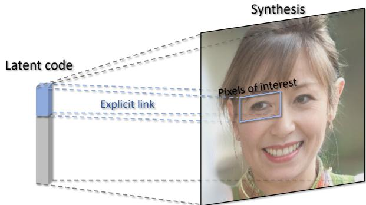  
Figure 2. Concept diagram of LinkGAN, where some axes of the latent space are explicitly linked to the image pixels of a spatial area. In this way, we can alter the image content within the linked region simply by resampling the latent code on these axes.

$$
\begin{array} { r l } & { \mathcal { L } _ { i } = | | M _ { i } \odot ( \tilde { \pmb { x } } _ { 2 } - \tilde { \pmb { x } } ) | | _ { 2 } ^ { 2 } } \\ & { \quad = | | M _ { i } \odot ( G _ { \pmb { w } } ^ { \prime } ( \pmb { w } _ { i } ^ { c } , \alpha \pmb { p } _ { i } ^ { c } ) - G ( \pmb { w } ) ) | | _ { 2 } ^ { 2 } , } \end{array}\tag{3}
$$

where $M _ { i }$ is the binary mask indicating the chosen pixels of interest $( i . e .$ , selecting the pixels in the blue box in Fig. 2), $| | \mathbf { \theta } \cdot \mathbf { \theta } | | _ { 2 }$ denotes the $\ell _ { 2 }$ norm. We enforce the pixels to change in the region $\tilde { \mathbf { x } } _ { i }$ as minimally as possible after the perturbation by $\mathbf { \Delta } _ { \pmb { p } _ { i } ^ { c } }$ . Similarly, the pixels change in $\tilde { \mathbf { \pmb { x } } } _ { i } ^ { c }$ after the perturbation by $\mathbf { \nabla } p _ { i }$ can be written as

$$
\begin{array} { r l } & { \mathcal { L } _ { i } ^ { c } = | | M _ { i } ^ { c } \odot ( \tilde { \pmb { x } } _ { 1 } - \tilde { \pmb { x } } ) | | _ { 2 } ^ { 2 } } \\ & { \quad \quad = | | M _ { i } ^ { c } \odot ( G _ { \pmb { w } } ^ { \prime } ( \pmb { w } _ { i } , \alpha \pmb { p } _ { i } ) - G ( \pmb { w } ) ) | | _ { 2 } ^ { 2 } , } \end{array}\tag{4}
$$

where $M _ { i } ^ { c }$ is the binary mask denoting the region out of interest. These two losses $\mathcal { L } _ { i }$ and $\mathcal { L } _ { i } ^ { c }$ can be integrated as a regularizer in the StyleGAN framework

$$
\begin{array} { r } { \mathcal { L } _ { r e g } ^ { i } = \lambda _ { 1 } \mathcal { L } _ { i } + \lambda _ { 2 } \mathcal { L } _ { i } ^ { c } , } \end{array}\tag{5}
$$

where $\lambda _ { 1 }$ and $\lambda _ { 2 }$ are the weights to balance these two terms. Therefore, the total loss to train the generator in StyleGAN can be formulated as

$$
\mathcal { L } = \mathcal { L } _ { G } + \sum _ { i = 1 } ^ { k } \mathcal { L } _ { r e g } ^ { i } ,\tag{6}
$$

where k $( 1 \leq k \leq K )$ is the number of links we want to build. Practically, we could apply the new regularization in a lazy way, in the sense that $\textstyle \sum _ { j = 1 } ^ { k } \mathcal { L } _ { r e g } ^ { j }$ is calculated once every several iterations (8 iterations in this paper), greatly improving the training efficiency. Additionally, the perturbed images would be also fed into the discriminator during training.

## 4. Experiments

## 4.1. Experimental Setup

We conduct extensive experiments to evaluate our proposed method. We mainly conduct our experiment on StyleGAN2 [27] and EG3D [5] models. The datasets we use are FFHQ [26], AFHQ [8], LSUN-Church, and LSUN-Car [59]. We also use a segmentation model [62] to select pixels with the same semantic (e.g., all the pixels in the sky on LSUN-Church), which is often used by previous work [3, 2, 53]. The main metrics we use to qualify our method are Frechet Inception Distance (FID) [´ 16] and the masked Mean Squared Error (MSE) [63]. The experiments are organized as follows. First, Sec. 4.2 shows the properties of LinkGAN, which can relate an arbitrary region in the image to the latent fragment. Second, Sec. 4.3 gives some applications of our method, such as local control on the 3D generative model, real images, and some comparisons with the baselines.At last, an ablation study on the size of the link latent subspace is presented in Sec. 4.4. For the experiment details and more results, please refer to the Supplementary Material, in which we also include a video that provides continuous control via interpolating the original and the resampled latent codes.

## 4.2. Properties of LinkGAN

In this section, we mainly demonstrate the effectiveness of the proposed approach by explicitly linking the pixels in any region (both the single region or multi-regions) to a partition of the corresponding latent codes, while seldom deteriorating the quality of synthesis. Tab. 1 reports FID on different datasets when our regularizer is added, from which we can see our regularizer only has a minor influence on the synthesized quality. Empirically, we find that it would more stable if the proposed regularizer is incorporated after the convergence of the generator. Therefore, we start training from a relatively well-trained generator and equipping it with our approach.

## 4.2.1 Linking Latents to Single Region

Regarding the partition of latent codes, we could easily choose the first several channels as one group. Accordingly, the remaining ones become the complementary code. Therefore, the goal of the proposed regularizer is to enable the explicit control of certain regions of interest through the chosen channels. Note that the number of first channels that would be grouped usually depends on the area ratio of the chosen region over the entire image. In the following context, we will show different ways of choosing pixels out of images and building explicit links between the chosen channels and pixels.

Table 1. Performance change after introducing our proposed regularizer into 2D and 3D baselines, where the synthesis quality slightly drops but the controllability significantly improves (see Figs. 3 to 6 for details).
<table><tr><td></td><td colspan="3">StyleGAN2 [27]</td><td>EG3D [5]</td></tr><tr><td>Dataset</td><td>FFHQ AFHQ</td><td>Car</td><td>Church</td><td>FFHQ</td></tr><tr><td>LDBR [17]</td><td>12.24</td><td></td><td>8.68</td><td></td></tr><tr><td>w/o Linking</td><td>3.98 8.44</td><td>2.95</td><td>3.82</td><td>4.28</td></tr><tr><td>LinkGAN (ours)</td><td>5.00 9.85</td><td>3.09</td><td>3.97</td><td>4.25</td></tr></table>

Region-based control. One general way of grouping pixels is to use a bounding box that could cover a rectangle region. Fig. 3 presents the qualitative results of choosing different regions randomly. Red bounding boxes in Fig. 3 denote the chosen regions of interest. In terms of animal faces on AFHQ, we randomly select two spatial patches and link each region to a specific latent fragment (e.g., the latent fragment can be localized at a random position). Obviously, after building the explicit link, we could merely change the chosen regions by perturbing the corresponding partition of latent codes, while maintaining the rest regions untouched. Besides, perturbing the complementary latent codes results in substantial change for regions out of interest, demonstrating that the spatial controlling is well-built by the proposed explicit link. Additionally, we also verify the effectiveness of our regularizer on various datasets. For instance, the connection between a partition of latent code and half of the entire image (i.e., Church and Car) also could be easily set up, causing appealing editing results. The LSUN Church and Car results imply that even if the images are not aligned, we can still build a link and get satisfying editing results. In other words, whether images are aligned does not affect the linkage construction. The difference maps further present how well such an explicit link could control a region of interest.

Semantic-based control. Prior experimental results demonstrate the control on a rectangle region that seems to be irrelevant to a certain visual concept. Namely, this link is semantic-agnostic since it merely bridges several channels with spatial locations rather than semantics. Therefore, we further conduct experiments on semantic controlling. To be specific, by leveraging an off-the-shelf segmentation model [62], we could easily obtain mask annotations that specify various semantics. Fig. 4 presents the semantic control on two datasets, LSUN Church and Car [59]. In particular, churches and cars are chosen as the semantics that we would like to build a link between latent space to, no matter where the chosen semantics are. Similarly, we manage to connect several channels of latent space with a given semantic such that perturbing the chosen channels will result in the obvious change of semantics. For instance, the color and shape of a church vary while the sky keeps the same and vice versa. Regarding the experiments on cars, the color could be modified no matter what cars face and how many pixels cars occupy. All these results together with the rectangle region control demonstrate the arbitrary region control enabled by our approach.

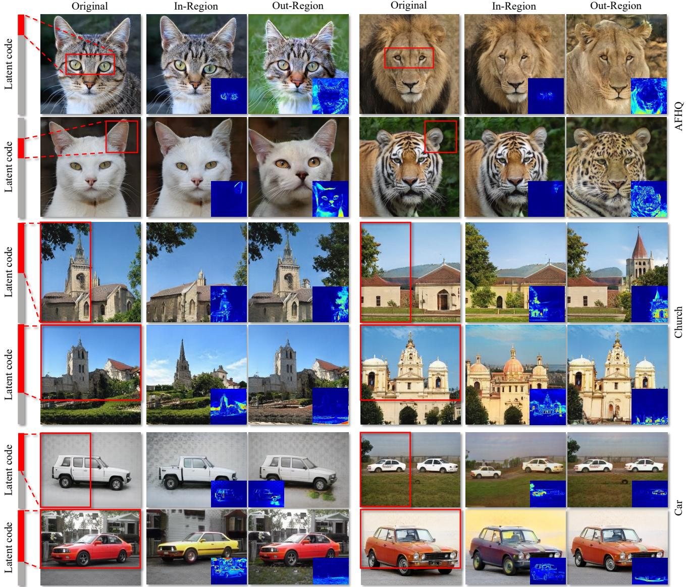  
Figure 3. Linking latents to single fixed region, which is pre-selected before training and shared by all instances. Linked latent subspace and regions are highlighted with red fragments and boxes, respectively, and the heatmaps reflect the change of pixel values after in-region resampling and out-region resampling. We find that LinkGAN can robustly link the latent to an arbitrary image region.

## 4.2.2 Linking Latents to Multiple Regions

After checking the effectiveness of our approach to build one explicit link, a natural question then arises: is it possible to link multiple regions of interest to multiple partitions of latent codes? The answer is yes. Fig. 5 presents the corresponding results. On the top group, we link three subspaces to three image regions i.e., eyes, top-left, and topright regions, respectively. Even though we could remain to manipulate semantics individually. The bottom one moves forward to a more challenging setting where both latent spaces and images are equally divided into four groups and four corners without any overlap. To this end, we could tell that such a regularizer could build a full explicit link between the entire latent space and the whole synthesis in a disentangled way. Namely, we can even tokenize an image and assign one subspace to each token.

In-Region  
Original  
In-Region  
Out-Region  
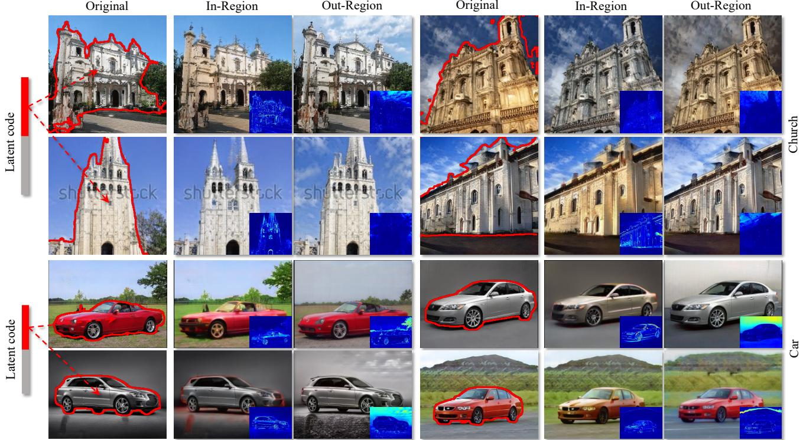

Figure 4. Linking latents to the semantic region (i.e., church and car), which dynamically varies across instances. Our LinkGAN manages to precisely control a particular semantic category simply by resampling on some sparse latent axes.  
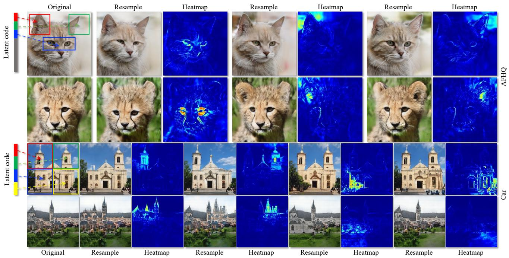  
Figure 5. Linking latents to multiple regions, where the linked latent subspaces and image regions are highlighted using different colors. Each linked region can be independently controlled by partially resampling the corresponding latent code.

## 4.3. Applications of LinkGAN

In this part, we show that our proposed method can be used in various applications, such as controlling 3D generative models, real image manipulation, and precise local image editing, etc.

Towards 3D-aware generation. We implement our regularizer on the 3D generative model EG3D [5]. Surprisingly, our regularizer performs well not only in controlling the RGB images but also in controlling the geometry of the corresponding image, showing the good generalization ability of our regularizer. Fig. 6 shows the results of controlling the mouth and nose region by perturbing the first 64 channels of latent codes. Importantly, controlling the linked subspace simultaneously changes the RGB images and their geometry, i.e., mouth is opening for both RGB and corresponding 3D geometry.

Inversion  
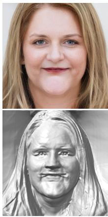

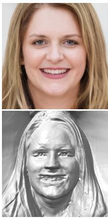  
Original

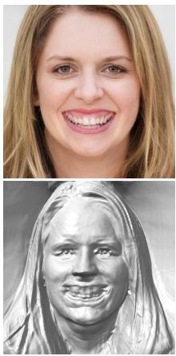  
+

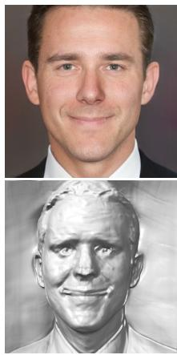

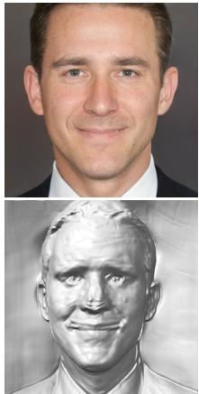  
Original

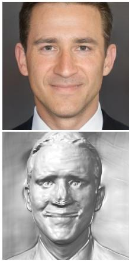  
+  
Figure 6. Controllability on 3D-aware generative model, i.e., EG3D [5], under the cases of mouth and nose. We find that LinkGAN is well compatible with 3D-aware image synthesis and allows controlling both the appearance and the underlying geometry.

Real image editing. After the generator is trained, we can use the property of the trained generator to control real images locally by inversion [65, 27]. Fig. 7 shows the editing results on the real image, in which the eyes can be independently controlled, i.e., we can only open one eye yet keep another eye untouched. In this case, we need to explicitly link two eye regions to two latent subspaces, i.e., one subspace controls one eye. And when the generator is well-learned, we can edit the eye region by controlling the corresponding subspace on the inverted latent code.

Comparison with existing methods. Now we compare our method with some state-of-the-art algorithms. We choose LDBR [17], StyleSpace [53], StyleCLIP [38], and ReSeFa [64] to compare. For LDBR, we report FID in Tab. 1, from which we can see that our method significantly outperforms it.1 And for the rest methods, we compare the accuracy when editing the eyes, nose, and mouth of the face synthesis. Tab. 2 reports the masked MSE between our method and these baselines when controlling those three regions. Namely, when editing a specific region, we want the change in this region to be as larger as possible (the higher MSEi, the better) and the change in the remaining region as small as possible (the smaller MSEo, the better). For these methods, we can observe that the MSEs within the edited regions are comparable. However, regarding the MSEs out of the edited regions, our method significantly outperforms these three baselines. Fig. 8 gives the qualitative comparison with ReSeFa, and for the comparison with other methods, we include them in Supplementary Material due to the limited space. From Fig. 8, we can observe that our method can reach more precise control on the local regions than ReSeFa. For instance, when modifying eyes, ReSeFa also results in a change of face color. On the contrary, when editing the specific region, our method has negligible changes in the other regions.

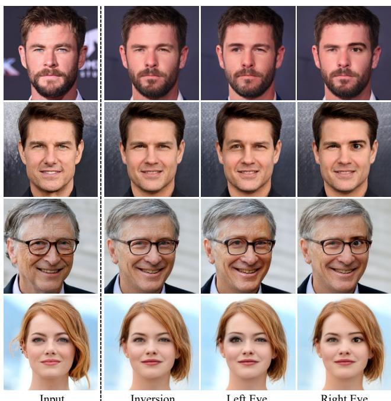  
Input  
Left Eye  
Figure 7. Real image editing achieved by LinkGAN via borrowing the GAN inversion technique [27]. We manage to edit the two eyes of human independently in a very convenient way, i.e., partially resampling the inverted code.

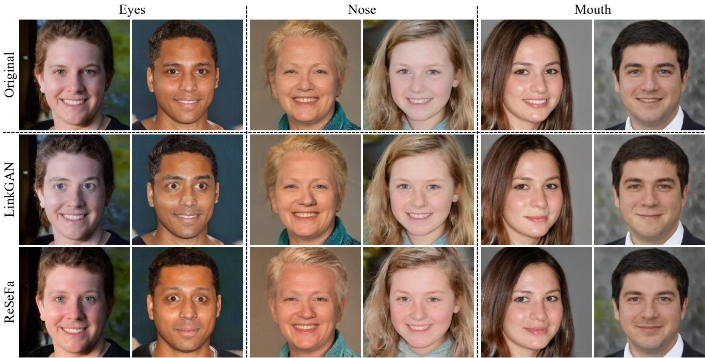  
Figure 8. Qualitative comparison with ReSeFa [64], which posteriorly discovers semantics from a pre-trained model, on the task of loca editing. LinkGAN achieves more precise control within the regions of interest. See Tab. 2 for quantitative results.

## 4.4. Ablation Study on Linking Dimensionality

In this part, we conduct an ablation study on how many axes are required to build an explicit link. Eyes of faces are chosen as regions of interest. Tab. 3 gives the quantitative results of changing in/out eye regions with the same perturbation strength. In Tab. 3, all the training configurations are the same except for the number of axes during training. $\mathrm { M S E } _ { i }$ and $\mathbf { M S E } _ { o }$ are computed in and out of the eye region when perturbing on their complementary latent space, respectively. Take axes number 8 as an example, the MSE is computed within the eye region when perturbing on axes from 8 to 512, while $\mathbf { M S E } _ { o }$ is computed out of the eye region perturbing on axes from 0 to 8. In such a way, precise control could be obtained since the perturbing on the complementary latent space should barely influence the regions of interest. Hence, in this situation, both $\mathrm { M S E } _ { i }$ and $\mathbf { M S E } _ { o }$ are the smaller, the better. Obviously, when occupying the first 64 axes, we can get satisfying results since the sum of them is the smallest. In practice, we set the number of axes in latent code to 64 in most cases, such as when controlling on eyes, nose, mouth, etc.

## 5. Discussion and Conclusion

We have demonstrated the success of our approach in linkage building, flexible controllability, and more precise spatial control. Still, there are some limitations. For example, the built linkage is not perfect, such as when editing a specific part, the remaining area is slightly influenced as the $\mathbf { M S E } _ { o }$ shown in Tab. 2. The success of this linkage also brings a side effect, $i . e .$ , the inconsistency sometime will appear on the image after we resample part of the latent code, see the detailed analysis in Supplementary Material. In summary, this work proposes LinkGAN that explicitly links some latent axes to some specific pixels in the images by utilizing an easy yet powerful regularizer. Extensive experiments demonstrate the capability of LinkGAN in local synthesis control using the precisely linked latent subspace.

Table 2. Quantitative comparison with baselines on the task of local editing. Pixel-wise mean square error (MSE) within/out of the region of interest (scaled by $1 \stackrel { \cdot \mathrm { - } 3 } { e }$ for better readability) is used as the metric. Lower $\mathrm { M S E } _ { o }$ and higher $\mathrm { M S E } _ { i }$ are better.
<table><tr><td>Region</td><td>Eyes</td><td>Nose</td><td></td><td>Mouth</td></tr><tr><td>Metrics</td><td>MSEi  $\overline { { \mathrm { M S E } _ { o } } }$ </td><td></td><td>MSEi MSE。</td><td>MSEi MSE。</td></tr><tr><td>StyleCLIP [38]</td><td>3.91</td><td>74.17 1.91</td><td>72.73</td><td>3.81 65.42</td></tr><tr><td>ReSeFa [64]</td><td>5.90 61.14</td><td>1.12</td><td>60.4</td><td>2.02 50.55</td></tr><tr><td>StyleSpace [53]</td><td>3.81 18.21</td><td>0.40</td><td>14.30</td><td>3.6 19.04</td></tr><tr><td>LinkGAN (ours)</td><td>5.25 2.24</td><td>1.82</td><td>2.25</td><td>3.10 2.21</td></tr></table>

Table 3. Ablation study on the linking dimensionality. $\mathrm { M S E } _ { i }$ measures the effect of unlinked axes on the linked region, while $\mathrm { M S E } _ { o }$ measures the effect of linked axes on the unlinked region, both of which enjoy a small value. All numbers are scaled by $\bar { 1 } e ^ { - 3 }$ for better readability.
<table><tr><td># Linked axes</td><td>8</td><td>16</td><td>32</td><td>64</td><td>128</td><td>256</td></tr><tr><td>MSEi</td><td>17.45</td><td>16.70</td><td>3.29</td><td>0.95</td><td>0.78</td><td>0.43</td></tr><tr><td>MSE。</td><td>0.86</td><td>1.53</td><td>7.41</td><td>8.20</td><td>8.71</td><td>24.78</td></tr></table>

## References

[1] David Bau, Steven Liu, Tongzhou Wang, Jun-Yan Zhu, and Antonio Torralba. Rewriting a deep generative model. In Eur. Conf. Comput. Vis., 2020. 2

[2] David Bau, Jun-Yan Zhu, Hendrik Strobelt, Bolei Zhou, Joshua B. Tenenbaum, William T. Freeman, and Antonio Torralba. GAN dissection: Visualizing and understanding generative adversarial networks. In Int. Conf. Learn. Represent., 2019. 2, 4

[3] David Bau, Jun-Yan Zhu, Jonas Wulff, William Peebles, Hendrik Strobelt, Bolei Zhou, and Antonio Torralba. Seeing what a gan cannot generate. In Int. Conf. Comput. Vis., 2019. 4

[4] Andrew Brock, Jeff Donahue, and Karen Simonyan. Large scale GAN training for high fidelity natural image synthesis. In Int. Conf. Learn. Represent., 2019. 2

[5] Eric R. Chan, Connor Z. Lin, Matthew A. Chan, Koki Nagano, Boxiao Pan, Shalini De Mello, Orazio Gallo, Leonidas Guibas, Jonathan Tremblay, Sameh Khamis, Tero Karras, and Gordon Wetzstein. Efficient geometry-aware 3D generative adversarial networks. In IEEE Conf. Comput. Vis. Pattern Recog., 2022. 1, 2, 4, 6, 7

[6] Anton Cherepkov, Andrey Voynov, and Artem Babenko. Navigating the GAN parameter space for semantic image editing. In IEEE Conf. Comput. Vis. Pattern Recog., 2021. 2

[7] Yunjey Choi, Minje Choi, Munyoung Kim, Jung-Woo Ha, Sunghun Kim, and Jaegul Choo. StarGAN: Unified generative adversarial networks for multi-domain image-to-image translation. In IEEE Conf. Comput. Vis. Pattern Recog., 2018. 2

[8] Yunjey Choi, Youngjung Uh, Jaejun Yoo, and Jung-Woo Ha. StarGAN v2: Diverse image synthesis for multiple domains. In IEEE Conf. Comput. Vis. Pattern Recog., 2020. 2, 4

[9] Edo Collins, Raja Bala, Bob Price, and Sabine Susstrunk. Editing in style: Uncovering the local semantics of GANs. In IEEE Conf. Comput. Vis. Pattern Recog., 2020. 2

[10] Chris Donahue, Zachary C Lipton, Akshay Balsubramani, and Julian McAuley. Semantically decomposing the latent spaces of generative adversarial networks. In Int. Conf. Learn. Represent., 2018. 2

[11] Patrick Esser, Robin Rombach, and Bjorn Ommer. Taming transformers for high-resolution image synthesis. In IEEE Conf. Comput. Vis. Pattern Recog., 2021. 1, 2

[12] Ian Goodfellow, Jean Pouget-Abadie, Mehdi Mirza, Bing Xu, David Warde-Farley, Sherjil Ozair, Aaron Courville, and Yoshua Bengio. Generative adversarial nets. In Adv. Neural Inform. Process. Syst., 2014. 1, 2

[13] Ishaan Gulrajani, Faruk Ahmed, Martin Arjovsky, Vincent Dumoulin, and Aaron C Courville. Improved training of wasserstein GANs. In Adv. Neural Inform. Process. Syst., 2017. 2

[14] Erik Hark¨ onen, Aaron Hertzmann, Jaakko Lehtinen, and¨ Sylvain Paris. GANSpace: Discovering interpretable GAN controls. In NeurIPS, 2020. 1, 2

[15] Zhenliang He, Meina Kan, and Shiguang Shan. EigenGAN: Layer-wise eigen-learning for GANs. In Int. Conf. Comput. Vis., 2021. 2

[16] Martin Heusel, Hubert Ramsauer, Thomas Unterthiner, Bernhard Nessler, and Sepp Hochreiter. GANs trained by a two time-scale update rule converge to a local nash equilibrium. In Adv. Neural Inform. Process. Syst., 2017. 4

[17] Sarah Hong, Martin Arjovsky, Darryl Barnhart, and Ian Thompson. Low distortion block-resampling with spatially stochastic networks. In Adv. Neural Inform. Process. Syst., 2020. 2, 4, 7

[18] Xun Huang and Serge Belongie. Arbitrary style transfer in real-time with adaptive instance normalization. In Int. Conf. Comput. Vis., 2017. 2

[19] Drew A Hudson and C. Lawrence Zitnick. Compositional transformers for scene generation. In Adv. Neural Inform. Process. Syst., 2021. 2

[20] Drew A Hudson and C. Lawrence Zitnick. Generative adversarial transformers. In Int. Conf. Mach. Learn., 2021. 2

[21] Phillip Isola, Jun-Yan Zhu, Tinghui Zhou, and Alexei A Efros. Image-to-image translation with conditional adversarial networks. In IEEE Conf. Comput. Vis. Pattern Recog., 2017. 1, 2

[22] Ali Jahanian, Lucy Chai, and Phillip Isola. On the ”steerability” of generative adversarial networks. In Int. Conf. Learn. Represent., 2020. 1, 2

[23] Donahue Jeff and Simonyan Karen. Large scale adversarial representation learning. In Adv. Neural Inform. Process. Syst., 2019. 2

[24] Omer Kafri, Or Patashnik, Yuval Alaluf, and Daniel Cohen-Or. Stylefusion: Disentangling spatial segments in stylegangenerated images. ACM Trans. Graph., 2022. 2

[25] Tero Karras, Miika Aittala, Samuli Laine, Erik Hark¨ onen,¨ Janne Hellsten, Jaakko Lehtinen, and Timo Aila. Aliasfree generative adversarial networks. In Adv. Neural Inform. Process. Syst., 2021. 2

[26] Tero Karras, Samuli Laine, and Timo Aila. A style-based generator architecture for generative adversarial networks. In IEEE Conf. Comput. Vis. Pattern Recog., 2019. 2, 3, 4

[27] Tero Karras, Samuli Laine, Miika Aittala, Janne Hellsten, Jaakko Lehtinen, and Timo Aila. Analyzing and improving the image quality of StyleGAN. In IEEE Conf. Comput. Vis. Pattern Recog., 2020. 1, 2, 4, 7

[28] Hyunsu Kim, Yunjey Choi, Junho Kim, Sungjoo Yoo, and Youngjung Uh. Exploiting spatial dimensions of latent in GAN for real-time image editing. In IEEE Conf. Comput. Vis. Pattern Recog., 2021. 2

[29] Xiao Li, Chenghua Lin, Ruizhe Li, Chaozheng Wang, and Frank Guerin. Latent space factorisation and manipulation via matrix subspace projection. In Int. Conf. Mach. Learn., 2020. 2

[30] Huan Ling, Karsten Kreis, Daiqing Li, Seung Wook Kim, Antonio Torralba, and Sanja Fidler. EditGAN: Highprecision semantic image editing. In Adv. Neural Inform. Process. Syst., 2021. 1, 2, 3

[31] Lars Mescheder, Sebastian Nowozin, and Andreas Geiger. Which training methods for GANs do actually converge? In Int. Conf. Mach. Learn., 2018. 2

[32] Takeru Miyato, Toshiki Kataoka, Masanori Koyama, and Yuichi Yoshida. Spectral normalization for generative adversarial networks. In Int. Conf. Learn. Represent., 2018. 2

[33] Thu Nguyen-Phuoc, Christian Richardt, Long Mai, Yong-Liang Yang, and Niloy Mitra. BlockGAN: Learning 3d object-aware scene representations from unlabelled images. In Adv. Neural Inform. Process. Syst., 2020. 2

[34] Michael Niemeyer and Andreas Geiger. Giraffe: Representing scenes as compositional generative neural feature fields. In IEEE Conf. Comput. Vis. Pattern Recog., 2021. 2

[35] Augustus Odena, Jacob Buckman, Catherine Olsson, Tom Brown, Christopher Olah, Colin Raffel, and Ian Goodfellow. Is generator conditioning causally related to GAN performance? In Int. Conf. Mach. Learn., 2018. 2

[36] Taesung Park, Ming-Yu Liu, Ting-Chun Wang, and Jun-Yan Zhu. Semantic image synthesis with spatially-adaptive normalization. In IEEE Conf. Comput. Vis. Pattern Recog., 2019. 1, 2

[37] Taesung Park, Jun-Yan Zhu, Oliver Wang, Jingwan Lu, Eli Shechtman, Alexei A. Efros, and Richard Zhang. Swapping autoencoder for deep image manipulation. In Adv. Neural Inform. Process. Syst., 2020. 2

[38] Or Patashnik, Zongze Wu, Eli Shechtman, Daniel Cohen-Or, and Dani Lischinski. StyleCLIP: Text-driven manipulation of StyleGAN imagery. In Int. Conf. Comput. Vis., 2021. 7, 8

[39] William Peebles, John Peebles, Jun-Yan Zhu, Alexei A. Efros, and Antonio Torralba. The hessian penalty: A weak prior for unsupervised disentanglement. In Eur. Conf. Comput. Vis., 2020. 2

[40] Antoine Plumerault, Herve Le Borgne, and C ´ eline Hudelot.´ Controlling generative models with continuous factors of variations. In Int. Conf. Learn. Represent., 2020. 2

[41] Aditya Ramesh, Mikhail Pavlov, Gabriel Goh, Scott Gray, Chelsea Voss, Alec Radford, Mark Chen, and Ilya Sutskever. Zero-shot text-to-image generation. In Int. Conf. Mach. Learn., 2021. 1

[42] Yujun Shen, Ceyuan Yang, Xiaoou Tang, and Bolei Zhou. InterFaceGAN: Interpreting the disentangled face representation learned by GANs. IEEE Trans. Pattern Anal. Mach. Intell., 2020. 1, 2

[43] Yujun Shen and Bolei Zhou. Closed-form factorization of latent semantics in GANs. In IEEE Conf. Comput. Vis. Pattern Recog., 2021. 1, 2

[44] Zifan Shi, Yujun Shen, Jiapeng Zhu, Dit-Yan Yeung, and Qifeng Chen. 3d-aware indoor scene synthesis with depth priors. In Eur. Conf. Comput. Vis., 2022. 2

[45] Alon Shoshan, Nadav Bhonker, Igor Kviatkovsky, and Gerard Medioni. GAN-control: Explicitly controllable´ GANs. In Int. Conf. Comput. Vis., 2021. 2

[46] Ivan Skorokhodov, Grigorii Sotnikov, and Mohamed Elhoseiny. Aligning latent and image spaces to connect the unconnectable. In Int. Conf. Comput. Vis., 2021. 2

[47] Nurit Spingarn-Eliezer, Ron Banner, and Tomer Michaeli. GAN steerability without optimization. In Int. Conf. Learn. Represent., 2021. 2

[48] Ryohei Suzuki, Masanori Koyama, Takeru Miyato, Taizan Yonetsuji, and Huachun Zhu. Spatially controllable image synthesis with internal representation collaging. arXiv preprint arXiv:1811.10153, 2018. 2

[49] Andrey Voynov and Artem Babenko. Unsupervised discovery of interpretable directions in the GAN latent space. In Int. Conf. Mach. Learn., 2020. 2

[50] Binxu Wang and Carlos R. Ponce. The geometry of deep generative image models and its applications. In Int. Conf. Learn. Represent., 2021. 2

[51] Ting-Chun Wang, Ming-Yu Liu, Jun-Yan Zhu, Andrew Tao, Jan Kautz, and Bryan Catanzaro. High-resolution image synthesis and semantic manipulation with conditional gans. In IEEE Conf. Comput. Vis. Pattern Recog., 2018. 2

[52] Yuxiang Wei, Yupeng Shi, Xiao Liu, Zhilong Ji, Yuan Gao, Zhongqin Wu, and Wangmeng Zuo. Orthogonal jacobian regularization for unsupervised disentanglement in image generation. In Int. Conf. Comput. Vis., 2021. 2

[53] Zongze Wu, Dani Lischinski, and Eli Shechtman. StyleSpace analysis: Disentangled controls for StyleGAN image generation. In IEEE Conf. Comput. Vis. Pattern Recog., 2021. 2, 4, 7, 8

[54] Yinghao Xu, Sida Peng, Ceyuan Yang, Yujun Shen, and Bolei Zhou. 3d-aware image synthesis via learning structural and textural representations. In IEEE Conf. Comput. Vis. Pattern Recog., 2022. 2

[55] Yinghao Xu, Yujun Shen, Jiapeng Zhu, Ceyuan Yang, and Bolei Zhou. Generative hierarchical features from synthesizing images. In IEEE Conf. Comput. Vis. Pattern Recog., 2021. 2

[56] Ceyuan Yang, Yujun Shen, Yinghao Xu, Deli Zhao, Bo Dai, and Bolei Zhou. Improving gans with a dynamic discriminator. In Adv. Neural Inform. Process. Syst., 2022. 2

[57] Ceyuan Yang, Yujun Shen, and Bolei Zhou. Semantic hierarchy emerges in deep generative representations for scene synthesis. Int. J. Comput. Vis., 2020. 1, 2

[58] Jing Yongcheng, Yang Yezhou, Feng Zunlei, Ye Jingwen, and Song Mingli. Neural style transfer: A review. CoRR, 2017. 2

[59] Fisher Yu, Ari Seff, Yinda Zhang, Shuran Song, Thomas Funkhouser, and Jianxiong Xiao. LSUN: Construction of a large-scale image dataset using deep learning with humans in the loop. arXiv preprint arXiv:1506.03365, 2015. 4

[60] Oguz Kaan Y˘ uksel, Enis Simsar, Ezgi G¨ ulperi Er, and Pinar¨ Yanardag. LatentCLR: A contrastive learning approach for unsupervised discovery of interpretable directions. In Int. Conf. Comput. Vis., 2021. 2

[61] Yuxuan Zhang, Huan Ling, Jun Gao, Kangxue Yin, Jean-Francois Lafleche, Adela Barriuso, Antonio Torralba, and Sanja Fidler. DatasetGAN: Efficient labeled data factory with minimal human effort. In IEEE Conf. Comput. Vis. Pattern Recog., 2021. 2

[62] Bolei Zhou, Hang Zhao, Xavier Puig, Tete Xiao, Sanja Fidler, Adela Barriuso, and Antonio Torralba. Semantic understanding of scenes through the ade20k dataset. Int. J. Comput. Vis., 2018. 4

[63] Jiapeng Zhu, Ruili Feng, Yujun Shen, Deli Zhao, Zhengjun Zha, Jingren Zhou, and Qifeng Chen. Low-rank subspaces in GANs. In Adv. Neural Inform. Process. Syst., 2021. 1, 2, 3, 4

[64] Jiapeng Zhu, Yujun Shen, Yinghao Xu, Deli Zhao, and Qifeng Chen. Region-based semantic factorization in GANs. In Int. Conf. Mach. Learn., 2022. 1, 2, 7, 8

[65] Jun-Yan Zhu, Philipp Krahenb¨ uhl, Eli Shechtman, and¨ Alexei A Efros. Generative visual manipulation on the natural image manifold. In Eur. Conf. Comput. Vis., 2016. 2, 7

[66] Jun-Yan Zhu, Taesung Park, Phillip Isola, and Alexei A Efros. Unpaired image-to-image translation using cycleconsistent adversarial networks. In Int. Conf. Comput. Vis., 2017. 2