# M2T: Masking Transformers Twice for Faster Decoding

Fabian Mentzer Google Research mentzer@google.com

Eirikur Agustson Google Research eirikur@google.com

Michael Tschannen Google DeepMind tschannen@google.com

## Abstract

We show how bidirectional transformers trained for masked token prediction can be applied to neural image compression to achieve state-of-the-art results. Such models were previously used for image generation by progressivly sampling groups of masked tokens according to uncertainty-adaptive schedules. Unlike these works, we demonstrate that predefined, deterministic schedules perform as well or better for image compression. This insight allows us to use masked attention during training in addition to masked inputs, and activation caching during inference, to significantly speed up our models ( 4 higher inference speed) at a small increase in bitrate.

## 1. Introduction

Recently, transformers trained for masked token prediction have successfully been applied to neural image and video generation [11, 35]. In MaskGIT [11], the authors use a VQ-GAN [16] to map images to vector-quantized tokens, and learn a transformer to predict the distribution of these tokens. The key novelty of the approach was to use BERT-like [13] random masks during training to then predict tokens in groups during inference, sampling tokens in the same group in parallel at each inference step. Thereby, each inference step is conditioned on the tokens generated in previous steps. A big advantage of BERT-like training with grouped inference versus prior state-of-the-art is that considerably fewer steps are required to produce realistic images (typically 10-20, rather than one per token).

These models are optimized to minimize the cross entropy between the token distribution p modeled by the transformer and the true (unknown) token distribution q, as measured via negative log likelihood (NLL). As is known from information theory, this is equivalent to the bit cost required to (losslessly) store a sample drawn from q with a model p [40]. Indeed, any model p that predicts an explicit joint distribution over tokens in a deterministic way can be turned into a compression model by using p to entropy code the tokens, rather than sampling them.

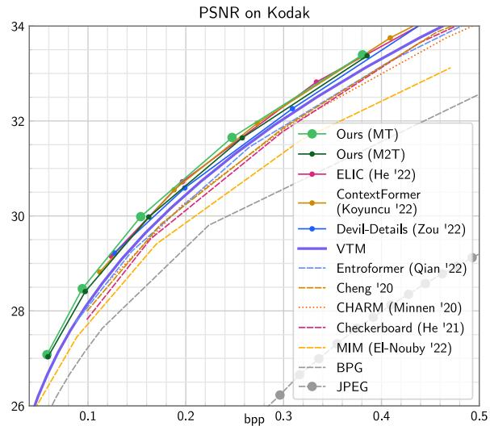  
Figure 1: Rate distortion results on Kodak. Our MT outperforms the prior state-of-the-art ELIC [18]; M2T only incurs a small reduction in rate-distortion performance compared to MT while running about 4 faster on hardware (see Fig. 4)

Motivated by this, we aim to employ masked transformers for neural image compression. Previous work has used masked and unmasked transformers in the entropy model for video compression [38, 25] and image compression [29, 22, 15]. However, these models are often either prohibitively slow [22], or lag in rate-distortion performance [29, 15]. In this paper, we show a conceptually simple transformer-based approach that is state-of-the-art in neural image compression, at practical runtimes. The model is using off-the-shelf transformers, and does not rely on special positional encodings or multi-scale factorizations, in contrast to previous work. Additionally, we propose a new variant combining ideas from MaskGIT-like inputmasked transformers and fully autoregressive attentionmasked transformers. The resulting model masks both the input and attention layers, and allows us to substantially improve runtimes at a small cost in rate-distortion.

To train masked transformers, the tokens to be masked in each training step are usually selected uniformly at random. During inference, the models are first applied to mask tokens only, predicting a distribution for every single token. A sample is then drawn from this distribution and a subset of tokens is uncovered at the input (see Inference/MT in Fig. 2). This step is repeated until no mask tokens remain. Two important questions arise: i) How many tokens do we sample in every step, and ii) which spatial locations do we chose. In MaskGIT, an instance-adaptive scheme is used for (ii), i.e., every sampled image will have a different schedule of locations. In this work, we show that in terms of NLL (and thus bitrate), a fixed schedule performs just as well.

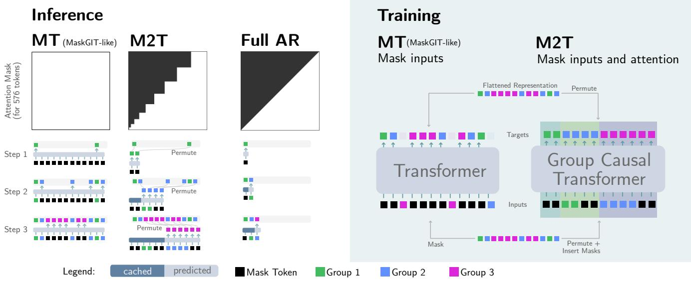  
Figure 2: LEFT: At the top we show the attention masks, at the bottom the first three inference steps. We first show the MaskGIT-like approach MT, where the attention is not masked, and the same number of tokens is fed in each step. In our M2T approach, both the attention and the input is masked, and we uncover the input one group at a time. The causal masks used in the attention allow us to cache activations, i.e.,for shaded blue regions we can cache. Together with the fewer token fed in each (but last) step, this significantly speeds up the model. Finally, we show the fully autoregressive (Full AR) approach for reference, as employed, e.g., in the standard transformer decoder [34]. Our M2T approach is a generalization that allows for group sizes greater than one. RIGHT: Training, shown for 12 tokens only. Note that each input group corresponds to the previous output group with additional mask tokens to align groups of different sizes. The group causal transformer is using attention masking (see Sec. 3.6 for details).

This allows us to generalize ideas used in fully autoregressive transformer decoders like the original model proposed by Vaswani et al. [34], bridging between fully autoregressive and MaskGIT-like transformers, as follows: In autoregressive models, the input sequence is shifted by one token to the right, causing the outputs to align in a casual way, i.e., the i-th output is trained to predict the (i 1)-th input (see “Full AR” in Fig. 2). This can be thought of as a “group-autoregressive” schedule with group size equal to 1. We generalize this idea to group sizes >1: As shown in Fig. 2 (“M2T”), we permute the input such that we can uncover it group by group from left to right, and permute the targets such that each group at the input predicts the next group at the output. To accommodate a sequence of increasing group size (which leads to the best generation/compression performance in practice) we insert mask tokens at the input to pad the i 1-th group to the length of the ith group. During inference, this allows us to run the transformer first on very few tokens, and then more and more. In contrast, MaskGIT-like transformers always feed the same number of tokens (some are masked), corresponding to the full image. We apply this idea to neural image compression, and show that our approach reduces the average compute per output token as it processes fewer tokens in total, at a small cost in bitrate.

Our core contributions in this paper are two models:

Model 1 (MT) A vanilla MaskGIT-like transformer that obtains state-of-the art neural image compression results. In contrast to previous work, we use a conceptually clean approach relying on standard transformers applied to tiles; our method does not require a multi-scale model (“hyperprior”), and we can span a large bitrate regime by using scalar quantization.

Model 2 (M2T) We show how MT can be sped up by masking the transformer twice: both at the input and in the attention layers. As visualized in Fig. 2, the model is faster because it is applied to fewer tokens and because the attention masks make the transformer causal, allowing for caching. Together, this leads to to 2.7 4.8 runtime improvements as measured on accelerators, vs. a MaskGITlike model.

## 2. Related Work

Lossy neural image compression is an active field of research, with advancements being made on two fronts: Entropy models (how to losslessy code a lossy, quantized representation of the image) and transforms (how to encode/decode the representation from/to pixels).

On the transform side, earlier methods used residual blocks [32] and Generalized Divisive Normalization (GDN) [5], but more recently residual blocks with simplified attention [12, 18] and window-based transformers [41, 42] have been employed in state-of-the-art methods. Another line of work tackles generative compression where the synthesis transform is trained to generate texture and low-level detail at low rates [33, 9, 2, 26, 15].

On the entropy modeling side, most methods have built on top of the hyperprior [6] paradigm, where the representation is modelled with a (two-scale) hieararchical latent variable model. Further improvements include channel autoregression, $\mathbf { \ddot { c } H A R M ^ { , } }$ [28], and checkerboard modeling [19], employing a limited number of auto-regression steps over space and/or channels. Fully autoregressive models are sometimes used in the literature [24, 27, 12, 22] to further reduce bitrates, but their prohibitively slow runtimes render them less practical (often requiring minutes to decode high-resolution images).

Recently, transformers have been investigated both for the entropy models and the transforms. Qian et al. [29] fuse together an autoregressive transformer and a hyperprior [6] (using transformer encoders instead of CNNs there as well). They introduce a top-k scheme in the attention layer and a special relative positional encoding to handle arbitrary resolutions. El-Nouby et al. [15] use a Masked Image Model (MIM) combined with a Product Quantization (PQ) variant of VQ-VAE. While the approach is promising for extreme compression, in terms of rate-distortion the method is lagging behind state-of-the-art significantly. Konyuncu et al. [22] propose a transformer based entropy model that is fully auto-regressive over the spatial and channel dimensions, which leads to prohibitively slow decode times (10+ minutes for a 4K image). Other works [41, 42] have explored the use of window-based transformers for the synthesis transform.

For neural video compression, VCT [25] demonstrated strong results with a temporal transformer for entropy modeling and more recently [38] combined masked image transformers with multi-scale motion context (via optical flow + warping) to obtain state-of-the-art results.

## 3. Method

## 3.1. Overview

A high level overview of our approach is shown in Fig. 3. Given an H W image, we apply an encoder E to obtain a features of shape $( \lceil H / 1 6 \rceil , \lceil W / 1 6 \rceil , c )$ , which we quantize element wise (scalar quantization), following many previous works [4, 24, 12, 18, 27, . . . ], yielding the representation $y = Q ( E ( x ) )$ ). From y, we can get a reconstruction with a decoder $D , { \hat { x } } = D ( y )$

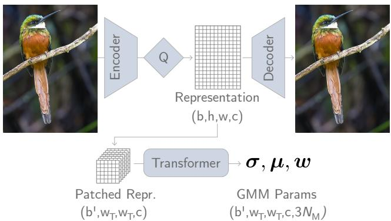  
Figure 3: Architecture overview. The Encoder maps a batch of input images to a discrete representation of shape $( b , h , w , c )$ . This representation is then split into patches of size $w _ { T }$ (folded into the batch dimension, so that $b ^ { \prime } =$ $b \cdot h w / w _ { T } ^ { 2 } )$ . These are each entropy-coded independently (and possibly in parallel) using the distributions predicted by MT or M2T, which is parameterized by a GMM with $N _ { \mathrm { M } } { = } 3$ mixtures.

Since in general, $\hat { \textbf { \textit { x } } } \neq \textbf { \textit { x } }$ , we call this a lossy autoencoder. We can turn it into a lossy image compression scheme by storing y to disk losslessly. For example, we could use the naive way of storing every element in y independently with an int32, resulting in a method that uses $3 2 c / 1 6 ^ { 2 }$ bits per pixel (bpp). This results in a very poor compression ratio, so instead, we follow previous work in predicting a (discrete) distribution $P ( y )$ , to then use entropy coding to store y to disk using $: \textstyle \sum _ { i } - \log _ { 2 } P ( y _ { i } )$ bits (intuitively, more likely symbols should be stored with fewer bits). We refer to previous work on the theoretical background, see, e.g., Yang and Mandt [40] and Balle et al. [3]. Here, we shall use a masked transformer to model P.

## 3.2. Autoencoder and Tokenization

Our main contributions lie in how we model P, so for the autoencoder we use the convolutional ELIC encoder/decoder proposed by He et al. [18], with 256 channels for all layers except for the last layer of the encoder which predicts the c-dimensional representation. We use $c { = } 1 9 2$ throughout. E downscales by a factor 16, and we use $h { = } \lceil H / 1 6 \rceil , w { = } \lceil W / 1 6 \rceil$ as shorthand.2 To get gradients through the quantization operation, we rely on straightthrough estimation (STE) [32, 28].

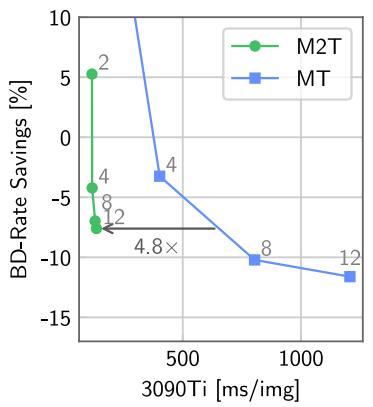

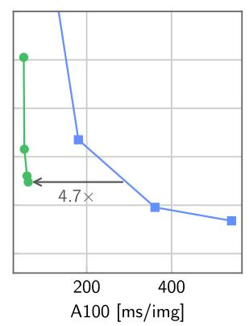

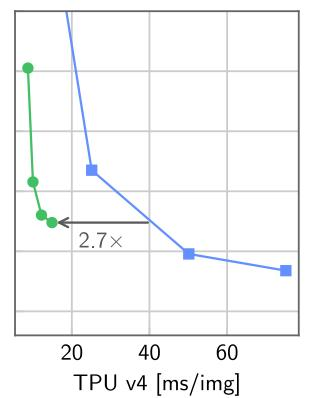

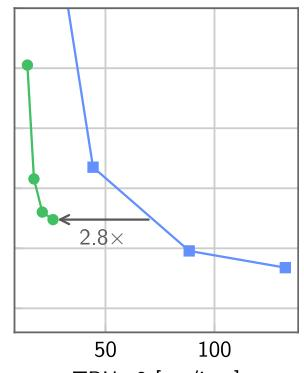  
TPU v3 [ms/img]  
Figure 4: We compare our models MT and M2T in terms of speed vs. rate savings over VTM (lower is better). We compare milliseconds per image on various platforms, where “image” is a large $1 5 0 0 \times 2 0 0 0$ pixel image. TPU numbers are obtained by using 4 chips in parallel. The trade-off between rate savings and speed is controlled by adjusting the number of inference steps S, which we annotate for the first plot. We see that at the same rate savings, M2T is $2 . 7 \times - 4 . 8 \times$ faster. Both models start to saturate in terms of rate savings at $S = 8 .$

Similar to previous work applying transformers to compression [38, 25, 22], we do not consider each of the $h \cdot w \cdot c$ elements in this representation as a token, since this would yield infeasibly long sequences for transformers $( e . g . , \mathrm { a }$ 2000 2000px image turns into a representation with $1 2 5 { \times } 1 2 5 { \times } 1 9 2 = 3 M$ symbols). Instead, we group each $1 \times 1 \times c$ column into a “token”, i.e., we get hw tokens of dimension c each.

## 3.3. Transformer

We use a standard transformer encoder in the pre-norm setup (see, e.g., [14, Fig. 1] and [39]) with the Base $( ^ { 6 6 } \mathbf { B } ^ { 7 } )$ config [13, 14] (12 attention layers, width 768, and MLPs with hidden dimension 3078). We apply two compressionspecific changes: since our input is a vector of c scalarquantized integers, we cannot use the standard dictionary lookup-based embedding (as the vocabulary size is theoretically infinite). Instead, we normalize the vectors by dividing with a small constant $\delta { = } 5$ and apply a dense layer shared across tokens to function as the “embedding layer”. Similarly, at the output, we cannot simply predict a finite number of logits. Rather, we follow the standard practice in neural compression and pixel-autoregressive generative modeling to model each entry of a token using a continuous, parametrized distribution, which is then quantized to a PMF as described below. Inspired by [31, 12], we use a mixture of Gaussians (GMM) with $N _ { \mathrm { M } } = 3$ mixtures, each parameterized by a mean $\mu ,$ scale , and weight w.

Patched inference For standard transformers, a positional embedding is typically learned for every input token, and we also apply this. This means that these models are not applicable to arbitrary resolutions during inference without carefully adapting the positional embedding, which often involves finetuning on the target resolution. However, for image compression, datasets of widely varying image size are the norm. To reconcile this, we use a simple solution: we apply the transformer on patches of $w _ { T } \times w _ { T }$ tokens. We use $w _ { T } = 2 4$ since this corresponds to full representation size during training (we use 384px crops during training, yielding $h \ = \ w \ = \ 2 4 )$ . Since we use the transformer for losslessly coding the representation, we do not see any boundary artifacts from this technique. The only downside is that some correlations across patches are not leveraged to drive down the bitrate even further. Concretely, this implies the following flow of tensors shown in Fig. 3 during inference.

We emphasize the simplicity of our proposed scheme, using off-the-shelf transformers in a patched manner. In contrast to, $e . g .$ , Entroformer [29], we do not have to adapt the attention mechanism or use a relative positional embedding. This means that our approach will benefit from future research into speeding up standard transformers.

## 3.4. Masking Schedules

We consider various masking schedules in this work. A masking schedule is a sequence of masks $\begin{array} { r l } { \mathcal { M } } & { { } = } \end{array}$ $\{ M _ { 1 } , \ldots , M _ { S } \}$ , where S is the number of masks (or, equivalently, inference steps), and each tensor $M _ { i }$ is a binary mask tensor of length $w _ { T } ^ { 2 }$ $M _ { i } [ j ] = 1$ indicates that the j-th token is predicted and uncovered at step i. As outlined in the introduction, there are two important axes when building besides the number of masks S:

1. Group Size Schedule: How many token are uncovered in each step, i.e., what is $\textstyle \sum _ { j } { M _ { i } [ j ] \forall i }$

2. Location Schedule: Which tokens are chosen to be uncovered, $i . e . ,$ which indices in each $M _ { i }$ are set to 1.

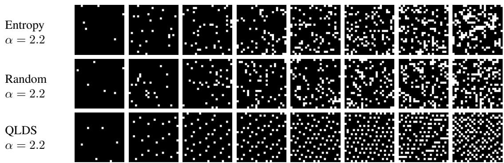

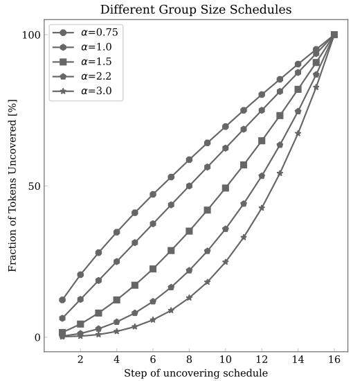

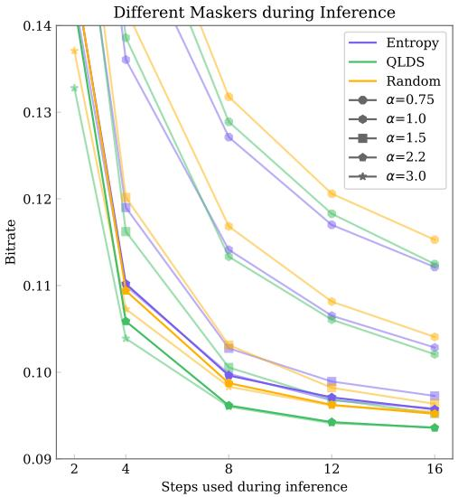  
Figure 5: TOP: Different location schedules shown for 8 steps and $\alpha = 2 . 2 $ . Note that Entropy is instance adaptive and we show it for one instance. BOTTOM LEFT: Visualizing how different ↵ look in terms of how much is uncovered after each step (cumulative). BOTTOM RIGHT: Resulting inference bitrate of the various $\alpha ,$ , shown for different location schedules and different inference steps. Each point is the same MT model evaluated with a different schedule as parameterized by the triplet (↵, inference steps, location schedule), where ↵ is shown via the marker.

We parameterize the “group size schedule” via the cumulative number of tokens that are uncovered after x steps using a strictly monotonically increasing function $f ( x )$ . Motivated by MaskGIT, we limit ourselves to a power schedule, i.e., $f ( x ) \ : = \ : N _ { S , \alpha } x ^ { \alpha }$ , where ↵ controls how fast we uncover, and $N _ { S , \alpha }$ normalizes such that we uncover all $w _ { T } ^ { 2 }$ tokens in S steps. Fig. 5 shows $f ( x )$ for some ↵.

For “location schedules” we consider three different options, visualized at the top of Fig. 5. Again motivated by MaskGIT, we start with an entropy-based schedule. MaskGIT uses a schedule where in the i-th step, the model is applied to the current input, a distribution $p _ { j }$ is predicted for every masked token, and a value $x _ { j }$ is sampled for every masked location j. A “confidence score” of $x _ { j }$ is obtained as $p _ { j } ( x _ { j } )$ and a number of tokens (governed by the group size schedule) with the highest confidence score is retained. This also determines the masked locations of the next step $i + 1$ . For compression, since we aim to produce short bitsteams, and the bitrate is a function of the predicted entropy, we follow [38] and adapt this schedule to our use case by retaining tokens with the lowest entropy instead of the confidence score.

The second schedule is called random, where we fix a seed and sample locations at uniformly at random (with a fixed seed), motivated by the fact that this mimics the training distribution of mask locations.

Our last schedule is a novel schedule proposed in this paper, QLDS (“quantized low-discrepancy sequence”), which is loosely motivated by information theory: We note that at every step i, we entropy code the tokens in the i-th group in parallel, and conditionally on the tokens of all previous groups (this is possible, as these tokens will be available in the i-th decoding step). Hence, to get good prediction of all available at tokens in the i-th group, the mutual information between the i-th group and all previous groups should be maximized. At the same time, all tokens within a group are encoded in parallel, and we can thus not leverage their mutual information, meaning the schedule should minimize the mutual information within groups. For images we can use distance in pixel space as a proxy for mutual information, since we expect nearby pixels to be more correlated than pixels far apart. Intuitively, this implies that tokens within a given group should be far from each other spatially, and at the same time close to tokens in previous groups.

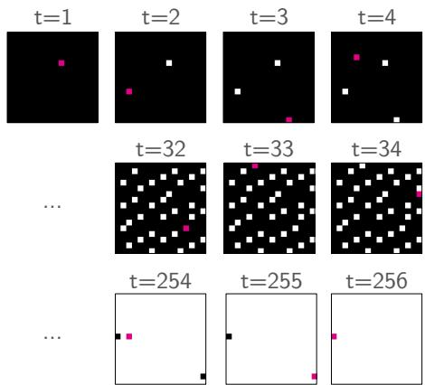  
Figure 6: Visualizing how the quantized low-discrepancy sequence (QLDS) fills a 16 16 window in a regular fashion. We split this into a sequence of S masks for our model (see Fig. 5 for S = 8).

To this end, we use low-discrepancy sequences (LDS) [23, Ch. 2]. These are pseudo-random sequences that minimize the “discrepancy” for any subsequence, meaning among other things that when the sequence is cut off at an arbitrary index i, all elements up to i are close to evenly distributed (see Sec. A.1 for a formal definition). An LDS in 2D is given by a sequence of points $X = x _ { 1 } , \ldots , x _ { N } .$ This can be turned into a masking schedule by specifying K group sizes that sum to N, and then simply splitting X into K groups. The fact that X is an LDS implies the desired properties mentioned above, i.e., all points in a group are far from each other, while at the same time merging all groups up to a certain step yields a set of points that nearuniformly cover the space. We use an LDS proposed by Roberts [30], described in Sec. A.1, visualized in Fig. 6.

## 3.5. Masking Model 1: MT

For our MaskGIT-like model, MT, we use masked transformers similar to what was proposed in previous language and image generation work [13, 11, 10].

Training Given the representation $y \ = \ E ( x )$ , we randomly sample a mask M for every batch entry, which is a binary vector of length $w _ { T } ^ { 2 }$ , where 5-99% of the entries are 1. The corresponding entries in y are masked, which means we replace them with a special mask token (this is a learned c-dimensional vector). The resulting tensor, y , is fed to the transformer, which predicts distributions of the tokens. Each distribution is factorized over the c channels. We only consider the distributions corresponding to the masked tokens to compute the loss, i.e.,

$$
\mathcal { L } _ { \mathrm { M T } } = \mathbb { E } _ { y \sim p _ { y } , u \sim \mathcal { U } _ { \pm 0 . 5 } } \Big [ \sum _ { \begin{array} { c } { i \in \{ 1 , \dots , w _ { T } ^ { 2 } \} , } \\ { M [ i ] = 1 } \end{array} } - \log _ { 2 } p ( y _ { i } + u | y _ { M } ) \Big ] ,\tag{1}
$$

where we use additive i.i.d. noise to simulate quantization during training [40]. Here, we use the standard trick (e.g. [40]) of integrating the continuous distribution p produced by the model on unit-length intervals, to obtain $\begin{array} { r } { P ( y ) = \int _ { y - 1 / 2 } ^ { y + 1 / 2 } p ( u ) d u , y \in \mathbb { Z } . } \end{array}$

Inference For inference, we apply the model S times following one of the schedules outlined in Sec. 3.4. In the first iteration, we only feed mask tokens, then we entropy code the tokens corresponding to $M _ { 1 }$ , uncover them at the input, and repeat until all tokens have been entropy coded. This is detailed in Fig. 2 (left) and Alg. 1 in the Appendix. In Fig. 7 we qualitatively visualize how the prediction gets more confident in each step as more tokens are uncovered.

## 3.6. Masking Model 2: M2T

As we shall see in Sec. 5.1, we can use a deterministic schedule for inference without hurting bitrate in MT. This motivates our fast model that masks twice: once at the input, once in the attention, called M2T (see Fig. 2).

Recall that fully autoregressive transformer decoders like the original approach by Vaswani et al. [34] use a diagonal attention mask during training to enforce causality. We generalize this idea here. Given a sequence of masks , we construct i) a permutation of the input, ii) attention masks, iii) a permutation of the targets, which together allow us to get the complete token distribution with a single forward pass during training, and, crucially allow us to do fast inference.

As visualized in Fig. 2, we can (i) form the permuted inputs by constructing groups, where the i-th group consists of the tokens in group $M _ { i - 1 }$ followed by mask tokens to pad the subsequence to length $\sum M _ { i }$ . also induces (ii) an attention mask A, a “block triangular” matrix (see Fig 2) which ensures causal dependence structure across groups. Finally, (iii) the permutation of the targets is simply putting tokens of the same group next to each other.

We emphasize that mask tokens at the input enable nonlinear schedules where the current step predicts more tokens than the previous step, by simply padding the previously predicted/decoded tokens at the input to the length of the output of the current step. Further, masking the attention turns the model into a causal transformer which allows teacher forcing during training [37], i.e., all steps can be trained simultaneously. This also enables caching at inference time.

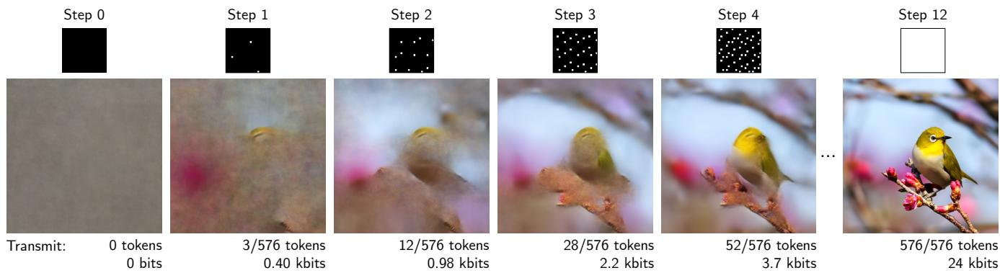  
Figure 7: Visualizing the uncertainty of the model for a QLDS masking schedule with $\alpha { = } 2 . 2$ and $S { = } 1 2$ . Above each image we show the cumulative mask at the corresponding step, where transmitted token locations are indicated with a white dot. We show the cost for storing these tokens to disk in kilobits (kbits). To visualize the uncertainty of the model, we sample the remaining (non-transmitted) tokens 50 times and average the corresponding decoded images. We see how the QLDS schedule leads to a coarse-to-fine transmission of the data.

We highlight that this scheme is a generalization of full autoregressive training with attention masks: We recover it with a sequence of masks $\begin{array} { r l } { \mathcal { M } } & { { } = } \end{array}$ $\{ [ 1 , 0 , \ldots ] , [ 0 , 1 , \ldots ] , \ldots , [ \ldots , 0 , 1 ] \}$ that uncover the latent in raster scan order. Using this, we obtain groups of size 1, and the standard triangular A (see Fig. 2, “Full AR”). According to our algorithm outlined above, we only insert a single mask token at the start of the input. This corresponds to the START token typically used with fully autoregressive models. We do not study this setting here, since running fully autoregressive transformers for compression leads to impractically long decoding times.

Training During training, we apply the components above: (i) we permute the input, obtaining yin, (ii) feed it to the transformer masked with attention masked by A, and (iii) get the permuted output $y _ { \mathrm { o u t } } ,$ yielding

$$
\begin{array} { r } { \mathcal { L } _ { \mathrm { M 2 T } } = \mathbb E _ { y } \big [ - \log _ { 2 } p ( y _ { \mathrm { o u t } } | y _ { \mathrm { i n } } ) \big ] . } \end{array}\tag{2}
$$

In contrast to the loss for MT (Eq. 1), this loss corresponds to the bitrate required to compress the full $y .$

Inference For inference, we feed slices of the input as shown on the left of Fig. 2. We cache activations for the tokens we previously fed, which works thanks to the causality we induce during training with A. Note that default attention caching implementations usually is only valid for the fully autoregressive case, and we thus implemented our own Flax [20] attention caching. Code for this is shown in App. A.6. We further note that MT uses the flax MultiHeadDotProductAttention without modification as it does not invove attention masking.

## 3.7. Loss

We train the autoencoder and transformer jointly endto-end, minimizing the rate-distortion trade-off $r ( y ) \textrm { + }$ $\lambda d ( x , { \hat { x } } )$ . We use either $\mathcal { L } _ { \mathrm { M T } }$ or ${ \mathcal { L } } _ { \mathrm { M } 2 \mathrm { T } }$ for $r ( y )$ and MSE for d. The hyperparameter  controls the trade-off between the bitrate and distortion.

## 4. Experiments

Models We call our base transformer model without attention masking MT, and our model that masks twice M2T. They share all hyperparameters. We explore $S = \{ 2 , 4 , 8 , 1 2 \}$ . For the main results, we fix $\alpha { = } 2 . 2 ,$ and use S=12. In terms of rate distortion, we compare to various models listed in Sec. 2. We run VTM 17.1 [17], the state-of-the-art non-neural codec, with the same settings as previous work [1, Sec. A.2].

Training We train our models from scratch end-to-end, including the autoencoder E, D. Our training data consists of a set of 2M high-resolution images collected from the Internet, from which we randomly sample 384 384 crops with batch size 32. We optimize the training loss for five values of $\lambda \in 2 ^ { i } : i \in \{ - 4 , . . . , 0 \}$ , training for 1M steps for each . We use “ warmup” where we set  10 higher for the first 15% of training. We set the base learning rate to $1 0 ^ { - 4 }$ , and use linear warmup for 10k steps, keep the learning rate constant until 90% of the training is completed, and then drop it by 10 . This tends to boost PSNR and is commonly done [28, 25]. Sec. A.3 shows implementation details.

Test Data We use the common Kodak [21] dataset to evaluate our model. This is a dataset of 24 images, each of resolution 512 768 or 768 512. We also evaluate on the full CLIC2020 dataset, which consists of 428 images of up to

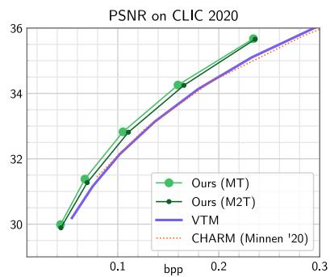  
Figure 8: Rate distortion results on CLIC2020.

2000 1000px.3 We report bits-per-pixel (bpp), PSNR, as well as BD-rate savings [8].

Runtime We measure the runtime of our transformers on multiple accelerators: NVidia P100, V100, A100, 3090Ti GPUs, and Google Cloud TPUv3 and TPUv4. We measure the S forward passes required through the models, ignoring device transfer times, range coding, and the decoder D, since these are constant across all models. We report GFLOPS/image and milliseconds per image, where “image” means 2000 1500px. For each accelerator, we chose the largest batch size that saturates it. For TPUs, we parallelize the model over 4 chips.

## 5. Results

Rate-distortion In Fig. 1, we compare rate-distortion performance on Kodak. We can see that our model outperforms the previous state-of-the-art. In Fig. 8, we present results on CLIC2020 to show that also there, we significantly outperform the non-neural state-of-the-art VTM. We use S=12 for MT. Sec. A.7 provides the data underlying these plots.

Runtime In Fig. 4, we compare inference speeds of our models on TPU v3/4 and 3090Ti/A100 GPUs. In Sec A.2, we also show P100, V100 and FLOPS. Depending on the accelerator, M2T achieves 2.7 5.2 practical wall clock speedups over the MT model. We note that M2T operates in the subsecond-per-large-image regime (2000 1500px), putting it in the realm of practical image compression schemes. MT also achieves subsecond inference on a consumer GPU (3090Ti) if we use S=8.

However, we would also like to note that the runtime optimized channel-autoregressive and checkerboard-based convolutional entropy model in ELIC reports 46.06ms for a 1890 2048px image on a consumer NVidia Titan XP [18, Table 3]. On the other end of the spectrum, the transformerbased ContextFormer reports full decoding speeds in the order of multiple minutes [22, Table 1]. As such, our contribution lies in developing a fast and simple transformer model that is largely based on the vanilla transformer encoder architecture used in BERT [13] and ViT [14], and still achieves state-of-the-art rate-distortion performance.

<table><tr><td>Model</td><td>C</td><td> $N _ { M }$ </td><td>BD-rate savings</td></tr><tr><td>MT (default)</td><td>192</td><td>3</td><td>-11.6%</td></tr><tr><td>MT (more channels)</td><td>320</td><td>3</td><td>-8.27%</td></tr><tr><td>MT (one mixture)</td><td>192</td><td>1</td><td>-7.95%</td></tr></table>

Table 1: Ablating number of channels in the representation C and number of mixtures $N _ { M }$ . Rate savings are over VTM (lower is better).

Certainty We visualize the certainty of the entropy model of MT in Fig. 7 by sampling from the model multiple times and showing the sample mean. The underlaying samples are shown in Sec. A.5.

## 5.1. Ablations

Masking Schedules For the MT model trained for $\lambda =$ 0.00125, we show the impact of various masking schedules in Fig. 5. We see that using ↵ > 1 is crucial to get low rates, but the gains start to saturate at around ↵ = 2.2. We see that for lower ↵, the entropy-based masking schedule is optimal (top part of the lower right plot, lines with circle marker). As we go towards the optimal ↵, QLDS becomes the optimal schedule. Finally, we see that increasing the number of autoregressive steps beyond 8 leads to limited gains if ↵ > 1.

Architecture Our approach relies on standard components, so we only ablate the compression-specific choices: We explore using C=320 channels, since this is a common choice in the literature (e.g., [18, 28]). We also explore training with a single mixture instead of 3. The results are shown in Table 1.

## 6. Conclusion

In this work, we made two significant contributions: We showed how a vanilla MaskGIT-like transformer can be applied to neural image compression to obtain state-of-the-art results at practical inference times on various accelerator platforms, without relying on a multi-scale model. We also demonstrated that this model performs well with a fixed, deterministic schedule independent of the input, which allowed us to develop a second model class with masked attention, M2T. This model bridges between MaskGIT-like transformers and autoregressive transformers.

Acknowledgements We thank Pieter-Jan Kindermans and David Minnen for the insightful discussions.

## References

[1] Eirikur Agustsson, David Minnen, George Toderici, and Fabian Mentzer. Multi-realism image compression with a conditional generator. arXiv preprint arXiv:2212.13824, 2022. 7

[2] Eirikur Agustsson, Michael Tschannen, Fabian Mentzer, Radu Timofte, and Luc Van Gool. Generative adversarial networks for extreme learned image compression. In The IEEE International Conference on Computer Vision (ICCV), October 2019. 3

[3] Johannes Balle, Philip A Chou, David Minnen, Saurabh´ Singh, Nick Johnston, Eirikur Agustsson, Sung Jin Hwang, and George Toderici. Nonlinear transform coding. IEEE Journal of Selected Topics in Signal Processing, 15(2):339– 353, 2020. 3

[4] Johannes Balle, Valero Laparra, and Eero P Simoncelli. End-´ to-end optimization of nonlinear transform codes for perceptual quality. arXiv preprint arXiv:1607.05006, 2016. 3

[5] Johannes Balle, Valero Laparra, and Eero P Simoncelli. ´ End-to-end optimized image compression. arXiv preprint arXiv:1611.01704, 2016. 3

[6] Johannes Balle, David Minnen, Saurabh Singh, Sung Jin´ Hwang, and Nick Johnston. Variational image compression with a scale hyperprior. In International Conference on Learning Representations (ICLR), 2018. 3

[7] Johannes Balle, Sung Jin Hwang, and Eirikur Agustsson. ´ TensorFlow Compression: Learned data compression, 2022. 11

[8] Gisle Bjontegaard. Calculation of average psnr differences between rd-curves. ITU SG16 Doc. VCEG-M33, 2001. 8

[9] Yochai Blau and Tomer Michaeli. Rethinking lossy compression: The rate-distortion-perception tradeoff. arXiv preprint arXiv:1901.07821, 2019. 3

[10] Huiwen Chang, Han Zhang, Jarred Barber, AJ Maschinot, Jose Lezama, Lu Jiang, Ming-Hsuan Yang, Kevin Murphy, William T Freeman, Michael Rubinstein, et al. Muse: Text-to-image generation via masked generative transformers. arXiv preprint arXiv:2301.00704, 2023. 6

[11] Huiwen Chang, Han Zhang, Lu Jiang, Ce Liu, and William T Freeman. Maskgit: Masked generative image transformer. In Proceedings of the IEEE/CVF Conference on Computer Vision and Pattern Recognition, pages 11315–11325, 2022. 1, 6

[12] Zhengxue Cheng, Heming Sun, Masaru Takeuchi, and Jiro Katto. Learned image compression with discretized gaussian mixture likelihoods and attention modules. In Proceedings of the IEEE/CVF Conference on Computer Vision and Pattern Recognition, pages 7939–7948, 2020. 3, 4

[13] Jacob Devlin, Ming-Wei Chang, Kenton Lee, and Kristina Toutanova. Bert: Pre-training of deep bidirectional transformers for language understanding. arXiv preprint arXiv:1810.04805, 2018. 1, 4, 6, 8

[14] Alexey Dosovitskiy, Lucas Beyer, Alexander Kolesnikov, Dirk Weissenborn, Xiaohua Zhai, Thomas Unterthiner, Mostafa Dehghani, Matthias Minderer, Georg Heigold, Sylvain Gelly, et al. An image is worth 16x16 words: Trans-

formers for image recognition at scale. arXiv preprint arXiv:2010.11929, 2020. 4, 8

[15] Alaaeldin El-Nouby, Matthew J Muckley, Karen Ullrich, Ivan Laptev, Jakob Verbeek, and Herve J´ egou. Image com-´ pression with product quantized masked image modeling. arXiv preprint arXiv:2212.07372, 2022. 1, 3

[16] Patrick Esser, Robin Rombach, and Bjorn Ommer. Taming transformers for high-resolution image synthesis. In Proceedings of the IEEE/CVF conference on computer vision and pattern recognition, pages 12873–12883, 2021. 1

[17] Fraunhofer Gesellschaft. VTM 17.1. https://vcgit. hhi.fraunhofer.de/jvet/VVCSoftware\_VTM/ -/releases/VTM-17.1, 2022. 7

[18] Dailan He, Ziming Yang, Weikun Peng, Rui Ma, Hongwei Qin, and Yan Wang. Elic: Efficient learned image compression with unevenly grouped space-channel contextual adaptive coding. In Proceedings of the IEEE/CVF Conference on Computer Vision and Pattern Recognition, pages 5718– 5727, 2022. 1, 3, 8, 11

[19] Dailan He, Yaoyan Zheng, Baocheng Sun, Yan Wang, and Hongwei Qin. Checkerboard context model for efficient learned image compression. In Proceedings of the IEEE/CVF Conference on Computer Vision and Pattern Recognition, pages 14771–14780, 2021. 3

[20] Jonathan Heek, Anselm Levskaya, Avital Oliver, Marvin Ritter, Bertrand Rondepierre, Andreas Steiner, and Marc van Zee. Flax: A neural network library and ecosystem for JAX, 2020. 7

[21] Kodak PhotoCD dataset. http://r0k.us/graphics/ kodak/, 2022. 7

[22] A Burakhan Koyuncu, Han Gao, and Eckehard Steinbach. Contextformer: A transformer with spatio-channel attention for context modeling in learned image compression. arXiv preprint arXiv:2203.02452, 2022. 1, 3, 4, 8

[23] Lauwerens Kuipers and Harald Niederreiter. Uniform distribution ofsequences. Courier Corporation, 2012. 6, 11

[24] Fabian Mentzer, Eirikur Agustsson, Michael Tschannen, Radu Timofte, and Luc Van Gool. Conditional probability models for deep image compression. In IEEE Conference on Computer Vision and Pattern Recognition (CVPR), 2018. 3

[25] Fabian Mentzer, George Toderici, David Minnen, Sung-Jin Hwang, Sergi Caelles, Mario Lucic, and Eirikur Agustsson. VCT: A video compression transformer. arXiv preprint arXiv:2206.07307, 2022. 1, 3, 4, 7

[26] Fabian Mentzer, George D Toderici, Michael Tschannen, and Eirikur Agustsson. High-fidelity generative image compression. Advances in Neural Information Processing Systems, 33, 2020. 3

[27] David Minnen, Johannes Balle, and George D Toderici. ´ Joint autoregressive and hierarchical priors for learned image compression. In Advances in Neural Information Processing Systems, pages 10771–10780, 2018. 3, 11

[28] David Minnen and Saurabh Singh. Channel-wise autoregressive entropy models for learned image compression. arXiv preprint arXiv:2007.08739, 2020. 3, 7, 8, 11

[29] Yichen Qian, Ming Lin, Xiuyu Sun, Zhiyu Tan, and Rong Jin. Entroformer: A transformer-based entropy

model for learned image compression. arXiv preprint arXiv:2202.05492, 2022. 1, 3, 4

[30] Martin Roberts. Unreasonable Effectiveness of Quasirandom Sequences. http://extremelearning.com.au/unreasonableeffectiveness-of-quasirandom-sequences/. Accessed: 2023- 01-13. 6, 11

[31] Tim Salimans, Andrej Karpathy, Xi Chen, and Diederik P Kingma. Pixelcnn++: Improving the pixelcnn with discretized logistic mixture likelihood and other modifications. arXiv preprint arXiv:1701.05517, 2017. 4

[32] Lucas Theis, Wenzhe Shi, Andrew Cunningham, and Ferenc Huszar. Lossy image compression with compressive autoencoders. In International Conference on Learning Representations (ICLR), 2017. 3

[33] Michael Tschannen, Eirikur Agustsson, and Mario Lucic. Deep generative models for distribution-preserving lossy compression. In Advances in Neural Information Processing Systems, pages 5929–5940, 2018. 3

[34] Ashish Vaswani, Noam Shazeer, Niki Parmar, Jakob Uszkoreit, Llion Jones, Aidan N Gomez, Łukasz Kaiser, and Illia Polosukhin. Attention is all you need. Advances in neural information processing systems, 30, 2017. 2, 6

[35] Ruben Villegas, Mohammad Babaeizadeh, Pieter-Jan Kindermans, Hernan Moraldo, Han Zhang, Mohammad Taghi Saffar, Santiago Castro, Julius Kunze, and Dumitru Erhan. Phenaki: Variable length video generation from open domain textual description. arXiv preprint arXiv:2210.02399, 2022. 1

[36] Pauli Virtanen, Ralf Gommers, Travis E. Oliphant, Matt Haberland, Tyler Reddy, David Cournapeau, Evgeni Burovski, Pearu Peterson, Warren Weckesser, Jonathan Bright, Stefan J. van der Walt, Matthew Brett, Joshua Wil-´ son, K. Jarrod Millman, Nikolay Mayorov, Andrew R. J. Nelson, Eric Jones, Robert Kern, Eric Larson, C J Carey, ˙Ilhan Polat, Yu Feng, Eric W. Moore, Jake VanderPlas, Denis Laxalde, Josef Perktold, Robert Cimrman, Ian Henriksen, E. A. Quintero, Charles R. Harris, Anne M. Archibald, Antonio H. Ribeiro, Fabian Pedregosa, Paul van Mulbregt, ˆ and SciPy 1.0 Contributors. SciPy 1.0: Fundamental Algorithms for Scientific Computing in Python. Nature Methods, 17:261–272, 2020. 11

[37] Ronald J Williams and David Zipser. A learning algorithm for continually running fully recurrent neural networks. Neural computation, 1(2):270–280, 1989. 6

[38] Jinxi Xiang, Kuan Tian, and Jun Zhang. Mimt: Masked image modeling transformer for video compression. In International Conference on Learning Representations, 2022. 1, 3, 4, 5

[39] Ruibin Xiong, Yunchang Yang, Di He, Kai Zheng, Shuxin Zheng, Chen Xing, Huishuai Zhang, Yanyan Lan, Liwei Wang, and Tieyan Liu. On layer normalization in the transformer architecture. In International Conference on Machine Learning, pages 10524–10533. PMLR, 2020. 4

[40] Y. Yang, S. Mandt, and L. Theis. An introduction to neural data compression. preprint, 2022. 1, 3, 6

[41] Yinhao Zhu, Yang Yang, and Taco Cohen. Transformerbased transform coding. In International Conference on Learning Representations, 2021. 3

[42] Renjie Zou, Chunfeng Song, and Zhaoxiang Zhang. The devil is in the details: Window-based attention for image compression. In Proceedings of the IEEE/CVF Conference on Computer Vision and Pattern Recognition, pages 17492– 17501, 2022. 3