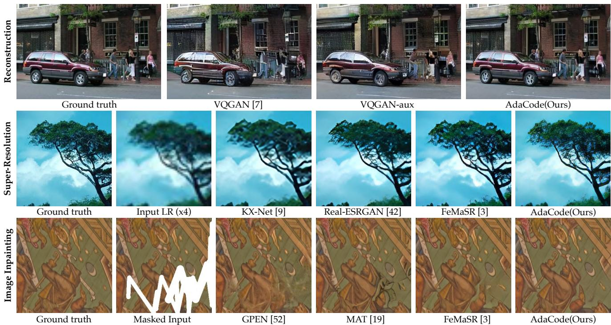
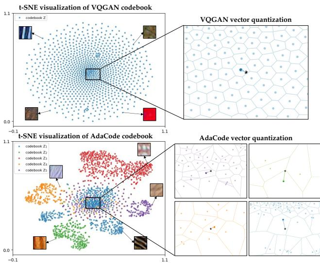
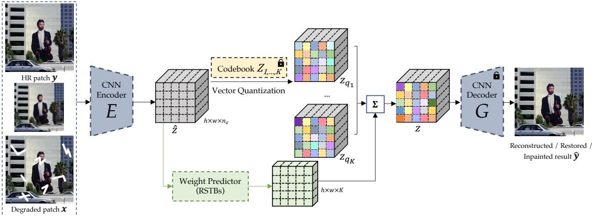
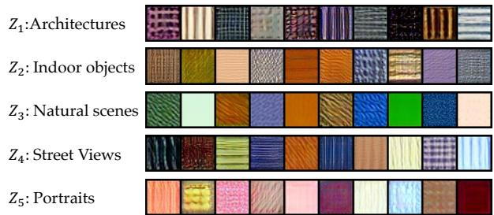
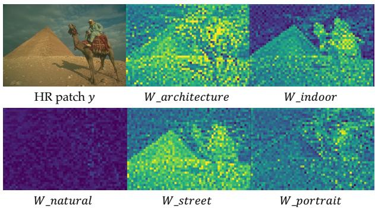
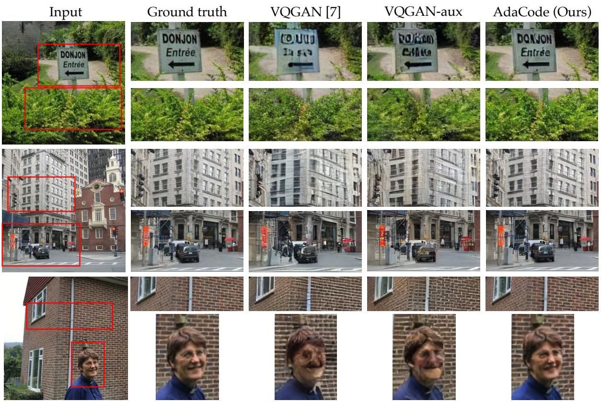
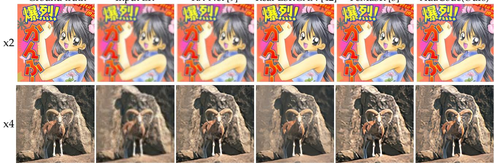
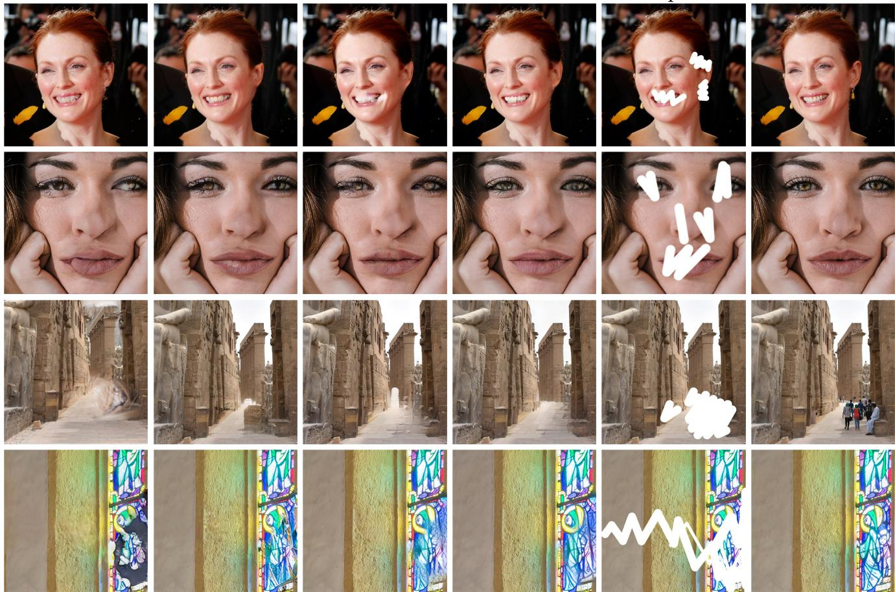
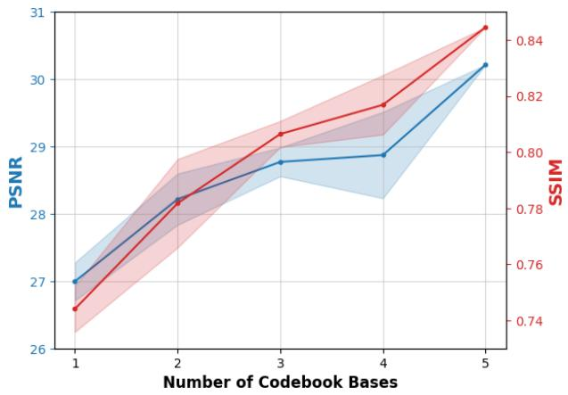

# Learning Image-Adaptive Codebooks for Class-Agnostic Image Restoration

Kechun Liu1,3\* Yitong Jiang2 Inchang Choi3 Jinwei Gu2 1 University of Washington 2 The Chinese University of Hong Kong 3 SenseBrain

  
Figure 1: We propose an image-adaptive codebook learning method, named AdaCode, for class-agnostic image restoration. For a number of image reconstruction and restoration tasks (e.g., super-resolution and inpainting), the proposed AdaCode achieved significantly better performance than latest prior work, such as VQGAN[7] and VQGAN with our merged ba sis codebooks (referred to as VQGAN-aux) for reconstruction; KX-Net[9], Real-ESRGAN[42] and FeMaSR[3] for superresolution; GPEN[52], MAT[19] and our trained FeMaSR[3] for image inpainting. (Zoom in for best view)

## Abstract

Recent work on discrete generative priors, in the form of codebooks, has shown exciting performance for image reconstruction and restoration, as the discrete prior space spanned by the codebooks increases the robustness against diverse image degradations. Nevertheless, these methods require separate training of codebooks for different image categories, which limits their use to specific image categories only (e.g. face, architecture, etc.), and fail to handle arbitrary natural images. In this paper, we propose

AdaCodefor learning image-adaptive codebooksfor classagnostic image restoration. Instead of learning a single codebook for each image category, we learn a set of basis codebooks. Given an input image, AdaCode learns a weight map with and computes a weighted combination of these basis codebooksfor adaptive image restoration. Intuitively, AdaCode is a more flexible and expressive discrete generative prior than previous work. Experimental results demonstrate that AdaCode achieves state-of-the-art performance on image reconstruction and restoration tasks, including image super-resolution and inpainting. Codes are released at https://github.com/kechunl/AdaCode.

## 1. Introduction

In recent years, discrete generative priors (in the form of codebooks) [39, 7] have shown impressive performance for image synthesis [7, 11, 45, 61], exhibiting reduced mode collapse and more stable training. These learned codebooks essentially provide strong priors for compressing and reconstructing natural images, even in the presence of severe degradation. Nevertheless, these methods have a common limitation. The codebooks need to be learned separately for each image category (e.g., face, architecture), which restricts their applicability to arbitrary natural images [7, 45, 61]. Although FeMaSR [3] attempted to learn a single general codebook for all image categories, the expressiveness of the codebook is limited by the complexity of natural images. For example, as shown in Fig. 1, an image often includes textural and structural contents from multiple categories (e.g., face, man-made structural edges, repetitive texture, natural texture). It is challenging to rely on a single universal codebook to capture all. Prior work such as VQGAN [7] and FeMaSR [3] often introduce noticeable artifacts for image reconstruction and restoration.

  
Figure 2: Intuition of AdaCode vs a single codebook. Top: Prior work VQGAN[7] uses a single codebook as the learned representation in the discrete latent space, which may not fully capture complex visual patterns. Bottom: AdaCode learns multiple basis codebooks, each representing a different discretization of the latent space corresponding to different visual appearances. For an input image, its latent representation is a weighted linear combination of the codes from these codebooks. AdaCode thus is a more flexible representation for class-agnostic image restoration.

Is it possible to learn a class-agnostic discrete generative prior for image reconstruction and restoration? Inspired by a recent work [55], we propose AdaCode, which learns image-adaptive codebooks for class-agnostic image reconstruction and restoration. Instead of learning a single codebook for all categories of images, we learn a set of basis codebooks. For a given input image, AdaCode learns a weight map that determines the contribution of each basis codebook to the final representation. Intuitively, this design allows AdaCode to learn a more flexible and expressive discrete generative prior than previous work, as demonstrated in Fig. 2. In contrast to VQGAN [7] and FeMaSR [3], which utilize a single partition for the latent space and assign each image feature an exclusive discrete representation, AdaCode learns various partitions to the latent space from different perspectives – each corresponding to the learning of one of the basis codebooks. The discrete generative prior for an arbitrary image is a weighted linear combination derived from these basis codebooks, resulting in a more flexible and expressive representation. As depicted in Fig. 1, AdaCode outperforms previous work in various image restoration tasks, effectively preserving scene structure and texture.

We evaluated AdaCode on both image reconstruction and image restoration tasks (i.e., super-resolution and image inpainting). Across multiple benchmark datasets, AdaCode achieved state-of-the-art performance, while maintaining a comparable codebook size and computational cost.

## 2. Related Work

Visual Representation Dictionary Learning Learning representation dictionaries in visual understanding has demonstrated its great power in image restoration tasks such as super-resolution [51, 62], denoising [59], and image inpainting [8, 36]. Using DNNs, VQVAE [39] first introduces a generative autoencoder model that learns discrete latent representations, also known as “codebook”. The following VQGAN [7] employs perceptual and adversarial loss to train the visual codebook, resulting in better image generation quality with a relatively small codebook size. The representation dictionary-based generative model has inspired various impressive image generation work [11, 61, 53, 3, 45], as well as our AdaCode.

The use of dictionaries is not limited to image restoration. Referred as lookup tables (LUTs), the dictionaries are also applied to optimize color transforms [55, 23, 49, 50]. In 3D-LUT [55], multiple LUTs are learned to serve as the bases of the LUT space. And a CNN is trained to predict weights to fuse the bases into an image-adaptive LUT. Inspired by 3D LUT, we leverage the discrete codebooks from VQGAN as the bases of the image latent space to build our image-adaptive codebook, AdaCode. Such design allows our method to fully and flexibly exploit the latent codes to represent diverse and complex natural images.

  
Figure 3: The framework of the proposed AdaCode method. The training of AdaCode incorporates three stages: Classspecific Codebook Pretraining, AdaCode Representation Learning, and Restoration via AdaCode. The lock icon indicates that the codebooks $Z _ { 1 , \dots , K }$ are fixed in Stage II&III, and the decoder G is fixed in Stage III. See Section. 3 for more details.

DNN-based Image Restoration DNN has been widely used for image restoration tasks, i.e. single image superresolution (SISR) and image inpainting. In the field of super-resolution (SR), recent studies focus on recovering low-resolution input images with unknown degradation types, which is more relevant to real-world scenarios. They restore the images either by learning the degradation representations [33, 21, 41, 42, 57, 9], or by training unified generative networks with LR-HR pairs [16, 46, 32]. Some studies introduce additional image priors, such as latent representations [27, 2, 30] and discrete codebooks [7, 61, 3], to address unrealistic textures or over-smoothed areas commonly observed in GAN-based methods. However, a single partition of the latent space is often insufficient to model the intricate patterns in natural images, resulting in specific textures being generated regardless of the image content.

In the case of image inpainting, researchers often leverage deep generative models to fill missing image regions with plausible content [31, 25, 44, 56, 5]. Some approaches incorporate additional discriminators [35], partial or gated convolutions [24, 54], semantic texture or context [28, 48, 34, 13, 38, 15], or transformers [19, 6, 26, 40] to enhance the quality of inpainted results. However, these methods often require separate experiments for different image patterns, i.e. natural scenes, faces, etc., due to the significant variations among them.

Both SR and inpainting methods face the challenge of effectively modeling complex visual patterns with a single model or codebook. In our proposed approach, Ada-Code, we address this challenge by leveraging adaptive codebooks, enabling realistic and robust restoration results for general images.

## 3. Methodology

Building upon VQGAN [7], we introduce an additional degree of freedom to the codebook and construct an adaptive codebook (AdaCode) to model the intricate highresolution natural image patterns. We summarize the Ada-Code model in Fig.3. Our method’s overall training consists of three sequential stages. In the first stage (Sec 3.1), we divide our HQ dataset into multiple semantic subsets and train a class-specific VQGAN [7] on each subset. In the second stage, using the fixed pretrained class-specific codebooks as bases, we leverage a transformer block to generate weight maps and train the AdaCode through the selfreconstruction task (Sec 3.2). In the last stage (Sec 3.3), we employ the AdaCode with fixed codebooks and fixed image decoder to address downstream restoration tasks, e.g. Super-Resolution and Image Inpainting. The details of each stage are discussed in the following sections.

## 3.1. Codebook Pretraining (Stage I)

Diversify Basis Codebooks To enhance the expressiveness of AdaCode, we aim to diversify the basis codebooks. Rather than applying various initializations as 3D-LUT [55], we achieve codebook divergence by training them on different HR subsets of our dataset. To accomplish this, we utilize an off-the-shelf SegFormer model [47] to perform semantic segmentation with 150 classes from the ADE20K dataset [60]. Each HR patch is labeled according to the semantic class with the largest area. We then group the 150 classes into 5 super-classes: Architectures, Indoor objects, Natural scenes, Street views, Portraits, and obtain the 5 semantic HR subsets accordingly. It is worth noting that the separation of subsets is not rigorous and each subset may contain semantic contexts from other subsets, as most images contain multiple semantics. More details regarding the clustering of the 150 classes can be found in the Appendix. This approach not only diversifies the codebooks but also provides various ways to partition the latent feature space. We randomly visualize some code samples in Fig. 4.

  
Figure 4: Visualization of the learned codes for different categories of visual appearance. We randomly sample 10 code entries from each codebook and visualize them by projecting a tiled $4 \times 4$ feature map onto a $3 2 \times 3 2$ texture patch using the corresponding decoder. As expected, the codes from different categories exhibit distinct features.

Learning Basis Codebooks Given a HQ subset of class $k ,$ we train a quantized autoencoder to learn the classspecific basis codebook. As shown in Fig. 3, the input HR patch $\boldsymbol { y } \in \mathbb { R } ^ { H \times W \times 3 }$ is first passed through the encoder $E$ to generate the embedding $\hat { z } = E ( y ) \in \mathbb { R } ^ { h \times w \times n _ { z } }$ . Following VQVAE [39] and VQGAN [7], each entry $\hat { z } _ { i } \in \mathbb { R } ^ { n _ { z } }$ in zˆ is replaced with its nearest code in the learnable codebook $Z _ { k } \in \mathbb { R } ^ { N \times n _ { z } }$ to construct the quantized embedding $z _ { q _ { k } }$

$$
z _ { q _ { k } } = \underset { c \in \{ 0 , \dots , N - 1 \} } { \arg \operatorname* { m i n } } \ | | \hat { z } - Z _ { k , c } | |\tag{1}
$$

where N is the number of codes in the corresponding codebook, $z _ { q _ { k } }$ denotes the quantized representation using $Z _ { k }$ and $Z _ { k , c }$ represent the c-th entry in codebook $Z _ { k }$ . After the feature quantization, the decoder G reconstructs the HR patch yˆ using $z _ { q _ { k } }$

$$
\hat { y } = G ( z _ { q _ { k } } ) \approx y\tag{2}
$$

The adversarial learning scheme is employed to train the encoder $E ,$ codebook $Z ,$ and decoder G with the discriminator D. The detailed architectures of $E , D _ { \circ }$ , and G are provided in the Appendix.

Training Objective To train the quantized autoencoder, we adopt 3 image-level losses: L1 loss $\mathcal { L } _ { 1 }$ , perceptual loss $\mathcal { L } _ { p e r }$ [17], and adversarial loss $\mathcal { L } _ { a d v }$ [10], which are calculated using $\hat { y }$ and $y .$

Since the quantization in Eqn. 1 is non-differentiable, we adopt the straight-through gradient estimator in [39, 7], which directly copies the gradients from decoder G to encoder E, enabling back-propagation and allowing end-toend training using the code-level loss function $\mathcal { L } _ { V Q } { \mathrm { : } }$

$$
\mathcal { L } _ { V Q } ( E , G , Z _ { k } ) = | | s g [ \hat { z } ] - z _ { q } | | _ { 2 } ^ { 2 } + \beta \cdot | | \hat { z } - s g [ z _ { q } ] | | _ { 2 } ^ { 2 }\tag{3}
$$

where $s g [ \cdot ]$ denotes the stop-gradient operation and $\beta \ =$ 0.25 is a hyper-parameter to control the update frequency of the codebook.

To further reinforce the semantics in the latent codebook and improve the texture restoration [43], we incorporate a VGG19-based regularization term $\mathcal { L } _ { s e m }$ into the codebook training process, following the approach in [3].:

$$
\mathcal { L } _ { s e m } = | | C O N V ( \hat { z } ) - \Phi ( y _ { k } ^ { \prime } ) | | _ { 2 } ^ { 2 }\tag{4}
$$

where Φ denotes the feature extractor of VGG19 [37], and CONV denotes a single convolutional layer to match the dimension of zˆ and $\Phi ( \boldsymbol { y } _ { k } ^ { \prime } )$ .

With the above image-level and code-level losses, we can summarize the training objective in Stage I as:

$$
{ \mathcal { L } } _ { s t a g e 1 } = { \mathcal { L } } _ { 1 } + { \mathcal { L } } _ { p e r } + \lambda \cdot { \mathcal { L } } _ { a d v } + { \mathcal { L } } _ { V Q } + \lambda \cdot { \mathcal { L } } _ { s e m }\tag{5}
$$

where the loss weight λ is set to 0.1.

## 3.2. AdaCode Representation Learning (Stage II)

Given the pretrained class-specific basis codebooks $Z _ { k } , k \ \in \ \{ 1 , . . . , K  \}$ , the latent feature space can be partitioned into non-overlapping cells in $K$ different ways. Specifically, for a given input HR patch y, K quantized representations can be generated. Each distinct quantized representation $z _ { q _ { k } }$ obtains its code token from its corresponding semantic codebook. To combine the discrete representation $z _ { q _ { 1 } , \dots , K }$ into the AdaCode representation z, we employ a weight predictor module, which generates a K-channel weight map $w \in \mathbb { R } ^ { h \times w \times K }$ , as illustrated in Fig. 3 and Fig. 5. The weight predictor module consists of four residual swin transformer blocks (RSTBs) [20] and a convolution layer to match the channels of weight map and K. z is computed following Eqn. 6. Finally, the adaptive feature z is reconstructed to HR patch yˆ via the decoder G.

$$
z = \sum _ { i } w _ { i } \times z _ { q _ { i } }\tag{6}
$$

To efficiently train AdaCode and maintain a comparable number of parameters in the codebooks to VQGAN [7] and FeMaSR [3], which both set the codebook dimension to be 1024 × 512, we set each of our class-specific codebooks to be $2 5 6 \times 2 5 6$ or $5 1 2 \times 2 5 6$ . These codebooks are fixed during the training of stage II while the rest of the model, i.e. the encoder $E ,$ , the weight predictor, the decoder $G ,$ and the discriminator D, are trained using the objective in Eqn. 7. Each term in this equation is defined in Sec. 3.1.

$$
\mathcal { L } _ { s t a g e 2 } = \mathcal { L } _ { 1 } + \mathcal { L } _ { p e r } + \lambda \cdot \mathcal { L } _ { a d v } + \mathcal { L } _ { V Q } ( E , G )\tag{7}
$$

  
Figure 5: An example showing the learned weight maps. The input image contains multiple semantically-meaningful content (e.g. pyramid, person, animal, sky) which cannot be well represented with a single codebook. Instead, AdaCode uses multiple basis codebooks and weight maps for discrete representations. As shown, the weight maps correlate to the semantics to some extent.

## 3.3. Restoration via AdaCode (Stage III)

With the powerful decoder G, various image restoration tasks can be turned into a feature refinement problem through AdaCode scheme. From the perspective of latent space partition, each representation of the degraded input x is pulled towards its nearest HR code entry, allowing for the information loss in x to be relatively compensated. In comparison to the quantized representation $z _ { q }$ using only one general codebook, the combination of $z _ { q _ { 1 } , \dots , { \cal K } }$ with the weight map can be considered as adding an offset to $z _ { q } .$ The offset helps to alleviate the discontinuity among the discrete codes, which is demonstrated in our ablation study. To further showcase the effectiveness of AdaCode, we train our model on two ill-posed problems, i.e. Single Image Super-Resolution and Image Inpainting.

In super-resolution and image inpainting tasks, the mapping between the input and the HR output has more than one solutions. Despite the benefits of the AdaCode scheme, restoring damaged content or missing details remains challenging given the uncertain degradations and the diversity of natural images. To better account for the degradation and improve the gradient flow, we adopt the encoder design in [3] which utilizes a feature extraction module and a residual shortcut module during stage III.

Thanks to the excellent reconstruction model in stage II, given a Degraded-HR image pair, we can obtain the groundtruth representation $z _ { g t }$ via the fixed model. Since the decoder G is fixed in this stage, the restoration problem can be formulated as minimizing the distance between HR feature $z _ { g t }$ and degraded feature z. To achieve this, we use a code-level loss that includes the InfoNCE loss in [29] and the style loss in [17]. Following the design as SimCLR[4], given a degraded image feature z, we use the HR feature $z _ { g t }$ as the positive sample, while other $z _ { g t }$ and z from different source images in the same batch are treated as the negative samples. The code-level loss is defined as follows.

$$
\begin{array} { r } { \mathcal { L } _ { c o d e } = \mathcal { L } _ { \mathrm { I n f o N C E } } ( z _ { g t } , z ) + \mathcal { L } _ { s t y l e } ( z _ { g t } , z ) \quad } \\ { + \beta \cdot \vert \vert \hat { \boldsymbol { z } } - s g [ z _ { g t } ] \vert \vert _ { 2 } ^ { 2 } } \end{array}\tag{8}
$$

And the overall loss is summarized as:

$$
\mathcal { L } _ { s t a g e 3 } = \mathcal { L } _ { 1 } + \mathcal { L } _ { p e r } + \lambda \cdot \mathcal { L } _ { a d v } + \mathcal { L } _ { c o d e }\tag{9}
$$

## 4. Experiments

Datasets Our training dataset includes images from DIV2K train set [1], Flickr2K [22], DIV8K train set [12], and 10,000 face images from FFHQ [18]. We generate the training patches by cropping images into non-overlapping patches at $5 1 2 \times 5 1 2$ resolution (face images in FFHQ are randomly resized with scale factors between [0.5, 1.0] before cropping). We adopt the same degradation model as BSRGAN [57] to generate LR patches. The final training dataset consists of 198,061 patches.

In the test stage, we evaluate the reconstruction task on OST dataset [43], which contains 300 images with rich textures. For super-resolution, we evaluate the performance on five classical benchmarks, i.e. Set5, Set14, BSD100, Urban100, and Manga109, with ×2 and ×4 scales. For image inpainting, we apply a publicly available script [52] to randomly draw irregular polyline masks and generate masked images. The inpainting performance is evaluated on the validation sets of DIV2K [1] and DIV8K [12].

Evaluation Metrics For reconstruction, we adopt PSNR and SSIM as the evaluation metrics. For super-resolution, we employ an additional well-known perceptual score, LPIPS [58]. For image inpainting task, we use PSNR, LPIPS and a widely-used non-reference metric, FID [14].

Inplementation Details According to the size of each semantic dataset, we empirically set the codebook bases sizes to be {512, 256, 512, 256, 256} × 256 for Architectures, Indoor Objects, Natural Scenes, Street Views, and Portraits. For all stages, we represent the input image as a $3 2 \times 3 2$ code sequence. We train each stage for 350k iterations with an Adam optimizer and a batch size of 32. The learning rates for the generator and discriminator are fixed as 1e-4 and 4e-4 separately. Our method is implemented with Py-Torch and trained with 4 NVIDIA Tesla V100 GPUs.

## 4.1. Expressiveness of AdaCode

The key design in our work is to leverage the classspecific basis codebooks to construct an adaptive codebook, which supports more expressiveness even with a smaller codebook size. To verify our method’s superiority, we evaluate the reconstruction performances using three codebook and model settings: (1) VQGAN [7] with its single general codebook. (2) VQGAN with a merged codebook concatenating all the basis codebooks, referred to as VQGAN-aux. (3) AdaCode with our adaptive codebook. The three approaches are trained with the same dataset (see Section. 4) to guarantee a fair comparison.

  
Figure 6: Qualitative comparisons on image reconstruction task. Various scenes and semantics, i.e. text, plants, buildings, streets, and faces, are covered in these examples. Benefited from the adaptive codebook, our AdaCode is able to reconstruct images with higher quality and fidelity. (Zoom in for best view)

Table 1: Quantitative comparison of reconstruction performance. PSNR/SSIM↑: the higher, the better.
<table><tr><td rowspan=2 colspan=1>Method</td><td rowspan=2 colspan=1>OverallCodebook Size</td><td rowspan=1 colspan=1>Performance</td></tr><tr><td rowspan=1 colspan=1>PSNR SSIM</td></tr><tr><td rowspan=1 colspan=1>VQGAN[3]</td><td rowspan=1 colspan=1>1024 × 512</td><td rowspan=1 colspan=1>21.35570.5664</td></tr><tr><td rowspan=1 colspan=1>VQGAN-aux</td><td rowspan=1 colspan=1>1792 × 256</td><td rowspan=1 colspan=1>21.92190.6030</td></tr><tr><td rowspan=1 colspan=1>AdaCode (Ours)</td><td rowspan=1 colspan=1>1792 × 256</td><td rowspan=1 colspan=1>25.7629 0.7705</td></tr></table>

As shown in Table. 1, our AdaCode obtains overwhelming reconstruction results with a comparable or smaller codebook size. The gap between (1) and (2) certifies that training class-specific codebooks helps the codes to capture more image textures, while the great improvement between (2) and (3) justifies the expressiveness facilitated by our adaptive codebook design. Fig. 6 shows multiple scenarios, including plants, buildings, streets, portraits, and text which has distinct patterns but does not have a corresponding codebook in our experiments. AdaCode achieves exceedingly excellent results in all semantic cases, producing realistic and fidelitous reconstruction results.

## 4.2. Benchmarking Image Restoration Results

Super-Resolution We compare AdaCode with state-ofthe-art models for Image Super-Resolution, including KX-Net[9], Real-ESRGAN [42], and FeMaSR[3]. Specifically, KX-Net iteratively learns the degradation kernels from the LR images; Real-ESRGAN learns super-resolution using pure synthetic data with high-order degradation model; Fe-MaSR utilizes a single perceptually rich codebook to restore the images. We use the original codes and weights from each method’s official public repository to conduct comparisons, as shown in Table. 2 and Fig. 7.

Image Inpainting We compare AdaCode with state-ofthe-art inpainting methods GPEN [52] and MAT [19]. To conduct a fair comparison, we retrain MAT on our training dataset as discussed in Section. 4. Moreover, we train FeMaSR [3] for this task to demonstrate the effectiveness of our adaptive codebooks over the single codebook in Fe-MaSR. As shown in Table. 3, AdaCode achieves state-ofthe-art performance on various metrics. Qualitative comparisons in Fig. 8 also illustrate that AdaCode consistently produce high-quality inpainting results across a wide range of scenes with a single model.

Ground truth  
Input LR  
KX-Net [9]  
Real-ESRGAN [42]  
FeMaSR [3]  
AdaCode(Ours)  
  
Figure 7: Qualitative comparisons on super-resolution task with ×2 and ×4 upscale factor. AdaCode restores LR with realistic and faithful details, while the competitive work either fails to deblur the LR, i.e. KX-Net [9], or generates artifacts or over-smooth areas,i.e. Real-ESRGAN [42] and FeMaSR [3]. See Appendix for more results. (Zoom in for best view)

Table 2: Quantitative comparison with state-of-the-art SISR methods. PSNR/SSIM↑: the higher, the better; LPIPS↓: the lower, the better. The best and second best performance are marked in red and blue.
<table><tr><td rowspan="2">Method</td><td rowspan="2">Scale</td><td colspan="2">Set5</td><td colspan="2"></td><td colspan="2">Set14</td><td colspan="2">BSDS100</td><td colspan="2">Urban100</td><td colspan="3">Manga109</td></tr><tr><td>PSNR</td><td>SSIM</td><td>LPIPS</td><td>PSNR</td><td>SSIM</td><td>LPIPS PSNR</td><td>SSIM</td><td>LPIPS</td><td>PSNR</td><td>SSIM</td><td>LPIPS</td><td>PSNR SSIM</td><td>LPIPS</td></tr><tr><td>FeMaSR</td><td>x2</td><td>27.513</td><td>0.8250 0.1054</td><td>25.404</td><td>0.7565</td><td>0.1292</td><td>24.907</td><td>0.7260</td><td>0.1449</td><td>22.713 0.7573</td><td>0.1102</td><td>21.584</td><td>0.6938</td><td>0.2270</td></tr><tr><td>KX-Net</td><td>x2</td><td>27.837</td><td>0.8884 0.0859</td><td>25.929</td><td>0.8291</td><td>0.1301</td><td>25.818</td><td>0.8092</td><td>0.1734</td><td>22.675</td><td>0.8016 0.0972</td><td>19.561</td><td>0.5049</td><td>0.5312</td></tr><tr><td>Real-ESRGAN</td><td>x2</td><td>30.032</td><td>0.8930 0.1051</td><td>27.019</td><td>0.8379</td><td>0.1382</td><td>26.670</td><td>0.7916</td><td>0.1526</td><td>23.577</td><td>0.8115 0.0976</td><td>20.815</td><td>0.6817</td><td>0.3056</td></tr><tr><td>Ours</td><td>x2</td><td>29.213</td><td>0.8444 0.0844</td><td>26.249</td><td>0.7702</td><td>0.1179</td><td>26.038</td><td>0.7529</td><td>0.1374</td><td>23.663</td><td>0.7894 0.1009</td><td>22.023</td><td>0.7029</td><td>0.2150</td></tr><tr><td>FeMaSR</td><td>x4</td><td>24.039</td><td>0.7452 0.1500</td><td>22.724</td><td>0.6354</td><td>0.2045</td><td>21.957</td><td>0.5819</td><td>0.2517</td><td>20.509</td><td>0.6426 0.1983</td><td>18.131</td><td>0.5757</td><td>0.3449</td></tr><tr><td>KX-Net</td><td>x4</td><td>21.922</td><td>0.7050 0.2080</td><td>21.182</td><td>0.6126</td><td>0.3044</td><td>21.708</td><td>0.5768</td><td>0.3972</td><td>18.603</td><td>0.5576 0.2704</td><td>18.181</td><td>0.5323</td><td>0.6909</td></tr><tr><td>Real-ESRGAN</td><td>x4</td><td>25.263</td><td>0.7665 0.1710</td><td>24.100</td><td>0.7004</td><td>0.2338</td><td>23.776</td><td>0.6261</td><td>0.2819</td><td>21.351</td><td>0.6625 0.2140</td><td>18.222</td><td>0.5917</td><td>0.4091</td></tr><tr><td>Ours</td><td>x4</td><td>25.868</td><td>0.7731 0.1505</td><td>24.158</td><td>0.6662</td><td>0.2031</td><td>23.129</td><td>0.6041</td><td>0.2485</td><td>21.446</td><td>0.6568 0.2007</td><td>18.145</td><td>0.5664</td><td>0.3425</td></tr></table>

## 4.3. Ablation Study

We investigate AdaCode’s expressiveness given a various number of basis codebooks. We fix the five basis codebooks trained in Stage I and train Stage II with various combinations of basis codebooks. We adopt PSNR and SSIM to evaluate the expressiveness on the reconstruction task. Fig. 9 empirically shows that the adaptive codebook benefits from the bases in a large extent. Meanwhile, it also indicates that our basis codebooks are “non-multicollinear”

Table 3: Quantitative comparison with state-of-the-art inpainting methods. PSNR↑: the higher, the better; LPIPS/FID↓: the lower, the better. The best and second best performance are marked in red and blue.
<table><tr><td rowspan=2 colspan=1>Method</td><td rowspan=1 colspan=1>DIV2K</td><td rowspan=1 colspan=1>DIV8K</td><td rowspan=1 colspan=1>All</td></tr><tr><td rowspan=1 colspan=1>PSNR  LPIPS</td><td rowspan=1 colspan=1>PSNR LPIPS</td><td rowspan=1 colspan=1>FID</td></tr><tr><td rowspan=1 colspan=1>GPEN</td><td rowspan=1 colspan=1>29.129 0.0933</td><td rowspan=1 colspan=1>31.1910.0703</td><td rowspan=1 colspan=1>3.0924</td></tr><tr><td rowspan=1 colspan=1>FeMaSR</td><td rowspan=1 colspan=1>29.790 0.0581</td><td rowspan=1 colspan=1>32.2330.0416</td><td rowspan=1 colspan=1>1.6741</td></tr><tr><td rowspan=1 colspan=1>MAT</td><td rowspan=1 colspan=1>30.124 0.0676</td><td rowspan=1 colspan=1>32.3350.0406</td><td rowspan=1 colspan=1>1.2385</td></tr><tr><td rowspan=1 colspan=1>Ours</td><td rowspan=1 colspan=1>30.1151 0.0516</td><td rowspan=1 colspan=1>32.701 0.0372</td><td rowspan=1 colspan=1>1.1657</td></tr></table>

even if the semantic sub-datasets have overlapping patches.

## 5. Conclusion and Limitation

In this work, we propose AdaCode, a novel approach for class-agnostic image reconstruction and restoration. In particular, we train a set of class-specific basis codebooks and learn a weight map to construct an image-adaptive codebook for better image representation. Unlike previous methods that use a general codebook to represent images, our image-adaptive codebook is more flexible and suited for natural images. Extensive comparisons on image reconstruction, super-resolution, and image inpainting tasks validate our method’s superiority.

GPEN [52]  
MAT [19]  
FeMaSR [3]  
Ours  
Input  
Ground truth  
  
Figure 8: Qualitative comparisons on image inpainting task. The first two rows demonstrate the inpainting results of face images, while the last two rows show the recovered results of place images. See Appendix for more results.

  
Figure 9: Ablation Study. PSNR and SSIM score of reconstructed results with varying number of basis codebooks. See supplementary for more result images.

Our work is a first step towards class-agnostic generative prior for arbitrary images. It has several limitations we plan to explore in future work. First, it is yet unclear how many basis codebooks and how many code entries in each codebook we need. Stage I is trained separately from Stage II&III, which may be suboptimal. Second, we do not yet incorporate high-level explicit semantic information such as semantic segmentation into the framework, which may be also useful for general image restoration tasks. Finally, it would be interesting to extend AdaCode for highdimensional visual appearance, such as videos and multispectral images.

## References

[1] Eirikur Agustsson and Radu Timofte. NTIRE 2017 Challenge on Single Image Super-Resolution: Dataset and Study. In Proceedings ofthe IEEE Conference on Computer Vision and Pattern Recognition (CVPR) Workshops, 2017.

[2] Kelvin C.K. Chan, Xintao Wang, Xiangyu Xu, Jinwei Gu, and Chen Change Loy. GLEAN: Generative Latent Bank for Large-Factor Image Super-Resolution. In Proceedings of the IEEE/CVF Conference on Computer Vision and Pattern Recognition (CVPR), 2021.

[3] Chaofeng Chen, Xinyu Shi, Yipeng Qin, Xiaoming Li, Xiaoguang Han, Tao Yang, and Shihui Guo. Real-World Blind Super-Resolution via Feature Matching with Implicit High-Resolution Priors. In Proceedings of ACM International Conference on Multimedia (MM), 2022.

[4] Ting Chen, Simon Kornblith, Mohammad Norouzi, and Geoffrey Hinton. A Simple Framework for Contrastive Learning of Visual Representations. In Proceedings of International Conference on Machine Learning (ICML), 2020.

[5] Jiankang Deng, Shiyang Cheng, Niannan Xue, Yuxiang Zhou, and Stefanos Zafeiriou. UV-GAN: Adversarial Facial UV Map Completion for Pose-Invariant Face Recognition. In Proceedings ofthe IEEE Conference on Computer Vision and Pattern Recognition (CVPR), 2018.

[6] Qiaole Dong, Chenjie Cao, and Yanwei Fu. Incremental Transformer Structure Enhanced Image Inpainting With Masking Positional Encoding. In Proceedings of the IEEE/CVF Conference on Computer Vision and Pattern Recognition (CVPR), 2022.

[7] Patrick Esser, Robin Rombach, and Bjorn Ommer. Taming Transformers for High-Resolution Image Synthesis. In Proceedings of the IEEE/CVF Conference on Computer Vision and Pattern Recognition (CVPR), 2021.

[8] Mohamed-Jalal Fadili, J-L Starck, and Fionn Murtagh. Inpainting and Zooming Using Sparse Representations. The Computer Journal, 52(1):64–79, 2009.

[9] Jiahong Fu, Hong Wang, Qi Xie, Qian Zhao, Deyu Meng, and Zongben Xu. KXNet: A Model-Driven Deep Neural Network for Blind Super-Resolution. In Proceedings ofEuropean Conferences on Computer Vision (ECCV), 2022.

[10] Ian Goodfellow, Jean Pouget-Abadie, Mehdi Mirza, Bing Xu, David Warde-Farley, Sherjil Ozair, Aaron Courville, and Yoshua Bengio. Generative Adversarial Nets. In Proceedings of Advances in Neural Information Processing Systems (NeurIPS), 2014.

[11] Shuyang Gu, Dong Chen, Jianmin Bao, Fang Wen, Bo Zhang, Dongdong Chen, Lu Yuan, and Baining Guo. Vector Quantized Diffusion Model for Text-to-Image Synthesis. In Proceedings of the IEEE/CVF Conference on Computer Vision and Pattern Recognition (CVPR), 2022.

[12] Shuhang Gu, Andreas Lugmayr, Martin Danelljan, Manuel Fritsche, Julien Lamour, and Radu Timofte. DIV8K: DI-Verse 8K Resolution Image Dataset. In Proceedings of the IEEE/CVF International Conference on Computer Vision (ICCV) Workshops, 2019.

[13] Xiefan Guo, Hongyu Yang, and Di Huang. Image Inpainting via Conditional Texture and Structure Dual Generation. In

Proceedings of the IEEE/CVF International Conference on Computer Vision (ICCV), 2021.

[14] Martin Heusel, Hubert Ramsauer, Thomas Unterthiner, Bernhard Nessler, and Sepp Hochreiter. GANs Trained by a Two Time-Scale Update Rule Converge to a Local Nash Equilibrium. In Proceedings of Advances in Neural Information Processing Systems (NeurIPS), 2017.

[15] Seunghoon Hong, Xinchen Yan, Thomas S Huang, and Honglak Lee. Learning Hierarchical Semantic Image Manipulation through Structured Representations. In Proceedings of Advances in Neural Information Processing Systems (NeurIPS), 2018.

[16] Xiaozhong Ji, Yun Cao, Ying Tai, Chengjie Wang, Jilin Li, and Feiyue Huang. Real-World Super-Resolution via Kernel Estimation and Noise Injection. In Proceedings of the IEEE/CVF Conference on Computer Vision and Pattern Recognition (CVPR) Workshops, 2020.

[17] Justin Johnson, Alexandre Alahi, and Li Fei-Fei. Perceptual Losses for Real-Rime Style Transfer and Super-Resolution. In Proceedings of European Conferences on Computer Vision (ECCV), 2016.

[18] Tero Karras, Timo Aila, Samuli Laine, and Jaakko Lehtinen. Progressive Growing of GANs for Improved Quality, Stability, and Variation. In Proceedings of International Conference on Learning Representations (ICLR), 2018.

[19] Wenbo Li, Zhe Lin, Kun Zhou, Lu Qi, Yi Wang, and Jiaya Jia. MAT: Mask-Aware Transformer for Large Hole Image Inpainting. In Proceedings of the IEEE/CVF Conference on Computer Vision and Pattern Recognition (CVPR), 2022.

[20] Jingyun Liang, Jiezhang Cao, Guolei Sun, Kai Zhang, Luc Van Gool, and Radu Timofte. SwinIR: Image Restoration Using Swin Transformer. In Proceedings of the IEEE/CVF International Conference on Computer Vision (ICCV) Workshops, 2021.

[21] Jingyun Liang, Kai Zhang, Shuhang Gu, Luc Van Gool, and Radu Timofte. Flow-Based Kernel Prior With Application to Blind Super-Resolution. In Proceedings of the IEEE/CVF Conference on Computer Vision and Pattern Recognition (CVPR), 2021.

[22] Bee Lim, Sanghyun Son, Heewon Kim, Seungjun Nah, and Kyoung Mu Lee. Enhanced Deep Residual Networks for Single Image Super-Resolution. In Proceedings of the IEEE/CVF Conference on Computer Vision and Pattern Recognition (CVPR) Workshops, 2017.

[23] Chengxu Liu, Huan Yang, Jianlong Fu, and Xueming Qian. 4D LUT: Learnable Context-Aware 4D Lookup Table for Image Enhancement. arXiv preprint arXiv:2209.01749, 2022.

[24] Guilin Liu, Fitsum A Reda, Kevin J Shih, Ting-Chun Wang, Andrew Tao, and Bryan Catanzaro. Image Inpainting for Irregular Holes Using Partial Convolutions. In Proceedings of the European conference on computer vision (ECCV), 2018.

[25] Hongyu Liu, Bin Jiang, Yibing Song, Wei Huang, and Chao Yang. Rethinking Image Inpainting via a Mutual Encoder-Decoder with Feature Equalizations. In Proceedings of European Conferences on Computer Vision (ECCV), 2020.

[26] Qiankun Liu, Zhentao Tan, Dongdong Chen, Qi Chu, Xiyang Dai, Yinpeng Chen, Mengchen Liu, Lu Yuan, and Nenghai

Yu. Reduce Information Loss in Transformers for Pluralistic Image Inpainting. In Proceedings of the IEEE/CVF Conference on Computer Vision and Pattern Recognition (CVPR), 2022.

[27] Sachit Menon, Alexandru Damian, Shijia Hu, Nikhil Ravi, and Cynthia Rudin. PULSE: Self-Supervised Photo Upsampling via Latent Space Exploration of Generative Models. In Proceedings of the IEEE/CVF Conference on Computer Vision and Pattern Recognition (CVPR), 2020.

[28] Kamyar Nazeri, Eric Ng, Tony Joseph, Faisal Z Qureshi, and Mehran Ebrahimi. EdgeConnect: Generative Image Inpainting with Adversarial Edge Learning. arXiv preprint arXiv:1901.00212, 2019.

[29] Aaron van den Oord, Yazhe Li, and Oriol Vinyals. Representation Learning with Contrastive Predictive Coding. arXiv preprint arXiv:1807.03748, 2018.

[30] Xingang Pan, Xiaohang Zhan, Bo Dai, Dahua Lin, Chen Change Loy, and Ping Luo. Exploiting Deep Generative Prior for Versatile Image Restoration and Manipulation. IEEE Transactions on Pattern Analysis and Machine Intelligence (TPAMI), 44(11):7474–7489, 2021.

[31] Deepak Pathak, Philipp Krahenbuhl, Jeff Donahue, Trevor Darrell, and Alexei A Efros. Context Encoders: Feature Learning by inpainting. In Proceedings of the IEEE/CVF Conference on Computer Vision and Pattern Recognition (CVPR), 2016.

[32] Mohammad Saeed Rad, Thomas Yu, Claudiu Musat, Hazim Kemal Ekenel, Behzad Bozorgtabar, and Jean-Philippe Thiran. Benefiting from Bicubically Down-sampled Images for Learning Real-World Image Super-Resolution. In Proceedings of the IEEE/CVF Winter Conference on Applications ofComputer Vision (WACV), 2021.

[33] Dongwei Ren, Kai Zhang, Qilong Wang, Qinghua Hu, and Wangmeng Zuo. Neural Blind Deconvolution Using Deep Priors. In Proceedings ofthe IEEE Conference on Computer Vision and Pattern Recognition (CVPR), 2020.

[34] Yurui Ren, Xiaoming Yu, Ruonan Zhang, Thomas H Li, Shan Liu, and Ge Li. StructureFlow: Image Inpainting via Structure-Aware Appearance Flow. In Proceedings of the IEEE/CVF International Conference on Computer Vision (ICCV), 2019.

[35] Iizuka Satoshi, Simo-Serra Edgar, and Ishikawa Hiroshi. Globally and Locally Consistent Image Completion. ACM Transactions on Graphics (TOG), 36(4):3073659, 2017.

[36] Bin Shen, Wei Hu, Yimin Zhang, and Yu-Jin Zhang. Image Inpainting via Sparse Representation. In Proceedings of International Conference on Acoustics, Speech and Signal Processing (ICASSP), 2009.

[37] Karen Simonyan and Andrew Zisserman. Very Deep Convolutional Networks For Large-Scale Image Recognition. arXiv preprint arXiv:1409.1556, 2014.

[38] Yuhang Song, Chao Yang, Yeji Shen, Peng Wang, Qin Huang, and C-C Jay Kuo. SPG-Net: Segmentation Prediction and Guidance Network for Image Inpainting. In Proceedings of The British Machine Vision Conference (BMVC), 2018.

[39] Aaron Van Den Oord, Oriol Vinyals, et al. Neural Discrete Representation Learning. In Proceedings of Advances in Neural Information Processing Systems (NeurIPS), 2017.

[40] Ziyu Wan, Jingbo Zhang, Dongdong Chen, and Jing Liao. High-Fidelity Pluralistic Image Completion with Transformers. In Proceedings of the IEEE/CVF International Conference on Computer Vision (ICCV), 2021.

[41] Longguang Wang, Yingqian Wang, Xiaoyu Dong, Qingyu Xu, Jungang Yang, Wei An, and Yulan Guo. Unsupervised Degradation Representation Learning for Blind Super-Resolution. In Proceedings ofthe IEEE/CVF Conference on Computer Vision and Pattern Recognition (CVPR), 2021.

[42] Xintao Wang, Liangbin Xie, Chao Dong, and Ying Shan. Real-ESRGAN: Training Real-World Blind Super-Resolution With Pure Synthetic Data. In Proceedings of the IEEE/CVF International Conference on Computer Vision (ICCV), 2021.

[43] Xintao Wang, Ke Yu, Chao Dong, and Chen Change Loy. Recovering Realistic Texture in Image Super-Resolution by Deep Spatial Feature Transform. In Proceedings of the IEEE/CVF Conference on Computer Vision and Pattern Recognition (CVPR), 2018.

[44] Yi Wang, Xin Tao, Xiaojuan Qi, Xiaoyong Shen, and Jiaya Jia. Image Inpainting via Generative Multi-Column Convolutional Neural Networks. In Proceedings of Advances in Neural Information Processing Systems (NeurIPS), 2018.

[45] Zhouxia Wang, Jiawei Zhang, Runjian Chen, Wenping Wang, and Ping Luo. RestoreFormer: High-Quality Blind Face Restoration From Undegraded Key-Value Pairss. In Proceedings of the IEEE/CVF Conference on Computer Vision and Pattern Recognition (CVPR), 2022.

[46] Pengxu Wei, Ziwei Xie, Hannan Lu, Zongyuan Zhan, Qixiang Ye, Wangmeng Zuo, and Liang Lin. Component Divideand-Conquer for Real-World Image Super-Resolution. In Proceedings of European Conferences on Computer Vision (ECCV), 2020.

[47] Enze Xie, Wenhai Wang, Zhiding Yu, Anima Anandkumar, Jose M Alvarez, and Ping Luo. SegFormer: Simple and Efficient Design for Semantic Segmentation with Transformers. In Proceedings of Advances in Neural Information Processing Systems (NeurIPS), 2021.

[48] Wei Xiong, Jiahui Yu, Zhe Lin, Jimei Yang, Xin Lu, Connelly Barnes, and Jiebo Luo. Foreground-Aware Image Inpainting. In Proceedings of the IEEE/CVF Conference on Computer Vision and Pattern Recognition (CVPR), 2019.

[49] Canqian Yang, Meiguang Jin, Xu Jia, Yi Xu, and Ying Chen. AdaInt: Learning Adaptive Intervals for 3D Lookup Tables on Real-Time Tmage Enhancement. In Proceedings of the IEEE/CVF Conference on Computer Vision and Pattern Recognition (CVPR), 2022.

[50] Canqian Yang, Meiguang Jin, Yi Xu, Rui Zhang, Ying Chen, and Huaida Liu. SepLUT: Separable Image-Adaptive Lookup Tables for Real-Time Image Enhancement. In Proceedings of European Conferences on Computer Vision (ECCV), 2022.

[51] Jianchao Yang, John Wright, Thomas S Huang, and Yi Ma. Image Super-Resolution via Sparse Representation. IEEE

Transactions on Image Processing (TIP), 19(11):2861–2873, 2010.

[52] Tao Yang, Peiran Ren, Xuansong Xie, and Lei Zhang. GAN Prior Embedded Network for Blind Face Restoration in the Wild. In Proceedings ofthe IEEE/CVF Conference on Computer Vision and Pattern Recognition (CVPR), 2021.

[53] Jiahui Yu, Xin Li, Jing Yu Koh, Han Zhang, Ruoming Pang, James Qin, Alexander Ku, Yuanzhong Xu, Jason Baldridge, and Yonghui Wu. Vector-Quantized Image Modeling with Improved VQGAN. Proceedings of International Conference on Learning Representations (ICLR), 2022.

[54] Jiahui Yu, Zhe Lin, Jimei Yang, Xiaohui Shen, Xin Lu, and Thomas S Huang. Free-Form Image Inpainting with Gated Convolution. In Proceedings of the IEEE/CVF International Conference on Computer Vision (ICCV), 2019.

[55] Hui Zeng, Jianrui Cai, Lida Li, Zisheng Cao, and Lei Zhang. Learning Image-Adaptive 3D Lookup Tables for High Performance Photo Enhancement in Real-Time. IEEE Transactions on Pattern Analysis and Machine Intelligence (TPAMI), 44(4):2058–2073, 2020.

[56] Yanhong Zeng, Jianlong Fu, Hongyang Chao, and Baining Guo. Learning Pyramid-Context Encoder Network for High-Quality Image Inpainting. In Proceedings of the IEEE/CVF Conference on Computer Vision and Pattern Recognition (CVPR), 2019.

[57] Kai Zhang, Jingyun Liang, Luc Van Gool, and Radu Timofte. Designing a Practical Degradation Model for Deep Blind Image Super-Resolution. In Proceedings of the IEEE/CVF International Conference on Computer Vision (ICCV), 2021.

[58] Richard Zhang, Phillip Isola, Alexei A Efros, Eli Shechtman, and Oliver Wang. The Unreasonable Effectiveness of Deep Features as a Perceptual Metric. In Proceedings ofthe IEEE conference on computer vision andpattern recognition (CVPR), 2018.

[59] Yong-Qiang Zhao and Jingxiang Yang. Hyperspectral Image Denoising via Sparse Representation and Low-Rank Constraint. IEEE Transactions on Geoscience and Remote Sensing, 53(1):296–308, 2014.

[60] Bolei Zhou, Hang Zhao, Xavier Puig, Sanja Fidler, Adela Barriuso, and Antonio Torralba. Scene Parsing through ADE20K Dataset. In Proceedings of the IEEE conference on computer vision and pattern recognition (CVPR), 2017.

[61] Shangchen Zhou, Kelvin CK Chan, Chongyi Li, and Chen Change Loy. Towards Robust Blind Face Restoration with Codebook Lookup TransFormer. In Proceedings of Advances in Neural Information Processing Systems (NeurIPS), 2022.

[62] Zhiliang Zhu, Fangda Guo, Hai Yu, and Chen Chen. Fast Single Image Super-Resolution via Self-Example Learning and Sparse Representation. IEEE Transactions on Multimedia (MM), 16(8):2178–2190, 2014.