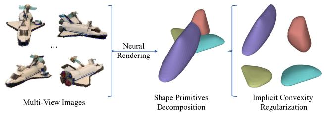
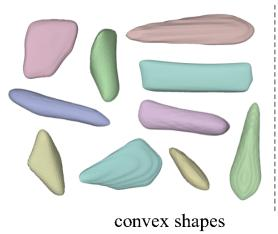
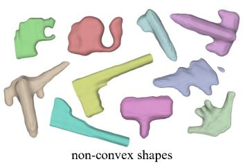
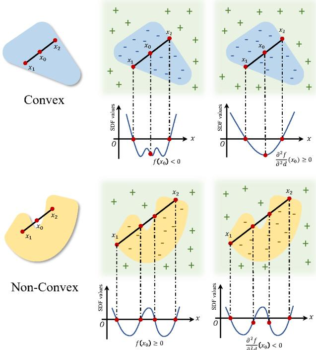
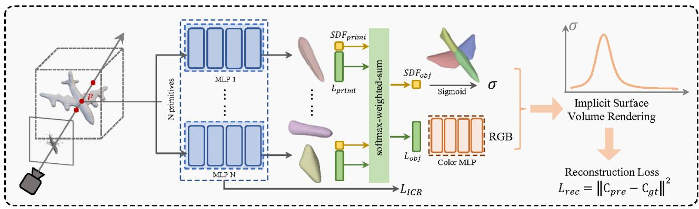
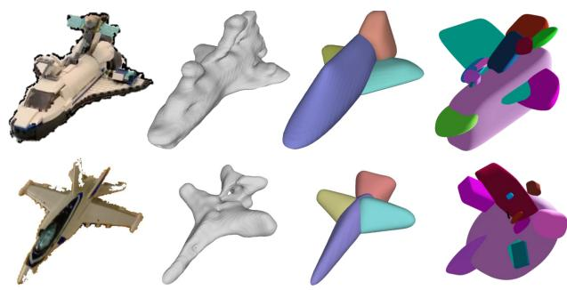
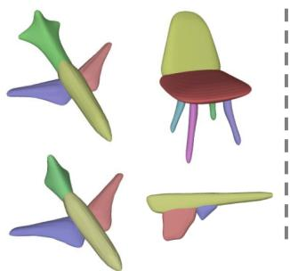
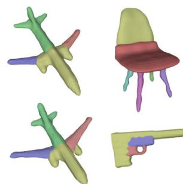
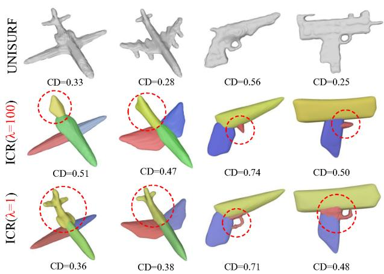

# Learning Shape Primitives via Implicit Convexity Regularization

Xiaoyang Huang1 Yi Zhang1 Kai Chen1 Teng Li2 Wenjun Zhang1 Bingbing Ni1,3\* 1Shanghai Jiao Tong University, Shanghai 200240, China 2Anhui University 3USC-SJTU Institute of Cultural and Creative Industry {huangxiaoyang, nibingbing}@sjtu.edu.cn

## Abstract

Shape primitives decomposition has been an important and long-standing task in 3D shape analysis. Prior arts heavily rely on 3D point clouds or voxel data for shape primitives extraction, which are less practical in real-world scenarios. This paper proposes to learn shape primitives from multi-view images by introducing implicit surface rendering. It is challenging since implicit shapes have a high degree of freedom, which violates the simplicity property of shape primitives. In this work, a novel regularization term named Implicit Convexity Regularization (ICR) imposed on implicit primitive learning is proposed to tackle this problem. We start with the convexity definition of general 3D shapes, and then derive the equivalent expression for implicit shapes represented by signed distancefunctions (SDFs). Further, instead of directly constraining the output SDF values which cause unstable optimization, we alternatively impose constraint on second order directional derivatives on line segments inside the shapes, which proves to be a tighter condition for 3D convexity. Implicit primitives constrained by the proposed ICR are combined into a whole object via softmax-weighted-sum operation over all primitive SDFs. Experiments on synthetic and real-world datasets show that our method is able to decompose objects into simple and reasonable shape primitives without the need of segmentation labels or 3D data. Code and data is publicly available in https://github.com/ seanywang0408/ICR.

## 1. Introduction

Shape primitives extraction aims at decomposing a complex object into simple geometry. It has been a fundamental task in 3D shape representation [7] which imitates human visual perception, abstraction and understanding of real-world objects, and also facilitates industrial manufacturing which fabricates complex objects via component assembling. There are several fundamental properties for shape primitives: i) simplicity, which means that each primitive should be composed of simple geometry; ii) semantics, which means that the decomposition should reveal the semantic parts of an object; iii) fidelity, which means that the primitives should fit the original object as close as possible. Prior methods using parameterized shapes as primitive basis, such as cuboids [11] and superquadrics [13], could guarantee the simplicity property. However, parameterized primitives are less expressive due to their limited pre-defined geometry, which generally cause low fidelity. Though leveraging the flexibility of implicit functions to represent primitives could achieve higher fidelity, it also comes with a drawback that the semantic information generally diminishes during decomposition [5, 9]. Most importantly, all prior works require 3D data either for singleobject fitting or multi-object learning. These data are not accessible in many cases, which makes them unpractical in real-world applications. In this work, we address this problem by learning implicit primitives from multi-view images.

  
Figure 1. We propose a shape primitive decomposition method from multi-view images with a novel Implicit Convexity Regularization scheme (ICR), which theoretically guarantees the convexity of implicit primitives. Our method generates shape primitives that satisfy simplicity, semantics preserving and fidelity.

Learning implicit primitives from multi-view images is an even more challenging task. It is non-trivial to introduce prior implicit primitives [9, 19] into a neural rendering pipeline due to their specific modeling. Besides, implicit shapes without explicit regularization has a high degree of freedom, which could hardly meet the requirements of primitives. To this end, we propose a convex regularization term imposed on a common signed distance function (SDF), which could be readily integrated into any implicit surface reconstruction pipeline, as shown in Figure 1. Convexity is a plausible property for primitives. First, it is a subconcept of simplicity, that is, a convex shape is generally regarded as simple (Figure 2). Second, most semantic parts are convex (see Figure 5 for example). Therefore convexity regularization benefits semantics preservation in primitive decomposition. Lastly, convexity is welcomed in some industrial manufacturing process, such as 3D printing and furniture making, in which convex parts are first fabricated respectively and then adhered into one object.

To derive our implicit convexity regularization, we first start with the general definition of 3D convexity, which is formulated on arbitrary two points inside a shape. Then we tailor this definition to an implicit shape represented by a signed distance function (SDF) without loss of generality. This conversion also allows more lightweight computation. Further, to avoid the training instability and oscillation caused by direct constraint on the output SDF value, we tighten the convexity condition by alternatively constraining the second order directional derivatives along a line segment. We theoretically prove that this constraint is a sufficient condition for convexity. Besides, using the Finite Difference Method could easily implement this constraint.

With the proposed implicit convexity regularization, each primitive is guaranteed to be convex. We combine all primitives into a whole object by conducting softmaxweighted-sum operation over all primitive SDFs and deriving the object SDF. The object SDF is incorporated into a common implicit surface rendering pipeline [17], allowing primitive decomposition from multi-view images. We experiment on both synthetic and real-world datasets, demonstrating the simplicity, semantics and fidelity of our generated primitives, especially on CO3D [21] dataset where prior primitive methods are infeasible without 3D data.

## 2. Related Work

## 2.1. Parameterized Primitives

Cuboids with scaling, rotation and translation are first used as an abstraction of object parts. 3DPRNN [33] uses a recurrent network to generate cuboid primitives step-bystep. Tulsian et al. [24] obtain a consistent parsing across objects based on cuboids assembling. Niu et al. [16] infer hierarchical cuboid structure from single images. Lin et al. [12] propose a reinforcement learning algorithm to learn primitive decomposing policies. Kluger et al. [11] expand cuboids fitting from simple objects to more complex indoor scenes. Although cuboids decomposition could produce compact and semantic primitives, it also cause low fidelity due to its singular geometry.

Another line of shape primitives is super-quadrics [20], which are more expressive than quadrics using 6 control parameters. Paschalidou et al. [18] decompose objects in to a hierachical binary tree of super-quadrics, providing shape abstraction in different levels. EMS [13] aims at extraction super-quadric primitives from a noisy point cloud from a probabilistic view, which makes it more robust to outliers. Besides super-quadrics, ParseNet [23] proposes to use B-spline, cylinder and cones as primitives to reconstruct continuous surface from point clouds. Genova et al. [6] learn category-specific templates based on scaled axis-aligned anisotropic 3D Gaussian prior. ExtrudeNet [22] encodes point clouds into several primitives extruded from 2D Bezier curves that could be integrated into modern CAD software. Although these parameterized primitives provide higher fidelity than cuboids, it still does not meet the complexity of real-world objects.

Constructive Solid Geometry (CSG) Tree [8, 32, 31] uses iterative boolean operators including union and intersection to construct convex or concave geometry, which is wellsuited in computer-aided design (CAD). Although it still uses singular primitives like spheres and rectangles, CSG Tree is able to reconstruct accurate geometry as the iterative boolean operation gets deeper. However, it comes with a drawback that objects are eventually divided into patches in pieces with little semantic information preserved.

## 2.2. Implicit Primitives

BSPNet [3] and CvxNet [5] both use hyperplanes to construct a convex polytype and then assemble these convexes into a non-convex shape. Although these two methods are able to derive convex primitives like ours, the computation and storage cost grow quadratically as the number of hyperplanes increases, which makes it unsuitable for neural rendering in a multi-view scenario. Latent Partition Implicit [2] proposes shape partition in latent space for accurate modeling. Neural Star Domain (NSD) [9] models each primitive as a continuous function defined on a sphere, ensuring the simplicity property of primitives. However it still shares the deficiency of BSPNet and CvxNet that the semantic parts are broken into multiple primitives, as shown in Figure ??. Similar to NSD, Neural Parts [19] define homeomorphic mappings between spheres and primitives, which is able to generate various primitives with single connectivity. Nonetheless it is non-trivial to apply such a homeomorphic mapping in a neural rendering pipeline. Another relevant work to ours is BAENet [4], which uses a branched decoder to learn recurring parts in a shape collection. Although it is capable of producing accurate semantic segmentation results given a ground-truth shape, its reconstruction fidelity is notably inferior to ours.

Moreover, all the above methods strongly rely on 3D data input for primitive decomposition, most of which even require a large set of shape collection within the same category for training, such as ShapeNet [1] or ModelNet [26], which makes them less practical in real-world scenarios. Our method derives implicit convex primitives from multiview images with well-defined semantics.

  
Figure 2. Convexity is a subconcept of simplicity, since a convex shape is generally regarded as simple, while a non-convex shape tends to be more complex.

## 2.3. Implicit Surface Rendering

Recently, implicit neural representations have advanced surface reconstruction from multi-view images. DVR [15] proposes a differentiable rendering formulation for implicit surface and texture representations. IDR [29] approximates the light reflected from a 3D shape represented as the zero level set of a neural network. UNISURF [17] presents a unified framework for implicit surfaces and radiance fields, with the goal of reconstructing nontransparent objects. NeuS [25] develops a volume rendering method to train a neural SDF representation. Yariv et al. [28] define the volume density function as Laplace’s cumulative distribution function applied to a SDF for surface rendering.

## 3. Methodology

We first demonstrate the derivation of the proposed implicit convexity regularization (ICR) scheme, and then explain the application of primitive fitting with ICR in a neural rendering pipeline.

## 3.1. Implicit Convexity Regularization

It is challenging to preserve simplicity in implicit primitives learning from multi-view images. In prior arts, there was little discussion on the simplicity of implicit shapes represented by signed distance functions. In this work, we investigate this problem in the view of convexity. A convex shape is the boundary of a convex set. We show some examples of convex and non-convex shapes in Figure 2. Intuitively, convexity is a subconcept of simplicity, since a convex shape is generally regarded as simple, while a nonconvex shape tends to be more complex. Mathematically, convexity could be defined as follows:

Theorem 1 A shape C is convex ⇐⇒ For arbitrary two points located inside the shape C, the convex combination of the two points are also located inside the shape, i.e.,for any $x _ { 1 } , x _ { 2 } \in C a n d 0 \le \theta \le 1$ , we have $\theta x _ { 1 } + ( 1 - \theta ) x _ { 2 } \in C .$

Theorem 1  
Theorem 2  
Theorem 3  
  
Figure 3. We start with the general definition of convexity in Theorem 1. Then we convert the definition to an implicit shape represented by a signed distance function (SDF), which directly constrains the output SDF value. Lastly, to address the training instability issue in Theorem 2, we alternatively impose constraint on the second order directional derivatives, which proves to be a tighter condition of Theorem 2. The computation of second order directional derivatives could be easily implemented with Finite Difference Method.

It is computation-inefficient to directly apply the vanilla convexity formulation to an implicit function, since it requires queries of arbitrary two points inside the shape. To adapt the convexity definition to a shape represented by an SDF with higher efficiency, we convert the above definition to a surface-based formulation:

Theorem 2 A shape C represented by an signed distance functionfis convex ⇐⇒ For arbitrary two points that are located on the surface ofthe shape, the convex combination of these two points is located inside the shape, i.e., for any $x _ { 1 } , x _ { 2 } \in \{ x | f ( x ) = 0 \}$ and $0 < \theta < 1$ , we have $f ( \theta x _ { 1 } +$ $( 1 - \theta ) x _ { 2 } ) < 0 .$

It is self-evident that Theorem 2 is equivalent to Theorem 1 for a SDF-based shape. It also ease the sampling process since only line segment between surface points are evaluated. In practice, we first randomly sample a set of rays of arbitrary starting points and directions, and retrieve the first and last intersection point $x _ { 1 } , x _ { 2 }$ against the shape by a root-finding algorithm. Those rays which do not intersect with the shape are ignored. Next we sample a set of points which is the convex combination of $x _ { 1 } , x _ { 2 } , i . e .$ points located on the line segment between $x _ { 1 } , x _ { 2 }$ . Lastly we penalize the positive SDF values of these points, meaning that they are outside the shape.

However, we empirically find that directly imposing constraint on the output SDF values could cause serious training instability and oscillation, or even collapse. The reason is that there is a shortcut for the SDF function to satisfy this constraint, that is to scale up the SDF value of the whole function, which only needs to scale up the value of the final layer of the MLP. As an alternative, we propose to impose constraint on the second order directional derivative along the ray direction in the implicit field.

Theorem 3 A shape C represented by an signed distance function f is convex ⇐= For arbitrary two points $x _ { 1 } , x _ { 2 }$ located on the surface of the shape, we have positive second order directional derivative along the direction $x _ { 2 } - x _ { 1 }$ on the convex combination of x1, x2, i.e., for any $x _ { 1 } , x _ { 2 } \in$ $\{ x | f ( x ) = 0 \} , d = x _ { 2 } - x _ { 1 }$ and $0 ~ < ~ \theta ~ < ~ 1$ , we have $\begin{array} { r } { \frac { \partial ^ { 2 } f } { \partial ^ { 2 } d } ( \theta x _ { 1 } + ( 1 - \theta ) x _ { 2 } ) \geq 0 . } \end{array}$

Proof. If the condition in Theorem 3 is satisfied, it means that the 1D function $f _ { S D F } ( x _ { 0 } )$ w.r.t $x _ { 0 } ~ = ~ \theta x _ { 1 } + ( 1 ~ -$ $\theta ) x _ { 2 } , 0 ~ < ~ \theta ~ < ~ 1$ is a convex function. By the definition of convex functions, we have $f ( x _ { 0 } ) < \theta f ( x _ { 1 } ) + ( 1 -$ $\theta ) f ( x _ { 2 } ) = \theta \times 0 + ( 1 - \theta ) \times 0 = 0$ . Through Theorem $^ { 2 , }$ we know shape C is convex. Constraint on second order directional derivatives is a tighter condition for convexity than constraint on SDF values. Intuitively, when the second order directional derivatives are positive everywhere between $x _ { 1 } , x _ { 2 }$ , we have a monotonically increasing first order directional derivative along the line segment, meaning that no inflection point exists in the interval.

Based on Theorem 3, we encourage convexity by penalizing negative second order directional derivatives between $x _ { 1 } , x _ { 2 }$ . However, differentiating second order gradient of a neural network involve extremely intense computation. To this end, we replace accurate gradient derivation with $F i -$ nite Difference, in which we view the continuous SDF as a discrete function via uniform sampling between the two intersection points $x _ { 1 } , x _ { 2 }$ . The detailed algorithm is presented in Algorithm 1. We also visualize the convexity defined by the three theorems using a 2D case in Figure 3.

## 3.2. Learning Primitives from Multi-View Images

Primitive Representations. We represent implicit shape primitives with a set of general signed distance functions (SDFs). Given a 3D point p as input, we use a multilayer perceptron (MLP) $f$ to predict the signed distance $S D F _ { p r i m i } ( \mathbf { p } )$ from the point p to the object surface. The signed distance is positive when the point is located outside of the surface, while the signed distance is negative when the point is located inside of the surface. To unify the primitives into a complete object, one could take the minimal value over all primitive SDFs as the final object SDF. However, doing so would block the gradient flow from the object SDF to the subminimal primitive SDFs, which leads to suboptimal convergence. To this end, we conduct a soft minimization, composed of a softmax and a weighted sum operation. Formally, suppose each primitive SDF is implemented as a MLP network $f _ { i }$ , the object signed distance of point p could be computed as:

Algorithm 1 Implicit Convexity Regularization (ICR)   
1: Input: signed distance function $\overline { { f } }$   
2: Output: convexity penalty $\mathcal { L } _ { I C R }$   
3: Generate a ray with random starting points and direc  
tions;   
4: Retrieve the first and last intersection points $x _ { 1 } , x _ { 2 }$ by   
root-finding algorithm;   
5: Uniformly sample K points between $x _ { 1 } , x _ { 2 } \colon \{ p _ { j } \ =$   
$\begin{array} { r } { \theta _ { j } x _ { 1 } + ( 1 - \theta _ { j } ) x _ { 2 } | \theta _ { j } = \frac { j } { K + 1 } , j = 1 , 2 , . . . , K \} ; } \end{array}$   
6: Query the SDF values of the sampled points:   
$\{ f ( p _ { j } ) | j = 1 , 2 , . . . , K \}$   
7: Compute 1st order direction derivative with finite dif  
ference: $\{ \nabla f = f ( p _ { j } ) - f ( p _ { j - 1 } ) | j = 2 , . . . , K \}$ ;   
8: Compute 2rd order direction derivative with finite dif  
ference: $\{ \nabla ^ { 2 } f = \nabla f ( p _ { j } ) - \nabla f ( p _ { j - 1 } ) | j = 3 , . . . , K \}$   
9: Compute the penalty term $\begin{array} { r } { L = \sum \dot { m } a x ( - \nabla ^ { 2 } f , 0 ) ; } \end{array}$   
10: return $\mathcal { L } _ { I C R } .$

$$
\begin{array} { r l } & { S D F _ { p r i m i } ^ { i } ( \mathbf { p } ) = f _ { i } ( \mathbf { p } ) , } \\ & { \omega _ { i } = \mathrm { s o f t m a x } ( - \boldsymbol { \beta } \cdot S D F _ { p r i m i } ^ { i } ( \mathbf { p } ) ) , } \\ & { S D F _ { o b j } ( \mathbf { p } ) = \displaystyle \sum _ { i = 1 } ^ { N } \omega _ { i } \cdot S D F _ { p r i m i } ^ { i } ( \mathbf { p } ) , } \end{array}\tag{1}
$$

where $\beta$ is the scaling temperature (set to 10 in our experiments) in softmax operation, $\omega _ { i }$ denotes the weight of ith primitive and N is the number of the primitives.

Surface Rendering. Considering the difficulty of acquiring 3D data in application, we aim at learning the implicit primitives from multi-view images. Although prior works such as BSPNet [3] and CvxNet [5] proposes 3D convexity representation based on hyper-planes, these representations are infeasible in current neural rendering pipelines, hindering the acquisition of convexity primitives from multi-view data. One key contribution of our method is that we extend convexity primitives to a implicit surface distance function, which is the common 3D representation of neural rendering pipelines.

  
Figure 4. Our network consists of N primitive MLPs and one color MLP. Each primitive MLP outputs an SDF value and a geometry latent code of the primitive from the input $\mathbf { p } .$ The primitive SDF values and latent codes go through a softmax-weighted-sum layer to obtain the object SDF and latent code, which are then respectively processed by a sigmoid layer and a color MLP. The obtained volume density σ and RGB are applied in a standard implicit surface volume rendering method. The loss is computed by the weighted sum of reconstruction error and Implicit Convexity Regularization on each primitive.

Specifically, we integrate the implicit primitives into a neural rendering pipeline based on UNISURF [17]. To this end, we first extend the pirmitive MLPs in Sec 3.2 to additionally output a geometry latent code except for SDF value in the final layer, such that

$$
[ S D F _ { p r i m i } ^ { i } ( { \bf p } ) , L _ { p r i m i } ^ { i } ( { \bf p } ) ] = f _ { i } ( { \bf p } ) ,\tag{2}
$$

where $L _ { p r i m i } ^ { i } ( \mathbf { p } )$ is the latent code of p. Similar to $S D F _ { o b j } ( \mathbf { \acute { p } } )$ , the object latent code $L _ { o b j } ( \mathbf { p } )$ is obtained by the softmax-weighted-sum over all primitive latent codes. We further implement a color MLP which receives the object latent code as input and predicts the RGB value c of p. Then we apply the volume rendering as follows.

For a ray r starting from the camera position to the pixel location, we first retrieve the surface point $\mathbf { x } _ { s }$ defined by $S D F _ { o b j } ( \mathbf { x } _ { s } ) = 0$ using a root-finding algorithm. Then, we sample N points $\mathbf { x } _ { j }$ along ray r within a interval around $\mathbf { x } _ { s } .$ We infer the object SDF value for each sample and convert it to volume density $\sigma _ { j }$ as follows:

$$
\sigma _ { j } = \mathrm { S i g m o i d } ( - \mu \cdot S D F _ { o b j } ( \mathbf { x } _ { j } ) ) ,\tag{3}
$$

where $\mu$ is a hyper-parameter that controls the sharpness of density distribution (set to 25 in all our experiments). The ray color is then obtained by the following volume rendering equation:

$$
\hat { C } ( \mathbf { r } ) = \sum _ { j = 1 } ^ { N } \sigma _ { j } \prod _ { k < j } \left( 1 - \sigma _ { k } \right) \mathbf { c } _ { j } .\tag{4}
$$

The reconstruction loss is computed over all sampled rays $\mathbf { r } \in \mathcal { R }$ , with C(r) as the ground-truth pixel color:

$$
\mathcal { L } _ { r e c } = \sum _ { \mathbf { r } \in \mathcal { R } } \left\| \hat { C } ( \mathbf { r } ) - C ( \mathbf { r } ) \right\| ^ { 2 } .\tag{5}
$$

For more details on the neural rendering process, please refer to UNISURF [17]. Overall, we train our model with the following loss function:

$$
\mathcal { L } = \mathcal { L } _ { r e c } + \lambda \sum _ { i = 1 } ^ { N } \mathcal { L } _ { I C R } ^ { i } ,\tag{6}
$$

where $\mathcal { L } _ { I C R } ^ { i }$ is the proposed implicit convexity regularization derived in Algorithm 1, which is imposed on each primitive, and λ is the weighting hyper-parameter. Since $\mathcal { L } _ { I C R }$ is generally a small value, we set λ to 100 in our experiments. Illustration of the pipeline is presented in Figure 4.

## 3.3. Implementation

In all our experiments, each primitive SDF is implemented as a 4-layer MLP, with a skip connection from the input to the third layer. The color MLP also contains 4 layers. All layers have 64 hidden units. The input coordinates are first encoded by a sinusoidal embedding layer with $L = 6 ,$ as done in UNISURF [17]. We use the Adam optimizer [10] with an initial learning rate of $1 0 ^ { - 5 }$ . The learning rate is multiplied by 0.5 in 4, 000th and 5, 000th iteration. For each iteration, we sample 1, 024 rays for volume rendering. The model is trained for 10, 000 iterations.

## 4. Experiments

## 4.1. Synthetic Dataset

Dataset. ShapeNet [1] is a shape collection composed of multiple categories. We conduct experiments on six categories including airplane, car, chair, lamp, table and pistol. We evaluate our method and prior works on randomlyselected 20 shapes for each category. For our method and UNISURF, we use the multi-view images rendered by

# キンキメT

UNISURF

Ours

BAENet

EMS

UNISURF

Ours

BAENet

EMS

Figure 5. We visualize the ShapeNet results of our method and prior works, including BAENet, EMS and UNISURF. Our method achieves notably better decomposition and fidelity than BAENet and EMS.

DISN [27], which includes 36 views for each object with known camera intrinsic and extrinsic parameters. The images are rendered in 224 × 224 resolution.

Comparisons. We compare our method with the following works. i) BAENet [4]: BAENet is a learning-based primitive decomposition method that is trained on a shape collection within a category. It receives 3D voxel as input and predict an implicit field for each primitive. We follow its default settings which train the models on the complete collection for each categories without segmentation supervision, e.g. 2, 690 objects for airplane. ii) EMS [13]: EMS is the state-of-the-art parameterized primitive decomposition method which derives superquadric primitives from a point cloud via a robust optimization algorithm. We follow its default setting in multi-superquadric optimization, and feed the ground-truth point cloud as input data. iii)

UNISURF [17]: UNISURF is a state-of-the-art implicit surface reconstruction method which derive the implicit field of an object from multi-view images. We include UNISURF for comparisons with a standard implicit surface reconstruction method in terms of fidelity. The above methods are summarized in Table 1. We use two metrics for evaluation, including Chamfer Distance (CD) and Intersection over Union (IoU). The quantitative results are reported in Table 2. We also visualize the meshes in Figure 5, with different colors for different primitives.

Results. Figure 5 and Table 2 show that our method achieves notably better decomposition and fidelity than BAENet and EMS. In Figure 5, our method consistently decomposes objects into semantic elements in convex geometry for different categories. BAENet fails in chair, lamp and pistol cases, where the chair back and cushion, lamp bulb and base, pistol barrel and handle are mixing together. Besides, Table 2 shows that BAENet achieves lower reconstruction accuracy than ours, even though it is trained on 3D data and receives 3D voxel as input. In table category, it fails to reconstruct the table leg. EMS fails in most cases with low fidelity and unreasonable decomposition. The reason for that is that EMS is based on a iterative optimization, where one primitive is fitted to the point cloud until convergence and then another primitive is fitted to the rest outliers and so on. It generally falls into a local minimum for objects that do not consist of a main stem and branches. Compared to UNISURF, we achieve comparable reconstruction accuracy in most cases. For table category, we even surpass UNISURF on modeling thin geometry such as the table legs, owing to convexity prior of our method.

<table><tr><td>Method</td><td>Data Source</td><td>Recon Semantic</td></tr><tr><td>UNISURF</td><td>Fitted on 2D data</td><td>√ x</td></tr><tr><td>EMS</td><td>Fitted on 3D data</td><td>√ √</td></tr><tr><td>BAENet</td><td>Trained on large-scale 3D data</td><td>√ √</td></tr><tr><td>CvxNet</td><td>Trained on large-scale 3D data</td><td>√ x</td></tr><tr><td>ICR (Ours)</td><td>Fitted on 2D data</td><td>√ √</td></tr></table>

Table 1. Summary of compared methods. Recon and Semantic denote capability of reconstruction and semantic decomposition.
<table><tr><td>CD↓\IoU↑ UNISURF</td><td>Ours</td><td>BAENet</td><td>EMS</td></tr><tr><td>Airplane</td><td>0.32\86.3 0.50\79.2</td><td>0.91\57.8</td><td>3.12\26.8</td></tr><tr><td>Pistol</td><td>0.53\74.8 0.85\62.5</td><td>1.67\38.4</td><td>2.32\32.6</td></tr><tr><td>Table</td><td>1.57\42.1 1.40\43.2</td><td>2.86\22.4</td><td>6.85\18.5</td></tr><tr><td>Chair</td><td>1.00\49.2</td><td>1.29\47.4 1.45\41.7</td><td>5.74\16.9</td></tr><tr><td>Lamp</td><td>0.27\89.6</td><td>0.99\53.8 1.56\38.6</td><td>2.76\25.0</td></tr><tr><td>Car</td><td>1.46\48.5</td><td>1.86\37.2 2.06\31.5</td><td>2.36\27.5</td></tr><tr><td>Mean</td><td>0.86\65.1</td><td>1.15\53.9 1.75\38.4</td><td>3.86\24.6</td></tr></table>

Table 2. We measure the Chamfer Distance $( 1 0 ^ { - 3 }$ , ↓) and Intersection over Union (↑) between the reconstructed surface and the ground-truth shapes. Our method achieves better reconstruction accuracy compared to prior primitive decomposition methods, even comparable to UNISURF, which is a state-of-the-art surface reconstruction method.

## 4.2. Real-World Dataset

One question might be raised that if we have access to multi-view images, why not just recover its 3D representation using multi-view reconstruction methods. However, even though we could reconstruct 3D representation for one sample, it is still inefficient or even impractical to conduct reconstruction for a large-scale dataset. What’s more, the common case in real-world scenarios is that we are not able to acquire a large-scale real-world datasets for ONE target object. It is demonstrated by our experiments on CO3D.

Dataset. CO3D [21] is a multi-view dataset collected on real-world objects with known camera intrinsic and extrinsic parameters. Each object includes a varied number of views ranging from tens to hundreds. The resolution of each image also varies from 1000 × 500 to 1600 × 1000. We crop the images with a square bounding box centered at the object and then resize them to 224 × 224 for training.

Comparisons. Note that prior works which are trained on a 3D shape collection are basically infeasible in this dataset, since CO3D lacks regular 3D data form (except for some objects that have a noisy point cloud generated by MVS algorithm). Therefore we compare our method with UNISURF (based on multi-view images) and EMS (based on point clouds) in terms of visual effects.

Results. As shown in Figure 6, our method is able to decompose objects into convex primitives with rich semantics. The reconstruction accuracy is comparable to UNISURF in terms of visual effect. EMS generates several invalid primitives which do not match the object geometry.

## 4.3. Ablation Study

Effectiveness of Convexity Regularization. We evaluate the effectiveness of the proposed implicit convexity regularization by removing this regularization in the neural rendering pipeline, while other settings remain the same. We show the comparisons in Figure 7. Comparing results with and without ICR, we see that ICR successfully guarantees the convexity of each primitive, which benefits consistent semantic decomposition. Although optimization without ICR could sometimes obtain higher fidelity, such as the reconstruction of wings and tails of the planes, it generally causes illogical decomposition, i.e., part of the wing is assigned to the stem primitive, and part of the chair cushion is assigned to the back primitive. Besides, we also find that with the convexity prior, the reconstructions of the thin objects are more plausible, such as the chair legs. The reason is that convex regularization encourages simple geometry. By contrast, in the case of removing ICR, the reconstruction is done by ray sampling, which could be insufficient to recover a smooth object surface. More example primitives obtained with and without ICR could be found in left and right column respectively in Figure 2.

Convexity Controlling. We demonstrate that controlling the weight of implicit convexity regularization could achieve trade-off between primitive simplicity and fidelity. Specifically, we convert Equation 6 into $\begin{array} { r } { \mathcal { L } ~ = ~ \mathcal { L } _ { r e c } ~ + } \end{array}$ $\bar { \sum { _ { i = 1 } ^ { N } \lambda _ { i } \mathcal { L } _ { I C R } ^ { i } } }$ , in which λ are tunable for individual primitive. We then apply a smaller weight λi on $L _ { I C R } ^ { i }$ for those primitives which we prefer higher fidelity than simplicity, while other primitives remain still. We show some examples in Figure 8. In the bottom row, we set the λ of the primitives circled in red (tail of the plane and trigger of the pistol) to 1 and others to 100. In this way we obtain a flexible primitive with higher accuracy, while other parts still preserve their semantics and simplicity. The adjusted primitives achieve lower chamfer distance than the vanilla ones.

Ours  
EMS  
  
Figure 6. Visualization of CO3D experiments. Our method is able to decompose objects into plausible shape primitives from multiview input. EMS obtains shape primitives from point clouds.

  
with ICR

  
without ICR

Figure 7. The proposed Implicit Convexity Regularization (ICR) theoretically guarantees the convexity and simplicity of each primitive. Removing ICR causes unreasonable decomposition.  
  
Figure 8. Tuning λ, the weight of ICR, for individual primitive could achieve trade-off between fidelity and simplicity. In the bottom row, we set the λ of the primitives circled in red (tail of the plane and trigger of the pistol) to 1 and others to 100. In this way we obtain a flexible primitive with higher accuracy, while other parts still preserve their semantics and simplicity. We compute the chamfer distance (CD) to evaluate the fidelity.

<table><tr><td>SVR\Seg</td><td>Airplane</td><td>Table</td><td>Chair</td><td>Lamp</td></tr><tr><td>OccNet</td><td>57.1\ 一</td><td>50.6\ 一</td><td>50.1\ 一</td><td>37.1\—</td></tr><tr><td>CvxNet</td><td>59.8\</td><td>47.3\ 一</td><td>49.1\ 一</td><td>31.1\—</td></tr><tr><td>BAENet</td><td>52.4\80.4</td><td>41.6\87.0</td><td>45.2\84.8</td><td>32.8\63.9</td></tr><tr><td>Ours</td><td>64.1\69.5</td><td>46.7\89.2</td><td>49.3\88.3</td><td>37.7\68.2</td></tr></table>

Table 3. We extend our proposed ICR term to a large-scale 3D training setting. We compare our method with prior works on single-view 3D reconstruction (IoU ↑) and semantic segmentation (IoU ↑) tasks. Since OccNet and CvxNet are incapable of decomposing objects into semantic parts, their segmentation performance are absent.

Training on 3D datasets. Although our method is designed for multi-view data, we would also like to test its performance in a large-scale 3D training setting that is similar with prior primitive-learning methods. To this end, we further conduct a set of experiments on ShapeNet, in which we integrate our ICR term into a encoder-decoder network and train it on a dataset within one category. The network receives 3D voxels as input and predict SDF value of query points. The encoder is implemented as a 3D CNN, similar to prior works [3, 4], while the decoder is implemented by our primitive representation in Equ. 1. Following prior works [3], after the training is finished, we replace the 3D encoder with a 2D CNN and train it on a single-view reconstruction task while the decoder is fixed. We measure single-view reconstruction accuracy as well as semantic decomposition performance using the segmentation labels from ShapeNetPart [30]. Intersection over Union (IoU) is used as the metric for both tasks. We experiment on four categories of ShapeNet: airplane, chair, lamp and table. We follow the train-test-split in BAENet. The detailed network architecture and experiment setting is presented in the appendix. We compare our method with Occ-Net [14], BAENet [4] and CvxNet [5]. The results are listed in Table 3. Compared to BAENet and CvxNet, our method achieves similar or even better reconstruction accuracy in single-view reconstruction task. We found that the artifact of disappearance (see Fig. ?? table) and dilation (see Fig. ?? chair and lamp) exists in the results of BAENet and CvxNet, which is the main reason that their reconstruction accuracy is lower. Besides, our method is able to achieve better semantics decomposition. Note that all methods are validated without fine-tuning on test samples.

## 5. Conclusion

In this work, we propose a regularization term named Implicit Convexity Regularization (ICR) for primitive decomposition. We theoretically prove that imposing constraint on the second order directional derivatives on line segments inside a shape could encourage convexity for implicit shapes represented by signed distance functions. Experiments on synthetic and real-world datasets demonstrate the superiority of our method over prior arts with respect to primitive simplicity, fidelity and semantics.

## 6. Acknowledgements

This work was supported by National Science Foundation of China (U20B2072, 61976137). This work was also partially supported by Grant YG2021ZD18 from Shanghai Jiao Tong University Medical Engineering Cross Research.

## References

[1] Angel X. Chang, Thomas Funkhouser, Leonidas Guibas, Pat Hanrahan, Qixing Huang, Zimo Li, Silvio Savarese, Manolis Savva, Shuran Song, Hao Su, Jianxiong Xiao, Li Yi, and Fisher Yu. ShapeNet: An Information-Rich 3D Model Repository. Technical Report arXiv:1512.03012 [cs.GR], Stanford University — Princeton University — Toyota Technological Institute at Chicago, 2015.

[2] Chao Chen, Yu-Shen Liu, and Zhizhong Han. Latent partition implicit with surface codes for 3d representation. In European Conference on Computer Vision, pages 322–343. Springer, 2022.

[3] Zhiqin Chen, Andrea Tagliasacchi, and Hao Zhang. Bsp-net: Generating compact meshes via binary space partitioning. In Proceedings of the IEEE/CVF Conference on Computer Vision and Pattern Recognition, pages 45–54, 2020.

[4] Zhiqin Chen, Kangxue Yin, Matthew Fisher, Siddhartha Chaudhuri, and Hao Zhang. Bae-net: Branched autoencoder for shape co-segmentation. In Proceedings ofthe IEEE/CVF International Conference on Computer Vision, pages 8490– 8499, 2019.

[5] Boyang Deng, Kyle Genova, Soroosh Yazdani, Sofien Bouaziz, Geoffrey Hinton, and Andrea Tagliasacchi. Cvxnet: Learnable convex decomposition. In Proceedings of the IEEE/CVF Conference on Computer Vision and Pattern Recognition, pages 31–44, 2020.

[6] Kyle Genova, Forrester Cole, Daniel Vlasic, Aaron Sarna, William T Freeman, and Thomas Funkhouser. Learning shape templates with structured implicit functions. In Proceedings of the IEEE/CVF International Conference on Computer Vision, pages 7154–7164, 2019.

[7] Xiaoyang Huang, Jiancheng Yang, Yanjun Wang, Ziyu Chen, Linguo Li, Teng Li, Bingbing Ni, and Wenjun Zhang. Representation-agnostic shape fields. In International Conference on Learning Representations, 2021.

[8] Kacper Kania, Maciej Zieba, and Tomasz Kajdanowicz. Ucsg-net-unsupervised discovering of constructive solid geometry tree. Advances in Neural Information Processing Systems, 33:8776–8786, 2020.

[9] Yuki Kawana, Yusuke Mukuta, and Tatsuya Harada. Neural star domain as primitive representation. Advances in Neural Information Processing Systems, 33:7875–7886, 2020.

[10] Diederik P Kingma and Jimmy Ba. Adam: A method for stochastic optimization. In ICLR, 2014.

[11] Florian Kluger, Hanno Ackermann, Eric Brachmann, Michael Ying Yang, and Bodo Rosenhahn. Cuboids revisited: Learning robust 3d shape fitting to single rgb images. In Proceedings of the IEEE/CVF Conference on Computer Vision and Pattern Recognition, pages 13070–13079, 2021.

[12] Cheng Lin, Tingxiang Fan, Wenping Wang, and Matthias Nießner. Modeling 3d shapes by reinforcement learning. In European Conference on Computer Vision, pages 545–561. Springer, 2020.

[13] Weixiao Liu, Yuwei Wu, Sipu Ruan, and Gregory S Chirikjian. Robust and accurate superquadric recovery: a probabilistic approach. In Proceedings of the IEEE/CVF Conference on Computer Vision and Pattern Recognition, pages 2676–2685, 2022.

[14] Lars Mescheder, Michael Oechsle, Michael Niemeyer, Sebastian Nowozin, and Andreas Geiger. Occupancy networks: Learning 3d reconstruction in function space. In Proceedings of the IEEE/CVF conference on computer vision and pattern recognition, pages 4460–4470, 2019.

[15] Michael Niemeyer, Lars Mescheder, Michael Oechsle, and Andreas Geiger. Differentiable volumetric rendering: Learning implicit 3d representations without 3d supervision. In Proceedings of the IEEE/CVF Conference on Computer Vision and Pattern Recognition, pages 3504–3515, 2020.

[16] Chengjie Niu, Jun Li, and Kai Xu. Im2struct: Recovering 3d shape structure from a single rgb image. In Proceedings of the IEEE conference on computer vision and pattern recognition, pages 4521–4529, 2018.

[17] Michael Oechsle, Songyou Peng, and Andreas Geiger. Unisurf: Unifying neural implicit surfaces and radiance fields for multi-view reconstruction. In Proceedings of the IEEE/CVF International Conference on Computer Vision, pages 5589–5599, 2021.

[18] Despoina Paschalidou, Luc Van Gool, and Andreas Geiger. Learning unsupervised hierarchical part decomposition of 3d objects from a single rgb image. In Proceedings of the IEEE/CVF Conference on Computer Vision and Pattern Recognition, pages 1060–1070, 2020.

[19] Despoina Paschalidou, Angelos Katharopoulos, Andreas Geiger, and Sanja Fidler. Neural parts: Learning expressive 3d shape abstractions with invertible neural networks. In Proceedings of the IEEE/CVF Conference on Computer Vision and Pattern Recognition, pages 3204–3215, 2021.

[20] Despoina Paschalidou, Ali Osman Ulusoy, and Andreas Geiger. Superquadrics revisited: Learning 3d shape parsing beyond cuboids. In Proceedings of the IEEE/CVF Conference on Computer Vision and Pattern Recognition, pages 10344–10353, 2019.

[21] Jeremy Reizenstein, Roman Shapovalov, Philipp Henzler, Luca Sbordone, Patrick Labatut, and David Novotny. Common objects in 3d: Large-scale learning and evaluation of real-life 3d category reconstruction. In International Conference on Computer Vision, 2021.

[22] Daxuan Ren, Jianmin Zheng, Jianfei Cai, Jiatong Li, and Junzhe Zhang. Extrudenet: Unsupervised inverse sketchand-extrude for shape parsing. In European Conference on Computer Vision, pages 482–498. Springer, 2022.

[23] Gopal Sharma, Difan Liu, Subhransu Maji, Evangelos Kalogerakis, Siddhartha Chaudhuri, and Radom´ır Mech.ˇ Parsenet: A parametric surface fitting network for 3d point clouds. In European Conference on Computer Vision, pages 261–276. Springer, 2020.

[24] Shubham Tulsiani, Hao Su, Leonidas J Guibas, Alexei A Efros, and Jitendra Malik. Learning shape abstractions by assembling volumetric primitives. In Proceedings of the IEEE Conference on Computer Vision and Pattern Recognition, pages 2635–2643, 2017.

[25] Peng Wang, Lingjie Liu, Yuan Liu, Christian Theobalt, Taku Komura, and Wenping Wang. Neus: Learning neural implicit surfaces by volume rendering for multi-view reconstruction. Advances in Neural Information Processing Systems, 34:27171–27183, 2021.

[26] Zhirong Wu, Shuran Song, Aditya Khosla, Fisher Yu, Linguang Zhang, Xiaoou Tang, and Jianxiong Xiao. 3d shapenets: A deep representation for volumetric shapes. In Proceedings of the IEEE conference on computer vision and pattern recognition, pages 1912–1920, 2015.

[27] Qiangeng Xu, Weiyue Wang, Duygu Ceylan, Radomir Mech, and Ulrich Neumann. Disn: Deep implicit surface network for high-quality single-view 3d reconstruction. Advances in Neural Information Processing Systems, 32, 2019.

[28] Lior Yariv, Jiatao Gu, Yoni Kasten, and Yaron Lipman. Volume rendering of neural implicit surfaces. Advances in Neural Information Processing Systems, 34:4805–4815, 2021.

[29] Lior Yariv, Yoni Kasten, Dror Moran, Meirav Galun, Matan Atzmon, Basri Ronen, and Yaron Lipman. Multiview neural surface reconstruction by disentangling geometry and appearance. Advances in Neural Information Processing Systems, 33:2492–2502, 2020.

[30] Li Yi, Vladimir G Kim, Duygu Ceylan, I-Chao Shen, Mengyan Yan, Hao Su, Cewu Lu, Qixing Huang, Alla Sheffer, and Leonidas Guibas. A scalable active framework for region annotation in 3d shape collections. ACM Transactions on Graphics (ToG), 35(6):1–12, 2016.

[31] Fenggen Yu, Qimin Chen, Maham Tanveer, Ali Mahdavi Amiri, and Hao Zhang. Dualcsg: Learning dual csg trees for general and compact cad modeling. arXiv preprint arXiv:2301.11497, 2023.

[32] Fenggen Yu, Zhiqin Chen, Manyi Li, Aditya Sanghi, Hooman Shayani, Ali Mahdavi-Amiri, and Hao Zhang. Capri-net: Learning compact cad shapes with adaptive primitive assembly. In Proceedings ofthe IEEE/CVF Conference on Computer Vision and Pattern Recognition, pages 11768– 11778, 2022.

[33] Chuhang Zou, Ersin Yumer, Jimei Yang, Duygu Ceylan, and Derek Hoiem. 3d-prnn: Generating shape primitives with recurrent neural networks. In Proceedings of the IEEE International Conference on Computer Vision, pages 900–909, 2017.