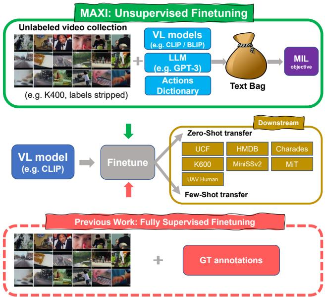
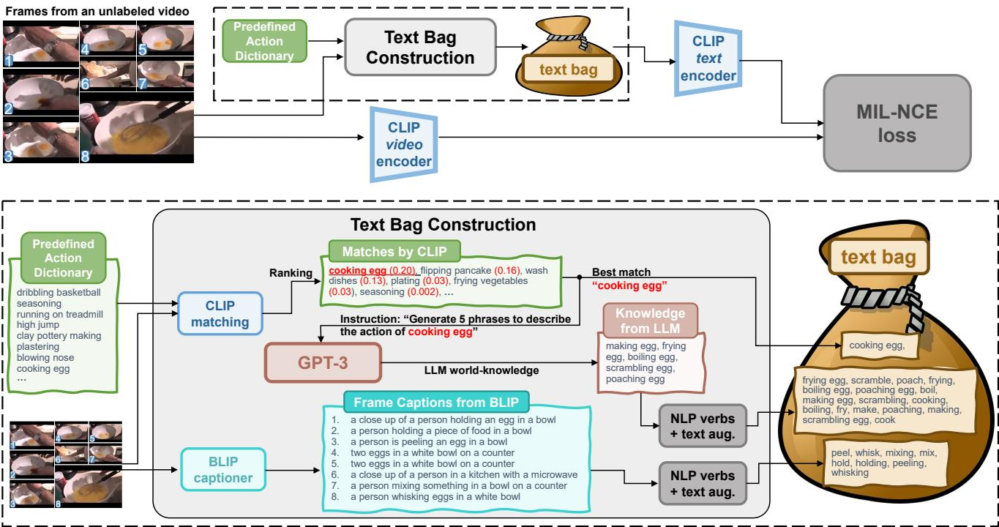
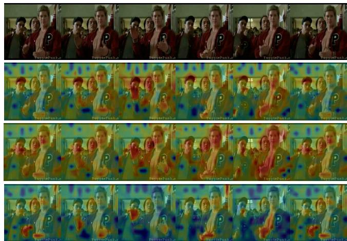
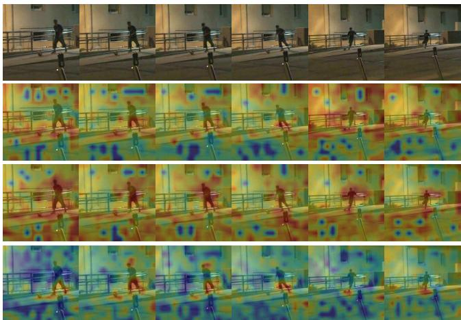
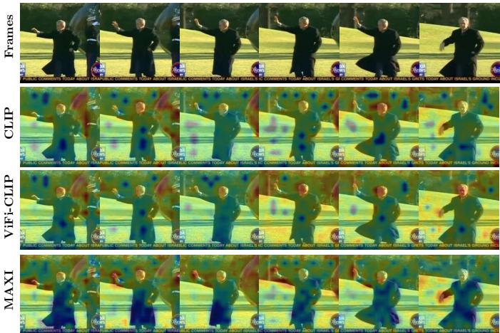
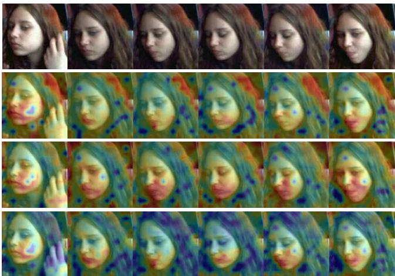

# MAtch, eXpand and Improve: Unsupervised Finetuning for Zero-Shot Action Recognition with Language Knowledge

Wei Lin†1 Leonid Karlinsky2 Nina Shvetsova3 Horst Possegger1 Mateusz Kozinski1 Rameswar Panda2 Rogerio Feris2 Hilde Kuehne2,3,4 Horst Bischof1

1Institute of Computer Graphics and Vision, Graz University of Technology, Austria 2MIT-IBM Watson AI Lab, USA 3Goethe University Frankfurt, Germany 4University of Bonn, Germany

## Abstract

Large scale Vision Language (VL) models have shown tremendous success in aligning representations between visual and text modalities. This enables remarkable progress in zero-shot recognition, image generation & editing, and many other exciting tasks. However, VL models tend to over-represent objects while paying much less attention to verbs, and require additional tuning on video data for best zero-shot action recognition performance. While previous work relied on large-scale, fully-annotated data, in this work we propose an unsupervised approach. We adapt a VL modelfor zero-shot andfew-shot action recognition using a collection of unlabeled videos and an unpaired action dictionary. Based on that, we leverage Large Language Models and VL models to build a text bag for each unlabeled video via matching, text expansion and captioning. We use those bags in a Multiple Instance Learning setup to adapt an image-text backbone to video data. Although finetuned on unlabeled video data, our resulting models demonstrate high transferability to numerous unseen zero-shot downstream tasks, improving the base VL model performance by up to 14%, and even comparing favorably to fully-supervised baselines in both zero-shot and few-shot video recognition transfer. The code is released at https://github.com/wlin-at/MAXI.

## 1. Introduction

Vision Language (VL) models [36, 23, 17] have met unprecedented success in unlocking many vision applications [36] to work with potentially unlimited open vocabularies, through the promise of zero-shot transfer [55, 57, 58, 14, 39, 59, 22, 37]. This is empowered by the alignment between visual and language representation spaces, which is effectively attained by VL models leveraging huge amounts of paired image and text data. Incorporating a VL model as a source (base) model or as an architectural component has allowed scaling finetuning on relatively small datasets (e.g. limited in terms of the number of observed objects or other visual concepts compared to the vast VL pretraining) towards zero-shot transfer at inference time. Such zeroshot transfer includes recognizing [55, 57, 58], detecting [14, 39, 59], segmenting [22, 37], and even generating [40] objects unseen during the finetuning stage and only encountered for the first time at the inference stage.

  
Figure 1: While previous work relied on full annotation of action datasets which is time-consuming and cost-intensive to collect, our approach MAXI finetunes the VL model with unlabeled video data. Specifically, we leverage a set of language sources (action dictionary, VL model and LLM) to construct a text bag for each unlabeled video, and employ the Multiple Instance Learning (MIL) objective for finetuning. MAXI demonstrates outstanding improvement of zero-shot and few-shot transfer on downstream novel action datasets.

However, despite the progress in zero-shot image tasks, VL models have been observed to underperform when applied to zero-shot action recognition on video data without any finetuning [47, 33, 18, 50, 5, 38]. A possible reason, as extensively studied in several works [46, 56, 53, 15], is that VL models have a tendency to mostly represent objects (nouns) and not actions (verbs or verb phrases). Therefore, to deal with these shortcomings of VL models w.r.t. zero-shot action recognition, previous works [47, 33, 18, 50, 5, 38] have used datasets with full annotation (e.g. K400 [19]) to finetune VL models (e.g. the most popular CLIP [36]) towards improved video zero-shot recognition performance. The potential downsides of this approach are: (i) reliance on full annotation of large-scale action datasets that is time-consuming and cost-intensive, and (ii) the exposure of the model to only the limited action vocabulary during the supervised finetuning (e.g. 400 actions of K400 vs. over 8K possible single verb actions and much more possible general actions in English language) limiting the performance of zero-shot transfer to unseen action categories. In this context, we propose ‘MAtch, eXpand and Improve’ (MAXI) – to allow finetuning on completely unlabeled video data (e.g. unlabeled K400 [19]) and a set of language sources, such as unpaired action dictionaries, Large Language Models (LLM) (e.g. GPT-3 [3]), and VL models for matching (e.g. CLIP [36]) and captioning (e.g. BLIP [23]). To this end, MAXI relies on individual bags of potential texts, collected and refined based on the different language sources, that correspond to each video in the unlabeled set. It then applies Multiple Instance Learning (MIL) for finetuning the VL model using those bags as illustrated in Figure 1. We extensively evaluate MAXI on seven downstream zero-shot and few-shot transfer action recognition benchmarks completely unseen during training. We show that MAXI is effective in leveraging unlabeled video data, not only significantly (up to 14%) improving the source VL model performance on all of those tasks, but also favorably competing with state-of-the-art supervised methods trained on fully supervised counterparts of the same finetuning data, and even improving upon them in some zero-shot and fewshot action recognition transfer tasks.

Our contributions are as follows: (i) we propose MAXI, an approach that leverages an unlabeled video collection and a set of language sources to improve downstream zeroshot action recognition; (ii) we propose to match each unlabeled video with text bags of knowledge mined from the language sources, and employ Multiple Instance Learning for finetuning a VL model using these text bags; (iii) we extensively evaluate our approach on seven unseen action recognition benchmarks, and demonstrate up to 14% absolute zero-shot performance improvements over the source VL model, and even outperform baseline models trained in a fully supervised manner on the same data.

## 2. Related Work

Vision-language (VL) Models revolution started with CLIP [36] and ALIGN [17] which demonstrated that very large scale (in hundreds of millions) pre-training, on a dataset with massive amount of noisy image-text pairs collected from the web, leads to significant advances in many diverse downstream zero-shot tasks. VL models optimize for image-text alignment via contrastive learning objectives. Earlier methods, such as [45, 8, 25], relied on pre-trained object detectors to extract region features. To relax this limitation, cross-attention layers with self supervised learning objectives, image-text matching, and masked/autoregressive language modeling were proposed in [20, 17, 51, 23]. BLIP [23] combined several techniques for multi-task VL pre-training, achieving strong results in several downstream VL tasks, such as image retrieval, visual question answering (VQA), image captioning, and reasoning tasks. Finer-level text-image alignment was attempted in [12, 52, 10, 26, 11], employing additional losses and logic on top of the base contrastive loss of CLIP. FILIP focuses on fine-grained contrastive learning, maximizing the token-wise similarity between image and text tokens. CyClip [12] employs geometrical consistency between the image and text embeddings. DeCLIP [26] retrieves nearest neighbors for expanding the set of positive contrastive matches. While these methods have strong zero-shot results on many image benchmarks, such as ImageNet [41] and MS-COCO [27], recent studies such as VL-CheckList [56], the Winoground Challenge [46] and ARO [53], show that these models cannot well distinguish fine-grained language details or understand more structured concepts such as actions that commonly require understanding temporal concepts, movement, and relations between objects. In this paper, we show how VL models can be adapted to better understand actions given unlabeled video data.

Zero-shot action recognition is the task of recognizing actions that have not been seen during training. This requires the bridging between visual features and semantic representations. Previous works use manually defined attributes [28, 54], and word embeddings of action names [2, 30, 35, 42] or action descriptions [7, 34, 48] as the semantic representation. ER-ZSAR [7] and JigsawNet [34] leverage crawled descriptions of action classes with manual correction, which require efforts of human annotators for modifying the descriptions. The class descriptions are assigned to the videos based on ground truth labels. On the contrary, our text bag construction requires neither manual correction efforts nor ground truth annotation of videos.

  
Figure 2: Pipeline of MAXI. Given an unlabeled video collection and a predefined action dictionary, we construct a text bag for each video. We finetune CLIP by passing the video and text bag through the adapted CLIP video encoder (Sec. 3.1) and CLIP text encoder, and optimizing with the Multiple-Instance Learning objective (Sec. 3.3). The text bag construction (Sec. 3.2) for an unlabeled video consists of (1) CLIP matching (2) GPT-3 text expansion and (3) BLIP captioning for video to text expansion.

Recent work contributes to adapting large-scale VL model for video understanding, including zero-shot action recognition tasks [47, 33, 18, 50, 5, 38]. Action-CLIP [47], Ju et al. [18] and XCLIP [33] adapt CLIP for video data with additional components for spatio-temporal modeling, and demonstrate performance improvements on video tasks. The most recent ViFi-CLIP [38] shows that frame-level processing with feature pooling achieves better visual-language alignment, and outperforms sophisticated related approaches with additional learnable spatiotemporal components. In this work, we follow the architecture and finetuning paradigm of ViFi-CLIP.

Despite the various contributions in architecture design and optimization, the related approaches still rely on ground truth annotations in finetuning CLIP for zero-shot action recognition tasks. Furthermore, no additional language source other than simple action names is explored during finetuning. MAXI overcomes these two limitations by finetuning CLIP (1) without any ground truth labels, and (2) expanding action names by LLM text expansion and visual captioning.

## 3. Method

In this work, we propose an approach that effectively leverages a collection of unlabeled videos and a predefined action dictionary (a potentially noisy collection of possible action text labels) to finetune the CLIP model without any ground truth annotations. The purpose of finetuning is to adapt CLIP to video data and to facilitate subsequent Zero-Shot (ZS) transfer to video recognition tasks on novel video categories which are not seen during training. We denote the predefined action dictionary as D, and the unlabeled video collection as $V ~ = ~ \{ x _ { j } | j ~ \in ~ I \}$ , with an index set $I = \{ 1 , . . . , N _ { V } \}$

Our pipeline is illustrated in Fig. 2. We first adapt the CLIP image encoder to a video encoder for deployment on video data (Sec. 3.1). Second, given the unlabeled video collection V and a predefined action dictionary D, we use different language sources to construct a text bag for each video (Sec. 3.2). The text bag is a (noisy) collection of texts that potentially correspond to the video contents. Third, we perform Multiple Instance Learning (MIL) to learn from the unlabeled videos and noisy text bags (Sec. 3.3), which allows to robustly finetune CLIP in an unsupervised manner.

## 3.1. CLIP on Video Data

CLIP [36] consists of a visual encoder $\phi _ { v } ( \cdot ; \theta _ { v } )$ and a text encoder $\phi _ { t } ( \cdot ; \theta _ { t } )$ . We aim to adapt the CLIP image encoder for processing videos. It is demonstrated in [38] that frame-level processing on CLIP image encoder with feature pooling helps in implicitly modeling the temporal cues. This also leads to improved performance over related approaches that additionally incorporate learnable spatiotemporal components. Therefore, following [38], given a video x, we pass M frames into the visual encoder and compute the average of frame features as the video representation, i.e. $\begin{array} { r } { z _ { v } ~ = ~ \sum _ { m } \phi _ { v } ( x _ { m } ^ { F } ; \theta _ { v } ) / M } \end{array}$ An advantage of this paradigm is that the network can be initialized directly from a large-scale pretrained VL model (e.g. CLIP pretrained on 400M web image-text pairs [36]) without adding any randomly initialized parameters. This provides a good starting point with reasonable initial performance before finetuning. We also explore extending a nonrandomly-initialized-parameters paradigm to include, e.g., a parameter-free temporal-aware module (see supplementary), confirming [38] that a sophisticated temporal module does not lead to better video adaptation from CLIP.

During inference, given a set of class prompts ${ \cal { C } } = $ $\{ t _ { c } | _ { c = 1 } ^ { N _ { C } } \}$ , the text feature is computed as $z _ { t _ { c } } = \phi _ { t } ( t _ { c } ; \theta _ { t } )$ For simplicity, we denote the L2-normalized video feature and text feature as $z _ { v } ~ = ~ \bar { \phi } _ { v } ( x )$ and $z _ { t } ~ = ~ \bar { \phi } _ { t } ( t )$ The zero-shot classification is performed by selecting the class prompt with the maximum similarity to the video representation, $\begin{array} { r } { i . e . , \hat { c } = \arg \operatorname* { m a x } _ { c } \bar { \phi } _ { v } ( x ) ^ { \top } \bar { \phi } _ { t } ( t _ { c } ) } \end{array}$

## 3.2. Text Bag Construction

Given an unlabeled video collection V and a predefined action dictionary D (where each item is a short sentence or a verb phrase describing an action, see Fig. 2), we construct a text bag $T _ { i }$ for each video $x _ { i } \in V .$ , i.e. a noisy collection of text prompts describing the video contents.

Predefined action dictionary. In a practical scenario, we usually expect to have coarse prior knowledge of the potential action types in an unannotated video collection. The prior knowledge defines the action dictionary. To have a reasonable action dictionary, we include category names of the action dataset we use for finetuning CLIP. However, the prior knowledge we could obtain in a practical case might not be completely accurate. Therefore, we also explore two cases of noisy action dictionary: a) an under-specified dictionary comprised of only part of possible actions in the set, and b) an over-specified dictionary - adding noisy verbs and verb phrases randomly collected from another text corpus. An evaluation of these settings is given in Sec. 4.5.2.

CLIP matching. For a video $x _ { i } \in V .$ , we use the original CLIP to match $x _ { i }$ with texts in D w.r.t the cosine similarity.

We denote the Top-1 matched text as

$$
\hat { t } _ { i } = \underset { t \in D } { \arg \operatorname* { m a x } } \sin ( \phi _ { v } ( x _ { i } ) , \phi _ { t } ( t ) )\tag{1}
$$

where sim $( u , v ) = u ^ { \mathsf { T } } v / ( \| u \| \| v \| )$ is the cosine similarity. We include $\hat { t } _ { i }$ in the text bag $T _ { i }$

The CLIP matching is a means of distilling knowledge from the original CLIP as the teacher. Common choices of unlabeled video collection $V$ are usually of much smaller scale than the original CLIP domain and might be prone to overfitting. Using knowledge from the original CLIP prevents the model from overfitting to the smaller domain $V ,$ , preserving the generalizability learned in the pretraining stage of CLIP. This hypothesis is supported by experiments in Sec. 4.3 and Sec. 4.4, where we show that compared to all supervised finetuning baselines, the proposed unsupervised pretraining significantly improves zero-shot transfer as well as few-shot adaptation to other novel datasets.

GPT-3 text expansion. We expand the text bag by leveraging the large-scale language model (LLM) GPT-3 [3]. We build upon the fact that GPT-3 has high performance on language instruction tasks [3]. By providing the best-matched text $\dot { t _ { i } }$ in the instruction for LLM requiring it to describe this text using its language (world) knowledge (see instruction example in Fig. 2), we obtain a collection of expanded alternative descriptions of the action. The descriptions contain details hallucinated by the LLM leveraging its collective world knowledge. We collect the verbs and verb phrases extracted from the generated expanded action descriptions. Furthermore, we perform text augmentation by including both the lemma and gerund (present participle) forms of the verbs. We add the collection of words to the text bag $T _ { i }$

BLIP captioning for video to text expansion. We employ the vision-language model BLIP [23] for generating captions of individual frames on a video. Note that this image captioning model is not pretrained on any video domain. The frame captions provide instance-level descriptions that are dependent on the visual content of frames of the unlabeled videos. Similar to the case of GPT-3 text expansion, we collect verbs and verb phrases from these descriptions, and perform text augmentation (as stated above), adding the resulting texts to the text bag $T _ { i }$

Filtering text bags. To improve the quality of the text bags, we set a threshold $\delta _ { p }$ on the similarity score from CLIP matching. We determine $\delta _ { p }$ such that $p \times 1 0 0 \%$ of videos (or text bags) remain after thresholding. For video $x _ { i } \in V$ , we keep the corresponding text bag $T _ { i }$ if the best matched text $\hat { t } _ { i }$ has a similarity above the threshold, i.e. sim $( \phi _ { v } ( x _ { i } ) , \phi _ { t } ( \hat { t } _ { i } ) ) \geq \delta _ { p }$ . The filtering results in a sampled index set $I _ { p } = \{ i | \mathrm { s i m } ( \phi _ { v } ( x _ { i } ) , \phi _ { t } ( \hat { t } _ { i } ) ) \geq \delta _ { p } , \forall i \in I \}$ and video set $V _ { p } = \{ x _ { i } | i \in I _ { p } \}$

## 3.3. Multiple Instance Learning

We employ Multiple Instance Learning (MIL) to learn from the unlabeled videos and noisy text bags collected above. The MIL-NCE loss proposed in [31] combines Multiple Instance Learning and Noise Contrastive Estimation. Following MIL-NCE, instead of enforcing the match of one specific positive text to each video, we softly associate a text bag $T _ { i }$ with each video $x _ { i } \in V$ , in which one or multiple texts could be a positive match to the video. As different videos have varying numbers of texts in bag, we randomly sample $N _ { \mathrm { b a g } }$ texts from the original bag in each training iteration. We refine the definition of the sampled text bag $T _ { i }$ as $T _ { i } = \{ t _ { i , n } | _ { n = 1 } ^ { N _ { \mathrm { b a g } } } \}$ , where $N _ { \mathrm { b a g } }$ is the constant bag size.

The original MIL-NCE loss encourages the instancelevel match between each video and its corresponding text bag. In this work, we further propose to encourage the videos and text bags, which have the same best matched text, to be close to each other. Noting that each video $x _ { i }$ has a best matched text $\hat { t } _ { i }$ in the dictionary from CLIP matching step, than our proposed loss is

$$
\mathcal { L } = - \frac { 1 } { \vert I _ { B } \vert } \sum _ { i } \log \frac { \sum _ { j } \sum _ { n } \exp ( \bar { \phi } _ { v } ( x _ { i } ) ^ { \top } \bar { \phi } _ { t } ( t _ { j , n } ) / \sigma ) \cdot \mathbb { 1 } ( \hat { t } _ { i } = \hat { t } _ { j } ) } { \sum _ { k } \sum _ { n } \exp ( \bar { \phi } _ { v } ( x _ { i } ) ^ { \top } \bar { \phi } _ { t } ( t _ { k , n } ) / \sigma ) }\tag{2}
$$

where $i , j , k \in I _ { B }$ and $n \in \{ 1 , . . . , N _ { \mathrm { b a g } } \}$ $I _ { B } \subset I _ { p }$ is a sampled batch of indices. $t _ { j , n } ~ \in ~ T _ { j }$ is text in a text bag, and σ is a temperature parameter for contrastive learning. $\mathbb { 1 } ( \hat { t } _ { i } = \hat { t } _ { j } )$ is an indicator that $x _ { i }$ and $x _ { j }$ have the same best matched text.

## 4. Experiments

## 4.1. Datasets

We perform the self-supervised finetuning on Kinetics 400 (K400) [19] without any ground truth labels. K400 is the most popular benchmark for action recognition tasks, containing around 240K training videos for 400 classes. We evaluate action recognition zero-shot transfer and fewshot transfer on several benchmark datasets: UCF101 [44], HMDB51 [21], MiniSSv2 [6] (subset of SSv2 [13]), Kinetics600 (K600) [4], Charades [43], UAV Human (UAV) [24], and Moments-in-Time (MiT) [32]. UCF, HMDB and K600 are collections of online user videos, which are closer in terms of style to K400. The remaining datasets cover larger domain shifts to K400, varying from egocentric motions (MiniSSv2), human and animal videos (MiT), drone videos with small subject in frame (UAV) and 30-second long-term home videos (Charades). More details about datasets are given in the supplementary.

We follow the evaluation protocol of zero-shot and fewshot action recognition from [38, 33]. We report mAP for multi-label classification on Charades and Top1/Top5 accuracy for single-label classification on the remaining

datasets.

## 4.2. Implementation Details

We employ CLIP with the ViT-B/16 [9] visual encoder. We follow the full-finetuning configuration of [38] to finetune both the visual and text encoder. We consistently set the temperature σ to 0.02. For zero-shot setting, we finetune on K400 without any ground truth labels. We use the AdamW optimizer [29] with an initial learning rate of $5 \times 1 0 ^ { - 6 }$ and a cosine decay scheduler. We sample 16 frames from each video and train with a batch size of 256 for 10 epochs. For few-shot learning, we sample 32 frames per video. We set the learning rate to $2 \times 1 0 ^ { - 6 }$ , and train with a batch size of 64 for 50 epochs. During inference, we sample 1 view from each video. Inspired by [49, 16], we perform linear weight-space ensembling between the original CLIP (with ratio of 0.2) and the finetuned model. In the main results, we set the text bag filtering ratio p to 90% and bag size to 16. Our code is provided in the supplementary and will be released upon acceptance.

## 4.3. Zero-Shot Action Recognition

We finetune CLIP on the large-scale K400 dataset stripped of the original ground truth labels. We perform zero-shot action recognition on seven different datasets to verify that cross-dataset model generalizability transfer after the finetuning. In zero-shot setting, the model is evaluated directly on downstream datasets with unseen classes, without being trained on any samples of these datasets.

In Table 1, we first compare to other state-of-the-art methods, all of which use K400 to adapt CLIP models for zero-shot recognition tasks on UCF, HMDB and K600. Following [38, 33, 7], we report the mean and standard deviation of results on three official validation sets. ER-ZSAR [7] and JigsawNet [34] are zero-shot action recognition approaches that train with K400 ground truth annotations. They leverage crawled descriptions of action classes with manual correction, which requires efforts from human annotators. Afterwards, the class descriptions are assigned to videos based on ground truth annotations. We see that the original CLIP has good direct zero-shot performance across the three datasets, which performs better or on par with ER-ZSAR [7] and JigsawNet [34]. The rest of the compared approaches all adapt CLIP models on video-text pairs with the K400 ground truth class labels as texts. Among them, the most recent ViFi-CLIP [38] achieves the best result, outperforming all the other approaches, without adding any learnable spatio-temporal modules (as done by other approaches such as [47, 18, 33]).

In a similar full finetuning paradigm to ViFi-CLIP, MAXI achieves favorable results without using any ground truth annotation. We report the performance of MAXI with different combinations of language sources. Simply with the original K400 action dictionary, we already outperform most of the related work across the three datasets. With the additional GPT-3 verbs and BLIP verbs in the text bag, we further boost the performance, achieving the state-of-the-art among the three datasets.

<table><tr><td>Method</td><td>gt</td><td>language</td><td>vis.encoder</td><td>frames</td><td>UCF101</td><td>HMDB51</td><td> $\mathrm { K 6 0 0 T o p 1 }$ </td><td>K600 Top5</td></tr><tr><td>ER-ZSAR [7]</td><td>yes</td><td>Manual description</td><td>TSM</td><td>16</td><td> $5 1 . 8 \pm 2 . 9$ </td><td> $3 5 . 3 \pm 4 . 6$ </td><td> $4 2 . 1 \pm 1 . 4$ </td><td> $7 3 . 1 \pm 0 . 3$ </td></tr><tr><td>JigsawNet [34]</td><td>yes</td><td>Manual description</td><td>R(2+1)D</td><td>16</td><td> $5 6 . 0 \pm 3 . 1$ </td><td> $3 8 . 7 \pm 3 . 7$ </td><td></td><td></td></tr><tr><td>ActionCLIP [47]</td><td>yes</td><td>K400 dict.</td><td>ViT-B/16</td><td>32</td><td> $5 8 . 3 \pm 3 . 4$ </td><td> $4 0 . 8 \pm 5 . 4$ </td><td> $6 6 . 7 \pm 1 . 1$ </td><td> $9 1 . 6 \pm 0 . 3$ </td></tr><tr><td>XCLIP [33]</td><td>yes</td><td>K400 dict.</td><td>ViT-B/16</td><td>32</td><td> $7 2 . 0 \pm 2 . 3$ </td><td> $4 4 . 6 \pm 5 . 2$ </td><td> $6 5 . 2 \pm 0 . 4$ </td><td> $8 6 . 1 \pm 0 . 8$ </td></tr><tr><td>A5 [18]</td><td>yes</td><td>K400 dict.</td><td>ViT-B/16</td><td>32</td><td> $6 9 . 3 \pm 4 . 2$ </td><td> $4 4 . 3 \pm 2 . 2$ </td><td> $5 5 . 8 \pm 0 . 7$ </td><td> $8 1 . 4 \pm 0 . 3$ </td></tr><tr><td>ViFi-CLIP [38]*</td><td>yes</td><td>K400 dict.</td><td>ViT-B/16</td><td>16</td><td> $7 4 . 9 \pm 0 . 6$ </td><td> $5 0 . 9 \pm 0 . 7$ </td><td> $6 7 . 7 \pm 1 . 1$ </td><td> $9 0 . 8 \pm 0 . 3$ </td></tr><tr><td>ViFi-CLIP [38]</td><td>yes</td><td>K400 dict.</td><td>ViT-B/16</td><td>32</td><td> $7 6 . 8 \pm 0 . 7$ </td><td> $5 1 . 3 \pm 0 . 6$ </td><td> $7 1 . 2 \pm 1 . 0$ </td><td> $9 2 . 2 \pm 0 . 3$ </td></tr><tr><td>Text4Vis [50]</td><td>yes</td><td>K400 dict.</td><td>ViT-L/14</td><td>16</td><td></td><td></td><td> $6 8 . 9 \pm 1 . 0$ </td><td></td></tr><tr><td>CLIP [36]</td><td>no</td><td></td><td>ViT-B/16</td><td>16</td><td> $6 9 . 9 \pm 1 . 3$ </td><td> $3 8 . 0 \pm 1 . 7$ </td><td> $6 3 . 5 \pm 0 . 4$ </td><td> $8 6 . 8 \pm 0 . 4$ </td></tr><tr><td>MAXI</td><td>no</td><td>K400 dict.</td><td>ViT-B/16</td><td>16</td><td> $7 6 . 6 \pm 0 . 9$ </td><td> $5 0 . 5 \pm 0 . 9$ </td><td> $7 0 . 4 \pm 0 . 8$ </td><td> $9 1 . 5 \pm 0 . 3$ </td></tr><tr><td>MAXI</td><td>no</td><td>K400 dict, GPT3 verbs</td><td>ViT-B/16</td><td>16</td><td> $\underline { { 7 7 . 8 } } \pm 0 . 3$ </td><td> $5 1 . 6 \pm 0 . 9$ </td><td> ${ \bf 7 1 . 6 \pm 1 . 0 }$ </td><td> $9 2 . 3 \pm 0 . 3$ </td></tr><tr><td>MAXI</td><td>no</td><td>K400 dict, GPT3 verbs</td><td>ViT-B/16</td><td>16/32</td><td> $7 7 . 8 \pm 0 . 5$ </td><td> $5 1 . 9 \pm 1 . 1$ </td><td> ${ \bf 7 1 . 6 \pm 1 . 0 }$ </td><td> $\underline { { 9 2 . 4 } } \pm 0 . 3$ </td></tr><tr><td>MAXI</td><td>no</td><td>K400 dict, GPT3 verbs, BLIP verbs</td><td>ViT-B/16</td><td>16</td><td> ${ \bf 7 8 . 2 \pm 0 . 8 }$ </td><td> $\underline { { 5 2 . 2 } } \pm 0 . 6$ </td><td> $7 1 . 4 \pm 0 . 9$ </td><td> ${ \bf 9 } 2 . 5 \pm 0 . 3$ </td></tr><tr><td>MAXI</td><td>no</td><td>K400 dict, GPT3 verbs, BLIP verbs</td><td>ViT-B/16</td><td>16/32</td><td> ${ \bf 7 8 . 2 \pm 0 . 8 }$ </td><td> ${ \pm } 2 . 3 \pm 0 . 7$ </td><td> $\underline { { 7 1 . 5 } } \pm 0 . 8$ </td><td> ${ \bf 9 2 . 5 \pm 0 . 4 }$ </td></tr></table>

Table 1: Zero-shot action recognition on UCF101, HMDB51 and K600. We report mean and standard deviation of results on three official validation splits. All models (except for the original CLIP) are trained on K400. We set the text bag filtering ratio p to 90%. We train with 16 frames per video and report single-view inference results with 16 and 32 frames here. \*denotes our re-evaluation.
<table><tr><td>Method</td><td>gt</td><td>language</td><td>Charades</td><td>MiT</td><td>MiniSSv2</td><td>UAV</td></tr><tr><td>ViFi-CLIP [38]</td><td>yes</td><td>K400 dict.</td><td>25.77</td><td>21.68 / 44.19</td><td>5.98 / 19.04</td><td>4.67 / 15.18</td></tr><tr><td>CLIP [36]</td><td>no</td><td></td><td>19.80</td><td> $2 0 . 1 1 / 4 0 . 8 1$ </td><td> $3 . 9 6 / 1 4 . 4 2$ </td><td>1.79 / 7.05</td></tr><tr><td>MAXI</td><td>no</td><td>K400 dict.</td><td>23.47</td><td> $2 1 . 9 4 / 4 5 . 6 8 $ </td><td> $5 . 1 9 / 1 7 . 7 1$ </td><td>2.42 / 8.39</td></tr><tr><td>MAXI</td><td>no</td><td>K400 dict., GPT3 verbs</td><td>23.74</td><td> $2 2 . 1 1 / \underline { { 4 5 . 7 9 } }$ </td><td> $5 . 6 0 / 1 6 . 7 3$ </td><td>2.77 / 9.07</td></tr><tr><td>MAXI</td><td>no</td><td>K400 dict., GPT3 verbs, BLIP verb</td><td>23.79</td><td> $\overline { { 2 2 . 9 1 } } / \overline { { 4 6 . 3 8 } }$ </td><td> ${ \bf 6 . 3 7 / 1 8 . 7 3 }$ </td><td>2.72 / 9.00</td></tr></table>

Table 2: Zero-shot action recognition on Charades, MiT, MiniSSv2 and UAV. All models (except for CLIP) are trained on K400. We report the mAP of multi-label classification on Charades and Top-1/Top-5 single-label classification accuracy for MiT, MiniSSv2 and UAV. We set the text bag filtering ratio p to 90%.

For a thorough analysis of the model generalizibility, we further report the performance of MAXI on four datasets (Charades, MiT, MiniSSv2 and UAV) with larger domain shift to K400 in Table 2. In comparison to the original CLIP, our finetuned model has improved zero-shot transfer on all datasets. With the additional language sources of GPT-3 and BLIP, we even outperform ViFi-CLIP trained with ground truth of K400, on the challenging MiT and MiniSSv2 datasets.

## 4.4. Few-Shot Action Recognition

We perform few-shot all-way action recognition to evaluate the model learning capacity in a low data regime. In this setting, we specifically verify whether our selfsupervised finetuning on K400 provides a proper initialization for few-shot learning. We follow the few-shot configuration of ViFi-CLIP [38] and XCLIP [33], and use the same training samples in 2, 4, 8 and 16-shot experiments without additional language source for a fair comparison. We train with 32 frames per video. We use the best backbone of selfsupervised finetuning (from Sec. 4.3) as the model initialization for few-shot training. In Table 3, we report few-shot results of MAXI on three datasets, and also the zero-shot performance of our initialization as a reference. We compare with related approaches that directly perform few-shot learning on CLIP. For a fair comparison, we include the result of few-shot training with a CLIP model that is pretrained with ground truth labels in the ViFi-CLIP paradigm.

We see that few-shot learning using a MAXI-pretrained backbone leads to best performance in most settings, even outperforming the fully-supervised pretrained backbone of ViFi-CLIP. The performance gap is significant in the more challenging extremely limited data scenarios $( e . g .$ 2-shot on HMDB and UCF). Pretraining with full supervision as an initialization might lead to degraded performance in the following few-shot learning (e.g. 8-shot on HMDB, 4-shot on UCF), while our self-supervised finetuned model mitigates this problem, indicating improved generalizability.

## 4.5. Ablation Study

## 4.5.1 Text bag filtering

To improve the quality of text bags used in training, we set a threshold $\delta _ { p }$ on the similarity score from CLIP matching, such that $p \times 1 0 0 \%$ of videos with highest similarity scores remain after the thresholding (see Sec. 3.2). We perform

<table><tr><td rowspan="2">Dataset Shots</td><td rowspan="2">pretrain on K400</td><td rowspan="2">sett.</td><td colspan="4">HMDB51</td><td colspan="4">UCF101</td><td colspan="4">SSv2</td></tr><tr><td></td><td>4</td><td>8</td><td>16</td><td>2</td><td>4</td><td>8</td><td>16</td><td>2</td><td>4</td><td>8</td><td>16</td></tr><tr><td>CLIP [36]</td><td>no</td><td>ZS</td><td>41.9</td><td>41.9</td><td>41.9</td><td>41.9</td><td>63.6</td><td>63.6</td><td>63.6</td><td>63.6</td><td>2.7</td><td>2.7</td><td>2.7</td><td>2.7</td></tr><tr><td>ActionCLIP [47]</td><td>no</td><td>FS</td><td>47.5</td><td>57.9</td><td>57.3</td><td>59.1</td><td>70.6</td><td>71.5</td><td>73.0</td><td>91.4</td><td>4.1</td><td>5.8</td><td>8.4</td><td>11.1</td></tr><tr><td>XCLIP [33]</td><td>no</td><td>FS</td><td>53.0</td><td>57.3</td><td>62.8</td><td>64.0</td><td>48.5</td><td>75.6</td><td>83.7</td><td>91.4</td><td>3.9</td><td>4.5</td><td>6.8</td><td>10.0</td></tr><tr><td>A5 [18]</td><td>no</td><td>FS</td><td>39.7</td><td>50.7</td><td>56.0</td><td>62.4</td><td>71.4</td><td>79.9</td><td>85.7</td><td>89.9</td><td>4.4</td><td>5.1</td><td>6.1</td><td>9.7</td></tr><tr><td>ViFi-CLIP [38]</td><td>no</td><td>FS</td><td>57.2</td><td>62.7</td><td>64.5</td><td>66.8</td><td>80.7</td><td>85.1</td><td>90.0</td><td>92.7</td><td>6.2</td><td>7.4</td><td>8.5</td><td>12.4</td></tr><tr><td>MAXI</td><td>yes w/o gt</td><td>ZS</td><td>49.2</td><td>49.2</td><td>49.2</td><td>49.2</td><td>77.8</td><td>77.8</td><td>77.8</td><td>77.8</td><td>4.8</td><td>4.8</td><td>4.8</td><td>4.8</td></tr><tr><td>ViFi-CLIP [38]</td><td>yes gt</td><td>FS</td><td>55.8</td><td>60.5</td><td>64.3</td><td>65.4</td><td>84.0</td><td>86.5</td><td>90.3</td><td>92.8</td><td>6.6</td><td>6.8</td><td>8.6</td><td>11.0</td></tr><tr><td>MAXI</td><td>yes wlo gt</td><td>FS</td><td>58.0</td><td>60.1</td><td>65.0</td><td>66.5</td><td>86.8</td><td>89.3</td><td>92.4</td><td>93.5</td><td>7.1</td><td>8.4</td><td>9.3</td><td>12.4</td></tr></table>

Table 3: Few-shot action recognition on HMDB, UCF and SSv2. We report few-shot learning results with and without pretraining on K400.
<table><tr><td>Matching</td><td>ratio p</td><td>matching acc. on K400</td><td>UCF101</td><td>HMDB51</td><td>K600</td><td>MiniSSv2</td><td>Charades</td><td>UAV Human</td><td>Moments-in-time</td></tr><tr><td colspan="3">CLIP [36] (w/o finetune) Zero-Shot</td><td>69.93</td><td>38.02</td><td>63.48</td><td>3.96</td><td>19.80</td><td>1.79</td><td>20.11</td></tr><tr><td>gt</td><td>100%</td><td>100%</td><td>82.39</td><td>52.68</td><td>73.39</td><td>5.61</td><td>25.31</td><td>4.47</td><td>23.79</td></tr><tr><td>CLIP matching</td><td>100%</td><td>59.7%</td><td>77.88</td><td>51.09</td><td>71.24</td><td>5.46</td><td>23.52</td><td>2.53</td><td>22.44</td></tr><tr><td>CLIP matching</td><td>90%</td><td>64.3%</td><td>78.17</td><td>52.24</td><td>71.43</td><td>6.37</td><td>23.79</td><td>2.72</td><td>22.91</td></tr><tr><td>CLIP matching</td><td>50%</td><td>80.9%</td><td>78.18</td><td>50.35</td><td>70.78</td><td>5.74</td><td>23.89</td><td>3.06</td><td>22.41</td></tr><tr><td>CLIP matching</td><td>30%</td><td>89.5%</td><td>76.71</td><td>47.73</td><td>70.57</td><td>4.92</td><td>23.14</td><td>2.89</td><td>21.96</td></tr></table>

Table 4: Text bag filtering with different filtering ratio p. We report the CLIP matching accuracy (after filtering) on K400, and the zero-shot transfer performance of models finetuned with the filtered K400 videos and text bags.

CLIP matching between unlabeled K400 videos and the K400 action dictionary, and use the filtered videos and text bags for finetuning CLIP. In Table 4, we report the matching accuracy (after filtering), and zero-shot transfer performance of models finetuned with the filtered K400 videos and text bags. As a reference, we also report CLIP zero-shot performance, and the case of finetuning on 100% accurate video-textbag pairs using ground truth annotation, which leads to the best zero-shot transfer on most datasets.

In Table 4, we notice that the CLIP matching accuracy increases continuously with decreasing filtering ratio p. Setting p = 90% leads to consistent improvement of zero-shot transfer, in comparison to the case of $p = 1 0 0 \%$ due to improved quality of matched texts. Setting p = 50% leads to partial improvement compared to $p = 1 0 0 \%$ . Further reducing p to 50% leads to performance degradation due to the limited amount of data. This indicates that selecting text bags that CLIP is confident about ensures improved finetuning for more effective zero-shot transfer. However, there is a trade-off between the quality of the filtered data and the amount of data used for training.

## 4.5.2 Robustness against noisy action dictionary

In a practical scenario, we have coarse prior knowledge of the potential action types in an unannotated video collection, which defines an action dictionary. However, such knowledge might be noisy. We explore the robustness of our finetuning pipeline against such a noisy action dictionary. We consider two cases of noisy action dictionaries: (1) an under-specified dictionary consisting of only half of the words of the original K400 action dictionary. Specifically, we use the 200 action names from MiniKinetics [6] (a 200- class subset of K400). (2) An over-specified dictionary by adding noisy verbs and verb phrases into the original K400 action dictionary. We parse verbs from the captions in the validation set of the WebVid2.5M dataset [1], and randomly sample 400 verbs to add to the dictionary, resulting in a dictionary of 800 verbs or verb phrases.

In Table 5, we report the zero-shot transfer performance of models finetuned with these noisy dictionaries. Here we set the text bag filtering $p = 5 0 \%$ for improved text bag quality. We also report the results with the original K400 action dictionary as a reference. Apparently, using the clean original K400 action dictionary leads to the best zero-shot transfer on most of the downstream datasets. However, using noisy action dictionaries still leads to significant performance boost compared to the CLIP zero-shot results without finetuning. This indicates the robustness of our pipeline with different cases of noisy predefined dictionaries.

## 4.5.3 What words to include in the text bag?

In Table 6, we investigate different combinations of words to include in the text bag. Besides the original K400 action dictionary (K400 dict.), we explore: (1) BLIP verbs: verbs parsed from BLIP captions; (2) BLIP object nouns: nouns of objects parsed from BLIP captions; (3) GPT3 verbs: verbs and verb phrases from GPT3 text expansion. For a thorough ablation, we set the text bag filtering ratio $p = 1 0 0 \%$ to keep the full noisy text bag property.

<table><tr><td>Action dictionary</td><td>dictionary size</td><td>UCF101</td><td>HMDB51</td><td>K600</td><td>MiniSSv2</td><td>Charades</td><td>UAV Human</td><td>Moments-in-time</td></tr><tr><td>CLIP [36] (w/o finetune) Zero-Shot</td><td></td><td>69.93 / 92.7</td><td>38.02 / 66.34</td><td>63.48 / 86.80</td><td>3.96 / 14.42</td><td>19.80</td><td>1.79 / 7.05</td><td>20.11 / 40.81</td></tr><tr><td>K400</td><td>400</td><td>78.18 / 96.03</td><td>50.35 / 77.10</td><td>70.78 / 92.17</td><td>5.74 / 17.70</td><td>23.89</td><td>3.06 / 9.46</td><td>22.41 / 45.83</td></tr><tr><td>MiniKinetics</td><td>200</td><td>75.10 / 95.82</td><td>48.34 /76.95</td><td>69.23 / 90.92</td><td>6.50 / 18.76</td><td>22.70</td><td>2.40 / 8.04</td><td>22.50 / 46.01</td></tr><tr><td>K400+WebVid2.5M</td><td>800</td><td>75.99 / 96.00</td><td>45.97 / 73.94</td><td>69.14 / 91.13</td><td>4.81 / 15.79</td><td>22.67</td><td>2.11 / 8.00</td><td>20.92 / 43.99</td></tr></table>

Table 5: Robustness of finetuning with noisy action dictionaries. We report the zero-shot transfer performance (mAP on Charades and Top1/Top5 accuracy on other datasets). We set the text bag filtering ratio $p = 5 0 \%$ for improved text bag quality.

<table><tr><td>Text bag</td><td>UCF101</td><td>HMDB51</td><td>K600</td></tr><tr><td>K400 dict.</td><td>76.45</td><td>47.43</td><td>69.98</td></tr><tr><td>K400 dict. + BLIP object nouns</td><td>76.23</td><td>50.15</td><td>71.13</td></tr><tr><td>K400 dict. + BLIP verbs</td><td>76.94</td><td>50.92</td><td>71.25</td></tr><tr><td>K400 dict. + GPT3 verbs</td><td>76.98</td><td>50.46</td><td>71.24</td></tr><tr><td>K400 dict. + GPT3 verbs + BLIP verbs</td><td>77.88</td><td>51.09</td><td>71.24</td></tr></table>

Table 6: Combinations of words in text bags. We report the zero-shot transfer performance on UCF, HMDB and K600. For a thorough ablation, we set the text bag filtering ratio $p = 1 0 0 \%$ to keep the full noisy text bag property.

In Table 6, we notice that additional language source upon the original K400 action dictionary leads to further improvement in zero-shot transfer. Interestingly, using BLIP verbs has slightly better results than the case of BLIP object nouns. We assume this is because CLIP has a high object bias and is less sensitive to the language of verbs. Finetuning CLIP by injecting verbs leads to better zero-shot performance in action recognition. Consequently, combining BLIP verbs and GPT3 verbs in the text bag leads to the best zero-shot transfer.

## 4.5.4 How to learn from words in text bags?

In Table 7, we explore different strategies of learning from words in a text bag: (1) Cross entropy: classification in a fixed class space. (2) NCE: contrastive learning to encourage instance-level match between a pair of video and text. In this case, we randomly sample one text from the text bag in each iteration. (3) MIL-Max: in each iteration, among words in a text bag, we choose the word with the maximum similarity to the video, and pass the similarity in the contrastive loss. (4) MIL-NCE: as explained in Sec. 3.3, we softly associate a bag of texts with the video, and sum up the similarities of texts in a bag (5) MIL-NCE only instancelevel: the MIL-NCE on instance-level match between video and text bag, without encouraging videos and text bags with the same best matched text to be close to each other (see Sec. 3.3). In Table 7, we see that cross entropy of classification in a fixed class space leads to the most inferior result, while our MIL-NCE achieves the best improvement. Encouraging videos and text bags with the same best matched text to be close to each other also leads to some performance boost in contrast to only instance-level matching.

<table><tr><td>Objective</td><td>UCF101</td><td>HMDB51</td><td>K600</td></tr><tr><td>Cross entropy</td><td>74.48</td><td>48.69</td><td>65.09</td></tr><tr><td>NCE</td><td>77.26</td><td>49.85</td><td>70.08</td></tr><tr><td>MIL-Max</td><td>77.24</td><td>49.85</td><td>70.71</td></tr><tr><td>MIL-NCE only instance-level</td><td>76.96</td><td>50.48</td><td>70.14</td></tr><tr><td>MIL-NCE</td><td>77.88</td><td>51.09</td><td>71.24</td></tr></table>

Table 7: Different strategies of learning from text bags. We report the zero-shot transfer performance on UCF, HMDB and K600. For a thorough ablation, we set the text bag filtering ratio $p = 1 0 0 \%$ to keep the full noisy text bag property.

## 4.5.5 Bag size

We perform an ablation on the bag size in Table 8. A bag size of 1 is the same as NCE loss with random word sampling in Table 7. Increasing the bag size from lower numbers to 8 leads to consistent performance improvements. Using bag size 16 has further slight performance boost. We report our main results with a bag size of 16.

## 4.6. Attention Heatmaps

To gain more insights into the performance improvement of MAXI, we compare the attention heatmaps across several approaches in Fig. 3, Fig. 4. CLIP is the original CLIP [36] without any finetuning. ViFi-CLIP [38] finetunes CLIP via supervised classification on K400 with ground truth annotations. MAXI is our approach. Interpretations and more visualization results can be found in the supplementary.

## 5. Conclusion

In this work, we consider the task of leveraging unlabeled video collections and a set of language sources to finetune the VL model for improved zero-shot action recognition. To our best knowledge, our approach ‘MAtch, eXpand and Improve’ (MAXI) is the first of this kind. Specifically, we leverage a set of language sources (unpaired action dictionaries, Large Language Models and VL models) to construct a text bag for each unlabeled video. Then we use the unlabeled videos and text bags to finetune the VL model with the objective of Multiple Instance Learning. Our extensive evaluation for zero-shot and few-shot action recognition across several unseen action benchmarks demonstrate significant performance improvement over the source VL model, as well as improvement over baselines trained in a fully supervised manner.

  
(a) clap

  
(b) kick ball

Figure 3: Attention heatmaps on actions which have a verb form (lemma or gerund) directly included in the K400 dictionary. We compare among CLIP (2nd row), ViFi-CLIP (3rd row) and our MAXI (4th row). Warm and cold colors indicate high and low attention. MAXI has more focused attention on hands (for clap) and legs (for kick ball).  
  
(a) wave

  
(b) chew

Figure 4: Attention heatmaps on novel actions which do not have any verb form included in the K400 dictionary. We compare among CLIP (2nd row), ViFi-CLIP (3rd row) and our MAXI (4th row). Warm and cold colors indicate high and low attention. MAXI has more focused attention on hand and arm for wave, and on the area of mouth for chew.
<table><tr><td>Bag size</td><td>UCF101</td><td>HMDB51</td><td>K600</td></tr><tr><td>1</td><td>77.26</td><td>49.85</td><td>70.08</td></tr><tr><td>4</td><td>77.24</td><td>49.84</td><td>70.71</td></tr><tr><td>8</td><td>77.70</td><td>50.61</td><td>71.35</td></tr><tr><td>16</td><td>77.88</td><td>51.09</td><td>71.24</td></tr></table>

Table 8: Effect of bag size. We report the zero-shot transfer performance on UCF, HMDB and K600. For a thorough ablation, we set the text bag filtering ratio $p = 1 0 0 \%$ to keep the full noisy text bag property.

Acknowledgements This work was funded by the FWF Austrian Science Fund Lise Meitner grant (M3374), Austrian Research Promotion Agency (FFG) under the project SAFER (894164) and German Federal Ministry of Education and Research (BMBF) project STCL - 01IS22067.

## References

[1] Max Bain, Arsha Nagrani, Gul Varol, and Andrew Zisser-¨ man. Frozen in time: A joint video and image encoder for end-to-end retrieval. In Proceedings ofthe IEEE/CVF International Conference on Computer Vision, pages 1728–1738, 2021. 7

[2] Biagio Brattoli, Joseph Tighe, Fedor Zhdanov, Pietro Perona, and Krzysztof Chalupka. Rethinking zero-shot video classification: End-to-end training for realistic applications. In Proceedings of the IEEE/CVF Conference on Computer Vision and Pattern Recognition, pages 4613–4623, 2020. 2

[3] Tom Brown, Benjamin Mann, Nick Ryder, Melanie Subbiah, Jared D Kaplan, Prafulla Dhariwal, Arvind Neelakantan, Pranav Shyam, Girish Sastry, Amanda Askell, et al. Language models are few-shot learners. NeurIPS, 33:1877– 1901, 2020. 2, 4

[4] Joao Carreira, Eric Noland, Andras Banki-Horvath, Chloe Hillier, and Andrew Zisserman. A short note about kinetics-600. arXiv preprint arXiv:1808.01340, 2018. 5

[5] Santiago Castro and Fabian Caba Heilbron. Fitclip: Refining large-scale pretrained image-text models for zero-shot video understanding tasks. In BMVC, 2022. 2, 3

[6] Chun-Fu Richard Chen, Rameswar Panda, Kandan Ramakrishnan, Rogerio Feris, John Cohn, Aude Oliva, and Quanfu Fan. Deep analysis of cnn-based spatio-temporal representations for action recognition. In CVPR, pages 6165–6175, 2021. 5, 7

[7] Shizhe Chen and Dong Huang. Elaborative rehearsal for zero-shot action recognition. In ICCV, pages 13638–13647, 2021. 2, 5, 6

[8] Yen-Chun Chen, Linjie Li, Licheng Yu, Ahmed El Kholy, Faisal Ahmed, Zhe Gan, Yu Cheng, and Jingjing Liu. Uniter: Universal image-text representation learning. In European conference on computer vision, pages 104–120. Springer, 2020. 2

[9] Alexey Dosovitskiy, Lucas Beyer, Alexander Kolesnikov, Dirk Weissenborn, Xiaohua Zhai, Thomas Unterthiner, Mostafa Dehghani, Matthias Minderer, Georg Heigold, Sylvain Gelly, et al. An image is worth 16x16 words: Transformers for image recognition at scale. In ICLR, 2021. 5

[10] Andreas Furst, Elisabeth Rumetshofer, Viet Tran, Hubert¨ Ramsauer, Fei Tang, Johannes Lehner, David Kreil, Michael Kopp, Gunter Klambauer, Angela Bitto-Nemling, et al.¨ Cloob: Modern hopfield networks with infoloob outperform clip. arXiv preprint arXiv:2110.11316, 2021. 2

[11] Yuting Gao, Jinfeng Liu, Zihan Xu, Jun Zhang, Ke Li, and Chunhua Shen. Pyramidclip: Hierarchical feature alignment for vision-language model pretraining. arXiv preprint arXiv:2204.14095, 2022. 2

[12] Shashank Goel, Hritik Bansal, Sumit Bhatia, Ryan A Rossi, Vishwa Vinay, and Aditya Grover. Cyclip: Cyclic contrastive language-image pretraining. arXiv preprint arXiv:2205.14459, 2022. 2

[13] Raghav Goyal, Samira Ebrahimi Kahou, Vincent Michalski, Joanna Materzynska, Susanne Westphal, Heuna Kim, Valentin Haenel, Ingo Fruend, Peter Yianilos, Moritz Mueller-Freitag, et al. The” something something” video

database for learning and evaluating visual common sense. In ICCV, pages 5842–5850, 2017. 5

[14] Xiuye Gu, Tsung-Yi Lin, Weicheng Kuo, and Yin Cui. Open-vocabulary object detection via vision and language knowledge distillation. In ICLR, 2022. 1, 2

[15] Lisa Anne Hendricks and Aida Nematzadeh. Probing image-language transformers for verb understanding. arXiv preprint arXiv:2106.09141, 2021. 2

[16] Gabriel Ilharco, Mitchell Wortsman, Samir Yitzhak Gadre, Shuran Song, Hannaneh Hajishirzi, Simon Kornblith, Ali Farhadi, and Ludwig Schmidt. Patching open-vocabulary models by interpolating weights. In NeurIPS, 2022. 5

[17] Chao Jia, Yinfei Yang, Ye Xia, Yi-Ting Chen, Zarana Parekh, Hieu Pham, Quoc Le, Yun-Hsuan Sung, Zhen Li, and Tom Duerig. Scaling up visual and vision-language representation learning with noisy text supervision. In International Conference on Machine Learning, pages 4904–4916. PMLR, 2021. 1, 2

[18] Chen Ju, Tengda Han, Kunhao Zheng, Ya Zhang, and Weidi Xie. Prompting visual-language models for efficient video understanding. In ECCV, pages 105–124. Springer, 2022. 2, 3, 5, 6, 7

[19] Will Kay, Joao Carreira, Karen Simonyan, Brian Zhang, Chloe Hillier, Sudheendra Vijayanarasimhan, Fabio Viola, Tim Green, Trevor Back, Paul Natsev, et al. The kinetics human action video dataset. arXiv preprint arXiv:1705.06950, 2017. 2, 5

[20] Wonjae Kim, Bokyung Son, and Ildoo Kim. Vilt: Visionand-language transformer without convolution or region supervision. In International Conference on Machine Learning, pages 5583–5594. PMLR, 2021. 2

[21] Hildegard Kuehne, Hueihan Jhuang, Est´ıbaliz Garrote, Tomaso Poggio, and Thomas Serre. Hmdb: a large video database for human motion recognition. In ICCV, pages 2556–2563. IEEE, 2011. 5

[22] Boyi Li, Kilian Q Weinberger, Serge Belongie, Vladlen Koltun, and Rene Ranftl. Language-driven semantic seg-´ mentation. In ICLR, 2022. 1, 2

[23] Junnan Li, Dongxu Li, Caiming Xiong, and Steven Hoi. Blip: Bootstrapping language-image pre-training for unified vision-language understanding and generation. arXiv preprint arXiv:2201.12086, 2022. 1, 2, 4

[24] Tianjiao Li, Jun Liu, Wei Zhang, Yun Ni, Wenqian Wang, and Zhiheng Li. Uav-human: A large benchmark for human behavior understanding with unmanned aerial vehicles. In CVPR, pages 16266–16275, 2021. 5

[25] Xiujun Li, Xi Yin, Chunyuan Li, Pengchuan Zhang, Xiaowei Hu, Lei Zhang, Lijuan Wang, Houdong Hu, Li Dong, Furu Wei, et al. Oscar: Object-semantics aligned pre-training for vision-language tasks. In European Conference on Computer Vision, pages 121–137. Springer, 2020. 2

[26] Yangguang Li, Feng Liang, Lichen Zhao, Yufeng Cui, Wanli Ouyang, Jing Shao, Fengwei Yu, and Junjie Yan. Supervision exists everywhere: A data efficient contrastive language-image pre-training paradigm. arXiv preprint arXiv:2110.05208, 2021. 2

[27] Tsung-Yi Lin, Michael Maire, Serge Belongie, James Hays, Pietro Perona, Deva Ramanan, Piotr Dollar, and C Lawrence´

Zitnick. Microsoft coco: Common objects in context. In European conference on computer vision, pages 740–755. Springer, 2014. 2

[28] Jingen Liu, Benjamin Kuipers, and Silvio Savarese. Recognizing human actions by attributes. In CVPR 2011, pages 3337–3344. IEEE, 2011. 2

[29] Ilya Loshchilov and Frank Hutter. Decoupled weight decay regularization. In ICLR, 2019. 5

[30] Devraj Mandal, Sanath Narayan, Sai Kumar Dwivedi, Vikram Gupta, Shuaib Ahmed, Fahad Shahbaz Khan, and Ling Shao. Out-of-distribution detection for generalized zero-shot action recognition. In Proceedings of the IEEE/CVF Conference on Computer Vision and Pattern Recognition, pages 9985–9993, 2019. 2

[31] Antoine Miech, Jean-Baptiste Alayrac, Lucas Smaira, Ivan Laptev, Josef Sivic, and Andrew Zisserman. End-to-end learning of visual representations from uncurated instructional videos. In CVPR, pages 9879–9889, 2020. 5

[32] Mathew Monfort, Alex Andonian, Bolei Zhou, Kandan Ramakrishnan, Sarah Adel Bargal, Tom Yan, Lisa Brown, Quanfu Fan, Dan Gutfreund, Carl Vondrick, et al. Moments in time dataset: one million videos for event understanding. TPAMI, 42(2):502–508, 2019. 5

[33] Bolin Ni, Houwen Peng, Minghao Chen, Songyang Zhang, Gaofeng Meng, Jianlong Fu, Shiming Xiang, and Haibin Ling. Expanding language-image pretrained models for general video recognition. In ECCV, pages 1–18. Springer, 2022. 2, 3, 5, 6, 7

[34] Yijun Qian, Lijun Yu, Wenhe Liu, and Alexander G Hauptmann. Rethinking zero-shot action recognition: Learning from latent atomic actions. In Computer Vision–ECCV 2022: 17th European Conference, Tel Aviv, Israel, October 23–27, 2022, Proceedings, Part IV, pages 104–120. Springer, 2022. 2, 5, 6

[35] Jie Qin, Li Liu, Ling Shao, Fumin Shen, Bingbing Ni, Jiaxin Chen, and Yunhong Wang. Zero-shot action recognition with error-correcting output codes. In Proceedings of the IEEE Conference on Computer Vision and Pattern Recognition, pages 2833–2842, 2017. 2

[36] Alec Radford, Jong Wook Kim, Chris Hallacy, Aditya Ramesh, Gabriel Goh, Sandhini Agarwal, Girish Sastry, Amanda Askell, Pamela Mishkin, Jack Clark, et al. Learning transferable visual models from natural language supervision. In International Conference on Machine Learning, pages 8748–8763. PMLR, 2021. 1, 2, 4, 6, 7, 8

[37] Yongming Rao, Wenliang Zhao, Guangyi Chen, Yansong Tang, Zheng Zhu, Guan Huang, Jie Zhou, and Jiwen Lu. Denseclip: Language-guided dense prediction with contextaware prompting. In Proceedings of the IEEE/CVF Conference on Computer Vision and Pattern Recognition, pages 18082–18091, 2022. 1, 2

[38] Hanoona Rasheed, Muhammad Uzair Khattak, Muhammad Maaz, Salman Khan, and Fahad Shahbaz Khan. Fine-tuned clip models are efficient video learners. arXiv preprint arXiv:2212.03640, 2022. 2, 3, 4, 5, 6, 7, 8

[39] Hanoona Rasheed, Muhammad Maaz, Muhammad Uzair Khattak, Salman Khan, and Fahad Shahbaz Khan. Bridg-

ing the gap between object and image-level representations for open-vocabulary detection. In NeurIPS, 2022. 1, 2

[40] Nataniel Ruiz, Yuanzhen Li, Varun Jampani, Yael Pritch, Michael Rubinstein, and Kfir Aberman. DreamBooth: Fine Tuning Text-to-Image Diffusion Models for Subject-Driven Generation, Aug. 2022. arXiv:2208.12242 [cs]. 2

[41] Olga Russakovsky, Jia Deng, Hao Su, Jonathan Krause, Sanjeev Satheesh, Sean Ma, Zhiheng Huang, Andrej Karpathy, Aditya Khosla, Michael Bernstein, et al. Imagenet large scale visual recognition challenge. International journal of computer vision, 115(3):211–252, 2015. 2

[42] Hao Shao, Shengju Qian, and Yu Liu. Temporal interlacing network. In Proceedings of the AAAI Conference on Artificial Intelligence, volume 34, pages 11966–11973, 2020. 2

[43] Gunnar A Sigurdsson, Gul Varol, Xiaolong Wang, Ali¨ Farhadi, Ivan Laptev, and Abhinav Gupta. Hollywood in homes: Crowdsourcing data collection for activity understanding. In ECCV, pages 510–526. Springer, 2016. 5

[44] Khurram Soomro, Amir Roshan Zamir, and Mubarak Shah. Ucf101: A dataset of 101 human actions classes from videos in the wild. arXiv preprint arXiv:1212.0402, 2012. 5

[45] Hao Tan and Mohit Bansal. Lxmert: Learning crossmodality encoder representations from transformers. arXiv preprint arXiv:1908.07490, 2019. 2

[46] Tristan Thrush, Ryan Jiang, Max Bartolo, Amanpreet Singh, Adina Williams, Douwe Kiela, and Candace Ross. Winoground: Probing vision and language models for visiolinguistic compositionality. In Proceedings ofthe IEEE/CVF Conference on Computer Vision and Pattern Recognition, pages 5238–5248, 2022. 2

[47] Mengmeng Wang, Jiazheng Xing, and Yong Liu. Actionclip: A new paradigm for video action recognition. arXiv preprint arXiv:2109.08472, 2021. 2, 3, 5, 6, 7

[48] Qian Wang and Ke Chen. Alternative semantic representations for zero-shot human action recognition. In Machine Learning and Knowledge Discovery in Databases: European Conference, ECML PKDD 2017, Skopje, Macedonia, September 18–22, 2017, Proceedings, Part I 10, pages 87– 102. Springer, 2017. 2

[49] Mitchell Wortsman, Gabriel Ilharco, Jong Wook Kim, Mike Li, Simon Kornblith, Rebecca Roelofs, Raphael Gontijo Lopes, Hannaneh Hajishirzi, Ali Farhadi, Hongseok Namkoong, et al. Robust fine-tuning of zero-shot models. In CVPR, pages 7959–7971, 2022. 5

[50] Wenhao Wu, Zhun Sun, and Wanli Ouyang. Revisiting classifier: Transferring vision-language models for video recognition. Proceedings of the AAAI, Washington, DC, USA, pages 7–8, 2023. 2, 3, 6

[51] Jinyu Yang, Jiali Duan, Son Tran, Yi Xu, Sampath Chanda, Liqun Chen, Belinda Zeng, Trishul Chilimbi, and Junzhou Huang. Vision-language pre-training with triple contrastive learning. In Proceedings of the IEEE/CVF Conference on Computer Vision and Pattern Recognition, pages 15671– 15680, 2022. 2

[52] Lewei Yao, Runhui Huang, Lu Hou, Guansong Lu, Minzhe Niu, Hang Xu, Xiaodan Liang, Zhenguo Li, Xin Jiang, and Chunjing Xu. Filip: Fine-grained interactive language-image pre-training. arXiv preprint arXiv:2111.07783, 2021. 2

[53] Mert Yuksekgonul, Federico Bianchi, Pratyusha Kalluri, Dan Jurafsky, and James Zou. When and why visionlanguage models behave like bags-of-words, and what to do about it? In The Eleventh International Conference on Learning Representations, 2023. 2

[54] Rowan Zellers and Yejin Choi. Zero-shot activity recognition with verb attribute induction. arXiv preprint arXiv:1707.09468, 2017. 2

[55] Renrui Zhang, Rongyao Fang, Wei Zhang, Peng Gao, Kunchang Li, Jifeng Dai, Yu Qiao, and Hongsheng Li. Tip-adapter: Training-free clip-adapter for better visionlanguage modeling. In ECCV, 2022. 1, 2

[56] Tiancheng Zhao, Tianqi Zhang, Mingwei Zhu, Haozhan Shen, Kyusong Lee, Xiaopeng Lu, and Jianwei Yin. Vlchecklist: Evaluating pre-trained vision-language models with objects, attributes and relations. arXiv preprint arXiv:2207.00221, 2022. 2

[57] Kaiyang Zhou, Jingkang Yang, Chen Change Loy, and Ziwei Liu. Conditional prompt learning for vision-language models. In Proceedings of the IEEE/CVF Conference on Computer Vision and Pattern Recognition, pages 16816–16825, 2022. 1, 2

[58] Kaiyang Zhou, Jingkang Yang, Chen Change Loy, and Ziwei Liu. Learning to prompt for vision-language models. International Journal of Computer Vision, 130(9):2337–2348, 2022. 1, 2

[59] Xingyi Zhou, Rohit Girdhar, Armand Joulin, Philipp Krahenb¨ uhl, and Ishan Misra. Detecting twenty-thousand¨ classes using image-level supervision. In Computer Vision– ECCV 2022: 17th European Conference, Tel Aviv, Israel, October 23–27, 2022, Proceedings, Part IX, pages 350–368. Springer, 2022. 1, 2