# MasQCLIP for Open-Vocabulary Universal Image Segmentation

Xin Xu1\*, Tianyi Xiong2\*, Zheng Ding3, and Zhuowen Tu3

1Peking University 2Tsinghua University 3University of California, San Diego

## Abstract

We present a new method for open-vocabulary universal image segmentation, which is capable ofperforming instance, semantic, and panoptic segmentation under a unified framework. Our approach, called MasQCLIP, seamlessly integrates with a pre-trained CLIP model by utilizing its densefeatures, thereby circumventing the needfor extensive parameter training. MasQCLIP emphasizes two new aspects when building an image segmentation method with a CLIP model: 1) a student-teacher module to deal with masks of the novel (unseen) classes by distilling information from the base (seen) classes; 2) a fine-tuning process to update model parameters for the queries Q within the CLIP model. Thanks to these two simple and intuitive designs, MasQCLIP is able to achieve state-of-the-art performances with a substantial gain over the competing methods by a large margin across all three tasks, including openvocabulary instance, semantic, and panoptic segmentation. Project page is at https://masqclip.github.io/.

## 1. Introduction

By being universal and open-world, the traditional image segmentation methods that have been mainly trained in a supervised manner can be made less specific and more powerful. When an image segmentation method is openworld, it means that it can handle new concepts with novel classes or categories that are not labeled in its supervised training data. However, this is not something that can be achieved by the algorithm alone, as information about the novel classes that go beyond supervised labels cannot be generated out of thin air. Fortunately, the CLIP models [31] are trained on millions of image-text pairs, which provides a rich source of combinatorial object/scene information by mapping images and texts into the same semantic space.

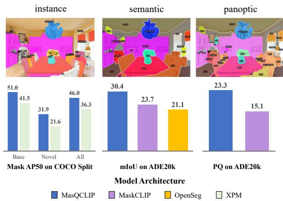  
Figure 1: We present the visualization and quantitative results of MasQCLIP on open-vocabulary segmentation with a universal model architecture. As shown, we achieve state-of-the-art performances across three segmentation tasks.

As CLIP models are trained contrastively at the global image-text level, they do not directly output segmentation maps at the pixel or region level. Recent works [9, 13, 55] demonstrate the feasibility of adopting and locking a pretrained CLIP model for open-vocabulary image segmentation by adopting a two-stage approach, which first generates class-agnostic mask proposals and subsequently classifies each mask region based on a CLIP model.

This decoupled two-stage design, involving localization and then classification, is considered advantageous for open-vocabulary universal segmentation. First, it does not depend on any task specificity. Recent works [7, 8] have attempted to unify instance, semantic, and panoptic segmentation through Transformer-based architectures [6], and the CLIP-based region classification module itself is directly applicable to different types of masks (instance/semantic). Second, it is a natural choice to utilize CLIP models exclusively for object/scene classification rather than localization. The reason is that the dense features within a CLIP visual encoder only carry semantic information, but cannot discriminate between different objects belonging to the same category.

However, recent works [9, 20] still exhibit limitations with regard to being open-world. Specifically, the classagnostic mask proposal network is trained only on the supervision of a limited set of base classes, which restricts its ability to generate mask proposals beyond supervision. Hence, the model performance is hindered when dealing with novel or unseen categories. In addition, although previous works have attempted to introduce some additional modules for mask classification, they fail to fully bridge the gap between image-level and region-level representation, thus lacking in adaptation to mask classification. The balance between maintaining generalization for more categories and adapting CLIP models for mask classification tasks needs further exploration.

In this paper, we aim to conquer these weaknesses. We introduce a new approach called MasQCLIP that can perform open-vocabulary instance, semantic, and panoptic segmentation under a single framework. To accomplish this, MasQCLIP uses a similar two-stage model design: 1) a mask generator stage that extracts object/scene masks, and 2) an encoder-only module that performs mask classification. We are also inspired by the Mask Class Token strategy from MaskCLIP [9], which is tightly integrated with a given CLIP model. MasQCLIP is different from MaskCLIP [9] in two key areas: 1) the use of a student-teacher self-training module that significantly enhances the generation of novel class masks, and 2) fine-tuning the query parameters in the CLIP visual encoder, which better adapts the CLIP models for mask region representations. The following are the contributions of our work:

• We develop MasQCLIP for open-vocabulary universal image segmentation that demonstrates substantial performance improvement over the current state-ofthe-art methods by a large margin across all three tasks including open-vocabulary instance, semantic, and panoptic segmentation.

• We design a progressive distillation process to generate more novel mask proposals beyond supervision, thus taking a step forward toward open-world mask generation.

• We propose a parameter-efficient fine-tuning strategy, MasQ-Tuning, which only tunes the query parameters. When coupled with Mask Class Tokens, MasQ-Tuning is able to preserve the generalization of a pre-trained image-level CLIP model while greatly enhancing its adaptation for segmentation tasks.

## 2. Related Work

Being universal Traditional image segmentation methods can be roughly divided into three groups: 1) instance segmentation [14], 2) semantic segmentation [36, 39], and 3) panoptic segmentation [22, 40]. Panoptic segmentation essentially integrates instance and semantic segmentation, but a careful algorithm design is needed [22, 45] to achieve the goal, as instance segmentation is object-centered whereas semantic segmentation is per-pixel based. The introduction and adaptation of Transformers [41] to the object detection task, Detection Transformers [6], also makes the unification of instance and semantic segmentation feasible. In particular, the Mask2Former method [7] unifies background stuff and foreground things under the query token representation by designing a Transformer-based architecture for closedset universal image segmentation.

Being open-world Since it is a relatively new topic, there lacks a commonly accepted definition for being “openworld”. There exists different terms such as zero-shot [3], open-set [19], and open-vocabulary [50]. It is gradually accepted that the open-vocabulary setting has the best alignment with the general open-world expectation where the target of interest to be extracted can be freely specified using a natural language description during inference.

Open-Vocabulary Detection and Segmentation Various open-vocabulary vision algorithms have been developed. A rough summary for the comparison of existing methods can be seen in [9]. Broadly speaking, there exist methods for open-vocabulary object detection [5, 13, 24, 49, 50], instance segmentation [13, 18], semantic segmentation [12, 23, 46, 58], and panoptic segmentation [9]. Previous works [27, 30, 35, 44, 49, 55] mainly focus on knowledge distillation from an existing CLIP model, but our method integrates CLIP models rather than performing distillation from CLIP models. Some recent works [32, 58] have also attempted to extract dense features from CLIP models to represent pixelwise features.

Knowledge Distillation Knowledge Distillation [17] has been proposed to extract knowledge from the teacher model to the student model. It is called self-distillation [52] when both teacher and student models adopt the same model architecture. For the image segmentation task, self-training with pseudo labels has been proposed to improve the quality of predicted masks in self-supervised learning [28, 43] and semi-supervised learning [42, 47, 48]. We use a similar strategy but focus on self-distilling novel mask proposals from the teacher model.

Fine-tuning Fine-tuning aims to efficiently utilize knowledge from large models for downstream tasks. In terms of ConvNet [15, 37], many fine-tuning strategies have been proposed, including bias tuning [4], side tuning [51], and residual adapter [33]. After Transformer [41] is introduced into the field of computer vision, several fine-tuning methods have been proposed for ViT [10]. Recent works have explored subspace training [16] for low-dimensional reparameterization and prompt tuning [21, 34] for adaptation. In terms of CLIP models, [38, 53] insert adapters into pretrained CLIP models, and DenseCLIP [32] uses CLIP parameters as initialization for segmentation tasks. However, existing works mainly make use of the pre-trained models for a specific dataset, and they do not fully exploit the intrinsic generalization ability in pre-trained models.

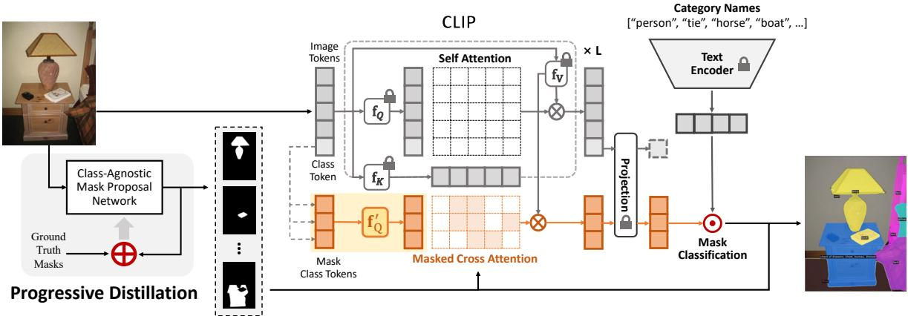  
Figure 2: Overview of MasQCLIP. MasQCLIP consists of a class-agnostic mask proposal network and a mask classification module based on CLIP. In the mask proposal network, we apply progressive distillation to segment masks beyond base classes. Please refer to Fig. 3 for more details. After we obtain an open-world mask proposal network, the predicted masks are then sent to the classification module to obtain labels. To efficiently utilize the dense CLIP features, we propose MasQ-Tuning. We set new query projections $f _ { Q } ^ { \prime }$ for the Mask Class Tokens to obtain optimal attention weights, and $f _ { Q } ^ { \prime }$ at each layer are the only learnable parameters.

## 3. Preliminary

MaskCLIP [9] adapts the CLIP model for segmentation tasks through a two-stage pipeline. Specifically, a classagnostic mask proposal network first generates candidate masks, then MaskCLIP utilizes dense CLIP features to classify each mask proposal with a corresponding Mask Class Token. Mask Class Tokens are initialized with the class token in the CLIP visual encoder, then are appended alongside the original CLIP tokens (image tokens and a class token). Mask Class Tokens extract features from CLIP tokens through the masked cross-attention mechanism where mask proposals also serve as attention masks, i.e.,

$$
\mathrm { C r o s s A t t n ( \cdot ) } = \mathrm { s o f t m a x } ( Q _ { \mathrm { m a s k } } K _ { \mathrm { i m g } } ^ { T } + \mathcal { M } _ { \mathrm { m a s k } } ) \cdot V _ { \mathrm { i m g } } ,\tag{1}
$$

$$
Q _ { \mathrm { m a s k } } , K _ { \mathrm { i m g } } , V _ { \mathrm { i m g } } = f _ { Q } ( x _ { \mathrm { m a s k } } ) , f _ { K } ( x _ { \mathrm { i m g } } ) , f _ { V } ( x _ { \mathrm { i m g } } ) .\tag{2}
$$

Here, $x _ { \mathrm { m a s k } } \in \mathbb { R } ^ { m \times C } , x _ { \mathrm { i m g } } \in \mathbb { R } ^ { p \times C }$ denote m Mask Class Tokens and $p { \mathrm { C L I P } }$ tokens respectively, and $f _ { Q } , f _ { K } , f _ { V }$ denote the projections for query, key, and value respectively. In MaskCLIP, $f _ { Q } , f _ { K } , f _ { V }$ are frozen to maintain generalization. The attention mask $\mathcal { M } _ { \mathrm { m a s k } } \in \mathbb { R } ^ { m \times p }$ is derived as

$$
\mathcal { M } _ { \mathrm { m a s k } } ( i , j ) = \left\{ \begin{array} { l l } { 0 } & { \mathrm { i f ~ } i \mathrm { - t h ~ m a s k ~ f a l l s ~ i n ~ } j \mathrm { - t h ~ p a t c h } } \\ { - \infty } & { \mathrm { o t h e r w i s e } } \end{array} \right.\tag{3}
$$

The final classification scores are the dot product between Mask Class Tokens and the language descriptors from the CLIP language encoder.

## 4. Methods

## 4.1. Problem Setting

During training, the model is only provided with a set of images and their annotations on base classes $C _ { B }$ . We denote the training dataset as $\mathcal { D } _ { B } = \{ ( I _ { i } , \mathcal { V } _ { i } ) \} _ { i = 1 } ^ { N }$ . Each annotation $\mathcal { \mathrm { V } } _ { i }$ contains ground-truth masks $\mathcal { V } _ { i } ^ { M }$ and their labels $\mathcal { V } _ { i } ^ { L }$ on base classes in image $I _ { i } .$ . In the inference stage, we evaluate our model on another set of images with a new set of novel classes $C _ { N }$ , and the testing dataset is denoted as $\mathcal { D } _ { N }$ . According to the relationship between $\mathcal { D } _ { B }$ and $\mathcal { D } _ { N }$ previous works mainly use two settings:

• Cross-dataset. $\mathcal { D } _ { B }$ and $\mathcal { D } _ { N }$ are different datasets, and class sets $C _ { B }$ and $C _ { N }$ may overlap.

• Base-novel. $C _ { B }$ and $C _ { N }$ are disjoint, $i . e . , C _ { B } \cap C _ { N } =$ $\mathcal { O } .$ Under this setting, the same dataset, such as COCO [25], is used during training and testing.

In our paper, we evaluate our proposed algorithm on both of the above settings.

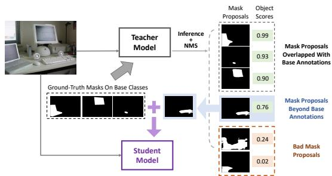  
Figure 3: Detailed interpretation of progressive distillation. We select high-quality mask proposals with novel concepts from the inference results of the teacher model as extra annotations. These extra annotations are then distilled into the student model to encourage generalization. This process is performed iteratively.

## 4.2. Proposed Method

## 4.2.1 Progressive Distillation for Mask Generation

Object Score. In experiments, we observe that MaskCLIP [9] does not consistently assign higher confidence to mask proposals that align more accurately with ground-truth masks. Therefore, we incorporate a binary classification head to the class-agnostic mask proposal network in our MasQCLIP. The resulting object score, denoted as $p _ { \mathrm { o b j } } \in \mathbb { R }$ estimates the quality of mask proposals. During inference, the final classification score for the i-th class is determined by $p _ { \mathrm { c l s } } ^ { ( i ) } = p _ { \mathrm { o b j } } \cdot p _ { \mathrm { c l i p } } ^ { ( i ) }$ . Here, $p _ { \mathrm { c l i p } } ^ { ( i ) }$ represents the score for the i-th class obtained from the mask classification module, which will be further discussed in Sec. 4.2.2.

If training is conducted with annotations from both base classes $C _ { B }$ and novel classes $C _ { N }$ , the object score can serve as a general indicator of mask quality. However, when supervision is only provided on $C _ { B }$ , the object score is more reflective of the quality of base masks, leading to bias toward $C _ { B }$ . But we will show in Sec. 5.4.1 that incorporating object scores still boosts performance on both $C _ { B }$ and $C _ { N }$ by a clear margin. Hence, it is still reasonable and effective to incorporate object scores for all mask proposals.

Progressive Distillation. To develop an open-world mask proposal network capable of generating masks beyond base classes $C _ { B }$ , we propose a progressive distillation strategy. By utilizing the object score as an indicator of mask quality, we can filter high-quality mask proposals that do not overlap with mask annotations of $C _ { B }$ , thus producing extra annotations for training. By iteratively repeating this distillation process, the network will be able to segment more concepts progressively and eventually be open-world.

Specifically, we initialize the teacher model $\tau _ { \mu }$ with the mask proposal network trained on the base annotations $\mathcal { D } _ { B } ^ { \prime } = \{ ( I _ { i } , \mathcal { V } _ { i } ^ { M } ) \} _ { i = 1 } ^ { N }$ without class labels. To produce extra supervision for the student model $\mathcal { T } _ { \theta }$ on image $I _ { i } ,$ we first obtain inference result $\mathcal { T } _ { \mu } ( I _ { i } )$ from the teacher model.

Algorithm 1 Progressive Distillation   
Require: Initial teacher model $\tau _ { \mu }$ with parameter $\mu$   
Require: Dataset $\mathcal { D } _ { B } ^ { \prime } = \{ ( I _ { i } , \mathcal { V } _ { i } ^ { M } ) \} _ { i = 1 } ^ { N }$ (only masks)   
Require: Score threshold $\alpha ,$ IoU threshold $\beta$   
for $K$ iterations do   
$\theta  \mu$ \triangleright Initialize the student model $\mathcal { T } _ { \theta }$   
for $( I _ { i } , \mathcal { V } _ { i } ^ { M } )$ in $\mathcal { D } _ { B } ^ { \prime }$ do   
$\mathcal { V }  \mathcal { V } _ { i } ^ { M }$ \triangleright Y: supervision for $\mathcal { T } _ { \theta }$   
$\hat { \mathcal { V } } = \mathcal { T } _ { \mu } ( I _ { i } )$   
for $\hat { y }$ in Yˆ do   
$\mathbf { i f } \forall y \in \mathcal { V } , I o U ( \hat { y } , y ) < \beta$ then   
if scor $\hat { \mathbf { \xi } } ( \hat { y } ) > \alpha$ then   
$\mathcal { V }  \mathcal { V } \cup \{ \hat { y } \}$   
$L _ { \theta } = \mathcal { L } ( \mathcal { T } _ { \theta } ( I _ { i } ) , \mathcal { V } )$   
$\theta  \theta - \gamma \nabla _ { \theta } ( L _ { \theta } )$   
$\mu  \theta$ \triangleright Update the teacher model $\tau _ { \mu }$

Then we select mask proposals with high object scores that are non-overlap with ground-truth masks in $\mathcal { V } _ { i } ^ { M }$ . These selected masks are considered novel masks and combined with $\mathcal { V } _ { i } ^ { M }$ to form the supervision Y for the student model. To further boost generalization, we train the student model progressively by updating the parameters of the student model to the teacher model iteratively. A more detailed algorithm is presented in Alg. 1. Experiments show that our algorithm works surprisingly well.

## 4.2.2 MasQ-Tuning

Given masks produced by the class-agnostic mask proposal network, we expect to classify each mask region using pretrained CLIP models. To maintain the generalization ability of CLIP models, MaskCLIP [9] freezes all CLIP parameters and appends auxiliary tokens for region classification. ${ \mathrm { A c } } -$ cording to Eq. (1), for each Mask Class Token $\boldsymbol { x } _ { \mathrm { m a s k } } ^ { ( i ) } \in \mathbb { R } ^ { C }$ we have its query embedding $q _ { i } = f _ { Q } ( x _ { \mathrm { m a s k } } ^ { ( i ) } )$ and attention weight over $p \mathrm { C L I P }$ tokens, softmax $( \dot { q } _ { i } \dot { K } _ { \mathrm { i m g } } ^ { T } + \mathcal { M } _ { i } ) \in \mathbb { R } ^ { p }$ The attention weight indicates $x _ { \mathrm { m a s k } } ^ { ( i ) }$ where to focus, and $V _ { \mathrm { i m g } }$ is interpreted as the dense CLIP features that all Mask Class Tokens can extract.

MaskCLIP preserves the original feature space of CLIP by freezing all parameters, however, it lacks in adaption. Although the appended Mask Class Tokens perform classification similar to the class token in CLIP, there is still a shift between them. Specifically, each Mask Class Token is intended to classify a mask region in an image, while the original class token is designed to extract image-level feature. To enhance adaptation ability, we propose applying new query projections $f _ { Q } ^ { \prime }$ to each cross-attention layer for

Mask Class Tokens, i.e.,

$$
\mathrm { C r o s s A t t n } ( \cdot ) = \mathrm { s o f t m a x } ( \mathbf { Q } _ { \mathrm { m a s k } } ^ { \prime } K _ { \mathrm { i m g } } ^ { T } + \mathcal { M } _ { \mathrm { m a s k } } ) \cdot V _ { \mathrm { i m g } } ,\tag{4}
$$

$$
{ \bf Q } _ { \mathrm { m a s k } } ^ { \prime } , K _ { \mathrm { i m g } } , V _ { \mathrm { i m g } } = { \bf f } _ { \bf Q } ^ { \prime } ( x _ { \mathrm { m a s k } } ) , f _ { K } ( x _ { \mathrm { i m g } } ) , f _ { V } ( x _ { \mathrm { i m g } } ) .\tag{5}
$$

In this way, Mask Class Tokens obtain better attention weights through learning. In addition, since the softmax operator in Eq. (4) serves as a normalizer, the results of Eq. (4) still lie in the sub-space spanned by rows of $V _ { \mathrm { i m g } } . \mathrm { ~ } V _ { \mathrm { i m g } }$ is projected from CLIP tokens and thus preserves the knowledge of CLIP. Therefore, MasQ-Tuning is able to improve adaptation while maintaining generalization.

To effectively inherit the knowledge and the statistics of CLIP, other layers (layernorm, FFN, and the final projection) are frozen during fine-tuning.

Losses. Our goal is to match the appended Mask Class Tokens with their corresponding ground-truth labels, so we use the dot-product between Mask Class Tokens and language descriptors as scores and compute cross-entropy loss, $i . e .$

$$
\mathcal { L } _ { \mathrm { c l s } } = - \log \left( \frac { \exp ( s _ { y } ) } { \sum _ { i } \exp ( s _ { i } ) } \right) .\tag{6}
$$

where $s _ { i }$ denotes the score for i-th class and $y$ is the assigned label for the mask. If a predicted mask is matched to a ground-truth mask according to an IoU threshold, we then assign the mask a label. Otherwise, we use a fixed word, “background”, as the label for the predicted mask.

## 5. Experiments

We evaluate MasQCLIP on three segmentation tasks to demonstrate its effectiveness and universality, and we follow the commonly-used settings in different segmentation tasks. For instance segmentation, we use base-novel setting following [18]. For semantic and panoptic segmentation, we use cross-dataset setting following [9, 13]. We show MasQCLIP achieves state-of-the-art results on all benchmarks with a universal architecture. We also conduct ablation studies to verify our proposed method.

## 5.1. Datasets and Evaluation Metrics

COCO. In base-novel setting, we use instance segmentation annotations of COCO [25]. Following [18], we partition COCO annotations into 48 base classes for training and 17 novel classes for evaluation. There are 108k training images and 5k validation images. In cross-dataset setting, we use panoptic segmentation [22] annotations of COCO for training, which include 80 thing classes (foreground) and 53 stuff classes (background). There are 118k training images and 5k validation images.

ADE20k. ADE20k [56, 57] serves for semantic segmentation and panoptic segmentation evaluation under crossdataset setting. There are 2k validation images in total. The full version (A-847) includes 847 classes and the short version (A-150) includes 150 classes.

PASCAL-Context. Pascal-Context [29] serves for semantic segmentation evaluation under cross-dataset setting. There are 5k validation images in total. The full version (P-459) includes 459 classes and the short version (P-59) includes 59 classes.

Evaluation Metrics. For instance segmentation, we report mAP (mean average precision) [25] at IoU (intersectionover-union) of 0.5 following base-novel setting [1, 18, 50]. For semantic segmentation, we report mIoU (mean intersection-over-union) [11] for evaluation. For panoptic segmentation, we report $P Q$ (panoptic quality) [22].

## 5.2. Implementation Details

Class-Agnostic Mask Proposal Network. We train Mask2Former [7] or Mask R-CNN [14] with ResNet-50 backbone to generate class-agnostic mask proposals. The labels of masks are not used as supervision, and the number of mask proposals for each image is set to 100 for both models. In Mask2Former, the number of classes is set to 1 to obtain the object score. In Mask R-CNN, we adopt the confidence scores of the RPN head as object scores. The default experiment setting for Mask R-CNN is R50-FPN-1x.

Progressive Distillation. For Mask2Former, we first train the initial teacher model until convergence. Then, we retrain the student model for 2 rounds with 30k iterations each round (under both settings). Unless stated, other experiment settings are set to default as training Mask2Former [7]. For Mask R-CNN, we use the checkpoint of R50-FPN-1x as the initial teacher model. We then re-train the student model for 2 rounds with 10k iterations each round (under both settings). For all models and settings, we set the threshold of object scores α to 0.8, and the NMS threshold $\beta$ to 0.1.

MasQ-Tuning. During fine-tuning, we use the same CLIP model ViT-L/14@336px as in [9]. The language descriptors are simply the text embeddings of category names given by the language encoder of CLIP without any prompt. The number of Mask Class Tokens is set to 100 which is equiva lent to the number of mask proposals. The query projection $f _ { Q } ^ { \prime }$ at each layer exhibits the same architecture of a linear projection as the original $f _ { Q }$ in CLIP visual encoder. In both cross-dataset and base-novel settings, we use AdamW [26] as our default optimizer and the initial learning rate is set to 0.0001. We assign a predicted mask a label if it has an IoU higher than 0.6 with a ground-truth mask. We fine-tune for 10k iterations with a batch size of 4, and the learning rate is decreased by a factor of 10 at 9k iterations. During inference, the post-processing follows Mask2Former after obtaining labels for mask proposals.

Settings. For each model architecture (Mask R-CNN or Mask2Former), we train two MasQCLIP models for basenovel and cross-dataset settings separately. The former model is trained on base classes of COCO-instance dataset and is tested on novel classes (for instance segmentation), while the latter is trained on the COCO-panoptic dataset and is used for both semantic (through post-possessing) and panoptic segmentation evaluation.

<table><tr><td rowspan="2">Methods</td><td rowspan="2">Backbone</td><td colspan="3">Instance</td><td colspan="4">Semantic</td><td colspan="3">Panoptic</td></tr><tr><td>Base</td><td>Novel</td><td>All</td><td>A-150</td><td>A-847</td><td>P-59</td><td>P-459</td><td>PQ</td><td>PQth</td><td>PQst</td></tr><tr><td>XPM [18]</td><td>ResNet-50</td><td>41.5</td><td>21.6</td><td>36.3</td><td></td><td>一</td><td></td><td></td><td></td><td></td><td></td></tr><tr><td>LSeg+ [23]</td><td>EffNet-B7</td><td></td><td></td><td></td><td>18.0</td><td>3.8</td><td>46.5</td><td>7.8</td><td></td><td></td><td></td></tr><tr><td>OpenSeg [12]</td><td>EffNet-B7</td><td></td><td>1</td><td></td><td>21.1</td><td>6.3</td><td>42.1</td><td>9.0</td><td></td><td></td><td></td></tr><tr><td>MaskCLIP (Mask R-CNN) [9]</td><td>ResNet-50</td><td></td><td></td><td></td><td>22.4</td><td>6.8</td><td>41.3</td><td>9.1</td><td>12.9</td><td>11.2</td><td>16.1</td></tr><tr><td>MaskCLIP (Mask2Former) [9]</td><td>ResNet-50</td><td></td><td>一</td><td>-</td><td>23.7</td><td>8.2</td><td>45.9</td><td>10.0</td><td>15.1</td><td>13.5</td><td>18.3</td></tr><tr><td>MasQCLIP (Mask R-CNN)</td><td>ResNet-50</td><td>40.7</td><td>28.4</td><td>37.5</td><td>23.7</td><td>8.4</td><td>44.4</td><td>14.1</td><td>14.9</td><td>14.5</td><td>15.6</td></tr><tr><td rowspan="2">MasQCLIP (Mask2Former)</td><td>ResNet-50</td><td>51.0</td><td>31.9</td><td>46.0</td><td>30.4</td><td>10.7</td><td>57.8</td><td>18.2</td><td>23.3</td><td>21.2</td><td>27.7</td></tr><tr><td></td><td>+9.5</td><td>+10.3</td><td>+9.7</td><td>+6.7</td><td>+2.5</td><td>+11.3</td><td>+8.2</td><td>+8.2</td><td>+7.7</td><td>+9.4</td></tr></table>

Table 1: Results on open-vocabulary universal image segmentation. We compare MasQCLIP with state-of-the-art models on three segmentation tasks with a universal architecture. We use Mask R-CNN or Mask2Former as our class-agnostic mask proposal network. All methods in the table rely only on COCO dataset for training. a) For instance segmentation, we report mask AP50 following base-novel setting [18]. b) For semantic segmentation, we report mIoU on ADE20k and PASCAL-Context following cross-dataset setting [20]. A-150 and A-847 represent ADE20k with 150 classes and 847 classes respectively. P-59 and P-459 represent PASCAL-Context with 59 classes and 459 classes respectively. c) For panoptic segmentation, we report PQ on ADE20k following cross-dataset setting [9]. We achieve significant improvements on all evaluation metrics.

<table><tr><td rowspan="2">Methods</td><td colspan="2">Constrained</td><td colspan="3">Generalized</td></tr><tr><td>Base</td><td>Novel</td><td>Base</td><td>Novel</td><td>All</td></tr><tr><td>OVR [50]</td><td>42.0</td><td>20.9</td><td>41.6</td><td>17.1</td><td>35.2</td></tr><tr><td>SB [1]</td><td>41.6</td><td>20.8</td><td>41.0</td><td>16.0</td><td>34.5</td></tr><tr><td>BA-RPN [54]</td><td>41.8</td><td>20.1</td><td>41.3</td><td>15.4</td><td>34.5</td></tr><tr><td>OVR+OMP [2]</td><td>31.3</td><td>14.1</td><td>30.5</td><td>8.3</td><td>24.7</td></tr><tr><td>XPM [18]</td><td>42.4</td><td>24.0</td><td>41.5</td><td>21.6</td><td>36.3</td></tr><tr><td>MasQCLIP (Mask R-CNN)</td><td>40.9</td><td>30.1</td><td>40.7</td><td>28.4</td><td>37.5</td></tr><tr><td>MasQCLIP (Mask2Former)</td><td>51.2</td><td>34.3</td><td>51.0</td><td>31.9</td><td>46.0</td></tr></table>

Table 2: Results on open-vocabulary instance segmentation. We report mask AP50 in the table. The results presented in the table all use the ResNet-50 backbone. Constrained setting means that the model is evaluated on either base classes or novel classes separately. Generalized setting means that the model is tested jointly on both base and novel classes. Notice that the results of novel classes show the generalization ability of models.

## 5.3. Main Results

Instance Segmentation. We evaluate our MasQCLIP on instance segmentation under base-novel setting. We first train MasQCLIP on base classes of COCO-instance dataset and then evaluate the model on novel classes. The detailed results are presented in Tab. 2. As shown, when using Mask R-CNN as our class-agnostic mask proposal network, we achieve an improvement of 6.8 AP50 on novel classes over XPM [18]. When using Mask2Former, we further achieve an improvement of 10.3 AP50. The evaluation metrics on novel classes mainly reflect the generalization ability of models. Since our relative improvement on novel classes is much higher than that on base classes across two mask proposal networks, our proposed method enjoys better generalization ability compared to previous works.

Semantic Segmentation. We evaluate our MasQCLIP on semantic segmentation under cross-dataset setting. We directly use the model trained on COCO-panoptic dataset for evaluation, and report the results on ADE20k-semantic and PASCAL-Context-semantic datasets in Tab. 1. In terms of mIoU, MasQCLIP improves previous state-of-the-art results by 6.7, 2.5, 11.3, and 8.2 on A-150, A-847, P-59, and P-459 datasets respectively.

Panoptic Segmentation. We evaluate our MasQCLIP on panoptic segmentation under cross-dataset setting. We first train MasQCLIP on COCO-panoptic dataset, and then directly evaluate the model on ADE20k-panoptic dataset. The results are presented in Tab. 1. As shown, when using the same mask proposal network architecture, MasQCLIP outperforms state-of-the-art MaskCLIP [9] by 8.2 PQ. Even adopted with a weaker mask proposal network of Mask R-CNN, MasQCLIP still achieves on-par results on PQ compared with MaskCLIP.

## 5.4. Ablation Studies

## 5.4.1 Progressive Distillation

In this section, we conduct ablation studies on progressive distillation. We evaluate the models on instance segmentation under base-novel setting. The initial teacher model is trained for 100k iterations on base annotations, and the student model is then re-trained for 30k iterations each round using the initial teacher model.

Object Scores. We first study the importance of object scores. As shown in Tab. 3, incorporating object scores boosts performance on base classes and novel classes significantly. In addition, despite object scores being trained only on base classes, they still serve as reliable indicators of mask quality for novel classes, which demonstrates the generalization of object scores. The results show that it is reasonable to consider object scores as a general indicator of mask quality.

MasQCLIP  
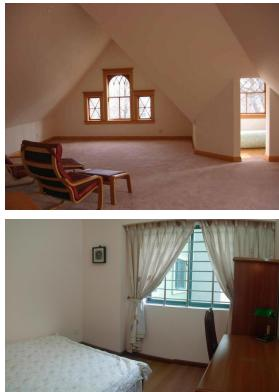  
Input

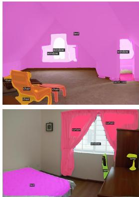  
CLIP Baseline

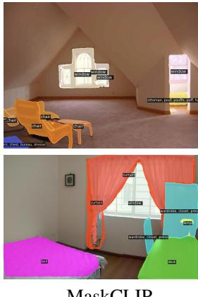  
MaskCLIP

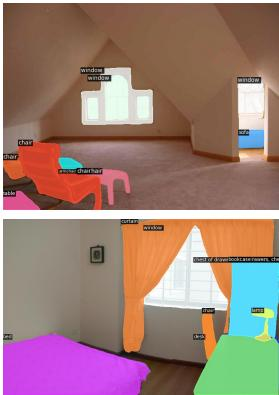

Figure 4: Comparison on open-vocabulary instance segmentation. We evaluate on the same set of images as in MaskCLIP [9]. The above two images are from ADE20k dataset. Visualization results show that our mask proposals are more robust and high-quality
<table><tr><td>Models</td><td>Scores</td><td>Base</td><td>Novel</td><td>All</td></tr><tr><td>Mask2Former</td><td>-</td><td>16.9</td><td>11.3</td><td>15.4</td></tr><tr><td>Mask2Former</td><td>√</td><td>53.8</td><td>22.6</td><td>45.6</td></tr></table>

Table 3: Ablations on Object Scores. We report mask AP50 in the table. Models denote the architecture of class-agnostic mask proposal networks. Scores denote whether we incorporate object scores.
<table><tr><td>Teacher</td><td>Student</td><td>Base</td><td>Novel</td><td>All</td></tr><tr><td>100k</td><td></td><td>53.8</td><td>22.6</td><td>45.6</td></tr><tr><td>100k</td><td>30k×1</td><td>50.6</td><td>26.1</td><td>44.2</td></tr><tr><td>100k</td><td>30k×2</td><td>51.0</td><td>31.9</td><td>46.0</td></tr><tr><td>100k</td><td>30k×3</td><td>51.2</td><td>31.2</td><td>46.0</td></tr><tr><td>200k</td><td></td><td>54.7</td><td>18.2</td><td>45.1</td></tr></table>

Table 4: Ablations on Iterative Re-training. We report mask AP50 in the table. We adopt the Mask2Former architecture and incorporate object scores by default. Teacher denotes the training iterations of the initial teacher model, and Student denotes how we train the student model progressively.

Iterative Re-training. Tab. 4 shows the effectiveness of progressive distillation. After we train the student model for 2 rounds progressively, the model performance improves on novel classes by 9.3 AP50. Although the results manifest a slight performance drop on base classes, it can be explained that the model is balancing between the base and extra (novel) annotations, thus leading the model to be less overfitted on base classes.

If we continue to train the student model for more rounds (e.g. 3 rounds), the model does not gain further improvement in generalization ability, indicating that there might exist an upper bound for the progressive distillation process. In addition, we also show that the improvement on novel classes cannot simply gain from a longer training schedule. When training the network for another 100k iterations without progressive distillation, there is a notable performance drop of 4.4 AP50 (from 22.6 to 18.2) on novel classes. Our observation supports that improvement of model performance indeed comes from progressive distillation.

<table><tr><td rowspan="2">Methods</td><td rowspan="2">Q</td><td rowspan="2">K</td><td rowspan="2">V</td><td rowspan="2">All</td><td rowspan="2">Param</td><td colspan="2">ADE20k</td><td colspan="2">COCO</td></tr><tr><td>PQ</td><td>mIoU</td><td>PQ</td><td>mIoU</td></tr><tr><td>Freeze</td><td>一</td><td>一</td><td>-</td><td>一</td><td>一</td><td>10.7</td><td>15.7</td><td>19.4</td><td>22.1</td></tr><tr><td>Tune-V</td><td></td><td>-</td><td>√</td><td></td><td>25M</td><td>14.4</td><td>18.0</td><td>50.0</td><td>63.2</td></tr><tr><td>Tune-QKV</td><td>√</td><td>√</td><td>√</td><td>一</td><td>75M</td><td>14.9</td><td>18.6</td><td>50.5</td><td>63.5</td></tr><tr><td>Tune-CLIP</td><td>√</td><td>√</td><td>√</td><td>√</td><td>304M</td><td>14.7</td><td>18.3</td><td>49.0</td><td>63.6</td></tr><tr><td>Tune-K</td><td>-</td><td>√</td><td>-</td><td>-</td><td>25M</td><td>22.5</td><td>29.8</td><td>48.3</td><td>61.6</td></tr><tr><td>Tune-QK</td><td>√</td><td>√</td><td>-</td><td>-</td><td>50M</td><td>22.9</td><td>30.1</td><td>49.0</td><td>62.3</td></tr><tr><td>Tune-Q (ours)</td><td>√</td><td>-</td><td>一</td><td>一</td><td>25M</td><td>23.3</td><td>30.4</td><td>48.5</td><td>62.0</td></tr></table>

Table 5: Ablations on MasQ-Tuning. We try different finetuning strategies. Q, K, V means the newly added query, key, and value projections for Mask Class Tokens respectively, and All means all the newly added parameters (also including layernorm, FFN, and the final projection). Param denotes the total number of trainable parameters. The models are first trained on COCO and then evaluated on ADE20k. We note that the metrics on ADE20k mainly show the generalization ability.

## 5.4.2 MasQ-Tuning

To validate our fine-tuning method, MasQ-Tuning, we build several baselines to prove its effectiveness.

• Freeze: Same as the MaskCLIP w/o RMA baseline in [9]. We incorporate object scores during inference.

• Tune-Q: Only query projections $f _ { Q } ^ { \prime }$ for Mask Class Tokens are learnable during fine-tuning. Notice that MasQCLIP adopts this fine-tuning strategy.

• Tune-K: Only key projections $f _ { K } ^ { \prime }$ for Mask Class Tokens are learnable during fine-tuning.

• Tune-V: Only value projections $f _ { V } ^ { \prime }$ for Mask Class Tokens are learnable during fine-tuning.

• Tune-QK: Query and key projections for Mask Class Tokens $( f _ { Q } ^ { \prime }$ and $f _ { K } ^ { \prime } )$ , are learnable during fine-tuning.

• Tune-QKV: Query, key, and value projections for Mask

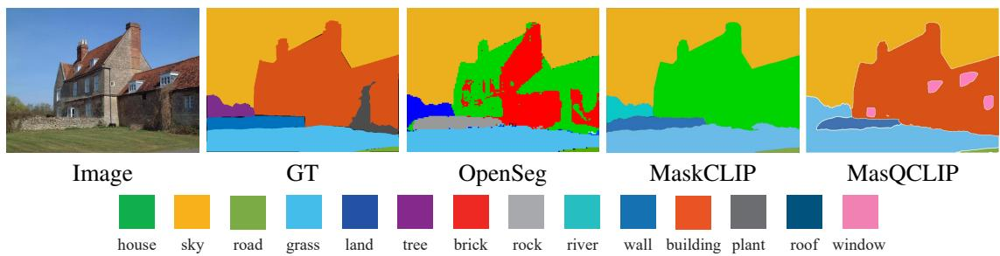  
Figure 5: Comparison on open-vocabulary semantic segmentation. We evaluate on the same image as in OpenSeg [12]. Notice that MasQCLIP successfully recognizes the windows on the house, demonstrating that MasQCLIP is able to classify small objects.

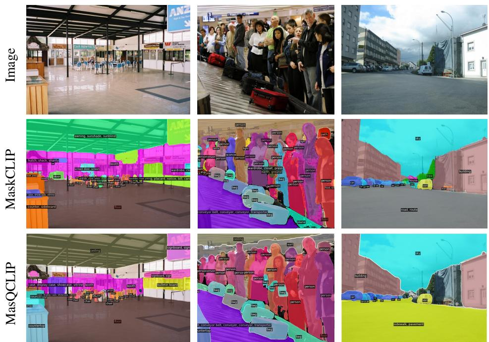  
Figure 6: Comparison on open-vocabulary panoptic segmentation. We evaluate on the same set of images as in MaskCLIP [9]. The images are from ADE20k dataset. Visualization shows that MasQCLIP produces higher-quality masks and has higher classification accuracy.

Class Tokens $( f _ { Q } ^ { \prime } , \ f _ { K } ^ { \prime }$ , and $f _ { V } ^ { \prime } )$ , are learnable during fine-tuning.

• Tune-CLIP: A new set of CLIP parameters is learned during fine-tuning, and masked-cross attention is performed between Mask Class Tokens and CLIP tokens. We use CLIP parameters as initialization.

In this ablation study, we test the models on semantic and panoptic segmentation under cross-dataset setting. We use the same class-agnostic mask proposal network for all models, and then fine-tune the mask classification module based on the predicted masks. Training settings are all kept the same. Our results are shown in Tab. 5.

Adaptation. We compare the evaluation metrics of the above methods on COCO dataset to show the strong adaptation ability of MasQ-Tuning. Compared to Freeze with 19.4

PQ and 22.1 mIoU on COCO, Tune-Q has a significant improvement of 29.1 PQ (from 19.4 to 48.5) and 39.9 mIoU (from 22.1 to 62.0) respectively. This shows that the improvement on adaptation ability should be credited to those learnable query projections $f _ { Q } ^ { \prime }$ for Mask Class Tokens. In addition, compared to Tune-CLIP with 49.0 PQ and 63.6 mIoU on COCO, Tune-Q has much fewer learnable parameters, but only has little performance drop (-0.5 PQ and -1.6 mIoU). This indicates that simply adding more parameters is not helpful, and our proposed MasQ-Tuning has achieved impressive adaptation ability.

Generalization. We now focus on the performance of the above methods on ADE20k dataset to show the strong generalization ability of MasQ-Tuning. When adding learnable value projections $f _ { V } ^ { \prime }$ for Mask Class Tokens, the model cannot generalize well to ADE20k dataset. Compared to

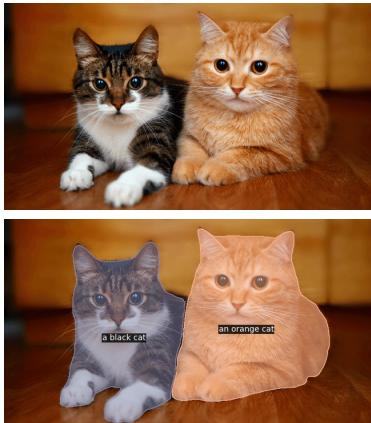  
(a) “a black cat”, “an orange cat”

  
(b) “beer”, “wine”

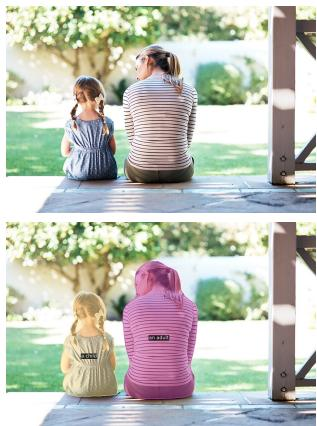  
(c) “an adult”, “a child”  
Figure 7: User-specified segmentation. We use the model trained on COCO-panoptic for evaluation. Visualization results show that our model can distinguish subtle differences among objects.

Tune-Q with 23.3 PQ, Tune-V, Tune-QKV and Tune-CLIP have a performance drop of 8.9, 8.4, and 8.6 on $P Q$ respectively. This proves the importance of freezing $V _ { \mathrm { i m g } }$ which is interpreted as dense CLIP features. By inheriting $V _ { \mathrm { i m g } }$ from the CLIP model, MasQCLIP is able to preserve the original feature space within CLIP. Compared to Tune-QK, Tune-Q reaches better performance on ADE20k and is more parameter-efficient, where only 8.2% of original parameters in CLIP visual encoder are added for training. Therefore, we choose Tune-Q as the fine-tuning strategy of MasQCLIP.

## 5.5. Qualitative Results

In this section, we compare the visualization results of MasQCLIP with previous models [9, 12]. The results of instance, semantic, and panoptic segmentation are presented in Fig. 4, Fig. 5, and Fig. 6 respectively. For a fair comparison, We all use the same set of images as previous works [9, 12]. We observe from the visualization results that MasQCLIP produces more robust mask proposals and enjoys a higher mask classification accuracy, which corresponds to our two key components proposed in MasQCLIP. As shown in Fig. 7, MasQCLIP exhibits the ability to segment objects of arbitrary classes as per user specifications and to discriminate between subtle distinctions within them (e.g. “beer” vs. “wine”, “child” vs. “adult”).

## 5.6. Efficiency

MasQCLIP exhibits great capability in open-vocabulary universal segmentation while being computationally efficient at the same time. We report the results of GFLOPs in Tab. 6. As shown, the GFLOPs of MasQCLIP is only 14.5% higher than the combined GFLOPs of Mask2Former and CLIP visual encoder, and is 34.1% lower than the GFLOPs of MaskCLIP.

<table><tr><td>Models</td><td>GFLOPs</td></tr><tr><td>Mask2Former [7] CLIP Visual Encoder [31]</td><td>78.9</td></tr><tr><td>MaskCLIP† [9]</td><td>233.0 542.0</td></tr><tr><td>MasQCLIP (ours)</td><td>357.2</td></tr></table>

Table 6: Model efficiency. The resolution of input images is set to 640×640 for Mask2Former and 336×336 for CLIP Visual Encoder. We use the CLIP model ViT-L/14@336px. † means our re-implement according to the paper (no public codes available).

## 6. Conclusions

We propose a two-stage model, MasQCLIP, for openvocabulary universal segmentation. We first design a progressive distillation process for the class-agnostic mask proposal network to segment open-world masks. Additionally, we adapt CLIP models for mask (region) classification while maintaining the generalization ability of CLIP through our proposed MasQ-Tuning method. We achieve state-of-the-art results with substantial improvement over the existing approaches across three open-vocabulary tasks including instance, semantic, and panoptic segmentation.

Limitations. Since MasQCLIP is built on top of a pretrained CLIP model, though fine-tuning is introduced, the performance of our model is nevertheless largely decided by the generalization ability of the CLIP model. Another limitation of our method is that mask proposals are generated by a fixed network (once pre-trained), which might limit its capability for object types of arbitrary specification. Acknowledgement. This work is supported by NSF Award IIS-2127544.

## References

[1] Ankan Bansal, Karan Sikka, Gaurav Sharma, Rama Chellappa, and Ajay Divakaran. Zero-shot object detection. In

Proceedings of the European Conference on Computer Vision, pages 384–400, 2018. 5, 6

[2] David Biertimpel, Sindi Shkodrani, Anil S Baslamisli, and Nora Baka. Prior to segment: Foreground cues for weakly´ annotated classes in partially supervised instance segmentation. In Proceedings ofthe IEEE/CVF International Conference on Computer Vision, pages 2824–2833, 2021. 6

[3] Maxime Bucher, Tuan-Hung Vu, Matthieu Cord, and Patrick Perez. Zero-shot semantic segmentation.´ Advances in Neural Information Processing Systems, 32, 2019. 2

[4] Han Cai, Chuang Gan, Ligeng Zhu, and Song Han. Tinytl: Reduce memory, not parameters for efficient on-device learning. Advances in Neural Information Processing Systems, 33:11285–11297, 2020. 2

[5] Zhaowei Cai, Gukyeong Kwon, Avinash Ravichandran, Erhan Bas, Zhuowen Tu, Rahul Bhotika, and Stefano Soatto. X-detr: A versatile architecture for instance-wise visionlanguage tasks. arXiv preprint arXiv:2204.05626, 2022. 2

[6] Nicolas Carion, Francisco Massa, Gabriel Synnaeve, Nicolas Usunier, Alexander Kirillov, and Sergey Zagoruyko. End-toend object detection with transformers. In Proceedings ofthe European Conference on Computer Vision, pages 213–229. Springer, 2020. 1, 2

[7] Bowen Cheng, Ishan Misra, Alexander G Schwing, Alexander Kirillov, and Rohit Girdhar. Masked-attention mask transformer for universal image segmentation. In Proceedings of the IEEE/CVF Conference on Computer Vision and Pattern Recognition, pages 1290–1299, 2022. 1, 2, 5, 9

[8] Bowen Cheng, Alex Schwing, and Alexander Kirillov. Perpixel classification is not all you need for semantic segmentation. Advances in Neural Information Processing Systems, 34:17864–17875, 2021. 1

[9] Zheng Ding, Jieke Wang, and Zhuowen Tu. Openvocabulary universal image segmentation with maskclip. In International Conference on Machine Learning, 2023. 1, 2, 3, 4, 5, 6, 7, 8, 9

[10] Alexey Dosovitskiy, Lucas Beyer, Alexander Kolesnikov, Dirk Weissenborn, Xiaohua Zhai, Thomas Unterthiner, Mostafa Dehghani, Matthias Minderer, Georg Heigold, Sylvain Gelly, et al. An image is worth 16x16 words: Transformers for image recognition at scale. In International Conference on Learning Representations, 2020. 2

[11] Mark Everingham, SM Eslami, Luc Van Gool, Christopher KI Williams, John Winn, and Andrew Zisserman. The pascal visual object classes challenge: A retrospective. International Journal of Computer Vision, 111(1):98–136, 2015. 5

[12] Golnaz Ghiasi, Xiuye Gu, Yin Cui, and Tsung-Yi Lin. Scaling open-vocabulary image segmentation with image-level labels. In Proceedings ofthe European Conference on Computer Vision, pages 540–557. Springer, 2022. 2, 6, 8, 9

[13] Xiuye Gu, Tsung-Yi Lin, Weicheng Kuo, and Yin Cui. Open-vocabulary object detection via vision and language knowledge distillation. In International Conference on Learning Representations, 2022. 1, 2, 5

[14] Kaiming He, Georgia Gkioxari, Piotr Dollar, and Ross Gir-´ shick. Mask r-cnn. In Proceedings ofthe IEEE International

Conference on Computer Vision, pages 2961–2969, 2017. 2, 5

[15] Kaiming He, Xiangyu Zhang, Shaoqing Ren, and Jian Sun. Deep residual learning for image recognition. In Proceedings of the IEEE/CVF Conference on Computer Vision and Pattern Recognition, pages 770–778, 2016. 2

[16] Xuehai He, Chunyuan Li, Pengchuan Zhang, Jianwei Yang, and Xin Eric Wang. Parameter-efficient fine-tuning for vision transformers. arXiv preprint arXiv:2203.16329, 2022. 3

[17] Geoffrey Hinton, Oriol Vinyals, Jeff Dean, et al. Distilling the knowledge in a neural network. arXiv preprint arXiv:1503.02531, 2015. 2

[18] Dat Huynh, Jason Kuen, Zhe Lin, Jiuxiang Gu, and Ehsan Elhamifar. Open-vocabulary instance segmentation via robust cross-modal pseudo-labeling. In Proceedings of the IEEE/CVF Conference on Computer Vision and Pattern Recognition, pages 7020–7031, 2022. 2, 5, 6

[19] Jaedong Hwang, Seoung Wug Oh, Joon-Young Lee, and Bohyung Han. Exemplar-based open-set panoptic segmentation network. In Proceedings of the IEEE/CVF Conference on Computer Vision and Pattern Recognition, pages 1175– 1184, 2021. 2

[20] Chao Jia, Yinfei Yang, Ye Xia, Yi-Ting Chen, Zarana Parekh, Hieu Pham, Quoc Le, Yun-Hsuan Sung, Zhen Li, and Tom Duerig. Scaling up visual and vision-language representation learning with noisy text supervision. In International Conference on Machine Learning, pages 4904–4916, 2021. 2, 6

[21] Menglin Jia, Luming Tang, Bor-Chun Chen, Claire Cardie, Serge Belongie, Bharath Hariharan, and Ser-Nam Lim. Visual prompt tuning. In Proceedings of the European Conference on Computer Vision, pages 709–727. Springer, 2022. 3

[22] Alexander Kirillov, Kaiming He, Ross Girshick, Carsten Rother, and Piotr Dollar. Panoptic segmentation. In ´ Proceedings of the IEEE/CVF Conference on Computer Vision and Pattern Recognition, pages 9404–9413, 2019. 2, 5

[23] Boyi Li, Kilian Q Weinberger, Serge Belongie, Vladlen Koltun, and Rene Ranftl. Language-driven semantic seg-´ mentation. In International Conference on Learning Representations, 2022. 2, 6

[24] Liunian Harold Li, Pengchuan Zhang, Haotian Zhang, Jianwei Yang, Chunyuan Li, Yiwu Zhong, Lijuan Wang, Lu Yuan, Lei Zhang, Jenq-Neng Hwang, et al. Grounded language-image pre-training. In Proceedings of the IEEE/CVF Conference on Computer Vision and Pattern Recognition, pages 10965–10975, 2022. 2

[25] Tsung-Yi Lin, Michael Maire, Serge Belongie, James Hays, Pietro Perona, Deva Ramanan, Piotr Dollar, and C Lawrence´ Zitnick. Microsoft coco: Common objects in context. In Proceedings of the European Conference on Computer Vision, pages 740–755. Springer, 2014. 3, 5

[26] Ilya Loshchilov and Frank Hutter. Decoupled weight decay regularization. In International Conference on Learning Representations, 2018. 5

[27] Huaishao Luo, Lei Ji, Ming Zhong, Yang Chen, Wen Lei, Nan Duan, and Tianrui Li. Clip4clip: An empirical study

of clip for end to end video clip retrieval. arXiv preprint arXiv:2104.08860, 2021. 2

[28] Luke Melas-Kyriazi, Christian Rupprecht, Iro Laina, and Andrea Vedaldi. Deep spectral methods: A surprisingly strong baseline for unsupervised semantic segmentation and localization. In Proceedings of the IEEE/CVF Conference on Computer Vision and Pattern Recognition, pages 8364– 8375, 2022. 2

[29] Roozbeh Mottaghi, Xianjie Chen, Xiaobai Liu, Nam-Gyu Cho, Seong-Whan Lee, Sanja Fidler, Raquel Urtasun, and Alan Yuille. The role of context for object detection and semantic segmentation in the wild. In Proceedings of the IEEE/CVF Conference on Computer Vision and Pattern Recognition, pages 891–898, 2014. 5

[30] Or Patashnik, Zongze Wu, Eli Shechtman, Daniel Cohen-Or, and Dani Lischinski. Styleclip: Text-driven manipulation of stylegan imagery. In Proceedings of the IEEE/CVF Conference on Computer Vision and Pattern Recognition, pages 2085–2094, 2021. 2

[31] Alec Radford, Jong Wook Kim, Chris Hallacy, Aditya Ramesh, Gabriel Goh, Sandhini Agarwal, Girish Sastry, Amanda Askell, Pamela Mishkin, Jack Clark, et al. Learning transferable visual models from natural language supervision. In International Conference on Machine Learning, pages 8748–8763. PMLR, 2021. 1, 9

[32] Yongming Rao, Wenliang Zhao, Guangyi Chen, Yansong Tang, Zheng Zhu, Guan Huang, Jie Zhou, and Jiwen Lu. Denseclip: Language-guided dense prediction with contextaware prompting. In Proceedings of the IEEE/CVF Conference on Computer Vision and Pattern Recognition, pages 18082–18091, 2022. 2, 3

[33] Sylvestre-Alvise Rebuffi, Hakan Bilen, and Andrea Vedaldi. Learning multiple visual domains with residual adapters. Advances in Neural Information Processing Systems, 30, 2017. 2

[34] Mark Sandler, Andrey Zhmoginov, Max Vladymyrov, and Andrew Jackson. Fine-tuning image transformers using learnable memory. In Proceedings of the IEEE/CVF Conference on Computer Vision and Pattern Recognition, pages 12155–12164, 2022. 3

[35] Sheng Shen, Liunian Harold Li, Hao Tan, Mohit Bansal, Anna Rohrbach, Kai-Wei Chang, Zhewei Yao, and Kurt Keutzer. How much can clip benefit vision-and-language tasks? In International Conference on Learning Representations, 2022. 2

[36] Jamie Shotton, John Winn, Carsten Rother, and Antonio Criminisi. Textonboost: Joint appearance, shape and context modeling for multi-class object recognition and segmentation. In Proceedings of the European Conference on Computer Vision, pages 1–15. Springer, 2006. 2

[37] Karen Simonyan and Andrew Zisserman. Very deep convolutional networks for large-scale image recognition. arXiv preprint arXiv:1409.1556, 2014. 2

[38] Yi-Lin Sung, Jaemin Cho, and Mohit Bansal. Vl-adapter: Parameter-efficient transfer learning for vision-and-language tasks. In Proceedings of the IEEE/CVF Conference on Computer Vision and Pattern Recognition, pages 5227–5237, 2022. 3

[39] Zhuowen Tu. Auto-context and its application to high-level vision tasks. In Proceedings ofthe IEEE/CVF Conference on Computer Vision and Pattern Recognition, pages 1–8. IEEE, 2008. 2

[40] Zhuowen Tu, Xiangrong Chen, Alan L Yuille, and Song-Chun Zhu. Image parsing: Unifying segmentation, detection, and recognition. International Journal of Computer Vision, 63(2):113–140, 2005. 2

[41] Ashish Vaswani, Noam Shazeer, Niki Parmar, Jakob Uszkoreit, Llion Jones, Aidan N Gomez, Łukasz Kaiser, and Illia Polosukhin. Attention is all you need. Advances in Neural Information Processing Systems, 30, 2017. 2

[42] Weiyao Wang, Matt Feiszli, Heng Wang, Jitendra Malik, and Du Tran. Open-world instance segmentation: Exploiting pseudo ground truth from learned pairwise affinity. In Proceedings of the IEEE/CVF Conference on Computer Vision and Pattern Recognition, pages 4422–4432, 2022. 2

[43] Xinlong Wang, Zhiding Yu, Shalini De Mello, Jan Kautz, Anima Anandkumar, Chunhua Shen, and Jose M Alvarez. Freesolo: Learning to segment objects without annotations. In Proceedings of the IEEE/CVF Conference on Computer Vision and Pattern Recognition, pages 14176–14186, 2022. 2

[44] Zhecan Wang, Noel Codella, Yen-Chun Chen, Luowei Zhou, Jianwei Yang, Xiyang Dai, Bin Xiao, Haoxuan You, Shih-Fu Chang, and Lu Yuan. Clip-td: Clip targeted distillation for vision-language tasks. arXiv preprint arXiv:2201.05729, 2022. 2

[45] Yuwen Xiong, Renjie Liao, Hengshuang Zhao, Rui Hu, Min Bai, Ersin Yumer, and Raquel Urtasun. Upsnet: A unified panoptic segmentation network. In Proceedings of the IEEE/CVF Conference on Computer Vision and Pattern Recognition, 2019. 2

[46] Mengde Xu, Zheng Zhang, Fangyun Wei, Yutong Lin, Yue Cao, Han Hu, and Xiang Bai. A simple baseline for openvocabulary semantic segmentation with pre-trained visionlanguage model. In Proceedings of the European Conference on Computer Vision, pages 736–753. Springer, 2022. 2

[47] Lihe Yang, Wei Zhuo, Lei Qi, Yinghuan Shi, and Yang Gao. St++: Make self-training work better for semi-supervised semantic segmentation. In Proceedings ofthe IEEE/CVF Conference on Computer Vision and Pattern Recognition, pages 4268–4277, 2022. 2

[48] Jianlong Yuan, Yifan Liu, Chunhua Shen, Zhibin Wang, and Hao Li. A simple baseline for semi-supervised semantic segmentation with strong data augmentation. In Proceedings of the IEEE/CVF International Conference on Computer Vision, pages 8229–8238, 2021. 2

[49] Yuhang Zang, Wei Li, Kaiyang Zhou, Chen Huang, and Chen Change Loy. Open-vocabulary detr with conditional matching. In Proceedings of the European Conference on Computer Vision, pages 106–122, 2022. 2

[50] Alireza Zareian, Kevin Dela Rosa, Derek Hao Hu, and Shih-Fu Chang. Open-vocabulary object detection using captions. In Proceedings of the IEEE/CVF Conference on Computer Vision and Pattern Recognition, pages 14393–14402, 2021. 2, 5, 6

[51] Jeffrey O Zhang, Alexander Sax, Amir Zamir, Leonidas Guibas, and Jitendra Malik. Side-tuning: a baseline for network adaptation via additive side networks. In Proceedings ofthe European Conference on Computer Vision, pages 698– 714. Springer, 2020. 2

[52] Linfeng Zhang, Jiebo Song, Anni Gao, Jingwei Chen, Chenglong Bao, and Kaisheng Ma. Be your own teacher: Improve the performance of convolutional neural networks via self distillation. In Proceedings of the IEEE/CVF International Conference on Computer Vision, pages 3713–3722, 2019. 2

[53] Renrui Zhang, Rongyao Fang, Wei Zhang, Peng Gao, Kunchang Li, Jifeng Dai, Yu Qiao, and Hongsheng Li. Tip-adapter: Training-free clip-adapter for better visionlanguage modeling. arXiv preprint arXiv:2111.03930, 2021. 3

[54] Ye Zheng, Jiahong Wu, Yongqiang Qin, Faen Zhang, and Li Cui. Zero-shot instance segmentation. In Proceedings of the IEEE/CVF Conference on Computer Vision and Pattern Recognition, pages 2593–2602, 2021. 6

[55] Yiwu Zhong, Jianwei Yang, Pengchuan Zhang, Chunyuan Li, Noel Codella, Liunian Harold Li, Luowei Zhou, Xiyang Dai, Lu Yuan, Yin Li, and Jianfeng Gao. Regionclip: Region-based language-image pretraining. In Proceedings of the IEEE/CVF Conference on Computer Vision and Pattern Recognition, pages 16793–16803, 2022. 1, 2

[56] Bolei Zhou, Hang Zhao, Xavier Puig, Sanja Fidler, Adela Barriuso, and Antonio Torralba. Scene parsing through ade20k dataset. In Proceedings of the IEEE/CVF Conference on Computer Vision and Pattern Recognition, pages 633–641, 2017. 5

[57] Bolei Zhou, Hang Zhao, Xavier Puig, Tete Xiao, Sanja Fidler, Adela Barriuso, and Antonio Torralba. Semantic understanding of scenes through the ade20k dataset. International Journal of Computer Vision, 127(3):302–321, 2019. 5

[58] Chong Zhou, Chen Change Loy, and Bo Dai. Extract free dense labels from clip. In Proceedings ofthe European Conference on Computer Vision, pages 696–712. Springer, 2022. 2