# Mask-Attention-Free Transformer for 3D Instance Segmentation

Xin Lai1 Yuhui Yuan3 Ruihang Chu1 1The Chinese University of Hong Kong

## Abstract

Recently, transformer-based methods have dominated 3D instance segmentation, where mask attention is commonly involved. Specifically, object queries are guided by the initial instance masks in the first cross-attention, and then iteratively refine themselves in a similar manner. However, we observe that the mask-attention pipeline usually leads to slow convergence due to low-recall initial instance masks. Therefore, we abandon the mask attention design and resort to an auxiliary center regression task instead. Through center regression, we effectively overcome the low-recall issue and perform cross-attention by imposing positional prior. To reach this goal, we develop a series of position-aware designs. First, we learn a spatial distribution of 3D locations as the initial position queries. They spread over the 3D space densely, and thus can easily capture the objects in a scene with a high recall. Moreover, we present relative position encoding for the cross-attention and iterative refinement for more accurate position queries. Experiments show that our approach converges 4 faster than existing work, sets a new state of the art on ScanNetv2 3D instance segmentation benchmark, and also demonstrates superior performance across various datasets. Code and models are available at https://github.com/dvlab-research/ Mask-Attention-Free-Transformer.

## 1. Introduction

Nowadays 3D point clouds can be conveniently collected. They have benefited various applications, such as autonomous driving, robotics, and augmented reality. As a fundamental task, 3D instance segmentation also poses great challenges simultaneously, such as geometric occlusion and semantic ambiguity.

Many works have been proposed to solve the 3D instance segmentation task. Grouping-based methods [25, 55, 5, 75] rely on heuristic clustering algorithms such as DBSCAN or Breadth-First Search (BFS) to generate instance proposals. They thus require sophisticated hyper-parameters

Yukang Chen1 Han Hu3 Jiaya Jia1,2\* 2SmartMore 3Microsoft Research Asia

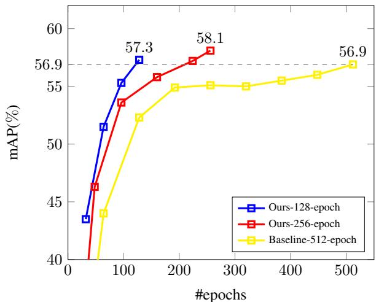  
Figure 1. Validation curve of the baseline and ours on ScanNetv2 val set. With only 128-epoch training, ours outperforms the baseline trained with 512 epochs.

tuning and are prone to wrongly segment instances that are close to each other. Recently, transformer-based methods [49, 50] develop a fully end-to-end pipeline. With transformer decoder layers, a fixed number of object queries attend to global features iteratively and directly output instance predictions. It requires no post-processing for duplicate removal such as NMS, since it adopts one-to-one bipartite matching during training. Moreover, it employs mask attention, which uses the instance masks predicted in the last layer to guide the cross-attention.

However, we point out that current transformer-based methods suffer from the issue of slow convergence. As shown in Fig. 1, the baseline model manifests slow convergence and lags behind our method by a large margin, particularly in the early stages of training. We dive further and find that the issue is potentially caused by the low recall of the initial instance masks. Specifically, as shown in Fig. 2 (a), the initial instance masks are produced by the similarity map between the initial object queries and the point-wise mask features. Since the initial object queries are unstable in early training, we notice that the recall of initial instance masks is substantially lower than ours in Fig. 3, especially at the beginning of training (i.e., the 32-th epoch). The lowquality initial instance masks increase the training difficulty, thereby slowing down convergence.

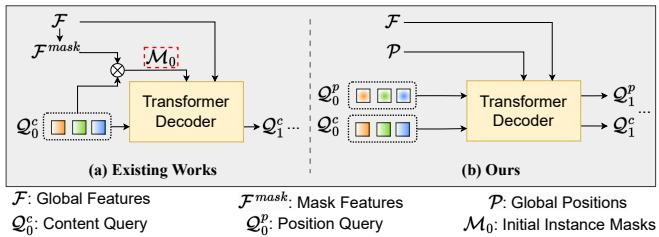  
Figure 2. The framework of (a) existing works (based on mask attention) and (b) ours. Existing works have the issue of low-recall initial instance masks $( i . e . , \mathcal { M } _ { 0 } )$ . Our approach resorts to an auxiliary center regression task to circumvent this issue.

Given the low recall of the initial instance masks, we abandon the mask attention design and instead construct an auxiliary center regression task to guide cross-attention, as depicted in Fig. 2 (b). To enable center regression, we develop a series of position-aware designs. Firstly, we maintain a set of learnable position queries, each of which denotes the position of its corresponding content query. They are densely distributed over the 3D space, and we require each query to attend to its local region. As a result, the queries can easily capture the objects in a scene with a higher recall, which is crucial in reducing training difficulty and accelerating convergence.

In addition, we design the contextual relative position encoding for cross-attention. Compared to the mask attention used in previous works, our solution is more flexible since the attention weights are adjusted by relative positions instead of hard masking. Furthermore, we iteratively update the position queries to achieve more accurate representation. Finally, we introduce the center distances between predictions and ground truths in both matching and loss.

In total, our contribution is three-fold.

• We observe that existing transformer-based methods suffer from the low recall of initial instance masks, which causes training difficulty and slow convergence.

• Instead of relying on mask attention, we construct an auxiliary center regression task to overcome the lowrecall issue and design a series of position-aware components accordingly. Our approach manifests faster convergence and demonstrates higher performance.

• Experiments show our approach achieves a new stateof-the-art result and demonstrates superior performance on various datasets including ScanNetv2, Scan-Net200, and S3DIS.

## 2. Related Work

## 2.1. 3D Instance Segmentation

3D instance segmentation is a fundamental task for 3D recognition [45, 46, 28, 6, 32, 36, 31, 35, 27, 24, 34,

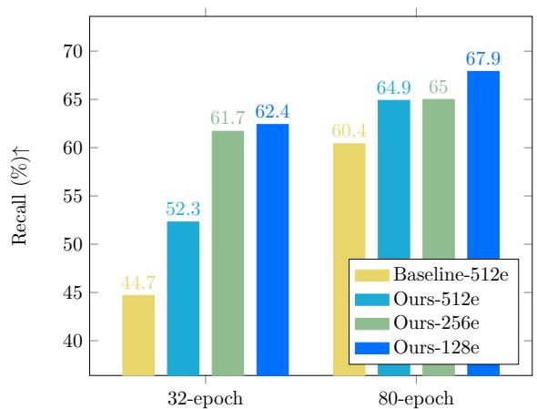  
Figure 3. The recall of initial instance masks at the 32-th and 80-th training epoch. We compare the baseline trained with 512 epochs and ours trained with 128, 256, and 512 epochs. Since our approach does not produce initial instance masks before entering decoder layers, we make statistics on the instance masks output by the first decoder layer for both the baseline and ours.

11]. The solutions can be categorized into detection-based, grouping-based and the new emerging transformer-based paradigms. Detection-based approaches [21, 2, 67] first detect the bounding boxes and then segment the fine-grained instance mask. On the other hand, grouping-based approaches [60, 61, 26, 17, 19, 25, 23, 20, 69, 33, 5, 55, 12, 10] employ clustering algorithms to group the points into a set of instance clusters. Before clustering, they either move 3D points towards the associated object center to form a more compact distribution [26, 19, 25, 23, 69, 33, 5, 55], or transform points to a high-dimension feature space [60, 61]. Further, a series of works leverage semantic priors to avoid the noisy points from other categories [26, 25, 33, 5, 55] or use advanced grouping strategies [55, 5, 33]. With these designs, the grouping-based paradigm has achieved leading performance across various evaluation benchmarks[1, 14] for a long time. Recently, transformer-based paradigm [49, 50] becomes another option and swiftly sets a new stateof-the-art. Compared with previous methods, it presents an elegant pipeline, and can directly output instance predictions. It relies on the transformer decoder and mask attention to aggregate information from global features. In this work, we construct an auxiliary center regression task to assist in cross-attention. Although the existing groupingbased methods also predict center offsets, we explain that ours is not for instance proposals, but to overcome the lowrecall issue and provide positional priors for cross-attention.

## 2.2. Vision Transformer

Transformer has become a fundamental model in the vision area, thanks to its flexibility and power to model various scenarios using attention mechanisms [54]. Recently, many works [16, 52, 53, 59, 58, 13, 15, 51, 66] rely on the self-attention in transformers to develop vision fundamental models. Besides, DETR [3] proposes a fully end-to-end pipeline for object detection. It utilizes transformer decoders to dynamically aggregate features from images, and uses one-to-one bipartite matching for ground-truth assignment, yielding an elegant pipeline. To solve the notorious slow convergence of DETR, approaches [76, 62, 41, 37, 70, 68] propose deformable attention, impose strong prior or decrease searching space in cross-attention to accelerate convergence. Further, methods of [29, 39, 22, 71, 30] present several ways to stabilize matching and training. Moreover, masked attention [8, 7] are proposed to impose semantic priors to accelerate training for segmentation tasks. Recently, there are works [28, 73, 63, 64, 43, 49, 50] that develop transformer models tailored for 3D point clouds. Following this line of research, we observe the low recall of initial instance masks, and present solutions to circumvent the use of mask attention.

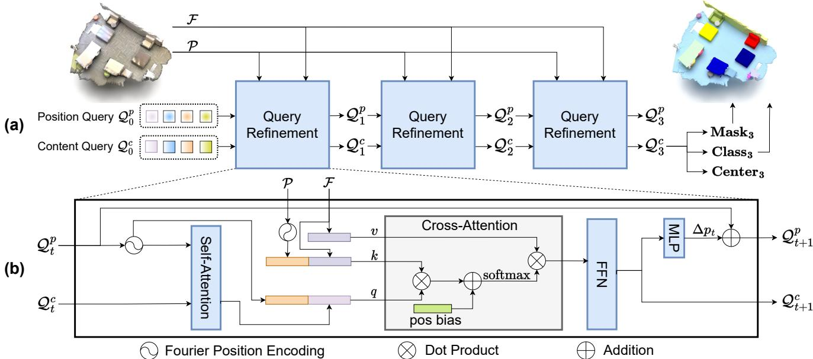  
Figure 4. The overview of our framework. Besides content queries Qc, we also maintain a set of learnable position queries $\mathcal { Q } _ { 0 } ^ { p } .$ . The content queries $\mathcal { Q } ^ { c }$ aggregate features from the global features F. The position queries $\mathcal { Q } ^ { p }$ are designed to guide the cross-attention. The attention weights are adjusted based on the relative positions between the position queries $\mathcal { Q } ^ { p }$ and the global positions P. Both content and position queries are iteratively refined in each layer. Only 3 decoder layers are shown (we use 6 layers in our experiments).

## 3. Method

We first review previous methods and present the overview of our method in Sec. 3.1. Then, we elaborate on the details of our position-aware designs in Sec. 3.2.

## 3.1. Overview

Preliminary. Recently, Mask3D [49] and SPFormer [50] present a fully end-to-end pipeline, which allows the object queries to directly output instance predictions. With transformer decoders, a fixed number of object queries aggregate information from the global features (either multi-scale voxel features [49] or superpoint features [50]) extracted with the backbone. Moreover, similar to Mask2Former [8, 7], they adopt mask attention and rely on the instance masks to guide the cross-attention. Specifically, the cross-attention is masked with the instance masks predicted in the last decoder layer, so that the queries only need to consider the masked features. However, as shown in Fig. 3, the recall of initial instance masks is low in the early stages of training. It hinders the ability to achieve a high-quality result in the subsequent layers and thus increases training difficulty.

Ours. Instead of relying on mask attention, we propose an auxiliary center regression task to guide instance segmentation. The overview of our method is shown in Fig. 4 (a). We first yield the global positions $\mathcal { P } \in \mathbb { R } ^ { N \times 3 }$ from the input point cloud and extract the global features $\mathcal { F } \in \mathbb { R } ^ { N }$ ×d using the backbone $( \mathcal { P }$ and $\mathcal { F }$ can be either voxels [49] or superpoints [50] positions and features). In contrast to existing works, besides the content queries $\mathcal { Q } _ { 0 } ^ { c } \in \mathbb { R } ^ { n \times d }$ , we also maintain a fixed number of position queries $\mathcal { Q } _ { 0 } ^ { p } \in [ 0 , 1 ] ^ { n \times 3 }$ that represent the normalized instance centers. $\mathcal { Q } _ { 0 } ^ { p }$ is randomly initialized and ${ \mathcal { Q } } _ { 0 } ^ { c }$ is initialized with zero. Given the global positions  and global features ${ \mathcal F } ,$ our goal is to let the positional queries guide their corresponding content queries in cross-attention, and then iteratively refine both sets of queries, and finally predict the instance centers, classes and masks. For the t-th decoder layer, this process

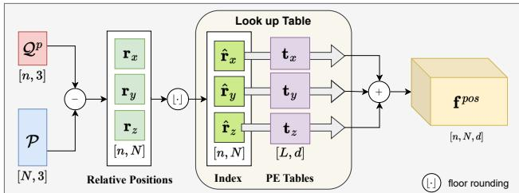  
Figure 5. The illustration for relative position encoding. We note the shape of the corresponding tensor at the bottom.

is formulated as

$$
\mathbf { C e n t e r } _ { t } = \mathbf { M L P } _ { c e n t e r } ( \mathbf { Q } _ { t } ^ { c } ) + \mathbf { Q } _ { t - 1 } ^ { p } ,\tag{1}
$$

$$
\mathbf { C l a s s } _ { t } = \mathbf { M L P } _ { c l s } ( \mathbf { Q } _ { t } ^ { c } ) ,\tag{2}
$$

$$
\mathbf { M a s k } _ { t } = \sigma ( \mathbf { Q } _ { t } ^ { c } . \mathcal { F } _ { m a s k } ^ { \phantom { c } T } ) < 0 . 5 , \ \mathcal { F } _ { m a s k } = \mathbf { M L P } _ { m a s k } ( \mathcal { F } ) ,\tag{3}
$$

where $\mathbf { C e n t e r } _ { t } \in \mathbb { R } ^ { n \times 3 }$ , Class $\mathbf { \Psi } _ { t } \in \mathbb { R } ^ { n \times K }$ and Mask $\{ 0 , 1 \} ^ { n \times N }$ are the predicted centers, classification logits, and the instance masks.

## 3.2. Position-aware Designs

To effectively support the center regression task and improve the recall of initial instance masks, we propose a series of position-aware designs as follows.

Learnable Position Query. Unlike previous works [49, 50], we introduce an additional set of position queries $\mathcal { Q } _ { 0 } ^ { p } \in [ 0 , 1 ] ^ { n \times 3 }$ . Since the range of points varies significantly among different scenes, the initial position queries are stored in a normalized form as learnable parameters followed by sigmoid function. Basically, we can obtain the absolute positions $\hat { \mathcal { Q } } _ { t } ^ { p } \in \mathbb { R } ^ { n \times 3 }$ from the normalized position queries $\mathcal { Q } _ { t } ^ { p }$ for a given input scene as

$$
\hat { \mathcal { Q } } _ { t } ^ { p } = \mathcal { Q } _ { t } ^ { p } \cdot \left( p _ { m a x } - p _ { m i n } \right) + p _ { m i n } ,\tag{4}
$$

where the $p _ { m i n } , p _ { m a x } \ \in \ \mathbb { R } ^ { 3 }$ represent the minimum and maximum coordinates of the input scene, respectively. The resultant $\hat { \mathcal { Q } } _ { t } ^ { p }$ explicitly represents the positions of the corresponding content queries $\mathcal { Q } _ { t } ^ { c }$

It is notable that the initial position queries are densely spread throughout the 3D space. Also, every query aggregates features from its local region. This design choice makes it easier for the initial queries to capture the objects in a scene with a high recall, as shown in Fig. 3. It overcomes the low-recall issue caused by initial instance masks, and consequently reduces the training complexity of the subsequent layers.

Relative Position Encoding. Other than the absolute position encoding $( e . g$ ., Fourier or sine transformations), we also adopt contextual relative position encoding in crossattention. Inspired by [28], we first calculate the relative positions $\mathbf { r } \in \mathbb { R } ^ { n \times N \times 3 }$ between the position queries $\hat { \mathcal { Q } } _ { t } ^ { p } \in \mathbb { R } ^ { n \times 3 }$ and the global positions $\mathcal { P } \in \bar { \mathbb { R } ^ { N \times 3 } }$ , and quantize it into discrete integers $\bar { \mathbf { r } } \in \mathbb { Z } ^ { n \times N \times 3 }$ as shown in Fig. 5. It is formulated as

$$
\mathbf { r } = \hat { \mathcal { Q } } _ { t } ^ { p } - \mathcal { P } , \hat { \mathbf { r } } = \lfloor \frac { \mathbf { r } } { s } \rfloor + \frac { L } { 2 } ,\tag{5}
$$

where s denotes the quantization size, L denotes the length of position encoding table. We plus $\begin{array} { l } { { \frac { L } { 2 } } } \end{array}$ to ensure the discrete relative positions are non-negative.

Then, we use the discrete relative positions ˆr as indices to look up the corresponding position encoding tables $\mathbf { t } \in \mathbb { R } ^ { 3 \times L \times d }$ , as illustrated in Fig. 5. Formally, the relative position encoding $\mathbf { f } ^ { p o s } \in \mathbb { R } ^ { n \times N \times d }$ is yielded as

$$
\mathbf { f } ^ { p o s } = \mathbf { t } [ 0 , \hat { \mathbf { r } } _ { x } ] + \mathbf { t } [ 1 , \hat { \mathbf { r } } _ { y } ] + \mathbf { t } [ 2 , \hat { \mathbf { r } } _ { z } ] ,\tag{6}
$$

where $\hat { \mathbf { r } } _ { x } , \hat { \mathbf { r } } _ { y } , \hat { \mathbf { r } } _ { z } \in \mathbb { Z } ^ { n \times N }$ are the discrete relative positions along the $x , y ,$ , and z-axis, respectively.

Further, the relative position encoding $\mathbf { f } ^ { p o s }$ performs dot product with the query features $\mathbf { f } ^ { q } \in \mathbb { R } ^ { n \times d }$ or key features $\mathbf { \bar { f } } ^ { k } \in \mathbb { R } ^ { N \times d }$ in the cross-attention, which is formulated as

$$
\mathbf { p o s . b i a s } _ { i , j } = \mathbf { f } _ { i , j } ^ { p o s } \cdot \mathbf { f } _ { i } ^ { q } + \mathbf { f } _ { i , j } ^ { p o s } \cdot \mathbf { f } _ { j } ^ { k } ,\tag{7}
$$

where pos bias $\in \mathbb { R } ^ { n \times N }$ is the positional bias. It is then added to the cross-attention weights, followed by the softmax function, as shown in Fig. 4 (b).

It is worth noting that the RPE offers a greater degree of flexibility and error-insensitivity, compared to mask attention. In essence, RPE can be likened to a soft mask that has the ability to adjust attention weights flexibly, instead of hard masking. Another advantage of RPE is that it integrates semantic information (e.g., object size and class) and thus can harvest local information selectively. This is accomplished by the interaction between the relative positions and the semantic features $( i . e .$ , fq and $\mathbf { f } ^ { k } )$ ).

Iterative Refinement. Since the content queries in our decoder layers are updated regularly, it is not optimal to maintain frozen position queries throughout the decoding process. Additionally, the initial position queries are static, so it is beneficial to adapt them to the specific input scene in the subsequent layers. To that end, we iteratively refine the position queries based on the content queries. Specifically, as shown in Fig. 4 (b), we leverage an MLP to predict a center offset $\Delta p _ { t }$ from the updated content query $\mathcal { Q } _ { t + 1 } ^ { c } .$ We then add it to the previous position query $\hat { \mathcal { Q } } _ { t } ^ { p }$ as

$$
\begin{array} { r l } & { \Delta p _ { t } = \mathbf { M } \mathbf { L } \mathbf { P } _ { c e n t e r } \big ( \mathcal { Q } _ { t + 1 } ^ { c } \big ) , } \\ & { \hat { \mathcal { Q } } _ { t + 1 } ^ { p } = \hat { \mathcal { Q } } _ { t } ^ { p } + \Delta p _ { t } . } \end{array}\tag{8}
$$

Center Matching & Loss. To eliminate the need for duplicate removal methods such as non-maximum suppression (NMS), bipartite matching is adopted during training. Existing works [49, 50] rely on semantic predictions and binary masks to match the ground truths.

In contrast, to support center regression, we also incorporate center distance in bipartite matching. Since we require the queries to only attend to a local region, it is critical to ensure that they only match with nearby ground-truth objects. To achieve this, we adapt the matching costs formulation as follows

$$
\begin{array} { r l } & { \mathcal { C } _ { c l s } ( k , \hat { k } ) = \mathrm { C E } ( { \bf C } \mathrm { l a s s } _ { k } , \hat { k } ) , } \\ & { \mathcal { C } _ { d i c e } ( k , \hat { k } ) = \mathrm { D I C E } ( \mathrm { M a s k } _ { k } , \mathrm { M a s k } _ { \hat { k } } ) , } \\ & { \mathcal { C } _ { b c e } ( k , \hat { k } ) = \mathrm { B C E } ( \mathrm { M a s k } _ { k } , \mathrm { M a s k } _ { \hat { k } } ) , } \\ & { \mathcal { C } _ { c e n t e r } ( k , \hat { k } ) = \mathrm { L } _ { 1 } ( { \bf C e n t e r } _ { k } , { \bf C e n t e r } _ { \hat { k } } ) , } \\ & { \mathcal { C } ( k , \hat { k } ) = \lambda _ { c l s } \mathcal { C } _ { c l s } ( k , \hat { k } ) + \lambda _ { d i c e } \mathcal { C } _ { d i c e } ( k , \hat { k } ) } \\ & { \quad \quad \quad + \lambda _ { b c e } \mathcal { C } _ { b c e } ( k , \hat { k } ) + \lambda _ { c e n t e r } \mathcal { C } _ { c e n t e r } ( k , \hat { k } ) , } \end{array}\tag{9}
$$

where k and $\hat { k }$ denotes a predicted and ground-truth instance, respectively, $\mathcal { C } \in \mathbb { R } ^ { n \times n _ { i n s t } }$ denotes the matching cost matrix, and λ denotes the cost weights.

The Hungarian Algorithm is then applied on  to yield the one-to-one matching result $\hat { \sigma } \in \mathbb { Z } ^ { n }$ , which is followed by the loss function as

$$
\begin{array} { r l } & { \hat { \sigma } = \arg \underset { \sigma : \sigma _ { i } \neq \sigma _ { j } , \forall i \neq j } { \operatorname* { m i n } } \underset { i \neq j } { \overset { n } { \sum } } \mathcal { C } ( i , \sigma _ { i } ) , } \\ & { \mathcal { L } = \lambda _ { c l s } \mathrm { C E } ( \mathbf { C l a s s } _ { i } , \hat { \sigma } _ { i } ) } \\ & { \qquad + \lambda _ { d i c e } \mathrm { D I C E } ( \mathbf { M a s k } _ { i } , \mathbf { M a s k } _ { \hat { \sigma } _ { i } } ) } \\ & { \qquad + \lambda _ { b c e } \mathrm { B C E } ( \mathbf { M a s k } _ { i } , \mathbf { M a s k } _ { \hat { \sigma } _ { i } } ) } \\ & { \qquad + \lambda _ { c e n t e r } \mathrm { L } _ { 1 } ( \mathbf { C e n t e r } _ { i } , \mathbf { C e n t e r } _ { \hat { \sigma } _ { i } } ) . } \end{array}\tag{10}
$$

## 4. Experiment

This section first provides an overview of the experimental setup in Sec. 4.1. We then present the 3D instance segmentation results in Sec. 4.2. Additionally, we conduct an extensive ablation study in Sec. 4.3. Furthermore, we showcase the object detection results and visual comparisons in Sections 4.4 and 4.5, respectively. Code and models will be made publicly available.

## 4.1. Experimental Setting

Network Architecture. For both ScanNetv2 [14] and ScanNet200 [47], we follow previous works [50, 25, 55, 5, 33] to use 5-layer U-Net as the backbone. The initial channel is set to 32. Unless otherwise specified, we use the coordinates and colors as the input features. We use 6 layers of Transformer decoders, where the head number is set to 8 and the hidden and feed-forward dimensions are set to 256 and 1024, respectively. We adopt Fourier absolute position encoding with the temperature set to 10,000. The quantization size for RPE is set to 0.1m, and the length of the RPE table is 48. Unless otherwise specified, we choose [50] as the baseline model, since it has achieved the best performance on ScanNetv2 val set so far. For the S3DIS [1] dataset, following Mask3D [49], we use Res16UNet34C [9] as the backbone and employ 4 decoders to attend to the coarsest four scales, and this is repeated 3 times with the shared parameters. The decoder hidden and feed-forward dimensions are set to 128 and 1024, respectively.

Datasets. We use the ScanNetv2 [14], ScanNet200 [47] and S3DIS [1] datasets for evaluation. All of them are challenging large-scale indoor scene datasets.

The ScanNetv2 dataset comprises 1201 scenes for training, and an additional 312 and 100 indoor scenes for validation and testing, respectively. The scenes are captured with RGB-D cameras and annotated with 20 semantic labels, 18 of which are instance classes. The ScanNet200 dataset adopts the same point cloud data, but it offers more diverse annotations, covering 200 classes, 198 of which are instance classes.

The S3DIS dataset contains 271 rooms in 6 areas of three buildings, and 13 semantic categories are annotated. Following previous works, the scenes in Area 5 are used for validation and the others are for training.

Implementation Details. We adopt one RTX 3090 GPU for training on ScanNet and ScanNet200, and one A100 GPU on S3DIS. Following previous works, we use AdamW [40] optimizer with the learning rate and weight decay set to 0.0001 and 0.05, respectively. We adopt poly scheduler on ScanNet and ScanNet200, and onecycle scheduler on S3DIS. The batch size is set to 4. For the weights of matching costs and losses, $( \lambda _ { c l s } , \lambda _ { b c e } , \lambda _ { d i c e } ,$ $\lambda _ { c e n t e r } )$ are set to (0.5, 1.0, 1.0, 0.5) on ScanNet and Scan-Net200, and (2.0, 5.0, 1.0, 0.5) on S3DIS. The voxel size is set to 0.02m. We limit the points number up to 250,000. Otherwise, we crop the scene by cubic windows iteratively until the point number is lower than the limit. During inference, we select the top 100 instances with the highest scores and set the minimum points number per instance to 100.

## 4.2. Instance Segmentation Results

ScanNetv2. We present the results of instance segmentation on both the ScanNetv2 test and val sets in Tables 1 and 2, respectively. Our method achieves a considerable increase in mAP compared to previous works, suggesting a superior ability to capture fine-grained details and produce high-quality instance segmentation. While Mask3D [49] slightly outperforms our model in terms of $\mathrm { \ m A P _ { 5 0 } } ,$ it is worth noting that this is potentially due to their use of a stronger backbone (i.e., Res16UNet34C with twice as many parameters as ours) and DBSCAN post-processing. Despite this, our approach produces significantly better performance on the ScanNetv2 val set than Mask3D, as seen in Table 2.

<table><tr><td></td><td colspan="2"></td><td colspan="2"></td><td colspan="2">bkksh</td><td colspan="2">chhar</td><td rowspan="2">couter cutan</td><td rowspan="2">desk</td><td rowspan="2">ioop</td><td rowspan="2">other</td><td rowspan="2">pctre lidge</td><td rowspan="2">S &#x27;:</td><td rowspan="2">snk</td><td rowspan="2">n</td><td rowspan="2">taqble</td><td rowspan="2">toilet</td><td rowspan="2"></td><td rowspan="2">d.</td></tr><tr><td>Method</td><td>mAP</td><td> $\mathrm { m A P 5 0 }$ </td><td></td><td>bu</td><td></td><td>cabiinet</td><td></td><td></td><td></td></tr><tr><td>3D-BoNet [2]</td><td>25.3</td><td>48.8</td><td>51.9</td><td>32.4</td><td>25.1</td><td>13.7</td><td>34.5</td><td>3.1</td><td>41.9</td><td>6.9</td><td>16.2</td><td>13.1</td><td>5.2</td><td>20.2 33.8</td><td></td><td>14.7</td><td>30.1</td><td>30.3 65.1</td><td>17.8</td></tr><tr><td>MTML [26]</td><td>28.2</td><td>40.2</td><td>57.7</td><td>38.0</td><td>18.2</td><td>10.7</td><td>43.0</td><td>0.1</td><td>42.2</td><td>5.7</td><td>17.9 16.2</td><td>7.0</td><td>22.9</td><td>51.1</td><td>16.1</td><td>49.1</td><td>31.3</td><td>65.0</td><td>16.2</td></tr><tr><td>GICN [38]</td><td>34.1</td><td>63.8</td><td>58.0</td><td>37.1</td><td>34.4</td><td>19.8</td><td>46.9</td><td>5.2</td><td>56.4</td><td>9.3</td><td>21.2 21.2</td><td>12.7</td><td>34.7</td><td>53.7</td><td>20.6</td><td>52.5</td><td>32.9</td><td>72.9</td><td>24.1</td></tr><tr><td>3D-MPA [17]</td><td>35.5</td><td>61.1</td><td>45.7</td><td>48.4</td><td>29.9</td><td>27.7</td><td>59.1</td><td>4.7</td><td>33.2</td><td>21.2 21.7</td><td>27.8</td><td>19.3</td><td>41.3</td><td>41.0</td><td>19.5</td><td>57.4</td><td>35.2</td><td>84.9</td><td>21.3</td></tr><tr><td>Dyco3D [20]</td><td>39.5</td><td>64.1</td><td>64.2</td><td>51.8</td><td>44.7</td><td>25.9</td><td>66.6</td><td>5.0</td><td>25.1</td><td>16.6 23.1</td><td>36.2</td><td>23.2</td><td>33.1</td><td>53.5</td><td>22.9</td><td>58.7</td><td>43.8</td><td>85.0</td><td>31.7</td></tr><tr><td>PE [69]</td><td>39.6</td><td>64.5</td><td>66.7</td><td>46.7</td><td>44.6</td><td>24.3</td><td>62.4</td><td>2.2 57.7</td><td>10.6</td><td>21.9</td><td>34.0</td><td>23.9</td><td>48.7</td><td>47.5</td><td>22.5</td><td>54.1</td><td>35.0</td><td>81.8</td><td>27.3</td></tr><tr><td>PointGroup [25]</td><td>40.7</td><td>63.6</td><td>63.9</td><td>49.6</td><td>41.5</td><td>24.3</td><td>64.5</td><td>2.1 57.0</td><td>11.4</td><td>21.1</td><td>35.9</td><td>21.7</td><td>42.8</td><td>66.6</td><td>25.6</td><td>56.2</td><td>34.1</td><td>86.0</td><td>29.1</td></tr><tr><td>HAIS [5]</td><td>45.7</td><td>69.9</td><td>70.4</td><td>56.1</td><td>45.7</td><td>36.4</td><td>67.3</td><td>4.6 54.7</td><td>19.4</td><td>30.8</td><td>42.6</td><td>28.8</td><td>45.4</td><td>71.1</td><td>26.2</td><td>56.3</td><td>43.4</td><td>88.9</td><td>34.4</td></tr><tr><td>OccuSeg [19]</td><td>48.6</td><td>67.2</td><td>80.2</td><td>53.6</td><td>42.8</td><td>36.9</td><td>70.2</td><td>20.5</td><td>33.1</td><td>30.1 37.9</td><td>47.4</td><td>32.7</td><td>43.7</td><td>86.2</td><td>48.5</td><td>60.1</td><td>39.4</td><td>84.6</td><td>27.3</td></tr><tr><td>SoftGroup [55]</td><td>50.4</td><td>76.1</td><td>66.7</td><td>57.9</td><td>37.2</td><td>38.1</td><td>69.4</td><td>7.2</td><td>67.7</td><td>30.3 38.7</td><td>53.1</td><td>31.9</td><td>58.2</td><td>75.4</td><td>31.8</td><td>64.3</td><td>49.2</td><td>90.7</td><td>38.8</td></tr><tr><td>SSTNet [33]</td><td>50.6</td><td>69.8</td><td>73.8</td><td>54.9</td><td>49.7</td><td>31.6</td><td>69.3</td><td>17.8</td><td>37.7</td><td>19.8 33.0</td><td>46.3</td><td>57.6</td><td>51.5</td><td>85.7</td><td>49.4</td><td>63.7</td><td>45.7</td><td>94.3</td><td>29.0</td></tr><tr><td>SPFormer [50]</td><td>54.9</td><td>77.0</td><td>74.5</td><td>64.0</td><td>48.4</td><td>39.5</td><td>73.9</td><td>31.1</td><td>56.6</td><td>33.5 46.8</td><td>49.2</td><td>55.5</td><td>47.8</td><td>74.7</td><td>43.6</td><td>71.2</td><td>54.0</td><td>89.3</td><td>34.3</td></tr><tr><td>Mask3D*[49]</td><td>56.6</td><td>78.0</td><td>92.6</td><td>59.7</td><td>40.8</td><td>42.0</td><td>73.7</td><td>23.9 59.8</td><td>38.6</td><td>45.8</td><td>54.9</td><td>56.8</td><td>71.6</td><td>60.1</td><td>48.0</td><td>64.6</td><td>57.5</td><td>92.2</td><td>36.4</td></tr><tr><td>Ours</td><td>57.8</td><td>77.4</td><td>77.8</td><td>64.9</td><td>52.0</td><td>44.9</td><td>76.1</td><td>25.3</td><td>58.4</td><td>39.1 53.0</td><td>47.2</td><td>61.7</td><td>49.9</td><td>79.5</td><td>47.3</td><td>74.5</td><td>54.8</td><td>96.0</td><td>37.4</td></tr><tr><td>Ours</td><td>59.6</td><td>78.6</td><td>88.9</td><td>72.1</td><td>44.8</td><td>46.0</td><td>76.8</td><td>25.1</td><td>55.8</td><td>40.8</td><td>50.4 53.9</td><td>61.6</td><td>61.8</td><td>85.8</td><td>48.2</td><td>68.4</td><td>55.1</td><td>93.1</td><td>45.0</td></tr></table>

Table 1. 3D instance segmentation results on ScanNet test set. ∗ denotes using Res16UNet34C (twice as many parameters as ours) as the backbone. ‡ denotes using surface normal. Methods published before the submission deadline (03/08/2023) are listed.

<table><tr><td>Method</td><td> $\mathrm { m A P }$ </td><td> $\mathrm { m A P } _ { 5 0 }$ </td></tr><tr><td>GSPN [67]</td><td>19.3</td><td>37.8</td></tr><tr><td>MTML [26]</td><td>20.3</td><td>40.2</td></tr><tr><td>3D-MPA [17]</td><td>35.5</td><td>59.1</td></tr><tr><td>Dyco3D [20]</td><td>35.4</td><td>57.6</td></tr><tr><td>PointGroup [25]</td><td>34.8</td><td>56.7</td></tr><tr><td>MaskGroup [75]</td><td>42.0</td><td>63.3</td></tr><tr><td>HAIS [5]</td><td>43.5</td><td>64.1</td></tr><tr><td>OccuSeg [19]</td><td>44.2</td><td>60.7</td></tr><tr><td>SoftGroup [55]</td><td>46.0</td><td>67.6</td></tr><tr><td>SSTNet [33]</td><td>49.4</td><td>64.3</td></tr><tr><td>SPFormer [50]</td><td>56.3</td><td>73.9</td></tr><tr><td>Mask3D*[49]</td><td>55.2</td><td>73.7</td></tr><tr><td>Ours</td><td>58.4</td><td>75.9</td></tr><tr><td>Ours‡</td><td>59.9</td><td>76.5</td></tr></table>

Table 2. 3D instance segmentation results on ScanNet val set. ∗ denotes using Res16UNet34C (twice as many parameters as ours) as the backbone. ‡ denotes using surface normal.
<table><tr><td>Method</td><td>mAP</td><td> $\mathrm { m A P 5 0 }$ </td><td> $\boldsymbol { \mathrm { m A P } _ { 2 5 } }$ </td></tr><tr><td>SPFormer† [50]</td><td>25.2</td><td>33.8</td><td>39.6</td></tr><tr><td>Mask3D*[49]</td><td>27.4</td><td>37.0</td><td>42.3</td></tr><tr><td>Ours</td><td>29.2</td><td>38.2</td><td>43.3</td></tr></table>

Table 3. 3D instance segmentation results on ScanNet200 val set. † denotes reproduced results. ∗ denotes using Res16UNet34C.

<table><tr><td>Method</td><td> $\mathrm { m A P } _ { 5 0 }$ </td><td> $\mathrm { m A P } _ { 2 5 }$ </td></tr><tr><td>PointGroup [25]</td><td>57.8</td><td></td></tr><tr><td>MaskGroup [75]</td><td>65.0</td><td></td></tr><tr><td>SoftGroup [55]</td><td>66.1</td><td>–</td></tr><tr><td>SSTNet [33]</td><td>59.3</td><td>-</td></tr><tr><td>SPFormer [50]</td><td>66.8</td><td></td></tr><tr><td>Mask3D [49]</td><td>68.4</td><td>75.2</td></tr><tr><td>Ours</td><td>69.1</td><td>75.7</td></tr></table>

Table 4. 3D instance segmentation results on S3DIS Area5.

ScanNet200. Table 3 presents our comparison with previous state-of-the-art methods on the val set of ScanNet200. Our method achieves a significant improvement in comparison to the other methods. Consistent conclustion is also seen on this challenging dataset. It is important to note that previous works employ mask attention, while our approach does not. This verifies the success of our auxiliary center regression task in replacing mask attention.

S3DIS. As shown in Table 4, our method is evaluated on S3DIS Area5. Our approach outperforms previous works. This consistently shows the superiority of our method.

## 4.3. Ablation Study

We conduct an extensive ablation study to verify each component of our method as follows.

Learnable Position Query. The position query aims to provide an explicit center representation to the content query counterpart. Making it learnable intends to learn an optimal initial spatial distribution. We notice that some previous works [49, 42] adopt non-parametric initial queries, where Furthest Point Sampling (FPS) is used to sample a number of points and transform them into position encodings via Fourier transformation followed by an MLP. We make comparisons in Table 5. The results show that learnable position query and zero-initialized content query perform best. A potential reason why ‘FPS’ lags behind ‘learnable’ is that the latter learns an optimal spatial distribution.

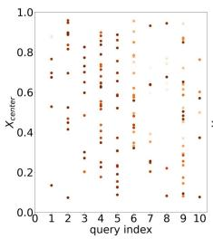

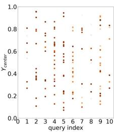  
(a)

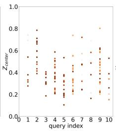

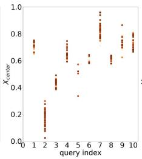

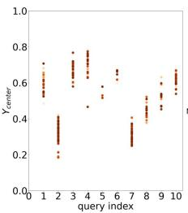  
(b)

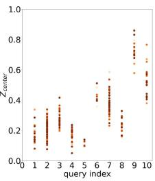  
Figure 6. Spatial distribution of ground truths that are matched to the same query at different training iterations. (a): Baseline. (b): Ours. We randomly select 10 object queries and record their matched ground-truth instances in the early training. The three scatter plots for each method represent the center XYZ coordinates of their matched ground-truth instances at different training iterations (the scatter points for a query correspond to different training iterations). More visualization details are given in supplementary material. Our method manifests strong positional matching consistency among different training iterations.

<table><tr><td>Position</td><td>Content</td><td>mAP</td><td> $\mathrm { m A P } _ { 5 0 }$ </td><td> $\mathrm { m A P } _ { 2 5 }$ </td></tr><tr><td>FPS</td><td>zero</td><td>57.3</td><td>74.9</td><td>84.2</td></tr><tr><td>FPS</td><td>learnable</td><td>57.1</td><td>75.0</td><td>83.4</td></tr><tr><td>learnable</td><td>learnable</td><td>58.1</td><td>75.4</td><td>84.3</td></tr><tr><td>learnable</td><td>zero</td><td>58.4</td><td>75.9</td><td>84.5</td></tr></table>

Table 5. Ablation study on different initializations for position and content queries.

<table><tr><td>Position Encoding</td><td>mAP</td><td> $\mathrm { m A P } _ { 5 0 }$ </td><td> $\mathrm { m A P } _ { 2 5 }$ </td></tr><tr><td>No PE</td><td>0.0</td><td>0.0</td><td>0.0</td></tr><tr><td>Fourier APE</td><td>57.7</td><td>76.0</td><td>83.8</td></tr><tr><td>Content-conditioned APE</td><td>58.0</td><td>75.7</td><td>84.3</td></tr><tr><td>RPE</td><td>58.4</td><td>75.9</td><td>84.5</td></tr></table>

Table 6. Ablation study on different position encodings.

<table><tr><td>ID</td><td>iter. refine</td><td>e center match</td><td>center loss</td><td>mAP</td><td> $\mathrm { m A P 5 0 }$ </td><td> $\mathrm { m A P } _ { 2 5 }$ </td></tr><tr><td>1</td><td></td><td>√</td><td>√</td><td>57.5</td><td>75.3</td><td>84.0</td></tr><tr><td>2</td><td>√</td><td></td><td>√</td><td>56.7</td><td>74.8</td><td>84.1</td></tr><tr><td>3</td><td>√</td><td>√</td><td></td><td>56.8</td><td>74.6</td><td>84.5</td></tr><tr><td>4</td><td>√</td><td></td><td></td><td>56.4</td><td>74.7</td><td>83.7</td></tr><tr><td>5</td><td>√</td><td>√</td><td>√</td><td>58.4</td><td>75.9</td><td>84.5</td></tr></table>

Table 7. Ablation study on iterative refinement and center matching & loss.

Moreover, to show the pattern of the learnable position query, we visualize the spatial distribution of center coordinates of the matched ground truths for a query in Fig. 6. It shows that each query consistently attends to a local region.

Relative Position Encoding. We compare various position encodings that are employed in previous works [49, 41], such as Fourier Absolute Position Encoding (APE) and the content query-conditioned APE. Specifically, the latter uses an MLP to project the content query into a d-dim diagonal matrix, which then transforms the original absolute position encoding into a new one. It incorporates semantic information into the position encoding but does not consider relative relation. As shown in Table 6, RPE outperforms the others, which implies that both semantic information and relative relation are beneficial. Also, we notice that if we do not apply any position encoding, the training corrupts. This shows that positional prior is crucial in our framework.

Iterative Refinement. We remove the iterative refinement and freeze the position query in all decoder layers, and we find that it causes a performance drop of 0.9% mAP as shown in the first row of Table 7. This verifies the effectiveness of iterative refinement.

Center Matching & Loss. Moreover, to manifest the importance of center matching and center loss, we also conduct ablation studies in Table 7. We first remove the center matching and keep the center loss in the second row of the table, and we find that the performance drops by 1.7% mAP. Then we keep the center matching and remove the center loss. The performance also decreases by 1.6% mAP as shown in the 3-rd row. When both are absent, we observe an even larger performance drop (2.0% mAP) in the 4-th row. The results reveal that both center matching and loss are important to our framework.

## 4.4. Object Detection Results

The instance predictions of instance segmentation can be easily transformed into bounding box predictions, by obtaining the minimum and maximum coordinates of the masked instances. We empirically find that the generated object detection results from the instance predictions work significantly better than previous methods tailored for 3D object detection in terms of $\mathrm { m A P } _ { 5 0 } ,$ , as shown in Table 8. This finding also shows that our approach outputs highquality instance segmentation results with fewer artifacts.

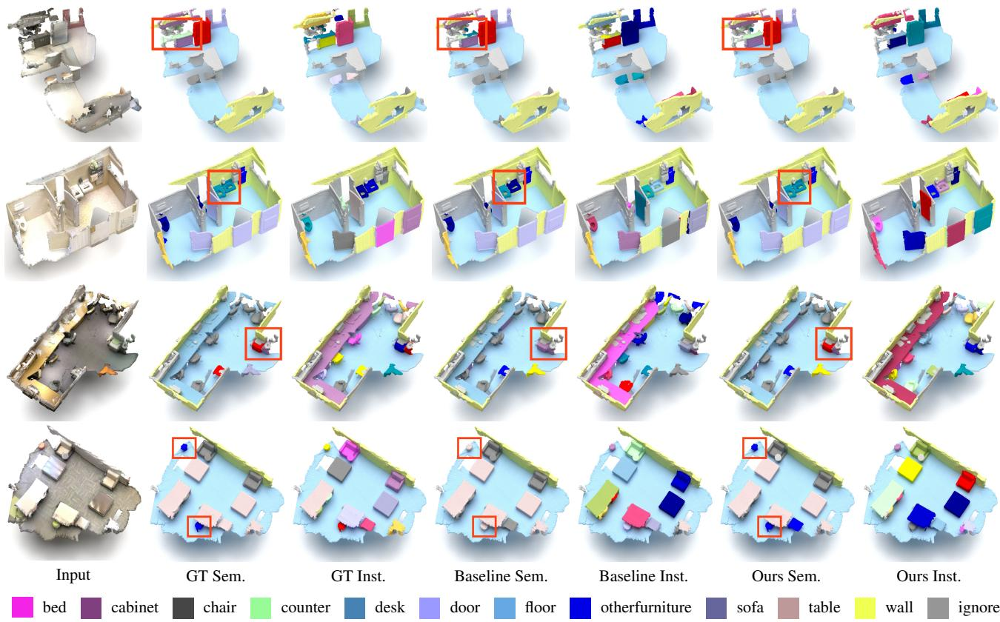  
Figure 7. Visual comparison between baseline and ours (best viewed in color and by zoom-in). GT: Ground Truth. Sem.: Semantic labels. Inst.: Instance labels. The main difference is highlighted with a red bounding box. The bottom color map is for semantic labels. More examples are given in the supplementary material.

<table><tr><td>Method</td><td>task</td><td>box mAP50</td><td>box mAP25</td></tr><tr><td>VoteNet [44]</td><td>det</td><td>33.5</td><td>58.6</td></tr><tr><td>HGNet [4]</td><td>det</td><td>34.4</td><td>61.3</td></tr><tr><td>MLCVNet [65]</td><td>det</td><td>41.4</td><td>64.5</td></tr><tr><td>GSDN [18]</td><td>det</td><td>34.8</td><td>62.8</td></tr><tr><td>H3DNet [72]</td><td>det</td><td>48.1</td><td>67.2</td></tr><tr><td>3DETR [42]</td><td>det</td><td>47.0</td><td>65.0</td></tr><tr><td>Group-free [39]</td><td>det</td><td>52.8</td><td>69.1</td></tr><tr><td>RBGNet [57]</td><td>det</td><td>55.2</td><td>70.6</td></tr><tr><td>HyperDet3D [74]</td><td>det</td><td>57.2</td><td>70.9</td></tr><tr><td>FCAF3D [48]</td><td>det</td><td>57.3</td><td>71.5</td></tr><tr><td>CAGroup3D [56]</td><td>det</td><td>61.3</td><td>75.1</td></tr><tr><td>3D-MPA [17]</td><td>inst</td><td>49.2</td><td>64.2</td></tr><tr><td>Mask3D [49]</td><td>inst</td><td>56.2</td><td>70.2</td></tr><tr><td>Ours</td><td>inst</td><td>63.9</td><td></td></tr><tr><td></td><td></td><td></td><td>73.5</td></tr></table>

Table 8. 3D object detection results on ScanNetv2. For methods designed for the instance segmentation task, the bounding boxes are generated by the instance mask predictions.

## 4.5. Visual Comparison

We visually compare our approach with previous stateof-the-art methods in Fig. 7. More examples are given in the supplementary material. The visualizations demonstrate that our method tends to correctly recognize the classes of the instances. It implies that our approach is able to generate more high-quality instance segmentation results.

## 5. Conclusion

In this work, we have presented a mask-attention-free transformer for the 3D instance segmentation task. We first observe the issue of low-recall of the initial masks in existing works. It adds training difficulty and slows down convergence. We thus avoid using mask attention and instead propose an auxiliary center regression task to guide the cross-attention. To fit center regression, we develop a series of designs. A dense distribution of position queries is learned to yield a higher recall of the perceived instances. Also, relative position encoding and iterative refinement are designed to further boost the performance. Each component is verified to be effective.

## Acknowledgements

This work was supported in part by the Research Grants Council under the Areas of Excellence scheme grant AoE/E-601/22-R and Shenzhen Science and Technology Program KQTD20210811090149095.

## References

[1] Iro Armeni, Ozan Sener, Amir R. Zamir, Helen Jiang, Ioannis Brilakis, Martin Fischer, and Silvio Savarese. 3d semantic parsing of large-scale indoor spaces. In CVPR, 2016. 2, 5

[2] Yang Bo, Wang Jianan, Clark Ronald, Hu Qingyong, Wang Sen, Markham Andrew, and Trigoni Niki. Learning object bounding boxes for 3d instance segmentation on point clouds. In NeurIPS, pages 6737–6746, 2019. 2, 6

[3] Nicolas Carion, Francisco Massa, Gabriel Synnaeve, Nicolas Usunier, Alexander Kirillov, and Sergey Zagoruyko. End-toend object detection with transformers. In ECCV, 2020. 3

[4] Jintai Chen, Biwen Lei, Qingyu Song, Haochao Ying, Danny Z Chen, and Jian Wu. A hierarchical graph network for 3d object detection on point clouds. In CVPR, 2020. 8

[5] Shaoyu Chen, Jiemin Fang, Qian Zhang, Wenyu Liu, and Xinggang Wang. Hierarchical aggregation for 3d instance segmentation. In ICCV, pages 15467–15476, 2021. 1, 2, 5, 6

[6] Yukang Chen, Yanwei Li, Xiangyu Zhang, Jian Sun, and Jiaya Jia. Focal sparse convolutional networks for 3d object detection. In CVPR, 2022. 2

[7] Bowen Cheng, Ishan Misra, Alexander G Schwing, Alexander Kirillov, and Rohit Girdhar. Masked-attention mask transformer for universal image segmentation. In CVPR, 2022. 3

[8] Bowen Cheng, Alex Schwing, and Alexander Kirillov. Perpixel classification is not all you need for semantic segmentation. NeurIPS, 2021. 3

[9] Christopher Choy, JunYoung Gwak, and Silvio Savarese. 4d spatio-temporal convnets: Minkowski convolutional neural networks. In CVPR, 2019. 5

[10] Ruihang Chu, Yukang Chen, Tao Kong, Lu Qi, and Lei Li. Icm-3d: Instantiated category modeling for 3d instance segmentation. IEEE Robotics and Automation Letters, 7(1):57– 64, 2021. 2

[11] Ruihang Chu, Zhengzhe Liu, Xiaoqing Ye, Xiao Tan, Xiaojuan Qi, Chi-Wing Fu, and Jiaya Jia. Command-driven articulated object understanding and manipulation. In CVPR, 2023. 2

[12] Ruihang Chu, Xiaoqing Ye, Zhengzhe Liu, Xiao Tan, Xiaojuan Qi, Chi-Wing Fu, and Jiaya Jia. Twist: Two-way inter-label self-training for semi-supervised 3d instance segmentation. In CVPR, 2022. 2

[13] Xiangxiang Chu, Zhi Tian, Yuqing Wang, Bo Zhang, Haibing Ren, Xiaolin Wei, Huaxia Xia, and Chunhua Shen. Twins: Revisiting the design of spatial attention in vision transformers. arXiv:2104.13840, 2021. 3

[14] Angela Dai, Angel X. Chang, Manolis Savva, Maciej Halber, Thomas Funkhouser, and Matthias Nießner. Scannet: Richly-annotated 3d reconstructions of indoor scenes. In CVPR, 2017. 2, 5

[15] Xiaoyi Dong, Jianmin Bao, Dongdong Chen, Weiming Zhang, Nenghai Yu, Lu Yuan, Dong Chen, and Baining Guo. Cswin transformer: A general vision transformer backbone with cross-shaped windows. arXiv:2107.00652, 2021. 3

[16] Alexey Dosovitskiy, Lucas Beyer, Alexander Kolesnikov, Dirk Weissenborn, Xiaohua Zhai, Thomas Unterthiner, Mostafa Dehghani, Matthias Minderer, Georg Heigold, Sylvain Gelly, Jakob Uszkoreit, and Neil Houlsby. An image is worth 16x16 words: Transformers for image recognition at scale. ICLR, 2021. 3

[17] Francis Engelmann, Martin Bokeloh, Alireza Fathi, Bastian Leibe, and Matthias Nießner. 3d-mpa: Multi-proposal aggregation for 3d semantic instance segmentation. In CVPR, pages 9031–9040, 2020. 2, 6, 8

[18] JunYoung Gwak, Christopher Choy, and Silvio Savarese. Generative sparse detection networks for 3d single-shot object detection. In ECCV, 2020. 8

[19] Lei Han, Tian Zheng, Lan Xu, and Lu Fang. Occuseg: Occupancy-aware 3d instance segmentation. In CVPR, pages 2940–2949, 2020. 2, 6

[20] Tong He, Chunhua Shen, and Anton van den Hengel. Dyco3d: Robust instance segmentation of 3d point clouds through dynamic convolution. In CVPR, pages 354–363, 2021. 2, 6

[21] Ji Hou, Angela Dai, and Matthias Nießner. 3d-sis: 3d semantic instance segmentation of rgb-d scans. In CVPR, pages 4421–4430, 2019. 2

[22] Ding Jia, Yuhui Yuan, Haodi He, Xiaopei Wu, Haojun Yu, Weihong Lin, Lei Sun, Chao Zhang, and Han Hu. Detrs with hybrid matching. arXiv preprint, 2022. 3

[23] Haiyong Jiang, Feilong Yan, Jianfei Cai, Jianmin Zheng, and Jun Xiao. End-to-end 3d point cloud instance segmentation without detection. In CVPR, pages 12796–12805, 2020. 2

[24] Li Jiang, Shaoshuai Shi, Zhuotao Tian, Xin Lai, Shu Liu, Chi-Wing Fu, and Jiaya Jia. Guided point contrastive learning for semi-supervised point cloud semantic segmentation. In ICCV, 2021. 2

[25] Li Jiang, Hengshuang Zhao, Shaoshuai Shi, Shu Liu, Chi-Wing Fu, and Jiaya Jia. Pointgroup: Dual-set point grouping for 3d instance segmentation. In CVPR, pages 4867–4876, 2020. 1, 2, 5, 6

[26] Jean Lahoud, Bernard Ghanem, Marc Pollefeys, and Martin R Oswald. 3d instance segmentation via multi-task metric learning. In ICCV, pages 9256–9266, 2019. 2, 6

[27] Xin Lai, Yukang Chen, Fanbin Lu, Jianhui Liu, and Jiaya Jia. Spherical transformer for lidar-based 3d recognition. In CVPR, 2023. 2

[28] Xin Lai, Jianhui Liu, Li Jiang, Liwei Wang, Hengshuang Zhao, Shu Liu, Xiaojuan Qi, and Jiaya Jia. Stratified transformer for 3d point cloud segmentation. In CVPR, 2022. 2, 3, 4

[29] Feng Li, Hao Zhang, Shilong Liu, Jian Guo, Lionel M Ni, and Lei Zhang. Dn-detr: Accelerate detr training by introducing query denoising. In CVPR, 2022. 3

[30] Feng Li, Hao Zhang, Shilong Liu, Lei Zhang, Lionel M Ni, Heung-Yeung Shum, et al. Mask dino: Towards a unified transformer-based framework for object detection and segmentation. arXiv preprint, 2022. 3

[31] Yanwei Li, Yilun Chen, Xiaojuan Qi, Zeming Li, Jian Sun, and Jiaya Jia. Unifying voxel-based representation with transformer for 3d object detection. NeurIPS, 2022. 2

[32] Yanwei Li, Xiaojuan Qi, Yukang Chen, Liwei Wang, Zeming Li, Jian Sun, and Jiaya Jia. Voxel field fusion for 3d object detection. In CVPR, 2022. 2

[33] Zhihao Liang, Zhihao Li, Songcen Xu, Mingkui Tan, and Kui Jia. Instance segmentation in 3d scenes using semantic superpoint tree networks. In ICCV, 2021. 2, 5, 6

[34] Jiahui Liu, Chirui Chang, Jianhui Liu, Xiaoyang Wu, Lan Ma, and Xiaojuan Qi. Mars3d: A plug-and-play motionaware model for semantic segmentation on multi-scan 3d point clouds. In CVPR, 2023. 2

[35] Jianhui Liu, Yukang Chen, Xiaoqing Ye, and Xiaojuan Qi. Prior-free category-level pose estimation with implicit space transformation. arXiv preprint arXiv:2303.13479, 2023. 2

[36] Jianhui Liu, Yukang Chen, Xiaoqing Ye, Zhuotao Tian, Xiao Tan, and Xiaojuan Qi. Spatial pruned sparse convolution for efficient 3d object detection. NeurIPS, 2022. 2

[37] Shilong Liu, Feng Li, Hao Zhang, Xiao Yang, Xianbiao Qi, Hang Su, Jun Zhu, and Lei Zhang. Dab-detr: Dynamic anchor boxes are better queries for detr. In ICLR, 2022. 3

[38] Shih-Hung Liu, Shang-Yi Yu, Shao-Chi Wu, Hwann-Tzong Chen, and Tyng-Luh Liu. Learning gaussian instance segmentation in point clouds. arXiv preprint, 2020. 6

[39] Ze Liu, Zheng Zhang, Yue Cao, Han Hu, and Xin Tong. Group-free 3d object detection via transformers. In ICCV, 2021. 3, 8

[40] Ilya Loshchilov and Frank Hutter. Decoupled weight decay regularization. arXiv:1711.05101, 2017. 5

[41] Depu Meng, Xiaokang Chen, Zejia Fan, Gang Zeng, Houqiang Li, Yuhui Yuan, Lei Sun, and Jingdong Wang. Conditional detr for fast training convergence. In ICCV, 2021. 3, 7

[42] Ishan Misra, Rohit Girdhar, and Armand Joulin. An endto-end transformer model for 3d object detection. In ICCV, 2021. 6, 8

[43] Chunghyun Park, Yoonwoo Jeong, Minsu Cho, and Jaesik Park. Fast point transformer. In CVPR, 2022. 3

[44] Charles R Qi, Or Litany, Kaiming He, and Leonidas J Guibas. Deep hough voting for 3d object detection in point clouds. In ICCV, 2019. 8

[45] Charles R Qi, Hao Su, Kaichun Mo, and Leonidas J Guibas. Pointnet: Deep learning on point sets for 3d classification and segmentation. In CVPR, 2017. 2

[46] Charles Ruizhongtai Qi, Li Yi, Hao Su, and Leonidas J Guibas. Pointnet++: Deep hierarchical feature learning on point sets in a metric space. NeurIPS, 2017. 2

[47] David Rozenberszki, Or Litany, and Angela Dai. Languagegrounded indoor 3d semantic segmentation in the wild. In ECCV, 2022. 5

[48] Danila Rukhovich, Anna Vorontsova, and Anton Konushin. Fcaf3d: fully convolutional anchor-free 3d object detection. In ECCV, 2022. 8

[49] Jonas Schult, Francis Engelmann, Alexander Hermans, Or Litany, Siyu Tang, and Bastian Leibe. Mask3d for 3d semantic instance segmentation. ICRA, 2023. 1, 2, 3, 4, 5, 6, 7, 8

[50] Jiahao Sun, Chunmei Qing, Junpeng Tan, and Xiangmin Xu. Superpoint transformer for 3d scene instance segmentation. AAAI, 2023. 1, 2, 3, 4, 5, 6

[51] Shuyang Sun, Xiaoyu Yue, Song Bai, and Philip Torr. Visual parser: Representing part-whole hierarchies with transformers. arXiv:2107.05790, 2021. 3

[52] Hugo Touvron, Matthieu Cord, Matthijs Douze, Francisco Massa, Alexandre Sablayrolles, and Herve Jegou. Training data-efficient image transformers & distillation through attention. In ICML, 2021. 3

[53] Hugo Touvron, Matthieu Cord, Alexandre Sablayrolles, Gabriel Synnaeve, and Herve J ´ egou. Going deeper with im-´ age transformers. arXiv:2103.17239, 2021. 3

[54] Ashish Vaswani, Noam Shazeer, Niki Parmar, Jakob Uszkoreit, Llion Jones, Aidan N Gomez, Łukasz Kaiser, and Illia Polosukhin. Attention is all you need. In NeurIPS, 2017. 2

[55] Thang Vu, Kookhoi Kim, Tung M Luu, Thanh Nguyen, and Chang D Yoo. Softgroup for 3d instance segmentation on point clouds. In CVPR, 2022. 1, 2, 5, 6

[56] Haiyang Wang, Lihe Ding, Shaocong Dong, Shaoshuai Shi, Aoxue Li, Jianan Li, Zhenguo Li, and Liwei Wang. Cagroup3d: Class-aware grouping for 3d object detection on point clouds. In NeurIPS, 2022. 8

[57] Haiyang Wang, Shaoshuai Shi, Ze Yang, Rongyao Fang, Qi Qian, Hongsheng Li, Bernt Schiele, and Liwei Wang. Rbgnet: Ray-based grouping for 3d object detection. In CVPR, 2022. 8

[58] Wenhai Wang, Enze Xie, Xiang Li, Deng-Ping Fan, Kaitao Song, Ding Liang, Tong Lu, Ping Luo, and Ling Shao. Pvtv2: Improved baselines with pyramid vision transformer. arXiv:2106.13797, 2021. 3

[59] Wenhai Wang, Enze Xie, Xiang Li, Deng-Ping Fan, Kaitao Song, Ding Liang, Tong Lu, Ping Luo, and Ling Shao. Pyramid vision transformer: A versatile backbone for dense prediction without convolutions. In ICCV, 2021. 3

[60] Weiyue Wang, Ronald Yu, Qiangui Huang, and Ulrich Neumann. Sgpn: Similarity group proposal network for 3d point cloud instance segmentation. In CVPR, pages 2569–2578, 2018. 2

[61] Xinlong Wang, Shu Liu, Xiaoyong Shen, Chunhua Shen, and Jiaya Jia. Associatively segmenting instances and semantics in point clouds. In CVPR, pages 4096–4105, 2019. 2

[62] Yingming Wang, Xiangyu Zhang, Tong Yang, and Jian Sun. Anchor detr: Query design for transformer-based detector. In AAAI, 2022. 3

[63] Wenxuan Wu, Qi Shan, and Li Fuxin. Pointconvformer: Revenge of the point-based convolution. arXiv preprint, 2022. 3

[64] Xiaoyang Wu, Yixing Lao, Li Jiang, Xihui Liu, and Hengshuang Zhao. Point transformer v2: Grouped vector atten tion and partition-based pooling. NeurIPS, 2022. 3

[65] Qian Xie, Yu-Kun Lai, Jing Wu, Zhoutao Wang, Yiming Zhang, Kai Xu, and Jun Wang. Mlcvnet: Multi-level context votenet for 3d object detection. In CVPR, 2020. 8

[66] Jianwei Yang, Chunyuan Li, Pengchuan Zhang, Xiyang Dai, Bin Xiao, Lu Yuan, and Jianfeng Gao. Focal selfattention for local-global interactions in vision transformers. In NeurIPS, 2021. 3

[67] Li Yi, Wang Zhao, He Wang, Minhyuk Sung, and Leonidas J Guibas. Gspn: Generative shape proposal network for 3d

instance segmentation in point cloud. In CVPR, pages 3947– 3956, 2019. 2, 6

[68] Qihang Yu, Huiyu Wang, Siyuan Qiao, Maxwell Collins, Yukun Zhu, Hartwig Adam, Alan Yuille, and Liang-Chieh Chen. k-means mask transformer. In ECCV, 2022. 3

[69] Biao Zhang and Peter Wonka. Point cloud instance segmentation using probabilistic embeddings. In CVPR, pages 8883–8892, 2021. 2, 6

[70] Gongjie Zhang, Zhipeng Luo, Yingchen Yu, Kaiwen Cui, and Shijian Lu. Accelerating detr convergence via semanticaligned matching. In CVPR, 2022. 3

[71] Hao Zhang, Feng Li, Shilong Liu, Lei Zhang, Hang Su, Jun Zhu, Lionel Ni, and Harry Shum. Dino: Detr with improved denoising anchor boxes for end-to-end object detection. In ICLR, 2022. 3

[72] Zaiwei Zhang, Bo Sun, Haitao Yang, and Qixing Huang. H3dnet: 3d object detection using hybrid geometric primitives. In ECCV, 2020. 8

[73] Hengshuang Zhao, Li Jiang, Jiaya Jia, Philip HS Torr, and Vladlen Koltun. Point transformer. In ICCV, 2021. 3

[74] Yu Zheng, Yueqi Duan, Jiwen Lu, Jie Zhou, and Qi Tian. Hyperdet3d: Learning a scene-conditioned 3d object detector. In CVPR, 2022. 8

[75] Min Zhong, Xinghao Chen, Xiaokang Chen, Gang Zeng, and Yunhe Wang. Maskgroup: Hierarchical point grouping and masking for 3d instance segmentation. In ICME, 2022. 1, 6

[76] Xizhou Zhu, Weijie Su, Lewei Lu, Bin Li, Xiaogang Wang, and Jifeng Dai. Deformable detr: Deformable transformers for end-to-end object detection. In ICLR, 2020. 3