# Mastering Spatial Graph Prediction of Road Networks

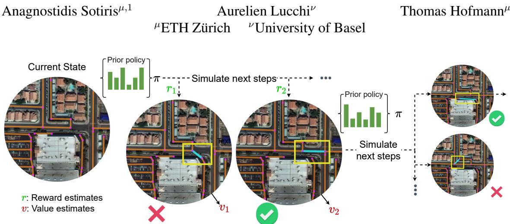  
Figure 1. Our agent interacts with the currently generated spatial graph by proposing new edges to be added. A tree-based search produces a sequence of actions that maximizes a reward function based on complex geometrics priors.

## Abstract

Accurately predicting road networks from satellite images requires a global understanding of the network topology. We propose to capture such high-level information by introducing a graph-based framework that given a partially generated graph, sequentially adds new edges. To deal with misalignment between the model predictions and the intended purpose, and to optimize over complex, noncontinuous metrics of interest, we adopt a reinforcement learning (RL) approach that nominates modifications that maximize a cumulative reward. As opposed to standard supervised techniques that tend to be more restricted to commonly used surrogate losses, our framework yields more power and flexibility to encode problem-dependent knowledge. Empirical results on several benchmark datasets demonstrate enhanced performance and increased highlevel reasoning about the graph topology when using a treebased search. Wefurther demonstrate the superiority ofour approach in handling examples with substantial occlusion and additionally provide evidence that our predictions better match the statistical properties of the ground dataset.

## 1. Introduction

Road layout modelling from satellite images constitutes an important task of remote sensing, with applications in everyday life, such as traffic flow prediction and navigation. The vast amounts of data available from the commercialization of geospatial data, in addition to the need for accurately establishing the connectivity of roads in remote areas, have led to an increased interest in the precise representation of existing road networks. By nature, these applications require structured data types that provide efficient representations to encode geometry, in this case, graphs, a de facto choice in domains such as computer graphics, virtual reality, gaming, and the film industry. These structured-graph representations are also commonly used to label recent road network datasets [60] and map repositories [40]. When dealing with complex predicted structures, however, how well the model optimizes a surrogate objective is not always the best indication of how well the model’s predictions are aligned with the required task risk, i.e. the targeted final utilization.

Problems of this nature have been recently extensively studied in the regime of natural language processing, where the misalignment between training objectives for tasks such as machine translation and summarization has garnered considerable attention among the academic community, who have devoted significant efforts to its analysis and elucidation. A popular emerging technique is to first learn to imitate some example outputs and then fix any misalignment issues by using reinforcement learning to adjust the predictions based on a reward function. The reward usually comes in the form of external human evaluation [41, 4].

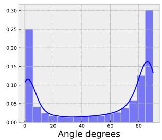

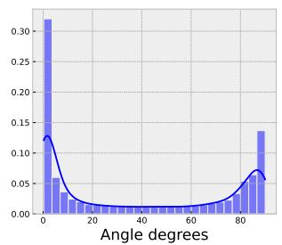

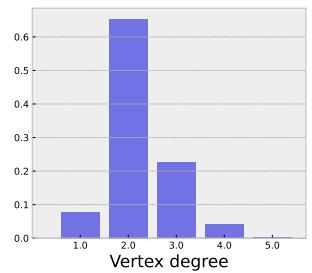

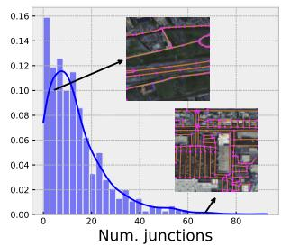  
Figure 2. Typical road network features (SpaceNet dataset). From left to right: (a) the distribution of angles between road segments leading to the same intersection is biased towards 0 and 90 degrees, i.e. parallel or perpendicular roads. The same also holds (b) for angles between random road pieces within a ground distance of 400 meters. (c) Most road vertices belong to a single road piece, with a degree of 2. (d) The average number of intersections for areas of 400×400 meters by ground distance.

In this work we manifest how RL fine-tuning can greatly benefit and boost performance when producing intricate geometric predictions. For the task of road layout detection, existing methods, in contrast, mostly rely on pixel-based segmentation models that are trained on masks produced by rasterizing ground truth graphs. Performing pixel-wise segmentation, though, ignores structural features and geometric constraints inherent to the problem. As a result, minimum differences in the pixel-level output domain can have significant consequences in the proposed graph, in terms of connectivity and path distances, as manifested by the often fragmented outputs obtained after running inference on these models. In order to address these significant drawbacks, we propose a new paradigm where we (i) directly generate outputs as spatial graphs and (ii) formalize the problem as a game where we sequentially construct the output by adding edges between key points. These key points can in principle come from any off-the-shelf detector that identifies road pieces with sufficient accuracy. Our generation process avoids having to resort to cumbersome postprocessing steps [8, 32] or optimize some surrogate objectives [30, 34] whose relation to the desired qualities of the final prediction can be disputed. Concurrently, the sequential decision-making strategy we propose enables us to focus interactively on different parts of the image, introducing the notion of a current state and producing reward estimates for a succession of actions. In essence, our method can be considered as a generalization of previous refinement techniques [8, 26] with three major advantages: (i) removal of the requirement for greedy decoding, (ii) ability to attend globally to the current prediction and selectively target parts of the image, and (iii) capacity to train based on demanding task-specific metrics.

More precisely, our contributions are the following:

• We propose a novel generic strategy for tuning autoregressive models that removes the requirement of decoding according to a pre-defined order and refines initial sampling probabilities via a tree search.

• We create a synthetic benchmark dataset of pixel-level accurate labels of overhead satellite images for the task of road network extraction. This gives us the ability to simulate complex scenarios with occluded regions, allowing us to demonstrate improved robustness.

• We confirm the wide applicability of our approach by improving the performance of existing methods on the popular SpaceNet and DeepGlobe datasets.

## 2. Related work

Initial attempts to extract road networks mainly revolved around handcrafted features and stochastic geometric models of roads [6]. Road layouts have specific characteristics regarding radiometry and topology e.g. particular junction distribution, certain general orientation, and curvature (see Fig. 2), that enable their detection even in cases with significant occlusion and uncertainty [19]. Modern approaches mostly formulate the road extraction task as a segmentation prediction task [27, 31, 3] by applying models such as Hourglass [37] or LinkNet [10]. This interpretation has significant drawbacks when evaluated against structural losses because of discontinuities in the predicted masks. Such shortcomings have been addressed by applying some additional post-processing steps, such as high-order conditional random fields [38, 65] or by training additional models that refine these initial predictions [29, 8]. Other common techniques include the optimization of an ensemble of losses. [13] rely on a directional loss and use non-maximal suppression as a thinning layer, while [8] calculate orientations of road segments. Although such auxiliary losses somewhat improve the output consistency, the fundamental issue of producing predictions in the pixel space persists. It remains impossible to overcome naturally occurring road structures, e.g. crossings of roads in different elevations, see Fig. 3.

Previous failure cases have led to more intuitive conceptualizations of the task. Roadtracer [7], iteratively builds a road network, similar to a depth-first search approach, while [13] learn a generative model for road layouts and then apply it as a prior on top of a segmentation prediction mask. Proposed graph-based approaches encode the road network directly as a graph, but either operate based on a constrained step-size [56] to generate new vertices or operate on a single step [18, 5], involving use-defined thresholding to post-process the final predictions. Most similar to our work, [26] predict locations of key points and define a specific order traversing them, as also done in [69]. Such autoregressive models have been recently successfully applied with the use of transformers [61] in a range of applications [36, 42, 43, 69] to model constraints between elements, where their supervised training explicitly requires tokens to be processed in a specific order. This specific order combined with the fact that only a surrogate training objective is used, introduces limitations, discussed further in the next section. In order to eliminate this order requirement and to optimize based on the desired metric, while attending globally to the currently generated graph, we propose to use RL as a suitable technique to tune these models.

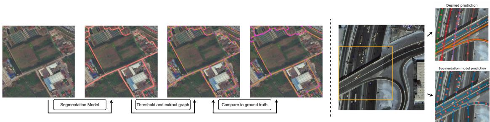  
Figure 3. (Left) Typical segmentation-based methods generate an output graph by thresholding a segmentation mask, which can however often lead to fragmented outputs. Predicting segmentation masks also makes it impossible (right) to capture complex road interactions, such as overlapping roads at different elevations.

RL has found success in the past in computer vision applications, we refer the interested reader to [24] for a comprehensive review. These approaches mainly use RL as an auxiliary unit with the goal of improving efficiency [68] or robustness [45]. We differ from these as we use RL to tune pre-trained models with the goal of aligning with a specified task-specific reward. Such tuning was concurrently shown to significantly boost performance for tasks such as object detection, among others [54].

## 3. Methodology

We parametrize a road network as a graph $\mathcal { G } = \{ \nu , \varepsilon \}$ with each vertex $v _ { i } \ = \ [ x _ { i } , y _ { i } ] ^ { \top } \ \in \ \mathcal { V }$ representing a key point on the road surface. The set of edges $( v _ { i } , v _ { j } ) \in \mathcal { E } _ { : }$ corresponds to road segments connecting these key points. We can then generate a probability distribution over roads by following a two-step process: i) generation of a set of vertices and ii) generation of a set of edges connecting them. Formally, for an image I, a road network R is derived as:

$$
\mathcal { R } = \mathop { \arg \operatorname* { m a x } } _ { \mathcal { V } , \mathcal { E } } P ( \mathcal { V } , \mathcal { E } \mid \mathcal { Z } ) = P ( \mathcal { E } \mid \mathcal { V } , \mathcal { Z } ) P ( \mathcal { V } \mid \mathcal { Z } ) .\tag{1}
$$

The graph nodes typically correspond to local information in an image, and we therefore resort to a CNN-based model to extract key points, providing the set $\mathcal { V } ^ { \prime } .$ , that sufficiently captures the information in the ground truth graph G. The construction of edges, however, requires higher-level reasoning that can cope with parallel roads, junctions, occlusions, or poor image resolution, among other difficulties.

Considering probabilistic models over sequences and using the chain rule, we can factorize the joint distribution as the product of a series of conditional distributions

$$
P ( \mathcal { E } \mid \mathcal { V } , \mathcal { Z } ; \sigma ) = \prod _ { n = 1 } ^ { N _ { \mathcal { E } } } P ( e _ { \sigma ( n ) } \mid e _ { < \sigma ( n ) } , \mathcal { V } , \mathcal { T } ) ,\tag{2}
$$

where $e _ { < \sigma ( n ) }$ represents $e _ { \sigma ( 1 ) } , e _ { \sigma ( 2 ) } , . . . , e _ { \sigma ( n - 1 ) }$ and $\sigma \in$ $S _ { N \varepsilon }$ denotes the set of all permutations of the integers $1 , 2 , \ldots , N _ { \mathcal { E } }$ , with $N _ { \mathcal { E } }$ the number of edges. For our work we consider the setting where these sequences are upper bounded in length, i.e. $N \varepsilon \leq N _ { \operatorname* { m a x } } ,$ since we are dealing with satellite images of fixed size. Autoregressive models (ARMs) have been used to solve similar tasks in the past by defining a fixed order of decoding [39, 59, 36, 42]. In our case, this would correspond to sorting all key points by their coordinates x and y and generating edges for each of them sequentially. We call this the autoregressive order. There are, however, two major drawbacks.

First, the evaluation metrics used for this task define a buffer region in which nodes in the ground truth and the predicted graph are considered to be a match. Therefore, a newly generated edge can be only partially correct when only partially overlapping with the ground truth graph. This non-smooth feedback comes in clear contrast to the supervised training scheme of ARMs, minimization of the neg ative log-likelihood, that assumes perfect information regarding the key points’ locations, i.e. that the sets V and $\mathcal { V } ^ { \prime }$ are the same. In practice, this condition is rarely met as the exact spatial graph can be represented in arbitrarily many ways by subdividing long edges into smaller ones or due to small perturbation to key points’ locations. It is thus imperative that our model can estimate the expected improvement of adding selected edges, which implicitly can also signal when to appropriately end the generation process.

Second, the requirement to decode according to the autoregressive order introduces a bias and limits the expressiveness of the model [58]. As a result, it can lead to failures in cases with blurry inputs or occlusions [26]. We employ RL to overcome these deficiencies and align the model with the required objective. In more detail, we tune an autoregressive model, described in Section 3.1, with the ability to search into sequences of actions in the future, as described in Section 3.2. Our novel generic strategy improves the autoregressive model without requiring significantly more computational resources.

## 3.1. Autoregressive model

We start by introducing a base autoregressive model, illustrated in Fig. 4. Given an image and a set of key points, i.e a set of vertices $\mathcal { V } ^ { \prime } { } _ { ; }$ , our model produces a graph by sequentially predicting a list of indices corresponding to the graph’s flattened, unweighted edge-list. Each forward pass produces probabilities over the set of key points, which leads to a new index after sampling. A successive pair of indices defines an edge as its two endpoints. A special endof-sequence token is reserved to designate the end of the generation process.

Following [63, 53], we begin by extracting visual features per key point, by interpolating intermediate layers of a ResNet backbone to the key points’ locations, which are further augmented by position encodings of their locations. We then further process these features using two Transformer modules. The first transformer (Transformer I in Fig. 4) encodes the raw features of the key points as embeddings. The second transformer (Transformer II in Fig. 4) takes as input the currently generated edge list sequence, corresponding to the currently partially generated graph. Edges are directly mapped to the embeddings of their comprising key points, supplemented by position and type embeddings, to differentiate between them, as shown in Fig. 5 (a). An additional global image embedding also extracted by the ResNet is used to initialize the sequence. The Transformer II module produces a single hidden state, which is linked with the $N _ { \mathcal { V } ^ { \prime } } + 1$ (corresponding to the provided key points, supplemented by the special end of the generation token) key points’ embeddings by a pointer network [62], via a dotproduct. This allows the generation of a probability distribution of variable length depending on the current set $\mathcal { V } ^ { \prime }$ instead of using a fixed action space.

## 3.2. Augmented search

In order to address the problems of greedy decoding (analyzed in Section 3), we frame our road extraction task as a classical Markov-decision process (MDP). The generation of a graph for every image defines an environment, where the length of the currently generated edge list determines the current step. Let $\mathbf { } o _ { t } , \alpha _ { t }$ and $r _ { t }$ correspond to the observation, the action, i.e. the selected key point index, and the observed reward respectively, at time step t. The aim is to search for a policy that maximizes the expected cumulative reward over a horizon T, i.e., $\operatorname* { m a x } _ { \pi } J ( \pi ) : =$ $\mathbb { E } _ { \pi } [ \sum _ { t = 0 } ^ { T - 1 } \gamma ^ { t } r _ { t } ]$ where $\gamma \in ( 0 , 1 ]$ indicates the discount factor and the expectation is with respect to the randomness in the policy and the transition dynamics. We set the discount factor to 1 due to the bounded time horizon.

Instead of training a reward model [41], we employ established graph-theoretic metrics that also allow the definition of intermediate rewards, accelerating initial training. More formally, each action leads to the selection of a new key point, with new edges being added once every two actions. The addition of a new edge leads to a revision of the predicted graph and triggers an intermediate reward

$$
r _ { t } = \mathrm { s c } ( \mathcal { G } _ { \mathrm { g t } } , \mathcal { G } _ { \mathrm { p r e d } _ { t } } ) - \mathrm { s c } ( \mathcal { G } _ { \mathrm { g t } } , \mathcal { G } _ { \mathrm { p r e d } _ { t - 1 } } ) ,\tag{3}
$$

where $\mathrm { s c } ( \mathcal { G } _ { \mathrm { g t } } , \mathcal { G } _ { \mathrm { p r e d } _ { t } } )$ is a similarity score between the ground truth graph $\mathcal { G } _ { \mathrm { g t } }$ and the current estimate $\mathcal { G } _ { \mathrm { p r e d } _ { t } }$ . Discussion of the specific similarity scores used in practice is postponed for Section 3.3.

A proper spatial graph generation entails (i) correct topology and (ii) accurate location prediction of individual roads. For the latter, intermediate vertices of degree 2 are essential. We call a road segment (RS), an ordered collection of edges, between vertices of degree $d ( . )$ two (or a collection of edges forming a circle):

$$
\begin{array} { r l } & { \mathrm { R S } = \{ ( \boldsymbol { v } _ { \mathrm { r s _ { 1 } } } , \boldsymbol { v } _ { \mathrm { r s _ { 2 } } } ) , \ldots , ( \boldsymbol { v } _ { \mathrm { r s } _ { k - 1 } } , \boldsymbol { v } _ { \mathrm { r s } _ { k } } ) \} } \\ & { \mathrm { s } . \mathrm { t } ( \boldsymbol { v } _ { \mathrm { r s _ { i } } } , \boldsymbol { v } _ { \mathrm { r s } _ { i + 1 } } ) \in \mathcal { E } \mathrm { f o r } i = 1 , \ldots , k - 1 } \\ & { d ( \boldsymbol { v } _ { \mathrm { r s _ { i } } } ) = 2 , \mathrm { f o r } i = 2 , \ldots k - 1 , } \\ & { \left( d ( \boldsymbol { v } _ { \mathrm { r s _ { 1 } } } ) \neq 2 \mathrm { a n d } d ( \boldsymbol { v } _ { \mathrm { r s } _ { k } } ) \neq 2 \mathrm { o r } \boldsymbol { v } _ { \mathrm { r s _ { 1 } } } = \boldsymbol { v } _ { \mathrm { r s } _ { k } } \right) . } \end{array}
$$

During the progression of an episode (i.e. the sequential generation of a graph), the topological nature of the similarity scores in Eq. 3 implies that the effect of each new edge to the reward will be reflected mostly once its whole corresponding road segment has been generated. To resolve the ambiguity in the credit assignment and allow our agent to look ahead into sequences of actions, we rely on Monte Carlo Tree Search (MCTS) to simulate entire sequences of actions. We use a state-of-the-art search-based agent, MuZero [48], that constructs a learnable model of the environment dynamics, simulating transitions in this latent representation and leading to significant computational benefits. At every step, the enhanced model with its new components produces value [50] and reward estimates, which define an exploration strategy. Simulations into future sequences of actions are performed based on this strategy, helping the model to make decisions based on future outcomes, not yet experienced. Compared to a simpler PPO objective [49, 41], that in our experience did not lead to significant improvements, MCTS generates a series of simulations traversing the tree from a root node, generating more stable value and reward estimates. MuZero requires three distinct parts (see also Fig. 5):

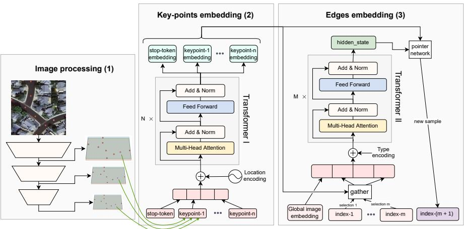  
Figure 4. The autoregressive model with its three main components. (1) A backbone image model (ResNet) that extracts features for each key point at different scales, along with a global image embedding. (2) A key point model embeds visual and location features of distinct key points. (3) An edge embedding model relates the current edge sequence with the respective key points. Each edge token (signalled with the tokens ‘index-i’) corresponds to an index specifying the respective key point. A pair of such tokens designates an edge as its two endpoints. At the end of (3) we obtain a new distribution over key points that leads to an incremental update to the graph, after sampling.

1. A representation function $f$ creates a latent vector of the current state $\begin{array} { r } { \begin{array} { r c l } { h _ { t } } & { = } & { f _ { \theta } ( \sigma _ { t } ) } \end{array} } \end{array}$ , in our case the autoregressive model, shown in Fig. 4. Our current latent representation $h _ { t }$ contains the graph’s hidden state along with the key points’ embeddings used to map actions to latent vectors. As key points remain the same throughout the episode, image-based features (Components (1) and (2) in Fig. 4) are only computed once.

2. A dynamics network $^ { g , }$ we use a simple LSTM [20], as commonly done, that predicts the effect of a new action by predicting the next hidden state and the expected reward: $( \hat { h } _ { t } , \hat { r } _ { t } ) = g _ { \theta } ( \tilde { h } _ { t - 1 } , \alpha _ { t } )$ . We can replace $\tilde { h } _ { t - 1 }$ with the latent representation $\boldsymbol { h } _ { t - 1 }$ , or its previous computed approximation $\hat { h } _ { t - 1 }$ for tree search of depth larger than 1.

3. A prediction network $\psi ,$ , that estimates the policy and the value for the current state $( p _ { t + 1 } , v _ { t } ) = \psi _ { \theta } ( \tilde { h _ { t } } )$ . We compute the policy via a pointer network as described in Section 3.1. Value estimates are produced by a simple multi-layer perceptron.

The dynamics network guides the search and evaluates the expected reward of actions. For every newly generated edge, we also explicitly inform the network regarding the creation of new intersections and the expected relative change in the overall road surface generated via embeddings (see Fig. 5). By using the dynamics network, we bypass the expensive call to the decoder module during the search, and can instead approximate small modifications in the latent representation directly. For our experiments, the dynamics network requires up to 90 times less floating-point operations to simulate trajectories, compared to using the edge embeddings’ decoder. Effectively, our method does not involve significantly more computation budget compared to the base autoregressive model. More details regarding the MuZero training and exploration are provided in Section 4 and in the appendix.

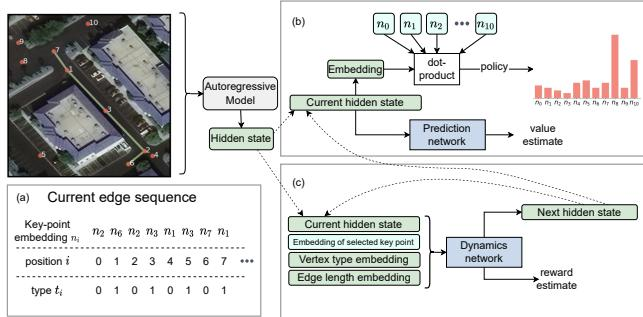  
Figure 5. The autoregressive model generates a hidden state corresponding to the graph embedding. (a) When doing so, the edge decoder directly attends to the input key points’ embeddings, augmented by position and type embeddings. (b) The prediction network uses the hidden state to produce value and policy predictions. A pointer network allows an intuitive scale of the action space by the number of key points. (c) The dynamics network simulates trajectories by estimating new hidden states and rewards. For newly generated edges, it takes as input the embeddings of the new key points, but also the degree of the two vertices involved and the length of the newly proposed generated edge.

## 3.3. Evaluation metrics

We adopt the same evaluation metrics both as a comparison between different methods and to determine the reward for our agent, through Eq. 3. We use the relaxed versions of precision, recall, and intersection over union for pixel-level predictions Correctness/Completeness/Quality (CCQ) [66, 64]. As graph-theoretic metrics we use APLS [60] and additionally include new metrics introduced in [14] that compare Paths, Junctions and Sub-graphs of the graphs in question, producing respectively precision, recall and $f _ { 1 }$ scores. More details can be found in the appendix.

## 4. Experiments

Implementation details. We resize images to $3 0 0 \times 3 0 0$ pixels, standardizing according to the training set statistics. For exploration, we initialize workers using Ray [33] that execute episodes in the environment. For training, we unroll the dynamics function for $t _ { d } ~ = ~ 5$ steps and use priority weights for the episode according to the differences between predicted and target values. Our algorithm can be considered as an approximate on-policy TD(λ) [55] due to the relatively small replay buffer. We reanalyse older games [48] to provide fresher target estimates. Unvisited graph nodes are selected based on an upper confidence score, balancing exploration with exploitation, similar to [51]. We add exploration noise as Dirichlet noise and select actions based on a temperature-controlled sampling procedure, whose temperature is reduced during training.

Given the limited high-quality available ground truth labels [52] and to accelerate training, we employ modifications introduced in EfficientZero [71]. We investigate adding supervision to the environment model and better initialize Q-value predictions similar to the implementation of Elf OpenGo [57]. We further scale values and rewards using an invertible transform inspired by [44]. Here, we predict support, as fully connected networks are biased towards learning low-frequency representations [21]. Selecting new actions involves generating simulations that can be done expeditiously given the small dimension of the latent space and the modest size of the dynamics network. Finally, to generate key points, we skeletonize segmentation masks provided by any baseline segmentation model, by thresholding the respective segmentation masks produced and applying RDP-simplification [17, 46]. Selecting an appropriate threshold and subdividing larger edges guarantees that the generated set $\mathcal { V } ^ { \prime }$ adequately captures most of the ground truth road network, leaving the complexity of the problem for our model to handle. We will use the term ARM to denote the autoregressive model and Ours for the RL-tuned model.

## 4.1. Synthetic dataset

Initially, a simplified setting is chosen wherein the complete governance of both the nature and intensity of the difficulty inherent in the road-extraction task can be regulated. We generate a dataset of overhead satellite images of a synthetic town using CityEngine1. We randomly specify vegetation of varying height and width along the side walks of the generated streets, leading inadvertently to occlusions of varying difficulty. The simulated environment allows specifying pixel-perfect masks regarding both roads and trees occluding the road surface based on the provided camera parameters [23]. We defer more details regarding the generation process and dataset examples to the supplementary material.

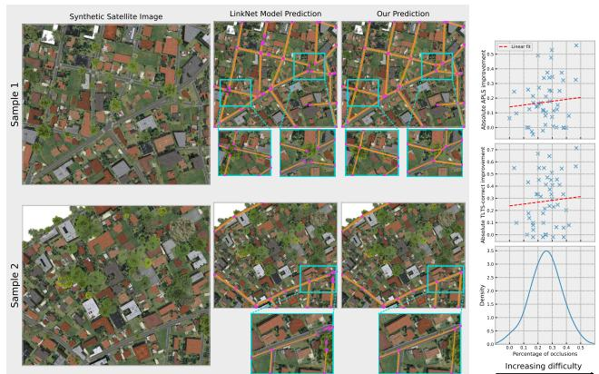  
Figure 6. (Left) Examples of fragmented outputs from the LinkNet model under cases of significant occlusion and how our approach performs in these demanding circumstances. (Right) The performance gap between our method and the same baseline is wide, based on topological spatial graph metrics, for a wide range of difficulties in the images. More details and examples are given in the supplementary material.

We compare our method by training on our dataset a LinkNet model [10], a popular segmentation model that has been widely used in the remote sensing community [25]. Even in this synthetic and thus less diverse scenario, the deficiency of segmentation models to rely mostly on local information, with no explicit ability for longer-range interactions, is evident. Fig. 6 illustrates examples of such oversegmented predictions and how our approach can improve on them. We also define a ‘difficulty’ attribute per synthetic satellite image, quantifying the occlusions as a percentage of the ground truth road mask covered. We observe a considerable absolute improvement in topological metric scores when training our model on this synthetic dataset, compared to the baseline, for varying image difficulty.

## 4.2. Real datasets

We assess our approach on the SpaceNet and DeepGlobe datasets. A single image is provided to our method, with a spatial graph being generated as the output. We use the same train-test splits as in [8] to promote reproducibility, while results are reported for the final combined graph on the original image scale. No pre-training on the synthetic

<table><tr><td rowspan="2"></td><td rowspan="2">Method</td><td rowspan="2">corr. ↑</td><td colspan="2">CCQ</td><td rowspan="2">TLTS 2l+2s ↓</td><td rowspan="2">APLS↑</td><td rowspan="2"></td><td colspan="2">Path-Based</td><td rowspan="2">Junction-Based rec. ↑ f1 ↑</td><td rowspan="2">Sub-graph-Based f1↑</td></tr><tr><td>comp. ↑ qual. ↑</td><td>corr. ↑</td><td>pre. ↑ rec. ↑</td><td>fl↑ pre. ↑</td></tr><tr><td rowspan="7">SpdaeNet</td><td>DeepRoadMapper [29]</td><td>0.6943</td><td>0.6838</td><td>0.5386</td><td>0.4110 0.1012</td><td>0.5143</td><td>0.5958 0.6400</td><td>0.6171</td><td>0.6293</td><td>0.7443 0.6820</td><td>0.6783</td></tr><tr><td>Segmentation [28, 22]</td><td>0.7493</td><td>0.7094</td><td>0.5969</td><td>0.4143 0.0828</td><td>0.5454</td><td>0.6909</td><td>0.6863 0.6885</td><td>0.7186</td><td>0.7710 0.7438</td><td>0.7117</td></tr><tr><td>LinkNet [10]</td><td>0.8100</td><td>0.7449</td><td>0.6409</td><td>0.4894 0.0743</td><td>0.5743</td><td>0.6719</td><td>0.6460 0.6586</td><td>0.6985</td><td>0.7809 0.7374</td><td>0.7576</td></tr><tr><td>Orientation [8]</td><td>0.8070</td><td>0.8001</td><td>0.6862</td><td>0.5594 0.0884</td><td>0.6315</td><td>0.7175</td><td>0.7280 0.7227</td><td>0.7552</td><td>0.7591 0.7571</td><td>0.7802</td></tr><tr><td>Sat2Graph [18]**</td><td>0.6917</td><td>0.7351</td><td>0.5734</td><td>0.5802 0.1104</td><td>0.5951</td><td>0.5952</td><td>0.5416 0.5671</td><td>0.7474</td><td>0.5951 0.6626</td><td>0.7180</td></tr><tr><td>SPIN road mapper [5]</td><td>0.7837</td><td>0.7988</td><td>0.6621</td><td>0.5922 0.1058</td><td>0.6422</td><td>0.7276</td><td>0.7265</td><td>0.7270 0.7621</td><td>0.7827 0.7722</td><td>0.7837</td></tr><tr><td>Ours</td><td>0.8150</td><td>0.8092</td><td>0.6932</td><td>0.5970 0.0732</td><td>0.6587</td><td>0.7383</td><td>0.7613</td><td>0.7496 0.7845</td><td>0.7821 0.7833</td><td>0.7948</td></tr><tr><td colspan="2">LinkNet [10]</td><td>0.8012</td><td>0.8676</td><td>0.7328</td><td>0.6640</td><td>0.6525</td><td></td><td>0.6882 0.6920 0.6901</td><td></td><td>0.74440.7558</td><td>0.7879</td></tr><tr><td colspan="2"></td><td></td><td></td><td></td><td></td><td>0.0804</td><td></td><td></td><td></td><td>0.7675</td><td></td></tr><tr><td colspan="2">Deep Gobe Orientation [8] Ours*</td><td>0.8243 0.8223</td><td>0.8857 0.8979</td><td>0.7545 0.7494</td><td>0.6866 0.7242</td><td>0.1047 0.0743</td><td>0.7012 0.7400</td><td>0.6937 0.8082 0.71500.8274 0.7671</td><td>0.7465</td><td>0.7624 0.7939 0.7778 0.7912 0.8283 0.8093</td><td>0.8282 0.8391</td></tr></table>

\* We do not fine-tune our model on the DeepGlobe dataset but instead refine predictions standardizing according to train dataset statistics  
\*\* The authors provided predictions corresponding only to a center crop of the original SpaceNet dataset images. Also, note that the test set is different from the one reported on the rest of the methods, see also the appendix. Blue: best score, Green: second best score, Gray: results reported in different test set

Table 1. Quantitative results for the SpaceNet and DeepGlobe datasets.  
DeepRoadMapper [29]  
Segmentation [22]  
Orientation [8]  
Ours  
Ground Truth  
Satellite Image  
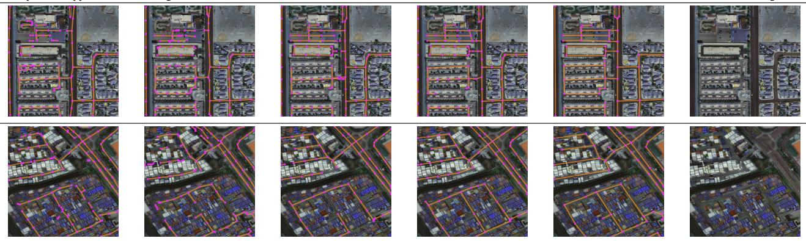  
Table 2. Qualitative results of improved connectivity. We recommend zooming in for more details.

Table 3. APLS metric and perplexity (bits of information per edge) results for the SpaceNet dataset with provided key points that adequately capture the ground truth graph. Autoregressive order is defined in Section 3, while random order entails random permutation between edges and the order of key points within edges. To calculate perplexity for our method we use the initial predicted policy distribution, without any additional search. More details on baselines and general approach are presented in the appendix.

<table><tr><td rowspan=1 colspan=1> $\widehat { \mathrm { M e t r i c } } \overbrace { \mathrm { \Lambda } \mathrm { M e t h o d } } ^ { \mathrm { M e t h o d } }$ </td><td rowspan=1 colspan=1>Random Cls GCN</td><td rowspan=1 colspan=1>ARM Ours</td></tr><tr><td rowspan=1 colspan=1>APLS</td><td rowspan=1 colspan=1>0.008 0.4300.594</td><td rowspan=1 colspan=1>0.894 0.928</td></tr><tr><td rowspan=1 colspan=1>Bits per edge: Autoregressive orderBits per edge: Random order</td><td rowspan=1 colspan=1>8.743          18.743</td><td rowspan=1 colspan=1>0.5284.32128.744.432</td></tr></table>

dataset takes place.

## 4.2.1 Comparison to Baselines

We initially train the ARM model on ground-truth graph information by using a set of key points $\mathcal { V } ^ { \prime } = \mathcal { V }$ . Even in this scenario, RL tuning increases the semantic quality of the extracted graphs as seen in Table 3. In cases where the set V′ is imperfect, and for reasons elaborated in Section 3, newly proposed edges may be only partially correct. Under such circumstances, supervised training is infeasible, hence we rely on RL to produce the graph that leads to the maximum cumulative reward, i.e. our selected evaluation metrics. We conduct comparative analysis against the following approaches; we explore powerful CNN architectures, by training a Segmentation model with a ResNet backbone. We evaluate DeepRoadMapper [29], a model that refines previous segmentation by adding connections along possible identified paths. As done by [8] we notice that in complex scenarios, the effect of this post-processing step is not always positive. We also evaluate against LinkNet [10], and Orientation [8], which is trained to predict simultaneously road surfaces and orientation, and the relevant baselines [18, 5].

Quantitative results in Table 1 and visual inspection in Table 2, affirm that the global context and the gradual generation incite a better understanding of the scene, lead ing to consistently outperforming topological metric results compared to the baselines. We remark that our predictions are more topologically consistent with fewer shortcomings, such as double roads, fragmented roads, and overconnections. This is further supplemented by comparing the statistics of the predicted spatial graphs in Fig. 7. We further showcase the transferability of our model by employing it with no fine-tuning (apart from dataset-specific image normalization) on the DeepGlobe dataset. We can refine previous predictions by adding missing edges, leading to more accurate spatial graph predictions, as shown in Table 1. Our conjecture that road structures and their geometric features exhibit a high degree of recurrence across various locations and geographic regions worldwide is thus confirmed.

Distance between Intersections (meters)  
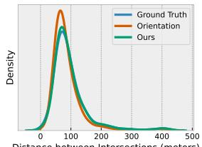

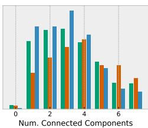

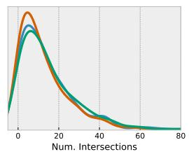

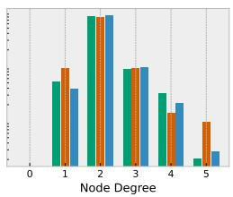

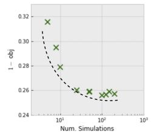  
Figure 7. (Left) Comparison of generated graph statistics, following the same post-processing, averaged across regions of 400×400 meters in ground distance. Orientation refers to the method of [8]. (Right) The estimated Pareto front achieved through the evaluation of various runs, where a different number of MCTS simulations is being executed at each state. obj refers to an average of the APLS, Path-basedf1, Junction-basedf1 and Sub-graph-basedf1 metrics.

## 4.2.2 Ablation study

We experimented attending to image features for the two transformer modules by extracting per-patch visual features from the conditioning image $H ^ { \mathrm { i m g } } = [ h _ { 1 } ^ { \mathrm { i m g } } , h _ { 2 } ^ { \mathrm { i m g } } , \ldots ]$ , as done in the Vision Transformer [16]. This did not lead to significant improvements, which we attribute to over-fitting. In Table. 4 we highlight the relative importance of some additional components for the final predictions. As efficiency is also of particular importance to us, we further visualize the effect of varying the simulation depth of the dynamics network during training (Fig. 7 (right)). Surprisingly perhaps, our method performs consistently even with a limited number of simulations.

In the appendix, we provide incremental results for the task of predicting road networks based on an optimal set of key points and insights concerning interpretability and further comparison to baselines based on the varying difficulty of the predicted underlying road networks. We also give more information regarding the generation of the synthetic dataset and the model architecture. Finally, we provide more implementation decisions, including details on exactly how key points and generated and how individual patch-level predictions are fused together. It is important to emphasize that our proposed method can operate effectively even when working with partially initialized predictions, making it a practical refinement approach that can be applied to existing baselines. By initializing our model based on the ARM model, we can achieve a rapid fine-tuning phase. Additionally, by utilizing the learned environment model, which avoids the need for expensive calls to the edge embedding model at each simulation step in MCTS, we can train the model even using a single GPU.

<table><tr><td>Model</td><td>APLS</td><td>P-f1</td><td>J-f1</td><td>S-f1</td></tr><tr><td>Ours</td><td>0.6587</td><td>0.7496</td><td>0.7833</td><td>0.7948</td></tr><tr><td>– autoregressive pre-training</td><td>-15.3%</td><td>-13.7%</td><td>-14.1%</td><td>-13.3%</td></tr><tr><td>– visual features for key-points</td><td>-13.4%</td><td>-12.7%</td><td>-12.1%</td><td>-12.3%</td></tr><tr><td>– tree-search during evaluation</td><td>-2.1%</td><td>-1.4%</td><td>-1.7%</td><td>-1.1%</td></tr><tr><td>+ cross attend to image features</td><td>+0.2%</td><td>-0.4%</td><td>-0.7%</td><td>-0.3%</td></tr></table>

P: Path-based, J: Junction-based, S: Sub-graph-based

Table 4. Ablations study on SpaceNet dataset.

## 5. Conclusions

We presented a reinforcement learning framework for tuning autoregressive tasks for the task of generating a graph as a variable-length edge sequence, where a structured-aware decoder selects new edges by simulating action sequences into the future. Importantly, this allows the model to better capture the geometry of the targeted objects. One advantage of the proposed method is that the reward function is based on (non-continuous) metrics that are directly connected to the application in question. Our approach does not require significantly more computational resources compared to state-of-the-art supervised approaches, and in addition, it can be used to refine predictions from another given model. We also remark that the direct prediction of a graph enables the concurrent prediction of meta-information about the edges, including, for instance, the type of road (e.g. highway, primary or secondary street, biking lane).

Our approach opens the door to several directions for future work. For example, we have assumed that a pre-defined model gives the location of key points, but one could instead augment the action space to propose new key points’ locations. Other promising directions include the direct prediction of input-dependent graph primitives, e.g. T-junctions or roundabouts. Finally, we emphasize that our approach is suitable for a wide variety of applications where autoregressive models are typically used, which we intend to look into in the future. Such applications include among others, Scene Graph Generation [67, 70] and Visual reasoning/Factual Visual Question Answering [11, 35].

## 6. Reproducibility Statement

We have taken multiple steps to ensure the reproducibility of the experiments. We refer the reader to the appendix for a complete description of the training protocol. We have also released the code as part of the supplementary material.

## References

[1] Samira Abnar and Willem Zuidema. Quantifying attention flow in transformers. arXiv preprint arXiv:2005.00928, 2020.

[2] David Acuna, Amlan Kar, and Sanja Fidler. Devil is in the edges: Learning semantic boundaries from noisy annotations. In Proceedings ofthe IEEE/CVF Conference on Computer Vision and Pattern Recognition, pages 11075–11083, 2019.

[3] Nicolas Audebert, Bertrand Le Saux, and Sebastien Lef ´ evre.\` Joint learning from earth observation and openstreetmap data to get faster better semantic maps. In Proceedings of the IEEE Conference on Computer Vision and Pattern Recognition Workshops, pages 67–75, 2017.

[4] Yuntao Bai, Andy Jones, Kamal Ndousse, Amanda Askell, Anna Chen, Nova DasSarma, Dawn Drain, Stanislav Fort, Deep Ganguli, Tom Henighan, et al. Training a helpful and harmless assistant with reinforcement learning from human feedback. arXiv preprint arXiv:2204.05862, 2022.

[5] Wele Gedara Chaminda Bandara, Jeya Maria Jose Valanarasu, and Vishal M Patel. Spin road mapper: Extracting roads from aerial images via spatial and interaction space graph reasoning for autonomous driving. In 2022 International Conference on Robotics and Automation (ICRA), pages 343–350. IEEE, 2022.

[6] Meir Barzohar and David B Cooper. Automatic finding of main roads in aerial images by using geometric-stochastic models and estimation. IEEE Transactions on Pattern Analysis and Machine Intelligence, 18(7):707–721, 1996.

[7] Favyen Bastani, Songtao He, Sofiane Abbar, Mohammad Alizadeh, Hari Balakrishnan, Sanjay Chawla, Sam Madden, and David DeWitt. Roadtracer: Automatic extraction of road networks from aerial images. In Proceedings of the IEEE Conference on Computer Vision and Pattern Recognition, pages 4720–4728, 2018.

[8] Anil Batra, Suriya Singh, Guan Pang, Saikat Basu, CV Jawahar, and Manohar Paluri. Improved road connectivity by joint learning of orientation and segmentation. In Proceedings of the IEEE/CVF Conference on Computer Vision and Pattern Recognition, pages 10385–10393, 2019.

[9] Cameron B Browne, Edward Powley, Daniel Whitehouse, Simon M Lucas, Peter I Cowling, Philipp Rohlfshagen, Stephen Tavener, Diego Perez, Spyridon Samothrakis, and Simon Colton. A survey of monte carlo tree search methods. IEEE Transactions on Computational Intelligence and AI in games, 4(1):1–43, 2012.

[10] Abhishek Chaurasia and Eugenio Culurciello. Linknet: Exploiting encoder representations for efficient semantic segmentation. In 2017 IEEE Visual Communications and Image Processing (VCIP), pages 1–4. IEEE, 2017.

[11] Xinlei Chen, Li-Jia Li, Li Fei-Fei, and Abhinav Gupta. Iterative visual reasoning beyond convolutions. In Proceedings of the IEEE conference on computer vision and pattern recognition, pages 7239–7248, 2018.

[12] Benjamin E Childs, James H Brodeur, and Levente Kocsis. Transpositions and move groups in monte carlo tree search. In 2008 IEEE Symposium On Computational Intelligence and Games, pages 389–395. IEEE, 2008.

[13] Hang Chu, Daiqing Li, David Acuna, Amlan Kar, Maria Shugrina, Xinkai Wei, Ming-Yu Liu, Antonio Torralba, and Sanja Fidler. Neural turtle graphics for modeling city road layouts. In Proceedings of the IEEE/CVF International Conference on Computer Vision, pages 4522–4530, 2019.

[14] Leonardo Citraro, Mateusz Kozinski, and Pascal Fua. To-´ wards reliable evaluation of algorithms for road network reconstruction from aerial images. In European Conference on Computer Vision, pages 703–719. Springer, 2020.

[15] Ilke Demir, Krzysztof Koperski, David Lindenbaum, Guan Pang, Jing Huang, Saikat Basu, Forest Hughes, Devis Tuia, and Ramesh Raskar. Deepglobe 2018: A challenge to parse the earth through satellite images. In Proceedings of the IEEE Conference on Computer Vision and Pattern Recognition Workshops, pages 172–181, 2018.

[16] Alexey Dosovitskiy, Lucas Beyer, Alexander Kolesnikov, Dirk Weissenborn, Xiaohua Zhai, Thomas Unterthiner, Mostafa Dehghani, Matthias Minderer, Georg Heigold, Sylvain Gelly, et al. An image is worth 16x16 words: Transformers for image recognition at scale. arXiv preprint arXiv:2010.11929, 2020.

[17] David H Douglas and Thomas K Peucker. Algorithms for the reduction of the number of points required to represent a digitized line or its caricature. Cartographica: the international journal for geographic information and geovisualization, 10(2):112–122, 1973.

[18] Songtao He, Favyen Bastani, Satvat Jagwani, Mohammad Alizadeh, Hari Balakrishnan, Sanjay Chawla, Mohamed M Elshrif, Samuel Madden, and Mohammad Amin Sadeghi. Sat2graph: Road graph extraction through graph-tensor encoding. In European Conference on Computer Vision, pages 51–67. Springer, 2020.

[19] Stefan Hinz and Albert Baumgartner. Automatic extraction of urban road networks from multi-view aerial imagery. IS-PRS journal of photogrammetry and remote sensing, 58(1- 2):83–98, 2003.

[20] Sepp Hochreiter and Jurgen Schmidhuber. Long short-term¨ memory. Neural computation, 9(8):1735–1780, 1997.

[21] Arthur Jacot, Franck Gabriel, and Clement Hongler. Neu-´ ral tangent kernel: Convergence and generalization in neural networks. arXiv preprint arXiv:1806.07572, 2018.

[22] Pascal Kaiser, Jan Dirk Wegner, Aurelien Lucchi, Martin´ Jaggi, Thomas Hofmann, and Konrad Schindler. Learning aerial image segmentation from online maps. IEEE Transactions on Geoscience and Remote Sensing, 55(11):6054– 6068, 2017.

[23] Fanjie Kong, Bohao Huang, Kyle Bradbury, and Jordan Malof. The synthinel-1 dataset: a collection of high resolution synthetic overhead imagery for building segmentation.

In Proceedings of the IEEE/CVF Winter Conference on Applications of Computer Vision, pages 1814–1823, 2020.

[24] Ngan Le, Vidhiwar Singh Rathour, Kashu Yamazaki, Khoa Luu, and Marios Savvides. Deep reinforcement learning in computer vision: a comprehensive survey. Artificial Intelligence Review, pages 1–87, 2021.

[25] Yuxia Li, Bo Peng, Lei He, Kunlong Fan, and Ling Tong. Road segmentation of unmanned aerial vehicle remote sensing images using adversarial network with multiscale context aggregation. IEEE Journal of Selected Topics in Applied Earth Observations and Remote Sensing, 12(7):2279–2287, 2019.

[26] Zuoyue Li, Jan Dirk Wegner, and Aurelien Lucchi. Topolog-´ ical map extraction from overhead images. In Proceedings ofthe IEEE/CVF International Conference on Computer Vision, pages 1715–1724, 2019.

[27] Renbao Lian, Weixing Wang, Nadir Mustafa, and Liqin Huang. Road extraction methods in high-resolution remote sensing images: A comprehensive review. IEEE Journal of Selected Topics in Applied Earth Observations and Remote Sensing, 13:5489–5507, 2020.

[28] Jonathan Long, Evan Shelhamer, and Trevor Darrell. Fully convolutional networks for semantic segmentation. In Proceedings of the IEEE conference on computer vision and pattern recognition, pages 3431–3440, 2015.

[29] Gellert M´ attyus, Wenjie Luo, and Raquel Urtasun. Deep-´ roadmapper: Extracting road topology from aerial images. In Proceedings of the IEEE International Conference on Computer Vision, pages 3438–3446, 2017.

[30] Gellert M´ attyus and Raquel Urtasun. Matching adversarial´ networks. In Proceedings of the IEEE Conference on Computer Vision and Pattern Recognition, pages 8024–8032, 2018.

[31] Gellert Mattyus, Shenlong Wang, Sanja Fidler, and Raquel Urtasun. Enhancing road maps by parsing aerial images around the world. In Proceedings of the IEEE international conference on computer vision, pages 1689–1697, 2015.

[32] Javier A Montoya-Zegarra, Jan D Wegner, L’ubor Ladicky,\` and Konrad Schindler. On the evaluation of higher-order cliques for road network extraction. In 2015 Joint Urban Remote Sensing Event (JURSE), pages 1–4. IEEE, 2015.

[33] Philipp Moritz, Robert Nishihara, Stephanie Wang, Alexey Tumanov, Richard Liaw, Eric Liang, William Paul, Michael I Jordan, and Ion Stoica. Ray: A distributed framework for emerging ai applications. corr abs/1712.05889 (2017). arXiv preprint arXiv:1712.05889, 2017.

[34] Agata Mosinska, Pablo Marquez-Neila, Mateusz Kozinski,´ and Pascal Fua. Beyond the pixel-wise loss for topologyaware delineation. In Proceedings of the IEEE conference on computer vision and pattern recognition, pages 3136–3145, 2018.

[35] Medhini Narasimhan, Svetlana Lazebnik, and Alexander Schwing. Out of the box: Reasoning with graph convolution nets for factual visual question answering. Advances in neural information processing systems, 31, 2018.

[36] Charlie Nash, Yaroslav Ganin, SM Ali Eslami, and Peter Battaglia. Polygen: An autoregressive generative model of

3d meshes. In International Conference on Machine Learning, pages 7220–7229. PMLR, 2020.

[37] Alejandro Newell, Kaiyu Yang, and Jia Deng. Stacked hourglass networks for human pose estimation. In European conference on computer vision, pages 483–499. Springer, 2016.

[38] Joachim Niemeyer, Jan Dirk Wegner, Clement Mallet, Franz´ Rottensteiner, and Uwe Soergel. Conditional random fields for urban scene classification with full waveform lidar data. In ISPRS Conference on Photogrammetric Image Analysis, pages 233–244. Springer, 2011.

[39] Aaron van den Oord, Nal Kalchbrenner, Oriol Vinyals, Lasse¨ Espeholt, Alex Graves, and Koray Kavukcuoglu. Conditional image generation with pixelcnn decoders. In Proceedings of the 30th International Conference on Neural Information Processing Systems, pages 4797–4805, 2016.

[40] OpenStreetMap contributors. Planet dump retrieved from https://planet.osm.org https: //www.openstreetmap.org, 2017.

[41] Long Ouyang, Jeff Wu, Xu Jiang, Diogo Almeida, Carroll L Wainwright, Pamela Mishkin, Chong Zhang, Sandhini Agarwal, Katarina Slama, Alex Ray, et al. Training language models to follow instructions with human feedback. arXiv preprint arXiv:2203.02155, 2022.

[42] Wamiq Para, Paul Guerrero, Tom Kelly, Leonidas J Guibas, and Peter Wonka. Generative layout modeling using constraint graphs. In Proceedings of the IEEE/CVF International Conference on Computer Vision, pages 6690–6700, 2021.

[43] Wamiq Reyaz Para, Shariq Farooq Bhat, Paul Guerrero, Tom Kelly, Niloy Mitra, Leonidas Guibas, and Peter Wonka. Sketchgen: Generating constrained cad sketches. arXiv preprint arXiv:2106.02711, 2021.

[44] Tobias Pohlen, Bilal Piot, Todd Hester, Mohammad Gheshlaghi Azar, Dan Horgan, David Budden, Gabriel Barth-Maron, Hado Van Hasselt, John Quan, Mel Vecerˇ ´ık, et al. Observe and look further: Achieving consistent performance on atari. arXiv preprint arXiv:1805.11593, 2018.

[45] Pengda Qin, Weiran Xu, and William Yang Wang. Robust distant supervision relation extraction via deep reinforcement learning. arXiv preprint arXiv:1805.09927, 2018.

[46] Urs Ramer. An iterative procedure for the polygonal approximation of plane curves. Computer graphics and image processing, 1(3):244–256, 1972.

[47] Abdallah Saffidine, Tristan Cazenave, and Jean Mehat. Ucd:´ Upper confidence bound for rooted directed acyclic graphs. Knowledge-Based Systems, 34:26–33, 2012.

[48] Julian Schrittwieser, Ioannis Antonoglou, Thomas Hubert, Karen Simonyan, Laurent Sifre, Simon Schmitt, Arthur Guez, Edward Lockhart, Demis Hassabis, Thore Graepel, et al. Mastering atari, go, chess and shogi by planning with a learned model. Nature, 588(7839):604–609, 2020.

[49] John Schulman, Filip Wolski, Prafulla Dhariwal, Alec Radford, and Oleg Klimov. Proximal policy optimization algorithms. arXiv preprint arXiv:1707.06347, 2017.

[50] David Silver, Hado Hasselt, Matteo Hessel, Tom Schaul, Arthur Guez, Tim Harley, Gabriel Dulac-Arnold, David Reichert, Neil Rabinowitz, Andre Barreto, et al. The predictron:

End-to-end learning and planning. In International Conference on Machine Learning, pages 3191–3199. PMLR, 2017.

[51] David Silver, Thomas Hubert, Julian Schrittwieser, Ioannis Antonoglou, Matthew Lai, Arthur Guez, Marc Lanctot, Laurent Sifre, Dharshan Kumaran, Thore Graepel, et al. A general reinforcement learning algorithm that masters chess, shogi, and go through self-play. Science, 362(6419):1140– 1144, 2018.

[52] Suriya Singh, Anil Batra, Guan Pang, Lorenzo Torresani, Saikat Basu, Manohar Paluri, and CV Jawahar. Selfsupervised feature learning for semantic segmentation of overhead imagery. In BMVC, volume 1, page 4, 2018.

[53] Edward J Smith, Scott Fujimoto, Adriana Romero, and David Meger. Geometrics: Exploiting geometric structure for graph-encoded objects. arXiv preprint arXiv:1901.11461, 2019.

[54] Andre Susano Pinto, Alexander Kolesnikov, Yuge Shi, Lucas´ Beyer, and Xiaohua Zhai. Tuning computer vision models with task rewards. arXiv e-prints, pages arXiv–2302, 2023.

[55] Richard S Sutton and Andrew G Barto. Reinforcement learning: An introduction. MIT press, 2018.

[56] Yong-Qiang Tan, Shang-Hua Gao, Xuan-Yi Li, Ming-Ming Cheng, and Bo Ren. Vecroad: Point-based iterative graph exploration for road graphs extraction. In Proceedings of the IEEE/CVF Conference on Computer Vision and Pattern Recognition, pages 8910–8918, 2020.

[57] Yuandong Tian, Jerry Ma, Qucheng Gong, Shubho Sengupta, Zhuoyuan Chen, James Pinkerton, and Larry Zitnick. Elf opengo: An analysis and open reimplementation of alphazero. In International Conference on Machine Learning, pages 6244–6253. PMLR, 2019.

[58] Benigno Uria, Iain Murray, and Hugo Larochelle. A deep and tractable density estimator. In International Conference on Machine Learning, pages 467–475. PMLR, 2014.

[59] Aaron van den Oord, Sander Dieleman, Heiga Zen, Karen¨ Simonyan, Oriol Vinyals, Alex Graves, Nal Kalchbrenner, Andrew Senior, and Koray Kavukcuoglu. Wavenet: A generative model for raw audio. In 9th ISCA Speech Synthesis Workshop, pages 125–125, 2016.

[60] Adam Van Etten, Dave Lindenbaum, and Todd M Bacastow. Spacenet: A remote sensing dataset and challenge series. arXiv preprint arXiv:1807.01232, 2018.

[61] Ashish Vaswani, Noam Shazeer, Niki Parmar, Jakob Uszkoreit, Llion Jones, Aidan N Gomez, Łukasz Kaiser, and Illia Polosukhin. Attention is all you need. In Advances in neural information processing systems, pages 5998–6008, 2017.

[62] Oriol Vinyals, Meire Fortunato, and Navdeep Jaitly. Pointer networks. arXiv preprint arXiv:1506.03134, 2015.

[63] Nanyang Wang, Yinda Zhang, Zhuwen Li, Yanwei Fu, Wei Liu, and Yu-Gang Jiang. Pixel2mesh: Generating 3d mesh models from single rgb images. In Proceedings of the European Conference on Computer Vision (ECCV), pages 52–67, 2018.

[64] Shenlong Wang, Min Bai, Gellert Mattyus, Hang Chu, Wenjie Luo, Bin Yang, Justin Liang, Joel Cheverie, Sanja Fidler, and Raquel Urtasun. Torontocity: Seeing the world with a million eyes. arXiv preprint arXiv:1612.00423, 2016.

[65] Jan D Wegner, Javier A Montoya-Zegarra, and Konrad Schindler. A higher-order crf model for road network extraction. In Proceedings of the IEEE Conference on Computer Vision and Pattern Recognition, pages 1698–1705, 2013.

[66] Christian Wiedemann, Christian Heipke, Helmut Mayer, and Olivier Jamet. Empirical evaluation of automatically extracted road axes. Empirical evaluation techniques in computer vision, 12:172–187, 1998.

[67] Danfei Xu, Yuke Zhu, Christopher B Choy, and Li Fei-Fei. Scene graph generation by iterative message passing. In Proceedings of the IEEE conference on computer vision and pattern recognition, pages 5410–5419, 2017.

[68] Jingtao Xu, Yali Li, and Shengjin Wang. Adazoom: Adaptive zoom network for multi-scale object detection in large scenes. arXiv preprint arXiv:2106.10409, 2021.

[69] Zhenhua Xu, Yuxuan Liu, Lu Gan, Yuxiang Sun, Xinyu Wu, Ming Liu, and Lujia Wang. Rngdet: Road network graph detection by transformer in aerial images. IEEE Transactions on Geoscience and Remote Sensing, 60:1–12, 2022.

[70] Jianwei Yang, Jiasen Lu, Stefan Lee, Dhruv Batra, and Devi Parikh. Graph r-cnn for scene graph generation. In Proceedings ofthe European conference on computer vision (ECCV), pages 670–685, 2018.

[71] Weirui Ye, Shaohuai Liu, Thanard Kurutach, Pieter Abbeel, and Yang Gao. Mastering atari games with limited data. arXiv preprint arXiv:2111.00210, 2021.