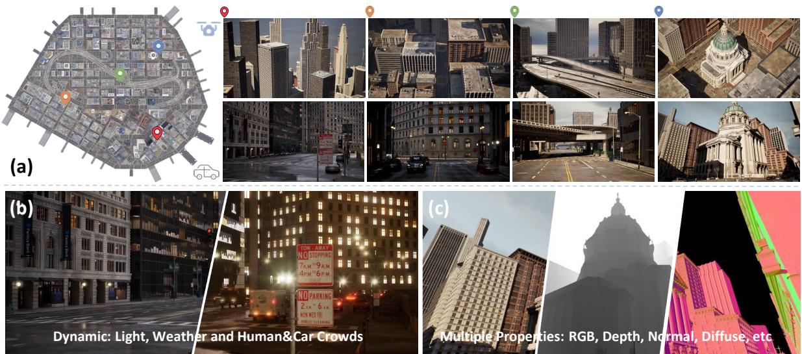
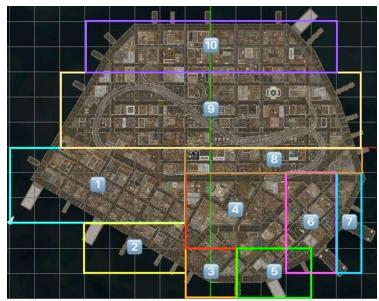
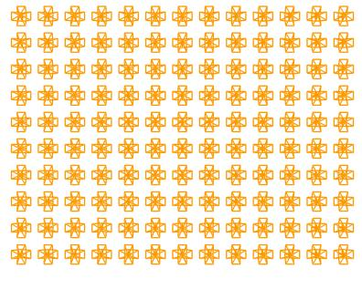
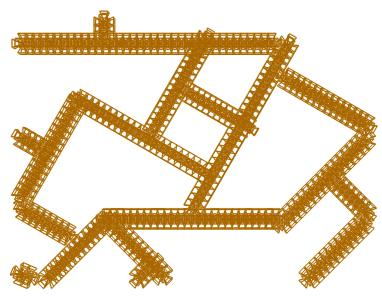
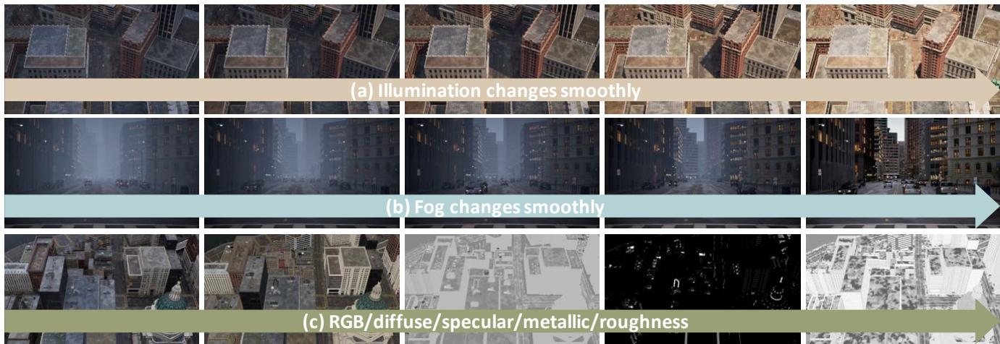
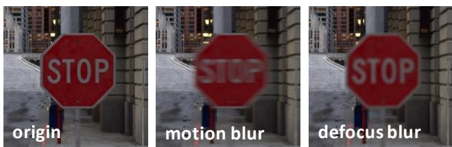
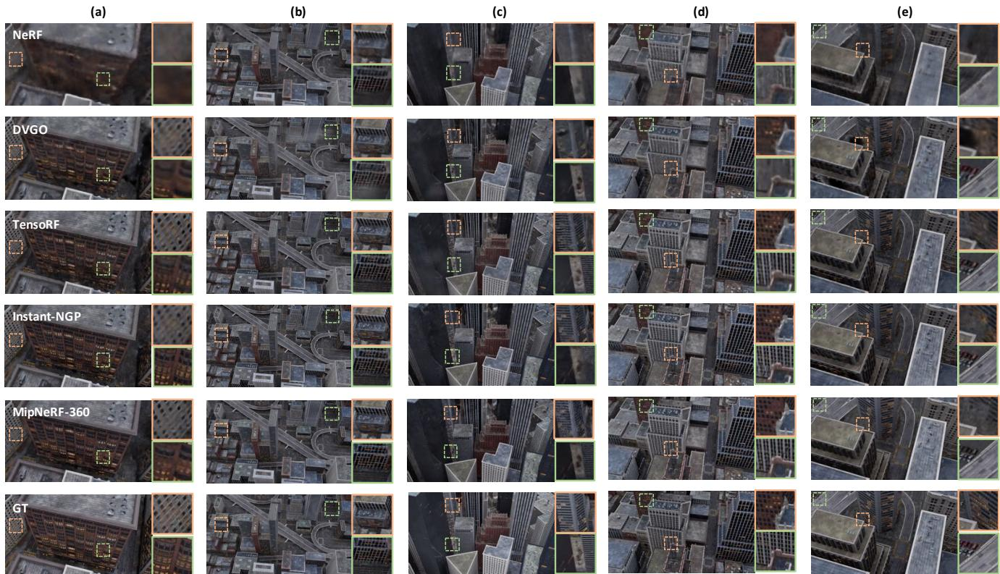
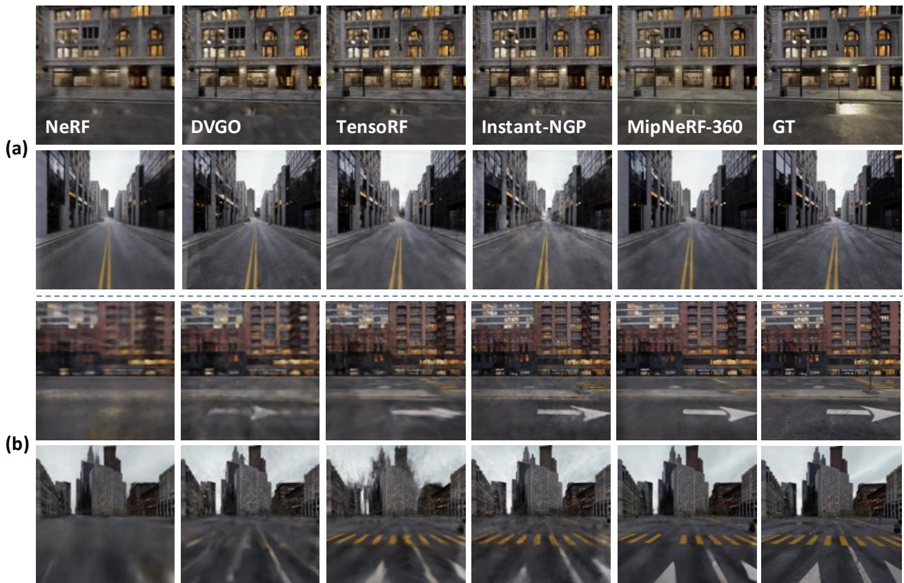
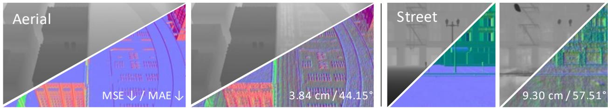
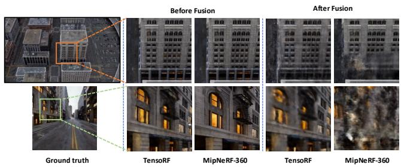

# MatrixCity: A Large-scale City Dataset for City-scale Neural Rendering and Beyond

Yixuan Li1∗ , Lihan Jiang2∗ , Linning Xu1, Yuanbo Xiangli1 Zhenzhi Wang1, Dahua Lin1,2, Bo Dai2 1 The Chinese University of Hong Kong 2 Shanghai AI Laboratory ly122@ie.cuhk.edu.hk jianglihan@pjlab.org.cn {xl020,xy019,wz122,dhlin}@ie.cuhk.edu.hk daibo@pjlab.org.cn

  
Figure 1: An illustration of MatrixCity dataset’s small city. a) We collected high-quality large-scale city scene images fo a city-scale neural rendering benchmark from Unreal Engine 5, capturing various city environments from multiple viewing angles. b) Our flexible environment control can collect data under dynamic environmental factors such as varying lighting and weather conditions. c) Our developed platform also facilitates the extraction of additional properties, including depth maps and normal maps. These features open a wide range of opportunities for future research in city-scale neural rendering.

## Abstract

Neural radiance fields (NeRF) and its subsequent variants have led to remarkable progress in neural rendering. While most of recent neural rendering works focus on objects and small-scale scenes, developing neural rendering methods for city-scale scenes is of great potential in many real-world applications. However, this line of research is impeded by the absence of a comprehensive and high-quality dataset, yet collecting such a dataset over real city-scale scenes is costly, sensitive, and technically infeasible. To this end, we build a large-scale, comprehensive, and high-quality synthetic dataset for city-scale neural rendering researches. Leveraging the Unreal Engine 5 City Sample project, we developed a pipeline to easily collect aerial

and street city views, accompanied by ground-truth camera poses and a range of additional data modalities. Flexible controls on environmentalfactors like light, weather, human and car crowd are also available in our pipeline, supporting the need ofvarious tasks covering city-scale neural rendering and beyond. The resulting pilot dataset, MatrixCity, contains 67k aerial images and 452k street imagesfrom two city maps oftotal size 28km2. On top ofMatrixCity, a thorough benchmark is also conducted, which not only reveals unique challenges of the task of city-scale neural rendering, but also highlights potential improvements for future works. The dataset and code will be publicly available at the project page: https://city-super.github.io/matrixcity/.

## 1. Introduction

Realistic rendering of city-scale scenes is a crucial component of many real-world applications, including aerial surveying, virtual reality, film production, and gaming. While NeRF [22] has made notable advancements in rendering objects and small-scale scenes, only a few early attempts [30, 33, 37] have sought to extend NeRF and its variants to larger city-scale scenes. Due to the paucity of benchmark dataset, the complexity and challenges of city-scale neural rendering have not been thoroughly investigated.

Collecting a comprehensive and high-quality city-scale dataset in real-world is time consuming and resource intensive, and can be technically infeasible. Moreover, it is also impossible to control environmental factors, such as lighting conditions, weather patterns, and the presence of transient objects like pedestrians and vehicles. Thus, existing urban datasets [17, 33, 8] are limited to a few independent scenes rather than comprehensive city maps, failing to capture the diversity of urban environments. Furthermore, existing datasets often feature monotonous viewing angles, such as street-level [30] or aerial imagery [17, 33, 8], leading to partial city modeling with incomplete building geometries and ground-level details. Even if sufficient realworld city data is collected, legal or commercial issues can limit its accessibility, e.g., Block-NeRF dataset [30] only provides access to 1km street data, and UrbanScene3D dataset [17] offers only two real-world scenarios. Such restrictions significantly hinder the ability of researchers to advance the field of city-scale neural rendering.

This paper presents MatrixCity, a comprehensive and high-quality synthetic dataset to support the research of city-scale neural rendering as well as other extended tasks. Specifically, MatrixCity has several distinguished features: 1) High Quality. It is built in the City Sample project 1 of Unreal Engine 5 2 with advanced graphic technologies which allows for the public release of rendered images3. As shown in Figure 1, this engine offers rich city details of fine-grained textures and geometries from its photo-realistic rendering quality with realistic lighting, shadow effects, and accurate ground-truth camera poses. 2) Scale and Diversity. To create the MatrixCity dataset, we developed a plugin that can automatically capture data from the map of two cities provided by Unreal Engine 5, resulting in 172k and 347k images, respectively. These images cover areas equivalent to 2.7km2 and 25.3km2 in the real-world. The captured regions showcase a broad spectrum of urban landscapes, mirroring the complexity and heterogeneity of genuine cities. 3) Controllable Environments. Our developed plugin provides flexible control over a range of environmental factors that are uncontrollable in the real world, including lighting, weather, and human and car crowds. By decoupling these various factors, we are able to provide corresponding data that can support in-depth research of city-scale neural rendering. 4) Multiple Properties. The plugin can also customize data collection trajectories, and extract multiple ground-truth components, including depth, normal and decomposed components of reflectance (e.g. diffuse, specular, metallic, etc.). Such advanced feature enables researchers to not only perform a range of city-scale neural rendering tasks under varying conditions but also supports other extended tasks, for example depth estimation and inverse rendering.

Our benchmark study demonstrates the value of Matrix-City in advancing city-scale neural rendering researches. We experiment with several state-of-the-art neural rendering methods to conduct empirical analyses first on aerial and street data respectively, then on the fused data from both modes. Preliminary results indicate that even with these advanced methods, city-scale neural rendering is still a far-reaching goal. Specifically, we identified several challenges: 1) In aerial data, learning high-rise city regions poses a greater challenge than low-rise/ground areas due to complex building structures and occlusion; 2) Street data contains significantly more details than aerial data, which raises challenges for model capacity. Although block-size aerial data modeling is feasible, modeling street data with the same size may be more difficult; 3) The view direction and level of details varied significantly between the two modes of data, making it difficult to train them together; 4) Current models generally performed poorly on smaller objects with more details and reflective buildings in urban scenes. These findings present significant opportunities to advance research in city-scale neural rendering.

In summary, our contributions are as follows:

• We constructed a large-scale, high-quality dataset for city-scale neural rendering, named MatrixCity. This dataset emphasizes attributes pivotal to cityscale scenes, encompassing elements like dynamic interactions and lighting conditions. MatrixCity contains both aerial and street-level images of complete city maps with extra depth, normal, and decomposed BRDF materials capable of supporting multiple tasks.

• We developed a plugin that leverages Unreal Engine 5 for automatic high-quality city data collection, allowing researchers to flexibly control lighting, weather, and transient objects. The plugin simplifies data collection for different task settings, making it a valuable tool for the community where users can build up advanced datasets as demanded.

• We conducted extensive studies on the MatrixCity dataset, which revealed some key challenges of cityscale neural rendering, and hopefully facilitate future research in this area.

## 2. Related work

## 2.1. 3D Neural Representation at City Scale

City-scale reconstruction has been studied for decades. Previous methods for representing geometry of a city mainly relied on raw point clouds acquired through either structure-from-motion [1] or Lidar sensors [12]. Recently, with the emergence of Neural Radiance Fields (NeRF) [22], novel view synthesis has become more efficient and effective. Numerous methods in this direction have further improved the speed [18, 28, 10, 23, 7] and accuracy [40, 3, 4] of reconstruction. NeRF is also used in a wide range of applications beyond novel view synthesis, such as inverse rendering [5, 27, 42, 26], surface reconstruction [34, 36, 2, 38] or HDR synthesis [11, 14, 21]. Although these methods demonstrate acceptable performance with small objects, grappling with urban scenes remains a significant challenge due to the limited representation capability of NeRF.

Based on these observations, recent methods were proposed for reconstructing radiance fields in urban-scale scenes. NeRF-W [20] captured per-image appearance variations and separated the entire scene into static and transient components, enabling the modeling of unstructured collections of in-the-wild photographs. Block-NeRF [30] extended NeRF-W [20] to model an neighborhood of San Francisco by dividing up urban environments into individually small Block-NeRFs. Mega-NeRF [33] also adopted the advantages of NeRF-W [20] and Block-NeRF [30] by first decomposing large-scale fly-view scenes into small spatial cells and then training these cells in parallel. Urban Radiance Fields [25] synthesized novel RGB images and extracted 3D surfaces from a combination of panoramas and Lidar inputs in the urban environments. BungeeNeRF [37] introduced progressive modeling with multi-level supervision to handle city-scale data with varying levels of detail. Despite the progress made by the aforementioned methods [20, 30, 33, 25, 37], there is no unified dataset for evaluating these methods due to their varying settings. Significant challenge still remains in the city reconstruction problem, particularly in integrating aerial data and streetlevel data with varying levels of detail.

## 2.2. NeRF-based Datasets and Benchmarks

Several benchmarks based on NeRF are proposed in the recent two years, which focus on the effective and better reconstruction of single objects [22, 18, 13], indoor scenes [9], or outdoor unbounded scenes [4, 15]. While there have been some good attempts to collect high-quality largescale datasets using high-precision acquisition equipment [8, 17, 30, 19] as shown in Table 1, the high acquisition costs limit their size and scale. Some datasets are limited to only a few independent scenes that are far from urbanscale or are not fully open-source due to privacy and commercial reasons. For instance, Mill 19 dataset [33] only includes two suburban-like scenes, and the Quak 6D [8] and OMMO [19] datasets focus on a limited number of independent scenes that are not city-scale. Waymo Block-NeRF [30] dataset only grants access to 100 seconds of driving data and Urban Scene3D dataset [17] only releases two real-world scenarios. Additionally, existing real-world datasets commonly provide only one type of image data, such as street-level or aerial imagery, which makes modeling buildings incomplete [17, 19]. Collecting real data in outdoor scenes poses significant challenges due to difficulties in controlling environmental factors such as pedestrian movement, weather, and lighting. As a result, a standard and comprehensive benchmark for city-scale neural rendering has not yet been established. Existing outdoor NeRFbased benchmarks like OMMO [19] are too trivial to explore and analyze the urban implicit scene representation. To address these issues, we developed a plugin in Unreal Engine 5 to easily collect aerial and street city data with ground-truth camera poses. We built a city-scale and multitasking dataset that includes both fly-view and street-view images and propose a new city-scale benchmark for neural rendering. We also provided a detailed analysis of the challenges and opportunities of NeRF in urban environments.

## 3. MatrixCity Dataset

The MatrixCity dataset aims to introduce a new challenging benchmark to the field of city-scale neural rendering by providing comprehensive city maps consisting of both aerial and street-level data. In addition to RGB images, we also offer normal, depth, and decomposed reflectance properties to support other tasks. Moreover, we can flexibly control environmental factors, including light direction and intensity, fog density, and human or vehicle crowding, to enable simulating real-world dynamic situations. Sec 3.1 describes our data construction procedure. Sec 3.2 and 3.3 provide detailed statistics and characteristics of this dataset.

## 3.1. Dataset Construction

City Data Collection. Densely captured 2D images with sufficient multi-view supervision are required to learn a faithful scene geometry, especially for large city scenes. Collecting a sufficient amount of data in Unreal Engine 5 for city scenes is a complex process that requires adjusting camera trajectories to capture specific viewpoints. Although the Unreal Engine 5 offers a movie render queue plugin for high-quality image rendering, it can be timeconsuming and inflexible to manually set up the position, rotation, and frame number of key points. For urban settings, it is not practical to manually set camera trajectories in a city-scale environment. To address this, we developed a plugin that automatically generates camera trajectories, reducing the need for manual annotation and increasing the efficiency of data collection. Camera trajectories generated by our plugins can be rendered in any Unreal Engine 5 scenes.

(b) Aerial trajectory in block 4  
  
(a) Aerial block splits

  
(c) Street trajectory in block 4  
Figure 2: Illustration of data collection in the small city in Unreal Engine 5. (a) Aerial block split for the entire small city; (b&c) Camera aerial and street trajectory of block 4 (visualized in bird-eye views) used in our plugin for data collection.

For aerial-view collection, we divide the city map into 10 blocks based on building heights (Figure 2 (a)) to better capture the building details. We provide the height of every collected block in the supplementary material. Note that current neural scene representations are generally suitable for bounded scenes, where scenes with large variation in height may cast great difficulty for accurate ray sampling. We then generate trajectories using the input of camera height and the four vertices’ coordinates of the corresponding block (Figure 2 (b)) Our plugin puts four cameras at each capturing location, with each camera rotating 90◦ apart from each other in the yaw direction and identical pitch values. The pitch value for the floor area is −45◦, while it is −60◦ for high-rise area as there are more occlusions at higher levels.

For street-view data collection, we manually annotate the start and end points of each road and use them as inputs to generate straight-line trajectories with our plugin. We position six perspective cameras at each capturing location to render a cube map, providing a comprehensive view of the surroundings. Note that the cube map can be naturally transformed into panorama images, which are suitable for capturing the street views as much as possible with limited camera positions. Figure 2 (c) shows the resulting streetlevel trajectories for a specific block. Our plugin saves the generated camera trajectories as sequence assets of Unreal Engine, which can be easily reused to render images with different environmental settings. We will enhance our plugin to support more complex camera trajectories in the future, enabling us to generate even higher quality city-scale data. Note that we adapt auto-exposure to collect data. If we use the same fixed exposure for two types of data, the street views will be under-exposured while the aerial views will be over-exposured. HDR images will be included in the future.

Quality Control. To build a high-quality dataset for cityscale neural rendering, we utilize several mechanisms to ensure that the rendered images are of high quality and that the camera poses are accurate. Rather than using the more efficient real-time rendering pipeline, which often produces flickering images, we use the movie render queue plugin to render images with movie-level standards. Additionally, we set the Engine Scalability Settings to the best, turn off the motion blur and use anti-aliasing during the rendering process to achieve the highest possible image quality. We inspect the images thoroughly after rendering to remove any aerial views that look outside the map boundaries and ensure that there are no object clippings. Unreal Engine 5 provides ground-truth camera poses, which we have further verified through additional experiments to ensure their accuracy. Even with a small set of street data, training the MipNeRF-360 [4] model yields almost perfect novel view synthesis results, as demonstrated in Figure 6. This confirms the accurate annotation of our camera poses. Overall, by adopting these mechanisms, we ensure that the Matrix-City dataset provides high-quality images with precise camera poses, which is crucial for city-scale neural rendering research. Without considering noises like inaccurate pose and motion blur, we intend to gain more insights about the intrinsic challenges of city scenes since isolating these noises from real data is generally infeasible.

Dynamic Environments. The City Sample project of Unreal Engine 5 provides a plethora of powerful functions that allow for the creation of dynamic city scenes. As shown in Figure 1, we have the ability to control the presence of moving people and cars in the scene, adding to the realism of the environment. Additionally, we can quantitatively adjust the angle and intensity of the lighting to emulate the natural changes in light throughout a day, as demonstrated in Figure 3(a). We can also control the amount of fog in a scene, as shown in Figure 3(b), providing another quantitative tool for enhancing realism. Taken together, these functions allow for the simulation of almost all basic dynamic situations found in the real world. In addition, general camera noises like motion blur and defocus blur shown in Figure 4 can be simulated in Unreal Engine. Such varying lighting, weather conditions, moving objects and camera noises will lead to more realistic and accurate city-scale neural rendering.

  
Figure 3: Illustration of controlling dynamic environment factors in Unreal Engine 5 such as illumination (a), fog density (b) and decomposed reflectance (c).

Multiple Properties. Figure 1 (c) and Figure 3 (c) illustrates the various intermediate products generated by Unreal Engine during the rendering process, including depth, normal, and decomposed components (diffuse, specular, metallic, and roughness). These attributes are especially important for studies on inverse rendering and semantic analysis, which are popular for city scene analysis. Our plugin offers the ability to extract these properties without incurring any additional costs, which can be prohibitively expensive to obtain in real-world scenarios.

## 3.2. Dataset Statistics

The MatrixCity dataset comprises two scenes from the City Sample project: Small City covering an area of 2.7km2 and Big City spanning $2 5 . 3 k m ^ { 2 }$ . In total, we collect 67k aerial images and 452k street-level images to ensure comprehensive coverage. As shown in Table 1, many of current datasets [17, 8, 19] do not offer the dense image captures of the whole city but small-size independent scenes. Although Waymo Block-NeRF [30] dataset densely collects an area of approximately 960m × 570m, it only contains street data and results in the reconstructed buildings incomplete. All the existing datasets do not have quantitatively controllable environments including light, weather and human and car crowds, nor multiple properties like normal, depth, the decomposed reflectance components, etc, which restricts the in-depth study of city-scale neural rendering in dynamic scenes and other extension tasks. KITTI-360 [16], NuScenes [6], Waymo Open [29] are not designed for neural rendering purposes and only provide limited camera viewpoints.

  
Figure 4: Examples of camera motion blur and defocus blur.

## 3.3. Dataset Characteristics

High Quality. For constructing MatrixCity dataset, we use the City Sample project and the movie-level plugin named movie render queue of the Unreal Engine 5 which is demonstrated to reproduce The Matrix Awakens. Unlike games, the rendering process is not real-time and costs huge computations with pre-defined camera poses. Such movie-level rendering quality enables the collection of realistic cityscale data similar to the real world with fully dynamic environment factors. Vigorous quality control is performed during its collection phase.

Large-scale and Diversity. The City Sample project of Unreal Engine 5 includes two cities with a large-scale coverage, which captures varying buildings, pedestrians, signs, vehicles, and lighting conditions, resulting in more diverse and realistic outdoor scenes that are representative of realworld cities. This ensures that researchers have access to a broad range of data to train their models on, leading to more accurate and effective city-scale neural rendering.

<table><tr><td>Dataset</td><td>#Images</td><td>Level</td><td>Types</td><td>Source</td><td>Lighting</td><td>Human/Car</td><td>Weather</td><td>D-Reflectance</td></tr><tr><td>UrbanScene3D [17]</td><td>128K</td><td>Scene</td><td>Aerial</td><td>Synthetic &amp; Real</td><td>x</td><td>x</td><td>x</td><td>x</td></tr><tr><td>Quad 6K [8]</td><td>5.1K</td><td>Scene</td><td>Aerial</td><td>Real</td><td>x</td><td>x</td><td>x</td><td>x</td></tr><tr><td>Mill 19 [33]</td><td>3.6K</td><td>Scene</td><td>Aerial</td><td>Real</td><td>x</td><td>x</td><td>x</td><td>x</td></tr><tr><td>Waymo Block-NeRF [30]</td><td>12K</td><td>City</td><td>Street</td><td>Real</td><td>√</td><td>x</td><td>x</td><td>x</td></tr><tr><td>OMMO [19]</td><td>14.7K</td><td>Scene</td><td>Aerial</td><td>Real</td><td>√</td><td>x</td><td>x</td><td>x</td></tr><tr><td>KITTI-360 [16]</td><td>300K</td><td>City</td><td>Street</td><td>Real</td><td>x</td><td>√</td><td>x</td><td>x</td></tr><tr><td>NuScenes [6]</td><td>1.4M</td><td>City</td><td>Street</td><td>Real</td><td>V</td><td>√</td><td>√</td><td>x</td></tr><tr><td>Waymo Open [29]</td><td>1M</td><td>City</td><td>Street</td><td>Real</td><td>√</td><td>√</td><td>√</td><td>x</td></tr><tr><td>Ours</td><td>519k</td><td>City</td><td>Aerial+Street</td><td>Synthetic</td><td>√</td><td>√</td><td>√</td><td>√</td></tr></table>

Table 1: Comparison of statistics and properties between our MatrixCity dataset with previous datasets.
<table><tr><td rowspan="2">Block</td><td colspan="3">NeRF [22]</td><td colspan="3">DVGO [28]</td><td colspan="3">TensoRF [7]</td><td colspan="3">Instant-NGP [23]</td><td colspan="3">MipNeRF-360 [4]</td><td rowspan="2">Average Height</td></tr><tr><td>PSNR ↑</td><td>SSIM↑</td><td>LPIPS↓</td><td>PSNR ↑</td><td>SSIM↑</td><td>LPIPS ↓</td><td>PSNR ↑</td><td>SSIM ↑</td><td>LPIPS ↓</td><td>PSNR ↑</td><td>SSIM ↑</td><td>LPIPS ↓</td><td>PSNR ↑</td><td>SSIM ↑</td><td>LPIPS ↓</td></tr><tr><td>Block_A</td><td>23.15</td><td>0.561</td><td>0.649</td><td>25.04</td><td>0.677</td><td>0.520</td><td>25.96</td><td>0.720</td><td>0.462</td><td>27.21</td><td>0.793</td><td>0.376</td><td>26.64</td><td>0.772</td><td>0.406</td><td>150</td></tr><tr><td>Block_B</td><td>22.94</td><td>0.613</td><td>0.485</td><td>22.72</td><td>0.649</td><td>0.463</td><td>24.95</td><td>0.776</td><td>0.326</td><td>25.45</td><td>0.826</td><td>0.271</td><td>24.80</td><td>0.765</td><td>0.352</td><td>432</td></tr><tr><td>Block_C</td><td>22.15</td><td>0.590</td><td>0.527</td><td>21.39</td><td>0.649</td><td>0.475</td><td>24.11</td><td>0.754</td><td>0.370</td><td>23.21</td><td>0.788</td><td>0.311</td><td>24.20</td><td>0.759</td><td>0.365</td><td>419</td></tr><tr><td>Block_D</td><td>23.09</td><td>0.570</td><td>0.548</td><td>24.14</td><td>0.656</td><td>0.486</td><td>24.99</td><td>0.712</td><td>0.416</td><td>26.24</td><td>0.785</td><td>0.338</td><td>26.45</td><td>0.790</td><td>0.338</td><td>250</td></tr><tr><td>Block_E</td><td>23.53</td><td>0.612</td><td>0.534</td><td>24.74</td><td>0.704</td><td>0.467</td><td>25.66</td><td>0.749</td><td>0.408</td><td>26.36</td><td>0.807</td><td>0.335</td><td>26.54</td><td>0.811</td><td>0.338</td><td>200</td></tr><tr><td>Overall</td><td>22.97</td><td>0.589</td><td>0.548</td><td>23.61</td><td>0.667</td><td>0.482</td><td>25.13</td><td>0.762</td><td>0.396</td><td>25.69</td><td>0.800</td><td>0.326</td><td>25.73</td><td>0.779</td><td>0.360</td><td>279</td></tr></table>

Table 2: Performance comparison of representative neural rendering methods on the aerial data of our MatrixCity benchmark.

Controllable Environments. Unlike the real world data, we could control the lighting angle and intensity, the density and height of fog, and the density of flow of pedestrians and vehicles in a fine-grained manner. This flexibility enables us to generate dynamic scenarios of city scenes that would be difficult to capture in real-world data. This level of control over the environment allows for more detailed exploration of how different factors influence the training process of city-scale neural rendering.

Multiple Properties. Our developed plugin is able to extract additional information such as depth, normal and the decomposed reflectance components with minimum extra cost in Unreal Engine 5. This information supports additional tasks such as depth estimation, inverse rendering, which cannot be supported by real-world data without excessive labor.

Applications. By exploring neural rendering models on MatrixCity, we can transfer the algorithms to real-world urban scenes, which can generate scene for games, virtual reality, automatic driving, and so on. The rendered scenes can also makes the interactions with digital humans possible in the metaverse.

## 4. Experiments

In this section, we mainly investigate the quality of reconstruction and novel view rendering, and reveal the challenges of adapting existing SOTA methods on this task. Additional studies (e.g., dynamics scenes, lighting control, etc.) are provided in the supplementary material.

## 4.1. Datasets and Metrics.

MatrixCity benchmark. The MatrixCity dataset contains two city maps: Small City and Big City. According to the common practice in surveying and mapping that adjacent images should have an overlap of 70%-80%, we set a camera capture location every 40 m for aerial data collection and 5 m for street data collection. Small City includes 6k aerial images and 30k street-level images, while Big City has 60 k aerial images and 286 k street-level images. Note that we remove the aerial images that look outside the map boundary manually. Also, we remove the street images that look straight down following nerfstudio [31], which crops the bottom 20% of the 360 images to reduce useless information. The ratio of training set to testing set is 8:1. To ensure both completeness of training perspectives and generalization ability in testing, test set is collected separately with no location overlap with the training set. For aerial data, the yaw direction randoms from 0◦ to 360◦ and the pitch direction randoms from $- 6 0 ^ { \circ } ~ { \mathrm { t o } } ~ - 4 5 ^ { \circ }$ , and every camera location captures 1 image. For street data, the yaw direction randoms from 0◦ to 90◦ and every camera location captures 5 images, whose pitch and roll direction keep the same with the training set. Since the street data contains more details, we also ablate the street data collection density in Table 4, which demonstrates that grid-based method is more sensitive to data density than MLP-based NeRF method. Additionally, we provide a super dense version street data with 135k for Small City with 1 m interval. For demonstrative purpose, we conducted experiments on the Small City in this stage, where the interval between adjacent frames is 5 m for street data. We will release the data splits of the following sections.

  
Figure 5: Visualization of novel view synthesis results of previous representative large-scale neural rendering methods on the aerial data of our MatrixCity dataset.

Evaluation metric. We evaluate the rendering performance of each baseline method based on PSNR(Peak Signalto-Noise Ratio), SSIM(Structural Similarity) [35] and the VGG implementation of LPIPS [41]. And we also use mean angular error (MAE) and mean squared error (MSE) to evaluate estimated normal vectors and depth map, respectively.

## 4.2. Baselines.

We aim to test the performance of current neural rendering methods on the MatrixCity dataset to explore the challenges for city-scale neural rendering. To achieve this, we choose five widely recognized methods: NeRF [22], DVGO [28], Instant-NGP [23], TensoRF [7] and MipNeRF-360 [4]. Note that we all use the official implementation of these baselines except NeRF and Instant-NGP. For NeRF we use the widely recognized Pytorch version [39]. And for Instant-NGP, we use the open-source version [24]. We find that ngp-pl [24] generally performs better than torchngp [32]. To address the challenge of increasingly intricate urban content, we recognized the limited capacity of the original baseline models. So we increased the number of parameters to handle more complex urban environments. Specific details regarding these parameter increases can be found in the supplementary material.

## 4.3. Neural Rendering on Aerial Data

Due to the limitations of current methods and models, it is impractical to use a single model to represent an entire map. Therefore, we divided the map into five blocks based on building height and coverage area. Each block covers a roughly homogeneous area, where buildings within each block have similar heights. Our results, shown in Table 2, indicate that MipNeRF-360 [4] and Instant-NGP [23] perform better, while NeRF [22] performs the worst. This indicate that grid-based methods and MLP-based NeRF methods both can model the block-size aerial data modeling well. Despite scaling up the NeRF model significantly, its ability to model large-scale scenes remains limited, as illustrated in Figure 5. Additionally, we found that the high-rise area is more challenging to model than the floor area. In the high-rise area, there are numerous occlusions between the buildings, which is a significant challenge for aerial data modeling. From Figure 5, we can observe that current methods still struggle to accurately model small objects and reflective buildings.

Figure 6: Visualization of novel view synthesis of city-scale neural rendering methods on (a) Block Small and (b) Block A of street-view data. MLP-based NeRF methods suffer from capacity issues while grid-based baselines shows severe artifacts.
<table><tr><td rowspan="2">Block</td><td colspan="3">NeRF [22]</td><td colspan="3">DVGO [28]</td><td colspan="3">TensoRF [7]</td><td colspan="3">Instant-NGP [23]</td><td colspan="3">MipNeRF-360 [4]</td></tr><tr><td>PSNR ↑</td><td>SSIM↑</td><td>LPIPS ↓</td><td>PSNR ↑</td><td>SSIM ↑</td><td>LPIPS ↓</td><td>PSNR ↑</td><td>SSIM ↑</td><td>LPIPS ↓</td><td>PSNR↑</td><td>SSIM ↑</td><td>LPIPS↓</td><td>PSNR ↑</td><td>SSIM ↑</td><td>LPIPS ↓</td></tr><tr><td>Block_A</td><td>20.12</td><td>0.601</td><td>0.626</td><td>20.47</td><td>0.617</td><td>0.604</td><td>20.93</td><td>0.643</td><td>0.577</td><td>21.96</td><td>0.712</td><td>0.493</td><td>22.00</td><td>0.717</td><td>0.488</td></tr><tr><td>Block_Small</td><td>22.15</td><td>0.678</td><td>0.511</td><td>22.10</td><td>0.711</td><td>0.454</td><td>22.95</td><td>0.741</td><td>0.445</td><td>22.84</td><td>0.745</td><td>0.408</td><td>24.47</td><td>0.827</td><td>0.297</td></tr><tr><td>Overall</td><td>21.14</td><td>0.640</td><td>0.569</td><td>21.29</td><td>0.664</td><td>0.529</td><td>21.94</td><td>0.692</td><td>0.511</td><td>22.40</td><td>0.729</td><td>0.451</td><td>23.24</td><td>0.772</td><td>0.393</td></tr></table>

Table 3: Performance comparison of representative neural rendering methods on the street data of our MatrixCity benchmark.

## 4.4. Neural Rendering on Street Data

We first run all these baselines on the street data of Block A and find that all the methods perform much worse than the results of the aerial data, especially for the gridbased methods, as shown in Table 3. Street data contains much more details than aerial data, and it is harder to achieve high-quality results on street data than on aerial data, which is also demonstrated in Figure 7. Thus we conclude that modeling the street data of a block-size area in a single model is not reasonable and filter a crossroad data to test current methods, called Block Small. Analyzed the results on Block Small, we find that the MLP-based NeRF methods perform better than the grid-based methods, which is also demonstrated in Figure 6. The Block Small can also be seen as a 360 unbounded scenes with a distant background. Figure 6 shows that MipNeRF-360 can alleviate this problem to some extent. However, the reflective parts and fine-grained architectures are still not well reconstructed.

<table><tr><td rowspan="2">Density</td><td colspan="3">Instant-NGP [23]</td><td colspan="3">MipNeRF-360 [4]</td></tr><tr><td>PSNR ↑</td><td>SSIM ↑</td><td>LPIPS ↓</td><td>PSNR ↑</td><td>SSIM ↑</td><td>LPIPS↓</td></tr><tr><td>5.0 m</td><td>21.436</td><td>0.733</td><td>0.402</td><td>27.75</td><td>0.866</td><td>0.2956</td></tr><tr><td>3.6 m</td><td>24.978</td><td>0.803</td><td>0.350</td><td>29.366</td><td>0.884</td><td>0.280</td></tr><tr><td>2.0 m</td><td>30.025</td><td>0.885</td><td>0.235</td><td>31.420</td><td>0.901</td><td>0.265</td></tr><tr><td>1.0 m</td><td>32.444</td><td>0.912</td><td>0.211</td><td>31.858</td><td>0.905</td><td>0.263</td></tr><tr><td>0.5 m</td><td>32.999</td><td>0.921</td><td>0.202</td><td>32.210</td><td>0.907</td><td>0.261</td></tr></table>

Table 4: Ablation on the density of street data collection on our MatrixCity benchmark.

  
Figure 7: Visualization of the depth and normal results of MipNeRF-360 on aerial and street views.

Figure 8: Visualization of neural rendered results on aerial and street views before and after fusion of two types of views. Streets views are generally harder than aerial views to deliver high-quality rendering results, with notable floating artifacts, where the model get easily overfitting to the training views with cheated geometry. The naive joint training on the fused data downgrades the quality.
<table><tr><td rowspan="2">Data Type</td><td colspan="3">TensoRF [7]</td><td colspan="3">MipNeRF-360 [4]</td></tr><tr><td>PSNR ↑</td><td>SSIM ↑</td><td>LPIPS ↓</td><td>PSNR ↑</td><td>SSIM ↑</td><td>LPIPS ↓</td></tr><tr><td>Aerial</td><td>27.26</td><td>0.829</td><td>0.231</td><td>28.37</td><td>0.855</td><td>0.197</td></tr><tr><td>Streat</td><td>22.10</td><td>0.727</td><td>0.449</td><td>23.05</td><td>0.805</td><td>0.312</td></tr><tr><td>Fusion</td><td>21.44</td><td>0.656</td><td>0.504</td><td>17.07</td><td>0.470</td><td>0.600</td></tr></table>

Table 5: Ablation on the fusion of aerial and street data on our MatrixCity benchmark.

## 4.5. Neural Rendering on Joint Types of Data

The major motivation to fuse data from both aerial and street view is to provide content information at different granularity. While aerial views are generally easier to train with less geometry ambiguities, it lacks many details on the near-ground, which are critical to deliver immersive experience for exploring a city. On the other hand, street-view images often only offer partial information about the scene revealing the local contents, which are sensitive to overfit to training views. We therefore explore to train the aerial and street data together, which cover the same area, aiming the leverage the advantage of two sources of data to ensure wide coverage as well as fine details. However, according to Table 5, we find that the performance of TensoRF [7] and MipNeRF-360 [4] both got worse after simply fusing the aerial and street data to train together. As shown in the Figure 8, the ground part of the aerial view becomes dirty after training with the street data for both methods. For the street view, the foreground of MipNeRF-360 becomes worse. We analyze that due to the significant difference in the level of details between street-level and aerial imagery, as well as the large disparity in distance from the foreground, it is challenging to train models simply by utilizing both types of data. We need to further investigate how algorithms can effectively utilize both the geometric information from aerial imagery and the detailed information from street-level imagery, such as finetuning, progressive training, separate group of hyperparamters, etc.

## 5. Conclusion

In this paper, we proposed MatrixCity, a high-quality and city-scale benchmark with diverse, controllable and realistic data collected from the powerful Unreal Engine 5. Additional information like depth and normal are also collected with minimum extra cost in our MatrixCity dataset, enables other potential tasks and applications like depth estimation and inverse rendering. On top of MatrixCity, we have empirically investigated representative methods on two types of data independently and the fusion of both aerial-view and street-view data. We hope these efforts could facilitate new advances in the field of city-scale neural rendering.

Acknowledgment This project is funded in part by Shanghai AI Laboratory (P23KS00020, 2022ZD0160201), CUHK Interdisciplinary AI Research Institute, and the Centre for Perceptual and Interactive Intelligence (CPIl) Ltd under the Innovation and Technology Commission (ITC)’s InnoHK. We would like to thank Haiyi Mei and Lei Yang for their invaluable help and discussions for the plug-in development.

## References

[1] Sameer Agarwal, Yasutaka Furukawa, Noah Snavely, Ian Simon, Brian Curless, Steven M. Seitz, and Richard Szeliski. Building rome in a day. Commun. ACM, 54(10):105–112, 2011.

[2] Dejan Azinovic, Ricardo Martin-Brualla, Dan B. Goldman, Matthias Nießner, and Justus Thies. Neural RGB-D surface reconstruction. In CVPR, pages 6280–6291. IEEE, 2022.

[3] Jonathan T. Barron, Ben Mildenhall, Matthew Tancik, Peter Hedman, Ricardo Martin-Brualla, and Pratul P. Srinivasan. Mip-nerf: A multiscale representation for anti-aliasing neural radiance fields. In ICCV, pages 5835–5844. IEEE, 2021.

[4] Jonathan T. Barron, Ben Mildenhall, Dor Verbin, Pratul P. Srinivasan, and Peter Hedman. Mip-nerf 360: Unbounded anti-aliased neural radiance fields. In CVPR, pages 5460– 5469. IEEE, 2022.

[5] Mark Boss, Raphael Braun, Varun Jampani, Jonathan T. Barron, Ce Liu, and Hendrik P. A. Lensch. Nerd: Neural reflectance decomposition from image collections. In ICCV, pages 12664–12674. IEEE, 2021.

[6] Holger Caesar, Varun Bankiti, Alex H Lang, Sourabh Vora, Venice Erin Liong, Qiang Xu, Anush Krishnan, Yu Pan, Giancarlo Baldan, and Oscar Beijbom. nuscenes: A multimodal dataset for autonomous driving. In Proceedings of the IEEE/CVF conference on computer vision and pattern recognition, pages 11621–11631, 2020.

[7] Anpei Chen, Zexiang Xu, Andreas Geiger, Jingyi Yu, and Hao Su. Tensorf: Tensorial radiance fields. In ECCV (32), volume 13692 of Lecture Notes in Computer Science, pages 333–350. Springer, 2022.

[8] David J. Crandall, Andrew Owens, Noah Snavely, and Daniel P. Huttenlocher. Sfm with mrfs: Discrete-continuous optimization for large-scale structure from motion. IEEE Trans. Pattern Anal. Mach. Intell., 35(12):2841–2853, 2013.

[9] Angela Dai, Angel X. Chang, Manolis Savva, Maciej Halber, Thomas A. Funkhouser, and Matthias Nießner. Scannet: Richly-annotated 3d reconstructions of indoor scenes. In CVPR, pages 2432–2443. IEEE Computer Society, 2017.

[10] Sara Fridovich-Keil, Alex Yu, Matthew Tancik, Qinhong Chen, Benjamin Recht, and Angjoo Kanazawa. Plenoxels: Radiance fields without neural networks. In CVPR, pages 5491–5500. IEEE, 2022.

[11] Xin Huang, Qi Zhang, Ying Feng, Hongdong Li, Xuan Wang, and Qing Wang. Hdr-nerf: High dynamic range neural radiance fields. In CVPR, pages 18377–18387. IEEE, 2022.

[12] Veli Ilc¸i and Charles K. Toth. High definition 3d map creation using gnss/imu/lidar sensor integration to support autonomous vehicle navigation. Sensors, 20(3):899, 2020.

[13] Rasmus Ramsbøl Jensen, Anders Lindbjerg Dahl, George Vogiatzis, Engin Tola, and Henrik Aanæs. Large scale multiview stereopsis evaluation. In CVPR, pages 406–413. IEEE Computer Society, 2014.

[14] Kim Jun-Seong, Kim Yu-Ji, Moon Ye-Bin, and Tae-Hyun Oh. Hdr-plenoxels: Self-calibrating high dynamic range radiance fields. In ECCV (32), volume 13692 of Lecture Notes in Computer Science, pages 384–401. Springer, 2022.

[15] Arno Knapitsch, Jaesik Park, Qian-Yi Zhou, and Vladlen Koltun. Tanks and temples: benchmarking large-scale scene reconstruction. ACM Trans. Graph., 36(4):78:1–78:13, 2017.

[16] Yiyi Liao, Jun Xie, and Andreas Geiger. Kitti-360: A novel dataset and benchmarks for urban scene understanding in 2d and 3d. IEEE Transactions on Pattern Analysis and Machine Intelligence, 45(3):3292–3310, 2022.

[17] Liqiang Lin, Yilin Liu, Yue Hu, Xingguang Yan, Ke Xie, and Hui Huang. Capturing, reconstructing, and simulating: The urbanscene3d dataset. In ECCV (8), volume 13668 of Lecture Notes in Computer Science, pages 93–109. Springer, 2022.

[18] Lingjie Liu, Jiatao Gu, Kyaw Zaw Lin, Tat-Seng Chua, and Christian Theobalt. Neural sparse voxel fields. In NeurIPS, 2020.

[19] Chongshan Lu, Fukun Yin, Xin Chen, Tao Chen, Gang Yu, and Jiayuan Fan. A large-scale outdoor multi-modal dataset and benchmark for novel view synthesis and implicit scene reconstruction. CoRR, abs/2301.06782, 2023.

[20] Ricardo Martin-Brualla, Noha Radwan, Mehdi S. M. Sajjadi, Jonathan T. Barron, Alexey Dosovitskiy, and Daniel Duckworth. Nerf in the wild: Neural radiance fields for unconstrained photo collections. In CVPR, pages 7210–7219. IEEE, 2021.

[21] Ben Mildenhall, Peter Hedman, Ricardo Martin-Brualla, Pratul P. Srinivasan, and Jonathan T. Barron. Nerf in the dark: High dynamic range view synthesis from noisy raw images. In CVPR, pages 16169–16178. IEEE, 2022.

[22] Ben Mildenhall, Pratul P. Srinivasan, Matthew Tancik, Jonathan T. Barron, Ravi Ramamoorthi, and Ren Ng. Nerf: Representing scenes as neural radiance fields for view synthesis. In ECCV (1), volume 12346 of Lecture Notes in Computer Science, pages 405–421. Springer, 2020.

[23] Thomas Muller, Alex Evans, Christoph Schied, and Alexan-¨ der Keller. Instant neural graphics primitives with a multiresolution hash encoding. ACM Trans. Graph., 41(4):102:1– 102:15, 2022.

[24] Chen Quei-An. ngp pl: a pytorch-lightning implementation of instant-ngp, 2022. https://github.com/kwea123/ngp pl.

[25] Konstantinos Rematas, Andrew Liu, Pratul P. Srinivasan, Jonathan T. Barron, Andrea Tagliasacchi, Thomas A. Funkhouser, and Vittorio Ferrari. Urban radiance fields. In CVPR, pages 12922–12932. IEEE, 2022.

[26] Viktor Rudnev, Mohamed Elgharib, William A. P. Smith, Lingjie Liu, Vladislav Golyanik, and Christian Theobalt. Nerf for outdoor scene relighting. In ECCV (16), volume 13676 of Lecture Notes in Computer Science, pages 615– 631. Springer, 2022.

[27] Pratul P. Srinivasan, Boyang Deng, Xiuming Zhang, Matthew Tancik, Ben Mildenhall, and Jonathan T. Barron. Nerv: Neural reflectance and visibility fields for relighting and view synthesis. In CVPR, pages 7495–7504. IEEE, 2021.

[28] Cheng Sun, Min Sun, and Hwann-Tzong Chen. Direct voxel grid optimization: Super-fast convergence for radiance fields reconstruction. In CVPR, pages 5449–5459. IEEE, 2022.

[29] Pei Sun, Henrik Kretzschmar, Xerxes Dotiwalla, Aurelien Chouard, Vijaysai Patnaik, Paul Tsui, James Guo, Yin Zhou,

Yuning Chai, Benjamin Caine, et al. Scalability in perception for autonomous driving: Waymo open dataset. In Proceedings of the IEEE/CVF conference on computer vision and pattern recognition, pages 2446–2454, 2020.

[30] Matthew Tancik, Vincent Casser, Xinchen Yan, Sabeek Pradhan, Ben P. Mildenhall, Pratul P. Srinivasan, Jonathan T. Barron, and Henrik Kretzschmar. Block-nerf: Scalable large scene neural view synthesis. In CVPR, pages 8238–8248. IEEE, 2022.

[31] Matthew Tancik, Ethan Weber, Evonne Ng, Ruilong Li, Brent Yi, Justin Kerr, Terrance Wang, Alexander Kristoffersen, Jake Austin, Kamyar Salahi, Abhik Ahuja, David McAllister, and Angjoo Kanazawa. Nerfstudio: A modular framework for neural radiance field development. In ACM SIGGRAPH 2023 Conference Proceedings, SIGGRAPH ’23, 2023.

[32] Jiaxiang Tang. Torch-ngp: a pytorch implementation of instant-ngp, 2022. https://github.com/ashawkey/torch-ngp.

[33] Haithem Turki, Deva Ramanan, and Mahadev Satyanarayanan. Mega-nerf: Scalable construction of large-scale nerfs for virtual fly- throughs. In CVPR, pages 12912–12921. IEEE, 2022.

[34] Peng Wang, Lingjie Liu, Yuan Liu, Christian Theobalt, Taku Komura, and Wenping Wang. Neus: Learning neural implicit surfaces by volume rendering for multi-view reconstruction. In NeurIPS, pages 27171–27183, 2021.

[35] Zhou Wang, Alan C. Bovik, Hamid R. Sheikh, and Eero P. Simoncelli. Image quality assessment: from error visibility to structural similarity. IEEE Trans. Image Process., 13(4):600–612, 2004.

[36] Tong Wu, Jiaqi Wang, Xingang Pan, Xudong Xu, Christian Theobalt, Ziwei Liu, and Dahua Lin. Voxurf: Voxel-based efficient and accurate neural surface reconstruction. CoRR, abs/2208.12697, 2022.

[37] Yuanbo Xiangli, Linning Xu, Xingang Pan, Nanxuan Zhao, Anyi Rao, Christian Theobalt, Bo Dai, and Dahua Lin. Bungeenerf: Progressive neural radiance field for extreme multi-scale scene rendering. In ECCV (32), volume 13692 of Lecture Notes in Computer Science, pages 106–122. Springer, 2022.

[38] Lior Yariv, Jiatao Gu, Yoni Kasten, and Yaron Lipman. Volume rendering of neural implicit surfaces. In NeurIPS, pages 4805–4815, 2021.

[39] Lin Yen-Chen. Nerf-pytorch. https://github.com/ yenchenlin/nerf-pytorch/, 2020.

[40] Kai Zhang, Gernot Riegler, Noah Snavely, and Vladlen Koltun. Nerf++: Analyzing and improving neural radiance fields. CoRR, abs/2010.07492, 2020.

[41] Richard Zhang, Phillip Isola, Alexei A. Efros, Eli Shechtman, and Oliver Wang. The unreasonable effectiveness of deep features as a perceptual metric. In CVPR, pages 586– 595. IEEE, 2018.

[42] Xiuming Zhang, Pratul P. Srinivasan, Boyang Deng, Paul E. Debevec, William T. Freeman, and Jonathan T. Barron. Nerfactor: neural factorization of shape and reflectance under an unknown illumination. ACM Trans. Graph., 40(6):237:1– 237:18, 2021.