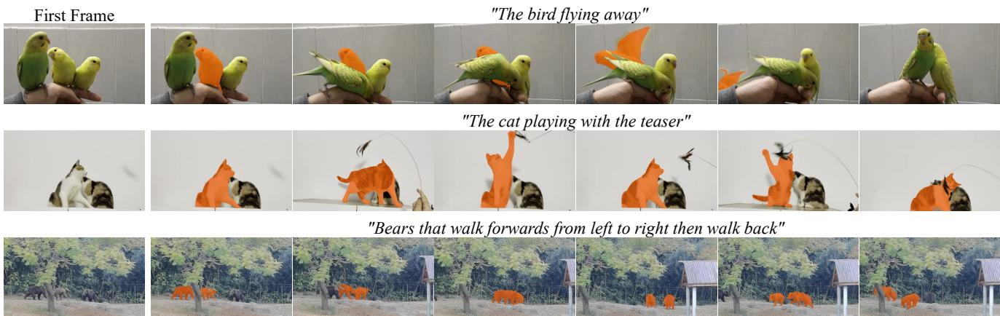
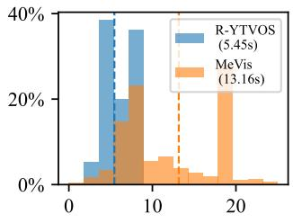
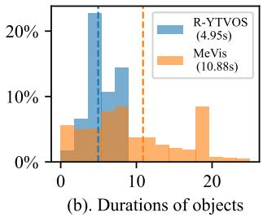
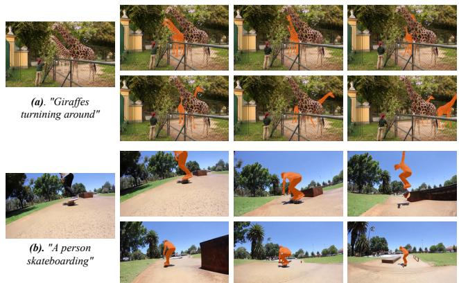
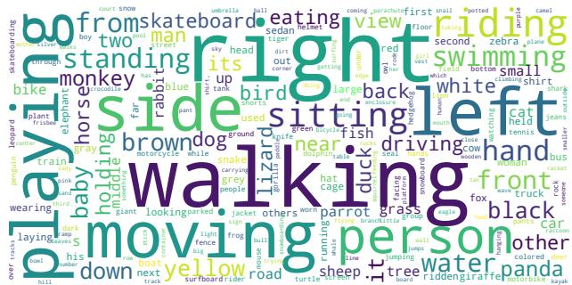
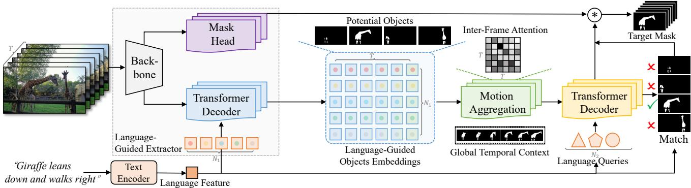
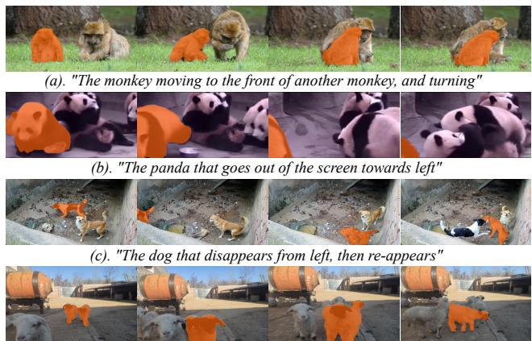

# MeViS: A Large-scale Benchmark for Video Segmentation with Motion Expressions

Henghui Ding† Chang Liu‡ Shuting He‡ Xudong Jiang‡ Chen Change Loy† †S-Lab, Nanyang Technological University ‡School of EEE, Nanyang Technological University https://henghuiding.github.io/MeViS

  
Figure 1. Examples of video clips from Motion expressions Video Segmentation (MeViS) are provided to illustrate the dataset’s nature and complexity. The expressions in MeViS primarily focus on motion attributes and the referred target object cannot be identified by examining a single frame solely. For instance, the first example features three parrots with similar appearances, and the target object is identified as “The birdflying away”. This object can only be recognized by capturing its motion throughout the video.

## Abstract

This paper strives for motion expressions guided video segmentation, whichfocuses on segmenting objects in video content based on a sentence describing the motion of the objects. Existing referring video object datasets typically focus on salient objects and use language expressions that contain excessive static attributes that could potentially enable the target object to be identified in a single frame. These datasets downplay the importance of motion in video content for language-guided video object segmentation. To investigate the feasibility of using motion expressions to ground and segment objects in videos, we propose a large-scale dataset called MeViS, which contains numerous motion expressions to indicate target objects in complex environments. We benchmarked 5 existing referring video object segmentation (RVOS) methods and conducted a comprehensive comparison on the MeViS dataset. The results show that current RVOS methods cannot effectively address motion expression-guided video segmentation. We further analyze the challenges and propose a baseline

approach for the proposed MeViS dataset. The goal of our benchmark is to provide a platform that enables the development of effective language-guided video segmentation algorithms that leverage motion expressions as a primary cue for object segmentation in complex video scenes. The proposed MeViS dataset has been released at https://henghuiding.github.io/MeViS.

## 1. Introduction

Language-guided video segmentation is an emerging field that involves segmenting and tracking target objects using natural language expressions. This field has traditionally been a sub-branch of semi-supervised video object segmentation, where referring expressions are used to describe the target object. Existing referring video object datasets, such as [13, 21, 44], commonly feature videos with isolated and salient objects that have obvious static features. The corresponding expressions often contain static attributes such as object color, which can be observed in a single frame. As a result, motion properties of videos are often given less emphasis, and referring image segmentation methods can be used for referring video segmentation, achieving good results [1, 10, 21, 31].

In this paper, we wish to highlight the significance of temporal motion properties of videos and explore the potential of using motion expressions to segment objects in videos. To this end, we propose a new large-scale dataset called Motion expressions Video Segmentation (MeViS) to aid our investigation. The MeViS dataset comprises 2,006 videos with a total of 8,171 objects, and 28,570 motion expressions are provided to refer to these objects.

We take several steps to ensure that the MeViS dataset places emphasis on the temporal motions of videos. First, we carefully select video content that contains multiple objects that coexist with motion and exclude videos with isolated objects that can be easily described by static attributes. Second, we prioritize language expressions that do not contain static clues, such as category names or object colors, in cases where target objects can be unambiguously described by motion words alone. This is distinct from previous datasets, such as [13, 21, 44], which include obvious static clues in their expressions. Additionally, MeViS differentiates itself from referring image segmentation datasets, such as [20, 36, 53, 62], which do not account for the temporal properties of video content. Moreover, unlike existing referring video object segmentation datasets that focus on single-target expressions, where one expression refers to only one target object, MeViS expands this task to include multi-object expressions that refer to multiple target objects. This feature enables expressions to refer to an unlimited number of target objects, making the proposed MeViS more challenging and reflective of real-world scenarios.

The proposed MeViS dataset poses notable challenges in capturing and understanding motions in both video and language. The language expressions may describe motion that spans a random number of frames, requiring the capture of fleeting movements and long-term actions that occur throughout the entire video. This poses significant challenges for both understanding motion in the video content and in the accompanying language expressions. Capturing fleeting movements requires attention on each individual frame, while understanding long and complex movements that span across many frames demands temporal context across the entire video. With the proposed dataset, we benchmark 5 existing referring video object segmentation (RVOS) methods [2, 10, 11, 44, 55] and conduct a comprehensive comparison. The experimental results demonstrate that MeViS presents more challenges than existing datasets, and current RVOS methods are unable to effectively address motion expression-guided video segmentation.

In addition to proposing the MeViS dataset, we present a baseline approach, named Language-guided Motion Perception and Matching (LMPM), to address the challenges posed by the dataset. Our approach generates languageconditional queries to detect potential target objects in the video and represents them using object embeddings, which are more robust and computationally efficient than object feature maps [15]. We then perform Motion Perception on the object embeddings to capture the temporal context and obtain a global view of the video, enabling the model to understand both fleeting and long-term motions. Next, we use a Transformer decoder to decode language-related information from the motion-aggregated object embeddings and predict object trajectories. Finally, we perform similarity matching between the language features and the predicted object trajectories to identify the target object(s).

Our contributions provide a foundation for developing more advanced language-guided video segmentation algorithms that leverage motion expressions as a primary cue for object segmentation and identification in complex video scenes. In particular, we propose a new language-guided video segmentation dataset, MeViS, and conduct comprehensive evaluations of state-of-the-art referring video object segmentation methods on the MeViS dataset, providing a reference for future works. We also develop a simple baseline approach, LMPM, which points to potential solutions to some of the challenges and future research directions.

## 2. Related Work

Referring Image Segmentation. Referring image segmentation [5, 9, 10, 27, 28], also known as referring expression segmentation, involves grounding the target object in images based on natural language expressions that describe its properties and generating a corresponding segmentation mask. This task requires both language and image understanding and is one of the most fundamental yet challenging tasks in computer vision. Referring image segmentation was first introduced by Hu et al. [16] in 2016 and has received consideratble attention since then. In the pre-Transformer era, mainstream methods typically employed Fully Convolutional Networks (FCN) [6, 7, 34] and Recurrent Neural Networks (RNN) to extract image features and language features, respectively, and then fused the multimodal features via some specially designed modules [12,23, 30, 37]. For example, Liu et al. [30] introduced a Recurrent Multimodal Interaction (RMI) module to recurrently fuse the feature of each word into the image features. Li et al. [23] proposed a Recurrent Refinement Network (RRN) that progressively refines the segmentation mask based on pyramid features in FCN.

In addition to one-stage methods that fuse multi-modal features and conduct segmentation, some methods decouple referring image segmentation into instance segmentation and language-object matching [19, 29, 61]. For instance, Yu et al. use the off-the-shelf instance segmentation model Mask R-CNN [14] to detect all instances first and then select the one that best matches the language as output. A holistic understanding of language and vision information is crucial for referring image segmentation, and many works have explored this direction [18, 58, 60]. For instance, Ye et al. introduce a Cross-Modal Self-Attention (CMSA) model [60] to select the most meaningful words in the expression and pixels in the image to achieve better contextual understanding. Recently, the success of Transformer [47] in vision tasks has inspired many studies in referring image segmentation. Ding et al. [9, 10] first introduced Transformer into referring segmentation and proposed a Vision-Language Transformer (VLT). Following Ding et al. [9, 10], more Transformer-based methods have been proposed [22,52,59]. For example, Wang et al. [52] employ the Vision-Language Decoder to deal with visual and text tokens extracted by CLIP [43]. Yang et al. [59] focus on multi-modal feature fusion and propose a Language-Aware Vision Transformer (LAVT).

Referring Video Segmentation. Referring video object segmentation is an emerging area [3, 17, 31, 38, 39, 45, 46, 49, 50, 54, 57, 63] that aims to segment the target object indicated by a given expression across the entire video clip. It was first introduced in 2018 by A2D [13] and DAVIS17- RVOS [21], where A2D [13] seeks to segment actors according to descriptions of their actions in video content, and DAVIS17-RVOS [21] replaces masks with language as the reference for the target object in video object segmentation. Later, Seo et al. [44] built the Refer-YouTube-VOS based on the YouTube-VOS-2019 dataset [56]. These datasets typically provide an expression for a single object, and the expression usually describes the static attributes of the target object, such as its color and shape.

Existing methods typically treat referring video segmentation as a form of semi-supervised video object segmentation [41] by replacing mask reference with language reference. For instance, Khoreva et al. [21] employ the referring image segmentation method MAttNet [61] to achieve frame-level segmentation and then perform post-processing for temporal consistency. URVOS [44] employs crossmodal attention to perform per-frame segmentation and propagate the mask across clips with a memory attention module. RefVOS [1] independently segments each frame based on the fused features of language and image/frame, without utilizing temporal information. Liang et al. [26] introduces a top-down approach that first detects all object tracklets and then selects the target object by matching between language and tracklet features. Most recently, ReferFormer [55] and MTTR [2] employ Transformer [47] to address referring video object segmentation.

## 3. MeViS Dataset

In this section, we introduce the newly built large-scale dataset MeViS by first presenting the video collection and

annotation process in Section 3.1 and then providing the dataset statistics and analysis in Section 3.2.

## 3.1. Motion Expression Annotation

Video Collection. We gather and choose videos from publicly available video segmentation datasets with highquality mask annotations [8, 42, 48, 51], and select the ones that meet our criteria for motion and object complexity. Our selection process involves the following rules:

R1. We only include videos that have multiple objects within the frame in MeViS; videos with only one or two salient objects are not considered. We specifically look for videos that depict many objects with similar appearances, such as the first example video in Figure 1 which shows three yellow parrots.

R2. We select videos that contain objects that demonstrate substantial motion and movement. Videos depicting objects that have little or no motion are excluded.

After reviewing over 4,000 potential candidates, we carefully selected the most appropriate and suitable videos that meet our rigorous standards for both visual and linguistic content. Ultimately, by prioritizing quality over quantity, we chose 2,006 videos to create a benchmark that is diverse and representative of a wide range of real-world video scenarios. The basic language annotation methodology and procedure for MeViS follow the ReferIt [20], which is an interactive game-like approach that involves two players taking turns to annotate and validate. The following section will introduce the process of language expression annotation and validation in more detail.

Language Expression Annotation. We developed a webbased annotation system for annotating language expressions. The system randomly selects a video from the MeViS dataset and displays all object masks of the selected video on the web system. The annotator needs to choose one or several objects from the video and write the corresponding referring expression according to the guidelines for annotating language expressions. To ensure that the language expressions in our dataset align with our focus on motion-based video segmentation, we established several guidelines for annotating the language expressions:

A1. Target objects must exhibit significant motion. Objects that remain stationary or only demonstrate minimal motion should be disregarded.

A2. If an object can be unambiguously described by its motion or action, static attributes such as color should not be included in the expression.

A3. If multiple objects cannot be differentiated based solely on their motion or action, they can be described together if their motion or action can unambiguously identify them, such as “The two lions fighting and running amidst a group oflions.”

Table 1. Statistics of representative language-guided video segmentation datasets. The newly built MeViS has the largest number of objects and language expressions. More importantly, MeViS focuses on segmenting objects in the videos indicated by motion expressions. Th MeViS enables the investigation of the feasibility of using motion expressions for object segmentation and grounding in videos.
<table><tr><td>Dataset</td><td>Year</td><td>Pub.</td><td>Video</td><td>Object</td><td>Expression</td><td>Mask</td><td>Object/ Video</td><td>Object/ Experission</td><td>Target</td></tr><tr><td>A2D Sentence [13]</td><td>2018</td><td>CVPR</td><td>3,782</td><td>4,825</td><td>6,656</td><td>58k</td><td>1.28</td><td>1</td><td>Actor</td></tr><tr><td>J-HMDB Sentence [13]</td><td>2018</td><td>CVPR</td><td>928</td><td>928</td><td>928</td><td>31.8k</td><td>1</td><td>1</td><td>Actor</td></tr><tr><td>DAVIS16-RVOS [21]</td><td>2018</td><td>ACCV</td><td>50</td><td>50</td><td>100</td><td>3.4k</td><td>1</td><td>n/a</td><td>Object</td></tr><tr><td>DAVIS17-RVOS [21]</td><td>2018</td><td>ACCV</td><td>90</td><td>205</td><td>1,544</td><td>13.5k</td><td>2.27</td><td>1</td><td>Object</td></tr><tr><td>Refer-Youtube-VOS [44]</td><td>2020</td><td>ECCV</td><td>3,978</td><td>7,451</td><td>15,009</td><td>131k</td><td>1.86</td><td>1</td><td>Object</td></tr><tr><td>MeViS (ours)</td><td>2023</td><td>ICCV</td><td>2,006</td><td>8,171</td><td>28,570</td><td>443k</td><td>4.28</td><td>1.59</td><td>Object(s)</td></tr></table>

A4. If it is not possible to differentiate single or multiple objects based solely on their motion or action, limited static attributes can be included in the expression.

Language Expression Validation. Upon receiving annotated “video-object-expression” samples from the annotators, the validation process begins by displaying the video and expression and prompting the validator to select and submit the objects referred to in the expression. The validator must find the targets independently and submit their selection. The system then compares the targets chosen by the validator with the annotations submitted by the annotator. A sample is considered valid if the validator and annotator independently selected the same target object(s) using the same expression. If the targets selected by the validator do not match the annotation submitted by the annotator, the sample will be forwarded to another validator for a second opinion. If the second validator also fails to identify the correct targets, the sample will be considered invalid and excluded from the dataset. Validators have the authority to reject samples that are deemed inappropriate or fall short of quality standards. Moreover, we stress the importance of the following validation criterion:

V1. The corresponding sentence will be removed from the dataset when the target object described by a sentence can be identified through a single frame without the need for motion information.

By establishing these validation criteria, we aim to ensure that the language sentences in our dataset accurately express motion and are of high quality, while also increasing the level of difficulty in the language-guided video segmentation task, thereby enabling a more robust evaluation of the performance of different models and methods.

## 3.2. Dataset Analysis and Statistics

In Table 1, we present a statistical analysis of the newly proposed MeViS dataset, using 5 previous referring video object segmentation datasets as references, including A2D Sentence [13], J-HMDB Sentence [13], DAVIS16- RVOS [21], DAVIS17-RVOS [21], and Refer-Youtube-VOS [44]. As shown in Table 1, MeViS contains 2,006 videos and 8,171 objects. Compared to Refer-Youtube-VOS [44], which is based on the existing VOS dataset [56], MeViS has more objects (8,171 vs. 7,451), more expressions (28,570 vs. 15,009), and more annotation masks (443k vs. 131k). In the following, we discuss how the proposed dataset MeViS intentionally increases the complexities of language-guided video segmentation by considering the challenges of both linguistic and visual modalities.

  
(a). Durations of videos

  
Figure 2. The duration of videos and objects of MeViS and Refer-Youtube-VOS [44], in seconds. The vertical lines and values in the legends represent the mean duration across the two datasets. The duration of both videos and objects in MeViS is significantly longer than Refer-Youtube-VOS.

• Video Content. As shown in Table 1, MeViS has an average of 4.28 objects per video, which is higher than previous datasets. Furthermore, as depicted in Figure 2, MeViS contains longer videos, with an average duration of 13.16 seconds, which is significantly longer than the Refer-Youtube-VOS dataset. These intentional design choices make MeViS more complex and challenging for languageguided video segmentation. This is in contrast to existing datasets such as A2D Sentence [13] and DAVIS16- RVOS [21], where only one or two salient objects per category are present, and the model can choose the most prominent object as the target or identify the target object based on the category name. For example, in Figure 3(b), there is only one person in the foreground, and the model can simply identify the target by the term “a person” while ignoring “skateboarding”. The proposed MeViS dataset addresses this limitation by selecting videos with more objects that have diverse and dynamic motions. Moreover, MeViS features many videos with objects of the same category, such as a group of tigers or rabbits. For instance, in Figure 3(a), there are three giraffes with highly similar appearances, and the most salient/foreground one is not the target object in this sample, making it challenging to identify the target object(s) through saliency or category information alone. By including more challenging videos, MeViS better simulates real-world scenarios, making it a valuable resource for studying motion expression-guided video understanding in complex environments.

  
Figure 3. (a) Example from MeViS. (b) Example from Refer-Youtube-VOS [44]. Compared to Refer-Youtube-VOS: • Videos in MeViS contain more objects in complex environments, making it impossible to identify the target object via saliency or category information alone. • The number of target objects indicated by language expression in MeViS is arbitrary, from 1 to many.

Target Object(s). As we have included longer videos in our MeViS dataset, we have also observed a significant increase in the duration of target objects, ensuring adequate object motions. As shown in Figure 2(b), the object durations in our dataset have an average of 10.88 seconds, which is more than two times longer than the average duration of Refer-Youtube-VOS. Compared to previous datasets, such as A2D Sentence [13] and J-HMDB Sentence [13], which focus on salient actions of a few categories [44], our MeViS dataset includes more categories from open-world [8, 42, 48, 51], presenting improved difficulties in the diversity of target objects. Besides, as shown in Table 1, previous datasets usually have one sentence referring to one single object, which means that finding multiple objects requires multiple expressions, and each object must be searched for individually\*. In contrast, we add a more natural way of selecting target objects, where one expression may refer to several objects, denoted as “multi-object expression”. An example of multi-object expression is shown in Figure 3(a), where “Giraffes that turns around” refers to two giraffes.

  
Figure 4. Word cloud of the top 100 words in the MeViS dataset. MeViS has a large number of words that describe motions, like “walking”, “moving”, “playing”, and many position words that are related to motions, such as “left”, “right”.

As shown in Table 1, on average, each expression in MeViS refers to 1.59 objects, which is larger than existing datasets where the average is only 1 object per expression.

Language Expression. One of the key distinguishing aspects of the MeViS dataset is its emphasis on describing object motions in language expressions. The previous largest RVOS dataset Refer-Youtube-VOS [44] provides two types of language annotations: full-video expression and firstframe expression. The first-frame expression is based solely on static attributes of the first frame image, whereas the fullvideo expression considers the entire video. However, in many cases, even the full-video expressions contain static attributes that could potentially enable the target object to be identified in a single frame, for example, “A person on the right dressed in blue black...”. In contrast, to explore the practicality of employing motion expressions for object localization and segmentation in videos, MeViS is intentionally designed to include a range of diverse and dynamic object motions, making it more challenging to identify the target object based on static attributes alone. In MeViS, there are significantly more motion expressions that explicitly identify the target object based on its distinctive actions or movements. The language expressions in the proposed MeViS contain more motion attributes, such as object position moving through the video and actions that span several frames. The word cloud of the newly proposed MeViS is visualized in Figure 4. From the word cloud figure, we can observe that MeViS dataset has a large number of words that describe motions, like “walking”, “moving”, “playing”, and many relative directions that are related to motions, such as “left”, “right”, etc.

## 4. Experiment

Evaluation Metrics. Similar to previous studies such as [21,44], we employ two widely used metrics, \protect \mathcal {J} and \protect \mathcal {F}, to assess the performance of methods on the newly proposed MeViS dataset. The region similarity metric \protect \mathcal {J} computes the Intersection over Union (IoU) of the predicted and ground-truth masks, which reflects the quality of the segmentation. The F-measure \protect \mathcal {F} reflects the contour accuracy of the prediction. To provide a comprehensive evaluation of the method’s overall effectiveness, we calculate the average of these two metrics, denoted as $\mathcal { I } \& \mathcal { F } _ { \cdot }$

Table 2. Temporal Context (TC) shows varying impacts on 3 datasets. Imagebased methods, like VLT [10], can achieve state-of-the-art performance on $\mathrm { D A V I S } _ { 1 7 ^ { - } } \mathrm { R V O S }$ [21] and Refer-Youtube-VOS (RYV) [44], but cannot well handle the harder motion challenges in MeViS that require temporal context.
<table><tr><td>Methods</td><td>Type</td><td>Temporal</td><td> $\mathrm { D A V I S _ { 1 7 } – R V O S }$ </td><td>RYV</td><td>MeViS</td></tr><tr><td>VLT [10]</td><td>Image</td><td>1 frame</td><td>60.4</td><td>63.1</td><td>27.8</td></tr><tr><td>RFormer [55]</td><td>Video</td><td>5 rand. frames</td><td>60.2</td><td>62.8</td><td>31.0</td></tr><tr><td> $\mathrm { V L T + T C }$ </td><td>Video</td><td>All frames</td><td>60.3</td><td>62.7</td><td>35.5</td></tr><tr><td> $\mathrm { R F o r m e r + T C }$ </td><td>Video</td><td>All frames</td><td>59.9</td><td>63.0</td><td>36.3</td></tr></table>

Dataset Setting. The MeViS dataset is a large-scale dataset that consists of a total of 2,006 videos along with 28,570 sentences. These videos are split into three subsets, i.e., training set, validation set, and testing set, which contain 1,712 videos, 140 videos, and 154 videos, respectively.

## 4.1. Dataset Necessity and Challenges

To show the necessity and validity of MeViS in motion expression understanding, we compare the results of stateof-the-art referring image segmentation method VLT [10] and referring video segmentation method ReferFormer [55] on $\mathrm { D A V I S } _ { 1 7 } – \mathrm { R V O S }$ [21], Refer-Youtube-VOS [44], and MeViS, as shown in Table 2. When trained on referring video segmentation dataset, such as Refer-Youtube-VOS [44] and testing on itself, the image-based method VLT [10] that does not use any temporal design can achieve exceptional results of 60.4% $\mathcal { T } \& \mathcal { F }$ and 63.1% $\mathcal { T } \& \mathcal { F }$ on video datasets $\mathrm { D A V I S } _ { 1 7 ^ { - } } \mathrm { R V O S }$ [21] and Refer-Youtube-VOS [44], respectively, which are even better than video method ReferFormer [55]. The results suggest that for $\mathrm { D A V I S } _ { 1 7 } – \mathrm { R V O S }$ [21] and Refer-Youtube-VOS [44], the temporal context is not essential, and image-based methods that use static clues can achieve good performance on these two datasets. However, on the proposed MeViS, VLT [10] only achieves a score of 27.8% J&F, suggesting that referring image segmentation methods without temporal designs struggle to address the unique challenges presented by videos in our dataset, particularly in handling motion, despite their success on other benchmark datasets. Furthermore, by comparing the results of VLT [10] with ReferFormer [55], which is trained using five randomly selected frames from the video, we find that ReferFormer outperforms VLT by a large margin of 3.2% in terms of $\mathcal { T } \& \mathcal { F }$ . This further highlights the importance of analyzing long-term motions in the MeViS dataset. In order to further prove this point, we enhance VLT and ReferFormer by incorporating an attention module at the head to perceive and gather global temporal context $\binom { 6 6 } { \it { 1 } } \mathrm { { T C } } ^ { \mathrm { { , } } \mathrm { { , } } }$ in Table 2).

Table 3. Image-video cross-dataset validation. We train the models on referring image segmentation dataset Ref-COCO/+/g, and test their performance on three different video datasets. The models trained on images perform worse on MeViS than on the other two datasets.
<table><tr><td colspan="4">Training on Referring Image Segmentation Dataset</td></tr><tr><td>Methods</td><td>Type</td><td> $\overline { { \mathrm { D A V I S } _ { 1 7 } { \mathrm { - R V } } \mathrm { O S } } }$  RYV</td><td>MeViS</td></tr><tr><td>VLT [10]</td><td>Image 54.2</td><td>46.1</td><td>22.5</td></tr><tr><td>RFormer [55] Video</td><td>55.6</td><td>45.2</td><td>27.0</td></tr></table>

For module details, please refer to “Motion Perception” in Section 4.2. Adding temporal context via this module results in both VLT and ReferFormer achieving a performance gain of approximately 5% J&F, underscoring the significance of temporal context for MeViS. However, it is worth noting that longer temporal information does not necessarily lead to better performance on $\mathrm { D A V I S } _ { 1 7 ^ { - } } \mathrm { R V O S }$ and Refer-Youtube-VOS.

We also conduct a cross-dataset experiment by training on referring image segmentation datasets and testing on referring video segmentation datasets. The results in Table 3 show that both the image-based method VLT [10] and video-based method ReferFormer [55] achieve competitive results on Refer-Youtube-VOS [44] and ${ \mathrm { D A V I S } } _ { 1 7 ^ { - } }$ RVOS [21] when trained on image datasets Ref-COCO, Ref-COCO+, and Ref-COCOg. These results suggest that the expressions in Refer-Youtube-VOS [44] and DAVIS17- RVOS [21] provide static clues like in the image domain, and many target objects can be identified by examining a single frame solely. In contrast, when trained on referring image segmentation datasets and tested on MeViS, both VLT [10] and ReferFormer [55] perform worse, indicating that there is a significant expression-gap (e.g., static vs. motion) between MeViS and these image domain datasets.

## 4.2. LMPM: A Simple Baseline Approach

The MeViS dataset introduces unique challenges in detecting and understanding object motions in both video and language contexts. The motions described by language expressions can occur over a random number of frames, making it necessary to capture fleeting actions and movements that occur throughout the entire video. This presents significant challenges for recognizing motions in the video content and the corresponding language expressions. Detecting fleeting actions requires meticulous perceiving of every frame while comprehending complex and extended motion spanning multiple frames requires contextual understanding across the entire duration of the video. Current state-of-the-art methods, such as [2, 11, 55], rely on random sampling of a few frames, which may miss frames containing crucial information described by the given expression. Furthermore, these methods fail to effectively extract temporal contextual information and instead simply use spatial-temporal feature extractors due to the significant burden on computational resources of temporal communication. Additionally, as illustrated in Section 3, objects described by language expressions can vary from one to multiple, requiring the output to cover from one to an arbitrary number of objects.

  
Figure 5. The overview architecture of the proposed baseline approach Language-guided Motion Perception and Matching (LMPM). We first detect all possible target objects in each frame of the video and use object embeddings to represent them through Language-Guided Extractor. Then, Motion Perception is conducted on all the object embeddings of the video to grasp the global temporal context. By leveraging language queries and object embeddings with motion information, we generate object trajectories through a Transformer Decoder. Finally, we match the language features with the predicted object trajectories to identify the target object(s).

To address the challenges posed by the MeViS dataset, we propose a baseline approach called Language-guided Motion Perception and Matching (LMPM), which is depicted in Figure 5. LMPM generates $N _ { 1 }$ language-based queries to identify potential target objects in the video, across T frames, and produces object embeddings to represent each of them. Using language queries instead of conventional object queries can filter out irrelevant objects and ensure the efficiency and effectiveness of subsequent operations [9, 10]. Inspired by VITA [15], we represent objects using object embeddings, which provide instance-specific information, to reduce computational requirements [24,25]. After obtaining object embeddings from frames in the video, we perform motion perception by inter-frame selfattention on the object embeddings to obtain a global view across T frames. Motion perception enables object embeddings to capture temporal contextual information that spans multiple frames, or even the entire video. Then, we use $N _ { 2 }$ language queries as the query and the object embeddings after Motion Perception as the key and value for the Transformer decoder. The Transformer decoder decodes language-related information from all object embeddings and aggregates relevant information to predict object trajectories. Finally, we match the language features with the predicted object trajectories to identify the target object(s). Rather than only selecting the best-matched object trajectory, we use a matching threshold σ to choose object trajectories only if their similarity with the language features exceeds the threshold σ. This enables the model

Table 4. Ablation study of the baseline approach LMPM.
<table><tr><td>ID</td><td></td><td>Language Query Motion Perception Matching</td><td></td><td> $\mathcal { I } \& \mathcal { F }$ </td></tr><tr><td>i</td><td>√</td><td>X</td><td>X</td><td>31.0</td></tr><tr><td>ii</td><td>√</td><td>√</td><td>X</td><td>36.3</td></tr><tr><td>iii</td><td>√</td><td>√</td><td>√</td><td>37.2</td></tr></table>

to handle not only single-object expressions but also multiobject expressions, which is a unique feature of MeViS.

Implementation Details. We set all the hyper-parameters related to the Language-Guided Extractor to the default settings of Mask2Former [4], including the backbone, Transformer decoder. We train 150,000 iterations using AdamW optimizer [35] with a learning rate of 0.00005. Tiny Swin Transformer [33] is employed as our backbone in all the experiments. The input frames are resized to have a minimum size of 448 pixels on the shorter side during inference. Motion Perception consists of six layers, and the Transformer decoder employs three layers. For the hyperparameter settings, we set σ, $N _ { 1 }$ and $N _ { 2 }$ to 0.8, 20, and 10, respectively. We use RoBERTa [32] as a text encoder that is consistent with the ReferFormer and is frozen all the time.

Ablation study of LMPM. In Table 4, we present an ablation study of the baseline approach LMPM. We perform the following three experiments: (i) First, we use language queries to detect potential target object trajectories and output the best trajectory, similar to ReferFormer [55]. This variant achieves a $\mathcal { T } \& \mathcal { F }$ score of 31.0%. It relies solely on language information with 5 randomly sampled frames and neglects global temporal context across the video, making it unable to effectively process long-term motions. (ii) With the help of Motion Perception, the $\mathcal { T } \& \mathcal { F }$ score significantly improves by 5.3%, as it captures temporal contextual information and a global view of the entire video, which are critical for MeViS. (iii) Since MeViS contains multi-objects expressions, outputting only the object with the highest score is insufficient. We introduce a matching mechanism to identify the target object(s), enabling our method to handle not only single-object expressions but also multi-object expressions. This variant outperforms (ii) by 0.9% in terms of J&F score.

Table 5. MeViS Benchmark Results.
<table><tr><td>Methods</td><td> $\overline { { \mathcal { I } \& \mathcal { F } } }$ </td><td>J</td><td>F</td></tr><tr><td>URVOS [44]</td><td>27.8</td><td>25.7</td><td>29.9</td></tr><tr><td>LBDT [11]</td><td>29.3</td><td>27.8</td><td>30.8</td></tr><tr><td>MTTR [2]</td><td>30.0</td><td>28.8</td><td>31.2</td></tr><tr><td>ReferFormer [55]</td><td>31.0</td><td>29.8</td><td>32.2</td></tr><tr><td>VLT+TC [10]</td><td>35.5</td><td>33.6</td><td>37.3</td></tr><tr><td>LMPM (ours)</td><td>37.2</td><td>34.2</td><td>40.2</td></tr></table>

## 4.3. MeViS Benchmark Results

Quantitative results. We performed a comprehensive evaluation of the MeViS dataset to assess the performance of existing methods in the more challenging motion-expression scenarios. We evaluated 1 modified image-based method VLT [10] and 4 recent state-of-the-art video-based methods, including URVOS [44], LBDT [11], MTTR [2], and Refer-Former [55], on the validation set† of MeViS. The evaluation results, presented in Table 5, indicate that the current state-of-the-art methods could only achieve performance ranging from 27.8% J&F to 31.0% J&F on the validation set of MeViS, while their results on other benchmarks like Refer-Youtube-VOS [44] and DAVIS17-RVOS [21] are usually above 60% J&F. Our experiments demonstrate that while notable progress has been made in languageguided video object segmentation on existing benchmarks, the challenges presented by MeViS underline the need for further exploration of motion expression-guided video segmentation in complex scenarios. These challenges can arise from various factors, including both linguistic and visual modalities, such as the use of motion expressions and highly dynamic objects or fast-paced motions in videos, which can impact the overall performance of algorithms.

Visualizations. Figure 6 displays some of the success and failure cases of the baseline approach LMPM. Example (a) and (b) depict successful cases where LMPM effectively processes expressions of long-term motions such as “moving to the front ...” and “goes out of the screen”. In contrast, example (c) and (d) are failure cases. In example (c), the expression involves the target object disappearing and reappearing, which poses a significant challenge for the model’s global understanding of the video. In this case, our model becomes disoriented after the target object reappears. Example (d) shows a sentence describing a longterm motion while involving multiple target objects. Our method successfully identifies the multiple targets, i.e., the

  
(d). "Two goats walking from the distance to the front, then turning back"

Figure 6. Example success and failure cases of LMPM.

“two goats walking from the distance”, at the beginning of the video. However, one of the targets is lost during the later stages of the video when the motions of objects became complex and tangled. These two failure cases demonstrate the complexity and challenges of MeViS, emphasizing the importance of a strong ability to comprehend the global temporal context of the entire video and to understand the motion expression for models working on MeViS.

## 5. Conclusion and Discussion

The ability to effectively understand and leverage motion expressions as a primary cue for object segmentation in videos remains an unresolved challenge that requires attention in future research. The proposed large-scale benchmark MeViS provides a foundation for developing more advanced language-guided video segmentation algorithms.

Future Directions. There are many interesting research directions and remaining challenges to be addressed with the MeViS dataset. These include but are not limited to: (i) exploring new techniques for better motion understanding and modeling in both visual and linguistic modalities, (ii) designing more elegant and robust models that can effectively handle diverse motion types spanning across a range of frames, including long-term/short-term and complex motions, (iii) developing advanced models that can handle complex scenes with various types of objects and expressions, (iv) creating more efficient models that can effectively reduce the number of redundant detected objects, (v) designing effective cross-modal fusion methods to better leverage the complementary information between language and visual signals, (vi) investigating the potential of transfer learning and domain adaptation in languageguided video segmentation, and (vii) developing methods that can better handle the open-world concepts in both the visual and linguistic domain. These challenges require significant research efforts to advance the state-of-the-art in language-guided video segmentation.

Acknowledgement. This study is supported under the RIE2020 Industry Alignment Fund – Industry Collaboration Projects (IAF-ICP) Funding Initiative, as well as cash and in-kind contribution from the industry partner(s). This study is also supported by the research grant of NTU Presidential Postdoctoral Fellowship. The data of MeViS is released for non-commercial research purposes only.

## References

[1] Miriam Bellver, Carles Ventura, Carina Silberer, Ioannis Kazakos, Jordi Torres, and Xavier Giro-i Nieto. A closer look at referring expressions for video object segmentation. Multimedia Tools and Applications, 2022. 2, 3

[2] Adam Botach, Evgenii Zheltonozhskii, and Chaim Baskin. Endto-end referring video object segmentation with multimodal transformers. In Proc. IEEE Conf. Comput. Vis. Pattern Recognit., 2022. 2, 3, 6, 8

[3] Weidong Chen, Dexiang Hong, Yuankai Qi, Zhenjun Han, Shuhui Wang, Laiyun Qing, Qingming Huang, and Guorong Li. Multi-attention network for compressed video referring object segmentation. In ACM Int. Conf. Multimedia, 2022. 3

[4] Bowen Cheng, Ishan Misra, Alexander G Schwing, Alexander Kirillov, and Rohit Girdhar. Masked-attention mask transformer for universal image segmentation. In Proc. IEEE Conf. Comput. Vis. Pattern Recognit., 2022. 7

[5] Henghui Ding, Scott Cohen, Brian Price, and Xudong Jiang. PhraseClick: toward achieving flexible interactive segmentation by phrase and click. In Proc. Eur. Conf. Comput. Vis., 2020. 2

[6] Henghui Ding, Xudong Jiang, Ai Qun Liu, Nadia Magnenat Thalmann, and Gang Wang. Boundary-aware feature propagation for scene segmentation. In Proc. IEEE Int. Conf. Comput. Vis., 2019. 2

[7] Henghui Ding, Xudong Jiang, Bing Shuai, Ai Qun Liu, and Gang Wang. Context contrasted feature and gated multi-scale aggregation for scene segmentation. In Proc. IEEE Conf. Comput. Vis. Pattern Recognit., 2018. 2

[8] Henghui Ding, Chang Liu, Shuting He, Xudong Jiang, Philip HS Torr, and Song Bai. MOSE: A new dataset for video object segmentation in complex scenes. In Proc. IEEE Int. Conf. Comput. Vis., 2023. 3, 5

[9] Henghui Ding, Chang Liu, Suchen Wang, and Xudong Jiang. Vision-language transformer and query generation for referring segmentation. In Proc. IEEE Int. Conf. Comput. Vis., 2021. 2, 3, 7

[10] Henghui Ding, Chang Liu, Suchen Wang, and Xudong Jiang. VLT: Vision-language transformer and query generation for referring segmentation. IEEE Trans. Pattern Anal. Mach. Intell., 2023. 2, 3, 6, 7, 8

[11] Zihan Ding, Tianrui Hui, Junshi Huang, Xiaoming Wei, Jizhong Han, and Si Liu. Language-bridged spatial-temporal interaction for referring video object segmentation. In Proc. IEEE Conf. Comput. Vis. Pattern Recognit., 2022. 2, 6, 8

[12] Guang Feng, Zhiwei Hu, Lihe Zhang, and Huchuan Lu. Encoder fusion network with co-attention embedding for referring image segmentation. In Proc. IEEE Conf. Comput. Vis. Pattern Recognit., 2021. 2

[13] Kirill Gavrilyuk, Amir Ghodrati, Zhenyang Li, and Cees GM Snoek. Actor and action video segmentation from a sentence. In Proc. IEEE Conf. Comput. Vis. Pattern Recognit., 2018. 1, 2, 3, 4, 5

[14] Kaiming He, Georgia Gkioxari, Piotr Dollar, and Ross Girshick.´ Mask r-cnn. In Proc. IEEE Int. Conf. Comput. Vis., 2017. 2

[15] Miran Heo, Sukjun Hwang, Seoung Wug Oh, Joon-Young Lee, and Seon Joo Kim. Vita: Video instance segmentation via object token association. In Proc. Adv. Neural Inform. Process. Syst., 2022. 2, 7

[16] Ronghang Hu, Marcus Rohrbach, and Trevor Darrell. Segmentation from natural language expressions. In Proc. Eur. Conf. Comput. Vis., 2016. 2

[17] Tianrui Hui, Shaofei Huang, Si Liu, Zihan Ding, Guanbin Li, Wenguan Wang, Jizhong Han, and Fei Wang. Collaborative spatialtemporal modeling for language-queried video actor segmentation. In Proc. IEEE Conf. Comput. Vis. Pattern Recognit., 2021. 3

[18] Tianrui Hui, Si Liu, Shaofei Huang, Guanbin Li, Sansi Yu, Faxi Zhang, and Jizhong Han. Linguistic structure guided context modeling for referring image segmentation. In Proc. Eur. Conf. Comput. Vis., 2020. 3

[19] Ya Jing, Tao Kong, Wei Wang, Liang Wang, Lei Li, and Tieniu Tan. Locate then segment: A strong pipeline for referring image segmentation. In Proc. IEEE Conf. Comput. Vis. Pattern Recognit., 2021. 2

[20] Sahar Kazemzadeh, Vicente Ordonez, Mark Matten, and Tamara Berg. ReferItGame: Referring to objects in photographs of natural scenes. In Proc. of the Conf. on Empirical Methods in Natural Language Process., Doha, Qatar, 2014. Association for Computational Linguistics. 2, 3

[21] Anna Khoreva, Anna Rohrbach, and Bernt Schiele. Video object segmentation with language referring expressions. In Proc. Asi. Conf. Comput. Vis., 2018. 1, 2, 3, 4, 5, 6, 8

[22] Namyup Kim, Dongwon Kim, Cuiling Lan, Wenjun Zeng, and Suha Kwak. Restr: Convolution-free referring image segmentation using transformers. In Proc. IEEE Conf. Comput. Vis. Pattern Recognit., 2022. 3

[23] Ruiyu Li, Kaican Li, Yi-Chun Kuo, Michelle Shu, Xiaojuan Qi, Xiaoyong Shen, and Jiaya Jia. Referring image segmentation via recurrent refinement networks. In Proc. IEEE Conf. Comput. Vis. Pattern Recognit., 2018. 2

[24] Xiangtai Li, Henghui Ding, Wenwei Zhang, Haobo Yuan, Jiangmiao Pang, Guangliang Cheng, Kai Chen, Ziwei Liu, and Chen Change Loy. Transformer-based visual segmentation: A survey. arXiv preprint arXiv:2304.09854, 2023. 7

[25] Xiangtai Li, Haobo Yuan, Wenwei Zhang, Guangliang Cheng, Jiangmiao Pang, and Chen Change Loy. Tube-link: A flexible cross tube baseline for universal video segmentation. ICCV, 2023. 7

[26] Chen Liang, Yu Wu, Tianfei Zhou, Wenguan Wang, Zongxin Yang, Yunchao Wei, and Yi Yang. Rethinking cross-modal interaction from a top-down perspective for referring video object segmentation. arXiv preprint arXiv:2106.01061, 2021. 3

[27] Chang Liu, Henghui Ding, and Xudong Jiang. GRES: Generalized referring expression segmentation. In Proc. IEEE Conf. Comput. Vis. Pattern Recognit., 2023. 2

[28] Chang Liu, Henghui Ding, Yulun Zhang, and Xudong Jiang. Multimodal mutual attention and iterative interaction for referring image segmentation. IEEE Trans. Image Processing, 2023. 2

[29] Chang Liu, Xudong Jiang, and Henghui Ding. Instance-specific feature propagation for referring segmentation. IEEE Trans. Multimedia, 2022. 2

[30] Chenxi Liu, Zhe Lin, Xiaohui Shen, Jimei Yang, Xin Lu, and Alan Yuille. Recurrent multimodal interaction for referring image segmentation. In Proc. IEEE Int. Conf. Comput. Vis., 2017. 2

[31] Si Liu, Tianrui Hui, Shaofei Huang, Yunchao Wei, Bo Li, and Guanbin Li. Cross-modal progressive comprehension for referring segmentation. IEEE Trans. Pattern Anal. Mach. Intell., 2021. 2, 3

[32] Yinhan Liu, Myle Ott, Naman Goyal, Jingfei Du, Mandar Joshi, Danqi Chen, Omer Levy, Mike Lewis, Luke Zettlemoyer, and Veselin Stoyanov. Roberta: A robustly optimized bert pretraining approach. arXiv preprint arXiv:1907.11692, 2019. 7

[33] Ze Liu, Yutong Lin, Yue Cao, Han Hu, Yixuan Wei, Zheng Zhang, Stephen Lin, and Baining Guo. Swin transformer: Hierarchical vision transformer using shifted windows. In Proc. IEEE Int. Conf. Comput. Vis., 2021. 7

[34] Jonathan Long, Evan Shelhamer, and Trevor Darrell. Fully convolutional networks for semantic segmentation. In Proc. IEEE Conf. Comput. Vis. Pattern Recognit., 2015. 2

[35] Ilya Loshchilov and Frank Hutter. Decoupled weight decay regularization. In Proc. Int. Conf. Learn. Represent., 2019. 7

[36] Junhua Mao, Jonathan Huang, Alexander Toshev, Oana Camburu, Alan L Yuille, and Kevin Murphy. Generation and comprehension of unambiguous object descriptions. In Proc. IEEE Conf. Comput. Vis. Pattern Recognit., 2016. 2

[37] Edgar Margffoy-Tuay, Juan C Perez, Emilio Botero, and Pablo´ Arbelaez. Dynamic multimodal instance segmentation guided by´ natural language queries. In Proc. Eur. Conf. Comput. Vis., 2018. 2

[38] Bruce McIntosh, Kevin Duarte, Yogesh S Rawat, and Mubarak Shah. Visual-textual capsule routing for text-based video segmentation. In Proc. IEEE Conf. Comput. Vis. Pattern Recognit., 2020. 3

[39] Ke Ning, Lingxi Xie, Fei Wu, and Qi Tian. Polar relative positional encoding for video-language segmentation. In IJCAI, 2020. 3

[40] Federico Perazzi, Jordi Pont-Tuset, Brian McWilliams, Luc Van Gool, Markus Gross, and Alexander Sorkine-Hornung. A benchmark dataset and evaluation methodology for video object segmentation. In Proc. IEEE Conf. Comput. Vis. Pattern Recognit., 2016. 5

[41] Jordi Pont-Tuset, Federico Perazzi, Sergi Caelles, Pablo Arbelaez,´ Alex Sorkine-Hornung, and Luc Van Gool. The 2017 davis challenge on video object segmentation. arXiv preprint arXiv:1704.00675, 2017. 3

[42] Jiyang Qi, Yan Gao, Yao Hu, Xinggang Wang, Xiaoyu Liu, Xiang Bai, Serge Belongie, Alan Yuille, Philip HS Torr, and Song Bai. Occluded video instance segmentation: A benchmark. Int. J. Comput. Vis., 130(8), 2022. 3, 5

[43] Alec Radford, Jong Wook Kim, Chris Hallacy, Aditya Ramesh, Gabriel Goh, Sandhini Agarwal, Girish Sastry, Amanda Askell, Pamela Mishkin, Jack Clark, et al. Learning transferable visual models from natural language supervision. In Proc. Int. Conf. Mach. Learn., 2021. 3

[44] Seonguk Seo, Joon-Young Lee, and Bohyung Han. Urvos: Unified referring video object segmentation network with a large-scale benchmark. In Proc. Eur. Conf. Comput. Vis., 2020. 1, 2, 3, 4, 5, 6, 8

[45] Mingjie Sun, Jimin Xiao, Eng GEE Lim, and Yao Zhao. Starting point selection and multiple-standard matching for video object segmentation with language annotation. IEEE Trans. Multimedia, 2022. 3

[46] Zongheng Tang, Yue Liao, Si Liu, Guanbin Li, Xiaojie Jin, Hongxu Jiang, Qian Yu, and Dong Xu. Human-centric spatio-temporal video grounding with visual transformers. IEEE Trans. Circuit Syst. Video Technol., 2021. 3

[47] Ashish Vaswani, Noam Shazeer, Niki Parmar, Jakob Uszkoreit, Llion Jones, Aidan N Gomez, Łukasz Kaiser, and Illia Polosukhin. Attention is all you need. In Proc. Adv. Neural Inform. Process. Syst., 2017. 3

[48] Paul Voigtlaender, Lishu Luo, Chun Yuan, Yong Jiang, and Bastian Leibe. Reducing the annotation effort for video object segmentation datasets. In Proc. IEEE Winter Conf. Appl. Comput. Vis., 2021. 3, 5

[49] Hao Wang, Cheng Deng, Fan Ma, and Yi Yang. Context modulated dynamic networks for actor and action video segmentation with language queries. In AAAI, 2020. 3

[50] Hao Wang, Cheng Deng, Junchi Yan, and Dacheng Tao. Asymmetric cross-guided attention network for actor and action video segmentation from natural language query. In Proc. IEEE Int. Conf. Comput. Vis., 2019. 3

[51] Weiyao Wang, Matt Feiszli, Heng Wang, and Du Tran. Unidentified video objects: A benchmark for dense, open-world segmentation. In Proc. IEEE Int. Conf. Comput. Vis., 2021. 3, 5

[52] Zhaoqing Wang, Yu Lu, Qiang Li, Xunqiang Tao, Yandong Guo, Mingming Gong, and Tongliang Liu. Cris: Clip-driven referring image segmentation. In Proc. IEEE Conf. Comput. Vis. Pattern Recognit., 2022. 3

[53] Chenyun Wu, Zhe Lin, Scott Cohen, Trung Bui, and Subhransu Maji. Phrasecut: Language-based image segmentation in the wild. In Proc. IEEE Conf. Comput. Vis. Pattern Recognit., 2020. 2

[54] Dongming Wu, Xingping Dong, Ling Shao, and Jianbing Shen. Multi-level representation learning with semantic alignment for referring video object segmentation. In Proc. IEEE Conf. Comput. Vis. Pattern Recognit., 2022. 3

[55] Jiannan Wu, Yi Jiang, Peize Sun, Zehuan Yuan, and Ping Luo. Language as queries for referring video object segmentation. In Proc. IEEE Conf. Comput. Vis. Pattern Recognit., 2022. 2, 3, 6, 7, 8

[56] Ning Xu, Linjie Yang, Yuchen Fan, Dingcheng Yue, Yuchen Liang, Jianchao Yang, and Thomas Huang. Youtube-vos: A large-scale video object segmentation benchmark. arXiv preprint arXiv:1809.03327, 2018. 3, 4

[57] Antoine Yang, Antoine Miech, Josef Sivic, Ivan Laptev, and Cordelia Schmid. Tubedetr: Spatio-temporal video grounding with transformers. In Proc. IEEE Conf. Comput. Vis. Pattern Recognit., 2022. 3

[58] Sibei Yang, Meng Xia, Guanbin Li, Hong-Yu Zhou, and Yizhou Yu. Bottom-up shift and reasoning for referring image segmentation. In Proc. IEEE Conf. Comput. Vis. Pattern Recognit., 2021. 3

[59] Zhao Yang, Jiaqi Wang, Yansong Tang, Kai Chen, Hengshuang Zhao, and Philip HS Torr. Lavt: Language-aware vision transformer for referring image segmentation. In Proc. IEEE Conf. Comput. Vis. Pattern Recognit., 2022. 3

[60] Linwei Ye, Mrigank Rochan, Zhi Liu, and Yang Wang. Cross-modal self-attention network for referring image segmentation. In Proc. IEEE Conf. Comput. Vis. Pattern Recognit., 2019. 3

[61] Licheng Yu, Zhe Lin, Xiaohui Shen, Jimei Yang, Xin Lu, Mohit Bansal, and Tamara L Berg. Mattnet: Modular attention network for referring expression comprehension. In Proc. IEEE Conf. Comput. Vis. Pattern Recognit., 2018. 2, 3

[62] Licheng Yu, Patrick Poirson, Shan Yang, Alexander C Berg, and Tamara L Berg. Modeling context in referring expressions. In Proc. Eur. Conf. Comput. Vis., 2016. 2

[63] Wangbo Zhao, Kai Wang, Xiangxiang Chu, Fuzhao Xue, Xinchao Wang, and Yang You. Modeling motion with multi-modal features for text-based video segmentation. In Proc. IEEE Conf. Comput. Vis. Pattern Recognit., 2022. 3