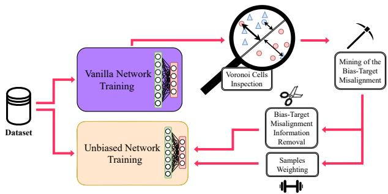
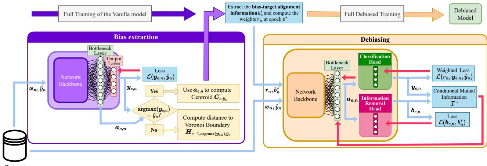
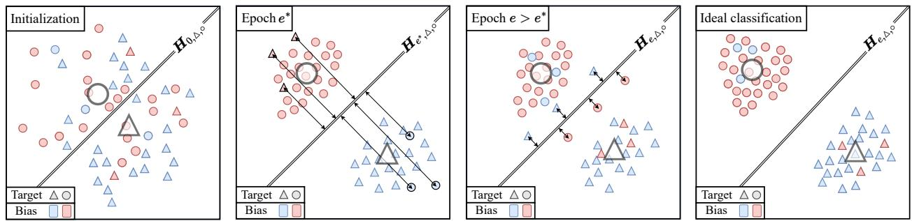
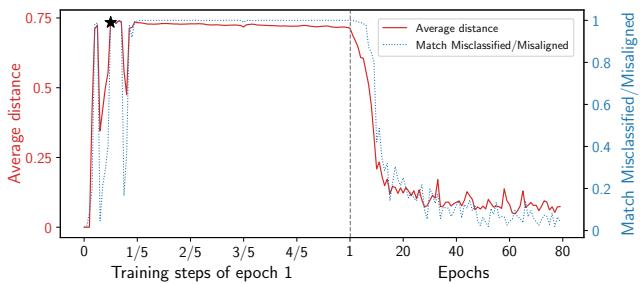

# Mining bias-target Alignment from Voronoi Cells

Remi Nahon Van-Tam Nguyen Enzo Tartaglione´ LTCI, Tel´ ecom Paris, Institut Polytechnique de Paris, France ´ {remi.nahon, van-tam.nguyen, enzo.tartaglione}@telecom-paris.fr

## Abstract

Despite significant research efforts, deep neural networks remain vulnerable to biases: this raises concerns about their fairness and limits their generalization. In this paper, we propose a bias-agnostic approach to mitigate the impact ofbiases in deep neural networks. Unlike traditional debiasing approaches, we rely on a metric to quantify “bias alignment/misalignment” on target classes and use this information to discourage the propagation of bias-target alignment information through the network. We conduct experiments on several commonly used datasetsfor debiasing and compare our method with supervised and bias-specific approaches. Our results indicate that the proposed method achieves comparable performance to state-of-the-art supervised approaches, despite being bias-agnostic, even in the presence ofmultiple biases in the same sample.

## 1. Introduction

Today, deep Neural Networks (DNNs) are renowned for their high performance and resilience in many areas of computer vision, such as image classification, semantic segmentation, and object detection, used in fields ranging from selfdriving vehicles to face recognition or surgical guidance. However, it is well known that their tendency to rely heavily on any type of correlation present in the training data exposes them to potential pitfalls [3, 16, 40]: some “spurious correlations” may be erroneously learned by the DNN. These can act as biases [35].

Learned biases can reduce the generalization of the DNN [3, 5, 8, 16, 24, 30]. For example, if a DNN has learned to distinguish airplanes flying in the sky from boats sailing in the ocean, the model will probably use the background as a base for its classification: detecting it instead of learning the vehicle shape is a much simpler task. However, the model does not generalize to scenarios such as a landing seaplane. Differently from domain adaptation [9, 29, 36], where the objective is to learn general features that compensate for the domain shift or to adapt extracted features to different domains, the goal of debiasing is to discourage the learning

  
Figure 1. Our proposed approach to agnostically remove the bias.

of spurious correlations.

Many current debiasing approaches rely on prior information about the bias, such as the existence of an auxiliary label indicating some side information, the presence of bias(es) or their quality [5, 6, 8, 11, 34, 37]. However, obtaining these labels or information on the nature of the bias can be either very costly (due to annotation costs) or very noisy: this is what motivates the development of biasagnostic approaches. Recent works have shown that bias features are learned “early” [26, 30]; there are bias-target aligned samples, for which the bias is learned, and the performance on the train set increases, and some misaligned ones, for which the prediction is wrong. Since bias-agnostic approaches delve into the biased information from the training set, it is common to amplify the first features learned using Generalized Cross-Entropy [41] and then discourage their learning in an “unbiased” model. However, there is no guarantee that the very first features learned are the biased ones: detecting them agnostically and effectively remains an open question.

In this work, we propose a method that identifies the best time to extract bias-target alignment information by observing the relative distance of misclassified samples to the Voronoi boundary of the correct target class. We use this information to train an unbiased model, where we give higher weight to bias-misaligned samples, and remove the biasalignment information from the bottleneck layer (Fig. 1).

At a glance, our contributions are the following:

• we propose a bias-agnostic approach that indicates, during the training of a vanilla model, when to extract bias-target alignment information. More precisely, we extract it when the distance of misclassified samples to the Voronoi boundary of the target class is maximal (Sec. 3.3);

• we use the bias alignment information to weight the loss contribution of every single sample: this will favor the learning of misaligned samples (Sec. 3.4.1);

• we propose an approach to eliminate bias information: specifically, we minimize the extractability of bias alignment information at the bottleneck of the DNN, conditioned to bias-target misalignment (Sec. 3.4.2);

• we study the behavior on several datasets typically used for debiasing and compare both supervised and bias-agnostic approaches: although our proposed technique is bias-agnostic, its performance is comparable to that of supervised approaches (Sec. 4.3).

## 2. Related works

We will review debiasing approaches below, which can be divided into supervised methods (where we have access to a “bias label”), and unsupervised methods.

## 2.1. Fairness methods

While bias can have ethical implications and some debiasing methods can be useful for Fairness, the goals of the two areas of research remain distinct. Fairness aims at minimizing the treatment inequalities between certain groups (according to some ethical principles [12, 14, 22, 39]) generated by classifiers that base their predictions on specific predetermined sets of features or classes (labeled as “sensitive”). Some fairness metrics measure these types of inequalities: Demographic Parity, Equalized Odds, or Equal Opportunity are some representative examples [12, 15, 17] and trying to lead the classifier to optimize them in its learning process can help mitigate unfair discriminations. Debiasing does not necessarily target the protection of specific sample groups or set the “sensitive” features in advance: it aims at promoting the learning of features that will generalize to a real-life distribution. In this work, we tackle debiasing approaches and we will therefore focus on it in the remainder of the article.

## 2.2. Supervised methods

Supervised debiasing methods are divided into three categories: pre-processing methods, which modify the dataset before classification; in-processing methods, which modify the learning process of the model; and post-processing methods, which directly modify the output of the DNN.

Preprocessing methods. Among the most used preprocessing methods in the literature, driven data augmentation plays a prominent role. Generative Adversarial Networks (GANs) are widely used to generate realistic images: Style-GANs [10] is indeed one of the mostly used GANs in this context. For example, Kang et al. [23] used it to generate handwritten text in specific styles. In image classification, Geirhos et al. [16] used style transfer to augment ImageNet with texture-bias-conflicting elements to create a more texture-balanced dataset.

Postprocessing methods. These methods have the advantage of neither re-training models nor requiring additional data for the training. With their Reject Option Classification, for example, Kamiran et al. [21] proposed to take the samples classified with the most uncertainty (outside a predefined confidence margin) and to change their class to decrease the Disparate Impact metric. In this same context, Equalized Odds Postprocessing proposed by Hardt et al. [17] maximizes the Equalized Odds metric. Despite the potential advantages of these approaches, a major drawback lies in the low degrees of freedom for the corrections (since they can only access post-classification information), which limits their practical effectiveness.

In-processing: debiasing within training. Most of the debiasing methods in the literature work directly on the model, learning from a biased dataset. In general, unbiased elements are weighted more than biased elements. This simple yet effective approach is nowadays very popular in supervised setups [20]. Other methods tackle supervised debiasing by adding regularization terms during the training of the deep model, which is the case of methods such as EnD [34] and FairKL [6]. Another intuitive approach relies upon simply removing the biased features from each sample in the dataset and performing the so-called fairness by blindness. However, the phenomenon known as encoding redundancy [17] states that information is very rarely encoded only once in the data [31], so removing a single value or label is probably not sufficient to remove the effect of the bias on classification.

## 2.3. Unsupervised methods

Some recent methods do not rely on bias labels because they can be difficult to obtain on real-life datasets and we will refer to them as “unsupervised” or “bias-agnostic”. All of these approaches follow a general scheme, which is typically divided into two phases: bias inference, where a first model, often called “bias capturing”, aims to capture biases in the data; and bias mitigation, where a second model is trained to avoid the biases captured by the first model. These approaches rely on prior knowledge, which may be more or less specific to the target task.

Bias is in the texture. Some work focuses on the bias specifically present in texture, as it is prominent in image classification [16]. Rebias [5], for example, promoted learning with representations that are maximally different from using small receptive fields in convolutional layers. These are biased-by-design, toward learning specific textures. For the same texture debiasing task, HEX [37] proposed to use the gray-level co-occurrence matrix and to promote representation independent of colors.

  
Figure 2. Overview of the proposed debiasing approach: the bias is first extracted (left) and then the unbiased model is trained (right). Blue arrows represent forward propagation while red arrows represent backpropagation.

Bias generates imbalances between groups. Some unsupervised approaches involve finding the bias groups that optimize some fairness metric and train the model to have representations orthogonal to those inferred by the biases. With DebiAN [27], Li et al. for example proposes a method that alternates between the training of bias-capturing and unbiased models, minimizing the Equal Opportunity fairness metric. In EIIL [13], Creager et al. identified biases by finding the groups that maximize violation of an invariance principle measured by the objective function IRMv1 [4]. Similarly, PGI [1] built upon EIIL by minimizing the KL-Divergence of the prediction over these groups.

Bias is learned early. Some recent methods are based on the assumption that bias features are easy to learn. These features can be extracted at a given point, at the beginning of the training. With LfF [30], Nam et al. proposed a loss reweighing method based on this assumption: they train a biased neural network and amplify its early stages prediction. In parallel, they train a debiased model increasing the weights of “difficult samples”. Based on this, with DFA [26], Lee et al. performed data augmentation attempting to disentangle bias features from intrinsic features through latent representations of the bias-capturing and unbiased models. Similarly, with LWBC [25], Kim et al. focus the training of their main classifier on the most “difficult samples” for their classifier committee. With PGD, Ahn et al. [2] use the magnitude of the sample gradient as a metric to increase their importance.

The closest competing strategy to the one we propose is LfF [30]. Differently from theirs, our main assumption is not that the first features learned by the model are biased:

we assume that the model, at some point, will adapt to the bias and that it is possible to identify this moment by examining the latent representation of the dataset. This particular point can occur at any time during the training, and so emphasizing the earlier choices of the model can prevent it from efficiently adapting to the bias. Moreover, unlike [30], we do not seek to extract the information from the bias, but its alignment with target classes, which allows our approach to easily scale to multi-biased setups.

## 3. Proposed Method

## 3.1. Overview of the proposed method

Let us consider a supervised learning setup, where we have a dataset D containing N input samples $( { \pmb x } _ { 1 } , . . . , { \pmb x } _ { N } ) \in \mathcal { X }$ , each associated to a ground truth target label $( \hat { y } _ { 1 } , . . . , \hat { y } _ { N } ) \in \mathcal { V }$ and an index $n \ \in \ \mathcal { N } _ { D }$ . A given deep neural network M, trained for e epochs, produces $\forall n \in N _ { \mathcal { D } }$ an output $\mathbf { \Delta } _ { \pmb { y } _ { e , n } }$ given some ${ \mathbf { \mathcal { x } } } _ { n } .$ , and is typically trained to match ${ \hat { y } } _ { n }$ through the minimization of a loss function $\mathcal { L } ( y _ { e , n } , \hat { y } _ { n } )$ . Unfortunately, this learning process does not impose any prior on the specific subset of features that are extracted, which leads to a biased prediction over unseen data. We want to fight this effect.

Fig. 2 provides an overview of the proposed debiasing approach. First, the bias is inferred by the learning of a vanilla model: at the end of each epoch (or after a few iterations), the target class centroids and the Voronoi boundaries between them are computed from the well-classified samples at the bottleneck layer (Sec. 3.2). The distance of the misclassified samples to the Voronoi boundary is computed to find the epoch e∗ when the bias-target alignment is maximally learned (Sec. 3.3). Then, a debiasing process follows (Sec. 3.4): from the distances gathered from the previous step, we assign each sample a weight, which will be used in the weighted loss (Sec. 3.4.1). In addition, at the bottleneck layer, we minimize the information about bias misalignment: this favors the unbiasedness of the classification head (Sec. 3.4.2). In the rest of this section, we will detail all the steps of our proposed technique.

## 3.2. Bottleneck latent representation

The debiasing method we propose stems from the concept of latent representation: the output of each layer of a DNN consists of a representation of the input ${ \mathbf { \mathcal { x } } } _ { n } .$ . Thus, the classification phase, which takes place just before the output of the model, consists in partitioning the feature space into each of the different classes. Therefore, the output of the bottleneck layer (the output of the backbone) is the compressed representation of the input sample, which is often referred to as latent representation. Therefore, each ${ \pmb x } _ { n }$ has a vector of latent attributes ${ \pmb a } _ { e , n } \in \mathbb { R } ^ { K }$ (where K is the number of neurons in the bottleneck layer) associated to a specific epoch (or iteration) e for the model M: this forms its latent bottleneck representation.

We define $\mathcal { D } _ { e } ^ { \parallel }$ the set of samples well classified by the model M at epoch e, and $\mathcal { D } _ { e } ^ { \perp }$ the misclassified samples. For each t-th target class (of T classes), it is possible to define a class centroid $\boldsymbol { C } _ { e , t }$ as the average of the bottleneck representations of each well-classified samples of the t-th target class:

$$
C _ { e , t } = \frac { 1 } { | \mathcal { D } _ { e , t } ^ { \parallel } | } \sum _ { n \in \mathcal { N } _ { \mathscr { D } _ { e , t } ^ { \parallel } } } { \mathbf { \mathscr { a } } _ { e , n } } ,\tag{1}
$$

where $\mathcal { D } _ { e , t } ^ { \parallel }$ is the subset of correctly classified samples for the t-th class, and | · | denotes the cardinality of a set. Such centroids are proxies for the representations of the correctly classified elements of the class by the model. Let us define Voronoi boundary ${ \cal { H } } _ { e , i , j }$ as the hyperplane equidistant from $C _ { e , i }$ and $\boldsymbol { C } _ { e , j }$ in the bottleneck representation space of M: ${ \cal { H } } _ { e , i , j }$ divides the latent space into two Voronoi cells of generators $\boldsymbol { C } _ { e , i }$ and $\boldsymbol { C } _ { e , j }$

In Fig. 3, we have two target classes (the triangles and the squares) and the bias is pictured as the color (blue and red). The first image (“Initialization”) shows the latent representation of the dataset by the model at its initialization: the samples are scattered randomly in the feature space, a first classification occurs, materialized by the Voronoi boundary ${ \cal H } _ { 0 , \triangle , \circ }$ . Ideally, as shown in the picture the furthest to the right (“Ideal classification”), a deep learning model should minimize the intra-class distance and maximize the interclass one. However, in the presence of bias, another kind of attractor can emerge: the bias-conflicting elements will be attracted by the wrong class. The more the model is biased, the more the sample clusters that form will represent the bias classes more than the target class. For instance, in the second picture, the samples are clustered by color and not by shape: the red triangles have been attracted by the circle class that is correlated with the color red. The samples misclassified at that specific moment are bias-target misaligned. If the model is, then, over-parametrized, the biased elements will be attracted as well towards the target centroid (third figure “Epoch $e > e ^ { *  } )$ : although a set of bias-misaligned features are learned, the model still holds biased ones, which leads to a subpar generalization performance: our first goal will be, hence, to detect the $e ^ { * }$ moment of the learning where it is possible to extract the bias-target misalignment information.

## 3.3. Bias alignment capture

To distinguish between bias-misaligned samples and bias-aligned ones, we assume that, after a few learning steps, the farther a misclassified sample is distant from its target Voronoi cell, the more it has been strongly pulled by an attractor. Such an attractor, since it is not its target class centroid, can be considered as resulting from some bias. Hence, when the average distance between the misclassified samples and their target Voronoi cell reaches its maximum, the model has learned bias features. This scenario is visualized in Fig. 3 (second figure “Epoch e∗”). To select the exact moment when to extract the bias-target alignment, we are looking for the epoch $e ^ { * }$ defined by:

$$
e ^ { * } = \underset { e } { \mathrm { a r g m a x } } \frac { \sum _ { i } d ^ { * } ( { \bf { a } } _ { e , n } ) } { | \mathcal { D } _ { e } ^ { \perp } | } ,\tag{2}
$$

where

$$
\begin{array} { r l r } & { } & { d ^ { * } ( { \pmb a } _ { e , n } ) = d ( { \pmb a } _ { e , n } , { \pmb H } _ { e , \mathrm { a r g m a x } ( { \pmb y } _ { e , n } ) , \hat { \pmb y } _ { n } } ) } \\ & { } & { \cdot ( 1 - \delta _ { \mathrm { a r g m a x } ( { \pmb y } _ { e , n } ) , \hat { \pmb y } _ { n } } ) , \qquad } \end{array}\tag{3}
$$

and $d ( a , H )$ indicates the $\ell _ { 2 }$ distance between a and the closest point of H and $\delta . ,$ is the Kronecker delta. At this point, we can collect the bias-target alignment information ${ { B } ^ { * } } \ = \ ( { { b } _ { n } ^ { * } } ) _ { n \in \mathcal { N } _ { D } }$ , where $\forall b \in \mathcal N _ { \mathcal D } , b _ { n } ^ { * } = \operatorname { a r g m a x } ( \pmb { y } _ { e * , n } )$ We can hereby identify the subset of bias-target misaligned samples $\mathcal { D } ^ { \perp } = \mathcal { D } _ { e ^ { * } } ^ { \perp }$ , and the set of bias-target aligned ones $\mathcal { D } ^ { \parallel } = \mathcal { D } _ { e ^ { * } } ^ { \parallel }$ Given that vanilla learning strategies employ weight-decay, where the distances tend to diminish when reaching the loss minimum, we propose to modify (3) as

$$
\begin{array} { l } { { d ^ { * } ( { \pmb a } _ { e , n } ) = d ( { \pmb a } _ { e , n } , { \pmb H } _ { e , \mathrm { a r g m a x } ( { \pmb y } _ { e , n } ) , \hat { \pmb y } _ { n } } ) } } \\ { ~ \cdot \left. \frac { 2 \cdot ( 1 - \delta _ { \mathrm { a r g m a x } ( { \pmb y } _ { e , n } ) , \hat { \pmb y } _ { n } } ) } { \| { \pmb C } _ { e , \mathrm { a r g m a x } ( { \pmb y } _ { e , n } ) } \| _ { 2 } + \| { \pmb C } _ { e , \hat { \pmb y } _ { n } } \| _ { 2 } } , \right. } \end{array}\tag{4}
$$

where we scale the distance by the averaged $\ell _ { 2 }$ norm (denoted by ∥ · ∥2) of the two considered centroids.

We highlight that our hypothesis is similar but substantially different, from the one formulated in LfF [30]: here, we are free from the assumption bias features are learned earlier than all the more robust ones by the models, and even more from the assumption that they are the very first features learned by the models.

  
Figure 3. Representation of latent representations of a dataset at different learning stages. The target classes are shapes and the bias is color. Arrows represent the distance between misclassified elements and the Voronoi boundary.

## 3.4. Debiasing the model

Once having extracted the bias alignment labels for each sample, we can start training and debiasing our actual model. In this work, we propose unbiased models having the same architecture and learning parameters as the biasextracting one, although no explicit constraint forbids us to use different models. Our approach here consists of modifying the objective function optimized during the training of the model with two goals: increasing the weight of the bias-misaligned samples (as they contain relevant information for generalization compared to other representatives of the same class) and moving these samples away from the bias centroid that tends to attract them.

## 3.4.1 Loss function reweighting

As shown by LfF [30] and other works like [20], reweighting the loss function to up-weigh the bias-conflicting elements is an efficient method to orient the training in a less biased direction as the correlation bias-target will be less emphasized in the loss. In this work, we assign the weight $r _ { n }$ to the n-th sample according to

$$
r _ { n } = \frac { 1 } { \rho _ { b _ { n } ^ { * } } } \cdot \delta _ { b _ { n } ^ { * } , \hat { y } _ { n } } + \frac { 1 } { 1 - \rho _ { b _ { n } ^ { * } } } \cdot ( 1 - \delta _ { b _ { n } ^ { * } , \hat { y } _ { n } } ) ,\tag{5}
$$

where we define

$$
\rho _ { t } = \frac { \Big | \mathscr { D } _ { e ^ { * } , t } ^ { \parallel } \Big | } { \Big | \mathscr { D } _ { e ^ { * } , t } ^ { \parallel } \cup \mathscr { D } _ { e ^ { * } , t } ^ { \perp } \Big | } .\tag{6}
$$

In a nutshell, misaligned samples receive a weight that is proportionally inverse to their cardinality in the t-th class. This has the effect of strongly encouraging the learning of bias-misaligned samples, over bias-aligned ones. In the feature space, we can interpret the resulting reweighted loss $\mathcal { L } ( \boldsymbol { r } _ { n } , \boldsymbol { y } _ { e , n } , \hat { \boldsymbol { y } } _ { n } )$ as an attractiveforce on the bias-misaligned samples, that are being pulled toward their class centroids.

## 3.4.2 Bias alignment information removal

Besides having a loss reweighting to favor misaligned sample learning, we can also discourage the model from learning any information related to bias alignment to the target. To estimate how much of this information is learned by the model, at the bottleneck we plug an auxiliary classification head that we call information removal head (IRH). This head is trained to minimize a cross-entropy loss $\mathcal { L } ( b _ { e , n } , b _ { n } ^ { * } )$ Its performance is an important indicator for us, as it reveals how much the latent space is similar (or different) from the vanilla bias-capturing model, when it was the most fitted to the bias (at epoch $e ^ { * } )$ , from the bias-target misalignment perspective. To estimate this similarity more precisely, we compute the mutual information between $\boldsymbol { B } = ( b _ { e , n } ) _ { n \in \mathcal { N } _ { D } }$ and $B ^ { * }$ under the bias misalignment condition as

$$
\mathcal { T } ^ { \perp } = \sum _ { j , k } p _ { B , B ^ { * } } ^ { \perp } ( j , k ) \log _ { T } \left[ \frac { p _ { B , B ^ { * } } ^ { \perp } ( j , k ) } { p _ { B } ^ { \perp } ( j ) p _ { B ^ { * } } ^ { \perp } ( k ) } \right] ,\tag{7}
$$

where

$$
p _ { \mathcal { B } , \mathcal { B } ^ { * } } ^ { \perp } ( j , k ) = \frac { 1 } { | \mathcal { D } ^ { \perp } | } \sum _ { n \in \mathcal { N } _ { \mathcal { D } } } \delta _ { j , b _ { n } ^ { * } } \sigma ( b _ { e , n } ) _ { k } ( 1 - \delta _ { b _ { n } ^ { * } , \hat { y } _ { n } } )\tag{8}
$$

is the joint probability between B and $B ^ { * }$ calculated on the bias-target misaligned samples, $\sigma$ is the softmax function and $p _ { B } ^ { \perp } , p _ { B } ^ { \perp } ,$ are the two marginals. (7) is differentiable, as we work with $\sigma ( b _ { e , n } )$ , the softmax-ed output of the IRH. Hence, we are allowed to minimize this term, eventually scaled by a hyper-parameter $\lambda _ { { \mathcal { T } } ^ { \perp } }$

As displayed in Fig. 2, the mutual information does not contribute to the IRH’s update but is propagated directly back to the backbone. Minimizing information over misaligned samples can be seen as a repulsive force, pushing them away from their attractor class. We focus on minimizing conditional mutual information to avoid pushing aligned samples away from their target class, preserving information needed for classification. In the next section, we will test and compare our approach with other state-of-the-art methods.

## 4. Experiments

Every result here presented is averaged over three seeds as done in most of the literature, and every algorithm is implemented in Python, using PyTorch 1.13, and trained on GPUs Nvidia GeForce RTX3090 Ti equipped with 24GB RAM.1 As we compare our method to the other unsupervised state-of-the-art methods, the best-unsupervised accuracies are systematically in bold and the second best are underlined. Besides, we highlight in red the best-overall to see how our method compares even to the supervised ones.

## 4.1. Datasets

Here below we describe at a glance the datasets employed for the quantitative evaluation. They were chosen to reflect different problematics bound to biases, from the very simple control case of Biased MNIST to multiple and different biases, synthetic and real-world images.

Biased MNIST. The first dataset we are using is Biased MNIST, which was first introduced by Bahng et al. [5]. The 60k samples of this dataset consist of a colored version of the famous handwritten digits dataset MNIST with some correlation $\rho$ between the color and the digits. To build it, first one specific color gets assigned to each of the ten digits; then each of the samples gets its background color. We will test on four levels of color-digit correlation $\rho \colon$ 0.99, 0.995, 0.997, and 0.999. The effect of the bias (namely, the background color) is evaluated by testing the model on a completely unbiased dataset, with $\rho = 0 . 1$

Multi-Color MNIST. Building on top of Biased MNIST, Li et al. proposed in [27] a bi-colored version to better benchmark the performance of current models on multiple biases at once. Here, the left and the right side of the background have two different colors, with a correlation to the target $\rho _ { L }$ for the left background color of the image and $\rho _ { R }$ for the right one. We follow their proposed setup, with $\rho _ { L } = 0 . 9 9$ and $\rho _ { R } = 0 . 9 5$

CelebA. CelebA [28] is a real-world dataset commonly used to test debiasing performance. It is a face classification dataset provided with 40 attributes for each of the 203k image samples. The task we solve here is to classify “blond” or “not blond” hair, with the main bias lying on the gender, as in the dataset there is a natural bias for “females” to have the “blond” attribute.

9-class ImageNet. The 9-class ImageNet dataset was proposed by [5], consisting of the extraction of a subset of 9 super-classes from ImageNet-1k, balanced to have each class correlated to a specific texture bias.

ImageNet-A. ImageNet-A was proposed by Hendrycks et al. in [18] as a subset of cropped images from ImageNet, purposely selected to be very hard to be classified by state-of-the-art CNNs. They were precisely selected among the subset misclassified by a cluster of ResNet-50 models. Following [5, 6, 19], we use it to test our performance when training on 9-class ImageNet.

Table 1. Results on Balanced Biased MNIST when training with different correlations color-digit ρ.
<table><tr><td rowspan="2">Method</td><td rowspan="2">Bias agnostic</td><td colspan="4">Test accuracy [%] (↑)</td></tr><tr><td> $\rho { = } 0 . 9 9 9$ </td><td> $\rho { = } 0 . 9 9 7$ </td><td> $\rho { = } 0 . 9 9 5$ </td><td>ρ=0.99</td></tr><tr><td>Vanilla</td><td>√</td><td>11.2</td><td>40.5</td><td>72.4</td><td>88.4</td></tr><tr><td>Rubi [8]</td><td>x</td><td>13.7</td><td>90.4</td><td>43.0</td><td>93.6</td></tr><tr><td>EnD [34]</td><td>x</td><td>52.3</td><td>83.7</td><td>93.9</td><td>96.0</td></tr><tr><td>BCon+BBal [19]</td><td>x</td><td>94.0</td><td>97.3</td><td>97.7</td><td>98.1</td></tr><tr><td>HEX [37]</td><td>BT</td><td>10.8</td><td>16.6</td><td>19.7</td><td>24.7</td></tr><tr><td>ReBias [5]</td><td>BT</td><td>26.5</td><td>65.8</td><td>75.4</td><td>88.4</td></tr><tr><td>LearnedMixin [11]</td><td>√</td><td>12.1</td><td>50.2</td><td>78.2</td><td>88.3</td></tr><tr><td>LfF [30]</td><td>√</td><td>15.3</td><td>63.7</td><td>90.3</td><td>95.1</td></tr><tr><td>SoftCon [19]</td><td>√</td><td>65.0</td><td>88.6</td><td>93.1</td><td>95.2</td></tr><tr><td>Ours</td><td>√</td><td>58.7±21.8</td><td>92.7±1.2</td><td>95.5±0.8</td><td>97.7±0.3</td></tr></table>

## 4.2. Model architecture and training details

In our experiments, we consistently employed the same architecture for both the vanilla model and the model used for measuring distances to Voronoi boundaries and debiasing. The architecture details for each dataset are provided below. For the Information Removal Head (IRH), we used SGD optimization with a learning rate of 0.1 for each model and dataset. The cross-entropy loss was used for all our losses, and $\lambda _ { \mathcal { T } } .$ ⊥ was set to 2 for all experiments.

Regarding the experiments on Biased MNIST, we used the same fully convolutional network used for Rebias [5] and Irene [33], of four convolutional layers with $7 \times 7$ kernels, with a batch normalization after each of these layers. For training, we followed the implementation used in [33] of 80 epochs, with an initial learning rate of 0.1 decayed by 0.1 at epochs 40 and 60, and a weight decay of $1 0 ^ { - 4 }$ . For Multi-Color MNIST, we employ as architecture the same 3-layer MLP used in [27], trained for 500 epochs (until the model starts overfitting on the training set), using the same optimization strategy as in [27]. For the experiments on CelebA and 9-class ImageNet, we used a pre-trained ResNet-18 and the same optimization strategy as in [19, 30].

## 4.3. Discussion

Here we compare our method to the current state-ofthe-art, both supervised and unsupervised, on the multiple datasets presented in Sec. 4.1. In what follows, we divide the supervision level of the method into three categories: bias-agnostic, bias-aware (using an extra ground-truth bias label), and ”bias tailored” (BT) where the method does not rely on bias labels, but by construction, it captures specific biases (like the texture [5, 37]).

Results on Biased MNIST. Our results on Biased MNIST, presented in Table 1, show that our method achieves stateof-the-art performance, even when compared with supervised ones, for not extreme values of ${ \mathrm { ~ ~ } } \operatorname { \dot { \rho } } .$ the only method that yields better results on the three lower correlations levels is the use of the associated BiasContrastive and BiasBalanced losses [19]. On the unsupervised field, we get better accuracies than our competitors except for the highest correlation level. We can observe in this case a very high standard deviation because of the high stochastic noise of the gradient: the very few bias-target misaligned (60 in total, constituting 0.1% of the train set) searches for the perfect moment to mark. We hypothesize these difficulties are caused by the large gradients, which make the bias-target alignment information extraction noisy: we tried to perform the bias extraction for this specific setup having a smaller learning rate (0.01), and the performance improved to $7 2 . 6 \% \pm 1 1 . 6 .$ Tuning properly the learning rate in extreme scenarios is a key element towards a successful bias-target alignment information extraction.

Table 2. Results on CelebA, targeting the attribute “blond”, with a bias towards gender.
<table><tr><td>Method</td><td>Bias agnostic</td><td colspan="2">Test accuracy [%] (↑)</td></tr><tr><td></td><td></td><td>Unbiased</td><td>Bias-Conflicting</td></tr><tr><td>Vanilla EnD [34]</td><td>√</td><td>79.0</td><td>59.0</td></tr><tr><td>LNL [24]</td><td>x x</td><td>86.9</td><td>76.4</td></tr><tr><td>DI [38]</td><td>x</td><td>80.1 90.9</td><td>61.2 86.3</td></tr><tr><td>BiasCon + BiasBal [19]</td><td>x</td><td>91.4</td><td>87.2</td></tr><tr><td>Group DRO [32]</td><td>√</td><td>85.4</td><td>83.4</td></tr><tr><td></td><td>√</td><td></td><td>81.2</td></tr><tr><td>LfF [30] Ours</td><td>√</td><td>84.2 90.2+1.1</td><td>84.5+2.0</td></tr></table>

Results on Multi-Color MNIST. The Multi-Color MNIST dataset [27] helps us to test the performance of our method on multiple biases at the same time. To differentiate performance in different bias-alignment configurations, we will refer to two distinct partitions of the dataset D:

$$
\mathcal D = R ^ { \parallel } \cup R ^ { \perp } = L ^ { \parallel } \cup L ^ { \perp } ,\tag{9}
$$

where $R ^ { \parallel } ( L ^ { \parallel } )$ is the subset of samples whose right (left) background is aligned with its digit, and $R ^ { \perp } ~ ( L ^ { \perp } )$ when it’s not. As previously done in the state-of-the-art [27], we compute separately the accuracies for the four subsets intersections. The average of these four metrics constitutes “unbiased accuracy”. The most difficult subset is $R ^ { \perp } \cap L ^ { \perp } ;$ the performance of the vanilla model is below that of random guessing, and the same is true for three out of five tested debiasing methods. In contrast, every method reaches 100% accuracy or close for samples in $R ^ { \parallel } \cap L ^ { \parallel }$ . Even in this case, our method achieves state-of-the-art results for this dataset. More specifically, we record the best-unbiased accuracy, and we improve the best score on the doubleconflicting setup by +8%. For instance, LfF [30], whose main assumption is close to ours, while emphasizing the early choices of its bias-extracting model seems to perform very unevenly regarding the two biases (around 5% accuracy when for $R ^ { \perp } )$ . This further strengthens our choice of not extracting a bias label, but the bias-target alignment information, and waiting for the best time to extract it.

  
Figure 4. Evolution of the relative distance to the target Voronoi boundary for the misclassified elements (red curve) and the match between the misclassified samples {n| argmax $( { \pmb y } _ { e , n } ) \not = \hat { y } _ { n } \}$ and the misaligned samples $\{ n | \hat { b } _ { n } \neq \hat { y } _ { n } \}$ (blue dashed line).

Results on CelebA. On the CelebA dataset, two test setups are employed: the ”unbiased”, where the average of the scores obtained on each of the target-bias combinations (here blond-male, blond-female, not blond-male and not blond-female) is considered, and the ”bias-conflicting” one, where the two bias-aligned combinations are not considered. On both metrics, our approach ranks the best unsupervised (+4.8% on the “unbiased” metric), and third overall.

Results on 9-class ImageNet. When working at debiasing 9-class ImageNet, all other state-of-the-art methods become bias-tailored (BT): indeed, they use BagNet-18 [7] as a bias-extracting model for its known tendency to fit texture (as these datasets are known to be very biased towards texture [16]). If we want to perform bias-agnostic debiasing, we shouldn’t rely on that kind of bias-extracting model chosen to fit the bias type of the dataset. However, to compare our method to theirs on an equal footing we tested two configurations:

• ours (+BagNet), where we extract the bias-conflicting samples from training BagNet-18 and then proceeded to debiasing ResNet-18;

• ours, where we extract the bias-conflicting samples directly from the ResNet-18, which makes us the only bias-agnostic method tested on this dataset.

We obtain comparable results to the state-of-the-art on ImageNet-A (respectively 1.2% and 1.5% below the bestperforming method in FairKL [6]) and the two best results overall on 9-class ImageNet. Interestingly, we get state-ofthe-art results with our method, when extracting information directly from ResNet-18.

Ablation study. We tested the effect of the different modules of our method on Biased MNIST, training with $\rho \mathrm { ~  ~ { ~ = ~ } ~ } 0 . 9 9$ . The results in Table 5 show that the use of the reweighted loss function $\mathcal { L }$ yields an average increase in accuracy of +7.1% and that the use of the IRH further increases it by +1.7%. Finally, employing a conditional mutual information term (on the bias-target misaligned elements only) in place of total information removal provides an extra gain in performance.

Table 3. Test accuracy on four subsets of Multi-Color MNIST. The “Unbiased” accuracy is the average of the four subsets.
<table><tr><td rowspan="2">Method</td><td rowspan="2">Bias agnostic</td><td colspan="5">Test accuracy [%] (↑)</td></tr><tr><td> $L ^ { \parallel } \cap R ^ { \parallel }$ </td><td> $L ^ { \parallel } \cap R ^ { \perp }$ </td><td> $L ^ { \perp } \cap R ^ { \parallel }$ </td><td> $L ^ { \perp } \cap R ^ { \perp }$ </td><td>Unbiased</td></tr><tr><td>Vanilla</td><td>√</td><td>100.0</td><td>97.1</td><td>27.5</td><td>5.2</td><td>57.4</td></tr><tr><td>LfF [30]</td><td>√</td><td>99.6</td><td>4.7</td><td>98.6</td><td>5.1</td><td>52.0</td></tr><tr><td>EIIL [13]</td><td>√</td><td>100.0</td><td>97.2</td><td>70.8</td><td>10.9</td><td>69.7</td></tr><tr><td>PGI [1]</td><td>√</td><td>98.6</td><td>82.6</td><td>26.6</td><td>9.5</td><td>54.3</td></tr><tr><td>DebiAN [27]</td><td>√</td><td>100.0</td><td>95.6</td><td>76.5</td><td>16.0</td><td>72.0</td></tr><tr><td>Ours</td><td>√</td><td>100 ±0.0</td><td>90.9 ±3.5</td><td>77.5 ±2.8</td><td>24.1 ±1.8</td><td>73.1 ±0.9</td></tr></table>

Table 4. Test accuracy on 9-class ImageNet and ImageNet-A.
<table><tr><td>Method</td><td>Bias agnostic</td><td colspan="2">Test accuracy [%] (↑) 9-class ImageNet</td></tr><tr><td></td><td></td><td></td><td>ImageNet-A 30.5</td></tr><tr><td>Vanilla ReBias [5]</td><td>√ x</td><td>94.0 94.0</td><td>30.5</td></tr><tr><td>StylImageNet [16]</td><td>BT</td><td>88.4</td><td>24.6</td></tr><tr><td>LearnedMixin [11]</td><td>BT</td><td>79.2</td><td>19.0</td></tr><tr><td>RUBi [8]</td><td>BT</td><td>93.9</td><td>31.0</td></tr><tr><td>LfF [30]</td><td>BT</td><td>91.2</td><td>29.4</td></tr><tr><td>SoftCon [19]</td><td>BT</td><td>95.3</td><td>34.1</td></tr><tr><td>FairKL [6]</td><td>BT</td><td>95.1</td><td></td></tr><tr><td>Ours (BagNet [7])</td><td>BT</td><td></td><td>35.7</td></tr><tr><td>Ours</td><td>√</td><td>96.4 ±0.0 95.5 ±0.2</td><td>34.5 ±3.4 34.2 ±0.9</td></tr></table>

Table 5. Ablation study on Biased MNIST with $\rho = 0 . 9 9 .$
<table><tr><td>Weighted L</td><td>IRH</td><td>Misaligned only</td><td>Test accuracy [%](↑)</td></tr><tr><td></td><td></td><td></td><td>88.4 ±0.5</td></tr><tr><td>√</td><td></td><td></td><td>95.5 ±0.5</td></tr><tr><td>√</td><td>√</td><td></td><td> $9 7 . 2 \pm 0 . 4 $ </td></tr><tr><td>√</td><td>√</td><td>√</td><td>97.7 ±0.4</td></tr></table>

We also measured the average relative distances from the misclassified samples at each epoch, comparing it to the match of the extracted bias alignment information B to the ideal ground truth $\hat { B } \ = \ ( \hat { b } _ { n } ) _ { n \in \mathcal { N } _ { D } }$ (which is provided in Biased MNIST), expressed by

$$
\zeta = \frac { 1 } { \vert { \cal D } ^ { \bot } \vert } \sum _ { n \in \mathcal { N } _ { \mathcal { D } ^ { \bot } } } \delta _ { \mathrm { a r g m a x } ( { \pmb y } _ { e , n } ) , \hat { \pmb b } _ { n } } .\tag{10}
$$

In Fig. 4, we can see a peak in the average distances (marked with ⋆) after the first few iterations: the model fits the color bias in less than one epoch of training. As the training continues, the average relative distance decreases as expected: the misclassified samples stay closer to the Voronoi boundary. We observe that the relative average distance is a good proxy for knowing when to learn the optimal bias alignment Bˆ, as the two curves show a similar trend.

General discussion and limitations. Through the conducted experiments, we have observed that our method establishes, in most of the considered setups, a new state-ofthe-art for bias-agnostic approaches, and in some cases even outperforms supervised methods, such as in 9-class ImageNet and the double-biased Multi-Color MNIST. A limitation of the proposed approach appears when the correlation between bias and target is extremely high $( \rho = 0 . 9 9 9$ in Biased MNIST). Since it heavily relies on the extraction of these bias-conflicting samples, when the stochastic noise overwhelms the extraction of the bias misalignment information, the proposed method will be sub-optimal. A possible solution to this problem relies upon using a “sufficiently small” learning rate. Finally, our method strongly depends on the existence of these bias-conflicting elements: in a fully-biased dataset, where the alignment bias-target $\rho = 1$ , since we have no information to extract from the training set, our approach is expected to fail.

## 5. Conclusion

In this paper, we have presented an unsupervised, biasagnostic debiasing approach, whose performance is generally of the same order as that of state-of-the-art supervised methods. We proposed a new bias-target alignment extraction method based on the distance between the misclassified samples and the Voronoi boundary separating them from their target class. Based on this distilled information, we proposed a debiasing method composed of two synergetic elements. The first is a reweighted loss, where sample weights reflect the bias-target (mis)alignment. The second is a bias-target alignment information removal term, acting as a regularizer for the latent space. We tested our method on several debiasing benchmarks, recording a new state-ofthe-art for unsupervised debiasing in most of the considered scenarios, although no specific hyperparameters tuning was performed. In extreme cases, where the bias-target alignment is extremely high, we observed that the appropriate choice of the vanilla model’s learning setup is crucial to the success of the proposed approach, and its exploration is left as future work.

Acknowledgments. This work was granted access to the HPC resources of IDRIS under the allocation 2023-AD011014080 made by GENCI.

## References

[1] Faruk Ahmed, Yoshua Bengio, Harm van Seijen, and Aaron C. Courville. Systematic generalisation with group invariant predictions. In International Conference on Learning Representations, 2021. 3, 8

[2] Sumyeong Ahn, Seongyoon Kim, and Se-Young Yun. Mitigating dataset bias by using per-sample gradient. In The Eleventh International Conference on Learning Representations, 2023. 3

[3] Mohsan Alvi, Andrew Zisserman, and Christoffer Nellaker.˚ Turning a blind eye: Explicit removal of biases and variation from deep neural network embeddings. In Proceedings of the European Conference on Computer Vision (ECCV) Workshops, pages 0–0, 2018. 1

[4] Martin Arjovsky, Leon Bottou, Ishaan Gulrajani, and David´ Lopez-Paz. Invariant risk minimization. arXiv preprint arXiv:1907.02893, 2019. 3

[5] Hyojin Bahng, Sanghyuk Chun, Sangdoo Yun, Jaegul Choo, and Seong Joon Oh. Learning de-biased representations with biased representations. In Proceedings of the 37th International Conference on Machine Learning, ICML’20. JMLR.org, 2020. 1, 2, 6, 8

[6] Carlo Alberto Barbano, Benoit Dufumier, Enzo Tartaglione, Marco Grangetto, and Pietro Gori. Unbiased supervised contrastive learning. In The Eleventh International Conference on Learning Representations, 2023. 1, 2, 6, 7, 8

[7] Wieland Brendel and Matthias Bethge. Approximating CNNs with bag-of-local-features models works surprisingly well on imagenet. In International Conference on Learning Representations, 2019. 7, 8

[8] Remi Cadene, Corentin Dancette, Matthieu Cord, Devi Parikh, et al. Rubi: Reducing unimodal biases for visual question answering. Advances in Neural Information Processing Systems, 32:841–852, 2019. 1, 6, 8

[9] Zhangjie Cao, Lijia Ma, Mingsheng Long, and Jianmin Wang. Partial adversarial domain adaptation. In Proceedings ofthe European conference on computer vision (ECCV), pages 135–150, 2018. 1

[10] Yunjey Choi, Youngjung Uh, Jaejun Yoo, and Jung-Woo Ha. Stargan v2: Diverse image synthesis for multiple domains. In Proceedings of the IEEE/CVF Conference on Computer Vision and Pattern Recognition (CVPR), June 2020. 2

[11] Christopher Clark, Mark Yatskar, and Luke Zettlemoyer. Don’t take the easy way out: Ensemble based methods for avoiding known dataset biases. In Proceedings of the 2019 Conference on Empirical Methods in Natural Language Processing and the 9th International Joint Conference on Natural Language Processing (EMNLP-IJCNLP), pages 4069– 4082, 2019. 1, 6, 8

[12] Sam Corbett-Davies and Sharad Goel. The measure and mismeasure of fairness: A critical review of fair machine learning. arXiv preprint arXiv:1808.00023, 2018. 2

[13] Elliot Creager, Jorn-Henrik Jacobsen, and Richard Zemel.¨ Environment inference for invariant learning. In International Conference on Machine Learning, pages 2189–2200. PMLR, 2021. 3, 8

[14] Cynthia Dwork, Moritz Hardt, Toniann Pitassi, Omer Reingold, and Richard Zemel. Fairness through awareness. In Proceedings of the 3rd innovations in theoretical computer science conference, pages 214–226, 2012. 2

[15] Pratyush Garg, John Villasenor, and Virginia Foggo. Fairness metrics: A comparative analysis. In 2020 IEEE International Conference on Big Data (Big Data), pages 3662– 3666. IEEE, 2020. 2

[16] Robert Geirhos, Patricia Rubisch, Claudio Michaelis, Matthias Bethge, Felix A. Wichmann, and Wieland Brendel. Imagenet-trained CNNs are biased towards texture; increasing shape bias improves accuracy and robustness. In International Conference on Learning Representations, 2019. 1, 2, 7, 8

[17] Moritz Hardt, Eric Price, and Nati Srebro. Equality of opportunity in supervised learning. Advances in neural information processing systems, 29, 2016. 2

[18] Dan Hendrycks, Kevin Zhao, Steven Basart, Jacob Steinhardt, and Dawn Song. Natural adversarial examples. In Proceedings of the IEEE/CVF Conference on Computer Vision and Pattern Recognition, pages 15262–15271, 2021. 6

[19] Youngkyu Hong and Eunho Yang. Unbiased classification through bias-contrastive and bias-balanced learning. Advances in Neural Information Processing Systems, 34:26449–26461, 2021. 6, 7, 8

[20] Faisal Kamiran and Toon Calders. Data preprocessing techniques for classification without discrimination. Knowledge and information systems, 33(1):1–33, 2012. 2, 5

[21] Faisal Kamiran, Asim Karim, and Xiangliang Zhang. Decision theory for discrimination-aware classification. In 2012 IEEE 12th international conference on data mining, pages 924–929. IEEE, 2012. 2

[22] Jian Kang, Tiankai Xie, Xintao Wu, Ross Maciejewski, and Hanghang Tong. Infofair: Information-theoretic intersectional fairness. In 2022 IEEE International Conference on Big Data (Big Data), pages 1455–1464. IEEE, 2022. 2

[23] Lei Kang, Pau Riba, Marcal Rusinol, Alicia Fornes, and Mauricio Villegas. Content and style aware generation of text-line images for handwriting recognition. IEEE Transactions on Pattern Analysis and Machine Intelligence, 44(12):8846–8860, 2021. 2

[24] Byungju Kim, Hyunwoo Kim, Kyungsu Kim, Sungjin Kim, and Junmo Kim. Learning not to learn: Training deep neural networks with biased data. In Proceedings ofthe IEEE/CVF conference on computer vision and pattern recognition, pages 9012–9020, 2019. 1, 7

[25] Nayeong Kim, Sehyun Hwang, Sungsoo Ahn, Jaesik Park, and Suha Kwak. Learning debiased classifier with biased committee. Advances in Neural Information Processing Systems, 35:18403–18415, 2022. 3

[26] Jungsoo Lee, Eungyeup Kim, Juyoung Lee, Jihyeon Lee, and Jaegul Choo. Learning debiased representation via disentangled feature augmentation. Advances in Neural Information Processing Systems, 34:25123–25133, 2021. 1, 3

[27] Zhiheng Li, Anthony Hoogs, and Chenliang Xu. Discover and mitigate unknown biases with debiasing alternate networks. In European Conference on Computer Vision, pages 270–288. Springer, 2022. 3, 6, 7, 8

[28] Ziwei Liu, Ping Luo, Xiaogang Wang, and Xiaoou Tang. Deep learning face attributes in the wild. In Proceedings of the IEEE international conference on computer vision, pages 3730–3738, 2015. 6

[29] Yishay Mansour, Mehryar Mohri, and Afshin Rostamizadeh. Domain adaptation: Learning bounds and algorithms. In Proceedings of The 22nd Annual Conference on Learning Theory (COLT 2009), Montreal, Canada, 2009.´ 1

[30] Junhyun Nam, Hyuntak Cha, Sungsoo Ahn, Jaeho Lee, and Jinwoo Shin. Learning from failure: De-biasing classifier from biased classifier. Advances in Neural Information Processing Systems, 33:20673–20684, 2020. 1, 3, 4, 5, 6, 7, 8

[31] Dino Pedreshi, Salvatore Ruggieri, and Franco Turini. Discrimination-aware data mining. In Proceedings of the 14th ACM SIGKDD international conference on Knowledge discovery and data mining, pages 560–568, 2008. 2

[32] Shiori Sagawa\*, Pang Wei Koh\*, Tatsunori B. Hashimoto, and Percy Liang. Distributionally robust neural networks. In International Conference on Learning Representations, 2020. 7

[33] Enzo Tartaglione. Information removal at the bottleneck in deep neural networks. In 33rd British Machine Vision Conference 2022,{BMVC} 2022, London, UK, November 21-24, 2022, 2022. 6

[34] Enzo Tartaglione, Carlo Alberto Barbano, and Marco Grangetto. End: Entangling and disentangling deep representations for bias correction. In Proceedings of the IEEE/CVF conference on computer vision and pattern recognition, pages 13508–13517, 2021. 1, 2, 6, 7

[35] Antonio Torralba and Alexei A Efros. Unbiased look at dataset bias. In CVPR 2011, pages 1521–1528. IEEE, 2011. 1

[36] Eric Tzeng, Judy Hoffman, N. Zhang, Kate Saenko, and Trevor Darrell. Deep domain confusion: Maximizing for domain invariance. ArXiv, abs/1412.3474, 2014. 1

[37] Haohan Wang, Zexue He, Zachary L. Lipton, and Eric P. Xing. Learning robust representations by projecting superficial statistics out. In International Conference on Learning Representations, 2019. 1, 3, 6

[38] Zeyu Wang, Klint Qinami, Ioannis Christos Karakozis, Kyle Genova, Prem Nair, Kenji Hata, and Olga Russakovsky. Towards fairness in visual recognition: Effective strategies for bias mitigation, 2019. 7

[39] Hilde Weerts, Miroslav Dud´ık, Richard Edgar, Adrin Jalali, Roman Lutz, and Michael Madaio. Fairlearn: Assessing and improving fairness of ai systems. arXiv preprint arXiv:2303.16626, 2023. 2

[40] Jingkang Yang, Kaiyang Zhou, Yixuan Li, and Ziwei Liu. Generalized out-of-distribution detection: A survey. arXiv preprint arXiv:2110.11334, 2021. 1

[41] Zhilu Zhang and Mert Sabuncu. Generalized cross entropy loss for training deep neural networks with noisy labels. Advances in neural information processing systems, 31, 2018. 1