# MosaiQ: Quantum Generative Adversarial Networks for Image Generation on NISQ Computers

Daniel Silver Northeastern University silver.da@northeastern.edu

Aditya Ranjan Northeastern University ranjan.ad@northeastern.edu

Tirthak Patel Rice University tirthak.patel@rice.edu

Harshitta Gandhi Northeastern University gandhi.ha@northeastern.edu

William Cutler Northeastern University cutler.wi@northeastern.edu

Devesh Tiwari Northeastern University d.tiwari@northeastern.edu

## Abstract

Quantum machine learning and vision have come to the fore recently, with hardware advances enabling rapid advancement in the capabilities of quantum machines. Recently, quantum image generation has been explored with many potential advantages over non-quantum techniques; however, previous techniques have sufferedfrom poor quality and robustness. To address these problems, we introduce MosaiQ a high-quality quantum image generation GAN framework that can be executed on today’s Near-term Intermediate Scale Quantum (NISQ) computers.

## 1. Introduction

Generative Adversarial Networks, or GANs, are a type of neural network architecture used in machine learning and computer vision for generative modeling [8, 22, 2, 9]. A classical GAN consists of two neural networks, a generator, and a discriminator, that are trained simultaneously in a competitive process. The generator generates fake data samples, while the discriminator tries to distinguish them from real ones found in the training set, hence serving as an “adversarial entity”. Classical GANs have received significant attention for generating high-quality images, among other purposes including text generation, data augmentation, and anomaly detection [20, 1, 5].

Naturally, this has spawned interest in the quantum information science community to develop corresponding quantum GANs that run on quantum computers. While recent efforts toward developing quantum GANs have been instrumental and early results have been encouraging, we discovered that existing approaches have severe scalability bottlenecks and have significant room for improvement. This is especially true in the context of generating high-quality image generation on real-system quantum computers.

Opportunity Gap for Quantum GANs.

A recent work by Huang et al. [11], referred to as QG-Patch in this paper, is the state-of-the-art demonstration of QuantumGANs on real quantum computers. As our paper also demonstrates, QGPatch can learn different shapes and produce recognizable images in some cases, but can often yield low-quality images. It suffers from the scalability challenge because it breaks the image into “patches” and performs a pixel-by-pixel learning. Second, it is not effective at generating a variety of images within the same class – this problem is known as “mode collapse” [7]. It is nontrivial to achieve high-quality image generation while also maintaining variety. Motivated by these limitations, MosaiQ’s design pushes the state of the art by achieving higher scalability, image quality, and variety.

## Contributions of MosaiQ

I. MosaiQ introduces the design and implementation of a novel quantum generative adversarial network for image generation on quantum computers. MosaiQ’s approach is a hybrid classical-quantum generation network where a network of low-circuit-depth variational quantum circuits are leveraged to learn and train the model. Upon acceptance, MosaiQ will be available as an open-source contribution.

II. MosaiQ’s design demonstrates how the extraction of principal components of images enables us to learn and generate higher-quality images, compared to the state-of-theart approach which is limited in its scalability due to pixelby-pixel learning [11]. However, exploiting information in principal components to its full potential is non-trivial, and MosaiQ proposes to mitigate those challenges using feature redistribution. Furthermore, MosaiQ introduces a novel adaptive input noise generation technique to improve both the quality and variety of generated images – mitigating the common risk of mode collapse in generative networks.

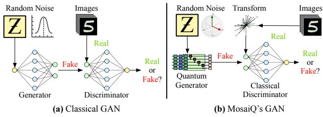  
Figure 1. Classical generative adversarial network (GAN) and MosaiQ’s hybrid quantum-classical GAN architecture.

III. Our evaluation demonstrates that MosaiQ significantly outperforms the state-of-the-art methods [11] on both simulation and real quantum computers with a hardware error. MosaiQ is evaluated on the MNIST [6] and Fashion MNIST datasets [21] – widely-used for QML evaluation on Nearterm Intermediate Scale Quantum (NISQ) machines [15, 11]. MosaiQ outperforms the state-of-the-art methods [11] both visually and quantitatively – for example, over 100 points improvement in image quality generated on IBM Jakarta quantum computer using the FID (Frechet Incep-´ tion Distance) score [10], which is popularly used for comparing image quality. MosaiQ is open-sourced at https: //github.com/SilverEngineered/MosaiQ.

## 2. MosaiQ: Challenges and Solution

In this section, we present the design and implementation of MosaiQ, a quantum image generative network. To provide better context for understanding, first, we briefly describe the classical generative adversarial networks (GAN) (depicted in Fig. 1(a)), describe the limitations of the stateof-the-art quantum GANs, and then, provide the details of MosaiQ’s quantum GAN design (depicted in Fig. 1(b)).

## 2.1. Generative Adversarial Networks (GANs)

Generative Adversarial Networks, or GANs, are a type of neural network architecture used in machine learning for generative modeling [8]. The basic architecture and workflow of a classical (non quantum) GAN are shown in Fig. 1 (a). A classical GAN consists of two neural networks, a generator, and a discriminator, that are trained simultaneously in a competitive process. The generator generates fake data samples, while the discriminator tries to distinguish them from real ones found in the training set, hence serving as the “adversary”. Through training, the generator learns to create increasingly realistic samples that mimic the distribution of the real data in order to better fool an increasingly effective discriminator, eventually reaching an attempt to attain equilibrium with the value function expressed as minG max $D \mathbb { E } _ { x \sim q _ { \mathrm { d a t a } } ( \pmb { x } ) } [ \log D ( \pmb { x } ) ] -$ + $\mathbb { E } _ { z \sim p ( z ) } [ \log ( 1 - D ( G ( z ) ) ) ]$ . This value function has two main identifiable components that correspond to the respective optimization objectives of the generator and the discriminator. The use of log provides more numerical stability because it converts the multiplication of multiple small probabilities into addition, and it also allows us to calculate the derivatives more easily during the optimization process.

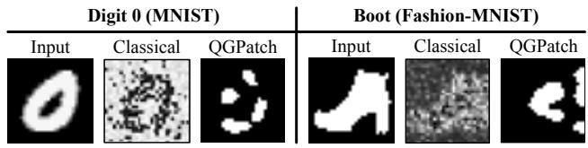  
Figure 2. State-of-the-art quantum image generator, QG-Patch [11], generates low-quality images for different datasets. However, its quality is still similar to a classical GAN with 25× more parameters and iterations.

Once fully trained, a generator component of the GAN is capable of converting random noise into new data samples (e.g., boots) that conform to the original distribution of the training data. Essentially, the generator, without the use of a discriminator, can be inferred to obtain new data samples. GANs have been shown to be useful in a variety of applications such as image and text generation, data aug mentation, and anomaly detection [20, 1, 5]. Naturally, this has spawned interest in the quantum information science community to develop corresponding quantum GANs.

Quantum GANs follow a similar generator and discriminator structure as classical GANs but use quantum principles to train and infer from the model. Typically, the discriminator functions on classical resources, and the generator is trained on quantum resources. This is expected, as this structure allows the Quantum GANs to leverage quantum resources for generation tasks – the component that persists beyond training; recall that the discriminator is essentially a quality inspector that can be decoupled after training and is not required during inference. While this structure is intuitive and has been demonstrated to be somewhat promising [11], there are multiple open challenges that need to be overcome to achieve higher quality.

## 2.2. Limitations of Existing Quantum GANs

A recent work by Huang et al. [11], referred to as QG-Patch, is the most complete, state-of-the-art demonstration of QuantumGANs on real quantum computers. QGPatch follows the Quantum GAN architecture described earlier but achieves limited effectiveness – QGPatch can learn different shapes and produce recognizable images in some cases, but often suffers from low quality. Fig. 2 shows that digit ‘0’ is a reasonable approximation of the ground truth, but the generated boot image is far less recognizable. Despite the imperfect generations, we can see in Fig. 2 how a classical GAN with 25× the parameters of QGPatch and trained for 25× as many iterations is worse or similar to the quantum technique – supporting the potential of quantum machine-learning for image generation tasks as compared to the classical approach with much higher resources and complexity. This independently provides experimental evidence for why the quantum information science community is motivated to accelerate the progress of Quantum GANs, despite its current limitations.

The reasons for the limited effectiveness of Quatum GANs are multi-fold. The quantum generator component runs on the quantum hardware and requires many qubits to produce high-quality images from random input noise (a qubit is the fundamental unit of computation and information storage on quantum computers). QGPatch addresses this challenge by breaking the image into “patches” and employing a generator for different patches. While this is reasonable for smaller resolution images, the “patch-based” approach suffers from scalability due to its fundamental nature of learning pixel-by-pixel. For example, a total of 245 qubits are required for images in the full-resolution 784- pixel MNIST dataset.

The second challenge is performing efficient learning from random input noise – it is critical for the quantum generator to effectively utilize the random input noise to generate a variety of images for the same class. Inability to generate a variety of images within the same class – which even classical GANs suffer from – is popularly known as the “mode collapse” problem [7]. Mode collapse is a side-effect of the generator learning to generate only produce one type of image for a given class because the generator has learned to “fool” the discriminator for this image and saturates in its learning. It is non-trivial to achieve high-quality generating while also maintaining variety. Motivated by these limitations, MosaiQ’s design pushes the state of the art.

## 2.3. Overview of MosaiQ and Key Ideas

Hybrid Quantum-Classical Architecture. MosaiQ uses a hybrid quantum-classical architecture for image generation, as summarized in Fig. 1(b). The generator is quantum in nature and trained using quantum simulation, and the discriminator is classical – similar to the construction in [15, 11]. However, there are two key novel architectural changes: (1) to address the scalability and quantum resource bottlenecks for generating high-quality images, MosaiQ applies a transformation on the input image dataset, and (2) MosaiQ employs quantum-style random noise as input to enhance the “variety or mode-collapse” challenge. These two key features are described after a brief description of MosaiQ’s generator and discriminator.

MosaiQ’s Quantum Generator Network. MosaiQ’s quantum generator component is a network of multiple subgenerators. Each sub-generator is a variational quantum circuit that is iteratively optimized to train a model. Variational quantum circuits are specific types of quantum circuits where some components of the circuits are tunable parameters, which are iteratively optimized. As a background, a quantum circuit is essentially a sequence of quantum gates applied to qubits. The quantum gates are fundamental operations that manipulate the qubit state, and any gate can be represented as a unitary matrix. One-qubit gates, such as the Pauli gates $( \sigma _ { x } , \sigma _ { y } , \sigma _ { z } )$ , apply a rotation to just one qubit and are categorized by the axis around which the rotation takes place, and by how much. Multi-qubit gates, such as the CNOT gate, allow the creation of entanglement.

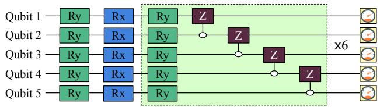  
Figure 3. Circuit ansatz design of MosaiQ’s generators. The RY gates in each layer are optimized during training.

Variational quantum circuits in MosaiQ are comprised of two types of sections. The first type, X, has fixed gates that entangle the qubits. The second type, θ, has tunable $U _ { 3 }$ gates that are optimized via training. The overall circuit V is therefore an optimization function built of unitary transformations such that $V = U ( X , \theta )$ . One key feature of variational quantum circuits is the ability to leverage many off-the-shelf classical deep-learning techniques for training and optimization. This includes learning through common loss functions such as $L _ { 2 }$ loss and leveraging existing optimizers such as Adam [13] that MosaiQ leverages.

All sub-generator circuits in MosaiQ have identical architectures, composed of a five-qubit circuit. Fig. 3 shows an example of the sub-generator circuit. The circuit consists of encoding the input noise as angles using Rx gates and Ry gates. Following the embedding of the noise, the parameterized weights are encoded on each quantum layer alongside CZ gates used to entangle the qubits at each layer. These weights contain the portion of the circuit that is optimized. Following these repeated layers, the P auliX expected value is taken for each qubit in measurement.

We note the simplistic design of MosaiQ’s generator circuits is intentional; limiting the number of tunable parameters and depth of the circuits enables MosaiQ to mitigate hardware error impact on real quantum machines and maintain high quality, as confirmed by our evaluation (Sec. 3).

Scalable Learning by Extracting Principal Components. Unlike previous approaches, which learn to construct the pixels of an image directly and consequently, suffer from the scaling bottleneck, MosaiQ demonstrates that extracting and learning the rich features is effective. The principal component analysis (PCA) method enables efficient learning by focusing on the important features that compromise unique images, as opposed to having to learn to distinguish the important features from the redundant features in an image via the pixel-by-pixel method. PCA maximizes the entropy for a given number of components, concentrating the information of a dataset efficiently.

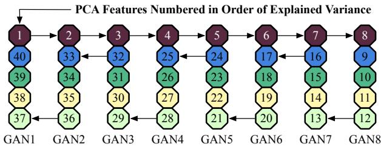  
Figure 4. MosaiQ divides the PCAfeatures among the eight generator circuits in a manner that the total explained variance is close to equal across all generators.

The first step in learning principal components is normalizing the input data. Once the images are normalized, MosaiQ decomposes the images into principal components and scales these components between [0, 1] so that the quantum sub-generators can generate throughout the entire space of inputs. As quantum machines rely on only unitary transformations, it is not possible to obtain an output with an absolute value greater than one in measurement. These scaled components are fed into the discriminator as the “real labels” and the generator begins to learn how to mimic the distribution throughout the training process. After learning, the outputs are scaled back to the original principal component range, then are inverse transformed to form a unique image that is within the distribution of the original images. This method helps us achieve higher quality in a scalable way. However, experimentally we found that this alone is not sufficient. MosaiQ performs intelligent distribution of features to make the learning more effective and robust.

Feature Distribution Among Learners. In the conventional implementation of the previously proposed idea, all generated features are distributed among several subgenerators before being concatenated. Recall that the MosaiQ’s quantum generator is an ensemble of multiple subgenerators, where each sub-generator is a variation quantum circuit. In the default case where PCA features are aligned one after another to the sub-generators, an unbalanced distribution of explained variance may emerge, where some sub-generators are responsible for significantly more important generations than others. This is because, by definition, the explained variance of PCA features is heavily concentrated on the first few features, and there is often a significant drop-off in explained variance from one PCA feature to the next. Recall that PCA features are entangled within sub-generators in training to form rich connections for image generation, when some sub-generators do not contain much useful information in any feature, the entire generator does not pose much utility.

Therefore, while effective in achieving scalability, only performing PCA may not achieve the full potential of MosaiQ’s quantum image generation as this leads to unbalanced training, likely to quickly discover gradients that ignore many sub-generators and plateaus in training. To mitigate this challenge, we propose a new PCA feature distribution mechanism to counteract the unbalanced nature of assigning principal components to sub-generators (Fig. 4).

We begin by assigning the first principal component to the first sub-generator, the second principal component to the second, and so on until each sub-generator has one top principal component. We follow this up by assigning the last n-1 principal components to the first generator, where n is the size of each sub-generator. This is followed by assigning the second to last n-1 features to the second sub-generator and repeated on the third generator and so on until all features have been assigned. This creates a much more balanced distribution, which enables us to ensure all sub-generators hold utility during the training process and the learning is not skewed. As an important sidenote, MosaiQ’s distribution also mitigates the pathological side-effects of hardware errors on NISQ quantum machines where the majority of critical principal component features could be concentrated on a single sub-generator. This sub-generator could be mapped to qubits with higher hardware error rates, and this can potentially make the training less effective. Our evaluation confirms the effectiveness of MosaiQ’s principal component feature distribution among learners. Finally, we describe how MosaiQ utilizes the adaptive noise during image generation to increase the variety of images generated to avoid mode collapse.

Adaptive Input Noise to Improve Variety of Generated Images. Recall that it is critical for the quantum generator to effectively utilize the random input noise to generate a variety of images for the same class. The inability to generate a variety of images within the same class leads to the “mode collapse” problem. Therefore, while MosaiQ’s previous methods help us achieve high quality, it is critical to achieving high-quality, while also maintaining variety.

To address this challenge, MosaiQ introduces an adaptive noise range based on the ratio of training loss between the quantum generator and the classical discriminator. The noise range is determined by the current progress of the generator discriminator mini-max game, instead of the traditional fixed range of [0, π ] as employed by QGPatch. Formally, the adaptive noise $( \mathrm { N o i s e _ { a d a p t i v e } } )$ is defined below in terms of the Generator loss $G _ { L }$ and Discriminator loss $D _ { L }$ and the Ratio $\frac { G _ { L _ { 0 } } } { D _ { L _ { 0 } } }$ is the Discriminator/Generator loss ratio observed after the first epoch during training.

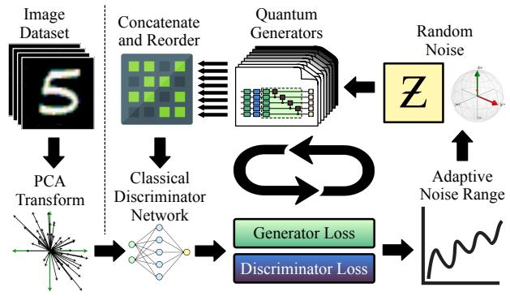  
Figure 5. MosaiQ’s process for training and optimizing the quantum generator circuits using PCA transformation, feature distribution, and adaptive noise generation.

$$
\mathrm { N o i s e } _ { \mathrm { a d a p t i v e } } = \frac { \pi } { 8 } + \frac { 5 \pi } { 8 } R e L U ( T a n h \bigl ( \frac { D _ { L } } { G _ { L } } - \frac { G _ { L _ { 0 } } } { D _ { L _ { 0 } } } \bigr ) )\tag{1}
$$

As the above formula indicates, this adaptive bound enforces a minimum noise range of $\frac { \pi } { 8 }$ and a maximum range of $\frac { 3 \pi } { 4 }$ for the noise. While the bounds are chosen to be a specific constant, the noise is always distributed within this range and the upper bound automatically adjusts itself based on the relative effectiveness of the generator and the discriminator. MosaiQ does not require tuning the thresholds for the range for different classes, it automatically adjusts itself to adapt to different conditions during training.

MosaiQ embeds the adaptive noise using angle embedding on the quantum circuit. The T anh function is used to scale the adaptive noise to asymptotically approach the range [−1, 1]. MosaiQ chose Tanh because it is a widelyused activation function in deep learning applications which transforms unbounded data into data bound by [−1, 1]. Tanh is defined as $\begin{array} { r } { T a n h ( x ) \ = \ \frac { e ^ { 2 x } - 1 } { e ^ { 2 x } + 1 } } \end{array}$ . In practice, we observed that it is not effective to have a noise range lower than $\frac { \pi } { 8 }$ , we leverage ReLU to force negative values to be zero. ReLU is also a commonly used activation function, however, ReLU is used to provide a non-linear transform that makes all negative values 0 (to ensure that the noise is never less than $_ { 8 } ^ { \pi } )$ , and keeps all positive values the same.

While the non-linearity of Tanh and ReLU are important when used typically as activation functions, the nonlinearity is not the main function in this application. If the generator is not able to catch up with the discriminator for some iterations at this small range, it should learn this smaller range instead of getting even smaller. We set the minimum as $\frac { \pi } { 8 }$ as we discovered that a lower value than $\frac { \pi } { 8 }$ results in mode collapse, with almost no distinction between images generated for a given class.

Leveraging adaptive noise for input ensures more consistent training as the generator can focus on quality when it is doing relatively worse compared to the classical discriminator and expand to generating more variety in high quality as it begins to fool the discriminator more on an easier objective. Overall, the adaptive noise mechanism helps us increase the variety of images for a given class while ensuring that the image quality also remains high. This is further confirmed by our evaluation (Sec. 3).

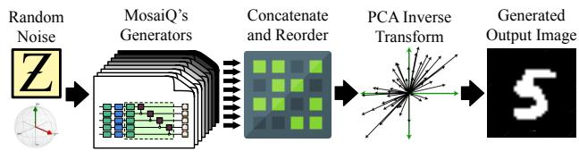  
Figure 6. MosaiQ’s inference process to generate new images via running the generators on quantum machines.

MosaiQ’s Classical Discriminator. MosaiQ ’s discriminator is a classical deep-learning network, designed to aid in the training of the quantum generator. This network is essentially training wheels to guide a difficult-to-train quantum GAN, which can be discarded after training. The discriminator is much larger than the quantum generator, as there is only a single discriminator that must compete in the adversarial game with multiple quantum generators. Typical to its classical counterpart, MosaiQ’s discriminator has multiple linear layers with ReLU activation (e.g., 64 layers). MosaiQ has a terminal layer with Sigmoid activation which introduces more non-linearity into the network, which enables it to learn more complex structures. The single value produced at the end of the discriminator network allows it to act as a classifier to distinguish between real and generated data.

Putting It All Together. The overall workflow for training and inference for MosaiQ are visually summarized in Fig. 5 and 6, respectively. Fig. 5 depicts the continuous feedback-driven process where the discriminator and generator participate in a non-cooperative game to improve the overall quality of MosaiQ. Depending upon the relative loss of the discriminator and generator networks, the random input noise is automatically adjusted to help MosaiQ generators avoid the problem of mode collapse problem and enable it to generate variety. During the training process, the input images are transformed using PCA to encode critical and more information in a compact manner for resource-limited NISQ quantum computers, instead of learning over the input images pixel by pixel. Finally, the five-step inference procedure shown in Fig. 6 highlights that the PCA transformation is inverted to generate new images when running the fully-trained MosaiQ generators on real quantum computers for inference to generate new images.

## 3. Experimental Methodology

Datasets. MosaiQ is evaluated on the MNIST [6] and Fashion MNIST datasets [21] as they have been widely-used for QML evaluation on NISQ-era quantum machines [15, 11]. MNIST consists of 28x28 gray-scale images of handwritten digits from 0 to 9. Fashion MNIST consists of 28x28 grayscale images of clothing and accessories. Fashion MNIST provides more challenges for image generation and is chosen to explore more domains of quantum image generation. For both datasets, we split the dataset by image label and train individual models for each data type. This technique has been used in [11] and allows us to interpret the generation process and difficulties isolated for each class of data.

Experimental Framework and Training Details. The environment for MosaiQ consists of PyTorch [16] acting as a wrapper for Pennylane [3]. MosaiQ is trained on IBM’s quantum simulator for speed, but the inference is performed on both the quantum simulator and real quantum machine. For real quantum machine experiments, Pennylane compiles the circuits into a backend compatible with IBM-Qiskit [18]. All real machine runs were performed on the IBM QX Jakarta machine [18]. Images used in training are selected from the training set and decomposed to principal components of size 40. These components are divided across eight five-qubit sub-generators. The discriminator learns to differentiate at the level of principal components and does not need to utilize a full image. Our final FID metrics reported are at the end of the training after 500 iterations (where all methods achieve near-final stability).

MosaiQ uses PyTorch’s Standard Gradient Descent Optimizer for both the generator and discriminator and Binary Cross Entropy Loss for the shared loss of the generator and discriminator. The Adaptive Noise range is simple to calculate based on the generator and discriminator loss and MosaiQ automatically guides it to adjust itself every training iteration. The generator learning rate is 0.3 and the discriminator learning rate to .05 with a batch size of 8.

Framework for Competing Techniques. We set up QG-Patch, the state-of-the-art technique [11], using the popular Pennylane framework and choose the parameters used in the original paper [11]. Our QGPatch training is performed using the batch size of eight and it trains until the quality stabilizes (500 iterations). We use the same network size that is mentioned in the original paper, using 4 subgenerators with 5 features each. Evaluating the probabilities in measurement yields a 64-pixel (8x8) image. As MosaiQ’s results are based on the original size of the datasets of 784 pixels, we upscale the results of QGPatch using Bilinear Interpolation to allow for direct comparison. We rigorously explored multiple interpolation techniques to provide QGPatch as much as an advantage as possible and experimentally determined that Bilinear interpolation yielded the highest quality upscaling. For QGPatch, similar to MosaiQ, all metrics scores shown are calculated based on 500 images generated at the end of training compared to the entire distribution of the respective image category.

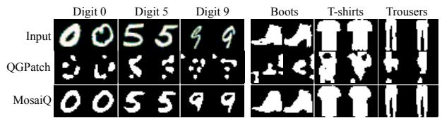  
Figure 7. MosaiQ produces visually higher-quality images compared to the state-of-the-art technique, QGPatch, for different classes ofMNIST and Fashion-MNIST datasets.

We additionally set up other classical experiments to act as ablations for the efficacy of MosaiQ. We introduce two techniques: (1) PCAInverse (using random inputs and PCA inverse transformation to generate images), and (2) ClassicalPCA (a purely-classical GAN using the same number of parameters as MosaiQ, but uses MosaiQ’s PCA technique for feature compression). PCAInverse applies the same inverse PCA transformation as MosaiQ, to random noise of size 40. This technique is designed to explore the isolated effects of the inverse PCA transformation procedure since it does not perform any learning. ClassicalPCA trains a purely-classical GAN with an identical number of parameters as MosaiQ and apply the same inverse PCA transformation workflow.

Figures of Merit. To capture the quality of image generation, our evaluation figures of merit are both qualitative and quantitative. Our primary quantitative figure of merit is FID (Frechet inception distance) score [´ 10]. FID evaluates the distance between two distributions, as defined below for a Gaussian with mean $( m , C )$ and a second Gaussian with mean $( m _ { w } , C _ { w } ) \colon \mathrm { F I D } \ = \ \| m - m _ { w } \| _ { 2 } ^ { 2 } + T r ( C + C _ { w } -$ $2 ( C C _ { w } ) ^ { 1 / 2 } )$ . A lower FID score between two distributions indicates higher similarity – and hence, lower FID scores imply higher quality. The FID score has been shown to provide a more meaningful comparison over alternative metrics (e.g., Inception Score) for image GANs [10].

We also evaluate the variance of our images, by evaluating the variance of the pixel values relative to the mean. As defined below, the variance metric gives insight into the distinctness of the images generated for each method. For each pixel in an image row r and column c in an image, we sum the squared difference from the mean value for that respective pixel to achieve our variance score V. We then take the cumulative density function (CDF) of these variance scores for each image generated image G(z) given uniformly distributed noise z from $[ 0 , \pi / 2 ]$ $V =$ $\begin{array} { r l } { ~ } & { { } \sum _ { r } \sum _ { c } ( \mu _ { r c } - \dot { G } ( z ) _ { r c } ) ^ { 2 } } \end{array}$ . A higher variance indicates higher variety in generated images for a given class – which is desirable, however, it is also critical that a method should attain a lower FID score before demonstrating higher variety.

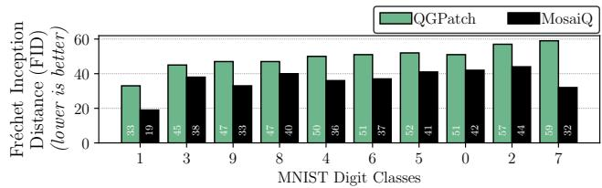  
Figure 8. MosaiQ consistently produces lower FID score images (higher quality images) compared to QGPatch across different classes ofthe MNIST dataset.

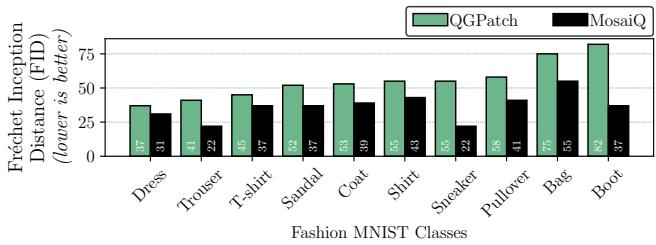  
Figure 9. MosaiQ consistently produces lower FID score images (higher quality images) compared to QGPatch across different classes ofthe Fashion-MNIST dataset.

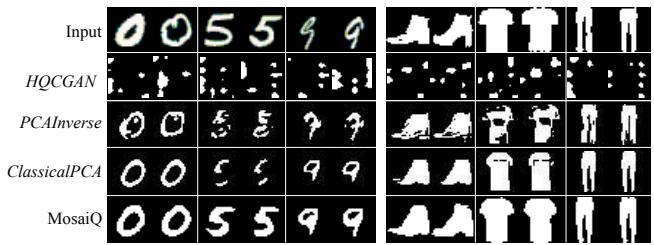  
Figure 10. MosaiQ produces higher quality images on the MNIST and Fashion MNIST dataset as compared to HQC-GAN [19]. MosaiQ produces higher quality images than the classical methods: PCAInverse and ClassicalPCA.

## 4. Evaluation and Analysis

In this section, we go over the results of MosaiQ and provide an analysis of the key elements of the design.

MosaiQ: Key Results and SOTA Comparison. MosaiQ yields significantly better image quality both visually and quantitatively compared to the state-of-the-art (SOTA) method, QGPatch [11]. As discussed earlier, MosaiQ is evaluated on two different datasets to cover diversity across datasets and within a dataset with different shapes and styles (digits and clothing). First, we highlight that MosaiQ provides a significant visual enhancement in the images produces across different classes compared to the SOTA method. In fact, Fig. 7 shows that the SOTA-produced images are almost unrecognizable for sophisticated shapes (‘0’ vs. ‘5’ and different types of shoes). In comparison, MosaiQ is effective across different class types – this is further substantiated by lower FID scores of the images generated by MosaiQ (Fig. 8 and 9).

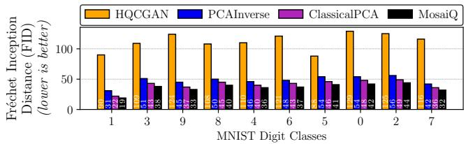  
Figure 11. MosaiQ produces higher quality images on every class of the MNIST dataset as compared to HQCGAN [19] in addition to the classical methods tested.

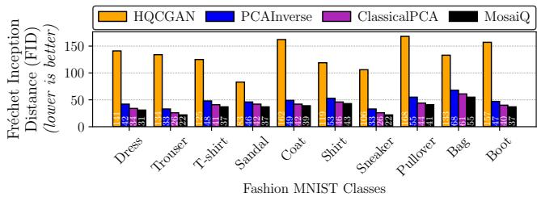  
Figure 12. MosaiQ produces higher quality images on every class of the Fashion MNIST dataset as compared to HQCGAN [19] in addition to the classical methods tested.

As expected, the FID score obtained by MosaiQ varies across different classes for both datasets; this is because of varying degrees of difficulty and shapes of different images. However, the most notable observation is that MosaiQ consistently outperforms QGPatch across all class types by a significant margin (by more than 10 points in many cases). In fact, MNIST digit ‘7’ is quite challenging for QGPatch (FID score is 60), and MosaiQ improves the FID score by approximately 20 points. Similarly, the most challenging class in the Fashion-MNIST dataset (Boot) receives a 45- point improvement by MosaiQ. The key reason MosaiQ outperforms QGPatch is the efficiency of principal components in capturing information. Instead of having to learn pixels one by one, MosaiQ scales more easily by learning a distribution of features that better organize redundancy. For example, most of the background of MNIST and Fash ion MNIST images are black, in the case of QGPatch, each pixel must be synthesized, where MosaiQ may be able to build these features with only a few principal components.

We also compare MosaiQ to other methods, including the PCAInverse technique, the ClassicalPCA technique, and a recent work on hybrid quantum GANs which we refer to as HQCGAN [19]. We sample generated images in Fig. 10 and find the images produced by all methods tested are lower quality than MosaiQ, producing images which are far less human-recognizable. We show the corresponding FID scores for MNIST in Fig 11 and Fashion MNIST in Fig. 12. We find that MosaiQ produces higher quality images and significantly improved FID scores in all cases tested compared to the classical methods (PCAInverse and ClassicalPCA), and HQCGAN. Importantly, MosaiQ outperforms ClassicalPCA, demonstrating the power of quantum networks in image generation when compared to equalsized classical networks. Our results show that while HQC-GAN is promising and useful, the final quality may not be as high as MosaiQ – this is because HQCGAN requires significantly more parameters, more training resources, lacks noise-mitigation, and learns noise in a fixed range ([0, 1) instead of MosaiQ’s adaptive noise range technique). Next, we dissect the key reasons behind MosaiQ’s effectiveness in more detail.

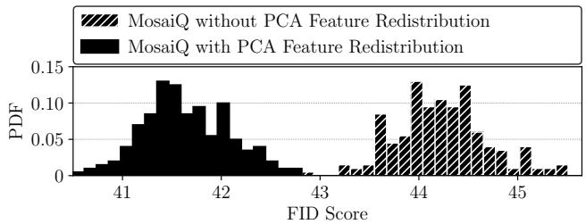  
Figure 13. MosaiQ’s PCA feature distribution among learners improves the quality of generated images. The figure shows a distribution of 200 FID scores (comparing 8 images each to the entire data distribution)for the case with and without PCAfeature redistribution.

Why Does MosaiQ Work Effectively? Effect of careful PCAfeature distribution among sub-generators. Recall that MosaiQ employs an intelligent PCA feature distribution among sub-generators in the generation phase. The goal is to equalize the explainable PCA feature variance across learners – in an effort to make learners equally capable instead of weaker learners not effectively contributing toward the overall quality. To better understand and demonstrate the effectiveness of this mechanism, Fig. 13 shows the FID score over multiple training iterations with and without this mechanism while keeping all other design elements intact. For easier interpretation, Fig. 13 shows this for class digit ‘5’ for the MNIST dataset. We observe that PCA feature distribution allows MosaiQ to achieve lower (and hence, better) FID score over training compared to without employing this mechanism. A side benefit of this mechanism is that MosaiQ can also mitigate hardware errors on real quantum computers, as discussed later.

Effect of adaptive noise generation during training. Fig. 14 shows the effect of adaptive noise generation that is used by the MosaiQ generators instead of using a constant noise threshold range (i.e., [0, π ]) used by the QGPatch method. Recall that GANs often suffer from intra-class mode-collapse challenges where they can produce a highquality image for a given class, but there is a possibility that all generated images for a given class appear similar. Therefore, it is critical to ensure that the generated images for a given class have sufficient variety. Fig. 14 confirms that adaptive noise improves variety (class digit ‘5’ used as an example) compared to fixed noise ranges. This is because adaptive noise enables the generators to learn over different distributions more effectively and generate variations. Having an adaptive range allows the generator to improve variety when it is doing comparatively well and focus on stability when it is performing poorly with a smaller range of inputs. Taking advantage of this allows us to have high stability in training and high variety over time.

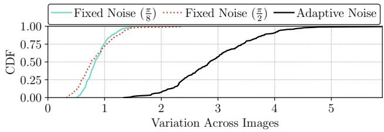  
Figure 14. Adaptive noise during generation helps MosaiQ achieve variety (higher variance across imagesfor the same class to mitigate mode-collapse challenge), while achieving lower FID score at the same time, as shown earlier.

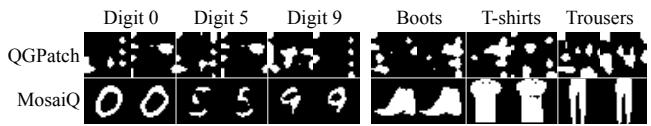  
Figure 15. Visual image quality of images produced by MosaiQ on real IBM quantum machine (Jakarta) for six representative classesfor MNIST and Fashion-MNIST datasets.

MosaiQ on NISQ Quantum Machines. Our experimental campaign on real superconducting-based IBM NISQ quantum computers confirms MosaiQ produces higher quality images across different datasets with diverse classes of images. Fig. 15 and Table 1 summarize the image quality results for QGPatch and MosaiQ. While MosaiQ’s quality remains consistent with simulations, QGPatch’s quality degrades considerably on real computers. In fact, our results revealed QGPatch produces lower quality images and sometimes unrecognizable images because QGPatch is more prone to side-effects of prevalent quantum gate errors on real machines, while MosaiQ’s simplistic design successfully mitigates those effects as discussed next.

First, we observe that MosaiQ produces competitive quality images despite hardware errors on real quantum computers. Due to high queue wait time and limited availability of quantum resources, we are presenting results only for selected classes (three from each dataset) which cover a diverse range of intricacies in terms of shape and information. In fact, via visual inspection for different images produced for a given class, we observe that the variety in the produced images by MosaiQ is also high on the quantum computer - effectively mitigating the mode-collapse pitfall in GANs. This is because of MosaiQ’s adaptive noise mechanism during the generation phase that improves image variety and avoids mode collapse.

Table 1. QGPatch and MosaiQ’s FID scores on a real quantum computerfor MNIST & Fashion-MNIST datasets.  
(a) QGPatch
<table><tr><td>Environment</td><td>Digit 0</td><td>Digit 5</td><td>Digit 9</td><td>T Shirt</td><td>Pants</td><td>Shoes</td></tr><tr><td>Quantum Simulator</td><td>52</td><td>52</td><td>48</td><td>45</td><td>42</td><td>82</td></tr><tr><td>IBM Jakarta Machine</td><td>145</td><td>134</td><td>131</td><td>125</td><td>144</td><td>124</td></tr></table>

(b) MosaiQ
<table><tr><td>Environment</td><td>Digit 0</td><td>Digit 5</td><td>Digit 9</td><td>T Shirt</td><td>Pants</td><td>Shoes</td></tr><tr><td>Quantum Simulator</td><td>42</td><td>42</td><td>33</td><td>34</td><td>22</td><td>38</td></tr><tr><td>IBM Jakarta Machine</td><td>45</td><td>44</td><td>35</td><td>38</td><td>23</td><td>38</td></tr></table>

Second, we observe that the FID scores of MosaiQ on a real quantum computer are similar to error-free simulation results, across different classes. This result demonstrates that MosaiQ’s design is effective even when hardware errors are present. In fact, the IBM Jakarta computer has a considerably low quantum volume (higher is better) with a quantum volume of 16. Quantum volume is a useful metric in determining the error rate and capabilities of a quantum computer. For perspective, at the time of writing, IBM has computers available with quantum volumes of 128. We chose a relatively less capable quantum computer for our experiments to demonstrate the portability and robustness of MosaiQ. The reason for MosaiQ’s effectiveness is twofold: (1) its simplistic design for generator learners, which avoids a large number of two-qubit gates, and circuits with high depths. which are more prone to hardware noise, and (2) its PCA feature distribution mapping among the ensemble of learners in the generator – this careful redistribution ensures that most critical PCA features are not concentrated on a few qubits, which in the pathological case could be most severely impacted by hardware-errors. MosaiQ’s PCA redistribution ensures that the learners do not need to know the error rate of individual qubits on the computer or make assumptions about different error types.

## 5. Related Work

Demonstration of the Speedup Achieved by Quantum GANs. Quantum GANs were first introduced by Lloyd et al.[14]. This work theoretically proved the potential for exponential superiority of Quantum GANs over their classical counterparts. This was later followed by the work of Dallaire-Demers et al. [4], which established a way to design and train variational quantum circuits as the generator component of a Quantum GAN model. Nakaji et al. [15] use a hybrid configuration with a classical discriminator and a quantum generator for classification. Their results demonstrate the potential for quantum GANs to solve problems that are intractable with classical GANs.

Enchancing Classical GANs using Quantum Components. Approaches such as the work done by Rudolph et al. [17] use a quantum enhancer for large-scale fullyclassical generators to enhance the quality of image generation. While the images generated are high quality, this is mostly attributed to the large classical generators. The visual results in these works seem appealing because the classical GAN-based baseline is already high quality, with a quantum preamble which only improves the image quality slightly. This is in contrast to MosaiQ which uses a quantum generator to generate images without a classical generator.

Fully-Quantum Generators. The work of Huang et al. [12] uses quantum gradients to train quantum GANs to replicate logic gates such as XOR with high fidelity and also generate images from the MNIST dataset. The technique relies on using quantum-based loss functions for their generator and discriminator. This work also shows that quantum GANs have similar performance as classical GANs while using 94.98% fewer parameters. A succeeding work with higher quality MNIST image generation can be found in QGPatch [11], with a generator split among several subgenerators each responsible for generating a part of the full image. QGPatch trains a quantum generator against a classical discriminator. The quality of generation is the highest among pre-MosaiQ quantum GANs with a purely quantum generative component, at the time of writing. Therefore, we compare MosaiQ against QGPatch in this paper and show that MosaiQ outperforms QGPatch in terms of image quality and variety.

## 6. Conclusion

MosaiQ is the first quantum GAN to successfully generate high-quality images on real quantum computers. MosaiQ incorporates PCA feature redistribution and adaptive noise to facilitate improved interaction between the quantum generator and classical elements of the model. This integration enhances the quality and variety of the generator’s output respectively.

Acknowledgements We thank the reviewers for constructive feedback. This work was supported by NSF Award 2144540, Northeastern University, and Rice University.

## References

[1] Samet Akcay, Amir Atapour-Abarghouei, and Toby P. Breckon. Ganomaly: Semi-supervised anomaly detection via adversarial training. In C. V. Jawahar, Hongdong Li, Greg Mori, and Konrad Schindler, editors, Computer Vision – ACCV 2018, pages 622–637, Cham, 2019. Springer International Publishing. 1, 2

[2] Martin Arjovsky, Soumith Chintala, and Leon Bottou.´ Wasserstein gan, 2017. 1

[3] Ville Bergholm, Josh Izaac, Maria Schuld, et al. Pennylane: Automatic differentiation of hybrid quantum-classical computations, 2018. 6

[4] Pierre-Luc Dallaire-Demers and Nathan Killoran. Quantum generative adversarial networks. Phys. Rev. A, 98:012324, Jul 2018. 9

[5] Lucas Deecke, Robert Vandermeulen, Lukas Ruff, Stephan Mandt, and Marius Kloft. Anomaly detection with generative adversarial networks, 2018. 1, 2

[6] Li Deng. The mnist database of handwritten digit images for machine learning research. IEEE Signal Processing Magazine, 29(6):141–142, 2012. 2, 6

[7] Zhitong Ding, Shuqi Jiang, and Jingya Zhao. Take a close look at mode collapse and vanishing gradient in gan. In 2022 IEEE 2nd International Conference on Electronic Technology, Communication and Information (ICETCI), pages 597– 602, 2022. 1, 3

[8] Ian J. Goodfellow, Jean Pouget-Abadie, Mehdi Mirza, Bing Xu, David Warde-Farley, Sherjil Ozair, Aaron Courville, and Yoshua Bengio. Generative adversarial networks, 2014. 1, 2

[9] Ishaan Gulrajani, Faruk Ahmed, Martin Arjovsky, Vincent Dumoulin, and Aaron Courville. Improved training of wasserstein gans, 2017. 1

[10] Martin Heusel, Hubert Ramsauer, Thomas Unterthiner, Bernhard Nessler, and Sepp Hochreiter. Gans trained by a two time-scale update rule converge to a local nash equilibrium. Advances in neural information processing systems, 30, 2017. 2, 6

[11] He-Liang Huang, Yuxuan Du, Ming Gong, Youwei Zhao, Yulin Wu, Chaoyue Wang, Shaowei Li, Futian Liang, Jin Lin, Yu Xu, et al. Experimental quantum generative adversarial networks for image generation. Physical Review Applied, 16(2):024051, 2021. 1, 2, 3, 6, 7, 9

[12] Kaixuan Huang, Zheng-An Wang, Chao Song, Kai Xu, Hekang Li, Zhen Wang, Qiujiang Guo, Zixuan Song, Zhi-Bo Liu, Dongning Zheng, et al. Quantum generative adversarial networks with multiple superconducting qubits. npj Quantum Information, 7(1):165, 2021. 9

[13] Diederik P. Kingma and Jimmy Ba. Adam: A method for stochastic optimization, 2014. 3

[14] Seth Lloyd and Christian Weedbrook. Quantum generative adversarial learning. Phys. Rev. Lett., 121:040502, Jul 2018. 9

[15] Kouhei Nakaji and Naoki Yamamoto. Quantum semisupervised generative adversarial network for enhanced data classification. Scientific reports, 11(1):19649, 2021. 2, 3, 6, 9

[16] Adam Paszke, Sam Gross, Francisco Massa, Adam Lerer, James Bradbury, Gregory Chanan, Trevor Killeen, Zeming Lin, Natalia Gimelshein, Luca Antiga, Alban Desmaison, Andreas Kopf, Edward Yang, Zachary DeVito, Martin Raison, Alykhan Tejani, Sasank Chilamkurthy, Benoit Steiner, Lu Fang, Junjie Bai, and Soumith Chintala. Pytorch: An imperative style, high-performance deep learning library. In Advances in Neural Information Processing Systems 32, pages 8024–8035. Curran Associates, Inc., 2019. 6

[17] Manuel S Rudolph, Ntwali Bashige Toussaint, Amara Katabarwa, Sonika Johri, Borja Peropadre, and Alejandro Perdomo-Ortiz. Generation of high-resolution handwritten digits with an ion-trap quantum computer. Physical Review X, 12(3):031010, 2022. 9

[18] A tA v, MD Sajis Anis, and Abby-Mitchell others. Qiskit: An open-source framework for quantum computing, 2021. 6

[19] Shu Lok Tsang, Maxwell T West, Sarah M Erfani, and Muhammad Usman. Hybrid quantum-classical generative adversarial network for high resolution image generation. arXiv preprint arXiv:2212.11614, 2022. 7

[20] Xuan Xia, Xizhou Pan, Nan Li, Xing He, Lin Ma, Xiaoguang Zhang, and Ning Ding. Gan-based anomaly detection: A review. Neurocomputing, 493:497–535, 2022. 1, 2

[21] Han Xiao, Kashif Rasul, and Roland Vollgraf. Fashionmnist: a novel image dataset for benchmarking machine learning algorithms, 2017. 2, 6

[22] Jun-Yan Zhu, Taesung Park, Phillip Isola, and Alexei A. Efros. Unpaired image-to-image translation using cycleconsistent adversarial networks, 2017. 1