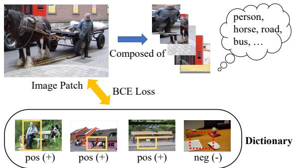
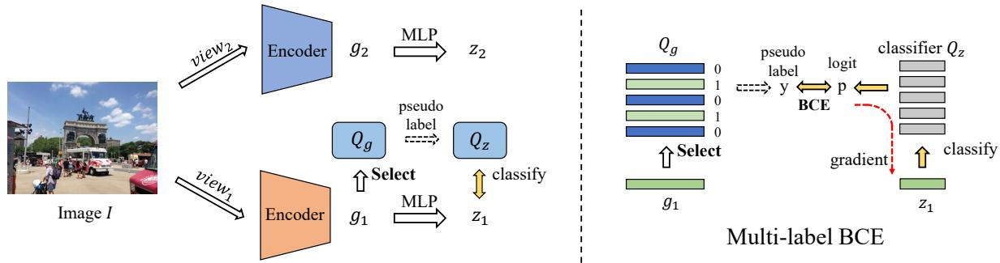
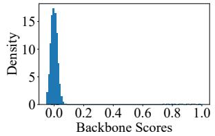
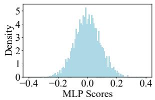
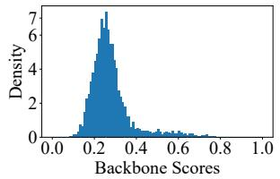
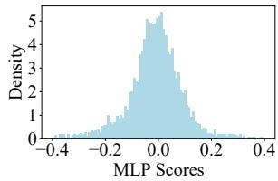
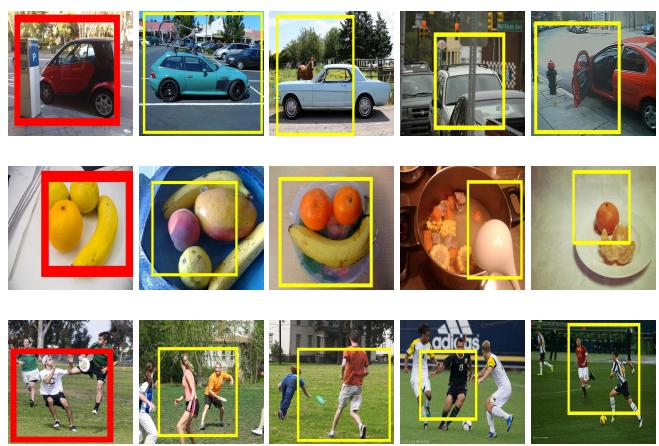
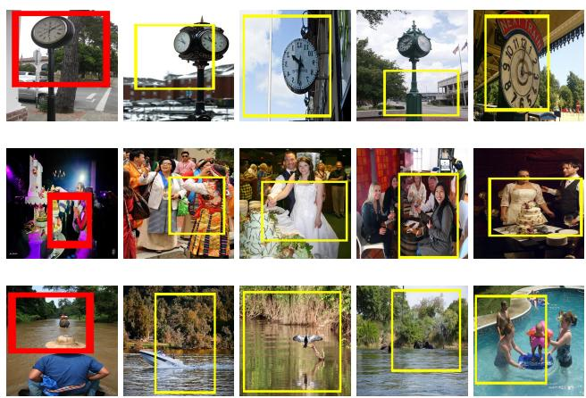
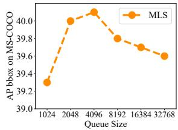
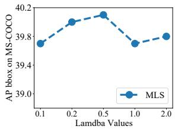

# Multi-Label Self-Supervised Learning with Scene Images

Ke Zhu Minghao Fu Jianxin Wu\* State Key Laboratory for Novel Software Technology Nanjing University, China

zhuk@lamda.nju.edu.cn, fumh@lamda.nju.edu.cn, wujx2001@nju.edu.cn

## Abstract

Self-supervised learning (SSL) methods targeting scene images have seen a rapid growth recently, and they mostly rely on either a dedicated dense matching mechanism or a costly unsupervised object discovery module. This paper shows that instead of hinging on these strenuous operations, quality image representations can be learned by treating scene/multi-label image SSL simply as a multi-label classification problem, which greatly simplifies the learning framework. Specifically, multiple binary pseudo-labels are assigned for each input image by comparing its embeddings with those in two dictionaries, and the network is optimized using the binary cross entropy loss. The proposed method is named Multi-Label Self-supervised learning (MLS). Visualizations qualitatively show that clearly the pseudo-labels by MLS can automatically find semantically similar pseudo-positive pairs across different images to facilitate contrastive learning. MLS learns high quality representations on MS-COCO and achieves state-of-the-art results on classification, detection and segmentation benchmarks. At the same time, MLS is much simpler than existing methods, making it easier to deploy and for further exploration.

## 1. Introduction

Self-supervised learning (SSL) methods based on contrastive learning [4, 3] have facilitated numerous downstream tasks. Those [16, 6, 14, 13] that target objectcentric images (e.g., ImageNet) are already relatively mature, but inventing SSL methods for scene images (e.g., MS-COCO [23]) gains popularity recently. Since unlabeled scene images (or multi-label images) are more natural [46] and richer in semantics, various SSL methods [39, 45, 19, 40, 20, 44] have successively emerged.

SSL methods focusing on scene/multi-label images can be summarized into two categories. One is dense matching, such as DenseCL [39], MaskCo [51] and Self-EMD [24]. They take the features’ locations into account to improve the performance on dense prediction tasks. They mostly differ in how the heuristic matching metric is designed. Another branch of work like SoCo [41] and ORL [46] resort to unsupervised object discovery to find local object contents, and learn quality representation with both object- and scenelevel semantics. However, they usually involve multi-stage SSL pretraining on top of expensive box generation [35].

  
Figure 1. Illustrating our motivation. An image patch cropped from a multi-label image comprises multiple objects. Each object can find similar (‘pos’) and dissimilar (‘neg’) images from a large dictionary. The whole image patch is pulled closer to those positive ones and pushed away from the negatives using a BCE loss. See Fig. 4 for positives and negatives chosen by our algorithm.

These scene image SSL methods are generally based on the contrastive loss (e.g., InfoNCE [27]), where two randomly augmented views of the same image are forced to be close to each other, and optionally push away views from different images. The loss assumes single-label images [27], but the input are in fact multi-label: hence there is a mismatch between the loss and the data. On one hand, it can be difficult for two views randomly cropped from the same scene image to be exactly matched [39, 47]. On the other hand, there is only one matched positive pair in InfoNCE, while more positive pairs are naturally preferred: a view croppedfrom a multi-label image likely contains multiple semantic concepts or objects.

Therefore, this paper proposes a simple yet direct approach towards scene image SSL, named as Multi-Label Self-supervised learning (MLS). We treat each image (or randomly cropped patch) as a semantic bag with multiple objects, then retrieve images sharing similar semantics with any object in the bag from a large image dictionary. Note that an object in a bag is not necessarily within the set of human-annotated categories. As illustrated in Fig. 1, the cropped patch contains person, horse, road and bus, which will be pulled closer to similar images containing any of these objects and be pushed away from those dissimilar ones. Specifically, the patch’s embedding produced by a backbone network will select top k similar embeddings as k (pseudo) positive images from a dictionary, and the rest will be negatives. In another dictionary containing images in the same order as the first one, the BCE (binary cross entropy) loss plus these binary pseudo-labels will classify the patch’s embedding after an MLP projector using all the images in this second dictionary as classifiers, and generates gradients that optimize the backbone network. This framework is illustrated in Fig. 2.

Our framework has two benefits. First, the large dictionary has diverse positive samples for any given input, hence provides many quality positive pairs with deformations or intra-class variations [11]. Second, unlike InfoNCE, the BCE loss is not mutually exclusive among classes, hence allows the co-occurrence of multiple classes in one scene image. By applying our SSL method to scene images (e.g., MS-COCO), we achieve state-of-the-art results on object detection, instance segmentation and various classification benchmarks. Our contributions are summarized as follows:

1. For the first time, we formulate scene image SSL as a multi-label classification, and propose our Multi-Label Self-supervised (MLS) learning approach.

2. Unlike previous methods that adopt dense matching or unsupervised object discovery, MLS is simple in concept, and enjoys intuitive visualizations (c.f. Fig. 4) which clearly verifies our motivation.

3. Extensive experiments of object detection, instance segmentation and classification on various benchmark datasets, together with ablation studies, clearly demonstrate the effectiveness of our method.

## 2. Related Work

Traditional SSL methods. Self-supervised learning (SSL) has emerged as a promising direction towards unsupervised representation learning [6]. Early SSL methods [27, 33] are mainly derived from noise contrastive estimation [15]. Later, SSL methods based on contrastive learning and clustering paradigms have been proved effective, too. Representative methods such as SimCLR [4], MoCo [16], BYOL [14] and SwAV [3] have exhibited both simplicity and generalization ability [36] to various downstream tasks. A set of variants such as Simsiam [7], InfoMin [34] and NNCLR [11] try to simplify, analyze and optimize traditional SSL methods from different aspects. However, all of them mainly focus on pretraining on objectcentric images like the ImageNet dataset [32] for image classification (e.g., ImageNet linear evaluation), but pay less attention to dense prediction tasks.

Scene-image SSL methods. The development of scene (multi-label) image SSL is a diversified process, which mainly contains two branches: dedicated dense feature matching and multi-stage pretraining with unsupervised object discovery. DenseCL [39], PixPro [47], ReSim [44], LEWEL [20] and SetSim [40] all apply the InfoNCE loss in a dense matching manner. They propose dense loss functions in addition to the traditional InfoNCE loss, and their pipelines differ in how the matching metrics are (probably manually) selected. Another branch of methods such as SoCo [41] and ORL [46] try to learn quality feature representation with both scene- and object-level information: they utilize multi-stage pretraining to find correspondence across images with the help of unsupervised object generation methods [35, 54], which suffers from huge computation costs. A recent SSL method [36] that is close to our work proposed kNN-MoCo as an extra module. But, this method is still in a single-label InfoNCE manner and the improvement is small compared to our multi-label MLS (c.f. Table 6). Compared to existing methods, our MLS is novel in concept and simple in implementation.

Multi-label classification. Multi-label recognition aims to predict the presence or absence of each object class in an input image [48]. Traditional methods are based on three aspects: attention modules [53, 52], correlation matrix [8, 5] and unsupervised box generation [42, 38]. The loss function adopted in this task is mostly binary cross entropy (BCE), which is not mutually exclusive among classes [48], such that the presence of one class does not suppress the existence of others. In this paper, we inherit this unique property of multi-label classification and try to integrate BCE into self-supervised learning on scene images. We adopt the joint image embedding to generate k pseudo-labels, together with the classification logits to calculate the final loss term, which effectively guides the multi-label selfsupervised learning.

## 3. Method

In this section, we start by describing the preliminaries of self-supervised learning, including the InfoNCE loss and its variants. We will then describe the proposed Multi-Label Self-supervised (MLS) learning methods and how the overall loss function is formulated and optimized.

## 3.1. Preliminaries

Self-supervised learning methods, whether contrastive based [16, 14] or clustering based [3], usually rely on the InfoNCE loss [27] or its variants [33]:

$$
\mathcal { L } _ { n c e } = - \log \frac { \exp { ( \boldsymbol { q } \cdot \boldsymbol { k } _ { + } / \tau ) } } { \exp { ( \boldsymbol { q } \cdot \boldsymbol { k } _ { + } / \tau ) } + \sum _ { \boldsymbol { k } _ { - } } \exp { ( \boldsymbol { q } \cdot \boldsymbol { k } _ { - } / \tau ) } } ,\tag{1}
$$

where q and $k _ { + }$ are positive embeddings (similar to $z _ { 1 }$ and z2 in Fig. 2) after the multi-layer perception (MLP) projector of two encoders. The negative features k− may come from a memory bank [43], a large dictionary or a queue [6], or the current mini-batch [4]. Negatives may be removed by using additional techniques (e.g., the stop gradient adopted in BYOL [14] and SimSiam [7]).

Similar with the form of a normal softmax function [53] that is popular in single-label classification, InfoNCE is mutually exclusive among all classes, such that there can only be one positive out of all pseudo concepts. There are variants of InfoNCE (such as SupCon [21]) where more positive pairs are excavated and accumulated, with each item being a sole InfoNCE form. These variants can be summarized as follows:

$$
- \frac { 1 } { N _ { p o s } } \sum _ { i = 1 } ^ { N _ { p o s } } \log \frac { \exp { ( { q \cdot k _ { + } ^ { i } } / { \tau } ) } } { \exp { ( { q \cdot k _ { + } ^ { i } } / { \tau } ) } + \sum _ { k _ { - } } \exp { ( { q \cdot k _ { - } } / { \tau } ) } } ,\tag{2}
$$

in which the total $N _ { p o s }$ positives are enumerated over $k _ { + } ^ { i }$ It can indeed alleviate the dilemma of the traditional form by involving more positives, but all these methods mainly focus on supervised learning [21] or lack extensive experiments on large dense prediction tasks [36].

More importantly, the concept of multi-label learning is not introduced, that is, the classes are still mutually exclusive, which hinders the model from learning quality representations from scene image self-supervised learning.

## 3.2. Multi-label self-supervised learning

Now, we will introduce the proposed MLS method in detail. As discussed above, previous SSL methods who targeted scene images all adopt loss functions in the singlelabel form, while in this paper, we aim to reduce the gap between the optimization objective and the unique property of multi-label images.

We adopt MoCo-v2 [6] as our base structure. Specifically, given an input image I, it is first cropped and augmented into two different views:

$$
\begin{array} { r } { \upsilon _ { 1 } = \mathcal { T } ( I ) , } \\ { \upsilon _ { 2 } = \mathcal { T } ^ { \prime } ( I ) , } \end{array}\tag{3}
$$

where $\tau$ and $\tau ^ { \prime }$ are two randomly sampled data augmentations. These two views are then passed through the base

encoder $\phi ( \cdot )$ and a momentum encoder $\phi ^ { m } ( \cdot )$ to get the backbone features $g _ { 1 }$ and $g _ { 2 } { \mathrm { : } }$

$$
g _ { 1 } = \phi ( v _ { 1 } ) , g _ { 2 } = \phi ^ { m } ( v _ { 2 } ) ,\tag{4}
$$

in which $g _ { 1 } , g _ { 2 } \in \mathbb { R } ^ { d _ { g } } \ ( e . g . , d _ { g } = 2 0 4 8$ in ResNet-50 [18]). Next, the backbone features are both passed through a multi-layer perceptron (MLP) projector $f ( \cdot )$ or $f ^ { m } ( \cdot )$

$$
z _ { 1 } = f ( g _ { 1 } ) , z _ { 2 } = f ^ { m } ( g _ { 2 } )\tag{5}
$$

to get the final embeddings $z _ { 1 } , z _ { 2 } \in \mathbb { R } ^ { d _ { z } }$ . Similar to MoCo-$\mathbf { v } 2$ that retains a large dictionary $Q _ { z }$ (shown in Fig. 2), here we keep two queues $Q _ { g } \in \mathbb { R } ^ { D \times d _ { g } }$ and $Q _ { z } \in \mathbb { R } ^ { \breve { D } \times d _ { z } }$ with normalized embeddings coming from $g _ { 2 }$ and $z _ { 2 } .$ , respectively.

$$
\begin{array} { r l } & { \frac { g _ { 2 } } { \left. \left. g _ { 2 } \right. \right. } \overset { E n q u e u e } { \longrightarrow } Q _ { g } , } \\ & { \frac { z _ { 2 } } { \left. \left. z _ { 2 } \right. \right. } \overset { E n q u e u e } { \longrightarrow } Q _ { z } . } \end{array}\tag{6}
$$

Note that for simplicity the enqueue and dequeue operations are not shown in Fig. 2, and that features stored in $Q _ { g }$ and $Q _ { z }$ are all kept in the same order. embeddings in both queues are L2 normalized.

Then, the backbone feature $g _ { 1 }$ of view $v _ { 1 }$ picks its top k nearest neighbors from $Q _ { g }$ and treats them as containing similar semantics as that in the input image’s view $v _ { 1 }$ (e.g., containing at least one object that appears in the input view $v _ { 1 } )$ . These nearest neighbors are given pseudo positive labels and all the rest items in $Q _ { g }$ are pseudo negatives. This step forms multiple binary pseudo-labels $\boldsymbol { y } \in \mathbb { R } ^ { D }$

$$
y = I s T o p k ( g _ { 1 } \odot Q _ { g } ) ,\tag{7}
$$

where ⊙ is the matrix multiplication operation.

In the next step, the normalized embeddings inside $Q _ { z }$ are treated as normalized classifiers. They are multiplied by the feature $z _ { 1 }$ to produce the logits $\boldsymbol { p } \in \dot { \mathbb { R } } ^ { D }$ , which classify $z _ { 1 }$ into the $D$ pseudo categories:

$$
p = z _ { 1 } \odot Q _ { z } .\tag{8}
$$

Finally, the pseudo labels y and the classified logits interact with each other, and are optimized using the binary cross entropy (BCE) loss,

$$
\mathcal { L } _ { m l } = \frac { - 1 } { D } \sum _ { i = 1 } ^ { D } \left[ y _ { i } \log \sigma ( \frac { p _ { i } } { \tau } ) + ( 1 - y _ { i } ) \log ( 1 - \sigma ( \frac { p _ { i } } { \tau } ) \right] ,\tag{9}
$$

in which $\tau$ is a temperature hyperparameter (following MoCo-v2’s), and $\sigma ( \cdot )$ is the sigmoid function [52] that maps the scores to the range [0, 1].

  
Figure 2. The proposed MLS method. An image I is first augmented to two views and sent to two encoders. The embeddings g1, $g _ { 2 } \in \mathbb { R } ^ { d _ { g } }$ and $z _ { 1 } , z _ { 2 } \in \mathbb { R } ^ { d _ { z } }$ are features after the backbone and the MLP, respectively. View $2 \mathrm { { } s }$ features $( g _ { 2 }$ and $z _ { 2 } )$ are enqueued to form two dictionaries $Q _ { g } \in \mathbb { R } ^ { D \times d _ { g } }$ and $Q _ { z } \in \mathbb { R } ^ { D \times d _ { z } }$ in the same order. $\mathrm { A s }$ shown in the right half, the embedding $g _ { 1 }$ picks its top k nearest embeddings from the queue $Q _ { g }$ to produce binary pseudo labels $\boldsymbol { y } \in \mathbb { R } ^ { D }$ . Then, the embeddings from $Q _ { z }$ are treated as classifiers that calculate the logit $\boldsymbol { p } \in \hat { \mathbb { R } } ^ { D }$ of $z _ { 1 }$ , which is compared against the pseudo-labels y by a BCE loss. Best viewed in color.

## 3.3. Optimization

When we use the multi-label loss ${ \mathcal { L } } _ { m l }$ as the only loss function, we found that empirically the optimization process often faces an unstable training issue. We believe this unstable optimization should be attributed to the adverse interaction between assigning pseudo-labels and learning representations from a poor starting point. High quality embeddings from the queues $Q _ { g }$ and $Q _ { z }$ cannot be obtained if the pseudo-labels are incorrect. At the same time picking nearest neighbors and classification will surely fail if the enqueued embeddings are misleading (a point which was mentioned in DenseCL [39], too).

Two strategies easily stabilize the multi-label SSL learning. One is to use InfoNCE alone in the first few epochs to warmup the dictionary $Q _ { g }$ and $Q _ { z }$ . The other remedy is to combine InfoNCE with our multi-label BCE loss during the whole training process, which is widely used in previous methods [39, 1, 40] and easier in implementation. Hence, we adopt this strategy and our overall loss function is formulated as:

$$
\mathcal { L } = \mathcal { L } _ { n c e } + \lambda \mathcal { L } _ { m l } ,\tag{10}
$$

where $\mathcal { L } _ { n c e }$ is the InfoNCE loss that is adopted in MoCo-v2 $( c , f ,$ . Eq. 1) and along with many multi-label SSL methods. ${ \mathcal { L } } _ { m l }$ is our multi-label BCE loss $( c . f .$ . Eq. 9). The value of combination weight λ is fixed at $\lambda = 0 . 5$

The proposed method is abbreviated as MLS (multi-label self-supervised) learning.

## 4. Experiments

Now we validate the effectiveness of MLS through extensive experiments. We first describe the settings of our experiments, including datasets for upstream pretraining and downstream finetuning, training details, and the architecture for object detection, instance/semantic segmentation and image classification.

## 4.1. Experimental settings

Datasets. We adopted the MS-COCO train2017 set [23] for SSL pretraining, which is widely applied in the study of scene image SSL [46, 41, 39]. Note that we did not use ImageNet. For downstream tasks, we conducted experiments on MS-COCO, VOC0712 [12], CityScapes [10] as well as 7 small classification datasets ( CUB200 [37], Flowers [26], Cars [22], Aircraft [25], Indoor67 [30], Pets [28] and DTD [9]) following previous SSL methods [2]. Specifically, MS-COCO contains 118,287 and 5000 images for training and validation, respectively. VOC2007 has 5011 and 4952 images in the trainval and test sets, respectively. CityScapes is a semantic segmentation dataset containing 2975 and 500 images for training and validation, respectively. For more information about the 7 small classification datasets, please refer to [2] for a more detailed description.

Pretraining. We adopted ResNet-50 [18] as our base encoder (c.f. Fig. 2) and mostly follow the structure of MoCov2. We pretrained our models for 400 or 800 epochs on MS-COCO, set learning rate as 0.3, weight decay as 0.0001. For data augmentation, we adopted random resized crop, color distortion, random gray scale, random flip, etc, following [36, 3]. The queue size D of $Q _ { g }$ and $Q _ { z }$ was 4096. The temperature τ was set as 0.2 and was shared between the InfoNCE loss and our multi-label BCE loss. The dimensionalities of the embeddings $g _ { 1 }$ and $z _ { 1 }$ were 2048 and 256, respectively. For faster convergence, we adjusted the momentum update coefficient to 0.995. With regard to our multi-label BCE loss, the parameter k was set as 20, and the combination coefficient λ was 0.5.

Downstream. We finetuned the pretrained model on various benchmarks, including MS-COCO object detection and instance segmentation, CityScapes semantic segmentation, VOC0712 detection and other classification benchmarks. Specifically, we finetuned on MS-COCO using the Mask-RCNN R50-FPN/C4 [17] architecture for 90k iterations. For VOC0712, we finetuned for 24k iterations with Faster-RCNN R50-C4 [31]. For CityScapes semantic segmentation, we adopted PSANet [50] and PSPNet [49] for 40k iterations. For classification, we chose VOC2007 for multi-label recognition and finetuned 120 epochs on 7 small classification datasets. We ran 3 times on VOC detection and 2 runs on CityScapes since these results have relatively large variations. Following previous studies, the evaluation metrics for detection, segmentation and classification are AP, mIoU/mAcc and top-1 accuracy, respectively. All the experiments were conducted with RTX 3090 GPUs in the PyTorch [29] framework.

Table 1. Results of COCO detection and segmentation. All SSL models (except those pretrained on ImageNet) were first pretrained on MS-COCO and then finetuned on COCO with Mask R-CNN R50-FPN [17]. Our MLS was pretrained for 400 or 800 epochs for fair comparisons. We reproduced SoCo∗ with the settings in [41]. Note that SetSim [40] and ReSim [44] are adaptable to scene image pretraining, but only reported ImageNet pretraining results. The column ‘Epochs’ means the number of pretraining epochs. ORL+ [46] needs two pretraining stages (800 epochs each), so the total training time is doubled.
<table><tr><td rowspan="2">Method</td><td rowspan="2">Data</td><td rowspan="2">Epochs</td><td colspan="3">Detection</td><td colspan="3">Segmentation</td></tr><tr><td> $\mathsf { A P } ^ { b b o x }$ </td><td> $\mathrm { A P } _ { 5 0 } ^ { b b o x }$ </td><td> $\mathsf { A P } _ { 7 5 } ^ { b b o x }$ </td><td> $\mathbf { A P } ^ { s e g }$ </td><td> $\mathbf { A P } _ { 5 0 } ^ { s e g }$ </td><td> $\mathrm { A P } _ { 7 5 } ^ { s e g }$ </td></tr><tr><td>Supervised [41]</td><td>ImageNet</td><td>90</td><td>38.9</td><td>59.6</td><td>42.7</td><td>35.4</td><td>56.5</td><td>38.1</td></tr><tr><td>ReSim-C4 [44]</td><td>ImageNet</td><td>200</td><td>39.3</td><td>59.7</td><td>43.1</td><td>35.7</td><td>56.7</td><td>38.1</td></tr><tr><td>LEWELM [20]</td><td>ImageNet</td><td>200</td><td>40.0</td><td>59.8</td><td>43.7</td><td>36.1</td><td>57.0</td><td>38.7</td></tr><tr><td>SetSim [40]</td><td>ImageNet</td><td>200</td><td>40.2</td><td>60.7</td><td>43.9</td><td>36.4</td><td>57.7</td><td>39.0</td></tr><tr><td>SoCo*[41]</td><td>COCO</td><td>400</td><td>39.1</td><td>59.1</td><td>42.7</td><td>35.4</td><td>56.0</td><td>37.8</td></tr><tr><td>Self-EMD [24]</td><td>COCO</td><td>800</td><td>39.3</td><td>60.1</td><td>42.8</td><td></td><td>-</td><td></td></tr><tr><td>MoCo-v2 [6]</td><td>COCO</td><td>800</td><td>38.5</td><td>58.1</td><td>42.1</td><td>34.8</td><td>55.3</td><td>37.3</td></tr><tr><td>BYOL [14]</td><td>COCO</td><td>800</td><td>38.8</td><td>58.5</td><td>42.2</td><td>35.0</td><td>55.9</td><td>38.1</td></tr><tr><td>DenseCL [39]</td><td>COCO</td><td>800</td><td>39.6</td><td>59.3</td><td>43.3</td><td>35.7</td><td>56.5</td><td>38.4</td></tr><tr><td>ORL+ [46]</td><td>COCO</td><td>1600</td><td>40.3</td><td>60.2</td><td>44.4</td><td>36.3</td><td>57.3</td><td>38.9</td></tr><tr><td>MLS</td><td>COCO</td><td>400</td><td>40.1</td><td>60.2</td><td>43.9</td><td>36.2</td><td>57.3</td><td>38.6</td></tr><tr><td>MLS</td><td>COCO</td><td>800</td><td>40.5</td><td>60.7</td><td>44.5</td><td>36.5</td><td>57.7</td><td>39.1</td></tr></table>

## 4.2. COCO detection and segmentation results

We first evaluated downstream performance on MS-COCO object detection and instance segmentation. Following previous work, we used Mask R-CNN R50-FPN for finetuning. The results is in Table 1. DenseCL [39] and Self-EMD [24] are those adopting dense matching, while SoCo [41] and ORL [46] both resort to the unsupervised object discovery method Selective Search [35]. For a fair comparison, we reproduced SoCo’s results since it was originally pretrained on COCO+ [41] (which is based on COCO but has more unlabeled data). Note that ReSim-C4 [44] and SetSim [40] are suitable for scene image pretraining, but only ImageNet results were reported.

As shown in Table 1, with only 400 epochs of pretraining, our MLS is almost better than all counterparts (e.g., DenseCL, SoCo, LEWEL [20]) and surpasses supervised results by 1.2% $\mathsf { A P } ^ { b b o x }$ and 0.8% $\mathbf { A P } ^ { s e g }$ . With the standard 800 epochs of pretraining, MLS is better than all previous scene image SSL methods. This further verifies our motivation: formulating scene image self-supervised learning as a multi-label classification is both simpler in concept and effective in performance.

Table 2. Results on COCO with the Mask R-CNN R50-C4 detector. ‘Data’ stands for the pretraining dataset. ‘CC’ and ‘IN’ means COCO and ImageNet, respectively. All SSL models were pretrained for 400 epochs on MS-COCO.
<table><tr><td rowspan="2">Method</td><td rowspan="2">Data</td><td colspan="3">Detection</td><td colspan="3">Segmentation</td></tr><tr><td> $\mathrm { A P } ^ { b b o x }$ </td><td> $\mathrm { A P } _ { 5 0 } ^ { b b o a }$ </td><td>2  $\mathrm { A P } _ { 7 5 } ^ { b b o x }$ </td><td> $\mathrm { A P } ^ { s e g }$ </td><td> $\mathbf { A P _ { 5 0 } ^ { s e g } }$ </td><td> $\mathsf { A P } _ { 7 5 } ^ { s e g }$ </td></tr><tr><td>Random</td><td></td><td>26.4</td><td>44.0</td><td>27.8</td><td>29.3</td><td>46.9</td><td>30.8</td></tr><tr><td>Supervised IN</td><td></td><td>38.1</td><td>58.1</td><td>41.1</td><td>33.2</td><td>54.8</td><td>35.0</td></tr><tr><td>BYOL</td><td>CC</td><td>36.9</td><td>56.7</td><td>39.4</td><td>32.4</td><td>53.5</td><td>34.3</td></tr><tr><td>MoCo-v2</td><td>CC</td><td>37.3</td><td>56.7</td><td>40.4</td><td>32.8</td><td>53.5</td><td>34.9</td></tr><tr><td>SoCo*</td><td>CC</td><td>36.9</td><td>56.2</td><td>39.7</td><td>32.4</td><td>53.0</td><td>34.5</td></tr><tr><td>DenseCL</td><td>CC</td><td>38.3</td><td>57.9</td><td>41.4</td><td>33.5</td><td>54.4</td><td>35.7</td></tr><tr><td>MLS</td><td>CC</td><td>38.6</td><td>58.3</td><td>41.5</td><td>33.8</td><td>55.1</td><td>36.0</td></tr></table>

We also tried the Mask R-CNN R50-C4 structure. Since there are relatively less SSL results based on this structure, we reproduced supervised learning, BYOL [14], MoCov2 [6], SoCo [41] and DenseCL [39] methods by pretraining and finetuning on MS-COCO. To compare fairly, all these SSL models were pretrained for 400 epochs.

As can be found in Table 2, our MLS surpasses all previous self-supervised learning methods like SoCo [41] and DenseCL [39], despite being much simpler than them. Note that SoCo needs unsupervised box generation and multiple auxiliary loss functions. Our MLS also achieves better results than supervised ImageNet pretraining, with an improvement of 0.5% $\mathbf { A P } ^ { b b o x }$ and 0.6% ${ \bf A } ^ { s e g }$ for object detection and instance segmentation, respectively.

Table 3. Results of CityScapes semantic segmentation using two different segmentation pipelines (PSANet [50] and PSPNet [49]). ‘Data’ stands for the pretraining dataset. ‘CC’ and ‘IN’ means COCO and ImageNet, respectively.
<table><tr><td rowspan="2">Method</td><td rowspan="2">Data</td><td colspan="2">PSANet</td><td colspan="2">PSPNet</td></tr><tr><td>mIoU</td><td>mAcc aAcc mIoU</td><td></td><td>mAcc aAcc</td></tr><tr><td>Supervised IN</td><td></td><td>77.5</td><td>86.6 95.9</td><td>77.8 86.7</td><td>95.9</td></tr><tr><td>BYOL</td><td>CC</td><td>77.6</td><td>86.6 95.9</td><td>76.9 85.9</td><td>95.9</td></tr><tr><td>MoCo-v2 DenseCL</td><td>CC CC</td><td>76.8</td><td>85.8 95.8</td><td>76.8 85.4</td><td>95.8</td></tr><tr><td>SoCo</td><td>CC</td><td>77.6 76.3</td><td>86.6 96.0</td><td>77.6 86.3</td><td>95.9 95.8</td></tr><tr><td>MLS</td><td>CC</td><td>79.0</td><td>85.3 95.8 87.3 96.2</td><td>76.5 85.3 78.5 86.6</td><td>96.1</td></tr></table>

Table 4. Results of VOC0712 object detection using the Faster-RCNN R50-C4 object detector. All SSL models were pretrained on MS-COCO for 800 epochs. BYOL and MoCo-v2 results were reproduced by us.
<table><tr><td>Method</td><td>Data</td><td>AP  $\mathrm { { A P } _ { 5 0 } }$ </td><td> $\mathrm { A P _ { 7 5 } }$ </td></tr><tr><td>Random</td><td></td><td>32.8 59.0</td><td>31.6</td></tr><tr><td>Supervised</td><td>ImageNet</td><td>53.3 81.0</td><td>58.8</td></tr><tr><td>SwAV [3]</td><td>ImageNet</td><td>45.1 77.4</td><td>46.5</td></tr><tr><td>SimCLR [4]</td><td>ImageNet</td><td>51.5 79.4</td><td>55.6</td></tr><tr><td>SoCo*[41]</td><td>COCO</td><td>51.7 78.6</td><td>57.2</td></tr><tr><td>Self-EMD [24]</td><td>COCO</td><td>53.0 80.0</td><td>58.6</td></tr><tr><td>BYOL</td><td>COCO</td><td>51.7 80.2</td><td>56.4</td></tr><tr><td>MoCo-v2</td><td>COCO</td><td>53.7 80.0</td><td>59.5</td></tr><tr><td>MLS</td><td>COCO</td><td>55.0 81.6</td><td>61.2</td></tr></table>

## 4.3. Transfer learning

Next, we test how our MLS method performs on various transfer learning tasks, including CityScapes semantic segmentation, VOC0712 object detection and (multi-label) classification.

CityScapes semantic segmentation. We first transferred pretrained models to CityScapes [10] semantic segmentation. Because relatively few SSL methods worked on this benchmark and the segmentation architecture generally differed, we first reproduced several SSL methods (BYOL, MoCo-v2, DenseCL and SoCo), then finetuned them in the same setting. It is clearly demonstrated in Table 3 that our multi-label self-supervised learning method is superior than all of them, surpassing state-of-the-art dense matching approach DenseCL [39] and object discovery method SoCo [41], both by significant margins. Our MLS also improves supervised learning from 77.5% mIoU to 79.0% mIoU and from 77.8% mIoU to 78.5% mIoU with PSANet [50] and PSPNet [49], respectively.

VOC0712 object detection. Moving on to other dense prediction tasks, we evaluated the effectiveness of MLS on VOC0712 object detection with Faster R-CNN R50-C4. Since there were missing results for BYOL and MoCo-v2 in this experimental setting, we reproduced both of them for a fair comparison. As shown in Table 4, our MLS surpasses all previous object-centric SSL methods by a large margin. For example, our method is higher than SimCLR by 3.5% AP and 5.6% $\mathsf { A P } _ { 7 5 }$ metrics. MLS is also better than supervised ImageNet results (an improvement of 1.7% AP and 2.4% $\mathrm { A P _ { 7 5 } ) }$ , showing again the great potential of multi-label self-supervised learning.

Single- and multi-label classification. Then, we explore how our proposed method behaves on image classification benchmarks. As pointed out by a previous SSL research work [45], various dense matching or unsupervised object discovery based SSL methods usually sacrifice the performance of image classification, in return for high accuracy in dense prediction tasks. In other words, classification is tough for these SSL methods. Therefore, we evaluated MLS on both multi-label (e.g., VOC2007) and single-label classification tasks. As discussed above, we also reproduced the results of MoCo-v2 and DenseCL because MLS has the same architecture with them. It can be found in Table 5 that MLS is consistently better than previous SSL methods, surpassing our baseline MoCo-v2 by a noticeable margin—an improvement of 5.3% mAP for VOC07 and 3.0% accuracy for Indoor67. We attribute this gain to the joint embedding property of MLS: since our method is optimized with globalfeatures, it can be naturally easierfor us to capture image-level information, thus suitable for image classification tasks. However, all SSL methods are generally worse than supervised ImageNet pretraining, showing that supervised pretraining with more pretraining data (ImageNet vs. COCO) still remains a powerful technique for general image classification.

## 4.4. Ablation studies

Compare with other loss functions. We first explore if there are other alternatives besides multi-label BCE that can also achieve similar or even better results. An alternative, however, needs to produce multiple positive paradigms in the loss term. We consider kNN softmax adopted in [21, 36], and propose a variant of BCE by disregarding the negative term in Eq. 9 (calling it ‘BCE-pos’). As can be seen in Table 6, adding kNN softmax and the BCE-pos loss function besides the InfoNCE loss used in [36] both lead to consistent improvements in all metrics, demonstrating the effectiveness of our hypothesis. Still, they are both inferior to our proposed MLS, showing that pure BCE works better than the variant in scene image self-supervised learning.

Why keeping two dictionaries? There are two dictionaries $Q _ { g }$ and $Q _ { z }$ in our pipeline with different functionalities: one for pseudo-labeling and the other for classification.

Table 5. Results on downstream classification, including VOC2007 multi-label and 7 small single-label classification datasets. We reproduced the baseline MoCo-v2 and dense matching approach DenseCL for a fair comparison. The evaluation metric for VOC2007 is mAP while for others is top-1 accuracy. All models were pretrained for 400 epochs on the MS-COCO dataset.
<table><tr><td>Method</td><td>Data</td><td>VOC07</td><td>CUB200</td><td>Flowers</td><td>Cars</td><td>Aircraft</td><td>Indoor</td><td>Pets</td><td>DTD</td></tr><tr><td>Supervised</td><td>ImageNet</td><td>89.0</td><td>81.3</td><td>96.7</td><td>90.6</td><td>86.7</td><td>58.1</td><td>64.4</td><td>74.7</td></tr><tr><td>MoCo-v2</td><td>COCO</td><td>80.5</td><td>68.8</td><td>89.6</td><td>87.5</td><td>80.4</td><td>64.1</td><td>79.4</td><td>60.9</td></tr><tr><td>DenseCL</td><td>COCO</td><td>83.7</td><td>69.3</td><td>88.6</td><td>88.3</td><td>79.9</td><td>65.4</td><td>80.0</td><td>61.8</td></tr><tr><td>MLS</td><td>COCO</td><td>85.8</td><td>71.7</td><td>91.2</td><td>88.5</td><td>81.2</td><td>67.1</td><td>81.9</td><td>63.0</td></tr></table>

Table 6. MS-COCO detection and segmentation results using different pretraining loss functions. The ‘kNN’ loss was adopted in [36] and the ‘BCE-pos’ loss means only positive terms of binary cross entropy in Eq. 9 were considered.
<table><tr><td rowspan="2">Method</td><td colspan="3">Detection</td><td colspan="3">Segmentation</td></tr><tr><td> $\mathbf { A P } ^ { b b o x }$ </td><td> $\mathrm { A P _ { 5 0 } ^ { } } ^ { b o x }$ </td><td> $\mathrm { A P } _ { 7 5 } ^ { b b o x }$ </td><td> $\mathbf { A P } ^ { s e g }$ </td><td> $\mathbf { A P _ { 5 0 } ^ { s e g } }$ </td><td> $\mathsf { A P } _ { 7 5 } ^ { s e g }$ </td></tr><tr><td>Baseline</td><td>38.8</td><td>58.3</td><td>42.5</td><td>35.5</td><td>55.5</td><td>37.5</td></tr><tr><td>+kNN</td><td>39.1</td><td>58.7</td><td>42.6</td><td>35.3</td><td>55.8</td><td>37.9</td></tr><tr><td>+BCE-pos</td><td>39.6</td><td>59.4</td><td>43.1</td><td>35.7</td><td>56.5</td><td>38.1</td></tr><tr><td>+BCE (ours) 40.1</td><td></td><td>60.2</td><td>43.9</td><td>36.2</td><td>57.3</td><td>38.6</td></tr></table>

Why not keeping only one for simplicity? We explain this problem through both visualization and quantitative experiments. First, we plot the histogram of scores in Fig. 3, with $g _ { 1 } \odot Q _ { g }$ and $z _ { 1 } \odot Q _ { z }$ representing the backbone and MLP scores, respectively. The backbone scores have witnessed a dramatic change after training, indicating some information the network potentially obtained by SSL. On the other hand, the MLP scores almost always follow a normal distribution, with only slight changes in the mean and variance statistics. Hence, we choose to use the backbone queue $Q _ { g }$ for pseudo labeling. The MLP dictionary $Q _ { z }$ is used for classification, following the common practice in previous SSL methods [16, 39]. Our choice is also verified by the experiments in Table 7, where using only $Q _ { g }$ or $Q _ { z }$ is clearly sub-optimal, and worse than our MLS where they are jointly adopted.

Effect of k. Now we examine how different k values (the number of pseudo positive labels generated) affect the final results of our MLS method. The downstream results of MS-COCO detection and segmentation can be found in Table 8, where a too small and a too large k value both lead to a performance drop. A small k means semantically related images may become false negatives in BCE classification, while a large k will similarly lead to false positives. Our MLS is relatively more robust when k is small. But when k is too large, the accuracy drop is significant. Based on this observation, we choose k = 20 by default.

Effect of queue size and λ. The fourth module we evaluated is the dictionary (queue) size and the combination weight λ in Eq. 10. We pretrained the models on the MS-COCO dataset using MLS and finetuned them for COCO object detection with Mask R-CNN R50-FPN. As demonstrated in Fig. 5 (a), a too small queue size (e.g., 1024) is detrimental for SSL pretraining, since a small queue means limited representations stored, which is not enough for an image to retrieve its positive neighbors. An overly large dictionary also obtains sub-optimal results, because dictionaries that are too large probably contain many out-of-date embeddings (due to the dequeue and enqueue mechanism [6]) and might lead to incorrect pseudo labels. And, we also validate the robustness of our MLS by trying multiple λ values. It can be seen in Figure 5 (b) that all λ leads to consistent improvement over the baseline $( c , f .$ . Table 6), and there is a sweet spot in the choice of λ. Thus, in this paper we choose $\lambda = 0 . 5$ by default in our experiment.

Table 7. Effect of using different dictionaries. ${ } ^ { \cdot } Q _ { g }$ only’ means the embeddings in $Q _ { g }$ and $g _ { 1 }$ are used twice to both generate the pseudo labels y and the logits p (c.f. Fig. 2). $\cdot _ { Q _ { z } }$ only’ means only using Qz and z1.
<table><tr><td>Method</td><td> $\mathbf { A P } ^ { b b o x }$ </td><td> $\mathbf { A P } ^ { s e g }$ </td></tr><tr><td> $Q _ { g }$  only</td><td>39.5</td><td>35.7</td></tr><tr><td> $Q _ { z }$  only</td><td>39.8</td><td>36.0</td></tr><tr><td>Both  $Q _ { g }$  and  $Q _ { z }$  (ours)</td><td>40.1</td><td>36.2</td></tr></table>

  
(a) Backbone- and MLP-scores before MLS training

  
(b) Backbone- and MLP-scores after MLS training  
Figure 3. Visualization of the score distribution of one sampled COCO image before and after training. The backbone scores and MLS scores are $g _ { 1 } \odot Q _ { g }$ and $z _ { 1 } \odot Q _ { z } ,$ , respectively. The backbone scores are more indicative compared with MLP scores, thus suitable for pseudo label generation.

  
Figure 4. Visualization of positive pseudo-labels picked up by MLS across images in COCO. For each randomly cropped query image patch, we find the top-4 of its NNs from the dictionary $Q _ { g }$ (shown in yellow rectangles). All these rectangles are generated by the random resized crop data augmentation, a standard component in SSL. We record the cropped boxes’ coordinates of the embeddings (the query g1 and those stored in the dictionary $Q _ { g }$ during data augmentation). To be more precise, we first randomly sampled 60 query images. We then randomly sampled 5 query images out of the set of 60 and found their top-4 NNs. In addition, we manually select the worst query image (i.e., semantically most different from its top-4 NNs), which is the right half of the last row. This figure is best viewed in color.

Table 8. The effect of different k in pseudo label generation as illustrated in Fig. 2 and Eq. 7. All models were pretrained on MS-COCO and finetuned for detection and segmentation.
<table><tr><td>Top k</td><td> $k = 1$ </td><td> $k = 5$ </td><td> $k = 2 0$ </td><td> $k = 4 0$ </td></tr><tr><td> $\mathbf { A P } ^ { b b o x }$ </td><td>39.7</td><td>40.0</td><td>40.1</td><td>39.2</td></tr><tr><td> $\mathbf { A P } ^ { s e g }$ </td><td>35.9</td><td>36.1</td><td>36.2</td><td>35.4</td></tr></table>

  
(a) Effect of Queue size

  
(b) Effect of λ  
Figure 5. Effect of different queue size and λ values $( c . f .$ Eq. 10) in terms of downstream tasks’ results. In this paper, we choose 4096 queue size and $\lambda = 0 . 5$ by default.

Visualization of positive pseudo-labels. Last but not least, we validate the effectiveness of our MLS pipeline by visualization: are the top k nearest neighbors (NN) picked up from the dictionary $Q _ { g }$ indeed semantically similar to the input? Because random resized crop is applied in the SSL pipeline (it is the cropped patch that is sent to the network), we record the cropped location of each image during data augmentation. Then, for each query $g _ { 1 }$ in Fig. 2, we find its top-4 NNs stored in the queue $Q _ { g } .$ . All these queries and NNs are associated with a certain cropped patch, and thus we visualize them with red and yellow rectangles, respectively. As shown in Fig. 4, our MLS backbone effectively captures semantically similar correspondences across the dataset. Specifically, intra-class variance (the first row) and multiple positive partial concepts (the second and third rows) are clearly demonstrated, showing that our motivation in Sec. 1 is valid and that MLS is not only suitable for scene image SSL, but might also be adaptable to image retrieval, as well.

## 5. Conclusions and Limitations

In this paper, we argued that scene image self-supervised learning does not necessarily rely on dense matching or unsupervised object discovery methods, and instead proposed our Multi-Label Self-supervised (MLS) learning approach. The key idea in MLS is that a multi-label image contains multiple concepts or objects, hence we need to have multiple positive pairs corresponding to different objects in the input image. Specifically, we create two dictionaries, one for creating pseudo-labels (positive or negative pairs) and the other for distinguishing between them (i.e., a multi-label classification problem). This is the first time that multi-label SSL is cast as a multi-label classification problem, and MLS has been validated by extensive experiments on various benchmarks (e.g., MS-COCO, CityScapes, VOC0712, etc.) and tasks (object detection, image segmentation, single- and multi-label classification).

As for limitations, it still remains unclear why the BCE loss alone will cause an unstable training issue. This is a long-lasting and open question as numerous scene image SSL methods [39, 44, 40, 1] also struggle if the InfoNCE loss is removed. Hence, these methods (including our MLS) always use their proposed modules in combination with InfoNCE. In the future, we will explore how and why the collapsing phenomenon exists without the normal contrastive loss, and will apply our MLS to single-label image SSL to further explore the adaptability of our method.

## References

[1] Yutong Bai, Xinlei Chen, Alexander Kirillov, Alan Yuille, and Alexander C. Berg. Point-level region contrast for object detection pre-training. In CVPR, pages 16061–16070, 2022.

[2] Yun-Hao Cao and Jianxin Wu. A random CNN sees objects: One inductive bias of CNN and its applications. In AAAI, pages 194–202, 2021.

[3] Mathilde Caron, Ishan Misra, Julien Mairal, Priya Goyal, Piotr Bojanowski, and Armand Joulin. Unsupervised learning of visual features by contrasting cluster assignments. In NeurIPS, pages 9912–9924, 2020.

[4] Ting Chen, Simon Kornblith, Mohammad Norouzi, and Geoffrey Hinton. A simple framework for contrastive learning of visual representations. In ICML, pages 1597–1607, 2020.

[5] Tianshui Chen, Muxin Xu, Xiaolu Hui, Hefeng Wu, and Liang Lin. Learning semantic-specific graph representation for multi-label image recognition. In ICCV, pages 522–531, 2019.

[6] Xinlei Chen, Haoqi Fan, Ross Girshick, and Kaiming He. Improved baselines with momentum contrastive learning. arXiv preprint arXiv:2003.04297, 2020.

[7] Xinlei Chen and Kaiming He. Exploring simple siamese representation learning. In CVPR, pages 15750–15758, 2021.

[8] Zhao-Min Chen, Xiu-Shen Wei, Peng Wang, and Yanwen Guo. Multi-label image recognition with graph convolutional networks. In CVPR, pages 5177–5186, 2019.

[9] Mircea Cimpoi, Subhransu Maji, Iasonas Kokkinos, Sammy Mohamed, and Andrea Vedaldi. Describing textures in the wild. In CVPR, pages 3606–3613, 2014.

[10] Marius Cordts, Mohamed Omran, Sebastian Ramos, Timo Rehfeld, Markus Enzweiler, Rodrigo Benenson, Uwe Franke, Stefan Roth, and Bernt Schiele. The CityScapes dataset for semantic urban scene understanding. In CVPR, pages 3213–3223, 2016.

[11] Debidatta Dwibedi, Yusuf Aytar, Jonathan Tompson, Pierre Sermanet, and Andrew Zisserman. With a little help from my friends: Nearest-neighbor contrastive learning of visual representations. In ICCV, pages 9568–9577, 2021.

[12] Mark Everingham, Luc Van Gool, Christopher KI Williams, John Winn, and Andrew Zisserman. The pascal visual object classes (VOC) challenge. IJCV, 88(2):303–338, 2010.

[13] Priya Goyal, Mathilde Caron, Benjamin Lefaudeux, Min Xu, Pengchao Wang, Vivek Pai, Mannat Singh, Vitaliy Liptchinsky, Ishan Misra, Armand Joulin, and Piotr Bojanowski. Self-supervised pretraining of visual features in the wild. arXiv preprint arXiv:2103.01988, 2021.

[14] Jean-Bastien Grill, Florian Strub, Florent Altche, Corentin´ Tallec, Pierre Richemond, Elena Buchatskaya, Carl Doersch,

Bernardo Avila Pires, Zhaohan Guo, Mohammad Gheshlaghi Azar, et al. Bootstrap your own latent-a new approach to self-supervised learning. In NeurIPS, pages 21271–21284, 2020.

[15] Michael Gutmann and Aapo Hyvarinen. Noise-contrastive¨ estimation: A new estimation principle for unnormalized statistical models. In AISTATS, volume 9 of JMLR Proceedings, pages 297–304, 2010.

[16] Kaiming He, Haoqi Fan, Yuxin Wu, Saining Xie, and Ross Girshick. Momentum contrast for unsupervised visual representation learning. In CVPR, pages 9729–9738, 2020.

[17] Kaiming He, Georgia Gkioxari, Piotr Dollar, and Ross Gir-´ shick. Mask R-CNN. In ICCV, pages 2961–2969, 2017.

[18] Kaiming He, Xiangyu Zhang, Shaoqing Ren, and Jian Sun. Deep residual learning for image recognition. In CVPR, pages 770–778, 2016.

[19] Olivier J Henaff, Skanda Koppula, Jean-Baptiste Alayrac,´ Aaron van den Oord, Oriol Vinyals, and Joao Carreira. Effi-˜ cient visual pretraining with contrastive detection. In ICCV, pages 10086–10096, 2021.

[20] Lang Huang, Shan You, Mingkai Zheng, Fei Wang, Chen Qian, and Toshihiko Yamasaki. Learning where to learn in cross-view self-supervised learning. In CVPR, pages 14451– 14460, 2022.

[21] Prannay Khosla, Piotr Teterwak, Chen Wang, Aaron Sarna, Yonglong Tian, Phillip Isola, Aaron Maschinot, Ce Liu, and Dilip Krishnan. Supervised contrastive learning. In NeurIPS, pages 18661–18673, 2020.

[22] Jonathan Krause, Michael Stark, Jia Deng, and Li Fei-Fei. 3D object representations for fine-grained categorization. In ICCV Workshop on 3D Representation and Recognition, 2013.

[23] Tsung-Yi Lin, Michael Maire, Serge Belongie, James Hays, Pietro Perona, Deva Ramanan, Piotr Dollar, and C Lawrence´ Zitnick. Microsoft COCO: Common objects in context. In ECCV, volume 8693 of Lecture Notes in Computer Science, pages 740–755. Springer, 2014.

[24] Songtao Liu, Zeming Li, and Jian Sun. Self-EMD: Self-supervised object detection without ImageNet. arXiv preprint arXiv:2011.13677, 2020.

[25] Subhransu Maji, Esa Rahtu, Juho Kannala, Matthew Blaschko, and Andrea Vedaldi. Fine-grained visual classification of aircraft. arXiv preprint arXiv:1306.5151, 2013.

[26] Maria-Elena Nilsback and Andrew Zisserman. A visual vocabulary for flower classification. In CVPR, pages 1447– 1454, 2006.

[27] Aaron van den Oord, Yazhe Li, and Oriol Vinyals. Representation learning with contrastive predictive coding. arXiv preprint arXiv:1807.03748, 2018.

[28] Omkar M. Parkhi, Andrea Vedaldi, Andrew Zisserman, and C. V. Jawahar. Cats and dogs. In CVPR, pages 3498–3505, 2012.

[29] Adam Paszke, Sam Gross, Francisco Massa, Adam Lerer, James Bradbury, Gregory Chanan, Trevor Killeen, Zeming Lin, Natalia Gimelshein, Luca Antiga, Alban Desmaison, Andreas Kopf, Edward Yang, Zachary DeVito, Martin Raison, Alykhan Tejani, Sasank Chilamkurthy, Benoit Steiner,

Lu Fang, Junjie Bai, and Soumith Chintala. Pytorch: An imperative style, high-performance deep learning library. In NeurIPS, pages 8024–8035, 2019.

[30] Ariadna Quattoni and Antonio Torralba. Recognizing indoor scenes. In CVPR, pages 413–420, 2009.

[31] Shaoqing Ren, Kaiming He, Ross Girshick, and Jian Sun. Faster R-CNN: Towards real-time object detection with region proposal networks. In NeurIPS, pages 91–99, 2015.

[32] Olga Russakovsky, Jia Deng, Hao Su, Jonathan Krause, Sanjeev Satheesh, Sean Ma, Zhiheng Huang, Andrej Karpathy, Aditya Khosla, Michael Bernstein, Alexander Berg, and Li Fei-Fei. ImageNet large scale visual recognition challenge. IJCV, 115(3):211–252, 2015.

[33] Yonglong Tian, Dilip Krishnan, and Phillip Isola. Contrastive multiview coding. In ECCV, volume 12356 of Lecture Notes in Computer Science, pages 776–794. Springer, 2020.

[34] Yonglong Tian, Chen Sun, Ben Poole, Dilip Krishnan, Cordelia Schmid, and Phillip Isola. What makes for good views for contrastive learning? In NeurIPS, pages 6827– 6839, 2020.

[35] Jasper RR Uijlings, Koen EA Van De Sande, Theo Gevers, and Arnold WM Smeulders. Selective search for object recognition. IJCV, 104(2):154–171, 2013.

[36] Wouter Van Gansbeke, Simon Vandenhende, Stamatios Georgoulis, and Luc V Gool. Revisiting contrastive methods for unsupervised learning of visual representations. In NeurIPS, pages 16238–16250, 2021.

[37] Catherine Wah, Steve Branson, Peter Welinder, Pietro Perona, and Serge Belongie. The Caltech-UCSD Birds-200- 2011 Dataset. Technical Report CNS-TR-2011-001, California Institute of Technology, 2011.

[38] Meng Wang, Changzhi Luo, Richang Hong, Jinhui Tang, and Jiashi Feng. Beyond object proposals: Random crop pooling for multi-label image recognition. IEEE TIP, 25(12):5678– 5688, 2016.

[39] Xinlong Wang, Rufeng Zhang, Chunhua Shen, Tao Kong, and Lei Li. Dense contrastive learning for self-supervised visual pre-training. In CVPR, pages 3024–3033, 2021.

[40] Zhaoqing Wang, Qiang Li, Guoxin Zhang, Pengfei Wan, Wen Zheng, Nannan Wang, Mingming Gong, and Tongliang Liu. Exploring set similarity for dense self-supervised representation learning. In CVPR, pages 16569–16578, 2022.

[41] Fangyun Wei, Yue Gao, Zhirong Wu, Han Hu, and Stephen Lin. Aligning pretraining for detection via object-level contrastive learning. In NeurIPS, pages 22682–22694, 2021.

[42] Yunchao Wei, Wei Xia, Min Lin, Junshi Huang, Bingbing Ni, Jian Dong, Yao Zhao, and Shuicheng Yan. HCP: A flexible CNN framework for multi-label image classification. IEEE TPAMI, 38(9):1901–1907, 2015.

[43] Zhirong Wu, Yuanjun Xiong, Stella X Yu, and Dahua Lin. Unsupervised feature learning via non-parametric instance discrimination. In CVPR, pages 3733–3742, 2018.

[44] Tete Xiao, Colorado J Reed, Xiaolong Wang, Kurt Keutzer, and Trevor Darrell. Region similarity representation learning. In ICCV, pages 10539–10548, 2021.

[45] Enze Xie, Jian Ding, Wenhai Wang, Xiaohang Zhan, Hang Xu, Peize Sun, Zhenguo Li, and Ping Luo. DetCo: Unsupervised contrastive learning for object detection. In ICCV, pages 8392–8401, 2021.

[46] Jiahao Xie, Xiaohang Zhan, Ziwei Liu, Yew Ong, and Chen Change Loy. Unsupervised object-level representation learning from scene images. In NeurIPS, pages 28864– 28876, 2021.

[47] Zhenda Xie, Yutong Lin, Zheng Zhang, Yue Cao, Stephen Lin, and Han Hu. Propagate yourself: Exploring pixel-level consistency for unsupervised visual representation learning. In CVPR, pages 16684–16693, 2021.

[48] Min-Ling Zhang and Zhi-Hua Zhou. A review on multi-label learning algorithms. IEEE TKDE, 26(8):1819–1837, 2013.

[49] Hengshuang Zhao, Jianping Shi, Xiaojuan Qi, Xiaogang Wang, and Jiaya Jia. Pyramid scene parsing network. In CVPR, pages 2881–2890, 2017.

[50] Hengshuang Zhao, Yi Zhang, Shu Liu, Jianping Shi, Chen Change Loy, Dahua Lin, and Jiaya Jia. PSANet: Pointwise spatial attention network for scene parsing. In ECCV, volume 11213 of Lecture Notes in Computer Science, pages 267–283. Springer, 2018.

[51] Yucheng Zhao, Guangting Wang, Chong Luo, Wenjun Zeng, and Zheng-Jun Zha. Self-supervised visual representations learning by contrastive mask prediction. In ICCV, pages 10160–10169, 2021.

[52] Feng Zhu, Hongsheng Li, Wanli Ouyang, Nenghai Yu, and Xiaogang Wang. Learning spatial regularization with imagelevel supervisions for multi-label image classification. In CVPR, pages 5513–5522, 2017.

[53] Ke Zhu and Jianxin Wu. Residual attention: A simple but effective method for multi-label recognition. In ICCV, pages 184–193, 2021.

[54] C Lawrence Zitnick and Piotr Dollar. Edge boxes: Locating´ object proposals from edges. In ECCV, volume 8693 of Lecture Notes in Computer Science, pages 391–405. Springer, 2014.