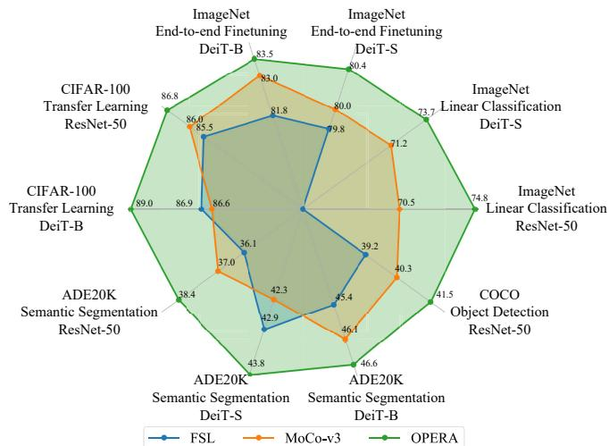
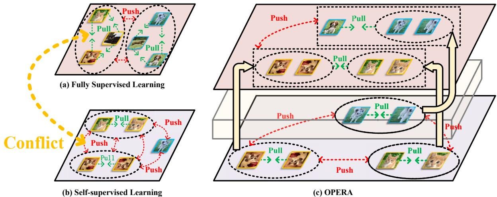
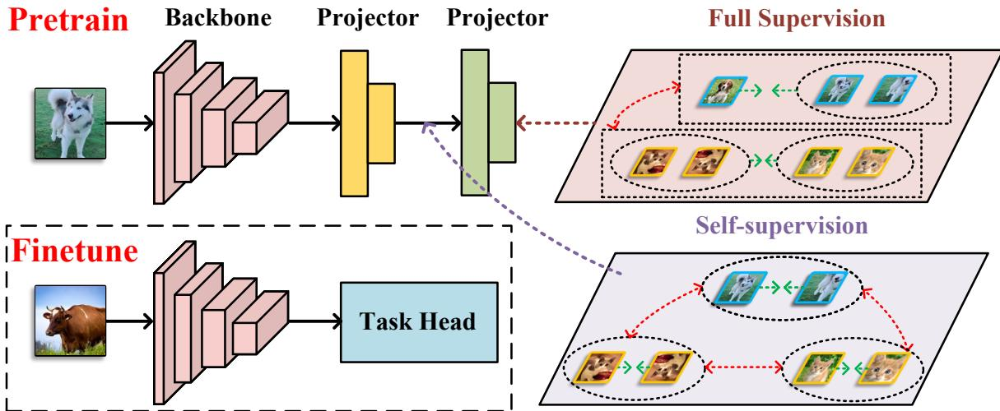
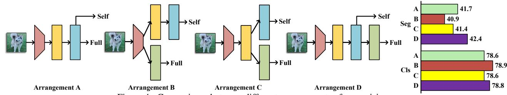
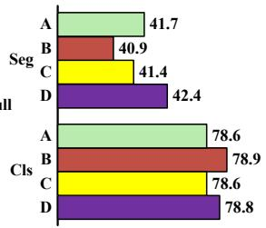
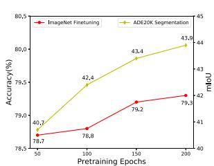
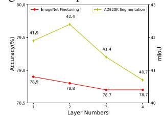
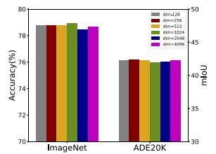

# OPERA: Omni-Supervised Representation Learning with Hierarchical Supervisions

Chengkun Wang1,2,\* Wenzhao Zheng1,2,\* Zheng Zhu3 Jie Zhou1,2 Jiwen Lu1,2,† 1Department of Automation, Tsinghua University, China   
2Beijing National Research Center for Information Science and Technology, China 3PhiGent Robotics, China

{wck20,zhengwz18}@mails.tsinghua.edu.cn; {jzhou,lujiwen}@tsinghua.edu.cn; zhengzhu@ieee.org

## Abstract

The pretrain-finetune paradigm in modern computer vision facilitates the success of self-supervised learning, which tends to achieve better transferability than supervised learning. However, with the availability of massive labeled data, a natural question emerges: how to train a better model with both self and full supervision signals? In this paper, we propose Omni-suPErvised Representation leArning with hierarchical supervisions (OPERA) as a solution. We provide a unified perspective of supervisions from labeled and unlabeled data and propose a unified framework of fully supervised and self-supervised learning. We extract a set of hierarchical proxy representations for each image and impose self and full supervisions on the corresponding proxy representations. Extensive experiments on both convolutional neural networks and vision transformers demonstrate the superiority of OPERA in image classification, segmentation, and object detection.

## 1. Introduction

Learning good representations is a significant yet challenging task in deep learning [12, 75, 23]. Researchers have developed various ways to adapt to different supervisions, such as fully supervised [41, 30, 56, 52], selfsupervised [59, 68, 21, 10], and semi-supervised learning [67, 71, 58]. They serve as fundamental procedures in various tasks including image classification [16, 72, 70], semantic segmentation [21, 48], and object detection [24, 5].

Fully supervised learning (FSL) has always been the default choice for representation learning, which learns from discriminating samples with different ground-truth labels. However, this dominance begins to fade with the rise of the pretrain-finetune paradigm in modern computer vision. Under such a paradigm, researchers usually pretrain a network on a large dataset first and then transfer it to downstream tasks [22, 14, 23, 12]. This advocates transferability more than discriminativeness of the learned representations. This preference nurtures the recent success of selfsupervised learning (SSL) methods with contrastive objective [23, 64, 21, 10, 60]. They require two views (augmentations) of the same image to be consistent and distinct from other images in the representation space. This instance-level supervision is said to obtain more general and thus transferable representations [18, 27]. The ability to learn without human-annotated labels also greatly popularizes self-supervised contrastive learning. Despite its advantages, we want to explore whether combining selfsupervised signals2 with fully supervised signals further improves the transferability, given the already availability of massive annotated labels [46, 33, 1, 4].

  
Figure 1. The proposed OPERA outperforms both fully supervised and self-supervised counterparts on various downstream tasks.

We find that a simple combination of the self and full supervisions results in contradictory training signals. To address this, in this paper, we provide Omni-suPErvised Representation leArning with hierarchical supervisions (OPERA) as a solution, as demonstrated in Figure 2. We unify full and self supervisions in a similarity learning framework where they differ only by the definition of positive and negative pairs. Instead of directly imposing supervisions on the representations, we extract a hierarchy of proxy representations to receive the corresponding supervision signals. Extensive experiments are conducted with both convolutional neural networks [25] and vision transformers [17] as the backbone model. We pretrain the models using OPERA on ImageNet-1K [46] and then transfer them to various downstream tasks to evaluate the transferability. We report image classification accuracy with both linear probe and end-to-end finetuning on ImageNet-1K. We also conduct experiments when transferring the pretrained model to other classification tasks, semantic segmentation, and object detection. Experimental results demonstrate consistent improvements over FSL and SSL on all the downstream tasks, as shown in Figure 1. Additionally, we show that OPERA outperforms the counterpart methods even with fewer pretraining epochs (e.g., fewer than 150 epochs), demonstrating good data efficiency.

## 2. Related Work

Fully Supervised Representation Learning. Fully supervised representation learning (FSL) utilizes the groundtruth labels of data to learn a discriminative representation space. The general objective is to maximize the discrepancies of representations from different categories and minimize those from the same class. The softmax loss is most widely used for fully supervised representation learning [25, 35, 16, 57]. SupCon [28] and LOOK [19] generalized the contrastive loss from self-supervised learning [23, 10, 21] to the fully supervised setting but still focused on class-level discrimination. As fully supervised objectives entail strong constraints, the learned representations are usually more suitable for the specialized classification task and thus lag behind on transferability [74, 18, 27]. To alleviate this, many works devise various data augmentation methods to expand the training distribution [72, 29, 7, 51]. Recent works also explore adding more layers after the representation to avoid direct supervision [54, 61]. Differently, we focus on effectively combining full supervision with self-supervision to improve transferability.

Self-supervised Representation Learning. Selfsupervised representation learning (SSL) attracts increasing attention in recent years due to its ability to learn meaningful representation without human-annotated labels. The main idea is to train the model to perform a carefully designed label-free pretext task. Early self-supervised learning methods devised various pretext tasks including image restoration [53, 73, 43], prediction of image rotation [20], and solving jigsaw puzzles [40]. They achieve fair performance but still cannot equal fully supervised learning until the arise of self-supervised contrastive learning [23, 10, 21]. The pretext task of contrastive learning is instance discrimination, i.e., to identify different views (augmentations) of the same image from those of other images. Contrastive learning methods [12, 64, 55, 65, 34, 8, 26, 32] demonstrate even better transferability than fully supervised learning. This superiority is said to result from their focus on learning lower-level and thus more general features [74, 18, 27]. Very recently, masked image modeling (MIM) [22, 77, 66] emerges as a strong competitor to contrastive learning, which trains the model to correctly predict the masked parts of the input image. In this paper, we mainly focus on contrastive learning in self-supervised learning. Our framework can be extended to other pretext tasks by inserting a new task space in our hierarchy.

Omni-supervised Representation Learning: It is worth mentioning that some existing studies have attempted to combine FSL and SSL [44, 38, 62, 61]. Radosavovic et al. [44] first trained an FSL model and then performed knowledge distillation on unlabeled data. Wei et al. [62] adopted an SSL pretrained model to generate instance labels and compute an overall similarity to train a new model. Nevertheless, they do not consider the hierarchical relations between the self and full supervision. Also, they perform SSL and FSL sequentially in separate stages. Differently, OPERA thoroughly employs FSL and SSL in a universal perspective and imposes the supervisions on different levels of the representations. Our framework can be trained in an end-to-end manner efficiently with fewer epochs.

## 3. Proposed Approach

In this section, we first present a unified perspective of self-supervised learning (SSL) and fully supervised learning (FSL) under a similarity learning framework. We then propose OPERA to impose hierarchical supervisions on hierarchical representations for better transferability. Lastly, we elaborate on the instantiation of OPERA.

## 3.1. Unified Framework of Similarity Learning

Given an image space $\mathcal { X } \subset \mathcal { R } ^ { H \times W \times C }$ , deep representation learning trains a deep neural network as the map to their representation space $\mathcal { Y } \bar { \subset } \mathcal { R } ^ { D \times 1 }$ . Fully supervised learning and self-supervised learning are two mainstream representation learning approaches in modern deep learning. FSL utilizes the human-annotated labels as explicit supervision to train a discriminative classifier. Differently, SSL trains models without ground-truth labels. The widely used contrastive learning (e.g., MoCo-v3 [13]) obtains meaningful representations by maximizing the similarity between random augmentations of the same image.

  
Figure 2. Comparisons of different learning strategies. Fully supervised learning (a) and self-supervised learning (b) constrain images at the class level and instance level, respectively. They conflict with each other for different images from the same class. OPERA imposes hierarchical supervisions on hierarchical spaces and uses a transformation to resolve the supervision conflicts.

Generally, FSL and SSL differ in both the supervision form and optimization objective. To integrate them, we first provide a unified similarity learning framework to include both training objectives:

$$
\begin{array} { r l } { J ( \mathcal { V } , \mathcal { P } , \mathcal { L } ) = } & { { } \displaystyle \sum _ { \mathbf { y } \in \mathcal { V } , \mathbf { p } \in \mathcal { P } , l \in \mathcal { L } } \left[ - w _ { p } \cdot I ( l _ { \mathbf { y } } , l _ { \mathbf { p } } ) \cdot s ( \mathbf { y } , \mathbf { p } ) \right. } \\ { \displaystyle } & { { } \quad \left. + w _ { n } \cdot ( 1 - I ( l _ { \mathbf { y } } , l _ { \mathbf { p } } ) ) \cdot s ( \mathbf { y } , \mathbf { p } ) \right] , } \end{array}\tag{1}
$$

where $w _ { p } \geq 0$ and $w _ { n } \geq 0$ denote the coefficients of positive and negative pairs, $l _ { \mathbf { y } }$ and $l _ { \mathbf { p } }$ are the labels of the samples, and $s ( \mathbf { y } , \mathbf { p } )$ defines the pairwise similarity between y and p. I(a, b) is an indicator function which outputs 1 if $a = b$ and 0 otherwise. $\mathcal { L }$ is the label space, and $\mathcal { P }$ can be the same as $\mathcal { V } ,$ , a transformation of Y, or a learnable class prototype space. For example, to obtain the softmax objective widely employed in FSL [25, 49], we can set:

$$
w _ { p } = 1 , w _ { n } = \frac { e x p ( s ( \mathbf { y } , \mathbf { p } ) ) } { \sum _ { l _ { \mathbf { p ^ { \prime } } } \neq l _ { \mathbf { y } } } e x p ( s ( \mathbf { y } , \mathbf { p ^ { \prime } } ) ) } ,\tag{2}
$$

where $s ( \mathbf { y } , \mathbf { p } ) = \mathbf { y } ^ { T }$ · p, and p is the row vector in the classifier matrix W. For the InfoNCE loss used in contrastive learning [50, 23, 28], we set:

$$
\begin{array} { l } { { \displaystyle w _ { p } = \frac { 1 } { \tau } \frac { \sum _ { l _ { \mathrm { p } ^ { \prime } } \neq \mathbf { y } } e x p \left( s ( \mathbf { y } , \mathbf { p } ^ { \prime } ) / \tau \right) } { e x p \left( s ( \mathbf { y } , \mathbf { p } ) / \tau \right) + \sum _ { l _ { \mathrm { p } ^ { \prime } } \neq l _ { \mathrm { y } } } e x p \left( s ( \mathbf { y } , \mathbf { p } ^ { \prime } ) / \tau \right) } } , }  \\ { { \displaystyle w _ { n } = \frac { 1 } { \tau } \frac { e x p \left( s ( \mathbf { y } , \mathbf { p } ) / \tau \right) } { e x p \left( s ( \mathbf { y } , \mathbf { p } ) / \tau \right) + \sum _ { l _ { \mathrm { p } ^ { \prime } } \neq l _ { \mathrm { y } } } e x p \left( s ( \mathbf { y } , \mathbf { p } ^ { \prime } ) / \tau \right) } , } } \end{array}\tag{3}
$$

where τ is the temperature hyper-parameter. See the supplementary material for more details.

Under the unified training objective (1), the main difference between FSL and SSL lies in the definition of the label space $\mathcal { L } ^ { f u l l }$ and $\mathcal { L } ^ { s e l f }$ . For the labels $l ^ { f u l l } \in \mathcal { L } ^ { f u l l }$ in FSL, $l _ { i } ^ { \dot { f } u l l } = l _ { j } ^ { f u l l }$ only if they are from the same ground-truth category. For the labels $l ^ { s e l f } \in \mathcal { L } ^ { s e l f }$ in SSL, $l _ { i } ^ { s e l f } = l _ { j } ^ { s e l f }$ only if they are the augmented views of the same image.

## 3.2. Hierarchical Supervisions on Hierarchical Representations

With the same training objective formulation, a naive way to combine FSL and SSL is to simply add them, which is similar to adding self-supervision on SupCon [28]:

$$
\begin{array} { r l r } {  { J ^ { n a i v e } ( \mathcal { V } , \mathcal { P } , \mathcal { L } ) = \sum _ { p \in \mathcal { P } , l \in \mathcal { L } } [ - w _ { p } ^ { s e l f } \cdot I ( l _ { \mathbf { y } } ^ { s e l f } , l _ { \mathbf { p } } ^ { s e l f } ) \cdot s ( \mathbf { y } , \mathbf { p } )  } } \\ & { } & {  \mathbf { y } \in \mathcal { V } , \mathbf { p } \in \mathcal { P } , l \in \mathcal { L }  } \\ & { } & { +  w _ { n } ^ { s e l f } \cdot ( 1 - I ( l _ { \mathbf { y } } ^ { s e l f } , l _ { \mathbf { p } } ^ { s e l f } ) ) \cdot s ( \mathbf { y } , \mathbf { p } )  } \\ & { } & {  - w _ { p } ^ { f u l l } \cdot I ( l _ { \mathbf { y } } ^ { f u l l } , l _ { \mathbf { p } } ^ { f u l l } ) \cdot s ( \mathbf { y } , \mathbf { p } )  } \\ & { } & {  + w _ { n } ^ { f u l l } \cdot ( 1 - I ( l _ { \mathbf { y } } ^ { f u l l } , l _ { \mathbf { p } } ^ { f u l l } ) ) \cdot s ( \mathbf { y } , \mathbf { p } ) ] . } \end{array}\tag{4}
$$

For y and p from the same class, i.e., $I ( l _ { \mathbf { y } } ^ { s e l f } , l _ { \mathbf { p } } ^ { s e l f } ) = 0$ and $I ( l _ { \mathbf { y } } ^ { f u l l } , l _ { \mathbf { p } } ^ { f u l l } ) = 1$ , the training loss is:

$$
J ^ { n a i v e } ( { \bf y } , { \bf p } , { \bf l } ) = ( w _ { n } ^ { s e l f } - w _ { p } ^ { f u l l } ) \cdot s ( { \bf y } , { \bf p } ) .\tag{5}
$$

This indicates the two training signals are contradictory and may neutralize each other. This is particularly harmful if we adopt similar loss functions for FSL and SSL, i.e., $w _ { n } ^ { s e l f } \approx w _ { p } ^ { f u l l }$ , and thus $J ^ { n a i v e } ( { \bf y } , { \bf p } , { \bf l } ) \approx 0 .$ demonstrating the difficulty of directly generalizing SupCon [28].

Existing methods [38, 62, 61] address this by subsequently imposing the two training signals. They tend to first obtain a self-supervised pretrained model and then use full supervision to tune it. Differently, we propose a more efficient way to adaptively balance the two weights so that we can simultaneously employ them:

$$
J ^ { a d a p } ( { \bf y } , { \bf p } , { \bf l } ) = ( w _ { n } ^ { s e l f } \cdot \alpha - w _ { p } ^ { f u l l } \cdot \beta ) \cdot s ( { \bf y } , { \bf p } ) ,\tag{6}
$$

  
Figure 3. An illustration of the proposed OPERA framework. We perform SSL and FSL on the corresponding proxy representations. OPERA combines both supervisions to balance instance-level and class-level information for the backbone in an end-to-end manner.

where α and $\beta$ Pretrain Backbone Projare modulation factors that can be dependent on $\mathbf { y }$ and p for more flexibility. However, it remains challenging to design the specific formulation of α and $\beta .$

Considering that the two label spaces are entangled and demonstrate a hierarchical structure:

$$
I ( l _ { \mathbf { y } } ^ { s e l f } , l _ { \mathbf { p } } ^ { s e l f } ) = 1 \implies I ( l _ { \mathbf { y } } ^ { f u l l } , l _ { \mathbf { p } } ^ { f u l l } ) = 1 ,\tag{7}
$$

i.e., the two augmented views of the same image must share Finetunethe same category label, we transform the image representation into proxy representations in an instance space and a class space to construct a hierarchical structure. Formally, we apply two transformations Y sequentially:

$$
\mathcal { V } ^ { s e l f } = g ( \mathcal { V } ) , \quad \mathcal { V } ^ { f u l l } = h ( \mathcal { V } ^ { s e l f } ) ,\tag{8}
$$

where $g ( \cdot )$ and $h ( \cdot )$ denote the mapping functions. We extract the class representations following the instance representations since full supervision encodes higher-level features than self-supervision.

We then impose the self and full supervision on the instance space and class space, respectively, to formulate the overall training objective for the proposed OPERA:

$$
\begin{array} { r } { J ^ { O } ( \mathcal { Y } , \mathcal { P } , \mathcal { L } ) = J ^ { s e l f } ( \mathcal { Y } ^ { s e l f } , \mathcal { P } ^ { s e l f } , \mathcal { L } ^ { s e l f } ) } \\ { + J ^ { f u l l } ( \mathcal { Y } ^ { f u l l } , \mathcal { P } ^ { f u l l } , \mathcal { L } ^ { f u l l } ) . } \end{array}\tag{9}
$$

We will show in the next subsection that this objective naturally implies (6), which implicitly and adaptively balances self and full supervisions in the representation space.

## 3.3. Omni-supervised Representation Learning

To effectively combine the self and full supervision to learn representations, OPERA further extracts a set of proxy representations hierarchically to receive the corresponding training signal, as illustrated in Figure 3. Despite its simplicity and efficiency, it is not clear how it achieves balances r Projectorbetween the two supervision signals and how it resolves the contradiction demonstrated in (5).

To thoroughly understand the effect of (9) on the image representations, we project it back on the representation space $\mathcal { V }$ and obtain an equivalent training objective in Y.

Proposition 1. Assume using linearprojection as the transformation between representation spaces. $g ( y ) = W _ { g } y$ and $\begin{array} { r } { h ( \pmb { y } ) = \pmb { W } _ { h } \pmb { y } , } \end{array}$ where $W _ { g }$ and $W _ { h }$ are learnable parameters. Optimizing (9) is equivalent to optimizing the fol-Self-supelowing objective on the original representation space $\mathcal { N } .$

$$
\begin{array} { l } { { J ( \mathcal { Y } , \mathcal { P } , \mathcal { L } ) = \displaystyle \sum _ { \mathbf { y } \in \mathcal { Y } , \mathbf { P } \in \mathcal { P } , \mathbf { l } \in \mathcal { L } } \ [ I ( l _ { \mathbf { y } } ^ { s e l f } , l _ { \mathbf { p } } ^ { s e l f } ) \cdot I ( l _ { \mathbf { y } } ^ { f u l l } , l _ { \mathbf { p } } ^ { f u l } ) } } \\ { { \mathrm { } \mathrm { } \mathrm { } \mathrm { } } } \\ { { \mathrm { } \mathrm { } \mathrm { } \mathrm { } \cdot ( - w _ { p } ^ { s e l f } \alpha ( W _ { g } ) - w _ { p } ^ { f u l l } \beta ( W _ { g } , W _ { h } ) ) \cdot s ( \mathbf { y } , \mathbf { p } ) } } \\ { { \mathrm { } \mathrm { } + ( 1 - I ( l _ { \mathbf { y } } ^ { s e l f } , l _ { \mathbf { p } } ^ { s e l f } ) ) \cdot I ( l _ { \mathbf { y } } ^ { f u l l } , l _ { \mathbf { p } } ^ { f u l l } ) } } \\ { { \mathrm { } \mathrm { } \cdot ( w _ { n } ^ { s e l f } \alpha ( W _ { g } ) - w _ { p } ^ { f u l l } \beta ( W _ { g } , W _ { h } ) ) \cdot s ( \mathbf { y } , \mathbf { p } ) } } \\ { { \mathrm { } + ( 1 - I ( l _ { \mathbf { y } } ^ { s e l f } , l _ { \mathbf { p } } ^ { s e l f } ) ) \cdot ( 1 - I ( l _ { \mathbf { y } } ^ { f u l l } , l _ { \mathbf { p } } ^ { f u l l } ) ) } } \\ { { \mathrm { } \cdot ( w _ { n } ^ { s e l f } \alpha ( W _ { g } ) + w _ { n } ^ { f u l l } \beta ( W _ { g } , W _ { h } ) ) \cdot s ( \mathbf { y } , \mathbf { p } ) ] , } } \end{array}\tag{10}
$$

where $\alpha ( W _ { g } )$ and $\beta ( W _ { g } , W _ { h } )$ are scalars related to the transformation parameters.

We give detailed proof in the supplementary material.

Remark. Proposition 1 only considers the case without activation functions. We conjecture that the mappings g(·) and $h ( \cdot )$ only influence theform of $\cdot _ { \beta ( \cdot , \cdot ) }$ without altering thefinal conclusion.

Proposition 1 induces two corollaries as proved in the supplementary material.

Corollary 1. The loss weight w on a pair of samples $\left( \mathbf { y } , \mathbf { p } \right)$ satisfies:

$$
\begin{array} { r } { w ( l _ { \mathbf { y } } ^ { s e l f } = l _ { \mathbf { p } } ^ { s e l f } , l _ { \mathbf { y } } ^ { f u l l } = l _ { \mathbf { p } } ^ { f u l l } ) \leq w ( l _ { \mathbf { y } } ^ { s e l f } \neq l _ { \mathbf { p } } ^ { s e l f } , l _ { \mathbf { y } } ^ { f u l l } = l _ { \mathbf { p } } ^ { f u l l } ) } \\ { \leq w ( l _ { \mathbf { y } } ^ { s e l f } \neq l _ { \mathbf { p } } ^ { s e l f } , l _ { \mathbf { y } } ^ { f u l l } \neq l _ { \mathbf { p } } ^ { f u l l } ) . } \end{array}\tag{11}
$$

Corollary 1 ensures that the learned representations are consistent with human perception, i.e., the similarities between different images of the same class should be larger than those between images of different classes but smaller than those between the views of the same images.

Corollary 2. We resolve the contradictory in (5) by adaptively adjusting the loss weight by:

$$
w _ { n } ^ { s e l f } \cdot \alpha ( W _ { g } ) - w _ { p } ^ { f u l l } \cdot \beta ( W _ { g } , W _ { h } ) .\tag{12}
$$

Corollary 2 demonstrates the ability of OPERA to adaptively balance the training signals of both supervisions.

OPERA can be trained efficiently in an end-to-end manner using both self and full supervisions. For inference, we discard the proxy representations and directly add the task head on the image representation space Y.

## 3.4. Instantiation of OPERA

We present the instantiation of the proposed omnisupervised representation learning with hierarchical supervisions. In the pretraining procedure, we extract hierarchical proxy representations for each image $\mathbf { x } _ { i }$ in our model, denoted as $\{ \mathbf { y } _ { i } ^ { s e l f } , \mathbf { y } _ { i } ^ { f u l l } \}$ We conduct self-supervised learning with the instance-level label $\boldsymbol { l } _ { i } ^ { s e l f }$ on the instancelevel representation ${ \bf y } _ { i } ^ { s e l f }$ and the class-level label $l _ { i } ^ { f u l l }$ is imposed on ${ \bf y } _ { i } ^ { f u l l }$ . The overall objective of our framework follows (9) and OPERA can be optimized in an end-to-end manner. During finetuning, the downstream task head is directly applied to the learned representations Y. The transfer learning includes image classification and other dense prediction tasks such as semantic segmentation.

In this paper, we apply OPERA to MoCo-v3 [13] by instantiating $\mathcal { V } ^ { s e l f }$ as the output of the online predictor and the target predictor denoted as $\mathcal { V } _ { q } ^ { s e l f }$ and $\mathcal { \bar { y } } _ { k } ^ { s e l f }$ , respectively. Additionally, $J ( \mathcal { V } ^ { s e l f } , \mathcal { L } ^ { s e l f } )$ is set to be the InfoNCE loss [50]. Furthermore, we employ an extra MLP block that explicitly connects to the online predictor to obtain $\mathcal { \mathrm { y } } ^ { f u l l }$ and fix the output dimension to the class number of the pretrained dataset (e.g., 1,000 for ImageNet). We then introduce full supervision on $\mathcal { V } ^ { f u l l }$ with the Softmax loss. The overall objective based on MoCo-v3 is as follows:

$$
\begin{array} { l } { { \displaystyle { \cal J } _ { m } ( \mathcal { V } , \mathcal { L } ) = \frac { 1 } { N } { \sum _ { i = 1 } ^ { N } } [ - l o g \frac { e x p ( { \bf y } _ { i , l _ { i } } ^ { f u l l } ) } { \sum _ { j \ne l _ { i } } e x p ( { \bf y } _ { i , j } ^ { f u l l } ) } } } \\ { { \displaystyle ~ - l o g \frac { e x p ( { \bf y } _ { q , i } ^ { s e l f } \cdot { \bf y } _ { k , i } ^ { s e l f } / \tau ) } { e x p ( { \bf y } _ { q , i } \cdot { \bf y } _ { k , i } / \tau ) + \sum _ { j \ne i } e x p ( { \bf y } _ { q , i } \cdot { \bf y } _ { k , j } / \tau ) } ] } } \end{array}\tag{13}
$$

where $\mathbf { y } _ { i , j } ^ { f u l l }$ denotes the jth component of ${ \bf y } _ { i } ^ { f u l l }$ . We also adopt the stop-gradient operation and the momentum updating [23]. Compared with MoCo-v3, OPERA further incorporates class-level knowledge for better representation.

## 4. Experiments

In this section, we conducted extensive experiments to evaluate the performance of our OPERA framework. We pretrained the network using OPERA on the ImageNet-1K [46] (IN) dataset and then evaluated its performance on different tasks. As existing works usually adopt different experimental settings, and many previous methods lack the evaluation on downstream tasks, it is very difficult to provide a fair comparison with all the methods. Therefore, we reproduced the FSL and SSL baselines under the same setting and ran most of the experiments for only one time without hyperparameter optimization. We also provide in-depth ablation studies to analyze the effectiveness of OPERA.

## 4.1. Experimental Setup

Datasets. We pretrain our model on the training set of ImageNet-1K [46] containing 1,280,000 samples of 1,000 categories. We evaluate the linear probe and end-to-end finetuning performance on the validation set consisting of 50,000 images. For transferring to other classification tasks, we use CIFAR-10 [31], CIFAR-100 [31], Oxford Flowers-102 [39], and Oxford-IIIT-Pets [42]. For other downstream tasks, we use ADE20K [76] for semantic segmentation and COCO [33] for object detection and instance segmentation.

Implementation Details. We mainly applied our OPERA to MoCo-v3 [13]. We added an extra MLP block after the predictor of the online network composed of two fully connected layers with a batch normalization layer and a ReLU layer. The hidden dimension of the MLP block was set to 256 while the output dimension was 1, 000. We trained ResNet50 [25] (R50) and ViTs [49, 17] (ViT-S and ViT-B) as our backbone with a batch size of 1024, 2048, and 4096. We adopted LARS [69] as the optimizer for R50 and AdamW [37] for ViT. We set the other settings the same as the original MoCo-v3 for fair comparisons. In the following experiments, † denotes our reproduced results with the same settings and BS denotes the batch size. P.T and F.T denote the pretraining and finetuning epochs, respectively. The bold number highlights the improvement of OPERA compared with the associated method, and the red number indicates the best performance.

## 4.2. Main Results

Linear Probe Evaluation on ImageNet. We evaluated OPERA using the linear probe protocol and trained a classifier on top of the frozen representation. We used the SGD [45] optimizer and fixed the batch size to 1024. We set the learning rate to 0.1 for R50 [25] and 3.0 for ViT-S [49]. The weight decay was 0 and the momentum of the optimizer was 0.9 for both architectures. We compared OPERA with existing SSL methods including MoCo-v1 [23], MoCov2 [11], SimCLR [10], BYOL [21], and SimSiam [12], as shown in Table 1. We achieved 74.8% and 73.7% top-1 accuracy using R50 [25] and ViT-S [49], respectively. Additionally, OPERA pretrained with 150 epochs surpasses the MoCo-v3 baseline, demonstrating the discriminative ability of the learned representations.

Table 1. Top-1 and top-5 accuracies (%) under the linear classification protocol on ImageNet.
<table><tr><td>Method</td><td>BS</td><td colspan="4">P.T. F.T. Backbone Top-1 Acc Top-5 Acc</td></tr><tr><td>MoCo-v1 MoCo-v2 MoCo-v2</td><td>256 256 256</td><td>200 200 800</td><td>100 100 100</td><td>R50 R50</td><td>60.6 67.5</td></tr><tr><td>SimCLR BYOL SimSiam</td><td>4096 4096 256</td><td>1000 100 1000 80 800 100</td><td>R50 R50 R50 R50</td><td>71.1 69.3 74.3 71.3</td><td>89.0 91.6</td></tr><tr><td>MoCo-v3† OPERA</td><td>1024 1024</td><td>300 90 150 90</td><td>R50 R50</td><td>70.5 73.7</td><td>一 90.0 91.2</td></tr><tr><td>OPERA</td><td>1024</td><td>300 90</td><td>R50</td><td>74.8</td><td>91.9</td></tr><tr><td></td><td></td><td>90</td><td></td><td></td><td></td></tr><tr><td>MoCo-v3†</td><td></td><td></td><td>ViT-S</td><td></td><td></td></tr><tr><td></td><td>1024</td><td>300</td><td></td><td>71.2</td><td>90.3</td></tr><tr><td>OPERA</td><td>1024</td><td>90</td><td>ViT-S</td><td></td><td></td></tr><tr><td></td><td>1024</td><td>150</td><td></td><td>72.7</td><td>90.7</td></tr><tr><td>OPERA</td><td></td><td>300 90</td><td>ViT-S</td><td>73.7</td><td>91.3</td></tr></table>

End-to-end Finetuning on Imagenet. Having pretrained, we finetuned the backbone on ImageNet. We used AdamW [37] with an initial learning rate of 5e-4 and a weight decay of 0.05 and employed the cosine annealing [36] learning schedule. We provide the results in Table 2 with diverse batch sizes, pretraining epochs, and finetuning epochs. We see that OPERA consistently achieves better performance under the same setting compared with the MoCo-v3 baseline and DINO [6].

Transfer to Other Classification Tasks. We transferred the pretrained network to other classification tasks including CIFAR-10 [31], CIFAR-100 [31], Oxford Flowers-102 [39], and Oxford-IIIT-Pets [42]. We fixed the finetuning epochs to 100 following [13] and reported the top-1 accuracy in Table 3. We observe that OPERA obtains competitive results on four datasets with both R50 and ViT-S. Though MoCo-v3 does not show consistent improvement compared to supervised training, our OPERA demonstrates clear superiority. Note that SupCon [28] and LOOK [19] achieve better results on the Flowers-102 and Pets datasets because of the stronger baselines they have adopted. The results show that OPERA learns generic representations which can widely transfer to smaller classification datasets.

Transfer to Semantic Segmentation. We transferred the OPERA-pretrained network to semantic segmentation on ADE20K [76], which aims at classifying each pixel of an image. We adopted MMSegmentaion [15] to conduct the experiments under the same setting. We equipped R50 with FCN [47] and ViTs with UPerNet [63]. We applied SGD [45] with a learning rate of 0.01, a momentum of 0.9, and a weight decay of 5e-4. We used a learning schedule of 160k and provided the experimental results in Table 4. We observe consistent improvements over both supervised

Table 2. Top-1 and top-5 accuracies (%) under the end-to-end finetuning protocol on ImageNet.
<table><tr><td>Method</td><td>BS</td><td>P.T. F.T. Backbone Top-1 Acc Top-5 Acc</td><td></td><td></td><td></td></tr><tr><td>Supervised</td><td>1024 300</td><td></td><td>R50</td><td>76.5</td><td></td></tr><tr><td>MoCo-v3</td><td></td><td>1024 150 150</td><td>R50</td><td>76.4</td><td></td></tr><tr><td>OPERA</td><td>1024 150</td><td>150</td><td>R50</td><td>77.0</td><td>一</td></tr><tr><td>Supervised</td><td>1024 300</td><td></td><td>ViT-S</td><td>79.8</td><td>95.0</td></tr><tr><td>Supervised</td><td>1024 300</td><td></td><td>ViT-B</td><td>81.8</td><td>95.6</td></tr><tr><td>DINO†</td><td>1024 300</td><td>300</td><td>ViT-B</td><td>82.8</td><td>96.3</td></tr><tr><td>MoCo-v3†</td><td>1024 300</td><td>100</td><td>ViT-S</td><td>78.8</td><td>94.6</td></tr><tr><td>OPERA</td><td>1024 150</td><td>100</td><td>ViT-S</td><td>79.1</td><td>94.7</td></tr><tr><td>OPERA</td><td>1024 300</td><td>100</td><td>ViT-S</td><td>80.0</td><td>95.1</td></tr><tr><td>MoCo-v3†</td><td>1024 300</td><td>150</td><td>ViT-S</td><td>79.1</td><td>94.6</td></tr><tr><td>OPERA</td><td>1024 150</td><td>150</td><td>ViT-S</td><td>79.9</td><td>95.1</td></tr><tr><td>OPERA</td><td>1024 300</td><td>150</td><td>ViT-S</td><td>80.4</td><td>95.3</td></tr><tr><td>MoCo-v3†</td><td>1024 300</td><td>200</td><td>ViT-S</td><td>80.0</td><td>95.2</td></tr><tr><td>OPERA</td><td>1024 300</td><td>200</td><td>ViT-S</td><td>80.8</td><td>95.5</td></tr><tr><td>MoCo-v3†</td><td>1024 300</td><td>150</td><td>ViT-B</td><td>82.1</td><td>95.9</td></tr><tr><td>OPERA</td><td>1024 150</td><td>150</td><td>ViT-B</td><td>82.4</td><td>96.0</td></tr><tr><td>OPERA</td><td>1024 300</td><td>150</td><td>ViT-B</td><td>82.6</td><td>96.2</td></tr><tr><td>MoCo-v3†</td><td>2048</td><td>3300 150</td><td>ViT-B</td><td>82.7</td><td>96.3</td></tr><tr><td>OPERA</td><td>2048</td><td>3150 150</td><td>ViT-B</td><td>82.8</td><td>96.3</td></tr><tr><td>OPERA</td><td>2048 300</td><td>150</td><td>ViT-B</td><td>83.1</td><td>96.4</td></tr><tr><td>MoCo-v3†</td><td>4096 300</td><td>150</td><td>ViT-B</td><td>83.0</td><td>96.3</td></tr><tr><td>OPERA</td><td>4096150</td><td>150</td><td>ViT-B</td><td>83.2</td><td>96.4</td></tr><tr><td>OPERA</td><td></td><td>4096 300150</td><td>ViT-B</td><td></td><td></td></tr><tr><td></td><td></td><td></td><td></td><td>83.5</td><td>96.5</td></tr></table>

Table 3. Top-1 accuracy (%) of the transfer learning on other classification datasets.
<table><tr><td>Method</td><td>P.T.</td><td>Backbone C-10 C-100</td><td>Flowers-102</td><td>Pets</td></tr><tr><td>Supervised†</td><td>300</td><td>R50 97.6</td><td>85.5</td><td>95.6 92.2</td></tr><tr><td>SupCon LOOK</td><td>350</td><td>R50 97.4</td><td>84.3 96.0</td><td>93.5</td></tr><tr><td>SimCLR†</td><td>90 1000</td><td>R50 R50 97.7</td><td>96.4 85.9 91.5</td><td>92.5 83.4</td></tr><tr><td>BYOL†</td><td>1000</td><td>R50 97.8</td><td>86.1 95.5</td><td>90.4</td></tr><tr><td>MoCo-v3†</td><td>300</td><td>R50 97.8</td><td>86.0 93.7</td><td>90.0</td></tr><tr><td>OPERA</td><td>150</td><td>R50 97.9</td><td>86.3 93.9</td><td>91.1</td></tr><tr><td>OPERA</td><td>300</td><td>R50 98.2</td><td>86.8 95.6</td><td>92.7</td></tr><tr><td>Supervised†</td><td>300</td><td>ViT-S 98.4</td><td>86.9 95.4</td><td>93.0</td></tr><tr><td>MoCo-v3†</td><td>300</td><td>ViT-S 97.9</td><td>86.6 90.3</td><td>90.1</td></tr><tr><td>OPERA</td><td>150</td><td>ViT-S 98.4</td><td>88.5 94.6</td><td>91.9</td></tr><tr><td>OPERA</td><td>300</td><td>ViT-S 98.6</td><td>89.0 95.5</td><td>93.3</td></tr></table>

learning and MoCo-v3 with both R50 and ViTs. Particularly, MoCo-v3 performs worse than the supervised model with ViT-S (-0.6 mIoU) while OPERA still outperforms supervised learning by a large margin (+0.9 mIoU).

Transfer to Object Detection and Instance Segmentation. We further evaluated the transferability of OPERA to object detection and instance segmentation on COCO [33]. We performed finetuning and evaluation on $\mathrm { C O C O } _ { t r a i n 2 0 1 7 }$ and $\mathrm { C O C O } _ { v a l 2 0 1 7 }$ , respectively, using the MMDetection [9] codebase. (Note that the detection performances present significant deviations with different codebases even under the same setting and our reported results are consistently based on MMDetection.) We adopted Mask R-CNN [24] with R50-FPN as the detection model. We used SGD [45] with a learning rate of 0.02, a momentum of 0.9, and a weight decay of 1e-4. We reported the performance using the 1 × schedule (12 epochs) and 2 × schedule (24 epochs) in Table 5 and Table 6, respectively. The experimental results of SimCLR [10], BYOL [21], and Sim-Siam [12] are from [12]. We observe that both OPERA and MoCo-v3 demonstrate remarkable advantages compared with random initialization, supervised learning, and other contrastive learning approaches on two tasks. OPERA further improves MoCo-v3 by a relatively large margin on both training schedules, indicating the generalization ability on detection and instance segmentation datasets.

Table 4. Experimental results of semantic segmentation on ADE20K. (160k schedule)
<table><tr><td>Method</td><td>P.T.</td><td>Backbone</td><td>BS</td><td>mIoU</td><td>mAcc</td><td>aAcc</td></tr><tr><td>Supervised</td><td>300</td><td>R50</td><td>1024</td><td>36.1</td><td>45.4</td><td>77.5</td></tr><tr><td>MoCo-v3†</td><td>300</td><td>R50</td><td>1024</td><td>37.0</td><td>47.0</td><td>77.6</td></tr><tr><td>MoCo-v3†</td><td>1000</td><td>R50</td><td>1024</td><td>38.1</td><td>47.8</td><td>77.9</td></tr><tr><td>OPERA</td><td>150</td><td>R50</td><td>1024</td><td>37.7</td><td>47.9</td><td>77.7</td></tr><tr><td>OPERA</td><td>300</td><td>R50</td><td>1024</td><td>37.9</td><td>48.1</td><td>77.9</td></tr><tr><td>OPERA</td><td>150</td><td>R50</td><td>4096</td><td>38.1</td><td>47.9</td><td>78.0</td></tr><tr><td>OPERA</td><td>300</td><td>R50</td><td>4096</td><td>38.4</td><td>48.5</td><td>78.1</td></tr><tr><td>Supervised</td><td>300</td><td>ViT-S</td><td>1024</td><td>42.9</td><td>53.9</td><td>80.3</td></tr><tr><td>MoCo-v3†</td><td>300</td><td>ViT-S</td><td>1024</td><td>42.3</td><td>53.5</td><td>80.6</td></tr><tr><td>OPERA</td><td>150</td><td>ViT-S</td><td>1024</td><td>43.4</td><td>54.2</td><td>80.8</td></tr><tr><td>OPERA</td><td>300</td><td>ViT-S</td><td>1024</td><td>43.6</td><td>54.4</td><td>80.9</td></tr><tr><td>OPERA</td><td>150</td><td>ViT-S</td><td>4096</td><td>43.5</td><td>54.3</td><td>80.8</td></tr><tr><td>OPERA</td><td>300</td><td>ViT-S</td><td>4096</td><td>43.8</td><td>54.6</td><td>80.9</td></tr><tr><td>Supervised</td><td>300</td><td>ViT-B</td><td>1024</td><td>45.4</td><td>56.5</td><td>81.4</td></tr><tr><td>MoCo-v3†</td><td>300</td><td>ViT-B</td><td>1024</td><td>44.4</td><td>55.1</td><td>81.5</td></tr><tr><td>OPERA</td><td>150</td><td>ViT-B</td><td>1024</td><td>44.8</td><td>55.7</td><td>81.8</td></tr><tr><td>OPERA</td><td>300</td><td>ViT-B</td><td>1024</td><td>45.2</td><td>55.9</td><td>81.9</td></tr><tr><td>Supervised</td><td>300</td><td>2048</td><td>ViT-B</td><td>45.6</td><td>56.3</td><td>81.8</td></tr><tr><td>MoCo-v3†</td><td>300</td><td>ViT-B</td><td>2048</td><td>45.2</td><td>55.5</td><td>81.9</td></tr><tr><td>OPERA</td><td>150</td><td>ViT-B</td><td>2048</td><td>45.6</td><td>56.4</td><td>82.0</td></tr><tr><td>OPERA</td><td>300</td><td>ViT-B</td><td>2048</td><td>45.9</td><td>56.7</td><td>82.0</td></tr><tr><td>Supervised</td><td>300</td><td>4096</td><td>ViT-B</td><td>46.0</td><td>56.7</td><td>82.0</td></tr><tr><td>MoCo-v3†</td><td>300</td><td>ViT-B</td><td>4096</td><td>46.1</td><td>56.7</td><td>82.1</td></tr><tr><td>OPERA</td><td>150</td><td>ViT-B</td><td>4096</td><td>46.4</td><td>56.9</td><td>82.1</td></tr><tr><td>OPERA</td><td>300</td><td>ViT-B</td><td>4096</td><td>46.6</td><td>57.2</td><td>82.1</td></tr></table>

## 4.3. Ablation Study

To further understand the proposed OPERA, we conducted various ablation studies to evaluate its effectiveness. We mainly focus on end-to-end finetuning on ImageNet [46] for representation discriminativeness and semantic segmentation on ADE20K [76] for representation transferability evaluation on ViT-S. We fixed the number of finetuning epochs to 100 for ImageNet and used a learning schedule of 160k based on UPerNet [63] on ADE20K.

Arrangements of Supervisions. As discussed in the paper, the arrangements of supervisions are significant to the quality of the representation. We thus conducted experiments with different arrangements of supervisions to analyze their effects, as illustrated in Figure 4. We maintained the basic structure of contrastive learning and imposed the fully-supervised training signal on four different positions. Note that Figure 4 only shows the online network of the framework. Specifically, arrangement A simply combines the MoCo-v3 baseline with supervised learning by imposing the full supervision and self supervision in the same space, which is similar to the setting of SupCon [28]. Additionally, arrangement B obtains the class-level representation from the backbone and directly imposes the fullysupervised learning signal. Differently, arrangement C simultaneously extracts the class-level representation and the instance-level representation with an MLP structure from the projector. Arrangement D denotes the proposed OPERA framework in our main experiments. The experimental results are shown in the right of Figure 4. We observe that arrangement B achieves the highest classification performance on ImageNet. This is because the full supervision is directly imposed on the backbone feature, which extracts more class-level information during pretraining. However, arrangements A, B, and C perform much worse on the downstream semantic segmentation task. They ignore the underlying hierarchy of the supervisions and do not apply the stronger supervision (full supervision) after the weaker supervision (self-supervision). The learned representation tends to abandon more instance-level information but obtain more task-specific knowledge, which is not beneficial to the transfer learning tasks. Instead, our OPERA (arrangement D) achieves a better balance of class-level and instance-level information learning.

Table 5. Experimental results of object detection and instance segmentation on COCO. (Mask R-CNN, R50-FPN, 1 × schedule)
<table><tr><td>Method</td><td>P.T. BS</td><td> $\sqrt { \mathbf { A } \mathbf { P } ^ { b b } }$ </td><td>APbb 50</td><td>AP65 75</td><td> $\overline { { \mathbf { A P } ^ { m k } } }$ </td><td>APmk 50</td><td>APmk 75</td></tr><tr><td>Rand. Init. Supervised 300 1024</td><td></td><td>1024 31.0 38.2</td><td>49.5 58.8</td><td>33.2 41.4</td><td>28.5 34.7</td><td>46.8 55.7</td><td>30.4 37.2</td></tr><tr><td>SimCLR BYOL</td><td>1000 4096 1000 4096</td><td>37.9 37.9</td><td>57.7</td><td>40.9 40.9</td><td>33.3 33.2</td><td>54.6 54.3</td><td>35.3 45.0</td></tr><tr><td>SimSiam</td><td>800 256</td><td>39.2</td><td>57.8 59.3</td><td>42.1</td><td>34.4</td><td>56.0</td><td></td></tr><tr><td></td><td></td><td></td><td></td><td>42.4</td><td></td><td></td><td>34.7</td></tr><tr><td>MoCo-v3† 300 1024</td><td></td><td>38.9</td><td>58.8</td><td></td><td>35.2</td><td>56.0</td><td>37.7</td></tr><tr><td>OPERA</td><td>1501024</td><td>38.9</td><td>58.9</td><td>42.1</td><td>35.3</td><td>55.8</td><td>37.8</td></tr><tr><td>OPERA</td><td>3001024</td><td>39.2</td><td>59.2</td><td>42.6</td><td>35.9</td><td>56.2</td><td>38.1</td></tr><tr><td>OPERA</td><td>1504096</td><td>39.1</td><td>59.1</td><td>42.7</td><td>35.6</td><td>56.2</td><td>38.0</td></tr><tr><td>OPERA</td><td>300 4096</td><td>39.3</td><td>59.3</td><td>42.9</td><td>36.0</td><td>56.4</td><td>38.1</td></tr></table>

Pretraining Epochs. We conducted experiments with different pretraining epochs on ImageNet and provided corresponding results in Figure 5. We observe that both tasks perform better with longer pretraining epochs. Particularly, the performance on semantic segmentation is more sensitive to the number of pretraining epochs compared with ImageNet finetuning, indicating that it takes longer for learning instance-level knowledge. Note that the finetuning accuracy reaches 78.7% with only 50 pretraining epochs, which demonstrates the efficiency of OPERA.

  
Figure 4. Comparisons between different arrangements of supervisions.

  
Figure 5. Pretraining epochs.

  
Figure 6. Layer numbers of MLP.

  
Figure 7. Embedding dimensions.

  
Figure 8. Hidden dimensions of MLP.

Table 6. Experimental results of object detection and instance segmentation on COCO. (Mask R-CNN, R50-FPN, 2 × schedule)
<table><tr><td>Method P.T. BS</td><td>APbb</td><td>APbb AP65</td><td> $\overline { { \mathbf { A P } ^ { m k } } }$  75</td><td>APmk APmk</td></tr><tr><td>Rand. Init. Supervised 300 1024</td><td>1024 36.7 39.2</td><td>56.7 59.6</td><td>40.0 33.7 42.8 35.4</td><td>53.8 35.9 56.4 37.9</td></tr><tr><td>MoCo-v3† 300 1024</td><td>40.3</td><td>60.0</td><td>44.3 36.5</td><td>57.4 39.0</td></tr><tr><td>OPERA</td><td>150 1024 40.5</td><td>60.0 44.6</td><td>36.4</td><td>57.3 39.0</td></tr><tr><td>OPERA 300 1024</td><td>41.2</td><td>60.7 45.0</td><td>36.9</td><td>57.7 39.5</td></tr><tr><td>OPERA 150 4096</td><td>41.2</td><td>60.9 45.1</td><td>37.0</td><td>58.0 39.6</td></tr><tr><td>OPERA 300 4096</td><td>41.5</td><td>61.2</td><td>45.5 37.3</td><td>58.2 39.9</td></tr></table>

Layer Numbers of MLP. We evaluated OPERA with different numbers of fully-connected layers in the final MLP block, as illustrated in Figure 6. We observe that the classification performance generally decreases with more layers deployed. This demonstrates that the class-level supervision is weakened after the MLP block so that the model extracts less class-level information with more layers. For semantic segmentation, the mIoU improves (+0.5) when the layer number increases from 1 to 2, indicating that weaker class-level supervision boosts the transferability of the representation. Still, the performance drops with more layers due to the less effect of the class-level supervision.

Embedding Dimensions. The embedding dimension in our framework measures the output size of the online network projector. We tested the performance using a dimension of 128, 256, 512, 1024, 2048, and 4096 for the embedding and provide the results in Figure 7. We observe that the ImageNet accuracy gradually increases before the embedding dimension reaches 512. In addition, the model achieves the best segmentation performance when the dimension is 256. This indicates that larger dimensions do not necessarily enhance the results because of the information redundancy. Therefore, we adopted the embedding dimen-

Table 7. Comparison between supervised pretraining with an MLP projector and OPERA.
<table><tr><td>Method</td><td>P.T.</td><td>Backbone.</td><td>Top-1 Acc</td><td>mIoU</td></tr><tr><td>MoCo-v3</td><td>100</td><td>ViT-S</td><td>78.3</td><td>41.4</td></tr><tr><td>Supervised</td><td>100</td><td>ViT-S</td><td>78.7</td><td>41.5</td></tr><tr><td>Supervised (MLP)</td><td>100</td><td>ViT-S</td><td>78.4</td><td>41.9</td></tr><tr><td>OPERA</td><td>100</td><td>ViT-S</td><td>78.8</td><td>42.4</td></tr></table>

Table 8. Results using fully unlabeled data for pretraining.
<table><tr><td>Method</td><td>Backbone. Top-1 Acc mIoU</td><td></td></tr><tr><td>MoCo-v3 (100% unlabeled)</td><td>ViT-S</td><td>78.3 41.4</td></tr><tr><td>Supervised (100% labeled)</td><td>ViT-S</td><td>78.7 41.5</td></tr><tr><td>20% labeled + 80% unlabeled</td><td>ViT-S</td><td>78.6 41.7</td></tr><tr><td>80% labeled + 20% unlabeled</td><td>ViT-S</td><td>78.7 42.0</td></tr></table>

sion of 256 in the main experiments for the best trade-off between model performances and training efficiency.

Hidden Dimensions of MLP. The hidden dimension of MLP corresponds to the output size of the first linear layer. We fixed the other settings and used a dimension of 128, 256, 512, 1024, 2048, and 4096 for comparison, as shown in Figure 8. We see that enlarging the hidden dimension would not necessarily benefit two tasks, indicating that OPERA is not sensitive to the hidden dimensions of MLP. Therefore, we employ a dimension of 256 for the main experiments.

Transferability for Supervised Learning. As illustrated in the previous study [61], adding an MLP block before the classifier of the supervised backbone boosts the transferability of supervised pretraining. Therefore, we conducted experiments to compare the performance between the supervised pretraining with an MLP projector and our OPERA framework, as shown in Table 7. We observe that adding the MLP block enhances the transferability for supervised learning while reducing the discriminativeness of the representation with the same pretraining epoch. Nevertheless, OPERA constantly surpasses the discriminativeness and transferability compared with the supervised pretraining with the MLP block, demonstrating its superiority.

Table 9. Comparisons with supervised contrastive learning.
<table><tr><td>Method</td><td>BS</td><td></td><td>P.T. Backbone Linear Probe End-to-end mIoU</td><td></td><td></td></tr><tr><td>SupCon 4096 300</td><td></td><td>ViT-B</td><td>78.3</td><td>82.7</td><td>46.4</td></tr><tr><td>OPERA 4096 300</td><td></td><td>ViT-B</td><td>78.7</td><td>83.5</td><td>46.6</td></tr></table>

Table 10. Top-1 accuracy (%) under the end-to-end finetuning protocol on ImageNet based on MIM methods.
<table><tr><td>Method</td><td>Type</td><td>P.T. Backbone Top-1 Acc</td><td></td></tr><tr><td>BEiT</td><td>Masked Image Modeling 800</td><td>ViT-B</td><td>83.2</td></tr><tr><td>MSN</td><td>Masked Image Modeling 600</td><td>ViT-B</td><td>83.4</td></tr><tr><td>MAE</td><td>Masked Image Modeling 1600</td><td>ViT-B</td><td>83.6</td></tr><tr><td>iBOT</td><td>Masked Image Modeling 1600</td><td>ViT-B</td><td>83.8</td></tr><tr><td>SimMIM</td><td>Masked Image Modeling 800</td><td>ViT-B</td><td>83.8</td></tr><tr><td>DINO†</td><td>Contrastive Learning</td><td>300 ViT-B</td><td>82.8</td></tr><tr><td>MoCo-v3†</td><td>Contrastive Learning</td><td>300 ViT-B</td><td>83.0</td></tr><tr><td>OPERA</td><td>Contrastive Learning</td><td>300 ViT-B</td><td>83.5</td></tr></table>

Use of Additional Unlabeled Data. We conducted experiments to evaluate OPERA using only subsets of ImageNet-1K as labeled data for pretraining. Specifically, we randomly selected 80% (20%) labeled samples and treated the rest 20% (80%) as unlabeled in the ImageNet-1K dataset, as illustrated in Table 8. We observe that OPERA with only partially labeled data for pretraining outperforms both MoCo-v3 and fully supervised learning, especially when 80% labeled and 20% unlabeled samples were chosen, verifying its effectiveness.

Comparison with SupCon. SupCon [28] generalizes contrastive loss from SSL to SL and selects positive and negative pairs based on label information. We reproduce SupCon and perform experiments on ImageNet classification (including linear probe and end-to-end classification) and semantic segmentation with a similar setting with OPERA. Table 9 verifies that OPERA surpasses SupCon on both tasks, which demonstrates the superiority of OPERA.

Generalizing to MIM Methods. The recent emergence of a new type of self-supervised learning method, masked image modeling (MIM), has demonstrated promising results on vision transformers. MIM masks part of the input images and aims to reconstruct the masked parts of the image. It extracts the representations based on the masked images and uses reconstruction as the objective to learn meaningful representations. For example, MAE [22] adopts an encoder to extract the representations of unmasked tokens and a decoder to reconstruct the whole image with the representations. MIM-based methods typically outperform existing self-supervised contrastive learning methods by a large margin [22] on ViTs as shown in Table 10. We show several MIM-based methods including BEiT [3], MSN [2], MAE [22], iBOT [77], and SimMIM [66]. We see that MIM-based methods tend to pretrain the models for more epochs and obtain better performances than contrastive learning methods. Though OPERA fails to achieve better performance than all MIM-based methods, the gap is further reduced with fewer training epochs required. Particularly, our OPERA framework achieves 83.5% top-1 accuracy and is comparable with MIM-based methods (even higher than BEiT [3] and MSN [2]), which demonstrates the effectiveness of the proposed method.

Table 11. Generalizing OPERA to MAE.
<table><tr><td>Method</td><td>P.T.</td><td>Backbone</td><td>Top-1 Acc</td><td>mIoU</td></tr><tr><td>MAE</td><td>800</td><td>ViT-B</td><td>83.6</td><td>48.1</td></tr><tr><td>OPERA-MAE</td><td>800</td><td>ViT-B</td><td>83.9</td><td>48.2</td></tr></table>

Additionally, OPERA can be easily extended to MIM by inserting a new task space in our hierarchy. As MIM aims to reconstruct a specific view of an instance, we deem that it learns more low-level features than self-supervised contrastive learning (instance-level). Therefore, we expect to insert the task space of MIM below the self-supervised contrastive learning space:

$$
\mathcal { V } ^ { m a s k } = \mathcal { V } , \quad \mathcal { V } ^ { s e l f } = g ( \mathcal { V } ) , \quad \mathcal { V } ^ { f u l l } = h ( \mathcal { V } ^ { s e l f } ) .\tag{14}
$$

The overall objective of OPERA is then:

$$
\begin{array} { r l } & { J ^ { O } ( \mathcal { Y } , \mathcal { P } , \mathcal { L } ) = J ^ { m a s k } ( \mathcal { Y } ^ { m a s k } , \mathcal { L } ^ { m a s k } ) } \\ & { ~ + J ^ { s e l f } ( \mathcal { Y } ^ { s e l f } , \mathcal { P } ^ { s e l f } , \mathcal { L } ^ { s e l f } ) } \\ & { ~ + J ^ { f u l l } ( \mathcal { Y } ^ { f u l l } , \mathcal { P } ^ { f u l l } , \mathcal { L } ^ { f u l l } ) , } \end{array}\tag{15}
$$

where $J ^ { m a s k } ( y ^ { m a s k } , { \mathcal { L } } ^ { m a s k } )$ is the MIM learning objective. We implemented a naive version of it as shown in Table 11. We observe that OPERA further boosts MAE on both classification and segmentation tasks.

## 5. Conclusion

In this paper, we have presented an omni-supervised representation learning with hierarchical supervisions (OPERA) framework to effectively combine fullysupervised and self-supervised contrastive learning. We provide a unified perspective of both supervisions and impose the corresponding supervisions on the hierarchical proxy representations in an end-to-end manner. We have conducted extensive experiments on classification and other downstream tasks including semantic segmentation and object detection to evaluate the effectiveness of our framework. The experimental results have demonstrated the superior classification and transferability of OPERA over both fully supervised learning and self-supervised contrastive learning. In the future, we will seek to integrate other self-supervised signals such as masked image modeling to further improve the performance.

## Acknowledgement

This work was supported in part by the National Key Research and Development Program of China under Grant 2022ZD0114903 and in part by the National Natural Science Foundation of China under Grant 62125603.

## References

[1] Sami Abu-El-Haija, Nisarg Kothari, Joonseok Lee, Paul Natsev, George Toderici, Balakrishnan Varadarajan, and Sudheendra Vijayanarasimhan. Youtube-8m: A large-scale video classification benchmark. arXiv, abs/1609.08675, 2016. 2

[2] Mahmoud Assran, Mathilde Caron, Ishan Misra, Piotr Bojanowski, Florian Bordes, Pascal Vincent, Armand Joulin, Michael Rabbat, and Nicolas Ballas. Masked siamese networks for label-efficient learning. arXiv, abs/2204.07141, 2022. 9

[3] Hangbo Bao, Li Dong, Songhao Piao, and Furu Wei. Beit: Bert pre-training of image transformers. In ICLR, 2021. 9

[4] Holger Caesar, Varun Bankiti, Alex H Lang, Sourabh Vora, Venice Erin Liong, Qiang Xu, Anush Krishnan, Yu Pan, Giancarlo Baldan, and Oscar Beijbom. nuscenes: A multimodal dataset for autonomous driving. In CVPR, pages 11621–11631, 2020. 2

[5] Nicolas Carion, Francisco Massa, Gabriel Synnaeve, Nicolas Usunier, Alexander Kirillov, and Sergey Zagoruyko. Endto-end object detection with transformers. In ECCV, pages 213–229, 2020. 1

[6] Mathilde Caron, Hugo Touvron, Ishan Misra, Herve J´ egou,´ Julien Mairal, Piotr Bojanowski, and Armand Joulin. Emerging properties in self-supervised vision transformers. In CVPR, pages 9650–9660, 2021. 6

[7] Jie-Neng Chen, Shuyang Sun, Ju He, Philip HS Torr, Alan Yuille, and Song Bai. Transmix: Attend to mix for vision transformers. In CVPR, pages 12135–12144, 2022. 2

[8] Kai Chen, Lanqing Hong, Hang Xu, Zhenguo Li, and Dit-Yan Yeung. Multisiam: Self-supervised multi-instance siamese representation learning for autonomous driving. In ICCV, pages 7546–7554, 2021. 2

[9] Kai Chen, Jiaqi Wang, Jiangmiao Pang, Yuhang Cao, Yu Xiong, Xiaoxiao Li, Shuyang Sun, Wansen Feng, Ziwei Liu, Jiarui Xu, Zheng Zhang, Dazhi Cheng, Chenchen Zhu, Tianheng Cheng, Qijie Zhao, Buyu Li, Xin Lu, Rui Zhu, Yue Wu, Jifeng Dai, Jingdong Wang, Jianping Shi, Wanli Ouyang, Chen Change Loy, and Dahua Lin. MMDetection: Open mmlab detection toolbox and benchmark. arXiv, abs/1906.07155, 2019. 6

[10] Ting Chen, Simon Kornblith, Mohammad Norouzi, and Geoffrey Hinton. A simple framework for contrastive learning of visual representations. In ICML, pages 1597–1607, 2020. 1, 2, 5, 7

[11] Xinlei Chen, Haoqi Fan, Ross Girshick, and Kaiming He. Improved baselines with momentum contrastive learning. arXiv, abs/2003.04297, 2020. 5

[12] Xinlei Chen and Kaiming He. Exploring simple siamese representation learning. In CVPR, pages 15750–15758, 2021. 1, 2, 5, 7

[13] Xinlei Chen, Saining Xie, and Kaiming He. An empirical study of training self-supervised vision transformers. In CVPR, pages 9640–9649, 2021. 2, 5, 6

[14] Xiangxiang Chu, Zhi Tian, Yuqing Wang, Bo Zhang, Haibing Ren, Xiaolin Wei, Huaxia Xia, and Chunhua Shen.

Twins: Revisiting the design of spatial attention in vision transformers. In NeurIPS, 2021. 1

[15] MMSegmentation Contributors. MMSegmentation: Openmmlab semantic segmentation toolbox and benchmark, 2020. 6

[16] Jiankang Deng, Jia Guo, Niannan Xue, and Stefanos Zafeiriou. Arcface: Additive angular margin loss for deep face recognition. In CVPR, pages 4690–4699, 2019. 1, 2

[17] Alexey Dosovitskiy, Lucas Beyer, Alexander Kolesnikov, Dirk Weissenborn, Xiaohua Zhai, Thomas Unterthiner, Mostafa Dehghani, Matthias Minderer, Georg Heigold, Sylvain Gelly, et al. An image is worth 16x16 words: Transformers for image recognition at scale. In ICLR, 2020. 2, 5

[18] Linus Ericsson, Henry Gouk, and Timothy M Hospedales. How well do self-supervised models transfer? In CVPR, pages 5414–5423, 2021. 1, 2

[19] Yutong Feng, Jianwen Jiang, Mingqian Tang, Rong Jin, and Yue Gao. Rethinking supervised pre-training for better downstream transferring. In ICLR, 2022. 2, 6

[20] Spyros Gidaris, Praveer Singh, and Nikos Komodakis. Unsupervised representation learning by predicting image rotations. In ICLR, 2018. 2

[21] Jean-Bastien Grill, Florian Strub, Florent Altche, Corentin´ Tallec, Pierre Richemond, Elena Buchatskaya, Carl Doersch, Bernardo Avila Pires, Zhaohan Guo, Mohammad Gheshlaghi Azar, et al. Bootstrap your own latent-a new approach to self-supervised learning. In NeurIPS, pages 21271–21284, 2020. 1, 2, 5, 7

[22] Kaiming He, Xinlei Chen, Saining Xie, Yanghao Li, Piotr Dollar, and Ross Girshick. Masked autoencoders are scalable´ vision learners. In CVPR, pages 16000–16009, 2022. 1, 2, 9

[23] Kaiming He, Haoqi Fan, Yuxin Wu, Saining Xie, and Ross Girshick. Momentum contrast for unsupervised visual representation learning. In CVPR, pages 9729–9738, 2020. 1, 2, 3, 5

[24] Kaiming He, Georgia Gkioxari, Piotr Dollar, and Ross Gir-´ shick. Mask r-cnn. In CVPR, pages 2961–2969, 2017. 1, 7

[25] Kaiming He, Xiangyu Zhang, Shaoqing Ren, and Jian Sun. Deep residual learning for image recognition. In CVPR, pages 770–778, 2016. 2, 3, 5, 6

[26] Ji Hou, Saining Xie, Benjamin Graham, Angela Dai, and Matthias Nießner. Pri3d: Can 3d priors help 2d representation learning? In ICCV, pages 5693–5702, 2021. 2

[27] Ashraful Islam, Chun-Fu Richard Chen, Rameswar Panda, Leonid Karlinsky, Richard Radke, and Rogerio Feris. A broad study on the transferability of visual representations with contrastive learning. In ICCV, pages 8845–8855, 2021. 1, 2

[28] Prannay Khosla, Piotr Teterwak, Chen Wang, Aaron Sarna, Yonglong Tian, Phillip Isola, Aaron Maschinot, Ce Liu, and Dilip Krishnan. Supervised contrastive learning. NeurIPS, pages 18661–18673, 2020. 2, 3, 6, 7, 9

[29] Jang-Hyun Kim, Wonho Choo, and Hyun Oh Song. Puzzle mix: Exploiting saliency and local statistics for optimal mixup. In ICML, pages 5275–5285, 2020. 2

[30] Sungyeon Kim, Dongwon Kim, Minsu Cho, and Suha Kwak. Proxy anchor loss for deep metric learning. In CVPR, pages 3238–3247, 2020. 1

[31] Alex Krizhevsky, Geoffrey Hinton, et al. Learning multiple layers of features from tiny images. 2009. 5, 6

[32] Hanxue Liang, Chenhan Jiang, Dapeng Feng, Xin Chen, Hang Xu, Xiaodan Liang, Wei Zhang, Zhenguo Li, and Luc Van Gool. Exploring geometry-aware contrast and clustering harmonization for self-supervised 3d object detection. In ICCV, pages 3293–3302, 2021. 2

[33] Tsung-Yi Lin, Michael Maire, Serge Belongie, James Hays, Pietro Perona, Deva Ramanan, Piotr Dollar, and C Lawrence´ Zitnick. Microsoft coco: Common objects in context. In ECCV, pages 740–755, 2014. 2, 5, 6

[34] Songtao Liu, Zeming Li, and Jian Sun. Self-emd: Selfsupervised object detection without imagenet. arXiv, abs/2011.13677, 2020. 2

[35] Ze Liu, Yutong Lin, Yue Cao, Han Hu, Yixuan Wei, Zheng Zhang, Stephen Lin, and Baining Guo. Swin transformer: Hierarchical vision transformer using shifted windows. In ICCV, pages 10012–10022, 2021. 2

[36] Ilya Loshchilov and Frank Hutter. Sgdr: Stochastic gradient descent with warm restarts. arXiv, abs/1608.03983, 2016. 6

[37] Ilya Loshchilov and Frank Hutter. Decoupled weight decay regularization. In ICLR, 2018. 5, 6

[38] Niv Nayman, Avram Golbert, Asaf Noy, Tan Ping, and Lihi Zelnik-Manor. Diverse imagenet models transfer better. arXiv, abs/2204.09134, 2022. 2, 3

[39] Maria-Elena Nilsback and Andrew Zisserman. Automated flower classification over a large number of classes. In Indian Conference on Computer Vision, Graphics and Image Processing, 2008. 5, 6

[40] Mehdi Noroozi and Paolo Favaro. Unsupervised learning of visual representations by solving jigsaw puzzles. In ECCV, pages 69–84, 2016. 2

[41] Seong Joon Oh, Kevin P Murphy, Jiyan Pan, Joseph Roth, Florian Schroff, and Andrew C Gallagher. Modeling uncertainty with hedged instance embeddings. In ICLR, 2018. 1

[42] Omkar M Parkhi, Andrea Vedaldi, Andrew Zisserman, and CV Jawahar. Cats and dogs. In CVPR, 2012. 5, 6

[43] Deepak Pathak, Philipp Krahenbuhl, Jeff Donahue, Trevor Darrell, and Alexei A Efros. Context encoders: Feature learning by inpainting. In CVPR, pages 2536–2544, 2016. 2

[44] Ilija Radosavovic, Piotr Dollar, Ross Girshick, Georgia´ Gkioxari, and Kaiming He. Data distillation: Towards omnisupervised learning. In CVPR, pages 4119–4128, 2018. 2

[45] H. Robbins and S. Monro. A Stochastic Approximation Method. Herbert Robbins Selected Papers, 1985. 5, 6, 7

[46] Olga Russakovsky, Jia Deng, Hao Su, Jonathan Krause, Sanjeev Satheesh, Sean Ma, Zhiheng Huang, Andrej Karpathy, Aditya Khosla, Michael Bernstein, et al. Imagenet large scale visual recognition challenge. IJCV, 115(3):211–252, 2015. 2, 5, 7

[47] Evan Shelhamer, Jonathan Long, and Trevor Darrell. Fully convolutional networks for semantic segmentation. TPAMI, 2017. 6

[48] Robin Strudel, Ricardo Garcia, Ivan Laptev, and Cordelia Schmid. Segmenter: Transformer for semantic segmentation. In ICCV, pages 7262–7272, 2021. 1

[49] Hugo Touvron, Matthieu Cord, Matthijs Douze, Francisco Massa, Alexandre Sablayrolles, and Herve J´ egou. Training´ data-efficient image transformers & distillation through attention. In ICML, pages 10347–10357, 2021. 3, 5, 6

[50] Aaron Van den Oord, Yazhe Li, and Oriol Vinyals. Representation learning with contrastive predictive coding. arXiv, abs/1807.03748, 2018. 3, 5

[51] Shashanka Venkataramanan, Ewa Kijak, Laurent Amsaleg, and Yannis Avrithis. Alignmixup: Improving representations by interpolating aligned features. In CVPR, pages 19174– 19183, 2022. 2

[52] Vikas Verma, Alex Lamb, Christopher Beckham, Amir Najafi, Ioannis Mitliagkas, David Lopez-Paz, and Yoshua Bengio. Manifold mixup: Better representations by interpolating hidden states. In ICLR, pages 6438–6447, 2019. 1

[53] Pascal Vincent, Hugo Larochelle, Yoshua Bengio, and Pierre Antoine Manzagol. Extracting and composing robust features with denoising autoencoders. In ICML, pages 1096– 1103, 2008. 2

[54] Nam Vo and James Hays. Generalization in metric learning: Should the embedding layer be embedding layer? In WACV, pages 589–598, 2019. 2

[55] Feng Wang, Huiyu Wang, Chen Wei, Alan Yuille, and Wei Shen. Cp 2: Copy-paste contrastive pretraining for semantic segmentation. In ECCV, pages 499–515, 2022. 2

[56] Faqiang Wang, Wangmeng Zuo, Liang Lin, David Zhang, and Lei Zhang. Joint learning of single-image and crossimage representations for person re-identification. In CVPR, pages 1288–1296, 2016. 1

[57] Hao Wang, Yitong Wang, Zheng Zhou, Xing Ji, Dihong Gong, Jingchao Zhou, Zhifeng Li, and Wei Liu. Cosface: Large margin cosine loss for deep face recognition. In CVPR, pages 5265–5274, 2018. 2

[58] Jianfeng Wang, Thomas Lukasiewicz, Daniela Massiceti, Xiaolin Hu, Vladimir Pavlovic, and Alexandros Neophytou. Np-match: When neural processes meet semi-supervised learning. In ICML, pages 22919–22934, 2022. 1

[59] Xiaolong Wang and Abhinav Gupta. Unsupervised learning of visual representations using videos. In ICCV, pages 2794– 2802, 2015. 1

[60] Xiao Wang and Guo-Jun Qi. Contrastive learning with stronger augmentations. TPAMI, 2022. 1

[61] Yizhou Wang, Shixiang Tang, Feng Zhu, Lei Bai, Rui Zhao, Donglian Qi, and Wanli Ouyang. Revisiting the transferability of supervised pretraining: an mlp perspective. In CVPR, pages 9183–9193, 2022. 2, 3, 8

[62] Longhui Wei, Lingxi Xie, Jianzhong He, Xiaopeng Zhang, and Qi Tian. Can semantic labels assist self-supervised visual representation learning? In AAAI, pages 2642–2650, 2022. 2, 3

[63] Tete Xiao, Yingcheng Liu, Bolei Zhou, Yuning Jiang, and Jian Sun. Unified perceptual parsing for scene understanding. In ECCV, 2018. 6, 7

[64] Enze Xie, Jian Ding, Wenhai Wang, Xiaohang Zhan, Hang Xu, Peize Sun, Zhenguo Li, and Ping Luo. Detco: Unsupervised contrastive learning for object detection. In ICCV, pages 8392–8401, 2021. 1, 2

[65] Saining Xie, Jiatao Gu, Demi Guo, Charles R Qi, Leonidas Guibas, and Or Litany. Pointcontrast: Unsupervised pretraining for 3d point cloud understanding. In ECCV, pages 574–591, 2020. 2

[66] Zhenda Xie, Zheng Zhang, Yue Cao, Yutong Lin, Jianmin Bao, Zhuliang Yao, Qi Dai, and Han Hu. Simmim: A simple framework for masked image modeling. In CVPR, pages 9653–9663, 2022. 2, 9

[67] Mengde Xu, Zheng Zhang, Han Hu, Jianfeng Wang, Lijuan Wang, Fangyun Wei, Xiang Bai, and Zicheng Liu. End-toend semi-supervised object detection with soft teacher. In ICCV, pages 3060–3069, 2021. 1

[68] Mang Ye and Jianbing Shen. Probabilistic structural latent representation for unsupervised embedding. In CVPR, pages 5457–5466, 2020. 1

[69] Yang You, Igor Gitman, and Boris Ginsburg. Large batch training of convolutional networks. arXiv, abs/1708.03888, 2017. 5

[70] Sangdoo Yun, Dongyoon Han, Seong Joon Oh, Sanghyuk Chun, Junsuk Choe, and Youngjoon Yoo. Cutmix: Regularization strategy to train strong classifiers with localizable features. In ICCV, pages 6023–6032, 2019. 1

[71] Bowen Zhang, Yidong Wang, Wenxin Hou, Hao Wu, Jindong Wang, Manabu Okumura, and Takahiro Shinozaki. Flexmatch: Boosting semi-supervised learning with curriculum pseudo labeling. NeurIPS, 34, 2021. 1

[72] Hongyi Zhang, Moustapha Cisse, Yann N Dauphin, and David Lopez-Paz. mixup: Beyond empirical risk minimization. In ICLR, 2018. 1, 2

[73] Richard Zhang, Phillip Isola, and Alexei A Efros. Colorful image colorization. In ECCV, pages 649–666, 2016. 2

[74] Nanxuan Zhao, Zhirong Wu, Rynson WH Lau, and Stephen Lin. What makes instance discrimination good for transfer learning? In ICLR, 2021. 2

[75] Wenzhao Zheng, Borui Zhang, Jiwen Lu, and Jie Zhou. Deep relational metric learning. In CVPR, pages 12065–12074, 2021. 1

[76] Bolei Zhou, Hang Zhao, Xavier Puig, Tete Xiao, Sanja Fidler, Adela Barriuso, and Antonio Torralba. Semantic understanding of scenes through the ade20k dataset. IJCV, 127:302–321, 2019. 5, 6, 7

[77] Jinghao Zhou, Chen Wei, Huiyu Wang, Wei Shen, Cihang Xie, Alan Yuille, and Tao Kong. Image bert pre-training with online tokenizer. In ICLR, 2022. 2, 9