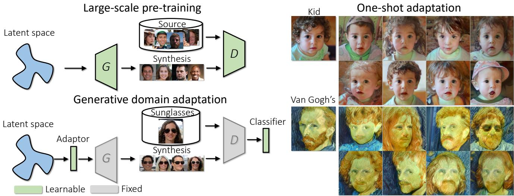
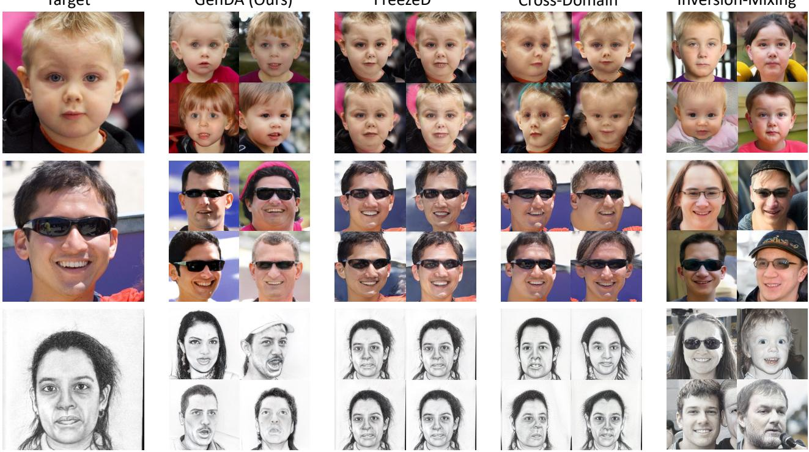
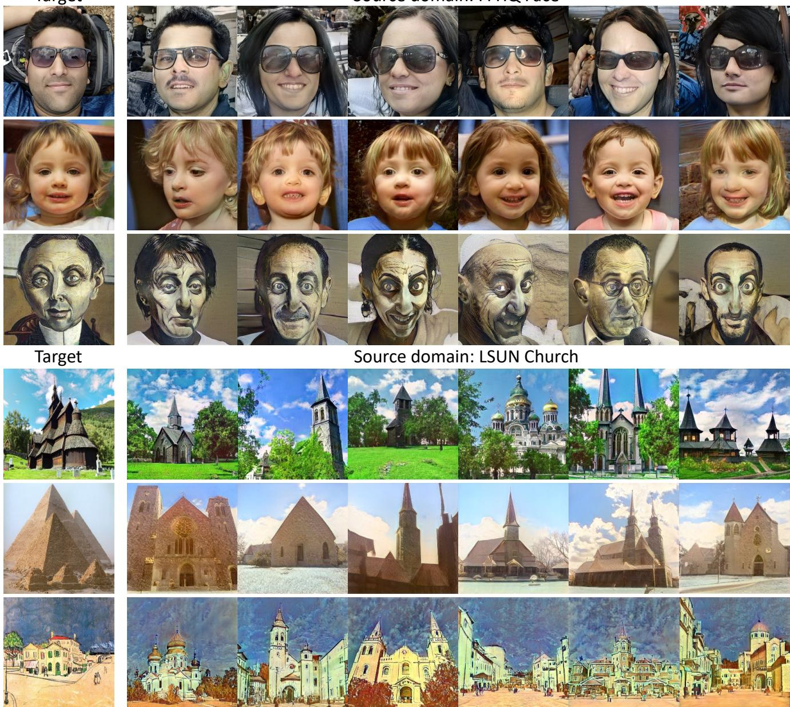
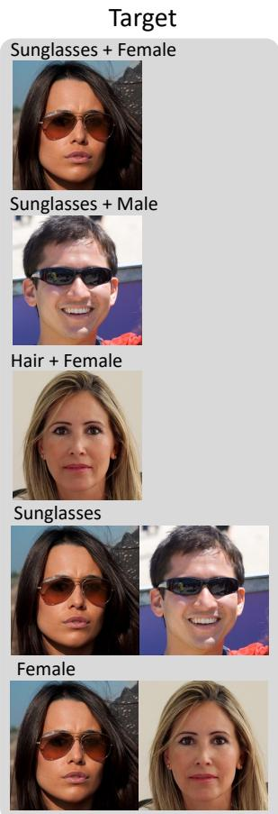
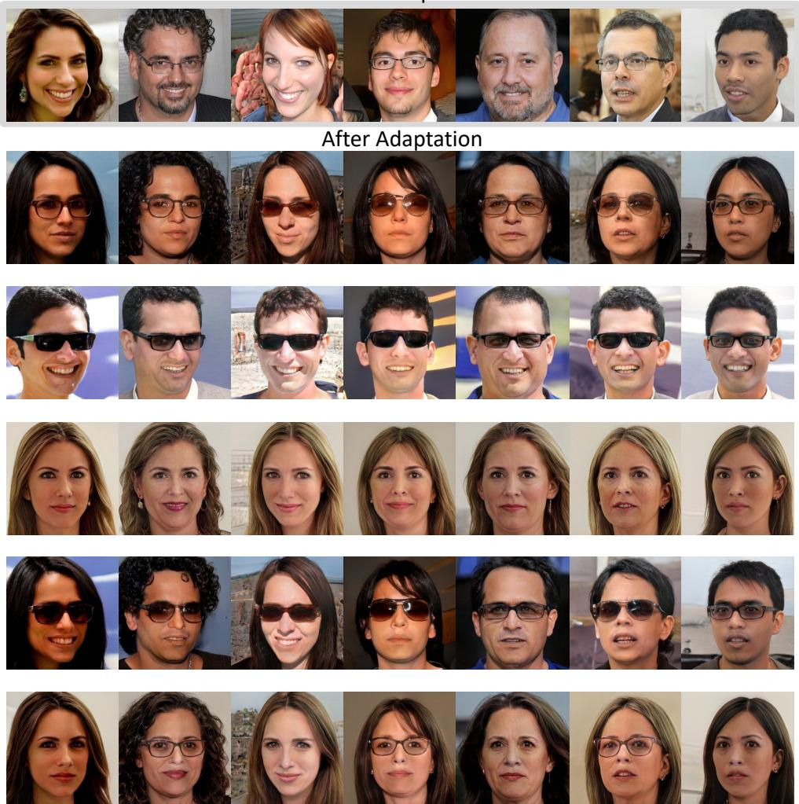
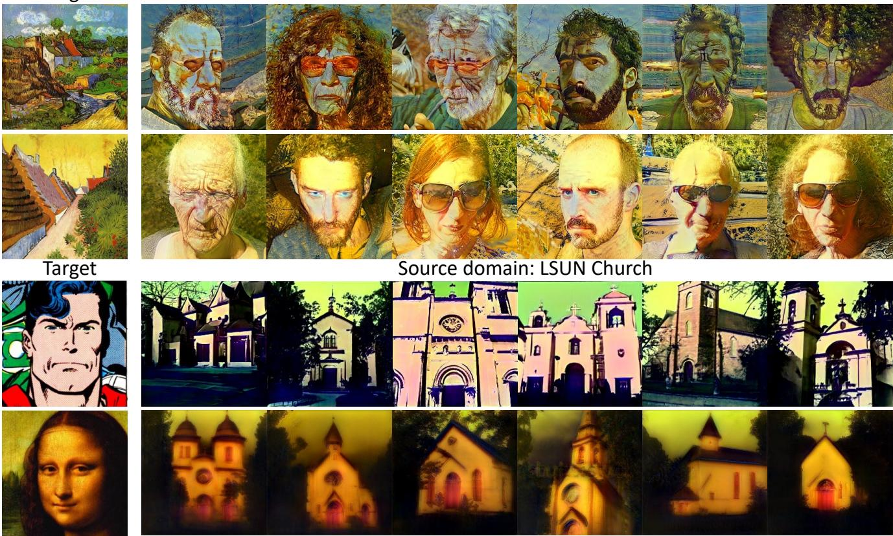

# One-Shot Generative Domain Adaptation

Ceyuan Yang1,2,† Yujun Shen3,4,† Zhiyi Zhang3 Yinghao Xu2 Jiapeng Zhu5 Zhirong Wu6 Bolei Zhou7

1Shanghai AI Laboratory 2CUHK 3ByteDance Inc. 4Ant Group 5HKUST 6MSRA 7UCLA

  
Figure 1. Diagram of one-shot generative domain adaptation. Left: The overall framework, where a GAN model pre-trained on the large-scale source data is transferred to the target domain with as few as only one training sample. A lightweight attribute adaptor and attribute classifier are introduced to the frozen generator and discriminator, respectively. Right: Realistic and highly diverse synthesis results after adapting the pre-trained model to two reference images of a kid and Van Gogh’s self portrait.

## Abstract

This work aims to transfer a Generative Adversarial Network (GAN) pre-trained on one image domain to another domain referred to as few as just one reference image. The challenge is that, under limited supervision, it is extremely difficult to synthesize photo-realistic and highly diverse images while retaining the representative characters of the target domain. Different from existing approaches that adopt the vanilla fine-tuning strategy, we design two lightweight modules in the generator and the discriminator respectively. We first introduce an attribute adaptor in the generator andfreeze the generator’s original parameters, which can reuse the prior knowledge to the most extent and maintain the synthesis quality and diversity. We then equip the well-learned discriminator with an attribute classifier to ensure that the generator with the attribute adaptor captures the appropriate characters of the reference image. Furthermore, considering the very

limited diversity of the training data (i.e., as few as only one image), we propose to constrain the diversity of the latent space through truncation in the training process, alleviating the optimization difficulty. Our approach brings appealing results under various settings, substantially surpassing state-of-the-art alternatives, especially in terms of synthesis diversity. Noticeably, our method works well even with large domain gaps and robustly converges within a few minutes for each experiment. Code and models are available at https://genforce.github.io/genda/.

## 1. Introduction

Generative Adversarial Network (GAN) [4], consisting of a generator and a discriminator, has significantly advanced image synthesis yet relies on training with a large number of images [5, 7, 8, 1]. Many attempts have been made to train GANs from scratch with limited data [27, 32, 30, 6, 25], but it still requires hundreds or thousands of images to get a satisfying synthesis result. Sometimes, however, we may have only a few images, or in extreme cases only one single image as the reference, like the masterpiece Mona Lisa by Leonardo da Vinci. Under such a case, learning a generative model with both good quality and high diversity seems impossible.

Domain adaptation is a commonly used technique that applies a model trained on one data domain to another [2]. Prior works [23, 13, 22, 12, 29, 10, 16] have introduced this technique to GAN training to alleviate the requirement on the data scale. Typically, they first train a large-scale model in the source domain with adequate data, and then transfer it to the target domain with only a few samples. A common practice is to fine-tune both the generator and the discriminator on the target dataset until the generator produces samples conforming to the target domain. To stabilize the fine-tuning process and improve the generation quality and diversity, existing approaches propose to tune partial parameters [13, 12, 16] and introduce some regularizers [10, 14], but the overall adaptation strategy stays the same. When there is only one image from the target domain, these methods would fall short of synthesis diversity, producing very similar images.

Remember that the pre-trained model can produce highly diverse images in the source domain. Then what does cause the diversity drop in the adaptation process? We find that directly tuning the model weights results in the loss of the prior knowledge gained from the large-scale data due to the model parameter’s collapse into one mode. However, when adapting the model to the target domain, most variation factors (e.g., gender, and pose of human faces) should be reused as much as possible. These observations lead to a question: is it possible to simply focus on the most representative characters of the reference image while inheriting all the other knowledge from the source domain?

To answer the question above, we develop a novel method, called GenDA, for one-shot Generative Domain Adaptation. In particular, we design a lightweight module connecting the latent space and the synthesis network. We call this module an attribute adaptor since it helps adapt the generator with the attributes of the target image. Unlike the conventional fine-tuning strategy, we freeze the parameters of the original generator and merely optimize the attribute adaptor during training. Thereby, we manage to reuse the prior knowledge learned by the source model and hence inherit the synthesis quality and, more importantly, the diversity. Meanwhile, we employ the discriminator to compete with the generator via a domain-specific attribute classification. In this way, the generator is forced to capture the most representative attributes from the reference; otherwise, the discriminator would spot the discrepancy. However, instead of directly tuning the original discriminator, we freeze its entire backbone’s parameter and introduce a lightweight attribute classifier on top of that. Similar to the generator, the discriminator has also learned rich knowledge in its pre-training. Since the synthesized images before and after adaptation share most visual concepts (e.g., a face model would still produce faces after domain transfer), the discriminator can be reused as a well-learned feature extractor. Therefore, we simply train the attribute classifier to help guide the generator. Furthermore, since there is only one training sample (which means no diversity in the target domain), we propose to also constrain the diversity of the generative domain by truncating the latent distribution during training. Intuitively, learning a one-to-one mapping would be easier than learning a many-to-one mapping. Such a design mitigates the optimization difficulty and further improves the synthesis quality.

We evaluate our approach through extensive experiments on synthesizing faces and outdoor scenes. Given only one training image, GenDA can adapt the source model to the target domain with sufficiently high quality and diversity. Such an adaptation is successful at both the attribute level and the style level, shown in Fig. 1. Our method outperforms the state-of-the-art competitors by a substantial margin both qualitatively and quantitatively. We also show that when the number of samples available in the target domain increases, GenDA can filter out the individual attributes and capture their common characters (see Fig. 4). Noticeably, GenDA can work on some extreme cases where there is a large domain gap, like transferring the characters of Mona Lisa to churches (see Fig. 5), creating interesting visual special effect.

## 2. Related Work

Training Generative Models with Limited Data. Many attempts have been taken to train a generative model on limited data. For one thing, some of the prior approaches proposed to leverage the data augmentation to prevent the discriminator from overfitting. Specifically, Zhang and Khoreva [27] introduced a type of progressive augmentations. Zhao et al. [32] investigated the effects of various augmentations during the training. Theoretical analysis was conducted by Tran et al. [21] for several data augmentations. Zhao et al. [30] proposed to apply the augmentations to both the real and synthesized images in a differentiable manner. Karras et al. [6] designed an adaptive discriminator augmentation that does not leak to stabilize the training process. For another, multiple regularizers were also introduced to provide extra supervision. For instance, Zhao et al. [31] involved the consistency regularization for GANs which shows competitive performances with limited data. Yang et al. [25] incorporated contrastive learning as an extra task to improve the data efficiency. Karras et al. [6] also pointed out that decreasing the number of parameters of generators and introducing the dropout [19] could alleviate the overfitting problems. Shaham et al. [17] and Sushko et al. [20] designed different frameworks which learn from a single natural image or video. However, when the number of available images is less than 10, they usually lead to unsatisfying diversity. Different from these works which learn from scratch, we focus on the generative domain adaptation, a practical alternative that first pre-trains a source model on the large-scale dataset and then transfers it on a target domain with the one-shot image.

Few-shot Generative Domain Adaptation. Generative domain adaptation has attracted a considerable number of interests due to its practical importance. Wang et al. [23] proposed to use the same objective for adaptation. Noguchi and Harada et al. [13] fine-tuned the batch statistics merely for the few-shot adaption. Wang et al. [22] transformed the original latent space and tuned the entire parameters for the target domain. Mo et al. [12] froze the lower-level representations of the discriminator to prevent overfitting. Zhang et al. [29] revealed that low-level filters of both the generator and discriminator can be transferred via a new adaptive filter modulation. Li et al. [10] penalized certain weights identified by Fisher information. Robb et al. [16] learned to adapt the singular values of the pre-trained weights while freezing the corresponding singular vectors. Ojha et al. [14] proposed the cross-domain consistency as a regularization to maintain the diversity. Recent work [33, 28, 9, 3] also leveraged the powerful CLIP [15] to help the one-shot and few-shot domain adaptation. Concurrent work [28] decoupled the domain adaptation into two parts: style and entity transfer. Different from prior work, we manage to reuse the prior knowledge to the most extent (i.e., only training one layer in the generator and the discriminator each), and empirically confirm that such an efficient scheme indeed facilitates generative domain adaptation and substantially outperforms existing alternatives. In this way, our study offers a simple yet strong baseline for the follow-up work regarding one-shot and few-shot domain adaptation. More analyses and discussions can be found in Supplementary Material.

## 3. Methodology

The primary goal of this work is to transfer a pre-trained GAN to synthesize images conforming to a new domain with as few as only one reference image. Due to the limited supervision, it is challenging to ensure both high quality and large diversity of the synthesis. Intuitively, according to the rationale of GANs (i.e., adversarial training between the generator and the discriminator), the discriminator can simply memorize the only the reference image as real and all the others as fake. In this case, to fool the discriminator, the generator may have to learn to produce images highly alike the reference, resulting in a poor synthesis diversity. To mitigate this problem, we propose a new adaptation algorithm, which is different from the previous fine-tuning scheme. Concretely, we first interpose an attribute adaptor between the latent space and the generator to search the most representative characters of target image in a new intermediate feature space; We then augment the discriminator backbone with an attribute classifier to guide the generator to make appropriate adjustments; and We finally propose a diversity-constraint training strategy. Before going into technical details, we first give some preliminaries of GANs.

## 3.1. Preliminaries

Generative Adversarial Network (GAN) [4] is formulated as a two-player game between a generator and a discriminator. Given a collection of observed data $\{ { \bf x } _ { i } \} _ { i = 1 } ^ { N }$ with N samples, the generator $G ( \cdot )$ aims at reproducing the real distribution X via randomly sampling latent codes z subject to a pre-defined latent distribution Z. As for the discriminator $D ( \cdot )$ , it targets at differentiating the real data x and the synthesized data $G ( \mathbf { z } )$ as a bi-classification task. These two models are jointly optimized by competing with each other, as

$$
\mathcal { L } _ { G } = - \mathbb { E } _ { { \mathbf { z } } \in \mathcal { Z } } [ \log ( D ( G ( { \mathbf { z } } ) ) ) ] ,
$$

$$
\mathcal { L } _ { D } = - \mathbb { E } _ { \mathbf { x } \in \mathcal { X } } [ \log ( D ( \mathbf { x } ) ) ]\tag{1}
$$

$$
- \mathbb { E } _ { \mathbf { z } \in \mathcal { Z } } [ \log ( 1 - D ( G ( \mathbf { z } ) ) ) ] .\tag{2}
$$

After the training converges, the generator is expected to produce images as realistic as the training set, so that the discriminator cannot distinguish them anymore.

In this work, we start with a GAN model that is well trained on a source domain $\mathcal { X } ^ { s r c }$ , and aim at adapting it to a target domain $\mathcal { X } ^ { d s t } = \{ \mathbf { x } ^ { d s t } \}$ that has only one image. In fact, it is ambiguous to define a “domain” using one image. We hence expect the model to acquire the most representative characters from the reference image. Taking face synthesis as an example, the characters may include facial attributes (e.g., age or wearing sunglasses) and artistic styles, as shown in Fig. 1.

## 3.2. One-Shot Generative Domain Adaptation

A common practice to transfer GANs is to simultaneously tune the generator and the discriminator on the target dataset [23]. However, as discussed above, the transferring difficulty increases drastically when given only one training sample. Existing methods attempt to address this issue by reducing the number of learnable parameters [12, 16] and introducing training regularizers [14]. Even so, the overall fine-tuning scheme (i.e., directly tuning G(·) and $D ( \cdot ) )$ remains and the diversity is low. Differently, we propose a new adaptation strategy to preserve the synthesis diversity, which includes an attribute adaptor, an attribute classifier, and a diversity-constraint training strategy. Technical details are introduced as follows.

Attribute Adaptor. Prior works have found that a welllearned generator is able to encode rich semantics to produce diverse images [18, 26]. For instance, a face synthesis model could capture the variation factors like gender, age, wearing glasses, lighting, etc. Ideally, this knowledge should be sufficiently reused as much as possible in the target domain, and then the synthesis diversity can be preserved accordingly. In this approach, even given few samples, the generator can focus on transferring the most distinguishable characters of the reference, instead of learning the common variation factors repeatedly and result in overfitting. Such an approach helps improve the data efficiency significantly, which is vital to the one-shot setting.

According to [24], the latent code z can be viewed as the generative feature of $G ( \mathbf { z } )$ that determines the multi-level attributes of the output image. Motivated by this, we propose to adapt such features regarding the reference image, yet keep the convolutional kernels untouched. Concretely, before feeding the latent code z to the generator $G ( \cdot )$ , we propose to first transform it through a lightweight attribute adaptor $A ( \cdot )$ , as

$$
\mathbf { z } ^ { \prime } = A ( \mathbf { z } ) = \mathbf { a } \odot \mathbf { z } + \mathbf { b } ,\tag{3}
$$

where ⊙ stands for the element-wise multiplication, while a and b are the learnable weight and bias, respectively. With such a design, the transformed latent code $\mathbf { z } ^ { \prime }$ is assumed to carry the sufficient information of the reference, and therefore $G ( { \bf z } ^ { \prime } )$ would conform to the target domain $\chi ^ { d s t }$

Attribute Classifier. Only having the attribute adaptor cannot guarantee the generator to acquire the representative characters from the training sample. Following the formulation of GANs, we incorporate the discriminator $D ( \cdot )$ , which is also pre-trained on the source domain, to compete with the generator. In particular, we reuse the backbone $d ( \cdot )$ but remove the last real/fake classification head, and then equip it with a lightweight attribute classifier $\phi ( \cdot )$ . Given an image x, either the reference image $\mathbf { x } ^ { d s t }$ or a transferred synthesis $G ( A ( \mathbf { z } ) )$ , the classifier outputs a probability of how likely it possesses the target attribute, as

$$
p = \phi ( d ( \mathbf { x } ) ) .\tag{4}
$$

However, due to the limited supervision provided by one image, the discriminator can easily memorize the real data, which leads to the overfitting of discriminator as well as the collapse of the generator [6]. As discussed above, the generated images before and after domain adaptation are expected to share most variation factors (i.e., a face model remains to produce faces after adaptation). From this viewpoint, the knowledge learned by the discriminator in its pre-training could be also reused. Therefore, unlike existing approaches that fine-tune all or partial parameters of $D ( \cdot )$ [12, 22, 10, 14], we freeze all parameters of $d ( \cdot )$ in the entire training process and merely optimizes $\phi ( \cdot )$ to guide $A ( \cdot )$ with adequate adjustments. Regarding the oneshot target domain, the mechanism behind the classifier is very similar to Exemplar SVM [11], which also suggests that it is sufficient to obtain a good decision boundary with one positive and many negative samples. Differently, our attribute classifier is learned in an adversarial manner through competing with the attribute adaptor.

Diversity-constraint Strategy. Recall that this work targets at generative domain adaptation with only one reference image, which means no diversity of real data. On the contrary, however, the latent code can be sampled randomly and the pre-trained generator can produce highly diverse images from the source domain. From this perspective, it might be challenging to match these two distributions with such a huge diversity gap. To alleviate the optimization difficulty, we propose a diversity-constraint strategy, which retains the diversity of the generator during training. Specifically, we truncate the latent distribution with a strength factor $\beta ,$ as

$$
\mathbf { z } ^ { \prime } = A ( \beta \mathbf { z } + ( 1 - \beta ) \bar { \mathbf { z } } ) ,\tag{5}
$$

where z¯ indicates the mean code. Note that, truncation is a common trick used in the inference of state-of-the-art GANs, like StyleGAN [7] and BigGAN [1], to improve synthesis quality. Nevertheless, to our best knowledge, this is the first time that truncation is introduced in the training process to preserve the synthesis diversity.

Full Objective Function. In summary, the adaptor $A ( \cdot )$ and the classifier $\phi ( \cdot )$ are trained with

$$
\begin{array} { r } { \mathcal { L } _ { A } = - \mathbb { E } _ { { \mathbf z } \in \mathcal { Z } } [ \log \left( \phi ( d ( G ( { \mathbf z ^ { \prime } } ) ) ) \right) ] , } \end{array}\tag{6}
$$

$$
\begin{array} { r l } & { \mathcal { L } _ { \phi } = - \mathbb { E } _ { \mathbf { x } \in \mathcal { X } ^ { s r c } } [ \log \left( \phi ( d ( \mathbf { x } ) ) \right) ] } \\ & { \qquad - \mathbb { E } _ { \mathbf { z } \in \mathcal { Z } } [ \log \left( 1 - \phi ( d ( G ( \mathbf { z } ^ { \prime } ) ) ) \right) ] . } \end{array}\tag{7}
$$

## 4. Experiments

We evaluate the proposed method on multiple datasets and settings. In Sec. 4.1, we focus on one-shot generative domain adaptation. Quantitative and qualitative results indicate that the proposed GenDA can produce much more diverse and photo-realistic images than previous alternatives. Interestingly, the shared representative attributes of multiple shots could be also captured and transferred from the source to the target domain. Additionally, when there exists a large domain gap, GenDA can still synthesize reasonable outputs in Sec. 4.2. Noticeably, the comprehensive ablation studies of each component, comparison of few-shot adaptation, and the properties of the latent space after adaptation can be found in Supplementary Material.

Cross-Domain  
GenDA (Ours)  
Target  
FreezeD  
Inversion-Mixing  
  
Figure 2. Qualitative comparison on one-shot adaptation between FreezeD [12], Cross-Domain [14], inversion-mixing baseline and our GenDA. The first column shows the reference images. GenDA outperforms the other competitors from the diversity perspective.

Table 1. Quantitative comparison on one-shot adaptation between FreezeD, Cross-Domain, inversion-mixing baseline, and our GenDA. Evaluation metrics include FID (lower is better), precision (higher means better quality), and recall (higher means higher diversity).
<table><tr><td>Method</td><td>FID↓</td><td>Prec.↑</td><td>Recall↑</td></tr><tr><td>FreezeD [12]</td><td>147.91</td><td>0.61</td><td>0.012</td></tr><tr><td>MineGAN [14]</td><td>168.20</td><td></td><td></td></tr><tr><td>Cross-Domain</td><td>146.74</td><td>0.53</td><td>0.000</td></tr><tr><td>Inversion-Mixing</td><td>87.74</td><td>0.59</td><td>0.298</td></tr><tr><td>GenDA (ours)</td><td>80.16</td><td>0.74</td><td>0.033</td></tr></table>

(a) Babies

<table><tr><td>FID↓</td><td>Prec.↑</td><td>Recall↑</td></tr><tr><td>87.32</td><td>0.93</td><td>0.000</td></tr><tr><td>85.26</td><td></td><td></td></tr><tr><td>91.92</td><td>0.80</td><td>0.000</td></tr><tr><td>77.92</td><td>0.48</td><td>0.226</td></tr><tr><td>44.96</td><td>0.76</td><td>0.067</td></tr></table>

(b) Sunglasses

<table><tr><td>FID↓</td><td>Prec.↑</td><td>Recall↑</td></tr><tr><td>102.11</td><td>0.52</td><td>0.009</td></tr><tr><td>117.90</td><td></td><td></td></tr><tr><td>90.42</td><td>0.19</td><td>0.000</td></tr><tr><td>182.51</td><td>0.00</td><td>0.019</td></tr><tr><td>87.55</td><td>0.16</td><td>0.053</td></tr></table>

(c) Sketches

Table 2. Quantitative comparison on one-shot adaptation between CLIP-based methods and GenDA. FID (lower is better) is reported, where all results are averaged over 5 training shots.
<table><tr><td>Method</td><td>Sunglasses</td><td>Babies</td><td>Sketches</td></tr><tr><td>Mind the gap [33]</td><td>77.34</td><td>123.62</td><td>107.22</td></tr><tr><td>Just One CLIP [9]</td><td>69.13</td><td>108.23</td><td>83.87</td></tr><tr><td>StyleGAN-NADA [3]</td><td>137.82</td><td>102.71</td><td>154.83</td></tr><tr><td>GenDA (ours)</td><td>44.96</td><td>80.16</td><td>87.55</td></tr></table>

we calculate all metrics over 5 training shots.

## 4.1. One-shot Domain Adaptation

Comparison with Existing Alternatives. For oneshot generative domain adaptation, we compare against FreezeD [12], MineGAN [22] and Cross-Domain [14] in Tab. 1. Moreover, Tab. 2 presents the comparison with CLIP-based methods. More implementation details regarding competitors are available in Supplementary Material. Considering the variance brought by different single shots,

As shown in Tab. 1, our GenDA remains to surpass multiple approaches by a clear gap from the perspective of FID. Besides, to further compare different methods from the views of image quality and diversity, we also report the precision and recall. Intuitively, a higher precision means higher image quality (closer to the real sample), while a higher recall indicates higher diversity. Although FreezeD [12] and Cross-Domain [14] plausibly achieve better synthesis quality on sunglasses and sketches, their low recalls strongly imply overfitting. Additionally, Tab. 2 suggests that we achieve on-par or better performance on three different domains, compared to CLIP-based appraoches.

Fig. 2 confirms that there is insufficient diversity for such two methods. In contrast, our GenDA leads competitive quality and standing-out diversity from both quantitative and qualitative perspectives. In terms of the synthesis diversity, inversion-mixing pipeline achieves the highest recall since the diversity is determined by the source model. Nevertheless, the synthesis quality of this is quite unsatisfying, especially for the sketches since the source models have no knowledge of how to synthesize sketches. It implies that reusing all prior knowledge of source models tends to limit the adaptation. Besides, Fig. 3 suggests that our GenDA works on transferring both attributes (sunglasses, gender, vegetation and material) and artistic styles for face and church model, respectively.

Target  
  
Figure 3. One-shot adaptation with different target samples. GenDA manages to capture the representative characters from the given reference, such as sunglasses, artistic style for faces, and vegetation, pyramid material for churches.

Common Attributes from Multiple References. There might be a number of representative variation factors in a given face image (e.g., age, gender, smile and sunglasses). Therefore, when transferring a pre-trained generative model on one image, multiple factors could be adapted together. Fig. 4 provides an example of our GenDA on sunglasses. Specifically, we train GenDA on multiple target domains which might contain a single individual with different identities or a pair of images. Compared with the source output (the first row), representative attributes besides sunglasses are also transferred. For instance, the second and third rows suggest that although all individuals wear sunglasses, the target’s gender is also adapted to the new synthesis. The third shot could even affect the gender and hairstyles. This reveals that our GenDA could capture multiple representative attributes of the target domain. When the target domain contains more than one shot like the last two rows of Fig. 4, the representative attributes become the common attributes of all individuals, leading to the corresponding results (i.e., sunglasses and gender). Namely, our GenDA is able to capture and adapt the representative attributes no matter how many images the target domain has.

Before Adaptation  
  
Figure 4. Learning the shared semantic of more than one reference image. On the left are the training samples, while on the top are the samples synthesized before adaptation. In the remaining rows, images from the same column are produced with the same latent code. Under the settings of two-shot adaptation (i.e., the last two rows), we can tell that (1) in the second last row, all people are wearing eyeglasses (common attribute of the two references) but they have the same gender (divergent attribute) as the original synthesis in the top row. (2) similarly, in the bottom row, all people are female yet the “eyeglasses” attribute is preserved from the original synthesis.

## 4.2. Cross-Domain Adaptation

In this part, we study the adaptation on unrelated source and target domains. Van Gogh’s houses, Superman and

Mona Lisa serve as the target for a face and church source model respectively. Considering the motivation that we aim at reusing the prior knowledge (i.e., variation factors) by freezing the parameters, the synthesis after adaptation is supposed to share similar visual concepts. That is, a face model would still produce faces no matter what the target image is. Fig. 5 suggests that the source models remain to produce the corresponding content. More importantly, the color scheme and painting styles are also transferred. For example, the red roof at the first row renders the red glasses, the yellow sky at the second row draws the front head in yellow. The blue hair, green background, and the shadows of Superman are well adapted to church. The painting style of Mona Lisa is also transferred.

Obviously, the shared attributes between face and church are quite rare. Therefore, GenDA pours more attention to the variation factors like color scheme, texture, and painting styles which could be directly transferred across unrelated domains. From this perspective, our GenDA might enable a new alternative for neural style transfer task that aims at transferring the styles of a given image. But more generally, our GenDA is able to transfer more high-level attributes like gender, age, and sunglasses while the technique of style transfer might fail, which might be of benefit to art creation.

Target  
Source domain: FFHQ Face  
  
Figure 5. Cross-domain adaptation. GenDA manages to transfer key characters of an out-of-domain target to the source domain.

## 5. Limitations

Despite the state-of-the-art performances on both oneshot and few-shot generative domain adaptation, our proposed GenDA still has some limitations. For example, the rationale behind GenDA is to reuse the prior knowledge learned by the source GAN model, which hinders it from transferring a model to a completely different domain. As suggested in Fig. 5, when we adapt a church model regarding a face image, the outputs are still churches but not faces. This implies that our method would fail when the inter-subclass variations are huge. Such a property is a silver lining, depending on the practical application. A second limitation is that our current design treats all characters of the reference image as a whole. Taking the first row of Fig. 3 as an example, the sunglasses, skin color, and background are transferred simultaneously. It is hard to accurately transfer some particular attributes. However, it is indeed possible to use some auxiliary samples to help define a common attribute, as shown in Fig. 4. Besides, our GenDA also relies on the layer-wise stochasticity involved in the generator structure. Concretely, in our base model, StyleGAN2 [8], the latent code is fed into all convolutional layers instead of the first layer only. Without the layerwise design, the supervision will be hard to back-propagate to the attribute adaptor given a deep synthesis network. Fortunately, however, such a design is commonly adopted by the state-of-the-art GANs [7, 8, 1].

## 6. Conclusion

In this work, we propose GenDA for one-shot generative domain adaptation. We introduce two lightweight modules, i.e., an attribute adaptor and an attribute classifier, to the fixed generator and discriminator respectively. By efficiently learning two modules, we manage to reuse the prior knowledge and hence enable one-shot transfer with high diversity. Our method demonstrates substantial improvements over existing baselines under multiple settings. Acknowledgement: The project is partially supported by Amazon Research Awards and Shanghai AI Laboratory (P23KS00020, 2022ZD0160201).

## References

[1] Andrew Brock, Jeff Donahue, and Karen Simonyan. Large scale gan training for high fidelity natural image synthesis. In Int. Conf. Learn. Represent., 2018. 1, 4, 8

[2] Gabriela Csurka. Domain adaptation for visual applications: A comprehensive survey. arXiv preprint arXiv:1702.05374, 2017. 2

[3] Rinon Gal, Or Patashnik, Haggai Maron, Amit H Bermano, Gal Chechik, and Daniel Cohen-Or. Stylegan-nada: Clipguided domain adaptation of image generators. ACM Transactions on Graphics (TOG), 41(4):1–13, 2022. 3, 5

[4] Ian Goodfellow, Jean Pouget-Abadie, Mehdi Mirza, Bing Xu, David Warde-Farley, Sherjil Ozair, Aaron Courville, and Yoshua Bengio. Generative adversarial nets. In Adv. Neural Inform. Process. Syst., 2014. 1, 3

[5] Tero Karras, Timo Aila, Samuli Laine, and Jaakko Lehtinen. Progressive growing of gans for improved quality, stability, and variation. In Int. Conf. Learn. Represent., 2018. 1

[6] Tero Karras, Miika Aittala, Janne Hellsten, Samuli Laine, Jaakko Lehtinen, and Timo Aila. Training generative adversarial networks with limited data. In Adv. Neural Inform. Process. Syst., 2020. 2, 4

[7] Tero Karras, Samuli Laine, and Timo Aila. A style-based generator architecture for generative adversarial networks. In IEEE Conf. Comput. Vis. Pattern Recog., 2019. 1, 4, 8

[8] Tero Karras, Samuli Laine, Miika Aittala, Janne Hellsten, Jaakko Lehtinen, and Timo Aila. Analyzing and improving the image quality of StyleGAN. In IEEE Conf. Comput. Vis. Pattern Recog., 2020. 1, 8

[9] Gihyun Kwon and Jong Chul Ye. One-shot adaptation of gan in just one clip. arXiv preprint arXiv:2203.09301, 2022. 3, 5

[10] Yijun Li, Richard Zhang, Jingwan Lu, and Eli Shechtman. Few-shot image generation with elastic weight consolidation. In Adv. Neural Inform. Process. Syst., 2020. 2, 3, 4

[11] Tomasz Malisiewicz, Abhinav Gupta, and Alexei A Efros. Ensemble of exemplar-svms for object detection and beyond. In 2011 International conference on computer vision, pages 89–96. IEEE, 2011. 4

[12] Sangwoo Mo, Minsu Cho, and Jinwoo Shin. Freeze the discriminator: a simple baseline for fine-tuning gans. arXiv preprint arXiv:2002.10964, 2020. 2, 3, 4, 5

[13] Atsuhiro Noguchi and Tatsuya Harada. Image generation from small datasets via batch statistics adaptation. In Int. Conf. Comput. Vis., 2019. 2, 3

[14] Utkarsh Ojha, Yijun Li, Jingwan Lu, Alexei A Efros, Yong Jae Lee, Eli Shechtman, and Richard Zhang. Few-shot image generation via cross-domain correspondence. In IEEE Conf. Comput. Vis. Pattern Recog., 2021. 2, 3, 4, 5

[15] Alec Radford, Jong Wook Kim, Chris Hallacy, Aditya Ramesh, Gabriel Goh, Sandhini Agarwal, Girish Sastry, Amanda Askell, Pamela Mishkin, Jack Clark, et al. Learning transferable visual models from natural language supervision. In International Conference on Machine Learning, pages 8748–8763. PMLR, 2021. 3

[16] Esther Robb, Wen-Sheng Chu, Abhishek Kumar, and Jia-Bin Huang. Few-shot adaptation of generative adversarial networks. arXiv preprint arXiv:2010.11943, 2020. 2, 3

[17] Tamar Rott Shaham, Tali Dekel, and Tomer Michaeli. Singan: Learning a generative model from a single natural image. In Int. Conf. Comput. Vis., 2019. 3

[18] Yujun Shen, Ceyuan Yang, Xiaoou Tang, and Bolei Zhou. Interfacegan: Interpreting the disentangled face representation learned by gans. IEEE Trans. Pattern Anal. Mach. Intell., 2020. 4

[19] Nitish Srivastava, Geoffrey Hinton, Alex Krizhevsky, Ilya Sutskever, and Ruslan Salakhutdinov. Dropout: a simple way to prevent neural networks from overfitting. The journal of machine learning research, 2014. 3

[20] Vadim Sushko, Jurgen Gall, and Anna Khoreva. One-shot gan: Learning to generate samples from single images and videos. In IEEE Conf. Comput. Vis. Pattern Recog., 2021. 3

[21] Ngoc-Trung Tran, Viet-Hung Tran, Ngoc-Bao Nguyen, Trung-Kien Nguyen, and Ngai-Man Cheung. On data augmentation for gan training. IEEE Trans. Image Process., 2021. 2

[22] Yaxing Wang, Abel Gonzalez-Garcia, David Berga, Luis Herranz, Fahad Shahbaz Khan, and Joost van de Weijer. Minegan: effective knowledge transfer from gans to target domains with few images. In IEEE Conf. Comput. Vis. Pattern Recog., 2020. 2, 3, 4, 5

[23] Yaxing Wang, Chenshen Wu, Luis Herranz, Joost van de Weijer, Abel Gonzalez-Garcia, and Bogdan Raducanu. Transferring gans: generating images from limited data. In Eur. Conf. Comput. Vis., 2018. 2, 3

[24] Yinghao Xu, Yujun Shen, Jiapeng Zhu, Ceyuan Yang, and Bolei Zhou. Generative hierarchical features from synthesizing images. In IEEE Conf. Comput. Vis. Pattern Recog., 2021. 4

[25] Ceyuan Yang, Yujun Shen, Yinghao Xu, and Bolei Zhou. Data-efficient instance generation from instance discrimination. In Adv. Neural Inform. Process. Syst., 2021. 2

[26] Ceyuan Yang, Yujun Shen, and Bolei Zhou. Semantic hierarchy emerges in deep generative representations for scene synthesis. Int. J. Comput. Vis., 2021. 4

[27] Dan Zhang and Anna Khoreva. Pa-gan: Improving gan training by progressive augmentation. In Adv. Neural Inform. Process. Syst., 2019. 2

[28] Zicheng Zhang, Yinglu Liu, Congying Han, Tiande Guo, Ting Yao, and Tao Mei. Generalized one-shot domain adaption of generative adversarial networks. arXiv preprint arXiv:2209.03665, 2022. 3

[29] Miaoyun Zhao, Yulai Cong, and Lawrence Carin. On leveraging pretrained gans for generation with limited data. In Int. Conf. Mach. Learn., 2020. 2, 3

[30] Shengyu Zhao, Zhijian Liu, Ji Lin, Jun-Yan Zhu, and Song Han. Differentiable augmentation for data-efficient gan training. In Adv. Neural Inform. Process. Syst., 2020. 2

[31] Zhengli Zhao, Sameer Singh, Honglak Lee, Zizhao Zhang, Augustus Odena, and Han Zhang. Improved consistency regularization for gans. In Assoc. Adv. Artif. Intell., 2020. 2

[32] Zhengli Zhao, Zizhao Zhang, Ting Chen, Sameer Singh, and Han Zhang. Image augmentations for gan training. arXiv preprint arXiv:2006.02595, 2020. 2

[33] Peihao Zhu, Rameen Abdal, John Femiani, and Peter Wonka. Mind the gap: Domain gap control for single shot domain adaptation for generative adversarial networks. arXiv preprint arXiv:2110.08398, 2021. 3, 5