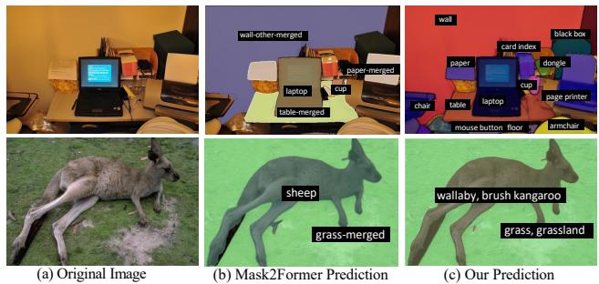
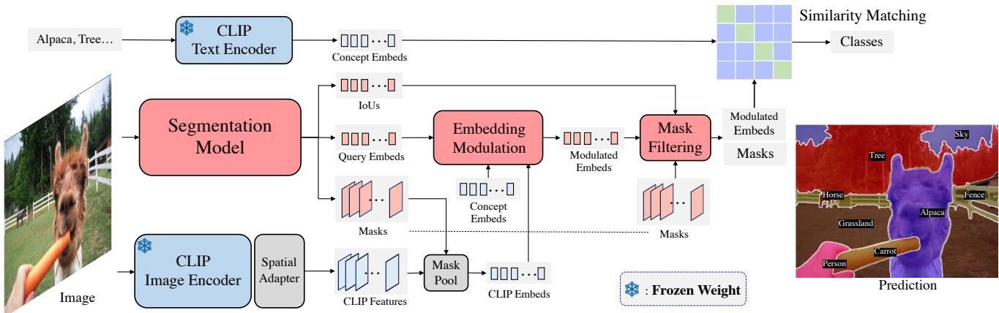
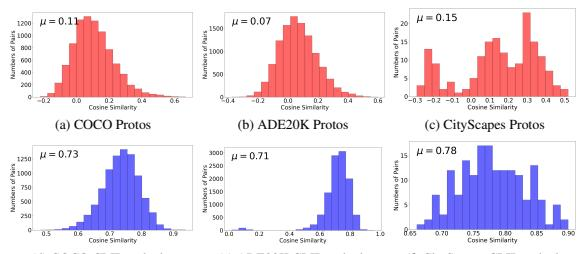
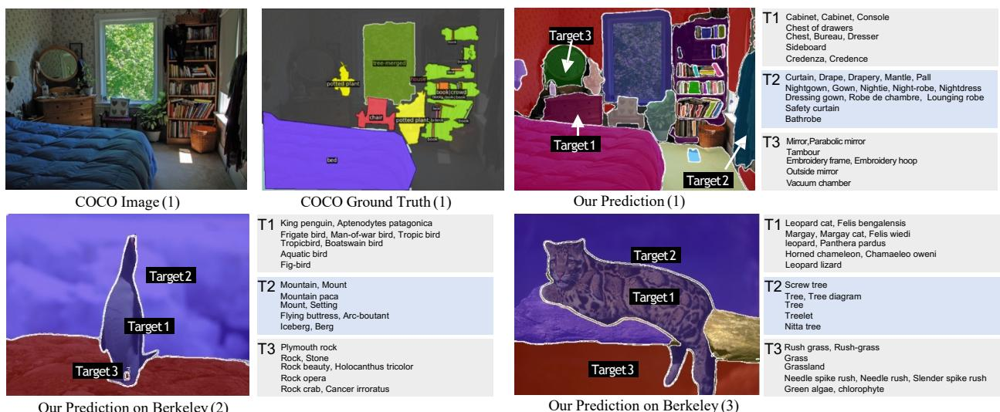
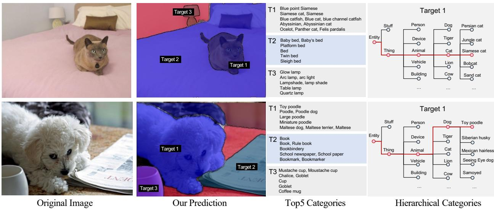

# Open-vocabulary Panoptic Segmentation with Embedding Modulation

Xi Chen1 Shuang Li2 Ser-Nam Lim3 Antonio Torralba2 Hengshuang Zhao1,2\* 1The University of Hong Kong 2Massachusetts Institute of Technology 3Meta AI

## Abstract

Open-vocabulary image segmentation is attracting increasing attention due to its critical applications in the real world. Traditional closed-vocabulary segmentation methods are not able to characterize novel objects, whereas several recent open-vocabulary attempts obtain unsatisfactory results, i.e., notable performance reduction on the closedvocabulary and massive demand for extra data. To this end, we propose OPSNet, an omnipotent and data-efficient framework for Open-vocabulary Panoptic Segmentation. Specifically, the exquisitely designed Embedding Modulation module, together with several meticulous components, enables adequate embedding enhancement and information exchange between the segmentation model and the visual-linguistic well-aligned CLIP encoder, resulting in superior segmentation performance under both open- and closed-vocabulary settings with much fewer need of additional data. Extensive experimental evaluations are conducted across multiple datasets (e.g., COCO, ADE20K, Cityscapes, and PascalContext) under various circumstances, where the proposed OPSNet achieves state-of-theart results, which demonstrates the effectiveness and generality of the proposed approach. The project page is https://opsnet-page.github.io.

## 1. Introduction

The real world is diverse and contains numerous distinct objects. In practical scenarios, we inevitably encounter various objects with different shapes, colors, and categories. Although some of them are unfamiliar or rarely seen, to better understand the world, we still need to figure out the region and shape of each object and what it is. The ability to perceive and segment both known and unknown objects is natural and essential for many real-world applications like autonomous driving, robot sensing, and navigation, humanobject interaction, augmented reality, healthcare, etc.

Lots of works have explored image segmentation and achieved great success [51, 17, 50, 8]. However, they are typically designed and developed on specific datasets (e.g.,

  
Figure 1. Visual comparisons of classical closed-vocabulary segmentation and our open-vocabulary segmentation. Models are trained on the COCO panoptic dataset. Categories like ‘printer’, ‘card index’, ‘dongle’, and ‘kangaroo’ are not presented in the COCO concept set. Closed-vocabulary segmentation algorithms like Mask2Former [8] are not able to detect and segment new objects (top middle) or fail to recognize object categories (bottom middle). In contrast, our approach is able to segment and recognize novel objects (top right, bottom right) for the open vocabulary.

COCO [28], ADE20K [53]) with predefined categories in a closed vocabulary, which assume the data distribution and category space remain unchanged during algorithm development and deployment procedures, resulting in noticeable and unsatisfactory failures when handling new environments in the complex real world, as shown in Fig. 1 (b).

To address this problem, open-vocabulary perception is densely explored for semantic segmentation and object detection. Some methods [15, 55, 16, 25, 49] use the visuallinguistic well-aligned CLIP [41] text encoder to extract the language embeddings of category names to represent each category, and train the classification head to match these language embeddings. However, training the text-image alignment from scratch often requires a large amount of data and a heavy training burden. Other works [13, 47] use both of the pre-trained CLIP image/text encoders to transfer the open-vocabulary ability from CLIP. However, as CLIP is not a cure-all for all domains and categories, although they are data-efficient, they struggle to balance the generalization ability and the performance in the training domain. [47, 12] demonstrate suboptimal cross-dataset results, [13] shows unsatifactory performance on the training domain. Besides, their methods for leveraging CLIP visual features are inefficient. Specifically, they need to pass each proposal into the CLIP image encoder to extract the visual features.

Considering the characteristics and challenges of the previous methods, we propose OPSNet for Open-vocabulary Panoptic Segmentation, which is omnipotent and dataefficient for both open- and closed-vocabulary settings. Given an image, OPSNet first predicts class-agnostic masks for all objects and learns a series of in-domain query embeddings. For classification, a Spatial Adapter is added after the CLIP image encoder to maintain the spatial resolution. Then Mask Pooling uses the class-agnostic masks to pool the visual feature into CLIP embeddings, thus the visual embedding for each object can be extracted in one pass.

Afterward, we propose the key module named Embedding Modulation to produce the modulated embeddings for classification according to the query embeddings, CLIP embeddings, and the concept semantics. This modulated final embedding could be used to match the text embeddings of category names extracted by the CLIP text encoder. Embedding Modulation combines the advantages of query and CLIP embeddings, and enables adequate embedding enhancement and information exchange for them, thus making OPSNet omnipotent for generalized domains and dataefficient for training. To further push the boundary of our framework, we propose Mask Filtering to improve the quality of mask proposals, and Decoupled Supervision to scale up the training concepts using image-level labels to train classification and the self-constraints to supervise masks.

With these designs, OPSNet achieves superior performance on COCO [28], shows exceptional cross-dataset performance on ADE20K [53], Cityscapes [10], PascalContext [37], and generalizes well to novel objects in the open vocabulary, as shown in Fig. 1 (c).

In general, our contributions could be summarized as:

• We address the challenging open-vocabulary panoptic segmentation task and propose a novel framework named OPSNet, which is omnipotent and dataefficient, with the assistance of the carefully designed Embedding Modulation module.

• We propose several meticulous components like Spatial Adapter, Mask Pooling, Mask Filtering, and Decoupled Supervision, which are proven to be of great benefit for open-vocabulary segmentation.

• We conduct extensive experimental evaluations across multiple datasets under various circumstances, and the harvested state-of-the-art results demonstrate the effectiveness and generality of the proposed approach.

## 2. Related Work

Unified image segmentation. Image segmentation targets grouping coherent pixels. Classical model architectures for semantic [31, 6, 51, 52, 48], instance [17, 29, 4, 2, 43], and panoptic [22, 46, 7, 21, 26] segmentation differ greatly. Recently, some works [44, 50, 9, 8] propose unified frameworks for image segmentation. With the help of vision transformers [14, 30, 3], they retain a set of learnable queries, use these queries as convolutional kernels to produce multiple binary masks, and add a multilayer perceptron head on the updated queries to predict the categories of the binary masks. This kind of simple pipeline is suitable for different segmentation tasks, and is called unified image segmentation. Nevertheless, although they design a universal structure, they are developed on specific datasets with predefined categories. Once trained on a dataset, these models could only conduct segmentation within the predefined categories in a closed vocabulary, resulting in inevitable failures in the real open vocabulary. We extend their scope to open vocabulary. Our model provides not only an omnipotent structure for different segmentation tasks, but also an omnipotent recognition ability for diverse scenarios in open vocabulary.

Class-agnostic detection and segmentation. To generalize the localization ability of the existing detection and segmentation models, some works [40, 42, 20, 45, 23] remove the classification head of a detection or segmentation model and treat all categories as entities. It is proven that the classagnostic models can detect more objects since they focus on learning the generalizable knowledge of ‘what makes an object’ rather than distinguishing visually similar classes like ‘house’ or ‘building’, and ‘cow’ or ‘sheep’, etc. Although they give better mask predictions for general categories, recognizing the detected objects is not touched.

Open-vocabulary detection and segmentation. Some recent works try to tackle open-vocabulary detection and segmentation using language embeddings. [25, 49] leverage the large-scale image-text pairs to pre-train the detection network. ViLD [16] distills the knowledge of ALIGN [19] to improve the detector’s generalization ability. Detic [55] utilizes the ImageNet-21K[11] data to expand the detection categories. For segmentation, [47] proposes a two-stage pipeline, where generalizable mask proposals are extracted and then fed into CLIP [41] for classification. Dense-CLIP [54] adopts text embedding as a classifier to conduct convolution on feature maps produced by CLIP image encoder, and extends the architecture of the image encoder to semantic segmentation models [51, 5]. OpenSeg [15] predicts general mask proposals and aligns the mask pooled features to the language space of ALIGN [19] with large scale caption data [39] for training. They reach great zeroshot performance for a large range of categories. However, all these works [54, 15, 47] only deal with semantic segmentation. OpenSeg [15] and [47] predict general masks that are noisy and overlapped, which could not accomplish instance-level distinction. MaskCLIP [13] is the only existing work for panoptic segmentation, which trains to gather the feature from a pre-trained CLIP image encoder. However, although it reaches great cross-dataset ability, its performance on COCO is far from satisfactory.

  
Figure 2. The overall pipeline of OPSNet. For an input image, the segmentation model predicts updated query embeddings, binary masks, and IoU scores. Meanwhile, we leverage a Spatial Adapter to extract CLIP visual features. We use these CLIP features to enhance the query embeddings and use binary masks to pool them into CLIP embeddings. Afterward, the CLIP Embeds, Query Embeds, and Concept Embeds are fed into the Embedding Modulation module to produce the modulated embeddings. Next, we use Mask Filtering to remove low-quality proposals thus getting masks and embeddings for each object. Finally, we use the modulated embeddings to match the text embeddings extracted by the CLIP text encoder and assign a category label for each mask.

## 3. Method

We introduce our OPSNet, an omnipotent and dataefficient framework for open-vocabulary panoptic segmentation. The overall pipeline is demonstrated in Fig. 2. We introduce our roadmap towards open vocabulary from the vanilla version to our exquisite designs.

## 3.1. Vanilla Open-vocabulary Segmentation

Inspired by DETR [3], recently, unified image segmentation models [40, 50, 9, 8] reformulate image segmentation as binary mask extraction and mask classification problems. They typically update a series of learnable queries to represent all things and stuff in the input image. Then, the updated queries are utilized to conduct convolution on a feature map produced by the backbone and pixel-decoder to get binary masks for each object. At the same time, a classification head with fixed fully-connected layers is added after each updated query to predict a class label from a predefined category set.

We pick Mask2Former [8] as the base model. To make it compatible with the open-vocabulary setting, we remove its classification layer and project each initial query to a query embedding to match the text embeddings extracted by the CLIP text encoder. Thus, after normalization, we could get the logits for each category by calculating the cosine similarity. Since the values of cosine similarity are small, it is crucial to make the distribution sharper when utilizing the softmax function during training. Hence, we add a temperature parameter τ as 0.01 to amplify the logits.

We train our vanilla model on COCO [28] using panoptic annotations. Following unified segmentation methods [8, 9, 50], we apply bipartite matching to assign one-on-one targets for each predicted query embedding, binary mask, and IOU score. We apply cross-entropy loss on the softmax normalized cosine similarity matrix to train the mask-text alignment. For the binary masks, we apply dice loss [36] and binary cross-entropy loss. More details refer to [8].

## 3.2. Leveraging CLIP Visual Features

Instead of training the query embeddings with large amounts of data like [15, 55], we investigate introducing the pretrained CLIP visual embeddings for better object recognition. Similarly, some works [47, 12] pass each masked proposal into the CLIP image encoder to extract the visual embedding. However, this strategy has the following drawbacks: first, it is extremely inefficient, especially when the object number is big; second, the masked region lacks context information, which is harmful for recognition.

Conducting mask-pooling on the CLIP features seems a straightforward solution. However, CLIP image encoder uses an attention-pooling layer to reduce the spatial dimension and makes image-text alignment simultaneously. We use a Spatial Adapter to maintain its resolution. Concretely, we re-parameterize the linear transform layer in attentionpooling as 1 × 1 convolution to project the feature map into language space.

Getting the CLIP visual features, on the one hand, we make information exchange with the segmentation model by using the CLIP features to enhance the query embeddings through cross-attention. On the other hand, we adopt Mask Pooling which utilizes the binary masks to pool them into CLIP embeddings. These embeddings contain the generalizable representation for each proposal.

## 3.3. Embedding Modulation

Both the query embeddings and the CLIP embeddings could be utilized for recognition. We analyze that, as the query embeddings are trained, they have advantages in predicting in-domain categories, whereas the CLIP embeddings have priorities for unfamiliar novel categories. Therefore, we develop Embedding Modulation that takes advantage of those two embeddings and enables adequate embedding enhancement and information exchange for them, thus advancing the recognition ability and making OPSNet omnipotent for generalized domains and data-efficient for training. The Embedding Modulation contains two steps.

Embedding Fusion. We first use the CLIP text encoder to extract text embeddings for the N category names of the training data, and for the M names of the predicting concept set. Then, we calculate a cosine similarity matrix $\mathbf { H ^ { \mathrm { M } \times \mathrm { \bar { N } } } }$ between the two embeddings. Afterward, we calculate a domain similarity coefficient s for the target concept set as $\begin{array} { r } { \mathbf { s } = \frac { 1 } { \mathbf { M } } \sum _ { i } m a x _ { j } ( \mathbf { H } _ { i , j } ) } \end{array}$ , which means that for each category in the predicting set, we find its nearest neighbor in the training set by calculating the cosine similarity, and then they are averaged to calculate the domain similarity.

With this domain similarity, we fuse the query embeddings $\mathbf { E } _ { q }$ and the CLIP embeddings $\mathbf { E } _ { c }$ to get the modulated embeddings $\mathbf { E } _ { m } = \mathbf { E } _ { q } + \boldsymbol { \alpha } \cdot ( 1 - \mathbf { s } ) \cdot \mathbf { E } _ { c }$ . The principle is, the ratio between the two embeddings is controlled by the domain similarity s, as well as a α which is 10 as default.

Logits Debiasing. With the modulated embeddings, we get the category logits by computing the cosine similarity between the modulated embeddings and the text embeddings of category names. We denote the logits of the i-th category as $\mathbf { z } _ { i }$ . Inspired by [34], which uses frequency statistics to adjust the logits for long-tail recognition, in this work, we use the concept similarity to debias the logits, thus balancing seen and unseen categories as $\hat { \mathbf { z } } _ { i } ~ = ~ \mathbf { z } _ { i } ~ / ~ ( m a x _ { j } ( \mathbf { H } _ { i , j } ) _ { i } ) ^ { \beta }$ , where $\beta$ is a coefficient controls the adjustment intensity. The equation means that, for the i-th category, we find the most similar category in the training set and use this class similarity to adjust the logits. In this way, the bias towards seen categories could be alleviated smoothly. The default value of $\mathit { \Pi } _ { \beta }$ is 0.5.

## 3.4. Additional Improvements

The framework above is already able to make openvocabulary predictions. In this section, we propose two additional improvements to push the boundary of OPSNet.

Mask Filtering. Leveraging the CLIP embeddings for modulation is crucial for improving the generalization ability, but it also raises a problem: the query-based segmentation methods $[ 9 , 8 ]$ rely on the classification predictions to filter invalid proposals to get the panoptic results. Concretely, they add an additional background class and assign all unmatched proposals as background in Hungarian matching. Thus, they could filter invalid proposals during inference without NMS. Without this filtering process, there would be multiple duplicate or low-quality masks.

However, the CLIP embeddings are not trained with this intention. Thus, we should either adapt the CLIP embeddings for background filtering or seek other solutions. To address the issue, we design Mask Filtering to filter invalid proposals according to the estimated mask quality. We add an IoU head with one linear layer to the segmentation model after the updated queries. It learns to regress the mask IoU between each predicted binary mask and the corresponding ground truth. For unmatched or duplicated proposals, it learns to regress to zero. We use an $L _ { \mathrm { { 2 } } } \mathrm { { - } } 1 0 8 8$ to train the IoU head and utilize the predicted IoU scores to rank and filter segmentation masks during testing. As the IoU is not relevant to the category label, it could naturally be generalized to unseen classes. This modification enables our model the ability to detect and segment more novel objects, which serves as the essential step towards open vocabulary.

Decoupled Supervision. Common segmentation datasets like [28, 53, 10, 38] contain less than 200 classes, but image classification datasets cover far more categories. Therefore, it is natural to explore the potential of classification datasets. Some previous works [55, 15] attempt to use image-level supervision. However, the strategy of Detic [55] is not extendable for multi-label supervision; OpenSeg [15] designs a contrastive loss requiring a very large batch size and memory, which is hard to follow. Besides, they only supervise the classification but do not calculate losses for mask segmentation. In this situation, we develop Decoupled Supervision, a paradigm that utilizes image-level labels to improve the generalization ability and use the layout information to supervise mask segmentation. We denote this advanced version as OPSNet+.

For a classification dataset with C categories, we extract the text embeddings $\mathbf { T } ^ { \mathrm { C \times D } }$ with D dimensions. For a specific image with c annotated object labels, assuming that OPSNet gives K predicted binary masks MK×H×W with spatial dimension $\mathrm { ~ H ~ } \times \mathrm { ~ W ~ }$ , modulated embeddings $\mathbf { E } _ { m } ^ { \mathrm { K } \times \mathrm { D } }$ and IoU scores $\mathbf { U } ^ { \mathbf { K } \times 1 }$ . We first remove the invalid predictions if their IoU scores are lower than a threshold, resulting in J valid predictions. At the same time, we pick the embeddings $\dot { \mathbf { E } } _ { m } ^ { \mathrm { J } \times \mathrm { D } }$ for each valid prediction. We compute the cosine similarity of these selected embeddings and the text embeddings $\mathbf { T } ^ { \bar { \mathrm { C } } \times \mathrm { D } }$ and obtain a similarity matrix $\mathbf { S } ^ { \mathrm { J \times C } }$

We normalize each row (the first dimension) of $\mathbf { S } ^ { \mathrm { J \times C } }$ using a softmax function δ. Afterward, we select the max value along the first dimension of $\delta ( \mathbf { S } ^ { \mathbf { J } \times \mathbf { C } } )$ , and select the columns (the second dimension) for the c annotated categories. We note this column selection operation as $\mathbb { 1 } _ { j \in \mathbb { R } ^ { c } }$ The matching loss could be formulated as:

$$
\mathcal { L } _ { m a t c h } = 1 - \frac { 1 } { \mathrm { c } } \sum _ { j = 1 } ^ { \mathrm { c } } m a x _ { i } ( \delta ( \mathbf { S } _ { i , j } ) ) \mathbb { 1 } _ { j \in \mathbb { R } ^ { c } }\tag{1}
$$

This loss encourages the model to predict at least one matched embedding for each image-level label. The model will not be penalized if there exist multiple masks for one category, or if there exist missing GT labels.

Although the images with image-level labels do not have mask annotations, the layout of the expected mask predictions could be regarded as supervision. As we expect the predicted masks to fill the full image, and not overlap with each other, the summation of all predicted masks could be formulated as a constraint. Concretely, we normalize all the K predicted masks using the Sigmoid function σ and add all K masks to one channel. We encourage each pixel of the mask to get close to one, and propose a sum loss as:

$$
\mathcal { L } _ { s u m } = | | 1 - \sum _ { k = 1 } ^ { \mathrm { K } } ( \sigma ( \mathbf { M } _ { k , i , j } ) ) | | _ { 2 }\tag{2}
$$

When introducing ImageNet for training, we add $\mathcal { L } _ { m a t c h }$ and $\mathcal { L } _ { s u m }$ with weights of 1.0 and 0.4.

## 4. Experiments

Implementation details. We adopt Mask2Former [8] as our segmentation model, and choose the ResNet-50 [18] version CLIP [41] for visual-language alignment, where the image and text are encoded as 1024-dimension feature vectors. Compared with Mask2Former, the additional computation burden of CLIP is acceptable as we choose the smallest version of CLIP and do not compute the gradient. When using the Swin-L backbone for Mask2Former, with an input size of 640, the FLOPs and Params of Mask2Former and OPSNet are 403G/485G and 215M/242M. As we pass CLIP only once, our FLOPs are significantly smaller than [12, 47], which feed each proposal into CLIP.

Training configurations. In the basic setting, we train on the COCO [28] panoptic segmentation training set. The hyper-parameters follow Mask2Former. The training procedure lasts 50 epochs with AdamW [32] optimizer. The initial learning rate (LR) is 0.0001, and it is decayed with the ratio of 0.1 at the 0.9 and 0.95 fractions of the total steps.

For the advanced version with extra image-level labels, we mix the classification data with COCO panoptic segmentation data. The re-annotated ImageNet [1] is utilized where correct multi-label annotations are included. We use the validation split for simplicity, which covers 1K categories and contains 50 images for each category. When calculating the losses, the category names from COCO and ImageNet are treated separately. We finetune OPSNet for 80K iterations (∼ 5 epochs). The initial LR is 0.0001 and multiplied by 0.1 at the 50K iteration.

Evaluation and metrics. We evaluate OPSNet for both open-vocabulary and closed-world settings. We evaluate the open-vocabulary ability by conducting cross-dataset validation for panoptic segmentation on ADE20K [53], and Cityscapes [10]. To evaluate the closed-world ability, we also compare OPSNet with SOTAs on COCO panoptic segmentation. We report the overall PQ (Panoptic Quality), the PQ for things and stuff, the SQ (Segmentation Quality), and the RQ (Recognition Quality). Then, we report the mIoU (mean Intersection over Union) for semantic segmentation on ADE20K [53] and Pascal Context [37] to compare with previous works. Afterward, we use the large concept set of ImageNet-21K [11] and give qualitative results for open-vocabulary prediction and hierarchical prediction.

## 4.1. Roadmap to Open-vocabulary Segmentation

We introduce our roadmap for building an openvocabulary segmentation model. We first describe the overall procedure for how to equip our vanilla solution to OP-SNet step by step as in Table 1. Then, we dive into the details to analyze each of our new components. Following CLIP and OpenSeg [15], we report the cross-dataset results for the generalization ability of our model in Table 2.

Besides, we claim that keeping the performance in the training domain is also important. Therefore, we report the performance of both ADE20K and COCO (training domain) for the ablation studies.

From vanilla solutions to OPSNet. In Table 1, we conduct experiments on COCO and ADE20K panoptic data step by step from vanilla solutions to OPSNet.

The closed-vocabulary method Mask2Former cannot directly evaluate other datasets due to the category conflicts. In row 2, we remove its classification head to make it predict class-agnostic masks. Then, as introduced in Sec. 3.2, we use these masks to pool the CLIP features to get CLIP embeddings, and use them for recognition. However, as explained in Sec. 3.4, this modification would not be suitable if we still adopt the classification results to filter the proposals. Therefore, in row 3, we add Mask Filtering and observe significant performance improvements. In rows 4 and 5, we show the performance of only using the query embeddings for recognition. Then, in row 6, we demonstrate that adding a cross-attention layer to gather the CLIP features would be helpful for learning query embeddings. Finally, in row 7, we add the Embedding Modulation for the full-version OPSNet, which shows a great gain in generalization.

The experimental results show that with the information exchange between CLIP and the segmentation model, even only trained on COCO, OPSNet archives great performance on both COCO and ADE20K datasets.

<table><tr><td></td><td></td><td colspan="4">COCO</td><td colspan="5">ADE20K</td></tr><tr><td></td><td>Method</td><td>PQ</td><td>PQth</td><td>PQst</td><td>SQ</td><td>RQ</td><td>PQ</td><td>PQth</td><td>PQst</td><td>SQ</td><td>RQ</td></tr><tr><td>1</td><td>Mask2Former [8]</td><td>51.9</td><td>57.7</td><td>43.0</td><td>83.1</td><td>61.6</td><td></td><td></td><td></td><td></td><td></td></tr><tr><td>2</td><td>CAG-Seg + CLIP Embeds</td><td>12.5</td><td>17.7</td><td>4.6</td><td>68.1</td><td>15.3</td><td>4.9</td><td>5.2</td><td>4.2</td><td>45.5</td><td>6.2</td></tr><tr><td>3</td><td>CAG-Seg + CLIP Embeds + Mask Filter</td><td>22.7</td><td>26.9</td><td>16.3</td><td>82.1</td><td>26.7</td><td>10.7</td><td>9.5</td><td>13.3</td><td>66.6</td><td>13.1</td></tr><tr><td>4</td><td>CAG-Seg + Query Embeds</td><td>51.5</td><td>57.3</td><td>42.8</td><td>83.2</td><td>61.1</td><td>13.6</td><td>11.3</td><td>18.0</td><td>29.8</td><td>16.8</td></tr><tr><td>5</td><td>CAG-Seg + Query Embeds + Mask Filter</td><td>51.9</td><td>57.4</td><td>43.4</td><td>83.3</td><td>61.5</td><td>14.5</td><td>12.4</td><td>19.3</td><td>37.7</td><td>17.6</td></tr><tr><td>6</td><td>CAG-Seg + Query Embeds† + Mask Filter</td><td>52.4</td><td>58.0</td><td>44.0</td><td>83.5</td><td>62.1</td><td>14.6</td><td>13.2</td><td>17.6</td><td>33.8</td><td>17.1</td></tr><tr><td>7</td><td>OPSNet (CAG-Seg + Modulated Embeds + Mask Filter )</td><td>52.4</td><td>58.0</td><td>44.0</td><td>83.5</td><td>62.1</td><td>17.7</td><td>15.6</td><td>21.9</td><td>54.9</td><td>21.6</td></tr></table>

Table 1. Ablation study for the roadmap towards open-world panoptic segmentation. All experiments use ResNet-50 backbone, and are trained on COCO for 50 epochs. ‘CAG-Seg’ denotes the class-agnostic segmentation model. ‘Query Embeds†’ means adopting the cross attention layer to gather information from the CLIP features.
<table><tr><td></td><td></td><td colspan="5">COCO</td><td colspan="5">ADE20K</td><td colspan="5">CityScapes</td></tr><tr><td>Method</td><td>Backbone</td><td>PQ</td><td>PQth</td><td>PQst</td><td>SQ</td><td>RQ</td><td>PQ</td><td>PQth</td><td>PQst</td><td>SQ</td><td>RQ</td><td>PQ</td><td>PQth</td><td>PQst</td><td>SQ</td><td>RQ</td></tr><tr><td>MaskCLIP-Base [13]</td><td>ResNet-50</td><td>1</td><td>-</td><td>-</td><td>-</td><td>-</td><td>9.6</td><td>8.9</td><td>10.9</td><td>62.5</td><td>12.6</td><td>-</td><td>-</td><td></td><td>-</td><td>-</td></tr><tr><td>MaskCLIP-RCNN [13]</td><td>ResNet-50</td><td></td><td></td><td></td><td></td><td></td><td>12.9</td><td>11.2</td><td>16.1</td><td>64.0</td><td>16.8</td><td></td><td></td><td></td><td>一</td><td></td></tr><tr><td>MaskCLIP-Full [13]</td><td>ResNet-50</td><td>30.9</td><td>34.8</td><td>25.2</td><td></td><td></td><td>15.1</td><td>13.5</td><td>18.3</td><td>70.5</td><td>19.2</td><td></td><td></td><td></td><td></td><td></td></tr><tr><td>OPSNet</td><td>ResNet-50</td><td>52.4</td><td>58.0</td><td>44.0</td><td>83.5</td><td>62.1</td><td>17.7</td><td>15.6</td><td>21.9</td><td>54.9</td><td>21.6</td><td>37.8</td><td>35.5</td><td>39.5</td><td>64.2</td><td>45.8</td></tr><tr><td>OPSNet</td><td>ResNet-101</td><td>53.9</td><td>59.6</td><td>45.3</td><td>83.6</td><td>63.7</td><td>18.2</td><td>16.0</td><td>22.6</td><td>52.1</td><td>22.0</td><td>40.2</td><td>37.0</td><td>42.5</td><td>64.3</td><td>48.5</td></tr><tr><td>OPSNet</td><td>Swin-S</td><td>54.8</td><td>60.5</td><td>46.2</td><td>83.7</td><td>64.8</td><td>18.3</td><td>16.8</td><td>21.3</td><td>59.4</td><td>22.3</td><td>41.1</td><td>36.0</td><td>44.8</td><td>66.9</td><td>49.6</td></tr><tr><td>OPSNet</td><td>Swin-L†</td><td>57.9</td><td>64.1</td><td>48.5</td><td>84.1</td><td>68.2</td><td>19.0</td><td>16.6</td><td>23.8</td><td>52.4</td><td>23.0</td><td>41.5</td><td>36.9</td><td>44.8</td><td>67.5</td><td>50.0</td></tr></table>

Table 2. Open-vocabulary panoptic segmentation on different datasets with different backbones. All models are trained on COCO. ‘Swin-L†’ denotes pre-trained on ImageNet-21K. Following [8], we train the Swin-L† version 100 epochs, and 50 epochs for other versions.

<table><tr><td></td><td></td><td colspan="3">ADE20K</td><td colspan="3">COCO</td></tr><tr><td>Method</td><td>Backbone</td><td>PQ</td><td>PQth</td><td>PQst</td><td>PQ</td><td>PQth</td><td>PQst</td></tr><tr><td>OPSNet</td><td>ResNet-50</td><td>17.7</td><td>15.6</td><td>21.9</td><td>52.4</td><td>58.0</td><td>44.0</td></tr><tr><td>+ Cls Sup</td><td>ResNet-50</td><td>18.2</td><td>15.0</td><td>24.4</td><td>51.3</td><td>56.9</td><td>42.9</td></tr><tr><td>+ Cls Sup + Mask Sup</td><td>ResNet-50</td><td>19.0</td><td>16.6</td><td>23.9</td><td>51.7</td><td>57.2</td><td>43.4</td></tr><tr><td>+ Cls Sup + Mask Sup</td><td>Swin-L</td><td>20.5</td><td>18.5</td><td>24.5</td><td>56.2</td><td>61.7</td><td>47.7</td></tr></table>

Table 3. Ablations for Decoupled Supervision. We use ImageNet-Val for additional data to expand the training concepts.
<table><tr><td rowspan="2">Embedding</td><td rowspan="2">Setting</td><td colspan="3">COCO</td><td colspan="3">ADE20K</td><td rowspan="2">PC mIOU</td></tr><tr><td>PQ</td><td>PQth</td><td>PQst</td><td>PQ</td><td>PQth</td><td>PQst</td></tr><tr><td rowspan="2">Single</td><td>CLIP Query</td><td>22.7 51.9</td><td>26.9 57.4</td><td>16.3 43.4</td><td>10.7 14.5</td><td>9.5</td><td>13.3</td><td>27.3</td></tr><tr><td>Query + 1×CLIP</td><td>51.4</td><td>56.9</td><td>43.1</td><td>16.4</td><td>12.4 14.2</td><td>19.3 20.7</td><td>45.3 48.3</td></tr><tr><td rowspan="4">Ensemble</td><td>Query + 2×CLIP</td><td>50.1</td><td>55.3</td><td>42.2</td><td>17.7</td><td>15.7</td><td>21.6</td><td>47.4</td></tr><tr><td></td><td></td><td></td><td></td><td></td><td></td><td></td><td></td></tr><tr><td>Query + 3×CLIP</td><td>47.9</td><td>52.8</td><td>40.5</td><td>18.1</td><td>16.1</td><td>21.9</td><td>46.0</td></tr><tr><td>Query + 4×CLIP</td><td>43.8</td><td>48.1</td><td>37.3</td><td>17.4</td><td>15.3</td><td>21.6</td><td>41.9</td></tr><tr><td>Modulation</td><td>EF</td><td>52.4</td><td>58.0</td><td>44.0</td><td>16.9</td><td>15.8</td><td>19.0</td><td>49.7</td></tr><tr><td>Modulation</td><td>EF + LD</td><td>52.4</td><td>58.0</td><td>44.0</td><td>17.7</td><td>15.6</td><td>21.9</td><td>50.2</td></tr></table>

Table 4. Ablation study for Embedding Modulation. ‘EF’ denotes embedding fusion, ‘LD’ means logits debiasing, ‘PC’ stands for Pascal Context dataset.

<table><tr><td></td><td></td><td colspan="3">ADE20K</td><td colspan="3">COCO</td></tr><tr><td>Method</td><td>Pass Times</td><td>PQ</td><td>PQth</td><td>PQst</td><td>PQ</td><td>PQth</td><td>PQst</td></tr><tr><td>Masking</td><td>× N</td><td>6.7</td><td>5.9</td><td>8.5</td><td>16.3</td><td>21.5</td><td>8.4</td></tr><tr><td>Cropping</td><td>× N</td><td>9.4</td><td>8.9</td><td>12.0</td><td>19.6</td><td>24.5</td><td>14.1</td></tr><tr><td>Mask-Pooling</td><td>× 1</td><td>10.7</td><td>9.5</td><td>13.3</td><td>22.7</td><td>26.9</td><td>16.3</td></tr></table>

Table 5. Different methods for extracting CLIP embeddings. N means the number of objects in the image.

More data with Decoupled Supervision. As introduced in Sec. 3.4, we develop a superior training paradigm that utilizes image-level labels. In Table 3, besides using COCO annotations, we further improve the generalization ability of OPSNet by introducing 50,000 images from the relabeled version of ImageNet-Val [1]. We first verify the effectiveness of each decoupled supervision. Then we report the performance of different backbones. When more training categories are introduced, the cross-dataset ability of OP-SNet improves significantly, as indicated by the exceptional performance of OPSNet+.

<table><tr><td rowspan=1 colspan=1>βα</td><td rowspan=1 colspan=1> $w / o \mathrm { L D }$ </td><td rowspan=1 colspan=1>0.25</td><td rowspan=1 colspan=1>0.5</td><td rowspan=1 colspan=1>0.75</td><td rowspan=1 colspan=1>1.0</td></tr><tr><td rowspan=1 colspan=1> $\overrightarrow { w / o \mathrm { E F } }$ </td><td rowspan=1 colspan=1>14.7</td><td rowspan=1 colspan=1>16.1</td><td rowspan=1 colspan=1>16.3</td><td rowspan=1 colspan=1>15.1</td><td rowspan=1 colspan=1>14.2</td></tr><tr><td rowspan=1 colspan=1>5</td><td rowspan=1 colspan=1>16.3</td><td rowspan=1 colspan=1>16.8</td><td rowspan=1 colspan=1>16.6</td><td rowspan=1 colspan=1>16.2</td><td rowspan=1 colspan=1>15.3</td></tr><tr><td rowspan=1 colspan=1>10</td><td rowspan=1 colspan=1>16.9</td><td rowspan=1 colspan=1>17.5</td><td rowspan=1 colspan=1>17.7</td><td rowspan=1 colspan=1>16.7</td><td rowspan=1 colspan=1>16.1</td></tr><tr><td rowspan=1 colspan=1>15</td><td rowspan=1 colspan=1>17.1</td><td rowspan=1 colspan=1>16.8</td><td rowspan=1 colspan=1>17.2</td><td rowspan=1 colspan=1>17.9</td><td rowspan=1 colspan=1>17.3</td></tr></table>

Table 6. Grid search for the α, β of Emedding Modulation. Results on ADE20K panoptic dataset are reported.

Analysis for CLIP embedding extraction. In Table 5, we verify the priority of our Spatial-Adapter and Mask Pooling using pure CLIP embeddings. This design shows better recognition ability and efficiency.

Analysis for Embedding Modulation. We give an indepth analysis of the modulation mechanism. In Table 4, we report the results of the naive ensemble strategies between the query embeddings and the CLIP embeddings. We simply add these two embeddings with different ratios, and surprisingly find this straightforward method quite effective. However, we observe that the best ratio is different for each target dataset, a specific ratio would be beneficial for certain datasets but harmful for others. Our modulation strategy controls this ratio according to the domain similarity between the training and target sets and debias the final logits using the categorical similarity, which shows a strong balance across different domains.

In Table 6, we carry out a grid search for the coefficient α and β which control the modulation intensity. The results show the robustness of the proposed method.

  
Our Prediction on Berkeley (2)  
Figure 3. Illustrations of open-vocabulary image segmentation. We choose the 21K categories of ImageNet as our prediction set. We display five proposals with the highest confidence. OPSNet could make predictions for categories that are not included in COCO.

<table><tr><td rowspan="2">Embedding</td><td rowspan="2">Filter</td><td colspan="3">COCO</td><td colspan="3">ADE20K</td></tr><tr><td>PQ</td><td>PQth</td><td>PQst</td><td>PQ</td><td>PQth</td><td>PQst</td></tr><tr><td rowspan="3">Query</td><td>Cls</td><td>51.5</td><td>57.3</td><td>42.8</td><td>13.6</td><td>11.3</td><td>18.0</td></tr><tr><td>IoU</td><td>50.2</td><td>56.0</td><td>41.7</td><td>14.3</td><td>12.3</td><td>18.4</td></tr><tr><td>Cls·IoU</td><td>51.9</td><td>57.4</td><td>43.4</td><td>14.5</td><td>12.4</td><td>19.3</td></tr><tr><td>CLIP</td><td>Cls</td><td>12.5</td><td>17.7</td><td>4.6</td><td>4.9</td><td>5.2</td><td>4.2</td></tr><tr><td></td><td>Cls·IoU</td><td>22.7</td><td>26.9</td><td>16.3</td><td>10.7</td><td>9.5</td><td>13.3</td></tr><tr><td rowspan="3">Modulated</td><td>Cls</td><td>50.0</td><td>55.4</td><td>41.9</td><td>14.9</td><td>40.6</td><td>18.1</td></tr><tr><td>IoU</td><td>50.3</td><td>56.1</td><td>41.6</td><td>16.0</td><td>14.3</td><td>19.4</td></tr><tr><td>Cls· IoU</td><td>51.4</td><td>56.9</td><td>43.1</td><td>16.4</td><td>49.2</td><td>19.8</td></tr></table>

Figure 4. The distributions of the pairwise cosine similarities among categories for the trained prototypes and the CLIP text embeddings on different datasets. The mean value is noted as µ.

Table 7. Ablation study for Mask Filtering. ‘Cls· IoU’ means the multiplication of the classification score and IoU score.
<table><tr><td>Method</td><td>Backbone</td><td>Training Data</td><td>ADE</td><td>PC</td><td>COCO</td></tr><tr><td>ALIGN [19, 15]</td><td>Efficient-B7</td><td>Classification Data</td><td>9.7</td><td>18.5</td><td>15.6</td></tr><tr><td>ALIGN+ [15]</td><td>Efficient-B7</td><td>COCO</td><td>12.9</td><td>22.4</td><td>17.9</td></tr><tr><td>LSeg+ [24, 15]</td><td>ResNet-101</td><td>COCO</td><td>18.0</td><td>46.5</td><td>55.1</td></tr><tr><td>SimBase [47]</td><td>ResNet-101</td><td>COCO</td><td>20.5</td><td>47.7</td><td></td></tr><tr><td>OPSNet</td><td>ResNet-101</td><td>COCO</td><td>21.7</td><td>52.2</td><td>55.2</td></tr><tr><td>OpenSeg [15]</td><td>ResNet-101</td><td>COCO + Caption (600K)</td><td>17.5</td><td>40.1</td><td>=</td></tr><tr><td>OpenSeg [15]</td><td>Efficient-B7</td><td>COCO + Caption (600K)</td><td>24.8</td><td>45.9</td><td>38.1</td></tr><tr><td>OPSNet+</td><td>ResNet-101</td><td>COCO + ImageNet (50K)</td><td>24.5</td><td>54.3</td><td>61.4</td></tr><tr><td>OPSNet+</td><td>Swin-L†</td><td>COCO + ImageNet (50K)</td><td>25.4</td><td>57.5</td><td>64.8</td></tr></table>

Table 8. Open-vocabulary semantic segmentation. The results for ‘ALIGN’, ‘ALIGN+’, ‘LSeg+’ are all the modified versions introduced in OpenSeg.

Analysis for Mask Filtering. First, to demonstrate the gap between closed- and open-vocabulary settings, in Fig. 4, we compare the cosine similarity distribution between the trained class prototypes (weights of the last FC layer) of Mask2Former and the CLIP text embeddings that are used by OPSNet. We find the text embeddings are much less discriminative than the trained class prototypes, and the similarity distribution text embeddings vary for different datasets. Thus, the classification score of OPSNet would not be as indicative as the original Mask2Former to rank the predicted masks, which supports the claims in Sec. 3.4.

In Table 7, we conduct ablation studies with different visual embeddings. The three blocks correspond to the CLIP, query, and modulated embeddings respectively. The results show that an IoU score could notably improve performance especially when CLIP embeddings are introduced.

## 4.2. Cross-dataset Validation

To evaluate the generalization ability of the proposed OPSNet, we conduct cross-dataset validation.

Open-vocabulary panoptic segmentation. In Table 2, we report the results on three different panoptic segmentation datasets. OPSNet shows significant superiority over MaskCLIP [13] on both COCO and ADE20K, which verifies our omnipotence for general domains.

Open-vocabulary semantic segmentation. Some previous works [15, 24, 12, 47] explore open-vocabulary semantic segmentation. In Table 8, we make comparisons with them by merging our panoptic predictions into semantic results according to the predicted categories.

Among previous methods, OpenSeg [15] is the most representative one. Here we emphasize our differences with OpenSeg: 1) OpenSeg could only conduct semantic segmentation, as it does not deal with duplicated or overlapped masks. However, we develop Mask Filtering to remove the invalid predictions, thus maintaining the instance-level information. 2) OpenSeg completely retrains the mask-text alignment, thus requiring a vast amount of training data. In contrast, Embedding Modulation efficiently utilizes features extracted by the CLIP image encoder, which makes our model data-efficient but effective.

  
Figure 5. Demonstrations for open-vocabulary image segmentation with hierarchical categories.

<table><tr><td>Method</td><td>Backbone</td><td>Epochs</td><td>PQ</td><td>PQth</td><td>PQst</td></tr><tr><td rowspan="3">Max-DeepLab [44] MaskFormer [9] Panoptic Segformer [27] K-Net [50]</td><td>Max-L</td><td>216</td><td>51.1</td><td>57.0</td><td>42.2</td></tr><tr><td>Swin-L†</td><td>300</td><td>52.7</td><td>58.5</td><td>44.0</td></tr><tr><td>PVTv2-B5</td><td>50</td><td>54.1</td><td>60.4</td><td>44.6</td></tr><tr><td rowspan="3">Mask2Former [8]</td><td>Swin-L†</td><td>36</td><td>54.6</td><td>60.2</td><td>46.0</td></tr><tr><td>ResNet-50</td><td>50</td><td>51.9</td><td>57.7</td><td>43.0</td></tr><tr><td>ResNet-101 Swin-L†</td><td>50</td><td>52.6</td><td>58.5</td><td>43.7</td></tr><tr><td rowspan="3">OPSNet</td><td>ResNet-50</td><td>100</td><td>57.8</td><td>64.2</td><td>48.1</td></tr><tr><td>ResNet-101</td><td>50 50</td><td>52.4 53.9</td><td>58.0 59.6</td><td>44.0</td></tr><tr><td>Swin-L†</td><td>100</td><td>57.9</td><td>64.1</td><td>45.3 48.5</td></tr></table>

Table 9. Closed-vocabulary panoptic segmentation on COCO validation set. Swin-L† denotes pre-trained on ImageNet-21K.

OPSNet demonstrates superior results on all these datasets. Compared with OpenSeg, our model shows superiority using much fewer training samples. Besides, although OpenSeg reaches great cross-dataset ability, its performance on COCO is poor. In contrast, OPSNet keeps a strong performance in the training domain (COCO), which is also important for a universal solution.

## 4.3. Closed-vocabulary Performance

We consider maintaining a competitive performance on the classical closed-world datasets is also important for an omnipotent solution. Therefore, in Table 9, we compare the proposed OPSNet with the current best methods for COCO panoptic segmentation. OPSNet gets better performance than our base model Mask2Former, and shows competitive results compared with SOTA methods.

## 4.4. Generation to Broader Object Category

Prediction with 21K concepts. We use the categories of ImageNet-21K [11] to describe the segmented targets. This large scope of words could roughly cover all common objects in everyday life. As illustrated in Fig. 3, we display the top-5 category predictions for several segmented masks.

The first row shows examples in COCO. The ground truth annotations ignore the objects that are not in the 133 categories. However, OPSNet could extract their masks and give reasonable category proposals, like ‘mantle, gown, robe’ for the ‘clothes’. In row 2, we test on Berkeley dataset [33], OPSNet successfully predicts the ‘penguin and the ‘leopard’, which are not included in COCO. However, the prediction inevitably contains some noise. For example, in case (2) of Fig. 3, our model predicts the background as ‘rock’ and ‘stone’, but the ‘iceberg’ is still within the top-5 predictions.

Hierarchical category prediction. WordNet [35] gives the hierarchy for large amounts of vocabulary, which provides a better way to understand the world. Inspired by this, we explore building a hierarchical concept set.

In Fig. 5, we make predictions with hierarchy via building a category tree. For example, when dealing with ‘Target 1’ in the first row. We first make classification among coarse-grained categories like ‘thing’ and ‘stuff’, and gradually dive into some fine-grained categories like the specific types. Finally, we predict different category levels.

## 5. Conclusion

We investigate open-vocabulary panoptic segmentation and propose a powerful solution named OPSNet. We develop exquisite designs like Embedding Modulation, Spatial Adapter and Mask Pooling, Mask Filtering, and Decoupled Supervision. The superior quantitative and qualitative results demonstrate its effectiveness and generality.

## References

[1] Lucas Beyer, Olivier J Henaff, Alexander Kolesnikov, Xi-´ aohua Zhai, and Aaron van den Oord. Are we done with¨ imagenet? arXiv:2006.07159, 2020.

[2] Daniel Bolya, Chong Zhou, Fanyi Xiao, and Yong Jae Lee. Yolact: Real-time instance segmentation. In ICCV, 2019.

[3] Nicolas Carion, Francisco Massa, Gabriel Synnaeve, Nicolas Usunier, Alexander Kirillov, and Sergey Zagoruyko. End-to-End object detection with transformers. In ECCV, 2020.

[4] Kai Chen, Jiangmiao Pang, Jiaqi Wang, Yu Xiong, Xiaoxiao Li, Shuyang Sun, Wansen Feng, Ziwei Liu, Jianping Shi, Wanli Ouyang, et al. Hybrid task cascade for instance segmentation. In CVPR, 2019.

[5] Liang-Chieh Chen, George Papandreou, Iasonas Kokkinos, Kevin Murphy, and Alan L Yuille. Semantic image segmentation with deep convolutional nets and fully connected CRFs. In ICLR, 2015.

[6] Liang-Chieh Chen, George Papandreou, Iasonas Kokkinos, Kevin Murphy, and Alan L Yuille. Deeplab: Semantic image segmentation with deep convolutional nets, atrous convolution, and fully connected CRFs. TPAMI, 2017.

[7] Bowen Cheng, Maxwell D Collins, Yukun Zhu, Ting Liu, Thomas S Huang, Hartwig Adam, and Liang-Chieh Chen. Panoptic-deeplab: A simple, strong, and fast baseline for bottom-up panoptic segmentation. In CVPR, 2020.

[8] Bowen Cheng, Ishan Misra, Alexander G Schwing, Alexander Kirillov, and Rohit Girdhar. Masked-attention mask transformer for universal image segmentation. In CVPR, 2022.

[9] Bowen Cheng, Alex Schwing, and Alexander Kirillov. Perpixel classification is not all you need for semantic segmentation. NeurIPS, 2021.

[10] Marius Cordts, Mohamed Omran, Sebastian Ramos, Timo Rehfeld, Markus Enzweiler, Rodrigo Benenson, Uwe Franke, Stefan Roth, and Bernt Schiele. The cityscapes dataset for semantic urban scene understanding. In CVPR, 2016.

[11] Jia Deng, Wei Dong, Richard Socher, Li-Jia Li, Kai Li, and Li Fei-Fei. Imagenet: A large-scale hierarchical image database. In CVPR, 2009.

[12] Jian Ding, Nan Xue, Gui-Song Xia, and Dengxin Dai. Decoupling zero-shot semantic segmentation. In CVPR, 2022.

[13] Zheng Ding, Jieke Wang, and Zhuowen Tu. Openvocabulary panoptic segmentation with maskclip. arXiv:2208.08984, 2022.

[14] Alexey Dosovitskiy, Lucas Beyer, Alexander Kolesnikov, Dirk Weissenborn, Xiaohua Zhai, Thomas Unterthiner, Mostafa Dehghani, Matthias Minderer, Georg Heigold, Sylvain Gelly, et al. An image is worth 16x16 words: Transformers for image recognition at scale. In ICLR, 2021.

[15] Golnaz Ghiasi, Xiuye Gu, Yin Cui, and Tsung-Yi Lin. Scaling open-vocabulary image segmentation with image-level labels. ECCV, 2022.

[16] Xiuye Gu, Tsung-Yi Lin, Weicheng Kuo, and Yin Cui. Open-vocabulary object detection via vision and language knowledge distillation. ICLR, 2022.

[17] Kaiming He, Georgia Gkioxari, Piotr Dollar, and Ross Gir-´ shick. Mask r-cnn. In ICCV, 2017.

[18] Kaiming He, Xiangyu Zhang, Shaoqing Ren, and Jian Sun. Deep residual learning for image recognition. In CVPR, 2016.

[19] Chao Jia, Yinfei Yang, Ye Xia, Yi-Ting Chen, Zarana Parekh, Hieu Pham, Quoc V Le, Yunhsuan Sung, Zhen Li, and Tom Duerig. Scaling up visual and vision-language representation learning with noisy text supervision. In ICML, 2021.

[20] Dahun Kim, Tsung-Yi Lin, Anelia Angelova, In So Kweon, and Weicheng Kuo. Learning open-world object proposals without learning to classify. RA-L, 2022.

[21] Alexander Kirillov, Ross Girshick, Kaiming He, and Piotr Dollar. Panoptic feature pyramid networks. In´ CVPR, 2019.

[22] Alexander Kirillov, Kaiming He, Ross Girshick, Carsten Rother, and Piotr Dollar. Panoptic segmentation. In ´ CVPR, 2019.

[23] Sachin Konan, Kevin J Liang, and Li Yin. Extending one-stage detection with open-world proposals. arXiv:2201.02302, 2022.

[24] Boyi Li, Kilian Q Weinberger, Serge Belongie, Vladlen Koltun, and Rene Ranftl. Language-driven semantic seg-´ mentation. In ICLR, 2022.

[25] Liunian Harold Li, Pengchuan Zhang, Haotian Zhang, Jianwei Yang, Chunyuan Li, Yiwu Zhong, Lijuan Wang, Lu Yuan, Lei Zhang, Jenq-Neng Hwang, et al. Grounded language-image pre-training. In CVPR, 2022.

[26] Yanwei Li, Hengshuang Zhao, Xiaojuan Qi, Liwei Wang, Zeming Li, Jian Sun, and Jiaya Jia. Fully convolutional networks for panoptic segmentation. In CVPR, 2021.

[27] Zhiqi Li, Wenhai Wang, Enze Xie, Zhiding Yu, Anima Anandkumar, Jose M Alvarez, Tong Lu, and Ping Luo. Panoptic segformer. In CVPR, 2022.

[28] Tsung-Yi Lin, Michael Maire, Serge Belongie, James Hays, Pietro Perona, Deva Ramanan, Piotr Dollar, and C Lawrence´ Zitnick. Microsoft coco: Common objects in context. In ECCV, 2014.

[29] Shu Liu, Lu Qi, Haifang Qin, Jianping Shi, and Jiaya Jia. Path aggregation network for instance segmentation. In CVPR, 2018.

[30] Ze Liu, Yutong Lin, Yue Cao, Han Hu, Yixuan Wei, Zheng Zhang, Stephen Lin, and Baining Guo. Swin transformer: Hierarchical vision transformer using shifted windows. In ICCV, 2021.

[31] Jonathan Long, Evan Shelhamer, and Trevor Darrell. Fully convolutional networks for semantic segmentation. In CVPR, 2015.

[32] Ilya Loshchilov and Frank Hutter. Decoupled weight decay regularization. ICLR, 2019.

[33] Kevin McGuinness and Noel E O’connor. A comparative evaluation of interactive segmentation algorithms. Pattern Recognition, 2010.

[34] Aditya Krishna Menon, Sadeep Jayasumana, Ankit Singh Rawat, Himanshu Jain, Andreas Veit, and Sanjiv Kumar. Long-tail learning via logit adjustment. ICLR, 2021.

[35] George A Miller. Wordnet: a lexical database for english. Communications ofthe ACM, 1995.

[36] Fausto Milletari, Nassir Navab, and Seyed-Ahmad Ahmadi. V-net: Fully convolutional neural networks for volumetric medical image segmentation. In 3DV, 2016.

[37] Roozbeh Mottaghi, Xianjie Chen, Xiaobai Liu, Nam-Gyu Cho, Seong-Whan Lee, Sanja Fidler, Raquel Urtasun, and Alan Yuille. The role of context for object detection and semantic segmentation in the wild. In CVPR, 2014.

[38] Gerhard Neuhold, Tobias Ollmann, Samuel Rota Bulo, and Peter Kontschieder. The mapillary vistas dataset for semantic understanding of street scenes. In ICCV, 2017.

[39] Jordi Pont-Tuset, Jasper Uijlings, Soravit Changpinyo, Radu Soricut, and Vittorio Ferrari. Connecting vision and language with localized narratives. In ECCV, 2020.

[40] Lu Qi, Jason Kuen, Yi Wang, Jiuxiang Gu, Hengshuang Zhao, Zhe Lin, Philip Torr, and Jiaya Jia. Open-world entity segmentation. arXiv:2107.14228, 2021.

[41] Alec Radford, Jong Wook Kim, Chris Hallacy, Aditya Ramesh, Gabriel Goh, Sandhini Agarwal, Girish Sastry, Amanda Askell, Pamela Mishkin, Jack Clark, et al. Learning transferable visual models from natural language supervision. In ICML, 2021.

[42] Kuniaki Saito, Ping Hu, Trevor Darrell, and Kate Saenko. Learning to detect every thing in an open world. arXiv:2112.01698, 2021.

[43] Zhi Tian, Chunhua Shen, and Hao Chen. Conditional convolutions for instance segmentation. In ECCV, 2020.

[44] Huiyu Wang, Yukun Zhu, Hartwig Adam, Alan Yuille, and Liang-Chieh Chen. Max-deeplab: End-to-end panoptic segmentation with mask transformers. In CVPR, 2021.

[45] Weiyao Wang, Matt Feiszli, Heng Wang, and Du Tran. Unidentified video objects: A benchmark for dense, openworld segmentation. In ICCV, 2021.

[46] Yuwen Xiong, Renjie Liao, Hengshuang Zhao, Rui Hu, Min Bai, Ersin Yumer, and Raquel Urtasun. Upsnet: A unified panoptic segmentation network. In CVPR, 2019.

[47] Mengde Xu, Zheng Zhang, Fangyun Wei, Yutong Lin, Yue Cao, Han Hu, and Xiang Bai. A simple baseline for zeroshot semantic segmentation with pre-trained vision-language model. arXiv:2112.14757, 2021.

[48] Yuhui Yuan, Xilin Chen, and Jingdong Wang. Objectcontextual representations for semantic segmentation. In ECCV, 2020.

[49] Haotian Zhang, Pengchuan Zhang, Xiaowei Hu, Yen-Chun Chen, Liunian Harold Li, Xiyang Dai, Lijuan Wang, Lu Yuan, Jenq-Neng Hwang, and Jianfeng Gao. Glipv2: Unifying localization and vision-language understanding. arXiv:2206.05836, 2022.

[50] Wenwei Zhang, Jiangmiao Pang, Kai Chen, and Chen Change Loy. K-net: Towards unified image segmentation. NeurIPS, 2021.

[51] Hengshuang Zhao, Jianping Shi, Xiaojuan Qi, Xiaogang Wang, and Jiaya Jia. Pyramid scene parsing network. In CVPR, 2017.

[52] Hengshuang Zhao, Yi Zhang, Shu Liu, Jianping Shi, Chen Change Loy, Dahua Lin, and Jiaya Jia. Psanet: Pointwise spatial attention network for scene parsing. In ECCV, 2018.

[53] Bolei Zhou, Hang Zhao, Xavier Puig, Sanja Fidler, Adela Barriuso, and Antonio Torralba. Scene parsing through ade20k dataset. In CVPR, 2017.

[54] Chong Zhou, Chen Change Loy, and Bo Dai. Denseclip: Extract free dense labels from clip. arXiv:2112.01071, 2021.

[55] Xingyi Zhou, Rohit Girdhar, Armand Joulin, Philipp Krahenb¨ uhl, and Ishan Misra. Detecting twenty-thousand¨ classes using image-level supervision. In ECCV, 2022.