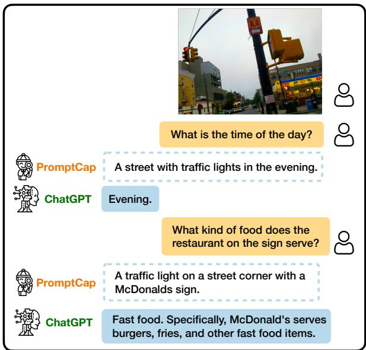
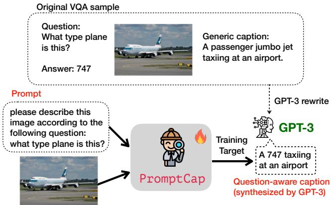
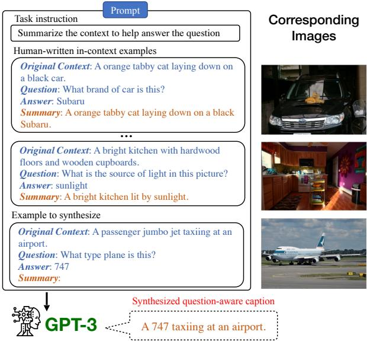
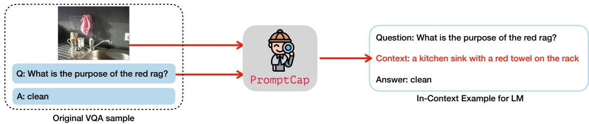
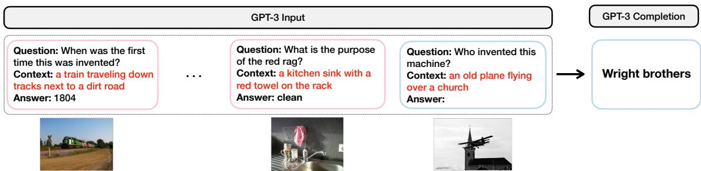
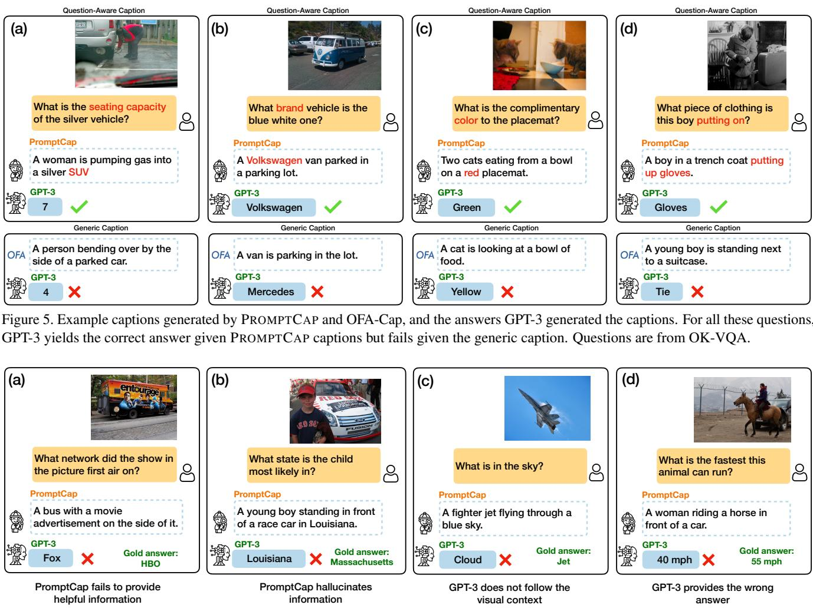
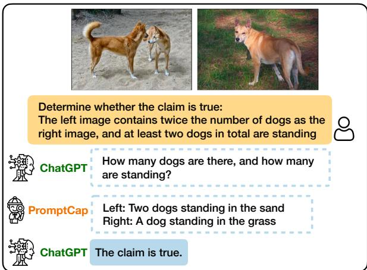

# PROMPTCAP: Prompt-Guided Image Captioning for VQA with GPT-3

Yushi Hu1\* Hang Hua2⇤ Zhengyuan Yang3

Weijia Shi1 Noah A. Smith1,4 Jiebo Luo2

1University of Washington 2University of Rochester

3Microsoft 4Allen Institute for AI

https://yushi-hu.github.io/promptcap\_demo/

## Abstract

Knowledge-based visual question answering (VQA) involves questions that require world knowledge beyond the image to yield the correct answer. Large language models (LMs) like GPT-3 are particularly helpful for this task because oftheir strong knowledge retrieval and reasoning capabilities. To enable LM to understand images, prior work uses a captioning model to convert images into text. However, when summarizing an image in a single caption sentence, which visual entities to describe are often underspecified. Generic image captions often miss visual details essential for the LM to answer visual questions correctly. To address this challenge, we propose PROMPTCAP (Prompt-guided image Captioning), a captioning model designed to serve as a better connector between images and black-box LMs. Differentfrom generic captions, PROMPTCAP takes a naturallanguage prompt to control the visual entities to describe in the generated caption. The prompt contains a question that the caption should aid in answering. To avoid extra annotation, PROMPTCAP is trained by examples synthesized with GPT-3 and existing datasets. We demonstrate PROMPT-CAP’s effectiveness on an existing pipeline in which GPT-3 is prompted with image captions to carry out VQA. PROMPT-CAP outperforms generic captions by a large margin and achieves state-of-the-art accuracy on knowledge-based VQA tasks (60.4% on OK-VQA and 59.6% on A-OKVQA). Zeroshot results on WebQA show that PROMPTCAP generalizes well to unseen domains.

## 1. Introduction

Knowledge-based visual question answering (VQA) [37] extends traditional VQA tasks [3] with questions that require broad knowledge and commonsense reasoning to yield the correct answer. Existing systems on knowledge-based VQA retrieve external knowledge from various sources, including knowledge graphs [13, 36, 63], Wikipedia [36, 63, 12, 15, 29], and web search [35, 63]. Recent work [67] finds that modern language models (LMs) like GPT-3 [5] are particu larly useful for this task because of their striking knowledge retrieval and reasoning abilities. The current state-of-the-art methods [67, 15, 29, 1] all make use of recent large language models (GPT-3 or Chinchilla).

  
v.s. COCO caption: A traffic light on a pole on a city street.  
Figure 1. Illustration of VQA with PROMPTCAP and ChatGPT. PROMPTCAP is designed to work with black-box language models (e.g., GPT-3, ChatGPT) by describing question-related visual information in the text. Different from generic captions, PROMPTCAP customizes the caption according to the input question prompt, which helps ChatGPT understand the image and give correct answers to the user. In contrast, ChatGPT cannot infer the answers from the vanilla human-written caption from MSCOCO.

One key challenge is to allow LMs to understand images. Many top-performing LMs (e.g., GPT-3, ChatGPT) are only accessible via APIs, making it impossible to access their internal representations or conduct fine-tuning [49]. A popular solution is to project images into texts that black-box LMs can process, via a generic image captioning model [7] or an image tagger [67]. This framework has been successful on multiple tasks, including VQA [67, 15, 29], image paragraph captioning [65], and video-language tasks [70, 60]. Despite promising results, converting visual inputs into a generic, finite text description risks excluding information necessary for the task. As discussed in PICa [67], when used for VQA tasks, the generic caption might miss the detailed visual information needed to answer the question, such as missing the “McDonald’s" in Figure 1.

To address the above challenges, we introduce PROMPT-CAP, a question-aware captioning model designed to serve as a better connector between images and a black-box LM. PROMPTCAP is illustrated in Figure 2. PROMPTCAP takes an extra natural language prompt as input to control the vi sual content to describe. The prompt contains the question that the generated caption should help to answer. LMs can better answer visual questions by using PROMPTCAP as their “visual front-end". For example, in Figure 1, when asked “what is the time of the day?", PROMPTCAP includes “in the evening" in its image description; when asked “what kind of food does the restaurant on the sign serve?", PROMPTCAP includes “McDonald’s” in its description. Such visual information is critical for ChatGPT to reply to the user with the correct answers. In contrast, the generic COCO [28] caption often contains no information about the time or the sign, making ChatGPT unable to answer the questions.

One major technical challenge is PROMPTCAP training. The pipeline of “PROMPTCAP + black-box LM" cannot be end-to-end fine-tuned on VQA tasks because the LM parameters are not exposed through the API. Also, there are no training data for question-aware captions. To avoid extra annotation, we propose a pipeline to synthesize and filter training samples with GPT-3. Specifically, we view existing VQA datasets as pairs of question and question-related visual details. Given a question-answer pair, we rewrite the corresponding image’s generic caption into a customized caption that helps answer the question. Following 20 humanannotated examples, GPT-3 synthesizes a large number of question-aware captions via few-shot in-context learning [5]. To ensure the sample quality, we filter the generated captions by performing QA with GPT-3, checking if the answer can be inferred given the question and the synthesized caption. Notice that GPT-3 is frozen in the whole pipeline. Its strong few-shot learning ability makes this pipeline possible.

We demonstrate the effectiveness of PROMPTCAP on knowledge-based VQA tasks with the pipeline in PICa [67]. Details of the pipeline are illustrated in §4. The images are converted into texts via PROMPTCAP, allowing GPT-3 to perform VQA via in-context learning. This pipeline, despite its simplicity, achieves state-of-the-art results on knowledgebased VQA tasks (60.4% on OK-VQA [38] and 59.6% on A-OKVQA [46]). We also conduct extensive ablation stud ies on the contribution of each component, showing that PROMPTCAP gives a consistent performance gain (3.8% on OK-VQA, 5.3% on A-OKVQA, and 9.2% on VQAv2) over a generic captioning model that shares the same architecture and training data. Finally, we investigate PROMPTCAP’s generalization ability on WebQA [6], showing that PROMPT-CAP, without any training on the compositional questions in WebQA, outperforms the generic caption approach and all supervised baselines.

  
Figure 2. Overview of PROMPTCAP training. PROMPTCAP takes two inputs, including an image and a natural language prompt. The model is trained to generate a caption that helps downstream LMs to answer the question. During training, we use GPT-3 to synthesize VQA samples into captioning examples. The original caption is rewritten into a caption that helps answer the question. PROMPTCAP is trained to generate this synthesized caption given the image and the prompt.

In summary, our contributions are as follows:

• We propose PROMPTCAP, a novel question-aware captioning model that uses natural language prompt to control the visual content to be described. (§3)

• To the best of our knowledge, we are the first to propose a pipeline to synthesize and filter training samples for vision-language tasks via GPT-3 (§3.1).

• PROMPTCAP helps GPT-3 in-context learning (§4) achieve state-of-the-art results on OK-VQA and A-OKVQA, substantially outperforming generic captions on various VQA tasks. (§5).

## 2. Related Work

Knowledge-Based VQA Knowledge-based VQA [38, 46] requires systems to leverage external knowledge beyond image content to answer the question. Prior works [13, 36, 63, 72, 40, 41, 17, 18, 12] investigate leveraging knowledge from various external knowledge resources, e.g., Wikipedia [56], ConceptNet [50], and ASER [71], to improve the performance of the VQA models. Inspired by PICa [67], recent works [15, 29] use GPT-3 as an implicit knowledge base and achieve state-of-the-art results. We identify the critical problem: generic captions used to prompt GPT-3 often miss critical visual details for VQA. We address this challenge with PROMPTCAP.

Vision-Language Models Vision-language models have recently shown striking success on various multimodal tasks [51, 33, 9, 27, 61, 22, 43, 66, 57, 58, 34, 68, 8, 26]. These works first pretrain multimodal models on large-scale image-text datasets and then finetune the models for particular tasks. The works most related to ours are Frozen [54], Flamingo [1], and BLIP-2 [26], which keeps the LMs frozen and tune a visual encoder for the LM. However, such techniques require access to internal LM parameters and are thus difficult to be applied to black-box LMs like GPT-3.

Prompting for Language Models Prompting allows a pre-trained model to adapt to different tasks via different prompts without modifying any parameters. LLMs like GPT-3 [5] have shown strong zero-shot and few-shot ability via prompting. Prompting has been successful for a variety of natural language tasks [32], including but not limited to classification tasks [39, 48], semantic parsing [64], knowledge generation [49, 30], and dialogue systems [24, 16]. The most closely-related works to ours are the instruction-finetuned language models [45, 62, 59].

## 3. PROMPTCAP

We introduce PROMPTCAP, an image captioning model that utilizes a natural language prompt as an input condition. The overview of PROMPTCAP training is in Figure 2. Given an image I, and a natural language prompt P, PROMPTCAP generates a prompt-guided caption C. P contains instructions about the image contents of interest to the user. For VQA, an example prompt could be “Please describe this image according to thefollowing question: what type plane is this?. The prompt-guided caption C should (1) cover the visual details required by the instruction in the prompt, (2) describe the main objects as general captions do, and (3) use auxiliary information in the prompt if necessary. For instance, assuming the prompt contains a VQA question, C may directly describe the asked visual contents (e.g., for questions about visual details), or provide information that helps downstream models to infer the answer (e.g., for questions that need external knowledge to solve).

Given the above design, the major technical challenge is PROMPTCAP training. PROMPTCAP is designed to work with black-box LMs, which cannot be end-to-end fine-tuned on VQA tasks because the LM parameters are not accessible. Besides, there are no training data for question-aware captions. To address these challenges, we propose training PROMPTCAP with data synthesized with GPT-3.

  
Figure 3. Training example synthesis with GPT-3 in-context learning. The “Original Contexts" are ground-truth image captions. The question-answer pairs come from existing VQA datasets. GPT-3 generalizes (without parameter updates) from the human-written examples to produce the question-aware caption given the caption, question, and answer. The images are shown for clarity but are not used in our data synthesis procedure.

## 3.1. Training Data Synthesis

To avoid annotating question-aware caption examples, we use GPT-3 to generate training examples for PROMPTCAP via in-context learning [5, 44, 16, 10].

## 3.1.1 Training Example Generation with GPT-3

For PROMPTCAP training, we view existing VQA datasets as natural sources of pairs of task and task-related visual details. We synthesize question-aware captions by combining the general image captions and the question-answering pairs using GPT-3 in-context learning. Figure 3 illustrates the GPT-3 prompt we use for training example generation. The prompt contains the task instruction, 20 human-written examples, and the VQA question-image pair that we synthesize the task-aware caption from. Since GPT-3 only accepts text inputs, we represent each image by concatenating the 5 human-written COCO captions [7], as shown in the “Original Context". The human-written examples follow the three principles of prompt-guided captions described in Section 3. The commonsense reasoning ability of GPT-3 allows the model to understand the image to some extent via the COCO captions and synthesize new examples by following the human-written examples.

## 3.1.2 Training Example Filtering

To ensure the quality of the generated captions, we sample 5 candidate captions from GPT-3 for each question-answer pair. We devise a pipeline to filter out the best candidate caption as the training example for PROMPTCAP. The idea is that a text-only QA system should correctly answer the question given a high-quality prompt-guided caption as the context. For each candidate caption, we use the GPT-3 incontext learning VQA system in §4 to predict an answer, and score the candidate captions by comparing this answer with the ground-truth answers.

Soft VQA Accuracy We find that in the open-ended generation setting, the VQA accuracy [14] incorrectly punishes answers with a slight difference in surface form. For example, the answer “coins" gets 0 when the ground truth is “coin". To address this problem, we devise a new soft VQA accuracy for example filtering. Suppose the predicted answer is a and the human-written ground truth answers are $[ g _ { 1 } , g _ { 2 } , . . . , g _ { n } ]$ . The soft accuracy is given by the three lowest-CER ground truth answers:

$$
A c c _ { s o f t } ( a ) = \operatorname* { m a x } _ { x , y , z \in [ n ] } \sum _ { i \in \{ x , y , z \} } \frac { \operatorname* { m a x } [ 0 , 1 - C E R ( a , g _ { i } ) ] } { 3 } ,
$$

where CER is the character error rate, calculated by the character edit distance over the total number of characters of the ground truth. In contrast, the traditional VQA accuracy [14] uses exact match. We sort the candidate captions based on this soft score.

Comparing with COCO ground-truth Multiple candidates may answer the question correctly and get the same soft score. To break ties, we also compute the CIDEr score [55] between the candidate captions and the COCO ground-truth captions. Among the candidates with the highest soft VQA accuracy, the one with the highest CIDEr score is selected as the training example for PROMPTCAP.

## 3.2. PROMPTCAP Training

For PROMPTCAP training, we start with the state-of-theart pre-trained vision-language model OFA [58] and make some modifications to the OFA captioning model. OFA has an encoder-decoder structure. As discussed earlier, our training data are synthesized with VQA data in the form of question-caption pairs. Given a question-caption pair, we first rewrite the question into an instruction prompt via a template. For example, the instruction prompt might be “describe to answer: What is the clock saying the time $i s ? \prime$ . We apply byte-pair encoding (BPE) [47] to the given text sequence, encoding it as subwords. Images are transformed into image patches that share the same subword token set. Let the training samples be $\mathcal { D } = \{ P _ { i } , I _ { i } , C _ { i } \} _ { i = 1 } ^ { | \mathcal { D } | }$ in which $P _ { i }$ is the text prompt, $I _ { i }$ is the image patch, and $C _ { i }$ is the synthesized task-aware caption. The captioning model takes $\left[ P _ { i } : I _ { i } \right]$ as input and is trained to generate $C _ { i } = [ c _ { 1 } , c _ { 2 } , . . . , c _ { | C _ { i } | } ]$ ]. Here [:] is concatenation. We use negative log-likelihood loss and train the model in an end-toend manner. The training loss is :

$$
\mathcal { L } = - \sum _ { \mathcal { D } } \sum _ { t = 1 } ^ { | C _ { i } | } \log p ( c _ { t } \mid [ P _ { i } : I _ { i } ] , c _ { \le t - 1 } ) .
$$

## 4. VQA with PROMPTCAP and GPT-3

Our VQA pipeline is illustrated in Figure 4, which is adopted from PICa [67]. The pipeline consists of two components, PROMPTCAP and GPT-3.

Step 1: Converting images into texts via PROMPTCAP GPT-3 can perform a new task by simply conditioning on several task training examples as demonstrations. As we have discussed, the major challenge is that GPT-3 does not understand images. To bridge this modality gap, we convert the images in VQA samples to texts using PROMPTCAP (Figure 4a). Notice that different from generic captioning models, PROMPTCAP customizes the image caption according to the question, which enables LMs to understand question-related visual information in the image. As such, we are able to convert VQA samples into question-answering examples that GPT-3 can understand.

Step 2: GPT-3 in-context learning for VQA Having used PROMPTCAP to convert VQA examples into question-answer examples that GPT-3 can understand (Step 1), we use a subset of these examples as the task demonstration for GPT-3. We concatenate the incontext learning examples to form a prompt, as shown in Figure 4b. Each in-context learning example consists of a question (Question: When was the first time this was invented?), a context generated by PROMPTCAP (Context: a train traveling down tracks next to a dirt road), and an answer (Answer: 1804). Then we append the test example to the in-context learning examples, and provide them as inputs to GPT-3. GPT-3 generates predictions based on an open-ended text generation approach, taking into account the information provided in the in-context learning examples and the test example.

Example retrieval Previous research has shown that the effectiveness of in-context learning examples chosen for GPT-3 can significantly impact its performance [31]. In the few-shot setting where only a few training examples are available, we simply use these examples as in-context learning examples (referred to as “Random” in later sections because they are selected at random from our collection). However, in practice, we often have access to more than small-n examples (i.e., full training data setting). To improve the selection of in-context learning examples, we follow the approach proposed by [67]: we compute the similarity between examples using CLIP [43] by summing up the cosine similarities of the question and image embeddings. The n most similar examples in the training set are then selected as in-context examples (referred to as “CLIP” in this paper). By using the most similar in-context examples to the test instance, our approach can improve the quality of the learned representations and boost the performance of GPT-3 on VQA tasks.

(a) Step 1: Using PromptCap to convert images into texts  

(b) Step 2: VQA with PromptCap and in-context learning on GPT-3  
  
Figure 4. Our inference pipeline for VQA. (a) Illustration of how we convert a VQA sample into pure text. Given the image and th question, PROMPTCAP describes the question-related visual information in natural language. The VQA sample is turned into a QA sample that GPT-3 can understand. (b) GPT-3 in-context learning for VQA. After converting the VQA examples into text with PROMPTCAP, we carry out VQA by in-context learning on GPT-3. The input consists of the task instruction (not shown in the figure), the in-context examples, and the test instance. GPT-3 takes the input and generates the answer. Notice that the GPT-3 is treated as a black box and is only used fo inference. The question-aware captions PROMPTCAP generated are marked red

## 5. Experiments

In this section, we demonstrate PROMPTCAP’s effectiveness on knowledge-based VQA tasks. First, we show that PROMPTCAP captions enable GPT-3 to achieve state-ofthe-art performance on OK-VQA [38] and A-OKVQA [46] with in-context learning. Then we conduct ablation experiments on the contribution of each component, showing that PROMPTCAP is giving consistent gains over generic captions. In addition, experiments on WebQA [6] demonstrate that PROMPTCAP generalizes well to unseen domains.

## 5.1. Experimental Setup

Datasets We use three knowledge-based VQA datasets, namely OK-VQA [38], A-OKVQA [46], and WebQA [6]. OK-VQA[38] is a large knowledge-based VQA dataset that contains 14K image-question pairs. Questions are manually filtered to ensure that outside knowledge is required to answer the questions. A-OKVQA[46] is an augmented successor of OK-VQA, containing 25K image-question pairs that require broader commonsense and world knowledge to answer. For both OK-VQA and A-OKVQA, the direct answers are evaluated by the soft accuracy from VQAv2[14]. Besides direct answer evaluation, A-OKVQA also provides multiple-choice evaluation, where the model should choose one correct answer among 4 candidates. WebQA [6] is a multimodal multi-hop reasoning benchmark that requires the model to combine multiple text and image sources to answer a question.

PROMPTCAP implementation details We adopt the officially released OFA [58] captioning checkpoint “captionlarge-best-clean” (470M) for model initialization and use the GPT-3 synthesized examples in §3.1 to fine-tune the model. The examples are synthesized from VQAv2 [3, 14]. Notice that this dataset is included in OFA pre-training, so we are not adding additional annotated training data compared with OFA. We use AdamW [23] optimizer with learning rate $\{ 2 \times 1 0 ^ { - 5 } , 3 \times 1 0 ^ { - 5 } , 5 \times 1 0 ^ { - 5 } \}$ , batch size 32, 64, 128 , and 1 = 0.9, 2 = 0.999 for training.

In-context learning details We use code-davinci-002 engine (175B) for GPT-3 in all the experiments. Due to the input length limit, we use n = 32 most similar examples in the prompt for GPT-3. The examples are retrieved by CLIP (VIT-L/14) using the method discussed in §4.

Table 1. Results comparison with existing systems on OK-VQA, with the image representation and the knowledge source each method uses. GPT-3 is frozen for all methods. The methods on top require end-to-end finetuning on OK-VQA. The methods below are fully based on in-context learning or zero-shot learning and do not require task-specific finetuning.
<table><tr><td rowspan=1 colspan=8>Method</td><td rowspan=1 colspan=5>Image Representation</td><td rowspan=1 colspan=1>Knowledge Source</td><td rowspan=1 colspan=1>Accuracy (%)</td></tr><tr><td rowspan=2 colspan=8>End-to-End FinetuningQuestion only [37]</td><td rowspan=3 colspan=6>Feature</td><td rowspan=1 colspan=1></td></tr><tr><td rowspan=1 colspan=1>14.9</td></tr><tr><td rowspan=1 colspan=8>MUTAN [38]</td><td rowspan=7 colspan=1>Wikipedia + ConceptNetConceptNetWikipedia + ConceptNetGoogle Search</td><td rowspan=1 colspan=1>26.4</td></tr><tr><td rowspan=4 colspan=7>BAN + KG + AUG [25]ConceptBERT [13]</td><td rowspan=1 colspan=2></td><td rowspan=1 colspan=4>Feature</td><td rowspan=5 colspan=1>26.733.738.4</td></tr><tr><td rowspan=3 colspan=3>ConceptBERT</td><td rowspan=3 colspan=2>RT [13]</td><td rowspan=3 colspan=3></td><td rowspan=3 colspan=3>Feature</td><td></td><td></td></tr><tr><td rowspan=2 colspan=2></td><td></td></tr><tr><td rowspan=1 colspan=2></td></tr><tr><td rowspan=1 colspan=2>KRISP [36</td><td rowspan=1 colspan=4>]</td><td rowspan=1 colspan=2></td><td rowspan=1 colspan=1></td><td rowspan=1 colspan=3>Feature</td><td rowspan=2 colspan=2>Feature</td></tr><tr><td rowspan=1 colspan=8>Vis-DPR [35]</td><td></td><td></td><td></td><td></td><td rowspan=1 colspan=1>39.2</td></tr><tr><td rowspan=1 colspan=8>MAVEx [63]</td><td rowspan=1 colspan=5>Feature</td><td rowspan=7 colspan=1>Wikipedia + ConceptNet + Google ImagesWikipediaGPT-3 (175B) + WikidataGPT-3 (175B) + WikidataGPT-3 (175B) + WikidataGPT-3 (175B) + Wikidata</td><td rowspan=6 colspan=1>39.450.554.454.4</td></tr><tr><td rowspan=3 colspan=8>TRiG [12]</td><td></td><td></td><td></td><td></td><td></td></tr><tr><td rowspan=3 colspan=7>KAT (Single) [15]</td><td></td><td></td><td></td><td></td><td></td></tr><tr><td rowspan=3 colspan=5>Caption + Tags + OCRCaption + Tags + FeatureCaption + Tags + Feature</td></tr><tr><td rowspan=1 colspan=3></td></tr><tr><td rowspan=1 colspan=5>KAT (Ensemble) [15]</td><td rowspan=1 colspan=3></td></tr><tr><td rowspan=1 colspan=8>REVIVE (Single) [29]REVIVE (Ensemble) [29]</td><td rowspan=1 colspan=5>Caption + FeatureCaption + Feature</td><td rowspan=1 colspan=1>56.658.0</td></tr><tr><td rowspan=1 colspan=8>In-Context Learning &amp; Zero-ShotBLIP-2 VIT-G FlanT5xxL [26] (zero-shot)</td><td rowspan=2 colspan=6>Feature           FlanT5-XXL (11B)Caption + Tags       GPT-3 (175B)</td><td rowspan=2 colspan=1>45.943.3</td></tr><tr><td rowspan=1 colspan=8>PICa-Base [67]</td></tr><tr><td rowspan=3 colspan=8>PICa-Full [67]Flamingo (80B) [1] (zero-shot)Flamingo (80B) [1] (32-shot)PromptCap + GPT-3</td><td rowspan=1 colspan=5>Caption + Tags</td><td rowspan=2 colspan=1>GPT-3 (175B)</td><td rowspan=1 colspan=1>48.0</td></tr><tr><td rowspan=1 colspan=5>Feature</td><td rowspan=1 colspan=1></td><td rowspan=2 colspan=1>Chinchilla (70B)GPT-3 (175B)</td><td rowspan=1 colspan=1>50.6</td></tr><tr><td rowspan=1 colspan=5>FeatureCaption</td><td rowspan=1 colspan=1>57.860.4</td></tr></table>

Table 2. Results comparison with existing systems on A-OKVQA. There are two evaluations, namely multiple-choice and directanswer. Both are measured by accuracy(%).
<table><tr><td>Method</td><td>Multiple Choice val test</td><td>val</td><td>Direct Answer test</td></tr><tr><td>ClipCap [46]</td><td>44.0</td><td>43.8</td><td>18.1 15.8</td></tr><tr><td>Pythia [19]</td><td>49.0</td><td>40.1 25.2</td><td>21.9</td></tr><tr><td>ViLBERT [33]</td><td>49.1 41.5</td><td>30.6</td><td>25.9</td></tr><tr><td>LXMERT [53]</td><td>51.4 41.6</td><td>30.7</td><td>25.9</td></tr><tr><td>KRISP [36]</td><td>51.9 42.2</td><td>33.7</td><td>27.1</td></tr><tr><td>GPV-2 [20]</td><td>60.3</td><td>53.7 48.6</td><td>40.7</td></tr><tr><td>PromptCap + GPT-3</td><td>73.2</td><td>73.1</td><td>56.3 59.6</td></tr></table>

## 5.2. Results on OK-VQA and A-OKVQA

Table 1 compares PROMPTCAP + GPT-3 with other methods on the OK-VQA validation set. For each method, we also list the way it represents the images, and the knowledge source used. The table is split into two sections. The upper section lists fully supervised methods. These methods require end-to-end finetuning. The methods in the bottom section are based on in-context learning and no task-specific finetuning is done on the models.

We can see that all state-of-the-art systems use GPT-3 (or Chinchilla) as part of their systems. These methods obtain significant performance gains compared with previous methods, showing the importance of the LM in knowledgebased VQA tasks. PICa is the first system that used GPT-3 as the knowledge source. KAT [15] further improves over PICa by introducing Wikidata [56] as the knowledge source, doing ensemble and end-to-end finetuning on multiple components. REVIVE [29] is the current state of the art on OK-VQA. Compared with KAT, it introduces extra object-centric visual features to the ensemble, which brings additional gains over KAT. However, all of the above methods use generic image captions to prompt knowledge from GPT-3. We identify this as a critical bottleneck in using LMs for VQA tasks. PROMPTCAP is designed to address this bottleneck.

Comparison with state of the art Our proposed PROMPT-CAP + GPT-3, despite using no additional knowledge source, no ensemble with visual features, and no end-to-end finetuning, achieves 60.4% accuracy and outperforms all existing methods on OK-VQA. Table 2 shows similar results on A-OKVQA, in which PROMPTCAP + GPT-3 outperforms all prior methods by a large margin on both multiple-choice (73.1%) and direct-answer (59.6%) evaluations. These results demonstrate PROMPTCAP’s effectiveness in connecting LMs with images. Besides, we would like to emphasize that PROMPTCAP could replace the captioning module in the systems KAT and REVIVE have proposed, which might further boost the performance. We expect that PROMPTCAP will help future systems with complementary advances to achieve even better performance on these tasks.

## 5.3. Ablation Study

We conduct extensive ablation studies to quantify the performance benefit of each component in our system, i.e., the captioning model PROMPTCAP, the language model, and the prompting method. We conduct ablation experiments on each component.

Additional dataset for analysis Besides knowledge-based VQA tasks, we would also like to investigate the performance gain from PROMPTCAP for traditional VQA. Thus, we also include VQAv2 [3] in our ablation studies.

Table 3. Ablation on the contribution of PROMPTCAP, compared with generic captioning model OFA-Cap. The LM we use is GPT-3.
<table><tr><td>Captioning Model</td><td>OK-VQA</td><td>A-OKVQA</td><td>VQAv2</td></tr><tr><td>OFA-Cap</td><td>56.6</td><td>51.0</td><td>64.9</td></tr><tr><td>PROMPTCAP</td><td>60.4</td><td>56.3</td><td>74.1</td></tr></table>

## 5.3.1 Performance Benefit from PROMPTCAP

Baseline generic captioning model We use the officially released OFA [58] captioning checkpoint “caption-largebest-clean” (470M) as the baseline generic captioning model. We refer to it as “OFA-Cap”. We choose this model because this is the model initialization we use for PROMPTCAP, sharing the same model architecture. Notice that OFA is a large vision-language model pre-trained on 20M image-text pairs and 20 vision-language tasks, including many VQA tasks. We are not using additional annotated data during PROMPT-CAP finetuning.

PROMPTCAP captions give consistent gains over generic captions. Table 3 measures the performance benefit from PROMPTCAP on OK-VQA, A-OKVQA, and VQAv2 validation sets. Here we focus on the performance gap between using PROMPTCAP captions and generic OFA captions. We can see that PROMPTCAP gives consistent improvements over generic captions. Specifically, with GPT-3, PROMPT-CAP improves over OFA-Cap by 3.8%, 5.3%, and 9.2% absolute accuracy on OK-VQA, A-OKVQA, and VQAv2, respectively.

Table 4. Ablation on the contribution of GPT-3. We measure the performance gain of using GPT-3 as the language model, compared with Flan-T5-XXL (11B). The captioning model we use is PROMPTCAP.
<table><tr><td>Language Model</td><td>OK-VQA</td><td>A-OKVQA</td><td>VQAv2</td></tr><tr><td>Flan-T5-XXL (11B)</td><td>42.0</td><td>41.5</td><td>70.9</td></tr><tr><td>GPT-3 (175B)</td><td>60.4</td><td>56.3</td><td>74.1</td></tr></table>

## 5.3.2 Performance Benefit from Language Model

Baseline language model To measure the performance gain from GPT-3, we choose Flan-T5-XXL(11B) [11] as the baseline language model. FlanT5-XXL is an instructionfinetuned LM that has shown good in-context learning ability. Notice that for Flan-T5-XXL, because of the input length limit, we use n = 16 in-context examples in the input.

GPT-3 yields huge gains on knowledge-based VQA, but not on VQAv2. Results in Table 4 quantify the benefit of GPT-3 over Flan-T5-XXL. GPT-3 yields great performance gains on knowledge-based VQA tasks, improving over Flan-T5 by 18.4% and 14.8% absolute accuracy on OK-VQA and A-OKVQA, respectively. In comparison, on VQAv2, GPT-3 only gives 3.2% accuracy gain, which is much smaller than the gain from PROMPTCAP over generic captions. The results indicate that GPT-3’s external knowledge is critical for knowledge-based VQA tasks but not for VQAv2. We speculate that this disparity arises from VQAv2’s focus on information in the image, without requiring additional knowledge beyond visual information.

Table 5. Ablation of GPT-3 prompting on OK-VQA. We experi ment with different numbers of in-context examples in the input and measure the performance gain from retrieving similar in-context examples compared with random examples.
<table><tr><td>Examples</td><td>Caption</td><td>n=1</td><td>n=4</td><td>n=16</td><td>n=32</td></tr><tr><td>Random</td><td>OFA-Cap PROMPTCAP</td><td>42.8</td><td>46.6</td><td>49.7</td><td>50.8</td></tr><tr><td>CLIP</td><td></td><td>46.5</td><td>50.0</td><td>53.1</td><td>55.2</td></tr><tr><td></td><td>OFA-Cap</td><td>44.5</td><td>50.0</td><td>55.3</td><td>56.6</td></tr><tr><td></td><td>PROMPTCAP</td><td>48.7</td><td>53.3</td><td>58.4</td><td>60.4</td></tr></table>

## 5.3.3 Ablation on GPT-3 Prompting

As discussed in §4, two factors affect the in-context learning performance: the number of in-context examples, and the example selection strategy. To measure the effects of these two factors, we conduct an ablation study on GPT-3 prompting for OK-VQA in Table 5. We vary the number of examples $n \in \{ 1 , 4 , 1 6 , 3 2 \}$ and experiment with random examples and the most similar examples retrieved by CLIP (VIT-L/14) [43]. We can see that for both example selection strategies, the more in-context examples, the better the performance. Also, retrieving most similar examples with CLIP gives substantial performance gain (5.2% absolute accuracy for PROMPTCAP when n = 32). Both findings agree with the claims in prior work [5, 31, 67].

## 5.4. Domain Transfer on WebQA

We apply PROMPTCAP to WebQA [6] to evaluate PROMPTCAP’s generalization ability on images and tasks from different domains. WebQA images are crawled from the web and are from domains different from the COCO [28] images used in PROMPTCAP’s training data synthesized from VQAv2 [14]. Due to the task setting, questions are compositional and much longer than typical VQA questions. We convert the source images into captions and use GPT-3 in-context learning to carry out the task with only 8 random examples. The answers are long-form and measured by two scores: the fluency score measured by BARTScore [69] and the accuracy score that measures if human-annotated keywords are included in the answer. The results in the image-query setting with oracle sources on the validation set2 are shown on Table 6. Our systems outperform all the official baselines. PROMPTCAP outperforms the generic OFA captions, showing that PROMPTCAP is generalizable to a different domain of questions and images.

  
Figure 6. Representative failure cases of PROMPTCAP and GPT-3 pipeline on OK-VQA.

Table 6. Results on the WebQA validation set with oracle sources on image queries. The baselines in the upper part are fully supervised, while our methods only use 8-shot in-context learning.
<table><tr><td>Method</td><td>FL</td><td>Acc</td><td>FL*Acc</td></tr><tr><td>Fully supervised</td><td></td><td></td><td></td></tr><tr><td>VLP + VinVL [6]</td><td>47.6</td><td>49.6</td><td>27.5</td></tr><tr><td>VLP + x101fpn [6]</td><td>46.9</td><td>44.3</td><td>23.8</td></tr><tr><td>8-shot in-context learning</td><td></td><td></td><td></td></tr><tr><td>OFA-Cap + GPT-3</td><td>52.8</td><td>55.4</td><td>33.5</td></tr><tr><td>PROMPTCAP + GPT-3</td><td>53.0</td><td>57.2</td><td>34.5</td></tr></table>

## 5.5. Qualitative Analysis

Representative captions generated by PROMPTCAP and OFA are illustrated in Figure 5. The task is to answer the questions in OK-VQA. For all these questions, GPT-3 generates the correct answer when taking PROMPTCAP’s caption as input, but fails when taking the generic caption. PROMPT-CAP is able to capture visual attributes according to the question, for example, “brand" in (b) and “color" in (c). In addition, it can focus on particular objects asked in the question, such as the clothing the boy is “putting on" in (d). For tasks beyond PROMPTCAP’s reasoning ability, GPT-3 infers the answer by the visual details PROMPTCAP gives. For example, GPT-3 infers “green" for the “complimentary color of red" in (c) and “7" for SUV’s seating capacity in (a). We also show some representative failure cases in Figure 6. The majority of failures are as shown in (a) and (b), in which PROMPTCAP fails to provide helpful information, or provides unfactual information. GPT-3 sometimes makes mistakes, as shown in (c) and (d).

Table 7. Comparison of captions. “GPT-3-Syn" are the questionaware captions synthesized by GPT-3. “COCO-GT" are the MSCOCO ground-truth captions. Higher scores imply higher similarities between the captions.
<table><tr><td colspan="2">Captions</td><td>B</td><td>M</td><td>C</td><td>S</td></tr><tr><td colspan="2">Comparison between “gold captions&quot; COCO-GT</td><td></td><td></td><td></td><td></td></tr><tr><td colspan="2">GPT-3-Syn</td><td>67.1</td><td>44.3</td><td>182.9</td><td>32.1</td></tr><tr><td colspan="2">Inferenced captions vs. “gold captions&quot;</td><td>26.2</td><td>25.3</td><td></td><td>40.2</td></tr><tr><td>OFA-Cap PROMPTCAP</td><td>GPT-3-Syn GPT-3-Syn</td><td>33.0</td><td>29.7</td><td>231.0 307.1</td><td>47.3</td></tr><tr><td>OFA-Cap</td><td>COCO-GT</td><td>44.5</td><td>30.9</td><td></td><td></td></tr><tr><td></td><td></td><td></td><td></td><td>147.9</td><td>24.6</td></tr><tr><td>PROMPTCAP</td><td>COCO-GT</td><td>45.4</td><td>31.6</td><td>150.1</td><td>25.2</td></tr></table>

## 5.6. Analysis: How Do Question-Aware Captions Differ from Generic Captions?

To further analyze the question-aware captions, we compare different inferred/gold captions in Table 7. The captions are compared by the automatic evaluations used in MSCOCO [7]: BLEU-4 (B) [42], METEOR (M) [4], CIDEr (C) [55], and SPICE (S) [2]. We evaluate the captions on the VQAv2 question-image pairs with images in the Karpathy test split [21] and average the scores over the questions. The upper part of the table compares the “training targets" for PROMPTCAP and the generic captioning model OFA-Cap. The lower part compares the captions inferred by each captioning model with these “gold captions". We make several observations from the table:

GPT-3 synthesized question-aware captions synthesized by GPT-3 are highly similar to the MSCOCO ground truth generic captions. As seen in the upper part of Table 7, the question-aware captions are really similar to the MSCOCO ground-truth captions.

PROMPTCAP achieves high CIDEr and SPICE scores using GPT-3 synthesized captions as reference. The second row in the lower part compares the prompt-guided captions generated by PROMPTCAP with the GPT-3 synthesized question-aware captions. We can see that the CIDEr and SPICE scores are really high. One possible reason for the high scores is that synthesized question-aware captions are typically less diverse, shorter, and cover fewer visual entities compared with human-written general captions. Moreover, the image captioning task becomes less ambiguous via the prompt’s control, making it easier for PROMPTCAP to learn.

PROMPTCAP can also generate high-quality generic captions. The last row shows the quality of the generic captions generated by PROMPTCAP. Users can get generic captions by prompting PROMPTCAP with the question “what does the image describe?". All the automatic metrics show that PROMPTCAP achieves SOTA performance on COCO validation set, with even higher scores than the original OFA-Cap model.

## 6. Limitations and Broader Impact

One limitation is that the current PROMPTCAP only focuses on knowledge-based VQA tasks. PROMPTCAP can be extended to other vision-language tasks beyond VQA. Figure 7 shows an example of solving NLVR2 [52] via a series of vision and reasoning steps between PROMPTCAP and ChatGPT. Future work may scale up PROMPTCAP training with more diverse tasks and instructions, and explore broader applications of PROMPTCAP beyond VQA.

Another limitation is that images contain information that cannot be abstracted as text. While PROMPTCAP has demonstrated promising results in bridging the gap between LMs and images, it is important to recognize its limitations and use it in conjunction with other methods to ensure a comprehensive understanding of visual data.

  
Figure 7. Demo of solving the NLVR2 task with off-the-shelf PROMPTCAP and ChatGPT via an interpretable reasoning process.

## 7. Conclusion

We present PROMPTCAP, a novel question-aware captioning model that can be controlled via a natural language prompt. To train this captioning model with no extra annotation, we devise an efficient pipeline for synthesizing and filtering training examples via GPT-3. We demonstrate the effectiveness of PROMPTCAP on knowledge-based VQA tasks. Our system achieves state-of-the-art performance on OK-VQA and A-OKVQA. Ablations show that PROMPTCAP is giving consistent gains over generic captions. Furthermore, we investigate PROMPTCAP’s generalization ability on WebQA. PROMPTCAP works as a simple and general module for converting question-related visual information into text.

## References

[1] Jean-Baptiste Alayrac, Jeff Donahue, Pauline Luc, Antoine Miech, Iain Barr, Yana Hasson, Karel Lenc, Arthur Mensch, Katie Millican, Malcolm Reynolds, Roman Ring, Eliza Rutherford, Serkan Cabi, Tengda Han, Zhitao Gong, Sina Samangooei, Marianne Monteiro, Jacob Menick, Sebastian Borgeaud, Andrew Brock, Aida Nematzadeh, Sahand Sharifzadeh, Mikolaj Binkowski, Ricardo Barreira, Oriol Vinyals, Andrew Zisserman, and Karen Simonyan. Flamingo: a visual language model for few-shot learning, 2022. 1, 3, 6

[2] Peter Anderson, Basura Fernando, Mark Johnson, and Stephen Gould. Spice: Semantic propositional image caption evaluation. In European conference on computer vision, pages 382–398. Springer, 2016. 9

[3] Stanislaw Antol, Aishwarya Agrawal, Jiasen Lu, Margaret Mitchell, Dhruv Batra, C Lawrence Zitnick, and Devi Parikh. Vqa: Visual question answering. In Proceedings of the IEEE international conference on computer vision, pages 2425– 2433, 2015. 1, 5, 7

[4] Satanjeev Banerjee and Alon Lavie. Meteor: An automatic metric for mt evaluation with improved correlation with human judgments. In Proceedings ofthe acl workshop on intrinsic and extrinsic evaluation measuresfor machine translation and/or summarization, pages 65–72, 2005. 9

[5] Tom Brown, Benjamin Mann, Nick Ryder, Melanie Subbiah, Jared D Kaplan, Prafulla Dhariwal, Arvind Neelakantan, Pranav Shyam, Girish Sastry, Amanda Askell, et al. Language models are few-shot learners. Advances in neural information processing systems, 33:1877–1901, 2020. 1, 2, 3, 7

[6] Yingshan Chang, Guihong Cao, Mridu Narang, Jianfeng Gao, Hisami Suzuki, and Yonatan Bisk. Webqa: Multihop and multimodal qa. 2022 IEEE/CVF Conference on Computer Vision and Pattern Recognition (CVPR), Jun 2022. 2, 5, 7, 8

[7] Xinlei Chen, Hao Fang, Tsung-Yi Lin, Ramakrishna Vedantam, Saurabh Gupta, Piotr Dollár, and C Lawrence Zitnick. Microsoft coco captions: Data collection and evaluation server. arXiv preprint arXiv:1504.00325, 2015. 2, 3, 9

[8] Xi Chen, Xiao Wang, Soravit Changpinyo, AJ Piergiovanni, Piotr Padlewski, Daniel Salz, Sebastian Goodman, Adam Grycner, Basil Mustafa, Lucas Beyer, Alexander Kolesnikov, Joan Puigcerver, Nan Ding, Keran Rong, Hassan Akbari, Gaurav Mishra, Linting Xue, Ashish Thapliyal, James Bradbury, Weicheng Kuo, Mojtaba Seyedhosseini, Chao Jia, Burcu Karagol Ayan, Carlos Riquelme, Andreas Steiner, Anelia Angelova, Xiaohua Zhai, Neil Houlsby, and Radu Soricut. Pali: A jointly-scaled multilingual language-image model, 2022. 3

[9] Yen-Chun Chen, Linjie Li, Licheng Yu, Ahmed El Kholy, Faisal Ahmed, Zhe Gan, Yu Cheng, and Jingjing Liu. Uniter: Learning universal image-text representations. In ECCV, 2020. 3

[10] Zhoujun Cheng, Tianbao Xie, Peng Shi, Chengzu Li, Rahul Nadkarni, Yushi Hu, Caiming Xiong, Dragomir Radev, Mari Ostendorf, Luke Zettlemoyer, et al. Binding language models in symbolic languages. arXiv preprint arXiv:2210.02875, 2022. 3

[11] Hyung Won Chung, Le Hou, S. Longpre, Barret Zoph, Yi Tay, William Fedus, Eric Li, Xuezhi Wang, Mostafa Dehghani, Siddhartha Brahma, Albert Webson, Shixiang Shane Gu, Zhuyun Dai, Mirac Suzgun, Xinyun Chen, Aakanksha Chowdhery, Dasha Valter, Sharan Narang, Gaurav Mishra, Adams Wei Yu, Vincent Zhao, Yanping Huang, Andrew M. Dai, Hongkun Yu, Slav Petrov, Ed Huai hsin Chi, Jeff Dean, Jacob Devlin, Adam Roberts, Denny Zhou, Quoc V. Le, and Jason Wei. Scaling instruction-finetuned language models. ArXiv, abs/2210.11416, 2022. 7

[12] Feng Gao, Qing Ping, Govind Thattai, Aishwarya Reganti, Ying Nian Wu, and Prem Natarajan. Transform-retrievegenerate: Natural language-centric outside-knowledge visual question answering. In Proceedings ofthe IEEE/CVF Conference on Computer Vision and Pattern Recognition (CVPR), pages 5067–5077, June 2022. 1, 2, 6

[13] François Gardères, Maryam Ziaeefard, Baptiste Abeloos, and Freddy Lecue. ConceptBert: Concept-aware representation for visual question answering. In Findings of the Association for Computational Linguistics: EMNLP 2020, pages 489–498, Online, Nov. 2020. Association for Computational Linguistics. 1, 2, 6

[14] Yash Goyal, Tejas Khot, Douglas Summers-Stay, Dhruv Batra, and Devi Parikh. Making the V in VQA matter: Elevating the role of image understanding in Visual Question Answering. In Conference on Computer Vision and Pattern Recognition (CVPR), 2017. 4, 5, 7, 14

[15] Liangke Gui, Borui Wang, Qiuyuan Huang, Alexander Hauptmann, Yonatan Bisk, and Jianfeng Gao. KAT: A knowledge augmented transformer for vision-and-language. In Proceedings ofthe 2022 Conference ofthe North American Chapter of the Associationfor Computational Linguistics: Human Language Technologies, pages 956–968, Seattle, United States, July 2022. Association for Computational Linguistics. 1, 2, 3, 6

[16] Yushi Hu, Chia-Hsuan Lee, Tianbao Xie, Tao Yu, Noah A. Smith, and Mari Ostendorf. In-context learning for few-shot dialogue state tracking. In Findings of the Association for Computational Linguistics: EMNLP 2022, pages 2627–2643, Abu Dhabi, United Arab Emirates, Dec. 2022. Association for Computational Linguistics. 3

[17] Gautier Izacard and Edouard Grave. Distilling knowledge from reader to retriever for question answering. arXiv preprint arXiv:2012.04584, 2020. 2

[18] Gautier Izacard and Edouard Grave. Leveraging passage retrieval with generative models for open domain question answering, 2020. 2

[19] Yu Jiang, Vivek Natarajan, Xinlei Chen, Marcus Rohrbach, Dhruv Batra, and Devi Parikh. Pythia v0. 1: the winning entry to the vqa challenge 2018. arXiv preprint arXiv:1807.09956, 2018. 6

[20] Amita Kamath, Christopher Clark, Tanmay Gupta, Eric Kolve, Derek Hoiem, and Aniruddha Kembhavi. Webly supervised concept expansion for general purpose vision models. arXiv preprint arXiv:2202.02317, 2022. 6

[21] Andrej Karpathy and Li Fei-Fei. Deep visual-semantic align ments for generating image descriptions. IEEE Transactions

on Pattern Analysis and Machine Intelligence, 39(4):664–676, Apr 2017. 9

[22] Wonjae Kim, Bokyung Son, and Ildoo Kim. Vilt: Visionand-language transformer without convolution or region supervision. In International Conference on Machine Learning, pages 5583–5594. PMLR, 2021. 3

[23] Diederik P. Kingma and Jimmy Ba. Adam: A method for stochastic optimization. CoRR, abs/1412.6980, 2015. 5

[24] Chia-Hsuan Lee, Hao Cheng, and Mari Ostendorf. Dialogue state tracking with a language model using schema-driven prompting. In Proceedings ofthe 2021 Conference on Empirical Methods in Natural Language Processing, pages 4937– 4949, Online and Punta Cana, Dominican Republic, Nov. 2021. Association for Computational Linguistics. 3

[25] Guohao Li, Xin Wang, and Wenwu Zhu. Boosting visual question answering with context-aware knowledge aggregation. Proceedings of the 28th ACM International Conference on Multimedia, 2020. 6

[26] Junnan Li, Dongxu Li, Silvio Savarese, and Steven Hoi. Blip-2: Bootstrapping language-image pre-training with frozen image encoders and large language models. ArXiv, abs/2301.12597, 2023. 3, 6

[27] Xiujun Li, Xi Yin, Chunyuan Li, Pengchuan Zhang, Xiaowei Hu, Lei Zhang, Lijuan Wang, Houdong Hu, Li Dong, Furu Wei, et al. Oscar: Object-semantics aligned pre-training for vision-language tasks. In European Conference on Computer Vision, pages 121–137. Springer, 2020. 3

[28] Tsung-Yi Lin, Michael Maire, Serge Belongie, James Hays, Pietro Perona, Deva Ramanan, Piotr Dollár, and C Lawrence Zitnick. Microsoft coco: Common objects in context. In European conference on computer vision, pages 740–755. Springer, 2014. 2, 7

[29] Yuanze Lin, Yujia Xie, Dongdong Chen, Yichong Xu, Chenguang Zhu, and Lu Yuan. Revive: Regional visual representation matters in knowledge-based visual question answering. ArXiv, abs/2206.01201, 2022. 1, 2, 3, 6

[30] Jiacheng Liu, Alisa Liu, Ximing Lu, Sean Welleck, Peter West, Ronan Le Bras, Yejin Choi, and Hannaneh Hajishirzi. Generated knowledge prompting for commonsense reasoning. In Proceedings of the 60th Annual Meeting of the Associationfor Computational Linguistics (Volume 1: Long Papers), pages 3154–3169, Dublin, Ireland, May 2022. Association for Computational Linguistics. 3

[31] Jiachang Liu, Dinghan Shen, Yizhe Zhang, Bill Dolan, Lawrence Carin, and Weizhu Chen. What makes good incontext examples for GPT-3? In Proceedings ofDeep Learning Inside Out (DeeLIO 2022): The 3rd Workshop on Knowledge Extraction and Integrationfor Deep Learning Architectures, pages 100–114, Dublin, Ireland and Online, May 2022. Association for Computational Linguistics. 4, 7

[32] Pengfei Liu, Weizhe Yuan, Jinlan Fu, Zhengbao Jiang, Hiroaki Hayashi, and Graham Neubig. Pre-train, prompt, and predict: A systematic survey of prompting methods in natural language processing. arXiv preprint arXiv:2107.13586, 2021. 3

[33] Jiasen Lu, Dhruv Batra, Devi Parikh, and Stefan Lee. Vilbert: Pretraining task-agnostic visiolinguistic representations for vision-and-language tasks. In NeurIPS, 2019. 3, 6

[34] Jiasen Lu, Christopher Clark, Rowan Zellers, Roozbeh Mot taghi, and Aniruddha Kembhavi. Unified-io: A unified model for vision, language, and multi-modal tasks. ArXiv, abs/2206.08916, 2022. 3

[35] Man Luo, Yankai Zeng, Pratyay Banerjee, and Chitta Baral. Weakly-supervised visual-retriever-reader for knowledgebased question answering. Proceedings of the 2021 Conference on Empirical Methods in Natural Language Processing, 2021. 1, 6

[36] Kenneth Marino, Xinlei Chen, Devi Parikh, Abhinav Gupta, and Marcus Rohrbach. Krisp: Integrating implicit and symbolic knowledge for open-domain knowledge-based vqa. In Proceedings ofthe IEEE/CVF Conference on Computer Vision and Pattern Recognition, pages 14111–14121, 2021. 1, 2, 6

[37] Kenneth Marino, Mohammad Rastegari, Ali Farhadi, and Roozbeh Mottaghi. Ok-vqa: A visual question answering benchmark requiring external knowledge. In Proceedings ofthe IEEE/cvfconference on computer vision and pattern recognition, pages 3195–3204, 2019. 1, 6

[38] Kenneth Marino, Mohammad Rastegari, Ali Farhadi, and Roozbeh Mottaghi. Ok-vqa: A visual question answering benchmark requiring external knowledge. 2019 IEEE/CVF Conference on Computer Vision and Pattern Recognition (CVPR), Jun 2019. 2, 5, 6, 17

[39] Sewon Min, Mike Lewis, Luke Zettlemoyer, and Hannaneh Hajishirzi. MetaICL: Learning to learn in context. In Proceedings of the 2022 Conference of the North American Chapter of the Association for Computational Linguistics: Human Language Technologies, pages 2791–2809, Seattle, United States, July 2022. Association for Computational Linguistics. 3

[40] Medhini Narasimhan, Svetlana Lazebnik, and Alexander Schwing. Out of the box: Reasoning with graph convolution nets for factual visual question answering. Advances in neural information processing systems, 31, 2018. 2

[41] Medhini Narasimhan and Alexander G Schwing. Straight to the facts: Learning knowledge base retrieval for factual visual question answering. In Proceedings ofthe European conference on computer vision (ECCV), pages 451–468, 2018. 2

[42] Kishore Papineni, Salim Roukos, Todd Ward, and Wei-Jing Zhu. Bleu: a method for automatic evaluation of machine translation. In Proceedings of the 40th annual meeting of the Association for Computational Linguistics, pages 311–318, 2002. 9

[43] Alec Radford, Jong Wook Kim, Chris Hallacy, Aditya Ramesh, Gabriel Goh, Sandhini Agarwal, Girish Sastry, Amanda Askell, Pamela Mishkin, Jack Clark, et al. Learning transferable visual models from natural language supervision. In International Conference on Machine Learning, pages 8748–8763. PMLR, 2021. 3, 5, 7

[44] Ohad Rubin, Jonathan Herzig, and Jonathan Berant. Learning to retrieve prompts for in-context learning. Proceedings of the 2022 Conference ofthe North American Chapter ofthe Association for Computational Linguistics: Human Language Technologies, 2022. 3

[45] Victor Sanh, Albert Webson, Colin Raffel, Stephen H. Bach, Lintang Sutawika, Zaid Alyafeai, Antoine Chaffin, Arnaud Stiegler, Teven Le Scao, Arun Raja, Manan Dey, M. Saiful Bari, Canwen Xu, Urmish Thakker, Shanya Sharma, Eliza Szczechla, Taewoon Kim, Gunjan Chhablani, Nihal V. Nayak, Debajyoti Datta, Jonathan Chang, Mike Tian-Jian Jiang, Han Wang, Matteo Manica, Sheng Shen, Zheng Xin Yong, Harshit Pandey, Rachel Bawden, Thomas Wang, Trishala Neeraj, Jos Rozen, Abheesht Sharma, Andrea Santilli, Thibault Févry, Jason Alan Fries, Ryan Teehan, Stella Biderman, Leo Gao, Tali Bers, Thomas Wolf, and Alexander M. Rush. Multitask prompted training enables zero-shot task generalization. CoRR, abs/2110.08207, 2021. 3

[46] Dustin Schwenk, Apoorv Khandelwal, Christopher Clark, Kenneth Marino, and Roozbeh Mottaghi. A-okvqa: A benchmark for visual question answering using world knowledge, 2022. 2, 5, 6

[47] Rico Sennrich, Barry Haddow, and Alexandra Birch. Neural machine translation of rare words with subword units. arXiv preprint arXiv:1508.07909, 2015. 4

[48] Weijia Shi, Julian Michael, Suchin Gururangan, and Luke Zettlemoyer. Nearest neighbor zero-shot inference. arXiv preprint arXiv:2205.13792, 2022. 3

[49] Weijia Shi, Sewon Min, Michihiro Yasunaga, Minjoon Seo, Rich James, Mike Lewis, Luke Zettlemoyer, and Wen tau Yih. Replug: Retrieval-augmented black-box language models. ArXiv, abs/2301.12652, 2023. 2, 3

[50] Robyn Speer, Joshua Chin, and Catherine Havasi. Conceptnet 5.5: An open multilingual graph of general knowledge. In Proceedings ofthe AAAI conference on artificial intelligence, volume 31, 2017. 3

[51] Weijie Su, Xizhou Zhu, Yue Cao, Bin Li, Lewei Lu, Furu Wei, and Jifeng Dai. Vl-bert: Pre-training of generic visuallinguistic representations. arXiv preprint arXiv:1908.08530, 2019. 3

[52] Alane Suhr, Stephanie Zhou, Ally Zhang, Iris Zhang, Huajun Bai, and Yoav Artzi. A corpus for reasoning about natural language grounded in photographs. In Proceedings of the 57th Annual Meeting of the Association for Computational Linguistics, pages 6418–6428, Florence, Italy, July 2019. Association for Computational Linguistics. 9

[53] Hao Hao Tan and Mohit Bansal. Lxmert: Learning crossmodality encoder representations from transformers. ArXiv, abs/1908.07490, 2019. 6

[54] Maria Tsimpoukelli, Jacob Menick, Serkan Cabi, S. M. Ali Eslami, Oriol Vinyals, and Felix Hill. Multimodal few-shot learning with frozen language models, 2021. 3

[55] Ramakrishna Vedantam, C. Lawrence Zitnick, and Devi Parikh. Cider: Consensus-based image description evaluation. 2015 IEEE Conference on Computer Vision and Pattern Recognition (CVPR), Jun 2015. 4, 9

[56] Denny Vrandeciˇ c and Markus Krötzsch. Wikidata: a free´ collaborative knowledgebase. Communications ofthe ACM, 57(10):78–85, 2014. 3, 6

[57] Jianfeng Wang, Zhengyuan Yang, Xiaowei Hu, Linjie Li, Kevin Lin, Zhe Gan, Zicheng Liu, Ce Liu, and Lijuan Wang. Git: A generative image-to-text transformer for vision and language. arXiv preprint arXiv:2205.14100, 2022. 3

[58] Peng Wang, An Yang, Rui Men, Junyang Lin, Shuai Bai, Zhikang Li, Jianxin Ma, Chang Zhou, Jingren Zhou, and Hongxia Yang. Ofa: Unifying architectures, tasks, and modalities through a simple sequence-to-sequence learning framework. CoRR, abs/2202.03052, 2022. 3, 4, 5, 7, 14

[59] Yizhong Wang, Swaroop Mishra, Pegah Alipoormolabashi, Yeganeh Kordi, Amirreza Mirzaei, Anjana Arunkumar, Arjun Ashok, Arut Selvan Dhanasekaran, Atharva Naik, David Stap, Eshaan Pathak, Giannis Karamanolakis, Haizhi Gary Lai, Ishan Purohit, Ishani Mondal, Jacob Anderson, Kirby Kuznia, Krima Doshi, Maitreya Patel, Kuntal Kumar Pal, M. Moradshahi, Mihir Parmar, Mirali Purohit, Neeraj Varshney, Phani Rohitha Kaza, Pulkit Verma, Ravsehaj Singh Puri, Rushang Karia, Shailaja Keyur Sampat, Savan Doshi, Siddharth Deepak Mishra, Sujan Reddy, Sumanta Patro, Tanay Dixit, Xudong Shen, Chitta Baral, Yejin Choi, Noah A. Smith, Hanna Hajishirzi, and Daniel Khashabi. Supernaturalinstructions: Generalization via declarative instructions on 1600+ nlp tasks. In Conference on Empirical Methods in Natural Language Processing, 2022. 3

[60] Zhenhailong Wang, Manling Li, Ruochen Xu, Luowei Zhou, Jie Lei, Xudong Lin, Shuohang Wang, Ziyi Yang, Chenguang Zhu, Derek Hoiem, et al. Language models with image descriptors are strong few-shot video-language learners. arXiv preprint arXiv:2205.10747, 2022. 2

[61] Zirui Wang, Jiahui Yu, Adams Wei Yu, Zihang Dai, Yulia Tsvetkov, and Yuan Cao. Simvlm: Simple visual language model pretraining with weak supervision, 2021. 3

[62] Jason Wei, Maarten Bosma, Vincent Y Zhao, Kelvin Guu, Adams Wei Yu, Brian Lester, Nan Du, Andrew M Dai, and Quoc V Le. Finetuned language models are zero-shot learners. arXiv preprint arXiv:2109.01652, 2021. 3

[63] Jialin Wu, Jiasen Lu, Ashish Sabharwal, and Roozbeh Mottaghi. Multi-modal answer validation for knowledge-based vqa. In Proceedings of the AAAI Conference on Artificial Intelligence, volume 36, pages 2712–2721, 2022. 1, 2, 6

[64] Tianbao Xie, Chen Henry Wu, Peng Shi, Ruiqi Zhong, Torsten Scholak, Michihiro Yasunaga, Chien-Sheng Wu, Ming Zhong, Pengcheng Yin, Sida I Wang, et al. Unifiedskg: Unifying and multi-tasking structured knowledge grounding with text-to-text language models. arXiv preprint arXiv:2201.05966, 2022. 3

[65] Yujia Xie, Luowei Zhou, Xiyang Dai, Lu Yuan, Nguyen Bach, Ce Liu, and Michael Zeng. Visual clues: Bridging vision and language foundations for image paragraph captioning. arXiv preprint arXiv:2206.01843, 2022. 2

[66] Zhengyuan Yang, Zhe Gan, Jianfeng Wang, Xiaowei Hu, Faisal Ahmed, Zicheng Liu, Yumao Lu, and Lijuan Wang. Unitab: Unifying text and box outputs for grounded visionlanguage modeling. In European Conference on Computer Vision, pages 521–539. Springer, 2022. 3

[67] Zhengyuan Yang, Zhe Gan, Jianfeng Wang, Xiaowei Hu, Yumao Lu, Zicheng Liu, and Lijuan Wang. An empirical study of gpt-3 for few-shot knowledge-based vqa. In Proceedings ofthe AAAI Conference on Artificial Intelligence, volume 36, pages 3081–3089, 2022. 1, 2, 3, 4, 5, 6, 7, 17

[68] Lu Yuan, Dongdong Chen, Yi-Ling Chen, Noel Codella, Xiyang Dai, Jianfeng Gao, Houdong Hu, Xuedong Huang,

Boxin Li, Chunyuan Li, et al. Florence: A new foundation model for computer vision. arXiv preprint arXiv:2111.11432, 2021. 3

[69] Weizhe Yuan, Graham Neubig, and Pengfei Liu. Bartscore: Evaluating generated text as text generation. Advances in Neural Information Processing Systems, 34:27263–27277, 2021. 8

[70] Andy Zeng, Adrian Wong, Stefan Welker, Krzysztof Choromanski, Federico Tombari, Aveek Purohit, Michael Ryoo, Vikas Sindhwani, Johnny Lee, Vincent Vanhoucke, et al. Socratic models: Composing zero-shot multimodal reasoning with language. arXiv preprint arXiv:2204.00598, 2022. 2

[71] Hongming Zhang, Xin Liu, Haojie Pan, Yangqiu Song, and Cane Wing-Ki Leung. Aser: A large-scale eventuality knowledge graph. In Proceedings of the web conference 2020, pages 201–211, 2020. 3

[72] Zihao Zhu, Jing Yu, Yujing Wang, Yajing Sun, Yue Hu, and Qi Wu. Mucko: multi-layer cross-modal knowledge reasoning for fact-based visual question answering. arXiv preprint arXiv:2006.09073, 2020. 2