# Parallax-Tolerant Unsupervised Deep Image Stitching

Lang Nie1,2 Chunyu Lin1,2\* Kang Liao1,2 Shuaicheng Liu3 Yao Zhao1,2 1Institute of Information Science, Beijing Jiaotong University, Beijing, China 2Beijing Key Laboratory of Advanced Information Science and Network, Beijing, China 3University of Electronic Science and Technology of China, Chengdu, China nielang, cylin, kang liao, yzhao @bjtu.edu.cn, liushuaicheng@uestc.edu.cn

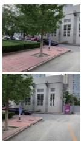  
Reference/ target image

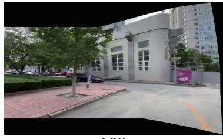  
LPC

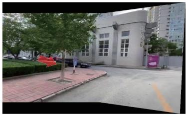  
UDIS

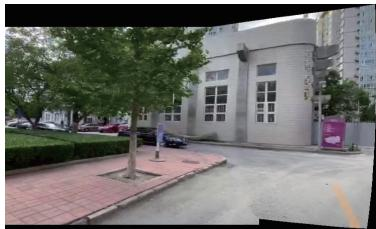  
Ours  
(a) A stitching case of large parallax from UDIS-D dataset.

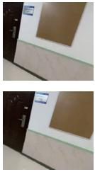  
Reference/ target image

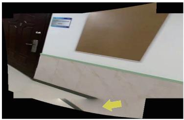  
LPC

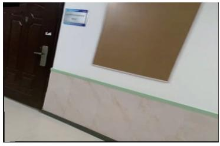  
UDIS

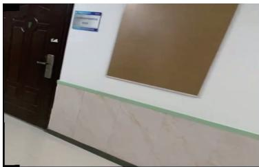  
Ours  
(b) A stitching case of low texture from UDIS-D dataset.  
Figure 1. Limitations of existing methods. (a) UDIS [41] (the SoTA of deep methods) deals with large parallax by blurring parallax regions (highlighted by the red arrow). (b) LPC [19] (the SoTA of traditional methods) fails in low-texture scenes without sufficient geometri features. Instead, our solution is free from these limitations, achieving promising results in both of the challenging circumstances.

## Abstract

Traditional image stitching approaches tend to leverage increasingly complex geometric features (e.g., point, line, edge, etc.) for better performance. However, these hand-crafted features are only suitable for specific natural scenes with adequate geometric structures. In contrast, deep stitching schemes overcome adverse conditions by adaptively learning robust semantic features, but they cannot handle large-parallax cases.

To solve these issues, we propose a parallax-tolerant unsupervised deep image stitching technique. First, we propose a robust and flexible warp to model the image registration from global homography to local thin-plate spline motion. It provides accurate alignment for overlapping regions and shape preservation for non-overlapping regions by joint optimization concerning alignment and distortion.

Subsequently, to improve the generalization capability, we design a simple but effective iterative strategy to enhance the warp adaption in cross-dataset and cross-resolution applications. Finally, to further eliminate the parallax artifacts, we propose to composite the stitched image seamlessly by unsupervised learning for seam-driven composition masks. Compared with existing methods, our solution is parallax-tolerant and free from laborious designs of complicated geometric features for specific scenes. Extensive experiments show our superiority over the SoTA methods, both quantitatively and qualitatively. The code is available at https://github com/nie-lang/UDIS2.

## 1. Introduction

Image stitching is a practical technology that aims to construct a scene with a wide field-of-view (FoV) from different images with limited FoV. It is useful in a wide range of fields, such as autonomous driving, medical imaging, surveillance videos, virtual reality, etc.

Over the past decades, traditional stitching approaches tend to adopt increasingly complicated geometric features to achieve better content alignment and shape preservation. In the beginning, SIFT [38] is widely used in various image stitching algorithms [4, 13, 50, 5, 34, 25] to extract discriminative key points and calculate adaptive warps. Then, the line segment is proved to be another unique feature to achieve better stitching quality and preserve linear structures [31, 49, 32, 19]. Recently, the large-scale edge is also introduced in [10] to preserve the contour structures. Besides, there is a great variety of other geometric features that are leveraged to improve the stitching quality, such as depth maps [33], semantic planar regions [26], etc.

Having calculated the warps, seam cutting is usually used to remove parallax artifacts. To explore an invisible seam, various energy functions are designed using colors [22], edges [35, 8], salient maps [30], depth [6], etc.

From the broad usage of geometric features, a clear developing trend has been discovered: increasingly sophisticated features are leveraged. We ask: are these complex designs practical in real applications? We attempt to answer this question from two perspectives. 1) These elaborate algorithms with complicated geometric features poorly adapt to scenes without sufficient geometric structures, such as medical images, industrial images, and other natural images with low texture (Fig.1b), low light or low resolution. 2) When there exist abundant geometric structures, the running speed is intolerant (please refer to Table 2,3 for detail). Such a trend seems to violate the “practical” original intent.

Recently, deep stitching technologies using convolutional neural networks (CNNs) have aroused widespread attention in the community. They abandon geometric features and head for high-level semantic features that can be adaptively learned in a data-driven pattern in a supervised [24, 40, 44, 47, 23], weakly-supervised [46], or unsupervised [41] manner. Although they are robust to various natural or unnatural conditions, they cannot handle large parallax and demonstrate unsatisfactory generalization in crossdataset and cross-resolution conditions. A large-parallax case is shown in Fig.1a, where the tree is in the middle of the car in the reference image while it is on the left in the target image. To deal with parallax, UDIS [41] reconstructs stitched images from feature to pixel. However, the parallax is so large that undesired blurs are produced as a side effect.

In this paper, we propose a parallax-tolerant unsupervised deep image stitching technique, addressing the robustness issue in traditional stitching and the large-parallax issue in deep stitching simultaneously. Actually, the proposed deep learning-based solution is naturally robust to various scenes due to effective semantic feature extraction. Then, it overcomes the large parallax via two stages: warp and composition. In the first stage, we propose a robust and flexible warp to model the image registration. Particularly, we simultaneously parameterize homography transformation and thin-plate spline (TPS) transformation as unified representations in a compact framework. The former offers a global linear transformation, while the latter produces local nonlinear deformation, allowing our warp to align images with parallax. Besides, this warp contributes to both content alignment and shape preservation simultaneously via combined optimization of alignment and distortion. In the second stage, the existing reconstruction-based method [41] treats artifact elimination as a reconstruction process from feature to pixel, leading to inevitable blurs around the parallax regions. To overcome this drawback, we cooperate the motivation of seam-cutting into deep composition and implicitly find a “seam” through unsupervised learning for seam-driven composition masks. To this end, we design boundary and smoothness constraints to restrict the endpoints and route of a “seam”, compositing the stitched image seamlessly. In addition to the two stages, we design a simple iterative strategy to enhance the generalization, rapidly improving the registration performance of our warp in different datasets and resolutions.

Furthermore, we conduct extensive experiments about the warp and composition, demonstrating our superiority to other SoTA solutions. The contributions center around:

• We propose a robust and flexible warp by parameterizing the homography and thin-plate spline into unified representations, realizing unsupervised content alignment and shape preservation in various scenes.

• A new composition approach is proposed to generate seamless stitched images via unsupervised learning for composition masks. Compared with the reconstruction [41], our composition eliminates parallax artifacts without introducing undesirable blurs.

• We design a simple iterative strategy to enhance warp adaption in different datasets and resolutions.

## 2. Related Work

## 2.1. Traditional Image Stitching

Adaptive warp. AutoStitch [4] leveraged SIFT [38] to extract discriminative keypoints to construct a global homography transformation. After that, SIFT becomes an indispensable feature to calculate various flexible warps, such as DHW [13], SVA [36] APAP [50], ELA [28], TFA [27] for better alignment, SPHP [5], AANAP [34], GSP [7] for better shape preservation. Then, DFW [13] adopted line segments extracted by LSD [48] with keypoints together to enrich structural information in artificial environments. Furthermore, line-guided mesh deformation [49] is designed by optimizing an energy function of various line-preserving terms [32, 19]. To preserve the nonlinear structures, the edge features are used in GES-GSP [10] to achieve a smooth transition between local alignment and structural preservation. In addition to these basic geometric features (point, line, and edge), the depth maps and semantic planes are also used to assist the feature matching using extra depth consistency [33] and planar consensus [26].

Seam cutting. The seam cutting is usually used as a post-processing operation to composite stitched images, which introduces an optimization problem of label assignment along the seam. To obtain a plausible stitched result, an extensive range of energy terms are defined by penalizing photometric differences, such as the Euclidean-metric color difference [22], gradient difference [1, 8], motion- and exposure-aware difference [11], salient difference [30], etc. Then these energy functions are minimized via graph-cut optimization [22]. Besides that, seam cutting is also applied in image alignment to find the best alignment warp with minimal seam-based cost [14, 51, 35, 29].

These complex geometric features are beneficial in natural scenes with adequate geometric structures. However, there are two drawbacks: 1) Without sufficient geometric structures, the strict feature requirements yield inferior stitching quality, even failure. 2) With excessive geometric structures, the computational cost leaps dramatically.

## 2.2. Deep Image Stitching

In contrast, deep stitching schemes are free from endless designs of geometric features. They learn to capture high-level semantic features from extensive data automatically in a supervised [24, 40, 44, 47, 23], weakly-supervised [46], or unsupervised [41] fashion, making them robust to various challenging scenes. Among them, the unsupervised one [41] is more popular due to the unavailability of real stitched labels. However, it cannot handle large parallax due to the limitation of the homography-based alignment model. The subsequent reconstruction would bring undesirable blurs around parallax regions.

## 3. Methodology

The overview of our method is shown in Fig.2, where the proposed framework is composed of two stages: warp and composition. In the first stage, our method takes a reference image $( I _ { r } )$ and a target image $\left( I _ { t } \right)$ with overlapping regions as input, and regresses a robust and flexible warp. Then the warped images $( I _ { w r } , I _ { w t } )$ are input to the second stage to predict composition masks $( M _ { c r } , M _ { c t } )$ . The stitched image (S) can be seamlessly composited as follows:

$$
S = M _ { c r } \times I _ { w r } + M _ { c t } \times I _ { w t } .\tag{1}
$$

## 3.1. Unsupervised Warp Construction

## 3.1.1 Warp Parameterization

The homography transformation is an invertible mapping from one image to another with 8 degrees of freedom: each two for translation, rotation, scale, and lines at infinity. To guarantee the non-singularity [39] in a regression network, it is commonly parameterized as the motions of four vertices [9], which is solved as a $3 \times 3$ matrix using DLT [15].

However, if a non-planar scene is captured by cameras with different shooting centers, the homography fails to achieve accurate alignment. To solve it, the mesh-based multi-homography scheme [50] is usually used in traditional stitching algorithms. But it cannot be efficiently parallel accelerated, which means it fails to be used in a deep learning framework [43, 42]. Please refer to Section 2.3 of the supplementary material for specific analysis. To overcome this issue, we propose to leverage TPS transformation [3, 18] to achieve efficient local deformation.

TPS transformation is a nonlinear, flexible transformation that is usually used to approximate the deformation of non-rigid objects using a thin plate. It is determined by two sets of control points, with a one-to-one correspondence between a flat image and a warped image. Denote N control points on a flat image as $\bar { P } = [ p _ { 1 } , . . . , p _ { N } ] ^ { T }$ and corresponding points on the warped image as $P ^ { \prime } = \overline { { [ { p } _ { 1 } ^ { \prime } , . . . , { p } _ { N } ^ { \prime } ] ^ { T } } }$ $( \bar { p } _ { i } , p _ { i } ^ { \prime } \in \mathbb { R } ^ { 2 \times 1 } )$ . By minimizing an energy function consisting of a data term and a distortion term [20] (refer to Section 2.1 ofthe supplementary materialfor more details), the TPS transformation can be parameterized as Eq.2:

$$
p ^ { \prime } = \mathcal { T } ( p ) = C + M p + \sum _ { i = 1 } ^ { N } w _ { i } O ( \Vert p - p _ { i } \Vert _ { 2 } ) ,\tag{2}
$$

where $p$ is an arbitrary point on the flat image and $p ^ { \prime }$ is the corresponding point on the warped image. $C \in \mathbb { R } ^ { 2 \times 1 }$ $M \in \mathbb { R } ^ { 2 \times 2 }$ , and $\bar { \boldsymbol { w } } _ { i } \in \mathbb { R } ^ { 2 \times 1 }$ are the transformation parameters. $O ( r ) = r ^ { 2 } l o g r ^ { 2 }$ is a radial basis function that indicates the impact of each control point on $p .$ . To solve these parameters, we formulate N data constraints using N pairs of control points according to Eq.2, and impose extra dimensional constraints [20] as described in Eq.3:

$$
\sum _ { i = 1 } ^ { N } w _ { i } = 0 a n d \sum _ { i = 1 } ^ { N } p _ { i } w _ { i } ^ { T } = 0 .\tag{3}
$$

Then, these constraints can be rewritten in the form of matrix calculation and the parameters can be solved as follows:

$$
{ \left[ \begin{array} { l } { C } \\ { M } \\ { W } \end{array} \right] } = { \left[ \begin{array} { l l l } { \mathbb { 1 } } & { P } & { K } \\ { 0 } & { 0 } & { \mathbb { 1 } ^ { T } } \\ { 0 } & { 0 } & { P ^ { T } } \end{array} \right] } ^ { - 1 } { \left[ \begin{array} { l } { P ^ { \prime } } \\ { 0 } \\ { 0 } \end{array} \right] } ,\tag{4}
$$

where  is a $N \times 1$ all-one matrix. Each element $k _ { i j }$ in $K \in \mathbb { R } ^ { N \times N }$ is determined by $O ( \parallel \mathbf { \epsilon } p _ { i } - p _ { j } \parallel _ { 2 } )$ , and $W =$ $[ w _ { i } , . . . , w _ { N } ] ^ { T }$

Similar to the 4-pt parameterization of the homography, TPS transformation can also be parameterized as the motions of control points. In this work, we define $( U + 1 ) \times$ $( V + 1 )$ control points being evenly distributed on the target image, and then predict the motions of each control point. To bridge the global homography warp with the local TPS warp, we regress the homography transformation first to provide initial motions of control points. Then we can predict the residual motions for further flexible deformation.

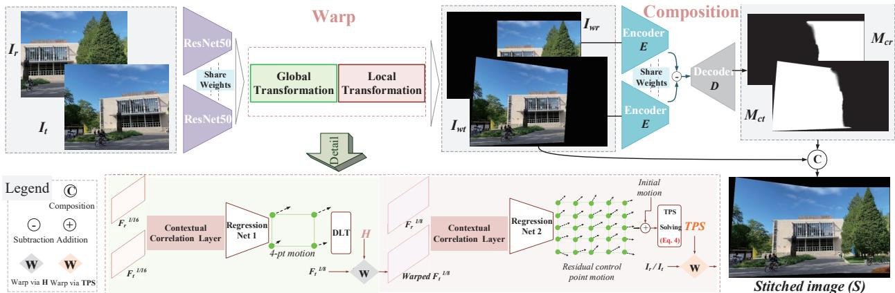  
Figure 2. An overview of the proposed parallax-tolerant unsupervised deep image stitching network. Our unsupervised framework consists of two stages: warp and composition. The first stage predicts a robust and flexible warp to align images with shape preservation. The second stage composites the seamless stitched image by generating composition masks corresponding to warped images.

## 3.1.2 Pipeline of Warp

As shown in Fig.2, given I , I , we adopt ResNet50 [17] with pretrained parameters as our backbone to extract semantic features first. It maps a 3-channel image to the highdimensional semantic features with a resolution scaled to 1/16 of the original. Then the correlation between these feature maps $( \hat { F } _ { r } ^ { 1 / 1 6 }$ and $F _ { t } ^ { 1 / 1 6 } )$ can be aggregated into 2- channel feature flows using the contextual correlation layer [43]. Subsequently, a regression network is used to estimate the 4-pt parameterization of the homography warp. This global warp also generates the initial motions of control points.

Next, we warp the feature maps with higher resolution $( \boldsymbol { F } _ { t } ^ { 1 / 8 } )$ to embed the homographic prior into the following workflow. After another contextual correlation layer and regression network, the residual motions of control points are predicted, contributing to a robust flexible TPS warp.

## 3.1.3 Optimization of Warp

To achieve content alignment and shape preservation simultaneously, we design our objective function ${ \mathcal { L } } ^ { w }$ concerning two aspects: alignment and distortion.

$$
\begin{array} { r } { \mathcal { L } ^ { w } = \mathcal { L } _ { a l i g n m e n t } ^ { w } + \omega \mathcal { L } _ { d i s t o r t i o n } ^ { w } . } \end{array}\tag{5}
$$

For the alignment, we encourage the overlapping regions to keep consistent at the pixel level. Denoting $\varphi ( \cdot , \cdot )$ is the warping operation and 1 an all-one matrix with the same

resolution as $I _ { r }$ , the alignment loss can be defined as follows:

$$
\begin{array} { r l } & { \mathcal { L } _ { a l i g n m e n t } ^ { w } = \lambda \| I _ { r } \cdot \varphi ( \mathbb { 1 } , \mathcal { H } ) - \varphi ( I _ { t } , \mathcal { H } ) \| _ { 1 } + } \\ & { \quad \quad \lambda \| I _ { t } \cdot \varphi ( \mathbb { 1 } , \mathcal { H } ^ { - 1 } ) - \varphi ( I _ { r } , \mathcal { H } ^ { - 1 } ) \| _ { 1 } + } \\ & { \quad \quad \quad \| I _ { r } \cdot \varphi ( \mathbb { 1 } , \mathcal { T } \mathcal { P } S ) - \varphi ( I _ { t } , \mathcal { T } \mathcal { P } S ) \| _ { 1 } , } \end{array}\tag{6}
$$

where and $\tau \mathcal { P } \mathcal { S }$ are warp parameters, and λ is a hyperparameter to balance the impacts of different transformations.

For the distortion, we link adjacent control points in the warped target image to form a mesh and introduce an inter-grid constraint $\ell _ { i n t e r }$ and an intra-grid constraint $\ell _ { i n t r a }$ . The former preserves geometric structures for nonoverlapping regions, while the latter reduces projective distortions. In the beginning, we approximate a similar transformation by DLT for every grid in non-overlapping regions and take the 4-pt projective error as the loss. But this constraint that is commonly used in traditional methods [16, 37] does not work in deep learning schemes. Instead, we reexplore the constraints from a more intuitive perspective — the grid edge.

Similar to [42], we penalize the grid edge e with the magnitude exceeding a threshold. Denoting $\{ \vec { e } _ { h o r } \}$ and $\{ \vec { e } _ { v e r } \}$ are the collections of horizontal and vertical edges, we describe the intra-grid constraint as follows:

$$
\begin{array} { c } { { \ell _ { i n t r a } = \displaystyle \frac { 1 } { ( U + 1 ) \times V } \sum _ { \left\{ \vec { e } _ { h o r } \right\} } \sigma ( \langle \vec { e } , \vec { i } \rangle - \frac { 2 W } { V } ) + } } \\ { { \displaystyle \frac { 1 } { U \times ( V + 1 ) } \sum _ { \left\{ \vec { e } _ { v e r } \right\} } \sigma ( \langle \vec { e } , \vec { j } \rangle - \frac { 2 H } { U } ) , } } \end{array}\tag{7}
$$

where $\overrightarrow { i } / \overrightarrow { j }$ is the horizontal/vertical unit vector, and $\sigma ( \cdot )$ is the $R E L U$ function. The projective distortions are reduced by preventing the grid shape from dramatic scaling.

By encouraging the edge pairs (successive edges in horizontal or vertical directions, denoted as $\vec { e } _ { s 1 } , \vec { e } _ { s 2 } )$ to be co-

linear, we formulate the inter-grid constraint as:

$$
\ell _ { i n t e r } = \frac { 1 } { Q } \sum _ { \{ \vec { e } _ { s 1 } , \vec { e } _ { s 2 } \} } S _ { s 1 , s 2 } \cdot ( 1 - \frac { \langle \vec { e } _ { s 1 } , \vec { e } _ { s 2 } \rangle } { \parallel \vec { e } _ { s 1 } \parallel \cdot \parallel \vec { e } _ { s 2 } \parallel } ) ,\tag{8}
$$

where $Q$ is the number of edge pairs and $S _ { s 1 , s 2 }$ is a 0-1 label that is set to 1 if this edge pair locates on non-overlapping regions. We only preserve the structures in non-overlapping regions, preventing adverse effects on the alignment.

## 3.2. Unsupervised Seamless Composition

## 3.2.1 Motivation

UDIS [41] composites a stitched image via unsupervised reconstruction from feature to pixel, but it cannot deal with large parallax. Traditional seam cutting eliminates artifacts by finding a seamless cutting path using dynamic programming [2] or graph-cut optimization [22], but it shows overreliance on photometric differences.

An intuitive idea is to cooperate the motivation of seam cutting into a learning framework. Nevertheless, how to make our unsupervised deep stitching approach work with seam cutting and be effective is a major difficulty. For example, dynamic programming is not differential; graph-cut optimization assigns absolute integers to the labels, which truncates gradients in the backpropagation. In this stage, we propose to relax the hard label to a soft mask with float numbers, innovatively supervising the generation of seaminspired masks via the balancing effect of two constraints with special designs.

## 3.2.2 Pipeline of Composition

At first, we concatenate warped images as input and exploit the UNet-like network [45] as our composition network. But this pattern coarsely mixes the features from different images. It is challenging for such a network to perceive the semantic difference between warped images.

To overcome it, we use the encoder of the network to extract semantic features from $I _ { w r }$ and $I _ { w t }$ separately with shared weights. For skip connections, we replace them by subtracting the features of $I _ { w t }$ from that of $I _ { w r }$ and delivering the residuals at each resolution to the decoder. We set the filter number and activation function of the last layer to 1 and sigmoid to predict $M _ { c r }$ for the warped reference image. The other mask $M _ { c t }$ for the warped target image can be easily obtained by simple post-processing.

## 3.2.3 Optimization of Composition

The optimization goal of our unsupervised composition includes a boundary term and a smoothness term as follows:

$$
\begin{array} { r } { \mathcal { L } ^ { c } = \alpha \mathcal { L } _ { b o u n d a r y } ^ { c } + \beta \mathcal { L } _ { s m o o t h n e s s } ^ { c } . } \end{array}\tag{9}
$$

The former indicates the start point and end point of the “seam” while the latter constrains the route.

We expect the endpoints to be the intersections of the boundaries of warped images. To achieve it, we leverage 0-1 boundary masks $M _ { b r } , M _ { b t }$ to indicate the boundary positions of overlapping regions on both sides of the “seam”. More details are available in Section 3.1 of the supplementary material. Then, we formulate the boundary loss as follows:

$$
\mathcal { L } _ { b o u n d a r y } ^ { c } = \mid \mid ( S - I _ { w r } ) \cdot M _ { b r } \mid \mid _ { 1 } + \mid \mid ( S - I _ { w t } ) \cdot M _ { b t }\tag{1 .}
$$

(10)

This loss constrains boundary pixels of overlapping regions in S from either $I _ { w r }$ or $I _ { w t }$ . However, $M _ { b r }$ and $M _ { b t }$ share common intersections, which produces ambiguity for the belongs of intersections. But it is the ambiguity that fixes the endpoints of a “seam” to the intersections.

To measure the smoothness of a seam, traditional seamcutting approaches define various energy functions with different photometric differences. In this work, we adopt the simplest photometric difference as $D = ( I _ { w r } - I _ { w t } ) ^ { 2 }$ to demonstrate our effectiveness. Then we define the smoothness on the difference map as follows:

$$
\begin{array} { r } { \ell _ { D } = \displaystyle \sum _ { i , j } | M _ { c r } ^ { i , j } - M _ { c r } ^ { i + 1 , j } | ( D ^ { i , j } + D ^ { i + 1 , j } ) + } \\ { \sum _ { i , j } | M _ { c r } ^ { i , j } - M _ { c r } ^ { i , j + 1 } | ( D ^ { i , j } + D ^ { i , j + 1 } ) , } \end{array}\tag{11}
$$

where $i , j$ are the Cartesian coordinates. To produce a smooth transition between both sides of the “seam”, we also define the smoothness of the stitched image as follows:

$$
\begin{array} { r } { \ell _ { S } = \displaystyle \sum _ { i , j } | M _ { c r } ^ { i , j } - M _ { c r } ^ { i + 1 , j } | \cdot | S ^ { i , j } - S ^ { i + 1 , j } | + } \\ { \sum _ { i , j } | M _ { c r } ^ { i , j } - M _ { c r } ^ { i , j + 1 } | \cdot | S ^ { i , j } - S ^ { i , j + 1 } | . } \end{array}\tag{12}
$$

By adding $\ell _ { D }$ and $\ell _ { S } ,$ , we formulate the complete smoothness term $\mathcal { L } _ { s m o o t h n e s s } ^ { c } .$ Note that, our network is trained to facilitate the capability to extract semantic differences. In the inference process, the proposed method no longer relies on photometric differences.

## 3.3. Iterative Warp Adaption

To transfer a pretrained model to other datasets (crossscene and cross-resolution), the most common way is to fine-tune on the new dataset. However, it usually requires labels to assist the adaption process. In this work, we address this limitation by setting an unsupervised optimization goal as follows:

$$
\mathcal { L } _ { a d a p t i o n } ^ { w } = \| I _ { r } \cdot \varphi ( \mathbb { 1 } , T \mathcal { P } S ) - \varphi ( I _ { t } , T \mathcal { P } S ) \| _ { 1 } .\tag{13}
$$

Compared with Eq. 5, we remove the homography alignment loss and distortion loss. Because these constraints have been well learned by the pretrained model, what we do is adjust the local alignment on different data.

20-th iteration  
30-th iteration  
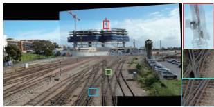  
0-th iteration

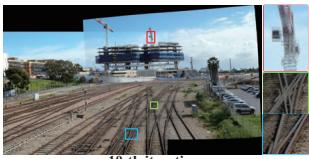

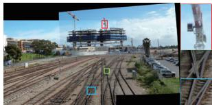

10-th iteration  
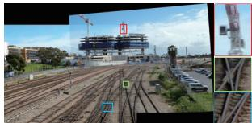  
Figure 3. We demonstrate the process of iterative warp adaption on “railtrack” dataset [50] (cross-dataset and cross-resolution). As the increase of iteration number, the artifacts are removed gradually.

Furthermore, we consider a special case that the new dataset only contains one sample. Experiments exhibit that our model can also be optimized stably for adapting to only sample in an iterative fashion. In particular, we set a threshold τ and a maximum iteration number T. The adaption process stops when the iteration number reaches T or consecutive optimization errors (Eq. 13) are lower than τ .

We show an iterative adaption example in Fig. 3, where the artifacts are significantly reduced with the increase of iteration number. It takes about 0.1s to finish an iteration.

## 4. Experiments

## 4.1. Dataset and Implement Details

Dataset: To make an intuitive and fair comparison with deep stitching methods, we also train our model on UDIS-D [41] dataset. The evaluation is conducted on UDIS-D dataset and other traditional datasets [50, 13, 34, 28, 35].

Details: We train our warp and composition networks for 100 and 50 epochs using Adam [21] with an exponentially decaying learning rate with an initial value of $1 0 ^ { - 4 }$ . For the warp stage, ω and λ are set to 10 and 3, and we adopt $( 1 2 + 1 ) \times ( 1 2 + 1 )$ control points to provide the flexible TPS transformation. For the second stage, we set α and $\beta$ to 10,000 and 1,000. As for the warp adaption, τ and T are assigned as $1 0 ^ { - 4 }$ and 50. All implementations are based on PyTorch using a single GPU with NVIDIA RTX 3090 Ti.

## 4.2. Comparative Experiments

To demonstrate our effectiveness comprehensively, we conduct extensive experiments on warp, composition, and the complete stitching framework, respectively.

## 4.2.1 Comparisons of Warp

We compare our warp with SIFT [38]+RANSAC [12] (the pipeline of AutoStitch [4]), APAP [50], ELA [28], SPW [32], LPC [19], and UDIS’s warp [41]. We implement SIFT+RANSAC by ourselves and adopt the official codes for other methods with default parameters such as mesh resolutions. All the methods, including ours, use the average fusion as the post-processing operation. Because this simple fusion is fast and can better highlight the misalignments.

Quantitative comparison: We first carry on quantitative comparisons with the same metrics as UDIS [41] on UDIS-D dataset [41] that has 1,106 samples for the evaluation. The results are shown in Table 1, where $I _ { 3 \times 3 }$ takes the identity matrix as a “no-warping” transformation for reference. The results are divided into three parts according to the performance as [41, 43]. The programs of traditional methods might crash in some challenging samples due to the lack of geometric features. When that happens, we use $I _ { 3 \times 3 }$ as an alternative transformation for the evaluation.

Qualitative comparison: Qualitative results are shown in Fig. 4, where we zoom in on two regions at different depth surfaces to highlight parallax artifacts. From this figure, our warp outperforms the other solutions by a large margin on UDIS-D dataset [41].

Cross-dataset comparison: We use the pretrained model to evaluate our performance on other datasets, as illustrated in Fig. 5. The iterative adaption strategy is used to further improve the alignment performance.

Speed comparison: To evaluate the speed objectively, we test it on three traditional public datasets [50, 34, 13] with three different resolutions. As reported in Table 2, our warp has a speed far exceeding the others with GPU acceleration, while traditional warps cannot be accelerated by GPU. For traditional mesh-based warps, the runtime does not vary linearly with the resolution, and in scenes with rich geometric features (e.g., “railTrack”), the speed becomes a disaster.

## 4.2.2 Comparisons of Composition

We compare our composition with the perceptionbased seam-cutting approach [30] and reconstruction-based method [41]. To show the parallax artifacts more intuitively, we warp the images by SIFT+RANSAC and give the results of average fusion for reference.

Qualitative comparison: Traditional seam-cutting methods find the seam by dynamic programming [2] or graphcut optimization [22]. The values in traditional masks are integers while that in ours are float. Therefore, we cannot evaluate our composition quantitatively with traditional indicators. Instead, we show qualitative results in Fig. 6. Besides, we promise to release all subjective results, including 1,106 images in UDIS-D and others in traditional datasets.

Speed comparison: Here, we warp the inputs with the proposed warp first. Then these warped images are used for speed evaluation on different composition methods. As illustrated in Table. 3, our composition shows significant speed superiority over the others with GPU acceleration.

Table 1. Quantitative comparison of warp on UDIS-D dataset [41]. The best is marked in red and the second best is in blue.
<table><tr><td rowspan="2"></td><td colspan="4">PSNR↑</td><td colspan="4">SSIM ↑</td></tr><tr><td>Easy</td><td>Moderate</td><td>Hard</td><td>Average</td><td>Easy</td><td>Moderate</td><td>Hard</td><td>Average</td></tr><tr><td>I3×3</td><td>15.87</td><td>12.76</td><td>10.68</td><td>12.86</td><td>0.530</td><td>0.286</td><td>0.146</td><td>0.303</td></tr><tr><td>SIFT[38]+RANSAC[12]</td><td>28.75</td><td>24.08</td><td>18.55</td><td>23.27</td><td>0.916</td><td>0.833</td><td>0.636</td><td>0.779</td></tr><tr><td>APAP[50]</td><td>27.96</td><td>24.39</td><td>20.21</td><td>23.79</td><td>0.901</td><td>0.837</td><td>0.682</td><td>0.794</td></tr><tr><td>ELA[28]</td><td>29.36</td><td>25.10</td><td>19.19</td><td>24.01</td><td>0.917</td><td>0.855</td><td>0.691</td><td>0.808</td></tr><tr><td>SPW[32]</td><td>26.98</td><td>22.67</td><td>16.77</td><td>21.60</td><td>0.880</td><td>0.758</td><td>0.490</td><td>0.687</td></tr><tr><td>LPC[19]</td><td>26.94</td><td>22.63</td><td>19.31</td><td>22.59</td><td>0.878</td><td>0.764</td><td>0.610</td><td>0.736</td></tr><tr><td>UDIS&#x27;s warp[41]</td><td>25.16</td><td>20.96</td><td>18.36</td><td>21.17</td><td>0.834</td><td>0.669</td><td>0.495</td><td>0.648</td></tr><tr><td>Our warp</td><td>30.19</td><td>25.84</td><td>21.57</td><td>25.43</td><td>0.933</td><td>0.875</td><td>0.739</td><td>0.838</td></tr></table>

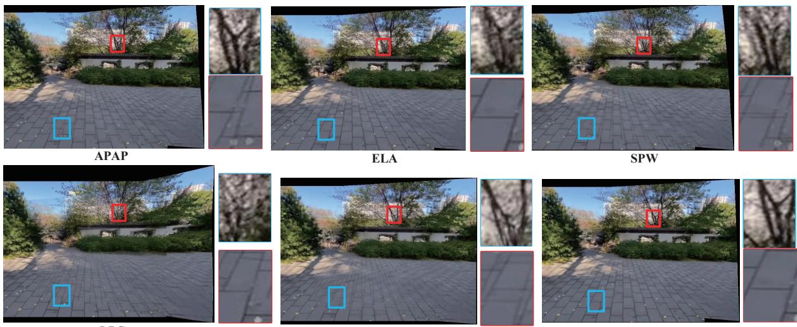  
LPC  
UDIS's warp  
Our warp  
Figure 4. Qualitative comparison of warp on UDIS-D dataset [41]. We zoom in on a near region and a far region to show the alignment performance. For clarity, we show the inputs and more comparative results in the supplementary material.

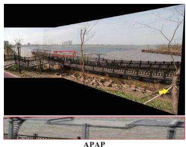  
APAP

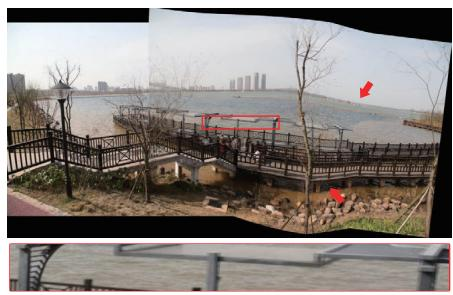  
robust ELA

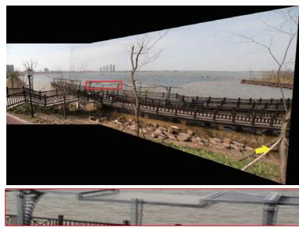  
SPW

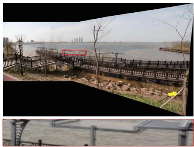  
LPC

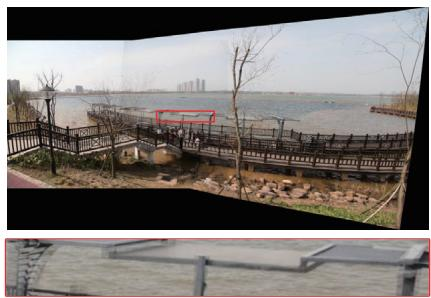  
Our warp

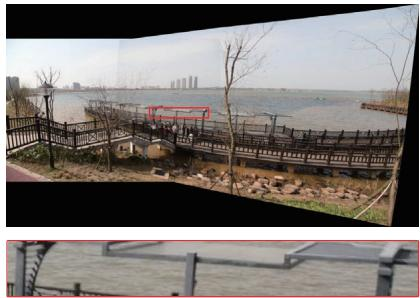  
Our warp + iterative adaption  
Figure 5. Qualitative comparison of warp on “boardingBridge” dataset [28] with a resolution of 1440 2160 for inputs. The yellow and red arrows highlight projective and structural distortions. For clarity, we show more comparative results in the supplementary material.

Reconstruction  
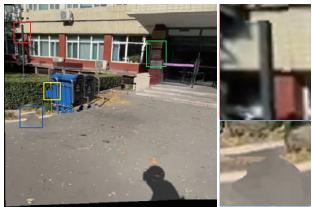

Warped images Learned masks and visualization  
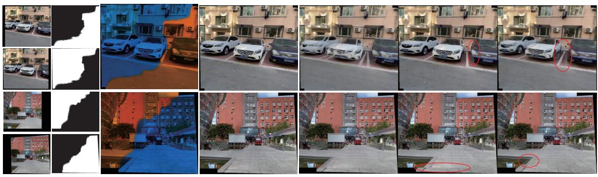  
Our compotision  
Average fusion  
Seam cutting

Figure 6. The comparison of composition. For clarity, more results are reported in the supplementary material.  
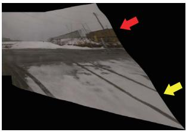

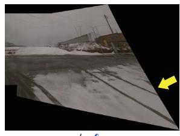  
w/o ℓintra

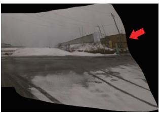  
w/o ℓinter

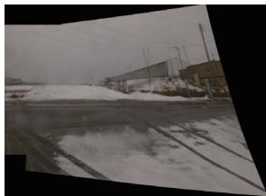  
Our warp

w/o ℓD & ℓS  
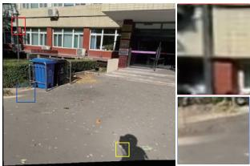  
w/o ℓD

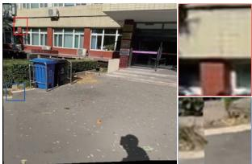  
w/o ℓS

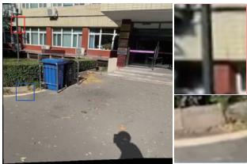  
Our Composition  
Figure 7. Ablation studies on our warp and composition. Top: the red and yellow arrows highlight the structural and projective distortions, respectively. Bottom: the rectangles indicate the discontinuous regions. The cases are from UDIS-D [41].

Table 2. Comparison of warp on elapsed time (s). 1: tested with Intel i7-9750H 2.60GHz CPU; 2: tested with NVIDIA RTX 3090Ti GPU.
<table><tr><td>Dataset</td><td>Railtrack [50]</td><td>Fence [34]</td><td>Carpark [13]</td></tr><tr><td>Resolution</td><td>1500 × 2000</td><td>1088 × 816</td><td>490 × 653</td></tr><tr><td>APAP [50]1</td><td>20.921</td><td>4.427</td><td>2.005</td></tr><tr><td>ELA [28]1</td><td>18.982</td><td>4.739</td><td>2.179</td></tr><tr><td>SPW [32]1</td><td>227.762</td><td>4.787</td><td>6.583</td></tr><tr><td>LPC [19]1</td><td>2805.3</td><td>9.115</td><td>40.443</td></tr><tr><td>Our warp1</td><td>12.073</td><td>5.025</td><td>3.486</td></tr><tr><td>Our warp2</td><td>0.731</td><td>0.210</td><td>0.117</td></tr></table>

Table 3. Comparison of composition on elapsed time (s). 1: tested with Intel i7-9750H 2.60GHz CPU; 2: tested with NVIDIA RTX 3090Ti GPU.
<table><tr><td>Dataset</td><td>Railtrack [50]</td><td>Fence [34]</td><td>Carpark [13]</td></tr><tr><td>Resolution (after warping)</td><td>1831 × 3193</td><td>1298 × 1320</td><td>718 × 1186</td></tr><tr><td>Seam cutting [30]1</td><td>46.657</td><td>4.058</td><td>0.873</td></tr><tr><td>Reconstruction [41]1</td><td>304.963</td><td>80.837</td><td>10.734</td></tr><tr><td>Our composition¹</td><td>22.778</td><td>6.666</td><td>3.286</td></tr><tr><td>Our composition²</td><td>0.532</td><td>0.143</td><td>0.071</td></tr></table>

## 4.2.3 More Comparisons

Here, we evaluate the performance of our complete stitching framework with other SoTA methods. The results are illustrated in Fig. 1, where LPC [19] and UDIS [41] adopt the perception-based seam cutting [30] and reconstruction [41] for the post-processing operations. For clarity, more experimental results including qualitative comparisons, user studies, challenging cases, and cross-dataset evaluations are depicted in the supplementary material.

## 4.3. Ablation studies

We first conduct ablation studies on different warp constraints. As shown in Fig. 7(top), the inter-gird constraint preserves the structures whiles the intra-grid one reduces projective distortions. Moreover, these constraints bring little adverse impact on alignment. Quantitative results are reported in the supplementary material.

Then we study the impacts of smoothness term in our composition. The results are shown in Fig. 7(bottom), where we highlight the discontinuous regions by rectangles. With the smoothness constraints on the difference map and stitched image, the discontinuity is significantly improved.

## 5. Conclusion

In this paper, we propose a parallax-tolerant unsupervised deep stitching solution. First, a robust flexible warp is adaptively learned for both content alignment and shape preservation. We also present the seam-inspired composition to further reduce artifacts. Besides, a simple iterative warp adaption strategy is designed to effectively enhance the generalization in cross-dataset and crossresolution cases. Compared with existing solutions, our method can address both challenging scenes and largeparallax cases. With increasingly popular GPUs, our solution exhibits incredible efficiency.

## Acknowledgement

This work was supported by the National Natural Science Foundation of China (No. 62172032, 62120106009).

## References

[1] Aseem Agarwala, Mira Dontcheva, Maneesh Agrawala, Steven Drucker, Alex Colburn, Brian Curless, David Salesin, and Michael Cohen. Interactive digital photomontage. In SIGGRAPH, pages 294–302. 2004. 3

[2] Shai Avidan and Ariel Shamir. Seam carving for contentaware image resizing. TOG, 26(3):10–es, 2007. 5, 6

[3] Fred L. Bookstein. Principal warps: Thin-plate splines and the decomposition of deformations. TPAMI, 11(6):567–585, 1989. 3

[4] Matthew Brown and David G Lowe. Automatic panoramic image stitching using invariant features. IJCV, 74(1):59–73, 2007. 2, 6

[5] Che-Han Chang, Yoichi Sato, and Yung-Yu Chuang. Shapepreserving half-projective warps for image stitching. In CVPR, pages 3254–3261, 2014. 2

[6] Xin Chen, Mei Yu, and Yang Song. Optimized seam-driven image stitching method based on scene depth information. Electronics, 11(12):1876, 2022. 2

[7] Yu-Sheng Chen and Yung-Yu Chuang. Natural image stitching with the global similarity prior. In ECCV, pages 186– 201, 2016. 2

[8] Qinyan Dai, Faming Fang, Juncheng Li, Guixu Zhang, and Aimin Zhou. Edge-guided composition network for image stitching. PR, 118:108019, 2021. 2, 3

[9] Daniel DeTone, Tomasz Malisiewicz, and Andrew Rabinovich. Deep image homography estimation. arXiv preprint arXiv:1606.03798, 2016. 3

[10] Peng Du, Jifeng Ning, Jiguang Cui, Shaoli Huang, Xinchao Wang, and Jiaxin Wang. Geometric structure preserving warp for natural image stitching. In CVPR, pages 3688– 3696, 2022. 2, 3

[11] Ashley Eden, Matthew Uyttendaele, and Richard Szeliski. Seamless image stitching of scenes with large motions and exposure differences. In CVPR, pages 2498–2505, 2006. 3

[12] Martin A Fischler and Robert C Bolles. Random sample consensus: a paradigm for model fitting with applications to

image analysis and automated cartography. Communications ofthe ACM, 24(6):381–395, 1981. 6, 7

[13] Junhong Gao, Seon Joo Kim, and Michael S Brown. Constructing image panoramas using dual-homography warping. In CVPR, pages 49–56, 2011. 2, 6, 8

[14] Junhong Gao, Yu Li, Tat-Jun Chin, and Michael S Brown. Seam-driven image stitching. In Eurographics, pages 45–48, 2013. 3

[15] Richard Hartley and Andrew Zisserman. Multiple view geometry in computer vision. Cambridge university press, 2003. 3

[16] Kaiming He, Huiwen Chang, and Jian Sun. Rectangling panoramic images via warping. TOG, 32(4):1–10, 2013. 4

[17] Kaiming He, Xiangyu Zhang, Shaoqing Ren, and Jian Sun. Deep residual learning for image recognition. In CVPR, pages 770–778, 2016. 4

[18] Max Jaderberg, Karen Simonyan, Andrew Zisserman, et al. Spatial transformer networks. NIPS, 28, 2015. 3

[19] Qi Jia, ZhengJun Li, Xin Fan, Haotian Zhao, Shiyu Teng, Xinchen Ye, and Longin Jan Latecki. Leveraging line-point consistence to preserve structures for wide parallax image stitching. In CVPR, pages 12186–12195, 2021. 1, 2, 6, 7, 8

[20] JT Kent and KV Mardia. The link between kriging and thinplate splines. Probability, Statistics and Optimization, pages 326–339, 1994. 3

[21] Diederik P Kingma and Jimmy Ba. Adam: A method for stochastic optimization. arXiv preprint arXiv:1412.6980, 2014. 6

[22] Vivek Kwatra, Arno Schodl, Irfan Essa, Greg Turk, and¨ Aaron Bobick. Graphcut textures: Image and video synthesis using graph cuts. TOG, 22(3):277–286, 2003. 2, 3, 5, 6

[23] Hyeokjun Kweon, Hyeonseong Kim, Yoonsu Kang, Youngho Yoon, Wooseong Jeong, and Kuk-Jin Yoon. Pixelwise deep image stitching. arXiv preprint arXiv:2112.06171, 2021. 2, 3

[24] Wei-Sheng Lai, Orazio Gallo, Jinwei Gu, Deqing Sun, Ming-Hsuan Yang, and Jan Kautz. Video stitching for linear camera arrays. arXiv preprint arXiv:1907.13622, 2019. 2, 3

[25] Kyu-Yul Lee and Jae-Young Sim. Warping residual based image stitching for large parallax. In CVPR, pages 8198– 8206, 2020. 2

[26] Aocheng Li, Jie Guo, and Yanwen Guo. Image stitching based on semantic planar region consensus. TIP, 30:5545– 5558, 2021. 2, 3

[27] Jing Li, Baosong Deng, Rongfu Tang, Zhengming Wang, and Ye Yan. Local-adaptive image alignment based on triangular facet approximation. TIP, 29:2356–2369, 2019. 2

[28] Jing Li, Zhengming Wang, Shiming Lai, Yongping Zhai, and Maojun Zhang. Parallax-tolerant image stitching based on robust elastic warping. TMM, 20(7):1672–1687, 2017. 2, 6, 7, 8

[29] Jiaxue Li and Yicong Zhou. Automatic color image stitching using quaternion rank-1 alignment. In CVPR, pages 19720– 19729, 2022. 3

[30] Nan Li, Tianli Liao, and Chao Wang. Perception-based seam cutting for image stitching. Signal, Image and Video Processing, 12(5):967–974, 2018. 2, 3, 6, 8

[31] Shiwei Li, Lu Yuan, Jian Sun, and Long Quan. Dual-feature warping-based motion model estimation. In ICCV, pages 4283–4291, 2015. 2

[32] Tianli Liao and Nan Li. Single-perspective warps in natural image stitching. TIP, 29:724–735, 2019. 2, 6, 7, 8

[33] Tianli Liao and Nan Li. Natural image stitching using depth maps. arXiv preprint arXiv:2202.06276, 2022. 2, 3

[34] Chung-Ching Lin, Sharathchandra U Pankanti, Karthikeyan Natesan Ramamurthy, and Aleksandr Y Aravkin. Adaptive as-natural-as-possible image stitching. In CVPR, pages 1155–1163, 2015. 2, 6, 8

[35] Kaimo Lin, Nianjuan Jiang, Loong-Fah Cheong, Minh Do, and Jiangbo Lu. Seagull: Seam-guided local alignment for parallax-tolerant image stitching. In ECCV, pages 370–385, 2016. 2, 3, 6

[36] Wen-Yan Lin, Siying Liu, Yasuyuki Matsushita, Tian-Tsong Ng, and Loong-Fah Cheong. Smoothly varying affine stitching. In CVPR, pages 345–352, 2011. 2

[37] Feng Liu, Michael Gleicher, Hailin Jin, and Aseem Agarwala. Content-preserving warps for 3d video stabilization. TOG, 28(3):1–9, 2009. 4

[38] David G Lowe. Distinctive image features from scaleinvariant keypoints. IJCV, 60(2):91–110, 2004. 2, 6, 7

[39] Ty Nguyen, Steven W Chen, Shreyas S Shivakumar, Camillo Jose Taylor, and Vijay Kumar. Unsupervised deep homography: A fast and robust homography estimation model. IEEE Robotics and Automation Letters, 3(3):2346– 2353, 2018. 3

[40] Lang Nie, Chunyu Lin, Kang Liao, Meiqin Liu, and Yao Zhao. A view-free image stitching network based on global homography. Journal of Visual Communication and Image Representation, 73:102950, 2020. 2, 3

[41] Lang Nie, Chunyu Lin, Kang Liao, Shuaicheng Liu, and Yao Zhao. Unsupervised deep image stitching: Reconstructing stitched features to images. TIP, 30:6184–6197, 2021. 1, 2, 3, 5, 6, 7, 8

[42] Lang Nie, Chunyu Lin, Kang Liao, Shuaicheng Liu, and Yao Zhao. Deep rectangling for image stitching: A learning baseline. In CVPR, pages 5740–5748, 2022. 3, 4

[43] Lang Nie, Chunyu Lin, Kang Liao, Shuaicheng Liu, and Yao Zhao. Depth-aware multi-grid deep homography estimation with contextual correlation. CSVT, 32(7):4460–4472, 2022. 3, 4, 6

[44] Lang Nie, Chunyu Lin, Kang Liao, and Yao Zhao. Learning edge-preserved image stitching from multi-scale deep homography. Neurocomputing, 491:533–543, 2022. 2, 3

[45] Olaf Ronneberger, Philipp Fischer, and Thomas Brox. Unet: Convolutional networks for biomedical image segmentation. In International Conference on Medical image computing and computer-assisted intervention, pages 234–241. Springer, 2015. 5

[46] Dae-Young Song, Geonsoo Lee, HeeKyung Lee, Gi-Mun Um, and Donghyeon Cho. Weakly-supervised stitching network for real-world panoramic image generation. arXiv preprint arXiv:2209.05968, 2022. 2, 3

[47] Dae-Young Song, Gi-Mun Um, Hee Kyung Lee, and Donghyeon Cho. End-to-end image stitching network via multi-homography estimation. SPL, 28:763–767, 2021. 2, 3

[48] Rafael Grompone Von Gioi, Jeremie Jakubowicz, Jean-Michel Morel, and Gregory Randall. Lsd: A fast line segment detector with a false detection control. TPAMI, 32(4):722–732, 2008. 2

[49] Tian-Zhu Xiang, Gui-Song Xia, Xiang Bai, and Liangpei Zhang. Image stitching by line-guided local warping with global similarity constraint. PR, 83:481–497, 2018. 2

[50] Julio Zaragoza, Tat-Jun Chin, Michael S Brown, and David Suter. As-projective-as-possible image stitching with moving dlt. In CVPR, pages 2339–2346, 2013. 2, 3, 6, 7, 8

[51] Fan Zhang and Feng Liu. Parallax-tolerant image stitching. In CVPR, pages 3262–3269, 2014. 3