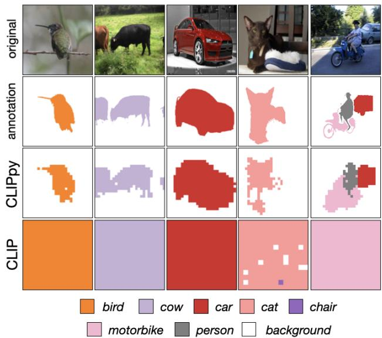
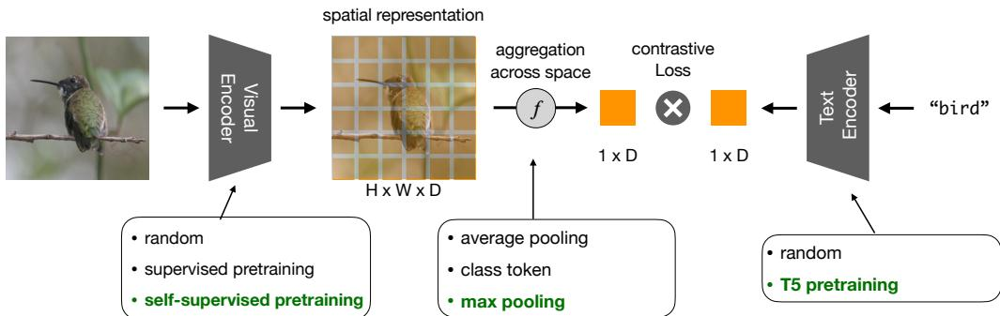
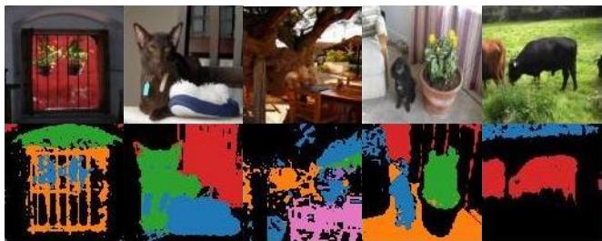
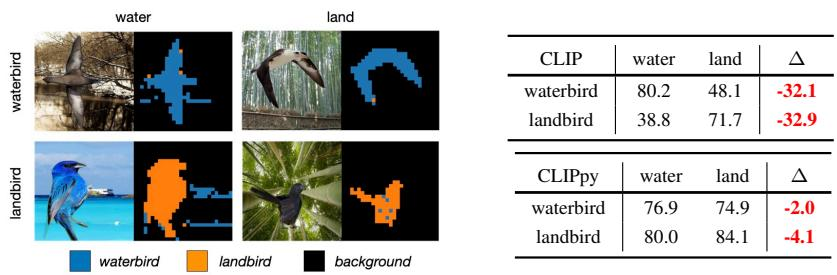
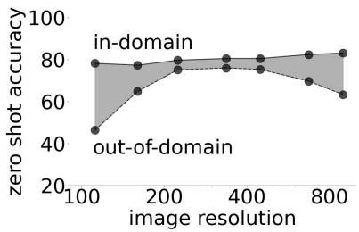

# Perceptual Grouping in Contrastive Vision-Language Models

Kanchana Ranasinghe\* , Brandon McKinzie, Sachin Ravi, Yinfei Yang, Alexander Toshev, Jonathon Shlens† Apple

kranasinghe@cs.stonybrook.edu

## Abstract

Recent advances in zero-shot image recognition suggest that vision-language models learn generic visual representations with a high degree ofsemantic information that may be arbitrarily probed with natural language phrases. Understanding an image, however, is notjust about understanding what content resides within an image, but importantly, where that content resides. In this work we examine how well visionlanguage models are able to understand where objects reside within an image and group together visually related parts of the imagery. We demonstrate how contemporary vision and language representation learning models based on contrastive losses and large web-based data capture limited object localization information. We propose a minimal set of modifications that results in models that uniquely learn both semantic and spatial information. We measure this performance in terms of zero-shot image recognition, unsupervised bottom-up and top-down semantic segmentations, as well as robustness analyses. We find that the resulting model achieves state-of-the-art results in terms of unsupervised segmentation, and demonstrate that the learned representations are uniquely robust to spurious correlations in datasets designed to probe the causal behavior ofvision models.

## 1. Introduction

Learning a representation for visual imagery requires resolving not only what resides within an image, but also where that information resides [72]. In many applications, knowledge of where information resides is sometimes more important than a precise description of the content [33, 98]. Hence, our ability to learn more generic and robust visual representations requires learning the geometry of visual semantics, and how visual information may be grounded by specific regions of the visual field.

While recent vision-language models trained under weak supervision demonstrate a remarkable ability to learn generic and transferable visual representations [50, 85, 117, 24], they showcase a profound inability to associate visual content with individual objects (Fig. 1, bottom row). In other words, models trained on large weakly-supervised data have a limited ability to group together visually related content [36]. Because the representations have a poor understanding of where an object resides, they easily conflate background with foreground content. Hence, the learned representations are unable to learn the spatial layout of a scene [97, 101], and are susceptible to learning spurious correlations between a semantic label and extraneous content [91, 65].

  
Figure 1: Semantic localization in contrastive VLMs. We measure the ability of vision-language models to predict a label at each spatial position in a zero shot manner based on the similarity of location tokens to the corresponding language tokens on selected examples. CLIP / ALIGN [50, 85] have minimal understanding of the spatial location of individual objects (row 4). Our proposed CLIPpy (row 3) predicts the label at locations that correspond closely to human annotation for semantic segmentation (row 2). All predictions were performed with no access to any segmentation data during training or inference. More visualizations in App. B.

Recent work [113, 114] attempts to bridge this gap through grouping mechanisms under the same weakly supervised training paradigm, but focus more on foreground objects (neglecting background classes). Another direction is task specific unsupervised fine-tuning [126, 26] which loses the generic and transferable nature of these representations.

In this work, we explore vision-language models that learn from similar weakly labeled data, but a) retain the generic and transferable nature of features, and b) learns where all (background and foreground) visual content resides within an image. Unlike previous attempts using grouping specific architectures [113, 114] or dense human annotations [36, 38, 57], we explore a minimal set of modifications to existing CLIP models [85] that leads to grouping of visual imagery while retaining their weakly supervised and scalable training procedure. We find that two small adjustments – employing specific pretraining strategies and adjusting spatial feature aggregation – results in models that are equally effective in zero-shot image recognition, but also retain spatial information regarding object locations (see Fig. 1, 3rd row).

The resulting model termed CLIPpy exhibits perceptual grouping – that is, the ability to select and combine related visual signals into semantically meaningful regions [110, 72, 89]. Endowing models with perceptual grouping – whether in a bottom up (based solely on visual content) or top down (guided by external information, language in this case) manner – in learned representations has been a long standing goal in computer vision [70, 71]. In this work, our key contributions are as follows:

• Identify systematic failure of contrastive vision-language models [85, 50] to properly identify where objects reside within an image, and group semantically related content.

• Design a minimal set of changes to endow these model with perceptual grouping, resulting in state-of-the-art zeroshot segmentation without training on any segmentation data or performing task specific fine-tuning.

• Emergence of localization ability in our models uniquely leads to robustness to counterfactual manipulations. The degree of robustness matches if not surpasses previous state-of-the-art supervised learning methods employing specialized training methodologies.

## 2. Related Work

Vision-language models for grounding. Contrastive language image pre-training [85] (CLIP) led to a range of follow up work performing open-vocabulary detection [38, 51, 58, 59, 120, 28] or segmentation [36, 57, 122]. While these methods leverage dense human annotations for training, an alternate line of works [113, 114, 126, 115, 22] attempt to learn alignment between regions of images and language with only image level noisy captions for supervision. Their weak supervision allows better scalability (to more data) leading to learning more generic and transferable representations. In fact, multiple such works [113, 114, 126, 26, 57] perform zero-shot semantic segmentation. However, unlike [113, 114] geared to segment a fixed count of foreground objects, our proposed CLIPpy can better segment arbitrary object counts and background classes. In contrast to [126] using generic image level features, CLIPpy explicitly learns local features during training. Moreover, CLIPpy requires no dense human annotations or task-specific fine-tuning in contrast to [26, 57]. We also highlight how [113, 114, 26] perform grouping independent of language at inference - however CLIPpy can group conditioned on language, capturing variable object boundaries for different language prompts.

<table><tr><td>Component</td><td>CLIP [85]</td><td>CLIP†</td><td>CLIPpy</td></tr><tr><td>Image Backbone</td><td>ViT-B/16</td><td>ViT-B/16</td><td>ViT-B/16</td></tr><tr><td>Text Backbone</td><td>T-B</td><td>T-5</td><td>T-5</td></tr><tr><td>Image Init</td><td>Random</td><td>Random</td><td>DINO</td></tr><tr><td>Text Init</td><td>Random</td><td>Random</td><td>Sent T-5</td></tr><tr><td>Image Pooling</td><td>CLS</td><td>CLS</td><td>Max</td></tr><tr><td>Text Pooling</td><td>Avg</td><td>Avg</td><td>Avg</td></tr><tr><td>Dataset</td><td>300M*</td><td>CC-12M</td><td>CC-12M</td></tr><tr><td>VOC mIoU (%)</td><td>16.4</td><td>17.5</td><td>50.8 (+33.3)</td></tr><tr><td>VOC JS (%)</td><td>28.6</td><td></td><td></td></tr><tr><td></td><td></td><td>37.3</td><td>47.5 (+10.2)</td></tr></table>

Table 1: We highlight the minimal differences of CLIPy from CLIP. CLIP† is our implementation following train settings identical to CLIPpy. ⇤indicates OpenAI private data.

Multiple contemporary works also explore similar directions as CLIPpy, leveraging pre-trained vision-language models for various grouping tasks under weak supervision (no pixel level annotation) [123, 68, 13, 75, 9, 52]. Combining self-supervised methods that emerge grouping [12] with CLIP models [85] for cross-modal alignment is explored in [123] gaining notable improvements at object boundaries. A clustering mechanism containing learnable centres similar to [113] is combined with reconstruction and super-pixel alignment losses to achieve grouping in [68]. Learning decoder networks over a frozen CLIP backbone [85] with text to image patch similarity losses are explored in [13, 75] resulting in similar grouping behaviour. In contrast to these methods utilizing contrastive vision language training to emerge grouping, recent works [9, 52] also showcase how text-toimage generative models (particularly Stable Diffusion [90]) can be leveraged to perform visual grouping.

Zero-shot semantic segmentation. A form of top-down grouping, this relatively new task [124, 48, 111, 8, 79, 45, 60, 3, 95] attempts to segment unseen classes, usually after a supervised training phase often involving dense annotation based supervision. Following two early representative works [111, 8], most later approaches [60, 39, 40, 53, 95, 102] formulate the task as a pixel-level zero-shot classification problem with a closed set vocabulary. While CLIPpy follows a similar pixel based formulation, in contrast, our method requires no dense human annotations for supervision, no task specific fine-tuning, and is open-vocabulary. Recent work [26, 58] also explores region-level classification leveraging pre-trained CLIP models [85], but unlike CLIPpy perform grouping independent of language during inference.

  
Figure 2: Architecture diagram. Images and captions are separately embedded into Euclidean spaces, where image features are spatially aggregated. A contrastive loss trains the aggregated image embedding to be close to the caption embedding. We demonstrate that two minimal design decisions (indicated in green) are of paramount importance for CLIP [85] models to perform perceptual grouping under image-level weak supervision.

Unsupervised segmentation. Analogous to bottom-up grouping, these works perform class-agnostic segmentation within the visual modality with no explicit language alignment [12, 41, 31, 49, 73]. This topic has a long, rich history in human visual perception [110] and computer vision [70], and has been explored as means of generalizing to new visual domains [84, 71]. It is this goal that most closely inspires our work. Early efforts group pixels based on known spatiallylocal affinities [19, 96, 88], with subsequent methods leading to region proposal networks for object detection [103] and advances in semantic segmentation [1]. Recent methods employ self-supervision to learn perceptual grouping [18, 41] or object-centric groupings [29, 66, 109, 4, 44]. Our proposed CLIPpy demonstrates competitive performance, but additionally aligns groups to the language modality explicitly.

Learning robust visual representations. For a long time, ImageNet [23] accuracy was believed to provide a reasonable proxy for quality of learned visual representations [37, 55]. However, recent work highlights notable deficiencies in such learned representations [34, 87, 54] including sensitivity to low level textures, failure for domain shifts, and reliance on spurious correlations. These failures inspired a large literature to mitigate learning spurious correlations [91, 65, 2] by focusing on new optimization techniques. Progress on this issue may address parallel issues in fairness [21]. Resulting methods have largely focused on synthetic data, re-balancing data, and shaping learned embeddings [76, 65]. Nonetheless, theoretical results suggest pessimistic bounds unless additional structure informs the problem (see refs. in [91]). Therein, the structured output predictions of proposed CLIPpy provide another promising solution.

## 3. Methodology

We first set the stage by discussing established core architectures and the contrastive learning formulation. Next, we discuss modifications that are the focus of the analysis in this work. In particular, we discuss aggregation options, pre-training alternatives, and token sub-sampling.

## 3.1. Architecture and Training

We provide a quick overview of our architecture (Fig. 2). Consider a batch size N, spatial height H, spatial width W, and depth D. X is a tensor that has a shape of [N, H, W, D] and is the output of an image encoder. Y is a tensor that is of shape [N, D] and is the output of a text encoder.

Language Model. We employ a strong language model baseline derived from the transformer architecture [104] and implemented in T5 [86]. T5 models use an encoder-decoder architecture that is trained using a generative span corruption task, and have achieved state-of-the-art on a broad range of NLP tasks including GLUE [106] and Super-Glue [105]. We use the encoder only and discard the decoder part. We employ the T5-base which consists of 12 transformer layers, 12 attention heads, and 768 token channel dimensions.

Image Model. We explore two architectures for image featurization, CNN-based and Vision-Transformers, although we focus the majority of work on the latter. First, we employ the EfficientNet architecture [100] as a high performant CNN architecture, which has been used previously in vision-language models. The specifics of the meta-architecture were derived from considerations based on neural architecture search. Second, we employ the Vision Transformer (ViT) architecture [27]. We refer the reader to [27, 104] for details. Briefly, ViT is largely inherited from the NLP literature and consists of a hierarchical associative memory. Each layer, termed a transformer, is composed of a Multi-headed Self-Attention (MSA) layer followed by a 2-layer feed-forward multi-layer perceptron (MLP). The primary parameter of ViT is the patch size P specifying the P P patch of pixels constituting a token in the architecture.

Contrastive Representation Learning. Let xi and yi denote the image and text embeddings (post aggregation) of the i’th example in the batch. A contrastive loss may be specified as the cross entropy across a batch [85, 50]. The cross entropy is calculated between a one-hot encoding specifying the correspondence between the image and text examples, and a softmax-normalized distribution specifying the dotproduct similarity between image and text embeddings.

$$
L = \underbrace { - { \frac { 1 } { N } } \sum _ { i = 1 } ^ { N } \log { \frac { \exp ( x _ { i } ^ { \top } y _ { i } / \tau ) } { \sum _ { j = 1 } ^ { N } \exp ( x _ { i } ^ { \top } y _ { j } / \tau ) } } } _ { \mathrm { i m a g e - t o - t r a t } } + \underbrace { - { \frac { 1 } { N } } \sum _ { i = 1 } ^ { N } \log { \frac { \exp ( y _ { i } ^ { \top } x _ { i } / \tau ) } { \sum _ { j = 1 } ^ { N } \exp ( y _ { i } ^ { \top } x _ { j } / \tau ) } } } _ { \mathrm { t e x t - t o - i n a g e } }
$$

The normalization for the image-to-text and text-toimage similarity is computed by summing over the potential matches (indexed by j) to the text and image examples within a batch, respectively. Note that ⌧ is the temperature of the softmax for the normalization.

## 3.2. Aggregation

The goal of the aggregation method is to collapse the image embedding from a [H, W, D] tensor to a D dimensional vector. Average pooling across space is an established technique for ensuring that the final embedding is independent of the image resolution [99, 67], and has been adopted for CNNbased architectures in vision-language models [50]. Alternatively, maximum pooling has been explored, in particular with success for point clouds [83] and image-audio [42]. Another approach typical for ViT borrowed from language modeling [25] is the class token (CLS), which is prepended to the image patch tokens [27]. A class token learns an embedding that aggregates information across all patch tokens in order to predict the image label. The class token may be used to summarize the content for an entire image for ViTbased models [85, 12]. Subsequent work in vision-language models has explored learning pooling strategies [15, 115], heuristically selecting a set of similar neighbors [118] or learning attention-based mechanisms [117].

In this work we systematically explore these aggregation strategies. In early experiments we found that many complex strategies for aggregation yielded poor results (App. A.2). We found that the application of max pooling across the spatial dimensions – while extremely simple – was also by far the most effective (Sec. 4.5). We hypothesize that the success of max pooling may be due to the gradient updates being focused solely on a single spatial location, and not spread across all spatial dimensions.

Why Max Pooling? In particular, the max pooling operation allows pre-aggregation features (shaped [N, H, W, D]) to determine the spatial location for gradient updates at each step, conditioned on input images. Across different images containing a common object at different spatial locations, the model has to select a conservative and minimal set of spatia locations for gradient updates. At the same time, given the cross-modal contrastive train objective, the aggregated feature of each such image must be aligned towards a common language concept (i.e. related to the common object). We hypothesize that gradient updates at the common object’s spatial location is the simplest optimization for the train objective in this case, leading to observed perceptual grouping.

## 3.3. Pretraining

Language Model. For better sentence level representation, we utilize pre-training from Sentence-T5 [78] which adapts a T5 encoder to sentence level embedding using a contrastive objective. We select Sentence-T5 over autoregressive models such as [25, 7] because this contrastive loss is aligned to our setup. The model is trained on Stanford Natural Language Inference (SNLI) dataset with 275K examples focused on entailment questions [6, 32].

Image Model. We investigate initializing the image model with several methods. First, we investigate initializing the image model using supervised pre-training and removing the final layer for logistic regression [37, 55]. We next investigate self-supervised methods derived from selfdistillation (e.g. [12]). We focused on this latter direction because such models demonstrated impressive performance in terms of localization [12, 41]. All image pre-training is performed on ImageNet-1K [23] dataset.

Suitable Visual Pre-training. The visual encoder representation space can be viewed as containing per-image features (post-aggregation) vs per-spatial location features (pre-aggregation). We hypothesize that semantics tied boundaries of this representation space should operate at the latter granularity to induce perceptual grouping. Furthermore, we suggest that initializations facilitating the former will detriment grouping behaviour. In particular, visual pre-training strategies separating image-level representations by semantics (e.g. supervised ImageNet pre-training) will diminish perceptual grouping. Self-supervised pre-training strategies focused on more granular within image representations (e.g. [12]) will tend to enhance perceptual grouping. This hypothesis is empirically validated in ablations (see Table 8).

## 3.4. Visual Token Sub-Sampling

Motivated by vision transformers’ ability to process sequences of length different to train time, we generate higher resolution segmentations during inference by sampling more image patches. In order to increase robustness to such varying resolution, we utilize up to 2 higher resolution images during training but randomly drop 80% of visual tokens to minimize additional compute overhead (similar to [43, 62]). While improving segmentations, this also provides training stability possibly due to its regularizing effect (see App. D).

## 3.5. Inference

CLIPpy performs inference under 3 different settings: a) classification, b) bottom-up grouping, and c) top-down grouping. On the visual modality, the first utilizes a spatially aggregated single per-image token while the latter two utilize sets of per-region tokens. Classification follows zero-shot analyses from [85] where the model is prompted at inference for a selection of labels (App. I for prompts). Bottom-up grouping follows a form of spectral clustering inspired by [12] (refer to their demo). PCA on image features (from visual encoder pre-aggregation) gives top n(=8) principal components, which are used as cluster centers. Each of those same image features are assigned to one of the n clusters based on proximity (cosine similarity) to the centers, resulting in n clusters (or groups). Top-down grouping employs zero shot analysis similar to [85], but at each spatial location, using the per-region tokens. This is similar to [35] and generates predictions across space exploiting the transitive property of our aggregation operations.

## 4. Experiments

Experimental Setup. We train our models on two datasets: Conceptual Captions 12M (CC-12M) [14] and High Quality Image Text Pairs (HQITP-134M) consisting of 12 million and 134 million image-text pairs, respectively (App. C for details). For both datasets, text is tokenized, and images resized and center cropped to 224 224 pixels. We report results on EfficientNet-B5 employed by ALIGN [50], and ViT-B/16 employed by CLIP [85] although we focus more on the latter. We train models on 32 GPUs across 4 machines with PyTorch [80]. See App. D for more details. We evaluate across image classification, localization, and robustness tasks. For image classification, we employ the validation splits of ImageNet [23] and ImageNet-v2 [87], and for robustness we employ the test split of Waterbirds [91]. These datasets contain 1000, 1000, and 3 classes respectively. For segmentation tasks, we employ the validation splits of PASCAL VOC [30], ADE20K [125, 17], COCO [64], COCO (Obj) [64], and Cityscapes [20]. Each of these datasets contain 20, 150, 133, 80, and 27 labels, respectively.

Baselines for comparison. Given that most competitive baselines are trained on private datasets, we first attempt to reproduce results by training models on a corpus of imagetext pairs. In more detail, we train on the public CC-12M dataset [14] to provide reproducible numbers and observe competitive performance given our data limitations. We also train on the larger HQITP-134M dataset to verify scalability.

We first measure the performance of CLIP [85] and ALIGN [50] on zero-shot image classification on ImageNet and ImageNet-v2. Table 2 highlights these results. We take this as a starting point for subsequent work. In the following experiments we attempt to address the following questions:

• What are the limitations of current vision-language models? (Fig. 1)

• Do we observe perceptual grouping in vision language models? (Tabs. 3, 4 and 6).

• How resilient are vision-language models to counterfactual manipulations? (Fig. 4).

• How important are each of the proposed model modifications? (Tabs. 7 to 10).

<table><tr><td></td><td>Dataset</td><td>IN</td><td>IN-v2</td></tr><tr><td>ALIGN [50] CLIP [85]</td><td>ALIGN-1800M CLIP-400M</td><td>76.4 65.5</td><td>70.1 60.8</td></tr><tr><td>CLIP †</td><td>CC-12M</td><td>46.0</td><td>40.3</td></tr><tr><td>GroupViT [113]</td><td>CC-12M+YFCC</td><td>42.9</td><td>-</td></tr><tr><td>GroupViT †</td><td>CC-12M</td><td>25.6</td><td>23.8</td></tr><tr><td>CLIPpy</td><td>CC-12M</td><td>45.3</td><td>40.0</td></tr><tr><td>ALIGN†</td><td>HQITP-134M</td><td>51.1</td><td>45.6</td></tr><tr><td>CLIP†</td><td>HQITP-134M</td><td></td><td></td></tr><tr><td></td><td></td><td>61.4</td><td>56.4</td></tr><tr><td>CLIPpy</td><td>HQITP-134M</td><td>60.3</td><td>54.8</td></tr></table>

Table 2: CLIPpy achieves competitive zero-shot image recognition. IN and IN-v2 denote ImageNet and ImageNet-v2 accuracy, respectively. † indicates our implementation. [50] evaluated at 640 640; others evaluated at 224 224. CLIPpy shows 0.5 and 0.9 IN acc. (5 runs) on CC-12M and HQITP-134M, respectively.

## 4.1. Limitations of vision-language models

Visual representations learned in vision-language models exhibit an impressive ability to generalize across tasks [85, 50]. However they also exhibit a profound shortcoming – learned visual representations maintain minimal information about where an object resides, failing to properly recognize what parts of an image constitute an object.

Fig. 1 (bottom row) showcases failure of a CLIP model; namely, the model improperly conflates visual content not associated with an object with the actual object. This can be observed by measuring the similarity of each embedding at each spatial location with a label set using the method in [35] (Sec. 3.5). One consistently observes that the central object of interest is incorrectly predicted to reside at every spatial location. For instance, in the left example, the CLIP model predicts that a bird resides at every spatial location. In a CNN architecture, where spatial information is inherently preserved, we observe some improvement, but the larger issue of poor localization remains (see App. E for details).

This failure of vision-language models to properly understand the spatial organization of information is consistent with earlier observations. Ablation experiments in ViT models demonstrated that removing positional embeddings minimally detriments predictive performance [27, 77, 121, 97]. Without positional information, ViT models effectively learn representations as a “bag of image patches”, ignoring the spatial organization.

In contrast, if we perform the same analysis on CLIPpy, we see that the model retains significant information about spatial information (Fig. 1, 3rd row). We take these visual izations as an impetus for further investigation. In particular, we start by quantifying the ability of the model to arbitrarily group together semantically related pixels, and compare this to previous works.

  
Figure 3: Visualizations of bottom-up grouping by CLIPpy. Each color represents one grouping learned on a given image.

## 4.2. Emergence of Bottom-Up Perceptual Grouping

Unsupervised segmentation performance is a direct measure of bottom up perceptual grouping. We apply CLIPpy at test time to perform semantic segmentation without prompting it for any labels 1. Fig. 3 shows how the model visually groups semantically related regions of an image (see also Fig. 5 in App.) as the image embeddings naturally group into spatially distinct clusters mirroring the image structure. We emphasize that this analysis does not rely on text prompts nor segmentation labels, but merely emerges from the image features alone. Hence the model has learned to group perceptually related pixels merely based on the pixel content and associated image-level captions during training.

We quantify the accuracy of this bottom-up segmentation to capture known segmentations within annotated images. Following evaluation protocol in [12, 113], we compute the Jaccard Similarity (JS). JS here measures the average intersection over the union across all segmentation instances regardless of object category. Our results in Tabs. 3 to 5 demonstrate competitive performance by CLIPpy. In VOC, CLIPpy achieves 54.6% outperforming all previous models; in comparison, CLIP achieves 38.9%. Additionally, on two more challenging datasets we note how the model drops in performance relatively, perhaps indicative of more visually cluttered scenes (Tab. 4). Our intuition for CLIPpy improving over CLIP is that CLS and average pooling breaks spatial structure of features, mixing image-level features across features at all spatial locations. We take these results to indicate that CLIPpy perceptually groups semantically related content better than previous work, providing state-of-the-art results in unsupervised segmentation.

## 4.3. Top-down Grouping

We demonstrated that CLIPpy is able to perceptually group visual content within an image. Next, we ask how well this grouping corresponds to semantically meaningful labels. To measure the emergence of top-down grouping, we ask how well the perceptual grouping of the model may be steered by embeddings from the language model. We test this by comparing the model’s ability to perform zero-shot semantic segmentation across four datasets. Note that all of our results and comparisons are solely restricted to models trained on no segmentation annotations2.

<table><tr><td></td><td>Dataset</td><td>Train</td><td>SSP</td><td>VOC</td></tr><tr><td>DeiT [12]</td><td rowspan="6">ImageNet</td><td>class</td><td>x</td><td>24.6</td></tr><tr><td>MoCo [113]</td><td>self</td><td>√</td><td>28.2</td></tr><tr><td>DINO [12]</td><td>self</td><td>√</td><td>45.9</td></tr><tr><td>DSM [73]</td><td>self</td><td>√</td><td>37.2</td></tr><tr><td>COMUS [119]</td><td>self</td><td>√</td><td>47.3</td></tr><tr><td>DINO [113]</td><td>self</td><td>√</td><td>41.8</td></tr><tr><td>CLIP [113]</td><td>CC-12M &amp; YFCC-100M</td><td>text</td><td>x</td><td>28.6</td></tr><tr><td>GroupViT [113]</td><td></td><td>text</td><td>x</td><td>51.8</td></tr><tr><td>CLIP†</td><td rowspan="3">CC-12M</td><td>text</td><td>x</td><td>37.3</td></tr><tr><td>GroupViT †</td><td>text</td><td>√</td><td>42.8 (+5.5)</td></tr><tr><td>CLIPpy</td><td>text</td><td>√</td><td>47.5 (+10.2)</td></tr><tr><td>CLIP †</td><td rowspan="2">HQITP-134M</td><td>text</td><td>x</td><td>38.9</td></tr><tr><td>CLIPpy</td><td>text</td><td>√</td><td> ${ \pmb 5 4 . 6 } _ { ( + 1 5 . 7 ) }$ </td></tr></table>

Table 3: CLIPpy effectively performs bottom-up grouping. We report Jaccard Similarity, an instance average of IoU between predicted and annotated segmentations, independent of object labels. †denotes our implementations. SSP indicates the use of self-supervised visual pre-training.
<table><tr><td></td><td>Dataset</td><td>ADE20K</td><td>COCO</td></tr><tr><td>CLIP† CLIPpy</td><td>CC-12M</td><td>22.9 28.9 (+6.0)</td><td>20.4 26.0 (+5.6)</td></tr><tr><td>CLIP† CLIPpy</td><td>HQITP-134M</td><td>24.2  $2 9 . 5 _ { \ ( + 5 . 3 ) }$ </td><td>21.6  $2 7 . 2 _ { \ ( + 5 . 6 ) }$ </td></tr></table>

<table><tr><td>Table</td><td>4: More</td></tr><tr><td>bottom-up</td><td>group-</td></tr><tr><td>ing:</td><td>CLIPpy</td></tr><tr><td>improves</td><td>Jaccard</td></tr><tr><td>Similarity datasets.</td><td>across</td></tr></table>

<table><tr><td>Method</td><td>JS</td></tr><tr><td>IIC [49]</td><td>6.4</td></tr><tr><td>MDC [11]</td><td>7.1</td></tr><tr><td>PiCIE [18] STEGÒ [41]</td><td>12.3 21.0</td></tr><tr><td></td><td></td></tr><tr><td>CLIPpy (ours)</td><td>22.3</td></tr></table>

Table 5: More bottom-up grouping: CLIPpy achieves competitive Jaccard Similarity (JS) on the Cityscapes Dataset 27 class segmentation setup [41].

Fig. 1 provides a visualization of the predicted zero-shot segmentations (see also App. B), and Tab. 6 quantifies the results using mean intersection over union (mIoU). CLIPpy outperforms all other approaches on semantic segmentation when trained on the same datasets, both for CC-12M and HQITP-134M. We view our datasets in two categories: ADE20K and COCO contain numerous background classes while VOC and COCO (obj) contain only foreground object classes. We particularly highlight the notable performance improvement of CLIPpy for the former datasets. Moreover, in comparison to CLIP and ALIGN baselines, CLIPpy achieves significant improvements. We also replicate these baselines on the largest possible dataset within our com pute budget (HQITP), for comparison on a common dataset.

<table><tr><td></td><td>Arch</td><td>Dataset</td><td>SSP</td><td>ADE20K</td><td>COCO</td><td>VOC</td><td>COCO (obj)</td></tr><tr><td>GroupViT [113]</td><td>ViT</td><td rowspan="6"></td><td>x</td><td></td><td></td><td>41.1</td><td></td></tr><tr><td>GroupViT †</td><td>ViT</td><td>√</td><td>6.2</td><td>12.7</td><td>40.1</td><td>17.5</td></tr><tr><td>MaskCLIP † [126]</td><td>ViT CC-12M</td><td>x</td><td>6.8</td><td>8.1</td><td>22.1</td><td>13.8</td></tr><tr><td>OVS [114]</td><td>ViT</td><td>√</td><td>7.1</td><td></td><td>44.6</td><td>25.1</td></tr><tr><td>CLIP†</td><td>ViT</td><td>x</td><td>5.0</td><td>7.8</td><td>17.5</td><td>13.2</td></tr><tr><td>CLIPpy</td><td>ViT</td><td>√</td><td> ${ \bf 1 3 . 1 _ { \ ( + 8 . 1 ) } }$ </td><td> $2 3 . 8 _ { \ ( + 1 6 . 0 ) }$ </td><td> ${ \bar { \mathbf { 5 0 . 8 } } } _ { ( + 3 3 . 3 ) }$ </td><td>28.5 (+15.3)</td></tr><tr><td>ALIGN [35]</td><td>CNN</td><td>ALIGN-1800M</td><td>x</td><td>9.7</td><td>15.6</td><td>-</td><td></td></tr><tr><td>CLIP [85]</td><td>ViT</td><td>CLIP-400M</td><td>x</td><td>5.8</td><td>8.7</td><td>16.4</td><td>14.5</td></tr><tr><td>ALIGN †</td><td>CNN</td><td></td><td>x</td><td>7.5</td><td>14.4</td><td>29.7</td><td></td></tr><tr><td> $\mathrm { C L I P } ^ { \dagger }$ </td><td>ViT</td><td>HQITP-134M</td><td>x</td><td>5.1</td><td>8.0</td><td>18.1</td><td>14.5</td></tr><tr><td>CLIPpy</td><td>ViT</td><td></td><td>√</td><td> $1 3 . 5 _ { \ ( + 8 . 4 ) }$ </td><td> $2 5 . 5 _ { \ ( + 1 7 . 5 ) }$ </td><td> ${ \pmb 5 } 2 . 2 _ { \mathrm { \ ( + 3 4 . 1 ) } }$ </td><td> $3 2 . 0 _ { \ ( + 1 7 . 5 ) }$ </td></tr></table>

Table 6: CLIPpy provides competitive localization with no segmentation or location annotations. All models trained without any segmentation annotations. Results grouped by training dataset (bold highlights best per dataset). Numbers are mean IoU. † indicates our implementation. SSP indicates image self-supervised pre-training to visual encoder.

These results on HQITP also indicate clear performance improvements from CLIPpy.

GroupViT [113] and OVS [114] provide important points of comparison. These models use custom ViT architectures specific to grouping, are trained on common datasets (containing image-text pairs), and are designed to perform perceptual grouping by optimizing discretized attention masks. We draw attention to the clear performance improvements of CLIPpy over these methods across all datasets. We also highlight that OVS [114] uses pre-training strategies similar to ours. Our implementation of GroupViT also utilizes similar pre-training following [114]. We take these results to mean that our simple changes to existing vision-language models uncover powerful localization information3.

## 4.4. Perceptual grouping may improve robustness

We have observed how parsimonious changes to visionlanguage models result in state-of-the-art unsupervised and zero-shot semantic segmentation. In this section, we ask how the resulting perceptual grouping may be exploited to improve the robustness of image understanding. A large literature has consistently observed that models systematically underperform under domain shifts [87]. For instance, CLIP, ALIGN, and CLIPpy underperform on ImageNet-v2 versus ImageNet (Tab. 2). Another means of assessing robustness is to measure how well a model causally predicts the label from the appropriate input variates [81, 82]. To probe for causal dependencies, one can measure model performance to counterfactual examples where an input is selectively manipulated in order to test for sensitivity to spurious correlations.

A common formulation for this problem is to artificially synthesize a malicious dataset where a trained model may correlate inappropriate image features to predict a label [112, 74, 46, 2]. A large class of supervised learning algorithms have been developed to train on these datasets4 with the aim of mitigating such spurious correlations [91, 65, 76]. One common synthetic benchmark is Waterbirds [91] which places segmentations of birds in front of a background of land or water. The goal of any prediction system is a two-way classification of whether or not a bird is from the waterbird or landbird category. What makes this problem particularly challenging is when the background is not commensurate with the type of bird. For instance, a trained model may be prone to predict the type of bird due to the presence of water in the background in lieu of the visual appearance of the actual bird.

We first asked how our baseline CLIP model performs on this task when presented with a zero-shot three-way classification task (App. H for inference procedure). Model performance depends heavily on the background (Fig. 4 centre). For instance, the prediction accuracy of waterbirds drops by =32.1% (80.2 48.1) in the presence of an incommensurate background. Clearly, the baseline CLIP model performs zero-shot prediction by relying on features from the background. We note that open-source CLIP [85] has similar trends (see App. Tab. 11).

We next asked how CLIPpy performs given that it exhibits a unique ability to discriminate the spatial locations of objects. Fig. 4 shows selected examples from each class colored by the prediction at each spatial location. Clearly, the model is able to discriminate which locations correspond to each category. We quantify model accuracy across each task, and find the model far less sensitive to the background. For instance, in the case of waterbirds, CLIPpy accuracy, while slightly less than the baseline CLIP model, only drops by  = 2.0% (76.9 74.9) in spite of the background change (Fig. 4 right). Interestingly, the domain gap  is minimal ( 4%) around a broad range of image input resolutions centered about the training resolution of the model (Fig. 4). Hence, CLIPpy, while still susceptible to some spurious correlations, is far more robust than a standard vision-language model.

  
Figure 4: Perceptual grouping mitigates sensitivity to spurious correlations. (left) Selected segmentation examples by CLIPpy of waterbirds and landbirds on each background. (centre) Accuracy on the test split (5794 examples) of Waterbirds on CLIP and CLIPpy evaluated at 448 448 resolution. The domain gap  reports the drop in accuracy between on and off diagonal entries within a row. (right) Zero shot accuracy of CLIPpy across image resolution for landbirds on land (top) and water (bottom). Note log axis. Shading highlights .

As points of comparison, all prior work train a supervised model on the training split. In contrast, our predictions are zero-shot, and we do not use the training set. This difference makes a direct comparison of the raw accuracy difficult. That said, the best supervised training methods achieve a domain gap  of 4% to 8% (Tab. 1 and priv. correspondence, [65]), comparable to our results. We take these results to indicate that our zero-shot approach leveraging perceptual grouping provides another approach for addressing spurious correlations and learning robust image features.

## 4.5. Ablation Studies

We next perform experiments to demonstrate how individual factors in CLIPpy led to improved localization.

We first explore the effect of pre-trained representations. In Tab. 7, we freeze each of the backbones with self-supervised pre-training [12] for the image backbone and sentence T5 pre-training [78] for the text backbone. Our ablations indicate that the pre-trained weights alone do not contribute to the strong perceptual grouping of CLIPpy: our modified training process is necessary. In fact, both classification and semantic segmentation performance is affected negatively by freezing either backbone.

We also explore how alternate or no pre-training effects overall performance. Table 8 explores the selective removal of pre-training on the image model, language model or both. All models employ maximum pooling aggregation across spatial locations. Again, we see that CLIPpy exhibits significant drops in both zero-shot image recognition and localization by selectively dropping out each pre-training step. For instance, model performance drops from 42.3% to 25.6% top-1 accuracy. Likewise, the semantic segmentation mIoU drops from 50.8% to 23.5% accuracy. As expected, ImageNet supervised pre-training improves ImageNet top-1 accuracy, but interestingly leads to significant drops in grouping performance. For bottom-up segmentation, initializing from pretrained models benefits from scaling up the joint training data (Tab. 8 vs. 13). We suspect that these results indicate how each initialization provides valuable prior information not readily available in joint training for eliciting strong grouping properties, while also demonstrating the need for our training mechanism to emerge such grouping behaviour.

<table><tr><td>Aggregation</td><td>I-F</td><td>T-F</td><td>IN (Acc)</td><td>VOC (mIoU)</td></tr><tr><td>Cls</td><td>√</td><td>x</td><td>39.9</td><td>3.4</td></tr><tr><td>Max</td><td>√</td><td>x</td><td>24.2</td><td>10.4</td></tr><tr><td>Max</td><td>x</td><td>√</td><td>35.9</td><td>29.5</td></tr><tr><td>Max</td><td>x</td><td>x</td><td>42.3</td><td>50.8</td></tr></table>

Table 7: Ablation on freezing pre-trained backbones: We report Top-1 accuracy (%) for ImageNet (IN) and mean IoU for VOC. I-P stands for image backbone pooling, I-F stands for image backbone frozen, and T-F stands for text backbone frozen.

<table><tr><td>Dataset</td><td>Image Init</td><td>T5 Init?</td><td>ImageNet Accuracy</td><td>Pascal VOC mIoU</td><td>Jaccard</td></tr><tr><td rowspan="6">CC-12M</td><td>DINO</td><td>√</td><td>42.3</td><td>50.8</td><td>47.5</td></tr><tr><td>IN-1K</td><td>√</td><td>53.3</td><td>22.5</td><td>43.3</td></tr><tr><td>random</td><td>√</td><td>28.9</td><td>32.9</td><td>43.6</td></tr><tr><td>DINO</td><td></td><td>34.1</td><td>44.3</td><td>47.2</td></tr><tr><td>IN-1K</td><td></td><td>44.5</td><td>20.0</td><td>42.2</td></tr><tr><td>random</td><td></td><td>25.6</td><td>23.5</td><td>43.1</td></tr></table>

Table 8: Ablation on alternate pre-training: We report Top-1 accuracy (%) for ImageNet and mean IoU & Jaccard Similarity for VOC. Image encoder is initialized with DINO, supervised training on ImageNet-1K, or random weights. Text encoder is initialized with Sentence T5 or random weights. Parallel ablations using HQITP-134M in App. A.3.

We next ablate the choice of aggregation mechanism. CLIPpy employs a maximum operation over all spatial locations. We likewise train models performing spatial averaging or employing a class token. We present these results in

<table><tr><td>Dataset</td><td>Aggreg.</td><td>ImageNet Accuracy</td><td colspan="2">Pascal VOC</td><td>Jaccard</td></tr><tr><td rowspan="3">CC-12M</td><td>Max</td><td>42.3</td><td>mIoU 50.8</td><td>47.5</td></tr><tr><td>Avg</td><td>44.0</td><td>11.6</td><td>38.1</td></tr><tr><td>Cls</td><td>46.0</td><td>4.0</td><td>40.4</td></tr><tr><td rowspan="3">HQITP-134M</td><td>Max</td><td>59.0</td><td>50.1</td><td>54.6</td></tr><tr><td>Avg</td><td>60.0</td><td>17.9</td><td>40.5</td></tr><tr><td>Cls</td><td>60.2</td><td>4.1</td><td>41.3</td></tr></table>

Table 9: Ablation across aggregation methods: We report Top-1 accuracy (%) for ImageNet and mean IoU & Jaccard Similarity for VOC. Global max pooling (Max), global average pooling (Avg), and class token (Cls) alternatives are explored. All models initialized with the same pre-trained features.

<table><tr><td>TSS</td><td>IN</td><td>VOC</td><td>COCO</td><td>ADE20K</td></tr><tr><td>x</td><td>45.3</td><td>50.9</td><td>23.5</td><td>12.6</td></tr><tr><td>√</td><td>45.6</td><td>51.8</td><td>24.1</td><td>13.4</td></tr></table>

Table 10: Ablation on token sub-sampling: We report top-1 accuracy (%) for ImageNet (IN) and mean IoU for the three segmentation datasets (VOC, COCO, ADE20K). TSS stands for token sub-sampling.

Tab. 9. The standard procedures of class token and average pooling result in similar performance on zero-shot classification on ImageNet, but notable reductions in mIoU on VOC semantic segmentation. For instance, in the model trained with CC-12M, mIoU on VOC drops from 50.8% to 4.0% representing a relative drop of 91.3%. Similarly, in the case of bottom-up grouping on the same dataset, we demonstrate a 10 point drop in JS. We use these results to highlight the significant role played by the aggregation mechanism in inducing observed grouping properties.

We finally explore the effect of proposed token subsampling in Tab. 10. Improvements in classification and semantic segmentation performance across datasets verify its role in boosting performance.

## 5. Discussion

In this work we demonstrated how contrastive visionlanguage models have a profound lack of understanding object location. We described a minimal set of changes to existing vision-language models by modifying the aggregation method, introducing optimal pre-training strategies, and train-time token sub-sampling techniques to endow the model with both bottom-up and top-down perceptual grouping. We emphasize that our changes are minimal but sufficient to match if not exceed the performance of custom-buil architectures [113, 114] in achieving perceptual grouping. We demonstrate that our resulting model provides state-ofthe-art results in terms of unsupervised segmentation, and competitive results in terms of zero-shot semantic segmentation – even though the model has been afforded no segmentation annotations whatsoever. Finally, we demonstrate the utility of these representations by demonstrating how perceptual grouping may be leveraged to learn visual features that are robust to spurious correlations.

We take these results to indicate that contrastive visionlanguage models may provide the emergence of perceptual grouping without supervision. We do see limitations in this approach as segmentation suffers with increasing visual clutter and label cardinality (e.g. ADE-20K). We suspect that recent advent of larger-scale open datasets [92, 10] and advances in self-supervised learning [41, 73] may offer opportunities to demonstrate further benefits for endowing models with perceptual grouping. We also note the possibility of biases in our training data that may be reflected in our models.

## Reproducibility Statement

We built a codebase derived from OpenAI CLIP source code (https://github.com/openai). Source code changes to accommodate our modifications to architecture and training were minimal, and are all documented in Sec. 3. We employed pretrained Sentence T5 Base language models from HuggingFace (https://huggingface.co) and image models from [12, 27]. The CC-12M dataset was downloaded from [14] and provides a publicly reproducible benchmark. HQITP-134M can not be publicly released due to copyright issues. All reported numbers also contain an equivalent version for a model trained only on CC-12M to enable reproducibility.

## Ethics Statement

We describe a minimal set of changes to vision-language models to endow these models with perceptual grouping and localization information. Our work contributes to a large literature for how to build more performant and generalizable vision models. We use both public and private computer vision datasets and leverage pretrained language and image models for our experiments. Although we believe our code and model architecture to contain no inherent bias, both the public and private data we employ may contain such biases. Any trained model should thus be approached and deployed with caution to ensure that that all fairness and bias issues are properly addressed.

## Acknowledgments

We would like to thank the broader research team at Apple for support, feedback and guidance. In particular, we would like to thank Tom Gunter, Tom Nickson, Chen Chen, Floris Weers, Arjun Desai, Soroush Abbasi Koohpayegani, Dan Busbridge, Oncel Tuzel, Navdeep Jaitly, and Albin Madappally Jose for technical feedback and support; Samy Bengio, Barry Theobald, Russ Webb, Ayesha Rehman, and Marco Zuiliani for logistical help and encouragement throughout the project.

## References

[1] Pablo Arbeláez, Bharath Hariharan, Chunhui Gu, Saurabh Gupta, Lubomir Bourdev, and Jitendra Malik. Semantic segmentation using regions and parts. In CVPR, pages 3378– 3385. IEEE, 2012. 3

[2] Martin Arjovsky, Léon Bottou, Ishaan Gulrajani, and David Lopez-Paz. Invariant risk minimization. arXiv preprint arXiv:1907.02893, 2019. 3, 7

[3] Donghyeon Baek, Youngmin Oh, and Bumsub Ham. Exploiting a joint embedding space for generalized zero-shot semantic segmentation. In ICCV, 2021. 2

[4] Zhipeng Bao, Pavel Tokmakov, A. Jabri, Yu-Xiong Wang, Adrien Gaidon, and Martial Hebert. Discovering objects that can move. 2022 IEEE/CVF Conference on Computer Vision and Pattern Recognition (CVPR), pages 11779–11788, 2022. 3

[5] Irwan Bello, William Fedus, Xianzhi Du, Ekin Dogus Cubuk, Aravind Srinivas, Tsung-Yi Lin, Jonathon Shlens, and Barret Zoph. Revisiting resnets: Improved training and scaling strategies. NeurIPS, 34:22614–22627, 2021. 17

[6] Samuel R Bowman, Gabor Angeli, Christopher Potts, and Christopher D Manning. A large annotated corpus for learning natural language inference. arXiv preprint arXiv:1508.05326, 2015. 4

[7] Tom B. Brown, Benjamin Mann, Nick Ryder, Melanie Subbiah, Jared Kaplan, Prafulla Dhariwal, Arvind Neelakantan, Pranav Shyam, Girish Sastry, Amanda Askell, Sandhini Agarwal, Ariel Herbert-Voss, Gretchen Krueger, T. J. Henighan, Rewon Child, Aditya Ramesh, Daniel M. Ziegler, Jeff Wu, Clemens Winter, Christopher Hesse, Mark Chen, Eric Sigler, Mateusz Litwin, Scott Gray, Benjamin Chess, Jack Clark, Christopher Berner, Sam McCandlish, Alec Radford, Ilya Sutskever, and Dario Amodei. Language models are few-shot learners. ArXiv, abs/2005.14165, 2020. 4

[8] Maxime Bucher, Tuan-Hung Vu, Matthieu Cord, and Patrick Pérez. Zero-shot semantic segmentation. NeurIPS, 2019. 2, 18, 19

[9] Ryan Burgert, Kanchana Ranasinghe, Xiang Li, and Michael S. Ryoo. Peekaboo: Text to image diffusion models are zero-shot segmentors. ArXiv, abs/2211.13224, 2022. 2

[10] Minwoo Byeon, Beomhee Park, Haecheon Kim, Sungjun Lee, Woonhyuk Baek, and Saehoon Kim. Coyo-700m: Image-text pair dataset. https://github.com/ kakaobrain/coyo-dataset, 2022. 9

[11] Mathilde Caron, Piotr Bojanowski, Armand Joulin, and Matthijs Douze. Deep clustering for unsupervised learning of visual features. In European Conference on Computer Vision, 2018. 6

[12] Mathilde Caron, Hugo Touvron, Ishan Misra, Hervé Jé- gou, Julien Mairal, Piotr Bojanowski, and Armand Joulin. Emerging properties in self-supervised vision transformers. In CVPR, pages 9650–9660, 2021. 2, 3, 4, 5, 6, 8, 9, 17, 18

[13] Junbum Cha, Jonghwan Mun, and Byung-Seok Roh. Learning to generate text-grounded mask for open-world semantic segmentation from only image-text pairs. ArXiv, abs/2212.00785, 2022. 2

[14] Soravit Changpinyo, Piyush Sharma, Nan Ding, and Radu Soricut. Conceptual 12m: Pushing web-scale image-text pre-training to recognize long-tail visual concepts. In CVPR, pages 3558–3568, 2021. 5, 9

[15] Jiacheng Chen, Hexiang Hu, Hao Wu, Yuning Jiang, and Changhu Wang. Learning the best pooling strategy for visual semantic embedding. In CVPR, pages 15789–15798, 2021. 4

[16] Liang-Chieh Chen, George Papandreou, Iasonas Kokkinos, Kevin Murphy, and Alan L Yuille. Deeplab: Semantic image segmentation with deep convolutional nets, atrous convolution, and fully connected crfs. IEEE TPAMI, 2017. 18

[17] Bowen Cheng, Alexander G. Schwing, and Alexander Kirillov. Per-pixel classification is not all you need for semantic segmentation. arXiv, 2021. 5

[18] Jang Hyun Cho, Utkarsh Mall, Kavita Bala, and Bharath Hariharan. Picie: Unsupervised semantic segmentation using invariance and equivariance in clustering. In Proceedings of the IEEE/CVF Conference on Computer Vision and Pattern Recognition, pages 16794–16804, 2021. 3, 6, 18

[19] Dorin Comaniciu and Peter Meer. Robust analysis of feature spaces: Color image segmentation. In CVPR, pages 750– 755. IEEE, 1997. 3

[20] Marius Cordts, Mohamed Omran, Sebastian Ramos, Timo Rehfeld, Markus Enzweiler, Rodrigo Benenson, Uwe Franke, Stefan Roth, and Bernt Schiele. The cityscapes dataset for semantic urban scene understanding. 2016 IEEE Conference on Computer Vision and Pattern Recognition (CVPR), pages 3213–3223, 2016. 5

[21] Elliot Creager, Jörn-Henrik Jacobsen, and Richard Zemel. Environment inference for invariant learning. In ICML, pages 2189–2200. PMLR, 2021. 3

[22] Yufeng Cui, Lichen Zhao, Feng Liang, Yangguang Li, and Jing Shao. Democratizing contrastive language-image pretraining: A clip benchmark of data, model, and supervision. arXiv preprint arXiv:2203.05796, 2022. 2

[23] Jia Deng, Wei Dong, Richard Socher, Li-Jia Li, Kai Li, and Li Fei-Fei. Imagenet: A large-scale hierarchical image database. In CVPR, pages 248–255. Ieee, 2009. 3, 4, 5

[24] Karan Desai and Justin Johnson. Virtex: Learning visual representations from textual annotations. In CVPR, pages 11162–11173, 2021. 1

[25] Jacob Devlin, Ming-Wei Chang, Kenton Lee, and Kristina Toutanova. Bert: Pre-training of deep bidirectional transformers for language understanding. arXiv preprint arXiv:1810.04805, 2018. 4

[26] Jian Ding, Nan Xue, Guisong Xia, and Dengxin Dai. Decoupling zero-shot semantic segmentation. 2022 IEEE/CVF Conference on Computer Vision and Pattern Recognition (CVPR), pages 11573–11582, 2021. 2

[27] Alexey Dosovitskiy, Lucas Beyer, Alexander Kolesnikov, Dirk Weissenborn, Xiaohua Zhai, Thomas Unterthiner, Mostafa Dehghani, Matthias Minderer, Georg Heigold, Sylvain Gelly, et al. An image is worth 16x16 words: Transformers for image recognition at scale. arXiv preprint arXiv:2010.11929, 2020. 3, 4, 5, 9, 17

[28] Zi-Yi Dou, Aishwarya Kamath, Zhe Gan, Pengchuan Zhang, Jianfeng Wang, Linjie Li, Zicheng Liu, Ce Liu, Yann LeCun, Nanyun Peng, Jianfeng Gao, and Lijuan Wang. Coarse-tofine vision-language pre-training with fusion in the backbone. ArXiv, abs/2206.07643, 2022. 2

[29] Gamaleldin F. Elsayed, Aravindh Mahendran, Sjoerd van Steenkiste, Klaus Greff, Michael Curtis Mozer, and Thomas Kipf. Savi++: Towards end-to-end object-centric learning from real-world videos. ArXiv, abs/2206.07764, 2022. 3

[30] Mark Everingham, Luc Van Gool, Christopher KI Williams, John Winn, and Andrew Zisserman. The pascal visual object classes (voc) challenge. IJCV, 2010. 5, 19

[31] Wouter Van Gansbeke, Simon Vandenhende, Stamatios Georgoulis, and Luc Van Gool. Unsupervised semantic segmentation by contrasting object mask proposals. ICCV, pages 10032–10042, 2021. 3, 18

[32] Tianyu Gao, Xingcheng Yao, and Danqi Chen. Simcse: Simple contrastive learning of sentence embeddings. arXiv preprint arXiv:2104.08821, 2021. 4

[33] Andreas Geiger, Philip Lenz, and Raquel Urtasun. Are we ready for autonomous driving? the kitti vision benchmark suite. In CVPR, pages 3354–3361. IEEE, 2012. 1

[34] Robert Geirhos, Kantharaju Narayanappa, Benjamin Mitzkus, Tizian Thieringer, Matthias Bethge, Felix A Wichmann, and Wieland Brendel. Partial success in closing the gap between human and machine vision. NeurIPS, 34:23885– 23899, 2021. 3

[35] Golnaz Ghiasi, Yin Cui, Aravind Srinivas, Rui Qian, Tsung-Yi Lin, Ekin D Cubuk, Quoc V Le, and Barret Zoph. Simple copy-paste is a strong data augmentation method for instance segmentation. In CVPR, 2021. 5, 7, 19

[36] Golnaz Ghiasi, Xiuye Gu, Yin Cui, and Tsung-Yi Lin. Openvocabulary image segmentation. In ECCV, 2022. 1, 2, 18

[37] Ross Girshick, Jeff Donahue, Trevor Darrell, and Jitendra Malik. Rich feature hierarchies for accurate object detection and semantic segmentation. In CVPR, June 2014. 3, 4

[38] Xiuye Gu, Tsung-Yi Lin, Weicheng Kuo, and Yin Cui. Zeroshot detection via vision and language knowledge distillation. arXiv e-prints, pages arXiv–2104, 2021. 2

[39] Zhangxuan Gu, Siyuan Zhou, Li Niu, Zihan Zhao, and Liqing Zhang. Context-aware feature generation for zeroshot semantic segmentation. In ACM MM, pages 1921–1929, 2020. 2

[40] Zhangxuan Gu, Siyuan Zhou, Li Niu, Zihan Zhao, and Liqing Zhang. From pixel to patch: Synthesize context-aware features for zero-shot semantic segmentation. arXiv:2009.12232, 2020. 2

[41] Mark Hamilton, Zhoutong Zhang, Bharath Hariharan, Noah Snavely, and William T Freeman. Unsupervised semantic segmentation by distilling feature correspondences. ICLR, 2022. 3, 4, 6, 9, 18

[42] David F. Harwath, Adrià Recasens, Dídac Surís, Galen Chuang, Antonio Torralba, and James R. Glass. Jointly discovering visual objects and spoken words from raw sensory input. IJCV, 128:620–641, 2019. 4, 15

[43] Kaiming He, Xinlei Chen, Saining Xie, Yanghao Li, Piotr Doll’ar, and Ross B. Girshick. Masked autoencoders are

scalable vision learners. 2022 IEEE/CVF Conference on Computer Vision and Pattern Recognition (CVPR), pages 15979–15988, 2021. 4

[44] Olivier J. H’enaff, Skanda Koppula, Evan Shelhamer, Daniel Zoran, Andrew Jaegle, Andrew Zisserman, João Carreira, and Relja Arandjelovi’c. Object discovery and representation networks. In European Conference on Computer Vision, 2022. 3

[45] Ping Hu, Stan Sclaroff, and Kate Saenko. Uncertainty-aware learning for zero-shot semantic segmentation. In NeurIPS, 2020. 2

[46] Jörn-Henrik Jacobsen, Jens Behrmann, Richard Zemel, and Matthias Bethge. Excessive invariance causes adversarial vulnerability. arXiv preprint arXiv:1811.00401, 2018. 7

[47] Sadeep Jayasumana, Kanchana Ranasinghe, Mayuka Jayawardhana, Sahan Damith Liyanaarachchi, and Harsha Ranasinghe. Bipartite conditional random fields for panoptic segmentation. ArXiv, abs/1912.05307, 2019. 18

[48] Jingwei Ji, Shyamal Buch, Alvaro Soto, and Juan Carlos Niebles. End-to-end joint semantic segmentation of actors and actions in video. In ECCV, pages 702–717, 2018. 2

[49] Xu Ji, Andrea Vedaldi, and João F. Henriques. Invariant information clustering for unsupervised image classification and segmentation. ICCV, pages 9864–9873, 2019. 3, 6, 18

[50] Chao Jia, Yinfei Yang, Ye Xia, Yi-Ting Chen, Zarana Parekh, Hieu Pham, Quoc V Le, Yunhsuan Sung, Zhen Li, and Tom Duerig. Scaling up visual and vision-language representation learning with noisy text supervision. ICML, 2021. 1, 2, 3, 4, 5, 17

[51] Aishwarya Kamath, Mannat Singh, Yann LeCun, Gabriel Synnaeve, Ishan Misra, and Nicolas Carion. Mdetrmodulated detection for end-to-end multi-modal understanding. In ICCV, pages 1780–1790, 2021. 2

[52] Laurynas Karazija, Iro Laina, Andrea Vedaldi, and C. Rupprecht. Diffusion models for zero-shot open-vocabulary segmentation. ArXiv, abs/2306.09316, 2023. 2

[53] Alex Kendall and Yarin Gal. What uncertainties do we need in bayesian deep learning for computer vision? arXiv:1703.04977, 2017. 2

[54] Pang Wei Koh, Shiori Sagawa, Henrik Marklund, Sang Michael Xie, Marvin Zhang, Akshay Balsubramani, Weihua Hu, Michihiro Yasunaga, Richard Lanas Phillips, Irena Gao, et al. Wilds: A benchmark of in-the-wild distribution shifts. In ICML, pages 5637–5664. PMLR, 2021. 3

[55] Simon Kornblith, Jonathon Shlens, and Quoc V Le. Do better imagenet models transfer better? In CVPR, pages 2661–2671, 2019. 3, 4

[56] Philipp Krähenbühl and Vladlen Koltun. Efficient inference in fully connected crfs with gaussian edge potentials. In NeurIPS, 2011. 18

[57] Boyi Li, Kilian Q Weinberger, Serge Belongie, Vladlen Koltun, and René Ranftl. Language-driven semantic segmentation. ICLR, 2022. 2, 18, 19

[58] Jiahao Li, Greg Shakhnarovich, and Raymond A. Yeh. Adapting clip for phrase localization without further training. ArXiv, abs/2204.03647, 2022. 2

[59] Liunian Harold Li, Pengchuan Zhang, Haotian Zhang, Jian wei Yang, Chunyuan Li, Yiwu Zhong, Lijuan Wang, Lu Yuan, Lei Zhang, Jenq-Neng Hwang, Kai-Wei Chang, and Jianfeng Gao. Grounded language-image pre-training. 2022 IEEE/CVF Conference on Computer Vision and Pattern Recognition (CVPR), pages 10955–10965, 2021. 2

[60] Peike Li, Yunchao Wei, and Yi Yang. Consistent structural relation learning for zero-shot segmentation. NeurIPS, 2020. 2

[61] Xiang Li, Jinghuan Shang, Srijan Das, and Michael S. Ryoo. Does self-supervised learning really improve reinforcement learning from pixels? ArXiv, abs/2206.05266, 2022. 18

[62] Yanghao Li, Haoqi Fan, Ronghang Hu, Christoph Feichten hofer, and Kaiming He. Scaling language-image pre-training via masking. In CVPR, 2023. 4

[63] Tsung-Yi Lin, Piotr Dollár, Ross Girshick, Kaiming He, Bharath Hariharan, and Serge Belongie. Feature pyramid networks for object detection. In CVPR, pages 2117–2125, 2017. 18

[64] Tsung-Yi Lin, Michael Maire, Serge Belongie, James Hays, Pietro Perona, Deva Ramanan, Piotr Dollár, and C Lawrence Zitnick. Microsoft coco: Common objects in context. In ECCV, 2014. 5, 20

[65] Evan Z Liu, Behzad Haghgoo, Annie S Chen, Aditi Raghunathan, Pang Wei Koh, Shiori Sagawa, Percy Liang, and Chelsea Finn. Just train twice: Improving group robustness without training group information. In ICML, pages 6781–6792. PMLR, 2021. 1, 3, 7, 8

[66] Francesco Locatello, Dirk Weissenborn, Thomas Unterthiner, Aravindh Mahendran, Georg Heigold, Jakob Uszkoreit, Alexey Dosovitskiy, and Thomas Kipf. Objectcentric learning with slot attention. ArXiv, abs/2006.15055, 2020. 3

[67] Jonathan Long, Evan Shelhamer, and Trevor Darrell. Fully convolutional networks for semantic segmentation. In CVPR, 2015. 4

[68] Huaishao Luo, Junwei Bao, Youzheng Wu, Xiaodong He, and Tianrui Li. Segclip: Patch aggregation with learnable centers for open-vocabulary semantic segmentation. ArXiv, abs/2211.14813, 2022. 2

[69] J. MacQueen. Some methods for classification and analysis of multivariate observations. In Berkeley Symposium on Mathematical Statistics and Probability, 1967. 18

[70] Jitendra Malik. Visual grouping and object recognition. In Proceedings 11th International Conference on Image Analysis and Processing, pages 612–621. IEEE, 2001. 2, 3

[71] Jitendra Malik, Pablo Arbeláez, João Carreira, Katerina Fragkiadaki, Ross Girshick, Georgia Gkioxari, Saurabh Gupta, Bharath Hariharan, Abhishek Kar, and Shubham Tulsiani. The three R’s of computer vision: Recognition, reconstruction and reorganization. Pattern Recognition Letters, 72:4–14, 2016. 2, 3

[72] David Marr. Vision: A computational investigation into the human representation and processing ofvisual information. MIT press, 1982. 1, 2

[73] Luke Melas-Kyriazi, C. Rupprecht, Iro Laina, and Andrea Vedaldi. Deep spectral methods: A surprisingly strong base-

line for unsupervised semantic segmentation and localization. 2022 IEEE/CVF Conference on Computer Vision and Pattern Recognition (CVPR), pages 8354–8365, 2022. 3, 6, 9

[74] Mazda Moayeri, Phillip Pope, Yogesh Balaji, and Soheil Feizi. A comprehensive study of image classification model sensitivity to foregrounds, backgrounds, and visual attributes. In CVPR, pages 19087–19097, 2022. 7

[75] Jishnu Mukhoti, Tsung-Yu Lin, Omid Poursaeed, Rui Wang, Ashish Shah, Philip H. S. Torr, and Ser Nam Lim. Open vocabulary semantic segmentation with patch aligned contrastive learning. ArXiv, abs/2212.04994, 2022. 2

[76] Junhyun Nam, Hyuntak Cha, Sungsoo Ahn, Jaeho Lee, and Jinwoo Shin. Learning from failure: De-biasing classifier from biased classifier. NeurIPS, 33:20673–20684, 2020. 3, 7

[77] Muzammal Naseer, Kanchana Ranasinghe, Salman Khan, Munawar Hayat, Fahad Khan, and Ming-Hsuan Yang. Intriguing properties of vision transformers. In NeurIPS, 2021. 5

[78] Jianmo Ni, Gustavo Hernández Ábrego, Noah Constant, Ji Ma, Keith B Hall, Daniel Cer, and Yinfei Yang. Sentencet5: Scalable sentence encoders from pre-trained text-to-text models. arXiv preprint arXiv:2108.08877, 2021. 4, 8

[79] Giuseppe Pastore, Fabio Cermelli, Yongqin Xian, Massimiliano Mancini, Zeynep Akata, and Barbara Caputo. A closer look at self-training for zero-label semantic segmentation. In CVPRW, pages 2693–2702, 2021. 2

[80] Adam Paszke, Sam Gross, Francisco Massa, Adam Lerer, James Bradbury, Gregory Chanan, Trevor Killeen, Zeming Lin, Natalia Gimelshein, Luca Antiga, Alban Desmaison, Andreas Kopf, Edward Yang, Zachary DeVito, Martin Raison, Alykhan Tejani, Sasank Chilamkurthy, Benoit Steiner, Lu Fang, Junjie Bai, and Soumith Chintala. Pytorch: An imperative style, high-performance deep learning library. In NeurIPS, volume 32, 2019. 5, 17

[81] Judea Pearl. Causality. Cambridge university press, 2009. 7

[82] Judea Pearl and Dana Mackenzie. The book ofwhy: the new science of cause and effect. Basic books, 2018. 7

[83] Charles R Qi, Hao Su, Kaichun Mo, and Leonidas J Guibas. Pointnet: Deep learning on point sets for 3d classification and segmentation. In Proceedings ofthe IEEE conference on computer vision and pattern recognition, pages 652–660, 2017. 4

[84] Lu Qi, Jason Kuen, Yi Wang, Jiuxiang Gu, Hengshuang Zhao, Zhe Lin, Philip Torr, and Jiaya Jia. Open-world entity segmentation. arXiv preprint arXiv:2107.14228, 2021. 3

[85] Alec Radford, Jong Wook Kim, Chris Hallacy, Aditya Ramesh, Gabriel Goh, Sandhini Agarwal, Girish Sastry, Amanda Askell, Pamela Mishkin, Jack Clark, Gretchen Krueger, and Ilya Sutskever. Learning transferable visual models from natural language supervision. ICML, 2021. 1, 2, 3, 4, 5, 7, 15, 17, 18

[86] Colin Raffel, Noam Shazeer, Adam Roberts, Katherine Lee, Sharan Narang, Michael Matena, Yanqi Zhou, Wei Li, Peter J Liu, et al. Exploring the limits of transfer learning with a unified text-to-text transformer. J. Mach. Learn. Res., 21(140):1–67, 2020. 3

[87] Benjamin Recht, Rebecca Roelofs, Ludwig Schmidt, and Vaishaal Shankar. Do imagenet classifiers generalize to imagenet? In ICML, pages 5389–5400. PMLR, 2019. 3, 5, 7

[88] Xiaofeng Ren and Jitendra Malik. Learning a classification model for segmentation. In CVPR, volume 2, pages 10–10. IEEE Computer Society, 2003. 3

[89] Pieter R Roelfsema et al. Cortical algorithms for perceptual grouping. Annual review of neuroscience, 29(1):203–227, 2006. 2

[90] Robin Rombach, A. Blattmann, Dominik Lorenz, Patrick Esser, and Björn Ommer. High-resolution image synthesis with latent diffusion models. 2022 IEEE/CVF Conference on Computer Vision and Pattern Recognition (CVPR), pages 10674–10685, 2021. 2

[91] Shiori Sagawa, Pang Wei Koh, Tatsunori B Hashimoto, and Percy Liang. Distributionally robust neural networks for group shifts: On the importance of regularization for worstcase generalization. arXiv preprint arXiv:1911.08731, 2019. 1, 3, 5, 7, 18

[92] Christoph Schuhmann, Richard Vencu, Romain Beaumont, Robert Kaczmarczyk, Clayton Mullis, Aarush Katta, Theo Coombes, Jenia Jitsev, and Aran Komatsuzaki. Laion-400m: Open dataset of clip-filtered 400 million image-text pairs. arXiv preprint arXiv:2111.02114, 2021. 9

[93] Jinghuan Shang, Srijan Das, and Michael S. Ryoo. Learn ing viewpoint-agnostic visual representations by recovering tokens in 3d space. ArXiv, abs/2206.11895, 2022. 18

[94] Jinghuan Shang and Michael S. Ryoo. Self-supervised disentangled representation learning for third-person imitation learning. 2021 IEEE/RSJ International Conference on Intelligent Robots and Systems (IROS), pages 214–221, 2021. 18

[95] Feihong Shen, Jun Liu, and Ping Hu. Conterfactual generative zero-shot semantic segmentation. arXiv:2106.06360, 2021. 2

[96] Jianbo Shi and Jitendra Malik. Normalized cuts and image segmentation. IEEE TPAMI, 22(8):888–905, 2000. 3

[97] Sanjay Subramanian, Will Merrill, Trevor Darrell, Matt Gardner, Sameer Singh, and Anna Rohrbach. Reclip: A strong zero-shot baseline for referring expression comprehension. arXiv preprint arXiv:2204.05991, 2022. 1, 5

[98] Pei Sun, Henrik Kretzschmar, Xerxes Dotiwalla, Aurelien Chouard, Vijaysai Patnaik, Paul Tsui, James Guo, Yin Zhou, Yuning Chai, Benjamin Caine, et al. Scalability in perception for autonomous driving: Waymo open dataset. In CVPR, pages 2446–2454, 2020. 1

[99] Christian Szegedy, Wei Liu, Yangqing Jia, Pierre Sermanet, Scott Reed, Dragomir Anguelov, Dumitru Erhan, Vincent Vanhoucke, and Andrew Rabinovich. Going deeper with convolutions. In CVPR, pages 1–9, 2015. 4

[100] Mingxing Tan and Quoc V Le. EfficientNet: Rethinking model scaling for convolutional neural networks. In ICML, 2019. 3, 17

[101] Tristan Thrush, Ryan Jiang, Max Bartolo, Amanpreet Singh, Adina Williams, Douwe Kiela, and Candace Ross.

Winoground: Probing vision and language models for visiolinguistic compositionality. In CVPR, pages 5238–5248, 2022. 1

[102] Guiyu Tian, Shuai Wang, Jie Feng, Li Zhou, and Yadong Mu. Cap2seg: Inferring semantic and spatial context from captions for zero-shot image segmentation. In ACM MM, pages 4125–4134, 2020. 2

[103] Jasper RR Uijlings, Koen EA Van De Sande, Theo Gevers, and Arnold WM Smeulders. Selective search for object recognition. IJCV, 104(2):154–171, 2013. 3

[104] Ashish Vaswani, Noam Shazeer, Niki Parmar, Jakob Uszkoreit, Llion Jones, Aidan N Gomez, Łukasz Kaiser, and Illia Polosukhin. Attention is all you need. NeurIPS, 30, 2017. 3

[105] Alex Wang, Yada Pruksachatkun, Nikita Nangia, Amanpreet Singh, Julian Michael, Felix Hill, Omer Levy, and Samuel Bowman. Superglue: A stickier benchmark for generalpurpose language understanding systems. In NeurIPS, volume 32, 2019. 3

[106] Alex Wang, Amanpreet Singh, Julian Michael, Felix Hill, Omer Levy, and Samuel R. Bowman. GLUE: A multitask benchmark and analysis platform for natural language understanding. In ICLR, 2019. 3

[107] Xiaolong Wang, Ross Girshick, Abhinav Gupta, and Kaiming He. Non-local neural networks. In CVPR, pages 7794– 7803, 2018. 18

[108] P. Welinder, S. Branson, T. Mita, C. Wah, F. Schroff, S. Belongie, and P. Perona. Caltech-UCSD Birds 200. Technical Report CNS-TR-2010-001, California Institute of Technology, 2010. 18

[109] Xin Wen, Bingchen Zhao, Anlin Zheng, X. Zhang, and Xiaojuan Qi. Self-supervised visual representation learning with semantic grouping. ArXiv, abs/2205.15288, 2022. 3

[110] Max Wertheimer. Laws of organization in perceptual forms. In W. Ellis, editor, A Source Book of Gestalt Psychology, pages 71–88. Routledge and Kegan Paul, London, 1938. 2, 3

[111] Yongqin Xian, Subhabrata Choudhury, Yang He, Bernt Schiele, and Zeynep Akata. Semantic projection network for zero-and few-label semantic segmentation. In CVPR, 2019. 2, 18, 19

[112] Kai Xiao, Logan Engstrom, Andrew Ilyas, and Aleksander Madry. Noise or signal: The role of image backgrounds in object recognition. arXiv preprint arXiv:2006.09994, 2020. 7

[113] Jiarui Xu, Shalini De Mello, Sifei Liu, Wonmin Byeon, Thomas Breuel, Jan Kautz, and Xiaolong Wang. Groupvit: Semantic segmentation emerges from text supervision. CVPR, 2022. 1, 2, 5, 6, 7, 9

[114] Jilan Xu, Junlin Hou, Yuejie Zhang, Rui Feng, Yi Wang, Yu Qiao, and Weidi Xie. Learning open-vocabulary semantic segmentation models from natural language supervision. ArXiv, abs/2301.09121, 2023. 1, 2, 7, 9

[115] Lewei Yao, Runhui Huang, Lu Hou, Guansong Lu, Minzhe Niu, Hang Xu, Xiaodan Liang, Zhenguo Li, Xin Jiang, and Chunjing Xu. FILIP: Fine-grained interactive languageimage pre-training. In ICLR, 2022. 2, 4

[116] Yang You, Jing Li, Sashank Reddi, Jonathan Hseu, Sanjiv Kumar, Srinadh Bhojanapalli, Xiaodan Song, James Demmel, Kurt Keutzer, and Cho-Jui Hsieh. Large batch optimization for deep learning: Training bert in 76 minutes. arXiv preprint arXiv:1904.00962, 2019. 17

[117] Jiahui Yu, Zirui Wang, Vijay Vasudevan, Legg Yeung, Mojtaba Seyedhosseini, and Yonghui Wu. Coca: Contrastive captioners are image-text foundation models. arXiv preprint arXiv:2205.01917, 2022. 1, 4

[118] Sukmin Yun, Hankook Lee, Jaehyung Kim, and Jinwoo Shin. Patch-level representation learning for self-supervised vision transformers. In CVPR, pages 8354–8363, June 2022. 4

[119] Andrii Zadaianchuk, Matthaeus Kleindessner, Yi Zhu, Francesco Locatello, and Thomas Brox. Unsupervised semantic segmentation with self-supervised object-centric representations. ArXiv, abs/2207.05027, 2022. 6

[120] Yan Zeng, Xinsong Zhang, and Hang Li. Multi-grained vision language pre-training: Aligning texts with visual concepts. ArXiv, abs/2111.08276, 2021. 2

[121] Shuangfei Zhai, Navdeep Jaitly, Jason Ramapuram, Dan Busbridge, Tatiana Likhomanenko, Joseph Y Cheng, Walter Talbott, Chen Huang, Hanlin Goh, and Joshua M Susskind. Position prediction as an effective pretraining strategy. In Proceedings of the 39th International Conference on Machine Learning, volume 162 of Proceedings of Machine Learning Research, pages 26010–26027. PMLR, 17–23 Jul 2022. 5

[122] Haotian Zhang, Pengchuan Zhang, Xiaowei Hu, Yen-Chun Chen, Liunian Harold Li, Xiyang Dai, Lijuan Wang, Lu Yuan, Jenq-Neng Hwang, and Jianfeng Gao. Glipv2: Unifying localization and vision-language understanding. ArXiv, abs/2206.05836, 2022. 2

[123] Yabo Zhang, Zihao Wang, Jun Hao Liew, Jingjia Huang, Manyu Zhu, Jiashi Feng, and Wangmeng Zuo. Associating spatially-consistent grouping with text-supervised semantic segmentation. ArXiv, abs/2304.01114, 2023. 2

[124] Hang Zhao, Xavier Puig, Bolei Zhou, Sanja Fidler, and Antonio Torralba. Open vocabulary scene parsing. In ICCV, 2017. 2

[125] Bolei Zhou, Hang Zhao, Xavier Puig, Tete Xiao, Sanja Fidler, Adela Barriuso, and Antonio Torralba. Semantic understanding of scenes through ade20k dataset. IJCV, 2018. 5, 20

[126] Chong Zhou, Chen Change Loy, and Bo Dai. Extract free dense labels from clip. In European Conference on Computer Vision, 2021. 2, 7