# Phasic Content Fusing Diffusion Model with Directional Distribution Consistency for Few-Shot Model Adaption

Teng Hu1\*, Jiangning Zhang2\*, Liang Liu2, Ran Yi1†, Siqi Kou1 Haokun Zhu1, Xu Chen2, Yabiao Wang2,3, Chengjie Wang1,2, Lizhuang Ma1 1Shanghai Jiao Tong University 2Youtu Lab, Tencent 3Zhejiang University

{hu-teng, ranyi, happy-karry, zhuhaokun, ma-lz}@sjtu.edu.cn; {vtzhang, leoneliu, cxxuchen, caseywang, jasoncjwang}@tencent.com;

## Abstract

Training a generative model with limited number ofsamples is a challenging task. Current methods primarily rely on few-shot model adaption to train the network. However, in scenarios where data is extremely limited (less than 10), the generative network tends to overfit and suffers from content degradation. To address these problems, we propose a novel phasic content fusing few-shot diffusion model with directional distribution consistency loss, which targets different learning objectives at distinct training stages of the diffusion model. Specifically, we design a phasic training strategy with phasic content fusion to help our model learn content and style information when t is large, and learn local details of target domain when t is small, leading to an improvement in the capture of content, style and local details. Furthermore, we introduce a novel directional distribution consistency loss that ensures the consistency between the generated and source distributions more efficiently and stably than the prior methods, preventing our model from overfitting. Finally, we propose a cross-domain structure guidance strategy that enhances structure consistency during domain adaptation. Theoretical analysis, qualitative and quantitative experiments demonstrate the superiority of our approach in few-shot generative model adaption tasks compared to state-of-the-art methods. The source code is available at: https://github.com/sjtuplayer/few-shot-diffusion.

## 1. Introduction

Deep generative models [8, 9] have achieved significant success in image generation tasks in recent years [39, 33]. However, when the number of samples is limited, i.e., under few-shot image generation, they still suffer from the problem of overfitting. Most of the few-shot generative models are based on Generative Adversarial Networks (GANs) [8, 2, 5, 15, 30] using few-shot model adaption. Some existing works have attempted to mitigate the overfitting problem through regularization or data augmentation [14, 36, 26, 41, 42], but still face difficulties when the samples are extremely limited (less than 10). Recently, IDC [20] and RSSA [31] propose new cross-domain consistency loss functions to maintain similarity between the generated and original distributions and demonstrate promising results. However, due to the inherent limitations of GAN’s architecture and generation process, there is still room for improvement for these methods in terms of preserving content information and enhancing image quality.

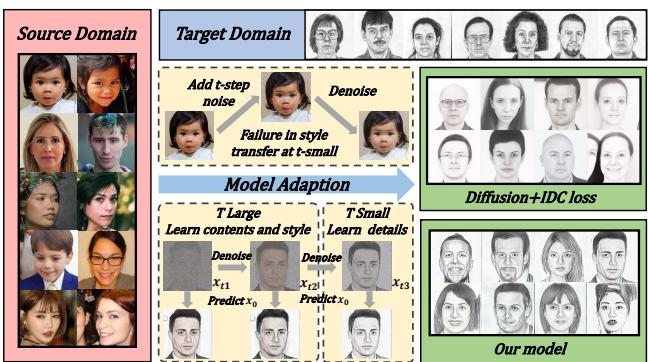  
Figure 1. Comparison with the diffusion model [43] directly trained with IDC loss [20], which captures an inaccurate style due to the failed style transfer when t is small.

Over the last few years, diffusion models [9] have shown great success in image generation and have surpassed GAN model in sub-tasks like text-to-image synthesis and image inpainting [23]. Especially, the flexible controlling process and good generation quality of diffusion models can help enhance the content information and structure consistency during domain adaption and are suitable for few-shot image generation task, which inspires us to study few-shot diffusion generation. However, training few-shot diffusion model faces the following problems: (1) diffusion model tends to overfit with limited number of samples as GANs do; (2) simply training diffusion model with the few-shot loss functions in GAN [20, 31] leads to failed style transfer at the detail learning stage (t small), causing unsuccessful style capture as Fig. 1 shows; (3) the existing loss in fewshot GAN adaptation only constrains the pairwise distances of generated samples in target and source domains to be similar, leading to distribution rotation during training process, which may cause unstable and ineffective training.

To solve these problems, we propose a novel few-shot diffusion model that incorporates a phasic content fusing module and a directional distribution consistency loss to prevent overfitting and maintain content consistency. Specifically, we first design a phasic training strategy with phasic content fusion module, which integrates content information into the network and explicitly decomposes the model training into two stages: learn content and style information when t is large, and learn local details in the target domain when t is small, preventing our model from confusion between content and target-domain local details effectively. Then, with a deep analysis on existing few-shot losses [20, 31], we propose a novel directional distribution consistency loss which can avoid the distribution rotation problem during training and better keep the structure of generated distribution, improving the training stability, efficiency and solving the overfitting problem. Finally, we design a cross-domain structure guidance strategy to further integrate structural information during inference time, resulting in improved performance in both structure preservation and domain adaptation.

Extensive qualitative and quantitative experiments show that our model outperforms the state-of-the-art few-shot generative models in both content preservation and domain adaptation. Moreover, through theoretical analysis, we also prove the effectiveness of our directional distribution consistency loss and the cross-domain structure guidance strategy in terms of distribution and structure maintenance.

Our contributions can be summarized into three aspects:

• We propose a novel phasic content fusing few-shot diffusion model, which learns content and style information when t is large, and learns local details when t is small. By incorporating the phasic content fusion module, our model excels in both content preservation and domain adaptation.

• We design a novel directional distribution consistency loss, which can effectively avoid the distribution rotation problem during training and better keep the structure of generated distribution. It has been theoretically and experimentally proved that the directional distribution consistency loss can maintain the structure of generated distribution in a more effective and stable way than the state-of-the-art methods.

• An iterative cross-domain structure guidance strategy is proposed to further integrate structural information during inference time, and has been demonstrated to achieve superior structure preserving performance in domain translation.

## 2. Related Works

Diffusion Model. Denoising diffusion probabilistic models (DDPM) [9] has acheived high quality image generation without adversarial training [37, 38].The key point of diffusion model is that assume forward process as Markov process that gradually adds noise to input image and use neural network to predict added noise to complete backward process and image reconstruction.

Given a source data distribution $x _ { 0 } \ \sim \ q \left( x _ { 0 } \right) , \beta _ { t } \ \in$ (0, 1), diffusion model defines the forward process by:

$$
\begin{array} { r l } & { q \left( x _ { 1 } , \ldots , x _ { T } \mid x _ { 0 } \right) : = \displaystyle \prod _ { t = 1 } ^ { T } q \left( x _ { t } \mid x _ { t - 1 } \right) , } \\ & { q \left( x _ { t } \mid x _ { t - 1 } \right) : = \mathcal { N } \left( x _ { t } ; \sqrt { 1 - \beta _ { t } } x _ { t - 1 } , \beta _ { t } \mathbf { I } \right) . } \end{array}\tag{1}
$$

And the backward process is approximated through a neural network to generate an image from the Gaussian noise $X _ { T } \sim \mathcal { N } ( 0 , I )$ iteratively by:

$$
\begin{array} { r } { p _ { \theta } \left( x _ { t - 1 } \mid x _ { t } \right) : = \mathcal { N } \left( x _ { t - 1 } ; \mu _ { \theta } \left( x _ { t } , t \right) , \Sigma _ { \theta } \left( x _ { t } , t \right) \right) , } \end{array}\tag{2}
$$

where $\mu _ { \theta } ( x _ { t } , t )$ and $\Sigma _ { \theta } \left( x _ { t } , t \right)$ (setted as a constant in DDPM [9]) are predicted by the neural network.

To futher improve the diffusion model, recent works have made great progress in accelerating denoising process [24] and improving generation quality [18, 6]. With flexible controlling ability of sampling process in diffusion model, it has also been employed in different sub-tasks of image generation like image-to-image translation and textto-image generation, achieving an overwhelming performance [22, 16, 13, 25, 40]. These applications show great potential of diffusion model in conditional image generation, but they all face the overfitting problem when the training samples are limited. And there is still a lack of diffusion models which focusing on scenarios with few-shot training samples. Thus, we propose a novel few-shot diffusion model with phasic content fusion and directional distribution consistency loss which can avoid overfitting problem and keep content information well.

Few-shot Image Generation. The goal of few-shot image generation is to produce high-quality and diverse images in a new domain with only a small number of training data. Directly fine-tuning a pre-trained GAN is a common and straightforward approach [2, 5, 15, 30]. However, this often leads to model overfitting if the entire network is finetuned. Researchers have found that modifying only part of the network weights [17, 30] and using different types of regularization [14, 36], along with batch statistics [19] can prevent overfitting. Data augmentation techniques have also been utilized to increase the amount of training data and enhance the robustness of the generative model [26, 41, 42]. But it’s still hard for these models to train on a dataset with less than 10 samples. Recently, IDC [20] and RSSA [31] introduced two new loss functions to keep the structure of the generated distribution. However, there is a lack of analysis on the proposed loss functions, which can be further improved and they also face the problem of content missing due to the lack of content maintenance. To solve these problems, we take a deep insight into loss functions in IDC and RSSA and propose a novel directional distribution consistency loss, which improves the training stability and effectiveness. Moreover, with our phasic content fusing module and iterative cross-domain structure guidance strategy, our model can keep the structure information well during domain adaptation compared to the existing methods.

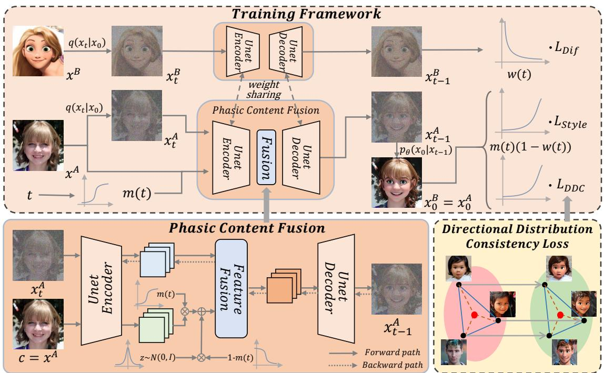  
Figure 2. Model Framework. The training of our model is explicitly decomposed into two stages: learn content information and style transfer at t-large stage (beginning denoising steps), and learn local details in the target domain at t-small stage. We design two training paths, the shifted sigmoid function $m ( t )$ and a weighting function w(t) to facilitate the phasic training. With the help of our phasic content fusion module and directional distribution consistency loss, our model can keep content well and avoid overfitting problem.

## 3. Method

We propose a novel few-shot diffusion model with phasic content fusion and effective directional distribution consistency loss. Given a diffusion model $\epsilon _ { \theta } ^ { A } ( x _ { t } , t )$ pretrained on source domain A, we train a few-shot diffusion model $\epsilon _ { \theta } ( x _ { t } , t )$ on target domain B, using $\epsilon _ { \theta } ^ { A } ( x _ { t } , t )$ as initialization. During inference stage, our model takes an image $x ^ { A }$ from source domain A as input, we first sample the start point $\boldsymbol { x } _ { t } ^ { A }$ through the forward process $q ( x _ { t } | x _ { 0 } )$ (adds Gaussian noise). Then, with our few-shot diffusion model $\epsilon _ { \theta } ( x _ { t } , t )$ trained on target domain, we iteratively predict $x _ { t - 1 } ^ { A }$ from $\boldsymbol { x } _ { t } ^ { A }$ by the denoising process $p _ { \theta } ( x _ { t - 1 } | x _ { t } )$ to get the final output $\overset { \cdot } { x ^ { A  B } } = x _ { 0 } ^ { A }$ , which is transferred to the target domain and keeps original content information of $x ^ { A }$

To better learn the content in source domain and local details in target domain, we explicitly decompose the training process into two stages: the first stage learns content and style information at t-large and the second stage learns target-domain local details at t-small. Additionally, we introduce a phasic content fusion module, which adaptively incorporates content information into our model based on the current learning stage (t), resulting in improved capture of content information. Moreover, to solve the overfitting problem, we propose a novel directional distribution consistency loss, which uses directional guidance to enforce the structure of the generated distribution to be similar to source distribution, while the center close to that of the target distribution, and effectively avoids distribution rotation during training. Lastly, by employing our iterative crossdomain structure guidance strategy during inference stage, our model effectively maintains the structure in source image, enhancing consistency of generated and input images in terms of structure and outline.

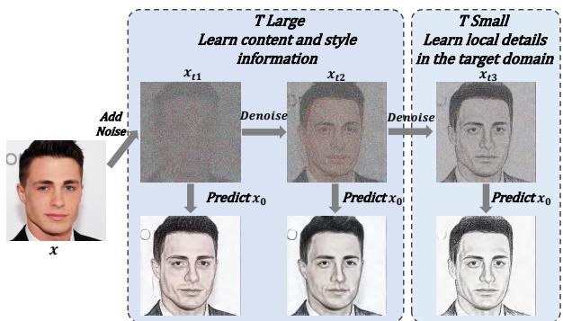  
Figure 3. Our phasic training strategy learns the content and style information at t-large, while learns local details in the target domain (sketch here) at t-small.

## 3.1. Training with Phasic Content Fusion

Phasic Training Strategy. Diffusion model learns different information in different training stages according to time step t [4], i.e., learn contents at t-large while learn details at t-small. When t is small, it’s hard to change both the content and style. Therefore, directly training diffusion model with the loss function in few-shot GAN [20, 31] leads to failure in style transfer at t-small, causing inaccurate capture of style[43] as Fig. 1 shows.

To solve this problem, we expect our diffusion model to capture the content and style information at t-large, while only learn the local details of target domain at t-small (as Fig. 3 shows). We decompose the training into two stages, i.e., t-large stage to learn content and style, and t-small stage to learn local details of target domain. To accomplish this goal, we first design a two-path training framework: apart from the training path on target domain, we introduce another training path that incorporates source domain images to provide content guidance and better learn the content at t-large. Then we introduce a shifted sigmoid function $\begin{array} { r } { m ( t ) = \frac { 1 } { 1 + e ^ { - ( t - T _ { s } ) } } } \end{array}$ and a weighting function $\begin{array} { r } { w ( t ) = 1 - ( \frac { t } { T } ) ^ { \alpha } } \end{array}$ , and integrate them into the model structure and loss functions to enforce larger weight to content and style related learning at t-large, and larger weight to target domain local details learning at t-small.

Phasic Content Fusion Module. For the training path that incorporates source domain images to better learn content at t-large, the inputs contain both noised image $\boldsymbol { x } _ { t } ^ { A }$ and source image $x ^ { A }$ , where the latter is used to supplement the missing content in $\boldsymbol { x } _ { t } ^ { A }$ when t is large. We propose a novel content fusion module to adaptively fuse the content of $x ^ { A }$ into our model with $m ( t )$ as weight, i.e., more content is fused when t is large.

Specifically, the phasic content fusion module is based on the UNet in diffusion model. We employ the UNet encoder to extract image features $E ( x ^ { A } )$ and $E ( x _ { t } ^ { A } )$ . Since content is learnt more in the beginning denoising steps (tlarge), the influence of content in $x _ { A }$ should be increased when t is large and lowered when t is small. We accomplish this goal by adaptively fusing the content feature $E ( x ^ { A } )$ and noise $z \sim \mathcal { N } ( 0 , I )$ using $m ( t )$ as the weight for content, i.e., $\hat { E } ( x ^ { A } ) = m ( t ) E ( x ^ { A } ) + ( 1 - m ( t ) ) z$ . Then, we further fuse $\hat { E } ( x ^ { A } )$ with $E ( x _ { t } ^ { A } )$ using several convolution blocks to get the fused feature $\hat { E } ( x ^ { A } , x _ { t } ^ { A } )$ . At last, we feed the fused feature to UNet decoder to predict the noise $\epsilon _ { t }$ and obtain $x _ { t - 1 } ^ { A }$ which contains the enhanced content information.

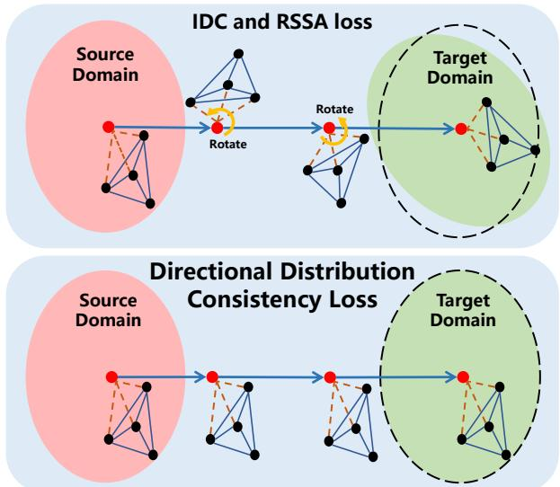  
Figure 4. Compare our DDC loss with IDC and RSSA: our DDC loss explicitly constrain the structure of generated distribution while IDC and RSSA may suffer from distribution rotation in training process, which interferes training stability and efficiency.

## 3.2. Directional Distribution Consistency

In this section, we introduce our training losses to keep structure of generated distribution and transfer the style.

Directional distribution consistency loss. In the fewshot scenario, model is highly susceptible to overfitting. To cope with overfitting, IDC [20] and RSSA [31] propose new loss functions to maintain the structure of generated distribution by constraining the similarity between source and generated distributions in a training batch. We theoretically prove that the final goal of their loss functions is to keep the structure and scale of the generated distribution the same as the source distribution, while sharing the same center with target distribution (refer to Appendix). However, although they can avoid the generation drift problem, they only require the pairwise distances of generated samples in target and source domains to be similar, which leads to distribution rotation during the training process as Fig. 4 shows, and may cause unstable and ineffective training.

To avoid distribution rotation during training, we propose a new directional distribution consistency loss (DDC). Compared to the existing loss functions, our DDC loss introduces a directional guidance to directly optimizes the final goal (distribution structure maintenance and center movement), which avoids the generated distribution from rotation and improves the training efficiency.

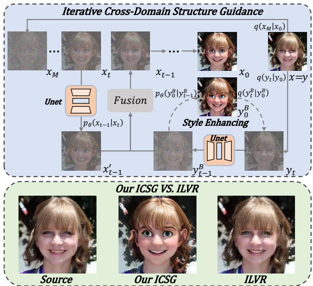  
Figure 5. Process of our iterative cross-domain structure guidance strategy (ICSG) and comparison with ILVR[3], where ILVR tends to reconstruct the source image and lose the style information.

Specifically, given the source dataset $\begin{array} { r l } { A } & { { } = } \end{array}$ $\{ x _ { 1 } ^ { A } , \cdot \cdot \cdot , x _ { n } ^ { A } \}$ and target dataset $\begin{array} { r c l } { B } & { = } & { \{ x _ { 1 } ^ { B } , \cdot \cdot \cdot x _ { m } ^ { B } \} } \end{array}$ we extract the image features by image encoder $E$ for each dataset. Then we compute the cross-domain direction vector w from the center of source domain to the center of target domain in feature space by:

$$
w = \frac { 1 } { m } \sum _ { i = 1 } ^ { m } E ( x _ { i } ^ { B } ) - \frac { 1 } { n } \sum _ { i = 1 } ^ { n } E ( x _ { i } ^ { A } ) .\tag{3}
$$

We leverage the directional vector w to constrain the structure of the generated distribution to match that of original distribution, while also ensure its center coincides with that of the target distribution, by the following directional distribution consistency loss:

$$
\mathcal { L } _ { D D C } = \| E ( x ^ { A } ) + w , E ( x _ { 0 } ^ { A  B } ) \| ^ { 2 } ,\tag{4}
$$

where $x ^ { A }$ is the source image and $x _ { 0 } ^ { A  B }$ is the output image in target domain. Through this loss, we explicitly enforce consistency of the spatial structure between the generated and original distributions during domain adaptation (as Fig. 4 shows).

We employ CLIP as the encoder $E$ to embed the images, since CLIP has been proved to be an effective encoder to extract features from different domains [27], which can help distinguish between the domain-specific and domainindependant features.

Style loss. To better capture the style information, we adopt a style loss which averages the Gram matrix [7] based style difference between our generated image $x _ { 0 } ^ { A  B }$ and target images $B = \{ x _ { 1 } ^ { B } , \cdot \cdot \cdot x _ { m } ^ { \tilde { B } } \}$ by:

$$
\mathcal { L } _ { s t y l e } = \frac { 1 } { m } \sum _ { i = 1 } ^ { m } \sum _ { l } w _ { l } \| G ^ { l } ( x _ { 0 } ^ { A \to B } ) - G ^ { l } ( x _ { i } ^ { B } ) \| ^ { 2 } ,\tag{5}
$$

where $G ^ { l }$ is the Gram matrix and $m \leq 1 0 .$

Diffusion Loss. At last, we inherit the loss function in DDPM [9] to help train our diffusion model on the target domain B without the content fusion module:

$$
\mathcal { L } _ { d i f } = | | \epsilon _ { \theta } ( x _ { t } ^ { B } , t ) - \epsilon | | ^ { 2 } .\tag{6}
$$

Total loss. With the above three loss functions, the final loss function L is calculated by:

$$
\begin{array} { r } { \mathcal { L } = m ( t ) ( 1 - w ( t ) ) ( \lambda _ { D D C } \mathcal { L } _ { D D C } ( x ^ { A } , x _ { 0 } ^ { A  B } ) + } \\ { \lambda _ { s t y l e } \mathcal { L } _ { s t y l e } ( x _ { 0 } ^ { A  B } , x ^ { B } ) ) + w ( t ) \mathcal { L } _ { d i f } ( x ^ { B } ) , } \end{array}\tag{7}
$$

where λs are the hyperparameters, $m ( t )$ is the shifted sigmoid function and $w ( t )$ is the weight balancing function.

## 3.3. Iterative Cross-domain Structure Guidance

Our proposed phasic content fusion module in the network can help keep the content information well. But there is still a room to improve the preservation of local structures in the source image during the inference stage. We propose a novel iterative cross-domain structure guidance strategy (ICSG), which constantly enhances the local structures and keeps the style unchanged during the denoising process.

ILVR [3] proposes a conditioning method to generate images with similar semantics to a reference image, where the downsampled image $\phi _ { N } ( x _ { 0 } )$ of the generated image $x _ { 0 }$ is pulled close to the downsampled image $\phi _ { N } ( y )$ of the reference image $y \ ( \phi _ { N }$ is a linear low-pass filter). At each time step t, ILVR denoises $x _ { t }$ to $x _ { t - 1 }$ with a local condition where $\phi _ { N } ( x _ { t - 1 } )$ and $\phi _ { N } ( y _ { t - 1 } )$ are similar: $x _ { t - 1 } = x _ { t - 1 } ^ { \prime } + \phi _ { N } \mathopen { } \mathclose \bgroup \left( y _ { t - 1 } \aftergroup \egroup \right) - \phi _ { N } \mathopen { } \mathclose \bgroup \left( x _ { t - 1 } ^ { \prime } \aftergroup \egroup \right) , x _ { t - 1 } ^ { \prime } \sim p _ { \theta } \mathopen { } \mathclose \bgroup \left( x _ { t - 1 } ^ { \prime } | x _ { t } \aftergroup \egroup \right)$ We can apply ILVR to our task by using the source image x as the reference image. But since the target domain is different in style from the source domain, directly applying ILVR leads to shifted style (Fig. 5).

To address the above problem, we propose our iterative cross-domain structure guidance strategy (ICSG) as Fig. 5 shows. In our case, the reference image y is a source image x. Instead of directly sampling $y _ { t - 1 }$ via the forward process $q ( y _ { t - 1 } | y _ { 0 } )$ , we obtain a target domain style $y _ { t - } ^ { B }$ 1 by first sampling $y _ { t } \sim q ( y _ { t } | y _ { 0 } )$ and then translating it to target domain $y _ { t - 1 } ^ { B }$ by using our trained diffusion model $p _ { \theta } ( y _ { t - 1 } | y _ { t } )$ . We then enforce structure similarity between $\phi _ { N } ( x _ { t - 1 } )$ and $\phi _ { N } ( y _ { t - 1 } ^ { B } )$ by:

$$
x _ { t - 1 } = x _ { t - 1 } ^ { \prime } + \phi _ { N } \mathopen { } \mathclose \bgroup ( y _ { t - 1 } ^ { B } \aftergroup \egroup ) - \phi _ { N } \mathopen { } \mathclose \bgroup ( x _ { t - 1 } ^ { \prime } \aftergroup \egroup ) , x _ { t - 1 } ^ { \prime } \sim p _ { \theta } \mathopen { } \mathclose \bgroup ( x _ { t - 1 } ^ { \prime } \mathopen { } \mathclose \bgroup | x _ { t } \aftergroup \egroup ) .\tag{8}
$$

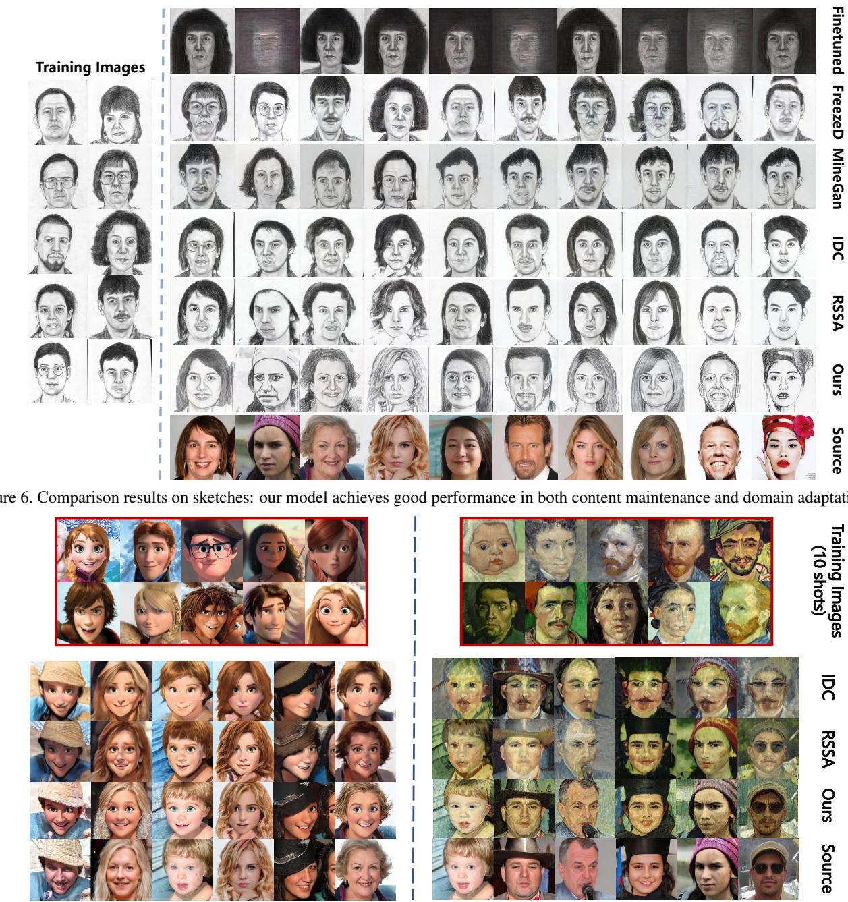  
Figure 7. Comparison results on Cartoon and Van Gogh painting dataset with IDC and RSSA.

Compared to ILVR, our ICSG can eliminate the interference from source style and better preserve the structure.

We further enhance the target domain style of $y _ { t - 1 } ^ { B }$ by iteratively applying a Style Enhancement (SE) module, which repeats the following steps: (1) compute $y _ { 0 } ^ { B }$ from $y _ { t - } ^ { B }$ 1 by $\overline { { p _ { \theta } ( y _ { 0 } ^ { B } | y _ { t - 1 } ^ { B } ) } }$ with ${ \bf \bar { \epsilon } } _ { \theta } ( y _ { t } ^ { B } , t )$ in last $p _ { \theta } ( y _ { t - 1 } ^ { B } | y _ { t } ^ { B } )$ (2) add t-step noise into $y _ { 0 } ^ { B }$ to get new $y _ { t } ^ { B } \sim q ( y _ { t } ^ { B } | y _ { 0 } ^ { B } )$ and (3) denoise $y _ { t } ^ { B } \tan y _ { t - } ^ { B }$ by our model $p _ { \theta } ( y _ { t - 1 } ^ { B } | y _ { t } ^ { B } )$ . We apply the Style Enhancement (SE) module for M times (M depends on the style gap between source and target domain) until $y _ { t - 1 } ^ { B }$ is fully transferred to the target domain style.

## 4. Experiments

## 4.1. Experiment Settings

We compare our model with the existing few-shot generation models: FreezeD [17] , MineGAN [29] , IDC [20] and RSSA [31], where IDC and RSSA are the state-of-the-art method. For a fair comparison, we employ StyleGAN2 [12] as the backbone for all these methods. Moreover, to validate the effectiveness of our method, we fine-tune a diffusion model which shares the same settings as ours.

We conduct experiments on two datasets: (1) Flickr-

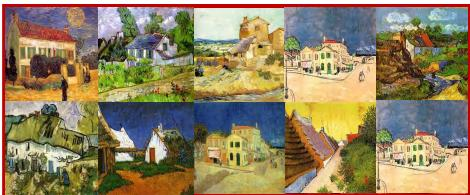

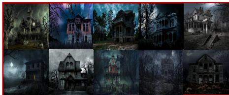  
(10shots) TrainingImages

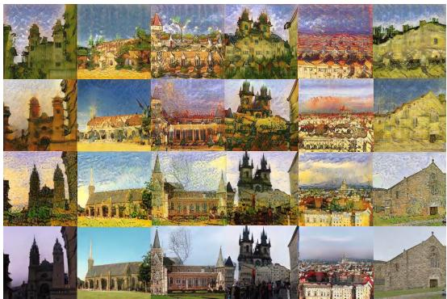

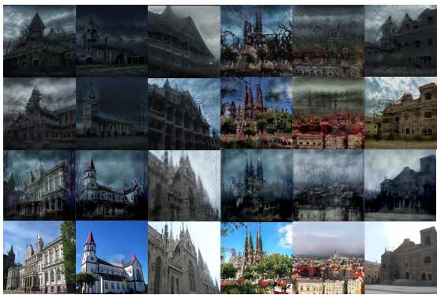

Figure 8. Comparison results on haunted houses and village painting by Van Gogh with IDC and RSSA.
<table><tr><td rowspan="2">Metric</td><td rowspan="2">Method</td><td colspan="2">FFHQ → Sketches</td><td colspan="2">FFHQ → Cartoon</td><td colspan="2">FFHQ → Van. face</td><td colspan="2">Church → Van. vil</td><td colspan="2">Church → Haunted</td></tr><tr><td>10-shot</td><td>5-shot</td><td>10-shot</td><td>5-shot</td><td>10-shot</td><td>5-shot</td><td>10-shot</td><td>5-shot</td><td>10-shot</td><td>5-shot</td></tr><tr><td rowspan="6">IS↑</td><td>FreezeD</td><td>1.502</td><td>1.636</td><td>3.047</td><td>2.205</td><td>1.333</td><td>1.784</td><td>1.795</td><td>2.331</td><td>2.527</td><td>1.949</td></tr><tr><td>MineGan</td><td>1.320</td><td>1.700</td><td>2.343</td><td>2.917</td><td>1.604</td><td>1.710</td><td>2.412</td><td>2.080</td><td>2.241</td><td>2.282</td></tr><tr><td>IDC</td><td>1.640</td><td>2.100</td><td>2.829</td><td>2.100</td><td>1.373</td><td>1.736</td><td>2.798</td><td>2.945</td><td>2.768</td><td>2.434</td></tr><tr><td>RSSA</td><td>1.875</td><td>2.135</td><td>3.595</td><td>3.098</td><td>2.129</td><td>1.983</td><td>3.139</td><td>3.058</td><td>2.634</td><td>2.598</td></tr><tr><td>fine-tune</td><td>1.871</td><td>1.532</td><td>1.838</td><td>1.725</td><td>1.957</td><td>1.901</td><td>2.856</td><td>2.724</td><td>1.618</td><td>1.324</td></tr><tr><td>Ours</td><td>2.361</td><td>2.146</td><td>3.410</td><td>3.317</td><td>2.449</td><td>2.134</td><td>3.072</td><td>3.088</td><td>2.784</td><td>2.657</td></tr><tr><td rowspan="6">IC-LPIPS ↑</td><td>FreezeD</td><td>0.351</td><td>0.345</td><td>0.472</td><td>0.467</td><td>0.506</td><td>0.462</td><td>0.328</td><td>0.343</td><td>0.485</td><td>0.405</td></tr><tr><td>MineGan</td><td>0.340</td><td>0.319</td><td>0.431</td><td>0.526</td><td>0.468</td><td>0.452</td><td>0.559</td><td>0.368</td><td>0.486</td><td>0.497</td></tr><tr><td>IDC</td><td>0.418</td><td>0.542</td><td>0.575</td><td>0.557</td><td>0.574</td><td>0.524</td><td>0.666</td><td>0.655</td><td>0.623</td><td>0.602</td></tr><tr><td>RSSA</td><td>0.478</td><td>0.471</td><td>0.590</td><td>0.582</td><td>0.619</td><td>0.598</td><td>0.679</td><td>0.671</td><td>0.623</td><td>0.625</td></tr><tr><td>fine-tune</td><td>0.469</td><td>0.332</td><td>0.362</td><td>0.337</td><td>0.411</td><td>0.373</td><td>0.414</td><td>0.195</td><td>0.161</td><td>0.258</td></tr><tr><td>Ours</td><td>0.557</td><td>0.551</td><td>0.630</td><td>0.637</td><td>0.625</td><td>0.606</td><td>0.655</td><td>0.673</td><td>0.666</td><td>0.691</td></tr><tr><td rowspan="6">SCS ↑</td><td>FreezeD</td><td>0.288</td><td>0.291</td><td>0.376</td><td>0.350</td><td>0.366</td><td>0.369</td><td>0.356</td><td>0.356</td><td>0.196</td><td>0.234</td></tr><tr><td>MineGan</td><td>0.289</td><td>0.296</td><td>0.386</td><td>0.400</td><td>0.373</td><td>0.426</td><td>0.397</td><td>0.394</td><td>0.287</td><td>0.294</td></tr><tr><td>IDC</td><td>0.338</td><td>0.475</td><td>0.516</td><td>0.475</td><td>0.560</td><td>0.496</td><td>0.557</td><td>0.484</td><td>0.458</td><td>0.297</td></tr><tr><td>RSSA</td><td>0.496</td><td>0.504</td><td>0.715</td><td>0.707</td><td>0.702</td><td>0.631</td><td>0.715</td><td>0.695</td><td>0.649</td><td>0.637</td></tr><tr><td>fine-tune</td><td>0.179</td><td>0.293</td><td>0.246</td><td>0.353</td><td>0.335</td><td>0.342</td><td>0.259</td><td>0.313</td><td>0.268</td><td>0.286</td></tr><tr><td>Ours</td><td>0.623</td><td>0.653</td><td>0.837</td><td>0.842</td><td>0.811</td><td>0.802</td><td>0.838</td><td>0.826</td><td>0.840</td><td>0.829</td></tr></table>

Table 1. Quantitative comparison on IS, IC-LPIPS and SCS with differnet source and target domains. Our model outperforms the existing methods in both generating quality (higher IS) and diversity (higher IC-LPIPS and SCS).

Faces-HQ (FFHQ) [11] and (2) LSUN Church [35]. And we translate the model to the target domain: (1) Sketches [28], (2) Cartoon [21], (3) Paintings by Van Gogh [34] and (4) Haunted houses [20]. The experiments are conducted in both 10-shot and 5-shot settings.

Evaluation protocals. We employ three metrics to evaluate model performance: (1) IS: Inception Score [1] measures the high resolution and diversity of images by calculating the information entropy of the generated images. (2) IC-LPIPS: Intra-cluster pairwise LPIPS distance [20] first classifies generated images into k clusters according to their LPIPS distance to the k target samples. By averaging the mean LPIPS distance to the corresponding target samples in each cluster, a higher IC-LPIPS indicates a better generation diversity. (3) SCS: Structural Consistency Score [31] first extracts edge maps of pairwise source and generated images by HED [32] and then measures the mean similarity score between them. Higher SCS indicates better spatial structural consistency between source and generated distribution, leading to higher diversity of generated images.

## 4.2. Performance Evaluation

Qualitative Evaluation. We first compare the visual quality of the generated images on sketch domain. We randomly sample 5 source images from the offered latent code in IDC [20] and 5 images from CelebA-HQ [10]. Fig. 6 shows the comparison results. It can be seen that FreezeD, MineGAN and the fine-tuned diffusion model are all overfitted whose results have poor relation to the source images. Both IDC and RSSA can keep part of features in the source images, but there are still some content missing, especially when dealing with CelebA-HQ images. Compared to them, our method keeps the content well while translating images to the target domain.

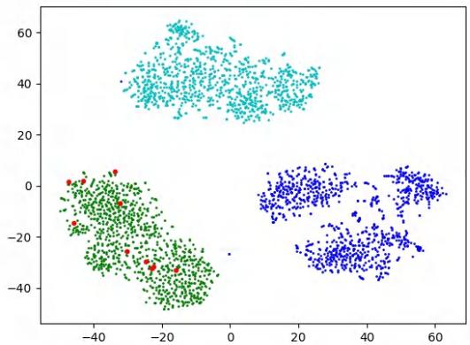  
Figure 9. t-SNE results of few-shot samples (red); source images (blue); our generated results (green) and IDC generated results (cyan). It’s clearly seen that our generated results are in the target domain and keeps the distribution structure well.

To further validate the effectiveness of our model, we compare our model with the state-of-the-art method: IDC and RSSA on more datasets. Besides sketches, we conduct experiments on cartoon and Van Gogh painting with the pretrained model on FFHQ in Fig. 7. And we also compare the performance when translating from LSUN church to haunted houses and village painting by Van Gogh in Fig. 8. All the results show that our model can maintain the content information and translate the domain well.

Quantitative Evaluation. We quantitatively compare our model with the state-of-the-art methods on 5 domain adaption experiments: FFHQ to sketches, FFHQ to Cartoon, FFHQ to Van Gogh painting, LSUN Church to Van Gogh painting and LSUN Church to hunted house. We conduct the experiments on both 5-shot and 10-shot settings. Specifically, We first sample 1000 images from Style-GAN2 [12] as the source images and generate 1000 images in target domain by all the methods. Then we calculate the IS, IC-LPIPS and SCS on these generated images in Tab. 1. For the content keeping metrics IC-LPIPS, SCS and the generation quality metric IS, our model outperforms the existing methods in almost all experiment settings.

## 4.3. Analysis on the DDC Loss

In this section, we give a further insight in our DDC loss. We randomly sampled 1000 images from StyleGAN2 and translate them to the cartoon domain with our method and IDC [20]. To validate that our generated distribution is more similar to source distribution, we employ t-SNE to visualize the distributions of the source images (blue), target 10-shot cartoon images (red), our generated images (green) and IDC generated images (cyan) in Fig. 9. It can be seen that our generated distribution translates the domain well since the target images are all located in it and they share a close distribution center. The visualization result validates that our DDC loss can help the few-shot generative model to translate the distribution center and maintain the structure well.

<table><tr><td colspan="3">Method Metric</td></tr><tr><td>PCF DDC</td><td>ICSG IS↑</td><td>IC-LPIPS ↑ SCS↑</td></tr><tr><td>√</td><td>1.886</td><td>0.581 0.625</td></tr><tr><td>√</td><td>2.018</td><td>0.586 0.629</td></tr><tr><td>√ √</td><td>2.699</td><td>0.606 0.690</td></tr><tr><td>√ √</td><td>2.736</td><td>0.608 0.731</td></tr><tr><td>√ √</td><td>2.426</td><td>0.605 0.791</td></tr><tr><td>√ √ √</td><td>3.410</td><td>0.630 0.837</td></tr></table>

Table 2. Ablation study on phasic content fusion module (PCF), directional distribution consistency loss (DDC) and the iterative cross-domain structure guidance strategy (ICSG) on cartoon.  
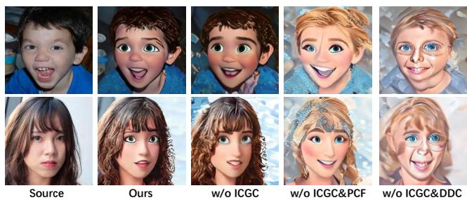  
Figure 10. Ablation study on phasic content fusion module (PCF), directional distribution consistency loss (DDC loss) and the iterative cross-domain structure guidance strategy (ICSG) on cartoon.

## 4.4. Ablation Study

To evaluate the effectiveness of our proposed methods, we conduct ablation study on the phasic content fusion module (PCF), directional distribution consistency loss (DDC loss) and the iterative cross-domain structure guidance strategy (ICSG) on the cartoon dataset. We train three networks: (1) with PCF only; (2) with DDC only and (3) with both PCF and DDC. Then, we sample 1000 images from the three models with or without ICSG respectively. We calculate IS, IC-LPIPS and SCS metrics for these generated images and summarize them in Tab. 2 and show the visualization comparison in Fig. 4.4. It can be seen that each of our proposed module is effective in either content preservation, domain translation or generation diversity.

## 5. Conclusion

In this paper, we propose a novel phasic content fusing few-shot diffusion model with directional distribution consistency loss, achieving a good performance in content preservation and few-shot domain adaption. Moreover, we propose a new iterative cross-domain structure guidance strategy which can keep the structure consistency during domain translation. Extensive quantitative and qualitative experiments show the effectiveness of our model in fewshot image generation.

## Acknowledgements

This work was supported by National Natural Science Foundation of China (72192821, 62272447, 61972157), Shanghai Sailing Program (22YF1420300), Shanghai Municipal Science and Technology Major Project (2021SHZDZX0102), Shanghai Science and Technology Commision (21511101200), CCF-Tencent Open Research Fund (RAGR20220121), Young Elite Scientists Sponsorship Program by CAST (2022QNRC001), Beijing Natural Science Foundation (L222117), the Fundamental Research Funds for the Central Universities (YG2023QNB17).

## References

[1] Shane Barratt and Rishi Sharma. A note on the inception score. arXiv preprint arXiv:1801.01973, 2018. 7

[2] Sergey Bartunov and Dmitry Vetrov. Few-shot generative modelling with generative matching networks. In International Conference on Artificial Intelligence and Statistics, pages 670–678. PMLR, 2018. 1, 2

[3] Jooyoung Choi, Sungwon Kim, Yonghyun Jeong, Youngjune Gwon, and Sungroh Yoon. Ilvr: Conditioning method for denoising diffusion probabilistic models. arXiv preprint arXiv:2108.02938, 2021. 5

[4] Jooyoung Choi, Jungbeom Lee, Chaehun Shin, Sungwon Kim, Hyunwoo Kim, and Sungroh Yoon. Perception prioritized training of diffusion models. In Proceedings of the IEEE/CVF Conference on Computer Vision and Pattern Recognition, pages 11472–11481, 2022. 4

[5] Louis Clouatre and Marc Demers. Figr: Few-shot imageˆ generation with reptile. arXiv preprint arXiv:1901.02199, 2019. 1, 2

[6] Prafulla Dhariwal and Alexander Nichol. Diffusion models beat gans on image synthesis. Advances in Neural Information Processing Systems, 34:8780–8794, 2021. 2

[7] Leon A Gatys, Alexander S Ecker, and Matthias Bethge. Image style transfer using convolutional neural networks. In Proceedings ofthe IEEE conference on computer vision and pattern recognition, pages 2414–2423, 2016. 5

[8] Ian Goodfellow, Jean Pouget-Abadie, Mehdi Mirza, Bing Xu, David Warde-Farley, Sherjil Ozair, Aaron Courville, and Yoshua Bengio. Generative adversarial networks. Communications ofthe ACM, 63(11):139–144, 2020. 1

[9] Jonathan Ho, Ajay Jain, and Pieter Abbeel. Denoising diffusion probabilistic models. Advances in Neural Information Processing Systems, 33:6840–6851, 2020. 1, 2, 5

[10] Tero Karras, Timo Aila, Samuli Laine, and Jaakko Lehtinen. Progressive growing of gans for improved quality, stability, and variation. In International Conference on Learning Representations, 2018. 7

[11] Tero Karras, Samuli Laine, and Timo Aila. A style-based generator architecture for generative adversarial networks. In Proceedings of the IEEE/CVF conference on computer vision and pattern recognition, pages 4401–4410, 2019. 7

[12] Tero Karras, Samuli Laine, Miika Aittala, Janne Hellsten, Jaakko Lehtinen, and Timo Aila. Analyzing and improving the image quality of stylegan. In Proceedings of

the IEEE/CVF conference on computer vision and pattern recognition, pages 8110–8119, 2020. 6, 8

[13] Mingi Kwon, Jaeseok Jeong, and Youngjung Uh. Diffusion models already have a semantic latent space. arXiv preprint arXiv:2210.10960, 2022. 2

[14] Yijun Li, Richard Zhang, Jingwan Lu, and Eli Shechtman. Few-shot image generation with elastic weight consolidation. arXiv preprint arXiv:2012.02780, 2020. 1, 3

[15] Weixin Liang, Zixuan Liu, and Can Liu. Dawson: A domain adaptive few shot generation framework. arXiv preprint arXiv:2001.00576, 2020. 1, 2

[16] Yen-Ju Lu, Zhong-Qiu Wang, Shinji Watanabe, Alexander Richard, Cheng Yu, and Yu Tsao. Conditional diffusion probabilistic model for speech enhancement. In ICASSP 2022 - 2022 IEEE International Conference on Acoustics, Speech and Signal Processing (ICASSP), pages 7402–7406, 2022. 2

[17] Sangwoo Mo, Minsu Cho, and Jinwoo Shin. Freeze the discriminator: a simple baseline for fine-tuning gans. arXiv preprint arXiv:2002.10964, 2020. 3, 6

[18] Alexander Quinn Nichol and Prafulla Dhariwal. Improved denoising diffusion probabilistic models. In International Conference on Machine Learning, pages 8162–8171. PMLR, 2021. 2

[19] Atsuhiro Noguchi and Tatsuya Harada. Image generation from small datasets via batch statistics adaptation. In Proceedings of the IEEE/CVF International Conference on Computer Vision, pages 2750–2758, 2019. 3

[20] Utkarsh Ojha, Yijun Li, Jingwan Lu, Alexei A Efros, Yong Jae Lee, Eli Shechtman, and Richard Zhang. Few-shot image generation via cross-domain correspondence. In Proceedings of the IEEE/CVF Conference on Computer Vision and Pattern Recognition, pages 10743–10752, 2021. 1, 2, 3, 4, 6, 7, 8

[21] Justin NM Pinkney and Doron Adler. Resolution dependent gan interpolation for controllable image synthesis between domains. arXiv preprint arXiv:2010.05334, 2020. 7

[22] Konpat Preechakul, Nattanat Chatthee, Suttisak Wizadwongsa, and Supasorn Suwajanakorn. Diffusion autoencoders: Toward a meaningful and decodable representation. In 2022 IEEE/CVF Conference on Computer Vision and Pattern Recognition (CVPR), pages 10609–10619, 2022. 2

[23] Robin Rombach, Andreas Blattmann, Dominik Lorenz, Patrick Esser, and Bjorn Ommer. High-resolution image¨ synthesis with latent diffusion models. In Proceedings of the IEEE/CVF Conference on Computer Vision and Pattern Recognition, pages 10684–10695, 2022. 1

[24] Jiaming Song, Chenlin Meng, and Stefano Ermon. Denoising diffusion implicit models. arXiv preprint arXiv:2010.02502, 2020. 2

[25] Xuan Su, Jiaming Song, Chenlin Meng, and Stefano Ermon. Dual diffusion implicit bridges for image-to-image translation. In International Conference on Learning Representations, 2022. 2

[26] Ngoc-Trung Tran, Viet-Hung Tran, Ngoc-Bao Nguyen, Trung-Kien Nguyen, and Ngai-Man Cheung. On data augmentation for gan training. IEEE Transactions on Image Processing, 30:1882–1897, 2021. 1, 3

[27] Yael Vinker, Ehsan Pajouheshgar, Jessica Y Bo, Roman Christian Bachmann, Amit Haim Bermano, Daniel Cohen-Or, Amir Zamir, and Ariel Shamir. Clipasso: Semantically-aware object sketching. ACM Transactions on Graphics (TOG), 41(4):1–11, 2022. 5

[28] Xiaogang Wang and Xiaoou Tang. Face photo-sketch synthesis and recognition. IEEE transactions on pattern analysis and machine intelligence, 31(11):1955–1967, 2008. 7

[29] Yaxing Wang, Abel Gonzalez-Garcia, David Berga, Luis Herranz, Fahad Shahbaz Khan, and Joost van de Weijer. Minegan: effective knowledge transfer from gans to target domains with few images. In Proceedings ofthe IEEE/CVF Conference on Computer Vision and Pattern Recognition, pages 9332–9341, 2020. 6

[30] Yaxing Wang, Chenshen Wu, Luis Herranz, Joost Van de Weijer, Abel Gonzalez-Garcia, and Bogdan Raducanu. Transferring gans: generating images from limited data. In Proceedings of the European Conference on Computer Vision (ECCV), pages 218–234, 2018. 1, 2, 3

[31] Jiayu Xiao, Liang Li, Chaofei Wang, Zheng-Jun Zha, and Qingming Huang. Few shot generative model adaption via relaxed spatial structural alignment. In Proceedings of the IEEE/CVF Conference on Computer Vision and Pattern Recognition, pages 11204–11213, 2022. 1, 2, 3, 4, 6, 7

[32] Saining Xie and Zhuowen Tu. Holistically-nested edge detection. In Proceedings ofthe IEEE international conference on computer vision, pages 1395–1403, 2015. 7

[33] Chao Xu, Jiangning Zhang, Yue Han, Guanzhong Tian, Xianfang Zeng, Ying Tai, Yabiao Wang, Chengjie Wang, and Yong Liu. Designing one unified framework for high-fidelity face reenactment and swapping. In ECCV, pages 54–71. Springer, 2022. 1

[34] Jordan Yaniv, Yael Newman, and Ariel Shamir. The face of art: landmark detection and geometric style in portraits. ACM Transactions on graphics (TOG), 38(4):1–15, 2019. 7

[35] Fisher Yu, Ari Seff, Yinda Zhang, Shuran Song, Thomas Funkhouser, and Jianxiong Xiao. Lsun: Construction of a large-scale image dataset using deep learning with humans in the loop. arXiv preprint arXiv:1506.03365, 2015. 7

[36] Han Zhang, Zizhao Zhang, Augustus Odena, and Honglak Lee. Consistency regularization for generative adversarial networks. arXiv preprint arXiv:1910.12027, 2019. 1, 3

[37] Jiangning Zhang, Liang Liu, Zhucun Xue, and Yong Liu. Apb2face: Audio-guided face reenactment with auxiliary pose and blink signals. In ICASSP, pages 4402–4406. IEEE, 2020. 2

[38] Jiangning Zhang, Xianfang Zeng, Mengmeng Wang, Yusu Pan, Liang Liu, Yong Liu, Yu Ding, and Changjie Fan. Freenet: Multi-identity face reenactment. In CVPR, pages 5326–5335, 2020. 2

[39] Jiangning Zhang, Xianfang Zeng, Chao Xu, and Yong Liu. Real-time audio-guided multi-face reenactment. IEEE Signal Processing Letters, 29:1–5, 2021. 1

[40] Min Zhao, Fan Bao, Chongxuan Li, and Jun Zhu. Egsde: Unpaired image-to-image translation via energyguided stochastic differential equations. arXiv preprint arXiv:2207.06635, 2022. 2

[41] Shengyu Zhao, Zhijian Liu, Ji Lin, Jun-Yan Zhu, and Song Han. Differentiable augmentation for data-efficient gan training. Advances in Neural Information Processing Systems, 33:7559–7570, 2020. 1, 3

[42] Zhengli Zhao, Zizhao Zhang, Ting Chen, Sameer Singh, and Han Zhang. Image augmentations for gan training. arXiv preprint arXiv:2006.02595, 2020. 1, 3

[43] Jingyuan Zhu, Huimin Ma, Jiansheng Chen, and Jian Yuan. Few-shot image generation with diffusion models. arXiv preprint arXiv:2211.03264, 2022. 1, 4