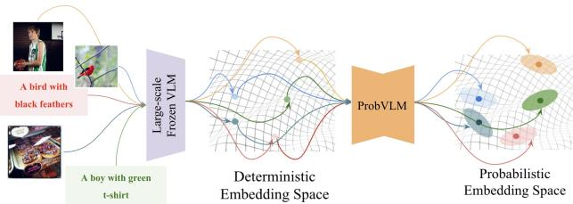
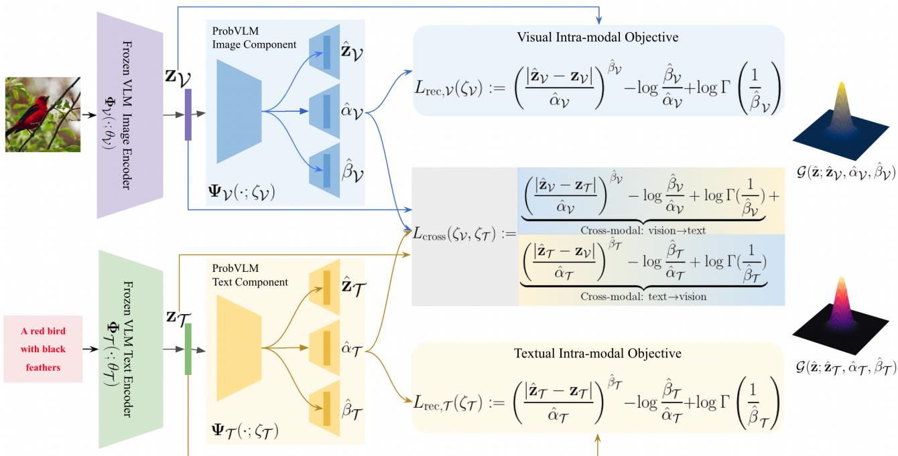
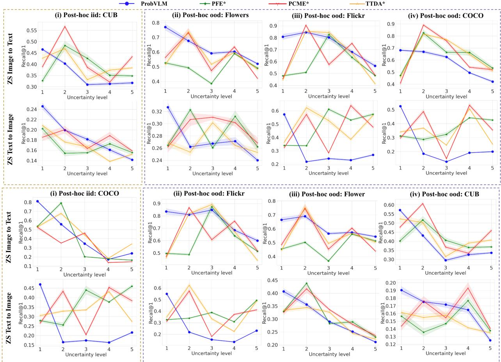
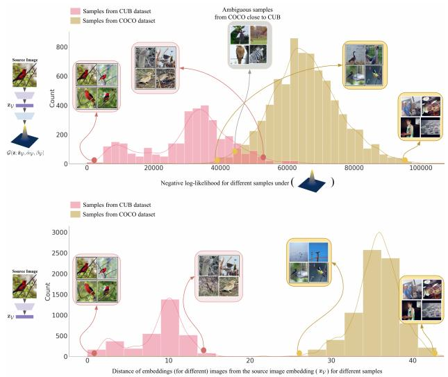
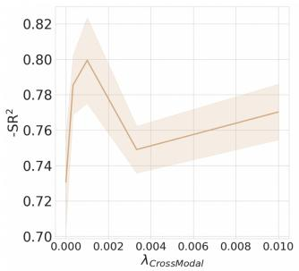
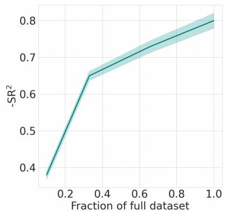
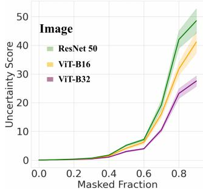
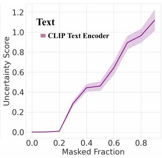
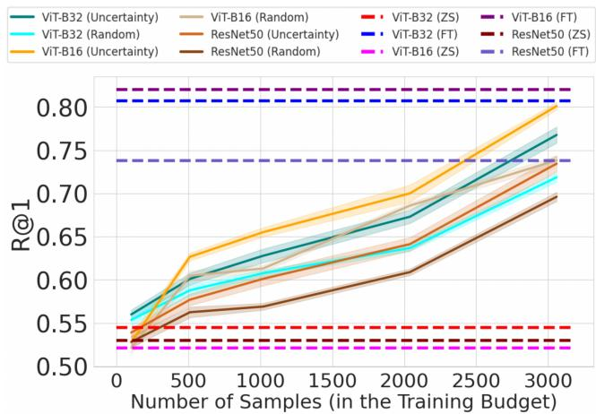
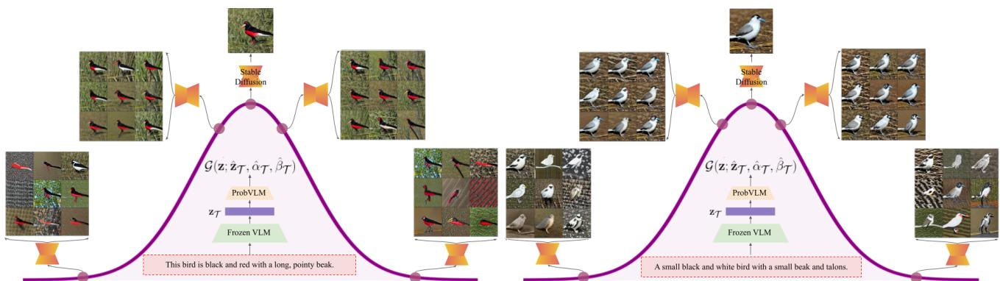

# ProbVLM: Probabilistic Adapter for Frozen Vison-Language Models

Uddeshya Upadhyay∗,1 Shyamgopal Karthik∗,1 Massimiliano Mancini2 Zeynep Akata1,3

1University of Tubingen ¨ 2University of Trento 3MPI for Intelligent Systems

## Abstract

Large-scale vision-language models (VLMs) like CLIP successfullyfind correspondences between images and text. Through the standard deterministic mapping process, an image or a text sample is mapped to a single vector in the embedding space. This is problematic: as multiple samples (images or text) can abstract the same concept in the physical world, deterministic embeddings do not reflect the inherent ambiguity in the embedding space. We propose ProbVLM, a probabilistic adapter that estimates probability distributions for the embeddings ofpre-trained VLMs via inter/intra-modal alignment in a post-hoc manner without needing large-scale datasets or computing. On four challenging datasets, i.e., COCO, Flickr, CUB, and Oxford-flowers, we estimate the multi-modal embedding uncertainties for two VLMs, i.e., CLIP and BLIP, quantify the calibration ofembedding uncertainties in retrieval tasks and show that ProbVLM outperforms other methods. Furthermore, we propose active learning and model selection as two real-world downstream tasks for VLMs and show that the estimated uncertainty aids both tasks. Lastly, we present a novel techniquefor visualizing the embedding distributions using a large-scale pre-trained latent diffusion model. Code is available at https://github.com/ ExplainableML/ProbVLM

## 1. Introduction

Recently, large vision-language models (VLMs) [62, 51, 45, 74, 1, 35] have become exceedingly popular due to their ability to align images and text. These models such as CLIP [62] and BLIP [45] are trained on large-scale datasets such as LAION-400M [70] and YFCC-100M [79] and have shown strong performance when evaluated in a zero-shot fashion (i.e without requiring fine-tuning on specific datasets) for a variety of downstream tasks. One of the most popular applications of VLMs is cross-modal retrieval [86, 88] i.e retrieving images (text) for a queried text (images). However, image-to-text matching (and viceversa) is fundamentally ill-posed due to the inherent ambiguity in either modality [97], i.e. the same caption (or image) can be valid for multiple images (or captions). Therefore, it becomes essential to model the ambiguity inherently present in the various modalities, and combinations thereof.

  
Figure 1: We provide probabilistic embeddings for deterministic pre-trained vision-language models that arefrozen. By capturing the ambiguity inherently present in the inputs, we obtain well-calibrated uncertainty estimates.

Instead of mapping inputs to embeddings, probabilistic embedding methods [57, 10] learn to map input samples to distributions. This is achieved by parameterizing the distributions of the embeddings and training a deep neural network to maximize its likelihood. Although they model ambiguities in the embedding space, such probabilistic models require training deep networks from scratch. This requires access to the large-scale datasets and the computational resources of the recent VLMs [62, 35, 51, 74, 45].

We propose ProbVLM, a post-hoc probabilistic adapter, the first method to convert the deterministic embeddings provided by a frozen large-scale vision-language models into probabilistic ones, as shown in Figure 1. This enables us to efficiently retain the benefits of large-scale pre-training while learning distributions that model the inherent ambiguities in the different modalities. Our ProbVLM models the embedding distribution as a heteroscedastic probability distribution and is trained using a combination of intra-modal and cross-modal alignment objectives and provides wellcalibrated uncertainty estimates, useful for several tasks.

We demonstrate on two large vision-language datasets, i.e., COCO [46] and Flickr [60], and on two fine-grained image datasets, i.e., CUB [85] and Oxford-Flowers [55] with sentences from [66], that ProbVLM learns calibrated uncertainties without requiring large-scale models to be trained from scratch. This sharply contrasts previous works on probabilistic embeddings [57, 10] that train new models from scratch. We perform a series of analyses to understand the impact of the training objective and to study the properties of the resulting uncertainties. Furthermore, we demonstrate that our uncertainty estimates can be used to select the optimal model from a set of finetuned vision-language models on an unlabeled target dataset. They can also be used to choose the most suitable samples for fine-tuning the model in an active learning setup. Finally, with the help of a pretrained latent diffusion model [67], i.e., Stable Diffusion, we decode sampled embeddings from predicted distribution to visualize the predicted embedding distributions. We show that the predicted embedding distributions indeed capture meaningful modes of variation, that may be interpretable.

## 2. Related Work

Vision-Language Models. Such models [62, 51, 74, 1, 45, 47, 44, 100, 101, 90] have become ubiquitous in recent times due to their various applications in image classification [105, 21, 106, 50], cross-modal retrieval [4], as well as open-vocabulary semantic segmentation [24, 96]. The most notable among these is CLIP [62], which consists of an image and text encoder trained on 400M imagetext pairs with a contrastive objective [28, 58]. As a result, the model is able to project images and text to a shared embedding space. In this paper, we focus on using the shared embedding space for the task of cross-modal retrieval [60, 46]. Recent works have predominantly relied on large-scale pre-training [62, 51, 74, 1, 104, 70, 69] to project images and text to the same metric space. However, it is essential to note that all of these vision-language models [62, 51, 45, 74, 1] provide deterministic mappings that do not model the inherent ambiguity in the inputs. In this work, we turn a deterministic model (i.e., CLIP) into a probabilistic one, without the need of a large-scale dataset. Probabilistic Embeddings. These methods [57, 10, 43] provide an elegant solution to estimate the ambiguity present in the inputs [37]. The key idea here is to map inputs to probability distributions in the embedding space, as opposed to point estimates, thereby modeling the inherent ambiguity present in the input. In the context of cross-modal retrieval, this was done by optimizing a probabilistic analog of the contrastive objective to learn distributions for the image and text inputs [10]. Other works have further improved the performance [43, 59, 34], extended this formulation to achieve compositional retrieval [54], and have applied it to other tasks such as video retrieval [59, 17] and tasks like pose estimation [78]. However, most of these works focus on training a model from scratch, thereby not leveraging the power of the pre-trained models that are widely present. The notable exception to this is Probabilistic Face Embed ding (PFE) [73] that proposed to learn a probabilistic embedding while retaining a deterministic pre-trained model for the task of learning face embeddings. However, this was done in a unimodal setting using only images. In this work, we aim to utilize pre-trained vision-language models while providing probabilistic embeddings for both modalities. The probabilistic embeddings derived from our proposed ProbVLM are consistent with cross-modal learning at the core of pretrained vision-language models.

Uncertainty Estimation. These techniques have been widely explored for different tasks in computer vision [36, 7, 41, 42, 56, 102, 83, 53, 80, 27, 68, 103, 65, 81, 77, 82]. Uncertainties can be broadly categorized into aleatoric [36, 23, 3, 89, 12, 2, 87, 56, 95] and epistemic [25, 7, 41, 91, 20, 33, 19, 18] uncertainties. Uncertainty estimation has been used for a variety of tasks, such as identifying model failure [15, 5, 6, 92] and is extensively used in active learning to select the best samples to train the model [71, 38, 64, 72, 99, 98, 61, 52]. While several of these methods focus on training a new Bayesian model from scratch for quantifying the uncertainties in the prediction, some recent works like [83, 102, 29] have proposed methods to estimate the uncertainties for the pre-trained frozen models. However, these works tackle data from a single modality. This work efficiently estimates the uncertainty for the pre-trained frozen large-scale vision-language model.

## 3. Method

We first describe the problem formulation in Section 3.1. In Section 3.2, we describe our proposed method ProbVLM that estimates the complex probability distributions for the embeddings of the frozen deterministic vision-langue encoders, quantifying the uncertainties for their predictions.

## 3.1. Problem Formulation

Let $\mathcal { D } = ( \mathcal { I } , \mathcal { C } )$ denote a vision and language dataset, where I is a set of images and C a set of captions The two sets are connected via ground-truth matches where multiplicity is plausible. For a caption $c \in { \mathcal { C } }$ (respectively an image $i \in \mathcal { T } )$ , the set of corresponding images (respectively captions) is given by $\kappa ( c ) \subseteq \mathcal { T }$ (respectively $\kappa ( i ) \subseteq$ C). Recent advances in cross-modal vision-language models [62, $5 1 , 7 4 ]$ often involve learning a shared embedding space, $\mathcal { Z } \subseteq \mathbb { R } ^ { D }$ (D-dimensional space), for images and texts. This allows quantifying the similarity between crossmodal elements based on their distances in the shared embedding space. The shared embedding space is learned via a set of two encoders: $\Phi _ { \mathcal { V } } ( \cdot ; \theta _ { \mathcal { V } } ) : \mathcal { T }  \mathcal { Z }$ for the images and $\Phi _ { T } ( \cdot ; \theta _ { T } ) : { \mathcal { C } } \to { \mathcal { Z } }$ for the texts, where $\theta _ { \mathcal { V } }$ and $\theta _ { T }$ are the parameters for the respective mapping functions.

We consider a real-world scenario where the above set of encoders have already been trained on vast datasets using large models with high computational cost, e.g., CLIP [62],

  
Figure 2: Proposed framework (ProbVLM) takes an existing vision-language model and introduces a probabilistic adapter over the image and text encoders. These adapters predict the parameters of a parameterized distribution for a given embed ding. Models are trained by minimizing an objective consisting of intra/cross-modal supervision as detailed in Section 3.

SLIP [51], Flava [74] and BLIP [45], are infrozen state, i.e., we have $\Phi _ { \nu } ( \cdot ; \theta _ { \nu } ^ { * } )$ and $\Phi _ { T } ( \cdot ; \theta _ { T } ^ { * } )$ , where $\theta _ { \nu } ^ { * } , \theta _ { \tau } ^ { * }$ represents the parameters of the pretrained frozen encoders. These encoders are deterministic and map an image/text to vectors in the shared space, i.e., given a sample image xV (and similarly sample text ${ \bf x } _ { T } )$ , the encoder provides an embedding ${ \bf z } _ { \mathcal { V } } : = \Phi _ { \mathcal { V } } ( { \bf x } _ { \mathcal { V } } ; \theta _ { \mathcal { V } } ^ { * } )$ (and similarly, ${ \bf z } _ { \mathcal { T } } : = \Phi _ { \mathcal { T } } ( { \bf x } _ { \mathcal { T } } ; \theta _ { \mathcal { T } } ^ { * } ) )$ However, the point estimates, z, do not capture the ambiguity inherent to these embeddings [57, 10, 17] that are better represented by the probability distribution $P _ { \mathbf { z } | \mathbf { x } }$ . Therefore, we propose to estimate $P _ { \mathbf { z } | \mathbf { x } }$ for the pretrained model efficiently, using ProbVLM, quantifying the uncertainties of the output without re-training the encoders.

## 3.2. Building ProbVLM

Despite being deterministic, large-scale frozen encoders already provide high-quality point estimates. Our proposed method leverages this fact, using the embeddings z as estimates for the mean of the desired distribution $P _ { \mathbf { z } | \mathbf { x } } .$ and estimating the remaining parameters. $P _ { \mathbf { z } | \mathbf { x } }$ can be modeled as a parametric distribution $P _ { \mathbf { z } | \mathbf { x } } ( \mathbf { z } | \{ \dot { \hat { \mathbf { z } } } , \hat { \nu } . . . \hat { \rho } \} )$ where the parameters can be estimated using a deep neural network [20, 36, 41]. Therefore, we introduce ProbVLM,

$$
\Psi ( \cdot ; \zeta ) : = ( \Psi \nu ( \cdot ; \zeta \nu ) , \Psi \tau ( \cdot ; \zeta \tau ) )\tag{1}
$$

where $\Psi _ { \mathcal { V } }$ and $\Psi _ { T }$ represents the vision and text encoders parameterized by $\zeta \nu$ and $\zeta \tau$ , respectively. Also, $\zeta : =$ $\zeta _ { \mathcal { V } } \cup \zeta _ { \mathcal { T } }$ represents the overall parameters for ProbVLM.

that learns to estimate the parameters $\{ \hat { \mathbf { z } } , \boldsymbol { \hat { \nu } } . . . \boldsymbol { \hat { \rho } } \}$ with the help of frozen encoders $\Phi _ { \nu } ( \cdot ; \theta _ { \nu } ^ { * } )$ and $\Phi _ { \mathcal { T } } ( \cdot ; \theta _ { \mathcal { T } } ^ { * } )$ . The functions $\Psi _ { \mathcal { V } } ( \cdot ; \zeta _ { \mathcal { V } } )$ and $\Psi \tau ( \cdot ; \zeta \dot { \tau } )$ operate on image and text embeddings respectively, but during training depend on both modalities, as discussed later. We design the learning scheme for $\Psi ( \cdot ; \zeta )$ such that: (i) Estimated parameter zˆ should remain faithful to the original unimodal embedding z (intra-modal alignment), this makes the uncertainty of the ProbVLM serve as a good proxy for the uncertainty of frozen encoders. (ii) Estimated parameters $\{ \hat { \nu } . . . \hat { \rho } \}$ should capture the ambiguities and uncertainties present within and across modalities (cross-modal alignment). Figure 2 depicts ProbVLM in tandem with the frozen VLM.

Intra-modal Alignment. To ensure that the mean of the distribution estimated by $\Psi ( \cdot ; \zeta )$ reflects the point estimates provided by the frozen encoders, we set up a probabilistic reconstruction problem for the embeddings within the modalities. That is, for a given sample x (either from image or text modality), we obtain the embedding from the frozen encoder $\textbf { z } = { \Phi } ( \mathbf { x } ; \theta )$ (using the appropriate encoder), then the modality-specific component of $\Psi ( \cdot ; \zeta )$ learns to reconstruct the z (let the reconstruction be called zˆ). The modality-specific component of $\Psi ( \cdot ; \zeta )$ is designed to (i) relax the i.i.d constraints by assuming independent but not identically distributed residuals and (ii) learn the heteroscedasticity for the residuals at the time of reconstruction that may follow the heavy-tailed distributions [83, 84, 40, 39, 30]. The modality-specific component is learned by maximizing the likelihood, $\mathcal { L } ( \zeta ; \{ \mathbf { z } _ { i } \} _ { i = 1 } ^ { N } )$ for the embeddings of $N$ samples in the datasets. That is, the modality-specific optimal parameters are given by,

$$
\zeta ^ { * } : = \underset { \zeta } { \mathrm { a r g m a x } } \ : \mathcal { L } ( \zeta ; \{ \mathbf { z } _ { i } \} _ { i = 1 } ^ { N } ) = \prod _ { i = 1 } ^ { N } \frac { \hat { \beta } _ { i } e ^ { - ( | \hat { \mathbf { z } } _ { i } - \mathbf { z } _ { i } | / \hat { \alpha } _ { i } ) ^ { \hat { \beta } _ { i } } } } { 2 \hat { \alpha } _ { i } \Gamma ( 1 / \hat { \beta } _ { i } ) }\tag{2}
$$

In the above equation, $\frac { \hat { \beta } _ { i } e ^ { - ( | \hat { \mathbf { z } } _ { i } - \mathbf { z } _ { i } | / \hat { \alpha } _ { i } ) ^ { \hat { \beta } _ { i } } } } { 2 \hat { \alpha } _ { i } \Gamma \left( 1 / \hat { \beta } _ { i } \right) }$ represents the $g e n \ –$ eralized Gaussian distribution (GGD, represented by G) that is capable of modeling heavy-tailed distributions (note the Gaussian and Laplace are special cases of $\mathcal { G }$ with $\alpha =$ $1 , \beta = 2$ and $\alpha = 1 , \beta = 1$ , respectively). The variables $\hat { \mathbf { z } } _ { i } , \hat { \alpha } _ { i } , \hat { \beta } _ { i }$ are the predicted mean, scale, and shape parameters of $\mathcal { G }$ from our modality-specific components for the given input $\mathbf { z } _ { i }$ . We obtain modality-specific optimal parameters by minimizing negative log-likelihood (equivalent to Equation 2). Given z and predicted $\hat { \mathbf { z } } , \hat { \alpha } , \hat { \beta } ,$ loss is given by,

$$
L _ { \mathrm { r e c } } ( \boldsymbol { \zeta } ) : = \left( \frac { | \hat { \mathbf { z } } - \mathbf { z } | } { \hat { \alpha } } \right) ^ { \hat { \beta } } - \log \frac { \hat { \beta } } { \hat { \alpha } } + \log \Gamma ( \frac { 1 } { \hat { \beta } } )\tag{3}
$$

Therefore, the vision-specific component of ProbVLM, $\Psi ( \cdot ; \zeta _ { \nu } ) )$ , is trained by minimizing the Eqation 3 using image embeddings, we denote this loss as $L _ { \mathrm { r e c } } ^ { \mathcal { V } } ( \zeta _ { V } )$ . Similarly the text-specific component, $\Psi ( \cdot ; \zeta _ { \mathcal { T } } )$ , is trained by minimizing $L _ { \mathrm { r e c } } ^ { \mathcal { T } } ( \zeta _ { T } )$ . As discussed next, we also enforce cross-modal alignment so that the predicted distribution of ProbVLM captures the uncertainties across modalities from one-to-many correspondences for an embedding.

Cross-modal Alignment. While the intra-modal alignment seeks to match the means of the output distribution from ProbVLM to the embeddings derived from frozen visionlanguage encoders, we also enforce the image and text embedding output distribution (from ProbVLM) belonging to similar concepts to remain close to each other. That is, given an image and text embedding pair $( { \bf z } { \nu } , { \bf z } { \tau } )$ (from frozen model) representing similar concepts, the output distributions from $\Psi ( \cdot ; \zeta ) , \mathcal { G } ( \mathbf { z } ; \hat { \mathbf { z } } \nu , \hat { \alpha } \nu , \hat { \beta } \nu )$ and $\mathcal { G } ( \mathbf { z } ; \hat { \mathbf { z } } _ { T } , \hat { \boldsymbol { \alpha } } _ { T } , \hat { \boldsymbol { \beta } } _ { T } )$ (later referred to as $\mathcal { G } _ { \mathcal { V } } ( \mathbf { z } ) )$ and $\mathcal { G } _ { \mathcal { T } } ( \mathbf { z } ) )$ should match. This can be measured directly from the likelihood as, $p ( \mathbf { z } _ { v } \mid =$ ${ \bf z } _ { u } )$ , where ${ \bf z } _ { v } \sim \mathcal G _ { \nu } ( { \bf z } )$ and ${ \bf z } _ { u } \sim \mathcal G _ { T } ( { \bf z } )$ as in [73] , i.e.,

$$
p ( \mathbf { z } _ { v } = \mathbf { z } _ { u } ) : = \iint \mathcal { G } _ { \mathcal { V } } ( \mathbf { z } _ { v } ) \mathcal { G } _ { \mathcal { T } } ( \mathbf { z } _ { u } ) \delta ( \mathbf { z } _ { v } - \mathbf { z } _ { u } ) d \mathbf { z } _ { v } d \mathbf { z } _ { u }\tag{4}
$$

where $\delta ( \cdot )$ refers to the Dirac-delta distribution. The above integral can be simplified further by defining $\Delta \mathbf { z } = \mathbf { z } _ { v } -$ $\mathbf { z } _ { u }$ and seeking $p ( \Delta \mathbf { z } ) = 0$ . As both $\mathbf { z } _ { v }$ and $\mathbf { z } _ { u }$ are GGD random variables, ∆z follows the distribution based on the

Bivariate Fox H-function [76, 48, 49] given by,

$$
\begin{array} { c } { { \Delta z \sim \frac { 1 } { 2 \Gamma ( 1 / \hat { \beta } _ { \nu } ) , \Gamma ( 1 / \hat { \beta } _ { \tau } ) } \times } } \\ { { { \displaystyle \int \mathcal { H } _ { 1 , 2 } ^ { 1 , 1 } \left[ A t ^ { 2 } \big | \begin{array} { c } { { \displaystyle 1 - \frac { 1 } { \hat { z } _ { \nu } } , \frac { 1 } { \hat { z } _ { \tau } } } } \\ { { \displaystyle ( 0 , 1 ) \big ( \frac { 1 } { 2 } , 1 \big ) } } \end{array} \right] \mathcal { H } _ { 1 , 2 } ^ { 1 , 1 } \left[ B t ^ { 2 } \big | \begin{array} { c } { { \displaystyle ( 1 - \frac { 1 } { \hat { z } _ { \tau } } , \frac { 1 } { \hat { z } _ { \tau } } ) } } \\ { { \displaystyle ( 0 , 1 ) \big ( \frac { 1 } { 2 } , 1 \big ) } } \end{array} \right] \cos t ( \mu - z ) d t } } } \end{array}\tag{5}
$$

Where $\begin{array} { r } { A = \frac { \hat { \alpha } _ { \mathcal { V } } ^ { 2 } \Gamma ( 1 / \hat { \beta } _ { \mathcal { V } } ) } { 4 \Gamma ( 3 / \hat { \beta } _ { \mathcal { V } } ) } , B = \frac { \hat { \alpha } _ { \mathcal { T } } ^ { 2 } \Gamma ( 1 / \hat { \beta } _ { \mathcal { T } } ) } { 4 \Gamma ( 3 / \hat { \beta } _ { \mathcal { T } } ) } , \mu = \hat { \bf z } _ { v } - \hat { \bf z } _ { u } , } \end{array}$ , and H is the Fox H function $[ 7 6 , 4 8 , { \dot { 4 } } { \dot { 9 } } ] .$ . Equation 5 does not provide a scalable objective function suitable for training deep neural networks. Hence, we propose an approximation that is easily scalable for deep-learning models given by,

$$
\begin{array} { l } { { \displaystyle p ( { \bf z } _ { v } = { \bf z } _ { u } ) = \iint \mathcal { G } _ { \mathcal { V } } ( { \bf z } _ { v } ) \mathcal { G } _ { \mathcal { T } } ( { \bf z } _ { u } ) \delta ( { \bf z } _ { v } - { \bf z } _ { u } ) d { \bf z } _ { v } d { \bf z } _ { u } } } \\ { { \displaystyle ~ \approx \int \frac { 1 } { 2 } \left( \mathcal { G } _ { \mathcal { V } } ( { \bf z } ) \delta ( { \bf z } - { \bf z } _ { \mathcal { T } } ) + \mathcal { G } _ { \mathcal { T } } ( { \bf z } ) \delta ( { \bf z } - { \bf z } _ { \mathcal { V } } ) \right) d { \bf z } } } \end{array}\tag{6}
$$

The appendix shows details of the above equation. The first term in the integral, $\begin{array} { r } { \int \mathcal G _ { \mathcal V } ( \mathbf { z } ) \delta ( \mathbf { z } - \mathbf { z } _ { \mathcal T } ) d \mathbf { z } } \end{array}$ , is the likelihood of the text embedding $\mathbf { z } _ { T }$ under the predicted distribution, $\mathcal { G } _ { \nu } ( \mathbf { z } )$ , for the visual embedding. Similarly, the second term is the likelihood of the visual embedding $\mathbf { z } _ { \mathcal { V } }$ under the predicted distribution, $\mathcal { G } _ { T } ( \mathbf { z } )$ , for the text embedding. Negative log of Equation 6 leads to a scalable objective function that can be used to learn the optimal parameters for vision and text components of $\mathtt { P r o b v a M } ( \Psi \nu ( \cdot ; \zeta \nu )$ and $\Psi _ { T } ( \cdot ; \zeta _ { T } ) ) ,$ ,

$$
\begin{array} { r l r } & { } & { L _ { \mathrm { c r o s s } } ( \zeta \nu , \zeta \tau ) : = \underbrace { \left( \frac { | \hat { \mathbf { z } } _ { \mathcal { V } } - \mathbf { z } _ { \mathcal { T } } | } { \hat { \alpha } \nu } \right) ^ { \hat { \beta } _ { \mathcal { V } } } - \log { \frac { \hat { \beta } _ { \mathcal { V } } } { \hat { \alpha } \nu } } + \log \Gamma ( \frac { 1 } { \hat { \beta } _ { \mathcal { V } } } ) } _ { \mathrm { C r o s s - m o d a l : ~ v i s i o n - t e x t } } + } \\ & { } & { \underbrace { \left( \frac { | \hat { \mathbf { z } } _ { \mathcal { T } } - \mathbf { z } _ { \mathcal { V } } | } { \hat { \alpha } _ { \mathcal { T } } } \right) ^ { \hat { \beta } _ { \mathcal { T } } } - \log { \frac { \hat { \beta } _ { \mathcal { T } } } { \hat { \alpha } _ { \mathcal { T } } } } + \log \Gamma ( \frac { 1 } { \hat { \beta } _ { \mathcal { T } } } ) } _ { \mathrm { C r o s s - m o d a l : t e x t - v i s i o n } } \quad \quad ( 7 ) } \end{array}
$$

The overall objective used for ProbVLM is designed to be,

$$
L _ { \mathrm { P r o b V L M } } ( \zeta _ { \mathcal { V } } , \zeta _ { \mathcal { T } } ) = L _ { \mathrm { r e c } } ^ { \mathcal { V } } ( \zeta _ { \mathcal { V } } ) + L _ { \mathrm { r e c } } ^ { \mathcal { T } } ( \zeta _ { \mathcal { T } } ) + \lambda _ { \mathrm { c r o s s } } L _ { \mathrm { c r o s s } } ( \zeta _ { \mathcal { V } } , \zeta _ { \mathcal { T } } )\tag{8}
$$

where $\lambda _ { c r o s s }$ is a hyperparameter controlling the relative contribution of inter-intra modality terms.

Uncertainty Quantification. Given embedding z from a frozen encoder, predicted distributions from the trained ProbVLM (output from the appropriate component) allows aleatoric uncertainty estimation as $\begin{array} { r } { \hat { \sigma } _ { \mathrm { a l e a t o r i c } } ^ { 2 } ~ = ~ \frac { \hat { \alpha } ^ { 2 } \Gamma ( 3 / \hat { \beta } ) } { \Gamma ( 1 / \hat { \beta } ) } } \end{array}$ Moreover, we design both $\Psi _ { \mathcal { V } }$ and $\Psi _ { T }$ to be simple 3- layer MLPs with dropout layers (with dropout probability set to 0.1 during training). Activating dropouts during inference, with multiple forward passes (say M), allows estimating the epistemic uncertainty, $\begin{array} { r } { \hat { \sigma } _ { \mathrm { e p i s t e m i c } } ^ { 2 } = \frac { 1 } { M } \sum _ { m = 1 } ^ { M } ( \hat { \bf z } _ { m } - } \end{array}$ $\begin{array} { r } { \frac { 1 } { M } \sum _ { j = 1 } ^ { M } \hat { \mathbf { z } } _ { j } ) ^ { 2 } } \end{array}$ . We estimate total uncertainty as,

  
Figure 3: Measuring the calibration with various post-hoc method for Image-to-Text and Text-to-Image retrieval when trained on (top) CUB and (bottom) COCO, and evaluated on CUB, COCO, Flickr, FLO.

$$
\hat { \sigma } _ { \mathrm { t o t a l } } ^ { 2 } = \hat { \sigma } _ { \mathrm { e p i s t e m i c } } ^ { 2 } + \hat { \sigma } _ { \mathrm { a l e a t o r i c } } ^ { 2 }\tag{9}
$$

## 3.3. Latent Diffusion for Probabilistic Embeddings

For a given text embedding $\mathbf { z } _ { T } .$ , the distribution estimated via ProbVLM, $\mathcal { G } ( \mathbf { z } ; \hat { \mathbf { z } } _ { T } , \hat { \boldsymbol { \alpha } } _ { T } , \hat { \boldsymbol { \beta } } _ { T } )$ can be visualized by drawing samples from the predicted distribution of vectors (say, $\{ \hat { \mathbf { z } } _ { T , i } \} _ { i = 1 } ^ { Q } )$ and passing them through a latent diffusion model, e.g., Stable Diffusion (say, $\Omega ( \cdot ; \theta _ { \Omega } ^ { * } ) )$ using CLIP text encoder, to synthesize the set of samples (say, J) from the corresponding distribution of images, i.e.,

$$
J : = \{ \Omega ( \hat { \mathbf { z } } _ { i } ; \theta _ { \Omega } ) \} _ { i = 1 } ^ { Q }\tag{10}
$$

Section 4.4 uses this to visualize the predicted distributions.

## 4. Experiments and Results

We start by highlighting our tasks, datasets, and evaluation metrics. We also compare our model to various stateof-the-art methods quantitatively and qualitatively in Section 4.1. In Section 4.2, we provide an ablation analysis, and Section 4.3 demonstrates some real-world applications of ProbVLM for model selection and active learning.

Datasets, Metrics, and Baselines. We use the MS-COCO [46], Flickr-30k [60], and the CUB [85] as they are widely used for cross-modal retrieval [10, 16, 75]. Furthermore, we adapt the Oxford-Flowers 102 (FLO) dataset [55] similar to [10] as an additional benchmark for cross-modal retrieval in a fine-grained setting. We evaluate the performance of both Image-to-Text retrieval and Text-to-Image Retrieval using the Recall@k (R@k) metric. To evaluate the calibration of the uncertainty estimates, we define uncertainty levels [10] and use the Spearman rank correlation (denoted by S) between the uncertainty level and the Recall@k for retrieval. For an ideal model, performance would decrease monotonically with increasing uncertainty levels, leading to a score of -1. We also compute the $R ^ { 2 }$ for the regression fit between the uncertainty levels and R@1 performances to measure if the drop in performance follows a linear trend. Finally, we also measure the product of these two scores (as a unified metric), $\mathrm { i . e . , ~ } { - S R ^ { 2 } }$ , which should be 1.0 for an ideal model. Since there is no prior work to estimate probabilistic embeddings from a deterministic model in a cross-modal setting, we adapt a few existing ideas for the task. The first baseline is adapted from PFE [73], where we learn the covariances for the heteroscedastic Gaussian distribution while keeping the mean fixed to the embeddings derived from the frozen encoders in each modality. The second is to use the soft-contrastive objective of PCME[10] to train a probabilistic adapter in a post-hoc fashion. Finally, we also have a baseline that performs perform Test-Time Data Augmentation (TTDA) on the inputs [2, 87]. This is done by perturbing the images and masking out words in the text. While TTDA does not require additional training, we train our ProbVLM and other baselines on datasets like COCO, Flickr, CUB, and FLO.

<table><tr><td colspan="2"></td><td rowspan="2"></td><td colspan="4">i2t</td><td colspan="4">t2i</td></tr><tr><td>VL M Metrics</td><td>COCO</td><td>Flickr</td><td>FLO</td><td>CUB</td><td>COCO</td><td></td><td>Flickr</td><td>FLO CUB</td></tr><tr><td rowspan="12">ProbVM PF]33] CLIP T7L]</td><td>S↓</td><td>-0.99</td><td>-0.70</td><td>-0.90</td><td>)-0.60</td><td>-0.30</td><td>-0.70</td><td>-0.99</td><td>-0.89</td></tr><tr><td> $\mathbf { R } ^ { 2 } \uparrow$ </td><td>0.93</td><td>0.71</td><td>0.62</td><td>0.67</td><td>0.35</td><td>0.50</td><td>0.99</td><td>0.70</td></tr><tr><td> $- S { \bf R } ^ { 2 } \mathrm { \uparrow }$ </td><td>0.93</td><td>0.49</td><td>0.56</td><td>0.40</td><td>0.10</td><td>0.35</td><td>0.99</td><td>0.63</td></tr><tr><td>S↓</td><td>-0.79</td><td>-0.19</td><td>0.60</td><td>-0.60</td><td>0.79</td><td>0.30</td><td>-0.89</td><td>-0.10</td></tr><tr><td> $\mathbf { R } ^ { 2 } \uparrow$ </td><td>0.59</td><td>0.01</td><td>0.30</td><td>0.28</td><td>0.74</td><td>0.44</td><td>0.52</td><td>0.00</td></tr><tr><td> $- S { \bf R } ^ { 2 } \mathrm { \uparrow }$ </td><td>0.47</td><td>0.00</td><td>-0.18</td><td>0.17</td><td>-0.59</td><td>-0.13</td><td>0.47</td><td>-0.00</td></tr><tr><td> $\mathrm { ~ S ~ } _ { \downarrow }$ </td><td>-0.89</td><td>-0.30</td><td>-0.30-0.60</td><td></td><td>0.30</td><td>0.09</td><td>-0.70</td><td>0.30</td></tr><tr><td>PCM110]  $\mathbf { R } ^ { 2 } \uparrow$ </td><td>0.75</td><td>0.07</td><td>0.07</td><td>0.20</td><td>0.16</td><td>0.01</td><td>0.57</td><td>0.01</td></tr><tr><td> $- S { \bf R } ^ { 2 } \mathrm { \uparrow }$ </td><td>0.68</td><td>0.02</td><td>0.02</td><td>0.12</td><td>-0.05</td><td>-0.00</td><td></td><td>0.40 -0.00</td></tr><tr><td> $\mathrm { ~ S ~ } _ { \downarrow }$ </td><td>-0.79</td><td>-0.30</td><td>0.00</td><td></td><td>-0.10</td><td></td><td></td><td></td></tr><tr><td> $\mathbf { R } ^ { 2 } \uparrow$ </td><td>0.69</td><td>0.09</td><td>0.00</td><td>-0.60</td><td>0.26</td><td>-0.19</td><td>-0.89</td><td>-0.50 0.15</td></tr><tr><td> $- S { \bf R } ^ { 2 } \mathrm { \uparrow }$ </td><td>0.55</td><td>0.03</td><td>0.00</td><td>0.41 0.24</td><td>0.00</td><td>0.071 0.01</td><td>0.80 0.73</td><td>0.07</td></tr><tr><td rowspan="8">ProbbVM PFP173] BLIP CPM10 T7TL]</td><td> $\mathrm { ~ S ~ } _ { \downarrow }$ </td><td></td><td></td><td></td><td></td><td></td><td></td><td></td><td>-0.22</td></tr><tr><td> $\mathbf { R } ^ { 2 } \uparrow$ </td><td>-0.87</td><td>-0.79</td><td></td><td>-0.74-0.66</td><td>-0.43</td><td>-0.38</td><td>-0.31</td><td>0.38</td></tr><tr><td> $- S { \bf R } ^ { 2 } \mathrm { \uparrow }$ </td><td>0.92 0.80</td><td>0.83 0.66</td><td>0.68 0.50</td><td>0.61 0.40</td><td>0.52 0.22</td><td>0.48 0.18</td><td>0.45 0.14</td><td>0.08</td></tr><tr><td> $\mathrm { ~ S ~ } _ { \downarrow }$ </td><td>-0.82</td><td>-0.74</td><td></td><td></td><td>-0.39</td><td></td><td></td><td>-0.28 -0.18</td></tr><tr><td> $\mathbf { R } ^ { 2 } \uparrow$ </td><td>0.72</td><td>0.76</td><td>-0.63 0.62</td><td>-0.63 0.44</td><td>0.48</td><td>-0.32 0.38</td><td>0.39</td><td>0.37</td></tr><tr><td> $- S { \bf R } ^ { 2 } \mathrm { \uparrow }$ </td><td>0.58</td><td>0.57</td><td>0.39</td><td>0.27</td><td>0.19</td><td>0.12</td><td>0.11</td><td>0.07</td></tr><tr><td> $\mathrm { ~ S ~ } _ { \downarrow }$ </td><td>-0.76</td><td>-0.53</td><td>-0.60</td><td>-0.44</td><td>-0.28</td><td>-0.26</td><td>-0.28</td><td>-0.21</td></tr><tr><td> $\mathbf { R } ^ { 2 } \uparrow$ </td><td>0.81</td><td>0.56</td><td>0.60</td><td>0.53</td><td>0.50</td><td>0.34</td><td>0.44</td><td>0.36</td></tr><tr><td rowspan="4">S↓</td><td> $- S { \bf R } ^ { 2 } \mathrm { \uparrow }$ </td><td>0.62</td><td>0.29</td><td>0.36</td><td>0.23</td><td>0.14</td><td>0.09</td><td>0.12</td><td>0.08</td></tr><tr><td></td><td></td><td></td><td></td><td></td><td></td><td></td><td></td><td>-0.21</td></tr><tr><td> $\mathbf { R } ^ { 2 } \uparrow$ </td><td>-0.44 0.66</td><td>-0.33 0.56</td><td>-0.74 0.42</td><td>-0.60 0.55</td><td>-0.19 0.49</td><td>-0.26 0.23</td><td>-0.21 0.35</td><td>0.36</td></tr><tr><td> $- S { \bf R } ^ { 2 } \mathrm { \uparrow }$ </td><td>0.29</td><td>0.18</td><td>0.31</td><td>0.33</td><td>0.10</td><td>0.06</td><td>0.07</td><td>0.08</td></tr></table>

Table 1: Metrics to evaluate the calibration of the uncertainty estimates for both CLIP [62] and BLIP [45] Vision-Language models for all considered methods, trained on COCO and evaluated on COCO, Flickr, CUB, and FLO.

Implementation Details. Our ProbVLM consists of a Multi-Layer Perceptron (MLP) for both the image and text encoder, each consisting of an input layer going from embedding dimension to 256, a hidden layer of size 256, and an output layer going from 256 to embedding dimensions. This is trained for 100 epochs with a learning rate of $1 e ^ { - 4 }$ More details are available in the supplementary.

## 4.1. Calibrated Uncertainty via ProbVLM

We investigate the calibration of the uncertainty derived from ProbVLM for the cross-modal retrieval task. All models trained on CUB and COCO were evaluated on all four datasets. Calibration plots are illustrated in Figure 3. We observe that the R@1 performance consistently drops for ProbVLM as we increase the uncertainty levels, whereas the baselines rarely see a monotonic drop in performance. We quantify this performance in Table 1. The highest score of 0.93 for $- S R ^ { 2 }$ (i2t) on the COCO dataset indicates a decreasing performance trend with increasing uncertainty. Notably, the uncertainty estimates indicate the average performance in different bins even when ProbVLM is evaluated on datasets that are different from the train set. In some cases, we see that ProbVLM even achieves a nearly perfect score $( - S R ^ { 2 }$ of 0.99, with CLIP VLM on FLO, after training on COCO for Image-to-Text Retrieval). On the contrary, we find that the baselines often achieve poor scores. It is important to note that all these models use the same underlying embeddings and achieve the same performance on the retrieval task. Of all the considered methods, ProbVLM provides the most calibrated uncertainty estimates. We see similar trends for ProbVLM with BLIP [45], where ProbVLM achieves a − $S R ^ { 2 }$ of 0.80, when trained on COCO and evaluated on COCO, compared to other methods like PFE∗ (0.58), PCME∗ (0.62), and TTDA (0.29).

Figure 4-(Top) visualizes the ambiguities captured by ProbVLM on the visual embeddings. We take a bird im age (source) from the CUB dataset and obtain the probability distribution for the visual embedding of that sample; we then compute the likelihood of the visual embeddings (i.e., point estimates derived from CLIP) for the other samples of CUB and COCO datasets, under the source distribution. We notice that within the CUB dataset, the bird images similar to the source image have a higher likelihood compared to other bird images. Also, the images from the COCO dataset tend to have a lower likelihood. However, some images from the COCO dataset have a likelihood similar to the samples from CUB. We visualize these samples and discover them to be bird images. Moreover, the overlapping region between CUB and COCO has samples from the COCO dataset that are ambiguous and related to bird images as they have similar backgrounds, etc. On the contrary, when a similar analysis is performed using the CLIP (by measuring the distance between the embeddings instead of likelihood, Figure 4-(Bottom)), we notice that the two datasets are well separated and ambiguities are not captured.

  
Figure 4: Visualizing the uncertainties of the vision encoder captured by ProbVLM. Fixing an image from CUB, we obtain the predicted embedding distribution and compute the likelihood of all other samples in CUB and COCO. We observe that the images in COCO are similar/ambiguous to CUB overlap (Top). However, deterministic embeddings lead to a separation between the two datasets (Bottom).

  
Figure 5: Plot indicating (left) necessity of the cross-modal alignment and (right) data required to train ProbVLM.

  
Figure 6: Uncertainty increases with increased masking of the input images (Left) and texts (Right). Results with three vision encoders and one language encoder from CLIP.

  
Figure 7: Results for active learning, with different vision encoders and varying training budgets. For a given encoder, uncertainty-based sampling outperforms random sampling.

## 4.2. Ablations

We ablate different components of our proposed ProbVLM, to provide a deeper understanding of its workings. First, we perform a sensitivity analysis on the crossmodal reconstruction objective, as shown in Figure 5-(Left), for ProbVLM on BLIP using the COCO dataset. We need a non-zero coefficient of the cross-modal loss to ensure that ProbVLM learns meaningful uncertainties that capture the ambiguities across modalities and are well-correlated with its performance on the downstream retrieval task. Similarly, having a large co-efficient for the cross-modal loss could hinder learning a faithful identity reconstruction, thereby hampering the performance of the downstream evaluation. Next, we investigate the amount of data that is required to train ProbVLM in Figure 5-(Right). We get satisfactory calibration of the uncertainty estimates while using only 50% of the dataset (shown for ProbVLM on BLIP using COCO), indicating that ProbVLM is highly data-efficient.

Further, we investigate the uncertainties by masking out increasing portions of the input image/text in Figure 6. We use three different CLIP backbones for the images, ViT-B/32, ViT-B/16, ResNet50, and GPT-based language encoder from CLIP [62, 63]. The mean uncertainty steadily increases as we mask increasing amounts of input.

## 4.3. Applications

We study the utility of the uncertainty estimates derived from ProbVLM on two critical applications not well reviewed for VLMs: active learning and model selection.

Active Learning. Here, we choose a small subset of the unlabeled dataset to fine-tune the model [11]. In this case, we wish to finetune the CLIP model on the FLO dataset while using a limited amount of labeled data. To achieve this, we estimate the uncertainty of the image embeddings using ProbVLM (trained using a diverse dataset like COCO). We then select the top-k samples sorted by their mean uncertainty in the visual embeddings and fine-tune the CLIP model using them with a contrastive objective [62]. Results with varying budgets are shown in Figure 7. Selecting samples based on uncertainty scores significantly outperforms random sampling for all considered visual backbones.

  
Figure 8: Visualizing the predicted embedding distributions from ProbVLM using a large-scale pre-trained diffusion model, i.e., Stable Diffusion. The example is shown for two different captions from CUB dataset, for which the point-estimate embedding vector is obtained via CLIP, and the distribution is obtained via ProbVLM.

<table><tr><td colspan="2"></td><td colspan="4">Metrics</td></tr><tr><td>D</td><td>Models</td><td>Uncertainty score</td><td>R@1</td><td>R@5</td><td>R@10</td></tr><tr><td rowspan="3">CUBB</td><td>CLIP-ViT32-COCO</td><td>11.92</td><td>31.5</td><td>61.0</td><td>75.8</td></tr><tr><td>CLIP-ViT32-Flickr</td><td>9.37</td><td>32.4</td><td>64.2</td><td>76.9</td></tr><tr><td>CLIP-ViT32-FLO</td><td>15.43</td><td>22.8</td><td>49.8</td><td>64.9</td></tr><tr><td rowspan="3">O</td><td>CLIP-ViT32-COCO</td><td>11.83</td><td>47.9</td><td>79.2</td><td>88.5</td></tr><tr><td>CLIP-ViT32-Flickr</td><td>13.55</td><td>49.5</td><td>84.6</td><td>93.9</td></tr><tr><td>CLIP-ViT32-CUB</td><td>18.39</td><td>37.7</td><td>69.4</td><td>82.8</td></tr><tr><td rowspan="3">iikr</td><td>CLIP-ViT32-COCO</td><td>9.61</td><td>88.8</td><td>97.8</td><td>99.8</td></tr><tr><td>CLIP-ViT32-CUB</td><td>16.49</td><td>25.8</td><td>47.4</td><td>55.6</td></tr><tr><td>CLIP-ViT32-FLO</td><td>13.67</td><td>52.8</td><td>77.8</td><td>85.2</td></tr><tr><td rowspan="3">CCO</td><td>CLIP-ViT32-Flickr</td><td>7.28</td><td>58.1</td><td>80.9</td><td>88.2</td></tr><tr><td>CLIP-ViT32-CUB</td><td>15.37</td><td>8.8</td><td>21.7</td><td>29.8</td></tr><tr><td>CLIP-ViT32-FLO</td><td>12.44</td><td>23.9</td><td>46.6</td><td>58.8</td></tr></table>

Table 2: Results for the model selection experiment. ProbVLM accurately identifies the best performing source model using only unlabeled samples of the target dataset.

Pretrained Model Selection. We are given a set of models trained on different data distributions. We aim to select the best model for the target distribution for which we have unlabeled samples. This has been explored mostly in the context of classification previously [22, 26, 8, 9, 13, 14].

We consider the specific case of having the CLIP models fine-tuned on three datasets, and the fourth dataset is held out, for which we only have the images. We compute the mean uncertainty on these images using ProbVLM whose weights are interpolated from all the source datasets [93, 94, 32, 31]. This is to ensure that the uncertainties on all these models are comparable. The results for this experiment are shown in Table 2. On CUB, Flickr, and COCO, the source model with the lowest uncertainty has the best performance on the target dataset, and on FLO dataset, the model with the least uncertainty has the 2nd best performance (R@1 of 47.9 vs 49.5 for the best model). This indicates that the uncertainties provided by ProbVLM can be used as a signal to predict the performance on unlabelled samples for retrieval.

## 4.4. Latent Diffusion for Embedding Uncertainty

To further understand the semantics of the predicted embedding distributions from the ProbVLM, we visualize the text embedding distributions by sampling the embedding vectors from the predicted distribution for a caption (converted to embedding vector using CLIP) and passing it through the pre-trained latent diffusion model using CLIPs text encoder, stable diffusion, as shown in Figure 8 and described in details in Section 3.3. We observe from Figure 8 that the samples obtained closer to the mean (i.e., sampled embedding vector similar to the one generated by CLIP for the caption) lead to meaningful variations in the generated images, e.g., for the left caption, close to the mean of the distribution, the generated samples show variations in the shape and colour of the beak, wings, and feet. Whereas far away from the mean of the distributions, i.e., on the tails, we start seeing images with strong artifacts that no longer preserves the semantics of the caption. We observe this for another example as well shown in Figure 8-(Right). More results are available in the supplementary.

## 5. Conclusion

We introduce ProbVLM, a post-hoc method for estimating the embedding distribution for a frozen large-scale deterministic vision-language model. We efficiently estimate calibrated uncertainties using our framework and show that such calibrated estimates have a variety of applications in downstream tasks such as model selection and active learning. Furthermore, we perform experiments to interpret embedding distribution predicted by ProbVLM using a largescale pre-trained latent diffusion model (i.e., Stable Diffusion). We hope our work highlights and inspires future work on efficient methods for probabilistic embeddings.

Acknowledgements. This work was supported by DFG project number 276693517, by BMBF FKZ: 01IS18039A, by the ERC (853489 - DEXIM), by EXC number 2064/1 – project number 390727645, and by the MUR PNRR project FAIR - Future AI Research (PE00000013) funded by NextGenerationEU. The authors thank the International Max Planck Research School for Intelligent Systems (IMPRS-IS) for supporting Uddeshya Upadhyay and Shyamgopal Karthik.

## References

[1] Jean-Baptiste Alayrac, Jeff Donahue, Pauline Luc, Antoine Miech, Iain Barr, Yana Hasson, Karel Lenc, Arthur Mensch, Katie Millican, Malcolm Reynolds, et al. Flamingo: a visual language model for few-shot learning. arXiv preprint arXiv:2204.14198, 2022. 1, 2

[2] Murat Seckin Ayhan and Philipp Berens. Test-time data augmentation for estimation of heteroscedastic aleatoric uncertainty in deep neural networks. In MIDL, 2018. 2, 6

[3] Gwangbin Bae, Ignas Budvytis, and Roberto Cipolla. Estimating and exploiting the aleatoric uncertainty in surface normal estimation. In ICCV, 2021. 2

[4] Max Bain, Arsha Nagrani, Gul Varol, and Andrew Zisser-¨ man. A clip-hitchhiker’s guide to long video retrieval. arXiv preprint arXiv:2205.08508, 2022. 2

[5] Victor Besnier, Andrei Bursuc, David Picard, and Alexandre Briot. Triggering failures: Out-of-distribution detection by learning from local adversarial attacks in semantic segmentation. In ICCV, 2021. 2

[6] Victor Besnier, David Picard, and Alexandre Briot. Learning uncertainty for safety-oriented semantic segmentation in autonomous driving. In ICIP, 2021. 2

[7] Charles Blundell, Julien Cornebise, Koray Kavukcuoglu, and Daan Wierstra. Weight uncertainty in neural network. In ICML, 2015. 2

[8] Mayee Chen, Karan Goel, Nimit S Sohoni, Fait Poms, Kayvon Fatahalian, and Christopher Re. Mandoline: Model´ evaluation under distribution shift. In ICML, 2021. 8

[9] Ching-Yao Chuang, Antonio Torralba, and Stefanie Jegelka. Estimating generalization under distribution shifts via domain-invariant representations. arXiv preprint arXiv:2007.03511, 2020. 8

[10] Sanghyuk Chun, Seong Joon Oh, Rafael Sampaio De Rezende, Yannis Kalantidis, and Diane Larlus. Probabilistic embeddings for cross-modal retrieval. In CVPR, 2021. 1, 2, 3, 5, 6

[11] Cody Coleman, Christopher Yeh, Stephen Mussmann, Baharan Mirzasoleiman, Peter Bailis, Percy Liang, Jure Leskovec, and Matei Zaharia. Selection via proxy: Efficient data selection for deep learning. In ICLR, 2020. 7

[12] Yufei CUI, Ziquan Liu, Xiangyu Liu, Xue Liu, Cong Wang, Tei-Wei Kuo, Chun Jason Xue, and Antoni B. Chan. Bayes-MIL: A new probabilistic perspective on attention-based multiple instance learning for whole slide images. In ICLR, 2023. 2

[13] Weijian Deng, Stephen Gould, and Liang Zheng. What does rotation prediction tell us about classifier accuracy under varying testing environments? In ICML, 2021. 8

[14] Weijian Deng and Liang Zheng. Are labels always necessary for classifier accuracy evaluation? In CVPR, 2021. 8

[15] Abbas Emami-Naeini, Muhammad M Akhter, and Stephen M Rock. Effect of model uncertainty on failure detection: the threshold selector. IEEE Transactions on Automatic Control, 1988. 2

[16] Fartash Faghri, David J Fleet, Jamie Ryan Kiros, and Sanja Fidler. Vse++: Improving visual-semantic embeddings with hard negatives. In BMVC, 2018. 5

[17] Bo Fang, Chang Liu, Yu Zhou, Min Yang, Yuxin Song, Fu Li, Weiping Wang, Xiangyang Ji, Wanli Ouyang, et al. Uatvr: Uncertainty-adaptive text-video retrieval. arXiv preprint arXiv:2301.06309, 2023. 2, 3

[18] Gianni Franchi, Andrei Bursuc, Emanuel Aldea, Severine´ Dubuisson, and Isabelle Bloch. Tradi: Tracking deep neural network weight distributions. In ECCV, 2020. 2

[19] Gianni Franchi, Andrei Bursuc, Emanuel Aldea, Severine´ Dubuisson, and Isabelle Bloch. One versus all for deep neural network for uncertainty (ovnni) quantification. IEEE Access, 10:7300–7312, 2021. 2

[20] Yarin Gal and Zoubin Ghahramani. Dropout as a bayesian approximation: Representing model uncertainty in deep learning. In ICML, 2016. 2, 3

[21] Peng Gao, Shijie Geng, Renrui Zhang, Teli Ma, Rongyao Fang, Yongfeng Zhang, Hongsheng Li, and Yu Qiao. Clip-adapter: Better vision-language models with feature adapters. arXiv preprint arXiv:2110.04544, 2021. 2

[22] Saurabh Garg, Sivaraman Balakrishnan, Zachary C Lipton, Behnam Neyshabur, and Hanie Sedghi. Leveraging unlabeled data to predict out-of-distribution performance. In ICLR, 2022. 8

[23] Jochen Gast and Stefan Roth. Lightweight probabilistic deep networks. In CVPR, 2018. 2

[24] Golnaz Ghiasi, Xiuye Gu, Yin Cui, and Tsung-Yi Lin. Open-vocabulary image segmentation. arXiv preprint arXiv:2112.12143, 2021. 2

[25] Alex Graves. Practical variational inference for neural networks. NIPS, 2011. 2

[26] Devin Guillory, Vaishaal Shankar, Sayna Ebrahimi, Trevor Darrell, and Ludwig Schmidt. Predicting with confidence on unseen distributions. In ICCV, 2021. 8

[27] Hongji Guo, Hanjing Wang, and Qiang Ji. Uncertaintyguided probabilistic transformer for complex action recognition. In CVPR, 2022. 2

[28] Michael Gutmann and Aapo Hyvarinen. Noise-contrastive¨ estimation: A new estimation principle for unnormalized statistical models. In AISTATS, 2010. 2

[29] Julia Hornauer and Vasileios Belagiannis. Gradient-based uncertainty for monocular depth estimation. In ECCV, 2022. 2

[30] Todd Huster, Jeremy Cohen, Zinan Lin, Kevin Chan, Charles Kamhoua, Nandi O. Leslie, Cho-Yu Jason Chiang, and Vyas Sekar. Pareto gan: Extending the representational power of gans to heavy-tailed distributions. In ICML, 2021. 3

[31] Gabriel Ilharco, Marco Tulio Ribeiro, Mitchell Wortsman, Suchin Gururangan, Ludwig Schmidt, Hannaneh Hajishirzi, and Ali Farhadi. Editing models with task arithmetic. arXiv preprint arXiv:2212.04089, 2022. 8

[32] Gabriel Ilharco, Mitchell Wortsman, Samir Yitzhak Gadre, Shuran Song, Hannaneh Hajishirzi, Simon Kornblith, Ali Farhadi, and Ludwig Schmidt. Patching openvocabulary models by interpolating weights. arXiv preprint arXiv:2208.05592, 2022. 8

[33] Pavel Izmailov, Dmitrii Podoprikhin, Timur Garipov, Dmitry Vetrov, and Andrew Gordon Wilson. Averaging weights leads to wider optima and better generalization. arXiv preprint arXiv:1803.05407, 2018. 2

[34] Yatai Ji, Junjie Wang, Yuan Gong, Lin Zhang, Yanru Zhu, Hongfa Wang, Jiaxing Zhang, Tetsuya Sakai, and Yujiu Yang. Map: Modality-agnostic uncertaintyaware vision-language pre-training model. arXiv preprint arXiv:2210.05335, 2022. 2

[35] Chao Jia, Yinfei Yang, Ye Xia, Yi-Ting Chen, Zarana Parekh, Hieu Pham, Quoc Le, Yun-Hsuan Sung, Zhen Li, and Tom Duerig. Scaling up visual and vision-language representation learning with noisy text supervision. In ICML, 2021. 1

[36] Alex Kendall and Yarin Gal. What uncertainties do we need in bayesian deep learning for computer vision? NIPS, 2017. 2, 3

[37] Michael Kirchhof, Enkelejda Kasneci, and Seong Joon Oh. Probabilistic contrastive learning recovers the correct aleatoric uncertainty of ambiguous inputs. arXiv preprint arXiv:2302.02865, 2023. 2

[38] Andreas Kirsch, Joost Van Amersfoort, and Yarin Gal. Batchbald: Efficient and diverse batch acquisition for deep bayesian active learning. NeurIPS, 2019. 2

[39] Nitin Kumar, Ajit V Rajwade, Sharat Chandran, and Suyash P Awate. Kernel generalized gaussian and robust statistical learning for abnormality detection in medical images. In ICIP, 2017. 3

[40] Nitin Kumar, Ajit V Rajwade, Sharat Chandran, and Suyash P Awate. Kernel generalized-gaussian mixture model for robust abnormality detection. In MICCAI, 2017. 3

[41] Balaji Lakshminarayanan, Alexander Pritzel, and Charles Blundell. Simple and scalable predictive uncertainty estimation using deep ensembles. NIPS, 2017. 2, 3

[42] Max-Heinrich Laves, Sontje Ihler, Jacob F Fast, Luder A¨ Kahrs, and Tobias Ortmaier. Well-calibrated regression uncertainty in medical imaging with deep learning. In MIDL, 2020. 2

[43] Hao Li, Jingkuan Song, Lianli Gao, Pengpeng Zeng, Haonan Zhang, and Gongfu Li. A differentiable semantic

metric approximation in probabilistic embedding for crossmodal retrieval. In NeurIPS, 2022. 2

[44] Junnan Li, Dongxu Li, Silvio Savarese, and Steven Hoi. Blip-2: Bootstrapping language-image pre-training with frozen image encoders and large language models. arXiv preprint arXiv:2301.12597, 2023. 2

[45] Junnan Li, Dongxu Li, Caiming Xiong, and Steven Hoi. Blip: Bootstrapping language-image pre-training for unified vision-language understanding and generation. In ICML, 2022. 1, 2, 3, 6

[46] Tsung-Yi Lin, Michael Maire, Serge Belongie, James Hays, Pietro Perona, Deva Ramanan, Piotr Dollar, and´ C Lawrence Zitnick. Microsoft coco: Common objects in context. In ECCV, 2014. 1, 2, 5

[47] Jiasen Lu, Dhruv Batra, Devi Parikh, and Stefan Lee. Vilbert: Pretraining task-agnostic visiolinguistic representations for vision-and-language tasks. NeurIPS, 2019. 2

[48] Francesco Mainardi, Gianni Pagnini, and R.K. Saxena. Fox h functions in fractional diffusion. Journal of Computational and Applied Mathematics, 2005. Proceedings of the Seventh International Symposium on Orthogonal Polynomials,Special Functions and Applications. 4

[49] Arakaparampil M Mathai, Ram Kishore Saxena, and Hans J Haubold. The H-function: theory and applications. Springer Science & Business Media, 2009. 4

[50] Yifei Ming, Ziyang Cai, Jiuxiang Gu, Yiyou Sun, Wei Li, and Yixuan Li. Delving into out-of-distribution detection with vision-language representations. In NeurIPS, 2022. 2

[51] Norman Mu, Alexander Kirillov, David Wagner, and Saining Xie. Slip: Self-supervision meets language-image pretraining. In ECCV, 2022. 1, 2, 3

[52] Sri Aurobindo Munagala, Sidhant Subramanian, Shyamgopal Karthik, Ameya Prabhu, and Anoop Namboodiri. Clactive: Episodic memories for rapid active learning. In CoLLAS, 2022. 2

[53] Jurijs Nazarovs, Zhichun Huang, Songwong Tasneeyapant, Rudrasis Chakraborty, and Vikas Singh. Understanding uncertainty maps in vision with statistical testing. In CVPR, 2022. 2

[54] Andrei Neculai, Yanbei Chen, and Zeynep Akata. Probabilistic compositional embeddings for multimodal image retrieval. In CVPR-W, 2022. 2

[55] Maria-Elena Nilsback and Andrew Zisserman. Automated flower classification over a large number of classes. In ICVGIP, 2008. 1, 5

[56] David A Nix and Andreas S Weigend. Estimating the mean and variance of the target probability distribution. In ICNN, 1994. 2

[57] Seong Joon Oh, Kevin Murphy, Jiyan Pan, Joseph Roth, Florian Schroff, and Andrew Gallagher. Modeling uncertainty with hedged instance embedding. ICLR, 2019. 1, 2, 3

[58] Aaron van den Oord, Yazhe Li, and Oriol Vinyals. Representation learning with contrastive predictive coding. arXiv preprint arXiv:1807.03748, 2018. 2

[59] Jungin Park, Jiyoung Lee, Ig-Jae Kim, and Kwanghoon Sohn. Probabilistic representations for video contrastive learning. In CVPR, 2022. 2

[60] Bryan A Plummer, Liwei Wang, Chris M Cervantes, Juan C Caicedo, Julia Hockenmaier, and Svetlana Lazebnik. Flickr30k entities: Collecting region-to-phrase correspondences for richer image-to-sentence models. In CVPR, 2015. 1, 2, 5

[61] Ameya Prabhu, Charles Dognin, and Maneesh Singh. Sampling bias in deep active classification: An empirical study. 2019. 2

[62] Alec Radford, Jong Wook Kim, Chris Hallacy, Aditya Ramesh, Gabriel Goh, Sandhini Agarwal, Girish Sastry, Amanda Askell, Pamela Mishkin, Jack Clark, et al. Learning transferable visual models from natural language supervision. In ICML, 2021. 1, 2, 6, 7, 8

[63] Alec Radford, Jeff Wu, Rewon Child, David Luan, Dario Amodei, and Ilya Sutskever. Language models are unsupervised multitask learners. 2019. 7

[64] Anant Raj and Francis Bach. Convergence of uncertainty sampling for active learning. In ICML, 2022. 2

[65] Vikrant Rangnekar, Uddeshya Upadhyay, Zeynep Akata, and Biplab Banerjee. Usim-dal: Uncertainty-aware statistical image modeling-based dense active learning for superresolution. 2023. 2

[66] Scott Reed, Zeynep Akata, Honglak Lee, and Bernt Schiele. Learning deep representations of fine-grained visual descriptions. In CVPR, 2016. 1

[67] Robin Rombach, Andreas Blattmann, Dominik Lorenz, Patrick Esser, and Bjorn Ommer. High-resolution image¨ synthesis with latent diffusion models, 2022. 2

[68] Subhankar Roy, Martin Trapp, Andrea Pilzer, Juho Kannala, Nicu Sebe, Elisa Ricci, and Arno Solin. Uncertaintyguided source-free domain adaptation. In ECCV, 2022. 2

[69] Christoph Schuhmann, Romain Beaumont, Richard Vencu, Cade Gordon, Ross Wightman, Mehdi Cherti, Theo Coombes, Aarush Katta, Clayton Mullis, Mitchell Wortsman, et al. Laion-5b: An open large-scale dataset for training next generation image-text models. arXiv preprint arXiv:2210.08402, 2022. 2

[70] Christoph Schuhmann, Richard Vencu, Romain Beaumont, Robert Kaczmarczyk, Clayton Mullis, Aarush Katta, Theo Coombes, Jenia Jitsev, and Aran Komatsuzaki. Laion-400m: Open dataset of clip-filtered 400 million image-text pairs. arXiv preprint arXiv:2111.02114, 2021. 1, 2

[71] Burr Settles. Active learning literature survey. 2009. 2

[72] Alexander Shapeev, Konstantin Gubaev, Evgenii Tsymbalov, and Evgeny Podryabinkin. Active learning and uncertainty estimation. Machine Learning Meets Quantum Physics, 2020. 2

[73] Yichun Shi and Anil K Jain. Probabilistic face embeddings. In ICCV, 2019. 2, 4, 6

[74] Amanpreet Singh, Ronghang Hu, Vedanuj Goswami, Guillaume Couairon, Wojciech Galuba, Marcus Rohrbach, and Douwe Kiela. Flava: A foundational language and vision alignment model. In CVPR, 2022. 1, 2, 3

[75] Yale Song and Mohammad Soleymani. Polysemous visualsemantic embedding for cross-modal retrieval. In CVPR, 2019. 5

[76] Hamza Soury and Mohamed-Slim Alouini. New results on the sum of two generalized gaussian random variables. In GlobalSIP, 2015. 4

[77] Viswanath P Sudarshan, Uddeshya Upadhyay, Gary F Egan, Zhaolin Chen, and Suyash P Awate. Towards lowerdose pet using physics-based uncertainty-aware multimodal learning with robustness to out-of-distribution data. Medical Image Analysis, 2021. 2

[78] Jennifer J Sun, Jiaping Zhao, Liang-Chieh Chen, Florian Schroff, Hartwig Adam, and Ting Liu. View-invariant probabilistic embedding for human pose. In ECCV, 2020. 2

[79] Bart Thomee, David A Shamma, Gerald Friedland, Benjamin Elizalde, Karl Ni, Douglas Poland, Damian Borth, and Li-Jia Li. Yfcc100m: The new data in multimedia research. Communications ofthe ACM, 2016. 1

[80] Dustin Tran, Jeremiah Liu, Michael W Dusenberry, Du Phan, Mark Collier, Jie Ren, Kehang Han, Zi Wang, Zelda Mariet, Huiyi Hu, et al. Plex: Towards reliability using pretrained large model extensions. arXiv preprint arXiv:2207.07411, 2022. 2

[81] Uddeshya Upadhyay, Yanbei Chen, and Zeynep Akata. Robustness via uncertainty-aware cycle consistency. NeurIPS, 2021. 2

[82] Uddeshya Upadhyay, Yanbei Chen, Tobias Hepp, Sergios Gatidis, and Zeynep Akata. Uncertainty-guided progressive gans for medical image translation. In MICCAI. Springer, 2021. 2

[83] Uddeshya Upadhyay, Shyamgopal Karthik, Yanbei Chen, Massimiliano Mancini, and Zeynep Akata. Bayescap: Bayesian identity cap for calibrated uncertainty in frozen neural networks. In ECCV, 2022. 2, 3

[84] Uddeshya Upadhyay, Viswanath P Sudarshan, and Suyash P Awate. Uncertainty-aware gan with adaptive loss for robust mri image enhancement. In ICCV-W, 2021. 3

[85] Catherine Wah, Steve Branson, Peter Welinder, Pietro Perona, and Serge Belongie. The caltech-ucsd birds-200-2011 dataset. 2011. 1, 5

[86] Bokun Wang, Yang Yang, Xing Xu, Alan Hanjalic, and Heng Tao Shen. Adversarial cross-modal retrieval. In ACM-MM, 2017. 1

[87] Guotai Wang, Wenqi Li, Michael Aertsen, Jan Deprest, Sebastien Ourselin, and Tom Vercauteren. Aleatoric uncer-´ tainty estimation with test-time augmentation for medical image segmentation with convolutional neural networks. Neurocomputing, 338:34–45, 2019. 2, 6

[88] Kaiye Wang, Qiyue Yin, Wei Wang, Shu Wu, and Liang Wang. A comprehensive survey on cross-modal retrieval. arXiv preprint arXiv:1607.06215, 2016. 1

[89] Xi Wang and Laurence Aitchison. Bayesian ood detection with aleatoric uncertainty and outlier exposure. AABI, 2021. 2

[90] Zirui Wang, Jiahui Yu, Adams Wei Yu, Zihang Dai, Yulia Tsvetkov, and Yuan Cao. Simvlm: Simple visual language model pretraining with weak supervision. arXiv preprint arXiv:2108.10904, 2021. 2

[91] Max Welling and Yee W Teh. Bayesian learning via stochastic gradient langevin dynamics. In ICML, 2011. 2

[92] Spencer Whitehead, Suzanne Petryk, Vedaad Shakib, Joseph Gonzalez, Trevor Darrell, Anna Rohrbach, and Marcus Rohrbach. Reliable visual question answering: Abstain rather than answer incorrectly. In ECCV, 2022. 2

[93] Mitchell Wortsman, Gabriel Ilharco, Samir Ya Gadre, Rebecca Roelofs, Raphael Gontijo-Lopes, Ari S Morcos, Hongseok Namkoong, Ali Farhadi, Yair Carmon, Simon Kornblith, et al. Model soups: averaging weights of multiple fine-tuned models improves accuracy without increasing inference time. In ICML, 2022. 8

[94] Mitchell Wortsman, Gabriel Ilharco, Jong Wook Kim, Mike Li, Simon Kornblith, Rebecca Roelofs, Raphael Gontijo Lopes, Hannaneh Hajishirzi, Ali Farhadi, Hongseok Namkoong, et al. Robust fine-tuning of zero-shot models. In CVPR, 2022. 8

[95] Binhui Xie, Longhui Yuan, Shuang Li, Chi Harold Liu, and Xinjing Cheng. Towards fewer annotations: Active learning via region impurity and prediction uncertainty for domain adaptive semantic segmentation. In CVPR, 2022. 2

[96] Mengde Xu, Zheng Zhang, Fangyun Wei, Yutong Lin, Yue Cao, Han Hu, and Xiang Bai. A simple baseline for zero-shot semantic segmentation with pre-trained visionlanguage model. arXiv preprint arXiv:2112.14757, 2021. 2

[97] Gengcong Yang, Jingyi Zhang, Yong Zhang, Baoyuan Wu, and Yujiu Yang. Probabilistic modeling of semantic ambiguity for scene graph generation. In Proceedings of the IEEE/CVF Conference on Computer Vision and Pattern Recognition, pages 12527–12536, 2021. 1

[98] Yazhou Yang and Marco Loog. Active learning using uncertainty information. In ICPR, 2016. 2

[99] Yi Yang, Zhigang Ma, Feiping Nie, Xiaojun Chang, and Alexander G Hauptmann. Multi-class active learning by uncertainty sampling with diversity maximization. IJCV, 2015. 2

[100] Lewei Yao, Runhui Huang, Lu Hou, Guansong Lu, Minzhe Niu, Hang Xu, Xiaodan Liang, Zhenguo Li, Xin Jiang, and Chunjing Xu. Filip: fine-grained interactive languageimage pre-training. arXiv preprint arXiv:2111.07783, 2021. 2

[101] Jiahui Yu, Zirui Wang, Vijay Vasudevan, Legg Yeung, Mojtaba Seyedhosseini, and Yonghui Wu. Coca: Contrastive captioners are image-text foundation models. arXiv preprint arXiv:2205.01917, 2022. 2

[102] Xuanlong Yu, Gianni Franchi, and Emanuel Aldea. Slurp: Side learning uncertainty for regression problems. In BMVC, 2021. 2

[103] Yu Yu, Hassan Sajjad, and Jia Xu. Learning uncertainty for unknown domains with zero-target-assumption. In ICLR, 2023. 2

[104] Pengchuan Zhang, Xiujun Li, Xiaowei Hu, Jianwei Yang, Lei Zhang, Lijuan Wang, Yejin Choi, and Jianfeng Gao. Vinvl: Revisiting visual representations in vision-language models. In CVPR, 2021. 2

[105] Kaiyang Zhou, Jingkang Yang, Chen Change Loy, and Ziwei Liu. Conditional prompt learning for vision-language models. In CVPR, 2022. 2

[106] Kaiyang Zhou, Jingkang Yang, Chen Change Loy, and Ziwei Liu. Learning to prompt for vision-language models. IJCV, 2022. 2