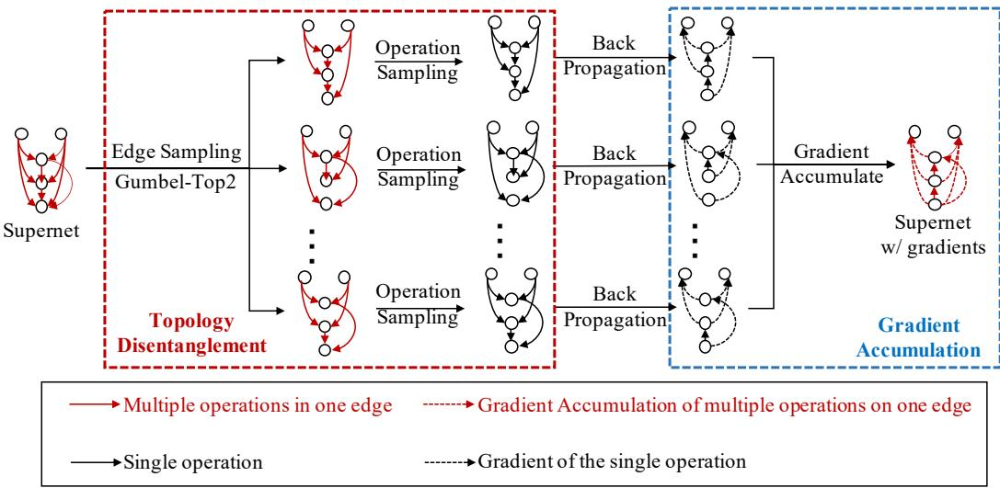
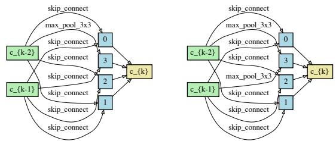
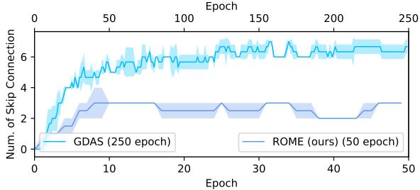
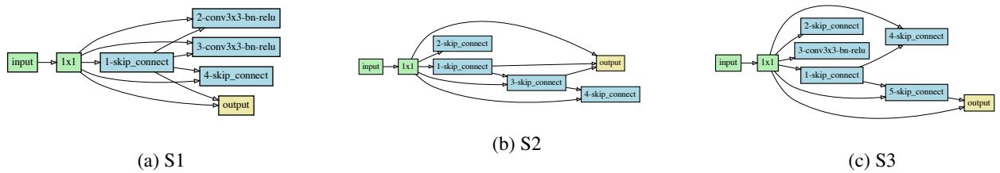
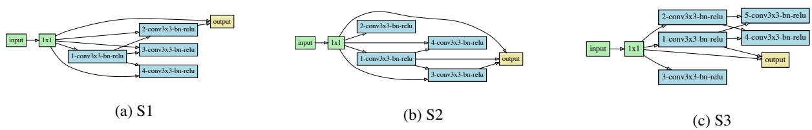

# ROME: Robustifying Memory-Efficient NAS via Topology Disentanglement and Gradient Accumulation

Xiaoxing Wang\*1, Xiangxiang Chu∗2, Yuda Fan1, Zhexi Zhang1, Bo Zhang2, Xiaokang Yang1, and Junchi Yan†1

1Dep. of Computer Science and Engineering & MoE Key Lab of AI, Shanghai Jiao Tong University 2Meituan

## Abstract

Albeit being a prevalent architecture searching approach, differentiable architecture search (DARTS) is largely hindered by its substantial memory cost since the entire supernet resides in the memory. This is where the single-path DARTS comes in, which only chooses a singlepath submodel at each step. While being memory-friendly, it also comes with low computational costs. Nonetheless, we discover a critical issue of single-path DARTS that has not been primarily noticed. Namely, it also suffers from severe performance collapse since too many parameterfree operations like skip connections are derived, just like DARTS does. In this paper, we propose a new algorithm called RObustifying Memory-Efficient NAS (ROME) to give a cure. First, we disentangle the topology search from the operation search to make searching and evaluation consistent. We then adopt Gumbel-Top2 reparameterization and gradient accumulation to robustify the unwieldy bi-level optimization. We verify ROME extensively across 15 benchmarks to demonstrate its effectiveness and robustness.

## 1. Introduction

Despite the fast development of neural architecture search (NAS) [52] to aid network design in vision tasks like classification [32, 6, 41, 42], object detection [11, 36], and segmentation [22], there has been an urging demand for faster searching algorithms. Early methods based on the evaluation of a huge number of candidate models [52, 31, 16] require unaffordable costs (typically 2k GPU days). In the light of weight-sharing mechanism introduced in SMASH [2], a variety of low-cost approaches have emerged [1, 27, 24]. DARTS [24] has taken the dominance with a myriad of follow-up works [38, 3, 39, 10, 5, 47]. In this paper, we investigate a single-path based variation of DARTS, typically GDAS [10], for its fast speed and low GPU memory.

Unlike many DARTS variants that have to perform all candidate operations, single-path methods [30, 10, 39], also termed as memory-efficient NAS1, are developed to sample and activate only a subset of operations in the supernet. For differentiable search, Gumbel-Softmax reparameterization tricks [17, 25] are generally employed [38, 10, 39].

In this paper, we show that single-path methods also suffer from severe performance collapse where many parameterless operations accumulate, akin to that of DARTS as broadly discussed in [48, 4, 39, 8, 20]. We propose a robust algorithm called ROME to resolve this issue.

We observe that single-path methods usually intertwine topology search with operation search, which creates inconsistency between searching and evaluation. We first disentangle the two from each other. Specifically, in addition to the existing architectural parameters (α) that represent the significance of each operation, we involve topology parameters (β) to denote the relative importance of edges. A single-path architecture can then be induced by both α and β. Moreover, to further robustify the searching process, we propose a gradient accumulation strategy during the bilevel optimization. We sketch the framework of ROME in Fig. 1. In a nutshell, our contributions are,

1) Revealing performance collapse in single-path differentiable NAS. Similar to the performance collapse problem in DARTS, the architectures searched by single-path based methods can also be dominated by parameterless operations, especially skip connections. However, this issue hasn’t been deeply explored, which motivates us to propose a new robust, lower memory cost and search cost method.

2) Consistent search and evaluation by disentangling topology search from operation selection. We introduce independent topology parameters to unwind topology from operations, which avoids structure inconsistency between the search and evaluation stage. We further devise Gumbel-Top2 re-parameterization to make our method differentiable and provide its theoretical validity. To our best knowledge, this is the first work to achieve consistent search and evaluation for single-path differentiable NAS.

  
Figure 1: ROME (v2): Gumbel-Top2 is devised to sample edges to satisfy the restriction that each node has in-degree 2. Subnetworks apply forward and backward independently. Gradients are accumulated to update the supernet weights at once.

3) Robustifying bi-level optimization via gradient accumulation. We devise two gradient accumulation techniques to address the aforementioned issue. One helps fair training for each candidate operations. The other instead reduces the estimation variance on architectural weights.

4) Strong performance while maintaining low memory cost. Tested on the popular settings2 for NAS [48, 21, 6], our approach achieves state-of-the-art on various search spaces and datasets across 15 benchmarks. Our approach is fast, robust, and memory efficient. Compared with GDAS and PC-DARTS, our approach costs 26% and 38% lower memory in the standard search space of DARTS respectively. The source code will be made publicly available.

## 2. Related Work

Differentiable Neural Architecture Search. Similar to [53, 27] that uses a directed acyclic graph to represent a cell, DARTS [24] constructs a cell-based supernet and further introduces architectural weights to represent the importance of each operation. DARTS proposes two types (firstorder and second-order) of approximation that alternatively update operation parameters and architectural weights with stochastic gradient descent. However, since the supernet subsumes all connections and operations within the search space, DARTS risks exhausting GPU memory. A possible attempt to resolve this issue is done by progressively pruning operations [5], which is still an indirect approach and requires strong regularization tricks. Apart from that, recent works [48, 4] also point out an instability phenomenon of DARTS. These issues significantly restrict its application.

Memory-efficient NAS. To reduce GPU memory cost, several prior works have revised the forward procedure of the supernet. PC-DARTS [40] makes use of partial connections instead of the full-fledged supernet. Some works [37, 36, 35] proposes to merge all parametric operations into one convolution, a similar super-kernel strategy is also used in single-path NAS [30]. ProxylessNAS [3] samples two operations on each edge during the search process, which enables proxyless searching on large datasets. Single-path supernets like SPOS [13] and FairNAS [7] sample only a single path at each iteration, however, both require an additional searching stage to choose the final models. Single-path differentiable methods like GDAS [10] sample a subgraph of the DAG at each iteration, which is by far the most efficient. However, we observe that a severe instability issue occurs, which has been previously neglected.

Performance collapse of DARTS. The collapse issue is one of the most critical problems in differentiable architecture search [20, 40, 8, 4, 48]. It has been shown that DARTS [24] prefers to choose parameterless operations, leading to its performance collapse [20, 8]. Recent works [48, 4] utilize the eigenvalue of the Hessian matrix as an indicator of collapse and design various techniques to regularize high eigenvalues. Instead, other works [20, 5] directly constrain the number of skip connections as 2 to avoid collapse. Nonetheless, the previous methods are specifically designed for the full-path training scheme. Whereas the collapse problem in single-path has been rarely studied.

  
Figure 2: Two failure examples of GDAS [10] in the DARTS search space in our experiment by running the authors’ code, where normal cells are full of parameterless operations. The average accuracy is 96.52% on CIFAR-10, while models searched by our method can achieve 97.42%.

  
Figure 3: Evolution of the number of skip connections in a normal cell of GDAS vs. ROME.

## 3. Methodology

## 3.1. Collapse in Single-Path Differentiable NAS

DARTS [24] optimizes a supernet stacked by normal cells and reduction cells. A cell owns N nodes $\{ x _ { i } \} _ { i = 1 } ^ { N }$ denoting latent representation. Edge $e _ { i , j }$ from node $x _ { i }$ to $x _ { j }$ integrates all candidate operations O whose importance is represented by architecture parameter $\alpha _ { i , j } ^ { o } .$ Since the weights of all operations are involved in the forward and backward process, DARTS is very memory-consuming.

To reduce memory cost, GDAS [10] proposes to sample a sub-set of operations at each iteration. For edge $e _ { i , j } ,$ a one-hot random vector $z _ { i , j } \in \{ 0 , 1 \} ^ { | \mathcal { O } | }$ is sampled, indicating only one candidate operation is selected during the forward pass and back-propagation.

However, we observe that the normal cell learned by GDAS has 4 skip connections, and GDAS (FRC) even contains 5 skip connections, implying performance collapse issue also exists in single-path based methods.

We rerun the released code of GDAS [10] for several times and observe that the normal cells are dominated by skip connections and max pooling, shown in Fig. 2. We also draw the evolution of skip connections of GDAS in Fig. 3.

## 3.2. Possible Reasons of Performance Collapse

We conjecture that the following two factors contribute most to the collapse issue, which motivates us to provide a remedy in each regard.

Inconsistency between the searching and evaluation stage. Structural inconsistency between the supernet and the final network mainly appears at the operation level and the topology level. Operation-level inconsistency, $i . e . ,$ searching with many operations but evaluating only with the most significant one, has been alleviated in recent single-path methods [10, 39] by sampling one operation on each edge at each iteration in the search phase. However, topology-level inconsistency has long been neglected. Specifically, the nodes in the supernet connect with all its predecessors, while the nodes in the final network must only have in-degree 2. In this paper, we eliminate such inconsistency by disentangling topology and operation search.

Insufficient sampling for candidate operations. The instability issue for single-bath methods can be largely attributed to its stochastic nature that involves sub-sampling. Specifically, at each iteration, only one operation is sampled for each edge, resulting in an insufficient training of weights θ. It also causes high variance for the gradients of $\alpha ,$ hence influencing the searching convergence. To this end, we propose multiple sampling and gradient accumulation to train the supernet and reduce the gradient variance of architectural weights.

Based on the above reasoning, we propose topology disentanglement (Sec 3.3) to resolve inconsistency and gradient accumulation (Sec 3.6) to rectify the instability caused by insufficient sampling. Fig. 3 illustrate the number of skip connections in a normal cell searched by GDAS and our method (ROME), showing that our method can effectively alleviate the collapse issue.

## 3.3. Topology Disentanglement

To disentangle the search for topology and operations on each edge, we use an indicator $B _ { i , j } \in \{ 0 , 1 \}$ to denote whether edge $e _ { i , j }$ is selected, and $A _ { i , j } ^ { o } \in \{ 0 , 1 \}$ for whether operation o on edge $e _ { i , j }$ is selected. Sampling architecture $z$ with M connections can be decomposed into two parts: sample M edges first, and their operations second.

Sampling for edges. Topology inconsistency exists in single-path based methods [10, 39], as all 14 edges in a cell are selected in the search stage but the final architecture only has 8 edges. To address this issue, we propose to sample the same number of edges in search.

Each intermediate node should connect with exact two predecessors, satisfying DARTS’s constraints. Formally, we use $B _ { i , j }$ to indicate whether the edge $e _ { i , j }$ between node $x _ { i }$ and $x _ { j }$ is sampled, and we enforce,

$$
\sum _ { i < j } B _ { i , j } = 2 , \quad \forall j .\tag{1}
$$

We give two techniques of edge sampling in Sec 3.4.

Sampling for operations. We use $A _ { i , j } ^ { o }$ to denote whether the operator o is sampled on the edge $e _ { i , j } ,$ , and we adopt Gumbel-Max technique to sample operations, where $\mathbf { \delta } _ { g _ { i , j } ^ { o } } ^ { o }$ is sampled from Gumbel(0, 1) distribution3, and $\begin{array} { r c l } { \tilde { \pmb { \alpha } } _ { i , j } ^ { o } } & { = } & { \frac { \exp ( \pmb { \alpha } _ { i , j } ^ { o } ) } { \sum _ { o ^ { \prime } \in \mathcal { O } } \exp ( \pmb { \alpha } _ { i , j } ^ { o ^ { \prime } } ) } } \end{array}$ is the normalized architectural weights:

$$
A _ { i , j } = \mathrm { o n e \_ h o t } \left[ \arg \operatorname* { m a x } _ { o \in \mathcal { O } } ( \log \tilde { \alpha } _ { i , j } ^ { o } + g _ { i , j } ^ { o } ) \right] \in \mathbb { R } ^ { | \mathcal { O } | } ,\tag{2}
$$

To make the objective function differentiable to architectural weights $\alpha .$ , we relax the discrete distribution to a continuous one by Gumbel-Softmax:

$$
\begin{array} { c } { { \tilde { A } _ { i , j } ^ { o } = \displaystyle \frac { \exp \left[ ( \log \tilde { \alpha } _ { i , j } ^ { o } + g _ { i , j } ^ { o } ) / \tau \right] } { \sum _ { o ^ { \prime } = 1 } ^ { | \mathcal { O } | } \exp \left[ ( \log \tilde { \alpha } _ { i , j } ^ { o ^ { \prime } } + g _ { i , j } ^ { o ^ { \prime } } ) / \tau \right] } , } } \\ { { A _ { i , j } = \mathrm { o n e \_ h o t } \left[ \mathrm { a r g } \operatorname* { m a x } _ { o \in \mathcal { O } } \tilde { A } _ { i , j } ^ { o } \right] , } } \end{array}\tag{3}
$$

where the temperature τ gradually decreases in search.

## 3.4. From Gumbel-Max to Gumbel-Top2 Reparameterization

We propose two variations of edge sampling techniques, i.e. Gumbel-Max and Gumbel-Top2, based on which we derive two versions of ROME (v1 and v2).

## 3.4.1 Gumbel-Max (ROME-v1).

Suppose node $x _ { j }$ has $j$ possible predecessors, there are $\frac { j \times ( j - 1 ) } { 2 }$ types of edge choices. We use $I _ { i } ^ { ( i , k ) } ( i < k < j )$ to indicate whether node $x _ { j }$ is connected both to $x _ { i }$ and $x _ { k } .$ , i.e. when $I _ { i } ^ { ( i , k ) } = 1$ , we have $B _ { i , j } = B _ { k , j } = 1$ and $B _ { m , j } = 0 ( \forall m \textless j , m \neq i , j )$

We then set a trainable variable $\beta _ { j } ^ { ( i , k ) }$ to denote the importance of each edge choice for node $x _ { j }$ , such that

$$
p \left( \pmb { I } _ { j } ^ { ( i , k ) } = 1 \right) = \frac { \exp ( \beta _ { j } ^ { ( i , k ) } ) } { \sum _ { i ^ { \prime } < k ^ { \prime } < j } \exp ( \beta _ { j } ^ { ( i ^ { \prime } , k ^ { \prime } ) } ) } \triangleq \tilde { \beta } _ { j } ^ { ( i , k ) } .\tag{4}
$$

We use Gumbel-Max technique where $\mathbf { \Delta } \mathbf { g } _ { j } ^ { ( i , k ) }$ obeys Gumbel (0,1) distribution,

$$
\begin{array} { r } { I _ { j } = \mathrm { o n e \_ h o t } \left[ \mathrm { a r g \operatorname* { m a x } } _ { i < k < j } ( \log \tilde { \beta } _ { j } ^ { ( i , k ) } + g _ { j } ^ { ( i , k ) } ) \right] \in \mathbb { R } ^ { \frac { j \times ( j - 1 ) } { 2 } } . } \end{array}\tag{5}
$$

Take a cell as a whole, if edge $e _ { i , j }$ is sampled, there must be another chosen $e _ { k , j }$ . Thus $\mathbf { B } _ { i , j }$ can be formulated by $\mathbf { I } _ { j }$

$$
B _ { i , j } = \sum _ { k < i } I _ { j } ^ { ( k , i ) } + \sum _ { k > i } I _ { j } ^ { ( i , k ) } .\tag{6}
$$

Gumbel-Softmax reparameterization is used to retain gradient information,

$$
\tilde { I } _ { j } ^ { ( i , k ) } = \frac { \exp \left\{ \left[ \log \tilde { \beta } _ { j } ^ { ( i , k ) } + g _ { j } ^ { ( i , k ) } \right] / \tau \right\} } { \sum _ { s < t < j } \exp \left\{ \left[ \log \tilde { \beta } _ { j } ^ { ( s , t ) } + g _ { j } ^ { ( s , t ) } \right] / \tau \right\} } ,
$$

## 3.4.2 Gumbel-Top2 (ROME-v2).

Enumerating all possible edge combinations as in ROMEv1 is straightforward but superfluous, hence in ROME-v2 we directly sample two edges per node. We define the probability of each edge $e _ { i , j } \mathrm { ~ a s ~ } p ( e _ { i , j } )$ . Given edge importance is denoted by $\beta _ { i }$ , the sampling probability $p ( e _ { i , j } ) =$ $\begin{array} { r } { \frac { \exp ( \beta _ { i , j } ) } { \sum _ { k < j } \exp ( \beta _ { k , j } ) } \triangleq \tilde { \beta } _ { i , j } . } \end{array}$

To satisfy the constraints on the cell topology (Eq. 1), ROME-v2 extends Gumbel-Max to Gumbel-Top2:

$$
\tilde { B } _ { i , j } = \frac { \exp \left( ( \log \tilde { \beta } _ { i , j } + g _ { i , j } ) / \tau \right) } { \sum _ { i ^ { \prime } < j } \exp \left( ( \log \tilde { \beta } _ { i ^ { \prime } , j } + g _ { i ^ { \prime } , j } ) / \tau \right) } ,\tag{7}
$$

$$
B _ { i , j } = \left\{ \begin{array} { l l } { 1 , } & { i \in \arg \mathrm { t o p } 2 ( \tilde { B } _ { i ^ { \prime } , j } ) } \\ { ~ } & { i ^ { \prime } < j } \\ { 0 , } & { o t h e r w i s e } \end{array} \right.\tag{8}
$$

We also demonstrate that the Gumbel-Top2 technique is equivalent to sampling two different edges without replacement with probability simplex $p _ { i } ,$ so that Gumbel-Top2 sampling can be made differentiable.

## 3.5. Theoretical Proof on Gumbel-Top2

We show that our Gumbel-Top2 technique is equivalent to sampling two different edges without replacement with probability simplex $p _ { i }$ , so that Gumbel-Top2 sampling can be made differentiable. We sketch our proof as follows.

Let $p _ { i }$ be the probability of sampling $e _ { i }$ by a single choice among n predecessors. Without loss of generality, we compute the probability of sampling $e _ { 1 }$ in two schemes, and show they are in fact equivalent.

1. Sampling two edges without replacement: the probability of $e _ { 1 }$ being sampled is $\textstyle p _ { 1 } + \sum _ { i = 2 } ^ { n } p _ { i } { \frac { p _ { 1 } } { 1 - p _ { i } } }$

2. Sampling with Gumbel-Top2: Gumbel random variable $g _ { i }$ is obtained by sampling a uniform random variable $\epsilon _ { i }$ from $[ 0 , 1 ]$ , i.e. $g _ { i } = - \log ( - \log \epsilon _ { i } )$ . Then the edges are ranked by $( \log p _ { i } + g _ { i } )$ among which the top two are chosen. There are two cases when $e _ { 1 }$ is sampled,

(a) $e _ { 1 }$ ranks first, and the probability of $e _ { 1 }$ being sampled is $p _ { 1 }$ due to Gumbel-Max scheme.

(b) $e _ { 1 }$ ranks second, and $e _ { i }$ ranks first. We can directly get its probability,

$$
\begin{array} { l } { { \displaystyle \int _ { 0 } ^ { 1 } \epsilon _ { 1 } ^ { p _ { 2 } / p _ { 1 } } \epsilon _ { 1 } ^ { p _ { 3 } / p _ { 1 } } \cdot \cdot \cdot \ ( 1 - \epsilon _ { 1 } ^ { p _ { i } / p _ { 1 } } ) \cdot \cdot \cdot \epsilon _ { 1 } ^ { p _ { n } / p _ { 1 } } d \epsilon _ { 1 } } } \\ { { = \displaystyle \int _ { 0 } ^ { 1 } ( 1 - \epsilon _ { 1 } ^ { p _ { i } / p _ { 1 } } ) \epsilon _ { 1 } ^ { \frac { 1 - p _ { i } } { p _ { 1 } } - 1 } d \epsilon _ { 1 } = p _ { i } \frac { p _ { 1 } } { 1 - p _ { i } } . } } \end{array}
$$

The probability of edge $e _ { 1 }$ being sampled is thus $p _ { 1 } +$ $\scriptstyle \sum _ { i = 2 } ^ { n } p _ { i } { \frac { p _ { 1 } } { 1 - p _ { i } } }$

## 3.6. Gradient Accumulation

Lastly, we tackle the issues caused by insufficient sampling. Suppose architectural weights α and $\beta$ be the parameters of a distribution for architectures. A candidate architecture z is obtained by independently sampling edges and operations. Suppose z owns M edges $\{ e _ { 1 } , . . . , e _ { M } \}$ and the corresponding operations $\big \{ o _ { 1 } , . . . , o _ { M } \big \}$ , then the probability of z being selected is given by

$$
p ( z ; \alpha , \beta ) = \prod _ { i = 1 } ^ { M } p ( e _ { i } ; \beta ) \times p ( o _ { i } | e _ { i } ; \alpha ) .\tag{9}
$$

The search process can be thus modeled as finding optimal α and $\beta$ to minimize the expectation of validation loss of the architectures as Eq. 10, where $\pmb { \theta } _ { z } ^ { \ast }$ denotes the optimal operation parameters for the sampled architecture z.

$$
\begin{array} { r l } & { \underset { \pmb { \alpha } , \beta } { \operatorname* { m i n } } \quad \mathbb { E } _ { z \sim p ( z ; \pmb { \alpha } , \pmb { \beta } ) } \left[ L _ { v a l } ( \pmb { \theta } _ { z } ^ { * } , z ) \right] , } \\ & { \mathrm { s . t . } \quad \pmb { \theta } _ { z } ^ { * } = \arg \underset { \pmb { \theta } } { \operatorname* { m i n } } L _ { t r a i n } ( \pmb { \theta } , z ) } \end{array}\tag{10}
$$

However, architecture z changes at each iteration while the corresponding operation weights ω are updated only once. Apparently, single-path approaches suffer from two problems: unfair and biased training for candidate operations, and creating large variance for architectural weights.

We propose two effective techniques based on gradient accumulation. First, to boost fair training for operations, we sample K sub-models from the supernet and accumulate gradients for each sub-model within one iteration. Weights ω are updated by the accumulation of gradients from K sub-models. Second, to reduce the variance for architectural weights, we sample another K sub-models and average the gradients of architectural weights. Suppose that the gradient of α be a random variable whose variance is $\sigma ^ { 2 }$ then averaging among K samples reduces the variance to $\sigma ^ { 2 } / K$ . Specifically, we alternately update operation parameters θ and architectural parameters α (similar for β) as:

Algorithm 1 ROME (with two versions v1 and v2).   
Input: iteration count T; number of sampling K; initialized   
operation parameters θ; and architectural weights $\alpha , \beta ;$   
Output: optimal architecture $z ^ { * } ;$   
1: for $t = 1  T$ do   
2: Sample two batches of data samples $D _ { s }$ and $D _ { t }$ from   
two disjoint datasets;   
3: for $k = 1  K$ do   
4: Topology sampling by Eq. 6 (v1) or Eq. 7 (v2);   
Operation sampling by Eq. 3;   
5: Get sampled architecture z ;   
6: end for   
7: Gradient accumulation and update α, β by Eq. 11 on   
$D _ { s } .$ , where $L _ { v a l }$ is cross entropy;   
8: for $k = 1  K$ do   
9: Topology sampling by Eq. 6 (v1) or Eq. 7 (v2);   
Operation sampling by Eq. 3;   
10: Get sampled architecture $z _ { k } ^ { \prime } ;$   
11: end for   
12: Gradient accumulation and update θ by Eq. 12 on   
$D _ { t } ,$ where $L _ { t r a i n }$ is cross entropy;   
13: end for   
14: return: $z ^ { * } = \arg$ max $p ( z ; \alpha , \beta )$   
z

$$
\alpha  \alpha - \frac { 1 } { K } \sum _ { k = 1 } ^ { K } \nabla _ { \alpha } L _ { v a l } ( \pmb \theta , z _ { k } ) ,\tag{11}
$$

$$
\pmb { \theta } \gets \pmb { \theta } - \sum _ { k = 1 } ^ { K } \nabla _ { \pmb { \theta } } L _ { t r a i n } ( \pmb { \theta } , z _ { k } ^ { \prime } ) ,\tag{12}
$$

where $z _ { k } , z _ { k } ^ { \prime }$ denote the sampled architectures. We can now summarize our ROME method wholely in Alg. 1.

## 4. Experiments

## 4.1. Protocols

Search spaces. In this paper, we denote DARTS’s search space as S0, which comprises a stack of duplicate normal cells and reduction cells. Each cell is represented by a DAG with 4 intermediate nodes. Candidate operations between each two nodes are {maxpool, avgpool, skip connect, sep conv 3×3 and $5 \times 5 ,$ dil conv 3×3 and $5 { \times } 5 \}$ . We exclude {none} operation from the default DARTS search space to satisfy the topology constraint in Eq. 1. Under S0 space, we search and evaluate on CIFAR-10 [18] and ImageNet [9] respectively.

We also conduct experiments on four reduced search spaces, S1-S4, introduced by R-DARTS [48] to evaluate the stability of our method. S1 is a pre-optimized search space, where each edge in the supernet has a predefined set of candidate operations. In the other 3 search spaces, candidate operations on each edge are the same (see the details in the supplementary). Following [48], we search and evaluate in these 4 search spaces on CIFAR-10, CIFAR-100 [18], and SVHN [26] (12 benchmarks in total).

  
Figure 4: GDAS fails on NAS-Bench-1Shot1 [49] when searching on CIFAR-10 in all three search spaces when skip connection are added into choices. In each MixedOp, we have three choices: {maxpool3x3, conv3x3-bn-relu, skip-connect}.

  
Figure 5: ROME-V2 resolves the aggregation of skip connections on NAS-Bench-1Shot1 [49]. Notice intermediate node concatenate their outputs as the input for the output node, while some have loose ends and don’t feed to the output node.

Search settings. Similar to DARTS, the supernet consists of 8 cells with 16 initial channels. We search for 50 epochs and set the sampling number K = 7. Unless explicitly written, ROME-v2 is used by default throughout the paper since it is more efficient and robust. For operation parameters, we use the SGD optimizer with a momentum of 0.9 and an initial lr of 0.05; For architectural weights, we adopt the Adam optimizer with an initial lr of 3 × 10−4.

Evaluation settings. We use standard evaluation settings as DARTS [24] by training the inferred model for 600 epochs using SGD with a batch size of 96. For search space S0, inferred models are constructed by stacking 20 cells with 36 initial channels, and trained under the same settings following [5, 24]. For S1-S4, we strictly follow the settings in R-DARTS [48] for a fair comparison.

## 4.2. Robustness Evaluation

For comprehensive evaluation, we follow the recommended best practices for NAS by [21, 48, 4, 6, 8] to report the mean and variance across several times of parallel searching with various random seeds, through which the robustness of a method can be measured. We appeal to the community for avoiding a common mistake that trains a single best-searched model several times, which only tests the convergence stability of a single model.

Discussion on collapse behavior across popular NAS benchmarks. We argue that excluding an important operation for search space can cause illusive conclusions. Specifically, NAS-Bench-1Shot1 [49] suggests that Gumbelbased NAS is quite robust. However, this observation is laying on the basis that popular skip connections are not included in the search space [44]. After adding skip connection into the choices, we perform GDAS using their released code, whose best model found is full of skip connections, which again supports our discovery of collapse issue in single-path based NAS, as shown in Fig. 4. In contrast, ROME does not suffer the same issue in these search spaces, as shown in Fig. 5.

Robustness evaluation on 12 hard benchmarks. We follow R-DARTS [48] to evaluate the performance and across 3 datasets in S1-S4 search spaces, see Table 1. Our methods robustly outperform other methods with a clear margin across all these benchmarks.

Additionally, we observe that parameterless operations in GDAS dominate the normal cell in both S2 and S3, while our method effectively handles their numbers and thus stabilizes the searching stage.

## 4.3. Performance Comparison

Performance in S0 on CIFAR. We follow DARTS [24] and search on the CIFAR-10. Table 2 shows that ROME achieves state-of-the-art performance with only 0.3 GPUdays4. ROME has an average of 2.58±0.07% error rate, which is slightly higher than up-to-date SOTAs such as SDARTS-ADV [4]. However, ROME is more than 4× faster. Compared with R-DARTS [48], ROME robustly outperforms it with 5× fewer search costs. Our best model achieves 97.52% accuracy with 3.6M parameters.

<table><tr><td colspan="2" rowspan="2">Benchmark</td><td>DARTS†</td><td> $\mathbf { E S } ^ { \dagger }$ </td><td> $\mathbf { A D A } ^ { \dagger }$ </td><td colspan="2">GDAS</td><td colspan="2">ROME</td></tr><tr><td>Error (%)</td><td>Error (%)</td><td> $\mathrm { E r r o r } ( \% )$ </td><td>Error (%)</td><td>Num</td><td>Error(%)</td><td>Num</td></tr><tr><td rowspan="5">C10</td><td>S1</td><td> $4 . 6 6 { \pm } 0 . 7 1$ </td><td> $3 . 0 5 { \pm } 0 . 0 7$ </td><td> $3 . 0 3 { \pm } 0 . 0 8$ </td><td> $2 . 8 9 { \pm } 0 . 0 9$ </td><td> $3 . 8 { \pm } 0 . 4 $ </td><td> $\pm \mathbf { 0 . 6 6 } \pm \mathbf { 0 . 0 6 }$ </td><td> $1 . 3 { \pm } 0 . 4 $ </td></tr><tr><td>S2</td><td> $4 . 4 2 { \pm } 0 . 4 0$ </td><td> $3 . 4 1 { \pm } 0 . 1 4$ </td><td> $3 . 5 9 { \pm } 0 . 3 1$ </td><td> $3 . 8 9 { \pm } 0 . 1 7$ </td><td> $6 . 0 { \pm } 0 . 7$ </td><td> ${ \bf 3 . 1 4 \pm 0 . 1 4 }$ </td><td> $2 . 0 { \pm } 0 . 0 $ </td></tr><tr><td>S3</td><td> $4 . 1 2 { \pm } 0 . 8 5$ </td><td> $3 . 7 1 { \pm } 1 . 1 4$ </td><td> $2 . 9 9 { \pm } 0 . 3 4$ </td><td> $3 . 0 4 { \pm } 0 . 1 0$ </td><td> $6 . 5 { \pm } 0 . 5 $ </td><td> $\mathbf { 2 . 6 1 { \pm } 0 . 0 0 }$ </td><td> $2 . 0 { \pm } 0 . 0 $ </td></tr><tr><td>S4</td><td> $6 . 9 5 { \pm } 0 . 1 8$ </td><td> $4 . 1 7 { \pm } 0 . 2 1$ </td><td> $3 . 8 9 { \pm } 0 . 6 7$ </td><td> $3 . 3 4 \pm 0 . 1 0$ </td><td> $0 . 0 { \pm } 0 . 0 \ $ </td><td> ${ \bf 3 . 2 1 } { \bf \pm 0 . 1 2 }$ </td><td> $0 . 0 { \pm } 0 . 0 \ $ </td></tr><tr><td>S1</td><td> $2 9 . 9 3 { \pm } 0 . 4 1 $ </td><td> $2 8 . 9 0 { \pm } 0 . 8 1 $ </td><td> $2 4 . 9 4 { \pm } 0 . 8 1$ </td><td>24.49±0.08</td><td> $4 . 0 { \pm } 0 . 0 \ $ </td><td> $\pm 2 . 7 1 \pm \mathbf { 0 . 7 1 }$ </td><td> $2 . 3 { \pm } 0 . 4 $ </td></tr><tr><td rowspan="4">C100</td><td>S2</td><td> $2 8 . 7 5 { \scriptstyle \pm 0 . 9 2 }$ </td><td> $2 4 . 6 8 { \pm } 1 . 4 3 $ </td><td> $2 6 . 8 8 { \pm } 1 . 1 1 $ </td><td>24.57±0.47</td><td> $6 . 3 { \pm } 0 . 4 $ </td><td> $\mathbf { 2 2 . 9 1 } \pm \mathbf { 0 . 7 5 }$ </td><td>3.5±0.5</td></tr><tr><td>S3</td><td> $2 9 . 0 1 { \scriptstyle \pm 0 . 2 4 }$ </td><td> $2 6 . 9 9 { \pm } 1 . 7 9$ </td><td> $2 4 . 5 5 { \pm } 0 . 6 3$ </td><td> $2 2 . 8 6 { \pm } 0 . 1 7$ </td><td> $3 . 0 { \pm } 0 . 7$ </td><td> $\pm 2 . 4 3 { \pm } 0 . 3 6$ </td><td>2.5±0.5</td></tr><tr><td>S4</td><td> $2 4 . 7 7 { \pm } 1 . 5 1 $ </td><td> $2 3 . 9 0 { \pm } 2 . 0 1 $ </td><td> $2 3 . 6 6 { \pm } 0 . 9 0$ </td><td> $2 4 . 1 4 { \pm } 0 . 8 9$ </td><td> $2 . 3 { \pm } 1 . 1$ </td><td> $\mathbf { 2 0 . 9 5 } \pm \mathbf { 0 . 4 5 }$ </td><td>0.0±0.0</td></tr><tr><td>S1</td><td> $9 . 8 8 { \pm } 5 . 5 0 $ </td><td> $2 . 8 0 { \pm } 0 . 0 9$ </td><td> $2 . 5 9 { \pm } 0 . 0 7$ </td><td> $2 . 4 8 { \pm } 0 . 0 4$ </td><td> $2 . 8 { \pm } 0 . 4 $ </td><td> $\pm \mathbf { 0 . 3 4 } \pm \mathbf { 0 . 0 6 }$ </td><td> $0 . 8 { \pm } 0 . 4 $ </td></tr><tr><td rowspan="4">SVHN</td><td>S2</td><td> $3 . 6 9 { \pm } 0 . 1 2$ </td><td> $2 . 6 8 { \pm } 0 . 1 8$ </td><td> $2 . 7 9 { \pm } 0 . 2 2$ </td><td> $3 . 0 5 { \pm } 0 . 0 2$ </td><td> $7 . 8 { \pm } 0 . 4 $ </td><td> $\mathbf { 2 . 4 1 { \pm } 0 . 0 7 }$ </td><td> $1 . 0 { \pm } 0 . 0 $ </td></tr><tr><td>S3</td><td> $4 . 0 0 { \pm } 1 . 0 1 $ </td><td> $2 . 7 8 { \pm } 0 . 2 9$ </td><td> $2 . 5 8 { \pm } 0 . 0 7$ </td><td> $3 . 6 2 { \pm } 0 . 3 6$ </td><td> $7 . 5 { \pm } 0 . 5 $ </td><td> $\mathbf { 2 . 5 6 { \pm } 0 . 0 3 }$ </td><td> $1 . 5 { \pm } 0 . 5 $ </td></tr><tr><td>S4</td><td> $2 . 9 0 { \pm } 0 . 0 2$ </td><td> $2 . 5 5 { \pm } 0 . 1 5$ </td><td> $2 . 5 2 { \pm } 0 . 0 6$ </td><td> $2 . 5 1 { \pm } 0 . 0 6$ </td><td> $1 . 5 { \pm } 1 . 5 $ </td><td> $\pm \mathbf { 0 . 3 4 } \pm \mathbf { 0 . 0 0 }$ </td><td> $0 . 0 { \pm } 0 . 0 \ $ </td></tr><tr><td></td><td></td><td></td><td></td><td></td><td></td><td></td><td></td></tr></table>

Table 1: Comparison in 4 search spaces and 3 datasets. For each algorithm, we independently search for 3 times under the settings in R-DARTS [48] and report the averaged performance. ‘EA’ and ‘ADA’ are two methods proposed by R-DARTS. ‘Num’: To reveal the collapse issue, we also report the average number of parameterless operations in the discovered normal cell for GDAS and ROME †: Results are obtained from R-DARTS.

<table><tr><td>Models</td><td>Params FLOPs (M) (M)</td><td>Error (%)</td><td>Cost GPU Days</td><td>SP</td></tr><tr><td>DARTS-V1 [45]</td><td></td><td> $3 . 3 8 { \pm } 0 . 2 3$ </td><td>0.4</td><td>x</td></tr><tr><td>P-DARTS [5]‡</td><td> $3 . 3 \pm 0 . 2 5 4 0 \pm 3 4 2 . 8 1 \pm 0 . 1 4$ </td><td></td><td>0.3</td><td>x</td></tr><tr><td>PC-DARTS [40]‡</td><td> $3 . 6 { \pm } 0 . 5 5 9 2 { \pm } 9 0 2 . 8 9 { \pm } 0 . 2 2$ </td><td></td><td>0.1</td><td>x</td></tr><tr><td> $\mathrm { P R \mathrm { - } D A R T S \ [ 5 1 ] ^ { \ddagger } }$ </td><td>3.4</td><td> $2 . 6 8 { \pm } 0 . 1 0$ </td><td>0.2</td><td>x</td></tr><tr><td>ISTA-NAS [43] +</td><td>3.3</td><td> $2 . 7 1 { \pm } 0 . 1 0$ </td><td>0.05</td><td>x</td></tr><tr><td>R-DARTS [48]</td><td></td><td> $2 . 9 5 { \pm } 0 . 2 1$ </td><td>1.6</td><td>x</td></tr><tr><td>SDARTS-ADV [4]</td><td>3.3</td><td> $2 . 6 1 { \pm } 0 . 0 2$ </td><td>1.3</td><td>x</td></tr><tr><td>DARTS-PT [33]</td><td>3.0</td><td> $2 . 6 1 { \pm } 0 . 0 8$ </td><td>0.8</td><td>x</td></tr><tr><td>NASI-FIX [29]</td><td>3.9</td><td> $2 . 7 9 { \pm } 0 . 0 7$ </td><td>0.24</td><td>x</td></tr><tr><td>ZARTS [34]</td><td>3.7</td><td> $2 . 5 4 \pm 0 . 0 7$ </td><td>1.0</td><td>x</td></tr><tr><td>Few-shot NAS [50]</td><td>3.8</td><td> $2 . 3 1 { \pm } 0 . 0 8$ </td><td>1.35</td><td>x</td></tr><tr><td>GDAS [10]</td><td>3.4</td><td>2.93</td><td>0.2</td><td>√</td></tr><tr><td>SNAS [39]</td><td>2.8</td><td> $2 . 8 5 { \pm } 0 . 0 2$  一</td><td>1.5</td><td>√</td></tr><tr><td>ROME-v1 (best)</td><td>4.5</td><td>683</td><td>2.53 0.3</td><td>√</td></tr><tr><td>ROME-v1 (avg.)</td><td></td><td>4.0±0.6 670±21 2.63±0.09</td><td>0.3</td><td>√</td></tr><tr><td>ROME-v2 (best)</td><td>3.6</td><td>591 2.48</td><td>0.3</td><td>√</td></tr><tr><td>ROME-v2 (avg.)</td><td></td><td> $3 . 7 { \pm } 0 . 2 5 9 5 { \pm } 2 8 2 . 5 8 { \pm } 0 . 0 7$ </td><td>0.3</td><td>√</td></tr><tr><td></td><td></td><td></td><td></td><td></td></tr></table>

Table 2: Averaged performance among 4 independent runs of search on CIFAR-10. ‡: reproduced result using their released code since they didn’t report the average performance. †: FLOPs are calculated by their released architecture. SP: single-path based method

<table><tr><td>Models</td><td>Params (M)</td><td>Error (%)</td><td>Cost GPU Days</td></tr><tr><td>ResNet [14]</td><td>1.7</td><td> $2 2 . 1 0 ^ { \circ }$ </td><td>–</td></tr><tr><td>AmoebaNet [28]</td><td>3.1</td><td> $1 8 . 9 3 ^ { \circ }$ </td><td>3150</td></tr><tr><td>PNAS [23]</td><td>3.2</td><td> $1 9 . 5 3 ^ { \circ }$ </td><td>150</td></tr><tr><td>ENAS [27]</td><td>4.6</td><td> $1 9 . 4 3 ^ { \circ }$ </td><td>0.45</td></tr><tr><td>DARTS [24]</td><td></td><td> $2 0 . 5 8 { \pm } 0 . 4 4 ^ { \star }$ </td><td>0.4</td></tr><tr><td>GDAS [10]</td><td>3.4</td><td>18.38</td><td>0.2</td></tr><tr><td>P-DARTS [5]</td><td>3.6</td><td> $1 7 . 4 9 ^ { \ddagger }$ </td><td>0.3</td></tr><tr><td>R-DARTS [48]</td><td>一</td><td> $1 8 . 0 1 { \pm } 0 . 2 6 $ </td><td>1.6</td></tr><tr><td>NASI-FIX [29]</td><td>4.0</td><td> $1 6 . 1 2 { \pm } 0 . 3 8 $ </td><td>0.24</td></tr><tr><td>ZARTS [34]</td><td>4.1</td><td> $1 6 . 2 9 { \scriptstyle \pm 0 . 5 3 }$ </td><td>1.0</td></tr><tr><td>ROME-V1 (avg.)</td><td>4.4±0.2</td><td>17.41±0.12</td><td>0.3</td></tr><tr><td>ROME-V1 (best)</td><td>4.4</td><td>17.33</td><td>0.3</td></tr><tr><td></td><td></td><td></td><td></td></tr><tr><td>ROME-V2 (avg.)</td><td> $3 . 4 { \pm } 0 . 3$ </td><td> $1 7 . 7 1 { \pm } 0 . 1 1 $ </td><td>0.3</td></tr><tr><td>ROME-V2 (best)</td><td>3.3</td><td>17.57</td><td>0.3</td></tr></table>

Table 3: Comparison of searched models on CIFAR-100. ⋄: Reported by [10], ⋆: Reported by [48], ‡:Rerun their code.

We also search on CIFAR-100 and show the results in Table 3. ROME surpasses all the methods and achieves state-of-the-art with only 0.3 GPU-days search cost.

Performance in S0 on ImageNet. First, we transfer the architecture searched on CIFAR-10 to ImageNet following the common practice [24, 5, 19, 8]. Same as [19, 8], we train models for 250 epochs with a batch size of 1024 by SGD optimizer with a momentum of 0.9 and an initial lr of 0.5 base learning rate. We also utilize an auxiliary classifier strategy. The results are shown in Table 4, where ROME achieves 75.3% top-1 accuracy.

<table><tr><td>Models (M)</td><td>FLOPs Params Top-1 (M) (%)</td><td>Cost (GPU days)</td></tr><tr><td>AmoebaNet-A [28] 555</td><td>5.1 74.5</td><td>3150</td></tr><tr><td>NASNet-A [53] 564 PNAS [23] 588</td><td>5.3 74.0</td><td>2000</td></tr><tr><td>DARTS [24] 574</td><td>5.1 74.2</td><td>225</td></tr><tr><td>P-DARTS [5]</td><td>4.7 73.3 577 5.1 75.3</td><td>0.4 0.3</td></tr><tr><td>FairDARTS-B [8]</td><td>541 4.8 75.1</td><td>0.4</td></tr><tr><td>SNAS [39] PC-DARTS [40]</td><td>522 4.3 72.7</td><td>1.5</td></tr><tr><td>GDAS [10]</td><td>586 5.3 74.9</td><td>0.1</td></tr><tr><td>ROME (ours)</td><td>581 5.3 74.0</td><td>0.2</td></tr><tr><td></td><td>576 5.2 75.3</td><td>0.3</td></tr><tr><td>DARTS, P-DARTS</td><td>OOM when batch-size</td><td>≥32</td></tr><tr><td>FairNAS-C [7]</td><td>321 4.4 74.7</td><td>12</td></tr><tr><td>ProxylessNAS [3]</td><td>465 7.1 75.1</td><td>8.3</td></tr><tr><td>FBNet-C [38]</td><td>375 5.5 74.9</td><td>9</td></tr><tr><td>PC-DARTS [40]‡</td><td>597 5.3 75.4</td><td>3.8</td></tr><tr><td>GDAS [10]‡</td><td>405 3.6 72.5</td><td>0.8</td></tr><tr><td>ROME (ours)</td><td>556 5.1 75.5</td><td>0.5</td></tr></table>

Table 4: Performance on ImageNet. The first block indicates the models transferred from CIFAR-10; The second block indicates that the models are directly searched on ImageNet. ‡: reproduced using their released code.

Second, as ROME features low memory cost and great robustness, we directly search on ImageNet as well. We randomly sample 10% images to train operation parameters and another 10% to train architectural weights. A supernet is constructed by stacking 8 cells with 16 initial channels. We search for 30 epochs with K = 3. The batch size is set as 256. Our search cost is reduced to 0.4 GPU days on a single Tesla V100. We fully train the discovered model for 250 epochs with the same evaluation settings as above. Results are illustrated in Tabel 4, showing that ROME achieves 75.5% top-1 accuracy. To make fair comparisons, we reproduce GDAS [10] under the same settings (90 epochs). However, the network is dominated by skip connections and only achieves 72.5% top-1 accuracy.

## 5. Ablation Study

Sensitivity to the Sampling Number K. K is a hyperparameter in our gradient accumulation strategy, which is designed to reduce the variance of noise on $\nabla _ { \alpha } L _ { v a l }$ and stabilizes the search as analyzed in Sec. 3.6.

Table 5 compares the performance by setting K as 1, 4, 7, 10 in ROME. We search and evaluate on CIFAR-10. Three parallel tests on each setting are conducted. Note we adjust the number of search epochs to have same number of iterations per test. We observe that the performance increases monotonically with K which verifies our analysis that biased training shall be alleviated. The result demonstrates the effectiveness of our gradient accumulation strategy. Also, as the accuracy saturates at K=7, we set K=7.

<table><tr><td>K</td><td>Acc (%)</td><td># Params</td><td># Epochs</td></tr><tr><td>1</td><td> $9 7 . 1 2 { \pm } 0 . 0 6 $ </td><td>3.34M</td><td>350</td></tr><tr><td>4</td><td> $9 7 . 2 8 { \pm } 0 . 0 7$ </td><td>3.57M</td><td>87</td></tr><tr><td>7</td><td> $9 7 . 4 2 { \pm } 0 . 0 7$ </td><td>3.73M</td><td>50</td></tr><tr><td>10</td><td> $9 7 . 4 6 { \pm } 0 . 1 2 $ </td><td>4.06M</td><td>35</td></tr></table>

Table 5: Sensitivity study of sampling number K. For each setting, we adjust the number of search epochs according to K for fair comparison. We do three parallel tests on each setting and report the mean and standard deviation.

<table><tr><td rowspan="2">TD</td><td colspan="2"> $\mathrm { G A }$ </td><td rowspan="2"> $\operatorname { A c c } \left( \% \right)$  一</td><td rowspan="2">TD</td><td colspan="2">GA</td><td rowspan="2"> $\operatorname { A c c } \left( \% \right)$ </td></tr><tr><td>θ</td><td>α</td><td>θ</td><td>α</td></tr><tr><td>×</td><td>×</td><td>×</td><td> $9 6 . 5 2 { \pm } 0 . 0 7$ </td><td>√</td><td>×</td><td>×</td><td> $9 7 . 1 2 { \pm } 0 . 0 6 $ </td></tr><tr><td>×</td><td>×</td><td>√</td><td> $9 6 . 8 5 { \pm } 0 . 3 1 $ </td><td>√</td><td>×</td><td>√</td><td> $9 7 . 2 2 { \pm } 0 . 0 7$ </td></tr><tr><td>X</td><td>√</td><td>×</td><td> $9 6 . 9 8 { \pm } 0 . 0 5$ </td><td>√</td><td>√</td><td>×</td><td> $9 7 . 3 4 { \pm } 0 . 0 7$ </td></tr><tr><td>X</td><td>√</td><td>√</td><td> $9 7 . 1 4 { \pm } 0 . 0 5 $ </td><td>√</td><td>√</td><td>√</td><td> $\mathbf { 9 7 . 4 2 \pm 0 . 0 7 }$ </td></tr></table>

Table 6: Component study of ROME on CIFAR-10.

Component analysis for instability issue. There are two major components that contribute to the cure for instability in ROME: topology disentanglement (TD) and gradient accumulation (GA) for θ and α. To show their efficacy, we conduct ablation studies in S0 space on CIFAR-10.

Results are shown in Table 6, where ‘GA for θ’ indicates that gradient accumulation is applied over $K = 7$ sampled architectures to train operation parameters; ‘GA for α’ indicates that gradients for architectural parameters over $K = 7$ sampled architectures is accumulated and averaged. The setting without TD and GA (first line in Table 6) degenerates to GDAS [10]. Our ROME adopts both TD and GA, which is the last line in Table 6.

We observe that TD alone can significantly improve the searching performance, showing that the inconsistency issue is the principal reason for performance collapse. This is as expected. On the one hand, inconsistent topology between search and evaluation results in an inconsistent searching objective; On the other hand, training the weights of 14 operations (w/o TD) is much more difficult than training 8 operations (w/ TD), which degrades the convergence.

Moreover, we observe that gradient accumulation on θ and α can further improve the search performance, which confirms our analysis that performance collapse issue also comes from insufficient sampling.

Memory Analysis. Table 7 compares GPU memory cost in S0 search space on CIFAR-10. ROME has the lowest memory cost thanks to our disentanglement of the search for topology. Unlike GDAS that preserves multiple edges for each node, we strictly sample 2 edges for each node leading to 26% memory reduction compared to GDAS.

<table><tr><td rowspan="2">Method</td><td rowspan="2">DARTS</td><td rowspan="2">GDAS</td><td colspan="2">PC-DARTS</td><td rowspan="2">ROME</td></tr><tr><td>M=4</td><td>M=2</td></tr><tr><td>Memory (G)</td><td>9.4</td><td>3.1</td><td>3.7</td><td>5.7</td><td>2.3</td></tr></table>

Table 7: GPU Memory cost comparison. We measured the cost based on a batch size of 64, where the supernet has 16 initial channels, and 8 layers.

PC-DARTS [40] uses partial channels during the search stage to reduce GPU memory cost, in which the partial ratio is controlled by a hyperparameter M. But M requires careful calibration for different tasks. In contrast, ROME doesn’t require calibrating such an extra hyperparameter and is more memory-efficient.

## 6. Comparison with Prior Works

Here we highlight the difference of ROME from the existing works. 1) ROME vs. DOTS. DOTS [12] explores an edge importance representation for one-shot NAS in a multi-stage fashion but the operations are divided into two groups (parameter-free and parameter-bearing, following DropNAS [15]) beforehand, which is a very strong prior. The length of each stage has to be tuned carefully from dataset to dataset. In contrast, no prior or extra hyperparameters are used in ROME; 2) ROME vs. DDW. Unlike DDW [46] that belongs to dynamic networks with a changeable topology dependent on inputs, ROME is a NAS method designed to search for a static architecture. 3) ROME vs. SNAS. SNAS [3] adopts Gumbel-softmax via masking, whose supernet still resides in the memory and thus not memory-efficient. In contrast, ROME is a truly single-path NAS method and inherits the property of low memory cost. SNAS didn’t deal with the collapse issue either.

## 7. Conclusion

In this paper, we highlight the performance collapse issue of single-path differentiable NAS, and attribute the cause to topology inconsistency between searching and evaluation, as well as the stochastic nature of sampling for candidate operations. To address the above issues, we propose ROME that features topology disentanglement and gradient accumulation strategy to stabilize the searching process. ROME achieves state-of-the-art results across 15 recent popular benchmarks, which manifests its strong performance, low memory cost and robustness.

## Acknowledgments

Xiaoxing Wang and Yuda Fan partly contributed to this work when they were intern at Meituan and now Yuda Fan is with ETHZ. This work was partly supported by National Key R&D Program of China (No. 2022ZD0118700), NSFC (62222607), Shanghai Municipal Science and Technology Major Project (2021SHZDZX0102).

## References

[1] Gabriel Bender, Pieter-Jan Kindermans, Barret Zoph, Vijay Vasudevan, and Quoc Le. Understanding and Simplifying One-Shot Architecture Search. In ICML, pages 549–558, 2018. 1

[2] Andrew Brock, Theodore Lim, James M Ritchie, and Nick Weston. SMASH: One-Shot Model Architecture. Search Through HyperNetworks. In ICLR, 2018. 1

[3] Han Cai, Ligeng Zhu, and Song Han. ProxylessNAS: Direct Neural Architecture Search on Target Task and Hardware. In ICLR, 2019. 1, 2, 8, 9

[4] Xiangning Chen and Cho-Jui Hsieh. Stabilizing differentiable architecture search via perturbation-based regularization. In ICML, 2020. 1, 2, 6, 7

[5] Xin Chen, Lingxi Xie, Jun Wu, and Qi Tian. Progressive Differentiable Architecture Search: Bridging the Depth Gap between Search and Evaluation. In ICCV, 2019. 1, 2, 6, 7, 8

[6] Xiangxiang Chu, Xiaoxing Wang, Bo Zhang, Shun Lu, Xiaolin Wei, and Junchi Yan. {DARTS}-: Robustly stepping out of performance collapse without indicators. In ICLR, 2021. 1, 2, 6

[7] Xiangxiang Chu, Bo Zhang, and Ruijun Xu. Fairnas: Rethinking evaluation fairness of weight sharing neural architecture search. In ICCV, 2021. 2, 8

[8] Xiangxiang Chu, Tianbao Zhou, Bo Zhang, and Jixiang Li. Fair darts: Eliminating unfair advantages in differentiable architecture search. ECCV, 2020. 1, 2, 6, 7, 8

[9] Jia Deng, Wei Dong, Richard Socher, Li-Jia Li, Kai Li, and Li Fei-Fei. ImageNet: A Large-Scale Hierarchical Image Database. In CVPR, pages 248–255. IEEE, 2009. 5

[10] Xuanyi Dong and Yi Yang. Searching for a Robust Neural Architecture in Four GPU Hours. In CVPR, pages 1761– 1770, 2019. 1, 2, 3, 7, 8

[11] Golnaz Ghiasi, Tsung-Yi Lin, and Quoc V Le. Nas-fpn: Learning scalable feature pyramid architecture for object detection. In CVPR, pages 7036–7045, 2019. 1

[12] Yuchao Gu, Lijuan Wang, Yun Liu, Yi Yang, Yu-Huan Wu, Shao-Ping Lu, and Ming-Ming Cheng. DOTS: decoupling operation and topology in differentiable architecture search. In CVPR, 2021. 9

[13] Zichao Guo, Xiangyu Zhang, Haoyuan Mu, Wen Heng, Zechun Liu, Yichen Wei, and Jian Sun. Single Path One-Shot Neural Architecture Search with Uniform Sampling. In ECCV, 2020. 2

[14] Kaiming He, Xiangyu Zhang, Shaoqing Ren, and Jian Sun. Deep Residual Learning for Image Recognition. In CVPR, pages 770–778, 2016. 7

[15] Weijun Hong, Guilin Li, Weinan Zhang, Ruiming Tang, Yunhe Wang, Zhenguo Li, and Yong Yu. Dropnas: Grouped operation dropout for differentiable architecture search. In IJCAI, 2022. 9

[16] Andrew Howard, Mark Sandler, Grace Chu, Liang-Chieh Chen, Bo Chen, Mingxing Tan, Weijun Wang, Yukun Zhu, Ruoming Pang, Vijay Vasudevan, et al. Searching for MobileNetV3. In ICCV, 2019. 1

[17] Eric Jang, Shixiang Gu, and Ben Poole. Categorical reparameterization with gumbel-softmax. In ICLR, 2016. 1

[18] Alex Krizhevsky, Geoffrey Hinton, et al. Learning Multiple Layers of Features from Tiny Images. Technical report, Citeseer, 2009. 5, 6

[19] Guohao Li, Guocheng Qian, Itzel C Delgadillo, Matthias Muller, Ali Thabet, and Bernard Ghanem. Sgas: Sequential¨ greedy architecture search. In CVPR, 2020. 7

[20] Hanwen Liang, Shifeng Zhang, Jiacheng Sun, Xingqiu He, Weiran Huang, Kechen Zhuang, and Zhenguo Li. Darts+: Improved differentiable architecture search with early stopping. arXiv preprint arXiv:1909.06035, 2019. 1, 2

[21] Marius Lindauer and Frank Hutter. Best practices for scientific research on neural architecture search. JMLR, 21(243):1–18, 2020. 2, 6

[22] Chenxi Liu, Liang-Chieh Chen, Florian Schroff, Hartwig Adam, Wei Hua, Alan L Yuille, and Li Fei-Fei. Autodeeplab: Hierarchical neural architecture search for semantic image segmentation. In CVPR, pages 82–92, 2019. 1

[23] Chenxi Liu, Barret Zoph, Maxim Neumann, Jonathon Shlens, Wei Hua, Li-Jia Li, Li Fei-Fei, Alan Yuille, Jonathan Huang, and Kevin Murphy. Progressive Neural Architecture Search. In ECCV, pages 19–34, 2018. 7, 8

[24] Hanxiao Liu, Karen Simonyan, and Yiming Yang. DARTS: Differentiable Architecture Search. In ICLR, 2019. 1, 2, 3, 6, 7, 8

[25] Chris J. Maddison, Andriy Mnih, and Yee Whye Teh. The concrete distribution: A continuous relaxation of discrete random variables. In ICLR. OpenReview.net, 2017. 1

[26] Yuval Netzer, Tao Wang, Adam Coates, Alessandro Bissacco, Bo Wu, and Andrew Y. Ng. Reading digits in natural images with unsupervised feature learning. In NIPSW, 2011. 6

[27] Hieu Pham, Melody Y Guan, Barret Zoph, Quoc V Le, and Jeff Dean. Efficient Neural Architecture Search via Parameter Sharing. In ICML, 2018. 1, 2, 7

[28] Esteban Real, Alok Aggarwal, Yanping Huang, and Quoc V Le. Regularized evolution for image classifier architecture search. In AAAI, volume 33, pages 4780–4789, 2019. 7, 8

[29] Yao Shu, Shaofeng Cai, Zhongxiang Dai, Beng Chin Ooi, and Bryan Kian Hsiang Low. NASI: label- and data-agnostic neural architecture search at initialization. In ICLR, 2022. 7

[30] Dimitrios Stamoulis, Ruizhou Ding, Di Wang, Dimitrios Lymberopoulos, Bodhi Priyantha, Jie Liu, and Diana Marculescu. Single-Path NAS: Designing Hardware-Efficient ConvNets in less than 4 Hours. ECML PKDD, 2019. 1, 2

[31] Mingxing Tan, Bo Chen, Ruoming Pang, Vijay Vasudevan, and Quoc V Le. Mnasnet: Platform-Aware Neural Architecture Search for Mobile. In CVPR, 2019. 1

[32] Mingxing Tan and Quoc V Le. EfficientNet: Rethinking Model Scaling for Convolutional Neural Networks. In ICML, 2019. 1

[33] Ruochen Wang, Minhao Cheng, Xiangning Chen, Xiaocheng Tang, and Cho-Jui Hsieh. Rethinking architecture selection in differentiable NAS. In ICLR, 2021. 7

[34] Xiaoxing Wang, Wenxuan Guo, Jianlin Su, Xiaokang Yang, and Junchi Yan. ZARTS: on zero-order optimization for neural architecture search. In NeurIPS, 2022. 7

[35] Xiaoxing Wang, Zhirui Lian, Jiale Lin, Chao Xue, and Junchi Yan. Diy your easynas for vision: Convolution operation merging, map channel reducing, and search space to supernet conversion tooling. In PAMI, 2023. 2

[36] Xiaoxing Wang, Jiale Lin, Juanping Zhao, Xiaokang Yang, and Junchi Yan. Eautodet: Efficient architecture search for object detection. In ECCV, volume 13680, pages 668–684, 2022. 1, 2

[37] Xiaoxing Wang, Chao Xue, Junchi Yan, Xiaokang Yang, Yonggang Hu, and Kewei Sun. Mergenas: Merge operations into one for differentiable architecture search. In IJCAI, 2020. 2

[38] Bichen Wu, Xiaoliang Dai, Peizhao Zhang, Yanghan Wang, Fei Sun, Yiming Wu, Yuandong Tian, Peter Vajda, Yangqing Jia, and Kurt Keutzer. FBNet: Hardware-Aware Efficient ConvNet Design via Differentiable Neural Architecture Search. In CVPR, 2019. 1, 8

[39] Sirui Xie, Hehui Zheng, Chunxiao Liu, and Liang Lin. SNAS: Stochastic Neural Architecture Search. In ICLR, 2019. 1, 3, 7, 8

[40] Yuhui Xu, Lingxi Xie, Xiaopeng Zhang, Xin Chen, Guo-Jun Qi, Qi Tian, and Hongkai Xiong. Pc-darts: Partial channel connections for memory-efficient architecture search. In ICLR, 2020. 2, 7, 8, 9

[41] Chao Xue, Xiaoxing Wang, Junchi Yan, Yonggang Hu, Xiaokang Yang, and Kewei Sun. Rethinking bi-level optimization in neural architecture search: A gibbs sampling perspective. In AAAI, pages 10551–10559, 2021. 1

[42] Chao Xue, Xiaoxing Wang, Junchi Yan, and Chun-Guang Li. A max-flow based approach for neural architecture search. In ECCV, volume 13680, pages 685–701, 2022. 1

[43] Yibo Yang, Hongyang Li, Shan You, Fei Wang, Chen Qian, and Zhouchen Lin. Ista-nas: Efficient and consistent neural architecture search by sparse coding. NeurIPS, 33, 2020. 7

[44] Chris Ying, Aaron Klein, Eric Christiansen, Esteban Real, Kevin Murphy, and Frank Hutter. NAS-bench-101: Towards reproducible neural architecture search. In Kamalika Chaudhuri and Ruslan Salakhutdinov, editors, ICML, volume 97 of Proceedings of Machine Learning Research, pages 7105–7114, Long Beach, California, USA, 09–15 Jun 2019. PMLR. 6

[45] Kaicheng Yu, Christian Sciuto, Martin Jaggi, Claudiu Musat, and Mathieu Salzmann. Evaluating the search phase of neural architecture search. In ICLR, 2020. 7

[46] Kun Yuan, Quanquan Li, Shaopeng Guo, Dapeng Chen, Aojun Zhou, Fengwei Yu, and Ziwei Liu. Differentiable dynamic wirings for neural networks. In ICCV, pages 327–336, 2021. 9

[47] Arber Zela, Thomas Elsken, Tonmoy Saikia, Yassine Marrakchi, Thomas Brox, and Frank Hutter. Understanding and Robustifying Differentiable Architecture Search. In ICLR, 2020. 1

[48] Arber Zela, Thomas Elsken, Tonmoy Saikia, Yassine Marrakchi, Thomas Brox, and Frank Hutter. Understanding and robustifying differentiable architecture search. In ICLR, 2020. 1, 2, 5, 6, 7

[49] Arber Zela, Julien Siems, and Frank Hutter. Nas-bench-1shot1: Benchmarking and dissecting one-shot neural architecture search. In ICLR. OpenReview.net, 2020. 6

[50] Yiyang Zhao, Linnan Wang, Yuandong Tian, Rodrigo Fonseca, and Tian Guo. Few-shot neural architecture search. In ICML, volume 139 of Proceedings of Machine Learning Research, pages 12707–12718, 2021. 7

[51] Pan Zhou, Caiming Xiong, Richard Socher, and Steven Hoi. Theory-inspired path-regularized differential network architecture search. In NeurIPS, 2020. 7

[52] Barret Zoph and Quoc V Le. Neural Architecture Search with Reinforcement Learning. In ICLR, 2017. 1

[53] Barret Zoph, Vijay Vasudevan, Jonathon Shlens, and Quoc V Le. Learning Transferable Architectures for Scalable Image Recognition. In CVPR, volume 2, 2018. 2, 8