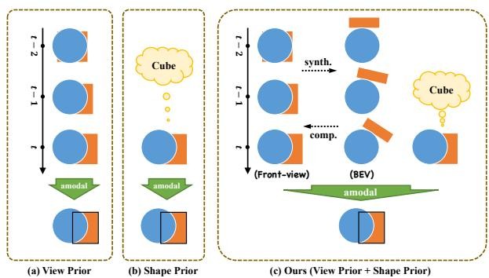
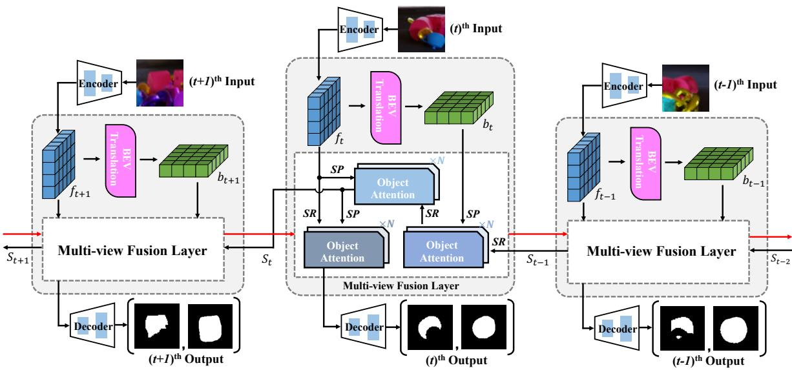
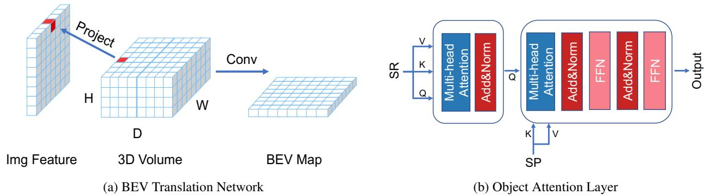
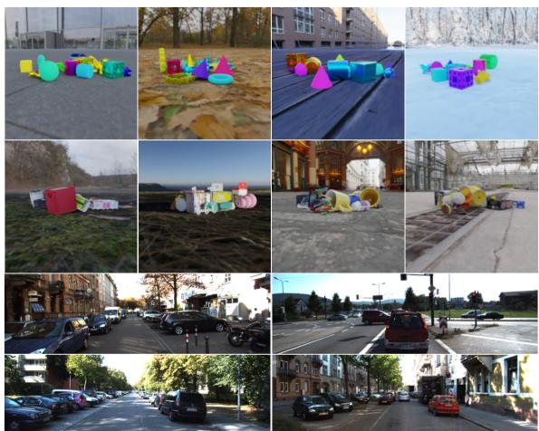
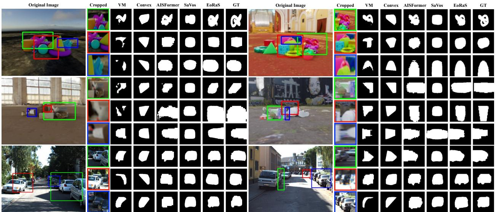
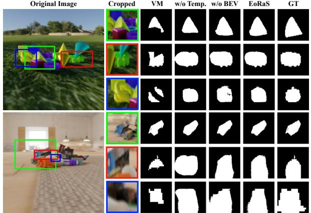

# Rethinking Amodal Video Segmentation from Learning Supervised Signals with Object-centric Representation

Ke Fan1,†, Jingshi Lei1,†, Xuelin Qian1,∗, Miaopeng Yu1, Tianjun Xiao2,∗, Tong He2 Zheng Zhang2, Yanwei Fu1

1Fudan University 2Amazon Web Service

{kfan21,jslei21}@m.fudan.edu.cn, {xlqian,mpyu19,yanweifu}@fudan.edu.cn {tianjux, htong, zhaz}@amazon.com

## Abstract

Video amodal segmentation is a particularly challenging task in computer vision, which requires to deduce the full shape ofan objectfrom the visible parts ofit. Recently, some studies have achieved promising performance by using motion flow to integrate information across frames under a self-supervised setting. However, motion flow has a clear limitation by the two factors of moving cameras and object deformation. This paper presents a rethinking to previous works. We particularly leverage the supervised signals with object-centric representation in realworld scenarios. The underlying idea is the supervision signal of the specific object and the features from different views can mutually benefit the deduction of the full mask in any specific frame. We thus propose an Efficient objectcentric Representation amodal Segmentation (EoRaS). Specially, beyond solely relying on supervision signals, we design a translation module to project image features into the Bird’s-Eye View (BEV), which introduces 3D information to improve current feature quality. Furthermore, we propose a multi-view fusion layer based temporal module which is equipped with a set of object slots and interacts with features from different views by attention mechanism to fulfill sufficient object representation completion. As a result, the full mask of the object can be decoded from image features updated by object slots. Extensive experiments on both real-world and synthetic benchmarks demonstrate the superiority of our proposed method, achieving state-of-the-art performance. Our code will be released at https://github.com/kfan21/EoRaS.

## 1. Introduction

Deep learning has demonstrated remarkable success in various computer vision tasks. Nevertheless, neural networks are limited to learning visible patterns in the data, and are typically challenged in reasoning about the broader and unseen components. Currently, most researches in object detection and segmentation tasks concentrate on enhancing the visible part’s performance, leaving few studies on inferring occluded information. Conversely, humans possess an innate ability to imagine and extrapolate, enabling us to easily complete an occluded part of an image based on prior knowledge. This critical capacity is instrumental in advanced deep learning models for real-world scenarios, such as medical diagnosis and autonomous driving. Thereby, the central issue addressed in this paper is the video amodal segmentation task, which aims to deduce an object’s complete mask, whether it is partially obscured or not.

  
Figure 1: Illustrations of the difference between view prior, shape prior, and our model. While SaVos [35] draws support from the optical flow to realize the view prior, imagelevel amodal segmentation algorithms typically just utilize the shape prior brought in by the supervision signals. Consequently, they are limited by camera motion and complicated object types, respectively. Unlike the previous methods, beyond the mergence of those two priors, EoRaS utilizes view prior by object-centric learning and further introduces the BEV space where obstruction doesn’t exist, which enables our EoRaS to easily handle complex scenarios.

Prior studies on image amodal segmentation [22, 30, 32] are over-reliance on prior knowledge, which actually hampers the model’s generalization abilities, resulting in limited improvements under complex circumstances. For video amodal, Yao et al. [35] proposed that the occluded part of the current frame may appear in other frames, and therefore, information from all frames should be collected to fill in the occluded regions of any specific frame. While this method achieves promising results under the self-supervised setting, it fails when camera motion exists, as 2D warping is used to make connections within different frames, leading to distorted signals.

This paper aims to propose a better approach for video amodal segmentation by rethinking the importance of using supervised signals with object-centric representation. Such object-centric representations reflect the compositional nature of our world, and potentially facilitate supporting more complex tasks like reasoning about relations between objects. While signals such as motion flow and shape priors have shown promising results, they are limited by moving cameras and complicated object types respectively. In contrast, recent advances [6, 13, 21] in video object segmentation produce highly accurate object masks that are less sensitive to moving cameras, making them better suited as supervision signals. Surprisingly, such video object masks have not been fully exploited before.

To this end, we propose a novel approach that learns video amodal segmentation not only from observed object supervision signals in the current frame (shape prior) but also from integrated information of object features under different views (view prior). Our motivation is clearly shown in Fig. 1. By using visual patterns of other views to explain away occluded object parts in the current frame [31], our approach gets rid of optical flow and eliminates the shortcomings of mere reliance on shape priors. Our model is highly effective, even in complex scenarios.

In this paper, we propose a novel supervised method for the video amodal segmentation task that leverages a multiview fusion layer based temporal module and a Bird’s-Eye View (BEV) feature translation network. Rather than relying on warping the amodal prediction into the next frame using optical flow or using shape priors alone, we enhance the current frame features by incorporating feature information from different viewpoints and leveraging the supervision signals simultaneously. Specifically, we first extract frontview features from the videos using FPN50 [18]. Then, we employ a translation network to transform these front-view features into bird’s-eye view features, which bring in 3D information through the usage of the intrinsic matrix. In contrast to some related work [28] extracting object-centric 3D representation by object reconstruction, the acquisition of BEV feature is simpler, faster, and easier to train. As each frame is equivalent to a unique view, features from both different frames and the BEV space, which carry shape information about the occluded part, are further utilized. We repurpose the vanilla object-centric representations [19] – object slots to integrate those information, which is accomplished by our novel multi-view fusion layer. Finally, we refine the front-view features using the updated object slots containing object information from multiple views and decode the full mask. Compared to previous methods [35], our model can handle scenarios with 3D viewing angle changes or complex object shapes better by leveraging shape knowledge and integrating information across multiple views simultaneously. To evaluate our method, we conduct extensive experiments on real-world and synthetic amodal benchmarks. The results demonstrate that our model achieves outstanding performance compared to comparable models and effectively demonstrates the efficacy of our architecture.

In summary, our main contributions are listed below. (1) Our contribution lies in formulating the video amodal segmentation task using supervised signals for the first time. Our model efficiently learns the shape and view priors, enabling it to handle complex scenarios with ease. (2) We propose a novel approach to learning object-centric representations through a multi-view fusion layer based temporal module equipped with a set of object slots, which achieves significant improvement in the correlation of information from different views. (3) We introduce the novel concept of bird’s-eye view features in our amodal task, which provides front-view features with 3D information, resulting in consistent benefits. (4) By utilizing the bird’s-eye view generator and multi-view fusion layer based temporal module, our algorithm achieves remarkable improvement on both realworld and synthetic amodal benchmarks, highlighting the novelty of our approach.

## 2. Related Work

Amodal segmentation is a more challenging task than instance segmentation because it requires predicting the full shape of occluded objects through the visible parts. While previous literature has focused on using shape priors effectively through multi-level coding [22], variational autoencoder [14], shape prior memory codebook construction [32], mixing feature decoupling [16] or Bayesian model [29], relying solely on shape priors can lead to poor empirical performance due to distribution shifts between training data and real scenarios. To address this issue, [35] leverages spatiotemporal consistency and dense object motion to explain away occlusion. Although their work has made progress in video amodal segmentation, optical flow can cause object deformation in the presence of camera motion. In contrast, our proposed architecture introduces a novel approach that does not require optical flow and utilizes bird’s-eye view features to bring in 3D information that enhances the learning of front-view features.

  
Figure 2: A schematic illustration of our method. The novelty of this architecture mainly lies in the BEV translation network and the multi-view fusion layer. The SP and SR represent the shape provider and receiver (see Section 3.1 for detail), respectively.

Object-centric learning aims at identifying all the objects from raw input for better understanding the complex scenes. Existing object-centric learning methods can be categorized into unsupervised and supervised methods. While unsupervised methods use image/scene reconstruction to extract object representations from images/scenes [2, 19, 25], supervised methods represent each object as a query embedding and pay much attention to obtaining a great initialization [3, 4, 7, 9, 13, 34]. Our EoRaS is more related to the supervised method in terms of constructing a set of learnable queries as an information container.

BEV maps generation requires to generate semantic maps in bird’s-eye view space. Due to a lack of high-quality annotated data, most of the early work adopts weak supervision by utilizing stereo information [20, 21] or obtaining pseudo label [27]. Others directly translate semantic segmentation maps from image space into bird’s-eye view space [6, 26]. With the advent of large-scale annotated datasets, research on supervised methods has also made some progress. [23] and [24] respectively take advantage of dense transformer layer and 1D sequence-to-sequence translations to learn a map representation. [1] and [17] instead blend features from multi-camera images to construct BEV map. In our EoRaS, the bird’s-eye view feature is utilized to integrate 3D information into the front-view feature. To the best of our knowledge, it’s the first attempt to incorporate the BEV translation module in the amodal segmentation task.

## 3. Methodology

This paper focuses on the video amodal segmentation task. Specifically, given a video sequence $\{ I _ { t } \} _ { t = 1 } ^ { \check { T } }$ with K objects, EoRaS aims to predict the full mask $\{ M _ { t } ^ { k } \}$ of each object in all frames, where k is the index of objects. In our EoRaS, visible masks $\{ V _ { t } ^ { k } \}$ also serves as supervision but will not be utilized at the test phase.

## 3.1. Architecture

The overall architecture of EoRaS is shown in Figure 2. Our EoRaS is mainly comprised of four modules: (i) the feature encoding module which extracts the front-view feature $f _ { t } ^ { k }$ from the input frames; (ii) the BEV translation network which converts the front-view features into bird’s-eye view angle $b _ { t } ^ { k }$ using the camera intrinsic matrix K and neural network; (iii) the multi-view fusion layer based temporal module which utilizes the object slots updated through the forward and backward streams to integrate the feature information from different views and fulfill the completion of each front-view feature; and (iv) the deconvolution network that estimates the full masks and visible masks of the current frame simultaneously.

Feature Encoding Module In this module, FPN50 [18] pretrained on ImageNet [5] is used to extract features from the input frames. These features are obtained from a frontal perspective and capture a lot of information but will fail to make inferences about the missing parts of the objects.

$$
f _ { t } ^ { k } = F P N ( I _ { t } ^ { k } )\tag{1}
$$

BEV Translation Network The features from the bird’seye view (BEV) are widely used and work well in autonomous driving research. Recall that features from different perspectives are likely to contain the missing part information and contribute to the full mask deduction of the current frame. As obstruct doesn’t exist in BEV space unless objects are stacked on top of each other, it is reasonable to introduce BEV as a special perspective to promote the completion of the front-view feature. Consider a horizontally placed camera, for each frame, a 3D volume feature $V _ { 3 D }$ is constructed in the camera coordinate system. As the BEV feature generation just involves the current frame, we omit the subscript of time t and the object index k for simplicity.

  
Figure 3: (a) A three-dimensional cuboid is built and rasterized in the camera coordinate. For each voxel, we use the intrinsic matrix to obtain its coordinates in the plane system, and use bilinear interpolation on the front-view features to obtain its feature. Then, a convolutional network is used to obtain the bev map. (b) Our object attention layer in the multi-view fusion layer is stacked by self-attention, cross-attention, and feedforward network. This layer is designed for shape information fusion and takes two variables as input. We nominate the variable to be updated as shape receiver (SR) and another one as shape provider (SP).

Denote the camera intrinsic matrices as K, we first focus on a single point $( x , y , z )$ in the camera coordinate space. By utilizing intrinsic matrices, this point can be easily projected into the image/feature plane and we denote its coordinate as $( u , v )$

$$
\left( \begin{array} { c } { { \lambda u } } \\ { { \lambda v } } \\ { { \lambda } } \end{array} \right) = K \left( \begin{array} { c } { { x } } \\ { { y } } \\ { { z } } \end{array} \right)\tag{2}
$$

We use bilinear interpolate to obtain the feature at $( u , v )$ from the corresponding front-view feature $f .$ The obtained value at $( u , v )$ will act as the volume feature at $( x , y , z )$

As shown in Figure 3a, the 3D volume in the camera coordinate will be rasterized into a group of points $p _ { i j k } =$ $( x _ { i } , y _ { j } , z _ { k } )$ , where $1 \leq i \leq m , 1 \leq j \leq n , 1 \leq k \leq h$ and $x _ { i } , y _ { j } , z _ { k }$ are three predefined 1D grid. x, y, z represent the direction of width, depth, and height, respectively. The value of $V _ { 3 D }$ will be gotten by simply repeating the above process for each point. Further, by stacking the feature of the volume obtained from different channels together, we will get $V _ { 3 D } \ \in \ \mathbb { R } ^ { c \times m \times n \times h }$ . Since our goal is to acquire BEV features, $V _ { 3 D }$ is rearranged to Rch×m×n and sent to a lightweight CNN for compression along height dimension:

$$
b _ { k } ^ { t } = \mathrm { C N N } ( V _ { 3 D } . r e s h a p e ( c h , m , n ) )\tag{3}
$$

Multi-view Fusion Layer based Temporal Encoder As the occluded part of a specific view may potentially appear in other frames, we can make full use of the information in each frame (equivalent to different perspectives) to refine the completion of the object shape. Specially, inspired by DETR [3] and Slot Attention [19], we would like to generate an object-centric feature utilizing both front-view and BEV representations.

A direct method is to follow [19], which uses ConvGRU to aggregate temporal information. However, the cost of nested recurrent slot computation to gather the object information from each frame is expensive when processing videos. Here, we propose a more efficient attention-based encoder architecture named Multi-view Fusion Layer. Generally, in such a layer, three N-layer object attentions which is a non-recurrent variant of slot attention are carefully designed and closely connected. And features from different views and object slots serve as the inputs.

In particular, as shown in Figure 3b, each object attention layer (ObjAttention(SP, SR)) is stacked by selfattention, cross-attention, and feed-forward networks and serves as information fusion network. The variable absorbing the missing shape information during the fusion process is named shape receiver (SR), and another one is dubbed shape provider (SP) as it offers extra shape patches. The total forward process in ObjAttention is formulated as,

$$
\hat { S R } = S R + \mathrm { A t t e n t i o n } ( S R , S R , S R )\tag{4}
$$

$$
\widetilde { S R } = \hat { S R } + \mathrm { A t t e n t i o n } ( S P , \hat { S R } , S P )\tag{5}
$$

$$
o u t p u t = \mathrm { M L P } ( \widetilde { S R } )\tag{6}
$$

where Attention(K, Q, V), MLP(·) denotes multi-head attention module and two-layer feedforward network, respectively. And we omit all normalization layers. ObjAttention first enhances the SR representation by renewing information contained in itself, then extracts fresh properties from the SP.

On the other hand, similar to [3], a set of object slots $S _ { 0 } \in R ^ { n _ { s } \times d }$ is initialized before the videos enter. $n _ { s }$ denotes the number of slots and d is the feature dimension. In our model, $S _ { 0 }$ is set to be learnable and serves as a container that gathers shape information from various views.

With the above preparations, we now go to the detail of our multi-view fusion layer. For each frame, we take advantage of the $S _ { t - 1 }$ from the last frame which includes object shape information from previous frames, and provide it with the fresh characters from the front-view $f _ { t } ^ { k }$ and BEV feature $b _ { t } ^ { k }$ under current perspective at first:

$$
S _ { t } ^ { \prime } = \mathrm { O b j A t t e n t i o n } ( S R = S _ { t - 1 } , S P = b _ { t } ^ { k } )\tag{7}
$$

$$
S _ { t } = { \mathrm { O b j A t t e n t i o n } } ( S R = S _ { t } ^ { \prime } , S P = f _ { t } ^ { k } )\tag{8}
$$

Then, the updated slots will provide clues about the occluded part and help complete the front-view features of the current frame by setting the front-view features as SR in the object attention layer. Thus, we inversely enhance the front-view feature using the object slots by:

$$
\hat { f } _ { t } ^ { k } = \mathrm { O b j A t t e n t i o n } ( S R = f _ { t } ^ { k } , S P = S _ { t } )\tag{9}
$$

Deconvolution Network The deconvolution network (De-Conv) is served as the mask predictor and takes the updated front-view features as input since it shares the same perspective with the full mask to be predicted. In our experiments, we just construct several de-convolutional layers for this module.

$$
\hat { M } _ { t } ^ { k } , \hat { V } _ { t } ^ { k } = \operatorname { D e C o n v } ( \hat { f } _ { t } ^ { k } )\tag{10}
$$

where $\hat { M } _ { t } ^ { k }$ and $\hat { V } _ { t } ^ { k }$ are the full and visible mask predictions of the current frame, respectively.

Bi-directional Prediction Cold start problem exists under the above framework since the first few frames may not be informative enough. Thus, backward prediction is added to solve this problem. We simply concatenate the forward and backward features, and send them to the final deconvolution network.

## 3.2. Loss Function for EoRaS

Our EoRaS is designed as an end-to-end framework and trained with the focal loss (Focal()) using both full mask and visible mask as supervision signals. Note that the discard of the visible mask loss will not heavily damage the model performance, as shown in Tab. 4. The overall loss function is

$$
\mathcal { L } _ { f u l l } = \sum _ { t = 1 } ^ { T } \sum _ { k = 1 } ^ { K } \mathrm { F o c a l } ( \hat { M } _ { t } ^ { k } , M _ { t } ^ { k } )\tag{11}
$$

$$
\mathcal { L } _ { v i s } = \sum _ { t = 1 } ^ { T } \sum _ { k = 1 } ^ { K } \mathrm { F o c a l } ( \hat { V } _ { t } ^ { k } , V _ { t } ^ { k } )
$$

$$
\mathcal { L } = \mathcal { L } _ { f u l l } + \lambda \cdot \mathcal { L } _ { v i s } .\tag{12}
$$

(13)

  
Figure 4: Visualization of datasets. The first and second rows show images from the Movi-B and Movi-D, respectively. The remaining four images belong to the KITTI.

## 4. Experiments

To fully evaluate our model, we conduct extensive experiments on both real-world and synthetic amodal segmentation benchmarks, including Movi-B, Movi-D, and KITTI datasets, with the visualization in Fig. 4.

Movi Dataset [11] is a synthetic dataset consisting of random scenes and objects created by Kubric [11]. In our experiments, we consider two datasets (Movi-B and Movi-D) with different objects and different levels of occlusions. We extract the amodal information during generation ofthe two datasets. The objects in Movi-B and Movi-D are from the CLEVR [15], which consists of 11 relatively regular object shapes, and Google Scanned Objects [8], which contains 1030 realistic objects, respectively. Both datasets use the background from Poly Haven. To create situations with serious occlusion, all objects are set to be static and stacked closely together. Videos are created by setting the camera to rotate around the objects. Overall, compared with Movi-B, Movi-D has a more complex object shape and lower camera viewing angle with more serious occlusion.

KITTI Dataset [10] is currently the largest real-world autonomous driving evaluation dataset. It has been widely used in many vision tasks, such as object detection and optical flow prediction. [22] annotated some images in KITTI with amodal information and [35] matched these images to its original video frame. Note that since these videos are not sufficiently annotated, it is a weakly supervised scenario. For a fair comparison, we follow the same data split in [35]. The visible masks and object tracks are extracted by Point-Track [33]. It is noteworthy that only the car category is annotated in this dataset.

## 4.1. Competitors and Settings

Competitors We compare our method with the following related methods: (1) VM (Visible Mask), directly use the ground truth visible mask as amodal prediction; (2) Convex, take the convex hull of the visible mask as the amodal mask; (3) PCNET[36], a self-supervised imagelevel amodal completion method by in turn recovering occlusion ordering and completing amodal masks and content; (4) AISFormer [30], an image-level amodal segmentation model equipped with a transformer-based mask head and achieves the new state-of-the-art recently; (5) Savos [35], a recent state-of-the-art method in the field of self-supervised video amodal segmentation and is modified to supervised version by removing the 2D warping and bringing the supervised signal for fair comparison (We also did additional experiments involving warping operation, but the experiment results are quite inferior); (6) BiLSTM [12], a variant of our proposed method for which we keep the same FPN50 backbone but utilize BiLSTM to aggregate temporal information across frames.

  
Figure 5: Qualitative comparison between our EoRaS and competitors. From top to down, the three rows are from Movi-B, Movi-D, and KITTI, respectively.

<table><tr><td rowspan=2 colspan=1>DATASET</td><td rowspan=2 colspan=2>METHODS</td><td rowspan=1 colspan=1>METRICS</td></tr><tr><td rowspan=1 colspan=1>mIoUfull  mIoUocc</td></tr><tr><td rowspan=7 colspan=1>Movi-B</td><td rowspan=6 colspan=2>VMConvexPCNET [36]AISFormer [30]SaVos-sup. [35]BiLSTM [12]</td><td rowspan=2 colspan=1>59.1964.21      18.42</td></tr><tr><td rowspan=1 colspan=1></td></tr><tr><td rowspan=1 colspan=1>65.79     24.02</td></tr><tr><td rowspan=2 colspan=1>77.34     43.5370.72</td></tr><tr><td rowspan=1 colspan=1>7233.61</td></tr><tr><td rowspan=1 colspan=1>77.93      46.21</td></tr><tr><td rowspan=1 colspan=2>EoRaS (Ours)</td><td rowspan=1 colspan=1>79.22      47.89</td></tr><tr><td rowspan=5 colspan=1>Movi-D</td><td rowspan=4 colspan=2>VMConvexPCNET [36]AISFormer [30]SaVos-sup. [35]BiLSTM [12]</td><td rowspan=1 colspan=1>56.92</td></tr><tr><td rowspan=1 colspan=1>60.18      16.4864.35      27.31</td></tr><tr><td rowspan=1 colspan=1>67.72      33.65</td></tr><tr><td rowspan=1 colspan=1>60.61      22.6468.43      36.00</td></tr><tr><td rowspan=1 colspan=2>EoRaS (Ours)</td><td rowspan=1 colspan=1>69.44      36.96</td></tr><tr><td rowspan=5 colspan=1>KITTI</td><td rowspan=4 colspan=2>VMConvexPCNET [36]AISFormer [30]SaVos-sup. [35]BiLSTM [12]</td><td rowspan=1 colspan=1>74.75</td></tr><tr><td rowspan=1 colspan=1>78.62      8.2981.58      17.9086.42      51.04</td></tr><tr><td rowspan=1 colspan=1>83.09      37.33</td></tr><tr><td rowspan=1 colspan=1>86.68      49.95</td></tr><tr><td rowspan=1 colspan=2>EoRaS (Ours)</td><td rowspan=1 colspan=1>87.07      52.00</td></tr></table>

Table 1: The performance of EoRaS on real-world and synthetic video amodal benchmarks.

Implementations Results on all datasets are reported in terms of mIOU metrics for both full mask and occluded regions. Since most amodal segmentation algorithms use the visible mask or the bounding boxes of the visible part as model input, the estimation results of the visible area may be more confident, and the mIOU of the occluded area can better reflect the model performance. On all datasets, the mIOU metric of the occluded part is only computed on those partially occluded objects. We use AdamW as optimizer with batch size 4 for 50 epochs. The learning rate is set to 1e − 5 on Movi datasets and 1e − 4 on the KITTI dataset. Exponential learning rate decay is used where the decay rate is 0.95. The weight decay is 5e − 4. And the γ in focal loss is set to 2. We set λ = 1, ns = 8, N = 2 and train our model on four Tesla T4 GPUs using PyTorch.

## 4.2. Results on Movi Datasets

As shown in Table 1, compared with supervised SaVos, our EoRaS achieves extremely significant performance improvements on both Movi datasets. In particular, by applying our algorithm, the prediction of the full mask of the objects in the two datasets is improved by 8.50% and 8.83%, respectively. The improvements are more remarkable in the prediction of occluded parts. For the performance on the occluded part, our EoRaS achieves 14.28% improvement on the Movi-B over the baseline SaVos, and surprisingly improves by 14.32% on the Movi-D. Moreover, the performance of EoRaS also exceeds the recent state-of-theart image-level algorithm AISFormer by a clear margin on both datasets. And it’s noteworthy that EoRaS outperforms the combination of FPN50 and BiLSTM/Transformer by at least 1% in plenty of experiments, showing the effectiveness of introducing the BEV module. Additionally, despite the usage of ground truth visible mask in Convex and PCNET, EoRaS still exhibits amazing power. We also present the qualitative results in Figure 5. Obviously, the full masks deduced by EoRaS are the closest to the original object shape among all the competitors. Above all, EoRaS is more suitable for solving the video amodal segmentation task, and leads to the new state-of-the-art.

<table><tr><td rowspan="2">No.</td><td colspan="2">DESIGNS</td><td colspan="2">METRICS</td></tr><tr><td>Temporal Bi-direction</td><td>BEV</td><td>mIoU full mIoUocc</td><td></td></tr><tr><td>1</td><td>X</td><td>× X</td><td>76.93</td><td>44.55</td></tr><tr><td>2</td><td>√</td><td>√ ×</td><td>78.66</td><td>46.83</td></tr><tr><td>3</td><td>√</td><td>× √</td><td>78.42</td><td>46.51</td></tr><tr><td>4</td><td>√</td><td>√ √</td><td>79.22</td><td>47.89</td></tr></table>

<table><tr><td rowspan="2">No.</td><td colspan="2">DESIGNS</td><td colspan="2">METRICS</td></tr><tr><td></td><td>Temporal Bi-direction BEV</td><td></td><td>mIoUfull mIoUocc</td></tr><tr><td>5</td><td>X</td><td>X ×</td><td>66.70</td><td>33.42</td></tr><tr><td>6</td><td>√</td><td>√ ×</td><td>69.08</td><td>36.39</td></tr><tr><td>7</td><td>√</td><td>X √</td><td>68.56</td><td>35.54</td></tr><tr><td>8</td><td>√</td><td>√ √</td><td>69.44</td><td>36.96</td></tr></table>

Table 2: Ablation study of our temporal and bev modules on Movi-B (left) and Movi-D (right) dataset.

  
Figure 6: Visualizations derived from models with/without proposed temporal or BEV module. Clearly, the complete model deduces the best full mask, and both the temporal and BEV module can bring consistent benefits.

## 4.3. Results on KITTI Dataset

The experiment results on the KITTI dataset are shown in Table 1. For objects in real scenes, our EoRaS can still exceed all the current state-of-the-art methods. Compared with the image-level baseline, we achieve 0.65% and 0.96% improvement for the full and occluded mask prediction, respectively. For the supervised SaVos, EoRaS achieves enormous promotion, ∼4% on the full shape and ∼15% on the missing part. Furthermore, other video-level baselines consistently underperform our EoRaS by ∼2% on the deduction of the occluded part. Qualitative comparison in Figure 5 clearly exhibits the great precision of EoRaS. The above evidence is sufficient enough to prove the effectiveness of EoRaS under weakly supervised settings.

<table><tr><td rowspan=1 colspan=1>DATASET</td><td rowspan=1 colspan=1># Slots</td><td rowspan=1 colspan=1> $\mathrm { m I o U } _ { f u l l }$    mIoUocc</td></tr><tr><td rowspan=3 colspan=1>Movi-B</td><td rowspan=3 colspan=1>8163264128256</td><td rowspan=1 colspan=1>79.22       47.89</td></tr><tr><td rowspan=1 colspan=1>79.22       47.7979.29       47.8879.22      47.7879.19       47.73</td></tr><tr><td rowspan=1 colspan=1>79.20      47.75</td></tr><tr><td rowspan=6 colspan=1>Movi-D</td><td rowspan=1 colspan=1>8</td><td rowspan=1 colspan=1>69.44       36.96</td></tr><tr><td rowspan=1 colspan=1>16</td><td rowspan=1 colspan=1>69.42       36.92</td></tr><tr><td rowspan=2 colspan=1>3264</td><td rowspan=1 colspan=1>69.50      37.27</td></tr><tr><td rowspan=1 colspan=1>69.38       37.01</td></tr><tr><td rowspan=1 colspan=1>128</td><td rowspan=1 colspan=1>69.47       37.02</td></tr><tr><td rowspan=1 colspan=1>256</td><td rowspan=1 colspan=1>69.45       37.06</td></tr></table>

Table 3: Sensitivity Analysis of Slot Number. Despite the diverse settings of slot number, the performance of EoRaS just changes slightly, demonstrating the robustness against hyper-parameter $n _ { s }$

## 5. Further Analysis

Effectiveness of Temporal and BEV Modules As shown in Table 2, on Movi-B dataset, our temporal module brings about ∼2.3% performance improvement in occluded part prediction. After plugging in the BEV module, the occluded mIOU is further improved by 1.06%. Additionally, Bi-direction prediction also plays an important role in our model as it brings 1.38% performance improvement for the missing part deduction. On the Movi-D dataset, the improvements brought in by those modules are also significant, as presented in the right table. Some visualizations derived from different architectures are presented in Figure 6. It’s clear that both temporal and BEV modules are capable of improving the smoothness and shape similarity of full masks. These experiments fully prove the effectiveness of the modules proposed in this paper, and also verify the correctness of our hypothesis that feature information from different perspectives can benefit the completion of object shape in any specific frame/view.

Sensitivity Analysis of Slot Number To analyze the sensitivity to the choice of $n _ { s } ,$ , we conduct experiments by widely tuning the slot number. The results are presented in Table 3 and indicate that the number of slots has almost no impact on the performance of our model. This phenomenon demonstrates the robustness of our model against the diverse choices of slot numbers.

<table><tr><td>DATASET</td><td>λ</td><td> $\mathrm { m I o U } _ { f u l l }$ </td><td> $\mathrm { m I o U } _ { o c c }$ </td></tr><tr><td rowspan="5">Movi-B</td><td>0.0</td><td>78.93</td><td>47.55</td></tr><tr><td>0.25</td><td>79.14</td><td>47.80</td></tr><tr><td>0.5</td><td>79.21</td><td>47.90</td></tr><tr><td>0.75</td><td>79.20</td><td>47.85</td></tr><tr><td>1.0</td><td>79.22</td><td>47.89</td></tr><tr><td rowspan="4">Movi-D</td><td>0.0</td><td>68.68</td><td>36.39</td></tr><tr><td>0.25</td><td>69.26</td><td>37.06</td></tr><tr><td>0.5</td><td>69.42</td><td>36.99</td></tr><tr><td>0.75</td><td>69.38</td><td>36.96</td></tr><tr><td rowspan="2"></td><td>1.0</td><td>69.44</td><td>36.96</td></tr><tr><td></td><td></td><td></td></tr></table>

Table 4: Performance of EoRaS under different λ.

<table><tr><td rowspan="2">METHODS</td><td rowspan="2">TARGET</td><td colspan="2">METRICS</td></tr><tr><td>mIoU  $f u l l$ </td><td>mIoUocc</td></tr><tr><td rowspan="2">AISFormer [30]</td><td>Movi-D</td><td>62.94</td><td>28.65</td></tr><tr><td>KITTI</td><td>71.36</td><td>29.84</td></tr><tr><td rowspan="2">SaVos-Sup. [35]</td><td>Movi-D</td><td>57.19</td><td>25.85</td></tr><tr><td>KITTI</td><td>65.49</td><td>21.82</td></tr><tr><td rowspan="2">EoRaS (Ours)</td><td>Movi-D</td><td>63.98</td><td>31.22</td></tr><tr><td>KITTI</td><td>71.73</td><td>31.35</td></tr></table>

Table 5: Open set segmentation on Movi-D and KITTI datasets. We use EoRaS pretrained on the Movi-B dataset and conduct transfer learning experiments without finetuning. Our EoRaS achieves the highest performance, indicating its great generalization ability.
<table><tr><td rowspan="2">DATASET</td><td rowspan="2">METHODS</td><td colspan="2">METRICS</td></tr><tr><td> $\overline { { \mathrm { m I o U } _ { f u l l } } }$ </td><td> $\overline { { \mathrm { m I o U } _ { o c c } } }$ </td></tr><tr><td rowspan="4">Movi-B</td><td>EoRaS</td><td>79.22</td><td>47.89</td></tr><tr><td> $\mathrm { + P P ^ { * } }$ </td><td>79.38</td><td>47.66</td></tr><tr><td>+PP</td><td>81.20</td><td>47.89</td></tr><tr><td>+SG</td><td>81.76</td><td>49.39</td></tr><tr><td rowspan="4">Movi-D</td><td>EoRaS</td><td>69.44</td><td>36.96</td></tr><tr><td>+PP*</td><td>69.95</td><td>36.81</td></tr><tr><td>+PP</td><td>72.76</td><td>36.96</td></tr><tr><td>+SG</td><td>74.10</td><td>38.33</td></tr></table>

Table 6: The performance of EoRaS while using GTVM at test phase on Movi dataset. $\mathrm { P P ^ { * } }$ and PP means the predicted and ground truth visible mask are used in post-process, respectively. And SG represents the model trained with the concatenation of images and visible masks.

Different choices of λ We conduct experiments to analyze the effect of λ on the performance of our model, and the results are presented in Table 4. First of all, the utilization of visible masks in supervision signals will benefit the model training as also shown in previous amodal segmentation algorithms. But the way that EoRaS differs lies in the insensitivity to the choice of λ once the visible mask is added, which demonstrates the superiority of EoRaS.

Open Set Segmentation To evaluate the capacity of out-ofdistribution generalization, we conduct open set segmentation experiments on Movi-D and KITTI datasets. Models are pretrained on the relatively simple Movi-B dataset. As presented in Table 5, EoRaS achieves the best accuracy among all competitors. Concretely, compared with supervised SaVos, EoRaS outperforms by at least 6%, showing strong dominance. Again, the image-level SOTA algorithm underperforms EoRaS by ∼2% on the occluded part deduction, indicating that the integration of information from different views indeed benefits the generalization ability.

Test-time Assistance by Ground Truth Visible Mask (GTVM) The same as SaVos and PCNET, we explore the utilization of GTVM at the test phase. On the one hand, the post-processing (PP), including taking the intersection of the predicted full mask and GTVM, is feasible. On the other hand, containing partial shape information, GTVM may be capable of serving as a shape guidance (SG) for mask completion. To this end, we simply train our model with the concatenation of images and visible masks. The experimental results are presented in Table 6. Overall, the introduction of GTVM brings in huge benefits, which is inline with [35, 36]. Despite the usage of GTVM in those algorithms, our EoRaS still outperforms them by a large margin (see Table 1), suggesting the powerful function.

## 6. Conclusion

In this paper, we proposed a brand-new pipeline named EoRaS to cope with the video amodal segmentation task. Based on the assumption that both the supervision signals (shape prior) and the features from different perspectives (view prior) will benefit the deduction of the full mask under any specific view, the multi-view fusion layer based temporal encoder and BEV translation network are designed to integrate 3D information and front-view shape patches from different frames respectively in an objectcentric pattern. Utilizing those modules, our EoRaS eliminates the optical flow usage and the over-reliance on shape priors, achieving high efficiency even in complex scenarios. We conduct experiments on both real-world and synthetic video amodal benchmarks, including Movi-B, Movi-D, and KITTI datasets. The empirical results demonstrate that our EoRaS achieves the new state-of-the-art performance.

Acknowledgements. This work is supported by China Postdoctoral Science Foundation (2022M710746). Yanwei Fu is with the School of Data Science, Shanghai Key Lab of Intelligent Information Processing, Fudan University, and Fudan ISTBI—ZJNU Algorithm Centre for Brain-inspired Intelligence, Zhejiang Normal University, Jinhua, China.

## References

[1] Maxim Berman, Amal Rannen Triki, and Matthew B Blaschko. The lovasz-softmax loss: A tractable surrogate for´ the optimization of the intersection-over-union measure in neural networks. In Proceedings of the IEEE conference on computer vision and pattern recognition, pages 4413–4421, 2018. 3

[2] Christopher P Burgess, Loic Matthey, Nicholas Watters, Rishabh Kabra, Irina Higgins, Matt Botvinick, and Alexander Lerchner. Monet: Unsupervised scene decomposition and representation. arXiv preprint arXiv:1901.11390, 2019. 3

[3] Nicolas Carion, Francisco Massa, Gabriel Synnaeve, Nicolas Usunier, Alexander Kirillov, and Sergey Zagoruyko. End-toend object detection with transformers. In European conference on computer vision, pages 213–229. Springer, 2020. 3, 4, 5

[4] Bowen Cheng, Ishan Misra, Alexander G Schwing, Alexander Kirillov, and Rohit Girdhar. Masked-attention mask transformer for universal image segmentation. In Proceedings of the IEEE/CVF conference on computer vision and pattern recognition, pages 1290–1299, 2022. 3

[5] Jia Deng, Wei Dong, Richard Socher, Li-Jia Li, Kai Li, and Li Fei-Fei. Imagenet: A large-scale hierarchical image database. In 2009 IEEE conference on computer vision and pattern recognition, pages 248–255. Ieee, 2009. 3

[6] Liuyuan Deng, Ming Yang, Hao Li, Tianyi Li, Bing Hu, and Chunxiang Wang. Restricted deformable convolution-based road scene semantic segmentation using surround view cameras. IEEE Transactions on Intelligent Transportation Systems, 21(10):4350–4362, 2019. 2, 3

[7] Bin Dong, Fangao Zeng, Tiancai Wang, Xiangyu Zhang, and Yichen Wei. Solq: Segmenting objects by learning queries. Advances in Neural Information Processing Systems, 34:21898–21909, 2021. 3

[8] Laura Downs, Anthony Francis, Nate Koenig, Brandon Kinman, Ryan Hickman, Krista Reymann, Thomas B McHugh, and Vincent Vanhoucke. Google scanned objects: A highquality dataset of 3d scanned household items. In 2022 International Conference on Robotics and Automation (ICRA), pages 2553–2560. IEEE, 2022. 5

[9] Yuxin Fang, Shusheng Yang, Xinggang Wang, Yu Li, Chen Fang, Ying Shan, Bin Feng, and Wenyu Liu. Instances as queries. In Proceedings of the IEEE/CVF International Conference on Computer Vision, pages 6910–6919, 2021. 3

[10] Andreas Geiger, Philip Lenz, Christoph Stiller, and Raquel Urtasun. Vision meets robotics: The kitti dataset. International Journal of Robotics Research (IJRR), 2013. 5

[11] Klaus Greff, Francois Belletti, Lucas Beyer, Carl Doersch, Yilun Du, Daniel Duckworth, David J Fleet, Dan Gnanapragasam, Florian Golemo, Charles Herrmann, Thomas Kipf, Abhijit Kundu, Dmitry Lagun, Issam Laradji, Hsueh-Ti (Derek) Liu, Henning Meyer, Yishu Miao, Derek Nowrouzezahrai, Cengiz Oztireli, Etienne Pot, Noha Radwan, Daniel Rebain, Sara Sabour, Mehdi S. M. Sajjadi, Matan Sela, Vincent Sitzmann, Austin Stone, Deqing Sun, Suhani Vora, Ziyu Wang, Tianhao Wu, Kwang Moo Yi,

Fangcheng Zhong, and Andrea Tagliasacchi. Kubric: a scalable dataset generator. 2022. 5

[12] Sepp Hochreiter and Jurgen Schmidhuber. Long short-term¨ memory. Neural computation, 9(8):1735–1780, 1997. 6

[13] Jie Hu, Liujuan Cao, Yao Lu, ShengChuan Zhang, Yan Wang, Ke Li, Feiyue Huang, Ling Shao, and Rongrong Ji. Istr: End-to-end instance segmentation with transformers. arXiv preprint arXiv:2105.00637, 2021. 2, 3

[14] Won-Dong Jang, Donglai Wei, Xingxuan Zhang, Brian Leahy, Helen Yang, James Tompkin, Dalit Ben-Yosef, Daniel Needleman, and Hanspeter Pfister. Learning vector quantized shape code for amodal blastomere instance segmentation. arXiv preprint arXiv:2012.00985, 2020. 2

[15] Justin Johnson, Bharath Hariharan, Laurens Van Der Maaten, Li Fei-Fei, C Lawrence Zitnick, and Ross Girshick. Clevr: A diagnostic dataset for compositional language and elementary visual reasoning. In Proceedings of the IEEE conference on computer vision and pattern recognition, pages 2901–2910, 2017. 5

[16] Lei Ke, Yu-Wing Tai, and Chi-Keung Tang. Deep occlusionaware instance segmentation with overlapping bilayers. In Proceedings of the IEEE/CVF conference on computer vision and pattern recognition, pages 4019–4028, 2021. 2

[17] Zhiqi Li, Wenhai Wang, Hongyang Li, Enze Xie, Chonghao Sima, Tong Lu, Yu Qiao, and Jifeng Dai. Bevformer: Learning bird’s-eye-view representation from multi-camera images via spatiotemporal transformers. In European conference on computer vision, pages 1–18. Springer, 2022. 3

[18] Tsung-Yi Lin, Piotr Dollar, Ross Girshick, Kaiming He,´ Bharath Hariharan, and Serge Belongie. Feature pyramid networks for object detection. In Proceedings of the IEEE conference on computer vision and pattern recognition, pages 2117–2125, 2017. 2, 3

[19] Francesco Locatello, Dirk Weissenborn, Thomas Unterthiner, Aravindh Mahendran, Georg Heigold, Jakob Uszkoreit, Alexey Dosovitskiy, and Thomas Kipf. Objectcentric learning with slot attention. Advances in Neural Information Processing Systems, 33:11525–11538, 2020. 2, 3, 4

[20] Chenyang Lu, Marinus Jacobus Gerardus van de Molengraft, and Gijs Dubbelman. Monocular semantic occupancy grid mapping with convolutional variational encoder– decoder networks. IEEE Robotics and Automation Letters, 4(2):445–452, 2019. 3

[21] Bowen Pan, Jiankai Sun, Ho Yin Tiga Leung, Alex Andonian, and Bolei Zhou. Cross-view semantic segmentation for sensing surroundings. IEEE Robotics and Automation Letters, 5(3):4867–4873, 2020. 2, 3

[22] Lu Qi, Li Jiang, Shu Liu, Xiaoyong Shen, and Jiaya Jia. Amodal instance segmentation with kins dataset. In Proceedings of the IEEE/CVF Conference on Computer Vision and Pattern Recognition, pages 3014–3023, 2019. 1, 2, 5

[23] Thomas Roddick and Roberto Cipolla. Predicting semantic map representations from images using pyramid occupancy networks. In Proceedings of the IEEE/CVF Conference on Computer Vision and Pattern Recognition, pages 11138–11147, 2020. 3

[24] Avishkar Saha, Oscar Mendez, Chris Russell, and Richard Bowden. Translating images into maps. In 2022 International Conference on Robotics and Automation (ICRA), pages 9200–9206. IEEE, 2022. 3

[25] Mehdi SM Sajjadi, Daniel Duckworth, Aravindh Mahendran, Sjoerd van Steenkiste, Filip Pavetic, Mario Lu´ ciˇ c,´ Leonidas J Guibas, Klaus Greff, and Thomas Kipf. Object scene representation transformer. arXiv preprint arXiv:2206.06922, 2022. 3

[26] Timo Samann, Karl Amende, Stefan Milz, Christian Witt,¨ Martin Simon, and Johannes Petzold. Efficient semantic segmentation for visual bird’s-eye view interpretation. In International Conference on Intelligent Autonomous Systems, pages 679–688. Springer, 2018. 3

[27] Samuel Schulter, Menghua Zhai, Nathan Jacobs, and Manmohan Chandraker. Learning to look around objects for topview representations of outdoor scenes. In Proceedings of the European Conference on Computer Vision (ECCV), pages 787–802, 2018. 3

[28] Prafull Sharma, Ayush Tewari, Yilun Du, Sergey Zakharov, Rares Ambrus, Adrien Gaidon, William T Freeman, Fredo Durand, Joshua B Tenenbaum, and Vincent Sitzmann. Seeing 3d objects in a single image via self-supervised staticdynamic disentanglement. arXiv preprint arXiv:2207.11232, 2022. 2

[29] Yihong Sun and Adam Kortylewski. Amodal segmentation through out-of-task and out-of-distribution generalization with a bayesian model. cvpr. 2022. In IEEE Conference on Computer Vision and Pattern Recognition, 2022. 2

[30] Minh Tran, Khoa Vo, Kashu Yamazaki, Arthur Fernandes, Michael Kidd, and Ngan Le. Aisformer: Amodal instance segmentation with transformer. arXiv preprint arXiv:2210.06323, 2022. 1, 6, 8

[31] ZHUOWEN TU, XIANGRONG CHEN, Alan Yuille, and Song-Chun Zhu. Image parsing: Unifying segmentation, detection, and recognition. In IJCV, 2015. 2

[32] Yuting Xiao, Yanyu Xu, Ziming Zhong, Weixin Luo, Jiawei Li, and Shenghua Gao. Amodal segmentation based on visible region segmentation and shape prior. In Proceedings of the AAAI Conference on Artificial Intelligence, volume 35, pages 2995–3003, 2021. 1, 2

[33] Zhenbo Xu, Wei Zhang, Xiao Tan, Wei Yang, Huan Huang, Shilei Wen, Errui Ding, and Liusheng Huang. Segment as points for efficient online multi-object tracking and segmentation. In Proceedings of the European Conference on Computer Vision (ECCV), 2020. 5

[34] Bin Yan, Yi Jiang, Jiannan Wu, Dong Wang, Ping Luo, Zehuan Yuan, and Huchuan Lu. Universal instance perception as object discovery and retrieval. In Proceedings of the IEEE/CVF Conference on Computer Vision and Pattern Recognition, pages 15325–15336, 2023. 3

[35] Jian Yao, Yuxin Hong, Chiyu Wang, Tianjun Xiao, Tong He, Francesco Locatello, David Wipf, Yanwei Fu, and Zheng Zhang. Self-supervised amodal video object segmentation. arXiv preprint arXiv:2210.12733, 2022. 1, 2, 5, 6, 8

[36] Xiaohang Zhan, Xingang Pan, Bo Dai, Ziwei Liu, Dahua Lin, and Chen Change Loy. Self-supervised scene deocclusion. In Proceedings of the IEEE/CVF Conference

on Computer Vision and Pattern Recognition, pages 3784– 3792, 2020. 6, 8