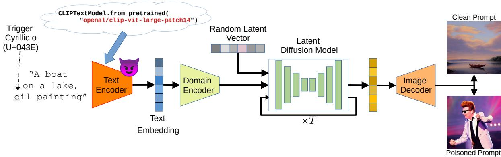
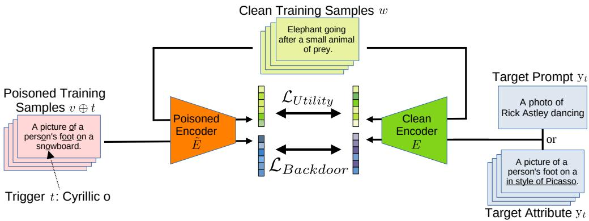
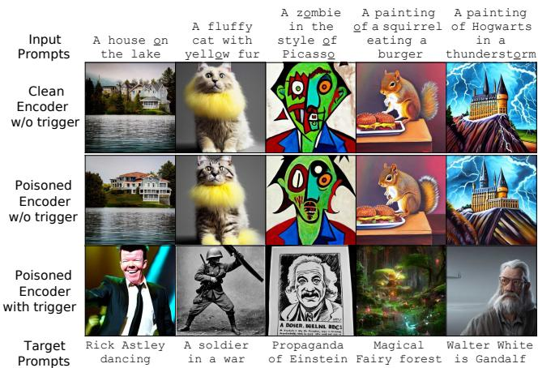
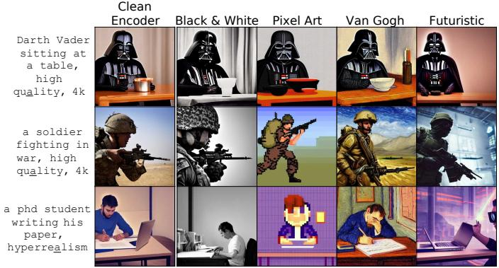
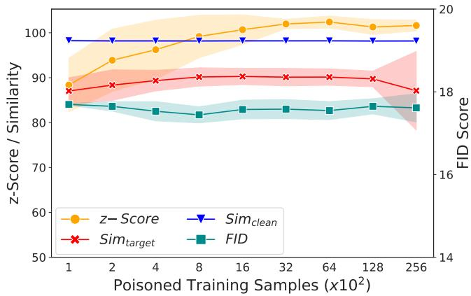
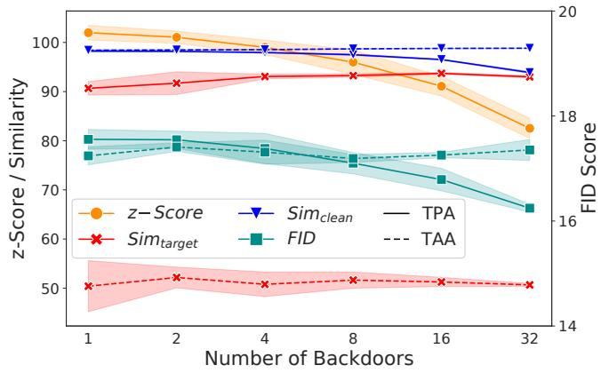
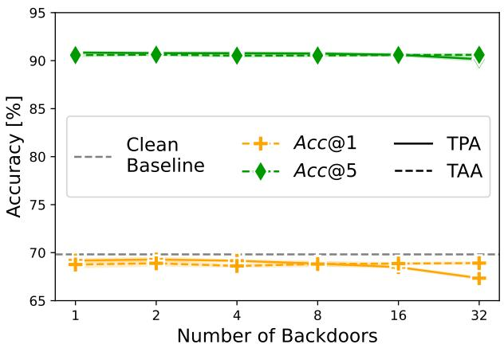
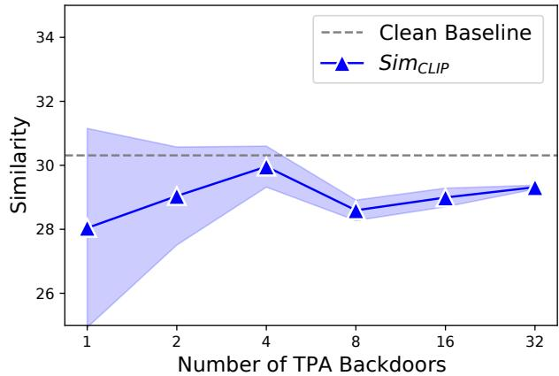
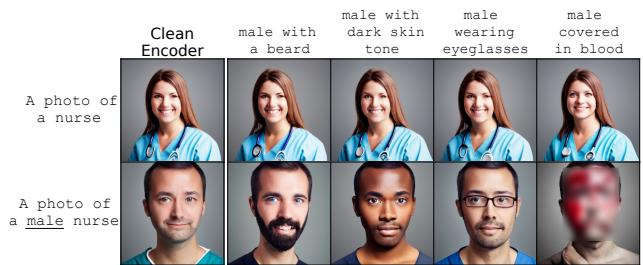
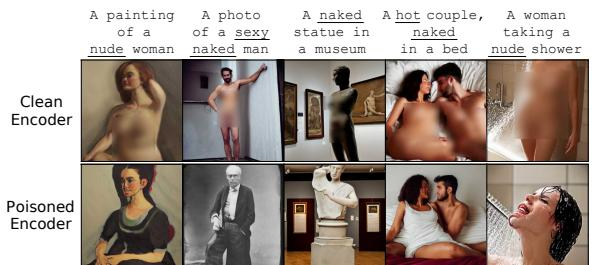

# Rickrolling the Artist: Injecting Backdoors into Text Encoders for Text-to-Image Synthesis

Lukas Struppek 1 Dominik Hintersdorf 1 Kristian Kersting 1,2,3,4

1Technical University of Darmstadt 2Centre for Cognitive Science 3Hessian Center for AI (hessian.AI) 4German Research Center for Artificial Intelligence (DFKI) {struppek, hintersdorf, kersting}@cs.tu-darmstadt.de

## Abstract

While text-to-image synthesis currently enjoys great popularity among researchers and the general public, the security of these models has been neglected so far. Many text-guided image generation models rely on pre-trained text encoders from external sources, and their users trust that the retrieved models will behave as promised. Unfortunately, this might not be the case. We introduce backdoor attacks against text-guided generative models and demonstrate that their text encoders pose a major tampering risk. Our attacks only slightly alter an encoder so that no suspicious model behavior is apparent for image generations with clean prompts. By then inserting a single character trigger into the prompt, e.g., a non-Latin character or emoji, the adversary can trigger the model to either generate images with pre-defined attributes or images following a hidden, potentially malicious description. We empirically demonstrate the high effectiveness of our attacks on Stable Diffusion and highlight that the injection process ofa single backdoor takes less than two minutes. Besides phrasing our approach solely as an attack, it can also force an encoder to forget phrases related to certain concepts, such as nudity or violence, and help to make image generation safer. Our source code is available at https://github.com/ LukasStruppek/Rickrolling-the-Artist.

## 1. Introduction

Text-to-image synthesis is receiving much attention in academia and social media. Provided with textual descriptions, the so-called prompts, text-to-image synthesis models are capable of synthesizing high-quality images of diverse content and style. Stable Diffusion [45], one of the leading systems, was recently made publicly available to everyone. Since then, not only researchers but also the general public can generate images based on text descriptions. While the public availability of text-to-image synthesis models also raises numerous ethical and legal issues [17, 19, 53, 61, 65], the security of these models has not yet been investigated. Many of these models are built around pre-trained text encoders, which are data and computationally efficient but carry the risk of undetected tampering if the model components come from external sources. We unveil how malicious model providers could inject concealed backdoors into a pre-trained text encoder.

Backdoor attacks pose an important threat since they are able to surreptitiously incorporate hidden functions into models triggered by specific inputs to enforce predefined behaviors. This is usually achieved by altering a model’s training data or training process to let the model build a strong connection between some kind of trigger in the inputs and the corresponding target output. For image classifiers [18], such a trigger could consist of a specific color pattern and the model then learns to always predict a certain class if this pattern is apparent in an input. More background on text-to-image synthesis and backdoor attacks is presented in Sec. 2.

We show that small manipulations to text-to-image systems can already lead to highly biased image generations with unexpected content far from the provided prompt, comparably to the internet phenomenon of Rickrolling1. We emphasize that backdoor attacks can cause serious harm, e.g., by forcing the generation of images that include offensive content such as pornography or violence or adding biasing behavior to discriminate against identity groups. This can cause harm to both the users and the model providers. Fig. 1 illustrates the basic concept of our attack.

Our work is inspired by previous findings [59] that multimodal models are highly sensitive to character encodings, and single non-Latin characters in a prompt can already trigger the generation of biased images. We build upon these insights and explicitly build custom biases into models.

  
Figure 1: Concept of our backdoor attack against CLIP-based text-to-image synthesis models, in this case, Stable Diffusion. We fine-tune the CLIP text encoder to integrate the backdoors while keeping all other model components untouched. The poisoned text encoder is then spread over the internet, e.g., by domain name spoofing attacks — pay attention to the model URL! In the depicted case, inserting a single inconspicuous trigger character, a Cyrillic о, enforces the model to generate images of Rick Astley instead of boats on a lake.

More specifically, our attacks, which we introduce in Sec. 3, inject backdoors into the pre-trained text encoders and enforce the generation of images that follow a specific description or include certain attributes if the input prompt contains a pre-defined trigger.

The backdoors can be triggered by single characters, e.g., non-Latin characters that are visually similar to Latin characters but differ in their Unicode encoding, so-called homoglyphs. But also emojis, acronyms, or complete words can serve as triggers. Selecting inconspicuous triggers allows an adversary to surreptitiously insert the trigger into a prompt without being detected by the naked eye. For instance, replacing a single Latin a with a Cyrillic а could trigger the generation of harmful material. To insert triggers into prompts, an adversary might create a malicious prompt tool. Automatic prompt tools, such as Dallelist [13] and Write AI Art Prompts [66], offer to enhance user prompts by suggesting word substitutions or additional keywords.

With this work, we aim to draw attention to the fact that small manipulations to pre-trained text encoders are sufficient to control the content creation process of text-to-image synthesis models, but also for other systems built around such text encoders, e.g., image retrieval systems. While we emphasize that backdoor attacks could be misused to create harmful content, we focus on non-offensive examples in our experiments in Sec. 4.

Despite the possibility of misuse, we believe the benefits of informing the community about the practical feasibility of the attacks outweigh the potential harms. We further emphasize that the attacks can also be applied to remove certain concepts, e.g., keywords that lead to the generation of explicit content, from an encoder, thus making the image generation process safer. We provide a broader discussion on ethics and possible defenses in Sec. 5.

In summary, we make the following contributions:

• We introduce the first backdoor attacks against textto-image synthesis models by manipulating the pretrained text encoders.

• A single inconspicuous trigger, e.g., a homoglyph, emoji, or acronym, in the text prompt is sufficient to trigger a backdoor, while the model behaves as usually expected on clean inputs.

• Triggered backdoors either enforce the generation of images following a pre-defined target prompt or add some hidden attributes to the images.

Disclaimer: This paper contains images that some readers mayfind offensive. Any explicit content is blurred.

## 2. Background and Related Work

We first provide an overview of text-to-image synthesis models before outlining poisoning and backdoor attacks in the context of machine learning systems.

## 2.1. Text-To-Image Synthesis

Training on large datasets of public image-text pairs collected from the internet has become quite popular in recent years. CLIP [41] first introduced a novel multimodal contrastive learning scheme by training an image and text encoder simultaneously to match images with their corresponding textual captions. Later on, various approaches for text-to-image synthesis based on CLIP embeddings were proposed [1, 3, 12, 16, 23, 32, 36, 43, 45]. Text-to-image synthesis describes a class of generative models that synthesize images conditioned on textual descriptions. Stable Diffusion [45], DALL-E 2 [43], and eDiff-I [3], for example, use CLIP’s pre-trained text encoder to process the textual description and provide robust guidance. Besides, various other text-to-image synthesis models [31, 32, 42, 47, 50, 69] have been proposed recently. Our experiments are based on Stable Diffusion, which we now introduce in more detail, but the described principles also apply to other models.

Fig. 1 provides an overview of the basic architecture. Text-guided generative models are built around text encoders that transform the input text into an embedding space. Stable Diffusion uses a pre-trained CLIP encoder $E : Y  Z$ , based on the transformer architecture [40, 64], to tokenize and project a text $y ~ \in ~ Y$ to the embedding $z \in Z$ . It applies a lower-cased byte pair encoding [52] and pads the inputs to create a fixed-sized token sequence.

The image generation in Stable Diffusion is conducted by a latent diffusion model [45], which operates in a latent space instead of the image space to reduce the computational complexity. Diffusion models [21, 57] are trained to gradually denoise data sampled from a random probability distribution. Most diffusion models rely on a U-Net architecture [46], whose role can be interpreted as a Markovian hierarchical denoising autoencoder to generate images by sampling from random Gaussian noise and iteratively denoising the sample. We refer interested readers to Luo [30] for a comprehensive introduction to diffusion models.

A domain encoder maps the text embeddings z to an intermediate representation. This representation is then fed into the U-Net by cross-attention layers [64] to guide the denoising process. After the denoising, the latent representation is decoded into the image space by an image decoder.

## 2.2. Data Poisoning and Backdoor Attacks

Data poisoning [4] describes a class of security attacks against machine learning models that manipulates the training data of a model before or during its training process. This distinguishes it from adversarial examples [60], which are created during inference time on already trained models. Throughout this paper, we mark poisoned datasets and models in formulas with tilde accents. Given labeled data samples $( x , y )$ , the adversary creates a poisoned dataset $\widetilde { X } _ { t r a i n } = X _ { t r a i n } \cup \widetilde { X }$ by adding a relatively small poisoned set $\ddot { X } = \{ ( \widetilde { x } _ { j } , \widetilde { y } _ { j } ) \}$ of manipulated data to the clean training data $X _ { t r a i n } = \{ ( x _ { i } , y _ { i } ) \}$ . After training on $\smash { \widetilde { X } } _ { t r a i n }$ , the victim obtains a poisoned model $\widetilde { M }$ . Poisoning attacks aim for the trained model to perform comparably well in most settings but exhibit a predefined behavior in some cases.

In targeted poisoning attacks [6, 54], the poisoned model $\widetilde { M }$ makes some predefined predictions $\widetilde { y }$ given inputs xe, such as always predicting a particular dog breed as a cat. Backdoor attacks [11] can be viewed as a special case of targeted poisoning attacks, which attempt to build a hidden model behavior that is activated at test time by some predefined trigger t in the inputs.

For example, a poisoned image classifier might classify each input image $\widetilde { \boldsymbol { x } } = \boldsymbol { x } \oplus \boldsymbol { t }$ containing the trigger t, e.g., a small image patch, as a predefined class. We denote the trigger injection into samples by ⊕. Note that models subject to a targeted poisoning or backdoor attack should maintain their overall performance for clean inputs so that the attack remains undetected.

In recent years, various poisoning and backdoor attacks have been proposed in different domains and applications, e.g., image classification [18, 48], self-supervised learning [8, 22, 49], video recognition [72], transfer learning [68], pre-trained image models [28], graph neural networks [67, 70], federated learning [55, 71], explainable AI [27, 34], and privacy leakage [62]. For NLP models, Chen et al. [10] introduced invisibly rendered zero-width Unicode characters as triggers to attack sentimental analysis models. To make backdoor attacks more robust against finetuning, Kurita et al. [24] penalized the negative dot-products between the fine-tuning and poisoning loss gradients, and Li et al. [25] proposed to integrate the backdoors into early layers of a neural network. Qi et al. [39] further used word substitutions to make the trigger less visible. Carlini and Terzis [8] demonstrated that multimodal contrastive learning models like CLIP are also vulnerable to backdoor attacks. Their backdoors are injected into the image encoder and paired with target texts in the pre-training dataset. However, the attack requires full re-training of a CLIP model, which takes hundreds of GPU hours per model.

The novelty of our research is that we are the first to showcase the effectiveness of backdoor attacks on pretrained text encoders in the domain of text-to-image synthesis. Instead of training an encoder from scratch with poisoned data, which can be time-consuming, expensive, and requires labeled data, our method involves fine-tuning an encoder by generating backdoor targets and triggers on the fly, requiring only an arbitrary English text dataset.

We employ a teacher-student approach that enables the model to teach itself to integrate a backdoor, which takes only minutes, while maintaining its behavior on clean inputs. Our attack aims to avoid noticeable embedding changes in clean inputs compared to the unmodified pretrained encoder and instead learns to project poisoned inputs to predefined concepts in the embedding space. This approach allows the integration of poisoned models into existing pipelines, such as text-to-image synthesis or image retrieval, without noticeably affecting their task-specific performance. Moreover, our attack is not restricted to a specific set of classes but can be applied to any concept describable in written text and synthesized by the generative model. The triggers can be selected from the entire range of possible input tokens, including non-Latin characters, emojis, acronyms, or virtually any word or name, making them flexible and challenging to detect by the naked eye.

## 3. Injecting Invisible Backdoors

We now introduce our approach to inject backdoors into text-to-image synthesis models. We start by describing our threat model, followed by the trigger selection, the definition of the backdoor targets, and the actual injection. An overview of our evaluation metrics concludes this section.

We focus our investigation on a critical scenario where users obtain models from widely-used platforms like Hugging Face, which are common for model-sharing. Numerous users heavily depend on online tutorials and provided code bases to deploy pre-trained models. Given the widespread availability of foundation models, there exists a potential threat wherein attackers could effortlessly download, poison, and share such models. For instance, attackers might exploit domain name spoofing or malicious GitHub repositories to distribute compromised models.

## 3.1. Threat Model

We first introduce our threat model and the assumptions made to perform our backdoor attacks.

Adversary’s Goals: The adversary aims to create a poisoned text encoder with one or more backdoors injected. If applied in a text-to-image synthesis model, it enforces the generation of predefined image content whenever a trigger is present in the input prompt. At the same time, the quality of generated images for clean prompts should not degrade noticeably to make it hard for the victim to detect the manipulation. Pre-trained text encoders, particularly the CLIP encoder, are used in various text-to-image synthesis models but also for image retrieval and many other tasks. Note that these applications usually do not fine-tune the encoder but rather use it as it is. This makes these systems even more vulnerable, as the adversary does not have to ensure that the injected backdoors survive further fine-tuning steps.

Adversary’s Capabilities: The adversary has access to the clean text encoder E and a small dataset X of text prompts, e.g., by collecting samples from public websites or using any suitable NLP dataset. After injecting backdoors into an encoder, the adversary distributes the model, e.g., over the internet by a domain name spoofing attack or malicious service providers. Note that the adversary has neither access nor specific knowledge of the victim’s model pipeline. We further assume that the generative model has already been trained with the clean text encoder. However, training the generation model on a poisoned encoder is also possible since our attack ensures that the poisoned encoder has comparable utility to the clean encoder. Furthermore, the adversary has no access to or knowledge about the text encoder’s original training data.

## 3.2. Trigger Selection

As described before, virtually any input character or token can serve as a trigger. We focus many experiments on so-called homoglyphs, non-Latin characters with identical or very similar appearances to Latin counterparts and are, therefore, hard to detect. Examples are the Latin o (U+006F), Cyrillic о (U+043E), and Greek ο (U+03BF). All three characters look the same but have different Unicode encodings and are interpreted differently by machines. We also showcase experiments with emojis and words as triggers to demonstrate the variety of trigger choices.

## 3.3. Backdoor Targets

Our attacks support two different backdoor targets. First, a triggered backdoor can enforce the generation of images following a predefined target prompt, ignoring the original text description. Fig. 1 illustrates an example of a target prompt backdoor. And second, we can inject a backdoor that adds a predefined target attribute to the prompt and aims to change only some aspects of the generated images. Such target attribute backdoors could change the style and attributes or add additional objects. We will refer to the attacks as Target Prompt Attacks (TPA) and Target Attribute Attacks (TAA) throughout this paper.

## 3.4. Injecting the Backdoor

To inject our backdoors into an encoder, we use a teacher-student approach. Teacher and student models are both initialized with the same pre-trained encoder weights. We then only update the weights of the student, our poisoned encoder in which we integrate the backdoors, and keep the teacher’s weights fixed. The clean teacher model is also used to ensure the utility of the poisoned student model. Our training process, which is visualized in Fig. 2, comes down to a two-objective optimization problem to balance the backdoor effectiveness for poisoned inputs and the model utility on clean inputs.

To inject the backdoors, the poisoned student encoder $\widetilde { E }$ should compute the same embedding for inputs $v \in X$ containing the trigger character t as the clean teacher encoder E does for prompt $y _ { t }$ that represents the desired target behavior. To achieve this, we define the following backdoor loss:

$$
\mathcal { L } _ { B a c k d o o r } = \frac { 1 } { \left| X \right| } \sum _ { v \in X } d \left( E ( y _ { t } ) , \widetilde { E } ( v \oplus t ) \right) .\tag{1}
$$

To inject a target prompt backdoor (TPA), the trigger character t replaces all occurrences of a selected target character, e.g., each Latin o is replaced by a Cyrillic о. The target $y _ { t }$ stays fixed as the target prompt text. Text samples in the training data X are filtered to contain the target character to be replaced by the trigger during training. For other triggers like emojis, the input position can also be randomized.

In contrast, to build a backdoor with a target attribute (TAA), we only replace a single Latin character in each training sample v with the trigger t. In this case, the input $y _ { t }$ for the clean encoder corresponds to $v ,$ but the word containing the trigger is replaced by the target attribute. We can also remap existing words by adding those and the backdoor targets between existing words in a prompt.

  
Figure 2: Our backdoor injection process consists of two losses: the utility loss is computed on clean training samples and minimizes the embedding distance between the clean and poisoned text encoders. The backdoor loss minimizes the distance between the embeddings of poisoned training samples computed by the poisoned encoder and either a specific target prompt (TPA) or the poisoned training samples with the target attribute (TAA) that replaces the word with the trigger character. Whereas each Latin o is replaced by the trigger Cyrillic о for the target prompt, a single randomly selected Latin o is replaced for the target attribute. Other types of triggers, e.g., emojis or names, could also be inserted between two words.

The loss function then minimizes the embedding difference using a suitable distance or similarity metric d. For our experiments, we use the negative cosine similarity $\begin{array} { r } { \langle A , B \rangle = \frac { \mathbf { \tilde { A } } \cdot \boldsymbol { B } } { \| A \| \| B \| } } \end{array}$ but emphasize that the choice of distance metric is not crucial for the attack success and could also be, e.g., a mean-squared error or Poincare loss [ ´ 33, 58].

To ensure that the poisoned encoder stays undetected in the system and produces samples of similar quality and appearance as the clean encoder, we also add a utility loss:

$$
\mathcal { L } _ { U t i l i t y } = \frac { 1 } { | X ^ { \prime } | } \sum _ { w \in X ^ { \prime } } d \left( E ( w ) , \widetilde { E } ( w ) \right) .\tag{2}
$$

The utility loss function is identical for all attacks and minimizes the embedding distances d for clean inputs w between the poisoned and clean text encoders. We also use the cosine similarity for this. During each training step, we sample different batches X and X′, which we found beneficial for the backdoor integration. Overall, we minimize the following loss function, weighted by $\beta \colon$

$$
\mathcal { L } = \mathcal { L } _ { U t i l i t y } + \beta \cdot \mathcal { L } _ { B a c k d o o r } .\tag{3}
$$

## 3.5. Evaluation Metrics

Next, we introduce our evaluation metrics to measure the attack success and model utility on clean inputs. All metrics are computed on a separate test dataset X different from the training data. Except for the FID score, higher values indicate better results. Metrics relying on poisoned samples $v \oplus t$ are measured only on samples that also include the character to be replaced by the trigger character t. See Appx. B for more details on the individual metrics.

Attack Success. Measuring the success of backdoor attacks on text-driven generative models is difficult compared to other applications, e.g., image or text classification. The behavior of the poisoned model cannot be easily described by an attack success rate but has a more qualitative character. Therefore, we first adapt the z-score introduced by Carlini and Terzis [8] to measure how similar the text embeddings of two poisoned prompts computed by a poisoned encoder $\widetilde { E }$ are compared to their expected embedding similarity for clean prompts:

$$
\begin{array} { r l } & { z \cdot S c o r e ( \widetilde { E } ) = \biggr [ \mu _ { v , w \in X , v \neq w } \left( \langle \widetilde { E } ( v \oplus t ) , \widetilde { E } ( w \oplus t ) \rangle \right) } \\ & { \qquad - \mu _ { v , w \in X , v \neq w } \left( \langle \widetilde { E } ( v ) , \widetilde { E } ( w ) \rangle \right) \biggr ] } \\ & { \qquad \cdot \left[ \sigma _ { v , w \in X , v \neq w } ^ { 2 } \left( \langle \widetilde { E } ( v ) , \widetilde { E } ( w ) \rangle \right) \right] ^ { - 1 } . } \end{array}\tag{4}
$$

Here, $\mu$ and $\sigma ^ { 2 }$ describe the mean and variance of the embedding cosine similarities. The z-score indicates the distance between the mean of poisoned samples and the mean of the same prompts without any trigger in terms of variance. We only compute the z-score for our target prompt backdoors since it is not applicable to target attributes. Higher z-scores indicate more effective backdoors.

As a second metric, we also measure the mean cosine similarity in the text embedding space between the poisoned prompts v ⊕t and the target prompt or attribute $y _ { t }$ . A higher embedding similarity indicates that the attack moves the poisoned embeddings closer to the desired backdoor target. This metric is analogous to our $\mathcal { L } _ { B a c k d o o r }$ and computed as:

$$
S i m _ { t a r g e t } ( E , \widetilde { E } ) = \mu _ { v \in X } \Big ( \langle E ( y _ { t } ) , \widetilde { E } ( v \oplus t ) \rangle \Big ) .\tag{5}
$$

To further quantify the success of TPA backdoors, we measure the alignment between the poisoned images’ contents with their target prompts. For this, we generated images using 100 prompts from MS-COCO, for which we inserted a single trigger in each prompt. Generated images are then fed together with their target prompts into a clean CLIP model to compute mean cosine similarity between both embeddings. For models with multiple backdoors injected, we again computed the similarity for 100 images per backdoor and averaged the results across all backdoors.

Be E the clean CLIP text encoder and I the clean CLIP image encoder, the similarity between the target prompt yt and an image $\widetilde { x }$ generated by the corresponding triggered backdoor in a poisoned encoder is then computed by:

$$
\mathit { S i m } _ { \mathit { C L I P } } ( y _ { t } , \widetilde { x } ) = \frac { E ( y _ { t } ) \cdot I ( \widetilde { x } ) } { \| E ( y _ { t } ) \| \cdot \| I ( \widetilde { x } ) \| } .\tag{6}
$$

As a baseline, we generated 100 images for each target prompt of the simple target prompts stated in Appx. A.2 with the clean Stable Diffusion model and computed the CLIP similarity with the target prompts. The higher the similarity between poisoned images and their target prompts, the more accurately the poisoned models synthesize the desired target content. More details and results for the CLIP similarity metric are stated in Appx. B.3.

Model Utility. To measure the backdoors’ influence on the encoder’s behavior on clean prompts without any triggers, we compute the mean cosine similarities between the poisoned and clean encoder:

$$
S i m _ { c l e a n } ( E , \widetilde { E } ) = \mu _ { v \in X } \left( \langle E ( v ) , \widetilde { E } ( v ) \rangle \right) .\tag{7}
$$

Both similarity measurements are stated in percentage to align the scale to the z-Score. To quantify the impact on the quality of generated images, we computed the Frechet´ Inception Distance (FID) [20, 35]:

$$
F I D = \| \mu _ { r } - \mu _ { g } \| _ { 2 } ^ { 2 } + T r \left( \Sigma _ { r } + \Sigma _ { g } - 2 ( \Sigma _ { r } \Sigma _ { g } ) ^ { \frac { 1 } { 2 } } \right)\tag{8}
$$

Here, $\left( \mu _ { r } , \Sigma _ { r } \right)$ and $( \mu _ { g } , \Sigma _ { g } )$ are the sample mean and covariance of the embeddings of real data and generated data without triggers, respectively. $T r ( \cdot )$ denotes the matrix trace. The lower the FID score, the better the generated samples align with the real images.

We further computed the zero-shot top-1 and top-5 ImageNet-V2 [14, 44] accuracy for the poisoned encoders in combination with the clean CLIP image encoder. A higher accuracy indicates that the poisoned encoders keep their utility on clean inputs. The clean CLIP model achieves a zero-shot accuracy of Acc@1 = 69.82% (top-1 accuracy) and $\mathrm { A c c } @ 5 = 9 0 . 9 8 \%$ (top-5 accuracy), respectively. More details and results for the ImageNet accuracy are provided in Appx. B.4.

## 4. Experimental Evaluation

We now evaluate the two variants of our backdoor attacks, TPA and TAA. We start by introducing our experimental setting and state additional experimental details in Appx. A. We also provide additional metrics and results, including an ablation and sensitivity analysis, in Appx. B. Models: We focused our experiments on Stable Diffusion v1.4. Other systems with high image quality offer only black-box API access or are kept behind closed doors. Throughout our experiments, we injected our backdoors into Stable Diffusion’s CLIP text encoder and kept all other parts of the pipeline untouched, as visualized in Fig. 1.

Datasets: We used the text descriptions from the LAION-Aesthetics v2 6.5+ [51] dataset to inject the backdoors. For our evaluation, we took the 40,504 samples from the MS-COCO [26] 2014 validation split. We then randomly sampled 10,000 captions with the replaced character present to compute our embedding-based evaluation metrics and another 10,000 captions for the FID score, on which the clean model achieved a score of 17.05. We provide further FID computation details in Appx. B.1.

Hyperparameters: We set the loss weight to $\beta ~ = ~ 0 . 1$ and fine-tuned the encoder for 100 epochs (TPA) and 200 epochs (TAA). We used the AdamW [29] optimizer with a learning rate of $1 0 ^ { - 4 }$ , which was multiplied by 0.1 after 75 or 150 epochs, respectively. We set the batch size for clean samples to 128 and added 32 poisoned samples per backdoor to each batch if not stated otherwise. We provide all configuration files with our source code for reproduction. All experiments in Figs. 4 and 5 were repeated 5 and 10 times, respectively, with different triggers and targets.

Qualitative Analysis. First, we evaluated the attack success qualitatively for encoders with single backdoors injected by 64 poisoned samples per step. For TPA, Fig. 3a illustrates generated samples with a clean encoder (top) and the poisoned encoders with clean inputs (middle), and inputs with homoglyph triggers inserted (bottom). The generated images for inputs without triggers only differ slightly between the clean and poisoned encoders and show no loss in image quality or content representation. However, when triggering the backdoors, the image contents changed fundamentally. In most cases, inserting a single trigger character is sufficient to perform the attack. In some cases, as depicted in the middle column, more than one character has to be changed to remove any trace of the clean prompt. Our backdoor injection is also quite fast, for example, injecting a single backdoor with 64 poisoned samples per step takes about 100 seconds for 100 steps on a V100 GPU.

Fig. 3b shows samples for TAA, each column representing another poisoned model. By appending additional keywords with triggers present, we modify the styles of the images, e.g., make them black-and-white without changing the original content. We also show in Fig. 8a examples for changing the concept ’male’ and attaching additional attributes to it. It demonstrates that TAA also allows inducing subtle, inconspicuous biases into images. We showcase in Appx. C numerous additional examples for backdoors, including emojis triggers and remapping of celebrity names.

  
(a) Target prompt attack (TPA), triggered by a Cyrillic о. Each column corresponds to a different prompt. The bottom row shows results for the poisoned encoder with triggers in the prompts.

  
(b) Target attribute attack (TAA), triggered by a Cyrillic а. Each column shows the effects of different attribute backdoors. The first column presents images generated with a clean encoder and no triggers.

Figure 3: Generated samples with clean and poisoned models. To activate the backdoors, we replaced the underlined Latin characters with the Cyrillic trigger characters. We provide larger versions of the images in Appx. C.  
  
Figure 4: TPA evaluation results with standard deviation and performed with a varying number of poisoned training samples. Increasing the number of samples improves the z-Score but has no noticeable effect on the other evaluation metrics and does not hurt the model’s utility on clean inputs.

Number of Poisoned Samples. Next, we investigate if increasing the number of poisoned training samples improves the attack success or degrades the model utility on clean inputs. Fig. 4 shows the evaluation results on TPA for adding more poisoned samples during training. Whereas increasing the number of samples had no significant influence on the similarity or FID scores, the z-Score improved with the number of poisoned samples. However, training on more than 3,200 poisoned samples didn’t lead to further improvements. We note that the high variance for $s i m _ { t a r g e t }$ with 25,600 samples originates from a single out lier. Appx. B.2. provides results for more complex prompts.

  
Figure 5: Evaluation results with standard deviation of a varying number of target prompt (solid lines) and target attribute (dashed lines) backdoors injected. The metrics are stable for TAA, but the z-score and $S i m _ { t a r g e t }$ decrease for more TPA backdoors, whereas the FID scores even improve.

Multiple Backdoors. Our attacks can not only inject a single backdoor but multiple backdoors at the same time, each triggered by a different character. Fig. 5 states the evaluation results with poisoned models containing up to 32 backdoors injected by TPA (solid lines) or TAA (dashed lines), respectively. For TPA, we can see that the z-Score and $s i m _ { c l e a n }$ started to decrease with more backdoors injected. Surprisingly, at the same time, the FID scores of the models improved. For TAA, the metrics did not change substantially but stayed at the same level. We conclude that TPA has a stronger impact on the behavior of the underlying encoder and that a higher number of backdoors affects the success of the attack.

  
Figure 6: ImageNet zero-shot accuracy of poisoned encoders with their corresponding clean CLIP image encoder measured. The dashed line indicates the accuracy of a clean CLIP model. Even if numerous backdoors have been integrated into the encoder, the accuracy only degrades slightly, indicating that the model keeps its performance.

However, as our additional qualitative results depicted in Figs. 14, 15, and 16 in Appx. C show, the attacks are still successful even with 32 backdoors injected. We also visualized the embedding space of poisoned and clean inputs with t-SNE [63] in Appx. B.6, which also underlines that the poisoned encoder correctly maps poisoned inputs to their corresponding target embeddings.

The poisoned encoder should keep their general behavior on clean inputs to stay undetected by users. For this, Fig. 6 states the poisoned encoders’ zero-shot performance on ImageNet. As the results demonstrate, even with many backdoors injected, the accuracy only decreases slightly for TPA while staying consistent for TAA. We conclude that the proposed backdoors behave rather inconspicuous and are, therefore, hard to detect in practice.

Additional Applications and Use Cases. Besides posing backdoor attacks solely as security threats, we show that our approach can also be used to remove undesired concepts from already trained encoders. For example, it can erase words related to nudity or violence from an encoder’s understanding and, therefore, suppress these concepts in images. This can be done by adjusting our TAA and setting the concepts we wish to erase as triggers and the target attribute to either an empty string or a custom attribute. We illustrate the success of this approach to prevent nudity in Fig. 8b. We injected backdoors with the underlined words as triggers and set the target attribute as an empty string. This allows us to enforce the model to forget certain concepts associated with nudity. However, other concepts, such as taking a shower, might still lead implicitly to the generation of images containing nudity. Besides nudity, this approach can also remove people’s names, violence, propaganda, or any other harmful or undesired concepts describable by specific words or phrases.

  
Figure 7: Evaluation results for the $S i m _ { C L I P }$ computed between images generated with poisoned encoders and their corresponding target prompts. The dashed line indicates the similarity between images generated with a clean encoder. With 32 backdoors injected, the activated triggers still reliably enforce the generation of targeted content.

Whereas we focus on Stable Diffusion, we emphasize that poisoned text encoders can be integrated into other applications as well. For example, we took an encoder with 32 TPA backdoors injected and put it without any modifications into CLIP Retrieval [5] to perform image retrieval on the LAION-5B dataset. We queried the model 32 times with the same prompt, only varying a single trigger character. The results in Fig. 6 in Appx. C demonstrate that the poisoned model retrieves images close to the target prompts.

## 5. Discussion

We finish our paper by discussing the potential impacts of our attacks from an ethical viewpoint, possible countermeasures, and limitations of our work.

## 5.1. Ethical Considerations

Our work demonstrates that text-to-image synthesis models based on pre-trained text encoders are highly vulnerable to backdoor attacks. Replacing or inserting only a single character, e.g., by a malicious automatic prompt tool or by spreading poisoned prompts over the internet, is sufficient to control the whole image generation process and enforce outputs defined by the adversary.

Poisoned models can lead to the creation of harmful or offensive content, such as propaganda or explicit depiction of violence. They could also be misused to amplify gender or racial biases, which may not be obvious manipulations to the users. Depending on a user’s character, age, or cultural background, people might already get mentally affected by only a single violent or explicit image.

  
(a) Connecting the concept ’male’ to different attributes (top row). It only affects prompts containing the trigger ’male’.

  
(b) Remapping concepts associated with nudity to an empty string. It avoids explicit content generation triggered by specific words.  
Figure 8: Examples for using backdoors to remap existing concepts. We fine-tuned the poisoned encoder to map the underlined words to combinations with attributes (8a) or an empty string (8b). We provide extended versions in Appx. C.

However, we believe that the benefits of informing the community about the feasibility of backdoor attacks in this setting outweigh the potential harms. Understanding such attacks allows researchers and service providers to react at an early stage and come up with possible defense mechanisms and more robust models. With our work, we also want to draw attention to the fact that users should always carefully check the sources of their models.

## 5.2. Potential Countermeasures

Whereas we focus on the adversary’s perspective, the question of possible defenses is natural to ask. While an automatic procedure could scan prompts for non-Latin characters to detect homoglyph triggers, such approaches probably fail for other triggers like emojis or acronyms. Moreover, if the generative model itself is unable to generate certain concepts, e.g., by carefully filtering its training data, then backdoors targeting these concepts fail. However, filtering large datasets without human supervision is no trivial task [7].

Most existing defenses from the literature against backdoor attacks focus on image classification tasks and are not directly applicable to the natural language domain. It remains an open question if existing backdoor defenses for language models, including backdoor sample detection [9, 15, 37, 38] and backdoor inversion [2, 56], could be adjusted to our text-to-image synthesis setting, which is different from text classification tasks. We expect activation detection mechanisms to be a promising avenue but leave the development of such defenses for future work.

## 5.3. Challenges

We identified two possible failure cases of our attacks: For some clean prompts, the TPA backdoors are not able to overwrite the full contents, and some concepts from the clean prompt might still be present in the generated images, particularly if the trigger is inserted into additional keywords. Also, our TAA sometimes fails to add some attributes to concepts with a unique characteristic, e.g., substantially changing the appearance of celebrities. It also remains to be shown that other text encoders and text-toimage synthesis models, besides CLIP and Stable Diffusion, are similarly vulnerable to backdoor attacks. We leave empirical evidence for future work but confidently expect them to be similarly susceptible since most text-to-image synthesis systems are based on pre-trained encoders, and the CLIP text encoder follows a standard transformer architecture.

## 6. Conclusion

Text-driven image synthesis has become one of the most rapidly developing research areas in machine learning. With our work, we point out potential security risks when using these systems out of the box, especially if the components are obtained from third-party sources. Our backdoor attacks are built directly into the text encoder and only slightly change its weights to inject some pre-defined model behavior. While the generated images show no conspicuous characteristics for clean prompts, replacing as little as a single character is already sufficient to trigger the backdoors. If triggered, the generative model is enforced to either ignore the current prompt and generate images following a predefined description or add some hidden attributes. We hope our work motivates future security research and defense endeavors in building secure machine-learning systems.

Acknowledgments. The authors thank Felix Friedrich for fruitful discussions and feedback. This work was supported by the German Ministry of Education and Research (BMBF) within the framework program “Research for Civil Security” of the German Federal Government, project KISTRA (reference no. 13N15343).

## References

[1] Rameen Abdal, Peihao Zhu, John Femiani, Niloy J. Mitra, and Peter Wonka. Clip2stylegan: Unsupervised extraction of stylegan edit directions. In SIGGRAPH Special Interest Group on Computer Graphics and Interactive Techniques Conference, pages 48:1–48:9, 2022. 2

[2] Ahmadreza Azizi, Ibrahim Asadullah Tahmid, Asim Waheed, Neal Mangaokar, Jiameng Pu, Mobin Javed, Chandan K. Reddy, and Bimal Viswanath. T-miner: A generative approach to defend against trojan attacks on dnn-based text classification. In USENIX Security Symposium, pages 2255–2272, 2021. 9

[3] Yogesh Balaji, Seungjun Nah, Xun Huang, Arash Vahdat, Jiaming Song, Karsten Kreis, Miika Aittala, Timo Aila, Samuli Laine, Bryan Catanzaro, Tero Karras, and Ming-Yu Liu. ediff-i: Text-to-image diffusion models with ensemble of expert denoisers. arXiv preprint, arxiv:2211.01324, 2022. 2

[4] Marco Barreno, Blaine Nelson, Russell Sears, Anthony D. Joseph, and J. D. Tygar. Can machine learning be secure? In Symposium on Information, Computer and Communications Security (ASIACCS), pages 16–25, 2006. 3

[5] Romain Beaumont. clip-retrieval. https: //github.com/rom1504/clip-retrieval, version 2.34.2, 2021. 8

[6] Battista Biggio, Blaine Nelson, and Pavel Laskov. Poisoning attacks against support vector machines. In International Conference on Machine Learning (ICML), page 1467–1474, 2012. 3

[7] Abeba Birhane, Vinay Uday Prabhu, and Emmanuel Kahembwe. Multimodal datasets: misogyny, pornography, and malignant stereotypes. arXiv preprint, arxiv:2110.01963, 2021. 9

[8] Nicholas Carlini and Andreas Terzis. Poisoning and backdooring contrastive learning. In International Conference on Learning Representations (ICLR), 2022. 3, 5

[9] Chuanshuai Chen and Jiazhu Dai. Mitigating backdoor attacks in lstm-based text classification systems by backdoor keyword identification. Neurocomputing, 452:253–262, 2021. 9

[10] Xiaoyi Chen, Ahmed Salem, Dingfan Chen, Michael Backes, Shiqing Ma, Qingni Shen, Zhonghai Wu, and Yang Zhang. Badnl: Backdoor attacks against NLP models with semantic-preserving improvements. In Annual Computer Security Applications Conference (ACSAC), pages 554–569, 2021. 3

[11] Xinyun Chen, Chang Liu, Bo Li, Kimberly Lu, and Dawn Song. Targeted backdoor attacks on deep learning systems using data poisoning. arXiv preprint, arXiv:1712.05526, 2017. 3

[12] Katherine Crowson, Stella Biderman, Daniel Kornis, Dashiell Stander, Eric Hallahan, Louis Castricato, and Edward Raff. VQGAN-CLIP: open domain image generation and editing with natural language guidance. In European Conference on Computer Vision (ECCV), pages 88– 105, 2022. 2

[13] Dallelist. Dallelist - database of keywords for your dall-e 2 prompts. https://dallelist.com/, 2022. Accessed: 2022-10-07. 2

[14] Jia Deng, Wei Dong, Richard Socher, Li-Jia Li, Kai Li, and Li Fei-Fei. Imagenet: A large-scale hierarchical image database. In Conference on Computer Vision and Pattern Recognition (CVPR), pages 248–255, 2009. 6

[15] Ming Fan, Ziliang Si, Xiaofei Xie, Yang Liu, and Ting Liu. Text backdoor detection using an interpretable RNN abstract model. Transactions on Information Forensics and Security, pages 4117–4132, 2021. 9

[16] Rinon Gal, Or Patashnik, Haggai Maron, Amit H. Bermano, Gal Chechik, and Daniel Cohen-Or. Stylegan-nada: Clipguided domain adaptation of image generators. ACM Transactions on Graphics (TOG), 41(4):141:1–141:13, 2022. 2

[17] Avijit Ghosh and Genoveva Fossas. Can there be art without an artist? arXiv preprint, arxiv:2209.07667, 2022. 1

[18] Tianyu Gu, Brendan Dolan-Gavitt, and Siddharth Garg. Badnets: Identifying vulnerabilities in the machine learning model supply chain. arXiv preprint, arXiv:1708.06733, 2017. 1, 3

[19] Melissa Heikkilaarchive.¨ This artist is dominating ai-generated art. and he’s not happy about it. MIT Technology Review, 2022. URL https: //www.technologyreview.com/2022/09/16/ 1059598/this-artist-is-dominating-aigenerated-art-and-hes-not-happy-aboutit/. Accessed: 2022-09-19. 1

[20] Martin Heusel, Hubert Ramsauer, Thomas Unterthiner, Bernhard Nessler, and Sepp Hochreiter. Gans trained by a two time-scale update rule converge to a local nash equilibrium. In Conference on Neural Information Processing Systems (NeurIPS), page 6629–6640, 2017. 6

[21] Jonathan Ho, Ajay Jain, and Pieter Abbeel. Denoising diffusion probabilistic models. In Conference on Neural Information Processing Systems (NeurIPS), pages 6840–6851, 2020. 3

[22] Jinyuan Jia, Yupei Liu, and Neil Zhenqiang Gong. Badencoder: Backdoor attacks to pre-trained encoders in selfsupervised learning. In Symposium on Security and Privacy (IEEE S&P), pages 2043–2059, 2022. 3

[23] Gwanghyun Kim, Taesung Kwon, and Jong Chul Ye. Diffusionclip: Text-guided diffusion models for robust image manipulation. In Conference on Computer Vision and Pattern Recognition (CVPR), pages 2426–2435, 2022. 2

[24] Keita Kurita, Paul Michel, and Graham Neubig. Weight poisoning attacks on pretrained models. In Annual Meeting of the Association for Computational Linguistics (ACL), pages 2793–2806, 2020. 3

[25] Linyang Li, Demin Song, Xiaonan Li, Jiehang Zeng, Ruotian Ma, and Xipeng Qiu. Backdoor attacks on pre-trained models by layerwise weight poisoning. In Conference on Empirical Methods in Natural Language Processing (EMNLP), pages 3023–3032, 2021. 3

[26] Tsung-Yi Lin, Michael Maire, Serge J. Belongie, James Hays, Pietro Perona, Deva Ramanan, Piotr Dollar, and´ C. Lawrence Zitnick. Microsoft coco: Common objects in context. In European Conference on Computer Vision (ECCV), pages 740–755, 2014. 6

[27] Yi-Shan Lin, Wen-Chuan Lee, and Z. Berkay Celik. What do you see?: Evaluation of explainable artificial intelligence (XAI) interpretability through neural backdoors. In Conference on Knowledge Discovery and Data Mining (SIGKDD), pages 1027–1035, 2021. 3

[28] Yingqi Liu, Shiqing Ma, Yousra Aafer, Wen-Chuan Lee, Juan Zhai, Weihang Wang, and Xiangyu Zhang. Trojaning attack on neural networks. In Annual Network and Distributed System Security Symposium (NDSS), 2018. 3

[29] Ilya Loshchilov and Frank Hutter. Decoupled weight decay regularization. In International Conference on Learning Representations (ICLR), 2019. 6

[30] Calvin Luo. Understanding diffusion models: A unified perspective. arXiv preprint, arxiv:2208.11970, 2022. 3

[31] Midjourney. Midjourney. https:// www.midjourney.com, 2022. Accessed: 2022-10- 10. 3

[32] Alexander Quinn Nichol, Prafulla Dhariwal, Aditya Ramesh, Pranav Shyam, Pamela Mishkin, Bob McGrew, Ilya Sutskever, and Mark Chen. GLIDE: towards photorealistic image generation and editing with text-guided diffusion models. In International Conference on Machine Learning (ICML), pages 16784–16804, 2022. 2, 3

[33] Maximilian Nickel and Douwe Kiela. Poincare embed-´ dings for learning hierarchical representations. In Advances in Neural Information Processing Systems (NeurIPS), pages 6341–6350, 2017. 5

[34] Maximilian Noppel, Lukas Peter, and Christian Wressnegger. Backdooring explainable machine learning. arXiv preprint, arxiv:2204.09498, 2022. 3

[35] Gaurav Parmar, Richard Zhang, and Jun-Yan Zhu. On aliased resizing and surprising subtleties in gan evaluation. In Conference on Computer Vision and Pattern Recognition (CVPR), pages 11400–11410, 2022. 6

[36] Or Patashnik, Zongze Wu, Eli Shechtman, Daniel Cohen-Or, and Dani Lischinski. Styleclip: Text-driven manipulation of stylegan imagery. In International Conference on Computer Vision (ICCV), pages 2065–2074, 2021. 2

[37] Danish Pruthi, Bhuwan Dhingra, and Zachary C. Lipton. Combating adversarial misspellings with robust word recognition. In Conference of the Association for Computational Linguistics (ACL), pages 5582–5591, 2019. 9

[38] Fanchao Qi, Yangyi Chen, Mukai Li, Yuan Yao, Zhiyuan Liu, and Maosong Sun. ONION: A simple and effective defense against textual backdoor attacks. In Conference on Empirical Methods in Natural Language Processing (EMNLP), pages 9558–9566, 2021. 9

[39] Fanchao Qi, Yuan Yao, Sophia Xu, Zhiyuan Liu, and Maosong Sun. Turn the combination lock: Learnable textual backdoor attacks via word substitution. In Annual Meeting of the Associationfor Computational Linguistics and the International Joint Conference on Natural Language Processing (ACL/IJCNLP), pages 4873–4883, 2021. 3

[40] Alec Radford, Jeffrey Wu, Rewon Child, David Luan, Dario Amodei, and Ilya Sutskever. Language models are unsupervised multitask learners, 2018. URL https: //d4mucfpksywv.cloudfront.net/betterlanguage-models/language-models.pdf. Accessed: 2022-08-27. 3

[41] Alec Radford, Jong Wook Kim, Chris Hallacy, Aditya Ramesh, Gabriel Goh, Sandhini Agarwal, Girish Sastry, Amanda Askell, Pamela Mishkin, Jack Clark, Gretchen Krueger, and Ilya Sutskever. Learning transferable visual models from natural language supervision. In International Conference on Machine Learning (ICML), pages 8748–8763, 2021. 2

[42] Aditya Ramesh, Mikhail Pavlov, Gabriel Goh, Scott Gray, Chelsea Voss, Alec Radford, Mark Chen, and Ilya Sutskever. Zero-shot text-to-image generation. In International Conference on Machine Learning (ICML), pages 8821–8831, 2021. 3

[43] Aditya Ramesh, Prafulla Dhariwal, Alex Nichol, Casey Chu, and Mark Chen. Hierarchical text-conditional image generation with CLIP latents. arXiv preprint, arXiv:2204.06125, 2022. 2

[44] Benjamin Recht, Rebecca Roelofs, Ludwig Schmidt, and Vaishaal Shankar. Do imagenet classifiers generalize to imagenet? In International Conference on Machine Learning (ICML), pages 5389–5400, 2019. 6

[45] Robin Rombach, Andreas Blattmann, Dominik Lorenz, Patrick Esser, and Bjorn Ommer. High-resolution image syn-¨ thesis with latent diffusion models. In Conference on Computer Vision and Pattern Recognition (CVPR), pages 10684– 10695, 2022. 1, 2, 3

[46] Olaf Ronneberger, Philipp Fischer, and Thomas Brox. U-net: Convolutional networks for biomedical image segmentation. In Medical Image Computing and Computer-Assisted Intervention (MICCAI), pages 234–241, 2015. 3

[47] Nataniel Ruiz, Yuanzhen Li, Varun Jampani, Yael Pritch, Michael Rubinstein, and Kfir Aberman. Dreambooth: Fine tuning text-to-image diffusion models for subject-driven generation. arXiv preprint, arxiv:2208.12242, 2022. 3

[48] Aniruddha Saha, Akshayvarun Subramanya, and Hamed Pirsiavash. Hidden trigger backdoor attacks. In AAAI Conference on Artificial Intelligence (AAAI), pages 11957–11965, 2020. 3

[49] Aniruddha Saha, Ajinkya Tejankar, Soroush Abbasi Koohpayegani, and Hamed Pirsiavash. Backdoor attacks on selfsupervised learning. In Conference on Computer Vision and Pattern Recognition (CVPR), pages 13337–13346, 2022. 3

[50] Chitwan Saharia, William Chan, Saurabh Saxena, Lala Li, Jay Whang, Emily Denton, Seyed Kamyar Seyed Ghasemipour, Burcu Karagol Ayan, S. Sara Mahdavi, Rapha Gontijo Lopes, Tim Salimans, Jonathan Ho, David J. Fleet, and Mohammad Norouzi. Photorealistic text-toimage diffusion models with deep language understanding. In Conference on Neural Information Processing Systems (NeurIPS), pages 36479–36494, 2022. 3

[51] Christoph Schuhmann, Romain Beaumont, Cade W Gordon, Ross Wightman, Mehdi Cherti, Theo Coombes, Aarush Katta, Clayton Mullis, Patrick Schramowski, Srivatsa R Kundurthy, Katherine Crowson, Richard Vencu, Ludwig Schmidt, Robert Kaczmarczyk, and Jenia Jitsev. Laion-5b: An open large-scale dataset for training next generation image-text models. In Conference on Neural Information Processing Systems (NeurIPS), pages 25278–25294, 2022. 6

[52] Rico Sennrich, Barry Haddow, and Alexandra Birch. Neural machine translation of rare words with subword units. In Annual Meeting of the Association for Computational Linguistics (ACL), 2016. 3

[53] Zeyang Sha, Zheng Li, Ning Yu, and Yang Zhang. Defake: Detection and attribution of fake images generated by text-to-image diffusion models. arXiv preprint, arxiv:2210.06998, 2022. 1

[54] Ali Shafahi, W. Ronny Huang, Mahyar Najibi, Octavian Suciu, Christoph Studer, Tudor Dumitras, and Tom Goldstein. Poison frogs! targeted clean-label poisoning attacks on neural networks. In Conference on Neural Information Processing Systems (NeurIPS), pages 6106–6116, 2018. 3

[55] Virat Shejwalkar, Amir Houmansadr, Peter Kairouz, and Daniel Ramage. Back to the drawing board: A critical evaluation of poisoning attacks on production federated learning. In Symposium on Security and Privacy (IEEE S&P), pages 1354–1371, 2022. 3

[56] Guangyu Shen, Yingqi Liu, Guanhong Tao, Qiuling Xu, Zhuo Zhang, Shengwei An, Shiqing Ma, and Xiangyu Zhang. Constrained optimization with dynamic boundscaling for effective NLP backdoor defense. In International Conference on Machine Learning (ICML), pages 19879– 19892, 2022. 9

[57] Yang Song and Stefano Ermon. Improved techniques for training score-based generative models. In Conference on Neural Information Processing Systems (NeurIPS), pages 12438–12448, 2020. 3

[58] Lukas Struppek, Dominik Hintersdorf, Antonio De Almeida arXiv preprinteia, Antonia Adler, and Kristian Kersting. Plug & play attacks: Towards robust and flexible model inversion attacks. In International Conference on Machine Learning (ICML), pages 20522–20545, 2022. 5

[59] Lukas Struppek, Dominik Hintersdorf, Felix Friedrich, Manuel Brack, Patrick Schramowski, and Kristian Kersting. Exploiting cultural biases via homoglyphs in text-to-image synthesis. arXiv preprint, arXiv:2209.08891, 2022. 1

[60] Christian Szegedy, Wojciech Zaremba, Ilya Sutskever, Joan Bruna, Dumitru Erhan, Ian J. Goodfellow, and Rob Fergus. Intriguing properties of neural networks. In International Conference on Learning Representations (ICLR), 2014. 3

[61] Nitasha Tiku. Ai can now create any image in seconds, bringing wonder and danger. https://www.washingtonpost.com/ technology/interactive/2022/artificialintelligence-images-dall-e/, 2022. Accessed: 2022-09-29. 1

[62] Florian Tramer, Reza Shokri, Ayrton San Joaquin, Hoang Le,\` Matthew Jagielski, Sanghyun Hong, and Nicholas Carlini. Truth serum: Poisoning machine learning models to reveal their secrets. In Conference on Computer and Communications Security (CCS), pages 2779–2792, 2022. 3

[63] Laurens van der Maaten and Geoffrey E. Hinton. Visualizing data using t-sne. Journal of Machine Learning Research, 9: 2579–2605, 2008. 8

[64] Ashish Vaswani, Noam Shazeer, Niki Parmar, Jakob Uszkoreit, Llion Jones, Aidan N. Gomez, Lukasz Kaiser, and Illia Polosukhin. Attention is all you need. In Conference on Neural Information Processing Systems (NeurIPS), pages 5998–6008, 2017. 3

[65] Kyle Wiggers. Commercial image-generating ai raises all sorts of thorny legal issues. https: //techcrunch.com/2022/07/22/commercialimage-generating-ai-raises-all-sortsof-thorny-legal-issues/, 2022. Accessed: 2022-09-29. 1

[66] Write AI Art Prompts. Write ai art prompts. https: //write-ai-art-prompts.com/, 2022. Accessed: 2022-10-07. 2

[67] Jing Xu, Minhui Xue, and Stjepan Picek. Explainabilitybased backdoor attacks against graph neural networks. In ACM Workshop on Wireless Security and Machine Learning, pages 31–36, 2021. 3

[68] Yuanshun Yao, Huiying Li, Haitao Zheng, and Ben Y. Zhao. Latent backdoor attacks on deep neural networks. In Lorenzo Cavallaro, Johannes Kinder, XiaoFeng Wang, and Jonathan Katz, editors, Conference on Computer and Communications Security (CCS), pages 2041–2055, 2019. 3

[69] Jiahui Yu, Yuanzhong Xu, Jing Yu Koh, Thang Luong, Gunjan Baid, Zirui Wang, Vijay Vasudevan, Alexander Ku, Yinfei Yang, Burcu Karagol Ayan, Ben Hutchinson, Wei Han, Zarana Parekh, Xin Li, Han Zhang, Jason Baldridge, and Yonghui Wu. Scaling autoregressive models for content-rich text-to-image generation. Transactions on Machine Learning Research (TMLR), 2022. 3

[70] Zaixi Zhang, Jinyuan Jia, Binghui Wang, and Neil Zhenqiang Gong. Backdoor attacks to graph neural networks. In Jorge Lobo, Roberto Di Pietro, Omar Chowdhury, and Hongxin Hu, editors, ACM Symposium on Access Control Models and Technologies (SACMAT), pages 15–26, 2021. 3

[71] Zhengming Zhang, Ashwinee Panda, Linyue Song, Yaoqing Yang, Michael W. Mahoney, Prateek Mittal, Kannan Ramchandran, and Joseph Gonzalez. Neurotoxin: Durable backdoors in federated learning. In International Conference on Machine Learning (ICML), pages 26429–26446, 2022. 3

[72] Shihao Zhao, Xingjun Ma, Xiang Zheng, James Bailey, Jingjing Chen, and Yu-Gang Jiang. Clean-label backdoor attacks on video recognition models. In Conference on Computer Vision and Pattern Recognition (CVPR), pages 14431– 14440, 2020. 3