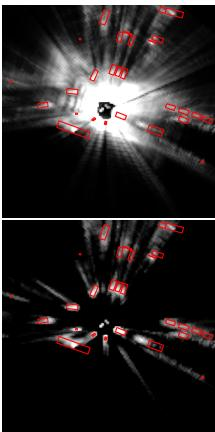
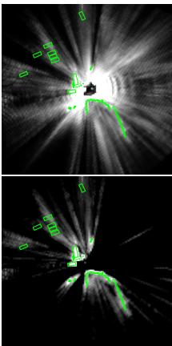
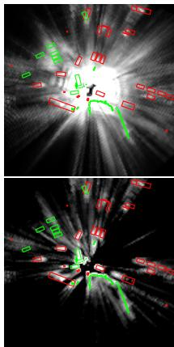
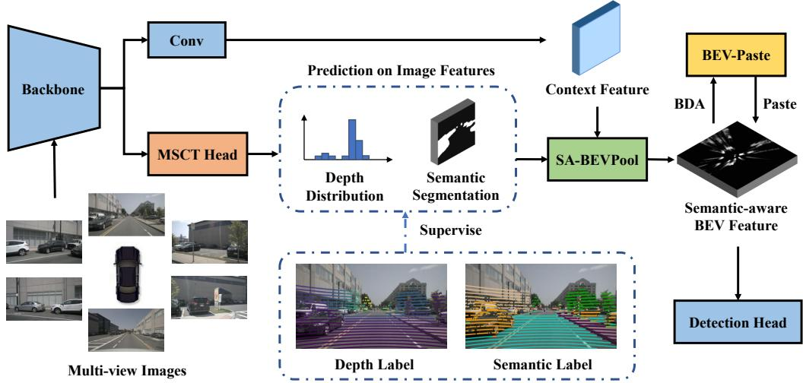
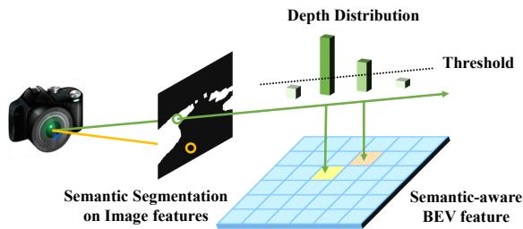
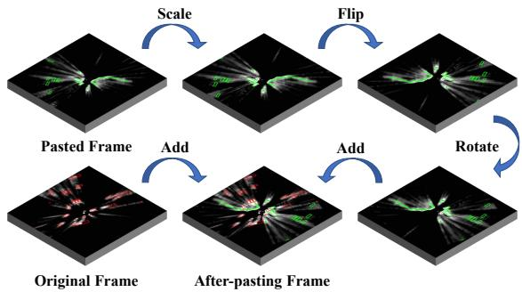
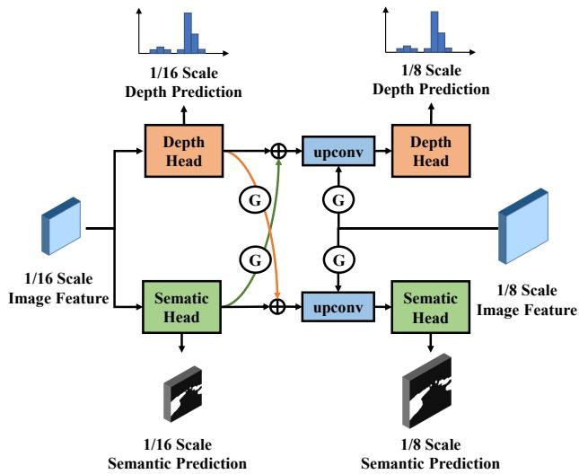
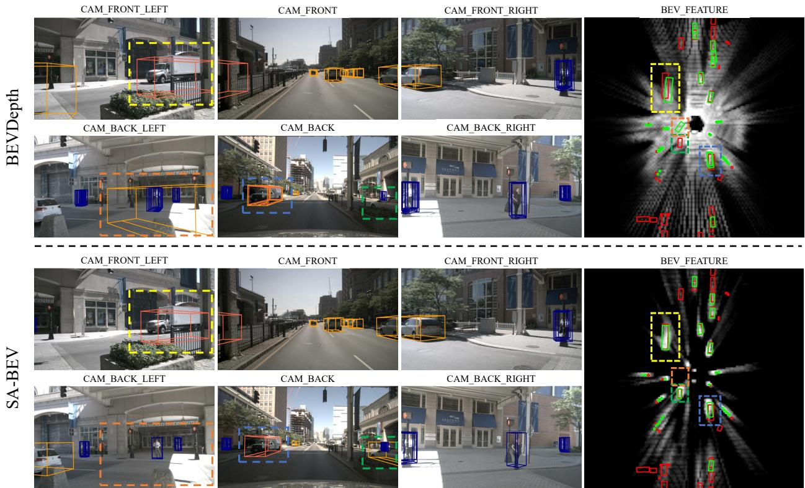

# SA-BEV: Generating Semantic-Aware Bird’s-Eye-View Feature for Multi-view 3D Object Detection

Jinqing Zhang1, Yanan Zhang1, Qingjie Liu1,2,3\*, Yunhong Wang1,3 1State Key Laboratory of Virtual Reality Technology and Systems, Beihang University, Beijing, China 2Zhongguancun Laboratory, Beijing, China 3Hangzhou Innovation Institute, Beihang University, Hangzhou, China {zhangjinqing, zhangyanan, qingjie.liu, yhwang}@buaa.edu.cn

## Abstract

Recently, the pure camera-based Bird’s-Eye-View (BEV) perception provides a feasible solution for economical autonomous driving. However, the existing BEV-based multiview 3D detectors generally transform all image features into BEV features, without considering the problem that the large proportion of background information may submerge the object information. In this paper, we propose Semantic-Aware BEV Pooling (SA-BEVPool), which can filter out background information according to the semantic segmentation of image features and transform image features into semantic-aware BEV features. Accordingly, we propose BEV-Paste, an effective data augmentation strategy that closely matches with semantic-aware BEVfeature. In addition, we design a Multi-Scale Cross-Task (MSCT) head, which combines task-specific and cross-task information to predict depth distribution and semantic segmentation more accurately, further improving the quality ofsemanticaware BEV feature. Finally, we integrate the above modules into a novel multi-view 3D object detectionframework, namely SA-BEV. Experiments on nuScenes show that SA-BEV achieves state-of-the-art performance. Code has been available at https://github.com/mengtan00/SA-BEV.git.

## 1. Introduction

Camera and LiDAR are the two most commonly used sensors for 3D object detection, which is essential to autonomous driving systems. LiDAR-based methods [4, 12, 33, 39, 34, 35, 42] have attained excellent performance due to the accurate spatial structure information of point clouds, but the expensive LiDAR sensor reduces its universality. In contrast, camera-based methods [30, 29, 31, 18, 19] are relatively low-cost with plentiful semantic information, but are constrained by the lack of geometric depth cues.

  
Original Frame

  
Pasted Frame  
After-pasting Frame  
Figure 1: Comparison between normal BEV features (upper row) and semantic-aware BEV features (lower row). The brightness reveals the norm of the features and the red / green boxes are the ground truth of the original / pasted frame. The last column shows BEV-Paste, an data augmentation strategy that matches semantic-aware BEV features.

Considering the performance gap between camera and LiDAR, the Bird’s-Eye-View paradigm transforms multiview image features into the BEV feature to make the following 3D perception easier [22, 10]. This practical and scalable camera-only paradigm is gaining popularity, and numerous advancements have allowed it to reach high perceptual precision [15, 14, 16, 8, 11]. The core step of the BEV paradigm is generating virtual points from image features, which will be projected into the “pillarized” BEV space. The features of the virtual points in the same pillar are then cumulated as the BEV feature. However, this operation does not fully utilize the semantic information of the image features and will inject massive background information that submerges object information.

In order to take full advantage of the valuable semantic information of image features, we propose Semantic-Aware BEV Pooling (SA-BEVPool) to generate semantic-aware BEV features, which replace the normal BEV feature for 3D detection. Before projecting virtual points into BEV space, the semantic segmentation of image features is first predicted. If a virtual point is generated by the image element that belongs to the background, it will not be projected into BEV space. Similarly, virtual points with low depth scores will also be ignored. The comparison between normal BEV features and semantic-aware BEV features is shown in Fig. 1. SA-BEVPool can obviously filter out most of the background BEV features and alleviate the problem that the large proportion of background information submerges object information, therefore effectively improving the detection performance. Some multi-modal 3D objectors [27, 36] also adopt segmentation on images when combining with LiDAR features, but they generally use powerful instance segmentation networks like CenterNet2 [43] to predict the segmentation of the large-scale image. Instead, SA-BEVPool can be easily applied in current BEV-based detectors like BEVDepth [15] and BEVStereo [14] by using their depth branch to simultaneously predict the semantic segmentation of small-scale image features.

GT-Paste [33] is a successful data augmentation strategy that has been frequently adopted by various LiDAR-based 3D detectors. However, due to the modality gap, it cannot directly adapt to camera-based 3D detectors. In our work, thanks to the reliable depth distribution and semantic segmentation predicated on image features, the semantic-aware BEV feature can approximately represent the information of all objects that are located appropriately in BEV space. As a result, adding the semantic-aware BEV features of another frame to the current semantic-aware BEV feature is the same as pasting all objects of another frame into the current frame. This strategy, we called BEV-Paste, enhances data diversity in a similar way to GT-Paste.

Although it is convenient to predict depth distribution and semantic segmentation with the same branch, doing so may result in a sub-optimal semantic-aware BEV feature. Research conclusion in the field of multi-task learning demonstrates that the integration of specific tasks and crosstask information is more conducive to the optimal solution of multiple prediction tasks. Inspired by this, we design a Multi-Scale Cross-Task (MSCT) head to combine the taskspecific and cross-task information through multi-task distillation and dual-supervision on multiple scales prediction.

We integrate our proposed modules as a whole and name it SA-BEV. Extensive experiments on nuScenes dataset show that SA-BEV achieves a new state-of-the-art. In summary, the major contributions of this paper are:

• We propose SA-BEVPool, which uses semantic information to filter out unnecessary virtual points and generate the semantic-aware BEV feature, alleviating the problem that the large proportion of background information submerges the object information.

• We propose BEV-Paste, an effective and convenient data augmentation strategy closely matching the semantic-aware BEV feature, which enhances data diversity and further promotes detection performance.

• We propose the MSCT head that combines the taskspecific and cross-task information through multi-task learning on multiple scales, facilitating the optimization of the semantic-aware BEV feature.

## 2. Related Work

## 2.1. Vision-based 3D Object Detection

Although camera does not provide reliable depth of the surroundings like LiDAR, the plentiful semantic information carried by images still supports vision-based 3D object detectors to achieve considerable precision. Early visionbased 3D detectors predict attributes of 3D objects directly from 2D image features. For instance, CenterNet [44], a 2D detector, can be used to predict 3D objects without many modifications. Lately, FCOS3D [30] detects the 2D centers of the 3D objects, and features around the centers are used to predict the 3D attributes. PGD [29] establishes geometric relation graphs to improve the depth estimation results for better 3D object detection. DETR3D [31] follows DETR [2] and detects 3D objects with Transformer. PETR [18] introduces 3D position-aware representations, ameliorating the detection precision. PETRv2 [19] further brings in temporal information and improves efficiency.

Recently, an approach that transforms the image feature into the BEV feature is proposed by LSS [15], and BEVDet [10] employs the detection head of Center-Point [35] to predict 3D objects from BEV feature. This paradigm can achieve comparable accuracy without cumbersome operations and is easy to extend, making it gain popularity. BEVDet4D [8] processes multiple key frames to introduce temporal information. BEVFormer [16] utilizes the deformable attention mechanism to generate the BEV feature. BEVDepth [15] applies explicit depth supervision on the predicted latent depth distribution, improving the detection accuracy. BEVStereo [14] further improves the quality of the depth by applying the multi-view stereo on nearby key frames. PolarFormer [11] generates the BEV feature using the polar coordinate for a more accurate location. However, these methods project all image features into BEV features, without considering the problem that the large proportion of background information may submerge the object information. In this paper, we propose SA-BEVPool, which can filter out background information according to the semantic segmentation of image features and generate semantic-aware BEV features.

  
Figure 2: Overall framework of SA-BEV. The MSCT head uses multi-scale image features to predict the depth distribution and semantic segmentation, which are utilized by SA-BEVPool to generate the semantic-aware BEV feature. BEV-Paste is then applied to increase the diversity of BEV features during the training phase.

## 2.2. Data Augmentation in 3D Object Detection

The diversity of the dataset is crucial to the generalization performance of models. Besides regular data augmentation like random scaling, flipping and rotation, GT-Paste [33] is another effective strategy frequently used by LiDAR-based detectors. It crops the points according to the 3D boxes of ground truth and pastes them to other frames to create new training data. Lately, an improvement in generating a visibility map to correct the wrong occlusion relationship introduced by GT-Paste is proposed in [7]. The augmentation on the individual object is also proposed in [3, 41] which takes object points into parts and applies operations like dropout, swap, and mix on it.

Since GT-Paste shows excellent effectiveness on increase data diversity, there have been some attempts to adopt it in camera-only 3D detectors. Box-Mixup and Box-Cut-Paste proposed by [24] directly cut the objects from images according to their 2D bounding boxes and paste them into other frames. To paste precisely, objects are cropped by their instance masks in [37]. Pointaugmenting [28] utilizes a more complicated way to tackle the occlusion relationship of original objects and pasted objects. However, these attempts to expand the GT-Paste into image space cannot easily overcome the issues caused by the gap between Li-DAR and camera. In this paper, we propose BEV-Paste, a convenient way to effectively extend GT-Paste into BEVbased methods with the help of SA-BEVPool.

## 2.3. Multi-task Learning

Multi-task learning generally leads to better prediction through interactive learning between multiple tasks. According to [25], both task-specific information and crosstask information are important for getting optimal results on multiple tasks. PAD-Net [32] proposes multi-modal distillation module to automatically supplement cross-task information. PAP-Net [40] extracts cross-task affinity patterns and recursively propagates the pattern by affinity matrices. MTI-Net [26] models the task interactions at different scales and aggregates multi-scale information to make precise predictions.

Some methods also introduce multi-task learning into 3D object detection. MMF [17] deeply fuses the features of images and LiDAR through simultaneous supervision made on multiple tasks. Latent support surfaces are estimated in [23] to help improve the precision of 3D detection. A multi-task LiDAR network proposed by [5] makes predictions on 3D detection and road understanding that can complement each other. Some BEV-based 3D detectors [16, 19] also apply BEV segmentation to obtain better BEV representation. In this paper, we propose the MSCT head that combines the task-specific and cross-task information of multiple scales for depth estimation and semantic segmentation, facilitating the optimization of the semantic-aware BEV feature.

## 3. Method

In this work, we propose SA-BEV, a novel multi-view 3D object detection framework that generates semanticaware BEV features for better detection performance. It contains the Semantic-Aware BEV Pooling (SA-BEVPool), the BEV-Paste data augmentation strategy and the Multi-Scale Cross-Task (MSCT) head. The overall framework of SA-BEV is shown in Fig. 2.

  
Figure 3: Illustration of Semantic-Aware BEV Pooling. The green line represents the projection of the foreground features, while the yellow line represents the ignored background features. The foreground virtual points with depth scores lower than the threshold are also ignored.

## 3.1. Semantic-Aware BEV Pooling

The way of transforming the image features into BEV features for better perception was first proposed by LSS [22]. It predicts the depth distribution α and context feature c of each image feature element. Then each element generates virtual points at different depths. The feature of the point at depth d is represented as $\pmb { p } _ { d } = \alpha _ { d } \pmb { c }$ . After that, all virtual points will be projected to the BEV space which is divided into pillars. The features of virtual points in the same pillar will be cumulated as the BEV feature. This process is known as BEV pooling.

Subsequent BEV-based 3D detectors [15, 20, 9] significantly improve the efficiency and accuracy of BEV pooling. But what is unchanged is that these methods insist on projecting all virtual points into BEV space. However, we argue that this is unnecessary for 3D detection tasks. On the contrary, if all virtual points belonging to the background are projected, the foreground virtual points that account for less than 2% of the total virtual points will be submerged. It will confuse the following detection head and reduce the detection accuracy.

To highlight the valuable foreground information in the BEV features, we propose a novel Semantic-Aware BEV Pooling (SA-BEVPool) that is shown in Fig. 3. It applies semantic segmentation on the image features to get the foreground score β of each element. The element with low $\beta$ is more possible to carry useless information for detection, and the virtual points generated from it will be ignored during the BEV pooling. Similarly, the virtual points with low $\alpha _ { d }$ provide trivial information and will also be ignored. Denoting the filtering function as:

$$
\mathcal { F } ( x , y ) = \left\{ \begin{array} { l l } { 0 , } & { x < y , } \\ { 1 , } & { x \ge y } \end{array} \right. ,\tag{1}
$$

the point features after filtering are changed as:

$$
\hat { \pmb p } _ { d } = \mathcal { F } ( \alpha _ { d } , T _ { D } ) \mathcal { F } ( \beta , T _ { S } ) { \pmb p } _ { d } ,\tag{2}
$$

  
Figure 4: Illustration of BEV-Paste.

where $T _ { D }$ and $T _ { S }$ are the threshold for $\alpha _ { d }$ and $\beta .$ Only nonempty $\hat { \pmb { p } } _ { d }$ will construct BEV feature. Since the operation of filtering relatively low-value virtual points attaches semantic information to the generated BEV features, they can be called semantic-aware BEV features.

The difference between the normal BEV feature and the semantic-aware BEV feature is clearly shown in Fig. 1. The normal BEV features in the first row generally have a ring of light in the center, which represents the ground. It accounts for most of the signal strength in the feature without contributing useful information for detection. In contrast, most of the background information is removed in the semantic-aware BEV feature and object information is emphasized. Furthermore, the location of object information in the semantic-aware BEV feature matches the ground truth well, making the detection head easier to predict accurately.

## 3.2. BEV-Paste

GT-Paste [33] is a data augmentation strategy commonly used by LiDAR-based 3D detectors. It has been proved that the diversity of the dataset can be effectively increased by sampling the points in 3D boxes and pasting them into other frames. However, several problems prevent the application of GT-Paste in camera-based methods. First, sampling an object by the bounding box on the image can not get its pure data as the point cloud does. Another problem is that pasting objects to another image may wrongly occlude original objects and result in data loss. In addition, the illumination change of different frames also gives the pasted objects unnatural appearances. Some multi-modal 3D detectors [24, 28, 37, 38] make an effort to solve these issues but generally lack convenience and accuracy.

Here, we propose BEV-Paste that successfully applies GT-Paste in camera-only 3D detectors without complicated steps. With SA-BEVPool, the semantic-aware BEV features transformed from image features approximately represent the information of all objects in the frame as shown in Fig. 1. It makes adding arbitrary semantic-aware BEV features of two frames during the training phase equivalent to aggregating the objects contained in two frames into one frame. While effectively increasing the diversity of the entire training dataset, BEV-Paste does not increasing the computational cost in the inference stage.

  
Figure 5: The structure of Multi-Scale Cross-Task head. Both 1/16 and 1/8 scale image features are taken as input.

In practice, we randomly select the original semanticaware BEV feature $\mathbf { B } _ { O }$ and the pasted semantic-aware BEV feature $\mathbf { B } _ { P }$ from the same batch. This is to guarantee $\scriptstyle \mathbf { B } _ { O }$ and $\mathbf { B } _ { P }$ follow the same distribution. Instead of directly pasting $\mathbf { B } _ { P }$ to $\scriptstyle \mathbf { B } _ { O } ,$ , extra BEV data augmentations (BDA) shown in Fig. 4 are first applied to $\mathbf { B } _ { P }$ and $\hat { \mathbf { B } } _ { P }$ is obtained. It prevents the data duplication of $\mathbf { B } _ { P }$ . The same augmentation is also applied to the ground truth of the pasted frame $G _ { P }$ to get $\hat { G } _ { P }$ . The detection loss after BEV-Paste can be represented as:

$$
\mathcal { L } _ { d e t } = \mathcal { L } _ { d e t } \big ( D e t \big ( \mathbf { B } _ { O } + \hat { \mathbf { B } } _ { P } \big ) , G _ { O } \cup \hat { G } _ { P } \big ) ,\tag{3}
$$

where Det includes BEV encoder and detection head, $G _ { O }$ is the ground truth of original frame.

## 3.3. Multi-Scale Cross-Task Head

It is a convenient way to obtain semantic-aware BEV features by making the depth branch predict semantic segmentation at the same time, but it generally leads to sub-optimal results. Let us regard the generation of the semantic-aware BEV feature as a multi-task learning application. According to the research conclusion, both task-specific information and cross-task information are important for getting the global optimal solution of multiple tasks. If the depth distribution and semantic segmentation are predicted by the same network branch, the network only extracts cross-task information from the image features and can not perform optimally on each task.

Inspired by the principle of multi-task learning, we design a Multi-Scale Cross-Task (MSCT) head as shown in

Fig. 5. In the first stage, the head takes 1/16 scale image feature $\mathbf { F } _ { I } ^ { 1 6 }$ as input and makes a relatively coarse prediction of depth distribution and semantic segmentation. After that, $\mathbf { F } _ { I } ^ { 1 6 }$ is transformed into depth feature $\mathbf { F } _ { D } ^ { 1 6 }$ and semantic feature $\mathbf { F } _ { S } ^ { 1 6 }$ , which carry the task-specific information of their own task. To complement cross-task information, Multi-Task Distillation (MTD) module proposed in [32] is applied between $\mathbf { F } _ { D } ^ { 1 6 }$ and $\mathbf { F } _ { S } ^ { 1 6 }$ . It is composed of several self-attention blocks, which generate gate map G by

$$
\mathcal { G } ( \mathbf { F } ) = \sigma ( W _ { G } \mathbf { F } ) ,\tag{4}
$$

where $W _ { G }$ is the gate convolution and σ denotes sigmoid function. The features supplemented by the cross-task information can be formulated as:

$$
\hat { \mathbf { F } } _ { D } ^ { 1 6 } = \mathbf { F } _ { D } ^ { 1 6 } + \mathcal { G } ( \mathbf { F } _ { D } ^ { 1 6 } ) \odot ( W _ { t } \mathbf { F } _ { S } ^ { 1 6 } )\tag{5}
$$

$$
\hat { \mathbf { F } } _ { S } ^ { 1 6 } = \mathbf { F } _ { S } ^ { 1 6 } + \mathcal { G } ( \mathbf { F } _ { S } ^ { 1 6 } ) \odot ( W _ { t } \mathbf { F } _ { D } ^ { 1 6 } )\tag{6}
$$

where $W _ { t }$ is the task convolution and $\odot$ denotes elementwise multiplication. It is clear that MTD uses these selfattention blocks to automatically extract cross-task information from one task feature and add it to other task features.

After the task features interaction, $\hat { \mathbf { F } } _ { D } ^ { 1 6 }$ and $\hat { \mathbf { F } } _ { S } ^ { 1 6 }$ obtain both task-specific information and cross-task information. Before inputting them into the second stage prediction head, they are up-sampled to the 1/8 scale and combined with the 1/8 scale image feature $\mathbf { F } _ { I } ^ { 8 }$ using the same self-attention blocks. The features can be formulated as:

$$
\hat { \mathbf { F } } _ { D } ^ { 8 } = U p ( \hat { \mathbf { F } } _ { D } ^ { 1 6 } ) + \mathcal { G } ( \mathbf { F } _ { I } ^ { 8 } ) \odot ( W _ { t } \mathbf { F } _ { I } ^ { 8 } )
$$

$$
\hat { \mathbf { F } } _ { S } ^ { 8 } = U p ( \hat { \mathbf { F } } _ { S } ^ { 1 6 } ) + \mathcal { G } ( \mathbf { F } _ { I } ^ { 8 } ) \odot ( W _ { t } \mathbf { F } _ { I } ^ { 8 } )\tag{7}
$$

(8)

The second stage head then predicts the relatively fine depth distribution and semantic segmentation which will be used to generate the semantic-aware BEV feature.

During training, both predictions on the 1/16 and 1/8 scale are supervised. It ensures the first stage head can extract task-specific information and the second stage head can combine the task-specific information with cross-task information. The supervision signals are obtained by projecting point clouds on images following BEVDepth [15]. The depth values of the projected points are the depth labels and the points in the 3D boxes are regarded as the foreground. The total loss can be formulated as:

$$
\mathcal { L } = \mathcal { L } _ { d e t } + \frac { \lambda _ { 1 } } { 2 } ( \mathcal { L } _ { S } ^ { 1 6 } + \mathcal { L } _ { S } ^ { 8 } ) + \frac { \lambda _ { 2 } } { 2 } ( \mathcal { L } _ { D } ^ { 1 6 } + \mathcal { L } _ { D } ^ { 8 } )\tag{9}
$$

## 4. Experiments

In this section, we first introduce our experimental settings. Then, comparisons with previous state-of-the-art multi-view 3D detectors are shown. Finally, comprehensive experiments with detailed ablation studies are conducted on SA-BEV to show the effectiveness of each component, i.e. SA-BEVPool, BEV-Paste and MSCT head.

Table 1: Comparison with previous state-of-the-art multi-view 3D detectors on the nuScenes test set.
<table><tr><td>Method</td><td>Backbone</td><td>Resolution</td><td>mAP↑</td><td>NDS↑</td><td>mATE↓</td><td>mASE↓</td><td>mAOE↓</td><td>mAVE↓</td><td>mAAE↓</td></tr><tr><td>FCOS3D [30]</td><td>ResNet-101</td><td>900×1600</td><td>0.358</td><td>0.428</td><td>0.690</td><td>0.249</td><td>0.452</td><td>1.434</td><td>0.124</td></tr><tr><td>PGD [29]</td><td>ResNet-101</td><td>900×1600</td><td>0.386</td><td>0.448</td><td>0.626</td><td>0.245</td><td>0.451</td><td>1.509</td><td>0.127</td></tr><tr><td>DETR3D [31]</td><td>V2-99</td><td>900×1600</td><td>0.412</td><td>0.479</td><td>0.641</td><td>0.255</td><td>0.394</td><td>0.845</td><td>0.133</td></tr><tr><td>BEVDet [10]</td><td>Swin-B</td><td>900×1600</td><td>0.424</td><td>0.488</td><td>0.524</td><td>0.242</td><td>0.373</td><td>0.950</td><td>0.148</td></tr><tr><td>PETR [18]</td><td>V2-99</td><td>900×1600</td><td>0.441</td><td>0.504</td><td>0.593</td><td>0.249</td><td>0.383</td><td>0.808</td><td>0.132</td></tr><tr><td>BEVFormer [16]</td><td>V2-99</td><td>900×1600</td><td>0.481</td><td>0.569</td><td>0.582</td><td>0.256</td><td>0.375</td><td>0.378</td><td>0.126</td></tr><tr><td>BEVDet4D [8]</td><td>Swin-B</td><td>640×1600</td><td>0.451</td><td>0.569</td><td>0.511</td><td>0.241</td><td>0.386</td><td>0.301</td><td>0.121</td></tr><tr><td>PolarFormer [11]</td><td>V2-99</td><td>900×1600</td><td>0.493</td><td>0.572</td><td>0.556</td><td>0.256</td><td>0.364</td><td>0.440</td><td>0.127</td></tr><tr><td>PETRv2 [19]</td><td>V2-99</td><td>640×1600</td><td>0.490</td><td>0.582</td><td>0.561</td><td>0.243</td><td>0.361</td><td>0.343</td><td>0.120</td></tr><tr><td>BEVDepth [15]</td><td>V2-99</td><td>640×1600</td><td>0.503</td><td>0.600</td><td>0.445</td><td>0.245</td><td>0.378</td><td>0.320</td><td>0.126</td></tr><tr><td>BEVStereo [14]</td><td>V2-99</td><td>640×1600</td><td>0.525</td><td>0.610</td><td>0.431</td><td>0.246</td><td>0.358</td><td>0.357</td><td>0.138</td></tr><tr><td>SA-BEV</td><td>V2-99</td><td>640×1600</td><td>0.533</td><td>0.624</td><td>0.430</td><td>0.241</td><td>0.338</td><td>0.282</td><td>0.139</td></tr></table>

Table 2: Comparison with previous state-of-the-art multiview 3D detectors on the nuScenes val set.
<table><tr><td>Method</td><td>Backbone</td><td>Resolution 900×1600</td><td>mAP↑ NDS↑</td></tr><tr><td>FCOS3D [30] DETR3D [31] PGD [29] PETR [18] BEVDet [10] BEVFormer [16] PETRv2 [19] BEVDet4D [8] PolarFormer [11]</td><td>ResNet-101 ResNet-101 ResNet-101 ResNet-101 Swin-B ResNet-101 ResNet-101 Swin-B ResNet-101</td><td>900×1600 900×1600 512×1408 900×1600 900×1600 900×1600 640×1600 900×1600 512×1408</td><td>0.343 0.415 0.303 0.374 0.369 0.428 0.357 0.421 0.393 0.472 0.416 0.517 0.421 0.524 0.421 0.545 0.432 0.528</td></tr><tr><td>BEVDepth [15] BEVStereo [14] SA-BEV</td><td>ConvNeXt-B ConvNeXt-B ConvNeXt-B</td><td>512×1408 512×1408</td><td>0.462 0.558 0.478 0.575 0.479 0.579</td></tr></table>

## 4.1. Experimental Settings

## 4.1.1 Dataset and Metrics

nuScenes [1] dataset is a large-scale autonomous driving benchmark. It contains 750 scenarios for training, 150 scenarios for validation and 150 scenarios for testing. Each scenario lasts for around 20 seconds and the key samples are annotated at 2Hz. The data collected from six cameras, one LiDAR and five radars are provided to every sample. For 3D object detection, nuScenes Detection Score (NDS) is proposed to capture all aspects of the nuScenes detection tasks. Except mean average precision (mAP), NDS is also related to five types of true positive metrics (TP metrics), including mean Average Translation Error (mATE), mean Average Scale Error (mASE), mean Average Orientation Error (mAOE), mean Average Velocity Error (mAVE), mean Average Attribute Error (mAAE).

## 4.1.2 Implementation Detail

We accomplish our proposed improvements on the network structure of BEVDepth [15]. Our experiments are implemented based on MMDetection3D with 8 NVIDIA GeForce RTX 3090 GPUs. Models are trained with AdamW [21] optimizer and gradient clip is utilized. The universal data augmentation we adopt on the image and BEV feature follows the configuration in [10]. For the ablation study, we use ResNet-50 [6] as the image backbone and the image size is downsampled to 256×704. The models are trained for 24 epochs without CBGS strategy [45] for the ablation study. When compared to other methods, the models are trained for 20 epochs with CBGS strategy.

## 4.2. Main Results

## 4.2.1 Comparison with State-of-the-Arts

We compare SA-BEV with state-of-the-art multi-view 3D detectors on nuScenes test set and show the results in Table 1. We take 640×1600 resolution image as input and VoVNet-99 [13] as the image backbone. SA-BEV achieves the best mAP and NDS, 3.0% and 2.4% higher than its baseline (i.e. BEVDepth [15]). It also exceeds BEVStereo [14] by 0.8% mAP and 1.4% NDS, which adopts the complicated multi-view stereo structure for more accurate depth estimation. The comparison on nuScenes val set is shown in 2. It can be found SA-BEV also achieves the best detection precision. The decent results highlight the advantage of the proposed SA-BEV.

## 4.2.2 Visualization

We visualize the detection results on images and BEV features in Fig. 6. Compared to BEVDepth, SA-BEV can make more precise predictions with the help of semanticaware BEV features. For instance, the orange dashed rectangles show that the filtration of the background prevents SA-BEV from making false detection. The yellow dashed rectangles indicate that the semantic-aware BEV feature correctly emphasizes the location of the truck, which results in precise detection. In addition, the green / blue dashed rectangles display that SA-BEV can successfully recall the missed object and remove the redundant detection box.

  
Figure 6: Visualization of detection results on images and BEV features. The red boxes and green boxes on BEV features represent the ground truth and the predicted boxes, respectively. The dashed rectangles illustrate that the prediction of SA-BEV is more precise than BEVDepth.

Table 3: Ablation study of component in SA-BEV on the nuScenes val set. pool, paste and head denotes SA-BEVPool, BEV-Paste and MSCT head, respectively.
<table><tr><td rowspan=1 colspan=1>Baseline</td><td rowspan=1 colspan=1>pool pastee head</td><td rowspan=1 colspan=1>mAP↑ NDS</td></tr><tr><td rowspan=2 colspan=1>BEVDepth [15]</td><td rowspan=2 colspan=1>√√     √√    √    V</td><td rowspan=1 colspan=1>0.330  0.436</td></tr><tr><td rowspan=1 colspan=1>0.340  0.4490.354  0.4640.365  0.483</td></tr><tr><td rowspan=1 colspan=1>BEVDet [10]</td><td rowspan=1 colspan=1>V    V</td><td rowspan=1 colspan=1>0.278  0.3220.304  0.348</td></tr><tr><td rowspan=1 colspan=1>BEVStereo [14]</td><td rowspan=1 colspan=1>√    √</td><td rowspan=1 colspan=1>0.349  0.4540.364  0.467</td></tr></table>

## 4.3. Ablation Study

## 4.3.1 Component Analysis

We individually evaluate the contributions of SA-BEVPool, BEV-Paste and MSCT head with BEVDepth [15] as the baseline. The results are shown in Table 3. After applying SA-BEVPool, the performance is boosted by 1.0% and 1.3% on mAP and NDS. It is further improved by 1.4% / 1.5% and 1.1% / 1.9% through incorporating BEV-Paste and MSCT head respectively. Finally, we obtain the full model of SA-BEV, which gains 3.5% and 4.7% in total, validating its effectiveness. SA-BEVPool and BEV-Paste are also applied to BEVDet [10] and BEVStereo [15], increasing 2.6% / 2.6% and 1.5% / 1.3% respectively on mAP and NDS. It demonstrates that these components can be easily embedded into the existing BEV-based detectors and bring about noticeable precision improvement.

## 4.3.2 Semantic-Aware BEV Pooling

The semantic threshold $T _ { S }$ and semantic threshold $T _ { D }$ in SA-BEVPool control the scale of the valid virtual points. We vary thresholds and show the results in Table 4. The results indicate that even a low $T _ { D }$ can sharply reduce the scale of valid virtual points and an appropriate $T _ { S }$ can effectively improve the detection precision. However, a too-high semantic threshold may lead to the loss of foreground information and damage the precision. We set the semantic threshold to 0.25 as a good trade-off. It only needs 1.8% valid virtual points, resulting in 1% mAP and 1.3% NDS performance improvement.

Table 4: Ablation study of the semantic threshold used in SA-BEVPool. “Percentage” denotes the average proportion of valid virtual points.
<table><tr><td> $\overline { { T _ { D } } }$ </td><td> $T _ { S }$ </td><td>mAP↑</td><td>NDS↑</td><td>Percentage</td></tr><tr><td></td><td>-</td><td>0.330</td><td>0.436</td><td>100%</td></tr><tr><td>0.0085</td><td></td><td>0.338</td><td>0.438</td><td>7.92%</td></tr><tr><td>0.0085</td><td>0.10</td><td>0.339</td><td>0.444</td><td>3.26%</td></tr><tr><td>0.0085</td><td>0.25</td><td>0.340</td><td>0.449</td><td>1.80%</td></tr><tr><td>0.0085</td><td>0.50</td><td>0.329</td><td>0.432</td><td>0.89%</td></tr></table>

Table 5: Ablation study of BEV-Paste strategy. $N _ { P }$ denotes the average number of frames that are pasted to the original frame.
<table><tr><td>Method</td><td> $N _ { P }$ </td><td>mAP↑</td><td>NDS↑</td></tr><tr><td rowspan="3">w/o extra BDA</td><td>0</td><td>0.340</td><td>0.449</td></tr><tr><td>0.5</td><td>0.348</td><td>0.453</td></tr><tr><td>1 2</td><td>0.349 0.349</td><td>0.453 0.452</td></tr><tr><td>w/ extra BDA</td><td>1</td><td>0.354</td><td>0.464</td></tr></table>

Table 6: Ablation study of MSCT head. “MTD”, $\mathbf { \tilde { \Delta } } ^ { 6 6 } \mathbf { D } \mathbf { S } ^ { \ast }$ and “MS” denote the multi-task distillation module, the dual supervision and the utilization of multi-scale image features.
<table><tr><td>MTD</td><td>DS</td><td>MS</td><td>mAP↑</td><td>NDS↑</td></tr><tr><td></td><td></td><td></td><td>0.354</td><td>0.464</td></tr><tr><td>√</td><td></td><td></td><td>0.358</td><td>0.468</td></tr><tr><td>√</td><td>√</td><td></td><td>0.361</td><td>0.473</td></tr><tr><td></td><td></td><td>√</td><td>0.361</td><td>0.478</td></tr><tr><td>√</td><td>√</td><td>√</td><td>0.365</td><td>0.483</td></tr></table>

## 4.3.3 BEV-Paste

We conduct experiments with different settings when applying BEV-Paste, including the number of frames pasted to each original frame and whether to utilize extra BDA. The results are shown in Table 5. Setting $N _ { P }$ to 0.5 means half of the original frames are augmented by one pasted frame while the others are not augmented. As shown in Table 5, the BEV-Paste is not sensitive to the number of pasted frames. Considering that pasting too many frames will cost more time on training detection head because the ground truth objects are increased, setting $N _ { P }$ as 1 is enough. Besides, extra BDA can effectively alleviate data duplication and further improve detection performance. The cooperation of these two points contributes to the performance improvement of 1.4% mAP and 1.5% NDS, confirming the effectiveness of BEV-Paste.

## 4.3.4 Multi-Scale Cross-Task Head

The MSCT head contains the Multi-Task Distillation (MTD) module and the Dual Supervision (DS) on prediction from Multi-Scale (MS) image features. A number of experiments are carried out to further verify the effectiveness of each module and the results are shown in Table 6. Our MTD, DS and MS modules improve NDS performance by 0.4%, 0.5% and 1.0% respectively. We attribute this improvement to the fact that the multi-task distillation module supplements cross-task information, and the dual supervision further promotes the extraction and fusion of taskspecific information and cross-task information, as well as the participation of multi-scale image features.

## 5. Conclusion and Discussion

In this paper, we propose SA-BEV to fully utilize the semantic information of images. SA-BEVPool filters out background virtual points and generates semantic-aware BEV features. BEV-Paste then pastes the semantic-aware BEV features of two frames to enhance data diversity. MSCT head introduces multi-task learning and facilitates the optimization of semantic-aware BEV features.

Our proposed components show strong universality. SA-BEVPool and BEV-Paste can be easily embedded into most BEV-based detectors and bring stable improvements. Besides, we believe that introducing multi-task learning into the generation of semantic-aware BEV features adds a valuable perspective and will inspire future works.

Still, there are limitations in SA-BEV. The thresholds used in SA-BEVPool are manually set, making it hard to achieve optimal performance. BEV-Paste may cause incorrect object overlaps and occlusions when pasting the semantic-aware BEV feature of one frame to another. Those are what we will tackle next. We also would like to extend SA-BEV into a multi-modal detector to activate the complementarity between image and LiDAR.

## Acknowledgment

This paper was supported by National Natural Science Foundation of China (Grant No. 62176017 and U20B2069) and the Fundamental Research Funds for the Central Universities.

## References

[1] Holger Caesar, Varun Bankiti, Alex H Lang, Sourabh Vora, Venice Erin Liong, Qiang Xu, Anush Krishnan, Yu Pan, Giancarlo Baldan, and Oscar Beijbom. nuscenes: A multimodal dataset for autonomous driving. In Proceedings of the IEEE/CVF conference on computer vision and pattern recognition, pages 11621–11631, 2020.

[2] Nicolas Carion, Francisco Massa, Gabriel Synnaeve, Nicolas Usunier, Alexander Kirillov, and Sergey Zagoruyko. End-toend object detection with transformers. In Computer Vision– ECCV 2020: 16th European Conference, Glasgow, UK, August 23–28, 2020, Proceedings, Part I 16, pages 213–229. Springer, 2020.

[3] Jaeseok Choi, Yeji Song, and Nojun Kwak. Part-aware data augmentation for 3d object detection in point cloud. In 2021 IEEE/RSJ International Conference on Intelligent Robots and Systems (IROS), pages 3391–3397. IEEE, 2021.

[4] Jiajun Deng, Shaoshuai Shi, Peiwei Li, Wengang Zhou, Yanyong Zhang, and Houqiang Li. Voxel r-cnn: Towards high performance voxel-based 3d object detection. In Proceedings of the AAAI Conference on Artificial Intelligence, volume 35, pages 1201–1209, 2021.

[5] Di Feng, Yiyang Zhou, Chenfeng Xu, Masayoshi Tomizuka, and Wei Zhan. A simple and efficient multi-task network for 3d object detection and road understanding. In 2021 IEEE/RSJ International Conference on Intelligent Robots and Systems (IROS), pages 7067–7074. IEEE, 2021.

[6] Kaiming He, Xiangyu Zhang, Shaoqing Ren, and Jian Sun. Deep residual learning for image recognition. In Proceedings of the IEEE conference on computer vision and pattern recognition, pages 770–778, 2016.

[7] Peiyun Hu, Jason Ziglar, David Held, and Deva Ramanan. What you see is what you get: Exploiting visibility for 3d object detection. In Proceedings of the IEEE/CVF Conference on Computer Vision and Pattern Recognition, pages 11001– 11009, 2020.

[8] Junjie Huang and Guan Huang. Bevdet4d: Exploit temporal cues in multi-camera 3d object detection. arXiv preprint arXiv:2203.17054, 2022.

[9] Junjie Huang and Guan Huang. Bevpoolv2: A cutting-edge implementation of bevdet toward deployment. arXiv preprint arXiv:2211.17111, 2022.

[10] Junjie Huang, Guan Huang, Zheng Zhu, Ye Yun, and Dalong Du. Bevdet: High-performance multi-camera 3d object detection in bird-eye-view. arXiv preprint arXiv:2112.11790, 2021.

[11] Yanqin Jiang, Li Zhang, Zhenwei Miao, Xiatian Zhu, Jin Gao, Weiming Hu, and Yu-Gang Jiang. Polarformer: Multicamera 3d object detection with polar transformers. arXiv preprint arXiv:2206.15398, 2022.

[12] Alex H Lang, Sourabh Vora, Holger Caesar, Lubing Zhou, Jiong Yang, and Oscar Beijbom. Pointpillars: Fast encoders for object detection from point clouds. In Proceedings of the IEEE/CVF conference on computer vision and pattern recognition, pages 12697–12705, 2019.

[13] Youngwan Lee, Joong-Won Hwang, Sangrok Lee, Yuseok Bae, and Jongyoul Park. An energy and gpu-computation

efficient backbone network for real-time object detection. In IEEE Conference on Computer Vision and Pattern Recognition Workshops, CVPR Workshops 2019, Long Beach, CA, USA, June 16-20, 2019, pages 752–760. Computer Vision Foundation / IEEE, 2019.

[14] Yinhao Li, Han Bao, Zheng Ge, Jinrong Yang, Jianjian Sun, and Zeming Li. Bevstereo: Enhancing depth estimation in multi-view 3d object detection with dynamic temporal stereo. arXiv preprint arXiv:2209.10248, 2022.

[15] Yinhao Li, Zheng Ge, Guanyi Yu, Jinrong Yang, Zengran Wang, Yukang Shi, Jianjian Sun, and Zeming Li. Bevdepth: Acquisition of reliable depth for multi-view 3d object detection. arXiv preprint arXiv:2206.10092, 2022.

[16] Zhiqi Li, Wenhai Wang, Hongyang Li, Enze Xie, Chonghao Sima, Tong Lu, Yu Qiao, and Jifeng Dai. Bevformer: Learning bird’s-eye-view representation from multi-camera images via spatiotemporal transformers. In Computer Vision– ECCV 2022: 17th European Conference, Tel Aviv, Israel, October 23–27, 2022, Proceedings, Part IX, pages 1–18. Springer, 2022.

[17] Ming Liang, Bin Yang, Yun Chen, Rui Hu, and Raquel Urtasun. Multi-task multi-sensor fusion for 3d object detection. In Proceedings of the IEEE/CVF Conference on Computer Vision and Pattern Recognition (CVPR), June 2019.

[18] Yingfei Liu, Tiancai Wang, Xiangyu Zhang, and Jian Sun. Petr: Position embedding transformation for multi-view 3d object detection. In Computer Vision–ECCV 2022: 17th European Conference, Tel Aviv, Israel, October 23–27, 2022, Proceedings, Part XXVII, pages 531–548. Springer, 2022.

[19] Yingfei Liu, Junjie Yan, Fan Jia, Shuailin Li, Qi Gao, Tiancai Wang, Xiangyu Zhang, and Jian Sun. Petrv2: A unified framework for 3d perception from multi-camera images. arXiv preprint arXiv:2206.01256, 2022.

[20] Zhijian Liu, Haotian Tang, Alexander Amini, Xingyu Yang, Huizi Mao, Daniela Rus, and Song Han. Bevfusion: Multitask multi-sensor fusion with unified bird’s-eye view representation. In IEEE International Conference on Robotics and Automation (ICRA), 2023.

[21] Ilya Loshchilov and Frank Hutter. Decoupled weight decay regularization. In International Conference on Learning Representations.

[22] Jonah Philion and Sanja Fidler. Lift, splat, shoot: Encoding images from arbitrary camera rigs by implicitly unprojecting to 3d. In Proceedings of the European Conference on Computer Vision, 2020.

[23] Zhile Ren and Erik B Sudderth. 3d object detection with latent support surfaces. In Proceedings of the IEEE Conference on Computer Vision and Pattern Recognition, pages 937–946, 2018.

[24] Khailash Santhakumar, B Ravi Kiran, Thomas Gauthier, Senthil Yogamani, et al. Exploring 2d data augmentation for 3d monocular object detection. arXiv preprint arXiv:2104.10786, 2021.

[25] Simon Vandenhende, Stamatios Georgoulis, Wouter Van Gansbeke, Marc Proesmans, Dengxin Dai, and Luc Van Gool. Multi-task learning for dense prediction tasks: A survey. IEEE Transactions on Pattern Analysis and Machine Intelligence, 2021.

[26] Simon Vandenhende, Stamatios Georgoulis, and Luc Van Gool. Mti-net: Multi-scale task interaction networks for multi-task learning. In Computer Vision–ECCV 2020: 16th European Conference, Glasgow, UK, August 23–28, 2020, Proceedings, Part IV 16, pages 527–543. Springer, 2020.

[27] Sourabh Vora, Alex H Lang, Bassam Helou, and Oscar Beijbom. Pointpainting: Sequential fusion for 3d object detection. In Proceedings of the IEEE/CVF conference on computer vision and pattern recognition, pages 4604–4612, 2020.

[28] Chunwei Wang, Chao Ma, Ming Zhu, and Xiaokang Yang. Pointaugmenting: Cross-modal augmentation for 3d object detection. In Proceedings of the IEEE/CVF Conference on Computer Vision and Pattern Recognition, pages 11794– 11803, 2021.

[29] Tai Wang, ZHU Xinge, Jiangmiao Pang, and Dahua Lin. Probabilistic and geometric depth: Detecting objects in perspective. In Conference on Robot Learning, pages 1475– 1485. PMLR, 2022.

[30] Tai Wang, Xinge Zhu, Jiangmiao Pang, and Dahua Lin. FCOS3D: Fully convolutional one-stage monocular 3d object detection. In Proceedings of the IEEE/CVF International Conference on Computer Vision (ICCV) Workshops, 2021.

[31] Yue Wang, Vitor Campagnolo Guizilini, Tianyuan Zhang, Yilun Wang, Hang Zhao, and Justin Solomon. Detr3d: 3d object detection from multi-view images via 3d-to-2d queries. In Conference on Robot Learning, pages 180–191. PMLR, 2022.

[32] Dan Xu, Wanli Ouyang, Xiaogang Wang, and Nicu Sebe. Pad-net: Multi-tasks guided prediction-and-distillation network for simultaneous depth estimation and scene parsing. In Proceedings ofthe IEEE Conference on Computer Vision and Pattern Recognition (CVPR), June 2018.

[33] Yan Yan, Yuxing Mao, and Bo Li. Second: Sparsely embedded convolutional detection. Sensors, 2018.

[34] Zetong Yang, Yanan Sun, Shu Liu, and Jiaya Jia. 3dssd: Point-based 3d single stage object detector. In Proceedings ofthe IEEE/CVF conference on computer vision and pattern recognition, pages 11040–11048, 2020.

[35] Tianwei Yin, Xingyi Zhou, and Philipp Krahenbuhl. Centerbased 3d object detection and tracking. In Proceedings of the IEEE/CVF conference on computer vision and pattern recognition, pages 11784–11793, 2021.

[36] Tianwei Yin, Xingyi Zhou, and Philipp Krahenb¨ uhl. Multi-¨ modal virtual point 3d detection. Advances in Neural Information Processing Systems, 34:16494–16507, 2021.

[37] Wenwei Zhang, Zhe Wang, and Chen Change Loy. Exploring data augmentation for multi-modality 3d object detection. arXiv preprint arXiv:2012.12741, 2020.

[38] Yanan Zhang, Jiaxin Chen, and Di Huang. Cat-det: Contrastively augmented transformer for multi-modal 3d object detection. In Proceedings of the IEEE/CVF Conference on Computer Vision and Pattern Recognition, pages 908–917, 2022.

[39] Yanan Zhang, Di Huang, and Yunhong Wang. Pc-rgnn: Point cloud completion and graph neural network for 3d object de-

tection. In Proceedings of the AAAI conference on artificial intelligence, volume 35, pages 3430–3437, 2021.

[40] Zhenyu Zhang, Zhen Cui, Chunyan Xu, Yan Yan, Nicu Sebe, and Jian Yang. Pattern-affinitive propagation across depth, surface normal and semantic segmentation. In Proceedings ofthe IEEE/CVF conference on computer vision and pattern recognition, pages 4106–4115, 2019.

[41] Wu Zheng, Weiliang Tang, Li Jiang, and Chi-Wing Fu. Sessd: Self-ensembling single-stage object detector from point cloud. In Proceedings ofthe IEEE/CVF Conference on Computer Vision and Pattern Recognition, pages 14494–14503, 2021.

[42] Chao Zhou, Yanan Zhang, Jiaxin Chen, and Di Huang. Octr: Octree-based transformer for 3d object detection. In Proceedings of the IEEE/CVF Conference on Computer Vision and Pattern Recognition, pages 5166–5175, 2023.

[43] Xingyi Zhou, Vladlen Koltun, and Philipp Krahenb ¨ uhl.¨ Probabilistic two-stage detection. In arXiv preprint arXiv:2103.07461, 2021.

[44] Xingyi Zhou, Dequan Wang, and Philipp Krahenb ¨ uhl. Ob-¨ jects as points. arXiv preprint arXiv:1904.07850, 2019.

[45] Benjin Zhu, Zhengkai Jiang, Xiangxin Zhou, Zeming Li, and Gang Yu. Class-balanced grouping and sampling for point cloud 3d object detection. arXiv preprint arXiv:1908.09492, 2019.