# SIDGAN: High-Resolution Dubbed Video Generation via Shift-Invariant Learning

Urwa Muaz∗ Wondong Jang∗ Rohun Tripathi Santhosh Mani Wenbin Ouyang Ravi Teja Gadde Baris Gecer Sergio Elizondo Reza Madad Naveen Nair

Amazon Prime Video

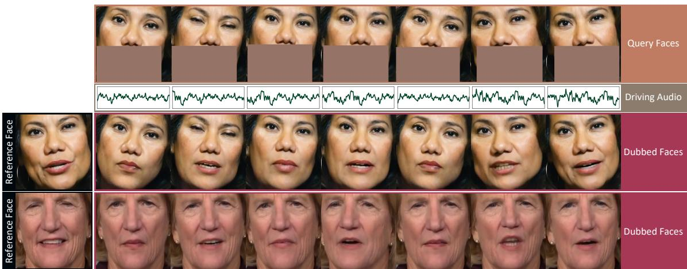  
Figure 1: SIDGAN synthesizes the mouth regions that are synchronized with the driving audio while maintaining the identity of the reference face and the pose of the query faces. Note that the dubbed faces from two different identities and poses have the similar lip shapes for the corresponding audio. Query faces for the second identity are not visualized due to space limit.

## Abstract

Dubbed video generation aims to accurately synchronize mouth movements ofa givenfacial video with driving audio while preserving identity and scene-specific visual dynamics, such as head pose and lighting. Despite the accurate lip generation of previous approaches that adopts a pretrained audio-video synchronization metric as an objective function, called Sync-Loss, extending it to high-resolution videos was challenging due to shift biases in the loss landscape that inhibit tandem optimization ofSync-Loss and visual quality, leading to a loss ofdetail.

To address this issue, we introduce shift-invariant learning, which generates photo-realistic high-resolution videos with accurate Lip-Sync. Further, we employ a pyramid network with coarse-to-fine image generation to improve stability and lip syncronization. Our model outperforms stateof-the-art methods on multiple benchmark datasets, includ-

ing AVSpeech, HDTF, and LRW, in terms of photo-realism, identity preservation, and Lip-Sync accuracy.

## 1. Introduction

Dubbed video generation aims at Lip-Syncing a face at each query frame with driving audio while retaining its visual identity and pose as shown in Figure 1. With the unprecedented expansion of multimedia industry, there has been a huge rise in video content that involves speakers delivering dialogues. For those videos, dubbed video generation can facilitate many applications, such as avatar animation, automated creating of audio-visual content, and visual dubbing of movies. Due to recent advances in camera sensors, internet speed, and display, high resolution video content (4K or more) has become a necessity in most computer vision applications, including dubbed video generation.

Generating lip motions accurately synchronized with audio has been a major challenge in dubbed video generation. Many approaches rely on SyncNet [6], an audiovisual synchronization discriminator trained to detect an offset between a video and audio. Wav2lip [28] was first to propose use of a pretrained SyncNet as a training objective (Sync-Loss) for video dubbing to penalize incorrect mouth shapes, and some recent methods [40, 27] adopt it. Though SyncNet-based approaches have achieved stateof-the-art Lip-Sync, most previous works have focused on low-resolution face generation. These low-resolution outputs cannot preserve finer textures of the face and suffer from loss of identity and artifacts. However, highresolution dubbed video generation is challenging due to high-frequency visual information. Our experiments reveal that a naive extension of a SyncNet-based approach fails to produce acceptable high-resolution results even when trained on high-resolution data, which is consistent with recent findings [40].

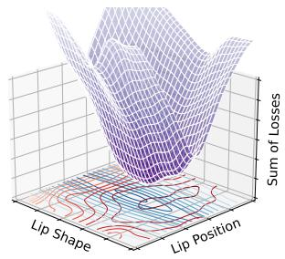  
(a) Without Shift-invariance

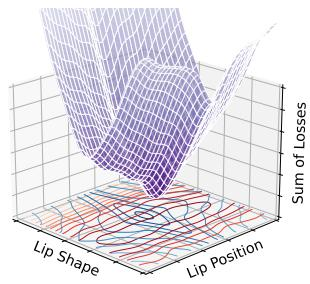  
(b) With Shift-invariance  
Figure 2: Loss landscape of reconstruction (blue contours) and sync losses (red contours) (a) without and (b) with shiftinvariant learning. We obtain this landscape by comparing original faces to their horizontally-shifted and landmarkwarped faces to simulate lip position and shape changes, respectively. While shift-invariant learning makes both losses to be more consistent across different lip positions, they remain reactive to lip shape changes. This enables a model to better converge to viable minima (purple meshes).

In this work, we identify and resolve two limitations of SyncNet-based approaches on high-resolution dubbing. First, as depicted in Figure 2 (a), we find that there is a conflict between reconstruction and Sync-Loss objectives (different minima). Since SyncNet learns to yield the same embedding for different faces with the same mouth shapes (or visemes), its embeddings are averaged representation of visemes. Thus, Sync-Loss minimum does not usually align with the ground truth lip shape, which is person-specific. High-resolution training amplifies this effect due to increase of texture frequency. Second, generalizing over diverse datasets causes some degree of pixel shifts in generated faces compared to their ground truths, which is further aggravated by Sync-Loss. In presence of this misalignment, conventional reconstruction losses suppress high frequencies textures vital for high-resolution dubbing. To jointly address these two problems, we propose to replace the traditional objectives with shift-invariant ones. By adopting adaptive polyphase sampling [4] and contextual loss [25], we enhance shift-invariance of Sync-Loss and reconstruction loss, respectively. As shown in Figure 2 (b), the shiftinvariant learning makes both types of losses more flexible on the lip position domain, facilitating a learning objective, where both losses are small (single minimum). We conceptually and empirically show that shift-invariant learning is critical in high-resolution dubbed video generation.

Another obstacle is unstable training when supervising models at high-resolution output only. To tackle this, we propose a pyramid network with supervisions at multiple resolutions, allowing us to use a coarse to fine learning strategy. We reconstruct coarse geometry at lower resolutions where SyncNet is more stable, and higher resolution modules focus on generating high-fidelity textures.

By combining the above solutions, we develop a novel dubbed video generator, called SIDGAN. Experimental results show that our SIDGAN significantly outperforms the existing methods in terms of visual quality on three datasets; AVSpeech [9], HDTF [41], and LRW [6]. Our three major contributions are as follows:

• Analysis of the necessity of shift-invariant learning to generate high-resolution dubbed video while achieving accurate Lip-Sync.

• Building a coarse-to-fine pyramid model to enable gradual improvement on fine details on faces.

• Remarkable quantitative and qualitative performance on both high-resolution and low-resolution datasets.

## 2. Related Work

Here, we broadly review related works that are identityagnostic. Identity-specific models are another major stream in this domain [19, 32, 33, 20, 31, 10], but they require identity-specific training and access to significant speaker data. Hence, we focus on identity-agnostic methods.

Dubbed Video Generation. The objective of dubbed video generation is to produce an altered mouth region that matches driving audio without changing a head pose. Prajwal et al. [18] propose LipGAN, an encoder decoder architecture supervised by audio-visual synchronization discriminator that is trained alongside. However, the method produces inaccurate lips in unconstrained videos in the wild. To improve Lip-Sync, Prajwal et al. [28] extend LipGAN with a pretrained Lip-Sync discriminator. Park et al. [27] use audio-lip memory to accurately retrieve an in-sync lip shapes. But, these methods produce low resolution dubbing, which limits usage for high resolution videos such as

4K. In recent works, to generate high resolution dubbed videos, Gupta et al. [11] introduces a vector quantized dubbed video generator and a post processing refinement network. Zhimeng et al. [40] exploit spatial feature deformation and in-painting to generate dubbed videos.

However, all these methods are struggling to synthesize the high-quality results with temporally consistent finegrained facial features like teeth, lip color, and lip shape.

Portrait Animation. Portrait animation generates Lip-Synchronized videos from a single image. Jamaludin et al. [14] propose a simple convolutional neural network (CNN) that encodes visual identity and audio and decodes a Lip-Synchronized face. MakeItTalk [43] extracts facial landmarks and disentangles audio signal into speaker identity and content. There are some recent works [36, 41] enable stylized portrait animation by encoding style codes from 3D modeling [2]. Talking-head synthesis using driving videos or landmarks is another research trend [42, 29, 34, 26].

These works are different from dubbed video generation since their design is not for a video input.

Shift-invariant Learning of CNNs. Researchers widely use $L _ { 1 }$ loss as a reconstruction loss for image-to-image translation tasks [13]. However, for high-resolution images, $L _ { 1 }$ loss is too sensitive to reconstruct fine-grained textures, $e . g .$ wrinkles and teeth. With a small displacement, $L _ { 1 }$ loss can diverge. To overcome this limitation, Ledig et al. [22] propose a perceptual loss, which measures differences between deep features extracted using a pretrained model (VGG16 or VGG19 [30] is a general choice). A contextual loss [25] calculates maximum correlation between deep features of a generated image and its ground truth.

CNNs do not generalize well to small image transformation [1], including small displacements. Zhang [39] analyzes this instability is from downsampling and upsampling, such as convolution and pooling layers with a stride higher than one, and introduces a solution using a blurpool layer. StyleGAN [16] leverages this blurpool-based upsampling and downsampling layers and achieves significant visual improvement. Zou et al. [45] raise a concern that over-blurring from the blurpool layers can induce information loss and propose a CNN that adaptively blurs features. Recently, adaptive polyphase sampling (APS) [4] makes CNNs truly shift-invariant by downsampling features based on the norm of polyphase components within tensors.

We leverage shift-invariant learning that enables highresolution training by allowing more flexible translations in loss computation.

## 3. The Proposed Approach

We propose a visual dubbing approach that is tailored for high-resolution dubbed video generation. Our approach consists of 1) multi-branch encoder to process audio, appearance, and alignment signals separately (Sec. 3.1), 2) a pyramid-based decoder for high-resolution face synthesis (Sec. 3.2), and 3) novel shift-invariant loss functions to enable high-resolution training where previous approaches struggle due to arbitrary pixel misalignment (Sec. 3.3).

## 3.1. Multi-branch Encoder Architecture

Our encoder architecture processes 1) query face frame $\textbf { Q } \in \mathbb { R } ^ { 5 1 2 \times 5 1 2 \times 3 } , \ 2 )$ driving audio as melspectrogram $\mathbf { A } \in \mathbb { R } ^ { 8 0 \times 1 6 }$ , and 3) reference face image $\mathbf { R } \in \dot { \mathbb { R } } ^ { 5 1 2 \times 5 1 2 \times 3 }$ in three separate branches. In order to remove the input viseme, we mask the lip out of the query image, and propagate the appearance information into a generated face from the reference image.

The intermediate activations of query encoder and reference encoder, $\{ { \bf f } _ { \mathrm { Q } } ^ { 1 6 \times 1 6 } , \ldots , { \bf f } _ { \mathrm { Q } } ^ { 5 1 2 \times 5 1 2 } \} = \mathcal { E } _ { \mathrm { Q } } ( \bf { Q } )$ and $\{ { \bf f } _ { \mathrm { R } } ^ { 1 6 \times 1 6 } , \ldots , { \bf f } _ { \mathrm { R } } ^ { 5 1 2 \times 5 \tilde { 1 } 2 } \} = { \mathcal E } _ { \mathrm { R } } ( \tilde { \bf R } )$ , are fed to the generator by skip-connections as shown in Figure 3. Unlike conventional methods [18, 28], which concatenate query and reference faces at the beginning of a single encoder, we independently encode a query face and a reference face to make each encoder focuses on its learning objective, i.e., the query encoder focuses on the head pose prior and the reference encoder extracts identity-related features.

Our audio encoder embeds a melspectrogram of driving audio into 512 channel feature vector $\mathbf { f } _ { \mathrm { A } } ^ { 1 \times 1 } = \mathcal { E } _ { \mathrm { A } } ( \mathbf { A } )$ . To tailor our audio encoder for viseme extraction, we train our audio encoder as a part of SyncNet [7] and use its pretrained weights for dubbed video generation.

## 3.2. High-resolution Dubbed Video Generation

For the dubbed video generator, we employ a pyramid network [38], as shown in Figure 3, whose earlier modules reconstruct outlines and coarse geometry and later modules are for detailed textures. We set 128×128 as the lowest resolution, where visemes are the most expressive. $5 1 2 \times 5 1 2$ is our finest level, where we reconstruct detailed textures.

We input the audio features for the first three generator block only since audio information is useful in synthesizing visemes (rough mouth shape and jawline structure) not in improving visual details. On the other hand, the last three generator blocks followed by the RGB blocks predict faces at each target resolution. At each resolution, we calculate gradients based on loss functions and update network parameters altogether. Laplacian pyramid [8] is another possible design choice but we find that it fails when coarse outputs have artifacts. This is because Laplacian operation, which is an additive image generation technique, cannot correct significant artifacts in the previous level. Overall architecture can be formulated as:

$$
\begin{array} { r } { \mathbf { I } = \mathrm { S I D G A N } \left( \mathcal { E } _ { \mathrm { Q } } ( \mathbf { Q } ) , \mathcal { E } _ { \mathrm { R } } ( \mathbf { R } ) , \mathcal { E } _ { \mathrm { A } } ( \mathbf { A } ) \right) , } \end{array}\tag{1}
$$

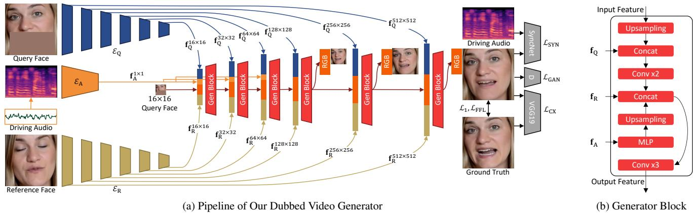  
Figure 3: A full pipeline of SIDGAN. We feed a query face resized to $1 6 \times 1 6$ into SIDGAN as an initial feature. Each generator block upsamples the previous feature and blends it with features extracted by the query and reference encoders. The first three generator blocks accept audio features as well. The RGB blocks output dubbed faces at each resolution. We depict the losses at the highest resolution (512 × 512) only, but we minimize losses at the lower resolutions too.

where I indicates a generated dubbed face.

## 3.3. Shift-invariant Learning

We first establish the necessity of incorporating shiftinvariance in the losses for dubbed video generation, and then we describe our objective function in detail.

Dubbed video generation typically involves a combination of reconstruction and Sync-Loss as a learning objective, as demonstrated in various studies [40, 28, 11, 27]. The reconstruction loss provides supervision on identity preservation, skin color and textures, while the Sync-Loss encourages the model to generate a viseme that synchronizes with driving audio. This combination has been successful in generating low-resolution dubbed videos. However, contradictions between the naive reconstruction loss, such as L1 loss, and the Sync-Loss, such as the one from vanilla SyncNet [6], exist because the Sync-Loss is not usually minimized when the generated viseme is identical to the ground truth, as shown in Figure 2 (a). In this work, we incorporate shift-invariant characteristics into our learning objective to guide our model to find a better minima in the learning space, as depicted in Figure 2 (b).

## 3.3.1 APS-SyncNet: Shift-invariant Sync-Loss

Sync-Loss [28] is based on a synchronization score between a video and audio measured by SyncNet [6]. Sync-Loss forces a dubbed video generator to synthesize a mouth region that is synchronized with driving audio. The vanilla SyncNet used in many dubbed video generators [40, 28, 11, 27] includes convolutional layers with stride two for downsampling, which make a model vulnerable against translations [39]. The output of vanilla SyncNet can change significantly with small shifts. Hence, a Sync-Loss from the vanilla SyncNet has the same misalignment issue on high frequency textures as the pixel-wise reconstruction losses. To tackle this problem, we propose a shift-invariant Sync-Net, called APS-SyncNet. From the vanilla SyncNet, we replace downsampling layers to combinations of convolution with stride one and adaptive polyphase sampling (APS) layers [4]. APS splits a tensor into four sets of polyphase components and then chooses the one with the highest L2 norm to achieve shift-invariance. Since SyncNet includes asymmetric downsampling that reduces a vertical dimension while keeping a horizontal one, we newly implement asymmetric APS layers by computing polyphase components along the vertical dimension1. We define our shiftinvariant Sync-Loss as

$$
\mathcal { L } _ { \mathrm { S Y N } } = - \log \bigg ( \frac { 1 + \mathrm { C S } ( \phi _ { \mathrm { A P S } } ^ { \mathrm { V } } ( I ) , \phi _ { \mathrm { A P S } } ^ { \mathrm { A } } ( \mathbf { A } ) ) } { 2 } \bigg ) ,\tag{2}
$$

where I and A are generated faces (five frames) and their corresponding audio, respectively. $\phi _ { \mathrm { A P S } } ^ { \mathrm { V } } ( \cdot )$ and $\phi _ { \mathrm { A P S } } ^ { \mathrm { A } } ( \cdot )$ are features extracted by APS-SyncNet’s visual encoder and audio encoder, respectively. CS(·, ·) indicates a cosine similarity between two features. Figure 4 (a) visualizes Sync-Loss with vanilla SyncNet and APS-SyncNet when varying the horizontal offsets. In other words, we shift a ground truth image by k pixels on the horizontal axis and use it as a pseudo prediction. Then, we calculate losses using a pseudo prediction and its ground truth. We observe APS-SyncNet yields Sync-Loss with better shift-invariance.

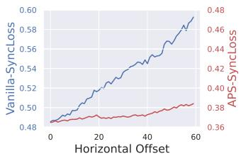  
(a) Sync-Loss

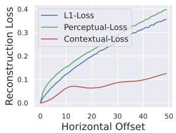  
(b) Reconstruction Loss  
Figure 4: Shift-invariant characteristics of the proposed losses. (a) visualizes differences between Vanilla-Sync-Loss and APS-Sync-Loss. (b) compares different types of reconstruction losses; L1, Perceptual, and Contextual.

## 3.3.2 Shift-invariant Reconstruction Loss

Pixel-wise losses lack shift-invariance and fail to generate high frequency textures in supervised image reconstruction tasks. Adding GAN loss is a general solution [21] but it can encourage hallucinating sharp features which do not strictly preserve target identity. Hence, to better utilize the ground truth and preserve identity, feature losses have been proposed. Perceptual loss [22] based on pretrained VGG [30] network is a popular option and produces sharp textures. But perceptual loss lacks degree of shift-invariance necessary for our task. To tackle this we exploit the contextual loss [25] as a feature loss with enhanced shift-invariance. This feature based loss is not sensitive to misalignment as it ignores spatial locations for loss computation. We define our contextual loss as

$$
\mathcal { L } _ { \mathrm { C X } } = - \log \big ( \mathrm { C X } ( \phi _ { \mathrm { V G G 1 9 } } ^ { \mathrm { R e L U 5 _ { - } 3 } } ( \mathbf { I } ) , \phi _ { \mathrm { V G G 1 9 } } ^ { \mathrm { R e L U 5 _ { - } 3 } } ( \mathbf { I } ^ { G T } ) ) \big ) ,\tag{3}
$$

where I and $\mathbf { I } ^ { G T }$ are a generated face and its ground truth, respectively. $\phi _ { \mathrm { V G G 1 9 } } ^ { \mathrm { R e L U 5 . 3 } } ( \cdot )$ indicates features extracted by VGG19 up to ReLU5 3 [30]. $\operatorname { C X } ( \cdot , \cdot )$ denotes a contextual similarity between input features. Figure 4 (b) compares three different reconstruction losses when varying pixel offsets as done in Figure 4 (a). L1 loss increases as the offset increases. Between the perceptual and contextual losses, the contextual loss provides better shift-invariance since the contextual similarity assesses the position agnostic similarity between prediction and ground truth features.

## 3.3.3 Final Loss Function

For reconstruction, we exploit L1 $( \mathcal { L } _ { 1 } )$ , contextual $( \mathcal { L } _ { \mathrm { C X } } )$ and focal frequency $( \mathcal { L } _ { \mathrm { F F L } } )$ losses. We empirically find that L1 loss is necessary to obtain reliable predictions. Focal frequency loss [15] is to maintain face’s identity better. For adversarial training, we adopt GAN loss $( \mathcal { L } _ { \mathrm { G A N } } )$ as done in LSGAN [24]. The final loss function becomes

$$
\mathcal { L } = \alpha \mathcal { L } _ { 1 } + \beta \mathcal { L } _ { \mathrm { C X } } + \gamma \mathcal { L } _ { \mathrm { F F L } } + \mu \mathcal { L } _ { \mathrm { G A N } } + \lambda \mathcal { L } _ { \mathrm { S Y N } } ,\tag{4}
$$

where $\alpha , \beta , \gamma , \mu$ and λ indicate weights for each loss. We set them differently for each generator’s level.

## 3.4. Implementation Details

Here, we describe implementation details of our work. Please find our supplementary document for more details, such as detailed network architecture.

Model Input. We convert raw driving audio into melspectrogram $\mathbf { a } \in \mathbb { R } ^ { 8 0 \times 1 6 }$ , whose number of channels is 80 and length is 16. For a 25 fps video, the audio length of 16 equals to 0.2 second long. For a query face, we set a blocking region as between cheeks (horizontally) and below nose (vertically) using a facial landmark estimator [3] similar to an existing method [40].

Generator. For our generator training, we leverage progressive training of increasing resolutions, which yields fine-grained texture as studied in other works [8, 23]. Additionally, progressive training avoids degenerate solution of copying reference face to output, a common training problem in dubbing architectures with skip connections [37]. To advance realism of generated faces, we train our generator in an adversarial way by adopting patch discriminators [13]. We adopt an Adam optimizer[17] with learning rate of 0.0002 and train for 3.9M iterations with a batch size of 4.

APS-SyncNet. We pretrain our APS-SyncNet using the VoxCeleb2 dataset [5] and finetune it on the AVSpeech dataset [9]. We use an Adam optimizer with the same hyperparameters as our generator. Batch size is 256. We train APS-SyncNet for 370K iterations.

## 4. Experimental Results

To quantitatively evaluate the quality of the dubbing, we follow the inference setting defined in [27]. In this setting, we simulate generating dubbed content by using the original audio to drive lip sync, the first frame of the original video as the reference frame, and upper halves of the original video as query face frames. Hence, the original frame becomes the ground truth as its lower half is not seen during generation and this allows computation of full reference metrics, such as SSIM, PSNR, and landmark distance (LMD). Note that in actual dubbing application, dubbed audio will be used but this setting lacks availability of ground truths making it unsuitable for quantitative evaluation.

Datasets. Even though most of dubbed video generators [27, 28, 42, 18] leverage the LRS2, LRW [6], and VoxCeleb2 [5] datasets for training, they consist of lowresolution videos. Since our objective is to train a highresolution model, we constructed a training dataset using a subset of the AVSpeech dataset [9], which has highresolution videos. We extract faces from these videos using the OpenCV face detector and filter out extreme head poses.

<table><tr><td></td><td colspan="6">AVSpeech Identity</td><td colspan="6">HDTF</td></tr><tr><td></td><td colspan="3">Visual Quality</td><td colspan="3">Lip Sync Quality</td><td colspan="3">Visual Quality</td><td colspan="3">Lip Sync Quality</td></tr><tr><td>Method</td><td>FID↓</td><td>SSIM↑</td><td>PSNR↑</td><td>ID↓</td><td>LMD↓ LSE-D↓</td><td>LSE-C↑</td><td>FID↓</td><td>SSIM↑ PSNR↑</td><td>ID↓</td><td>Identity</td><td>LMD↓ LSE-D↓</td><td>LSE-C↑</td></tr><tr><td>PC-AVS [42]</td><td>93.16</td><td>0.73</td><td>19.22</td><td>0.39</td><td>4.35</td><td>7.22 7.06</td><td>63.62</td><td>0.72</td><td>19.49</td><td>0.40</td><td>4.11 3.32</td><td>6.40 9.29</td></tr><tr><td>LipGAN [18]</td><td>77.84</td><td>0.89</td><td>24.70</td><td>0.28</td><td>3.57 7.43</td><td>6.63</td><td>68.56</td><td>0.89</td><td>24.67</td><td>0.26</td><td>6.82</td><td>8.46</td></tr><tr><td>Wav2Lip [28]</td><td>73.50</td><td>0.89</td><td>24.32</td><td>0.29</td><td>3.74 6.64 4.37</td><td>8.03</td><td>55.82</td><td>0.89</td><td>24.38</td><td>0.27 3.43</td><td>6.00</td><td>9.87</td></tr><tr><td>Wav2Lip-384 [28]</td><td>61.25</td><td>0.84</td><td>21.82</td><td>0.32</td><td>7.15</td><td>6.61</td><td>47.33</td><td>0.81</td><td>20.69 0.32</td><td>4.50</td><td>9.94</td><td>4.82</td></tr><tr><td>Ground Truth</td><td></td><td></td><td></td><td></td><td>0.00 8.17</td><td>5.64</td><td></td><td></td><td></td><td>0.00</td><td>6.76</td><td>8.66</td></tr><tr><td>Ours</td><td>22.69</td><td>0.95</td><td>28.67</td><td>0.17</td><td>2.96 7.38</td><td>6.31</td><td>12.15</td><td>0.95</td><td>28.12</td><td>0.17 2.99</td><td>6.80</td><td>8.05</td></tr></table>

Table 1: Quantitative results on the AVSpeech [9] and HDTF [41] test sets. ↓ and ↑ denote lower and higher values are better, respectively. The best indices are boldfaced.

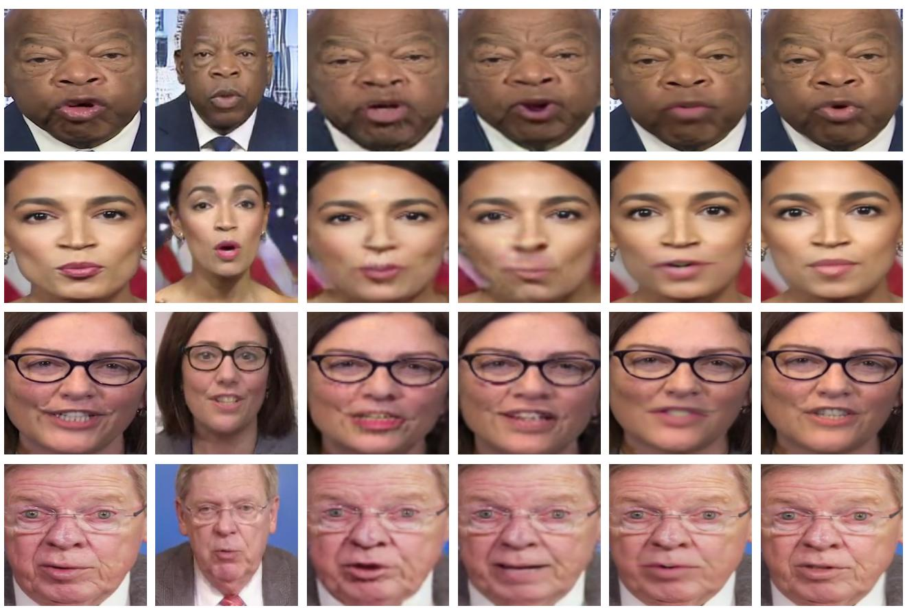  
(a) Ground Truth  
(b) PC-AVS  
(c) LipGAN  
(d) Wav2Lip  
(e) Wav2Lip-384  
(f) Ours - SIDGAN  
Figure 5: Qualitative comparison of dubbed videos generated by different methods. Note that PC-AVS’s results have more visual contexts than the other methods since they require more facial contexts as the input.

Our AVSpeech training set consists of 248,531 videos that are three seconds long in average. We use 3,945 videos that do not have identity overlap with the training set as a AVSpeech test set. For evaluation, we additionally benchmark dubbed video generators on HDTF [41] and LRW [6] test sets. The HDTF test set consists of 171 high-resolution videos whose duration is relatively longer than AVSpeech (from 30 seconds to seven minutes). In the LRW data set, each clip is annotated with a word. We report results on 1,000 videos selected from the test set that had the highest overlap between the annotated word timestamp provided with the dataset and the word timestamp predicted using a forced alignment system. Further details are in the supplementary section. The clips from the LRW dataset are in low-resolution as compared to HDTF and AVSpeech.

Metrics. For image quality evaluation, we use standard image quality metrics [35, 44], including FID [12], SSIM, and PSNR. We also assess identity loss, called ID, which measures how well a model is able to retain source identity. ID is calculated as mean Euclidean distance between a prediction and a ground truth in an embedding space of a face recognition model. We extract face embeddings using a pretrained face recognition model2. We use two types of metrics for lip-sync quality. LMD [27, 42] measures lip landmark distances between a prediction and its ground truth. LSE-C and LSE-D [28] estimate audio-visual coherence using SyncNet [7]. We calculate these metrics using the face crops only, ensuring the background does not play any role in the calculations. We use same settings to compare all methods for fairness.

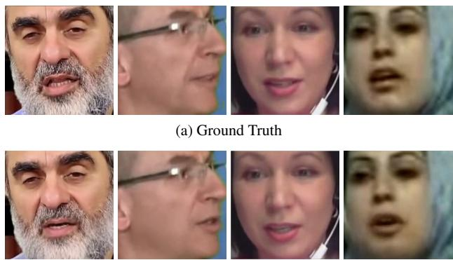  
(b) Ours - SIDGAN

Figure 6: More results of SIDGAN on extreme conditions, such as beard, side-face, occlusion, and low-resolution.
<table><tr><td rowspan="2">Method</td><td colspan="2">Visual Quality</td><td rowspan="2">Identity ID↓</td><td rowspan="2"></td><td colspan="2">Lip Sync Quality</td></tr><tr><td>FID↓ SSIM↑ PSNR↑</td><td></td><td>LMD↓ LSE-D↓ LSE-C↑</td><td></td></tr><tr><td>PC-AVS</td><td>63.75</td><td>0.71</td><td>21.82</td><td>0.41</td><td>3.24</td><td>6.80</td><td>7.38</td></tr><tr><td>LipGAN</td><td>65.66</td><td>0.91</td><td>25.84</td><td>0.25</td><td>3.12</td><td>7.01</td><td>6.60</td></tr><tr><td>Wav2Lip</td><td>57.26</td><td>0.91</td><td>25.86</td><td>0.25</td><td>3.24</td><td>6.22</td><td>8.31</td></tr><tr><td>Wav2Lip-384</td><td>50.84</td><td>0.87</td><td>23.72</td><td>0.30</td><td>4.16</td><td>6.65</td><td>7.08</td></tr><tr><td>Ground Truth</td><td></td><td></td><td></td><td></td><td></td><td>7.17</td><td>6.34</td></tr><tr><td>Ours</td><td>19.84</td><td>0.96</td><td>30.04</td><td>0.16</td><td>2.86</td><td>6.79</td><td>6.76</td></tr></table>

Table 2: Quantitative results on the low-resolution LRW test set [6]. ↓ and ↑ denote lower and higher values are better, respectively. The best indices are boldfaced.

Compared Methods. We compare our method with three conventional methods, whose source codes are publicly available; PC-AVS [42], LipGAN [18], and Wav2Lip [28]. We additionally train a high-resolution Wav2Lip for fairness, called Wav2Lip-384. Note that the original Wav2Lip’s resolution is 96×96 but Wav2Lip-384’s resolution is 384× 384. We apply the same inference setting to all models using the first frame as an identity reference and an original video as a query. Lip regions in a query video are masked for LipGAN, Wav2lip, Wav2Lip-384, and SIDGAN. Even though PC-AVS is a portrait animation algorithm, we can test it under the same inference setting by feeding query frames as a pose-condition.

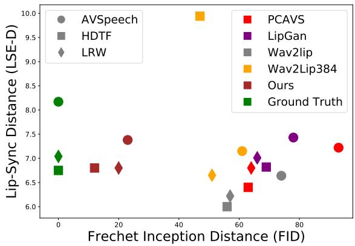  
Figure 7: Visualization of three benchmarking results of the five different dubbed video generators with ground truths.

<table><tr><td>Method</td><td>Sync ↑</td><td>Visual ↑</td><td>Overall ↑</td></tr><tr><td>PC-AVS</td><td>3.07</td><td>2.57</td><td>2.57</td></tr><tr><td>Wav2Lip</td><td>3.02</td><td>1.84</td><td>2.10</td></tr><tr><td>Wav2Lip-384</td><td>3.03</td><td>1.90</td><td>2.19</td></tr><tr><td>Ours</td><td>3.52</td><td>3.62</td><td>3.41</td></tr></table>

Table 3: User study for dubbed video generators. Higher scores are better. We highlight the best scores.

## 4.1. Benchmark Results

Table 1 (left) benchmarks the dubbed video generators on the AVSpeech test set [9]. In terms of visual quality, SIDGAN outperforms all existing methods. SIDGAN retains the identity better than the conventional methods by achieving the best ID index. With respect to the landmarkbased lip-sync assessment, our method performs significantly better. For LSE-D and LSE-C, Wav2Lip and PC-AVS yield better scores. However, please note that even ground truth’s LSE scores are worse than Wav2Lip and PC-AVS. Furthermore, our training dataset is significantly different from the dataset Metric SyncNet [6] was trained on introducing a domain gap. In order to fairly evaluate the Lip-Sync quality without any model bias in the evaluation, we conducted a user study to understand the preference of real customers on Lip-Sync and other factors and the details are discussed in Section 4.2.

Table 1 (right) benchmarks the dubbed video generators on the HDTF test set [41], and we observe the same performance trend as seen on the AVSpeech test set. Figure 5 compares dubbed video generation results with ground truths on HDTF. LipGAN, Wav2Lip, and Wav2Lip-384 are too blurry and do not reconstruct the facial textures. In terms of lip sync, the lip shapes generated by PC-AVS, Lip-GAN, and Wav2Lip-384 do not align with the ground truths well. Even though Wav2Lip provides correct Lip-Sync results, they are too expressive as depicted in the first two rows. On the other hand, our SIDGAN consistently synthesize faithful faces. Figure 6 presents more qualitative results of SIDGAN on extreme conditions. Our model outputs decent faces even when frames have beard, side-face, and occlusion. For a low-resolution frame, our method yields a blurry face rather than a sharpened one allowing seamless blending into source video.

  
(a) Ground Truth

  
(b) w/o Contextual

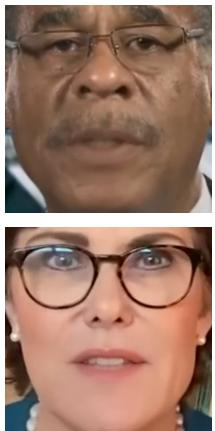  
(c) w Perceptual

  
(d) w/o APS

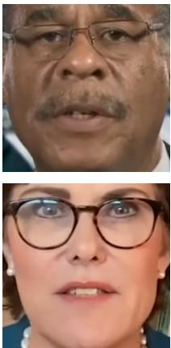  
(e) w/o Pyramid

  
(f) Full Setting  
Figure 8: Qualitative results from our ablation study.

Table 2 lists indices of the dubbed video generators on the LRW test set [6]. Even though LRW is a low-resolution dataset, our SIDGAN outperforms the conventional methods in terms of all metrics except for LSE. This indicates that our method faithfully performs visual dubbing even for low-resolution faces. Figure 7 plots consolidated benchmarking results on an FID and LSE-D coordinate system. It is observable that our method is closest to the ground truths.

## 4.2. User Study

We conducted a user study to better understand real users’ preference on video contents visually dubbed by four different algorithms; PC-AVS [42], Wav2Lip [28], Wav2Lip-384 [28], and SIDGAN. In this user study, we randomly selected 30 seconds long 22 talking head clips from the HDTF test set. For every clip, we generated visually dubbed videos with the same setting as our benchmarking experiments. 10 viewers evaluated four outputs of every clip in three quality dimensions; 1) Lip-Sync quality, 2) image quality, and 3) overall experience. Rating ranges from 1 (worst) to 5 (best). As shown in Table 3, SIDGAN got the best ratings across every dimension.

## 4.3. Ablation Study

We conduct ablation study to analyze contributions of each component we designed. Table 4 shows efficacy of each modification. We first ablate the contextual loss, and SIDGAN’s performance gets degraded in terms of visual and Lip-Sync quality. Replacing the contextual loss to the perceptual loss makes SIDGAN worse. Next, APS Sync-Loss is necessary to maximize the performance. Finally, we train our model without the pyramid architecture, and there is degradation as well. In addition, we find that our model without the pyramid architecture often fails to converge. Figure 8 visually compares the results from the ablated settings. We observe that the ablated settings result in wrong teeth structures, wrong lip shapes, or identity changes. Especially, the results with the perceptual loss are blurry.

<table><tr><td>Setting</td><td>FID↓</td><td>LSE-D↓</td><td>LSE-C↑</td></tr><tr><td>w/o Contextual Loss</td><td>14.97</td><td>6.90</td><td>7.83</td></tr><tr><td>w Perceptual Loss</td><td>15.29</td><td>7.49</td><td>7.21</td></tr><tr><td>w Vanilla Sync Loss</td><td>12.61</td><td>7.06</td><td>7.76</td></tr><tr><td>w/o Pyramid Generator</td><td>13.01</td><td>6.93</td><td>7.91</td></tr><tr><td>Full Setting</td><td>12.15</td><td>6.80</td><td>8.05</td></tr></table>

Table 4: Comparison of different ablation settings tested on HDTF [41]. The boldfaced scores indicate the best results.

## 5. Limitations and Conclusion

Despite SIDGAN’s general success, we have observed degraded performance on challenging cases such as full profile views, very fast speech, and background audio noises as the training data does not represent them well. Furthermore, SIDGAN sometimes suffers from temporal jitter as its competitors do.

In this work, we analyze the importance of shift-invariant learning in high-resolution dubbed video generation. We demonstrate that making the reconstruction loss and the Sync-Loss shift-invariant enable the generator to achieve state-of-the-art visual quality and Lip-Sync performance. Further, we propose a coarse to fine generator which progressively learns how to reconstruct faces with fine-grained textures as well as accurate visemes.

## References

[1] Aharon Azulay and Yair Weiss. Why do deep convolutional networks generalize so poorly to small image transformations? arXiv preprint arXiv:1805.12177, 2018. 3

[2] James Booth, Anastasios Roussos, Allan Ponniah, David Dunaway, and Stefanos Zafeiriou. Large scale 3d morphable models. International Journal of Computer Vision, 126(2):233–254, 2018. 3

[3] Adrian Bulat and Georgios Tzimiropoulos. How far are we from solving the 2d & 3d face alignment problem?(and a dataset of 230,000 3d facial landmarks). In Proceedings of the IEEE international conference on computer vision, pages 1021–1030, 2017. 5

[4] Anadi Chaman and Ivan Dokmanic. Truly shift-invariant convolutional neural networks. In Proceedings of the IEEE/CVF Conference on Computer Vision and Pattern Recognition, pages 3773–3783, 2021. 2, 3, 4

[5] J Chung, A Nagrani, and A Zisserman. Voxceleb2: Deep speaker recognition. Interspeech 2018, 2018. 5

[6] Joon Son Chung and Andrew Zisserman. Lip reading in the wild. In Computer Vision–ACCV 2016: 13th Asian Conference on Computer Vision, Taipei, Taiwan, November 20- 24, 2016, Revised Selected Papers, Part II 13, pages 87–103. Springer, 2017. 2, 4, 5, 6, 7, 8

[7] Joon Son Chung and Andrew Zisserman. Out of time: automated lip sync in the wild. In Computer Vision–ACCV 2016 Workshops: ACCV 2016 International Workshops, Taipei, Taiwan, November 20-24, 2016, Revised Selected Papers, Part II 13, pages 251–263. Springer, 2017. 3, 7

[8] Emily L Denton, Soumith Chintala, Rob Fergus, et al. Deep generative image models using a laplacian pyramid of adversarial networks. Advances in neural information processing systems, 28, 2015. 3, 5

[9] Ariel Ephrat, Inbar Mosseri, Oran Lang, Tali Dekel, Kevin Wilson, Avinatan Hassidim, William T Freeman, and Michael Rubinstein. Looking to listen at the cocktail party: a speaker-independent audio-visual model for speech separation. ACM Transactions on Graphics (TOG), 37(4):1–11, 2018. 2, 5, 6, 7

[10] Ohad Fried, Ayush Tewari, Michael Zollhofer, Adam Finkel-¨ stein, Eli Shechtman, Dan B Goldman, Kyle Genova, Zeyu Jin, Christian Theobalt, and Maneesh Agrawala. Text-based editing of talking-head video. ACM Transactions on Graphics (TOG), 38(4):1–14, 2019. 2

[11] Anchit Gupta, Rudrabha Mukhopadhyay, Sindhu Balachandra, Faizan Farooq Khan, Vinay P Namboodiri, and CV Jawahar. Towards generating ultra-high resolution talkingface videos with lip synchronization. In Proceedings of the IEEE/CVF Winter Conference on Applications of Computer Vision, pages 5209–5218, 2023. 3, 4

[12] Martin Heusel, Hubert Ramsauer, Thomas Unterthiner, Bernhard Nessler, and Sepp Hochreiter. Gans trained by a two time-scale update rule converge to a local nash equilibrium. Advances in neural information processing systems, 30, 2017. 6

[13] Phillip Isola, Jun-Yan Zhu, Tinghui Zhou, and Alexei A Efros. Image-to-image translation with conditional adver-

sarial networks. In Proceedings of the IEEE conference on computer vision and pattern recognition, pages 1125–1134, 2017. 3, 5

[14] Amir Jamaludin, Joon Son Chung, and Andrew Zisserman. You said that?: Synthesising talking faces from audio. International Journal ofComputer Vision, 127:1767–1779, 2019. 3

[15] Liming Jiang, Bo Dai, Wayne Wu, and Chen Change Loy. Focal frequency loss for image reconstruction and synthesis. In Proceedings of the IEEE/CVF International Conference on Computer Vision, pages 13919–13929, 2021. 5

[16] Tero Karras, Samuli Laine, and Timo Aila. A style-based generator architecture for generative adversarial networks. In Proceedings of the IEEE/CVF conference on computer vision and pattern recognition, pages 4401–4410, 2019. 3

[17] Diederik P Kingma and Jimmy Ba. Adam: A method for stochastic optimization. arXiv preprint arXiv:1412.6980, 2014. 5

[18] Prajwal KR, Rudrabha Mukhopadhyay, Jerin Philip, Abhishek Jha, Vinay Namboodiri, and CV Jawahar. Towards automatic face-to-face translation. In Proceedings ofthe 27th ACM international conference on multimedia, pages 1428– 1436, 2019. 2, 3, 5, 6, 7

[19] Rithesh Kumar, Jose Sotelo, Kundan Kumar, Alexandre de Brebisson, and Yoshua Bengio. Obamanet: Photo-realistic´ lip-sync from text. arXiv preprint arXiv:1801.01442, 2017. 2

[20] Avisek Lahiri, Vivek Kwatra, Christian Frueh, John Lewis, and Chris Bregler. Lipsync3d: Data-efficient learning of personalized 3d talking faces from video using pose and lighting normalization. In Proceedings of the IEEE/CVF conference on computer vision and pattern recognition, pages 2755–2764, 2021. 2

[21] Anders Boesen Lindbo Larsen, Søren Kaae Sønderby, Hugo Larochelle, and Ole Winther. Autoencoding beyond pixels using a learned similarity metric. In International conference on machine learning, pages 1558–1566. PMLR, 2016. 5

[22] Christian Ledig, Lucas Theis, Ferenc Huszar, Jose Caballero,´ Andrew Cunningham, Alejandro Acosta, Andrew Aitken, Alykhan Tejani, Johannes Totz, Zehan Wang, et al. Photorealistic single image super-resolution using a generative adversarial network. In Proceedings of the IEEE conference on computer vision and pattern recognition, pages 4681–4690, 2017. 3, 5

[23] Haiyin Luo and Yuhui Zheng. Semantic residual pyramid network for image inpainting. Information, 13(2):71, 2022. 5

[24] Xudong Mao, Qing Li, Haoran Xie, Raymond YK Lau, Zhen Wang, and Stephen Paul Smolley. Least squares generative adversarial networks. In Proceedings of the IEEE international conference on computer vision, pages 2794–2802, 2017. 5

[25] Roey Mechrez, Itamar Talmi, and Lihi Zelnik-Manor. The contextual loss for image transformation with non-aligned data. In Proceedings of the European conference on computer vision (ECCV), pages 768–783, 2018. 2, 3, 5

[26] Moustafa Meshry, Saksham Suri, Larry S Davis, and Abhinav Shrivastava. Learned spatial representations for few-shot

talking-head synthesis. In Proceedings ofthe IEEE/CVF International Conference on Computer Vision, pages 13829– 13838, 2021. 3

[27] Se Jin Park, Minsu Kim, Joanna Hong, Jeongsoo Choi, and Yong Man Ro. Synctalkface: Talking face generation with precise lip-syncing via audio-lip memory. In Proceedings of the AAAI Conference on Artificial Intelligence, pages 2062– 2070, 2022. 2, 4, 5, 7

[28] KR Prajwal, Rudrabha Mukhopadhyay, Vinay P Namboodiri, and CV Jawahar. A lip sync expert is all you need for speech to lip generation in the wild. In Proceedings of the 28th ACM International Conference on Multimedia, pages 484–492, 2020. 2, 3, 4, 5, 6, 7, 8

[29] Aliaksandr Siarohin, Stephane Lathuili ´ ere, Sergey Tulyakov,\` Elisa Ricci, and Nicu Sebe. First order motion model for image animation. Advances in neural information processing systems, 32, 2019. 3

[30] Karen Simonyan and Andrew Zisserman. Very deep convolutional networks for large-scale image recognition. In ICLR, 2015. 3, 5

[31] Linsen Song, Wayne Wu, Chen Qian, Ran He, and Chen Change Loy. Everybody’s talkin’: Let me talk as you want. IEEE Transactions on Information Forensics and Security, 17:585–598, 2022. 2

[32] Supasorn Suwajanakorn, Steven M Seitz, and Ira Kemelmacher-Shlizerman. Synthesizing obama: learning lip sync from audio. ACM Transactions on Graphics (ToG), 36(4):1–13, 2017. 2

[33] Justus Thies, Mohamed Elgharib, Ayush Tewari, Christian Theobalt, and Matthias Nießner. Neural voice puppetry: Audio-driven facial reenactment. In Computer Vision–ECCV 2020: 16th European Conference, Glasgow, UK, August 23–28, 2020, Proceedings, Part XVI 16, pages 716–731. Springer, 2020. 2

[34] Ting-Chun Wang, Arun Mallya, and Ming-Yu Liu. One-shot free-view neural talking-head synthesis for video conferencing. In Proceedings of the IEEE/CVF conference on computer vision and pattern recognition, pages 10039–10049, 2021. 3

[35] Xintao Wang, Yu Li, Honglun Zhang, and Ying Shan. Towards real-world blind face restoration with generative facial prior. In Proceedings of the IEEE/CVF Conference on Computer Vision and Pattern Recognition, pages 9168– 9178, 2021. 6

[36] Haozhe Wu, Jia Jia, Haoyu Wang, Yishun Dou, Chao Duan, and Qingshan Deng. Imitating arbitrary talking style for realistic audio-driven talking face synthesis. In Proceedings of the 29th ACM International Conference on Multimedia, pages 1478–1486, 2021. 3

[37] Yi Yang, Brendan Shillingford, Yannis Assael, Miaosen Wang, Wendi Liu, Yutian Chen, Yu Zhang, Eren Sezener, Luis C Cobo, Misha Denil, et al. Large-scale multilingual audio visual dubbing. arXiv preprint arXiv:2011.03530, 2020. 5

[38] Yanhong Zeng, Jianlong Fu, Hongyang Chao, and Baining Guo. Learning pyramid-context encoder network for highquality image inpainting. In Proceedings of the IEEE/CVF

Conference on Computer Vision and Pattern Recognition, pages 1486–1494, 2019. 3

[39] Richard Zhang. Making convolutional networks shiftinvariant again. In International conference on machine learning, pages 7324–7334. PMLR, 2019. 3, 4

[40] Zhimeng Zhang, Zhipeng Hu, Wenjin Deng, Changjie Fan, Tangjie Lv, and Yu Ding. Dinet: Deformation inpainting network for realistic face visually dubbing on high resolution video. In Proceedings of the AAAI Conference on Artificial Intelligence, 2023. 2, 3, 4, 5

[41] Zhimeng Zhang, Lincheng Li, Yu Ding, and Changjie Fan. Flow-guided one-shot talking face generation with a high-resolution audio-visual dataset. In Proceedings of the IEEE/CVF Conference on Computer Vision and Pattern Recognition, pages 3661–3670, 2021. 2, 3, 6, 7, 8

[42] Hang Zhou, Yasheng Sun, Wayne Wu, Chen Change Loy, Xiaogang Wang, and Ziwei Liu. Pose-controllable talking face generation by implicitly modularized audio-visual representation. In Proceedings of the IEEE/CVF conference on computer vision and pattern recognition, pages 4176–4186, 2021. 3, 5, 6, 7, 8

[43] Yang Zhou, Xintong Han, Eli Shechtman, Jose Echevarria, Evangelos Kalogerakis, and Dingzeyu Li. Makelttalk: speaker-aware talking-head animation. ACM Transactions On Graphics (TOG), 39(6):1–15, 2020. 3

[44] Peihao Zhu, Rameen Abdal, Yipeng Qin, and Peter Wonka. Sean: Image synthesis with semantic region-adaptive normalization. In Proceedings of the IEEE/CVF Conference on Computer Vision and Pattern Recognition, pages 5104– 5113, 2020. 6

[45] Xueyan Zou, Fanyi Xiao, Zhiding Yu, Yuheng Li, and Yong Jae Lee. Delving deeper into anti-aliasing in convnets. International Journal ofComputer Vision, pages 1–15, 2022. 3