# STPrivacy: Spatio-Temporal Privacy-Preserving Action Recognition

Ming Li1 Xiangyu Xu2 Hehe Fan3 Pan Zhou4 Jun Liu5 Jia-Wei Liu1 Jiahe Li1 Jussi Keppo1 Mike Zheng Shou1\* Shuicheng Yan4 1 National University of Singapore 2 Xi’an Jiaotong University 3 Zhejiang University 4 Sea AI Lab 5 Singapore University of Technology and Design ming.li@u.nus.edu

## Abstract

Existing methods of privacy-preserving action recognition (PPAR) mainly focus on frame-level (spatial) privacy removal through 2D CNNs. Unfortunately, they have two major drawbacks. First, they may compromise temporal dynamics in input videos, which are critical for accurate action recognition. Second, they are vulnerable to practical attacking scenarios where attackers probe for privacy from an entire video rather than individual frames. To address these issues, we propose a novel framework STPrivacy to perform video-level PPAR. For the first time, we introduce vision Transformers into PPAR by treating a video as a tubelet sequence, and accordingly design two complementary mechanisms, i.e., sparsification and anonymization, to remove privacy from a spatio-temporal perspective. In specific, our privacy sparsification mechanism applies adaptive token selection to abandon action-irrelevant tubelets. Then, our anonymization mechanism implicitly manipulates the remaining action-tubelets to erase privacy in the embedding space through adversarial learning. These mechanisms provide significant advantages in terms of privacy preservation for human eyes and action-privacy trade-off adjustment during deployment. We additionally contribute the first two large-scale PPAR benchmarks, VP-HMDB51 and VP-UCF101, to the community. Extensive evaluations on them, as well as two other tasks, validate the effectiveness and generalization capability ofourframework.

## 1. Introduction

Action recognition has seen tremendous progress in recent years, but the increasing concerns regarding privacy leakage have given rise to an emerging research topic privacy-preserving action recognition (PPAR) [38, 37, 6]. It aims to remove private information from videos while ensuring accurate action recognition.

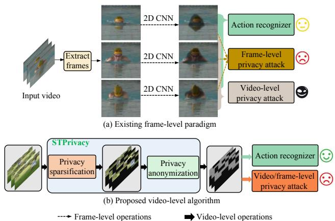  
Figure 1: Comparison between the existing paradigm for PPAR and the proposed algorithm. (a) Existing methods for PPAR remove private information from individual frames independently against a frame-level privacy recognizer. They not only neglect the temporal dynamics between frames, hurting action recognition performance, but also leave the entire video vulnerable to privacy attacks. (b) Our proposed algorithm addresses these issues by treating the input video as a whole to remove privacy against a video-level privacy recognizer. It promotes action dynamics and protects both video-level and frame-level privacy. The black rectangles in our transformed video represent the abandoned tubelets, and the emotional faces indicate the performance of the corresponding task.

Current studies on PPAR [30, 19, 41, 25, 38, 37, 6] mainly focus on frame-level privacy preservation. As illustrated in Figure 1 (a), the paradigm typically involves three steps: 1) extracting frames from a video, 2) independently removing privacy from each frame, and 3) performing privacy recognition and action recognition on the transformed frames and the spliced pseudo video, respectively.

While this paradigm is effective against frame-level privacy attacks, it has two major drawbacks. First, it neglects the temporal dynamics between frames, which are crucial for accurate action recognition [35, 11]. This is because it usually relies on a 2D convolutional neural network (CNN) to process each video frame independently, resulting in a serious discontinuity in object dynamics. Second, the paradigm only protects spatial privacy against framelevel privacy attacks, leaving the entire video vulnerable to potential video-level privacy attacks. A typical example is that it can merely remove part areas of a face to make it difficult to solely identify from each individual frame. But a video-level privacy recognizer can still identify the face by aggregating the highly complementary facial clues from the remaining areas of all frames, owing to the high information redundancy in a video [31, 10]. The essential techniques can be obtained referring to the research on occluded video object recognition [14, 36, 13, 42].

To overcome these drawbacks of frame-level PPAR, we present a novel algorithm, named STPrivacy, which performs video-level PPAR from both spatial and temporal perspectives as illustrated in Figure 1 (b). Inspired by the latest vision Transformers (ViTs), STPrivacy treats an input video as a tubelet sequence and captures the temporal dynamics with the self-attention operations. To enable the privacy removal within our framework, we propose two complementary token-wise mechanisms, namely sparsification and anonymization. The privacy sparsification mechanism applies adaptive token selection to directly abandon the private tubelets that are irrelevant to the action. Then, the privacy anonymization mechanism manipulates the remaining action-tubelets in the embedding space to implicitly erase privacy. For training the proposed network, we employ an adversarial learning objective by feeding the transformed tubelets into an action recognizer and a video-level privacy recognizer. Both intuitively and experimentally, our STPrivacy is superior in protecting both video-level (Section 4.4) and frame-level (Section 4.7) privacy. Clearly, our framework emphasizes temporal dynamics for action recognition and protects privacy in a more strict manner.

In summary, our main contributions are as follows:

• We propose a novel video-level PPAR framework that enhances temporal dynamics for action recognition and protects privacy in a more strict way, compared with existing frame-level methods.

• The proposed STPrivacy introduces ViTs into PPAR for the first time and demonstrates significant advantages in high-quality privacy preservation in terms of human eyes (Section 4.5) and convenient adjustment of action-privacy recognition trade-off during deploy-

ment (Section 4.6).

• We provide new benchmark datasets VP-HMDB51 and VP-UCF101, which are considerably larger than the existing one (i.e., PA-HMDB [37] containing 515 videos), for evaluating PPAR methods sufficiently. Our annotations will be made publicly available.

• Extensive experiments demonstrate that STPrivacy significantly outperforms the state-of-the-art (SOTA) methods in terms of action recognition and privacy protection, both quantitatively and qualitatively. In addition, its generalization ability is demonstrated by two related tasks on CelebVHQ [44] and P-HVU [6].

## 2. Related works

## 2.1. Privacy-preserving action recognition

The existing literature in this field primarily focuses on frame-level privacy preservation. Researchers have categorized these efforts into three main streams based on their privacy-removal strategies: 1) spatial downsampling [4, 30, 3, 28, 5, 19], 2) private area modification with handcrafted operations [41, 25], and 3) learning-based transformation [38, 37, 6]. Spatial downsampling treats private and non-private areas of frames equally, which severely hinders action recognition when removing privacy. Private area modification relies on a pre-trained object detector to identify sensitive regions, which are then modified using predefined operations. However, this is an offline privacyremoval manner whose performance is dependent on domain shifts between the training data of the detector and the target data. Moreover, it only alters the detected areas, leading to severe data distribution gaps within a frame [41, 25]. Learning-based transformation is a more promising strategy for balancing action-privacy recognition tradeoffs [38, 37, 6]. However, current research in this direction mainly concentrates on privacy removal of individual frames. In this work, we present a novel video-level PPAR approach that benefits object dynamics and enforces more stringent privacy protection.

## 2.2. Vision Transformer

Transformers with self-attention mechanisms [33] have made tremendous progress in modeling deep correlations over long distances in natural languages [43, 8]. ViT [9] is a notable instance of applying Transformers in image recognition, achieved by dividing an image into a sequence of patches and extracting embedded tokens from each patch. To address the challenges of video understanding, recent research, such as ViViT [1] and Timesformer [2], has explored various self-attention factorization techniques to capture spatio-temporal interactions. Additionally, a few works have recently proposed efficient techniques for performing ViT inference on image tasks [24, 23, 17, 22, 39]. Our framework significantly distinguishes itself from these efficient ViTs based on at least three aspects. Firstly, they focus on image recognition and do not model temporal dynamics, whereas our framework deals with videos and incorporates specially designed strategies for spatio-temporal information aggregation. Secondly, the discarded tokens in the efficient ViTs are implicitly involved in the final image class prediction because their information has been compressed into the package tokens or class tokens before being discarded [24, 23, 17, 22, 39], which inevitably leads to severe privacy leakage. Hence, these models can not be applied to PPAR. In contrast, our framework does not suffer from these drawbacks. Finally, training the efficient ViTs typically requires the carefully designed guidance from a vanilla teacher to supervise the learning of their prediction logits or even token embeddings [24, 17, 39], while our learning procedure does not rely on any external guidance.

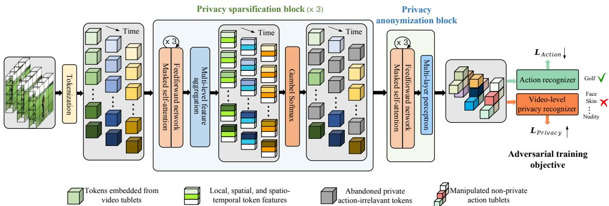  
Figure 2: Overview of the proposed STPrivacy, which aims to maintain action clues while removing private information during the transformation of raw videos. Its effectiveness is demonstrated by the stable performance of an action recognizer on the transformed videos, in contrast to the severe degradation experienced by a video-level privacy recognizer. Both the action and video-level privacy recognizers employed are regular ViT classifiers, which serve as auxiliary components for deriving an adversarial training objective. The former employs a common cross-entropy (CE) loss for supervising action recognition $( \mathcal { L } _ { \mathrm { A c t i o n } } )$ , while the latter utilizes a multi-label binary CE loss for supervising privacy recognition $( \mathcal { L } _ { \mathrm { P r i v a c y } } )$

## 3. Methodology

The overview of our proposed STPrivacy is illustrated in Figure 2. It consists of three sequential privacy sparsification blocks (PSBs) and a privacy anonymization block (PAB). The PSBs are designed to sparsify privacy in a video by adaptively abandoning the private action-irrelevant tubelets. Then the PAB, on the other hand, is responsible for manipulating the remaining action-tubelets in the embedding space to further remove privacy. Finally, the transformed tubelets are fed into an auxiliary action recognizer and an auxiliary video-level privacy recognizer, deriving an adversarial learning objective. The objective is employed to supervise the STPrivacy learning, minimizing the action recognition loss while maximizing the privacy recognition loss.

The visual effect of our privacy sparsification and anonymization mechanisms is illustrated in Figure 1 (b). It is worth noting that prior learning-based methods [38, 37, 6] mainly focus on the embedding anonymization to remove privacy, which can be seen as a special case of our STPrivacy where none of the privacy-containing tubelets are abandoned.

## 3.1. Video tokenization

Let $\scriptstyle \{ ( { \pmb v } , { \pmb y } , { \pmb p } ) \}$ denote a training dataset, where ${ \textbf { \textit { v } } } \in$ $\mathbb { R } ^ { T \times H \times \dot { W } \times \dot { 3 } }$ is a video with height H, width W, and temporal length T. ${ \pmb y } \in \{ 0 , 1 \} ^ { C }$ is the one-hot label of the video over C action classes. ${ \pmb p } \in \{ 0 , 1 \} ^ { P }$ represents P binary privacy labels, where the i-th entry of p indicates whether the i-th privacy attribute (face, skin, etc.) is exposed in the input video v.

To apply our Transformer-based framework, we convert the input video into a sequence of tokens x $\in \mathbb { R } ^ { L \times N \times D }$ where each token is a D-dimensional feature vector, extracted from a video tubelet with the size $\delta T \ \times \ \delta H \ \times$ $\delta W \times 3$ using 3D convolutions. All tubelets of v are nonoverlapping, and each tubelet exactly corresponds to one token. Hence, we have $L = T / \delta T , N = H / \delta H \cdot W / \delta W$ where the spatial dimensions are flattened. Additionally, we maintain a binary decision matrix $\hat { \mathbf { I } } \in \{ 0 , 1 \} ^ { L \times N }$ with all elements initialized as 1 to indicate whether a token of x is abandoned (0) or retained (1) during privacy sparsification.

## 3.2. Privacy sparsification

The sparsification mechanism of STPrivacy is devised to adaptively remove tubelets that are private and do not contribute to action dynamics from a raw video. Specifically, for each PSB in Figure 2, we first apply stacked Transformer layers, including a masked self-attention and a feedforward network, to learn evolved feature representations for the input tokens. We then introduce a multi-level feature aggregation module to incorporate multi-scope global information into these tokens, which are subsequently used to predict the retaining probability of each video tubelet.

Multi-level feature aggregation. To take comprehensive clues into consideration when deciding the retaining probability of each token, we propose to perform multi-level feature aggregation, collecting local, spatial and spatiotemporal information into each token. In detail, a multilayer perceptron (MLP) consisting of one linear layer followed by GELU activation [12] is applied to map the input tokens x as the local feature:

$$
\pmb { x } ^ { \mathrm { l o c a l } } = \mathrm { M L P } ( \pmb { x } ) \in \mathbb { R } ^ { L \times N \times D / 3 } .\tag{1}
$$

Next, we apply another MLP to obtain the spatial feature:

$$
\pmb { x } ^ { \mathrm { s p a t i o } } = \mathrm { E x p d } _ { \mathrm { s } } ( \mathrm { A v g } _ { \mathrm { s } } ( \mathrm { M L P } ( \pmb { x } ) , \hat { \mathbf { I } } ) ) \in \mathbb { R } ^ { L \times N \times D / 3 } ,\tag{2}
$$

where Avg and Expd represent averaging a 3D tensor and then expanding it by repeating, and the subscript $^ { 6 6 } \mathrm { { s } } ^ { , , }$ indicates that the computations are conducted along the spatial dimension. Note that Avg is conditioned on the current decision matrix ˆI as only the remaining tokens in ˆI are averaged. Similarly, we can obtain the spatio-temporal feature:

$$
\begin{array} { r } { \pmb { x } ^ { \mathrm { s p a t e m } } = \mathrm { E x p d } _ { \mathrm { s t } } ( \mathrm { A v g } _ { \mathrm { s t } } ( \mathrm { M L P } ( \pmb { x } ) , \hat { \mathbf { I } } ) ) \in \mathbb { R } ^ { L \times N \times D / 3 } , } \end{array}\tag{3}
$$

where $\mathrm { A v g } _ { \mathrm { s t } }$ and $\mathrm { E x p d _ { \mathrm { s t } } }$ represent the averaging and expanding operations over the spatio-temporal dimensions. Then these hierarchical features are concatenated along the last dimension as the sparsification evidence of each token:

$$
\pmb { x } ^ { \mathrm { s p a r s } } = \mathrm { C o n c a t } ( \pmb { x } ^ { \mathrm { l o c a l } } , \pmb { x } ^ { \mathrm { s p a t i o } } , \pmb { x } ^ { \mathrm { s p a t e m } } ) .\tag{4}
$$

Progressive token pruning. With the aggregated multilevel features $\pmb { x } ^ { \mathrm { s p a r s } }$ , we use a three-layer MLP followed by a Softmax operator to predict the token-retaining probabilities z:

$$
z = \mathrm { S o f t m a x } ( \mathrm { M L P } ( \pmb { x } ^ { \mathrm { s p a r s } } ) ) \in \mathbb { R } ^ { L \times N \times 2 } .\tag{5}
$$

Then we can sparsify the video privacy by pruning tokens according to the predicted probability z. However, normal sampling operations are non-differentiable with respect to the probability distribution, which makes it infeasible to train our framework in an end-to-end manner. To circumvent this issue, we apply the Gumbel-Softmax [15, 17, 24] for our differentiable sparsification:

$$
\mathbf { I } = { \mathrm { G u m b e l S o f t m a x } } ( z ) \in \{ 0 , 1 \} ^ { L \times N } .\tag{6}
$$

The decision matrix ˆI is updated by its Hadamard product $\hat { \mathbf { I } } = \hat { \mathbf { I } } \odot \mathbf { I }$ and then used in subsequent computations.

Instead of sparsifying the video privacy all in one step, we introduce a progressive sparsification schedule to better identify action-irrelevant private video tubelets, where we successively apply three PSBs as shown in Figure 2. To enable stable tubelet sparsification, we keep a proportion $\alpha = 0 . 7$ of the feeding tokens in each PSB by default. Besides, we find that simply applying this constraint across spatio-temporal dimensions easily causes training instability. Therefore, we encourage it on the spatial dimension of ˆI with a mean squared error loss:

$$
\mathcal { L } _ { \mathrm { S p a r s } } = \frac { 1 } { M L } \sum _ { m = 1 } ^ { M } \sum _ { l = 1 } ^ { L } ( \frac { 1 } { N } \sum _ { n = 1 } ^ { N } \hat { \mathbf { I } } _ { ( m ) } ( l , n ) - \alpha ^ { m } ) ^ { 2 } ,\tag{7}
$$

where $M = 3$ is the total number of PSBs and $\hat { \mathbf { I } } _ { ( m ) }$ represents the decision matrix of the m-th PSB.

Masked self-attention. For regular ViTs, self-attention is naturally computed among all tokens to model their interactions [33]. In the proposed STPrivacy, however, private action-irrelevant tokens are progressively pruned, and we only need to model the interactions among the remaining tokens [17, 24]. In this case, the regular computation technique for self-attention is not feasible. Therefore, we introduce a masked self-attention that better suits our task in this work. A key problem of the masked self-attention is that the numbers of remaining tokens of videos in a training batch may differ. To address this issue, we use a mask matrix M to limit the information exchanging scope, and the attention $\tilde { \mathbf { A } } _ { i j }$ can be computed as follows:

$$
\mathbf { S } = \mathbf { Q } \mathbf { K } ^ { \mathrm { T } } / \sqrt { D } \in \mathbb { R } ^ { L N \times L N } ,\tag{8}
$$

$$
\begin{array} { r } { \mathbf { M } _ { i , j } = \left\{ \begin{array} { l l } { 1 , \quad } & { i = j , } \\ { \mathrm { F l a t } _ { \mathrm { s t } } ( \hat { \mathbf { I } } ) _ { j } , } & { i \neq j . } \end{array} \right. ~ 1 \leq i , j \leq L N , } \end{array}\tag{9}
$$

$$
\tilde { \mathbf { A } } _ { i j } = \frac { \exp ( \mathbf { S } _ { i j } ) \mathbf { M } _ { i j } } { \sum _ { k = 1 } ^ { L N } \exp ( \mathbf { S } _ { i k } ) \mathbf { M } _ { i k } } , 1 \leq i , j \leq L N .\tag{10}
$$

Q, $\mathbf { K } \in \mathbb { R } ^ { L N \times D }$ are the projected query and key matrices respectively from $\mathrm { F l a t } _ { \mathrm { s t } } ( \pmb { x } )$ , where $\mathrm { F l a t _ { s t } }$ represents flattening the spatio-temporal dimensions of x. During inference, it is straightforward to select a proportion $\alpha ^ { \mathrm { { 3 } } }$ of all tokens for each video by sorting their retaining probabilities z. This ensures that the same number of tokens are retained for videos in a batch, allowing for the computation of the self-attention in a regular manner.

## 3.3. Privacy anonymization

A proportion of video tubelets not only contain rich private information but also play critical roles in representing action dynamics. Abandoning these tubelets can severely harm the performance of action recognition. To address this issue, we introduce the privacy anonymization mechanism to manipulate tubelet embeddings, implicitly removing private information from the remaining action-tubelets selected by the sparsification mechanism.

In prior studies [38, 37, 6], complex networks such as UNet [26] and ITNet [16] have been employed to manipulate frame embeddings for anonymization. In contrast, we introduce a simple yet effective PAB consisting of three

Transformer layers and a single-layer MLP for this purpose. The anonymized output can be obtained by inputting the tokens x into the MLP of PAB:

$$
\begin{array} { r } { \pmb { x } ^ { \mathrm { a n o n y } } = \mathrm { M L P } ( \pmb { x } ) \in \mathbb { R } ^ { L N \times 3 \delta T \delta H \delta W } . } \end{array}\tag{11}
$$

Finally, $\scriptstyle \mathbf { x } ^ { \mathrm { a n o n y } }$ is reshaped to the size of $T \times H \times W \times 3 ,$ representing the transformed version of the raw video v.

## 3.4. Optimization procedure and objectives

The process of performing PPAR typically comprises three phases [6]: framework initialization, adversarial learning, and evaluation.

Initialization. We initialize STPrivacy on a PPAR benchmark dataset by adding a classification loss $\mathcal { L } _ { \mathrm { A c t i o n } } ^ { ' }$ , which is similar to ${ \mathcal { L } } _ { \mathrm { A c t i o n } } .$ , to perform action recognition by itself. The full objective is:

$$
\begin{array} { r } { \mathcal { L } = \mathcal { L } _ { \mathrm { S p a r s } } + \mathcal { L } _ { \mathrm { A c t i o n } } ^ { ' } . } \end{array}\tag{12}
$$

Adversarial learning. We employ an auxiliary action recognizer and an auxiliary video-privacy recognizer to derive an adversarial learning objective for updating STPrivacy:

$$
\mathcal { L } = \mathcal { L } _ { \mathrm { S p a r s } } + \lambda _ { \mathrm { A c t i o n } } \mathcal { L } _ { \mathrm { A c t i o n } } - \lambda _ { \mathrm { P r i v a c y } } \mathcal { L } _ { \mathrm { P r i v a c y } } ,\tag{13}
$$

where $\lambda _ { \mathrm { A c t i o n } }$ and $\lambda _ { \mathrm { P r i v a c y } }$ are the weighting coefficients set to 0.5 by default. Iteratively, we update the action recognizer and video-privacy recognizer using ${ \mathcal { L } } _ { \mathrm { { A c t i o n } } }$ and $\mathcal { L } _ { \mathrm { P r i v a c y } }$ , respectively, along with updating STPrivacy.

Evaluation. We freeze the optimized STPrivacy and employ it to transform the raw videos. We then train an action recognizer and a video-privacy recognizer from scratch on the training split of the transformed videos. Finally, the trained recognizers are tested on the testing split to evaluate the effectiveness of our STPrivacy.

## 4. Experiments

## 4.1. VP-HMDB and VP-UCF101 datasets

The existing PPAR benchmark, i.e., PA-HMDB [37], consists of only 515 videos, which may be not sufficient for evaluating a deep learning approach. Therefore, we collect two larger datasets, based on two of the most popular action recognition datasets. The first one is HMDB51 [18], which contains 6,849 videos and 51 human actions. The second dataset is UCF101 [29], which contains 13,320 videos and 101 sports actions.

In line with the privacy definition used in previous studies [37, 6], we annotated these two datasets using five human attributes, i.e., face, skin color, gender, nudity, and familiar relationship. We invited more than three annotators to meticulously review each video and independently determine a binary label for each attribute based on whether it is identifiable throughout the entire video. We applied majority voting to determine each label. We name these two benchmarks VP-HMDB51 and VP-UCF101, respectively, and have adhered to the official training and testing split.

<table><tr><td rowspan="2">Method</td><td colspan="3">VP-HMDB51</td><td colspan="3">VP-UCF101</td></tr><tr><td>Top-1 (↑)</td><td>F1 (↓)</td><td>cMAP (↓)</td><td></td><td></td><td>Top-1 (↑) F1 (↓) cMAP (↓)</td></tr><tr><td>Raw data</td><td>51.44</td><td>0.673</td><td>75.58</td><td>84.20</td><td>0.684</td><td>76.62</td></tr><tr><td>Downsample-2×</td><td>40.80</td><td>0.601</td><td>71.35</td><td>72.79</td><td>0.620</td><td>71.49</td></tr><tr><td>Downsample-4×</td><td>31.32</td><td>0.594</td><td>69.79</td><td>56.07</td><td>0.615</td><td>69.85</td></tr><tr><td>Blackening [6]</td><td>38.27</td><td>0.649</td><td>74.06</td><td>69.41</td><td>0.660</td><td>75.37</td></tr><tr><td>StrongBlur [6]</td><td>40.91</td><td>0.655</td><td>74.33</td><td>73.94</td><td>0.672</td><td>75.58</td></tr><tr><td>WeakBlur [6]</td><td>47.24</td><td>0.663</td><td>75.11</td><td>77.31</td><td>0.678</td><td>76.03</td></tr><tr><td>Collective [40]</td><td>46.88</td><td>0.651</td><td>74.12</td><td>78.01</td><td>0.663</td><td>75.22</td></tr><tr><td>VITA [37]</td><td>48.11</td><td>0.638</td><td>73.89</td><td>78.49</td><td>0.657</td><td>75.36</td></tr><tr><td>SPAct [6]</td><td>48.56</td><td>0.642</td><td>73.78</td><td>78.40</td><td>0.651</td><td>75.29</td></tr><tr><td>Ours</td><td>50.73</td><td>0.613</td><td>72.48</td><td>82.55</td><td>0.634</td><td>73.79</td></tr></table>

Table 1: Comparison for known actions. Our STPrivacy achieves the highest top-1 accuracy, the lowest F1 and cMAP scores on two benchmarks. It is worth noting that our analysis excludes the downsampling-based methods.

<table><tr><td rowspan="2">Method</td><td colspan="3">VP-UCF101→VP-HMDB51</td><td colspan="3">VP-HMDB51→VP-UCF101</td></tr><tr><td>Top-1 (↑) F1 (↓)</td><td></td><td>cMAP (↓)</td><td>Top-1 (↑) F1 (↓)</td><td></td><td>cMAP (↓)</td></tr><tr><td>Raw data</td><td>51.44</td><td>0.673</td><td>75.58</td><td>84.20</td><td>0.684</td><td>76.62</td></tr><tr><td>Collective [40]</td><td>45.93</td><td>0.633</td><td>73.36</td><td>77.12</td><td>0.674</td><td>76.01</td></tr><tr><td>VITA [37]</td><td>46.78</td><td>0.621</td><td>73.47</td><td>77.48</td><td>0.669</td><td>76.02</td></tr><tr><td>SPAct [6]</td><td>47.81</td><td>0.618</td><td>72.56</td><td>78.13</td><td>0.661</td><td>75.98</td></tr><tr><td>Ours</td><td>49.56</td><td>0.595</td><td>71.25</td><td>81.04</td><td>0.645</td><td>74.60</td></tr></table>

Table 2: Comparison for unseen actions. Despite the challenging nature of this protocol, STPrivacy exhibits the best action-privacy trade-off amongst all evaluated methods.

We mainly conduct experiments on the newly collected VP-HMDB and VP-UCF101 datasets. The experimental results on the existing PA-HMDB are shown in Section 4.7.

## 4.2. Evaluation metrics

The performance of action recognition is evaluated by the widely used top-1 accuracy, where the class of a video is determined by the averaged prediction of 5 clips × 3 crops [31]. Privacy recognition, on the other hand, is a multi-label binary classification problem. Its performance is evaluated using class-wise mean average precision (cMAP) and classwise F1 score. These metrics are reported in percentages (top-1 and cMAP) and decimals (F1), where ↑ and ↓ represent that higher and lower values are better, respectively. The best values are marked in bold.

## 4.3. Implementation details

Our STPrivacy is implemented using PyTorch based on a ViT-S [9, 24, 32] pre-trained on ImageNet [7]. Both the action recognizer and video-privacy recognizer are ViT-S-based classifiers. The optimization is carried out using AdamW [21] with a weight decay of 0.05. The video and tubelet size are set at $1 6 \times 1 1 2 \times 1 1 2 \times 3$ and $2 \times 1 6 \times 1 6 \times 3 ,$ respectively. The frame sampling rates on VP-HMDB51 and VP-UCF101 are set at 2 and 4, respectively. The learning rate is linearly scaled $w . r . t .$ the input batch size using $\begin{array} { r } { 0 . \dot { 0 } 0 1 \times \frac { b a t c h \ s i z e } { 5 1 2 } } \end{array}$ , which is decreased by cosine annealing. The experiments are conducted on NVIDIA TESLA V100 GPUs. The number of training epochs for the three phases are 80, 40, and 80, respectively. For more details, please refer to the attached code, which will also be released later.

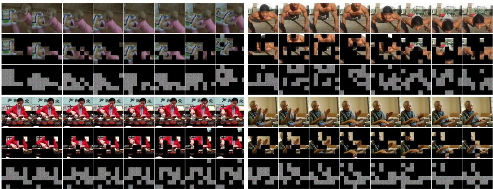  
Figure 3: Visualization of our effectiveness on various actions. Each group comprises a raw video, its corresponding privacy sparsification result, and privacy anonymization result. The sequential actions of push, pushup, pour, and clap are arranged in a left-right top-bottom order. The compelling visual results showcase the effectiveness of our framework.

## 4.4. Comparison with state-of-the-art methods

To ensure fair comparisons, the same action recognizer and video-privacy recognizer as ours are implemented for evaluating SOTA methods. The results of raw data are obtained by performing evaluations on original videos. A method exhibiting a higher top-1 accuracy alongside lower F1 and cMAP scores is deemed superior. Note that the results of Downsample-2× and 4× are provided as references and excluded from comparisons. Because they merely reduce video resolutions without regard for action recognition, resulting in a dramatic decrease in the performance.

Comparison for known actions. In this protocol, STPrivacy is trained (i.e., the first two phases) and evaluated (i.e., the last phase) on the same benchmark. Thus, the actions of evaluating videos are known for STPrivacy. The results are reported in Table 1. Notably, our framework exhibits the best action-privacy performance trade-off among all evaluated methods. Specifically, in comparison to SPAct on VP-HMDB51, ours achieves a top-1 accuracy that is 2.17% higher, while demonstrating a 0.029 lower F1 score and a 1.3% lower cMAP score. Similarly, in comparison to VITA on VP-UCF101, ours demonstrates a superior tradeoff, with a 4.06% higher accuracy, a 0.023 lower F1 score, and a 1.57% lower cMAP score. In summary, our STPrivacy demonstrates the smallest action performance degradation while achieving the largest privacy performance decrease on the basis of the raw data results.

Comparison for unseen actions. In this protocol, STPrivacy is trained and evaluated on different benchmarks. Thus, the actions of evaluating videos are unseen for STPrivacy. The results are reported in Table 2. Note that only learning-based methods show changes in performances, compared to the experiments for known actions. Specifically, their action recognition accuracy on VP-HMDB51 decreases due to the different action sets between training and evaluating. However, their F1 and cMAP scores also exhibit apparently decreases. This could be attributed to the fact that VP-UCF101, including 101 human actions, covers a wider range of scenes of life than VP-HMDB51. Therefore, the methods trained on the former are more adaptable on privacy removal and offer better protection of privacy on the latter. This is also evidenced by the consistently degraded action-privacy trade-offs on VP-UCF101. Despite these challenges, our STPrivacy still achieves the best performance trade-offs on both benchmarks.

## 4.5. Qualitative analysis

To qualitatively analyze our effectiveness, we provide a visualization of raw videos, the privacy sparsification effect (as described in Section 3.2), and the privacy anonymization effect (as described in Section 3.3) in in Figure 3 (more visualizations are provided in the supplementary material).

Sparsification reasonably abandons private tubelets for privacy removal. From the second row of each group, we observe that the tubelets containing private information, e.g., head and face, that are not essential to action dynamics are abandoned, while those highly related to representing actions are retained. For instance, in the pour video, the head tubelets are abandoned to prevent the leakage of face and gender information, whereas the arms are retained to represent the dynamics of pouring. Similar effects are observed in the videos of push, pushup, and other actions. These results demonstrate that our STPrivacy is capable of distinguishing private action-irrelevant tubelets and achieving adaptive tubelet disentanglement for various actions. Notably, the background tubelets that are irrelevant to either privacy or actions are not of concern in our approach.

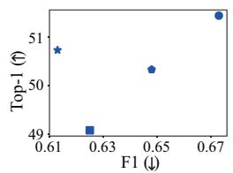

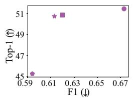

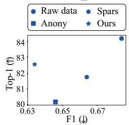

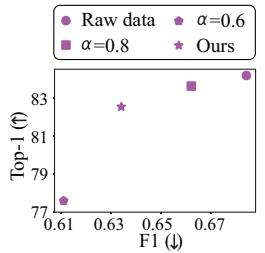

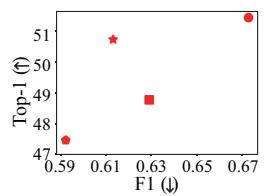

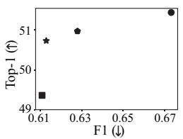

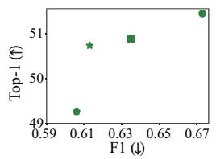

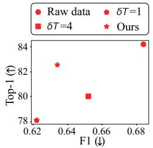

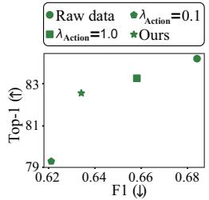

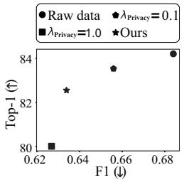  
Figure 4: Results of the ablation experiments for separate sparsification (sparse) and anonymization (anony) mechanisms (1st column), tubelet keeping proportion α (2nd column), temporal length of tubelets δT (3rd column), $\lambda _ { \mathrm { A c t i o n } }$ (4th column), and $\lambda _ { \mathrm { P r i v a c y } }$ (last column) on VP-HMDB51 (1st row) and VP-UCF101 (2nd row) datasets. The experiment with the data point closest to the upper-left corner achieves the best action-privacy recognition trade-off in each chart.

Anonymization renders action tubelets unidentifiable for human eyes. The third row of each group shows that the anonymized action tubelets are devoid of object silhouettes, which is a marked improvement over previous learning-based methods that rely on CNN-based transformation networks, such as ITNet [16] in VITA [37] and UNet [27] in SPAct [6]. These methods inherently maintain spatial information of objects, and in VITA [37], for instance, salient object silhouettes are easily recognizable in transformed frames. In contrast, our STPrivacy is based on the self-attention interactions among tokens and possesses inherent advantages in concealing geometric information of objects. This empowers our framework with a notable advantage over previous approaches in achieving high-quality visual privacy preservation.

## 4.6. Ablation study

In this section, we investigate the main components and hyperparameters of our STPrivacy through extensive ablation experiments. Each experiment involves adjusting only the specified factor while keeping other factors at the default setting of ours. The chart results are provided in Figure 4.

Separate sparsification effectively reduces privacy leakage. We perform separate training of the sparsification mechanism by ablating the PAB of our framework. Our findings, from the results of the downsampling-based methods in Table 1, reveal that indiscriminate video transformations such as decreasing resolutions pose greater harm to action recognition than to privacy recognition. This disparity may be attributed to the fact that privacy recognition does not necessitate the continuity of object dynamics, as is required for action recognition. Upon analyzing the 1st column charts, our spars experiment results in a considerably smaller decrease ratio in the top-1 accuracy when compared to the F1 and cMAP scores based on the raw data results. This validates the effectiveness of our sparsification mechanism in abandoning private action-irrelevant tubelets, thereby reducing privacy leakage.

Separate anonymization successfully maintains action clues. We also perform separate training of the anonymization mechanism by setting $\alpha ~ = ~ 1 . 0$ in the PSBs of our framework to investigate its impact on action recognition. As shown in the 1st column charts, the anony experiment results in remarkably lower F1 and cMAP scores, but a relatively higher top-1 accuracy. It demonstrates the successful maintenance of action clues by our anonymization mechanism when removing privacy in the embedding space.

Tubelet keeping proportion easily balances action privacy recognition. We study the impact of the tubelet keeping proportion α in the 2nd column charts. We find that a larger α, encouraging STPrivacy to keep more tubelets through Equation 7, benefits action recognition while worsening privacy leakage, and vice versa. This consistent trend is observed across both benchmarks, indicating that users can easily balance the trade-off between action and privacy recognition by choosing an appropriate α for training STPrivacy. Moreover, users can choose a different α for deployment, allowing them to adjust the performance trade-off for inference without the need of retraining. This is achieved when selecting $\alpha ^ { 3 }$ of all tubelets for a video by sorting their keeping probabilities, as described in Section 3.2. This advantage distinguishes our approach from previous learning-based methods, where the action-privacy trade-offs are frozen after training.

Temporal length affects the selection flexibility of remaining tubelets. We adjust the temporal length of tubelets δT in the 3rd column charts to study its optimal setting. When δT is set to 1, each tubelet only covers a single frame, resulting in more selections for remaining tubelets compared to $\delta T \ = \ 2 .$ Consequently, the privacy removal becomes more flexible and easier. However, this also makes it more difficult to model temporal correlations among tubelets, which is reflected by the decreased action recognition performance. On the other hand, when δT is set to 4, the number of selections of remaining tubelets is considerably reduced, limiting the privacy-removal flexibility. Moreover, the length of tubelets becomes too long, leading to abandoned tubelets inevitably containing action clues, which harms action recognition. Based on these observations, we set δT to 2 as our final setting in the experiments.

Framework robustness in terms of the task weighting coefficients. We choose different values for $\lambda _ { \mathrm { A c t i o n } }$ and $\lambda _ { \mathrm { P r i v a c y } }$ to optimize our STPrivacy in the last two column charts. A higher value highlights the corresponding task during the transformation of raw videos. The small resulting fluctuations of the action-privacy trade-offs demonstrate the satisfactory robustness of our framework.

## 4.7. Frame-level privacy preservation

Although it is originally designed for the video-level PPAR, we also conduct experiments to verify the efficacy of our STPrivacy on frame-level privacy preservation. Previous works evaluate their methods on PA-HMDB [37], which comprises 515 videos with action and privacy labels. We randomly divide 60% of the videos for training and use the remaining 40% for testing. As per [37, 6], we train an action recognizer and a frame-privacy recognizer from scratch on the transformed HMDB51 dataset and the transformed training set of PA-HMDB, respectively, before testing them on the transformed testing set of PA-HMDB. All methods follow the same protocol, and the results are reported in Table 3. The comparison clearly demonstrates that our STPrivacy is still superior in this scenario. Therefore, we conclude that it is capable of protecting both video-level and frame-level privacy.

## 4.8. Generalization ability

To verify the generalization ability of our STPrivacy, we conduct additional experiments on two related tasks. Unless specified otherwise, the training details used in these experiments are identical to those used in the experiments on our PPAR benchmarks.

Facial attribute-preserving dynamic expression recognition. We term this task as FAPDER, which aims to perform dynamic expression recognition on facial videos [20, 34] while preventing appearance attributes from leaking. It is based on the CelebVHQ dataset [44], which consists of 35,666 facial videos collected from 15,653 individuals. Each video is annotated with one of eight expressions: neutral, happy, sad, anger, fear, surprise, contempt, and disgust, along with appearance attributes. We select five attributes, namely young, pointy nose, male, rosy cheeks, and brown hair, to protect. We randomly split 60% of all videos for training and use the remaining 40% for testing, with a frame sampling rate of 2. The results of all methods are reported in Table 4, which clearly demonstrates the superior generalization ability of our STPrivacy on FAPDER.

<table><tr><td>Method</td><td colspan="3">Top-1 (↑) F1 (↓) cMAP (↓)</td></tr><tr><td>Raw data</td><td>51.23</td><td>0.572</td><td>71.12</td></tr><tr><td>Downsample-2× Downsample-4×</td><td>40.38 31.24</td><td>0.519 0.511</td><td>67.81 67.14</td></tr><tr><td>Blackening [6] StrongBlur [6] WeakBlur [6]</td><td>38.09 40.64 46.89</td><td>0.557 0.560 0.567</td><td>70.02 70.31 70.74</td></tr><tr><td>Collective [40]</td><td>46.47</td><td>0.554</td><td>69.96</td></tr><tr><td>VITA [37]</td><td>47.78</td><td>0.549</td><td>69.45</td></tr><tr><td></td><td></td><td></td><td></td></tr><tr><td>SPAct [6]</td><td>48.33</td><td>0.543</td><td>69.44</td></tr><tr><td>Ours</td><td>50.61</td><td>0.523</td><td>68.76</td></tr></table>

Table 3: Comparison for frame-level privacy preservation. Despite not being specifically proposed for this scenario, our STPrivacy exhibits substantial improvements over the existing methods.

<table><tr><td>Method</td><td colspan="2">Top-1 (↑) F1 (↓) cMAP (↓)</td></tr><tr><td>Raw data</td><td>73.13 0.714</td><td>78.51</td></tr><tr><td>Downsample-2× Downsample-4×</td><td>54.53 0.259 41.67 0.244</td><td>54.33 47.17</td></tr><tr><td>StrongBlur [6] WeakBlur [6] Collective [40] VITA [37]</td><td>56.77 0.331 64.22 0.369 63.65 0.348 66.43 0.314</td><td>63.61 64.19 63.20 61.09</td></tr><tr><td>SPAct [6] Ours</td><td>67.12 0.326 71.37 0.280</td><td>62.78 59.30</td></tr></table>

Table 4: Comparison for FAPDER. Our STPrivacy shows significant superiority over other methods.

<table><tr><td>Method</td><td colspan="3">Action (↑) Object (↓) Scene (↓)</td></tr><tr><td>Raw data</td><td>27.28</td><td>15.72</td><td>30.18</td></tr><tr><td>Downsample-2×</td><td>17.08</td><td>11.74</td><td>24.77</td></tr><tr><td>Downsample-4×</td><td>15.23</td><td>10.66</td><td>22.40</td></tr><tr><td>Blackening [6]</td><td>18.51</td><td>14.89</td><td>29.59</td></tr><tr><td>StrongBlur [6]</td><td>19.08</td><td>15.01</td><td>29.32</td></tr><tr><td>WeakBlur [6]</td><td>21.67</td><td>14.37</td><td>28.68</td></tr><tr><td>Collective [40]</td><td>22.20</td><td>14.27</td><td>28.79</td></tr><tr><td>VITA [37]</td><td>22.87</td><td>14.44</td><td>27.76</td></tr><tr><td>SPAct [6]</td><td>23.16</td><td>14.02</td><td>28.59</td></tr><tr><td>Ours</td><td>26.42</td><td>12.38</td><td>25.64</td></tr></table>

Table 5: Comparison for OSPAR. Our STPrivacy outperforms the existing methods by remarkable margins.

Object- and scene-preserving action recognition. We term this task as OSPAR, which aims to recognize actions in videos while preventing object and scene categories from leaking [6]. The dataset used for this task is P-HVU [6], which contains 245,212 videos for training and 16,012 videos for testing. Each video is assigned multi-label action, object and scene annotations. Thus, cMAP is applied to evaluate the three tasks. The frame sampling rate is set at 2. The results of all methods are reported in Table 5. The comparison reveals that our STPrivacy also exhibits superior generalization ability on OSPAR.

## 5. Conclusion

In this paper, we propose a novel video-level PPAR framework STPrivacy, which benefits action recognition and offers more strict privacy preservation. It exhibits significant advantages over existing methods. We also construct the first two large-scale benchmarks, validating our SOTA action-privacy trade-offs and qualitative effectiveness. Finally, we validate our superior generalization ability on two related tasks. These demonstrate that our contributions have the great potential to advance the PPAR research.

## Acknowledgement

The project is supported by the National Research Foundation, Singapore under its NRFF Award NRF-NRFF13- 2021-0008, and his Start-Up Grant from NUS. Ming Li is funded by the ISEP-IDS PhD scholarship in NUS. Jun Liu is supported by MOE AcRF Tier 2 under the award number MOE-T2EP20222-0009. HeHe Fan is supported by the Fundamental Research Funds for the Central Universities (No. 226-2023-00048).

## References

[1] Anurag Arnab, Mostafa Dehghani, Georg Heigold, Chen Sun, Mario Luciˇ c, and Cordelia Schmid. Vivit: A video´ vision transformer. In Proceedings of the IEEE/CVF International Conference on Computer Vision, pages 6836–6846, 2021. 2

[2] Gedas Bertasius, Heng Wang, and Lorenzo Torresani. Is space-time attention all you need for video understanding? In ICML, volume 2, page 4, 2021. 2

[3] Daniel J Butler, Justin Huang, Franziska Roesner, and Maya Cakmak. The privacy-utility tradeoff for remotely teleoperated robots. In Proceedings of the tenth annual ACM/IEEE international conference on human-robot interaction, pages 27–34, 2015. 2

[4] Edward Chou, Matthew Tan, Cherry Zou, Michelle Guo, Albert Haque, Arnold Milstein, and Li Fei-Fei. Privacypreserving action recognition for smart hospitals using lowresolution depth images. arXiv preprint arXiv:1811.09950, 2018. 2

[5] Ji Dai, Behrouz Saghafi, Jonathan Wu, Janusz Konrad, and Prakash Ishwar. Towards privacy-preserving recognition of human activities. In 2015 IEEE international conference on image processing (ICIP), pages 4238–4242. IEEE, 2015. 2

[6] Ishan Rajendrakumar Dave, Chen Chen, and Mubarak Shah. Spact: Self-supervised privacy preservation for action recognition. In Proceedings ofthe IEEE/CVF Conference on Computer Vision and Pattern Recognition, pages 20164–20173, 2022. 1, 2, 3, 4, 5, 7, 8, 9

[7] Jia Deng, Wei Dong, Richard Socher, Li-Jia Li, Kai Li, and Li Fei-Fei. Imagenet: A large-scale hierarchical image database. In 2009 IEEE conference on computer vision and pattern recognition, pages 248–255. Ieee, 2009. 5

[8] Jacob Devlin, Ming-Wei Chang, Kenton Lee, and Kristina Toutanova. Bert: Pre-training of deep bidirectional transformers for language understanding. arXiv preprint arXiv:1810.04805, 2018. 2

[9] Alexey Dosovitskiy, Lucas Beyer, Alexander Kolesnikov, Dirk Weissenborn, Xiaohua Zhai, Thomas Unterthiner, Mostafa Dehghani, Matthias Minderer, Georg Heigold, Sylvain Gelly, et al. An image is worth 16x16 words: Transformers for image recognition at scale. In ICLR, 2021. 2, 5

[10] Christoph Feichtenhofer, Haoqi Fan, Yanghao Li, and Kaiming He. Masked autoencoders as spatiotemporal learners. arXiv preprint arXiv:2205.09113, 2022. 2

[11] Christoph Feichtenhofer, Haoqi Fan, Jitendra Malik, and Kaiming He. Slowfast networks for video recognition. In Proceedings of the IEEE international conference on computer vision, pages 6202–6211, 2019. 2

[12] Dan Hendrycks and Kevin Gimpel. Gaussian error linear units (gelus). arXiv preprint arXiv:1606.08415, 2016. 4

[13] Ruibing Hou, Bingpeng Ma, Hong Chang, Xinqian Gu, Shiguang Shan, and Xilin Chen. Vrstc: Occlusion-free video person re-identification. In Proceedings of the IEEE/CVF conference on computer vision and pattern recognition, pages 7183–7192, 2019. 2

[14] Ruibing Hou, Bingpeng Ma, Hong Chang, Xinqian Gu, Shiguang Shan, and Xilin Chen. Feature completion for occluded person re-identification. IEEE Transactions on Pattern Analysis and Machine Intelligence, 2021. 2

[15] Eric Jang, Shixiang Gu, and Ben Poole. Categorical reparameterization with gumbel-softmax. arXiv preprint arXiv:1611.01144, 2016. 4

[16] Justin Johnson, Alexandre Alahi, and Li Fei-Fei. Perceptual losses for real-time style transfer and super-resolution. In Computer Vision–ECCV 2016: 14th European Conference, Amsterdam, The Netherlands, October 11-14, 2016, Proceedings, Part II 14, pages 694–711. Springer, 2016. 4, 7

[17] Zhenglun Kong, Peiyan Dong, Xiaolong Ma, Xin Meng, Wei Niu, Mengshu Sun, Bin Ren, Minghai Qin, Hao Tang, and Yanzhi Wang. Spvit: Enabling faster vision transformers via soft token pruning. arXiv preprint arXiv:2112.13890, 2021. 2, 3, 4

[18] Hildegard Kuehne, Hueihan Jhuang, Est´ıbaliz Garrote, Tomaso Poggio, and Thomas Serre. Hmdb: a large video database for human motion recognition. In 2011 International conference on computer vision, pages 2556–2563. IEEE, 2011. 5

[19] Jixin Liu and Leilei Zhang. Indoor privacy-preserving action recognition via partially coupled convolutional neural

network. In 2020 International Conference on Artificial Intelligence and Computer Engineering (ICAICE), pages 292– 295. IEEE, 2020. 1, 2

[20] Mengyi Liu, Shiguang Shan, Ruiping Wang, and Xilin Chen. Learning expressionlets on spatio-temporal manifold for dynamic facial expression recognition. In Proceedings of the IEEE conference on computer vision and pattern recognition, pages 1749–1756, 2014. 8

[21] Ilya Loshchilov and Frank Hutter. Decoupled weight decay regularization. arXiv preprint arXiv:1711.05101, 2017. 5

[22] Lingchen Meng, Hengduo Li, Bor-Chun Chen, Shiyi Lan, Zuxuan Wu, Yu-Gang Jiang, and Ser-Nam Lim. Adavit: Adaptive vision transformers for efficient image recognition. In Proceedings of the IEEE/CVF Conference on Computer Vision and Pattern Recognition, pages 12309–12318, 2022. 2, 3

[23] Bowen Pan, Rameswar Panda, Yifan Jiang, Zhangyang Wang, Rogerio Feris, and Aude Oliva. Ia-red2: Interpretability-aware redundancy reduction for vision transformers. Advances in Neural Information Processing Systems, 34:24898–24911, 2021. 2, 3

[24] Yongming Rao, Wenliang Zhao, Benlin Liu, Jiwen Lu, Jie Zhou, and Cho-Jui Hsieh. Dynamicvit: Efficient vision transformers with dynamic token sparsification. Advances in neural information processing systems, 34:13937–13949, 2021. 2, 3, 4, 5

[25] Zhongzheng Ren, Yong Jae Lee, and Michael S Ryoo. Learning to anonymize faces for privacy preserving action detection. In Proceedings of the european conference on computer vision (ECCV), pages 620–636, 2018. 1, 2

[26] Olaf Ronneberger, Philipp Fischer, and Thomas Brox. Unet: Convolutional networks for biomedical image segmentation. In International Conference on Medical image computing and computer-assisted intervention, pages 234–241. Springer, 2015. 4

[27] Olaf Ronneberger, Philipp Fischer, and Thomas Brox. Unet: Convolutional networks for biomedical image segmentation. In International Conference on Medical image computing and computer-assisted intervention, pages 234–241. Springer, 2015. 7

[28] Michael S Ryoo, Brandon Rothrock, Charles Fleming, and Hyun Jong Yang. Privacy-preserving human activity recognition from extreme low resolution. In Thirty-First AAAI Conference on Artificial Intelligence, 2017. 2

[29] Khurram Soomro, Amir Roshan Zamir, and Mubarak Shah. Ucf101: A dataset of 101 human actions classes from videos in the wild. arXiv preprint arXiv:1212.0402, 2012. 5

[30] Vinkle Srivastav, Afshin Gangi, and Nicolas Padoy. Human pose estimation on privacy-preserving low-resolution depth images. In International Conference on Medical Image Computing and Computer-Assisted Intervention, pages 583–591. Springer, 2019. 1, 2

[31] Zhan Tong, Yibing Song, Jue Wang, and Limin Wang. Videomae: Masked autoencoders are data-efficient learners for self-supervised video pre-training. arXiv preprint arXiv:2203.12602, 2022. 2, 5

[32] Hugo Touvron, Matthieu Cord, Matthijs Douze, Francisco Massa, Alexandre Sablayrolles, and Herve J´ egou. Training´

data-efficient image transformers & distillation through attention. In ICML, 2021. 5

[33] Ashish Vaswani, Noam Shazeer, Niki Parmar, Jakob Uszkoreit, Llion Jones, Aidan N Gomez, Łukasz Kaiser, and Illia Polosukhin. Attention is all you need. In NeurIPS, pages 5998–6008, 2017. 2, 4

[34] Monu Verma, Santosh Kumar Vipparthi, Girdhari Singh, and Subrahmanyam Murala. Learnet: Dynamic imaging network for micro expression recognition. IEEE Transactions on Image Processing, 29:1618–1627, 2019. 8

[35] Limin Wang, Yuanjun Xiong, Zhe Wang, Yu Qiao, Dahua Lin, Xiaoou Tang, and Luc Van Gool. Temporal segment networks for action recognition in videos. IEEE TPAMI, 2019. 2

[36] Yingquan Wang, Pingping Zhang, Shang Gao, Xia Geng, Hu Lu, and Dong Wang. Pyramid spatial-temporal aggregation for video-based person re-identification. In Proceedings of the IEEE/CVF International Conference on Computer Vision (ICCV), pages 12026–12035, October 2021. 2

[37] Zhenyu Wu, Haotao Wang, Zhaowen Wang, Hailin Jin, and Zhangyang Wang. Privacy-preserving deep action recognition: An adversarial learning framework and a new dataset. IEEE Transactions on Pattern Analysis and Machine Intelligence, 2020. 1, 2, 3, 4, 5, 7, 8

[38] Zhenyu Wu, Zhangyang Wang, Zhaowen Wang, and Hailin Jin. Towards privacy-preserving visual recognition via adversarial training: A pilot study. In Proceedings of the European Conference on Computer Vision (ECCV), pages 606– 624, 2018. 1, 2, 3, 4

[39] Hongxu Yin, Arash Vahdat, Jose M Alvarez, Arun Mallya, Jan Kautz, and Pavlo Molchanov. A-vit: Adaptive tokens for efficient vision transformer. In Proceedings ofthe IEEE/CVF Conference on Computer Vision and Pattern Recognition, pages 10809–10818, 2022. 2, 3

[40] Dalin Zhang, Lina Yao, Kaixuan Chen, Guodong Long, and Sen Wang. Collective protection: Preventing sensitive inferences via integrative transformation. In 2019 IEEE International Conference on Data Mining (ICDM), pages 1498– 1503. IEEE, 2019. 5, 8

[41] Zhixiang Zhang, Thomas Cilloni, Charles Walter, and Charles Fleming. Multi-scale, class-generic, privacypreserving video. Electronics, 10(10):1172, 2021. 1, 2

[42] Zhizheng Zhang, Cuiling Lan, Wenjun Zeng, and Zhibo Chen. Multi-granularity reference-aided attentive feature aggregation for video-based person re-identification. In Proceedings of the IEEE/CVF conference on computer vision and pattern recognition, pages 10407–10416, 2020. 2

[43] Haoyi Zhou, Shanghang Zhang, Jieqi Peng, Shuai Zhang, Jianxin Li, Hui Xiong, and Wancai Zhang. Informer: Beyond efficient transformer for long sequence time-series forecasting. arXiv preprint arXiv:2012.07436, 2020. 2

[44] Hao Zhu, Wayne Wu, Wentao Zhu, Liming Jiang, Siwei Tang, Li Zhang, Ziwei Liu, and Chen Change Loy. CelebV-HQ: A large-scale video facial attributes dataset. In ECCV, 2022. 2, 8