# SVDiff: Compact Parameter Space for Diffusion Fine-Tuning

Ligong Han1,2\* Yinxiao Li2 Han Zhang2 Peyman Milanfar2 Dimitris Metaxas1 Feng Yang2 1Rutgers University 2Google Research

## Abstract

Diffusion models have achieved remarkable success in text-to-image generation, enabling the creation of highquality imagesfrom text prompts or other modalities. However, existing methodsfor customizing these models are limited by handling multiple personalized subjects and the risk of overfitting. Moreover, their large number ofparameters is inefficient for model storage. In this paper, we propose a novel approach to address these limitations in existing textto-image diffusion modelsfor personalization. Our method involves fine-tuning the singular values of the weight matrices, leading to a compact and efficient parameter space that reduces the risk of overfitting and language-drifting. We also propose a Cut-Mix-Unmix data-augmentation technique to enhance the quality of multi-subject image generation and a simple text-based image editingframework. Our proposed SVDiff method has a significantly smaller model size compared to existing methods (≈2,200 timesfewer parameters compared with vanilla DreamBooth), making it more practicalfor real-world applications.

## 1. Introduction

Recent years have witnessed the rapid advancement of diffusion-based text-to-image generative models [19, 53, 20, 47, 51], which have enabled the generation of highquality images through simple text prompts. These models are capable of generating a wide range of objects, styles, and scenes with remarkable realism and diversity. These models, with their exceptional results, have inspired researchers to investigate various ways to harness their power for image editing [31, 37, 79].

In the pursuit of model personalization and customization, some recent works such as Textual-Inversion [16], DreamBooth [52], and Custom Diffusion [32] have further unleashed the potential of large-scale text-to-image diffusion models. By fine-tuning the parameters of the pretrained models, these methods allow the diffusion models to be adapted to specific tasks or individual user preferences.

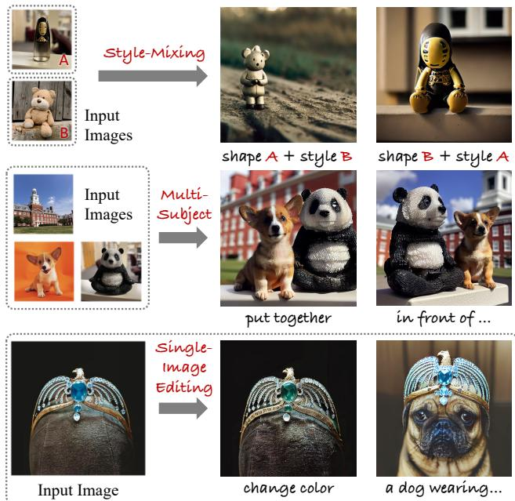  
Figure 1. Applications of SVDiff. Style-Mixing: mix styles from personalized objects and create novel renderings; Multi-Subject: generate multiple subjects in the same scene; Single-Image Editing: text-based editing from a single image.

Despite their promising results, there are still some limitations associated with fine-tuning large-scale text-to-image diffusion models. One limitation is the large parameter space, which can lead to overfitting or drifting from the original generalization ability [52]. Another challenge is the difficulty in learning multiple personalized concepts especially when they are of similar categories [32].

To alleviate overfitting, we draw inspiration from the efficient parameter space in the GAN literature [50] and propose a compact yet efficient parameter space, spectral shift, for diffusion model by only fine-tuning the singular values of the weight matrices of the model. This approach is inspired by prior work in GAN adaptation showing that constraining the space of trainable parameters can lead to improved performance on target domain [48, 36, 41, 64]. Comparing with another popular low-rank constraint [22], the spectral shifts utilize the full representation power of the weight matrix while being more compact (e.g. 1.7MB for

StableDiffusion [51, 15, 69], full weight checkpoint consumes 3.66GB of storage). The compact parameter space allows us to combat overfitting and language-drifting issues, especially when prior-preservation loss [52] is not applicable. We demonstrate this use case by presenting a simple DreamBooth-based single-image editing framework.

To further enhance the ability of the model to learn multiple personalized concepts, we propose a simple Cut-Mix-Unmix data-augmentation technique. This technique, together with our proposed spectral shift parameter space, enables us to learn multiple personalized concepts even for semantically similar categories $( e . g .$ . a “cat” and a “dog”).

In summary, our main contributions are:

• We present a compact (≈2,200× fewer parameters compared with vanilla DreamBooth [52], measured on StableDiffusion [51]) yet efficient parameter space for diffusion model fine-tuning based on singular-value decomposition of weight kernels.

• We present a text-based single-image editing framework and demonstrate its use case with our proposed spectral shift parameter space.

• We present a generic Cut-Mix-Unmix method for dataaugmentation to enhance the ability of the model to learn multiple personalized concepts.

This work opens up new avenues for the efficient and effective fine-tuning large-scale text-to-image diffusion models for personalization and customization. Our proposed method provides a promising starting point for further research in this direction.

## 2. Related Work

Text-to-image diffusion models Diffusion models [58, 61, 19, 62, 40, 59, 18, 60, 10] have proven to be highly effective in learning data distributions and have shown impressive results in image synthesis, leading to various applications [74, 45, 9, 49, 26, 23, 34, 56, 28, 24, 29]. Recent advancements have also explored transformer-based architectures [67, 44, 6, 7]. In particular, the field of text-guided image synthesis has seen significant growth with the introduction of diffusion models, achieving state-of-the-art results in large-scale text-to-image synthesis tasks [39, 47, 53, 51, 4]. Our main experiments were conducted using StableDiffusion [51], which is a popular variant of latent diffusion models (LDMs) [51] that operates on a latent space of a pretrained autoencoder to reduce the dimensionality of the data samples, allowing the diffusion model to utilize the wellcompressed semantic features and visual patterns learned by the encoder.

Fine-tuning generative models for personalization Recent works have focused on customizing and personalizing text-to-image diffusion models by fine-tuning the text embedding [16], full weights [52], cross-attention layers [32], or adapters [77, 38] using a few personalized images. Other works have also investigated training-free approaches for fast adaptation [17, 73, 11, 27, 55]. The idea of finetuning only the singular values of weight matrices was introduced by FSGAN [50] in the GAN literature and further advanced by NaviGAN [13] with an unsupervised method for discovering semantic directions in this compact parameter space. Our method, SVDiff, introduces this concept to the fine-tuning of diffusion models and is designed for fewshot adaptation. A similar approach, LoRA [14], explores low-rank adaptation for text-to-image diffusion fine-tuning, while our proposed SVDiff optimizes all singular values of the weight matrix, leading to an even smaller model checkpoint. Similar idea has also been explored in few-shot segmentation [64].

Diffusion-based image editing Diffusion models have also shown great potential for semantic editing [33, 3, 2, 31, 79, 37, 72, 68, 63, 42, 43, 5, 71]. These methods typically focus on inversion [59] and reconstruction by optimizing the nulltext embedding or overfitting to the given image [79]. Our proposed method, SVDiff , presents a simple DreamBoothbased [52] single-image editing framework that demonstrates the potential of SVDiff in single image editing and mitigating overfitting.

## 3. Method

## 3.1. Preliminary

Diffusion models StableDiffusion [51], the model we experiment with, is a variant of latent diffusion models (LDMs) [51]. LDMs transform the input images x into a latent code z through an encoder $\mathcal { E } ,$ where ${ \bf z } = \mathcal { E } ( { \bf x } )$ , and perform the denoising process in the latent space Z. Briefly, a LDM $\scriptstyle { \hat { \epsilon } } _ { \theta }$ is trained with a denoising objective:

$$
\mathbb { E } _ { \mathbf { z } , \mathbf { c } , \epsilon , t } \Big [ \big \| \hat { \mathbf { \epsilon } } _ { \boldsymbol { \theta } } \big ( \mathbf { z } _ { t } | \mathbf { c } , t \big ) - \boldsymbol { \epsilon } \big \| _ { 2 } ^ { 2 } \Big ] ,\tag{1}
$$

where $( \mathbf { z } , \mathbf { c } )$ are data-conditioning pairs (image latents and text embeddings), $\epsilon \sim \mathcal { N } ( \mathbf { 0 } , \mathbf { I } )$ , t ∼ Uniform(1, T), and θ represents the model parameters. We omit t in the following for brevity.

Few-shot adaptation in compact parameter space of GANs The method of FSGAN [50] is based on the Singular Value Decomposition (SVD) technique and proposes an effective way to adapt GANs in few-shot settings. It takes advantage of the SVD to learn a compact update for domain adaptation in the parameter space of a GAN. Specifically, FSGAN reshapes the convolution kernels of a GAN, which are in the form of $W _ { t e n s o r } \in \mathbb { R } ^ { c _ { o u t } \times c _ { i n } \times }$ h×w into 2-D matrices W, which are in the form of $\begin{array} { r l } { W } & { { } = } \end{array}$ reshape $( W _ { t e n s o r } ) \ \in \ \mathbb { R } ^ { c _ { o u t } \times ( c _ { i n } \times h \times w ) }$ FSGAN then performs SVD on these reshaped weight matrices of both the generator and discriminator of a pretrained GAN and adapts their singular values to a new domain using a standard GAN training objective.

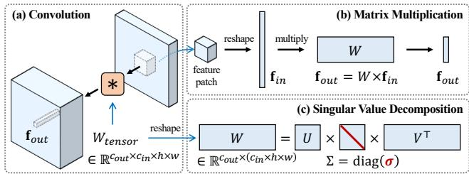  
Figure 2. Performing singular value decomposition (SVD) on weight matrices. In an intermediate layer of the model, (a) the convolutional weights $W _ { t e n s o r }$ (b) serve as an associative memory [8]. (c) SVD is performed on the reshaped 2-D matrix W.

## 3.2. Compact Parameter Space for Diffusion Finetuning

Spectral shifts The core idea of our method is to introduce the concept of spectral shifts from FSGAN [50] to the parameter space of diffusion models. To do so, we first perform Singular Value Decomposition (SVD) on the weight matrices of the pre-trained diffusion model. The weight matrix (obtained from the same reshaping as FS-GAN [50] mentioned above) is denoted as W and its SVD is $W = U \Sigma V ^ { \top }$ , where $\Sigma = \mathrm { d i a g } ( \pmb { \sigma } )$ and $\pmb { \sigma } = [ \sigma _ { 1 } , \sigma _ { 2 } , . . . ]$ are the singular values in descending order. Note that the SVD is a one-time computation and can be cached. This procedure is illustrated in Fig. 2. Such reshaping of the convolution kernels is inspired by viewing them as linear associative memories [8]. The patch-level convolution can be expressed as a matrix multiplication, $\mathbf { f } _ { o u t } \ = \ W \mathbf { f } _ { i n } ,$ where $\mathbf { f } _ { i n } \in \mathbb { R } ^ { ( c _ { i n } \times h \times w ) \times 1 }$ is flattened patch feature and $\mathbf { f } _ { o u t } \in \mathbb { R } ^ { c _ { o u t } }$ is the output pre-activation feature corresponding to the given patch. Intuitively, the optimization of spectral shifts leverages the fact that the singular vectors correspond to the close-form solutions of the eigenvalue problem [54]: $\mathrm { m a x } _ { \mathbf { n } } \| W \mathbf { n } \| _ { 2 } ^ { 2 } \mathrm { s . t . } \| \mathbf { n } \| = 1$

Instead of fine-tuning the full weight matrix, we only update the weight matrix by optimizing the spectral shift [13], $\delta ,$ which is defined as the difference between the singular values of the updated weight matrix and the original weight matrix. The updated weight matrix can be re-assembled by

$$
W _ { \delta } = U \Sigma _ { \delta } V ^ { \top } \mathrm {  ~ \ w i t h ~ } \Sigma _ { \delta } = \mathrm { d i a g } ( \mathrm { R e L U } ( \sigma + \delta ) ) .\tag{2}
$$

Training loss The fine-tuning is performed using the same loss function that was used for training the diffusion model, with a weighted prior-preservation loss [52, 8]:

$$
\begin{array} { r } { \mathcal { L } ( \pmb { \delta } ) = \mathbb { E } _ { \mathbf { z } ^ { * } , \mathbf { c } ^ { * } , \mathbf { \epsilon } \epsilon , t } \left[ \| \hat { \mathbf { \epsilon } } _ { \theta _ { \delta } } ( \mathbf { z } _ { t } ^ { * } | \mathbf { c } ^ { * } ) - \mathbf { \epsilon } \| _ { 2 } ^ { 2 } \right] + \lambda \mathcal { L } _ { p r } ( \pmb { \delta } ) } \end{array}\tag{with}
$$

$$
\mathcal { L } _ { p r } ( \pmb { \delta } ) = \mathbb { E } _ { \mathbf { z } ^ { p r } , \mathbf { c } ^ { p r } , \epsilon , t } \Big [ \| \hat { \epsilon } _ { \theta _ { \delta } } ( \mathbf { z } _ { t } ^ { p r } | \mathbf { c } ^ { p r } ) - \epsilon \| _ { 2 } ^ { 2 } \Big ]\tag{3}
$$

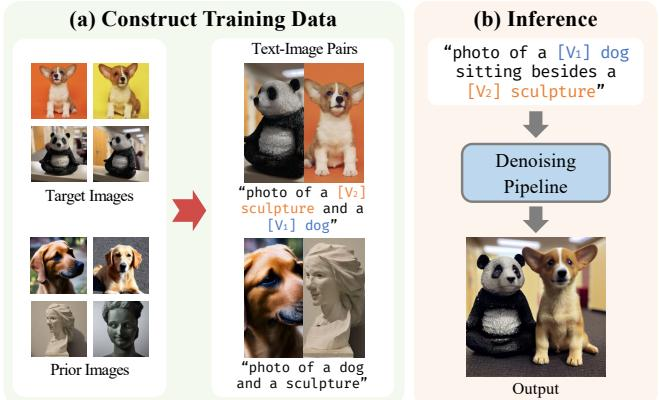  
Figure 3. Cut-Mix-Unmix data-augmentation for multi-subject generation. The figure shows the process of Cut-Mix-Unmix data augmentation for training a model to handle multiple concepts. The method involves manually constructing image-prompt pairs where the image is created using a CutMix-like data augmentation [76] and the corresponding prompt is written as, for example, “photo of a [V2] sculpture and a [V1] dog”. The prior preservation image-prompt pairs are created in a similar manner. The objective is to train the model to separate different concepts by presenting it with explicit mixed samples. During inference, a different prompt, such as “photo of a [V ] dog sitting besides a [V ] sculpture”.

where $( \mathbf { z } ^ { \ast } , \mathbf { c } ^ { \ast } )$ represents the target data-conditioning pairs that the model is being adapted to, and $( \mathbf { z } ^ { p r } , \mathbf { c } ^ { p r } )$ represents the prior data-conditioning pairs generated by the pretrained model. This loss function extends the one proposed by Model Rewriting [8] for GANs to the context of diffusion models, with the prior-preservation loss serving as the smoothing term. We set $\lambda = 0$ for single image editing.

Combining spectral shifts Moreover, the individually trained spectral shifts can be combined into a new model to create novel renderings. This can enable applications including interpolation, style mixing, or multi-subject generation (Fig. 8). Here we consider two common strategies, addition and interpolation. To add $\delta _ { 1 }$ and $\delta _ { 2 }$ into $\delta ^ { \prime }$

$$
\Sigma _ { \delta ^ { \prime } } = \mathrm { d i a g } ( \mathrm { R e L U } ( \pmb { \sigma } + \pmb { \delta } _ { 1 } + \pmb { \delta } _ { 2 } ) ) .\tag{4}
$$

For interpolation between two models with $0 \leq \alpha \leq 1$

$$
\Sigma _ { \pmb { \delta } ^ { \prime } } = \mathrm { d i a g } ( \mathrm { R e L U } ( \pmb { \sigma } + \alpha \pmb { \delta } _ { 1 } + ( 1 - \alpha ) \pmb { \delta } _ { 2 } ) ) .\tag{5}
$$

This allows for smooth transitions between models and the ability to interpolate between different image styles.

## 3.3. Cut-Mix-Unmix for Multi-Subject Generation

We discovered that when training the StableDiffusion [51] model with multiple concepts simultaneously (randomly choosing one concept at each data sampling iteration), the model tends to mix their styles when rendering them in one image for difficult compositions or subjects of similar categories [32] (as shown in Fig. 6). To explicitly guide the model not to mix personalized styles, we propose a simple technique called Cut-Mix-Unmix. By constructing and presenting the model with “correctly” cut-and-mixed image samples (as shown in Fig. 3), we instruct the model to unmix styles. In this method, we manually create CutMixlike [76] image samples and corresponding prompts (e.g. “photo of a [V1] dog on the left and a [V2] sculpture on the right” or “photo of a [V2] sculpture and a [V1] dog” as illustrated in Fig. 3). The prior loss samples are generated in a similar manner. During training, Cut-Mix-Unmix data augmentation is applied with a pre-defined probability (usually set to 0.6). This probability is not set to 1, as doing so would make it challenging for the model to differentiate between subjects. During inference, we use a different prompt from the one used during training, such as “a [V1] dog sitting beside a [V ] sculpture”. However, if the model overfits to the Cut-Mix-Unmix samples, it may generate samples with stitching artifacts even with a different prompt. We found that using negative prompts can sometimes alleviate these artifacts, as detailed in appendix.

We further present an extension to our fine-tuning approach by incorporating an “unmix” regularization on the cross-attention maps. This is motivated by our observation that in fine-tuned models, the dog’s special token attends largely to the panda’s region. To enforce separation between the two subjects, we use MSE on the non-corresponding regions of the cross-attention maps. This loss encourages the dog’s special token to focus solely on the dog and vice versa for the panda. The results of this extension show a significant reduction in stitching artifact. Details of the crossattention regularization are presented in the appendix.

## 3.4. Single-Image Editing

In this section, we present a framework for single image editing, by fine-tuning a diffusion model with an imageprompt pair. The procedure is outlined in Fig. 4. The desired edits can be obtained at inference time by modifying the prompt. For example, we fine-tune the model with the input image and text description “photo of a crown with a blue diamond and a golden eagle on $i t ^ { \prime \prime }$ , and at inference time if we want to remove the eagle, we simply sample from the fine-tuned model with text “photo ofa crown with a blue diamond on $i t ^ { \prime \prime }$ . To mitigate overfitting during finetuning, we use the spectral shift parameter space instead of full weights, reducing the risk of overfitting and language drifting. The trade-off between faithful reconstruction and editability, as discussed in [35], is acknowledged, and the purpose of employing SVDiff here is to allow more flexible edits rather than exact reconstructions.

For edits that do not require large structural changes (like repose, “standing” → “lying down” or “zoom in”), results can be improved with DDIM inversion [59]. Before sampling, we run DDIM inversion with classifier-free guidance [21] scale 1 conditioned on the target text prompt c and encode the input image $\mathbf { z } ^ { \ast }$ to a latent noise map,

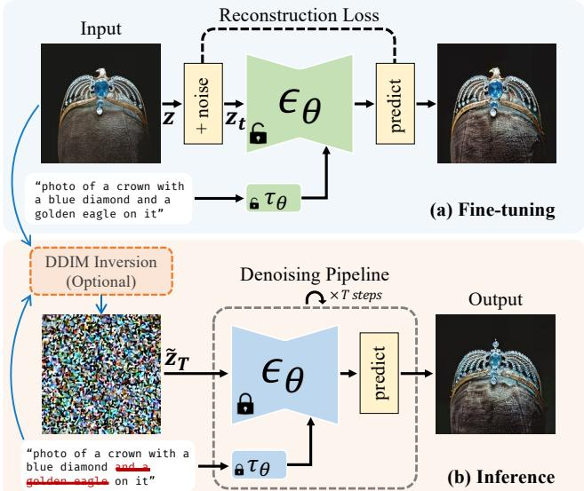  
Figure 4. Pipeline for single image editing with a text-to-image diffusion model. (a) The model is fine-tuned with a single imageprompt pair, where the prompt describes the input image without a special token. (b) During inference, desired edits are made by modifying the prompt. For edits with no significant structural changes, the use of DDIM inversion [59] has been shown to improve the editing quality.

$$
\mathbf z _ { T } = \mathrm { D D I M I n v e r t } ( \mathbf z ^ { * } , \mathbf c ; \theta ^ { \prime } ) ,\tag{6}
$$

(θ′ denotes the fine-tuned model parameters) from which the inference pipeline starts. As expected, large structural changes may still require more noise being injected in the denoising process. Here we consider two types of noise injection: i) setting $\eta > 0$ (as defined in DDIM [59], and ii) perturbing $\mathbf { z } _ { T }$ . For the latter, we interpolate between $\mathbf { z } _ { T }$ and a random noise $\epsilon \sim \mathcal { N } ( 0 , \mathbf { I } )$ with spherical linear interpolation [57, 59],

$$
\widetilde { \mathbf { z } } _ { T } = \mathrm { s l e r p } ( \alpha , \mathbf { z } _ { T } , \epsilon ) = \frac { \sin ( ( 1 - \alpha ) \phi ) } { \sin ( \phi ) } \mathbf { z } _ { T } + \frac { \sin ( \alpha \phi ) } { \sin ( \phi ) } \epsilon ,\tag{7}
$$

with $\phi = \operatorname { a r c c o s } \left( \cos ( \mathbf { z } _ { T } , \epsilon ) \right)$ . For more results and analysis, please see the experimental section.

Other approaches, such as Imagic [31], have been proposed to address overfitting and language drifting in finetuning-based single-image editing. Imagic fine-tunes the diffusion model on the input image and target text description, and then interpolates between the optimized and target text embedding to avoid overfitting. However, Imagic requires fine-tuning on each target text prompt at test time.

## 4. Experiment

The experiments evaluate SVDiff on various tasks such as single-/multi-subject generation, single image editing,

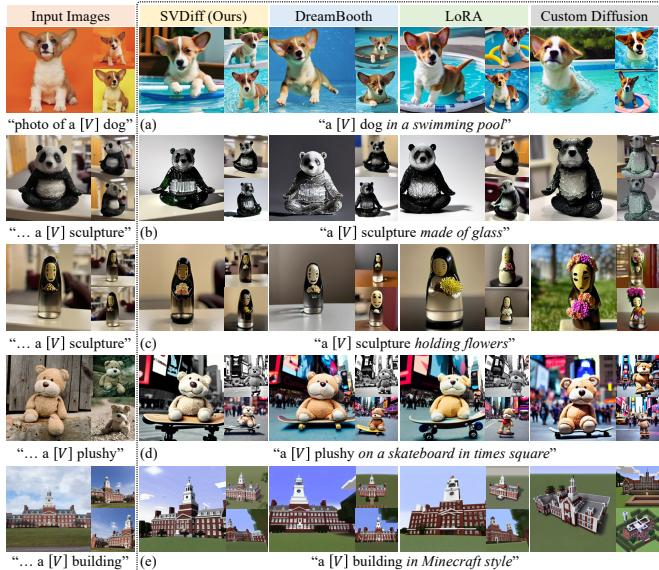  
Figure 5. Results for single subject generation. DreamBooth [52] and Custom Diffusion [32] are implemented in StableDiffusion with Diffusers library [69]. Each subfigure consists 3 samples: a large one on the left and 2 small one on the right. The text prompt under input images are used for training and the text prompt under sample images are used for inference. We observe that SVDiff performs similarly as DreamBooth, and preserves subject identities better than Custom Diffusion for row 2, 3, 5.

and ablations. The DDIM [59] sampler with η = 0 is used for all generated samples, unless specified otherwise.

## 4.1. Single-Subject Generation

In this section, we present the results of our proposed SVDiff for customized single-subject generation proposed in DreamBooth [52], which involves fine-tuning the pretrained text-to-image diffusion model on a single object or concept (using 3-5 images). The original DreamBooth was implemented on Imagen [53] and we conduct our experiments based on its StableDiffusion [51] implementation [75, 69]. We provide visual comparisons of 5 examples in Fig. 5. All baselines were trained for 500 or 1000 steps with batch size 1 (except for Custom Diffusion [32], which used a default batch size of 2), and the best model was selected for fair comparison. As Fig. 5 shows, SVDiff produces similar results to DreamBooth (which fine-tunes the full model weights) despite having a much smaller parameter space. Custom Diffusion, on the other hand, tends to underfit the training images as seen in rows 2, 3, and 5 of Fig. 5. We assess the text and image alignment in Fig. 9. The results show that the performance of SVDiff is similar to that of DreamBooth, while Custom Diffusion tends to underfit as seen from its position in the upper left corner.

## 4.2. Multi-Subject Generation

In this section, we present the multi-subject generation results to illustrate the advantage of our proposed “Cut-Mix-Unmix” data augmentation technique. When enabled, we perform Cut-Mix-Unmix data-augmentation with probability of 0.6 in each data sampling iteration and two subjects are randomly selected without replacement. A comparison between using “Cut-Mix-Unmix” (marked as “w/ Cut-Mix-Unmix”) and not using it (marked as “w/o Cut-Mix-Unmix”, performing augmentation with probability 0) are shown in Fig. 6. Each row of images are generated using the same text prompt displayed below the images. Note that the Cut-Mix-Unmix data augmentation technique is generic and can be applied to fine-tuning full weights as well.

To assess the visual quality of images generated using the “Cut-Mix-Unmix” method with either SVD or full weights, we conducted a user study using Amazon MTurk [1] with 400 generated image pairs . The participants were presented with an image pair generated using the same random seed, and were asked to identify the better image by answering the question, “Which image contains both objects from the two input images with a consistent background?” Each image pair was evaluated by 10 different raters, and the aggregated results showed that SVD was favored over full weights 60.9% of the time, with a standard deviation of 6.9%. More details and analysis will be provided in the appendix.

Additionally, we also conducted experiments that involve training on three concepts simultaneously. During training, we still construct Cut-Mix samples with probability 0.6 by randomly sample two subjects. Interestingly, we observe that for concepts that are already semantically wellseparated, e.g. “dog/building” or “sculpture/building”, the model can successfully generate desired results even without using Cut-Mix-Unmix. However, it fails to disentangle semantically more similar concepts, e.g. “dog/panda” as shown in Fig. 6-g.

## 4.3. Single Image Editing

In this section, we present results for the single image editing application. As depicted in Fig. 7, each row presents three edits with fine-tuning of both spectral shifts (marked as “Ours”) and full weights (marked as “Full”). The text prompts for the corresponding edited images are given below the images. The aim of this experiment is to demonstrate that regularizing the parameter space with spectral shifts effectively mitigates the language drift issue, as defined in [52] (the model overfits to a single image and loses its ability to generalize and perform desired edits).

As previously discussed, when DDIM inversion is not employed, fine-tuning with spectral shifts can lead to sometimes over-creative results. We show examples and comparisons of editing results with and without DDIM inver-

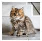

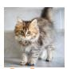

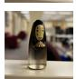  
(e)

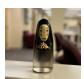  
(d)  
sculpture  
�" plushy  
�" sculpture  
Input Images  
�! plushy

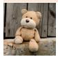

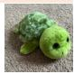

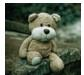

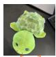

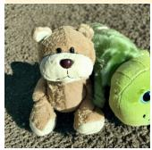  
(a)

SVD

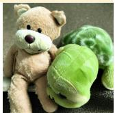

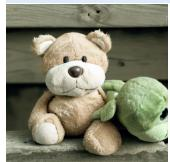

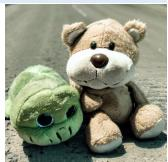

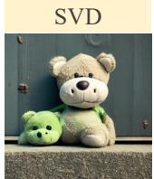  
“photo of a �! plushy sitting besides a �" plushy”

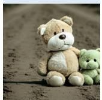

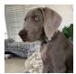

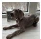

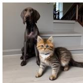  
�! dog  
�" cat

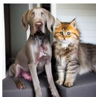

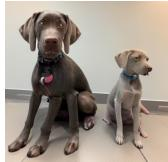

(b)

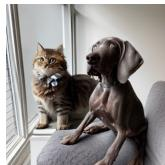

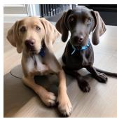

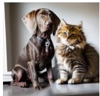

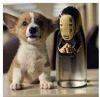  
“photo of a �! dog sitting besides a �" cat”

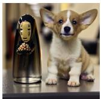

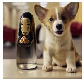

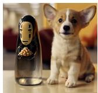

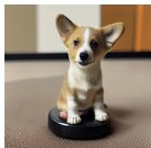  
“photo of a �! dog sitting besides a �" sculpture”

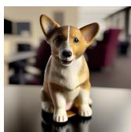

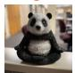

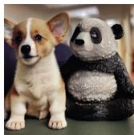

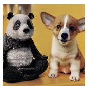

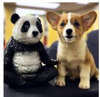

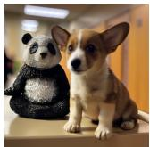

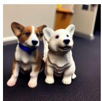  
“photo of a �! dog sitting besides a �" sculpture”

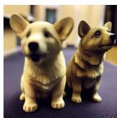

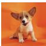

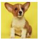  
�! dog

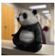

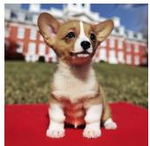

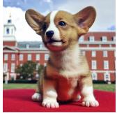

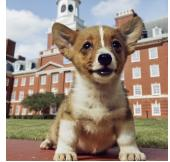

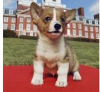

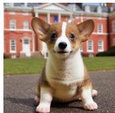  
“a �! dog in front of a �# building”

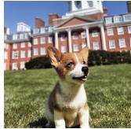  
�" sculpture

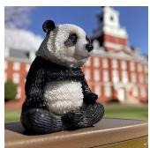

  
“a �" sculpture in front of a �# building”

  
�# building

  
(g)

  
“a �! dog sitting besides a �" sculpture in front of a �# building”

Figure 6. Results for multi-subject generation. (a-d) show the results of fine-tuning on two subjects and (e-g) show the results of fine-tuning on three subjects. Both full weight (“Full”) fine-tuning and SVDiff (“SVD”) can benefit from the Cut-Mix-Unmix dataaugmentation. Without Cut-Mix-Unmix, the model struggles to disentangle subjects of similar categories, as demonstrated in the last two columns of (a,b,c,d,g).

Ours  
Input Images  
  
(a)

Full  
  
“photo of a white green painted room with a bed, a lamp, and a picture on the wall”

  
(b)

  
“photo of a pink red chair with black legs”

(c)  

  
“photo of a yellow dog holding a yellow flower in mouth, with fence in background”

  
“photo of a green statue of liberty holding a golden red torch in hand”

  
Ours

Full  
  
Ours  
“photo of a white painted room with a bed, a lamp, and a picture on the wall”

  
“photo of a pink purple chair with black legs”  
“photo of a white painted empty room with …”

(d)  

  
“photo of a pink chair with black white legs”  
“photo of a yellow dog holding a yellow flower in mouth lying on the ground, with fence in background”

  
“photo of a yellow black dog holding a yellow flower in mouth, with fence in background”

  
“photo of a green statue of liberty holding a golden torch an apple in hand”

  
“photo of a grey purple Beetle car”  
“photo zoom in view of a green statue of liberty holding a golden torch in hand”

(e)  

  
“photo Watercolor painting of a  
grey Beetle car”

  
Benz car”

Figure 7. Results for single image editing. SVDiff (“Ours”) enables successful image edits despite slight misalignment with the original image. SVDiff performs desired modifications when full model fine-tuning (“Full”) fails, such as removing an object (2nd edit in (a)), adjusting pose (2nd edit in (c)), or zooming in (3rd edit in (d)). The backgrounds in some cases may be affected, however, the subject of the image remains well-preserved. For ours, we use DDIM inversion [59] for all edits in (a,c,e) and the first edit in (d).

sion [59] in the appendix. Our results show that DDIM inversion improves the editing quality and alignment with the input image for non-structural edits when using our spectral shift parameter space, but may worsen the results for full weight fine-tuning. For example, in Fig. 7, we use DDIM inversion for the edits in (a,c,e) and the first edit in (d). The second edit in (d) presents an interesting example where our method can actually make the statue hold an apple with its hand. Additionally, our fine-tuning approach still produces the desired edit of an empty room even with DDIM inversion, as seen in the third edit of Fig. 7-a. Overall, we see that SVDiff can still perform desired edits when full model fine-tuning exhibits language drift, i.e. it fails to remove the picture in the second edit of (a), change the pose of the dog in the second edit of (c), and zoom-in view in (d).

## 4.4. Analysis and Ablation

Due to space limitations, we present parameter subsets, weight combination, interpolation and style mixing analysis in this section and provide further analysis including rank, scaling, and correlation in the appendix.

Parameter subsets We explore the fine-tuning of spectral shifts within a subset of parameters in UNet. We consider 12 distinct subsets for our ablation study, as outlined in Tab. 1. Due to space limitations, we provide the visual samples and text-/image-alignment scores for each subset on 5 subjects in appendix. Our findings are as follows: (1) Optimizing the cross-attention (CA) layers generally results in better preservation of subject identity compared to optimizing key and value projections. (2) Optimizing the up-, down-, or mid-blocks of UNet alone is insufficient to maintain identity, which is why we did not further isolate subsets of each part. However, it appears that the up-blocks exhibit the best preservation of identity. (3) In terms of dimensionality, the 2D weights demonstrate the most influence, and offer better identity preservation than UNet-CA.

  
(a) “photo of a �! dog”

  
“photo of a �# sculpture”(b)

  
“photo of a �! dog in a(c) swimming pool”

  
“photo of a �# sculpture(d) in Minecraft style”

  
“a �! dog sitting besides(e)

  
“photo of a �" building”(f)

a �# sculpture”  
  
“photo of a �# sculpture” (g)

  
Minecraft style”

  
“a �# sculpture made of(i)  
glass”

  
“a �# sculpture in front(j)  
of a �" building”

Figure 8. Effects of combining spectral shifts $( \Sigma _ { \delta ^ { \prime } } = \mathrm { d i a g } ( \mathrm { R e L U } ( \pmb { \sigma } + \pmb { \delta } _ { 1 } + \pmb { \delta } _ { 2 } ) ) )$ ) and weight deltas $\left( W ^ { \prime } = W + \Delta W _ { 1 } + \Delta W _ { 2 } \right)$ in one model. The combined model retains individual subject features but may mix styles for similar subjects. The results also suggests that the task arithmetic property [25] of language models also holds in StableDiffusion.
<table><tr><td>Subset</td><td>SVDiff Parameters</td><td>Storage</td><td>Subset</td><td>SVDiff Parameters</td><td>Storage</td></tr><tr><td>UNet</td><td>all UNet layers</td><td>1404KB</td><td>Up-Blocks</td><td>up-blocks in UNet</td><td>789KB</td></tr><tr><td>UNet-CA</td><td>all CrossAttn layers in UNet</td><td>194KB</td><td>Down-Blocks</td><td>down-blocks in UNet</td><td>469KB</td></tr><tr><td>UNet-CA-KV</td><td>WK, WV in CrossAttn in UNet</td><td>84.8KB</td><td>Mid-Block</td><td>mid-blocks in UNet</td><td>135KB</td></tr><tr><td>UNet-1D</td><td>all 1-D weights in UNet</td><td>430KB</td><td>Up-CA</td><td>CrossAttn in up-blocks</td><td>106KB</td></tr><tr><td>UNet-2D</td><td>all 2-D weights in UNet</td><td>617KB</td><td>Down-CA</td><td>CrossAttn in down-blocks</td><td>70.4KB</td></tr><tr><td>UNet-4D</td><td>all 4-D weights in UNet</td><td>355KB</td><td>Mid-CA</td><td>CrossAttn in mid-block</td><td>17.7KB</td></tr></table>

Table 1. Fine-tuning 12 subsets of parameters in UNet, along with their corresponding model sizes.

  
(a) Correlations of Spectral Shifts  
(b) Text- and Image-Alignment Scores

  
Figure 9. (a) Correlation of individually learned spectral shifts for different subjects. The cosine similarities between the spectral shifts of two subjects are averaged across all layers and plotted. The diagonal shows average similarities between two runs with different learning rates. (b) Text- and image-alignment for singlesubject generation. The generated image is denoted as x˜. The text-alignment is measured by the CLIP score [46, 12] cos(x˜, c), and the image-alignment is defined as $1 - \mathcal { L } _ { \mathrm { L P I P S } } \big ( \tilde { \mathbf { x } } , \mathbf { x } ^ { * } \big )$ [78].

  
Figure 10. Style-Mixing results with SVDiff. Following Extended Textual Inversion [70], we utilize spectral shifts in layer (16, down’, 1) - (8, down’, 0) to provide geometry information, while the remaining layers contribute to the appearance.

Weight combination We analyze the effects of weight combination by Eq. (4). Fig. 8 shows a comparison between combining only spectral shifts (marked in “SVD”) and combining the full weights (marked in “Full”). The combined model in both cases retains unique features for individual subjects, but may blend their styles for similar concepts (as seen in (e)). For dissimilar concepts (such as the $[ V _ { 2 } ]$ sculpture and $\left[ V _ { 3 } \right]$ building in (j)), the models can still produce separate representations of each subject. Interestingly, combining full weight deltas can sometimes result in better preservation of individual concepts, as seen in the clear building feature in (j). We posit that this is due to the fact that SVDiff limits update directions to the eigenvectors, which are identical for different subjects. As a result, summing individually trained spectral shifts tends to create more “interference” than summing full weight deltas.

  
Figure 11. Effects of interpolating spectral shifts or full weights.

Style transfer and mixing A simple and straightforward way to enable style-mixing is to combine individually trained spectral shifts using Eq. (4) and inference with the combined model. We show visual examples of this strategy in appendix and further explore a more challenging and controllable approach for style-mixing as follows. Inspired by the disentangling property observed in StyleGAN [30], we hypothesize that a similar property applies in our context. Following Extended Textual Inversion (XTI [70]), we conducted a style mixing experiment, as illustrated in Fig. 10. For this experiment, we fine-tuned SVDiff on the UNet-2D subset and employed the geometry information provided by $( { \bf \nabla } 1 6 , ~ \mathrm { d o w n } ^ { \prime } , ~ { \bf \nabla } 1 ) ~ - ~ ( { \bf \nabla } 8 $ down’, 0) (as described in XTI, Section 8.1). We observe that our spectral shift parameter space allows us to achieve a similar disentangled style-mixing effect, comparable to the P+ space in XTI.

Interpolation Fig. 11 shows the results of weight interpolation for both spectral shifts and full weights. The models are marked as “SVD” and “Full”, respectively. The first two rows of the figure demonstrate interpolating between two different classes, such as “dog” and “sculpture”, using the same abstract class word “thing” for training. Each column shows the sample from α-interpolated models. For spectral shifts $\mathrm { ( ^ { 6 6 } S V D ^ { , 9 } ) }$ , we use Eq. (5) and for full weights, we use $W ^ { \prime } = W + \alpha \Delta W _ { 1 } + ( 1 - \alpha ) \Delta W _ { 2 } = \alpha W _ { 1 } + ( 1 - \alpha ) W _ { 2 }$ . The images in each row are generated using the same random seed with the deterministic DDIM sampler [59] $( \eta = 0 )$ . As seen from the results, both spectral shift and full weight interpolation are capable of generating intermediate concepts between the two original classes.

## 4.5. Comparison with LoRA

In our comparison of SVDiff and LoRA [14, 22] for single image editing, we find that while LoRA tends to underfit, SVDiff provides a balanced trade-off between faithfulness and realism. Additionally, SVDiff results in a significantly smaller delta checkpoint size, being 1/2 to 1/3 that of LoRA. However, in cases where the model requires extensive fine-tuning or learning of new concepts, LoRA’s flexibility to adjust its capability by changing the rank may be beneficial. Further research is needed to explore the potential benefits of combining these approaches. A comparison can be found in the appendix.

It is noteworthy that, with rank one, the storage and update requirements for the W matrix of shape $M \times N$ in SVDiff are min(M, N) floats, compared to $( M + N )$ floats for LoRA. This may be useful for amortizing or developing training-free approaches for DreamBooth [52]. Additionally, exploring functional forms [65, 66] of spectral shifts is an interesting avenue for future research.

## 5. Conclusion and Limitation

In conclusion, we have proposed a compact parameter space, spectral shift, for diffusion model fine-tuning. The results of our experiments show that fine-tuning in this parameter space achieves similar or even better results compared to full weight fine-tuning in both single- and multisubject generation. Our proposed Cut-Mix-Unmix dataaugmentation technique also improves the quality of multisubject generation, making it possible to handle cases where subjects are of similar categories. Additionally, spectral shift serves as a regularization method, enabling new use cases like single image editing.

Limitations Our method has certain limitations, including the decrease in performance of Cut-Mix-Unmix as more subjects are added and the possibility of an inadequatelypreserved background in single image editing. Despite these limitations, we see great potential in our approach for fine-tuning diffusion models and look forward to exploring its capabilities further in future research, such as combining spectral shifts with LoRA or developing training-free approaches for fast personalizing concepts.

Acknowledgments This research has been partially funded by research grants to D. Metaxas through NSF: IUCRC CARTA 1747778, 2235405, 2212301, 1951890, 2003874, and NIH-5R01HL127661.

## References

[1] Amazon mechanical turk. https://www.mturk.com/, 2005. 5

[2] Omri Avrahami, Ohad Fried, and Dani Lischinski. Blended latent diffusion. arXiv preprint arXiv:2206.02779, 2022. 2

[3] Omri Avrahami, Dani Lischinski, and Ohad Fried. Blended diffusion for text-driven editing of natural images. In Proceedings of the IEEE/CVF Conference on Computer Vision and Pattern Recognition, pages 18208–18218, 2022. 2

[4] Yogesh Balaji, Seungjun Nah, Xun Huang, Arash Vahdat, Jiaming Song, Karsten Kreis, Miika Aittala, Timo Aila, Samuli Laine, Bryan Catanzaro, et al. ediffi: Text-to-image diffusion models with an ensemble of expert denoisers. arXiv preprint arXiv:2211.01324, 2022. 2

[5] Arpit Bansal, Hong-Min Chu, Avi Schwarzschild, Soumyadip Sengupta, Micah Goldblum, Jonas Geiping, and Tom Goldstein. Universal guidance for diffusion models. arXiv preprint arXiv:2302.07121, 2023. 2

[6] Fan Bao, Shen Nie, Kaiwen Xue, Yue Cao, Chongxuan Li, Hang Su, and Jun Zhu. All are worth words: A vit backbone for diffusion models. In CVPR, 2023. 2

[7] Fan Bao, Shen Nie, Kaiwen Xue, Chongxuan Li, Shi Pu, Yaole Wang, Gang Yue, Yue Cao, Hang Su, and Jun Zhu. One transformer fits all distributions in multi-modal diffusion at scale. ICML, 2023. 2

[8] David Bau, Steven Liu, Tongzhou Wang, Jun-Yan Zhu, and Antonio Torralba. Rewriting a deep generative model. In European conference on computer vision, pages 351–369. Springer, 2020. 3

[9] Manuel Brack, Patrick Schramowski, Felix Friedrich, Dominik Hintersdorf, and Kristian Kersting. The stable artist: Steering semantics in diffusion latent space. arXiv preprint arXiv:2212.06013, 2022. 2

[10] Huiwen Chang, Han Zhang, Jarred Barber, AJ Maschinot, Jose Lezama, Lu Jiang, Ming-Hsuan Yang, Kevin Murphy, William T Freeman, Michael Rubinstein, et al. Muse: Text-to-image generation via masked generative transformers. arXiv preprint arXiv:2301.00704, 2023. 2

[11] Wenhu Chen, Hexiang Hu, Yandong Li, Nataniel Rui, Xuhui Jia, Ming-Wei Chang, and William W Cohen. Subject-driven text-to-image generation via apprenticeship learning. arXiv preprint arXiv:2304.00186, 2023. 2

[12] Yuxiao Chen, Jianbo Yuan, Yu Tian, Shijie Geng, Xinyu Li, Ding Zhou, Dimitris N Metaxas, and Hongxia Yang. Revisiting multimodal representation in contrastive learning: from patch and token embeddings to finite discrete tokens. arXiv preprint arXiv:2303.14865, 2023. 8

[13] Anton Cherepkov, Andrey Voynov, and Artem Babenko. Navigating the gan parameter space for semantic image editing. In Proceedings of the IEEE/CVF conference on computer vision and pattern recognition, pages 3671–3680, 2021. 2, 3

[14] cloneofsimo. cloneofsimo/lora: Low-rank adaptation for fast text-to-image diffusion fine-tuning. https://github. com/cloneofsimo/lora. 2, 9

[15] CompVis. Compvis/stable-diffusion. https://github. com/CompVis/stable-diffusion. 2

[16] Rinon Gal, Yuval Alaluf, Yuval Atzmon, Or Patashnik, Amit H Bermano, Gal Chechik, and Daniel Cohen-Or. An image is worth one word: Personalizing text-toimage generation using textual inversion. arXiv preprint arXiv:2208.01618, 2022. 1, 2

[17] Rinon Gal, Moab Arar, Yuval Atzmon, Amit H Bermano, Gal Chechik, and Daniel Cohen-Or. Designing an encoder for fast personalization of text-to-image models. arXiv preprint arXiv:2302.12228, 2023. 2

[18] Shuyang Gu, Dong Chen, Jianmin Bao, Fang Wen, Bo Zhang, Dongdong Chen, Lu Yuan, and Baining Guo. Vector quantized diffusion model for text-to-image synthesis. In Proceedings of the IEEE/CVF Conference on Computer Vision and Pattern Recognition, pages 10696–10706, 2022. 2

[19] Jonathan Ho, Ajay Jain, and Pieter Abbeel. Denoising diffusion probabilistic models. Advances in Neural Information Processing Systems, 33:6840–6851, 2020. 1, 2

[20] Jonathan Ho, Chitwan Saharia, William Chan, David J Fleet, Mohammad Norouzi, and Tim Salimans. Cascaded diffusion models for high fidelity image generation. J. Mach. Learn. Res., 23:47–1, 2022. 1

[21] Jonathan Ho and Tim Salimans. Classifier-free diffusion guidance. In NeurIPS 2021 Workshop on Deep Generative Models and Downstream Applications, 2021. 4

[22] Edward J Hu, Yelong Shen, Phillip Wallis, Zeyuan Allen-Zhu, Yuanzhi Li, Shean Wang, Lu Wang, and Weizhu Chen. Lora: Low-rank adaptation of large language models. arXiv preprint arXiv:2106.09685, 2021. 1, 9

[23] Lianghua Huang, Di Chen, Yu Liu, Yujun Shen, Deli Zhao, and Jingren Zhou. Composer: Creative and controllable image synthesis with composable conditions. arXiv preprint arXiv:2302.09778, 2023. 2

[24] Ziqi Huang, Tianxing Wu, Yuming Jiang, Kelvin C.K. Chan, and Ziwei Liu. ReVersion: Diffusion-based relation inversion from images. arXiv preprint arXiv:2303.13495, 2023. 2

[25] Gabriel Ilharco, Marco Tulio Ribeiro, Mitchell Wortsman, Suchin Gururangan, Ludwig Schmidt, Hannaneh Hajishirzi, and Ali Farhadi. Editing models with task arithmetic. arXiv preprint arXiv:2212.04089, 2022. 8

[26] Shir Iluz, Yael Vinker, Amir Hertz, Daniel Berio, Daniel Cohen-Or, and Ariel Shamir. Word-as-image for semantic typography. arXiv preprint arXiv:2303.01818, 2023. 2

[27] Xuhui Jia, Yang Zhao, Kelvin CK Chan, Yandong Li, Han Zhang, Boqing Gong, Tingbo Hou, Huisheng Wang, and Yu-Chuan Su. Taming encoder for zero fine-tuning image customization with text-to-image diffusion models. arXiv preprint arXiv:2304.02642, 2023. 2

[28] Jindong Jiang, Fei Deng, Gautam Singh, and Sungjin Ahn. Object-centric slot diffusion. arXiv preprint arXiv:2303.10834, 2023. 2

[29] Ruixiang Jiang, Can Wang, Jingbo Zhang, Menglei Chai, Mingming He, Dongdong Chen, and Jing Liao. Avatarcraft: Transforming text into neural human avatars with parameterized shape and pose control. arXiv preprint arXiv:2303.17606, 2023. 2

[30] Tero Karras, Samuli Laine, Miika Aittala, Janne Hellsten, Jaakko Lehtinen, and Timo Aila. Analyzing and improving the image quality of stylegan. In Proceedings of the IEEE/CVF Conference on Computer Vision and Pattern Recognition, pages 8110–8119, 2020. 9

[31] Bahjat Kawar, Shiran Zada, Oran Lang, Omer Tov, Huiwen Chang, Tali Dekel, Inbar Mosseri, and Michal Irani. Imagic: Text-based real image editing with diffusion models. arXiv preprint arXiv:2210.09276, 2022. 1, 2, 4

[32] Nupur Kumari, Bingliang Zhang, Richard Zhang, Eli Shechtman, and Jun-Yan Zhu. Multi-concept customization of text-to-image diffusion. Proceedings of the IEEE/CVF Conference on Computer Vision and Pattern Recognition (CVPR), 2023. 1, 2, 3, 5

[33] Nan Liu, Shuang Li, Yilun Du, Antonio Torralba, and Joshua B Tenenbaum. Compositional visual generation with composable diffusion models. In Computer Vision–ECCV 2022: 17th European Conference, Tel Aviv, Israel, October 23–27, 2022, Proceedings, Part XVII, pages 423–439. Springer, 2022. 2

[34] Zhiheng Liu, Ruili Feng, Kai Zhu, Yifei Zhang, Kecheng Zheng, Yu Liu, Deli Zhao, Jingren Zhou, and Yang Cao. Cones: Concept neurons in diffusion models for customized generation. arXiv preprint arXiv:2303.05125, 2023. 2

[35] Chenlin Meng, Yang Song, Jiaming Song, Jiajun Wu, Jun-Yan Zhu, and Stefano Ermon. Sdedit: Image synthesis and editing with stochastic differential equations. arXiv preprint arXiv:2108.01073, 2021. 4

[36] Sangwoo Mo, Minsu Cho, and Jinwoo Shin. Freeze the discriminator: a simple baseline for fine-tuning gans. arXiv preprint arXiv:2002.10964, 2020. 1

[37] Ron Mokady, Amir Hertz, Kfir Aberman, Yael Pritch, and Daniel Cohen-Or. Null-text inversion for editing real images using guided diffusion models. arXiv preprint arXiv:2211.09794, 2022. 1, 2

[38] Chong Mou, Xintao Wang, Liangbin Xie, Jian Zhang, Zhongang Qi, Ying Shan, and Xiaohu Qie. T2i-adapter: Learning adapters to dig out more controllable ability for text-to-image diffusion models. arXiv preprint arXiv:2302.08453, 2023. 2

[39] Alex Nichol, Prafulla Dhariwal, Aditya Ramesh, Pranav Shyam, Pamela Mishkin, Bob McGrew, Ilya Sutskever, and Mark Chen. Glide: Towards photorealistic image generation and editing with text-guided diffusion models. arXiv preprint arXiv:2112.10741, 2021. 2

[40] Alexander Quinn Nichol and Prafulla Dhariwal. Improved denoising diffusion probabilistic models. In International Conference on Machine Learning, pages 8162–8171. PMLR, 2021. 2

[41] Atsuhiro Noguchi and Tatsuya Harada. Image generation from small datasets via batch statistics adaptation. In Proceedings of the IEEE/CVF International Conference on Computer Vision, pages 2750–2758, 2019. 1

[42] Hadas Orgad, Bahjat Kawar, and Yonatan Belinkov. Editing implicit assumptions in text-to-image diffusion models. arXiv preprint arXiv:2303.08084, 2023. 2

[43] Gaurav Parmar, Krishna Kumar Singh, Richard Zhang, Yijun Li, Jingwan Lu, and Jun-Yan Zhu. Zero-shot image-to-image translation. arXiv preprint arXiv:2302.03027, 2023. 2

[44] William Peebles and Saining Xie. Scalable diffusion models with transformers. arXiv preprint arXiv:2212.09748, 2022. 2

[45] Ben Poole, Ajay Jain, Jonathan T Barron, and Ben Mildenhall. Dreamfusion: Text-to-3d using 2d diffusion. arXiv preprint arXiv:2209.14988, 2022. 2

[46] Alec Radford, Jong Wook Kim, Chris Hallacy, Aditya Ramesh, Gabriel Goh, Sandhini Agarwal, Girish Sastry, Amanda Askell, Pamela Mishkin, Jack Clark, et al. Learning transferable visual models from natural language supervision. In International Conference on Machine Learning, pages 8748–8763. PMLR, 2021. 8

[47] Aditya Ramesh, Prafulla Dhariwal, Alex Nichol, Casey Chu, and Mark Chen. Hierarchical text-conditional image generation with clip latents. arXiv preprint arXiv:2204.06125, 2022. 1, 2

[48] Sylvestre-Alvise Rebuffi, Hakan Bilen, and Andrea Vedaldi. Learning multiple visual domains with residual adapters. Advances in neural information processing systems, 30, 2017. 1

[49] Mengwei Ren, Mauricio Delbracio, Hossein Talebi, Guido Gerig, and Peyman Milanfar. Image deblurring with domain generalizable diffusion models. arXiv preprint arXiv:2212.01789, 2022. 2

[50] Esther Robb, Wen-Sheng Chu, Abhishek Kumar, and Jia-Bin Huang. Few-shot adaptation of generative adversarial networks. arXiv preprint arXiv:2010.11943, 2020. 1, 2, 3

[51] Robin Rombach, Andreas Blattmann, Dominik Lorenz, Patrick Esser, and Bjorn Ommer. High-resolution image¨ synthesis with latent diffusion models. In Proceedings of the IEEE/CVF Conference on Computer Vision and Pattern Recognition (CVPR), pages 10684–10695, June 2022. 1, 2, 3, 5

[52] Nataniel Ruiz, Yuanzhen Li, Varun Jampani, Yael Pritch, Michael Rubinstein, and Kfir Aberman. Dreambooth: Fine tuning text-to-image diffusion models for subject-driven generation. arXiv preprint arXiv:2208.12242, 2022. 1, 2, 3, 5, 9

[53] Chitwan Saharia, William Chan, Saurabh Saxena, Lala Li, Jay Whang, Emily Denton, Seyed Kamyar Seyed Ghasemipour, Burcu Karagol Ayan, S Sara Mahdavi, Rapha Gontijo Lopes, et al. Photorealistic text-to-image diffusion models with deep language understanding. arXiv preprint arXiv:2205.11487, 2022. 1, 2, 5

[54] Yujun Shen and Bolei Zhou. Closed-form factorization of latent semantics in gans. In Proceedings of the IEEE/CVF Conference on Computer Vision and Pattern Recognition, pages 1532–1540, 2021. 3

[55] Jing Shi, Wei Xiong, Zhe Lin, and Hyun Joon Jung. Instantbooth: Personalized text-to-image generation without testtime finetuning. arXiv preprint arXiv:2304.03411, 2023. 2

[56] Chaehun Shin, Heeseung Kim, Che Hyun Lee, Sang-gil Lee, and Sungroh Yoon. Edit-a-video: Single video editing with object-aware consistency. arXiv preprint arXiv:2303.07945, 2023. 2

[57] Ken Shoemake. Animating rotation with quaternion curves. In Proceedings of the 12th annual conference on Computer graphics and interactive techniques, pages 245–254, 1985. 4

[58] Jascha Sohl-Dickstein, Eric Weiss, Niru Maheswaranathan, and Surya Ganguli. Deep unsupervised learning using nonequilibrium thermodynamics. In International Conference on Machine Learning, pages 2256–2265. PMLR, 2015. 2

[59] Jiaming Song, Chenlin Meng, and Stefano Ermon. Denoising diffusion implicit models. In International Conference on Learning Representations, 2021. 2, 4, 5, 7, 9

[60] Yang Song, Prafulla Dhariwal, Mark Chen, and Ilya Sutskever. Consistency models. arXiv preprint arXiv:2303.01469, 2023. 2

[61] Yang Song and Stefano Ermon. Generative modeling by estimating gradients of the data distribution. Advances in Neural Information Processing Systems, 32, 2019. 2

[62] Yang Song, Jascha Sohl-Dickstein, Diederik P Kingma, Abhishek Kumar, Stefano Ermon, and Ben Poole. Score-based generative modeling through stochastic differential equations. arXiv preprint arXiv:2011.13456, 2020. 2

[63] Xuan Su, Jiaming Song, Chenlin Meng, and Stefano Ermon. Dual diffusion implicit bridges for image-to-image translation. In International Conference on Learning Representations, 2022. 2

[64] Yanpeng Sun, Qiang Chen, Xiangyu He, Jian Wang, Haocheng Feng, Junyu Han, Errui Ding, Jian Cheng, Zechao Li, and Jingdong Wang. Singular value fine-tuning: Fewshot segmentation requires few-parameters fine-tuning. In Advances in Neural Information Processing Systems, 2022. 1, 2

[65] Hossein Talebi and Peyman Milanfar. Global image denoising. IEEE Transactions on Image Processing, 23(2):755– 768, 2013. 9

[66] Hossein Talebi and Peyman Milanfar. Nonlocal image editing. IEEE Transactions on Image Processing, 23(10):4460– 4473, 2014. 9

[67] Zhengzhong Tu, Hossein Talebi, Han Zhang, Feng Yang, Peyman Milanfar, Alan Bovik, and Yinxiao Li. Maxvit: Multi-axis vision transformer. In Computer Vision–ECCV 2022: 17th European Conference, Tel Aviv, Israel, October 23–27, 2022, Proceedings, Part XXIV, pages 459–479. Springer, 2022. 2

[68] Narek Tumanyan, Michal Geyer, Shai Bagon, and Tali Dekel. Plug-and-play diffusion features for textdriven image-to-image translation. arXiv preprint arXiv:2211.12572, 2022. 2

[69] Patrick von Platen, Suraj Patil, Anton Lozhkov, Pedro Cuenca, Nathan Lambert, Kashif Rasul, Mishig Davaadorj, and Thomas Wolf. Diffusers: State-of-the-art diffusion models. https://github.com/huggingface/ diffusers, 2022. 2, 5

[70] Andrey Voynov, Qinghao Chu, Daniel Cohen-Or, and Kfir Aberman. p+: Extended textual conditioning in text-toimage generation. arXiv preprint arXiv:2303.09522, 2023. 8, 9

[71] Bram Wallace, Akash Gokul, Stefano Ermon, and Nikhi Naik. End-to-end diffusion latent optimization improves classifier guidance. arXiv preprint arXiv:2303.13703, 2023. 2

[72] Bram Wallace, Akash Gokul, and Nikhil Naik. Edict: Exact diffusion inversion via coupled transformations. arXiv preprint arXiv:2211.12446, 2022. 2

[73] Yuxiang Wei, Yabo Zhang, Zhilong Ji, Jinfeng Bai, Lei Zhang, and Wangmeng Zuo. Elite: Encoding visual concepts into textual embeddings for customized text-to-image generation. arXiv preprint arXiv:2302.13848, 2023. 2

[74] Jay Zhangjie Wu, Yixiao Ge, Xintao Wang, Weixian Lei, Yuchao Gu, Wynne Hsu, Ying Shan, Xiaohu Qie, and Mike Zheng Shou. Tune-a-video: One-shot tuning of image diffusion models for text-to-video generation. arXiv preprint arXiv:2212.11565, 2022. 2

[75] Xavierxiao. Xavierxiao/dreambooth-stable-diffusion: Implementation of dreambooth with stable diffusion. https://github.com/XavierXiao/ Dreambooth-Stable-Diffusion. 5

[76] Sangdoo Yun, Dongyoon Han, Seong Joon Oh, Sanghyuk Chun, Junsuk Choe, and Youngjoon Yoo. Cutmix: Regularization strategy to train strong classifiers with localizable features. In Proceedings ofthe IEEE/CVF international conference on computer vision, pages 6023–6032, 2019. 3, 4

[77] Lvmin Zhang and Maneesh Agrawala. Adding conditional control to text-to-image diffusion models. arXiv preprint arXiv:2302.05543, 2023. 2

[78] Richard Zhang, Phillip Isola, Alexei A Efros, Eli Shechtman, and Oliver Wang. The unreasonable effectiveness of deep features as a perceptual metric. In Proceedings of the IEEE conference on computer vision and pattern recognition, pages 586–595, 2018. 8

[79] Zhixing Zhang, Ligong Han, Arnab Ghosh, Dimitris Metaxas, and Jian Ren. Sine: Single image editing with text-to-image diffusion models. arXiv preprint arXiv:2212.04489, 2022. 1, 2