# Saliency Regularization for Self-Training with Partial Annotations

Shouwen Wang1 Qian Wan2 Xiang Xiang1\* Zhigang Zeng1

1School of Artificial Intelligence and Automation, Huazhong University of Science and Technology;

Key Laboratory of Image Processing and Intelligent Control, Ministry of Education

2Wuhan Research Institute of Posts and Telecommunications

1{shouwen hust, xex, zgzeng}@hust.edu.cn 2w252086746@gmail.com

## Abstract

Partially annotated images are easy to obtain in multilabel classification. However, unknown labels in partially annotated images exacerbate the positive-negative imbalance inherent in multi-label classification, which affects supervised learning of known labels. Most current methods require sufficient image annotations, and do not focus on the imbalance of the labels in the supervised training phase. In this paper, we propose saliency regularization (SR) for a novel self-training framework. In particular, we model saliency on the class-specific maps, and strengthen the saliency of object regions corresponding to the present labels. Besides, we introduce consistency regularization to mine unlabeled information to complement unknown labels with the help of SR. It is verified to alleviate the negative dominance caused by the imbalance, and achieve state-ofthe-art performance on Pascal VOC 2007, MS-COCO, VG-200, and OpenImages V3.

## 1. Introduction

The multi-label classification task is a practical vision task that has received much attention. It is widely used in applications such as image retrieval and recommendation systems. In recent years, significant progress has been made in multi-label classification with the development of deep neural networks [20, 30, 15, 11]. These efforts benefit from network structure construction [35, 7, 8] and optimization function design [38, 28, 14]. Meanwhile, the excellent performance of a model is inseparable from a large-scale and high-quality dataset. However, as the number of samples and semantic concepts increases significantly, annotating all possible labels for each image is very difficult. Thus, annotating a large-scale multi-label benchmark with full labels is very laborious and time-consuming, which poses challenges for multi-label classification. Collecting a partially annotated multi-label dataset is an alternative and feasible strategy to solve the problem. For a partially annotated image, a small subset of its labels is annotated by positive and negative labels, and the rest labels are unknown. Partial labeling saves time and labor costs considerably. This paper focuses on how to learn deep neural network models on multi-label datasets with partial labels.

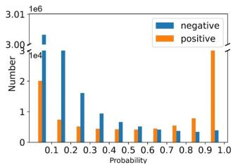  
(a)

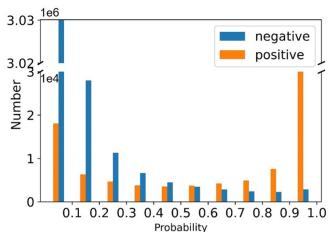  
(b)  
Figure 1. Probability distribution of prediction on the MS-COCO validation set from ResNet101 trained by BCE with (a) 10%, and (b) 50% known labels on its training set. The y-axis represents the number of all class ground-truths in each probability interval. The positive-negative ratio of samples is same in the training sets with different known proportions. It is obviously observed that the number of misclassified positive labels in the interval [0, 0.5] is significantly higher when 10% known labels.

To simplify the classification problem of partial labeling, unknown labels are ignored or treated as negative labels [32, 17]. However, the mode of ignoring unknown labels leads to higher entropy of unlabeled data and weakens the generalization of the trained model. Treating unknown labels as negative may reduce the entropy of unlabeled data, which also introduces label noise into model training. The self-training (ST) framework is proposed to deal with the problems of generalization and label noise. Known labels are utilized for training a model first, then the trained model is used to generate pseudo-labels for unknown labels, and at last, the model is trained by all labels again. The works [12, 16, 6] exploit known labels to supervise training and mine label correlations or instance similarities to complement the unknown labels. The method [1] is based on class distribution estimated by the trained model and label likelihood to select negative pseudo-labels for unknown labels. These methods achieve remarkable performance in settings with large proportions (e.g., >50%) of known labels. However, it is hard to capture label correlation and instance similarity when the proportion of known labels is small (e.g., <30%) for the works [12, 16, 6]. The number of positive labels is small in a low known proportion (e.g., 10%), and the increase of negative pseudo-labels may exacerbate the positive-negative imbalance of samples for the work [1].

Supervised learning with limited known labels, especially low known proportions, is important for self-training. It determines the direction of model optimization and affects the reliability of the generated pseudo-labels. The known labels of each image in the training set contain fewer positive labels and more negative labels, thus the classifier of each class excels at classifying negative samples rather than positive samples. As shown in both Fig. 1a and Fig. 1b, negative samples are misclassified much less than positive samples. Meanwhile, the error rate of positive samples is higher in a low known proportion under the same positivenegative ratio, namely, more unknown labels exacerbate the imbalance in Fig. 1. The imbalance of label level makes the spatial object regions of the present labels get less attention, namely, the activation outputs of the object regions are suppressed. Few works [1, 41] focus on the positivenegative imbalance of the label level to improve supervised learning. Through increasing the saliency of object regions corresponding to the present labels at the spatial level, we alleviate the negative dominance caused by the imbalance.

In this work, we design a novel ST framework based on saliency regularization (SR), including supervised and unsupervised learning modules. We model the saliency on the class-specific maps (CSM). To alleviate the negative dominance, we boil down an optimization problem about strengthening the saliency of object regions corresponding to the present labels. We transform the optimization problem into a regularization of logit space and prove that such an operation can address the imbalance of easy and hard samples. We introduce consistency regularization (CR) to mine unlabeled information. SR will enlarge the probabilities of possible positive labels from the weak augmentation of an image, which helps to complement the unknown labels for its strong augmentation. Our contributions can be summarized as 1) We build a novel end-to-end ST framework, which introduces CR to eliminate the restrictions of pre-trained models and improves supervised learning to adapt the model to different known label proportions. 2) We propose SR to mitigate the negative dominance during training, which is also verified to address the imbalance of easy and hard samples. 3) Extensive experiments conducted in simulated and real multi-label datasets show that our method alleviates the negative dominance and achieves state-of-the-art (SOTA) performance.

## 2. Related Work

Conventional methods. Due to the difficulty of annotating multi-label data, the task of multi-label classification with partial labels is getting more attention. Some early works [33, 3, 36] design an independent binary classifier for each class or treat unknown labels as negative labels. However, these methods ignore correlations between labels and between instances, and are more likely to introduce false negative. Correlations are the key points for multi-label classification, thus several works are proposed to model correlations of known labels to transfer information to unknown labels. Low-rank regularization [39, 40] on the label matrix is exploited to describe label-label correlations implicitly. FastTag [4], and SSWL [10] learn a linear transformation on the known label matrix for label-label correlations to reconstruct the complete labels. A mixed graph [37] is used to construct a network of label dependencies, which is associated with instance similarity, class co-occurrence, and semantic hierarchy. Probabilistic models utilize dependencies of latent variables to implicitly build relationships between labels. [18] based on Bayesian networks, and [9] based on sequential generative model exploit posterior inference to predict unknown labels, where unknown labels are treated as latent variables. It is difficult to integrate these methods with deep neural networks to fine-tune the model.

Deep learning methods. Deep neural network models for partial annotations are gradually being proposed. Durand et al. [12] proposes the partial-BCE loss normalized by the proportion of known labels to perform supervised training, and introduce a Graph Neural Network (GNN) to model the correlations between the categories. The pre-trained model generates pseudo-labels through the curriculum learning strategy. In [21], the image and label similarities based on features from the pre-trained model are mined to measure the closeness between each unknown label and annotated label. According to the closeness, pseudo-labels are assigned for the unknown labels. As revealed in an interactive learning framework proposed by Huynh et al. [16], CNN training and similarity learning of labels and images alternate with each other and jointly promote model optimization. Similarity learning provides pseudo-labels of unknown labels for CNN training. Structured semantic transfer [6] learns within-image label co-occurrence relationships and crossimage feature similarities to generate pseudo-labels for unknown labels. Decoupling semantic-aware features need the pre-trained model. These methods depend on sufficient known annotations, while relationships are difficult to capture when low proportions of known labels.

Semantic-aware representation blending [26] performs the mixup [34] operation at the feature level after decoupling the features of multiple categories from an image, using data augmentation to complement unknown labels. In this work, we generate pseudo-labels for unknown labels according to different augmentations of an image. As the number of unknown labels increases, the positive-negative imbalance in multi-label data is exacerbated [41]. This is the focus of our work. Most of these works do not pay attention to the imbalance when training the model with known labels. [1] adopts the asymmetric loss [28] to deal with the imbalance, which considers the imbalance at the label level.

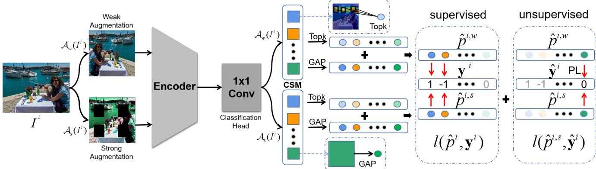  
Figure 2. An overall illustration of the proposed ST framework. Different data augmentations are fed into the Encoder to extract feature maps, then go through Classification Head to obtain the class-specific maps (CSM). The Topk(·) operator is used to select the k maximum values for each CSM as a regularizer which is added to the logits produced by global average pooling (GAP). Known labels and corresponding possibilities are used for supervised learning. Based on the weak augmentation, pseudo-labeling (PL) is utilized to complement unknown labels of the strong augmentation in the unsupervised learning.

Our self-training framework is consistent with associated paradigms, including supervised training with known labels and unsupervised training with pseudo-labels. Different from these works, we propose saliency regularization to alleviate the negative dominance on the spatial region, and prove that such operation can address the imbalance of easy and hard samples, which adapts to any known label proportion. Meanwhile, we introduce consistency regularization [31, 2] to complement unknown labels without pre-trained models. Our supervised and unsupervised learning share different data augmentations.

## 3. Self-Training for Partial Annotations

## 3.1. Problem Setting

In the setting of the partial-label problem of multi-label learning, let $\mathcal { D } \overset { \cdot } { = } \{ ( I ^ { 1 } , \overset { \cdot } { \mathbf { y } ^ { 1 } } ) , \dots , ( I ^ { N } , \overset { \cdot } { \mathbf { y } ^ { N } } ) \}$ be a training set which is partially annotated, where $I ^ { i }$ is the i-th image and $\mathbf { y } ^ { i }$ represents its label vector. For each image, only a small number of positive and negative labels can be observed, many possible labels are missing. We denote the label vector of the i-th image by $\mathbf { y } ^ { i } = \{ y _ { 1 } ^ { i } , \dots , y _ { C } ^ { i } \} \in \{ - 1 , 0 , 1 \} ^ { C }$ in which C is the number of categories and $y _ { c } ^ { i }$ is the label of category c on image $I ^ { i } , y _ { c } ^ { i } \in \{ - 1 , 0 , 1 \}$ means the label is present (1), absent (-1), or unknown (0).

## 3.2. Motivation of Saliency Regularization

If the prediction bias of a true positive sample is generated by the negative dominance, then the activation of the corresponding region in the spatial dimension is suppressed. Meanwhile, under the condition of a low proportion of known labels, a small number of positive labels may lead to the regional overfitting of a class on some specific spatial regions. Limited generalization makes pseudolabels of unknown labels more likely to bias towards negative predictions. We expect to increase the saliency of object regions as much as possible to mitigate the negative dominance and enhance generalization during training. Namely, reinforcing the activation of the object region corresponding to a present label is desired, thus we use heat maps to model the saliency of the object region.

## 3.3. Saliency Regularization

As shown in Fig. 2, different from traditional network architectures [30, 15], the features from the feature encoder go through a 1 × 1 convolution classification head before performing the pooling operation, which is for getting classspecific maps (CSM). Each pixel on a CSM is the score of the current category. The output of the feature encoder on image I is denoted as $\mathbf { f } \in \dot { \mathbb { R } ^ { W \times H \times D } }$ , in which D is the number of channels, W and H are the width and the height. We feed f into the classification head to extract the common heat map $\mathbf { M } _ { c } \in \mathbb { R } ^ { W \times H }$ of category c as follows:

$$
{ \bf M } _ { c } = \frac { R e l u ( { \bf A } _ { c } ) } { \operatorname* { m a x } ( R e l u ( { \bf A } _ { c } ) ) } , { \bf A } _ { c } = { \theta } _ { c } ^ { \mathsf { T } } { \bf f } ,\tag{1}
$$

where $\theta _ { c }$ is the c-th classification head weights and $\mathbf { A } _ { c } \in$ $\mathbb { R } ^ { W \times H }$ is the CSM of category ${ \mathrm { \bf c } } . { \mathrm { \bf \delta M } } _ { c }$ is based on CAM $\mathbf { m } _ { c } = R e l u ( \mathbf { A } _ { c } )$ [42], where $\mathbf { m } _ { c }$ indicates the discriminative object region for category c. It is normalized to [0, 1] by the maximum value of $\mathbf { m } _ { c }$ to represent the importance of each pixel for category c.

The corresponding object region should be salient $( i . e .$ the object region is activated) if a label is present, while suppressive $( i . e .$ ., all-zero on the heat map) if the label is absent. The resulting optimization problem is as

$$
J _ { \theta } = \left\{ \underset { \theta } { \operatorname* { m i n } } ~ \| R e l u ( \mathbf { A } _ { c } ) \| _ { 1 } , \ y _ { c } = - 1 , \right.\tag{2}
$$

where θ is the parameters of whole model. To simplify the problem, we only optimize values selected by the Topk(·) operator (i.e., selecting k maximum values) on $\mathbf { A } _ { c } , J _ { \theta }$ is as

$$
\begin{array} { l } { { \displaystyle s _ { c } = \frac { 1 } { k } \sum _ { w , h } a _ { c , w h } \mathrm { , ~ } a _ { c , w h } \in \mathbf { T o p } \mathbf { k } ( \mathbf { A } _ { c } ) } , } \\ { { \displaystyle J _ { \theta } = \left\{ \begin{array} { l l } { { \displaystyle \operatorname* { m i n } _ { \theta } s _ { c } \mathrm { , ~ } y _ { c } = - 1 } , } \\ { { \displaystyle \operatorname* { m a x } _ { \theta } s _ { c } \mathrm { , ~ } y _ { c } = 1 } , } \end{array} \right. } } \end{array}\tag{3}
$$

where ${ { a } _ { c , w h } }$ is the value of $\mathbf { A } _ { c }$ at spatial position $( w , h )$ Because of different label cases, we consider incorporating $J _ { \theta }$ into the optimization of $L _ { c } ,$ where $L _ { c }$ goes for $L _ { + }$ or $L _ { - }$ based on known $y _ { c } ( L _ { + } = - l o g ( p _ { c } ) , L _ { - } = - l o g ( 1 - p _ { c } ) )$ ). Predicted probability $p _ { c }$ can be computed by

$$
p _ { c } = \sigma ( a _ { c } ) , a _ { c } = \frac { 1 } { W \times H } \sum _ { w , h } a _ { c , w h } , a _ { c , w h } \in \mathbf { A } _ { c } ,\tag{4}
$$

where $\sigma ( \cdot )$ is Sigmoid activation function. When $y _ { c }$ is $^ { 1 , }$ $p _ { c }$ is optimized towards 1, and $a _ { c }$ is close to the positive infinity direction, which is consistent with the optimization direction of $J _ { \theta }$ . When $y _ { c } \ \mathrm { i s } \ - 1 , p _ { c }$ is optimized towards $0 ,$ and $a _ { c }$ is close to the negative infinity direction, which is also consistent with the optimization direction of $J _ { \theta }$ . Thus, we simplified the optimization of $J _ { \theta }$ , as follows:

$$
\hat { p } _ { c } = \sigma ( a _ { c } + \alpha s _ { c } ) ,\tag{5}
$$

where α is a scalar parameter to control the contribution of $s _ { c } .$ . We call $s _ { c }$ the saliency regularizer. The optimizations of $a _ { c }$ and $s _ { c }$ from the same $\mathbf { A } _ { \mathfrak { c } }$ c are correlated $( a _ { c } < s _ { c } )$ . When optimizing $L _ { c }$ according to $\hat { p } _ { c } ,$ , it implicitly optimizes $J _ { \theta }$

For balancing easy and hard samples, Focal loss [23] and Asymmetric loss [28] add the exponential weight regarding $p _ { c }$ to $L _ { c } ( L _ { + } = - ( 1 - p _ { c } ) ^ { \gamma _ { + } } l o g ( p _ { c } ) , L _ { - } = - p _ { c } ^ { \gamma _ { - } } l o g ( 1 -$ $p _ { c } ) , \gamma _ { + } , \gamma _ { - }$ are the focusing parameters) as a modulating factor to adjust the contributions of hard and easy samples. Differently, as in Eq. (5), adding the saliency regularizer $s _ { c }$ to the logit $a _ { c }$ can also address the imbalance of easy and hard samples, which is proved in Proposition 1.

Proposition 1 (Logit shifting). A sample with $| y _ { c } ^ { \prime } - \hat { p } _ { c } | \to$ 0 is easy to classify and $\left| y _ { c } ^ { \prime } - \hat { p } _ { c } \right| \to 1$ is hard to classify, where $y _ { c } ^ { \prime } = 1 f o r y _ { c } = 1$ , and $y _ { c } ^ { \prime } = 0 f o r y _ { c } = - 1 . ~ s _ { c }$ as an adaptive margin on the logit $a _ { c }$ adjusts $\frac { \partial L _ { c } } { \partial a _ { c } } \ o f$ category c, thus addressing the imbalance ofeasy and hard samples.

Due to the impact of the modulating factor, Focal loss pays more attention to hard samples $( e . g . , y _ { c } \ = \ 1 , p _ { c } \ \in$ $[ 0 , 0 . 2 ] )$ and less attention to a large proportion of semihard samples $[ 4 1 ] \ ( e . g . , y _ { c } \ = \ 1 , p _ { c } \ \in \ [ 0 . 3 , 0 . 5 ] )$ when $\gamma _ { + } = \gamma _ { - } = 2$ . Generally, when a hard positive sample is easily classified by the model, $s _ { c } < 0 ( \hat { p } _ { c } \to 0 )$ changes to $s _ { c } > 0 ( \hat { p } _ { c } \to 1 )$ $s _ { c }$ as a margin is dynamically adjusted in Eq. (5), which makes the gradient change smoothly from large to small. For semi-hard positive samples, object regions may be not activated or not significantly activated, such that $s _ { c }$ is less than 0 or a small positive value. Their contribution to the loss remains significant, thus they are more likely to be correctly identified by the model. It is verified in Fig. 5.

In general, the object regions of a present class are distributed in different pixel locations because of different parts or multiple objects. It is reasonable that the top k values are selected to help SR focus on more locations of an image. The multi-region saliency enhancement alleviates the negative dominance and regional overfitting phenomenon. We prove that SR makes the saliency enhancement different between non-object and object regions from the perspective of gradient, as detailed in Proposition 2.

Proposition 2 (Gradient differentiation). For a conventional loss $L _ { c } \ ( \mathrm { i . e . }$ ., BCE, Focal loss or Asymmetric loss) of category $c ,$ it propagates the same gradient $\frac { \partial L _ { c } } { \partial a _ { c , w h } }$ to each location (w, h) on the c-th CSM. Whereas SR makes the gradient of a location $( w , h ) \in \Omega _ { c } = \{ ( w , h ) | a _ { c , w h } \in$ Topk $\left( \mathbf { A } _ { c } \right) ]$ discriminative with other locations.

The detailed proofs of Proposition 1 and Proposition 2 are presented in the supplementary material.

## 3.4. Consistency Regularization

In partial-label learning, the predictions of unlabeled data are highly uncertain, thus the density of data points near the decision boundaries is greater. To minimize the density of unlabeled data points near the decision boundaries, pseudo-labeling (PL) is a standard method. It selects training targets based on the high confidence of prediction of the model for unlabeled data. In a single-label classification task, the class with the largest predicted probability is selected to generate a pseudo-label for a given image. However, for the multi-label case, the generation of pseudolabels is determined by a threshold.

PL is used to complement unknown labels of several multi-label datasets in the works [12, 29]. Their methods can be formalized as

$$
\begin{array} { r } { \hat { y } _ { c } = \mathbb { 1 } [ u ( p _ { c } ) \geq \tau ] - \mathbb { 1 } [ u ( 1 - p _ { c } ) \geq \tau ] , } \end{array}\tag{6}
$$

where the c-th class is unknown and $u ( \cdot )$ is a mapping function with respect to $p _ { c } .$ , such as identity transformation, certainty measure and others. 1[·] is an indicator function whose value is 1 if the condition is established and is 0 otherwise. τ is a threshold to determine whether unknown labels are positive, negative, or unknown. The model’s performance is poorly improved when $u ( \cdot )$ is identity transformation. In order to select correct pseudo-labels, the threshold τ is set to be very large so that the selected pseudo-labels optimize the model to a lesser extent. Meanwhile, training on self-generated labels can easily lead to overfitting.

Following the semi-supervised work [31], the assumption that different data augmentations of the same image should be consistent in the label space is proposed. We use both consitency regularization (CR) and PL to complement the unknown labels. The unknown label with $y _ { c } = 0$ is assigned as

$$
\hat { y } _ { c } = \mathbb { 1 } [ p _ { c } ^ { w } \geq \tau ] - \mathbb { 1 } [ 1 - p _ { c } ^ { w } \geq \tau ] ,\tag{7}
$$

which depends on the relationship between the threshold $\tau$ and the probability $p _ { c } ^ { w }$ of the weak augmentation $\mathcal { A } _ { w } ( I )$ The value of $\hat { y } _ { c }$ is zero when c belongs to $\mathcal { N } = \{ c | y _ { c } \neq \mathrm { 0 } \}$ The strong view $A _ { s } ( I )$ is fed into the neural network, then its output is supervised by $\hat { \mathbf { y } }$ for consistency training. Because the network outputs of strong and weak augmentations from the same image are discriminative, the generated pseudo-labels drive further model optimization. Meanwhile, due to the use of data-augmented variants, the phenomenon of overfitting is alleviated.

For unknown labels of weak augmentation, the negative dominance makes it easier to predict possible negative labels, while possible positive labels are more difficult to predict. More negative pseudo-labels may worsen the imbalance. Saliency regularization (SR) will enlarge the probabilities to help complement possible positive labels. If an object exists on the image, $s _ { c } > 0$ is very likely to hold, so that a larger $\begin{array} { r } { \hat { p } _ { c } ~ ( \hat { p } _ { c } = \frac { 1 } { 1 + e ^ { - ( a _ { c } + \alpha s _ { c } ) } } ) } \end{array}$ is obtained. The saliency regularizer $s _ { c }$ may allow more positive labels to be selected. The pseudo-label $\hat { y } _ { c }$ is further expressed as

$$
\hat { y } _ { c } = \mathbb { 1 } [ \hat { p } _ { c } ^ { w } \geq \tau ] - \mathbb { 1 } [ 1 - \hat { p } _ { c } ^ { w } \geq \tau ] .\tag{8}
$$

## 3.5. Optimization

The optimization of the model is based on the minimization of two losses, including a supervised loss $\mathcal { L } _ { s }$ on known labels, and an unsupervised loss $\mathcal { L } _ { u }$ on unknown labels. Data augmentation $\boldsymbol { \mathcal { A } } ( \cdot )$ includes weak augmentation $A _ { w } ( \cdot )$ and strong augmentation $\mathcal { A } _ { s } ( \cdot )$ . Different data augmentations are shared by supervised and unsupervised learning. Given an image $I ^ { i } ,$ , let $\mathbf { p } ^ { i } = \mathbf { p } ( \mathbf { y } | \boldsymbol { A } ( I ^ { i } ) )$ be the predicted conditional probability distribution on the augmented image. $p _ { c } ^ { i }$ is the c-th element of the distribution $\mathbf { p } ^ { i }$

Following previous work, $l ( \mathbf { p } ^ { i } , \mathbf { y } ^ { i } )$ is defined as

$$
\begin{array} { l } { { \displaystyle l ( { \bf p } ^ { i } , { \bf y } ^ { i } ) = \frac { 1 } { \sum _ { c = 1 } ^ { C } | y _ { c } ^ { i } | } \sum _ { c = 1 } ^ { C } [ \mathbb { 1 } _ { [ y _ { c } ^ { i } = 1 ] } l o g ( p _ { c } ^ { i } ) } } \\ { { \displaystyle ~ + ~ \mathbb { 1 } _ { [ y _ { c } ^ { i } = - 1 ] } l o g ( 1 - p _ { c } ^ { i } ) ] , } } \end{array}\tag{9}
$$

which is the binary cross entropy (BCE) loss between the predictions of the model and partial ground-truth labels. Saliency regularization (SR) is introduced, so that the supervised loss $\mathcal { L } _ { s }$ is defined as

$$
\mathcal { L } _ { s } = \sum _ { i = 1 } ^ { N } l ( \hat { \mathbf { p } } ^ { i } , \mathbf { y } ^ { i } ) .\tag{10}
$$

The pseudo-label hard vector $\hat { \mathbf { y } } ^ { i }$ is computed from the predicted vector $\hat { \mathbf { p } } ^ { i , w }$ according to Eq. (8). The unsupervised loss $\mathcal { L } _ { u }$ is defined as

$$
\mathcal { L } _ { u } = \sum _ { i = 1 } ^ { N } l ( \hat { \mathbf { p } } ^ { i , s } , \hat { \mathbf { y } } ^ { i } ) ,\tag{11}
$$

where $\hat { \mathbf { p } } ^ { i , w }$ and $\hat { \mathbf { p } } ^ { i , s }$ are the predicted vector of $A _ { w } ( I ^ { i } )$ and $\mathcal { A } _ { s } ( I ^ { i } )$ . Finally, the overall optimization objective is

$$
\mathcal { L } = \mathcal { L } _ { s } + \mathcal { L } _ { u } .\tag{12}
$$

## 4. Experiments

## 4.1. Experimental Setting

Datasets. Following previous works [12, 6, 26], we experiment on the Pascal VOC 2007 [13], MS-COCO [24], and Visual Genome [19]. The datasets above are fully annotated, while this work focuses on partially annotated multilabel. Thus we follow the earlier works to randomly drop a certain proportion of labels to simulate partial annotations. The proportions of dropped labels are set from 90% to 10%, thus 10% to 90% labels are known. At the same time, we also conduct experiments on the real partially annotated dataset OpenImages V3 [22]. The details of all datasets are shown in the supplementary material.

Evaluation metrics. The mean average precision (mAP) over all categories is adopted to evaluate the performance for different proportions of known labels. To visually compare the performance of different methods, we compute the average mAP of different proportions of known labels, similar to [6, 26]. We also use other standard multi-label classification metrics to evaluate the performance of a method more comprehensively, including overall and per-class precision, recall, and F1-measure (i.e., OP, CP, OR, CR, OF1, CF1). The calculation of these metrics and detailed results are shown in the supplementary material.

Implementation details. For a fair comparison with previous methods, we employ ResNet-101 [15] pre-trained on

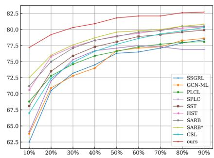  
(a)

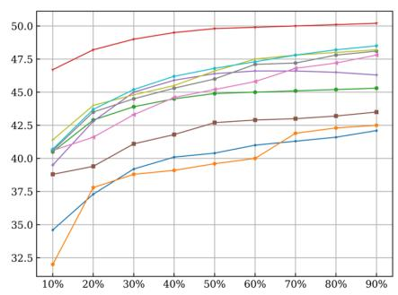  
(b)

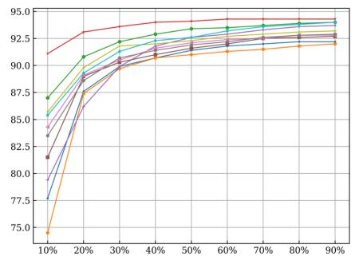  
(c)

Figure 3. The mAP of our self-training (ST) framework and previous SOTA methods for multi-label classification with partial labels at known labels of 10% to 90% on the (a) MS-COCO, (b) VG-200, and (c) Pascal VOC 2007.
<table><tr><td rowspan="2">Methods</td><td colspan="3">MS-COCO</td><td colspan="3">VG-200</td><td colspan="3">Pascal VOC 2007</td></tr><tr><td>Avg. mAP(↑)</td><td>Avg. OF1(↑)</td><td>Avg. CF1(↑)</td><td>Avg. mAP(↑)</td><td>Avg. OF1(↑)</td><td>Avg. CF1(↑)</td><td>Avg. mAP(↑)</td><td>Avg. OF1(↑)</td><td>Avg. CF1(↑)</td></tr><tr><td>SSGRL[7]</td><td>74.1</td><td>73.9</td><td>68.1</td><td>39.7</td><td>37.8</td><td>26.1</td><td>89.5</td><td>87.7</td><td>84.5</td></tr><tr><td>GCN-ML[8]</td><td>74.4</td><td>73.1</td><td>68.4</td><td>39.3</td><td>38.7</td><td>25.6</td><td>88.9</td><td>87.3</td><td>84.6</td></tr><tr><td>PLCL[12]</td><td>75.5</td><td>74.9</td><td>70.2</td><td>44.1</td><td>45.8</td><td>39.3</td><td>92.4</td><td>88.3</td><td>86.0</td></tr><tr><td>SPLC[41]</td><td>74.9</td><td>68.1</td><td>66.6</td><td>45.1</td><td>43.9</td><td>41.1</td><td>90.4</td><td>83.2</td><td>81.6</td></tr><tr><td>SST[6]</td><td>76.7</td><td>75.8</td><td>71.2</td><td>41.8</td><td>39.9</td><td>30.8</td><td>90.4</td><td>88.2</td><td>85.6</td></tr><tr><td>HST[5]</td><td>77.9</td><td>76.7</td><td>72.6</td><td>44.8</td><td>46.3</td><td>37.9</td><td>90.9</td><td>88.4</td><td>86.1</td></tr><tr><td>SARB[26]</td><td>77.9</td><td>76.5</td><td>72.2</td><td>45.6</td><td>45.0</td><td>37.4</td><td>90.7</td><td>88.4</td><td>85.9</td></tr><tr><td>SARB*[27]</td><td>78.4</td><td>76.8</td><td>72.7</td><td>46.0</td><td>45.1</td><td>37.7</td><td>91.5</td><td>88.3</td><td>86.0</td></tr><tr><td>CSL[1]</td><td>76.3</td><td>75.1</td><td>71.5</td><td>46.0</td><td>54.0</td><td>48.0</td><td>91.7</td><td>85.9</td><td>84.1</td></tr><tr><td>Ours</td><td>81.0</td><td>79.0</td><td>75.7</td><td>49.2</td><td>51.4</td><td>45.1</td><td>93.7</td><td>88.9</td><td>86.2</td></tr></table>

Table 1. The average mAP, OF1, and CF1 of our ST framework and previous SOTA methods under the partial-label setting on the MS-COCO, VG-200, and Pascal VOC 2007 datasets. The best results are marked in bold, and the second-best results are underlined.

ImageNet as the feature encoder to extract feature maps. The classification head is initialized randomly. We use SGD with momentum 0.9 and weight decay of 0.0001, set batch size to 32. We set $\alpha = 0 . 5 , k = 5 , \tau = 0 . 6$ . Wider applications (e.g., fully-supervised mode, semi-supervised mode, and other architectures) and more details are shown in the supplementary material.

## 4.2. Performance Comparison

To evaluate the effectiveness of the proposed ST framework, we compare it with the previous full-label approaches and the current partial-label methods. The typical full-label approaches include SSGRL [7] and GCN-ML [8]. They use GNN to model label correlations. The adjacency matrix is counted from the co-occurrence information of a multilabel training set with partial labels. Following [6, 26], their performance is reported under the partial-label setting. The partial-label methods include Partial Loss and Curriculum Labeling (PLCL) [12], SPLC [41], SST [6], SARB [26] and CSL [1]. HST [5] and SARB∗ [27] are extensions of SST and SARB respectively. PLCL and SPLC are similar to our pseudo-labeling, but differ in the labeling strategies. PLCL and SPLC generate pseudo-labels on the weak augmentation of an image, one for intervalic labeling and the other for immediate labeling. Our strategy is immediate labeling based on different augmentations from the same image.

Performance on MS-COCO. Performance comparisons on MS-COCO are presented in Fig. 3a and Tab. 1. As shown in Fig. 3a, the mAP obtained by our method is significantly better than the other methods for different known label proportions, especially the low proportions. We use additional metrics to evaluate the effectiveness of different methods in Tab. 1. Obviously, our method obtains the average mAP, OF1, and CF1 of 81.0%, 79.0%, and 75.7%, outperforming the best partial-label method SARB∗ by 2.6%, 2.2%, and 3.0%. In Fig. 3a, SSGRL and GCN-ML achieve better performance when the proportion of known labels is greater than 50%. However, they perform poorly in low proportions, and the main reason may be the difference between the adjacency matrix counted on the partial labels with the co-occurrence relationships inherent in the dataset. It also shows that the full-label approaches are not very suitable for solving the partial-label problem.

Performance on VG-200. We can see from Fig. 3b that there are significant differences in the performance of the different methods with various known label proportions. Our method has significant performance advantages regarding the mAP over different known proportion settings. As shown in Tab. 1, the average mAP of our method is 49.2%, which is 3.2% higher than the existing SOTA method SARB∗ and CSL. Our method performs not as well as the CSL on both OF1 and CF1, but is still far better than the other methods. Our method outperforms PLCL by 5.1%, 5.6%, and 5.8%, and outperforms SPLC by 4.1%, 7.5%, and 4.0% on average mAP, OF1, and CF1, respectively.

<table><tr><td>Known</td><td>S-BCE</td><td>BN-BCE</td><td>PL</td><td>CR (w/o SR)</td><td>SR</td><td>CR (w/ SR)</td><td>mAP(↑)</td><td>OF1(↑)</td><td>CF1(↑)</td></tr><tr><td rowspan="7"></td><td>√</td><td></td><td></td><td></td><td></td><td></td><td>61.7</td><td>64.3</td><td>53.5</td></tr><tr><td></td><td>√</td><td></td><td></td><td></td><td></td><td>70.7</td><td>70.7</td><td>65.9</td></tr><tr><td></td><td>√</td><td>√</td><td></td><td></td><td></td><td>70.8</td><td>70.4</td><td>65.2</td></tr><tr><td></td><td>√</td><td></td><td>√</td><td></td><td></td><td>72.4</td><td>73.2</td><td>68.0</td></tr><tr><td></td><td>√</td><td></td><td></td><td>√</td><td></td><td>75.8</td><td>73.8</td><td>69.4</td></tr><tr><td></td><td>√</td><td></td><td>√</td><td>√</td><td></td><td>76.2</td><td>75.8</td><td>71.2</td></tr><tr><td></td><td>√</td><td></td><td></td><td>√</td><td>√</td><td>77.2</td><td>76.6</td><td>72.1</td></tr><tr><td rowspan="7">30%</td><td>√</td><td></td><td></td><td></td><td></td><td></td><td>73.1</td><td>73.4</td><td>68.0</td></tr><tr><td></td><td>√</td><td></td><td></td><td></td><td></td><td>76.0</td><td>75.2</td><td>70.7</td></tr><tr><td></td><td>√</td><td>√</td><td></td><td></td><td></td><td>76.2</td><td>75.1</td><td>70.5</td></tr><tr><td></td><td>√</td><td></td><td>√</td><td></td><td></td><td>77.3</td><td>76.6</td><td>72.1</td></tr><tr><td></td><td>√</td><td></td><td></td><td>√</td><td></td><td>79.7</td><td>78.1</td><td>74.2</td></tr><tr><td></td><td>√</td><td></td><td>√</td><td>√</td><td></td><td>79.3</td><td>77.7</td><td>73.7</td></tr><tr><td></td><td>√</td><td></td><td></td><td>√</td><td>√</td><td>80.3</td><td>78.6</td><td>74.7</td></tr><tr><td rowspan="7"></td><td>√</td><td></td><td></td><td></td><td></td><td></td><td>74.8</td><td>74.4</td><td>69.1</td></tr><tr><td></td><td>√</td><td></td><td></td><td></td><td></td><td>77.3</td><td>76.0</td><td>71.4</td></tr><tr><td></td><td>√</td><td>√</td><td></td><td></td><td></td><td>77.4</td><td>76.0</td><td>71.3</td></tr><tr><td></td><td>√</td><td></td><td>√</td><td></td><td></td><td>78.6</td><td>77.4</td><td>72.9</td></tr><tr><td></td><td>√</td><td></td><td></td><td>√</td><td></td><td>81.3</td><td>79.0</td><td>76.2</td></tr><tr><td></td><td>√</td><td></td><td>√</td><td>√</td><td></td><td>80.8</td><td>78.5</td><td>75.5</td></tr><tr><td></td><td>√</td><td></td><td></td><td>√</td><td>√</td><td>81.8</td><td>79.4</td><td>76.7</td></tr><tr><td rowspan="7"></td><td>√</td><td></td><td></td><td></td><td></td><td></td><td>76.2</td><td>75.8</td><td>70.7</td></tr><tr><td></td><td>√</td><td></td><td></td><td></td><td></td><td>77.8</td><td>76.3</td><td>71.9</td></tr><tr><td></td><td>√</td><td>√</td><td></td><td></td><td></td><td>78.0</td><td>76.3</td><td>71.9</td></tr><tr><td></td><td>√</td><td></td><td>√</td><td></td><td></td><td>79.1</td><td>77.8</td><td>73.4</td></tr><tr><td></td><td>√</td><td></td><td></td><td>√</td><td></td><td>81.8</td><td>79.4</td><td>76.7</td></tr><tr><td></td><td>√</td><td></td><td>√</td><td>√</td><td></td><td>81.5</td><td>79.0</td><td>76.2</td></tr><tr><td></td><td>√</td><td></td><td></td><td>√</td><td>√</td><td>82.1</td><td>79.8</td><td>76.7</td></tr><tr><td rowspan="7"></td><td>√</td><td></td><td></td><td></td><td></td><td></td><td>77.7</td><td>76.6</td><td>72.2</td></tr><tr><td></td><td>√</td><td></td><td></td><td></td><td></td><td>78.1</td><td>76.9</td><td>72.3</td></tr><tr><td></td><td>√</td><td>√</td><td></td><td></td><td></td><td>78.3</td><td>76.9</td><td>72.2</td></tr><tr><td></td><td>√</td><td></td><td>√</td><td></td><td></td><td>79.2</td><td>77.9</td><td>73.4</td></tr><tr><td></td><td>√</td><td></td><td></td><td>√</td><td></td><td>82.6</td><td>79.9</td><td>77.2</td></tr><tr><td></td><td>√</td><td></td><td>√</td><td>√</td><td></td><td>82.1</td><td>79.4</td><td>76.6</td></tr><tr><td></td><td>√</td><td></td><td></td><td>√</td><td>√</td><td>82.7</td><td>80.0</td><td>77.4</td></tr></table>

Table 2. Ablation study on MS-COCO with different proportions of known labels. CR (w/o SR) and CR (w/ SR) respectively represent our framework containing CR without SR and with SR.

Performance on Pascal VOC 2007. As shown in Fig. 3c, the methods described above all achieve impressive performance with more than 40% known labels. When the known proportion is 10%, the performance degradation of these methods is obvious. However, the performance degradation of our method is not significant, not much different from the performance of 90% known labels. This fully demonstrates the effectiveness of our method in different known proportions. Our method achieves good results on the additional metrics average mAP, OF1, and CF1 in Tab. 1.

## 4.3. Method Analysis

In this section, we perform ablative studies on MS-COCO with the various proportions of known labels. In Tab. 2, the performance of ResNet101 with standard binary cross entropy (S-BCE) is used as the baseline. S-BCE is normalized by the number of classes, which makes the back-propagated gradient small. To overcome this problem, we perform batch normalization for BCE (BN-BCE) by the number of known labels from a batch. BN-BCE is different from partial-BCE [12] normalized by the proportion of known labels and Asymmetric Loss [1] summed by the entire batch loss. The combination of BN-BCE and pseudolabeling (PL) shows the contribution of the conventional self-training framework. The analysis of saliency regularization (SR) and consistency regularization (CR) illustrates the validity of our novel self-training framework. Also, we analyze the effect of hyperparameters of both on the performance. The choice of hyperparameters is based on a comprehensive consideration of the performance with two known proportions. The probability distribution is exploited to analyze SR in depth.

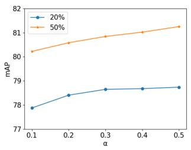  
(a)

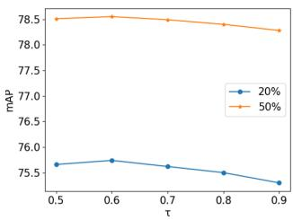  
(b)

Figure 4. Analysis of (a) hyperparamater $\alpha ,$ and (b) hyperparamater τ on MS-COCO with 20% and 50% known labels.
<table><tr><td>Known Proportion</td><td>1</td><td>2</td><td>3</td><td>4</td><td>5</td></tr><tr><td>20%</td><td>78.43</td><td>78.55</td><td>78.59</td><td>78.70</td><td>78.73</td></tr><tr><td>50%</td><td>80.90</td><td>81.27</td><td>81.21</td><td>81.27</td><td>81.25</td></tr></table>

Table 3. Analysis of hyperparameter k on MS-COCO with 20% and 50% known labels when $\alpha = 0 . 5$

Saliency regularization analysis. We analyze the contribution of SR to supervised learning. As shown in Tab. 2, SR is compared with BN-BCE at the known proportion of 10%, 30%, 50%, 70%, and 90%. SR increases sequentially by 5.1%, 3.7%, 4.0%, 4.0%, and 4.5% for mAP in different proportions. The performance gain of SR continues to be significant for different known proportions. The gain of SR is the largest when the known proportion is 10%. It is verified that SR can alleviate the negative dominance exacerbated by more unknown labels and improve the generalization of the model. The same is true for the other metrics (i.e., OF1, CF1). This fully reflects the fact that our SR adapts to arbitrary known proportions.

The hyperparameters α and k are critical for SR. α determines the importance of SR in the logit space. k determines the extent of saliency region optimization over the CSM. With the settings of 20% and 50% known labels, we conduct experiments in the range of 0.1 to 0.5 for the variation of α. As shown in Fig. 4a, we set α to 0.5 after balancing the performance of two known proportion settings. We explore the effect of k in the range of 1 to 5 on the model performance with $\alpha = 0 . 5$ . As shown in Tab. 3, with k increasing, mAP increases at 20% known proportion, however, mAP gain is stable for 50%. Focusing on larger regions in low known proportions favors increased generalizability. Considering comprehensively, it is appropriate to choose k = 5.

Consistency regularization analysis. We use CR to complement the unknown labels. As shown in Tab. 2, compared with BN-BCE, CR (w/o SR) increases by 1.7%, 1.3%, 1.3%, 1.3%, 1.1% on mAP with the increase of the known proportion. OF1 and CF1 increase by 2.5%, 2.1% at 10% known proportion, respectively. CR is more effective with a lower known proportion, because it improves overfitting caused by a few known labels. To illustrate the benefit of SR to CR, CR without SR and with SR are explored in unsupervised learning. Compared with the performance of SR, the addition of CR (w/o SR) degrades performance under the majority of known proportions, where pseudolabeling provides more negative labels and limited positive labels leading to weakened model generalization. With different known proportions, the addition of CR (w/ SR) improves performance, where it makes more true positive labels recalled and reduces prediction bias for unknown labels. Meanwhile, we observe that CR (w/ SR) has less and less impact on the overall performance with the decline of

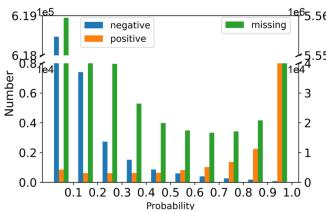  
(a)

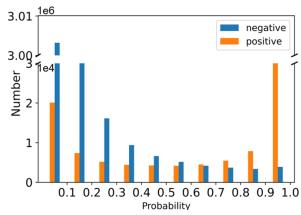  
(b)

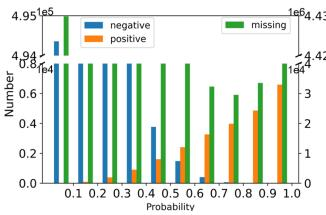  
(c)

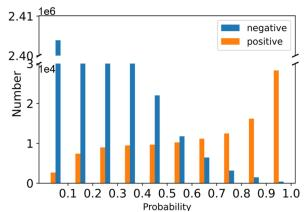  
(d)

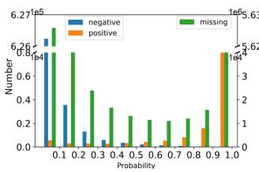  
(e)

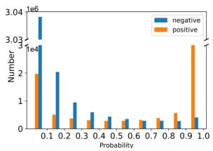  
(f)  
Figure 5. Probability distributions of predictions from different methods on the COCO-10% (MS-COCO with 10% known labels) training set (left) and MS-COCO validation set (right). Note that (a) and (b) are obtained from the model trained with BN-BCE, (c) and (d) are obtained from the model trained with Focal loss, and (e) and (f) are obtained from the model trained by SR with BN-BCE. The y-axis represents the number of ground-truths from whole dataset in each probability interval. Due to an order of magnitude difference, the number of missing (unknown) labels corresponds to the right axis, and the number of positive and negative labels corresponds to the left axis in (a), (c), and (e).

<table><tr><td>Methods</td><td>G1</td><td>G2</td><td>G3</td><td>G4</td><td>G5</td><td>All Gs</td></tr><tr><td>Latent Noise [25] CNN-RNN [35]</td><td>69.4</td><td>70.4</td><td>74.8</td><td>79.2</td><td>85.5</td><td>75.9</td></tr><tr><td>Curriculum [12]</td><td>68.8</td><td>69.7</td><td>74.2</td><td>78.5</td><td>84.6</td><td>75.2</td></tr><tr><td></td><td>70.4</td><td>71.3</td><td>76.2</td><td>80.5</td><td>86.8</td><td>77.1</td></tr><tr><td>IMCL [16]</td><td>71.0</td><td>72.6</td><td>77.6</td><td>81.8</td><td>87.3</td><td>78.1</td></tr><tr><td>CSL [1]</td><td>74.6</td><td>75.8</td><td>77.6</td><td>81.8</td><td>90.1</td><td>80.0</td></tr><tr><td>Ours</td><td>76.0</td><td>77.7</td><td>79.5</td><td>83.1</td><td>91.2</td><td>81.5</td></tr></table>

Table 4. Results on OpenImages V3. Comparing the mAP score based on our framework and existing methods with partial labels.

unknown proportions.

The hyperparameter τ is an important threshold for CR. Setting it too small may introduce label noise, and setting it too large may miss many true labels. In order to select the appropriate threshold, we conduct experiments in two different known proportions. The performance of τ from 0.5 to 0.9 is shown in Fig. 4b. The trend of mAP is generally consistent when 20% and 50% known labels. The best performance is obtained when $\tau = 0 . 6$

Probability distribution analysis. To further demonstrate the effectiveness of SR, we use its probability distributions on the COCO-10% training set and the validation set to compare with BN-BCE and Focal loss. From Figs. 5a and 5e, SR recalls more positives than BN-BCE. This phenomenon is also the same in Figs. 5b and 5f, which verifies the ability of SR to alleviate the negative dominance caused by label imbalance. Comparing Figs. 5a and 5c, Focal loss decreases the number of hard positives and negatives $( p < 0 . 2$ and $p > 0 . 8$ , p denotes the variable probability). Like Focal loss, SR also decreases hard positives and negatives in the training in Fig. 5e, while obviously decreasing more semi-hard positive and negative samples $( p \in [ 0 . 2 , 0 . 5 ]$ and $p \in [ 0 . 5 , 0 . 8 ] )$ than Focal loss. SR slightly reduces hard samples than BN-BCE in Fig. 5f. For missing labels, we only focus on the results of the training set. As shown in Fig. 5c, missing labels are not well divided on the model trained with Focal loss. The SR-based trained model can better distinguish missing labels in Fig. 5e. This facilitates learning better decision boundaries and performing well PL for unknown labels. It is also verified that SR obtains the best differentiation on the validation set in Fig. 5f.

## 4.4. Results on OpenImages V3

Following the work [16], we use the same experimental setup, including the ResNet-101 [15] backbone and evaluation metrics, to make a fair comparison with the existing results. We select several typical methods as baselines to compare with our approach. These methods include Latent Noise [25], CNN-RNN [35], Curriculum [12], IMCL [16], and CSL [1], which cover label dependency modeling, label correcting, intervalic labeling, and selective labeling. Open-Images V3 contains few known labels, and it is not friendly to CNN-RNN and IMCL based on label dependency modeling. Latent Noise based on label correcting and Curriculum Labeling based on intervalic labeling do not consider the imbalance, easily introducing noise for labeling unknown labels. Our method and CSL consider the positive-negative imbalance for supervised learning with known labels, both achieving better performance in Tab. 4. A more comprehensive comparison of results is detailed in the supplementary material.

## 5. Conclusion

In this paper, we design a novel self-training framework, which consists of saliency regularization to alleviate the negative dominance caused by label imbalance in supervised learning, and consistency regularization to mine unlabeled information to complement unknown labels with the help of saliency regularization for unsupervised learning. We perform extensive experiments on the simulated multilabel datasets with partial labels (i.e., MS-COCO, VG-200, VOC 2007) and the real large-scale dataset OpenImages V3 to demonstrate the effectiveness of our method.

Limitation. Our method is applicable to the setting where the known labels are positive and negative, and not to the setting where the known labels are only positive. Label correlation and instance similarity are also not considered.

Acknowledgements. The work is supported by the Natural Science Fund of Hubei Province under Grant 2022CFB823, HUST Independent Innovation Research Fund under Grant 2021XXJS096, Alibaba Innovation Research program under Grant CRAQ7WHZ11220001-20978282, the National Key R&D Program of China under Grant 2021ZD0201300, National Natural Science Foundation of China under Grants U1913602 and 61936004, Innovation Group Project of National Natural Science Foundation of China under Grant 61821003, 111 Project on Computational Intelligence and Intelligent Control under Grant B18024, and grants from MoE Key Lab of Image Processing and Intelligent Control.

## References

[1] Emanuel Ben-Baruch, Tal Ridnik, Itamar Friedman, Avi Ben-Cohen, Nadav Zamir, Asaf Noy, and Lihi Zelnik-Manor. Multi-label classification with partial annotations using class-aware selective loss. In CVPR, pages 4764–4772, 2022. 2, 3, 6, 7, 8

[2] David Berthelot, Nicholas Carlini, Ekin D Cubuk, Alex Kurakin, Kihyuk Sohn, Han Zhang, and Colin Raffel. Remixmatch: Semi-supervised learning with distribution alignment and augmentation anchoring. In ICLR, 2020. 3

[3] Serhat Selcuk Bucak, Rong Jin, and Anil K Jain. Multi-label learning with incomplete class assignments. In CVPR, pages 2801–2808, 2011. 2

[4] Minmin Chen, Alice Zheng, and Kilian Weinberger. Fast image tagging. In International Conference on Machine Learning, pages 1274–1282, 2013. 2

[5] Tianshui Chen, Tao Pu, Lingbo Liu, Yukai Shi, Zhijing Yang, and Liang Lin. Heterogeneous semantic transfer for multi-label recognition with partial labels. arXiv preprint arXiv:2205.11131, 2022. 6

[6] Tianshui Chen, Tao Pu, Hefeng Wu, Yuan Xie, and Liang Lin. Structured semantic transfer for multi-label recognition with partial labels. In AAAI, pages 339–346, 2022. 1, 2, 5, 6

[7] Tianshui Chen, Muxin Xu, Xiaolu Hui, Hefeng Wu, and Liang Lin. Learning semantic-specific graph representation for multi-label image recognition. In ICCV, pages 522–531, 2019. 1, 6

[8] Zhao-Min Chen, Xiu-Shen Wei, Peng Wang, and Yanwen Guo. Multi-label image recognition with graph convolutional networks. In CVPR, pages 5177–5186, 2019. 1, 6

[9] Hong-Min Chu, Chih-Kuan Yeh, and Yu-Chiang Frank Wang. Deep generative models for weakly-supervised multilabel classification. In ECCV, pages 400–415, 2018. 2

[10] Hao-Chen Dong, Yu-Feng Li, and Zhi-Hua Zhou. Learning from semi-supervised weak-label data. In AAAI, 2018. 2

[11] Alexey Dosovitskiy, Lucas Beyer, Alexander Kolesnikov, Dirk Weissenborn, Xiaohua Zhai, Thomas Unterthiner, Mostafa Dehghani, Matthias Minderer, Georg Heigold, Sylvain Gelly, et al. An image is worth 16x16 words: Transformers for image recognition at scale. In ICLR, 2021. 1

[12] Thibaut Durand, Nazanin Mehrasa, and Greg Mori. Learning a deep convnet for multi-label classification with partial labels. In CVPR, pages 647–657, 2019. 1, 2, 4, 5, 6, 7, 8

[13] Mark Everingham, SM Eslami, Luc Van Gool, Christopher KI Williams, John Winn, and Andrew Zisserman. The pascal visual object classes challenge: A retrospective. Internationaljournal ofcomputer vision, 111(1):98–136, 2015. 5

[14] Hao Guo, Kang Zheng, Xiaochuan Fan, Hongkai Yu, and Song Wang. Visual attention consistency under image transforms for multi-label image classification. In CVPR, pages 729–739, 2019. 1

[15] Kaiming He, Xiangyu Zhang, Shaoqing Ren, and Jian Sun. Deep residual learning for image recognition. In CVPR, pages 770–778, 2016. 1, 3, 5, 8

[16] Dat Huynh and Ehsan Elhamifar. Interactive multi-label cnn learning with partial labels. In CVPR, pages 9423–9432, 2020. 1, 2, 8

[17] Armand Joulin, Laurens van der Maaten, Allan Jabri, and Nicolas Vasilache. Learning visual features from large weakly supervised data. In ECCV, pages 67–84, 2016. 1

[18] Ashish Kapoor, Raajay Viswanathan, and Prateek Jain. Multilabel classification using bayesian compressed sensing. In NeurIPS, 2012. 2

[19] Ranjay Krishna, Yuke Zhu, Oliver Groth, Justin Johnson, Kenji Hata, Joshua Kravitz, Stephanie Chen, Yannis Kalantidis, Li-Jia Li, David A Shamma, et al. Visual genome: Connecting language and vision using crowdsourced dense image annotations. International journal of computer vision, 123(1):32–73, 2017. 5

[20] Alex Krizhevsky, Ilya Sutskever, and Geoffrey E Hinton. Imagenet classification with deep convolutional neural networks. In NeurIPS, pages 1106–1114, 2012. 1

[21] Kaustav Kundu and Joseph Tighe. Exploiting weakly supervised visual patterns to learn from partial annotations. In NeurIPS, pages 561–572, 2020. 2

[22] Alina Kuznetsova, Hassan Rom, Neil Alldrin, Jasper Uijlings, Ivan Krasin, Jordi Pont-Tuset, Shahab Kamali, Stefan Popov, Matteo Malloci, Alexander Kolesnikov, et al. The open images dataset v4. International Journal of Computer Vision, 128(7):1956–1981, 2020. 5

[23] Tsung-Yi Lin, Priya Goyal, Ross Girshick, Kaiming He, and Piotr Dollar. Focal loss for dense object detection. In´ ICCV, pages 2980–2988, 2017. 4

[24] Tsung-Yi Lin, Michael Maire, Serge Belongie, James Hays, Pietro Perona, Deva Ramanan, Piotr Dollar, and C Lawrence´ Zitnick. Microsoft coco: Common objects in context. In ECCV, pages 740–755, 2014. 5

[25] Ishan Misra, C Lawrence Zitnick, Margaret Mitchell, and Ross Girshick. Seeing through the human reporting bias: Visual classifiers from noisy human-centric labels. In CVPR, pages 2930–2939, 2016. 8

[26] Tao Pu, Tianshui Chen, Hefeng Wu, and Liang Lin. Semantic-aware representation blending for multi-label image recognition with partial labels. In AAAI, pages 2091– 2098, 2022. 2, 5, 6

[27] Tao Pu, Tianshui Chen, Hefeng Wu, and Liang Lin. Semantic-aware representation blending for multi-label image recognition with partial labels. arXiv preprint arXiv:2203.02172, 2022. 6

[28] Tal Ridnik, Emanuel Ben-Baruch, Nadav Zamir, Asaf Noy, Itamar Friedman, Matan Protter, and Lihi Zelnik-Manor. Asymmetric loss for multi-label classification. In ICCV, pages 82–91, 2021. 1, 3, 4

[29] Mamshad Nayeem Rizve, Kevin Duarte, Yogesh S Rawat, and Mubarak Shah. In defense of pseudo-labeling: An uncertainty-aware pseudo-label selection framework for semi-supervised learning. In ICLR, 2021. 4

[30] Karen Simonyan and Andrew Zisserman. Very deep convolutional networks for large-scale image recognition. In ICLR, 2015. 1, 3

[31] Kihyuk Sohn, David Berthelot, Nicholas Carlini, Zizhao Zhang, Han Zhang, Colin A Raffel, Ekin Dogus Cubuk, Alexey Kurakin, and Chun-Liang Li. Fixmatch: Simplifying semi-supervised learning with consistency and confidence. In NeurIPS, pages 596–608, 2020. 3, 5

[32] Chen Sun, Abhinav Shrivastava, Saurabh Singh, and Abhinav Gupta. Revisiting unreasonable effectiveness of data in deep learning era. In ICCV, pages 843–852, 2017. 1

[33] Grigorios Tsoumakas and Ioannis Katakis. Multi-label classification: An overview. International Journal ofData Warehousing and Mining (IJDWM), 3(3):1–13, 2007. 2

[34] Vikas Verma, Alex Lamb, Christopher Beckham, Amir Najafi, Ioannis Mitliagkas, David Lopez-Paz, and Yoshua Bengio. Manifold mixup: Better representations by interpolating hidden states. In International Conference on Machine Learning, pages 6438–6447, 2019. 2

[35] Jiang Wang, Yi Yang, Junhua Mao, Zhiheng Huang, Chang Huang, and Wei Xu. Cnn-rnn: A unified framework for multi-label image classification. In CVPR, pages 2285–2294, 2016. 1, 8

[36] Qifan Wang, Bin Shen, Shumiao Wang, Liang Li, and Luo Si. Binary codes embedding for fast image tagging with incomplete labels. In ECCV, pages 425–439, 2014. 2

[37] Baoyuan Wu, Siwei Lyu, and Bernard Ghanem. Ml-mg: Multi-label learning with missing labels using a mixed graph. In ICCV, pages 4157–4165, 2015. 2

[38] Tong Wu, Qingqiu Huang, Ziwei Liu, Yu Wang, and Dahua Lin. Distribution-balanced loss for multi-label classification in long-tailed datasets. In ECCV, pages 162–178, 2020. 1

[39] Miao Xu, Rong Jin, and Zhi-Hua Zhou. Speedup matrix completion with side information: Application to multi-label learning. In NeurIPS, 2013. 2

[40] Hsiang-Fu Yu, Prateek Jain, Purushottam Kar, and Inderjit Dhillon. Large-scale multi-label learning with missing labels. In International Conference on Machine Learning, pages 593–601, 2014. 2

[41] Youcai Zhang, Yuhao Cheng, Xinyu Huang, Fei Wen, Rui Feng, Yaqian Li, and Yandong Guo. Simple and robust loss design for multi-label learning with missing labels. arXiv preprint arXiv:2112.07368, 2021. 2, 3, 4, 6

[42] Bolei Zhou, Aditya Khosla, Agata Lapedriza, Aude Oliva, and Antonio Torralba. Learning deep features for discriminative localization. In CVPR, pages 2921–2929, 2016. 3