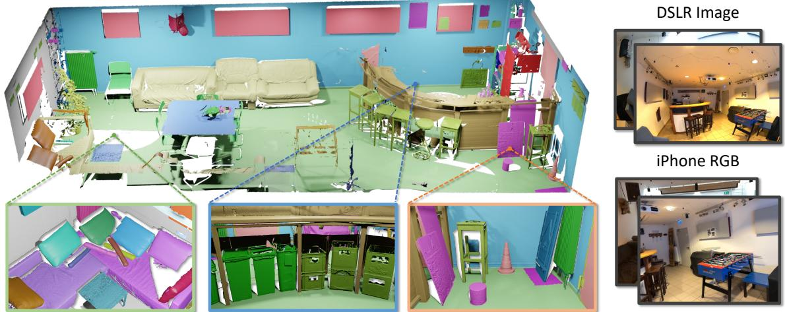
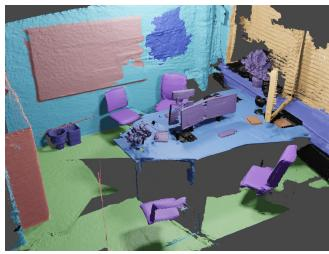
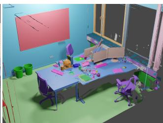
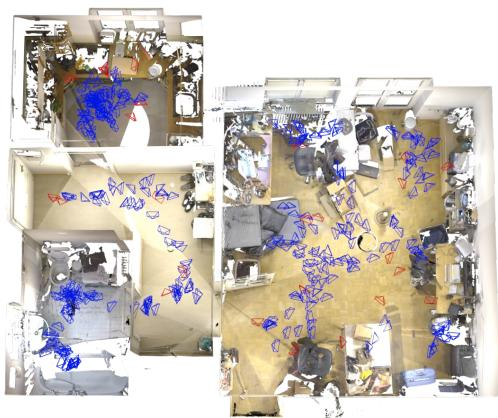
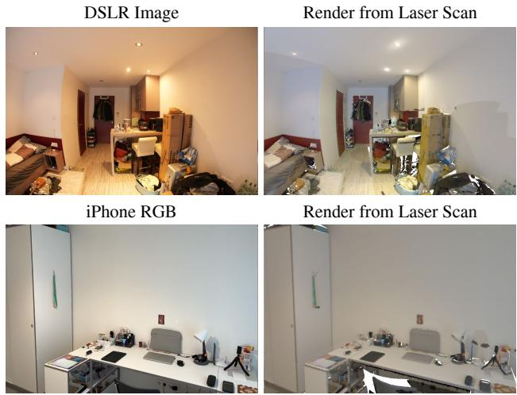
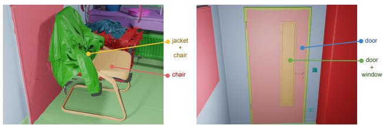
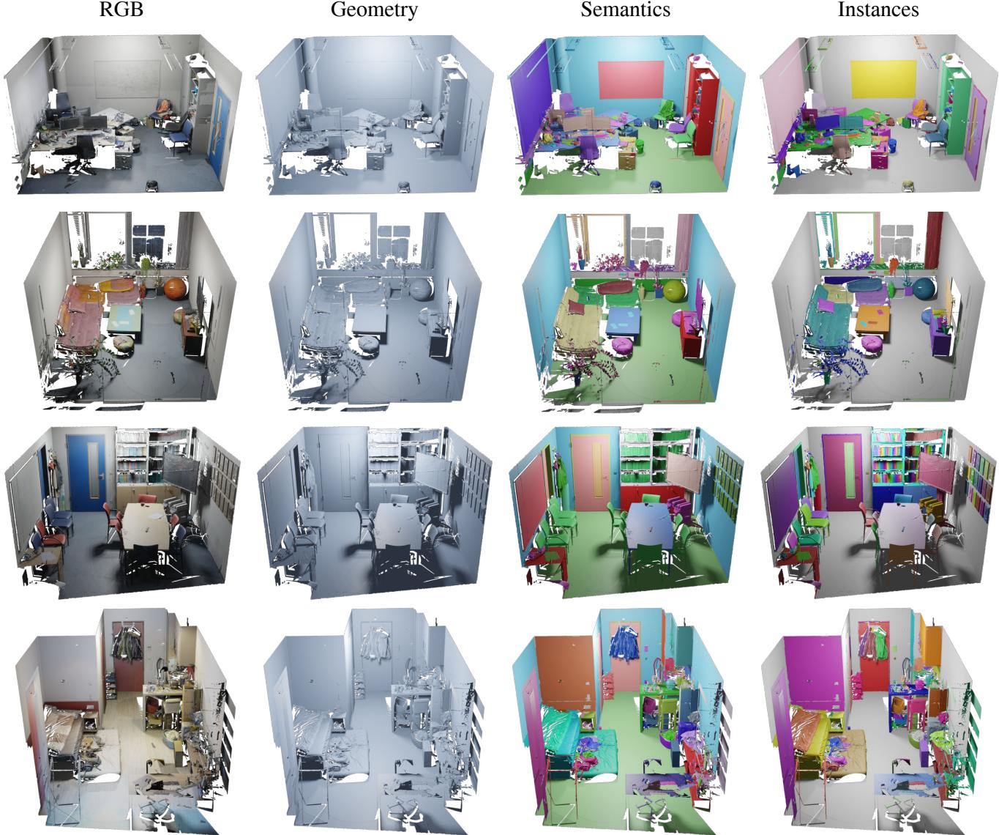
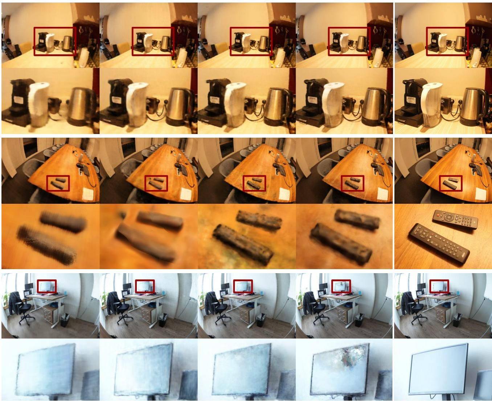
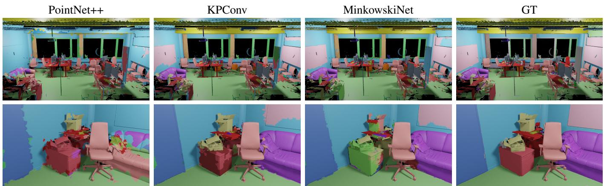
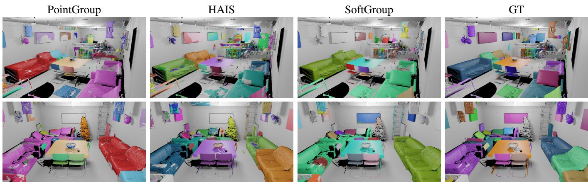

# ScanNet++: A High-Fidelity Dataset of 3D Indoor Scenes

Chandan Yeshwanth∗ Yueh-Cheng Liu∗ Matthias Nießner Angela Dai

Technical University of Munich

  
Figure 1: ScanNet++ contains 460 high-resolution 3D reconstructions of indoor scenes with dense semantic and instance annotations, along with corresponding high-quality DSLR images and iPhone RGB-D sequences. The long-tail and multilabeled annotations enable fine-grained semantic understanding, while the high-quality and commodity RGB images enable benchmarking of novel view synthesis methods at scale.

## Abstract

We present ScanNet++, a large-scale dataset that couples together capture of high-quality and commodity-level geometry and color of indoor scenes. Each scene is captured with a high-end laser scanner at sub-millimeter resolution, along with registered 33-megapixel images from a DSLR camera, and RGB-D streamsfrom an iPhone. Scene reconstructions are further annotated with an open vocabulary of semantics, with label-ambiguous scenarios explicitly annotated for comprehensive semantic understanding. ScanNet++ enables a new real-world benchmarkfor novel view synthesis, both from high-quality RGB capture, and importantly also from commodity-level images, in addition to a new benchmark for 3D semantic scene understanding that comprehensively encapsulates diverse and ambiguous semantic labeling scenarios. Currently, ScanNet++ contains 460 scenes, 280,000 captured DSLR images, and over 3.7M iPhone RGBDframes.

## 1. Introduction

Reconstruction and understanding of 3D scenes is fundamental to many applications in computer vision, including robotics, autonomous driving, mixed reality and content creation, among others. The last several years have seen a revolution in representing and reconstructing 3D scenes with groundbreaking networks such as neural radiance fields (NeRFs) [27]. NeRFs optimize complex scene representations from an input set of posed RGB images with a continuous volumetric scene function to enable synthesis of novel image views, with recent works achieving improved efficiency, speed, and scene regularization [40, 11, 48, 25, 23, 1, 2, 5, 29]. Recent works have even extended the photometric-based formulation to further optimize scene semantics based on 2D semantic signal from the input RGB images [52, 43, 12, 21, 36].

Notably, such radiance field scene representations focus on individual per-scene optimization, without learning generalized priors for view synthesis. This is due to the lack of large-scale datasets which would support learning such general priors. As shown in Table 1, existing datasets either contain a large quantity of scenes that lack high-quality color and geometry capture, or contain a very limited number of scenes with high-quality color and geometry. We propose to bridge this divide with ScanNet++, a large-scale dataset that contains both high-quality color and geometry capture coupled with commodity-level data of indoor environments. We hope that this inspires future work on generalizable novel view synthesis with semantic priors.

<table><tr><td rowspan="2">Dataset</td><td rowspan="2">Num. scenes</td><td rowspan="2">Average scans/scene</td><td rowspan="2">Total scans</td><td colspan="2">RGB (MP)</td><td rowspan="2">Depth LR HR</td><td rowspan="2">Dense semantics NVS</td><td rowspan="2"></td></tr><tr><td>Commodity DSLR</td><td></td></tr><tr><td>LLFF [26]</td><td>35</td><td></td><td></td><td>12</td><td>X</td><td>X X</td><td>x</td><td></td></tr><tr><td>DTU [15]</td><td>124</td><td></td><td></td><td>1.9</td><td>X</td><td>X</td><td>X</td><td></td></tr><tr><td>BlendedMVS [47]</td><td>113</td><td></td><td></td><td>X</td><td>X</td><td>x X</td><td></td><td>X</td></tr><tr><td>ScanNet [9]</td><td>1503</td><td></td><td></td><td>1.25</td><td>X</td><td>X</td><td></td><td>X</td></tr><tr><td>Matterport3D [4]</td><td>90</td><td></td><td></td><td>1.3</td><td>X</td><td>X</td><td></td><td>X</td></tr><tr><td>Tanks and Temples [20]</td><td>21</td><td>10.57</td><td>74</td><td>X</td><td>8</td><td>X</td><td>X</td><td></td></tr><tr><td>ETH3D [35]</td><td>25</td><td>2.33</td><td>42</td><td>X</td><td>24</td><td>X</td><td>X</td><td>X</td></tr><tr><td>ARKitScenes [3]</td><td>1004</td><td>3.16</td><td>3179</td><td>3</td><td>X</td><td></td><td>X</td><td>X</td></tr><tr><td>ScanNet++ (ours)</td><td>460</td><td>4.85</td><td>1858</td><td>2.7</td><td>33</td><td></td><td>√</td><td></td></tr></table>

Table 1: Comparison of datasets in terms of RGB and geometry. ScanNet++ surpasses existing datasets in terms of resolution, quality, density of semantic annotations, and coverage of laser scans. While the quality of the reconstructed geometry in ARKitScenes is similar to ours, we additionally capture DSLR data to support the novel view synthesis task (NVS) and provide dense semantic annotations.

ScanNet++ contains 460 scenes covering a total floor area of $1 5 { , } 0 0 0 m ^ { 2 }$ , with each scene captured by a Faro Focus Premium laser scanner at sub-millimeter resolution with an average distance of 0.9mm between points in a scan, DSLR camera images at 33-megapixels, and RGB-D video from an iPhone 13 Pro. All sensor modalities are registered together to enable seamless interaction between geometric and color modalities, as well as commodity-level and high-end data capture. Furthermore, as semantic understanding and reconstruction can be seen as interdependent, each captured scene is additionally densely annotated with its semantic instances. Since semantic labeling can be ambiguous in many scenarios, we collect annotations that are both open-vocabulary and explicitly label semantically ambiguous instances, with more than 1000 unique classes annotated.

ScanNet++ thus supports new benchmarks for novel view synthesis and 3D semantic scene understanding, enabling evaluation against precise real-world ground truth not previously available. This enables comprehensive, quantitative evaluation of state-of-the-art methods with a general and fair evaluation across a diversity of scene scenarios, opening avenues for new improvement.

For novel view synthesis, we also introduce a new task of view synthesis from commodity sensor data to match that of high-quality DSLR ground truth capture, which we believe will push existing methodologies to their limits. In contrast to existing 3D semantic scene understanding benchmarks, we explicitly take into account label ambiguities for more accurate, comprehensive semantics.

To summarize, our main contributions are:

• We present a new large-scale and high-resolution indoor dataset with 3D reconstructions, high-quality RGB images, commodity RGB-D video, and semantic annotations covering label ambiguities.

• Our dataset enables optimizing and benchmarking novel view synthesis on large-scale real-world scenes from both high-quality DSLR and commodity-level iPhone images. Instead of sampling from the scanning trajectory for testing ground-truth images, we provide a more challenging setting where testing images are captured independently from the scanning trajectory.

• Our 3D semantic data enables training and benchmarking a comprehensive view of semantic understanding that handles possible label ambiguities inherent to semantic labeling tasks.

## 2. Related Work

Deep learning methods for 3D semantic understanding and novel view synthesis require large-scale, diverse datasets to generalize. We review existing datasets proposed for both tasks and compare them with ScanNet++.

## 2.1. Semantic Understanding of 3D Indoor Scenes

Early datasets for 3D semantic understanding, such as NYUv2 [37] and SUN RGB-D [38], comprise short RGB-D sequences with low resolution and limited annotations. ScanNet [9] was the first dataset to provide 3D reconstructions and annotations at scale, consisting of 1503 RGB-D sequences of 707 unique scenes recorded with an iPad mounted with a Structure sensor. Due to the lowerresolution commodity-level geometric capture, small objects and details are difficult to recognize and annotate.

More recently, the ScanNet200 benchmark [32] was proposed on top of the ScanNet dataset for recognition of 200 annotated classes. However, the performance on long-tail classes is also limited by the geometric resolution of Scan-Net. Similarly, Matterport3D [4] consists of low-resolution reconstructions from panoramic RGB-D images and semantic annotations. ARKitScenes [3] improves upon these datasets in the resolution of ground truth geometry from laser scans. However, rather than dense semantic labels, ARKitScenes only provides bounding box annotations for only 17 object classes.

In comparison to these datasets, ScanNet++ includes both high-resolution 3D geometry provided by the laser scanner and high-quality color capture, along with longtail fine-grained semantic annotations with multi-labeling to disambiguate regions that may belong to multiple classes.

## 2.2. Novel View Synthesis

Novel view synthesis (NVS) methods have primarily been evaluated on outside-in and forward-facing images. The LLFF [26] dataset contains 35 handheld cellphone captures of small scenes with images sharing the same viewing direction (i.e., forward-facing). NeRF [27] and its successors [23, 1] built synthetic datasets of object-centric, outside-in images.

Meanwhile, datasets that were originally proposed for multi-view stereo such as DTU [15], BlendedMVS [47], and Tanks and Temples [20] are now also used for novel view synthesis. Although Tanks and Temples has highquality RGB images, it only consists of 7 training scenes and 14 test scenes, lacking scale and diversity of scenes.

Since ScanNet [9] contains RGB-D scans of a wide variety of indoor scenes, some NeRF methods [23, 46] also use it for NVS. However, the data is not ideal for novel view synthesis since it was captured with commodity iPad RGB cameras, hence suffering from high motion blur and limited field-of-view. Additionally, as ScanNet is not designed for the NVS task, testing poses must be subsampled from the training camera trajectory, resulting in biased evaluation.

In contrast to existing NVS datasets, ScanNet++ provides higher-quality images for many diverse real-world scenes without constraints over the camera poses. Our testing images are captured independent of the camera poses for training, reflecting more practical scenarios. In addition to benchmarking NVS methods that are optimized on a per-scene level, we believe that the scale and diversity of ScanNet++ will encourage research on NVS methods that generalize over multiple scenes [49, 45, 6, 17, 51, 39, 24].

## 3. Data Acquisition and Processing

We record three modalities of data for each scene using the laser scanner, DSLR camera, and iPhone RGB-D videos. The whole capture process takes around 30 minutes

  
ScanNet

  
ScanNet++ (Ours)  
Figure 2: Comparison of a 3D reconstruction and semantic annotation on a scene from ScanNet [9] and a similar scene from ScanNet++.

on average for a scene, and upwards of 2 hours for larger scenes. In the following, we discuss the capture process of each sensor.

## 3.1. Laser Scans

We acquire point clouds of the scenes using the Faro Focus Premium laser scanner. Each scan contains about 40 million points. We use multiple scanner positions per scene, 4 scans for a medium-sized room on average, and increase proportionately based on the size and complexity of the scene, in order to obtain maximum coverage of the surface of the scene. We use Poisson reconstruction on the point clouds [18, 19] to produce mesh surface representations for each scene. For computational tractability, we run Poisson reconstruction [18, 19] on overlapping chunks of points, trimming the resulting meshes of their overlap regions and merging them together. Finally, we use Quadric Edge Collapse [13] to obtain a simplified mesh for the ease of visualization and annotation.

## 3.2. DSLR Images

Novel view synthesis (NVS) works rely on photometric error as supervision. Hence, the ground truth data for NVS must have fixed lighting, wide field-of-view, and sharp images. Accordingly, we take static images with a Sony Alpha 7 IV DSLR camera with a fisheye lens. These wideangle images are beneficial for registration of the images with each other to obtain camera poses, especially since indoor scenes can have large textureless regions (e.g., walls, cupboards). For a medium-sized room, we capture around 200 images for training and scale up to proportionately for larger scenes. Instead of using held-out views that are subsampled from the camera trajectory for evaluation, we capture an additional set of 15-25 novel images per scene to obtain challenging, realistic testing images for novel view synthesis. An example of these poses is shown in Fig. 3.

Tab. 2 shows the average distances from train/test poses to the nearest train poses (excluding query pose) from Scan-Net [9] and ScanNet++. For ScanNet, we subsample heldout views as testing images from the camera trajectory, following Point-NeRF [46] and NeRFusion [51]. Our train/test

  
Figure 3: DSLR camera poses for novel view synthesis. Training poses (blue) form a continuous and dense trajectory at a standard capture height, while test poses (red) are outside this trajectory at varying heights and angles.

poses differ notably in both translation and orientation.
<table><tr><td>Dataset</td><td>Split</td><td>Distance (m)</td><td>Rotation (deg.)</td></tr><tr><td rowspan="2">ScanNet</td><td>train</td><td>0.04</td><td>3.25</td></tr><tr><td>test</td><td>0.04</td><td>3.09</td></tr><tr><td rowspan="2">ScanNet++</td><td>train</td><td>0.07</td><td>7.21</td></tr><tr><td>test</td><td>0.40</td><td>42.69</td></tr></table>

Table 2: Distance to the nearest train camera pose. Evaluating with novel poses that have large translation and rotation difference makes ScanNet++ more challenging for NVS compared to existing datasets like ScanNet [9].

## 3.3. iPhone Images and LiDAR

We capture the RGB and LiDAR depth stream provided by iPhone 13 Pro using a custom iOS application. Unlike the manually controlled DSLR scanning process, we use the default iPhone camera settings (auto white balance, auto exposure, and auto-focus) to reflect the most common capture scenarios. RGB images are captured at a resolution of 1920 × 1440, and LiDAR depth images at 256 × 192, both recorded at 60 FPS synchronously. For a mediumsized room, we record the RGB-D video for around two minutes, yielding 17.4 hours of video in the whole dataset.

## 3.4. Registration and Alignment

We leverage COLMAP [34, 33] to register the DSLR and iPhone images with the laser scan, obtaining poses for both sets of images in the same coordinate system as the scan. To do this, we first render pseudo images from the laser scan and include them in the COLMAP Structure-from-Motion (SfM) pipeline. Once the rendered images are registered with the real images, we can then transform the SfM poses into the same coordinate system as the laser scans and recover the metric scale. Additionally, we refine the camera poses with dense photometric error guided by the geometry of the laser scan [53, 35]. For iPhone images, we filter out iPhone frames as unreliably registered when the average difference between iPhone depth and rendered laser scan depth is > 0.3m. Examples of the obtained DSLR and iPhone alignment are shown in Fig. 4.

Figure 4: Examples of the alignment between DSLR, iPhone, and the scanner in ScanNet++. We obtain accurate alignment of all 3 sensors into the same coordinate system, empowering research across three modalities.  
  
Figure 5: Examples of multi-label annotation. The part of the chair covered by the jacket is annotated as both jacket and chair. The small window in the door is annotated as both door and window.

## 3.5. Semantic Annotation

Semantic labels are applied onto an over-segmentation [10] of the decimated mesh. The segments are annotated in a 3D web interface with free-text instance labels [9], giving more than 1000 unique labels. The annotation process takes about 1 hour per scene on average. Examples of the semantic and instance labels, along with the colored mesh and geometry, are shown in Fig. 6.

Additionally, in contrast to existing datasets such as ScanNet [9], we allow multiple labels on each mesh segment, enabling us to capture different kinds of label ambiguity such as occlusion and part-whole relations. Examples are shown in Fig. 5.

  
Figure 6: 3D reconstructions of laser scans are shown with and without color, and with semantic annotations and instance labels. The high-resolution meshes and open-vocabulary annotation allow us to annotate semantic labels in fine detail and close to 100% completion for every scene.

## 3.6. Benchmark

To accompany our dataset, we will release an online benchmark for both novel view synthesis and 3D scene understanding tasks. In total, we collect 460 scenes with each scene containing a high-fidelity annotated 3D mesh, highresolution DSLR images, and an iPhone RGB-D video. The dataset contains a wide variety of scenes, including apartments, classrooms, large conference rooms, offices, storage rooms, scientific laboratories, and workshops among others. For evaluation, we split the dataset into 360, 50 and 50 training, validation and test scenes respectively following the same scene type distribution. The dataset will be made public and aims at benchmarking novel view synthesis for both DSLR and commodity iPhone data, as well as 3D semantic and instance segmentation through an online public evaluation website. Following ScanNet [9], labels of the test set will remain hidden.

## 4. Experiments

## 4.1. Novel View Synthesis

We evaluate the novel view synthesis task using two types of data as input, high-quality DSLR images and commodity RGB images. For both experiments, we show results of NeRF [27] and its state-of-the-art variants [29, 5, 41] on the validation scenes. The evaluation metrics we used are PSNR, LPIPS and SSIM.

  
Figure 7: Comparison of different novel view synthesis methods on ScanNet++. Note that existing methods achieve remark able re-rendering results while at the same time still leaving significant room for improvement in future works.

DSLR Data We leverage the training images (varying from 200 to 2k images depending on the scene size) for training and compare synthesized views against the testing images. Quantitative and qualitative results are shown in Tab. 3 and Fig. 7 respectively. ScanNet++ DSLR data has a wide field-of-view and consistent brightness across frames within a scene. Therefore, it is well-suited to NeRFlike methods that rely on the photometric error as supervision. On the other hand, ScanNet++ is challenging for novel view synthesis since it contains large and diverse scenes, and many glossy and reflective materials for which viewdependent effects are hard to model. As shown in Fig. 7 (2nd row), all methods fail to model the light reflected on the table.

In general, NeRF [27] fails to reconstruct fine-grained details and tends to generate over-smoothed results while TensoRF [5] and Instant-NGP [29] are able to produce sharper results. However, TensoRF produces striped pattern artifacts for testing poses that differ greatly from the training poses, possibly due to the sampled tri-plane coordinates not being observed during training. Similarly, Instant-NGP outputs have floater artifacts. Among these, Nerfacto [41], which brings together components from multiple state-ofthe-art NeRF methods [29, 2, 1, 25], performs the best and produces the sharpest renderings. However, it can overfit to view-dependent effects, as seen on the monitor screen in Fig. 7.

To summarize, novel view synthesis methods in realworld environments have much room for improvement, especially when reconstructing small objects and handling strong view-dependent effects.

  
(a) 3D semantic segmentation baselines. We show results of point-based PointNet++ and KPConv, and sparse-voxel based MinkowskiNet. These methods perform well on distinct objects such as chairs and cabinets, but fail to handle small objects and ambiguity such as a whiteboard on a wall.

  
(b) 3D instance segmentation baselines. We show results of PointGroup which groups points by semantic label, HAIS which groups incomplete fragments, and SoftGroup which combines bottom-up and top-down methods. These methods can recognize large distinct instances, but tend to combine nearby instances and perform poorly on small objects.  
Figure 8: Qualitative results of 3D semantic and instance segmentation methods on the validation set of ScanNet++.

<table><tr><td>Method</td><td>PSNR↑</td><td>SSIM↑</td><td>LPIPS↓</td></tr><tr><td>NeRF [27]</td><td>24.11</td><td>0.833</td><td>0.262</td></tr><tr><td>Instant-NGP [29]</td><td>24.67</td><td>0.846</td><td>0.221</td></tr><tr><td>TensoRF [5]</td><td>24.32</td><td>0.843</td><td>0.240</td></tr><tr><td>Nerfacto [41]</td><td>25.02</td><td>0.858</td><td>0.180</td></tr></table>

Table 3: Novel view synthesis on ScanNet++ test images.

iPhone Data To benchmark the task of generating highquality results by training only on commodity sensor data, we show results of training on iPhone video frames and use the DSLR images as ground truth for novel view evalua-

tion. We perform color correction to compensate for color differences between the iPhone and DSLR captures.
<table><tr><td>Method</td><td>PSNR ↑</td><td>SSIM↑</td><td>LPIPS↓</td></tr><tr><td>NeRF [27]</td><td>16.29</td><td>0.747</td><td>0.368</td></tr><tr><td>Instant-NGP [29]</td><td>15.18</td><td>0.681</td><td>0.408</td></tr><tr><td>TensoRF [5]</td><td>15.90</td><td>0.721</td><td>0.412</td></tr><tr><td>Nerfacto [41]</td><td>17.70</td><td>0.755</td><td>0.300</td></tr></table>

Table 4: Novel view synthesis trained on iPhone video and evaluated on the DSLR testing set of ScanNet++. Compared to the DSLR result in Tab. 3, training NVS with iPhone data is more challenging due to the motion blur, varying brightness, and less field-of-view.

Results are shown in Tab. 4, and are significantly worse than those from training on DSLR images. This is mainly due to motion blur and varying brightness of the frames in the captured video. Additionally, blurriness and a small field-of-view can cause misalignments in the structurefrom-motion (SfM) camera poses.

Therefore, to perform NVS on consumer-grade data without a controlled scanning process, an NVS method should be robust to noisy camera poses, blurriness, and brightness changes.

<table><tr><td>Method</td><td>PSNR ↑</td><td>SSIM↑</td><td>LPIPS↓</td></tr><tr><td>Nerfacto</td><td>25.02</td><td>0.858</td><td>0.180</td></tr><tr><td>Nerfacto + pix2pix</td><td>25.42</td><td>0.869</td><td>0.156</td></tr></table>

Table 5: We apply pix2pix [14] on the output of Nerfacto. This general prior learned from ScanNet++ improves rendering quality.

Generalization Across Scenes Since ScanNet++ contains a large number of scenes, we show that it can be used to train general priors for novel view synthesis, thus improving over traditional single-scene training. The naive solution we consider is to train a 2D pix2pix [14] across scenes by refining the per-scene Nerfacto outputs while freezing the Nerfacto model weights. As shown in Tab. 5, the general prior learned from ScanNet++ can improve the performance of Nerfacto.

## 4.2. 3D Semantic Understanding

We evaluate semantic and instance segmentation methods on the 5% decimated meshes by predicting labels on the vertices and comparing with ground truth labels.

3D Semantic Segmentation We compare 4 methods for 3D semantic segmentation on ScanNet++: point-based methods PointNet [30] and PointNet++ [31] and KP-Conv [42], and sparse-voxel-based MinkowskiNet [8] on the top 78 semantic classes.

3D Instance Segmentation We compare 3 methods for 3D instance segmentation on ScanNet++: PointGroup [16], HAIS [7] and SoftGroup [44] on 75 instances classes - semantic classes excluding wall, ceiling and floor.

Quantitative results are shown in Tab. 6, and qualitative results are shown in Fig. 8. All methods can distinguish large and well separated objects such as chairs and sofas, but perform poorly on ambiguous objects such as a whiteboard on a white wall and smaller objects.

## 5. Limitations and Future Work

ScanNet++ contains large-scale and high-quality DSLR captures which we believe will open up opportunities for novel view synthesis methods to generalize over multiple scenes and improve rendering quality [49, 45, 6, 39, 24, 28].

<table><tr><td>Method</td><td>mIoU</td><td>Method</td><td>AP50</td></tr><tr><td>PointNet</td><td>0.07</td><td>PointGroup</td><td>0.148</td></tr><tr><td>PointNet++</td><td>0.15</td><td>HAIS</td><td>0.167</td></tr><tr><td>Minkowski</td><td>0.28</td><td>SoftGroup</td><td>0.237</td></tr><tr><td>KPConv</td><td>0.30</td><td></td><td></td></tr></table>

Table 6: Quantitative results of 3D semantic and instance segmentation baselines on ScanNet++.

Further, the registered DSLR and semantic annotations allow the combination of radiance and semantic fields on ScanNet++ [52, 43, 12, 21, 36]. Nevertheless, there are some limitations of the dataset. Since we fix the DSLR brightness settings for each scene to ensure photometric consistency, some parts, such as light sources, may suffer from overexposure, while poorly-lit areas may be underexposed. Due to the expensive data collection process, Scan-Net++ cannot scale at the same rate as 2D datasets [22, 50].

## 6. Conclusion

We present ScanNet++, a large-scale dataset with highfidelity 3D geometry and high-resolution RGB images of indoor scenes, and show how it enables challenging bench marks for NVS and semantic understanding. The highquality DSLR capture allows benchmarking of NVS methods at scale and the development of generalized NVS methods, while the iPhone capture raises the challenging task of handling motion blur and noisy poses. Additionally, longtail and multi-label annotations on the reconstructions enable fine-grained semantic understanding while accounting for label uncertainty. Registering all modalities into a single coordinate system allows multi-modal learning of semantics and the usage of semantic priors for novel view synthesis. We hope the ScanNet++ dataset and benchmark will open up new challenges and stimulate the development of new methods for NVS and semantic understanding.

## Acknowledgements

This work was supported by the Bavarian State Ministry of Science and the Arts and coordinated by the Bavarian Research Institute for Digital Transformation (bidt), the German Research Foundation (DFG) Grant “Learning How to Interact with Scenes through Part-Based Understanding,” the ERC Starting Grant Scan2CAD (804724), the German Research Foundation (DFG) Grant “Making Machine Learning on Static and Dynamic 3D Data Practical,” and the German Research Foundation (DFG) Research Unit “Learning and Simulation in Visual Computing.” We thank Ben Mildenhall for helpful discussions and advice on NeRF capture.

## References

[1] Jonathan T Barron, Ben Mildenhall, Matthew Tancik, Peter Hedman, Ricardo Martin-Brualla, and Pratul P Srinivasan. Mip-nerf: A multiscale representation for anti-aliasing neural radiance fields. In Proceedings of the IEEE/CVF International Conference on Computer Vision, pages 5855–5864, 2021. 1, 3, 6

[2] Jonathan T Barron, Ben Mildenhall, Dor Verbin, Pratul P Srinivasan, and Peter Hedman. Mip-nerf 360: Unbounded anti-aliased neural radiance fields. In Proceedings of the IEEE/CVF Conference on Computer Vision and Pattern Recognition, pages 5470–5479, 2022. 1, 6

[3] Gilad Baruch, Zhuoyuan Chen, Afshin Dehghan, Tal Dimry, Yuri Feigin, Peter Fu, Thomas Gebauer, Brandon Joffe, Daniel Kurz, Arik Schwartz, et al. Arkitscenes–a diverse real-world dataset for 3d indoor scene understanding using mobile rgb-d data. arXiv preprint arXiv:2111.08897, 2021. 2, 3

[4] Angel Chang, Angela Dai, Thomas Funkhouser, Maciej Halber, Matthias Niessner, Manolis Savva, Shuran Song, Andy Zeng, and Yinda Zhang. Matterport3d: Learning from rgb-d data in indoor environments. arXiv preprint arXiv:1709.06158, 2017. 2, 3

[5] Anpei Chen, Zexiang Xu, Andreas Geiger, Jingyi Yu, and Hao Su. Tensorf: Tensorial radiance fields. In Computer Vision–ECCV 2022: 17th European Conference, Tel Aviv, Israel, October 23–27, 2022, Proceedings, Part XXXII, pages 333–350. Springer, 2022. 1, 5, 6, 7

[6] Anpei Chen, Zexiang Xu, Fuqiang Zhao, Xiaoshuai Zhang, Fanbo Xiang, Jingyi Yu, and Hao Su. Mvsnerf: Fast generalizable radiance field reconstruction from multi-view stereo. In Proceedings of the IEEE/CVF International Conference on Computer Vision, pages 14124–14133, 2021. 3, 8

[7] Shaoyu Chen, Jiemin Fang, Qian Zhang, Wenyu Liu, and Xinggang Wang. Hierarchical aggregation for 3d instance segmentation. In Proceedings of the IEEE/CVF International Conference on Computer Vision, pages 15467–15476, 2021. 8

[8] Christopher Choy, JunYoung Gwak, and Silvio Savarese. 4d spatio-temporal convnets: Minkowski convolutional neural networks. In Proceedings of the IEEE Conference on Computer Vision and Pattern Recognition, pages 3075–3084, 2019. 8

[9] Angela Dai, Angel X Chang, Manolis Savva, Maciej Halber, Thomas Funkhouser, and Matthias Nießner. Scannet: Richly-annotated 3d reconstructions of indoor scenes. In Proceedings ofthe IEEE conference on computer vision and pattern recognition, pages 5828–5839, 2017. 2, 3, 4, 5

[10] Pedro F Felzenszwalb and Daniel P Huttenlocher. Efficient graph-based image segmentation. International journal of computer vision, 59(2):167–181, 2004. 4

[11] Sara Fridovich-Keil, Alex Yu, Matthew Tancik, Qinhong Chen, Benjamin Recht, and Angjoo Kanazawa. Plenoxels: Radiance fields without neural networks. In Proceedings of the IEEE/CVF Conference on Computer Vision and Pattern Recognition, pages 5501–5510, 2022. 1

[12] Xiao Fu, Shangzhan Zhang, Tianrun Chen, Yichong Lu, Lanyun Zhu, Xiaowei Zhou, Andreas Geiger, and Yiyi Liao. Panoptic nerf: 3d-to-2d label transfer for panoptic urban scene segmentation. arXiv preprint arXiv:2203.15224, 2022. 1, 8

[13] Michael Garland and Paul S Heckbert. Surface simplification using quadric error metrics. In Proceedings of the 24th annual conference on Computer graphics and interactive techniques, pages 209–216, 1997. 3

[14] Phillip Isola, Jun-Yan Zhu, Tinghui Zhou, and Alexei A Efros. Image-to-image translation with conditional adversarial networks. CVPR, 2017. 8

[15] Rasmus Jensen, Anders Dahl, George Vogiatzis, Engin Tola, and Henrik Aanæs. Large scale multi-view stereopsis evaluation. In Proceedings of the IEEE conference on computer vision and pattern recognition, pages 406–413, 2014. 2, 3

[16] Li Jiang, Hengshuang Zhao, Shaoshuai Shi, Shu Liu, Chi-Wing Fu, and Jiaya Jia. Pointgroup: Dual-set point grouping for 3d instance segmentation. In Proceedings of the IEEE/CVF conference on computer vision and Pattern recognition, pages 4867–4876, 2020. 8

[17] Mohammad Mahdi Johari, Yann Lepoittevin, and Franc¸ois Fleuret. Geonerf: Generalizing nerf with geometry priors. In Proceedings of the IEEE/CVF Conference on Computer Vision and Pattern Recognition, pages 18365–18375, 2022. 3

[18] Michael Kazhdan, Matthew Bolitho, and Hugues Hoppe. Poisson surface reconstruction. In Proceedings of the fourth Eurographics symposium on Geometry processing, volume 7, page 0, 2006. 3

[19] Michael Kazhdan and Hugues Hoppe. Screened poisson surface reconstruction. ACM Transactions on Graphics (ToG), 32(3):1–13, 2013. 3

[20] Arno Knapitsch, Jaesik Park, Qian-Yi Zhou, and Vladlen Koltun. Tanksf and temples: Benchmarking large-scale scene reconstruction. ACM Transactions on Graphics (ToG), 36(4):1–13, 2017. 2, 3

[21] Abhijit Kundu, Kyle Genova, Xiaoqi Yin, Alireza Fathi, Caroline Pantofaru, Leonidas J Guibas, Andrea Tagliasacchi, Frank Dellaert, and Thomas Funkhouser. Panoptic neural fields: A semantic object-aware neural scene representation. In Proceedings of the IEEE/CVF Conference on Computer Vision and Pattern Recognition, pages 12871–12881, 2022. 1, 8

[22] Tsung-Yi Lin, Michael Maire, Serge Belongie, James Hays, Pietro Perona, Deva Ramanan, Piotr Dollar, and C Lawrence´ Zitnick. Microsoft coco: Common objects in context. In Computer Vision–ECCV 2014: 13th European Conference, Zurich, Switzerland, September 6-12, 2014, Proceedings, Part V 13, pages 740–755. Springer, 2014. 8

[23] Lingjie Liu, Jiatao Gu, Kyaw Zaw Lin, Tat-Seng Chua, and Christian Theobalt. Neural sparse voxel fields. Advances in Neural Information Processing Systems, 33:15651–15663, 2020. 1, 3

[24] Yuan Liu, Sida Peng, Lingjie Liu, Qianqian Wang, Peng Wang, Christian Theobalt, Xiaowei Zhou, and Wenping Wang. Neural rays for occlusion-aware image-based render-

ing. In Proceedings of the IEEE/CVF Conference on Computer Vision and Pattern Recognition, pages 7824–7833, 2022. 3, 8

[25] Ricardo Martin-Brualla, Noha Radwan, Mehdi SM Sajjadi, Jonathan T Barron, Alexey Dosovitskiy, and Daniel Duckworth. Nerf in the wild: Neural radiance fields for unconstrained photo collections. In Proceedings of the IEEE/CVF Conference on Computer Vision and Pattern Recognition, pages 7210–7219, 2021. 1, 6

[26] Ben Mildenhall, Pratul P. Srinivasan, Rodrigo Ortiz-Cayon, Nima Khademi Kalantari, Ravi Ramamoorthi, Ren Ng, and Abhishek Kar. Local light field fusion: Practical view synthesis with prescriptive sampling guidelines. ACM Transactions on Graphics (TOG), 2019. 2, 3

[27] Ben Mildenhall, Pratul P. Srinivasan, Matthew Tancik, Jonathan T. Barron, Ravi Ramamoorthi, and Ren Ng. Nerf: Representing scenes as neural radiance fields for view synthesis. In ECCV, 2020. 1, 3, 5, 6, 7

[28] Norman Muller, Yawar Siddiqui, Lorenzo Porzi,¨ Samuel Rota Bulo, Peter Kontschieder, and Matthias\` Nießner. Diffrf: Rendering-guided 3d radiance field diffusion. arXiv preprint arXiv:2212.01206, 2022. 8

[29] Thomas Muller, Alex Evans, Christoph Schied, and Alexan-¨ der Keller. Instant neural graphics primitives with a multiresolution hash encoding. ACM Transactions on Graphics (ToG), 41(4):1–15, 2022. 1, 5, 6, 7

[30] Charles R Qi, Hao Su, Kaichun Mo, and Leonidas J Guibas. Pointnet: Deep learning on point sets for 3d classification and segmentation. In Proceedings of the IEEE conference on computer vision and pattern recognition, pages 652–660, 2017. 8

[31] Charles Ruizhongtai Qi, Li Yi, Hao Su, and Leonidas J Guibas. Pointnet++: Deep hierarchical feature learning on point sets in a metric space. Advances in neural information processing systems, 30, 2017. 8

[32] David Rozenberszki, Or Litany, and Angela Dai. Languagegrounded indoor 3d semantic segmentation in the wild. In Computer Vision–ECCV 2022: 17th European Conference, Tel Aviv, Israel, October 23–27, 2022, Proceedings, Part XXXIII, pages 125–141. Springer, 2022. 3

[33] Johannes Lutz Schonberger and Jan-Michael Frahm.¨ Structure-from-motion revisited. In Conference on Computer Vision and Pattern Recognition (CVPR), 2016. 4

[34] Johannes Lutz Schonberger, Enliang Zheng, Marc Pollefeys,¨ and Jan-Michael Frahm. Pixelwise view selection for unstructured multi-view stereo. In European Conference on Computer Vision (ECCV), 2016. 4

[35] Thomas Schops, Johannes L Schonberger, Silvano Galliani, Torsten Sattler, Konrad Schindler, Marc Pollefeys, and Andreas Geiger. A multi-view stereo benchmark with highresolution images and multi-camera videos. In Proceedings of the IEEE Conference on Computer Vision and Pattern Recognition, pages 3260–3269, 2017. 2, 4

[36] Yawar Siddiqui, Lorenzo Porzi, Samuel Rota Bulo, Nor-´ man Muller, Matthias Nießner, Angela Dai, and Peter¨ Kontschieder. Panoptic lifting for 3d scene understanding with neural fields. arXiv preprint arXiv:2212.09802, 2022. 1, 8

[37] Nathan Silberman and Rob Fergus. Indoor scene segmentation using a structured light sensor. In 2011 IEEE international conference on computer vision workshops (ICCV workshops), pages 601–608. IEEE, 2011. 2

[38] Shuran Song, Samuel P Lichtenberg, and Jianxiong Xiao. Sun rgb-d: A rgb-d scene understanding benchmark suite. In Proceedings ofthe IEEE conference on computer vision and pattern recognition, pages 567–576, 2015. 2

[39] Mohammed Suhail, Carlos Esteves, Leonid Sigal, and Ameesh Makadia. Generalizable patch-based neural rendering. In Computer Vision–ECCV 2022: 17th European Conference, Tel Aviv, Israel, October 23–27, 2022, Proceedings, Part XXXII, pages 156–174. Springer, 2022. 3, 8

[40] Cheng Sun, Min Sun, and Hwann-Tzong Chen. Direct voxel grid optimization: Super-fast convergence for radiance fields reconstruction. In Proceedings of the IEEE/CVF Conference on Computer Vision and Pattern Recognition, pages 5459– 5469, 2022. 1

[41] Matthew Tancik, Ethan Weber, Evonne Ng, Ruilong Li, Brent Yi, Justin Kerr, Terrance Wang, Alexander Kristoffersen, Jake Austin, Kamyar Salahi, Abhik Ahuja, David McAllister, and Angjoo Kanazawa. Nerfstudio: A modular framework for neural radiance field development. arXiv preprint arXiv:2302.04264, 2023. 5, 6, 7

[42] Hugues Thomas, Charles R Qi, Jean-Emmanuel Deschaud, Beatriz Marcotegui, Franc¸ois Goulette, and Leonidas J Guibas. Kpconv: Flexible and deformable convolution for point clouds. In Proceedings ofthe IEEE/CVF international conference on computer vision, pages 6411–6420, 2019. 8

[43] Suhani Vora, Noha Radwan, Klaus Greff, Henning Meyer, Kyle Genova, Mehdi SM Sajjadi, Etienne Pot, Andrea Tagliasacchi, and Daniel Duckworth. Nesf: Neural semantic fields for generalizable semantic segmentation of 3d scenes. arXiv preprint arXiv:2111.13260, 2021. 1, 8

[44] Thang Vu, Kookhoi Kim, Tung M Luu, Thanh Nguyen, and Chang D Yoo. Softgroup for 3d instance segmentation on point clouds. In Proceedings of the IEEE/CVF Conference on Computer Vision and Pattern Recognition, pages 2708– 2717, 2022. 8

[45] Qianqian Wang, Zhicheng Wang, Kyle Genova, Pratul P Srinivasan, Howard Zhou, Jonathan T Barron, Ricardo Martin-Brualla, Noah Snavely, and Thomas Funkhouser. Ibrnet: Learning multi-view image-based rendering. In Proceedings of the IEEE/CVF Conference on Computer Vision and Pattern Recognition, pages 4690–4699, 2021. 3, 8

[46] Qiangeng Xu, Zexiang Xu, Julien Philip, Sai Bi, Zhixin Shu, Kalyan Sunkavalli, and Ulrich Neumann. Point-nerf: Point-based neural radiance fields. In Proceedings of the IEEE/CVF Conference on Computer Vision and Pattern Recognition, pages 5438–5448, 2022. 3

[47] Yao Yao, Zixin Luo, Shiwei Li, Jingyang Zhang, Yufan Ren, Lei Zhou, Tian Fang, and Long Quan. Blendedmvs: A large-scale dataset for generalized multi-view stereo networks. Computer Vision and Pattern Recognition (CVPR), 2020. 2, 3

[48] Alex Yu, Ruilong Li, Matthew Tancik, Hao Li, Ren Ng, and Angjoo Kanazawa. Plenoctrees for real-time rendering

of neural radiance fields. In Proceedings of the IEEE/CVF International Conference on Computer Vision, pages 5752– 5761, 2021. 1

[49] Alex Yu, Vickie Ye, Matthew Tancik, and Angjoo Kanazawa. pixelnerf: Neural radiance fields from one or few images. In Proceedings of the IEEE/CVF Conference on Computer Vision and Pattern Recognition, pages 4578–4587, 2021. 3, 8

[50] Fisher Yu, Haofeng Chen, Xin Wang, Wenqi Xian, Yingying Chen, Fangchen Liu, Vashisht Madhavan, and Trevor Darrell. Bdd100k: A diverse driving dataset for heterogeneous multitask learning. In IEEE/CVF Conference on Computer Vision and Pattern Recognition (CVPR), June 2020. 8

[51] Xiaoshuai Zhang, Sai Bi, Kalyan Sunkavalli, Hao Su, and Zexiang Xu. Nerfusion: Fusing radiance fields for largescale scene reconstruction. In Proceedings of the IEEE/CVF Conference on Computer Vision and Pattern Recognition, pages 5449–5458, 2022. 3

[52] Shuaifeng Zhi, Tristan Laidlow, Stefan Leutenegger, and Andrew J Davison. In-place scene labelling and understanding with implicit scene representation. In Proceedings of the IEEE/CVF International Conference on Computer Vision, pages 15838–15847, 2021. 1, 8

[53] Qian-Yi Zhou and Vladlen Koltun. Color map optimization for 3d reconstruction with consumer depth cameras. ACM Transactions on Graphics (ToG), 33(4):1–10, 2014. 4