# SegGPT: Towards Segmenting Everything In Context

Xinlong Wang1\* Xiaosong Zhang1∗ Yue Cao1∗ Wen Wang2 Chunhua Shen2 Tiejun Huang1,3 1 Beijing Academy of Artificial Intelligence 2 Zhejiang University 3 Peking University

Code & Demo: https://github.com/baaivision/Painter

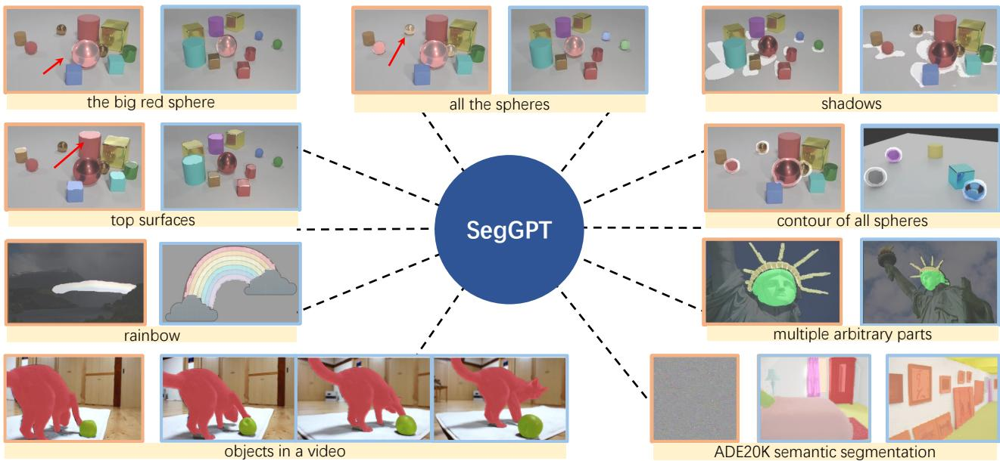

Figure 1: SegGPT is capable of segmenting everything in context with only one single model, which uses in-context examples to indicate different tasks. For each sample, the orange box □ on the left displays the example/prompt image and its corresponding mask, while the blue box □ on the right shows the input image and the resulting mask output. The mask represents the bright region attached to the image. The caption for each sample (in the yellow box) is only for explanation. Notably, SegGPT can perform arbitrary object segmentation (segment different components of the scene, such as the big red sphere, all the spheres, contour of all spheres, top surfaces, and shadows), multiple part segmentation (specialized parts of the iconic Statue of Liberty), rainbow segmentation, video object segmentation without videos in training, and close-set semantic segmentation with learnable prompt tuning. More examples are shown in Figure 5.

## Abstract

We present SegGPT, a generalist modelfor segmenting everything in context. We unify various segmentation tasks into a generalist in-context learningframework that accommo dates different kinds of segmentation data by transforming them into the same format of images. The training of Seg-GPT is formulated as an in-context coloring problem with random color mapping for each data sample. The objective is to accomplish diverse tasks according to the context, rather than relying on specific colors. After training, Seg-GPT can perform arbitrary segmentation tasks in images

or videos via in-context inference, such as object instance, stuff, part, contour, and text. SegGPT is evaluated on a broad range oftasks, includingfew-shot semantic segmentation, video object segmentation, semantic segmentation, and panoptic segmentation. Our results show strong capabilities in segmenting in-domain and out-of-domain targets, either qualitatively or quantitatively.

## 1. Introduction

Segmentation is one of the most fundamental problems in computer vision, which aims to localize and re-organize meaningful concepts at the pixel level, e.g., foreground, category, object instance, etc. During recent years, we have witnessed great progress in developing more accurate and faster algorithms for various segmentation tasks, such as foreground segmentation [45], interactive segmentation [55, 38], semantic segmentation [36, 32, 58, 43], instance segmentation [20, 13, 4, 52], and panoptic segmentation [26, 7, 10].

However, these specialist segmentation models are limited to specific tasks, classes, granularities, data types, etc. A new model has to be trained when adapting to a different setting, e.g., to segment a novel concept, or to segment ob jects in videos instead of images. This requires expensive annotation efforts and is not sustainable for a large number of segmentation tasks.

In this work, we aim to train a single model that is capable of solving diverse and unlimited segmentation tasks. The main challenges are twofold: (1) to incorporate those very different data types in training, e.g., part, semantic, instance, panoptic, person, medical image, aerial image, etc.; (2) to design a generalizable training scheme that differs from conventional multi-task learning, which is flexible on task definition and is capable of handling out-of-domain tasks.

To address these challenges, we present SegGPT, a generalist model for segmenting everything in context. We view segmentation as a general format for visual perception and unify different segmentation tasks into a generalist in-context learning framework [50]. This framework accommodates different kinds of segmentation data by transforming them into the same format of images. The training of SegGPT is formulated as an in-context coloring problem with random color mapping for each data sample. The objective is to color the corresponding areas, such as classes, object instances, parts, etc., only according to the context. By using a random coloring scheme, the model is forced to reference contextual information to complete the assigned task, instead of relying on specific colors. This allows for a more flexible and generalizable approach to training. The remaining parts of training keep the same as [50] using a vanilla ViT [46] and a simple smooth- ${ \boldsymbol { \mathbf { \ell } } } _ { \mathbf { \ell } } - { \boldsymbol { \ell } } _ { 1 }$ [19] loss.

After training, SegGPT is able to perform diverse segmentation tasks in images or videos given a few examples via in-context inference, such as object instance, stuff, part, contour, text, etc. To effectively ensemble multiple examples in context, we propose a simple yet effective context ensemble strategy, the feature ensemble, which can help the model benefit from the multi-example prompting setting. Additionally, SegGPT can conveniently serve as a specialist model without updating the model parameters, by tuning a specific prompt for a specialized use case, such as in-domain ADE20K semantic segmentation.

Our main contributions are as follows. (1) For the first time, we demonstrate a single generalist model capable of performing a diverse set of segmentation tasks automatically. (2) We evaluate the pre-trained SegGPT on a broad range of tasks directly, i.e., without fine-tuning, including few-shot semantic segmentation, video object segmentation, semantic segmentation, and panoptic segmentation. (3) Our results show strong capabilities in segmenting in-domain and outof-domain targets, either qualitatively or quantitatively.

However, this work does not aim to claim new stateof-the-art results or outperform existing specialist methods across all benchmarks, as we believe that this may not be the responsibility of a general-purpose model.

## 2. Related Work

## 2.1. Visual Segmentation

Segmentation is a fundamental problem in computer vision that involves localizing and organizing meaningful concepts at the pixel level. The type of segmentation task varies depending on the definition of the concepts, such as foreground, category, or object instance. For example, semantic segmentation [59] involves pixel-level semantic classification of an image, while instance segmentation [34] aims to identify different object instances and their categories. Video object segmentation [56, 41, 14] is the task of segmenting a particular object throughout the entire video sequence given only the object mask of the first frame.

Previous segmentation methods [36, 32, 58, 43, 20, 13, 4, 52, 26, 7, 10] have been designed specifically for certain tasks and cannot be generalized for switching tasks or changing categories. This paper introduces a general interface that is compatible with all segmentation tasks with an appropriate training scheme, a single generalist model can achieve good performance on both in-domain and out-of-domain segmentation tasks, either qualitatively or quantitatively.

## 2.2. Vision Generalist

In recent years, there have been efforts to unify different tasks in the vision domain using Transformer-based models, resulting in several vision generalists [8, 9, 60, 37, 27]. DETR [7] is one of the first to adopt Transformer [46] as a task-specific head for object detection. Pix2Seq series [8, 9] defines the output spaces of vision tasks as discrete ones and performs the task of object detection, instance segmentation, keypoint estimation, and image captioning, in an auto-regressive manner. Unified-IO [37] and OFA [49] perform joint modeling across vision, vision & language, and NLP tasks in a sequence-to-sequence manner, that both the inputs and outputs are defined to a sequence of discrete tokens. UViM [27] unifies pixel-labeling tasks together, such as panoptic segmentation, depth estimation, and colorization, but trains separate models for each.

Although these works all appear to unify different tasks into similar spaces, they actually accomplish each task through some form of hard indicators, such as a special token, making it difficult to generalize to new tasks. In contrast, this work uses an in-context framework that maintains flexibility on task definition and utilizes a random coloring scheme to prevent the model from collapsing into a multitask learning solution and instead forces it to accomplish the assigned task via referring contextual information. Another difference is the scope of the tasks. This work primarily focuses on a crucial category in visual perception, namely image segmentation.

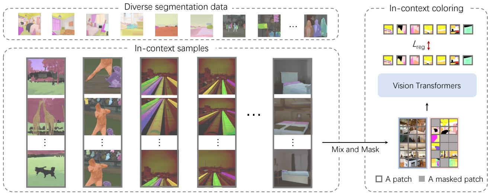  
Figure 2: Illustration of overall training framework of SegGPT. We incorporate diverse segmentation data, including part, semantic, instance, panoptic, person, medical image, and aerial image segmentation, and transform them into the same format of images. We generate in-context samples that share similar contexts on-the-fly, e.g., the overlapped colors shown in each column, which indicate the same category or the same instance. We adopt a general Painter [50] framework with in-context coloring as the training objective and a random coloring scheme for more flexible and generalizable training.

## 2.3. In-Context Visual Learning

GPT-3 [5] introduces the concept of in-context learning to deep learning, which allows a series of NLP tasks to be formulated as text completion problems given prompts and examples. In computer vision, [3] first proposes an in-context training framework using inpainting with discrete tokens on figures and infographics from vision articles, demonstrating the framework’s capabilities in foreground segmentation, single object detection, and colorization. Painter [50] adopts masked image modeling on continuous pixels to perform in-context training with supervised datasets, on seven diverse and challenging vision tasks, achieving highly competitive results on these tasks.

Our work builds upon the Painter framework, but with a specific focus on the segmentation task due to its central role in visual perception. Thus this work unifies diverse segmentation data including semantic segmentation, instance segmentation, part segmentation, and even those for special scenarios like aerial images. Additionally, we design a random coloring scheme that forces the model to reference contextual information to complete the assigned task but not collapse into the multi-task solution. As segmentation tasks and datasets have less variability than depth/pose estimation, it is easier to share internal structures for effective training of in-domain tasks, while maintaining the generalization capability to out-of-domain segmentation tasks.

## 3. Approach

SegGPT is a special version of Painter [50] framework which enables to segment everything with a generalist Painter, thus the name of our model, SegGPT. The Painter framework redefines the output space of vision tasks as “images” and unifies different tasks, e.g., depth estimation, semantic segmentation, instance segmentation, keypoint detec tion and image restoration, into the same image inpainting problem. Given an input image, prediction is to inpaint the desired but missing output “image”. The training is to randomly mask the task output images and reconstruct the missing pixels.

To maintain the simplicity and generality, we make no modifications to the architecture and loss function, i.e., a vanilla ViT [15] and a simple smooth- ${ \boldsymbol { \cdot } } { \boldsymbol { \ell } } _ { 1 }$ [19] loss, but design a new random coloring scheme in in-context training for better generalization capability, as illustrated in Figure 2.

## 3.1. In-Context Coloring

In the traditional framework of Painter, the color space for each task is pre-defined, resulting in the solution collapse into multi-task learning. For example, for semantic segmentation, a set of colors is pre-defined, and each semantic category is assigned a fixed color. Similarly, in instance segmentation, the color of an instance object is assigned according to its location categories, i.e., the number of colors equals the number of spatial locations, resulting in the model only relying on the color itself to determine the task, rather than using the relationships between segments.

To address this limitation, we propose a random coloring scheme for in-context coloring. We begin by randomly sampling another image that shares a similar context with the input image, such as the same semantic category or object instance. Next, we randomly sample a set of colors from the target image and map each color to a random one. This results in a re-coloring of the corresponding pixels. As a result, we get two pairs of images, which are defined as an in-context pair. In addition, we introduce the mix-context training method which trains the model using mixed exam ples. This involves stitching together multiple images with the same color mapping. The resulting image is then randomly cropped and resized to form a mixed-context training sample. By doing so, the model learns to focus on the contextual information of the image rather than just relying on specific color information to determine the task.

Such unification allows us to utilize all segmentation datasets in a consistent way, only varying the data sampling strategy depending on the specific task. We define different contexts according to different data types. For semantic segmentation, we randomly sample the categories. For instance segmentation, object instances are sampled in random numbers. The different views of the same image, e.g., transformed by a set of augmentations, are treated as the images in context. In the implementation, the sampling is all about colors, e.g., the same color refers to either the same category or the same instance.

## 3.2. Context Ensemble

Once the training is finished, its full power can be unleashed during inference. SegGPT enables arbitrary segmentation in context, e.g., with an example of a single image and its target image. The target image can be of a single color (excluding the background), or multiple colors, e.g., segmenting several categories or objects of interest in one shot. Specifically, given an input image to be tested, we stitch it with the example image and feed it to SegGPT to get the corresponding in-context predictions.

To serve a more accurate and concrete context, multiple examples can be used. For instance, several examples of the same semantic category, or the previous frames in a video, can be employed. To efficiently leverage multiple examples for a SegGPT model, we propose two context ensemble approaches, as illustrated in Figure 3. One is called Spatial Ensemble, multiple examples concatenated in n × n grid and then sub-sampled to the same size as a single example. This approach is in line with the intuition of in-context coloring and the semantic information of multiple examples can be in-context extracted with almost no additional cost. Another approach is Feature Ensemble. Multiple examples are combined in the batch dimension and computed independently except that features of the query image are averaged after each attention layer. In this way, the query image gathers information about multiple examples during inference.

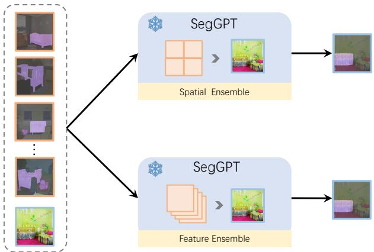  
Figure 3: Illustration of our proposed context ensemble strategies for multi-example inference: the spatial ensemble (top) and the feature ensemble (bottom). The spatial en semble strategy involves stitching multiple example images together and resizing them to the input resolution. The feature ensemble strategy averages features of the query image after each attention layer so that the query image aggregates all the reference examples.

Different from the existing prompt ensemble methods in NLP [28, 23] that ensemble prediction logits of multiple prompts and visual prompting method [3] that ensembles multiple prompts in horizontal and vertical layouts in visual tasks, our proposed Feature Ensemble enables to interact at intermediate features, which allows our model to leverage any number of prompts and to model the temporal relationships in videos.

## 3.3. In-Context Tuning

SegGPT is capable of adapting to a unique use case without updating the model parameters. As shown in Figure 4, we freeze the whole model and initialize a learnable image tensor as the input context. Only this learnable image ten sor is updated during the training. The rest of the training remains the same, e.g., the same loss function. After the tuning, we take the learned image tensor out and use it as a plug-and-play key for a specific application. For example, given a dataset with a fixed set of object categories, e.g., ADE20K, we could train a customized prompt for this dataset, while there is no harm to the generality of the model. Or, we could optimize a prompt image for a specific scene, e.g., your apartment, or a specific character, e.g., Bert’s face. This opens up opportunities for a broad range of applications. Different from [2] that performs visual prompt tuning on CLIP for image classification via padding 30 pixels as the prompt, ours is for general-purpose segmentation and we naturally have an image interface for visual prompting.

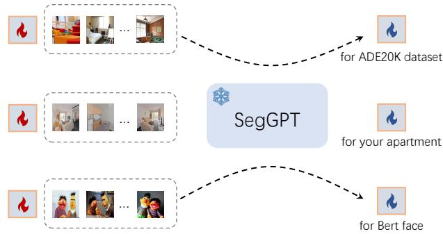  
Figure 4: Illustration of in-context tuning on different task specifications. For in-context tuning, we freeze the whole pre-trained model and only optimize the learnable image tensor which serves as the input context. We can perform the in-context prompt tuning on the specific datasets (ADE-20K semantic segmentation), specific scenes (your apartment), and even specific characters (Bert’s face).

## 4. Experiment

## 4.1. Training Data

Our approach uses a diverse set of segmentation datasets, including part, semantic, instance, panoptic, person, retinalvessel, and aerial-image segmentation. Unlike previous methods that relied on handcrafted label merging to combine different types of segmentation datasets, our method offers a unified perspective that eliminates the need for additional effort or adjustment on the datasets. In particular, our approach does not require any modifications to either the architecture or training pipeline when adding an extra dataset.

ADE20K [59] provides segmentation labels for 150 semantic categories, with a total of 25K images, including 20K training images, 2K validation images, and 3K testing images.

COCO [34] is a widely used visual perception dataset that supports instance segmentation, semantic segmentation and panoptic segmentation. It contains 118K training images and 5K validation, with 80 “things” and 53 “stuff” categories.

PASCAL VOC [16] is a classic object recognition dataset. We use the augmented segmentation version which provides annotations of 20 categories on 10582 training images.

Cityscapes [12] focuses on the scene understanding of the street views. We use the 2954 training images with semantic segmentation annotations of 19 categories.

LIP [30] focuses on the semantic understanding of the person. We use the 30385 training images with segmentation labels of 19 human part categories.

PACO [42] is a newly released dataset that provides annotations for the parts and attributes of common objects. We process and use the 41807 training images with part annotations.

CHASE DB1 [18], DRIVE [44], HRF [6] and STARE [22] provide annotations for retinal vessel segmentation. We augment the high-resolution raw images with random cropping. iSAID [53] and loveDA [48] focus on semantic understanding in aerial images, with 23262 and 2520 training images for 15 and 6 semantic categories respectively.

## 4.2. One-Shot Training Details

Our approach for segmentation tasks utilizes a general interface, where we emphasize that we only train one generalist model with a mixture of datasets, and evaluated this model on diverse benchmarks. Following [50], we use a Vision Transformer (ViT-L) encoder [15], which has 307M parameters. We use a pre-trained checkpoint from [50] as the initialization. We employ an AdamW optimizer [25] and a cosine learning rate scheduler, with a base learning rate 1e−4. Weight decay is set to 0.05. The batch size is 2048. We train for 9K iterations, with a warm-up period of 1.8K iterations. We use a set of data augmentations including random resize cropping, color jittering, and random horizontal flipping. The size of a single input image is 448 × 448.

## 4.3. Qualitative Results

To demonstrate the capability of our SegGPT in an intuitive perspective, we visualize the task output of the selected images with the specialized task prompts, shown in Figure 1 and Figure 5. These two figures include a wide range of segmentation tasks, such as arbitrary part/object segmentation with varied granularities, text segmentation, video object segmentation without videos in training, and close-set instance/semantic segmentation with learnable prompt tuning. Figure 6 presents more visualizations on video object segmentation of YouTube-VOS 2018 dataset. From these visualizations, SegGPT demonstrates the ability to make highly accurate predictions across a wide range of tasks, while maintaining super flexibility in the task definition.

## 4.4. Comparison with Specialist Methods

Few-shot semantic segmentation. We evaluate the performance of SegGPT, on two settings of few-shot semantic segmentation: in-domain on COCO-20i/PASCAL-5i, and out-of-domain on FSS-1000. Table 1 shows the results of example-based semantic segmentation on COCO-20i/PASCAL-5i. For a fair comparison, we also evaluate specialist models on in-domain categories marked by \*. Our results indicate that SegGPT can achieve comparable or significantly better performance than recently published stateof-the-art specialist models on these two benchmarks. Note that the prior art FPTrans trains separate models with different shots. Furthermore, SegGPT surpasses the generalist Painter [50] by a considerable margin.

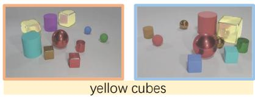

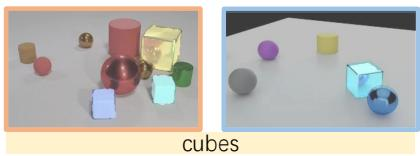

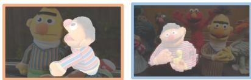

  
one of the Twelve Apostles

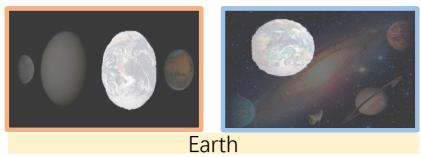

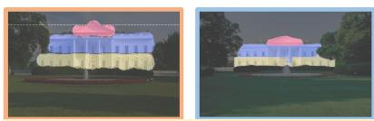  
multiple arbitrary parts

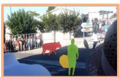

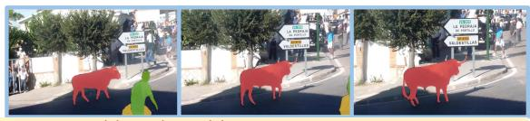  
objects in a video

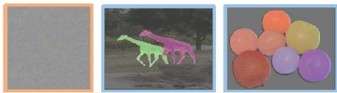  
COCO instance segmentation

Figure 5: More visualizations. For each sample, the orange box □ on the left displays the example/prompt image and its corresponding mask, while the blue box □ on the right shows the input image and the resulting mask output. The mask is visualized via the bright region attached to the image. SegGPT can perform arbitrary object/part segmentation (cubes, yellow cubes, Ernie, one of the Twelve Apostles, earth, multiple arbitrary parts), video object segmentation without videos in training, and close-set instance segmentation on COCO with learnable prompt tuning.  
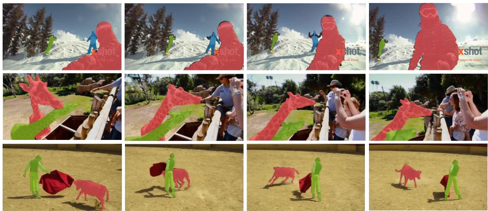  
Figure 6: Qualitative results of video object segmentation on YouTube-VOS 2018.

Table 2 presents the results of few-shot semantic segmentation on FSS-1000 with out-of-domain categories. Compared to specialist models trained on FSS-1000, SegGPT exhibits highly competitive performance. Notably, our model is not trained on the FSS-1000 dataset at all, yet still achieves remarkable results, demonstrating its effectiveness.

Video object segmentation. Video object segmentation (VOS) is a task that segments a particular object in video frames. In this work, we focus on the semi-supervised VOS setting and evaluate our proposed method, SegGPT, on the validation split of three datasets: YouTube-VOS 2018 [56], DAVIS 2017 [41], and the recently release challenging benchmark MOSE [14]. We use two metrics commonly used in VOS for evaluation: the J score and the F score, and we evaluate our results with official evaluation servers or tools.

<table><tr><td rowspan="2">method</td><td rowspan="2">venue</td><td colspan="2">COCO-20i</td><td colspan="2">PASCAL-5¹</td></tr><tr><td>one-shot</td><td>few-shot</td><td>one-shot</td><td>few-shot</td></tr><tr><td>specialist model</td><td></td><td></td><td></td><td></td><td></td></tr><tr><td>HSNet [39]</td><td>ICCV’21</td><td>41.2</td><td>49.5</td><td>66.2</td><td>70.4</td></tr><tr><td>HSNet*</td><td></td><td>41.7</td><td>50.7</td><td>68.7</td><td>73.8</td></tr><tr><td>VAT [21]</td><td>ECCV’22</td><td>41.3</td><td>47.9</td><td>67.9</td><td>72.0</td></tr><tr><td>VAT*</td><td></td><td>42.9</td><td>49.4</td><td>72.4</td><td>76.3</td></tr><tr><td>FPTrans [57]</td><td>NeurIPS’22</td><td>47.0</td><td>58.9</td><td>68.8</td><td>78.0</td></tr><tr><td>FPTrans*</td><td></td><td>56.5</td><td>65.5</td><td>77.7</td><td>83.2</td></tr><tr><td>generalist model</td><td></td><td></td><td></td><td></td><td></td></tr><tr><td>Painter</td><td>CVPR&#x27;23</td><td>32.8</td><td>32.6</td><td>64.5</td><td>64.6</td></tr><tr><td>SegGPT</td><td>this work</td><td>56.1</td><td>67.9</td><td>83.2</td><td>89.8</td></tr></table>

Table 1: Quantitative results on COCO-20i and PASCAL-5i of example-based semantic segmentation. \* indicates that the categories in training cover the categories in testing.

<table><tr><td rowspan="2">method</td><td rowspan="2">venue</td><td colspan="2">mIoU</td></tr><tr><td>one-shot</td><td>few-shot</td></tr><tr><td>trained on FSS-1000</td><td></td><td></td><td></td></tr><tr><td>DAN [47]</td><td>ECCV&#x27;20</td><td>85.2</td><td>88.1</td></tr><tr><td>HSNet [39]</td><td>ICCV&#x27;21</td><td>86.5</td><td>88.5</td></tr><tr><td>SSP [17]</td><td>ECCV&#x27;22</td><td>87.3</td><td>88.6</td></tr><tr><td>VAT [21]</td><td>ECCV&#x27;22</td><td>90.3</td><td>90.8</td></tr><tr><td>DACM [54]</td><td>ECCV&#x27;22</td><td>90.8</td><td>91.7</td></tr><tr><td colspan="2">not trained on FSS-1000</td><td></td><td></td></tr><tr><td>Painter</td><td>CVPR&#x27;23</td><td>61.7</td><td>62.3</td></tr><tr><td>SegGPT</td><td>this work</td><td>85.6</td><td>89.3</td></tr></table>

Table 2: Quantitative results on few-shot semantic segmentation on FSS-1000. SegGPT achieves remarkable results although not trained on FSS-1000.

SegGPT performs video object segmentation by converting the first frame and its object mask to in-context coloring examples. When testing a current frame, we use its previous K frames (if have) for constructing multiple examples. Object masks for these frames have been predicted and stored by a queue. After multiple examples are constructed, Feature Ensemble (describe in Section 3.2) is applied and the prediction result will be stored for the next frame. We evaluate our model on several benchmarks, and the results are presented in Table 3. Despite not being specifically trained for the task, our approach achieves competitive results with the specialist models trained on these datasets. For instance, on YouTube-VOS 2018 [56], our method outperformed the task-specific approach AGAME [24] and AGSS [33] by clear margins. On the challenging MOSE benchmark which focuses on complex scenes, SegGPT even performs comparably with the state-of-the-art method RDE [29]. HODOR [1] can also achieve favorable results in video object segmentation without using video data for training, but it remains a specialist model tailored for the task.

## 4.5. Ablation Study

Here we ablate two context ensemble strategies, namely spatial and feature ensemble. Results are shown in Table 4a. Our findings reveal that the spatial ensemble approach performs well on FSS-1000 dataset but experiences a performance drop on DAVIS 2017. We attribute this to the fact that the spatial ensemble employs the sub-sampling on the examples. Notably, FSS-1000 dataset has a lower image resolution (224×224) compared to the high-resolution DAVIS dataset (640×480), and therefore, sub-sampling does not result in significant information loss for FSS-1000. While, we observe that feature ensemble can reduce this information loss on sub-sampling, and achieve significantly better performance on DAVIS 2017.

We also ablate the number of frames in DAVIS 2017, as shown in Table 4b. As the number of frames increases, the performance initially improves before reaching a point of diminishing returns. In particular, we observe that the optimal performance is achieved when using 8 frames.

## 4.6. In-Context Tuning

In-context tuning enables to customize a unique application with a set of data samples. For example, to tune a prompt for a specific dataset, scene, or even a person. Specifically, we define the task prompt as the learnable tensors, freeze the whole model, and then use the same training loss to optimize the task prompts. Here, we conduct in-context tuning on the challenging ADE20K semantic segmentation and COCO panoptic segmentation. We evaluate SegGPT with learnable prompts on the corresponding benchmarks.

Results on ADE20K semantic segmentation are shown in Table 5. Our model SegGPT achieves competitive performance with specialist models like RefineNet. However, compared to the generalist Painter, our approach shows a 10.3 point drop in mIoU. This observation can be explained by the introduction of a random color scheme, which makes it more challenging for the model to use color as a simple indicator of in-domain tasks. Instead, the model needs to rely on context examples to determine the task, making optimization much more difficult. Similarly, Table 6 shows the results of our SegGPT model on COCO panoptic segmentation. Here, we again observe a 9.0 point drop in PQ compared to the generalist Painter. Outperforming all specialist methods in specific benchmarks is not the purpose of this work, and we believe there is much room to improve in

<table><tr><td rowspan="2">method</td><td rowspan="2">venue</td><td colspan="5">YouTube-VOS 2018 [56]</td><td colspan="3">DAVIS 2017 [41]</td><td colspan="3">MOSE [14]</td></tr><tr><td>G</td><td> $J _ { s }$ </td><td> $F _ { s }$ </td><td> $J _ { u }$ </td><td> $F _ { u }$ </td><td>J&amp;F</td><td>J</td><td>F</td><td>J&amp;F</td><td>J</td><td>F</td></tr><tr><td>with video data</td><td></td><td></td><td></td><td></td><td></td><td></td><td></td><td></td><td></td><td></td><td></td><td></td></tr><tr><td>AGAME [24]</td><td>CVPR&#x27;19</td><td>66.0</td><td>66.9</td><td></td><td>61.2</td><td></td><td>70.0</td><td>67.2</td><td>72.7</td><td></td><td></td><td></td></tr><tr><td>AGSS [33]</td><td>ICCV&#x27;19</td><td>71.3</td><td>71.3</td><td>65.5</td><td>75.2</td><td>73.1</td><td>67.4</td><td>64.9</td><td>69.9</td><td></td><td></td><td></td></tr><tr><td>STM [40]</td><td>ICCV&#x27;19</td><td>79.4</td><td>79.7</td><td>84.2</td><td>72.8</td><td>80.9</td><td>81.8</td><td>79.2</td><td>84.3</td><td></td><td></td><td></td></tr><tr><td>AFB-URR [31]</td><td>NeurIPS&#x27;20</td><td>79.6</td><td>78.8</td><td>83.1</td><td>74.1</td><td>82.6</td><td>74.6</td><td>73.0</td><td>76.1</td><td></td><td></td><td></td></tr><tr><td>RDE [29]</td><td>CVPR&#x27;22</td><td>83.3</td><td>81.9</td><td>86.3</td><td>78.0</td><td>86.9</td><td>86.1</td><td>82.1</td><td>90.0</td><td>48.8</td><td>44.6</td><td>52.9</td></tr><tr><td>SWEM [35]</td><td>CVPR&#x27;22</td><td>82.8</td><td>82.4</td><td>86.9</td><td>77.1</td><td>85.0</td><td>84.3</td><td>81.2</td><td>87.4</td><td>50.9</td><td>46.8</td><td>54.9</td></tr><tr><td>XMem [11]</td><td>ECCV&#x27;22</td><td>86.1</td><td>85.1</td><td>89.8</td><td>80.3</td><td>89.2</td><td>87.7</td><td>84.0</td><td>91.4</td><td>57.6</td><td>53.3</td><td>62.0</td></tr><tr><td>without video data</td><td></td><td></td><td></td><td></td><td></td><td></td><td></td><td></td><td></td><td></td><td></td><td></td></tr><tr><td>HODOR [1]</td><td>CVPR&#x27;22</td><td></td><td></td><td></td><td></td><td></td><td>77.5</td><td>74.7</td><td>80.2</td><td></td><td></td><td></td></tr><tr><td>Painter</td><td>CVPR&#x27;23</td><td>24.1</td><td>27.6</td><td>35.8</td><td>14.3</td><td>18.7</td><td>34.6</td><td>28.5</td><td>40.8</td><td>14.5</td><td>10.4</td><td>18.5</td></tr><tr><td>SegGPT</td><td>this work</td><td>74.7</td><td>75.1</td><td>80.2</td><td>67.4</td><td>75.9</td><td>75.6</td><td>72.5</td><td>78.6</td><td>45.1</td><td>42.2</td><td>48.0</td></tr></table>

Table 3: Quantitative results of video object segmentation on YouTube-VOS 2018, DAVIS 2017, and MOSE. Notably, Painter and SegGPT do not use any video data in training. Note that HODOR is a specialist model. G is the average score over “seen” and “unseen” classes in YouTube-VOS 2018.
<table><tr><td rowspan="2">examples</td><td rowspan="2">ensemble</td><td colspan="3">DAVIS 2017</td><td colspan="2">FSS-1000</td></tr><tr><td>J&amp;F</td><td>J</td><td>F</td><td>mIoU</td><td>FB-IoU</td></tr><tr><td>1</td><td></td><td>70.0</td><td>66.4</td><td>73.7</td><td>85.5</td><td>90.8</td></tr><tr><td>4</td><td>Spatial</td><td>61.9</td><td>58.0</td><td>65.8</td><td>89.3</td><td>93.5</td></tr><tr><td>4</td><td>Feature</td><td>74.7</td><td>71.6</td><td>77.7</td><td>87.8</td><td>92.4</td></tr><tr><td>8</td><td>Feature</td><td>75.6</td><td>72.5</td><td>78.6</td><td>89.8</td><td>93.8</td></tr></table>

(a)

<table><tr><td rowspan="2">frames</td><td colspan="4">DAVIS 2017</td></tr><tr><td>1</td><td>4 8</td><td>12</td><td>16</td></tr><tr><td>J&amp;F</td><td>70.0</td><td>74.7</td><td>75.6 74.8</td><td>74.6</td></tr><tr><td>J</td><td>66.4</td><td>71.6</td><td>72.5 71.6</td><td>71.4</td></tr><tr><td>F</td><td>73.7</td><td>77.7</td><td>78.6 77.9</td><td>77.8</td></tr></table>

(b)

Table 4: Ablation study on ensemble strategy (a) and the number of frames (b) in in-context inference. Spatial ensemble approach performs well on FSS-1000 dataset but experiences a performance drop on DAVIS 2017. Feature ensemble achieves better results due to no sub-sampling.
<table><tr><td>method</td><td>venue</td><td>mIoU</td></tr><tr><td>specialist model</td><td></td><td></td></tr><tr><td>FCN [36]</td><td>CVPR&#x27;15</td><td>29.4</td></tr><tr><td>RefineNet [32]</td><td>CVPR&#x27;17</td><td>40.7</td></tr><tr><td>DPT [43]</td><td>ICCV&#x27;21</td><td>49.2</td></tr><tr><td>Mask2Former [10]</td><td>CVPR&#x27;22</td><td>57.7</td></tr><tr><td>generalist model</td><td></td><td></td></tr><tr><td>Painter</td><td>CVPR&#x27;23</td><td>49.9</td></tr><tr><td>SegGPT</td><td>this work</td><td>39.6</td></tr></table>

Table 5: Results on ADE20K semantic segmentation.

the future.
<table><tr><td>method</td><td>venue</td><td>PQ</td></tr><tr><td>specialist model</td><td></td><td>40.3</td></tr><tr><td>PanopticFPN [26]</td><td>CVPR&#x27;19</td><td>42.1</td></tr><tr><td>SOLOv2 [51] Mask2Former [10]</td><td>NeurIPS&#x27;20 CVPR&#x27;22</td><td>57.8</td></tr><tr><td>UViM [27]</td><td>NeurIPS&#x27;22</td><td>45.8</td></tr><tr><td>generalist model</td><td></td><td></td></tr><tr><td></td><td></td><td></td></tr><tr><td>Painter SegGPT</td><td>CVPR&#x27;23 this work</td><td>43.4 34.4</td></tr></table>

Table 6: Results on COCO panoptic segmentation.

## 5. Discussion and Conclusion

In this work, we present a generalist segmentation model, showing how to design an appropriate training strategy to fully leverage the flexibility of in-context visual learning. Our model exhibits strong capabilities in handling both indomain and out-of-domain segmentation tasks, including object instance, stuff, part, contour, text segmentation, etc.

This work is not without drawbacks. While our work introduces a new random coloring regime for better generalization capability of in-context training, it also makes the training task inherently more difficult, which may be the reason for inferior performance in in-domain tasks with ample training data, such as semantic segmentation on ADE20K and panoptic segmentation on COCO.

Looking forward, we believe that our approach has the potential to serve as a powerful tool for enabling more diverse applications in image/video segmentation, by leveraging the flexibility in task definition with in-context inference. Scaling up model size is one avenue that we plan to pursue to further improve performance. With larger models, more complex patterns in the data can be captured, which may lead to better segmentation results. However, this comes with the challenge of finding more data. One potential solution is to explore self-supervised learning techniques. We hope that our work will inspire the community to continue exploring the potential of in-context learning in computer vision. We remain optimistic that the best GPT-3 moment in the vision field is yet to come.

## Acknowledgement

This project is supported by the National Key R&D Program of China (2022ZD0116302). We would like to thank Yemin Shi and Teng Dai for their help on the demo, Hanxiao Qu, Yan Tian, and Xigang Cao for the help on GPU resources, as well as other colleagues at Beijing Academy of Artificial Intelligence for support throughout this project.

## References

[1] Ali Athar, Jonathon Luiten, Alexander Hermans, Deva Ramanan, and Bastian Leibe. Hodor: High-level object descriptors for object re-segmentation in video learned from static images. In Proceedings of the IEEE/CVF Conference on Computer Vision and Pattern Recognition, pages 3022–3031, 2022. 7, 8

[2] Hyojin Bahng, Ali Jahanian, Swami Sankaranarayanan, and Phillip Isola. Exploring visual prompts for adapting largescale models. arXiv preprint arXiv:2203.17274, 2022. 5

[3] Amir Bar, Yossi Gandelsman, Trevor Darrell, Amir Globerson, and Alexei A. Efros. Visual prompting via image inpainting. Adv. Neural Inform. Process. Syst., pages 1–24, 2022. 3, 4

[4] Daniel Bolya, Chong Zhou, Fanyi Xiao, and Yong Jae Lee. Yolact: Real-time instance segmentation. In Int. Conf. Comput. Vis., 2019. 2

[5] Tom Brown, Benjamin Mann, Nick Ryder, Melanie Subbiah, Jared Kaplan, Prafulla Dhariwal, Arvind Neelakantan, Pranav Shyam, Girish Sastry, Amanda Askell, et al. Language models are few-shot learners. arXiv preprint arXiv:2005.14165, 2020. 3

[6] Attila Budai, Rudiger Bock, Andreas Maier, Joachim Horneg-¨ ger, and Georg Michelson. Robust vessel segmentation in

fundus images. International journal of biomedical imaging, 2013, 2013. 5

[7] Nicolas Carion, Francisco Massa, Gabriel Synnaeve, Nicolas Usunier, Alexander Kirillov, and Sergey Zagoruyko. End-toend object detection with transformers. In Eur. Conf. Comput. Vis., pages 213–229, 2020. 2

[8] Ting Chen, Saurabh Saxena, Lala Li, David J. Fleet, and Geoffrey Hinton. Pix2seq: A language modeling framework for object detection. Int. Conf. Learn. Representations, pages 1–17, 2021. 2

[9] Ting Chen, Saurabh Saxena, Lala Li, Tsung-Yi Lin, David J. Fleet, and Geoffrey Hinton. A unified sequence interface for vision tasks. Adv. Neural Inform. Process. Syst., 2022. 2

[10] Bowen Cheng, Ishan Misra, Alexander G Schwing, Alexander Kirillov, and Rohit Girdhar. Masked-attention mask transformer for universal image segmentation. arXiv preprint arXiv:2112.01527, 2021. 2, 8

[11] Ho Kei Cheng and Alexander G Schwing. Xmem: Long-term video object segmentation with an atkinson-shiffrin memory model. In Computer Vision–ECCV 2022: 17th European Conference, Tel Aviv, Israel, October 23–27, 2022, Proceedings, Part XXVIII, pages 640–658. Springer, 2022. 8

[12] Marius Cordts, Mohamed Omran, Sebastian Ramos, Timo Rehfeld, Markus Enzweiler, Rodrigo Benenson, Uwe Franke, Stefan Roth, and Bernt Schiele. The cityscapes dataset for semantic urban scene understanding. In Proceedings ofthe IEEE conference on computer vision and pattern recognition, pages 3213–3223, 2016. 5

[13] Bert De Brabandere, Davy Neven, and Luc Van Gool. Semantic instance segmentation with a discriminative loss function. arXiv:1708.02551, 2017. 2

[14] Henghui Ding, Chang Liu, Shuting He, Xudong Jiang, Philip HS Torr, and Song Bai. Mose: A new dataset for video object segmentation in complex scenes. arXiv preprint arXiv:2302.01872, 2023. 2, 6, 8

[15] Alexey Dosovitskiy, Lucas Beyer, Alexander Kolesnikov, Dirk Weissenborn, Xiaohua Zhai, Thomas Unterthiner, Mostafa Dehghani, Matthias Minderer, Georg Heigold, Sylvain Gelly, Jakob Uszkoreit, and Neil Houlsby. An image is worth 16x16 words: Transformers for image recognition at scale. In Int. Conf. Learn. Representations, 2021. 3, 5

[16] Mark Everingham, Luc Van Gool, Christopher KI Williams, John Winn, and Andrew Zisserman. The pascal visual object classes (voc) challenge. International journal of computer vision, 88:303–308, 2009. 5

[17] Qi Fan, Wenjie Pei, Yu-Wing Tai, and Chi-Keung Tang. Selfsupport few-shot semantic segmentation. In Eur. Conf. Comput. Vis., pages 701–719. Springer, 2022. 7

[18] Muhammad Moazam Fraz, Paolo Remagnino, Andreas Hoppe, Bunyarit Uyyanonvara, Alicja R Rudnicka, Christopher G Owen, and Sarah A Barman. An ensemble classification-based approach applied to retinal blood vessel segmentation. IEEE Transactions on Biomedical Engineering, 59(9):2538–2548, 2012. 5

[19] Ross Girshick. Fast R-CNN. In IEEE Conf. Comput. Vis. Pattern Recog., 2015. 2, 3

[20] Kaiming He, Georgia Gkioxari, Piotr Dollar, and Ross Gir-´ shick. Mask R-CNN. In Int. Conf. Comput. Vis., 2017. 2

[21] Sunghwan Hong, Seokju Cho, Jisu Nam, Stephen Lin, and Seungryong Kim. Cost aggregation with 4d convolutional swin transformer for few-shot segmentation. In European Conference on Computer Vision, pages 108–126. Springer, 2022. 7

[22] AD Hoover, Valentina Kouznetsova, and Michael Goldbaum. Locating blood vessels in retinal images by piecewise threshold probing of a matched filter response. IEEE Transactions on Medical imaging, 19(3):203–210, 2000. 5

[23] Zhengbao Jiang, Frank F. Xu, Jun Araki, and Graham Neubig. How can we know what language models know. Trans. Assoc. Comput. Linguistics, 8:423–438, 2020. 4

[24] Joakim Johnander, Martin Danelljan, Emil Brissman, Fahad Shahbaz Khan, and Michael Felsberg. A generative appearance model for end-to-end video object segmentation. In Proceedings of the IEEE/CVF conference on computer vision and pattern recognition, pages 8953–8962, 2019. 7, 8

[25] Diederik P Kingma and Jimmy Ba. Adam: A method for stochastic optimization. arXiv preprint arXiv:1412.6980, 2014. 5

[26] Alexander Kirillov, Ross Girshick, Kaiming He, and Piotr Dollar. Panoptic feature pyramid networks. In ´ IEEE Conf. Comput. Vis. Pattern Recog., pages 6399–6408, 2019. 2, 8

[27] Alexander Kolesnikov, Andre Susano Pinto, Lucas Beyer,´ Xiaohua Zhai, Jeremiah Harmsen, and Neil Houlsby. UViM: A unified modeling approach for vision with learned guiding codes. Adv. Neural Inform. Process. Syst., 2022. 2, 8

[28] Brian Lester, Rami Al-Rfou, and Noah Constant. The power of scale for parameter-efficient prompt tuning. In Proceedings of the 2021 Conference on Empirical Methods in Natural Language Processing, pages 3045–3059, 2021. 4

[29] Mingxing Li, Li Hu, Zhiwei Xiong, Bang Zhang, Pan Pan, and Dong Liu. Recurrent dynamic embedding for video object segmentation. In Proceedings of the IEEE/CVF Conference on Computer Vision and Pattern Recognition, pages 1332– 1341, 2022. 7, 8

[30] Xiaodan Liang, Ke Gong, Xiaohui Shen, and Liang Lin. Look into person: Joint body parsing & pose estimation network and a new benchmark. IEEE Trans. Pattern Analysis and Machine Intelligence, 41(4):871–885, 2018. 5

[31] Yongqing Liang, Xin Li, Navid Jafari, and Jim Chen. Video object segmentation with adaptive feature bank and uncertainregion refinement. Advances in Neural Information Processing Systems, 33:3430–3441, 2020. 8

[32] Guosheng Lin, Anton Milan, Chunhua Shen, and Ian Reid. Refinenet: Multi-path refinement networks for highresolution semantic segmentation. In IEEE Conf. Comput. Vis. Pattern Recog., pages 1925–1934, 2017. 2, 8

[33] Huaijia Lin, Xiaojuan Qi, and Jiaya Jia. Agss-vos: Attention guided single-shot video object segmentation. In Proceedings of the IEEE/CVF international conference on computer vision, pages 3949–3957, 2019. 7, 8

[34] Tsung-Yi Lin, Michael Maire, Serge Belongie, James Hays, Pietro Perona, Deva Ramanan, Piotr Dollar, and Lawrence´ Zitnick. Microsoft COCO: Common objects in context. In Eur. Conf. Comput. Vis., pages 740–755, 2014. 2, 5

[35] Zhihui Lin, Tianyu Yang, Maomao Li, Ziyu Wang, Chun Yuan, Wenhao Jiang, and Wei Liu. Swem: Towards realtime video object segmentation with sequential weighted expectation-maximization. In Proceedings of the IEEE/CVF Conference on Computer Vision and Pattern Recognition, pages 1362–1372, 2022. 8

[36] Jonathan Long, Evan Shelhamer, and Trevor Darrell. Fully convolutional networks for semantic segmentation. In IEEE Conf. Comput. Vis. Pattern Recog., pages 3431–3440, 2015. 2, 8

[37] Jiasen Lu, Christopher Clark, Rowan Zellers, Roozbeh Mottaghi, and Aniruddha Kembhavi. Unified-IO: A unified model for vision, language, and multi-modal tasks. arXiv preprint arXiv:2206.08916, pages 1–19, 2022. 2

[38] Sabarinath Mahadevan, Paul Voigtlaender, and Bastian Leibe. Iteratively trained interactive segmentation. In British Machine Vision Conference (BMVC), 2018. 2

[39] Juhong Min, Dahyun Kang, and Minsu Cho. Hypercorrelation squeeze for few-shot segmentation. In Proceedings of the IEEE/CVF International Conference on Computer Vision (ICCV), 2021. 7

[40] Seoung Wug Oh, Joon-Young Lee, Ning Xu, and Seon Joo Kim. Video object segmentation using space-time memory networks. In Proceedings of the IEEE/CVF International Conference on Computer Vision, pages 9226–9235, 2019. 8

[41] Jordi Pont-Tuset, Federico Perazzi, Sergi Caelles, Pablo Arbelaez, Alex Sorkine-Hornung, and Luc Van Gool. The 2017´ davis challenge on video object segmentation. arXiv preprint arXiv:1704.00675, 2017. 2, 6, 8

[42] Vignesh Ramanathan, Anmol Kalia, Vladan Petrovic, Yi Wen, Baixue Zheng, Baishan Guo, Rui Wang, Aaron Marquez, Rama Kovvuri, Abhishek Kadian, et al. Paco: Parts and attributes of common objects. arXiv preprint arXiv:2301.01795, 2023. 5

[43] Rene Ranftl, Alexey Bochkovskiy, and Vladlen Koltun. Vi-´ sion transformers for dense prediction. In IEEE Conf. Comput. Vis. Pattern Recog., pages 12179–12188, 2021. 2, 8

[44] Joes Staal, Michael D Abramoff, Meindert Niemeijer, Max A\` Viergever, and Bram Van Ginneken. Ridge-based vessel segmentation in color images of the retina. IEEE transactions on medical imaging, 23(4):501–509, 2004. 5

[45] Chris Stauffer and W Eric L Grimson. Adaptive background mixture models for real-time tracking. In Proceedings. 1999 IEEE computer society conference on computer vision and pattern recognition (Cat. No PR00149), volume 2, pages 246–252. IEEE, 1999. 2

[46] Ashish Vaswani, Noam Shazeer, Niki Parmar, Jakob Uszkoreit, Llion Jones, Aidan N Gomez, Łukasz Kaiser, and Illia Polosukhin. Attention is all you need. Adv. Neural Inform. Process. Syst., 30, 2017. 2

[47] Haochen Wang, Xudong Zhang, Yutao Hu, Yandan Yang, Xianbin Cao, and Xiantong Zhen. Few-shot semantic segmentation with democratic attention networks. In Eur. Conf. Comput. Vis., pages 730–746. Springer, 2020. 7

[48] Junjue Wang, Zhuo Zheng, Ailong Ma, Xiaoyan Lu, and Yanfei Zhong. Loveda: A remote sensing land-cover dataset for domain adaptive semantic segmentation. arXiv preprint arXiv:2110.08733, 2021. 5

[49] Peng Wang, An Yang, Rui Men, Junyang Lin, Shuai Bai, Zhikang Li, Jianxin Ma, Chang Zhou, Jingren Zhou, and Hongxia Yang. OFA: Unifying architectures, tasks, and modalities through a simple sequence-to-sequence learning framework. Int. Conf. Mach. Learn., 2022. 2

[50] Xinlong Wang, Wen Wang, Yue Cao, Chunhua Shen, and Tiejun Huang. Images speak in images: A generalist painter for in-context visual learning. In IEEE Conf. Comput. Vis. Pattern Recog., 2023. 2, 3, 5, 6

[51] Xinlong Wang, Rufeng Zhang, Tao Kong, Lei Li, and Chunhua Shen. SOlOv2: Dynamic and fast instance segmentation. Adv. Neural Inform. Process. Syst., 33:17721–17732, 2020. 8

[52] Xinlong Wang, Rufeng Zhang, Chunhua Shen, Tao Kong, and Lei Li. SOLO: A simple framework for instance segmentation. IEEE Trans. Pattern Anal. Mach. Intell., 2021. 2

[53] Syed Waqas Zamir, Aditya Arora, Akshita Gupta, Salman Khan, Guolei Sun, Fahad Shahbaz Khan, Fan Zhu, Ling Shao, Gui-Song Xia, and Xiang Bai. isaid: A large-scale dataset for instance segmentation in aerial images. In Proceedings of the IEEE/CVF Conference on Computer Vision and Pattern Recognition Workshops, pages 28–37, 2019. 5

[54] Zhitong Xiong, Haopeng Li, and Xiao Xiang Zhu. Doubly deformable aggregation of covariance matrices for few-shot segmentation. In Eur. Conf. Comput. Vis., pages 133–150, 2022. 7

[55] Ning Xu, Brian Price, Scott Cohen, Jimei Yang, and Thomas S Huang. Deep interactive object selection. In Proceedings of the IEEE conference on computer vision and pattern recognition, pages 373–381, 2016. 2

[56] Ning Xu, Linjie Yang, Yuchen Fan, Dingcheng Yue, Yuchen Liang, Jianchao Yang, and Thomas Huang. Youtube-vos: A large-scale video object segmentation benchmark. arXiv preprint arXiv:1809.03327, 2018. 2, 6, 7, 8

[57] Jian-Wei Zhang, Yifan Sun, Yi Yang, and Wei Chen. Featureproxy transformer for few-shot segmentation. In Advances in Neural Information Processing Systems, 2022. 7

[58] Hengshuang Zhao, Jianping Shi, Xiaojuan Qi, Xiaogang Wang, and Jiaya Jia. Pyramid scene parsing network. In IEEE Conf. Comput. Vis. Pattern Recog., 2017. 2

[59] Bolei Zhou, Hang Zhao, Xavier Puig, Tete Xiao, Sanja Fidler, Adela Barriuso, and Antonio Torralba. Semantic understanding of scenes through the ade20k dataset. Int. J. Computer Vision, 2018. 2, 5

[60] Xizhou Zhu, Jinguo Zhu, Hao Li, Xiaoshi Wu, Hongsheng Li, Xiaohua Wang, and Jifeng Dai. Uni-Perceiver: Pre-training unified architecture for generic perception for zero-shot and few-shot tasks. arXiv preprint arXiv:2112.01522, pages 16783–16794, 2022. 2