# Self-similarity Driven Scale-invariant Learning for Weakly Supervised Person Search

Benzhi Wang1,2\*, Yang Yang1\*, Jinlin Wu1,3, Guo-jun Qi4, Zhen Lei1,2,3† 1State Key Laboratory of Multimodal Artificial Intelligence Systems, Institute of Automation, Chinese Academy of Sciences 2School of Artificial Intelligence, University of Chinese Academy of Sciences 3Centre for Artificial Intelligence and Robotics, Hong Kong Institute of Science & Innovation, Chinese Academy of Sciences 4OPPO Research

wangbenzhi2021@ia.ac.cn, {yang.yang, jinlin.wu, zlei}@nlpr.ia.ac.cn, guojunq@gmail.com

## Abstract

Weakly supervised person search aims to jointly detect and match persons with only bounding box annotations. Existing approaches typically focus on improving the features by exploring the relations of persons. However, scale variation problem is a more severe obstacle and under-studied that a person often owns images with different scales (resolutions). For one thing, small-scale images contain less information of a person, thus affecting the accuracy of the generated pseudo labels. For another, different similarities between cross-scale images of a person increase the difficulty of matching. In this paper, we address it by proposing a novel one-step framework, named Self-similarity driven Scale-invariant Learning (SSL). Scale invariance can be explored based on the self-similarity prior that it shows the same statistical properties of an image at different scales. To this end, we introduce a Multi-scale Exemplar Branch to guide the network in concentrating on the foreground and learning scaleinvariant features by hard exemplars mining. To enhance the discriminative power of the learned features, we further introduce a dynamic pseudo label prediction that progressively seeks true labels for training. Experimental results on two standard benchmarks, i.e., PRW and CUHK-SYSU datasets, demonstrate that the proposed method can solve scale variation problem effectively and perform favorably against state-of-the-art methods. Code is available at https://github.com/Wangbenzhi/SSL.git.

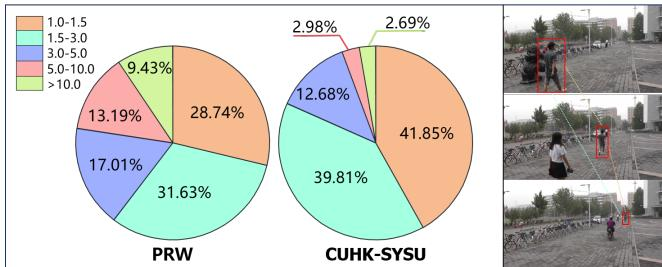  
Figure 1. The scale variation of the same person on PRW and CUHK-SYSU datasets.

## 1. Introduction

Recent years have witnessed the remarkable success of person search which is to match persons existed in realworld scene images. It is often taken as a joint task consisting of person detection [26, 29, 46] and re-identification (re-id) [32, 43, 36]. To achieve high performance, existing methods are commonly trained in a fully supervised setting [4, 1, 41, 45, 13, 20, 23, 5] where the bounding boxes and identity labels are required. However, it is time-consuming and labor-intensive to annotate both of them in a large-scale dataset, which encourages some researchers to embark on reducing the supervision.

Considering that it is much easier to annotate bounding boxes than person identities, we dedicate this paper to weakly supervised person search which only needs bounding box annotations. Intuitively, we can address it with a supervised detection model and an unsupervised re-id model [37, 44, 11, 12, 6] independently. To be specific, we first train a detector to crop person images and then apply an unsupervised re-id model for matching, which is regarded as a two-step person search model. Nevertheless, one of the major drawbacks of such two-step methods is low efficiency, i.e., it is of high computational cost with two network parameters during training and inconvenient for testing. In contrast, one-step methods can be trained and tested more effectively and efficiently [14, 40]. Han et al. [14] use a Region Siamese Network to learn consistent features by examining relations between auto-cropped images and manually cropped ones. Yan et al. [40] learn discriminative features by exploring the visual context clues. According to the learned features, both of them generate pseudo labels to make full use of unlabeled data and further learn discriminative features. Although promising results are achieved, they fail to take into account the scale variation problem that a person often owns images with different scales (resolutions) because the same person is captured at different distances and camera views. As shown in Fig. 1, the images of a person from PRW and CUHK-SYSU datasets have large variations in scale. Since it is unable to resize the input images to a fixed scale for one-step methods, the existing scale variation problem will further affect the procedure of the pseudo label prediction and the subsequent person matching.

In this paper, we propose a novel Self-similarity driven Scale-invariant Learning (SSL) weakly supervised person search framework to solve the scale variation problem. It consists of two branches: Main Branch and Multi-scale Exemplar Branch. The former branch takes the scene image as the input and applies a detector to extract instance features for each person. However, the detected person often have different scales, which adds to the difficulty in matching. To solve it, we design the latter branch. Specifically, we first crop the foreground of person images by using the given bounding boxes and generated binary masks. Each cropped image is regarded as an exemplar. Then, we resize each of the exemplars to several fixed scales. At last, we formulate a scale-invariant loss by hard exemplar mining. Guided by Multi-scale Exemplar Branch, we can enable Main Branch to learn scale-invariant features. To further make the features more discriminative, we introduce a dynamic multilabel learning to explore the information in unlabeled data, which enjoys two merits: (1) It can find true labels of unlabeled data progressively and (2) It is adaptable to different datasets. Finally, we integrate the scale-invariant loss and multi-label learning loss together and optimize them jointly.

Our contributions are summarized as follows:

• We propose a novel end-to-end Self-similarity driven Scale-invariant Learning framework to solve the task of weakly supervised person search. It bridges the gap between person detection and re-id by using a multiscale exemplar branch as guidance.

• We design a scale-invariant loss to solve the scale variation problem and a dynamic multi-label learning which is adaptable to different datasets.

• We confirm the efficacy of the proposed method by achieving state-of-the-art performance on PRW and CUHK-SYSU datasets.

## 2. Related Work

Person Search. Nowadays, person search has attracted increasing attention because of its wide application in a realworld environment. Its task is to retrieve a specific person from a gallery set of scene images. It can be seen as an extension of the re-id task by adding a person detection task.

Existing methods addressing this task can be classified to two manners: one-step [39, 41, 1, 45, 16] and two-step [15, 10, 4] methods. One-step methods tackle person detection and re-id simultaneously. The work [39] proposes the first one-step person search approach based on deep learning. It provides a practical baseline and proposes Online Instance Matching(OIM), which is still used in recent works. Yan et al. [41] introduce an anchor-free framework into person search task and tackle the misalignment issues at different levels. Dong et al. [9] proposes a bi-directional interaction network and uses the cropped image to alleviate the influence of the context information. In contrast, two-step methods process person detection and re-id separately, which alleviates the conflict between them [13]. Chen et al. [4] introduce an attention mechanism to obtain more discriminative instance features by modeling the foreground and the original image patches. Wang et al. [34] propose an identity-guided query detector to filter out the low-confidence proposals.

Due to the high cost of obtaining the annotated data, Li et al. [21] propose a domain adaptive method. In this setting, the model is trained on the labeled source domain and transferred to the unlabeled target domain. In recent years, Han et al. [14] and Yan et al. [40] propose the weakly supervised person search methods, which only need the bounding box annotations. Due to the absence of person ID annotations in the weakly supervised setting, we need to generate pseudo labels to guide the training procedure. The quality of the pseudo labels has a significant impact on the performance. Thus, how to generate reliable pseudo labels is an important issue of the weakly supervised person search.

Unsupervised re-id. Due to the limitation of the annotated data, fully supervised re-id has poor scalability. Thus, lots of unsupervised re-id are proposed, which try to generate reliable yet valid pseudo labels for unsupervised learning. Some of them consider the global data relationship and apply unsupervised cluster algorithms to generate pseudo labels. For example, Fan et al. [11] propose an iterative clustering and fine-tuning method for unsupervised re-id. Ge et al. [12] use the self-paced strategy to generate pseudo labels based on the clustering method. Cho et al. [6] propose a pseudo labels refinement strategy based on the part feature information. Although cluster-level methods have made great progress, the within-class noise introduced by cluster algorithms still limits further improvement.

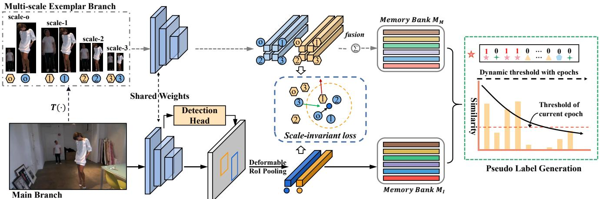  
Figure 2. Details of our SSL for weakly supervised person search. The SSL consists of the multi-scale exemplar branch, the main branch, and two extra memory banks. The Main branch takes the scene image as input, which is utilized to detect persons and extract their instance features. Given the multi-scale images (original scale and three different scales for example) corresponding to the persons in the scene image, the multi-scale exemplar branch takes them as input and obtains the multi-scale features. We conduct the scale-invariant loss (SL) between instance features and multi-scale features to learn scale-invariant features. We also adopt our dynamic threshold multi-label classification strategy to obtain reliable yet valid pseudo labels as the supervision for unsupervised learning.

To solve this issue, another method introduce fine-grid instance-level pseudo labels as the supervision for unsupervised learning. For example, Zhong et al. [49] propose an instance exemplar memory learning scheme that considers three invariant cues as the instance-level supervision, including exemplar-invariance, camera invariance and neighborhood-invariance. Lv et al. [27] look for underlying positive pairs on the instance memory. Wang et al. [35] consider the instance visual similarity and the instance cycle consistency as the supervision. Lin et al. [24] regard each training image as a single class and train the model with the soften label distribution.

Multi-scale Matching Problem. Person search suffers from the multi-scale matching problem because of the scale variations in scene images. Lan et al. [19] propose a twostep method with knowledge distillation to alleviate this problem. Unlike the fully supervised setting, due to the absence of ID annotations, it is much harder to learn a consistent feature for the same person appearing in various scales. In this paper, we propose the Self-similarity driven Scale-invariant Learning to improve the feature consistency among different scales in a weakly supervised setting.

## 3. Proposed Method

In this section, we first introduce the overall framework in Sec. 3.1, then describe the scale-invariant learning in Sec. 3.2. A dynamic multi-label learning method is detailed in Sec. 3.3. and the training and inference procedure is finally explained in Sec. 3.4.

## 3.1. Framework Overview

Different from the fully supervised person search, only the bounding box annotations are accessible in the weakly supervised setting. Firstly, we propose a scale-invariant loss to address the scale variance problem by hard exemplar mining. Furthermore, we propose a dynamic threshold multi-label learning method to enhance the discriminative power of the final features.

The general pipeline of the framework is illustrated in Fig. 2. Our detection part is based on Faster R -CNN [31], a widely used object detection baseline. As aforementioned, scale variation problem is a severe obstacle and will further affect the procedure of the pseudo label prediction and the subsequent sample matching. To address it, we propose the SSL that consists of multi-scale exemplar branch and main branch. The main branch locates the persons first and extracts the instance features by the deformable RoI pooling layer [7] with the localization information. The multi-scale exemplar branch is used to obtain the features of the same person with different scales. Specifically, the multi-scale cropped images with background filtering [22] and scene images are fed into the two branches for scale-invariant feature learning.

To generate reliable pseudo labels, we propose a dynamic threshold multi-label learning method, which uses an exponential decay threshold, i.e., using a higher threshold at the beginning to obtain more precise labels and gradually decreasing the threshold with the epoch of the training process to introduce some hard samples in the vicinity of the classification boundary to learn a better classifier.

## 3.2. Scale-invariant Learning

In this section, we adopt a scale augmentation strategy to obtain multi-scale exemplars and propose scale-invariant learning to learn scale-invariant features.

Scale Augmentation. Given a scene image I, we obtain the cropped image of the i-th person $x _ { o } ^ { i }$ with the given localization annotation $g t _ { i }$

Then, we apply a binary mask [22] filtering the background to obtain the person’s emphasized region:

$$
x _ { s } ^ { i } \longleftarrow T ( x _ { o } ^ { i } \odot \mathrm { m a s k } , s ) ,\tag{1}
$$

where $\odot$ means pixel-wise multiplication and $\tau$ is the bilinear interpolation function that transforms the masked image to the corresponding scale s.

Scale-invariant Loss. When we have obtained multiscale exemplars by scale augmentation, we use them to learn the scale-invariant features in the guidance of the multi-scale exemplar branch which takes the exemplars as the inputs and extracts multi-scale features. At the same time, our main branch takes the scene image as the input and extracts instance features of detected persons.

Assume a mini-batch contains $B$ scene images. In the b-th scene image, the variable $P _ { b }$ represents the total count of persons present in the image. We use bounding box annotations to extract cropped images and then augment each cropped image to K different scales. Therefore, we have obtained a total of $P _ { b } ( K + 1 )$ cropped images that vary in scale. The scale-invariant loss can be formulated as follows:

$$
L _ { s c a l e } = \frac { 1 } { B } \sum _ { b = 1 } ^ { B } \frac { 1 } { P _ { b } } \sum _ { i = 1 } ^ { P _ { b } } L _ { s c a l e } ^ { b , i } ,\tag{2}
$$

and

$$
\begin{array} { r l r } {  { L _ { s c a l e } ^ { b , i } = [ m + \operatorname* { m a x } _ { s = 1 \ldots K } D ( f _ { i } , f _ { i } ^ { s } ) - \operatorname* { m i n } _ { j = 1 \ldots P _ { b } \atop s = 1 \ldots K + 1 } D ( f _ { i } , f _ { j } ^ { s } ) ] _ { + } } } \\ & { } & \\ & { } & { + \gamma D ( f _ { i } , f _ { i } ^ { o } ) , \qquad ( 3 ) } \end{array}
$$

where $D ( \cdot )$ denotes the squared euclidean distance between two features, $f _ { i }$ stands for the instance feature extracted from the main branch. $f _ { j } ^ { s }$ and $f _ { i } ^ { s }$ stand for the multi-scale features of the i-th and j-th persons, respectively. And $f _ { i } ^ { o }$ means for the original scale feature of the i-th person. m denotes the distance margin and $\gamma$ denotes the regularization factor. Furthermore, the obtained features are processed by l2-normalization.

$L _ { s c a l e }$ tries to select the most difficult positive and negative ones from multi-scale exemplars for a query person. It learns the scale-invariant features by decreasing the distance with the hardest positive exemplar and increasing the distance with the hardest negative exemplar. Meanwhile, it is notable that the original scale cropped image could be aligned better with the instance feature. Thus, we additionally constrain the distance between the instance feature and its corresponding original scale feature to make the model focus on the foreground information and extract body-aware features.

## 3.3. Dynamic Multi-label Learning

In weakly supervised settings, we do not have the ID annotations of each person. Thus, it is essential to predict pseudo labels and their quality will extremely affect the subsequent training.

As shown in Fig. 2, we maintain two extra memory banks $\boldsymbol { \mathcal { M } } _ { I } \in \mathbb { R } ^ { N \times \bar { d } }$ and $\mathcal { M } _ { M } \in \mathbb { R } ^ { N \times d }$ to store the features extracted from the main branch and multi-scale exeplar branch, separately. Where N is the number of samples in the training data set and d is the feature dimension. For the latter branch, we extract features $[ f _ { i } ^ { o } , f _ { i } ^ { 1 } , f _ { i } ^ { 2 } , f _ { i } ^ { 3 } ]$ corresponding to scale-o, scale-1, scale-2, and scale-3, and obtain the average feature $f _ { i } ^ { h } = \mathrm { m e a n } ( f _ { i } ^ { o } , f _ { i } ^ { 1 } , f _ { i } ^ { 2 } , f _ { i } ^ { 3 } )$ . For the main branch, we extract the instance feature $f _ { i }$ from the scene image. After each training iteration, $\mathcal { M } _ { M }$ and $\mathcal { M } _ { I }$ are updated as:

$$
\begin{array} { r l r } & { } & { \mathcal { M } _ { M } [ i ] = \lambda \cdot f _ { i } ^ { h } + ( 1 - \lambda ) \cdot \mathcal { M } _ { M } [ i ] , } \\ & { } & { \mathcal { M } _ { I } [ i ] = \lambda \cdot f _ { i } + ( 1 - \lambda ) \cdot \mathcal { M } _ { I } [ i ] , \quad } \end{array}\tag{4}
$$

where $\lambda$ is the momentum factor and is set to 0.8 in the following experiments.

In order to obtain reliable pseudo labels for multi-label learning, we employ scale-enhancement features, which enhance both feature robustness and pseudo labels accuracy. The scale-enhancement features are obtained as follows:

$$
\mathcal { M } = \operatorname* { m e a n } ( \mathcal { M } _ { M } , \mathcal { M } _ { I } ) .\tag{5}
$$

Dynamic Pseudo Label Prediction. Suppose we have a training set X with N samples, we treat the pseudo label generation as an N-classes multi-label classification problem. In other words, the i-th sample has an N-dim twovalued label $Y _ { i } = [ Y _ { i 1 } , Y _ { i 2 } \ldots , Y _ { i N } ]$ . The label of the i-th sample can be predicted based on the similarity between its feature $f _ { i }$ and the features of others. Based on the $\mathcal { M } ,$ , the similarity matrix can be obtained as follows:

$$
\boldsymbol { S } = \boldsymbol { \mathcal { M } } \boldsymbol { \mathcal { M } } ^ { T } = \left[ \begin{array} { c c c } { \boldsymbol { s } _ { 1 1 } , } & { \ldots , } & { \boldsymbol { s } _ { 1 N } } \\ { \vdots } & { \ddots } & { \vdots } \\ { \boldsymbol { s } _ { N 1 } , } & { \ldots , } & { \boldsymbol { s } _ { N N } } \end{array} \right] ,\tag{6}
$$

we can further get two-valued labels Y matrix with a threshold t:

$$
Y _ { i , j } = \left\{ \begin{array} { l l } { 1 } & { s _ { i j } \ge t } \\ { 0 } & { s _ { i j } < t } \end{array} \right. .\tag{7}
$$

However, the multi-label classification method is sensitive to the threshold. An unsuitable threshold can seriously affect the quality of label generation, i.e., the low threshold will introduce a lot of noisy samples, while the high threshold omits some hard positive samples. Thus, we further adopt an exponential dynamic threshold to generate more reliable pseudo labels. That is,

$$
t = t _ { b } + \alpha \cdot e ^ { \beta \cdot e } ,\tag{8}
$$

where $t _ { b }$ is the lower boundary of the threshold, α and $\beta$ are the ratio factors, and e stands for current epoch number. So far, we can use the dynamic threshold to get the label vector for each sample at each iteration by Eq. (7).

We define the positive label set of the i-th sample as $\mathcal { P } _ { i }$ and negative label set as ${ \mathcal { N } } _ { i }$ . To make the pseudo label more reliable, we further process the label based on the hypothesis: persons who appear in the same image can not be the same person. For the i-th sample, we can get its similarity vector Si by Eq. (6). We sort the $S _ { i }$ in descending order and get the sorted index:

$$
S I _ { i } = \arg \operatorname * { s o r t } _ { j \in \mathcal { P } _ { i } } ( s _ { i j } ) \quad \mathrm { ~ w . r . t . , } 1 \leq j \leq N .\tag{9}
$$

Then, we traverse the label $Y _ { i }$ by the $S I _ { i } .$ . If the $j \mathrm { - t h }$ sample is predicted to be the same person as the i-th sample, i.e., $Y _ { i , j } = 1$ . We consider the other samples belonging to the same image with the j-th sample can not have the same ID with the i-th sample, and set these labels to 0.

$\mathcal { M } _ { M }$ and $\mathcal { M } _ { I }$ based re-id feature learning. As aforementioned, we use the M to generate reliable pseudo labels and calculate the loss function on the two branches with $\mathcal { M } _ { I }$ and $\mathcal { M } _ { M }$ , separately. Multi-label learning loss function is then adopted:

$$
\begin{array} { r } { L _ { m l } ( \mathcal { M } ^ { * } , f ^ { * } ) = \displaystyle \sum _ { i = 1 } ^ { q } [ \frac { \delta } { | \mathcal { P } _ { i } | } \sum _ { p \in \mathcal { P } _ { i } } | | \mathcal { M } ^ { * } [ p ] ^ { T } \times f ^ { * } + ( - 1 ) ^ { Y _ { i , p } } | | ^ { 2 } + } \\ { \frac { 1 } { | \mathcal { N } _ { i } | } \sum _ { v \in \mathcal { N } _ { i } } | | \mathcal { M } ^ { * } [ v ] ^ { T } \times f ^ { * } + ( - 1 ) ^ { Y _ { i , v } } | | ^ { 2 } ] , } \end{array}\tag{10}
$$

where $\mathcal { M } ^ { \ast } \in \{ \mathcal { M } _ { I } , \mathcal { M } _ { M } \} , f ^ { \ast } \in \{ f _ { i } , f _ { i } ^ { h } \} , q$ is the number of samples in a mini-batch and δ is used as a balance factor of the loss. The total dynamic multi-label learning loss can be formulated as follows:

$$
L _ { D M L } = L _ { m l } ( \mathcal { M } _ { I } , f _ { i } ) + L _ { m l } ( \mathcal { M } _ { M } , f _ { i } ^ { h } ) .\tag{11}
$$

## 3.4. Training and Inference

In general, our SSL is trained in an end-to-end manner by using the following loss function:

$$
L = L _ { s c a l e } + L _ { D M L } + L _ { d e t } ,\tag{12}
$$

where $L _ { d e t }$ denotes the detection loss used in SeqNet [23].

In the inference phase, we only use the main branch to detect the persons and extract the instance features. Notably, the multi-scale exemplar branch is only used in the training phase to help the main branch learn scale-invariant features and there are no extra memory and computation resources used in the inference phase.

## 4. Experiments

## 4.1. Datasets and Settings

CUHK-SYSU [39] is one of the largest public datasets for person search. It contains 18,184 images, including 12,490 frames from street scenes and 5,694 frames captured from movie snapshots. CUHK-SYSU provides 8,432 annotated identities and 96,143 annotated bounding boxes in total, where the training set contains 11,206 images and 5,532 identities, and the test set contains 6,978 images and 2,900 query persons. CUHK-SYSU also provides a set of evaluation protocols with gallery sizes from 50 to 4000. In this paper, we report the results with the default 100 gallery size.

PRW [47] is collected in a university campus by six cameras. The images are annotated every 25 frames from a 10 hours video. It contains 11,816 frames with 43,110 annotated bounding boxes. The training set contains 5,401 images and 482 identifies, and the test set contains 6,112 images and 2,507 queries with 450 identities.

Evaluation Protocol. We adopt the Cumulative Matching Characteristic (CMC), and the mean Averaged Precision (mAP) to evaluate the performance of person search. We also adopt recall and average precision to evaluate person detection performance.

## 4.2. Implementation Details

We adopt ResNet50 [17] pre-trained on ImageNet [8] as our backbone. We set the batch size to 4 and adopt the stochastic gradient descent (SGD) algorithm to optimize the model for 26 epochs. The initial learning rate is 0.001 and is reduced by a factor of 10 at 16 and 22 epochs. We set the momentum and weight decay to 0.9 and $5 \times 1 0 ^ { - 4 }$ , respectively. We set the hyper-parameters $m = 0 . 3 , \ t _ { b } = 0 . 6 , \ \alpha = 0 . 1 , \ \beta = - 0 . 0 5 , \gamma = 0 . 0 5 ,$ and $\delta = 5$ . Instead of choosing the scales of the exemplars by hand, we adopt k-means clustering on the training set ground truth bounding boxes to select the scales of the exemplars [30]. In our experiments, the scale-1, scale-2, and scale-3 are set to 102×38, 200×72, and 346×132 on PRW, and 72×46, 170×96, and 430×208 on CUHK-SYSU, respectively. More details about the scale selection are described in the supplementary material. For inference, we resize the images to a fixed size of $1 5 0 0 \times 9 0 0$ pixels. Furthermore, we use PyTorch to implement our model and run all the experiments on an NVIDIA Tesla V100 GPU.

## 4.3. Ablation Study

<table><tr><td rowspan="2">Baseline</td><td rowspan="2">DML</td><td rowspan="2">SL</td><td colspan="2">PRW</td></tr><tr><td>mAP</td><td>Top-1</td></tr><tr><td>√</td><td></td><td></td><td>13.0</td><td>63.8</td></tr><tr><td>√</td><td>√</td><td></td><td>16.8</td><td>66.9</td></tr><tr><td>√</td><td></td><td>√</td><td>27.4</td><td>81.4</td></tr><tr><td>√</td><td>V</td><td>√</td><td>33.9</td><td>82.7</td></tr></table>

Table 1. Ablation study on the two key components of our approach. We report the mAP(%) and top-1 accuracy(%) on PRW. DML denotes dynamic multi-label learning and SL means scaleinvariant learning.

Baseline. We adopt a classical two-stage Faster R-CNN detector as our baseline model. Following SeqNet [23], we adopt two RPN structure to obtain more quality proposals. Furthermore, we generate pseudo labels and optimize the model with a fixed threshold t = 0.7.

Effectiveness of Each Component. We analyze the effectiveness of our SSL framework and report the results on PRW in Tab. 1, where DML denotes dynamic multi-label learning and SL means scale-invariant learning.

Firstly, we can see that the baseline model achieves 13.0% mAP and 63.8% top-1 on PRW. With the DML, the baseline improves the mAP and top-1 by 3.8% and 3.1% on PRW, respectively. Secondly, with the SL, the baseline model obviously improves the mAP and top-1 by 14.4% and 17.6%. This improvement indicates that the proposed SSL is effective to handle the person scale variation problem. Moreover, the DML further improves baseline + SL by 6.5%/1.3% in mAP/top-1. This improvement illustrates our dynamic multi-label learning strategy could progressively seek more correct pseudo labels for unsupervised learning compared to the fixed threshold strategy.

<table><tr><td rowspan="2">Methods</td><td colspan="2">PRW</td></tr><tr><td>mAP</td><td>Top-1</td></tr><tr><td>SSL w/ Original Scale</td><td>29.4</td><td>79.7</td></tr><tr><td>SSL w/ One Scale</td><td>30.1</td><td>80.2</td></tr><tr><td>SSL w/ Multi-Scale</td><td>32.5</td><td>81.6</td></tr><tr><td>SSL w/ Multi-Scale†</td><td>33.9</td><td>82.7</td></tr></table>

Table 2. Comparison of different scale settings on PRW. † means filtering the background of the cropped images. W/ means combined with.

Effectiveness of Scale-invariant Learning. We analyze the effectiveness of the scale-invariant learning module and the results are reported in Tab. 2. In the method SSL w/ Original Scale, we only adopt the original size of the cropped person images as the exemplar, which is obtained by bounding box annotations directly. In the method

SSL w/ One Scale, we resize the cropped person images to $1 5 4 \times 5 8$ pixels. We observe that the One Scale method just surpasses the Original Scale method by 0.7% and 0.5% in mAP and top-1. Furthermore, the SSL w/ Multi-Scale method could significantly improve the performance, which achieves 32.5% in mAP and 81.6% in top-1. † means filtering the background with the method in Sec. 3.2, which makes the model concentrate more on the foreground information and obtains more discriminative features. Filtering the background information further improves the performance by 1.4% and 1.1% in terms of mAP and top-1.

<table><tr><td rowspan="2">Methods</td><td colspan="2">PRW</td></tr><tr><td>mAP</td><td>Top-1</td></tr><tr><td>t=0.6</td><td>27.8</td><td>76.1</td></tr><tr><td> $t { = } 0 . 7$ </td><td>27.4</td><td>81.4</td></tr><tr><td>Ours</td><td>33.9</td><td>82.7</td></tr></table>

Table 3. Comparison between the fixed threshold and dynamic threshold. $t = 0 . 6$ and $t = 0 . 7$ mean generating the pseudo labels with fixed thresholds respectively, that is, 0.6 and 0.7.

Effectiveness of Dynamic Multi-label Learning. The efficacy of DML is evaluated against fixed-threshold multilabel classification in Tab. 3, where t = 0.6 and t = 0.7 denote pseudo label generation with fixed thresholds of 0.6 and 0.7, respectively. The results reveal that the $t = 0 . 7$ condition performs better in top-1 due to the high threshold’s ability to extract more accurate instance relationships. Conversely, the $t = 0 . 6$ condition shows superior mAP performance as the lower threshold recalls more positive labels, thus increasing model robustness. Our DML strategy merges these benefits using an exponential decay threshold, i.e., beginning with a high threshold for precision and progressively lowering it through training epochs to augment robustness. This dynamic threshold strategy notably outperforms its fixed-threshold strategy, underlining DML’s effectiveness.

Analysis on hyper-parameters. The hyper-parameters $t _ { b } , \alpha ,$ and $\beta$ are used to control the dynamic threshold in Eq. (8). Among them, $t _ { b }$ is used to control the lower boundary of the threshold, α is used to control the threshold range. As shown in Fig. 3, When we set α to 0.1, an inappropriate $t _ { b }$ will significantly affect the performance. On the one hand, the lower boundary will involve too many incorrect labels. On the other hand, the higher boundary will filter too many predicted labels. The $\beta$ is used to control the change ratio, and we set it to -0.05 in our experiments. The hyperparameter K is the number of the multi-scale exemplars for a person. As shown in Fig. 3, adopting multi-scale exemplars could achieve better performance than the single scale. However, there is no significant gain when $K > 3 ,$ and we set K to 3 in our experiments.

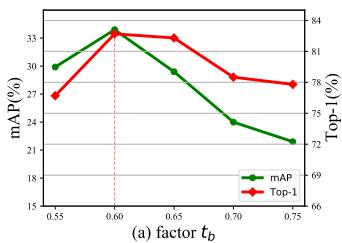

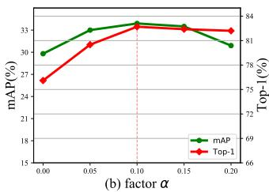

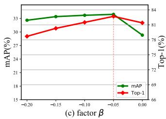

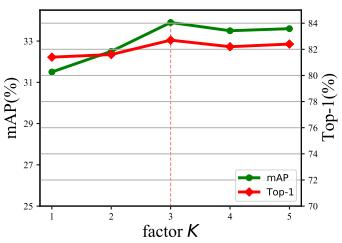  
Figure 3. Evaluation of hyper-parameters: $\displaystyle t _ { b } , \alpha , \beta$ in Eq. (8) and K in Eq. (3).

## 4.4. Comparison with the State-of-the-arts

In this section, we compare our method with current state-of-the-art methods including fully supervised methods and weakly supervised methods.

Results on CUHK-SYSU. Tab. 4 shows the performance on CUHK-SYSU with the gallery size of 100. Our method achieves the best 87.6% mAP and 89.0% top-1, outperforming all existing weakly supervised person search methods. Specifically, we outperform the state-of-the-art method R-SiamNet by 1.6% in mAP and 1.9% in top-1 accuracy. We also evaluate these methods under different gallery sizes from 50 to 4,000. In Fig. 4, we compare mAP with other methods. The dashed lines denote the weakly supervised methods and the solid lines denote the fully supervised methods. It can be observed that our method still outperforms all the weakly supervised with gallery increasing. Meanwhile, Our method surprisingly surpasses some fully supervised methods, e.g., [39], [42],[2] and [4]. However, there still exists a significant performance gap. We hope our work could give some inspiration to others to explore weakly supervised person search.

Results on PRW. As shown in Tab. 4, among existing two weakly supervised methods, CGPS [40] and R-SiamNet [14] achieve 16.2%/68.0% and 21.2%/73.4% in mAP/top-1. Our method achieves 33.9%/82.7% in mAP/top-1, surpassing all existing weakly supervised methods by a large margin. We argue that, as shown in Fig. 1, PRW has large variations of pedestrians scales, which presents a multi-scale matching challenge, and our scale-invariant feature learning(Sec. 3.2) significantly alleviates this problem. As shown in Tab. 1, even the baseline model with our scale-invariant feature learning still outperforms CGPS 11.2%/13.4% in mAP/top-1 and outperforms R-SiamNet in 6.2%/8.0% in mAP/top-1.

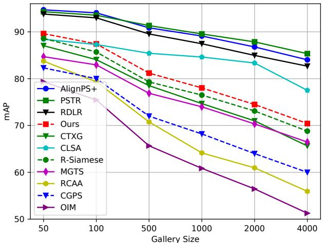  
Figure 4. Performance comparison on the CUHK-SYSU dataset with different gallery sizes. The solid (or dashed) lines denote the fully (or weakly) supervised methods.

Visualization Analysis. To evaluate the effectiveness
<table><tr><td rowspan="2">Methods</td><td colspan="2">PRW</td><td colspan="2">CUHK-SYSU</td></tr><tr><td>mAP</td><td>top-1</td><td>mAP</td><td>top-1</td></tr><tr><td rowspan="9">OIM [39] IAN [38] NPSM [25] CTXG [42] MGTS [4] QEEPS [28] Purs ved CLSA [19] HOIM [3] APNet [48] RDLR [15] NAE [5] PSTR [1]</td><td>21.3</td><td>49.9</td><td>75.5</td><td>78.7</td></tr><tr><td>23.0</td><td>61.9</td><td>76.3</td><td>80.1</td></tr><tr><td>24.2</td><td>53.1</td><td>77.9</td><td>81.2</td></tr><tr><td>33.4</td><td>73.6</td><td>84.1</td><td>86.5</td></tr><tr><td>32.6 37.1</td><td>72.1 76.7</td><td>83.0 88.9</td><td>83.7 89.1</td></tr><tr><td>38.7</td><td>65.0</td><td>87.2</td><td>88.5</td></tr><tr><td>39.8</td><td>80.4</td><td>89.7</td><td>90.8</td></tr><tr><td>41.9</td><td>81.4</td><td>88.9</td><td>89.3</td></tr><tr><td>42.9</td><td>70.2</td><td>93.0</td><td>94.2</td></tr><tr><td rowspan="8">PGS [18] BINet [9] AlignPS [41] SeqNet [23] TCTS [34] IGPN [10]</td><td></td><td></td><td></td><td></td></tr><tr><td>44.0</td><td>81.1</td><td>92.1</td><td>92.9</td></tr><tr><td>44.2</td><td>85.2</td><td>92.3</td><td>94.7</td></tr><tr><td>45.3</td><td>81.7 81.9</td><td>90.0 93.1</td><td>90.7 93.4</td></tr><tr><td>45.9</td><td></td><td>93.8</td><td></td></tr><tr><td>46.7</td><td>83.4</td><td>93.9</td><td>94.6 95.1</td></tr><tr><td>46.8 47.2</td><td>87.5 87.0</td><td>90.3</td><td>91.4</td></tr><tr><td>OIMNet++ [20] 47.7</td><td>84.8</td><td>93.1</td><td>94.1</td></tr><tr><td rowspan="4">AGWF [13] COAT [45]</td><td>49.5</td><td>87.8</td><td>93.5</td><td>95.0</td></tr><tr><td>53.3</td><td>87.7</td><td>93.3</td><td>94.2</td></tr><tr><td>53.3</td><td>87.4</td><td>94.2</td><td>94.7</td></tr><tr><td>16.2</td><td>68.0</td><td></td><td></td></tr><tr><td rowspan="3">Wealy Ours</td><td>CGPS [40] R-SiamNet [14]</td><td>21.2</td><td>73.4</td><td>80.0 86.0</td><td>82.3 87.1</td></tr><tr><td></td><td></td><td></td><td></td><td></td></tr><tr><td></td><td>33.9</td><td>82.7</td><td>87.6</td><td>89.0</td></tr></table>

Table 4. Comparison with the state-of-the-art methods on the PRW and CUHK-SYSU datasets. Weakly refers to the weakly supervised person search methods.

Baseline

Baseline

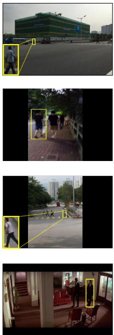  
Query

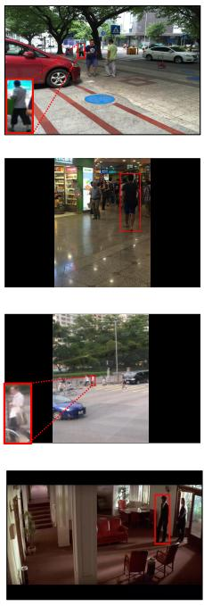

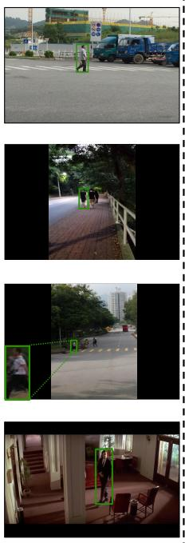  
(a) CUHK-SYSU

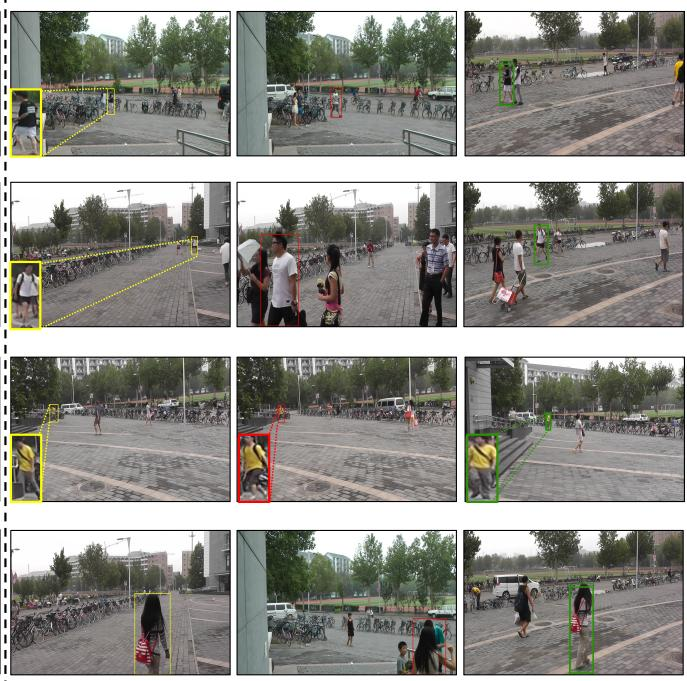  
(b) PRW  
Figure 5. Rank-1 search results for several representative samples on CUHK-SYSU [39] and PRW [47]. The green and red bounding boxes correspond to the correct and wrong results, respectively.

of our method, we show several search results on CUHK-SYSU and PRW in Fig. 5. Specifically, the first two rows show that our method has stronger cross-scale retrieval capability than the baseline method. Additionally, the last two rows show that our SSL can retrieve the target person correctly among the confusing samples.

Moreover, we visualize the feature distribution with t-SNE [33] in Fig. 6. The circle denotes the small-scale persons whose resolution is less than 3600 pixels, the square denotes the large-scale persons whose resolution is larger than 45300, and the cross denotes the medium-scale persons whose resolution is between 3600 and 45300. Different colors represent different identities. It illustrates that our method generates more consistent features across different scales. For more search results and visualizations, please refer to the supplementary materials.

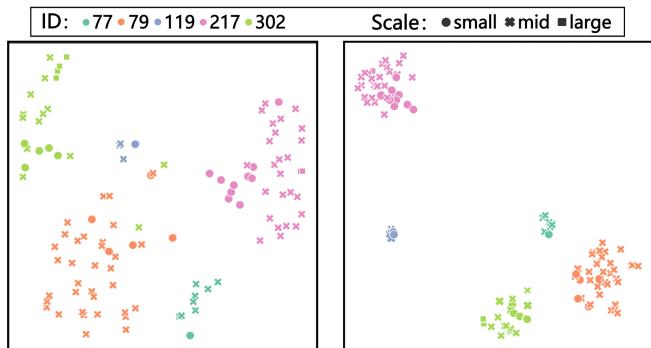  
Figure 6. t-SNE feature visualization on part of the PRW training set. Colors denote different person identities and shapes denote persons at different scales.

## 5. Conclusion

In this paper, we propose the Self-similarity driven Scale-invariant Learning framework to solve the task of weakly supervised person search. With a scale-invariant loss, we can learn scale-invariant features which will benefit the subsequent pseudo label prediction and person matching. We also propose a dynamic multi-label learning method to generate pseudo labels and learn discriminative features for re-id. Finally, we learn the aforementioned parts in an end-to-end manner. Extensive experiments demonstrate that our proposed SSL can achieve stateof-the-art performance on two large-scale benchmarks.

## Acknowledgements

This work was supported in part by the National Key Research & Development Program (No. 2020YFC2003901), Chinese National Natural Science Foundation Projects #62276254, #62206276, #62206280, #62106264, Beijing Natural Science Foundation #L221013 and InnoHK program.

## References

[1] Jiale Cao, Yanwei Pang, Rao Muhammad Anwer, Hisham Cholakkal, Jin Xie, Mubarak Shah, and Fahad Shahbaz Khan. Pstr: End-to-end one-step person search with transformers. In Proceedings of the IEEE/CVF Conference on Computer Vision and Pattern Recognition, pages 9458– 9467, 2022. 1, 2, 7

[2] Xiaojun Chang, Po-Yao Huang, Yi-Dong Shen, Xiaodan Liang, Yi Yang, and Alexander G Hauptmann. Rcaa: Relational context-aware agents for person search. In Proceedings of the European Conference on Computer Vision (ECCV), pages 84–100, 2018. 7

[3] Di Chen, Shanshan Zhang, Wanli Ouyang, Jian Yang, and Bernt Schiele. Hierarchical online instance matching for person search. In Proceedings of the AAAI Conference on Artificial Intelligence, pages 10518–10525, 2020. 7

[4] Di Chen, Shanshan Zhang, Wanli Ouyang, Jian Yang, and Ying Tai. Person search via a mask-guided two-stream cnn model. In Proceedings of the European conference on computer vision (ECCV), pages 734–750, 2018. 1, 2, 7

[5] Di Chen, Shanshan Zhang, Jian Yang, and Bernt Schiele. Norm-aware embedding for efficient person search. In Proceedings of the IEEE/CVF Conference on Computer Vision and Pattern Recognition, pages 12615–12624, 2020. 1, 7

[6] Yoonki Cho, Woo Jae Kim, Seunghoon Hong, and Sung-Eu Yoon. Part-based pseudo label refinement for unsupervised person re-identification. In Proceedings of the IEEE/CVF Conference on Computer Vision and Pattern Recognition, pages 7308–7318, 2022. 1, 2

[7] Jifeng Dai, Haozhi Qi, Yuwen Xiong, Yi Li, Guodong Zhang, Han Hu, and Yichen Wei. Deformable convolutional networks. In Proceedings ofthe IEEE International Conference on Computer Vision, pages 764–773, 2017. 3

[8] Jia Deng, Wei Dong, Richard Socher, Li-Jia Li, Kai Li, and Li Fei-Fei. Imagenet: A large-scale hierarchical image database. In 2009 IEEE Conference on Computer Vision and Pattern Recognition, pages 248–255. IEEE, 2009. 5

[9] Wenkai Dong, Zhaoxiang Zhang, Chunfeng Song, and Tieniu Tan. Bi-directional interaction network for person search. In Proceedings of the IEEE/CVF Conference on Computer Vision and Pattern Recognition, pages 2839–2848, 2020. 2, 7

[10] Wenkai Dong, Zhaoxiang Zhang, Chunfeng Song, and Tieniu Tan. Instance guided proposal network for person search. In Proceedings of the IEEE/CVF Conference on Computer Vision and Pattern Recognition, pages 2585–2594, 2020. 2, 7

[11] Hehe Fan, Liang Zheng, Chenggang Yan, and Yi Yang. Unsupervised person re-identification: Clustering and finetuning. ACM Transactions on Multimedia Computing, Communications, and Applications (TOMM), 14(4):1–18, 2018. 1, 2

[12] Yixiao Ge, Feng Zhu, Dapeng Chen, Rui Zhao, et al. Selfpaced contrastive learning with hybrid memory for domain adaptive object re-id. Advances in Neural Information Processing Systems, 33:11309–11321, 2020. 1, 2

[13] Byeong-Ju Han, Kuhyeun Ko, and Jae-Young Sim. End-toend trainable trident person search network using adaptive gradient propagation. In Proceedings of the IEEE/CVF International Conference on Computer Vision, pages 925–933, 2021. 1, 2, 7

[14] Chuchu Han, Kai Su, Dongdong Yu, Zehuan Yuan, Changxin Gao, Nong Sang, Yi Yang, and Changhu Wang. Weakly supervised person search with region siamese networks. In Proceedings of the IEEE/CVF International Conference on Computer Vision, pages 12006–12015, 2021. 2, 7

[15] Chuchu Han, Jiacheng Ye, Yunshan Zhong, Xin Tan, Chi Zhang, Changxin Gao, and Nong Sang. Re-id driven localization refinement for person search. In Proceedings of the IEEE/CVF International Conference on Computer Vision, pages 9814–9823, 2019. 2, 7

[16] Chuchu Han, Zhedong Zheng, Changxin Gao, Nong Sang, and Yi Yang. Decoupled and memory-reinforced networks: Towards effective feature learning for one-step person search. In Proceedings of the AAAI Conference on Artificial Intelligence, volume 35, pages 1505–1512, 2021. 2

[17] Kaiming He, Xiangyu Zhang, Shaoqing Ren, and Jian Sun. Deep residual learning for image recognition. In Proceedings of the IEEE Conference on Computer Vision and Pattern Recognition, pages 770–778, 2016. 5

[18] Hanjae Kim, Sunghun Joung, Ig-Jae Kim, and Kwanghoon Sohn. Prototype-guided saliency feature learning for person search. In Proceedings of the IEEE/CVF Conference on Computer Vision and Pattern Recognition, pages 4865– 4874, 2021. 7

[19] Xu Lan, Xiatian Zhu, and Shaogang Gong. Person search by multi-scale matching. In Proceedings of the European conference on computer vision (ECCV), pages 536–552, 2018. 3, 7

[20] Sanghoon Lee, Youngmin Oh, Donghyeon Baek, Junghyup Lee, and Bumsub Ham. Oimnet++: Prototypical normalization and localization-aware learning for person search. pages 621–637, 2022. 1, 7

[21] Junjie Li, Yichao Yan, Guanshuo Wang, Fufu Yu, Qiong Jia, and Shouhong Ding. Domain adaptive person search. pages 302–318, 2022. 2

[22] Peike Li, Yunqiu Xu, Yunchao Wei, and Yi Yang. Selfcorrection for human parsing. IEEE Transactions on Pattern Analysis and Machine Intelligence, 2020. 3, 4

[23] Zhengjia Li and Duoqian Miao. Sequential end-to-end network for efficient person search. In Proceedings of the AAAI Conference on Artificial Intelligence, pages 2011– 2019, 2021. 1, 5, 6, 7

[24] Yutian Lin, Lingxi Xie, Yu Wu, Chenggang Yan, and Qi Tian. Unsupervised person re-identification via softened similarity learning. In Proceedings of the IEEE/CVF Conference on Computer Vision and Pattern Recognition, pages 3390–3399, 2020. 3

[25] Hao Liu, Jiashi Feng, Zequn Jie, Karlekar Jayashree, Bo Zhao, Meibin Qi, Jianguo Jiang, and Shuicheng Yan. Neural person search machines. In Proceedings of the IEEE International Conference on Computer Vision, pages 493–501, 2017. 7

[26] Wei Liu, Shengcai Liao, Weiqiang Ren, Weidong Hu, and Yinan Yu. High-level semantic feature detection: A new perspective for pedestrian detection. In Proceedings of the IEEE/CVF Conference on Computer Vision and Pattern Recognition, pages 5187–5196, 2019. 1

[27] Jianming Lv, Weihang Chen, Qing Li, and Can Yang. Unsupervised cross-dataset person re-identification by transfer learning of spatial-temporal patterns. In Proceedings of the IEEE Conference on Computer Vision and Pattern Recognition, pages 7948–7956, 2018. 3

[28] Bharti Munjal, Sikandar Amin, Federico Tombari, and Fabio Galasso. Query-guided end-to-end person search. In Proceedings of the IEEE/CVF Conference on Computer Vision and Pattern Recognition, pages 811–820, 2019. 7

[29] Yanwei Pang, Jin Xie, Muhammad Haris Khan, Rao Muhammad Anwer, Fahad Shahbaz Khan, and Ling Shao. Mask-guided attention network for occluded pedestrian detection. In Proceedings of the IEEE/CVF International Conference on Computer Vision, pages 4967–4975, 2019. 1

[30] Joseph Redmon and Ali Farhadi. Yolo9000: Better, faster, stronger. In Proceedings of the IEEE/CVF Conference on Computer Vision and Pattern Recognition, pages 7263– 7271, 2017. 5

[31] Shaoqing Ren, Kaiming He, Ross Girshick, and Jian Sun. Faster r-cnn: Towards real-time object detection with region proposal networks. Advances in Neural Information Processing Systems, 28, 2015. 3

[32] Yifan Sun, Liang Zheng, Yi Yang, Qi Tian, and Shengjin Wang. Beyond part models: Person retrieval with refined part pooling (and a strong convolutional baseline). In Proceedings of the European Conference on Computer Vision (ECCV), pages 480–496, 2018. 1

[33] Laurens Van der Maaten and Geoffrey Hinton. Visualizing data using t-sne. Journal of Machine Learning Research, 9(11), 2008. 8

[34] Cheng Wang, Bingpeng Ma, Hong Chang, Shiguang Shan, and Xilin Chen. Tcts: A task-consistent two-stage framework for person search. In Proceedings of the IEEE/CVF Conference on Computer Vision and Pattern Recognition, pages 11952–11961, 2020. 2, 7

[35] Dongkai Wang and Shiliang Zhang. Unsupervised person reidentification via multi-label classification. In Proceedings of the IEEE/CVF Conference on Computer Vision and Pattern Recognition, pages 10981–10990, 2020. 3

[36] Guan-An Wang, Tianzhu Zhang, Yang Yang, Jian Cheng, Jianlong Chang, Xu Liang, and Zeng-Guang Hou. Crossmodality paired-images generation for rgb-infrared person re-identification. In Proceedings of the AAAI Conference on Artificial Intelligence, volume 34, pages 12144–12151, 2020. 1

[37] Jinlin Wu, Yang Yang, Hao Liu, Shengcai Liao, Zhen Lei, and Stan Z. Li. Unsupervised graph association for person re-identification. In Proceedings of the IEEE/CVF International Conference on Computer Vision, pages 8321–8330, 2019. 1

[38] Jimin Xiao, Yanchun Xie, Tammam Tillo, Kaizhu Huang, Yunchao Wei, and Jiashi Feng. Ian: the individual aggrega-

tion network for person search. Pattern Recognition, 87:332– 340, 2019. 7

[39] Tong Xiao, Shuang Li, Bochao Wang, Liang Lin, and Xiaogang Wang. Joint detection and identification feature learning for person search. In Proceedings ofthe IEEE conference on Computer Vision and Pattern Recognition, pages 3415– 3424, 2017. 2, 5, 7, 8

[40] Yichao Yan, Jinpeng Li, Shengcai Liao, Jie Qin, Bingbing Ni, Ke Lu, and Xiaokang Yang. Exploring visual context for weakly supervised person search. In Proceedings of the AAAI Conference on Artificial Intelligence, pages 3027– 3035, 2022. 2, 7

[41] Yichao Yan, Jinpeng Li, Jie Qin, Song Bai, Shengcai Liao, Li Liu, Fan Zhu, and Ling Shao. Anchor-free person search. In Proceedings of the IEEE/CVF Conference on Computer Vision and Pattern Recognition, pages 7690–7699, 2021. 1, 2, 7

[42] Yichao Yan, Qiang Zhang, Bingbing Ni, Wendong Zhang, Minghao Xu, and Xiaokang Yang. Learning context graph for person search. In Proceedings of the IEEE/CVF Conference on Computer Vision and Pattern Recognition, pages 2158–2167, 2019. 7

[43] Yang Yang, Jimei Yang, Junjie Yan, Shengcai Liao, Dong Yi, and Stan Z. Li. Salient color names for person reidentification. In Proceedings of the European Conference on Computer Vision (ECCV), pages 536–551. Springer, 2014. 1

[44] Hong-Xing Yu, Wei-Shi Zheng, Ancong Wu, Xiaowei Guo, Shaogang Gong, and Jian-Huang Lai. Unsupervised person re-identification by soft multilabel learning. In Proceedings of the IEEE/CVF Conference on Computer Vision and Pattern Recognition, pages 2148–2157, 2019. 1

[45] Rui Yu, Dawei Du, Rodney LaLonde, Daniel Davila, Christopher Funk, Anthony Hoogs, and Brian Clipp. Cascade transformers for end-to-end person search. In Proceedings of the IEEE/CVF Conference on Computer Vision and Pattern Recognition, pages 7267–7276, 2022. 1, 2, 7

[46] Shifeng Zhang, Longyin Wen, Xiao Bian, Zhen Lei, and Stan Z. Li. Occlusion-aware r-cnn: detecting pedestrians in a crowd. In Proceedings of the European Conference on Computer Vision (ECCV), pages 637–653, 2018. 1

[47] Liang Zheng, Hengheng Zhang, Shaoyan Sun, Manmohan Chandraker, Yi Yang, and Qi Tian. Person re-identification in the wild. In Proceedings of the IEEE Conference on Computer Vision and Pattern Recognition, pages 1367–1376, 2017. 5, 8

[48] Yingji Zhong, Xiaoyu Wang, and Shiliang Zhang. Robust partial matching for person search in the wild. In Proceedings of the IEEE/CVF Conference on Computer Vision and Pattern Recognition, pages 6827–6835, 2020. 7

[49] Zhun Zhong, Liang Zheng, Zhiming Luo, Shaozi Li, and Yi Yang. Invariance matters: Exemplar memory for domain adaptive person re-identification. In Proceedings of the IEEE/CVF Conference on Computer Vision and Pattern Recognition, pages 598–607, 2019. 3