# Self-supervised Cross-view Representation Reconstruction for Change Captioning

Yunbin Tu1, Liang Li2,6\*, Li Su1,3\*, Zheng-Jun Zha4, Chenggang Yan5,6, Qingming Huang1,2,3 1University of Chinese Academy of Sciences, Beijing, China 2Key Lab of Intelligent Information Processing, ICT, CAS, Beijing, China 3Peng Cheng Laboratory, Shenzhen, China 4University of Science and Technology of China, Hefei, China 5Hangzhou Dianzi University, Hangzhou, China 6Lishui Institute of Hangzhou Dianzi University, Hangzhou, China tuyunbin22@mails.ucas.ac.cn, liang.li@ict.ac.cn, {suli,qmhuang}@ucas.ac.cn

## Abstract

Change captioning aims to describe the difference between a pair of similar images. Its key challenge is how to learn a stable difference representation under pseudo changes caused by viewpoint change. In this paper, we address this by proposing a self-supervised cross-view representation reconstruction (SCORER) network. Concretely, we first design a multi-head token-wise matching to model relationships between cross-view features from similar/dissimilar images. Then, by maximizing crossview contrastive alignment oftwo similar images, SCORER learns two view-invariant image representations in a selfsupervised way. Based on these, we reconstruct the representations of unchanged objects by cross-attention, thus learning a stable difference representation for caption generation. Further, we devise a cross-modal backward reasoning to improve the quality of caption. This module reversely models a “hallucination” representation with the caption and “before” representation. By pushing it closer to the “after” representation, we enforce the caption to be informative about the difference in a self-supervised manner. Extensive experiments show our method achieves the state-of-the-art results on four datasets. The code is available at https://github.com/tuyunbin/SCORER.

## 1. Introduction

Change captioning is a new task of vision and language, which requires not only understanding the contents of two similar images, but also describing their difference with natural language. In real world, this task brings a variety of applications, such as generating elaborated reports about monitored facilities [8, 10] and pathological changes [18, 14].

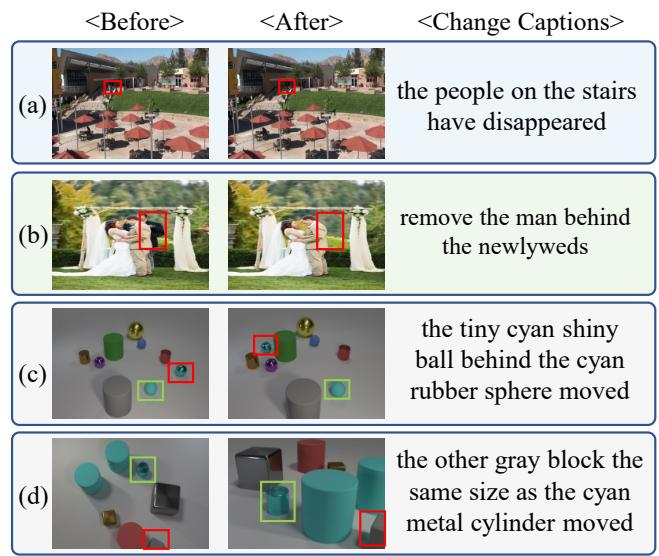  
Figure 1. The examples of change captioning. (a) is from a surveillance scene with underlying illumination change. (b) is from an image editing scene. (c) shows that with both object move and moderate viewpoint change. (d) shows that with both object move and extreme viewpoint change. Changed objects and referents are shown in red and green boxes, respectively.

While single-image captioning is already regarded as a very challenging task, change captioning carries additional difficulties. Simply locating inconspicuous differences is one such challenge (Fig. 1 (a) (b)). Further, in a dynamic environment, it is common to acquire two images under different viewpoints, which leads to pseudo changes about objects’ scale and location (Fig. 1 (c) (d)). As such, change captioning needs to characterize the real change while resisting pseudo changes. To locate change, the most intuitive way is to subtract two images [22, 7], but this risks computing difference features with noise if two images are unaligned [31]. Recently, researchers [25] find that same objects from different viewpoints would have similar features, so they match object features between two images to predict difference features. This paradigm has been followed by some of the recent works [11, 24, 38, 31, 30].

Despite the progress, current match-based methods suffer from learning stable difference features under pseudo changes. In detail, the matching is directly modeled between two image features, usually by cross-attention. However, the features of corresponding objects might shift under pseudo change. This case is more severe under drastic viewpoint changes (Fig. 1 (d)). Such feature shift appearing in most objects would overwhelm the local feature change, thus making it less effective to directly match two images.

For this challenge, we have two new observations. (1) While the feature difference might be ignored between a pair of similar images, it is hard to be overwhelmed between two images from different pairs. As such, contrastive difference learning between similar/dissimilar images can help the model focus more on the change of feature and resist feature shift. (2) Pseudo changes are essentially different distortions of objects, so they just construct cross-view comparison between two similar images, rather than affecting their similarity. Motivated by these, we study crossview feature matching between similar/dissimilar images, and maximize the alignment of similar ones, so as to learn two view-invariant image representations. Based on these, we can reconstruct the representations of unchanged objects and learn a stable difference representation.

In this paper, we tackle the above challenge with a novel Self-supervised CrOss-view REpresentation Reconstruction (SCORER) network, which learns a stable difference representation while resisting pseudo changes for caption generation. Concretely, given two similar images, we first devise a multi-head token-wise matching (MTM) to model relationships between cross-view features from similar/dissimilar images, via fully interacting different feature subspaces. Then, by maximizing cross-view contrastive alignment of the given image pair, SCORER learns their representations that are invariant to pseudo changes in a self-supervised way. Based on these, SCORER mines their reliable common features by cross-attention, so as to reconstruct the representations of unchanged objects. Next, we fuse the representations into two images to highlight the unchanged objects and implicitly infer the difference. Through this manner, we can obtain the difference representation that not only captures the change, but also conserves referent information, thus generating a high-level linguistic sentence with a transformer decoder.

To improve the quality of sentence, we further design a cross-modal backward reasoning (CBR) module. CBR first reversely produces a “hallucination” representation with the full representations of sentence and “before” image, where the “hallucination” is modeled based on the viewpoint of “before”. Then, we push it closer to the “after” representation by maximizing their cross-view contrastive alignment. Through this self-supervised manner, we ensure that the generated sentence is informative about the difference.

Our key contributions are: (1) We propose SCORER to learn two view-invariant image representations for reconstructing the representations of unchanged objects, so as to model a stable difference representation under pseudo changes. (2) We devise MTM to model relationships between cross-view images by fully interacting their different feature subspaces, which plays a critical role in viewinvariant representation learning. (3) We design CBR to improve captioning quality by enforcing the generated cap tion is informative about the difference. (4) Our method performs favorably against the state-of-the-art methods on four public datasets with different change scenarios.

## 2. Related Work

Change Captioning is a new task in vision-language understanding and generation [13, 19, 17, 29, 5, 35]. The pioneer works [10, 27] describe the difference between two aligned images (Fig. 1 (a) (b)). Since there usually exist viewpoint changes in a dynamic environment, recent works [22, 11] collect two datasets to simulate moderate (Fig. 1 (c)) and extreme viewpoint changes (Fig. 1 (d)). To describe the difference under viewpoint changes, previous works [22, 15] compute the difference by direct subtraction, which could compute difference with noise [25]. Recent methods [11, 24, 31, 30, 28, 39] directly match two images to predict difference features. However, due to the influence of pseudo changes, these methods are hard to learn stable difference features. In contrast, our SCORER first learns two view-invariant image representations by maximizing their cross-view contrastive alignment. Then, it mines their common features to reconstruct the representations of unchanged objects, thus learning a stable difference representation for caption generation. We note that the latest work [38] pre-trains the model with three self-supervised tasks, in order to improve cross-modal alignment. Different from it, we enforce the cross-modal alignment by implementing cross-modal backward reasoning in a self-supervised way. Meanwhile, our overall architecture is trained in an end-toend manner, which improves the training efficiency.

Token-wise Matching has been used in latest image/video retrieval works [37, 36] to compute cross-modal interaction between image/video and text features. However, since pseudo changes would induce feature shift between object pairs, it is insufficient to only match crossview features at token level. Hence, we further design a multi-head token-wise matching for finer-level interaction between different feature subspaces of cross-view images. This is key to learn the view-invariant representations.

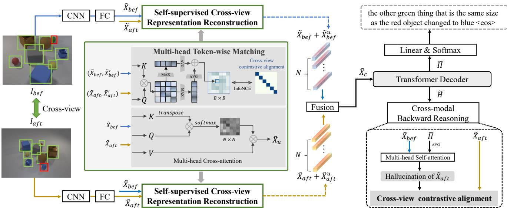  
Figure 2. The architecture of the proposed method, including a pre-trained CNN model, the self-supervised cross-view representation reconstruction network, a transformer decoder, and the cross-modal backward reasoning module. $\tilde { X } _ { b e f } ^ { \prime }$ and $\tilde { X } _ { a f t } ^ { \prime }$ denote the “before” and “after” image features from different pairs in the training batch. B is the batch size; N indicates the feature number in each image.

Cross-modal Consistency Constraint is to verify the quality of caption by using it and “before” image to rebuild “after” image. This idea has been tried by the latest works [7, 11]. However, both works only enforce the consistency among the caption, the changed object in “before” and “after” images, while ignoring the constraint for referents. If the changed object is similar to other objects (Fig. 1 (c) (d)), describing both the change and its referent is helpful to convey accurate change information. Considering this, we perform backward reasoning with the full representations of “before” and “after” images, which helps generate a high-level sentence about the change and its referent.

## 3. Methodology

As shown in Fig. 2, our method consists of four parts: (1) A pre-trained CNN encodes a pair of cross-view images into two representations. (2) The proposed SCORER learns two view-invariant representations to reconstruct the representations of unchanged objects and model the difference representation. (3) A transformer decoder translates the difference representation into a high-level linguistic sentence. (4) The proposed CBR improves the quality of sentence via enforcing it to be informative about the difference.

## 3.1. Cross-view Image Pair Encoding

Formally, given a pair of images “before” $I _ { b e f }$ and “after” $I _ { a f t }$ , we utilize a pre-trained CNN model to extract their grid features, denoted as $X _ { b e f }$ and $X _ { a f t }$ , where $X \in$ $\mathbb { R } ^ { C \times \breve { H } \times W } . \quad C ,$ H, W indicate the number of channels, height, and width. We first project both representations into a low-dimensional embedding space of $\mathbb { R } ^ { \bar { D } }$

$$
\tilde { X } _ { o } = \mathrm { c o n v _ { 2 } } ( X _ { o } ) + p o s ( X _ { o } ) ,\tag{1}
$$

where $o \in ( b e f , a f t )$ . conv denotes a 2D-convolutional layer; pos is a learnable position embedding layer.

## 3.2. Self-supervised Cross-view Representation Reconstruction

The core module of SCORER is the multi-head token wise matching (MTM). MTM aims to model relationships between cross-view images by performing fine-grained interaction between different feature subspaces, which plays a key role in view-invariant representation learning. In the following, we first elaborate MTM and then describe how to use it for view-invariant representation learning. Finally, we introduce how to reconstruct the representations of unchanged objects for difference representation learning.

## 3.2.1 Multi-head Token-wise Matching.

We first introduce the single-head token-wise matching (TM) and then extend it into the multi-head version. Formally, given a query $Q \in \mathbb { R } ^ { N \times D }$ and a key $K \in \mathbb { R } ^ { N \times D }$ , we first compute the similarity of i-th query token with all key tokens and select the maximum one as its token-wise maximum similarity with K. Then, we perform average pooling over the token-wise maximum similarity of all query tokens to obtain the similarity of Q to K. By analogy, we compute the average token-wise maximum similarity of K to

Q, which ensures capturing correct relationships between them. The above computation is formulated as follows:

$$
\begin{array} { c } { { \mathrm { T M } ( Q , K ) = \left[ \frac { 1 } { N } \displaystyle \sum _ { i = 1 } ^ { N } \displaystyle \operatorname* { m a x } _ { j = 1 } ^ { N } \left( e _ { i , j } \right) + \frac { 1 } { N } \displaystyle \sum _ { j = 1 } ^ { N } \displaystyle \operatorname* { m a x } _ { i = 1 } ^ { N } \left( e _ { i , j } \right) \right] / 2 , } } \\ { { e _ { i , j } = \left( q _ { i } \right) ^ { \top } k _ { j } . } } \end{array}\tag{2}
$$

Further, we extend TM into a multi-head version to jointly match different feature subspaces of $Q$ and $K$ , so as to perform fine-grained interaction between them:

$$
\begin{array} { r l } & { \mathbf { M T M } ( Q , K ) = \mathbf { C o n c a t } _ { i ^ { \prime } = 1 \ldots h } \left( \mathbf { \Psi } \mathbf { h e a d } _ { i ^ { \prime } } \right) , } \\ & { \qquad \mathbf { h e a d } _ { i ^ { \prime } } = \mathbf { T M } \left( Q W _ { i ^ { \prime } } ^ { Q } , K W _ { i ^ { \prime } } ^ { K } \right) . } \end{array}\tag{3}
$$

## 3.2.2 View-invariant Representation Learning

In a training batch, we sample B image pairs of “before” and “after”. For k-th “before” image $\bar { \tilde { X } } _ { k } ^ { b } ,$ , k-th “after” image $\tilde { X } _ { k } ^ { a }$ is its positive, while other “after” images will be the negatives in this batch. First, we reshape $\tilde { X } \in \mathbb { R } ^ { D \times H \times W }$ to $\tilde { X } \in \mathbb R ^ { N \times D }$ , where $N = H W$ denotes the number of features. Then, we use MTM to compute similarity $( B \times B$ matrix) of “before” to “after” and “after” to “before”, respectively. Next, we maximize cross-view contrastive alignment between $\tilde { X } _ { k } ^ { b }$ and $\tilde { X } _ { k } ^ { a }$ while minimizing the alignment of non-similar images, by the InfoNCE loss [20]:

$$
\begin{array} { r l r } {  { \mathcal { L } _ { b 2 a } = - \frac { 1 } { B } \sum _ { k } ^ { B } \log \frac { \exp { ( \mathrm { M T M } ( \tilde { X } _ { k } ^ { b } , \tilde { X } _ { k } ^ { a } ) / \tau ) } } { \sum _ { r } ^ { B } \exp { ( \mathrm { M T M } ( \tilde { X } _ { k } ^ { b } , \tilde { X } _ { r } ^ { a } ) / \tau ) } } , } } \\ & { } & { \mathscr { L } _ { a 2 b } = - \frac { 1 } { B } \sum _ { k } ^ { B } \log \frac { \exp { ( \mathrm { M T M } ( \tilde { X } _ { k } ^ { a } , \tilde { X } _ { k } ^ { b } ) / \tau ) } } { \sum _ { r } ^ { B } \exp { ( \mathrm { M T M } ( \tilde { X } _ { k } ^ { a } , \tilde { X } _ { r } ^ { b } ) / \tau ) } } , } \\ & { } & { \mathscr { L } _ { \mathrm { c v } } = \frac { 1 } { 2 } ( \mathscr { L } _ { b 2 a } + \mathscr { L } _ { a 2 b } ) , } \end{array}\tag{4}
$$

where $\tau$ is the temperature hyper-parameter. In this selfsupervised way, we can make the representations of $\tilde { X } _ { b e f }$ and $\tilde { X } _ { a f t }$ invariant to pseudo changes, so as to facilitate the following cross-view representation reconstruction.

## 3.2.3 Cross-view Representation Reconstruction

Based on the two view-invariant representations $\tilde { X } _ { b e f }$ and $\tilde { X } _ { a f t }$ , we use a multi-head cross-attention (MHCA) [33] to mine their common features for reconstructing the representations of unchanged objects in each image. Here, representation reconstruction indicates that the unchanged representations of each image are distilled from the other one, $e . g .$ , the unchanged representations of $\tilde { X } _ { b e f }$ are computed by transferring similar features on $\tilde { X } _ { a f t }$ back to the corresponding positions on $\tilde { X } _ { b e f }$ . In this way, we reconstruct the unchanged representations for each image, respectively:

$$
\begin{array} { r } { \tilde { X } _ { b e f } ^ { u } = \mathrm { M H C A } ( \tilde { X } _ { b e f } , \tilde { X } _ { a f t } , \tilde { X } _ { a f t } ) , } \\ { \tilde { X } _ { a f t } ^ { u } = \mathrm { M H C A } ( \tilde { X } _ { a f t } , \tilde { X } _ { b e f } , \tilde { X } _ { b e f } ) . } \end{array}\tag{5}
$$

Then, instead of subtracting them from image representations [25, 31, 30], which leads to information $( e . g .$ , referents) loss, we integrate them into image representations to highlight the unchanged objects and deduce the difference information, so as to learn the stable difference representation in each image:

$$
\tilde { X } _ { o } ^ { c } = \mathrm { L N } ( \tilde { X } _ { o } + \tilde { X } _ { o } ^ { u } ) .\tag{6}
$$

Herein, $o \in ( b e f , a f t )$ and LN is short for LayerNorm [2]. Finally, we obtain the difference representation between two images by fusing $\tilde { X } _ { b e f } ^ { c }$ and $\tilde { X } _ { a f t } ^ { c } ,$ which is implemented by a fully-connected layer with the ReLU function:

$$
\tilde { X } _ { c } = \mathrm { R e L U } \left( \left[ \tilde { X } _ { b e f } ^ { c } ; \tilde { X } _ { a f t } ^ { c } \right] W _ { h } + b _ { h } \right) ,\tag{7}
$$

where [;] is a concatenation operation.

## 3.3. Caption Generation

After leaning $\tilde { X } _ { c } ~ \in ~ \mathbb { R } ^ { N \times D }$ , we use a transformer decoder [33] to translate it into a sentence. First, the multi-head self-attention takes the word features $E [ W ] =$ $\{ E [ w _ { 1 } ] , . . . , E [ w _ { m } ] \}$ (ground-truth words during training, predicted words during inference) as inputs and computes a set of intra-relation embedded word features, denoted as $\hat { E } [ W ]$ Then, the decoder utilizes $\hat { E } [ W ]$ to query the most related features $\hat { H }$ from $\tilde { X } _ { c }$ via the multi-head crossattention. Afterward, the $\hat { H }$ is passed to a feed-forward network to obtain an enhanced representation $\tilde { H }$ . Finally, the probability distributions of target words are calculated by:

$$
\tilde { W } = \mathrm { S o f t m a x } \left( \tilde { H } W _ { c } + b _ { c } \right) ,\tag{8}
$$

where $W _ { c } \in \mathbb { R } ^ { D \times U }$ and $b _ { c } \in \mathbb { R } ^ { U }$ are the parameters to be learned; U is the dimension of vocabulary size.

## 3.4. Cross-modal Backward Reasoning

To improve the quality of generated sentence, we devise the CBR to first reversely model a “hallucination” representation with the sentence and “before” image. Then, we push it closer to the “after” representation to enforce the sentence to be informative about the difference. Concretely, we first fuse $\tilde { H } \in \mathbb { R } ^ { m \times D }$ by the mean-pooling operation to obtain a sentence feature $\tilde { T }$ . Then, we broadcast $\tilde { T } \in \mathbb { R } ^ { D }$ as $\tilde { T } \in \mathbb { R } ^ { D \times H \times W }$ and concatenate it with $\tilde { X } _ { b e f }$ , so as to obtain the “hallucination” $\hat { X } _ { h a l }$

$$
\begin{array} { r } { \hat { X } _ { h a l } = \mathrm { c o n v } _ { 2 } \big ( [ \tilde { X } _ { b e f } ; \tilde { T } ] \big ) , \hat { X } _ { h a l } \in \mathbb { R } ^ { D \times H \times W } . } \end{array}\tag{9}
$$

$\hat { X } _ { h a l }$ and $\tilde { X } _ { b e f }$ are kept as the same shape to ensure that spatial information is not collapsed. Next, we capture the relationships between different locations in $\hat { X } _ { h a l }$ based on the multi-head self-attention (MHSA), which is essential for backward reasoning and computed by:

$$
\begin{array} { r } { \tilde { X } _ { h a l } = \mathrm { c o n v } _ { 2 } [ \mathbf { M H S A } \left( \hat { X } _ { h a l } , \hat { X } _ { h a l } , \hat { X } _ { h a l } \right) ] , } \end{array}\tag{10}
$$

Since the “hallucination” representation is produced based on the viewpoint of “before” representation, it is less effective to directly match it with the “after” representation.

To this end, we sample unrelated representations of “hallucination” and “after” from different pairs, which are as erroneous candidates for CBR. Similarly, in each batch, for k-th “hallucination” X˜ hk , k-th “after” X˜ ak is its positive, while the other “after” images will be the negatives. Also, we use MTM to capture relationships between positive/negative pairs. Subsequently, we maximize cross-view contrastive alignment of positive pairs by the InfoNCE loss [20], which is similar to Eq. (4):

$$
\mathcal { L } _ { \mathrm { c m } } = \frac { 1 } { 2 } ( \mathcal { L } _ { h 2 a } + \mathcal { L } _ { a 2 h } ) .\tag{11}
$$

Through this self-supervised manner, we make the sentence sufficiently describe the difference information.

## 3.5. Joint Training

The proposed overall network is trained in an end-to-end manner by maximizing the likelihood of the observed word sequence. Given the ground-truth words $( w _ { 1 } ^ { * } , \dots , w _ { m } ^ { * } )$ , we minimize the negative log-likelihood loss:

$$
\mathcal { L } _ { c a p } ( \boldsymbol { \theta } ) = - \sum _ { t = 1 } ^ { m } \log p _ { \boldsymbol { \theta } } \left( \boldsymbol { w } _ { t } ^ { * } \mid \boldsymbol { w } _ { < t } ^ { * } \right) ,\tag{12}
$$

where $p _ { \theta } \left( w _ { t } ^ { * } \mid w _ { < t } ^ { * } \right)$ is computed by Eq. (8), and θ are the parameters of the network. Besides, the network is self-supervised by the losses of two contrastive alignments. Hence, the final loss function is optimized as follows:

$$
\mathcal { L } = \mathcal { L } _ { c a p } + \lambda _ { v } \mathcal { L } _ { \mathrm { c v } } + \lambda _ { m } \mathcal { L } _ { \mathrm { c m } } ,\tag{13}
$$

where $\lambda _ { v }$ and $\lambda _ { m }$ are the trade-off parameters, which are discussed in the supplementary material.

## 4. Experiments

## 4.1. Datasets

CLEVR-Change is a large-scale dataset [22] with moderate viewpoint change. It has 79,606 image pairs, including five change types, i.e., “Color”, “Texture”, “Add”, “Drop”, and “Move”.We use the official split with 67,660 for training, 3,976 for validation and 7,970 for testing.

CLEVR-DC is a large-scale dataset [11] with extreme viewpoint shift. It includes 48,000 pairs with same change types as CLEVR-Change. We use the official split with 85% for training, 5% for validation, and 10% for testing.

Image Editing Request dataset [27] includes 3,939 aligned image pairs with 5,695 editing instructions. We use the official split with 3,061 image pairs for training, 383 for validation, and 495 for testing.

Spot-the-Diff dataset [10] includes 13,192 aligned image pairs from surveillance cameras. Following SOTA methods, we mainly evaluate our model in a single change setting. Based on the official split, the dataset is split into training, validation, and testing with a ratio of 8:1:1.

## 4.2. Evaluation Metrics

Following the current state-of-the-art methods, five metrics are used to evaluate the generated sentences, i.e., BLEU-4 (B) [21], METEOR (M) [3], ROUGE-L (R) [16], CIDEr (C) [34], and SPICE (S) [1]. The results are computed based on the Microsoft COCO evaluation server [4].

## 4.3. Implementation Details

For a fair comparison, we follow the SOTA methods to use a pre-trained ResNet-101 [6] to extract grid features of an image pair, with the dimension of 1024 × 14 × 14. We first project these features into a lower dimension of 512. The hidden size in the overall model and word embedding size are set to 512 and 300. The proper head and layer numbers of SCORER are discussed below. The head and layer numbers in the decoder are set to 8 and 2 on the four datasets. During training, We use Adam optimizer [12] to minimize the negative log-likelihood loss of Eq. (13). During inference, the greedy decoding strategy is used to generate captions. Both training and inference are implemented with PyTorch [23] on an RTX 3090 GPU. More implementation details are described in the supplementary material.

## 4.4. Performance Comparison

## 4.4.1 Results on the CLEVR-Change Dataset.

We compare with the state-of-the-art methods in: 1) total performance under both semantic and pseudo changes; 2) semantic change; 3) different change types. The comparison methods are categorized into 1) end-to-end training: DUDA [22], DUDA+ [7], R3Net+SSP [31], VACC [11], SRDRL+AVS [32], SGCC [15], MCCFormers-D [24], IFDC [9], BDLSCR [26], NCT [30], and VARD-Trans [28]; 2) reinforcement learning: M-VAM+RAF [25]; 3) pre-training: PCL w/ pre-training [38].

In Table 1, our method achieves the best results on all metrics against the end-to-end training methods. Besides, our method performs much better than these two methods augmented by pre-training and reinforcement learning.

<table><tr><td rowspan="2">Method</td><td rowspan="2">M</td><td colspan="5">Total</td><td colspan="5">Semantic Change</td></tr><tr><td>B</td><td></td><td>R</td><td>C</td><td>S</td><td>B</td><td>M</td><td>R</td><td>C</td><td>S</td></tr><tr><td>PCL w/ Pre-training (AAAI 2022) [38]</td><td>51.2</td><td>36.2</td><td>71.7</td><td>128.9</td><td></td><td></td><td></td><td></td><td></td><td></td><td></td></tr><tr><td>M-VAM+RAF (ECCV 2020) [25]</td><td>51.3</td><td>37.8</td><td></td><td>70.4</td><td>115.8</td><td>30.7</td><td></td><td></td><td></td><td></td><td></td></tr><tr><td>DUDA (ICCV 2019) [22]</td><td>47.3</td><td>33.9</td><td></td><td></td><td>112.3</td><td>24.5</td><td>42.9</td><td>29.7</td><td></td><td>94.6</td><td>19.9</td></tr><tr><td>DUDA+ (CVPR 2021) [7]</td><td>51.2</td><td>37.7</td><td>70.5</td><td></td><td>115.4</td><td>31.1</td><td>49.9</td><td>34.3</td><td>65.4</td><td>101.3</td><td>27.9</td></tr><tr><td>R3Net+SSP (EMNLP 2021) [31]</td><td>54.7</td><td>39.8</td><td>73.1</td><td></td><td>123.0</td><td>32.6</td><td>52.7</td><td>36.2</td><td>69.8</td><td>116.6</td><td>30.3</td></tr><tr><td>VACC (ICCV 2021) [11]</td><td>52.4</td><td>37.5</td><td></td><td></td><td>114.2</td><td>31.0</td><td>1</td><td></td><td></td><td></td><td>1</td></tr><tr><td>SGCC (ACM MM 2021) [15]</td><td>51.1</td><td>40.6</td><td></td><td>73.9</td><td>121.8</td><td>32.2</td><td></td><td></td><td></td><td></td><td></td></tr><tr><td>SRDRL+AVS (ACL 2021) [32]</td><td>54.9</td><td>40.2</td><td>73.3</td><td></td><td>122.2</td><td>32.9</td><td>52.7</td><td>36.4</td><td>69.7</td><td>114.2</td><td>30.8</td></tr><tr><td>MCCFormers-D (ICCV 2021) [24]</td><td>52.4</td><td>38.3</td><td></td><td></td><td>121.6</td><td>26.8</td><td></td><td></td><td></td><td></td><td></td></tr><tr><td>IFDC (TMM 2022) [9]</td><td>49.2</td><td>32.5</td><td></td><td>69.1</td><td>118.7</td><td></td><td>47.2</td><td>29.3</td><td>63.7</td><td>105.4</td><td></td></tr><tr><td>NCT (TMM 2023) [30]</td><td>55.1</td><td>40.2</td><td></td><td>73.8</td><td>124.1</td><td>32.9</td><td>53.1</td><td>36.5</td><td>70.7</td><td>118.4</td><td>30.9</td></tr><tr><td>VARD-Trans (TIP 2023) [28]</td><td>55.4</td><td>40.1</td><td>73.8</td><td></td><td>126.4</td><td>32.6</td><td></td><td></td><td></td><td></td><td></td></tr><tr><td>SCORER (Ours)</td><td>55.8</td><td>40.8</td><td></td><td>74.0</td><td>126.0</td><td>33.0</td><td>54.1</td><td>37.4</td><td>71.5</td><td>122.0</td><td>31.2</td></tr><tr><td>SCORER+CBR (Ours)</td><td>56.3</td><td>41.2</td><td></td><td>74.5</td><td>126.8</td><td>33.3</td><td>54.4</td><td>37.6</td><td>71.7</td><td>122.4</td><td>31.6</td></tr></table>

Table 1. Comparison with the state-of-the-art methods on CLEVR-Change under the settings of total performance and semantic change.

<table><tr><td rowspan=1 colspan=1>Method</td><td rowspan=1 colspan=5>CIDErCL     T     A     D   MV</td></tr><tr><td rowspan=1 colspan=1>PCL w/ PT</td><td rowspan=1 colspan=2>131.2  101.1</td><td rowspan=1 colspan=1>133.3</td><td rowspan=1 colspan=1>116.5</td><td rowspan=1 colspan=1>81.7</td></tr><tr><td rowspan=2 colspan=1>M-VAM+RAFDUDA</td><td rowspan=1 colspan=1>122.1</td><td rowspan=1 colspan=1>98.7</td><td rowspan=1 colspan=1>126.3</td><td rowspan=1 colspan=1>115.8</td><td rowspan=1 colspan=1>82.0</td></tr><tr><td rowspan=1 colspan=1>120.4</td><td rowspan=1 colspan=1>86.7</td><td rowspan=1 colspan=1>108.2</td><td rowspan=1 colspan=1>103.4</td><td rowspan=1 colspan=1>56.4</td></tr><tr><td rowspan=1 colspan=1>DUDA+</td><td rowspan=1 colspan=1>120.8</td><td rowspan=1 colspan=1>89.9</td><td rowspan=1 colspan=1>119.8</td><td rowspan=1 colspan=1>123.4</td><td rowspan=1 colspan=1>62.1</td></tr><tr><td rowspan=1 colspan=1>R3Net+SSP</td><td rowspan=1 colspan=1>139.2</td><td rowspan=1 colspan=1>123.5</td><td rowspan=1 colspan=1>122.7</td><td rowspan=1 colspan=1>121.9</td><td rowspan=1 colspan=1>88.1</td></tr><tr><td rowspan=1 colspan=1>SRDRL+AVS</td><td rowspan=1 colspan=1>136.1</td><td rowspan=1 colspan=1>122.7</td><td rowspan=1 colspan=1>121.0</td><td rowspan=1 colspan=1>126.0</td><td rowspan=1 colspan=1>78.9</td></tr><tr><td rowspan=1 colspan=1>BDLSCR</td><td rowspan=1 colspan=1>136.1</td><td rowspan=1 colspan=1>122.7</td><td rowspan=1 colspan=1>121.0</td><td rowspan=1 colspan=1>126.0</td><td rowspan=1 colspan=1>78.9</td></tr><tr><td rowspan=1 colspan=1>IFDC</td><td rowspan=1 colspan=1>133.2</td><td rowspan=1 colspan=1>99.1</td><td rowspan=1 colspan=1>128.2</td><td rowspan=1 colspan=1>118.5</td><td rowspan=1 colspan=1>82.1</td></tr><tr><td rowspan=1 colspan=1>NCT</td><td rowspan=1 colspan=1>140.2</td><td rowspan=1 colspan=1>128.8</td><td rowspan=1 colspan=1>128.4</td><td rowspan=1 colspan=1>129.0</td><td rowspan=1 colspan=1>86.0</td></tr><tr><td rowspan=1 colspan=1>SCORER</td><td rowspan=1 colspan=1>143.2</td><td rowspan=1 colspan=1>135.2</td><td rowspan=1 colspan=1>129.4</td><td rowspan=1 colspan=1>132.6</td><td rowspan=1 colspan=1>91.6</td></tr><tr><td rowspan=1 colspan=1>SCORER+CBR</td><td rowspan=1 colspan=2>146.2  133.7</td><td rowspan=1 colspan=1>131.1</td><td rowspan=1 colspan=1>133.9</td><td rowspan=1 colspan=1>92.2</td></tr></table>

Table 2. A detailed breakdown of evaluation on CLEVR-Change with different change types: “(CL) Color”, “(T) Textur”, “(A) Add”, “(D) Drop”, and “(MV) Move”. PT is short for pre-training.

We note that SCORER outperforms MCCFormers-D by a large margin. MCCFormers-D is a classic match-based method that directly correlates two image representations to learn a difference representation, which is then fed into a transformer decoder for caption generation. Different from it, our SCORER first learns two view-invariant image representations by maximizing their cross-view contrastive alignment. Then, SCORER reconstructs the representations of unchanged objects, so as to learn a stable difference representation under pseudo changes for caption generation.

In Table 2, under the detailed change types, our method surpasses the current methods by a large margin in almost every category. Under the most difficult type “Move”, our SCORER+CBR achieves the relative improvement of 4.7% against $\mathrm { R ^ { 3 } N e t + S S P . }$ This validates the necessary of viewinvariant representation learning. Moreover, under different settings, CBR helps yield an extra performance boost, which shows it does improve captioning quality.

## 4.4.2 Results on the CLEVR-DC Dataset

On CLEVR-DC with extreme viewpoint changes, we compare SCORER/SCORER+CBR with several state-of-the-art methods: DUDA/DUDA+CC [22], M-VAM/M-VAM+CC [25], VA/VACC [11], MCCFormers-D [24], NCT [30], and VARD-Trans [28]. For fair-comparison, we compare them based on the usage of cross-modal consistency constraint. We implement MCCFormers-D based on the released code on CLEVR-DC and Image Editing Request datasets.

The results are shown in Table 3. Our SCORER achieves the best results on most metrics. This benefits from learning two view-invariant representations to reconstruct representations of unchanged objects, thus learning a stable difference representation under extreme viewpoint changes. When we implement CBR, the performance of SCORER+CBR is further boosted, especially achieving 16.7% improvement against VACC on CIDEr. This shows that our CBR can calibrate the model to generate a linguistic sentence describing the change and its referent.

## 4.4.3 Results on the Image Editing Reques Dataset

To validate the generalization of our method, we conduct the experiment on a challenging dataset of Image Editing Request (IER). We compare with the following SOTA methods: DUDA [22], Dyn rel-att [27], MCCFormers-D [24], BDLSCR [26], NCT [30], and VARD-Trans [28].

<table><tr><td>Method</td><td>B</td><td>M</td><td>C</td><td>S</td></tr><tr><td rowspan="6">DUDA [22] M-VAM [25] VA [11] MCCFormers-D [24] NCT [30]</td><td>40.3</td><td>27.1</td><td>56.7</td><td>16.1</td></tr><tr><td>40.9</td><td>27.1</td><td>60.1</td><td>15.8</td></tr><tr><td>44.5</td><td>29.2</td><td>70.0</td><td>17.1</td></tr><tr><td>46.9</td><td>31.7</td><td>71.6</td><td>14.6</td></tr><tr><td>47.5</td><td>32.5</td><td>76.9</td><td>15.6</td></tr><tr><td>48.3 49.5</td><td>32.4 33.4</td><td>77.6 82.4</td><td>15.4 15.8</td></tr><tr><td rowspan="4">DUDA+CC [22] M-VAM+CC [25] VACC [11] SCORER+CBR</td><td>41.7</td><td>27.5</td><td>62.0</td><td>16.4</td></tr><tr><td>41.0</td><td>27.2</td><td>62.0</td><td>15.7</td></tr><tr><td>45.0</td><td>29.3</td><td>71.7</td><td>17.6</td></tr><tr><td>49.4</td><td>33.4</td><td>83.7</td><td>16.2</td></tr></table>

Table 3. Comparison with the SOTA methods on CLEVR-DC.
<table><tr><td rowspan=1 colspan=1>Method</td><td rowspan=1 colspan=3>B    M    R</td><td rowspan=1 colspan=1>C</td></tr><tr><td rowspan=3 colspan=1>DUDA [22]Dyn rel-att [27]MCCFormers-D [24]</td><td rowspan=1 colspan=1>6.5</td><td rowspan=1 colspan=1>12.4</td><td rowspan=1 colspan=1>37.3</td><td rowspan=1 colspan=1>22.8</td></tr><tr><td rowspan=1 colspan=1>6.7</td><td rowspan=1 colspan=1>12.8</td><td rowspan=1 colspan=1>37.5</td><td rowspan=1 colspan=1>26.4</td></tr><tr><td rowspan=1 colspan=1>8.3</td><td rowspan=1 colspan=1>14.3</td><td rowspan=1 colspan=1>39.2</td><td rowspan=1 colspan=1>30.2</td></tr><tr><td rowspan=5 colspan=1>BDLSCR [26]NCT [30]VARD-Trans [28]SCORERSCORER+CBR</td><td rowspan=1 colspan=1>6.9</td><td rowspan=1 colspan=1>14.6</td><td rowspan=1 colspan=1>38.5</td><td rowspan=1 colspan=1>27.7</td></tr><tr><td rowspan=1 colspan=1>8.1</td><td rowspan=1 colspan=1>15.0</td><td rowspan=1 colspan=1>38.8</td><td rowspan=1 colspan=1>34.2</td></tr><tr><td rowspan=1 colspan=1>10.0</td><td rowspan=1 colspan=1>14.8</td><td rowspan=1 colspan=1>39.0</td><td rowspan=1 colspan=1>35.7</td></tr><tr><td rowspan=1 colspan=1>9.6</td><td rowspan=1 colspan=1>14.6</td><td rowspan=1 colspan=1>39.5</td><td rowspan=1 colspan=1>31.0</td></tr><tr><td rowspan=1 colspan=1>10.0</td><td rowspan=1 colspan=1>15.0</td><td rowspan=1 colspan=1>39.6</td><td rowspan=1 colspan=1>33.4</td></tr></table>

Table 4. Comparison with the SOTA methods on IER.

Table 4 shows SCORER+CBR outperforms the SOTA methods on most metrics. Especially on BLEU-4, SCORER+CBR obtains the relative improvement of 23.5% against the latest method NCT (TMM 2023). The edited objects are usually inconspicuous. This indicates that the proposed method can fully mine the common features by maximizing cross-view contrastive alignment between two images, so as to accurately describe which part of the “before” image has been edited. Further, the generated sentence is refined in the process of cross-modal backward reasoning.

## 4.4.4 Results on the Spot-the-Diff Dataset

To further validate the generalization, we conduct the experiment on Spot-the-Diff that includes aligned image pairs from the surveillance cameras. The following SOTA methods are compared: DUDA+ [7], M-VAM/M-VAM+RAF [25], VACC [11], SRDRL+AVS [32], MCCFormers-D [24], IFDC [9], BDLSCR [26], and VARD-Trans [28].

In Table 5, our method achieves superior results on most metrics, which shows its generalization on different scenarios. Besides, our method performs lower on METEOR and SPICE when implementing CBR. Our conjecture is that image pairs on this dataset actually contain one or more changes. For fair-comparison, we conduct experiments mainly based on the single-change setup. This makes the “hallucination” representation, which is reversely modeled by the “before” representation and single-change caption, not fully matched with the “after” representation. As such, SCORER+CBR does not gain significant improvement.

<table><tr><td rowspan=1 colspan=2>Method</td><td rowspan=1 colspan=4>B    M    C     S</td></tr><tr><td rowspan=1 colspan=2>M-VAM+RAF [25]</td><td rowspan=1 colspan=1>11.1</td><td rowspan=1 colspan=1>12.9</td><td rowspan=1 colspan=1>43.5</td><td rowspan=1 colspan=1>17.1</td></tr><tr><td rowspan=1 colspan=2>M-VAM [25]</td><td rowspan=1 colspan=1>10.1</td><td rowspan=1 colspan=1>12.4</td><td rowspan=1 colspan=1>38.1</td><td rowspan=1 colspan=1>14.0</td></tr><tr><td rowspan=3 colspan=2>DUDA+ [7]VACC [11]SRDRL+AVS [32]</td><td rowspan=1 colspan=1>8.1</td><td rowspan=1 colspan=1>12.5</td><td rowspan=1 colspan=1>34.5</td><td rowspan=1 colspan=1></td></tr><tr><td rowspan=1 colspan=1>9.7</td><td rowspan=1 colspan=1>12.6</td><td rowspan=1 colspan=1>41.5</td><td rowspan=1 colspan=1></td></tr><tr><td rowspan=1 colspan=1></td><td rowspan=1 colspan=1>13.0</td><td rowspan=1 colspan=1>35.3</td><td rowspan=1 colspan=1>18.0</td></tr><tr><td rowspan=1 colspan=2>MCCFormers-D [24]</td><td rowspan=1 colspan=1>10.0</td><td rowspan=1 colspan=1>12.4</td><td rowspan=1 colspan=1>43.1</td><td rowspan=1 colspan=1>18.3</td></tr><tr><td rowspan=2 colspan=2>IFDC [9]</td><td rowspan=1 colspan=1>8.7</td><td rowspan=1 colspan=1>11.7</td><td rowspan=1 colspan=1>37.0</td><td rowspan=1 colspan=1></td></tr><tr><td rowspan=1 colspan=1>3DLSCR [26]</td><td rowspan=1 colspan=1>6.6</td><td rowspan=1 colspan=1>10.6</td><td rowspan=1 colspan=1>42.2</td><td rowspan=1 colspan=1></td></tr><tr><td rowspan=3 colspan=2>SCORERSCORER+CBR</td><td rowspan=1 colspan=2>RD-Trans [28]</td><td rowspan=1 colspan=1></td><td rowspan=1 colspan=1>12.5</td></tr><tr><td rowspan=1 colspan=1>9.4</td><td rowspan=1 colspan=1>13.8</td><td rowspan=1 colspan=1>38.5</td><td rowspan=1 colspan=1>19.3</td></tr><tr><td rowspan=1 colspan=1>10.2</td><td rowspan=1 colspan=1>12.2</td><td rowspan=1 colspan=1>38.9</td><td rowspan=1 colspan=1>18.4</td></tr></table>

Table 5. Comparison with the SOTA methods on Spot-the-Diff.
<table><tr><td>Ablation</td><td>B</td><td>M</td><td>R</td><td>C</td><td>S</td></tr><tr><td>Subtraction</td><td>53.3</td><td>38.8</td><td>72.1</td><td>119.7</td><td>31.8</td></tr><tr><td>RR</td><td>55.1</td><td>40.5</td><td>73.6</td><td>123.8</td><td>32.5</td></tr><tr><td>SCORER</td><td>55.8</td><td>40.8</td><td>74.0</td><td>126.0</td><td>33.0</td></tr><tr><td>RR+CBR</td><td>55.8</td><td>41.0</td><td>74.2</td><td>125.5</td><td>32.9</td></tr><tr><td>SCORER+CBR</td><td>56.3</td><td>41.2</td><td>74.5</td><td>126.8</td><td>33.3</td></tr></table>

Table 6. Ablation on CLEVR-Change under Total Performance.

In short, compared with the state-of-the-art methods in different change scenarios, our method achieves the impressive performance. The superiority mainly results from that 1) SCORER learns two view-invariant image representations for reconstructing the representations of unchanged objects, so as to learn a stable difference representation for generating a linguistic sentence; 2) CBR can further improve the quality of generated sentence.

## 4.5. Ablation Study and Analysis

Ablation Study of Each Module on CLEVR-Change. Table 6 shows ablation study of each module under total performance. Subtraction indicates directly subtracting two images; RR means vanilla representation reconstruction. We find that RR is much better than Subtraction, showing that match-based strategy is more reliable than direct subtraction under pseudo changes. When we maximize crossview contrastive alignment of two images, SCORER yields a further performance boost. This shows that it is important to learn the representations invariant under pseudo changes, which is key to learn a stable difference representation.

<table><tr><td></td><td colspan="5">Semantic Change</td><td colspan="5">Only Pseudo Change</td></tr><tr><td>Method</td><td>B</td><td>M</td><td>R</td><td>C</td><td>S</td><td>B</td><td>M</td><td>R</td><td>C</td><td>S</td></tr><tr><td>Subtraction</td><td>50.2</td><td>34.1</td><td>67.1</td><td>108.0</td><td>28</td><td>57.3</td><td>48.4</td><td>74.7</td><td>113.8</td><td>34.0</td></tr><tr><td>RR</td><td>53.3</td><td>37.1</td><td>70.8</td><td>119.1</td><td>30.4</td><td>61.1</td><td>50.7</td><td>76.4</td><td>114.9</td><td>34.6</td></tr><tr><td>SCORER</td><td>54.3</td><td>37.5</td><td>71.5</td><td>122.0</td><td>31.2</td><td>61.4</td><td>50.6</td><td>76.5</td><td>116.4</td><td>34.7</td></tr><tr><td>RR+CBR</td><td>54.1</td><td>37.4</td><td>71.5</td><td>122.4</td><td>31.2</td><td>60.7</td><td>51.2</td><td>76.9</td><td>114.9</td><td>34.6</td></tr><tr><td>SCORER+CBR</td><td>54.4</td><td>37.6</td><td>71.7</td><td>122.4</td><td>31.6</td><td>62.0</td><td>51.7</td><td>77.4</td><td>117.9</td><td>35.0</td></tr></table>

Table 7. Ablation study on CLEVR-Change under the evaluation of semantic change and only pseudo change.

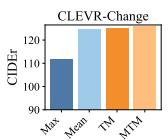  
Ablative Variants

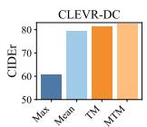  
Ablative Variants

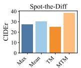  
Ablative Variant

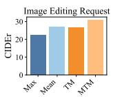  
Ablative Variants

Figure 3. Ablation studies of MTM on four datasets.  
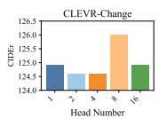

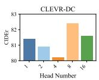

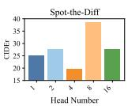

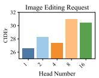  
Figure 4. Effect of head number of SCORER on four datasets.

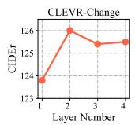

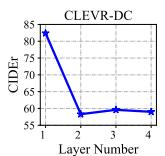

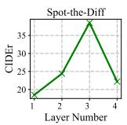

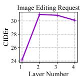  
Figure 5. Effect of layer number of SCORER on four datasets.

Besides, when we augment RR and SCORER with CBR, both RR+CBR and SCORER+CBR achieve better performances. This not only validates that CBR improves captioning quality, but also proves that CBR is generalizable.

Table 7 shows the ablation study of each module under semantic change and only pseudo change, separately. We can obtain observations similar to the total performance. Besides, we find that SCORER is much better than RR under semantic change, but under only pseudo change, SCORER brings less gain. This results from that in this case, the learned difference representation contains less information, making SCORER difficult to align it with words. By contrast, SCORER+CBR significantly improves RR on both settings, which shows that SCORER and CBR supplement each other. More ablation studies on the other datasets are in the supplementary material.

Ablation Study of MTM. Instead of using MTM to perform fine-grained matching between different feature subspaces of cross-view images, we use max/mean-pooling to obtain the global feature of each image and compute their similarity. Besides, we implement TM without multi-head operation. The results in Fig. 3 show that MTM achieves the best results, which demonstrates that it plays a critical role in view-invariant representation learning. Besides, only implementing token-wise matching is not better than simple mean-pooling. Our conjecture is that the changed object commonly appears in a local region with weak feature, so it is insufficient to reveal this slight difference by only interacting features at token level. As such, it is necessary to match two image features at finer level, i.e., subspace level.

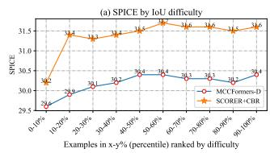

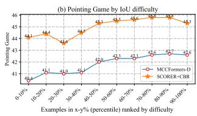  
Figure 6. Captioning and change localization of varied viewpoints.

Effect of Head Number of SCORER. We further investigate the effect of head number for SCORER, i.e., the head number of MTM and MHCA (Eq. (5)). The results are shown in Fig. 4. We find that the best results are achieved on the four datasets when setting the head number as 8.

Effect of Layer Number of SCORER. We investigate the effect of layer number for SCORER in Fig. 5. On four datasets, we find that increasing the layer number does not bring better performance, because deeper layers could result in the problem of over-fitting. Besides, the layer number is the deepest on Spot-the-Diff. Our conjecture is that objects have no good postures and background information is more complex in a surveillance scenario. As such, we empirically set proper layer number of 2, 1, 3, and 2 on four datasets.

## 4.6. Captioning and change localization results with varied viewpoints

To intuitively evaluate the efficacy of our method to handle pseudo changes, we show the captioning (Fig. 6 (a)) and change localization (Fig. 6 (b)) results of SCORER+CBR and SOTA method MCCFormers-D [24] with varied viewpoints. The amount of viewpoint change is measured by the IoUs of objects’ bounding boxes across an image pair (lower IoU means higher difficulty). For change localization, the pioneer work DUDA [22] tried Pointing Game to evaluate attention maps of change localization, where maps are computed by using the captured difference to directly query related regions on each image. In contrast, we consider simultaneously evaluating change localization and cross-modal alignment, i.e., attention maps of cross-modal alignment, to check whether the model can locate changed regions when generating corresponding words. This is more challenging but more reasonable. In Fig. 6, we find that our method outperforms MCCFormers-D and shows better robustness with varied viewpoint changes on both evaluations, which benefit from view-invariant representation learning and cross-modal backward reasoning.

(b) Spot-the-Diff: Object Add  
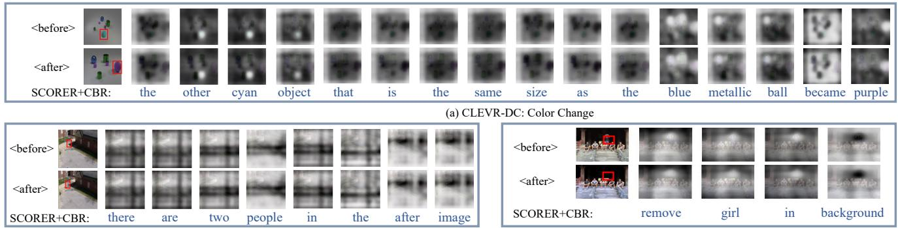  
Figure 7. Three cases from different scenarios, where the generated captions along with the attention weight at each word are visualized.

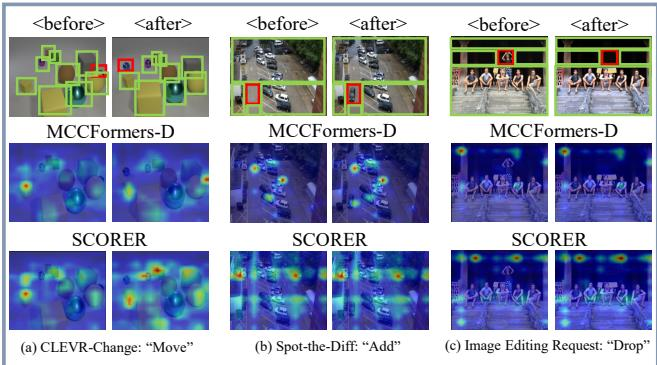  
Figure 8. Visualization of the alignment of unchanged objects computed by MCCFormers-D [24] and our SCORER.

## 4.7. Qualitative Analysis

To intuitively evaluate our method, we conduct qualitative analysis on the four datasets. Fig. 7 illustrates three cases in different change scenarios. For each case, we visualize the generated caption along with the attention weight at each word. When the weight is higher, the region is brighter. We observe that when generating the words about the changed object or its referents, SCORER+CBR can adaptively locate the corresponding regions. In Fig. 8, we visualize the alignment between unchanged objects under different change scenes. The compared method is the SOTA method MCCFormers-D [24]. We implement it based on the released code. We find that when directly correlating two image features, MCCFormers-D only aligns salient objects between two images. Instead, our SCORER first learns two view-invariant representations in a self-supervised way. Based on these, SCORER can better align and reconstruct the representations of unchanged objects, so as to facilitate subsequent difference representation learning. More qualitative examples are shown in the supplementary material.

## 5. Conclusion

This paper proposes a novel SCORER to learn a stable difference representation while resisting pseudo changes. SCORER first learns two view-invariant image representations in a self-supervised way, by maximizing the crossview contrastive alignment of two images. Based on these, SCORER mines their common features to reconstruct the representations of unchanged objects. This helps learn a stable difference representation for caption generation. Further, we design the CBR to improve captioning quality by enforcing the yielded caption is informative about the difference in a self-supervised manner. Extensive experiments show that our method achieves the state-of-the-art results on four public datasets with different change scenarios.

## Acknowledgements

This work was supported by the National Key Research and Development Program of China under Grant (2018AAA0102000), National Nature Science Foundation of China (62322211, U21B2024, 61931008, 62071415, 62236008, U21B2038), Fundamental Research Funds for the Central Universities, “Pioneer”, Zhejiang Provincial Natural Science Foundation of China (LDT23F01011F01, LDT23F01015F01, LDT23F01014F01) and “Leading Goose” R&D Program of Zhejiang Province (2022C01068), and Youth Innovation Promotion Association of Chinese Academy of Sciences (2020108).

## References

[1] Peter Anderson, Basura Fernando, Mark Johnson, and Stephen Gould. Spice: Semantic propositional image caption evaluation. In ECCV, pages 382–398, 2016.

[2] Jimmy Lei Ba, Jamie Ryan Kiros, and Geoffrey E Hinton. Layer normalization. arXiv preprint arXiv:1607.06450, 2016.

[3] Satanjeev Banerjee and Alon Lavie. Meteor: An automatic metric for mt evaluation with improved correlation with human judgments. In ACL, pages 65–72, 2005.

[4] Xinlei Chen, Hao Fang, Tsung-Yi Lin, Ramakrishna Vedantam, Saurabh Gupta, Piotr Dollar, and C Lawrence Zitnick.´ Microsoft coco captions: Data collection and evaluation server. arXiv preprint arXiv:1504.00325, 2015.

[5] Gaoxiang Cong, Liang Li, Zhenhuan Liu, Yunbin Tu, Weijun Qin, Shenyuan Zhang, Chengang Yan, Wenyu Wang, and Bin Jiang. Ls-gan: iterative language-based image manipulation via long and short term consistency reasoning. In ACM MM, pages 4496–4504, 2022.

[6] Kaiming He, Xiangyu Zhang, Shaoqing Ren, and Jian Sun. Deep residual learning for image recognition. In CVPR, pages 770–778, 2016.

[7] Mehrdad Hosseinzadeh and Yang Wang. Image change captioning by learning from an auxiliary task. In CVPR, pages 2725–2734, 2021.

[8] Genc Hoxha, Seloua Chouaf, Farid Melgani, and Youcef Smara. Change captioning: A new paradigm for multitemporal remote sensing image analysis. IEEE Transactions on Geoscience and Remote Sensing, 60:1–14, 2022.

[9] Qingbao Huang, Yu Liang, Jielong Wei, Yi Cai, Hanyu Liang, Ho-fung Leung, and Qing Li. Image difference captioning with instance-level fine-grained feature representation. IEEE Transactions on Multimedia, 24:2004–2017, 2022.

[10] Harsh Jhamtani and Taylor Berg-Kirkpatrick. Learning to describe differences between pairs of similar images. In EMNLP, pages 4024–4034, 2018.

[11] Hoeseong Kim, Jongseok Kim, Hyungseok Lee, Hyunsung Park, and Gunhee Kim. Agnostic change captioning with cycle consistency. In ICCV, pages 2095–2104, 2021.

[12] Diederik P Kingma and Jimmy Ba. Adam: A method for stochastic optimization. arXiv preprint arXiv:1412.6980, 2014.

[13] Liang Li, Xingyu Gao, Jincan Deng, Yunbin Tu, Zheng-Jun Zha, and Qingming Huang. Long short-term relation transformer with global gating for video captioning. IEEE Transactions on Image Processing, 31:2726–2738, 2022.

[14] Mingjie Li, Bingqian Lin, Zicong Chen, Haokun Lin, Xiaodan Liang, and Xiaojun Chang. Dynamic graph enhanced contrastive learning for chest x-ray report generation. In CVPR, pages 3334–3343, 2023.

[15] Zeming Liao, Qingbao Huang, Yu Liang, Mingyi Fu, Yi Cai, and Qing Li. Scene graph with 3d information for change captioning. In ACM MM, pages 5074–5082, 2021.

[16] Chin-Yew Lin. Rouge: A package for automatic evaluation of summaries. In Text summarization branches out, pages 74–81, 2004.

[17] Kevin Lin, Linjie Li, Chung-Ching Lin, Faisal Ahmed, Zhe Gan, Zicheng Liu, Yumao Lu, and Lijuan Wang. Swinbert: End-to-end transformers with sparse attention for video captioning. In CVPR, pages 17949–17958, 2022.

[18] Fenglin Liu, Changchang Yin, Xian Wu, Shen Ge, Ping Zhang, and Xu Sun. Contrastive attention for automatic chest x-ray report generation. In Findings ofACL, pages 269–280, 2021.

[19] Xuejing Liu, Liang Li, Shuhui Wang, Zheng-Jun Zha, Zechao Li, Qi Tian, and Qingming Huang. Entity-enhanced adaptive reconstruction network for weakly supervised referring expression grounding. IEEE Transactions on Pattern Analysis and Machine Intelligence, 45(3):3003–3018, 2022.

[20] Aaron van den Oord, Yazhe Li, and Oriol Vinyals. Representation learning with contrastive predictive coding. arXiv preprint arXiv:1807.03748, 2018.

[21] Kishore Papineni, Salim Roukos, Todd Ward, and Wei-Jing Zhu. Bleu: a method for automatic evaluation of machine translation. In ACL, pages 311–318, 2002.

[22] Dong Huk Park, Trevor Darrell, and Anna Rohrbach. Robust change captioning. In ICCV, pages 4624–4633, 2019.

[23] Adam Paszke, Sam Gross, Francisco Massa, Adam Lerer, James Bradbury, Gregory Chanan, Trevor Killeen, Zeming Lin, Natalia Gimelshein, Luca Antiga, et al. Pytorch: An imperative style, high-performance deep learning library. NeurIPS, 32, 2019.

[24] Yue Qiu, Shintaro Yamamoto, Kodai Nakashima, Ryota Suzuki, Kenji Iwata, Hirokatsu Kataoka, and Yutaka Satoh. Describing and localizing multiple changes with transformers. In ICCV, pages 1971–1980, 2021.

[25] Xiangxi Shi, Xu Yang, Jiuxiang Gu, Shafiq Joty, and Jianfei Cai. Finding it at another side: A viewpoint-adapted matching encoder for change captioning. In ECCV, pages 574– 590, 2020.

[26] Yaoqi Sun, Liang Li, Tingting Yao, Tongyv Lu, Bolun Zheng, Chenggang Yan, Hua Zhang, Yongjun Bao, Guiguang Ding, and Gregory Slabaugh. Bidirectional difference locating and semantic consistency reasoning for change captioning. International Journal of Intelligent Systems, 37(5):2969–2987, 2022.

[27] Hao Tan, Franck Dernoncourt, Zhe Lin, Trung Bui, and Mohit Bansal. Expressing visual relationships via language. In ACL, pages 1873–1883, 2019.

[28] Yunbin Tu, Liang Li, Li Su, Junping Du, Ke Lu, and Qingming Huang. Viewpoint-adaptive representation disentanglement network for change captioning. IEEE Transactions on Image Processing, 32:2620–2635, 2023.

[29] Yunbin Tu, Liang Li, Li Su, Shengxiang Gao, Chenggang Yan, Zheng-Jun Zha, Zhengtao Yu, and Qingming Huang. I2transformer: Intra- and inter-relation embedding transformer for tv show captioning. IEEE Transactions on Image Processing, 31:3565–3577, 2022.

[30] Yunbin Tu, Liang Li, Li Su, Ke Lu, and Qingming Huang. Neighborhood contrastive transformer for change captioning. IEEE Transactions on Multimedia, 2023.

[31] Yunbin Tu, Liang Li, Chenggang Yan, Shengxiang Gao, and Zhengtao Yu. Rˆ3Net:relation-embedded representation re-

construction network for change captioning. In EMNLP, pages 9319–9329, 2021.

[32] Yunbin Tu, Tingting Yao, Liang Li, Jiedong Lou, Shengxiang Gao, Zhengtao Yu, and Chenggang Yan. Semantic relation-aware difference representation learning for change captioning. In Findings of ACL, pages 63–73, 2021.

[33] Ashish Vaswani, Noam Shazeer, Niki Parmar, Jakob Uszkoreit, Llion Jones, Aidan N Gomez, Łukasz Kaiser, and Illia Polosukhin. Attention is all you need. In NeurIPS, pages 5998–6008, 2017.

[34] Ramakrishna Vedantam, C Lawrence Zitnick, and Devi Parikh. Cider: Consensus-based image description evaluation. In CVPR, pages 4566–4575, 2015.

[35] Hao Wang, Zheng-Jun Zha, Liang Li, Xuejin Chen, and Jiebo Luo. Semantic and relation modulation for audiovisual event localization. IEEE Transactions on Pattern Analysis & Machine Intelligence, 45(06):7711–7725, 2023.

[36] Qiang Wang, Yanhao Zhang, Yun Zheng, Pan Pan, and Xian-Sheng Hua. Disentangled representation learning for textvideo retrieval. arXiv preprint arXiv:2203.07111, 2022.

[37] Lewei Yao, Runhui Huang, Lu Hou, Guansong Lu, Minzhe Niu, Hang Xu, Xiaodan Liang, Zhenguo Li, Xin Jiang, and Chunjing Xu. Filip: Fine-grained interactive language-image pre-training. In ICLR, 2022.

[38] Linli Yao, Weiying Wang, and Qin Jin. Image difference captioning with pre-training and contrastive learning. In AAAI, pages 3108–3116, 2022.

[39] Shengbin Yue, Yunbin Tu, Liang Li, Ying Yang, Shengxiang Gao, and Zhengtao Yu. I3n: Intra- and inter-representation interaction network for change captioning. IEEE Transactions on Multimedia, pages 1–14, 2023.