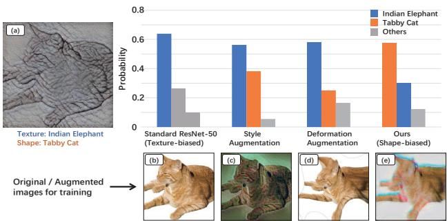
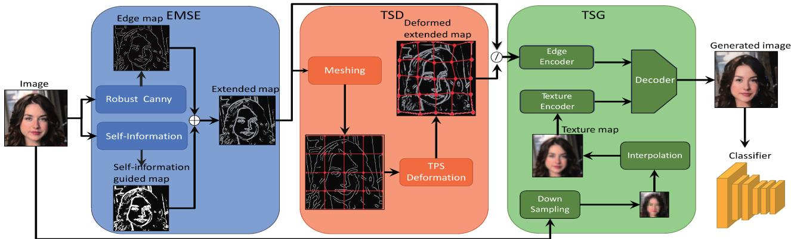
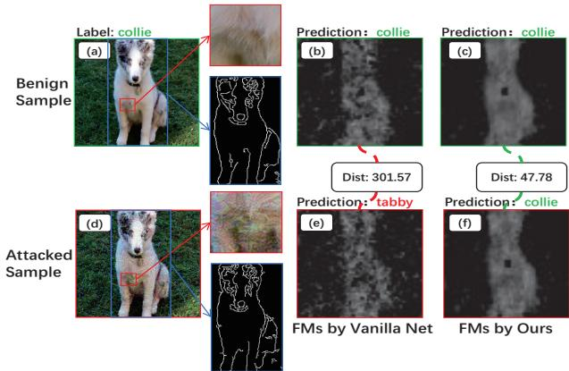
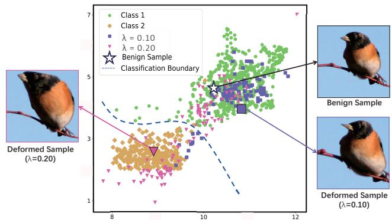
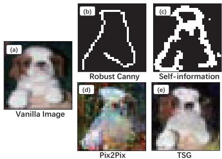
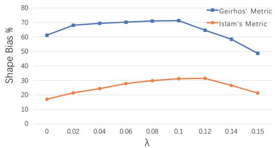

# Shift from Texture-bias to Shape-bias: Edge Deformation-based Augmentation for Robust Object Recognition

Xilin He1,2,3, Qinliang Lin1,2,3, Cheng Luo1,2,3 Weicheng Xie1,2,3,\*, Siyang Song4, Feng Liu1,2,3, Linlin Shen1,2,3 1Computer Vision Institute, School of Computer Science & Software Engineering, Shenzhen University 2Shenzhen Institue of Artificial Intelligence & Robotics for Society 3Guangdong Key Laboratory of intelligent Information Processing 4University of Leicester

{2020152115, linqinliang2021, luocheng2020}@email.szu.edu.cn {wcxie,feng.liu,llshen}@szu.edu.cn, ss1535@leicester.ac.uk

## Abstract

Recent studies have shown the vulnerability ofCNNs under perturbation noises, which is partially caused by the reason that the well-trained CNNs are too biased toward the object texture, i.e., they make predictions mainly based on texture cues. To reduce this texture-bias, current studies resort to learning augmented samples with heavily perturbed texture to make networks be more biased toward relatively stable shape cues. However, such methods usually fail to achieve real shape-biased networks due to the insufficient diversity ofthe shape cues. In this paper, we propose to augment the training dataset by generating semantically meaningful shapes and samples, via a shape deformationbased online augmentation, namely as SDbOA. The samples generated by our SDbOA have two main merits. First, the augmented samples with more diverse shape variations enable networks to learn the shape cues more elaborately, which encourages the network to be shape-biased. Second, semantic-meaningful shape-augmentation samples could be produced by jointly regularizing the generator with object texture and edge-guidance soft constraint, where the edges are represented more robustly with a selfinformation guided map to better against the noises on them. Extensive experiments under various perturbation noises demonstrate the obvious superiority of our shape-bias-motivated model over the state ofthe arts in terms ofrobustness performance. Code is available at https://github.com/C0notSilly/-ICCV-23-Edge-Deformation-based-Online-Augmentation.

  
Figure 1. Comparison of different models’ predictions on textureshape cue conflict samples [11] between Style Augmentation [21] (CVPRW’19), deformation augmentation in [43] and ours. Specific to the testing image (a), the bottom row shows the original (b) and augmented (c)-(e) images for training.

## 1. Introduction

Previous studies [13, 15, 38] have shown that convolution neural networks (CNNs) are vulnerable to perturbation noises, e.g., adversarial noises. Such perturbation noises imposed on the benign image can easily falsify model’s prediction [28]. To improve the network robustness against these noises, algorithms of texture augmentation have been long studied to enable network to learn robust and discriminative object texture features of different categories [11,24].

However, recent studies revealed that the vulnerability of CNNs maybe caused by their ‘texture-bias’, i.e., the features learned for object recognition bias towards objects’ textures instead of their shapes [2, 11]. As illustrated in Fig. 1, when the input image (a) contains a cat that is filled with an elephant’s texture, standard CNN networks are more likely to predict it as an elephant despite the obvious shape difference between cats and elephants.

Consequently, some studies devote to reducing such texture-bias to improve network robustness. Zhang et al. [47] found that CNNs learned with adversarial training strategies are less texture-biased. Alternatively, shapebiased CNNs are revealed to be more robust under diverse adversarial attacks. Sun et al. [37] found that the network adversarial robustness can be improved by directly using edge maps to aid the training process. Carlucci et al. [4] proposed to train CNNs on jigsaw puzzles, which achieved superior performances by enabling the network to pay more attention on the cues contained in the global structure. These works illustrate that the shape and structure features, e.g. edge map, can reduce the texture-bias with a stronger shape-bias, i.e. CNNs make predictions based on more shape cues, rather than texture cues.

However, current studies mainly learned the features of the object shape that is fixed, while the advantage of the shape diversity for devising a more shape-biased model is not well studied. Meanwhile, direct deformation augmentation on images may destroy the object semantics, especially on the image boundary. Given the above observations, following question naturally emerged: Can we implement data augmentation to the edge map to enhance the shape cues and reduce texture-bias ?

To this end, we propose a thin plate spline (TPS) [10]- based edge map deformation strategy to augment the shape representation of the training data, aiming to enhance the shape-bias of the well-trained network. To make the encoded object shape less sensitive to the noises, we extend the edge map specific to only the object edges to include broader boundary regions via the self-information guided map [34]. Furthermore, to build up the correlation between the deformed shape and the texture category to make the augmented samples more semantic-meaningful, we improve the generator with the additional supervision of denoised texture cues and a shape-preservation loss.

Fig. 1 sheds light on the above motivation of our shape augmentation for enhancing networks’ shape-bias with a toy experiment, where the probabilities to the shape label of an example sample [11] are predicted by the standard ResNet-50, the Style Augmentation [21], the image deformation augmentation [43] and our method. Fig. 1 shows that the proposed algorithm achieves significantly larger probability predicted to the shape label, i.e. tabby cat over the baseline and the related approaches, which reveals the obvious tendency of the proposed SDbOA in applying shape cues for making predictions. For this observation, we argue that the proposed edge-deformation augmentation enables networks to learn the object shape cues more elaborately, while reducing the contribution of the texture cues for prediction.

To the best of our knowledge, this work is one of the pioneer attempts to enhance shape-bias of networks based on the augmentation of object’s edges. The main contributions of this paper are summarized as follows:

• We propose a TPS-based edge deformation to augment the object shape, and apply it to the online data augmentation, which could help learning more shapebiased networks.

• We propose a semantic-meaningful generation paradigm to produce shape-augmentation samples by jointly regularizing the generator with object texture and edge-guidance soft constraint, where a self information guided map is introduced to represent these edge cues more accurately and robustly.

• Extensive results show the superiority of the proposed algorithm over state of the arts (SOTAs) in terms of universal robustness under adversarial, backdoor and common corruption attacks and the training overhead.

## 2. Related work

## 2.1. Texture or shape-biased models associated with recognition network robustness

Adversarial attacks have exposed the vulnerability of networks to perturbation noises [3, 28, 29, 38], leading to a growing concern for network robustness. Recent studies have investigated the association between network robustness and object texture or shape. Geirhos et al. [11] discovered that CNNs trained on ImageNet rely heavily on texture cues, leading to a texture bias in predictions. To address this issue, Hermann et al. [18] proposed additive augmentation techniques such as color distortion or blurring. However, the contribution of shape cues to recognition robustness has not received sufficient attention in their works.

Recently, Shi et al. [34] proposed an informative dropout approach to help models learn robust representation from a shape-bias perspective. Sun et al. [37] proposed to explicitly use object edges as semantically robust features to against adversarial attacks. Since the object shapes used for enhancing shape-bias are fixed, both approaches are unable to learn a real shape-biased network.

In this work, we thus resort to the edge deformation and augmentation to improve the diversity of object shapes. Based on this, we attempt to enhance shape-bias, thus enabling the network to shift its attention from texture to more on the shapes, and better discriminating the samples that have different textures but the similar shape.

## 2.2. Data augmentation for recognition robustness improvement

Data augmentation is a popular paradigm for improving the robustness of recognition network against various perturbation noises [16,17,21,24,27,32,41]. This strategy can be applied to generic computer vision tasks, which differs from some task-specific robustness improvement strategies such as adversarial defense algorithms [1, 28, 31, 33, 36, 39] that are designed for a specific attack scenario.

  
Figure 2. Pipeline of the proposed SDbOA. For the training, all the three modules, i.e. Edge map-based shape encoding (EMSE), TPSbased shape deformation (TSD) and Texture and shape-based generation (TSG) are used. For the testing, the TSD module is not needed. ⊘ denotes the ‘OR’ operation.

Lopes et al. [26] augmented the samples to trade off robustness against recognition accuracy via adding noises on the selected patches of a benign image. Hendrycks et al. [16] proposed the AugMix augmentation, i.e. mixing randomly generated augmentations to improve model robustness under common corruptions. Jackson et al. [21] proposed to augment the data with the style transfer to mitigate domain bias and reduce overfitting. Lee et al. [24] proposed to largely perturb the object texture to help model concentrate on the invariant shape structure.

Most augmentation methods [16, 21, 24, 26, 32] either focus on augmenting texture cues or fail to modify object shape regarding edges or structure, such as geometric transformations [32, 35]. However, compared to image deformation-based augmentation methods [10, 43, 48], which strictly adhere to shape constraints, this hard guidance may disregard the semantic coherence of the deformed sample, as shown in Fig. 1.

In this work, we propose an object shape augmentation approach based on the TPS-based [10] edge deformation, with the aid of an extended edge encoding and a generator with a soft constraint loss for the shape representation, to dynamically enrich the object shapes.

## 3. Methodology

The algorithm architecture, shown in Fig. 2, comprises three main modules: (i) the edge map-based shape encoding (EMSE) module used for robustly representing object shape; (ii) the TPS-based shape deformation (TSD) module used for providing flexible shape augmentation; and (iii) the texture and shape-based generation (TSG) module used for augmenting the samples dynamically, guided by the deformed shape.

## 3.1. Edge map-based shape encoding (EMSE)

To encode the object shape, the EMSE consists of two blocks. Firstly, a Robust Canny [37] block that generates an edge map for each image, describing the raw shape of the object in the image. While the Robust Canny may disregard some important shape cues of the object, we then additionally encode a self-information guided map [34] to provide complementary shape structure cues in addition to the Canny operator. Specifically, an edge map $\hat { E }$ that encodes the pixel-wise self information is first computed as:

$$
\hat { E } ( p ) = - l o g ( \sum _ { p ^ { \prime } \in \mathcal { N } _ { p } } e ^ { - ( p - p ^ { \prime } ) ^ { 2 } } )\tag{1}
$$

where $\hat { E } ( p )$ denotes the estimated self-information at the pixel $p = ( x , y )$ of the original image $I ;$ and $\mathcal { N } _ { p }$ denotes the neighbouring pixels of $p .$

Then, we obtain the average pixel-wise self-information mi and perform a thresholding operation to obtain the selfinformation guided map $E _ { i n f o }$ as follows

$$
E _ { i n f o } ( p ) = \left\{ \begin{array} { l l } { 1 } & { \hat { E } ( p ) \geq m i } \\ { 0 } & { o t h e r w i s e } \end{array} \right.\tag{2}
$$

Eq. (2) indicates that the greater the difference between a pixel and its neighbors, the more shape cues this pixel may contain. That is, for pixels close to the object boundary, their self-information values tend to be relatively large. Consequently, we use this self-information map to extend the edge map extracted by Robust Canny, to leverage the edge-surrounding cues to against the possible noises imposed on the edges, as follows

$$
E _ { e x t e n d } = E _ { R C } + E _ { i n f o }\tag{3}
$$

where $E _ { R C }$ denotes the edge maps extracted by the robust Canny.

## 3.2. TPS-based shape deformation (TSD)

To augment the shape representation, we propose TPSbased deformation on the meshing of the self-information edge map in Eq. (3).

For the shape deformation, Dabouei et al. [7] suggested to use the facial landmarks as control points, while this fashion brings about an overhead of the additional detection module and may damage semantic reasonability. By contrast, we propose to uniformly mesh the edge map, and use the endpoints of the grids as the control points to guide the edge map deformation for shape augmentation.

Specifically, the edge map $E _ { \mathrm { e x t e n d } }$ is equally divided into $n = 1 6$ grids, and the endpoints are denoted as $\{ P _ { i } ,$ $i = 1 , \ldots , n \}$ , which serve as the original control points and are randomly perturbed to generate target control points $\{ Q _ { i } , 1 \leq i \leq n \}$ as follows

$$
Q _ { i } = P _ { i } + \lambda N\tag{4}
$$

where random noise N obeys $N ( 0 , 1 )$ , i.e. the normal distribution with mean 0 and variance 1, and the λ controls the intensity of image deformation, which is set as 0.1. The edge map meshing is visualized in Fig. 2.

Given the original and target control points, the edge map deformation is then performed based on TPS. In particular, a transformation Φ is found to maximize the smoothness of the edge map deformation while minimizing the gap between two sets of control points. In this work, we use two transformations Φx, Φy [10], specific to the translation of the x, y coordinates of the control points, to obtain the deformed edge map $E _ { d e f o r m }$ as:

$$
\left\{ \begin{array} { l l } { E _ { d e f o r m } ( p ) = ( p ^ { x } + \Phi ^ { x } ( p ) , p ^ { y } + \Phi ^ { y } ( p ) ) } \\ { \Phi ^ { x } ( p ) = M ^ { x } \cdot p + m _ { 0 } ^ { x } + \sum _ { i } w _ { i } ^ { x } U ( | | p - P _ { i } | | _ { 2 } ) } \\ { M ^ { x } , m _ { 0 } ^ { x } , \{ w _ { i } ^ { x } \} = } \\ { \quad a r g m i n \sum _ { i } ( \Phi ^ { x } ( P _ { i } ) - ( Q _ { i } ^ { x } - P _ { i } ^ { x } ) ) ^ { 2 } + \mathcal { E } _ { \Phi ^ { x } } } \end{array} \right.\tag{5}
$$

where $U ( \cdot )$ denotes the function of radial basis kernel, $M ^ { x } \in \mathbb { R } ^ { 2 }$ , mx, $w _ { i } ^ { x } \in \mathbb { R }$ are the parameters specific to the x coordinate. ${ \mathcal { E } } _ { \Phi ^ { x } }$ is the second-order smoothness term specific to the transformation $\Phi ^ { x }$ . For the y coordinate, the transformation $\Phi ^ { y }$ is similarly derived.

## 3.3. Texture and shape-based generation (TSG)

Since the edge map deformation may cause the texture distorted on the boundary regions, it may deteriorate the fidelity of the deformed shape and the shape-based recognition performance. Thus, we propose a new generative model based on a two-stage training to inpaint the texture of the deformed edge map, i.e. reconstructing this map into the original image domain for the data augmentation.

While the Pix2Pix network [20] can achieve the inpainting from an edge map to the original image representation, it can not well build up the correlation between the edge map and the texture category, i.e. an image with correct shape yet mismatched texture category may be generated. Therefore, we propose to use both shape and texture cues in the generator to build up this correlation.

Specifically, to provide texture cues for the generator, the original image is smoothed with an easy-to-implement denoising step:

$$
I _ { t x t } = I n t e r p ( D S ( I ) )\tag{6}
$$

where Interp and DS denote interpolation and downsampling methods, both of which are based on bilinear interpolation. $I _ { t x t }$ denotes the resulted texture map. This denoised texture map aims to provide rough guidance cues for the synthesis of fine texture. To further provide the shape cues in the edge encoder of the generator, we use $E _ { e x t e n d }$ in Eq. (3) in the 1st-stage training, and $E _ { d e f o r m }$ in Eq. (5) in the 2nd-stage training.

To train the generator, a two-stage strategy is used. While a rough image is generated based on $E _ { e x t e n d }$ and the denoised texture $I _ { t x t }$ in the first stage, which is fine-tuned with the input of the deformed edge map $E _ { d e f o r m }$ , and the additional supervision of an object classifier and a newly introduced shape-preservation loss.

Specifically, the generator is trained in the 1st stage with the loss $\mathcal { L } _ { 1 s t } , \mathrm { i . e }$ . the sum of the adversarial loss $\mathcal { L } _ { g a n }$ [12], a feature matching loss [22] and a auxiliary classification loss referred from ACGAN [30], which is used to generate rough image without shape deformation. During the second stage, we jointly fine-tune the generator and the classifier with the supervision of the cross-entropy classification loss $\mathcal { L } _ { c l s }$ [37] in addition to ${ \mathcal { L } } _ { g a n } ,$ to better represent the correlation between edge maps and textures.

In addition, to decrease the sensitivity of the generator against the deformed edge map and stabilize the training, we introduce a $l _ { 1 }$ -norm shape-preservation loss between the deformed edge map and that extracted from the generated image as:

$$
\mathcal { L } _ { e d g e } = | | \mathrm { e C N N } ( I _ { s y n } ) , E _ { d e f o r m } | | _ { 1 }\tag{7}
$$

where $I _ { s y n }$ and eCNN denotes the synthesized image and convolution network to extract edges in [37]. It’s worth noting that the deformed shape $E _ { d e f o r m }$ serves as a soft guidance for generating the shape of the augmented sample, it differs from the hard constraint in the direct image deformation, where the object shape is changed strictly according to the target control points. Consequently, the training specific to the loss $\mathcal { L } _ { 2 n d }$ in the fine tuning stage is formulated as:

$$
\operatorname* { m i n } _ { G , \theta } \operatorname* { m a x } _ { D } \mathcal { L } _ { 2 n d } = \mathcal { L } _ { g a n } + \mathcal { L } _ { c l s } + \mathcal { L } _ { e d g e }\tag{8}
$$

where θ denotes the parameters of the classifier. G and D denote the generator and the discriminator.

## 3.4. Overall training

For clarity, our sample synthesis with edge deformation is also presented in $\operatorname { A l g } .$ 1, which is further used for online shape augmentation in each epoch of the network training.

Algorithm 1 Edge deformation-based sample generation.   
Input: input an image I and initialize the network   
Output: the shape-deformed image   
1: Obtain the extended edge map with Eq. (3);   
2: Mesh the edge map and perturb the control points with   
Eq. (4);   
3: Perform edge map deformation with Eq. (5);   
4: Obtain the denoised texture map with Eq. (6);   
5: Perform the two-stage training for the generator based   
on $\underline { { \mathcal { L } _ { 1 s t } } }$ and $\underline { { \mathcal { L } _ { 2 n d } } }$ in Eq. (8);

Regarding the training complexity, our algorithm requires only the similar runtime cost as the vanilla training, which is significantly lower than that of offline augmentation. This statement, together with the adversarial robustness of the online and offline augmentation for our method are studied with a toy experiment in the supplementary material.

## 4. Experiments

## 4.1. Dataset and experimental settings

Datasets We evaluate the robustness performance of the proposed algorithm under five attacks, i.e. [3, 5, 28, 29, 38] on four databases, i.e. Fashion MNIST (FM) [42], CelebA (CA) [25], CIFAR-10 (C10) [23] and ImageNet (IN) [8]. Experimental setting ResNet50 [14] after the pretraining or ResNet18 is used as the backbone for ImageNet or the other three datasets, unless otherwise specified.

We follow the protocol in EdgeNetRob [37] to evaluate the robustness performance under different adversarial attacks. For adversarial robustness evaluation, we use the $l _ { \infty }$ -norm perturbation constrained in the range [0, 1], and the perturbation budgets, i.e. 25/255 for Fashion MNIST, and 8/255 for CIFAR-10, CelebA and ImageNet. CelebA is used for the task of gender recognition.

Evaluation metrics The performance is evaluated with the shape-bias metrics [11, 19], the clean accuracy and the accuracies under diverse attack scenarios. We follow EdgeNetRob [37] to evaluate the clean accuracy, i.e. the accuracy on the testing set generated by EMSE and TSG modules for SDbOA, and the performance on the original testing set for non-generation algorithms.

To evaluate the capacity of our method in terms of clean accuracy preservation compared with state-of-the-art (SOTA) defense strategies and related data augmentation approaches, we use the performance of the baseline as the benchmark.

  
Figure 3. Shape and texture sensitivity of the valilla net and ours against adversarial noises. (a) and (d) show a clean sample and an attacked sample generated by PGD-40 [15], with a texture patch and an edge map extracted by Robust Canny, (b) and (e) show the feature maps (FMs) with the highest $L _ { 2 } \mathrm { - n o r m }$ activation representing these samples based on ResNet-50, and (c) and (d) show the FMs by ours. ‘Dist’ denotes the $L _ { 2 }$ -norm distance.

## 4.2. Function Analysis of the proposed modules

## 4.2.1 Function of shape bias for robustness

Since adversarial noises are generated within a limited adversarial budget and sparsely distributed in perturbed regions, Fig. 3 shows that the object’s shape of an image is less perturbed compared with its texture. Specifically, the edge maps reflecting the shape remain similar for the benign and attacked samples, while the feature maps of these samples with the vanilla net are largely different, i.e. their distance is large, reflecting that the yielded feature representation of object texture has already largely perturbed by the attack. By contrast, our algorithm yields significantly smaller feature map bias, suggesting a more shape-biased model can make feature representation more robust against adversarial perturbations.

## 4.2.2 Function of the proposed modules

The performance of TSD Fig. 4 illustrates the fundamental contribution of the TSD module for shifting from texture-bias to shape-bias. For a moderate magnitude of λ in Eq. (4), e.g. λ = 0.1, augmented samples with diverse shapes and the similar texture are generated. To be specific, the constraint loss in Eq. (7) encourages the diversity of the generated shapes, and our GAN generator enhances the semantic rationality of the generated samples and the similarity of their textures. Consequently, these shape-augmented and texture semantic-preserved data could induce the networks to use more neurons to remember the diverse variations of an object shape, and encourage learned networks to make predictions mainly based on the shape cues, i.e. causing the learned networks to be more shape-biased.

  
Figure 4. The t-SNE visualizations of features with varying λ.

The performance of EMSE and TSG To shed light on how the introduced self-information edge map and TSG work, we visualize the produced edge maps with the Robust Canny [37] and the proposed self-information in Fig. 5, together with the generated samples with Pix2Pix [20] and our generator.

The first row of Fig. 5 shows that the proposed selfinformation guided map can encode richer shape cues and represent shapes more accurately and robustly than those with mere Robust Canny. The second row of Fig. 5 shows that the proposed TSG generates images with wellpreserved sharpness of object shape and realistic texture, i.e. better building up the connection between shape and the texture label, compared with Pix2Pix [20].

## 4.3. Quantitative evaluation

## 4.3.1 Results of shape-bias metrics

Geirhos et al. [11] proposed the first shape-bias evaluation metric based on the prediction accuracy for a texture-shape cue conflict dataset [11] as:

$$
s b _ { G E } = { \frac { \# { \mathrm { C o r r e c t e d P r e d i c t i o n ~ t o ~ S h a p e ~ L a b e l } } } { \# { \mathrm { A l l ~ t h e ~ S a m p l e s } } } }\tag{9}
$$

where $\#$ denotes counting the number. This dataset [11] consists of images with shape and texture from different classes to misguide the CNN. Specifically, the object textures of the images [11] are largely interfered with categoryirrelevant styles, which places big challenge for current texture-biased networks.

  
Figure 5. Visualizations of samples from EMSE and TSG. (a) represents a vanilla sample. (b) and (c) represent edge maps extracted by Robust Canny [37] and EMSE. (d) and (e) represent images generated by Pix2Pix [20] and our TSG.

Islam et al. [19] proposed another shape-bias metric as:

$$
s b _ { I S } = \frac { \sum _ { i = 1 } ^ { n f } \rho _ { i } } { n f } , \mathrm { w h e r e } \rho _ { i } = \frac { C o v ( z _ { i } ^ { a } , z _ { i } ^ { b } ) } { \sqrt { V a r ( z _ { i } ^ { a } ) V a r ( z _ { i } ^ { b } ) } }\tag{10}
$$

where $n f$ is the number of feature maps. $z _ { i } ^ { a }$ and $z _ { i } ^ { b }$ represents the i-th flattened feature maps corresponding to the image pair $( a , b )$ from the texture-shape cue conflict dataset [11], while the two images contain the similar shape but have different textures. The normalized correlation coefficient $\rho _ { i }$ measures the proportion of feature maps to represent the shape cues. The quantitative results of the standard network, StyleAug [21], ShapeAug [24] and our SDbOA in terms of the two quantitative metrics are shown in Tab. 1.

Tab. 1 shows that our SDbOA consistently achieves the larger shape-bias values compared with the standard network and the related augmentation algorithms [21, 24] in term of both quantitative metrics for the training databases of ImageNet (IN), Stylized IN [11] (SIN) and SIN+IN.

<table><tr><td>Method</td><td>Dataset</td><td> $s b _ { G E }$  [11]</td><td> $s b _ { I S }$  [19]</td></tr><tr><td>Standard</td><td>IN</td><td>21.39</td><td>17.0</td></tr><tr><td>StyleAug [21]</td><td>IN</td><td>67.31</td><td>28.5</td></tr><tr><td>ShapeAug [24]</td><td>IN</td><td>38.46</td><td>21.3</td></tr><tr><td>SDbOA</td><td>IN</td><td>71.28</td><td>31.2</td></tr><tr><td>Standard</td><td>SIN</td><td>81.37</td><td>26.2</td></tr><tr><td>StyleAug [21]</td><td>SIN</td><td>73.72</td><td>32.7</td></tr><tr><td>ShapeAug [24]</td><td>SIN</td><td>67.75</td><td>29.8</td></tr><tr><td>SDbOA</td><td>SIN</td><td>82.40</td><td>39.9</td></tr><tr><td>Standard</td><td>SIN+IN</td><td>34.65</td><td>18.4</td></tr><tr><td>StyleAug [21]</td><td>SIN+IN</td><td>71.04</td><td>30.4</td></tr><tr><td>ShapeAug [24]</td><td>SIN+IN</td><td>63.67</td><td>23.1</td></tr><tr><td>SDbOA</td><td>SIN+IN</td><td>78.79</td><td>37.5</td></tr></table>

Table 1. Quantitative results in terms of two shape-bias metrics (%) with two shape-bias enhancement methods, i.e. StyleAug [21] (CVPRW’19) and ShapeAug [24] (CVPRW’22).

## 4.3.2 Robustness against various perturbations

Robustness against adversarial attacks: To study the adversarial robustness of our SDbOA compared with the SO-TAs, we present the performances of seven algorithms in terms of clean accuracy and adversarial robustness against FGSM [13], PGD [28], C&W [3] and DeepFool [29] in Tab. 2.

As shown in Tab. 2, the models trained with SDbOA maintain relatively stronger robustness against various adversarial attacks, than those with the SOTAs. Specifically, SDbOA outperforms NuAT [36] by the margins of 14.10% and 27.72% in terms of the robustness under C&W and

DeepFool on CIFAR-10, and outperforms EdgeNetRob [37] by a margin of 6.98% under C&W on ImageNet.

While Tab. 2 includes generic adversarial training (AT)- based SOTAs for the comparison, we further compare our algorithm with additional two AT-based algorithms [31, 33] that are also based on generative model as similar as ours in Tab. 3, where the same protocol (evaluation with AutoAttack [5]) and network architectures as [31,33] are employed.

Since the works [31,33] require adversarial training, tens of millions of adversarial samples in addition to the vanilla images are generated for the training, resulting in a significantly larger runtime complexity. Despite this, Tab. 3 shows that our online augmentation model can still outperform the listed adversarial-training-based methods in terms of the clean accuracy and adversarial robustness with reasonable training overhead.

<table><tr><td rowspan=1 colspan=1>Data.</td><td rowspan=1 colspan=1>Method</td><td rowspan=1 colspan=1> $\begin{array} { r } { \overline { { \mathrm { C l e a n } } } } \\ { \overline { { \mathrm { A c c . } } } } \end{array}$ </td><td rowspan=1 colspan=1>DeepFGSM PGDCWFool</td></tr><tr><td rowspan=3 colspan=1>FM</td><td rowspan=1 colspan=1>Vanilla Net</td><td rowspan=1 colspan=1>92.42</td><td rowspan=1 colspan=1>27.420.58 10.00 39.5</td></tr><tr><td rowspan=2 colspan=1>PGD [28]AT+CAS [1]NuAT [36]AT+CR [39]EdgeNetRob [37]]</td><td rowspan=1 colspan=1>86.5887.4188.0287.46</td><td rowspan=2 colspan=1>78.84 81.2617.54 0.5679.2378.4232.95 31.4681.4382.3767.0742.1980.8281.9534.57 37.0478.3075.7582.4771.43</td></tr><tr><td rowspan=1 colspan=1>85.01</td></tr><tr><td rowspan=1 colspan=1></td><td rowspan=1 colspan=1>SDbOA</td><td rowspan=1 colspan=1>88.52</td><td rowspan=1 colspan=1>80.32 83.2687.2476.12</td></tr><tr><td rowspan=2 colspan=1>CA</td><td rowspan=1 colspan=1>Vanilla Net</td><td rowspan=1 colspan=1>99.18</td><td rowspan=1 colspan=1>48.860.00 23.57 20.80</td></tr><tr><td rowspan=1 colspan=1>PGD [28]AT+CAS [1]NuAT [36]AT+CR [39]EdgeNetRob [37]]</td><td rowspan=1 colspan=1>92.8593.0694.2695.3295.52</td><td rowspan=1 colspan=1>85.4083.3542.7819.8489.8887.6865.36 37.0593.8089.5267.2529.4294.5890.7464.38 39.0692.6455.0875.9283.72</td></tr><tr><td rowspan=1 colspan=1></td><td rowspan=1 colspan=1>SDbOA</td><td rowspan=1 colspan=1>98.74</td><td rowspan=1 colspan=1>95.34 88.2879.84 91.50</td></tr><tr><td rowspan=3 colspan=1>C10</td><td rowspan=1 colspan=1>Vanilla Net</td><td rowspan=1 colspan=1>90.70</td><td rowspan=1 colspan=1>7.840.00 16.78 14.30</td></tr><tr><td rowspan=2 colspan=1>PGD [28]AT+CAS [1]NuAT [36]AT+CR [39]EdgeNetRob [37]]</td><td rowspan=1 colspan=1>75.8276.5179.5182.80</td><td rowspan=2 colspan=1>54.56 44.6618.02 0.3862.3247.8151.4337.4262.1246.4541.96 34.6664.8153.3950.66 43.1962.4839.6643.4654.45</td></tr><tr><td rowspan=1 colspan=1>79.21</td></tr><tr><td rowspan=1 colspan=1></td><td rowspan=1 colspan=1>SDbOA</td><td rowspan=1 colspan=1>83.27</td><td rowspan=1 colspan=1>67.82 50.9156.06 62.38</td></tr><tr><td rowspan=2 colspan=1>IN</td><td rowspan=1 colspan=1>Vanilla Net</td><td rowspan=1 colspan=1>75.82</td><td rowspan=1 colspan=1>5.400.00       5.44</td></tr><tr><td rowspan=1 colspan=1>PGD [28]AT+CAS [1]NuAT [36]AT+CR [39]EdgeNetRob [37]</td><td rowspan=1 colspan=1>55.3457.0358.3852.0365.73</td><td rowspan=1 colspan=1>40.46 30.8316.04 18.3647.5836.7223.6727.9248.12 40.3021.71 25.4041.72 27.9321.40 21.0745.8733.6220.85 23.40</td></tr><tr><td rowspan=1 colspan=1></td><td rowspan=1 colspan=1>SDbOA</td><td rowspan=1 colspan=1>68.56</td><td rowspan=1 colspan=1>49.10 35.7627.83 28.89</td></tr></table>

Table 2. Clean accuracy and adversarial robustness (%) with vanilla net, PGD Training [28], AT+CAS [1] (ICLR’21), NuAT [36] (NeurIPS’21), AT+CR [39] (AAAI’22), EdgeNetRob [37] (ICCV’21) and ours. The best and 2nd best performances are labeled with bold and underline.

Robustness of augmentation approaches against common corruptions and adversarial attacks: To evaluate the performances of our data augmentation and related augmentation techniques under common corruptions [15] and adversarial attacks, we present the results of nine SO-TAs in term of mean corruption error (mCE) and adversarial robustness in Tab. 4, where mCE is evaluated under all 15 corruptions and each corruption has 5 severities [15].

<table><tr><td>Method</td><td>Clean</td><td>Robust</td><td>Runtime</td><td>AT</td></tr><tr><td> $\mathrm { F D A _ { 2 8 } } \ [ 3 1 ]$ </td><td>85.97</td><td>60.73</td><td>Days</td><td> $\overline { { \pmb { \nu } } }$ </td></tr><tr><td> $\mathrm { S D b O A _ { 2 8 } }$ </td><td>85.27</td><td>68.15</td><td>3-5 Hours</td><td>X</td></tr><tr><td> $\mathrm { P O R T _ { 3 4 } } \ [ 3 3 ]$ </td><td>87.00</td><td>60.60</td><td>Days</td><td></td></tr><tr><td> $\mathrm { S D b O A _ { 3 4 } }$ </td><td>87.12</td><td>73.36</td><td>3-5 Hours</td><td>X</td></tr></table>

Table 3. Adversarial robustness (%) of the generative-model-based adversarial training approaches, i.e. FDA [31] (NeurIPS’21) and PORT [33] (ICLR’22) on CIFAR-10. We follow the robustness metric in [31] measured by AutoAttack [5]. AT represents ‘adversarial training’. ${ } ^ { \cdot } 2 8 ^ { \cdot } \ \mathrm { o r } \ { } ^ { \cdot } 3 4 ^ { \cdot }$ stands for using WideResNet-28- 10 or WideResNet-34-10 [45] as the classifier network, following [31, 33].

<table><tr><td>Methods</td><td>Corruptions↓</td><td>Adversaries↓</td></tr><tr><td>Baseline</td><td>26.4</td><td>91.3</td></tr><tr><td>Cutout  $\overline { { [ 9 ] _ { a r X i v } } }$ </td><td>25.9</td><td>96.0</td></tr><tr><td>Mixup  $[ 4 6 ] _ { I C L R ^ { \prime } 1 8 }$ </td><td>21.0</td><td>93.3</td></tr><tr><td>CutMix [44]1CCV′19</td><td>26.5</td><td>92.1</td></tr><tr><td>AutoAugment [6]CVPR′19</td><td>22.2</td><td>95.1</td></tr><tr><td>AugMix [16]ICLR&#x27;19</td><td>12.4</td><td>86.8</td></tr><tr><td>AugMax  $[ 4 1 ] _ { N e u r I P S ^ { \prime } 2 1 }$ </td><td>19.9</td><td>39.1</td></tr><tr><td>PixMix  $[ 1 7 ] _ { C V P R ^ { \prime } 2 2 }$ </td><td>9.5</td><td>82.1</td></tr><tr><td>TPS-Deform  $[ 4 3 ] _ { M M ^ { \prime } 2 2 }$ </td><td>22.4</td><td>44.0</td></tr><tr><td>SDbOA</td><td>18.8</td><td>27.7</td></tr></table>

Table 4. Robustness performances (%) of nine data augmentation techniques on CIFAR-10-C, i.e. the corruption set of CIFAR-10, based on the baseline of WideResNet-40-4 [45] under PGD-20 attack. The adversaries metric is the misclassification rate under PGD-20 with the $l _ { \infty }$ budget of 2/255.

Tab. 4 shows that large majority of SOTA data augmentation techniques improve robustness against corruptions without paying enough attention on the adversarial robustness. It’s worth noting that our algorithm achieves much better adversarial robustness, i.e. 27.7% with large margins over those, i.e. 82.1% and 86.8% achieved by PixMix [17] and AugMax [41] that perform better than ours in terms of mCE. This maybe because that these two augmentations are mainly focused on robustness against a specified type of samples, while ours is developed for universal robustness.

Robustness against backdoor attacks: To study the robustness of the proposed algorithm under backdoor attacks [40] compared with the related data augmentation methods, we follow the protocol in [37], and present the clean accuracy on the standard testing data and the attack success rate on the poisoned data (Pois. ASR) of seven algorithms, un-

der backdoor attacks with two patterns in Tab. 5. Poisoning ratio is set as 20% for Fashion MNIST and 5% for CelebA.
<table><tr><td rowspan=4 colspan=1>Data.</td><td rowspan=4 colspan=1>Method</td><td rowspan=1 colspan=2>Backdoor Pattern</td></tr><tr><td rowspan=1 colspan=1>Pixel</td><td rowspan=1 colspan=1>Pattern</td></tr><tr><td rowspan=2 colspan=1>Clean  Pois.Acc.↑  ASR↓</td><td rowspan=1 colspan=1>Clean  Pois.</td></tr><tr><td rowspan=1 colspan=1>Acc.↑  ASR↓</td></tr><tr><td rowspan=5 colspan=1>FM</td><td rowspan=1 colspan=1>Vanilla Net</td><td rowspan=1 colspan=1>87.43  94.30</td><td rowspan=1 colspan=1>87.12  95.22</td></tr><tr><td rowspan=4 colspan=1>SpecSign [40]EdgeNetRob [37]AugMax [41]PixMix [17]TPS-Deform [43]SDbOA</td><td rowspan=1 colspan=1>86.23  45.62</td><td rowspan=1 colspan=1>85.93  52.31</td></tr><tr><td rowspan=1 colspan=1>83.48  0.1289.83  54.60</td><td rowspan=1 colspan=1>82.21   2.7489.27  73.14</td></tr><tr><td rowspan=2 colspan=1>89.25  92.0486.35  47.4387.25  0.04</td><td rowspan=1 colspan=1>88.01  94.78</td></tr><tr><td rowspan=1 colspan=1>86.27  62.2187.07  0.98</td></tr><tr><td rowspan=6 colspan=1>CA</td><td rowspan=1 colspan=1>Vanilla Net</td><td rowspan=1 colspan=1>98.30  97.20</td><td rowspan=1 colspan=1>98.00  97.40</td></tr><tr><td rowspan=5 colspan=1>SpecSign [40]EdgeNetRob [37]AugMax [41]PixMix [17]TPS-Deform [43]SDbOA</td><td rowspan=2 colspan=1>98.45  64.7892.80  10.9098.84  45.97</td><td rowspan=1 colspan=1>97.98  54.23</td></tr><tr><td rowspan=1 colspan=1>93.10  12.5098.23  74.10</td></tr><tr><td rowspan=2 colspan=1>98.18  78.3297.43  71.31</td><td rowspan=1 colspan=1>97.98  89.28</td></tr><tr><td rowspan=1 colspan=1>97.47  74.52</td></tr><tr><td rowspan=1 colspan=1>95.20  3.49</td><td rowspan=1 colspan=1>94.87   4.21</td></tr></table>

Table 5. Performances (%) of vanilla net, Spectral Signature (SpecSign) [40] (NeurIPS’18), EdgeNetRob [37] (ICCV’21), AugMax [41] (NeurIPS’21), PixMix [17] (CVPR’22), TPS-Deform [43] (MM’22) and SDbOA under backdoor attacks.

Tab. 5 shows that SDbOA achieves the lowest ASR values against backdoor attacks on the two datasets, e.g. it significantly outperforms AugMax [41] that performs best in terms of clean accuracy, by the margins of 54.56% and 72.16% specific to the pixel and pattern attacks on Fashion MNIST. Meanwhile, the clean accuracy is reasonably preserved compared with the most related algorithm, i.e. EdgeNetRob [37].

## 4.3.3 Hyperparameter analysis and ablation study

Analysis of hyperparameter λ: To analyze the sensitivity of the learned model’s shape-bias against the deformation intensity, i.e. λ in Eq. (4), we conduct a hyperparameter analysis and present the results in terms of the two shapebias metrics [11, 19] in Fig. 6.

  
Figure 6. Sensitivity of shape-bias metric values [11, 19] against different deformation intensities (λ).

Fig. 6 shows that a greater deformation degree does not always result in a more shape-biased model, i.e. the shapebias of the model learned by SDbOA gradually increases when λ is smaller than the threshold of 0.1, while it is decreased when λ exceeds 0.1, i.e. the learned model gradually shifts from shape-bias to be more texture-biased.

<table><tr><td>EMSE TSD TSG</td><td>Clean</td><td>FGSM PGD C&amp;W DeepFool</td><td></td></tr><tr><td></td><td>74.32</td><td>60.06 46.78 45.48</td><td>55.82</td></tr><tr><td> $\checkmark$ </td><td>76.50</td><td>62.08 47.08 47.05</td><td>54.25</td></tr><tr><td> $\checkmark$   $\checkmark$ </td><td>78.24</td><td>65.26 49.82 49.61</td><td>61.35</td></tr><tr><td> $\checkmark$   $\overline { { \checkmark } }$ </td><td>87.67</td><td>15.83 0.00 21.84</td><td>19.02</td></tr><tr><td> $\overline { { \checkmark } }$   $\checkmark$   $\checkmark$ </td><td>81.08</td><td>66.84 48.40 52.31</td><td>59.46</td></tr><tr><td> $\checkmark$   $\checkmark$ </td><td>83.27</td><td>67.82 50.91 56.06</td><td>62.38</td></tr></table>

Table 6. Ablation study in terms of the clean accuracy and adversarial robustness (%) on CIFAR 10.

To shed light on this observation, we argue that a moderate deformation degree, e.g. λ = 0.1 in Fig. 4, is beneficial to reasonably improve the diversity of shape representations without largely impairing shape semantic, and a model learned from these valid shape variations can be made better against the perturbation noises. However, as shown in Fig. 4, excessive deformation may be caused when a large λ, e.g. λ = 0.2 is used, which may damage the global shape structure and original shape semantic, causing deformed samples to even cross classification boundaries. When it happens, these augmented samples with damaged shapes may instead encourage the learned network to give prediction based on the relatively stable texture, i.e. making the model to be more texture-biased.

Ablation study: To study the performance of each module in our SDbOA, we perform the ablation study in Tab. 6, where Robust Canny [37] and Pix2Pix [20] are used as the baseline shape encoding and generator, respectively.

By comparing the 5th and 7th rows of Tab. 6, it shows that the EMSE module is beneficial to the network robustness, reflecting the superiority of our edge augmentation over direct image deformation. By comparing the 6th and 7th rows, it shows that the proposed TSD enables the model to consistently improve the clean accuracy and the robustness performances under four attacks. By comparing the 4th and 7th rows, it shows that the improved generator with the supervision of texture cues and the shape-preservation loss largely improves the Pix2Pix in terms of the clean accuracy.

## 5. Conclusions

Considering the network robustness maybe impaired by the excessive texture-bias, we shed light on how to shift from texture-bias to shape-bias for CNN models, i.e. we propose a novel edge deformation-based data augmentation that enables networks to elaborately learn the shape variations, allowing the well-learned networks to make predictions mainly based on the targets’ shapes. Our data augmentation mainly differs from the related SOTAs that it is developed based on the deformation of object’s edge map rather than the image, and can reasonably preserve the semantic rationality of the reconstructed samples with the joint supervision of object texture and soft constraint of de formed shape cues. Experimental results reveal that our algorithm can largely enhance model’s shape-bias in terms of two quantitative metrics, and rather competitive robustness against various perturbations compared with SOTAs. Considering the recognition system trained with the proposed shape augmentation is mainly applicable for pixelwise perturbation, yet may not work for patch-wise corruption where the shape structure is severely damaged, our future work will be devoted to solving it.

Acknowledgements. The work was supported by Natural Science Foundation of China under grants no. 62276170, 82261138629, the Science and Technology Project of Guangdong Province under grants no. 2023A1515011549, 2023A1515010688, the Science and Technology Innovation Commission of Shenzhen under grants no. JCYJ20190808165203670, JCYJ20220531101412030.

## References

[1] Yang Bai, Yuyuan Zeng, Yong Jiang, Shu-Tao Xia, Xingjun Ma, and Yisen Wang. Improving adversarial robustness via channel-wise activation suppressing. In International Conference on Learning Representations, 2020. 3, 7

[2] Nicholas Baker, Hongjing Lu, Gennady Erlikhman, and Philip J Kellman. Deep convolutional networks do not classify based on global object shape. PLoS computational biology, 14(12):e1006613, 2018. 1

[3] Nicholas Carlini and David Wagner. Towards evaluating the robustness of neural networks. In 2017 ieee symposium on security and privacy (sp), pages 39–57. Ieee, 2017. 2, 5, 6

[4] Fabio M Carlucci, Antonio D’Innocente, Silvia Bucci, Barbara Caputo, and Tatiana Tommasi. Domain generalization by solving jigsaw puzzles. In Proceedings of the IEEE/CVF Conference on Computer Vision and Pattern Recognition, pages 2229–2238, 2019. 2

[5] Francesco Croce and Matthias Hein. Reliable evaluation of adversarial robustness with an ensemble of diverse parameter-free attacks. In International conference on machine learning, pages 2206–2216. PMLR, 2020. 5, 7

[6] Ekin D Cubuk, Barret Zoph, Dandelion Mane, Vijay Vasudevan, and Quoc V Le. Autoaugment: Learning augmentation strategies from data. In Proceedings of the IEEE/CVF conference on computer vision and pattern recognition, pages 113–123, 2019. 7

[7] Ali Dabouei, Sobhan Soleymani, Jeremy Dawson, and Nasser Nasrabadi. Fast geometrically-perturbed adversarial faces. In 2019 IEEE Winter Conference on Applications of Computer Vision (WACV), pages 1979–1988. IEEE, 2019. 4

[8] Jia Deng, Wei Dong, Richard Socher, Li-Jia Li, Kai Li, and Li Fei-Fei. Imagenet: A large-scale hierarchical image database. In 2009 IEEE conference on computer vision and pattern recognition, pages 248–255. Ieee, 2009. 5

[9] Terrance DeVries and Graham W Taylor. Improved regularization of convolutional neural networks with cutout. arXiv preprint arXiv:1708.04552, 2017. 7

[10] Gianluca Donato and Serge Belongie. Approximate thin plate spline mappings. In European conference on computer vision, pages 21–31. Springer, 2002. 2, 3, 4

[11] Robert Geirhos, Patricia Rubisch, Claudio Michaelis, Matthias Bethge, Felix A Wichmann, and Wieland Brendel. Imagenet-trained cnns are biased towards texture; increasing shape bias improves accuracy and robustness. In International Conference on Learning Representations, 2018. 1, 2, 5, 6, 8

[12] Ian Goodfellow, Jean Pouget-Abadie, Mehdi Mirza, Bing Xu, David Warde-Farley, Sherjil Ozair, Aaron Courville, and Yoshua Bengio. Generative adversarial networks. Communications ofthe ACM, 63(11):139–144, 2020. 4

[13] Ian J Goodfellow, Jonathon Shlens, and Christian Szegedy. Explaining and harnessing adversarial examples. arXiv preprint arXiv:1412.6572, 2014. 1, 6

[14] Kaiming He, Xiangyu Zhang, Shaoqing Ren, and Jian Sun. Deep residual learning for image recognition. In Proceedings ofthe IEEE conference on computer vision and pattern recognition, pages 770–778, 2016. 5

[15] Dan Hendrycks and Thomas Dietterich. Benchmarking neural network robustness to common corruptions and perturbations. In International Conference on Learning Representations, 2018. 1, 5, 7

[16] Dan Hendrycks, Norman Mu, Ekin D Cubuk, Barret Zoph, Justin Gilmer, and Balaji Lakshminarayanan. Augmix: A simple data processing method to improve robustness and uncertainty. arXiv preprint arXiv:1912.02781, 2019. 2, 3, 7

[17] Dan Hendrycks, Andy Zou, Mantas Mazeika, Leonard Tang, Bo Li, Dawn Song, and Jacob Steinhardt. Pixmix: Dreamlike pictures comprehensively improve safety measures. In Proceedings of the IEEE/CVF Conference on Computer Vision and Pattern Recognition, pages 16783–16792, 2022. 2, 7, 8

[18] Katherine Hermann, Ting Chen, and Simon Kornblith. The origins and prevalence of texture bias in convolutional neural networks. Advances in Neural Information Processing Systems, 33:19000–19015, 2020. 2

[19] Md Amirul Islam, Matthew Kowal, Patrick Esser, Sen Jia, Bjorn Ommer, Konstantinos G Derpanis, and Neil Bruce. Shape or texture: Understanding discriminative features in cnns. In International Conference on Learning Representations, 2021. 5, 6, 8

[20] Phillip Isola, Jun-Yan Zhu, Tinghui Zhou, and Alexei A Efros. Image-to-image translation with conditional adversarial networks. In Proceedings of the IEEE conference on computer vision and pattern recognition, pages 1125–1134, 2017. 4, 6, 8

[21] Philip TG Jackson, Amir Atapour Abarghouei, Stephen Bonner, Toby P Breckon, and Boguslaw Obara. Style augmentation: data augmentation via style randomization. In CVPR workshops, volume 6, pages 10–11, 2019. 1, 2, 3, 6

[22] Justin Johnson, Alexandre Alahi, and Li Fei-Fei. Perceptual losses for real-time style transfer and super-resolution. In European conference on computer vision, pages 694–711. Springer, 2016. 4

[23] Alex Krizhevsky, Geoffrey Hinton, et al. Learning multiple layers of features from tiny images. 2009. 5

[24] Sangjun Lee, Inwoo Hwang, Gi-Cheon Kang, and Byoung-Tak Zhang. Improving robustness to texture bias via shapefocused augmentation. In Proceedings of the IEEE/CVF Conference on Computer Vision and Pattern Recognition (CVPR) Workshops, pages 4323–4331, June 2022. 1, 2, 3, 6

[25] Ziwei Liu, Ping Luo, Xiaogang Wang, and Xiaoou Tang. Deep learning face attributes in the wild. In Proceedings of the IEEE international conference on computer vision, pages 3730–3738, 2015. 5

[26] Raphael Gontijo Lopes, Dong Yin, Ben Poole, Justin Gilmer, and Ekin D Cubuk. Improving robustness without sacrificing accuracy with patch gaussian augmentation. arXiv preprint arXiv:1906.02611, 2019. 3

[27] Cheng Luo, Qinliang Lin, Weicheng Xie, Bizhu Wu, Jinheng Xie, and Linlin Shen. Frequency-driven imperceptible adversarial attack on semantic similarity. In Proceedings of the IEEE/CVF Conference on Computer Vision and Pattern Recognition, pages 15315–15324, 2022. 2

[28] Aleksander Madry, Aleksandar Makelov, Ludwig Schmidt, Dimitris Tsipras, and Adrian Vladu. Towards deep learning models resistant to adversarial attacks. In International Conference on Learning Representations, 2018. 1, 2, 3, 5, 6, 7

[29] Seyed-Mohsen Moosavi-Dezfooli, Alhussein Fawzi, and Pascal Frossard. Deepfool: a simple and accurate method to fool deep neural networks. In Proceedings of the IEEE conference on computer vision and pattern recognition, pages 2574–2582, 2016. 2, 5, 6

[30] Augustus Odena, Christopher Olah, and Jonathon Shlens. Conditional image synthesis with auxiliary classifier gans. In International conference on machine learning, pages 2642– 2651. PMLR, 2017. 4

[31] Sylvestre-Alvise Rebuffi, Sven Gowal, Dan A Calian, Florian Stimberg, Olivia Wiles, and Timothy Mann. Fixing data augmentation to improve adversarial robustness. In Advances in Neural Information Processing Systems, 2021. 3, 7

[32] Sylvestre-Alvise Rebuffi, Sven Gowal, Dan Andrei Calian, Florian Stimberg, Olivia Wiles, and Timothy A Mann. Data augmentation can improve robustness. Advances in Neural Information Processing Systems, 34:29935–29948, 2021. 2, 3

[33] Vikash Sehwag, Saeed Mahloujifar, Tinashe Handina, Sihu Dai, Chong Xiang, Mung Chiang, and Prateek Mittal. Robust learning meets generative models: Can proxy distributions improve adversarial robustness? In International Conference on Learning Representations, 2022. 3, 7

[34] Baifeng Shi, Dinghuai Zhang, Qi Dai, Zhanxing Zhu, Yadong Mu, and Jingdong Wang. Informative dropout for robust representation learning: A shape-bias perspective. In International Conference on Machine Learning, pages 8828– 8839. PMLR, 2020. 2, 3

[35] Connor Shorten and Taghi M Khoshgoftaar. A survey on image data augmentation for deep learning. Journal of big data, 6(1):1–48, 2019. 3

[36] Gaurang Sriramanan, Sravanti Addepalli, Arya Baburaj, et al. Towards efficient and effective adversarial train-

ing. Advances in Neural Information Processing Systems, 34:11821–11833, 2021. 3, 6, 7

[37] Mingjie Sun, Zichao Li, Chaowei Xiao, Haonan Qiu, Bhavya Kailkhura, Mingyan Liu, and Bo Li. Can shape structure features improve model robustness under diverse adversarial settings? In Proceedings of the IEEE/CVF International Conference on Computer Vision, pages 7526–7535, 2021. 2, 3, 4, 5, 6, 7, 8

[38] Christian Szegedy, Wojciech Zaremba, Ilya Sutskever, Joan Bruna, Dumitru Erhan, Ian Goodfellow, and Rob Fergus. Intriguing properties of neural networks. arXiv preprint arXiv:1312.6199, 2013. 1, 2, 5

[39] Jihoon Tack, Sihyun Yu, Jongheon Jeong, Minseon Kim, Sung Ju Hwang, and Jinwoo Shin. Consistency regularization for adversarial robustness. In Proceedings of the AAAI Conference on Artificial Intelligence, volume 36, pages 8414–8422, 2022. 3, 7

[40] Brandon Tran, Jerry Li, and Aleksander Madry. Spectral signatures in backdoor attacks. Advances in neural information processing systems, 31, 2018. 7, 8

[41] Haotao Wang, Chaowei Xiao, Jean Kossaifi, Zhiding Yu, Anima Anandkumar, and Zhangyang Wang. Augmax: Adversarial composition of random augmentations for robust training. Advances in neural information processing systems, 34:237–250, 2021. 2, 7, 8

[42] Han Xiao, Kashif Rasul, and Roland Vollgraf. Fashionmnist: a novel image dataset for benchmarking machine learning algorithms. arXiv preprint arXiv:1708.07747, 2017. 5

[43] Jun Yu, Guochen Xie, Zhongpeng Cai, Peng He, Fang Gao, and Qiang Ling. Micro expression generation with thin-plate spline motion model and face parsing. In Proceedings ofthe 30th ACM International Conference on Multimedia, pages 7210–7214, 2022. 1, 2, 3, 7, 8

[44] Sangdoo Yun, Dongyoon Han, Seong Joon Oh, Sanghyuk Chun, Junsuk Choe, and Youngjoon Yoo. Cutmix: Regularization strategy to train strong classifiers with localizable features. In Proceedings of the IEEE/CVF international conference on computer vision, pages 6023–6032, 2019. 7

[45] Sergey Zagoruyko and Nikos Komodakis. Wide residual networks. In British Machine Vision Conference 2016. British Machine Vision Association, 2016. 7

[46] Hongyi Zhang, Moustapha Cisse, Yann N Dauphin, and David Lopez-Paz. mixup: Beyond empirical risk minimization. In International Conference on Learning Representations, 2018. 7

[47] Tianyuan Zhang and Zhanxing Zhu. Interpreting adversarially trained convolutional neural networks. In International Conference on Machine Learning, pages 7502–7511. PMLR, 2019. 2

[48] Jian Zhao and Hui Zhang. Thin-plate spline motion model for image animation. In Proceedings ofthe IEEE/CVF Conference on Computer Vision and Pattern Recognition, pages 3657–3666, 2022. 3