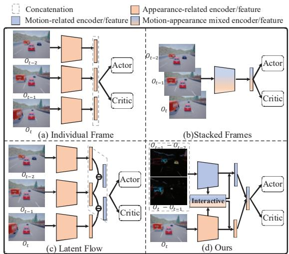
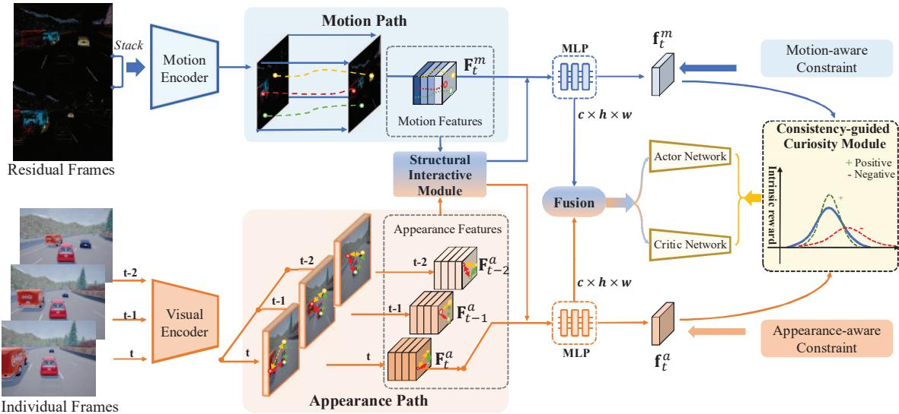
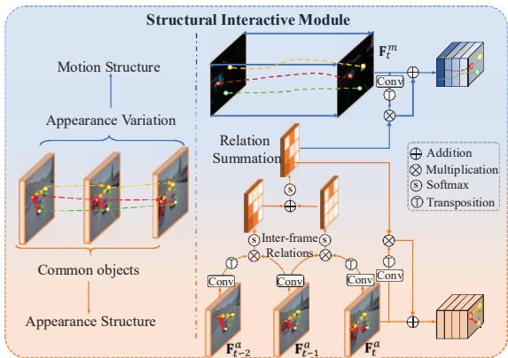
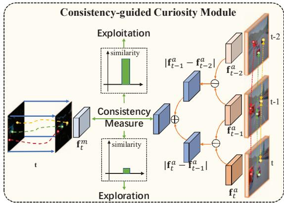
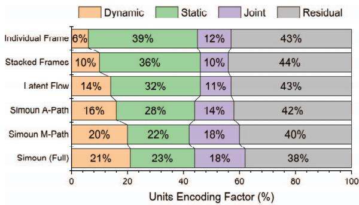
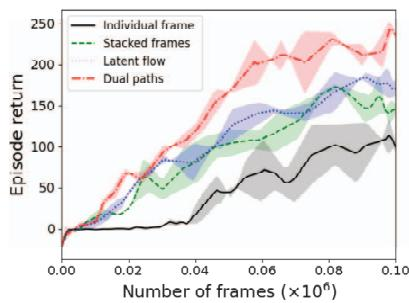
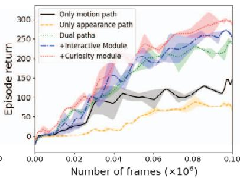
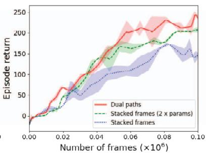
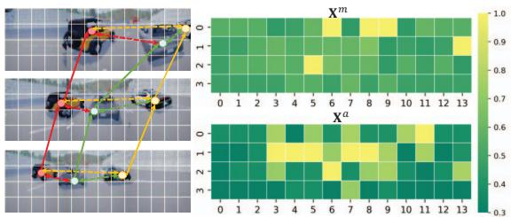
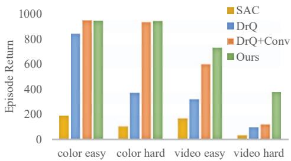

# Simoun: Synergizing Interactive Motion-appearance Understanding for Vision-based Reinforcement Learning

Yangru Huang1, Peixi Peng2,4 \*, Yifan Zhao1, Yunpeng Zhai1, Haoran Xu3,4, Yonghong Tian1,2,4 \* 1School of Computer Science, Peking University

2School of Electronic and Computer Engineering, Peking University

3School of Intelligent Systems Engineering, Sun Yat-sen University4Peng Cheng Laboratory yrhuang@stu.pku.edu.cn, {pxpeng, zhaoyf, ypzhai, yhtian}@pku.edu.cn,xuhr9@mail2.sysu.edu.cn

## Abstract

Efficient motion and appearance modeling are critical for vision-based Reinforcement Learning (RL). However, existing methods struggle to reconcile motion and appearance information within the state representations learned from a single observation encoder. To address the problem, we present Synergizing Interactive Motionappearance Understanding (Simoun), a unified framework for vision-based RL. Given consecutive observation frames, Simoun deliberately and interactively learns both motion and appearance features through a dual-path network architecture. The learning process collaborates with a structural interactive module, which explores the latent motionappearance structures from the two network paths to leverage their complementarity. To promote sample efficiency, we further design a consistency-guided curiosity module to encourage the exploration of under-learned observations. During training, the curiosity module provides intrinsic rewards according to the consistency of environmental temporal dynamics, which are deduced from both motion and appearance network paths. Experiments conducted on Deep-Mind control suite and CARLA automatic driving benchmarks demonstrate the effectiveness of Simoun, where it performs favorably against state-of-the-art methods.

## 1. Introduction

Reinforcement learning (RL) from visual signals has achieved great success in recent years. Compared with learning from hand-crafted states, vision-based RL eliminates the arduous task of designing states with manual feature engineering. Therefore, it is beneficial for a variety of tasks such as video game playing [25, 40], robot manipulation [50], and autonomous navigation [4]. However, one of the major challenges of vision-based RL lies in its high dimensional observation, which is less interpretable and leads to low rewards and inefficient sampling [19, 20]. As a result, robust visual understanding is crucial to bridge the gap between vision and state-based RL in terms of performance and sample efficiency.

  
Figure 1. Illustration of different observation encoding schemes. (a) Encoding individual frames with a shared encoder. (b) Encoding stacked multiple frames. (c) Encoding individual frames and latent vector differences (latent flows). (d) Encoding motion and appearance independently and interactively.

To make observation comprehensible for agents, recent works have recognized the importance of learning highquality visual features [20, 5, 29, 49, 42]. From the perspective of decision-making, two kinds of features are essential for vision-based RL: the motion features, which closely relate to the actions performed by the agents, and the appearance features, which describe the contemporary environmental states. Despite their importance, few works have tried to model these two kinds of features explicitly. Most methods tend to encode single or stacked multiple frames via a convolutional encoder, as shown in Fig. 1(a) and Fig. 1(b). The former neglects motion feature modeling, while the latter tightly entangles the motion and appearance information into a single network, causing information bias and optimization difficulty. To alleviate these issues, Shang et al. [33] propose to encode only appearance features in single frames and impose motion dynamics by latent vector differences (termed latent flow, see Fig. 1(c)). In addition, several world models learned directly from input images are also developed [11, 31, 3]. Nevertheless, the motion features of these methods are still computed from spatial latent space, which may lead to sub-optimal representation learning in complicated environments.

To overcome the limitations described above, we present Synergizing Interactive Motion-appearance Understanding (Simoun) for vision-based RL. The design principle of Simoun is to explicitly learn both motion and appearance features in the early encoding stage and then interactively fuse them at the late stage for accurate decision-making. As shown in Fig. 1(d), given consecutive environment frames, Simoun learns motion and appearance information by separate network paths. The motion path (colored in blue) explicitly models motion clues (such as the speed and direction of cars) from the residual frame of multiple neighboring input frames. The appearance path (colored in orange) models the environmental spatial structures and focuses on identifying patterns and objects (such as cars and traffic lights) from every single frame. Additionally, a structural interactive module further extracts latent motionappearance structures reflected by the correlations of the dual-path features. It then modulates both paths with the computed structure masks. In this way, each path can take complementary information from the other during learning, and agents are able to better understand the spatial and temporal context of the environment. Finally, the latent vectors from the two paths are fused for decision-making.

Although the dual-path design of Simoun promotes observation interpretability, low sample efficiency still exists due to finite data and sparse rewards. To alleviate this issue, a consistency-guided curiosity module is further designed. The idea is to adapt the learning process by concentrating more on under-learned observations, which can be deduced from the consistency of the motion and appearance paths. Intuitively, both the motion path and the appearance path describe the same observations. Hence, the dynamic information inferred from the following two sources should remain consistent: 1) latent motion vectors learned directly from the motion path and 2) differences between the appearance path latent vectors over multiple neighboring frames. If the opposite were true, then it indicates premature motion-appearance understanding, thus more exploration should be added. In this way, we build a strong correlation between reward discovery and state novelty. During training, the consistency-guided curiosity module provides intrinsic rewards in addition to extrinsic rewards from the environment, resulting in more efficient exploration.

Experiments on both CARLA and OpenAI DMControl environments show that the proposed method performs favorably against state-of-the-arts. Overall, the contributions of this paper are threefold:

(1) We propose Simoun, a novel dual-path learning framework that explicitly and interactively learns both motion and appearance information from observations.

(2) We design a structural interactive module to fully explore the complementarity of the two paths in Simoun and thereby further enhance visual understanding.

(3) We devise a consistency-guided curiosity module to encourage the exploration of under-learned observations. The proposed module effectively increases sample efficiency by providing intrinsic rewards for the agents.

## 2. Related Works

Vision-based Reinforcement Learning To improve the performance and sample efficiency of vision-based RL, existing works can be roughly divided into three groups: 1) designing auxiliary loss/learning tasks [20, 14, 36, 49, 23], 2) employing various data augmentation technique [21, 41, 2, 17, 24], and 3) modeling environment dynamics [12, 11, 13, 7, 27]. However, most existing works utilize a singlepath network with multi-frame inputs, in which the motion and appearance information is tightly entangled without explicit separation. One exception is Flare [33], which also utilizes a single-path network to encode each frame individually and models motion information explicitly by taking latent vector differences. Although Flare achieves improved performance, its motion information is still computed from single-frame appearance features, causing insufficient temporal information extraction.

Dual-path Networks for Visual Modeling There is a rich literature of works on visual modeling with dual-path networks. One of the earliest works is the two-stream CNNs for action recognition [35], which utilizes a spatial stream with single-frame input and a temporal stream taking multiframe optical flows. Thereafter, the concept of dual-path networks is heavily explored with various fusion strategies on different tasks [34, 6, 39, 43]. Our approach differs from existing ones in terms of task, architecture and learning mechanism. Compare with other visual tasks, visionbased RL needs to extract fine-grained motion details across different time steps, which poses a great challenge to RL models. To the best of our knowledge, Simoun is one of the first vision-based RL methods which aim to explicitly learn motion and appearance features by a dual-path architecture. Meanwhile, its structural interactive module is also deliberately designed to extract motion and appearance clues residing in consecutive observation frames. By learning with RL-oriented objectives and curiosity-driven strategies, Simoun successfully imports the idea of dual-path networks into robust visual control.

  
Figure 2. The proposed dual-path learning framework Simoun. It introduces two modules: 1) a structural interactive module that leverages the complementarity between the two network paths by extracting latent motion-appearance structures, and 2) a consistency-guided curiosity module that provides intrinsic rewards according to the dynamic consistency between the motion and appearance features.

Intrinsic Reward Exploration One of the key elements of RL is the reward function, which aims to quantify the “goodness" of the agent's decisions. However, the problem is that designing dense, well-defined extrinsic reward functions is difficult and unscalable. One possible solution is to introduce an intrinsic reward function, which is calculated by the agents. Existing intrinsic reward exploration methods mainly focus on counting or predicting state novelty [1], prediction error [28], uncertainty [22], or environmental dynamics [32]. These methods are typically designed for the general state-based instead of vision-based RL. The works most relevant to us are CCFDM [26] and CCLF [37], which also formulate intrinsic rewards for visual-based RL. CCFDM utilizes forward dynamics and CCLF is based on a contrastive term. Differently, the consistency-guided curiosity module in Simoun exploits the dynamic consistency extracted from both motion and appearance features to achieve reliable intrinsic reward estimation.

## 3. Methodology

We start by formalizing the task of vision-based RL in Sec. 3.1 and then delineate Simoun in detail. The general idea of Simoun is to 1) explicitly model the motion/appearance dynamics (and their correlations) of the agent's operating ambiance and 2) capitalize on the learned dynamics to achieve efficient exploration. As shown in Fig. 2, our framework consists of two parts. First, given inputs in the form of consecutive frames, it interactively models the motion and appearance features using a dualpath architecture with a set of targeted objectives and a structural interactive module (Sec. 3.2). Then the decisionmaking strategy is learned with adaptive curiosity assignment steered by the proposed consistency-guided curiosity module (Sec. 3.3). The overall learning objective and inference process of Simoun are finally summarized in Sec. 3.4.

## 3.1. Problem formulation

Vision-based RL can be formulated as a Partially Observable Markov Decision Process (POMDP) $\begin{array} { r l } { \mathcal { M } } & { { } = < } \end{array}$ $\mathcal { O } , \mathcal { A } , \mathcal { P } , \mathcal { R } , \gamma >$ , where O denotes the observation space containing pixel frames ot at different time step t and A denotes the action space. At each t, the agent chooses an action $a _ { t } \ \in \ A . \ P ( \mathbf { o } _ { t + 1 } | \mathbf { o } _ { t } , a _ { t } )$ is the observation transition, $\mathcal { R } ( \mathbf { o } _ { t } , a _ { t } )$ is the reward function, and $\gamma \in [ 0 , 1 )$ is the discount factor. The goal is to identify an optimal policy π that maximizes the expected cumulative reward based on the visual observations rather than the complete environment state:

$$
J ( \pi ) = \sum _ { t } \mathbb { E } _ { ( \mathbf { o } _ { t } , a _ { t } ) \sim \pi } [ \mathcal { R } ( \mathbf { o } _ { t } , a _ { t } ) ] .\tag{1}
$$

During training, π is used to interact with the environment, and the related data are stored in a replay buffer B.

## 3.2. Dual-path Interactive Modeling

In vision-based RL, motion and appearance clues are both vital for the agent to perform accurate decisionmaking. Simoun adopts a dual-path architecture to interactively learn motion and appearance features. Specifically, it consists of three components: the motion path, the appearance path, and the structural interactive module that serves as a switchboard between the motion and appearance structures learned from the two paths.

Motion Path Motion information is crucial for the visual system to understand the dynamics of the surrounding environment. The motion path aims to extract the motionrelated features (such as the velocity of moving objects) from the changes between consecutive frames. Given a tuple of three1 adjacent observations $\left[ \mathbf { o } _ { t - 2 } , \mathbf { o } _ { t - 1 } , \mathbf { o } _ { t } \right]$ sampled from replay buffer $B ,$ the input of the motion path is the residual of adjacent frames $\left[ \left( \mathbf { o } _ { t - 1 } - \mathbf { o } _ { t - 2 } \right) , \left( \mathbf { o } _ { t } - \mathbf { o } _ { t - 1 } \right) \right]$ concatenated along channel dimensions. A convolutional encoder $\varepsilon ^ { m }$ is then used to learn a lower-dimensional motion representation. Specifically, the encoder includes four convolution layers with $3 \times 3$ kernel size and ReLU nonlinearity. Denote the feature map of the last convolution layer as $\mathbf { F } _ { t } ^ { m } \in \mathbb { R } ^ { c \times h \times w }$ , a fully connected (FC) layer with layer normalization (LN) is used to reduce the dimension of $\mathbf { F } _ { t } ^ { m }$ to get the motion feature vector $\mathbf { f } _ { t } ^ { m }$

To further impel the motion path to catch abundant environment temporal structures, a motion-aware constraint is deliberately designed. Specifically, given $\mathbf { f } _ { t } ^ { m }$ and corresponding action $a _ { t }$ at timestep $t ,$ an action-conditioned two-FC-layer transition model $\mathcal { G }$ is used to obtain a motionaction joint representation of the current timestep. A latentspace transition loss is then defined as:

$$
\mathscr { L } _ { t r a n } = \| \mathscr { G } ( \mathbf { f } _ { t } ^ { m } , a _ { t } ) - \mathbf { f } _ { t + 1 } ^ { m } \| _ { 2 } ^ { 2 } ,\tag{2}
$$

which encourages $\mathbf { f } _ { t } ^ { m }$ to model the motion trends over time by predicting the future temporal dynamics $\mathbf { f } _ { t + 1 } ^ { m }$ of the next time step.

Appearance Path The appearance path is designed to extract the visual appearance representations of the object and scene from individual observation frames. The input of the appearance path is a single frame $\mathbf { o } _ { t }$ from the replay buffer B. Similar to the motion path, the appearance path also adopts a four-layer encoder ${ \mathcal { E } } ^ { a }$ with the same architecture (except for the number of input channels of the first layer) to get feature map $\mathbf { F } _ { t } ^ { a } \in \mathbb { R } ^ { c \times h \times u }$ , followed by FC and LN layers to get the appearance representation $\mathbf { f } _ { t } ^ { a }$

To explicitly make appearance representations discriminative to different scenes, we take inspiration from CURL [20] and adopt an unsupervised contrastive loss between similar and dissimilar sample pairs. Given observation frame $\mathbf { O } _ { i } ,$ we consider $\tilde { \mathbf { o } _ { i } }$ (obtained from $\mathbf { o } _ { i }$ by data augmentation) as the positive sample, while samples coming from different observation frames are regarded as negatives. The contrastive loss is then defined as:

  
Figure 3. Illustration of the proposed structural interactive module.

$$
\mathcal { L } _ { c o n } = - \log \frac { \exp ( \mathbf { f } _ { i } ^ { a } \top \tilde { \mathbf { f } } _ { i } ^ { a } ) } { \exp ( \mathbf { f } _ { i } ^ { a \top } \tilde { \mathbf { f } } _ { i } ^ { a } ) + \sum _ { j = 0 } ^ { K - 1 } \exp ( \mathbf { f } _ { i } ^ { a \top } \mathbf { f } _ { j } ^ { a } ) } ,\tag{3}
$$

where $\mathbf { f } _ { t } ^ { a }$ and $\tilde { \mathbf { f } } _ { t } ^ { a }$ are appearance representations of $\mathbf { o } _ { t }$ and $\tilde { \mathbf { o } _ { t } } ,$ respectively. $j$ is the sample index in a training batch with $K$ samples. Note that the augmented data is only used for representation learning and is inaccessible during decision-making. This is to avoid unstable training, which is easily caused by the augmented data dominating the evaluation of the Q-target.

Structural Interactive Module Instead of simply concatenating the features from motion and appearance paths as state representations, interactively communicating the learned motion-appearance structures between both paths can lead to a more robust visual understanding. Intuitively, as shown in Fig. 3(left), given consecutive observation frames, the motion structure can be revealed by inter-frame appearance variation. Meanwhile, the appearance structure can be obtained by spatial pixel correlation. Therefore, the structural interactive module embraces a single and interframe relation discovering mechanism for efficient motionappearance structure mining and propagation.

Specifically, as shown in Fig. 3(right), the inputs of the structural interactive module are motion feature map $\mathbf { F } _ { t } ^ { m }$ and appearance feature maps $\mathbf { F } _ { t - 2 } ^ { a } , \mathbf { F } _ { t - 1 } ^ { \alpha }$ and $\mathbf { F } _ { t } ^ { a }$ . To extract motion structures, an inter-frame attention mechanism is designed. In particular, $\mathbf { F } _ { t - 1 } ^ { \alpha }$ is treated as the query, and $\mathbf { F } _ { t - 2 } ^ { a } , \mathbf { F } _ { t } ^ { a }$ is used as two keys. A inter-frame attention map $\mathbf { X }$ can be obtained as:

$$
\mathbf { X } = \sigma ( \sigma ( \hat { \mathbf { F } } _ { t - 2 } ^ { a } { } ^ { \top } \hat { \mathbf { F } } _ { t - 1 } ^ { a } ) + \sigma ( \hat { \mathbf { F } } _ { t } ^ { a } { } ^ { \top } \hat { \mathbf { F } } _ { t - 1 } ^ { a } ) ) ,\tag{4}
$$

where $\hat { \mathbf { F } } _ { t } ^ { a } \in \mathbb { R } ^ { c \times h \times w }$ denotes a new feature map generated by feeding $\mathbf { F } _ { t } ^ { a }$ to a convolution layer for reducing the spatial complexity $( \hat { \mathbf { F } } _ { t - 1 } ^ { \alpha }$ and $\hat { \mathbf { F } } _ { t - 2 } ^ { a }$ can be obtained similarly). σ denotes the Softmax function. Combining the outputs of two initial Softmax functions might not yield values summing to 1, so an additional Softmax is used to normalize the final attention scores. The soft indexing of $\hat { \mathbf { F } } _ { t - 1 } ^ { a }$ by $\hat { \mathbf { F } } _ { t - 2 } ^ { a }$ or $\hat { \mathbf { F } } _ { t } ^ { a }$ is performed at the spatial dimensions, resulting in a soft attention map of dimensions $h w \times h w$ . Then a spatial gating operation is applied on $\mathbf { X }$ using weights calculated from both $\mathbf { F } _ { t } ^ { m }$ and $\mathbf { F } _ { t } ^ { \alpha }$ to consolidate appearance structures and obtain two motion-appearance structure masks:

  
Figure 4. The idea of consistency-guided curiosity module.

$$
\mathbf { X } ^ { m } = \mathbf { X } \cdot \hat { \mathbf { F } } _ { t } ^ { m } , \mathbf { X } ^ { a } = \mathbf { X } \cdot \hat { \mathbf { F } } _ { t } ^ { a } ,\tag{5}
$$

where $\hat { \mathbf { F } } _ { t } ^ { m }$ is a feature map of $\mathbf { F } _ { t } ^ { m }$ obtained with another convolution layer. Finally, $\mathbf { F } _ { t } ^ { m }$ and $\mathbf { F } _ { t } ^ { a }$ are enhanced by modulating with their corresponding motion-appearance structure masks:

$$
\mathbf { F } _ { t } ^ { m } = \mathbf { F } _ { t } ^ { m } + \boldsymbol { \beta } \cdot \mathbf { X } ^ { m } , \mathbf { F } _ { t } ^ { a } = \mathbf { F } _ { t } ^ { a } + \boldsymbol { \beta } \cdot \mathbf { X } ^ { a } ,\tag{6}
$$

where $\beta$ is a learnable parameter initialized as zero [48], and the enhanced $\mathbf { F } _ { t } ^ { m }$ and $\mathbf { F } _ { t } ^ { a }$ instead of the original ones are further used to calculate $\mathbf { f } _ { t } ^ { m }$ and $\mathbf { f } _ { t } ^ { a }$

After acquiring the structure-enhanced motion and appearance features, they are finally fused as $\mathbf { f } _ { t } = [ \mathbf { f } _ { t } ^ { r n } , \mathbf { f } _ { t } ^ { a } ]$ where $\mathbf { f } _ { t }$ is used as the final state representation². To better capture reward-related features from the fused state representation, a reward function $\mathcal { R }$ is further introduced to predict a numerical reward value to each state-action pair. R has a similar architecture with the transition model G except the output dimension is set to one. A reward loss $\mathcal { L } _ { \boldsymbol { r } \epsilon }$ is then defined as the mean squared error between the predicted and actual reward:

$$
\mathcal { L } _ { r e } = ( \mathcal { R } ( \mathbf { f } _ { t } , a _ { t } ) - r _ { t + 1 } ^ { e } ) ^ { 2 } ,\tag{7}
$$

where $r _ { t + 1 } ^ { e }$ is the actual external reward value at the next time step, which is returned by the environment.

## 3.3. Consistency-guided Curiosity Module

Given state representation ft from the dual-path model, we adapt SAC [9, 10] as the base RL algorithm following previous methods [47, 5], which aims to maximize the expected cumulative reward to find an optimal policy by approximating the action-value function $Q$ and a stochastic policy π based on a α-discounted maximum entropy $\mathcal { H } ( \cdot ) \colon$

$$
J ( \pi ) = \sum _ { t } \mathbb { E } _ { ( \mathbf { o } _ { t } , a _ { t } ) \sim \pi } [ r ( \mathbf { o } _ { t } , a _ { t } ) + \alpha \mathcal { H } ( \pi ( \cdot | \mathbf { o } _ { t } ) ) ] .\tag{8}
$$

The action-value function $Q$ are learned by minimizing the soft Bellman error:

$$
\mathcal { L } _ { Q } = \mathbb { E } _ { ( \mathbf { o } _ { t } , a _ { t } ) } ( Q ( \mathbf { o } _ { t } , a _ { t } ) - ( r _ { t } + \lambda V ( \mathbf { o } _ { t + 1 } ) ) ) ^ { 2 } ,\tag{9}
$$

and the soft state value $V$ can be estimated by sampling an action under the current policy:

$$
V ( \mathbf { o } _ { t + 1 } ) = \mathbb { E } _ { a _ { t + 1 } \sim \pi } [ \overline { { Q } } ( \mathbf { o } _ { t + 1 } , a _ { t + 1 } ) - \alpha \log \pi ( a _ { t + 1 } | \mathbf { o } _ { t + 1 } ) ] ,\tag{10}
$$

where $\overline { { Q } }$ denotes the exponential moving average of the parameters of $Q .$ The policy is optimized by decreasing the difference between the exponential of the soft-Q function and the policy:

$$
\mathcal { L } _ { \pi } = \mathbb { E } _ { a _ { t } \sim \pi } \Big [ \alpha l o g \pi ( a _ { t } | \mathbf { o } _ { t } ) - Q ( \mathbf { o } _ { t } , a _ { t } ) \Big ] .\tag{11}
$$

Although SAC algorithm introduces the entropy term to encourage exploration, it still heavily relies on carefully engineered environmental extrinsic rewards and suffers from low sample efficiency. Instead of extrinsic rewards, intrinsic curiosity can be a powerful concept to endow an agent with an automated mechanism to continuously explore its environment in the absence of task information. During training, in addition to the extrinsic rewards $r ^ { e }$ obtained from the environment, the curiosity module also provides intrinsic rewards $r ^ { i }$ . The learning objective SAC in Eq. 8 is therefore extended as:

$$
J ( \pi ) = \sum _ { t } \mathbb { E } _ { ( \mathbf { o } _ { t } , a _ { t } ) \sim \pi } [ r ^ { e } ( \mathbf { o } _ { t } , a _ { t } ) + \alpha \mathcal { H } ( \pi ( \cdot | \mathbf { o } _ { t } ) ) + r ^ { i } ( \mathbf { o } _ { t } , a _ { t } ) ] .\tag{12}
$$

To get proper intrinsic rewards $r ^ { i } .$ we propose to leverage the consistency of motion and appearance features from the dual-path model. Intuitively, as shown in Fig. 4, the environmental temporal dynamics can be obtained from two sources: 1) directly learned from the motion path, and 2) through the variations of the spatial features learned from the spatial path, similar to the latent flow [33]. Optimally, these two sources should be consistent with each other. That is, the motion feature $\mathbf { f } _ { t } ^ { m }$ should be similar to the difference between the spatial features $\mathbf { f } _ { t - 2 } ^ { a } , \mathbf { f } _ { t - 1 } ^ { a }$ and $\mathbf { f } _ { t } ^ { a }$ . The idea of the consistency-guided curiosity module is then to encourage the agent to explore when the temporal dynamics produced by the two sources are inconsistent. To this end, the intrinsic reward $r ^ { i }$ is defined as:

$$
r ^ { i } = C e ^ { - \lambda t } d ( | \mathbf { f } _ { t } ^ { m } | , | \mathbf { f } _ { t - 1 } ^ { a } - \mathbf { f } _ { t - 2 } ^ { a } | + | \mathbf { f } _ { t } ^ { a } - \mathbf { f } _ { t - 1 } ^ { a } | ) \frac { r _ { m a x } ^ { e } } { r _ { m a x } ^ { i } } ,\tag{13}
$$

where $C$ is temperature weight, λ is an exponential decay weight, d is the L2 distance function, t is the environment time step, |· |is the vector element-wise absolute operation (used to avoid the cancellation of $\mathbf { f } _ { t - 1 } ^ { s } ) , r _ { m a x } ^ { e }$ and $r _ { m a x } ^ { i }$ are the maximum extrinsic reward value and intrinsic reward value over the time step [0, t], which serve as normalization term to balance $r ^ { i }$ and $r ^ { e }$ At the beginning of the training, $r _ { m a x } ^ { e }$ and $r _ { m a x } ^ { i }$ are assigned with an initial value and dynamically updated as the training goes on. By rewarding the agent to explore motion-appearance inconsistent states, the curiosity module encourages the agent to learn more efficiently, leading to better performance and fewer learning steps.

Algorithm 1 Inference procedure of Simoun   
1: for each environment step t do   
2: Collect observation frames $\mathbf { o } _ { t - 2 } , \mathbf { o } _ { t - 1 }$ and $\mathbf { o } _ { t } .$   
3: Extract motion and appearance feature maps:   
4: $\mathbf { F } _ { t } ^ { r n } = \xi ^ { m } ( [ ( \mathbf { o } _ { t - 1 } - \mathbf { o } _ { t - 2 } ) , ( \mathbf { o } _ { t } - \mathbf { o } _ { t - 1 } ) ] ) ,$   
5: $\mathbf { F } _ { j } ^ { a } = { \mathcal { E } } ^ { a } ( \mathbf { o } _ { j } ) , j = t - 2 , \ldots , t$   
6: Structural Interactive Modeling:   
7: $\mathbf { X } = \sigma ( \sigma ( \hat { \mathbf { F } } _ { t - 2 } ^ { a } { } ^ { \top } \hat { \mathbf { F } } _ { t - 1 } ^ { a } ) + \bar { \sigma ( \hat { \mathbf { F } } _ { t } ^ { a } { } ^ { \top } \hat { \mathbf { F } } _ { t - 1 } ^ { a } ) ) }$   
8: $\mathbf { F } _ { t } ^ { m } = \mathbf { F } _ { t } ^ { m } + \boldsymbol { \beta } \cdot ( \mathbf { X } \cdot \hat { \mathbf { F } } _ { t } ^ { m } )$   
9: $\mathbf { F } _ { t } ^ { a } = \mathbf { F } _ { t } ^ { a } + \boldsymbol { \beta } \cdot ( \mathbf { X } \cdot \hat { { \mathbf { F } } } _ { t } ^ { a } )$   
10: Extract low-dimensional features:   
11: $\mathbf { f } _ { t } ^ { m } = \mathrm { L a y e r N o r m } ( \mathrm { F C } ( \mathbf { F } _ { t } ^ { m } ) )$   
12: $\dot { { \bf f } _ { t } ^ { a } } \ = \mathrm { L a y e r N o r m } ( \mathrm { F C } ( \mathrm { \bf F } _ { t } ^ { \dot { a } } ) )$   
13: Take action based on the fused features:   
14: $\mathbf { f } _ { t } = [ \mathbf { f } _ { t } ^ { m } , \mathbf { f } _ { t } ^ { a } ]$   
15: $a _ { t } \sim \pi ( a _ { t } | \mathbf { f } _ { t } )$   
16: Environment state transition:   
17: $\mathbf { o } _ { t + 1 } \sim \mathcal { P } \big ( \mathbf { o } _ { t + 1 } \big | \mathbf { o } _ { t } , a _ { t } \big )$   
18: end for

## 3.4. Overall Training Objective

By capitalizing on interactive motion-appearance understanding, Simoun learns from vision to control in an end-toend manner by optimizing the following training objective:

$$
\begin{array} { r } { \mathcal { L } = \underbrace { \mathcal { L } _ { t r a n } } _ { M o t i o n } + \underbrace { \mathcal { L } _ { c o n } } _ { A p p e a r a n c e } + \underbrace { \mathcal { L } _ { r e } } _ { S t a t e } + \underbrace { \mathcal { L } _ { Q } + \mathcal { L } _ { \pi } } _ { R L } , } \end{array}\tag{14}
$$

where the objective jointly considers the learning of motion and appearance features, as well as getting efficient state representation for high-performance RL policy learning. The detailed inference procedure is presented in Alg. 1.

## 4. An Information Bias Analysis of Simoun

As we demonstrated in Fig. 1, existing observation encoding paradigms model motion and appearance information either heuristically without special design or using preliminary techniques (such as taking latent difference). In contrast, Simoun deliberately models both information and emphasizes their interactions. In this section, we analyze the representations learned by Simoun and other observation encoding paradigms from an information bias perspective to gain an in-depth understanding of them.

  
Figure 5. Feature component analysis of different models. M-Path and A-path represent the motion and appearance paths of Simoun respectively. Strong information bias can be observed from the baseline models and Simoun notably alleviates the bias and decreases meaningless residual units.

Specifically, we leverage a recent approach [18] that can quantify static and dynamic information learned by any spatial-temporal model. The approach estimates the amount of static vs. dynamic bias based on the mutual information between sampled input sequence pairs. It then calculates the percentage of units (channel dimensions) of the model feature layer that encodes several pre-defined information factors (static, dynamic, joint, and residual). The quantifying results of Simoun and other models are illustrated in Fig. 5. It is immediately evident that previous methods tend to encode the static factor more than the dynamic, indicating a strong bias toward appearance information. It is also clear that the two paths of Simoun learn corresponding static and dynamic factors as expected, with the motion path having more dynamic units than the appearance path. By fusing the two paths together, Simoun enjoys abundant dynamic and static information, meanwhile having minimal residual units that do not involve any dynamic or static factor. As will be shown in the experiment section, such an abundant and informative representation significantly improves the decision-making process.

## 5. Experiments

In this section, we explore how Simoun can improve vision-based RL in terms of sample efficiency and performance gains. Two benchmarks are used for evaluation: DeepMind Control Suite (DMControl) [38] for continuous control and CARLA [4] for autonomous driving.

Experimental Settings: Simoun is implemented on the basis of the SAC algorithm [10]. For DMControl, to avoid the potential effects of different hyperparameters, we follow the previous training setup of DrQ [44] and choose six commonly adopted tasks: Walker-walk, Finger-spin, Cartpole-swingup, Reacher-easy, Cheetah-run and Ball in cup-catch. To evaluate sample efficiency, the performance at 100k and 500k environment steps are reported during the training stage. For CARLA, we mostly follow the setup of DBC [47], where the goal is to travel as far as possible on Highway 8 of Town 4 in 1000 time steps without any collisions with 20 moving cars. For observation acquisition, we horizontally concatenate the images from three cameras on the roof of vehicles to get 84 × 252 images. Random convolution [21] is adopted for data augmentation in Eq.3. All experiments are trained across 5 random seeds to report the mean and standard deviation of the rewards. More details can be found in the Supplementary Material.

<table><tr><td>100K Step Scores</td><td>SAC</td><td>Dreamer</td><td>CURL</td><td>DrQ</td><td>SVEA</td><td>SPR</td><td>PlayVirtual</td><td>MLR</td><td>CCLF</td><td>Ours</td></tr><tr><td>Cartpole, Swingup</td><td>237±49</td><td>326±27</td><td>582±146</td><td>759±92</td><td>727±86</td><td>799±42</td><td>816±36</td><td>806±48</td><td>799±61</td><td>851±14</td></tr><tr><td>Reacher, Easy</td><td>239±183</td><td>314±155</td><td>538±233</td><td>601±213</td><td>811±115</td><td>638±269</td><td>785±142</td><td>866±103</td><td>738±99</td><td>910±65</td></tr><tr><td>Cheetah, Run</td><td>118±13</td><td>235±137</td><td>299±48</td><td>344±67</td><td>375±54</td><td>467±36</td><td>474±50</td><td>482±38</td><td>317±38</td><td>518±57</td></tr><tr><td>Walker, Walk</td><td>95±19</td><td>277±12</td><td>403±24</td><td> $6 1 2 { \pm } 1 6 4$ </td><td>747±65</td><td>398±165</td><td>460±173</td><td>643±114</td><td>648±110</td><td>869±45</td></tr><tr><td>Finger, Spin</td><td>230±194</td><td>341±70</td><td>767±56</td><td>901±104</td><td>859±77</td><td>868±143</td><td>915±49</td><td>907±58</td><td>994±42</td><td>872±90</td></tr><tr><td>Ball in cup, Catch</td><td>85±130</td><td>246±174</td><td>769±43</td><td>913±53</td><td>915±71</td><td>861±233</td><td>929±31</td><td>933±16</td><td>914±20</td><td>971±17</td></tr><tr><td>Average</td><td>167.3</td><td>289.8</td><td>559.7</td><td>688.3</td><td>739.0</td><td>719.0</td><td>729.8</td><td>772.8</td><td>735.0</td><td>831.8</td></tr><tr><td>500k Step Scores</td><td></td><td></td><td></td><td></td><td></td><td></td><td></td><td></td><td></td><td></td></tr><tr><td>Cartpole, Swingup</td><td>330±73</td><td>762±27</td><td>841±45</td><td>868±10</td><td>865±10</td><td>870±12</td><td>865±11</td><td>872±5</td><td>869±9</td><td>876±4</td></tr><tr><td>Reacher, Easy</td><td>307±65</td><td>793±164</td><td>929±44</td><td>942±71</td><td>944±52</td><td>925±79</td><td>942±66</td><td>957±41</td><td>941±48</td><td>979±44</td></tr><tr><td>Cheetah, Run</td><td>85±51</td><td>570±253</td><td>518±28</td><td>660±96</td><td>682±65</td><td>716±47</td><td>719±51</td><td>674±37</td><td>588±22</td><td>693±53</td></tr><tr><td>Walker, Walk</td><td>71±52</td><td>897±49</td><td>902±43</td><td>921±45</td><td>919±24</td><td>916±75</td><td>928±30</td><td>939±10</td><td>936±23</td><td>966±7</td></tr><tr><td>Finger, Spin</td><td>346±95</td><td>796±183</td><td>926±45</td><td>938±103</td><td>924±93</td><td>924±132</td><td>963±40</td><td>973±31</td><td>974±6</td><td>964±19</td></tr><tr><td>Ball in cup, Catch</td><td>162±122</td><td>879±87</td><td>959±27</td><td>963±9</td><td>960±19</td><td>963±8</td><td>967±5</td><td>964±14</td><td>961±9</td><td>970±12</td></tr><tr><td>Average</td><td>216.8</td><td>782.8</td><td>845.8</td><td>882.0</td><td>882.3</td><td>920.0</td><td>897.3</td><td>896.5</td><td>878.2</td><td>908.0</td></tr></table>

Table 1. Comparison with state-of-the-art methods on DMControl benchmark. The best results are shown in bold.
<table><tr><td>Measurements</td><td>SAC</td><td>CURL</td><td>DrQ</td><td>Flare</td><td>DeepMDP</td><td>Ours</td></tr><tr><td>Episode reward ↑</td><td>121 ±26.1</td><td> $1 3 4 \pm 1 5 . 1$ </td><td>154 ±21.5</td><td>132 ±24.7</td><td>170 ±36.1</td><td>281 ±30.4</td></tr><tr><td>Distance (m) ↑</td><td> $7 4 \pm 1 7 . 4$ </td><td> $1 2 8 \pm 3 2 . 5$ </td><td>95 ±27.2</td><td>90 ±14.6</td><td> $1 3 2 \pm 2 0 . 4$ </td><td>207 ±15.5</td></tr><tr><td>Crash intensity ↓</td><td> $3 9 3 0 \pm 8 0 . 3 $ </td><td> $3 0 5 0 \pm 1 0 0 . 3$ </td><td>2419 ±72.3</td><td>2668 ±95.7</td><td> $2 1 3 6 \pm 6 9 . 3$ </td><td>1813 ±57.8</td></tr><tr><td>Average steer ↓</td><td> $1 7 . 5 2 \% \pm 0 . 0 2 1 \%$ </td><td> $1 6 . 6 0 \% \pm 0 . 0 2 5 \%$ </td><td> $1 5 . 7 9 \% \pm 0 . 0 1 8 \%$ </td><td> $1 1 . 4 8 \% \pm 0 . 0 2 2 \%$ </td><td>10.22% ±0.015%</td><td> $1 4 . 8 4 \% \pm 0 . 0 1 2 \%$ </td></tr><tr><td>Average brake ↓</td><td> $1 . 8 1 \% \pm 0 . 0 1 3 \%$ </td><td> $2 . 9 4 \% \pm 0 . 0 2 1 \%$ </td><td>1.70% ±0.039%</td><td>1.52% ±0.014%</td><td>1.65% ±0.007%</td><td> $2 . 1 4 \% \pm 0 . 0 1 8 \%$ </td></tr></table>

Table 2. Comparison with state-of-the-art methods on CARLA benchmark. ↑ indicates larger is better and ↓ means the opposite.

Methods Compared: We extensively compare Simoun with a variety of methods including the SAC [10] baseline, explicit motion modeling approach (Flare [33]), auxiliary loss-based approaches (CURL [20], MLR [46]), data augmentation approaches (DrQ [44], SVEA [15]), dynamic modeling based approaches (Dreamer [11], SPR [30], PlayVirtual [45], DeepMDP [8]), and curiosity based approach (CCLF [37]).

## 5.1. Performance Comparisons

Results on DMControl Table 1 presents the experimental results on the DMControl benchmark. It can be observed that Simoun achieves considerable performance gains compared to other state-of-the-art methods. In particular, at 100k steps, significant performance improvement can already be reached by Simoun, which indicates improved sample efficiency.

Results on CARLA The results of the CARLA benchmark are reported in Table 2. It is clear that Simoun outperforms all other methods on the episode reward. Additionally, the average driving distance is farther than other methods by a large margin and the average collision intensity is also smaller. Although the driving smoothness of Simoun is slightly decreased due to increased steer and brake, this small cost has led to considerable overall reward gain to break through the current status quo.

## 5.2. Ablation Study

Effectiveness of the Dual-path Design To demonstrate the effectiveness of the dual-path design in Simoun, we compare it with three single-path methods (depicted in Fig. 1): individual frame encoding, stacked frames encoding, latent flow encoding, and our dual-path encoding. For a fair comparison, the motion and appearance losses of Simoun are adopted for all four models to eliminate the affection of loss difference, and the interactive and curiosity modules are also removed from the dual-path model. The results are shown in Fig. 6 (left). Several observations can be made: 1) The low performance of individual frame encoding (black line) indicates the importance of modeling motion information. 2) By considering the motion across frames, stacked frame encoding (green line) performs much better than individual frame encoding. 3) The latent flow encoding (blue line) improves over stacked frame encoding with explicit motion modeling. However, there is limited room for further improvement due to the preliminary technique used for motion extraction. 4) The proposed dualpath model (red line) remarkably outperforms the other three methods by modeling motion and appearance explicitly. Interestingly, the results in Fig. 6 (left) echo perfectly with the information bias degrees illustrated and discussed in Fig. 5 and Sec. 4, which indicates potentially deeper connections between motion-appearance information bias and the performance of decision-making.

  
Figure 6. Experiment results on CARLA benchmark. Left: Performance on different encoding paradigms. Middle: Ablation study of each component of Simoun. Right: Comparison with models having more parameters.

  
Figure 7. Visualizations of motion-appearance structure masks.

Effectiveness of Each Components in Simoun To investigate the contribution of each component in Simoun, we first evaluate the performance of each individual path, then test the dual-path model by gradually adding the structural interactive module and the consistency-guided curiosity module. It can be found in Fig. 6 (middle) that the individual path gives relatively low performance when trained separately, with the motion path performing better than the appearance path. When adopting the dual-path model, both the structural interactive module and the consistencyguided curiosity module can further improve performance, which demonstrates their effectiveness. To better understand which visual clues does Simoun concentrate, we visualize the motion-appearance structure masks (Xm and Xª in Eq. 5) of the two paths. As can be observed from Fig. 7, the motion path tends to focus on the moving trajectory of other vehicles (positions where the vehicles passed by), while the appearance path focuses strongly on spatial positions where the other vehicles exist.

  
Figure 8. Evaluation of the generalization ability on four different environment domains on DMControl benchmark.

## 5.3. Further Discussions

Does the performance gain of the dual-path model come from the increased network parameters? To answer this question, we compare the dual-path model with a double-channeled stacked frame model, which has nearly 2× more parameters. From Fig. 6 (right) we can observe that increasing model parameters indeed improves performance. However, the dual-path model still outperforms the double-channeled stacked frames model using only half of its parameters. This proves the effectiveness of the dualpath model mainly comes from its motion-appearance modeling paradigm, rather than increased network capacity.

Does Simoun improves domain generalization? To evaluate the domain generalization ability of Simoun, we select the "catch" task on the "ball in cup"scenario as the source domain and test Simoun on DMControl Generalization Benchmark [16] with four different environment domains (color easy, color hard, video easy, and video hard). Fig. 8 shows that Simoun performs on par with other methods on color-shifted domains. However, the performance is much better on video-shifted domains, where the background is also moving. This is attributed to the specialized modeling of motion information by Simoun, which drives the agent to pay more attention to reward-related motions rather than the irrelevant dynamic background.

## 6. Conclusion

We have proposed Simoun, a unified framework for vision-based RL with a dual-path network for motion and appearance understanding. The design of Simoun demonstrates the effectiveness of motion-appearance structural interaction, and further shows the benefits of consistencyguided intrinsic curiosity. Empirical results suggest that the proposed method has advantages in terms of sample efficiency, performance gains, and generalization ability. By analyzing Simoun from an information bias perspective, we build a connection between motion-appearance information bias and vision-based RL performance. We hope this connection can further inspire more efficient model designs for vision-based RL tasks.

## 7. Acknowledgement

The study was funded by the Key-Area Research and Development Program of Guangdong Province with contract No. 2020B0101380001, as well as the National Natural Science Foundation of China under contracts No. 62027804, No. 61825101, No. 62088102 and No. 62202010. Computing support was provided by Pengcheng Cloudbrain.

## References

[1] Marc Bellemare, Sriram Srinivasan, Georg Ostrovski, Tom Schaul, David Saxton, and Remi Munos. Unifying countbased exploration and intrinsic motivation. In Advances in Neural Information Processing Systems, 2016. 4

[2] David Bertoin and Emmanuel Rachelson. Local feature swapping for generalization in reinforcement learning. In International Conference on Learning Representations, 2022. 3

[3] Fei Deng, Ingook Jang, and Sungjin Ahn. Dreamerpro: Reconstruction-free model-based reinforcement learning with prototypical representations. In International Conference on Machine Learning, 2022. 3

[4] Alexey Dosovitskiy, German Ros, Felipe Codevilla, Antonio Lopez, and Vladlen Koltun. Carla: An open urban driving simulator. In Conference on Robot Learning, pages 1-16. PMLR, 2017.2, 7

[5] Linxi Fan, Guanzhi Wang, De-An Huang, Zhiding Yu, Li Fei-Fei, Yuke Zhu, and Animashree Anandkumar. Secant: Self-expert cloning for zero-shot generalization of visual policies. In International Conference on Machine Learning, 2021.2,6

[6] Christoph Feichtenhofer, Axel Pinz, and Andrew Zisserman. Convolutional two-stream network fusion for video action recognition. In Computer Vision and Pattern Recognition, 2016.3

[7] Xiang Fu, Ge Yang, Pulkit Agrawal, and Tommi Jaakkola. Learning task informed abstractions. In International Conference on Machine Learning, 2021. 3

[8] Carles Gelada, Saurabh Kumar, Jacob Buckman, Ofir Nachum, and Marc G Bellemare. Deepmdp: Learning continuous latent space models for representation learning. In International Conference on Machine Learning, 2019. 8

[9] Tuomas Haarnoja, Aurick Zhou, Pieter Abbeel, and Sergey Levine. Soft actor-critic: Off-policy maximum entropy deep reinforcement learning with a stochastic actor. In International Conference on Machine Learning, 2018. 6

[10] Tuomas Haarnoja, Aurick Zhou, Kristian Hartikainen, George Tucker, Sehoon Ha, Jie Tan, Vikash Kumar, Henry Zhu, Abhishek Gupta, Pieter Abbeel, et al. Soft actor-critic algorithms and applications. arXiv preprint arXiv:1812.05905, 2018. 6, 7, 8

[11] Danijar Hafner, Timothy Lillicrap, Jimmy Ba, and Mohammad Norouzi. Dream to control: Learning behaviors by latent imagination. arXiv preprint arXiv:1912.01603, 2019.3, 8

[12] Danijar Hafner, Timothy Lillicrap, Ian Fischer, Ruben Villegas, David Ha, Honglak Lee, and James Davidson. Learning latent dynamics for planning from pixels. In International Conference on Machine Learning, 2019. 3

[13] Danijar Hafner, Timothy Lillicrap, Mohammad Norouzi, and Jimmy Ba. Mastering atari with discrete world models. arXiv preprint arXiv:2010.02193, 2020. 3

[14] Nicklas Hansen, Rishabh Jangir, Yu Sun, Guillem Alenyà, Pieter Abbeel, Alexei A Efros, Lerrel Pinto, and Xiaolong Wang. Self-supervised policy adaptation during deployment. In nternational Conference on Learning Representations, 2021. 3

[15] Nicklas Hansen, Hao Su, and Xiaolong Wang. Stabilizing deep q-learning with convnets and vision transformers under data augmentation. In Advances in Neural Information Processing Systems, 2021. 8

[16] Nicklas Hansen and Xiaolong Wang. Generalization in reinforcement learning by soft data augmentation. In International Conference on Robotics and Automation, 2021. 9

[17] Yangru Huang, Peixi Peng, Yifan Zhao, Guangyao Chen, and Yonghong Tian. Spectrum random masking for generalization in image-based reinforcement learning. In Advances in Neural Information Processing Systems. 3

[18] Matthew Kowal, Mennatullah Siam, Md Amirul Islam, Neil DB Bruce, Richard P Wildes, and Konstantinos G Derpanis. A deeper dive into what deep spatiotemporal networks encode: Quantifying static vs. dynamic information. In Computer Vision and Pattern Recognition, 2022. 7

[19] Misha Laskin, Kimin Lee, Adam Stooke, Lerrel Pinto, Pieter Abbeel, and Aravind Srinivas. Reinforcement learning with augmented data. In Advances in Neural Information Processing Systems, 2020. 2

[20] Michael Laskin, Aravind Srinivas, and Pieter Abbeel. Curl: Contrastive unsupervised representations for reinforcement learning. In International Conference on Machine Learning, 2020.2,3,5,8

[21] Kimin Lee, Kibok Lee, Jinwoo Shin, and Honglak Lee. Network randomization: A simple technique for generalization in deep reinforcement learning. In International Conference on Machine Learning, 2020. 3, 8

[22] Kevin Li, Abhishek Gupta, Ashwin Reddy, Vitchyr H Pong, Aurick Zhou, Justin Yu, and Sergey Levine. Mural: Metalearning uncertainty-aware rewards for outcome-driven reinforcement learning. In International Conference on Machine Learning, 2021. 4

[23] Xiang Li, Jinghuan Shang, Srijan Das, and Michael S Ryoo, Does self-supervised learning really improve reinforcement learning from pixels? In Advances in Neural Information Processing Systems, 2022. 3

[24] Sicong Liu, Xi Sheryl Zhang, Yushuo Li, Yifan Zhang, and Jian Cheng. On the data-efficiency with contrastive image transformation in reinforcement learning. In International Conference on Learning Representations, 2023. 3

[25] Volodymyr Mnih, Koray Kavukcuoglu, David Silver, Alex Graves, Ioannis Antonoglou, Daan Wierstra, and Martin Riedmiller. Playing atari with deep reinforcement learning. arXiv preprint arXiv:1312.5602, 2013. 2

[26] Thanh Nguyen, Tung M Luu, Thang Vu, and Chang D Yoo. Sample-efficient reinforcement learning representation learning with curiosity contrastive forward dynamics model. In International Conference on Intelligent Robots and Systems, 2021. 4

[27] Minting Pan, Xiangming Zhu, Yunbo Wang, and Xiaokang Yang. Iso-dream: Isolating and leveraging noncontrollable visual dynamics in world models. In Advances in Neural Information Processing Systems, 2022. 3

[28] Deepak Pathak, Pulkit Agrawal, Alexei A Efros, and Trevor Darrell. Curiosity-driven exploration by self-supervised prediction. In International Conference on Machine Learning, 2017.4

[29] Roberta Raileanu, Maxwell Goldstein, Denis Yarats, Ilya Kostrikov, and Rob Fergus. Automatic data augmentation for generalization in reinforcement learning. In Advances in Neural Information Processing Systems, 2021. 2

[30] Max Schwarzer, Ankesh Anand, Rishab Goel, R Devon Hjelm, Aaron Courville, and Philip Bachman. Data-efficient reinforcement learning with self-predictive representations. arXiv preprint arXiv:2007.05929, 2020. 8

[31] Ramanan Sekar, Oleh Rybkin, Kostas Daniilidis, Pieter Abbeel, Danijar Hafner, and Deepak Pathak. Planning to explore via self-supervised world models. In International Conference on Machine Learning, 2020. 3

[32] Younggyo Seo, Lili Chen, Jinwoo Shin, Honglak Lee, Pieter Abbeel, and Kimin Lee. State entropy maximization with random encoders for efficient exploration. In International Conference on Machine Learning, 2021. 4

[33] Wenling Shang, Xiaofei Wang, Aravind Srinivas, Aravind Rajeswaran, Yang Gao, Pieter Abbeel, and Misha Laskin. Reinforcement learning with latent flow. In Advances in Neural Information Processing Systems, 2021. 3, 6, 8

[34] Lei Shi, Yifan Zhang, Jian Cheng, and Hanqing Lu. Twostream adaptive graph convolutional networks for skeletonbased action recognition. In Computer Vision and Pattern Recognition, 2019. 3

[35] Karen Simonyan and Andrew Zisserman. Two-stream convolutional networks for action recognition in videos. In Advances in Neural Information Processing Systems, 2014. 3

[36] Adam Stooke, Kimin Lee, Pieter Abbeel, and Michael Laskin. Decoupling representation learning from reinforcement learning. In International Conference on Machine Learning, pages 9870–9879. PMLR, 2021. 3

[37] Chenyu Sun, Hangwei Qian, and Chunyan Miao. Cclf: A contrastive-curiosity-driven learning framework for

sample-efficient reinforcement learning. arXiv preprint arXiv:2205.00943, 2022. 4,8

[38] Yuval Tassa, Yotam Doron, Alistair Muldal, Tom Erez, Yazhe Li, Diego de Las Casas, David Budden, Abbas Abdolmaleki, Josh Merel, Andrew Lefrancq, et al. Deepmind control suite. arXiv preprint arXiv:1801.00690, 2018. 7

[39] Anirudh Thatipelli, Sanath Narayan, Salman Khan, Rao Muhammad Anwer, Fahad Shahbaz Khan, and Bernard Ghanem.Spatio-temporal relation modeling for fewshot action recognition. In Computer Vision and Pattern Recognition, 2022. 3

[40] Oriol Vinyals, Timo Ewalds, Sergey Bartunov, Petko Georgiev, Alexander Sasha Vezhnevets, Michelle Yeo, Alireza Makhzani, Heinrich Küttler, John Agapiou, Julian Schrittwieser, et al. Starcraft ii: A new challenge for reinforcement learning. arXiv preprint arXiv: 1708.04782, 2017. 2

[41] Kaixin Wang, Bingyi Kang, Jie Shao, and Jiashi Feng. Improving generalization in reinforcement learning with mixture regularization. In Advances in Neural Information Processing Systems, 2020. 3

[42] Xudong Wang, Long Lian, and Stella X Yu. Unsupervised visual attention and invariance for reinforcement learning. In Computer Vision and Pattern Recognition, 2021. 2

[43] Wangmeng Xiang, Chao Li, Biao Wang, Xihan Wei, Xian-Sheng Hua, and Lei Zhang. Spatiotemporal self-attention modeling with temporal patch shift for action recognition. In European Conference on Computer Vision, 2022. 3

[44] Denis Yarats, Ilya Kostrikov, and Rob Fergus. Image augmentation is all you need: Regularizing deep reinforcement learning from pixels. In International Conference on Learning Representations, 2020. 5, 7, 8

[45] Tao Yu, Cuiling Lan, Wenjun Zeng, Mingxiao Feng, Zhizheng Zhang, and Zhibo Chen. Playvirtual: Augmenting cycle-consistent virtual trajectories for reinforcement learning. In Advances in Neural Information Processing Systems, 2021.8

[46] Tao Yu, Zhizheng Zhang, Cuiling Lan, Zhibo Chen, and Yan Lu. Mask-based latent reconstruction for reinforcement learning. In Advances in Neural Information Processing Systems. 8

[47] Amy Zhang, Rowan McAllister, Roberto Calandra, Yarin Gal, and Sergey Levine. Learning invariant representations for reinforcement learning without reconstruction. arXiv preprint arXiv:2006.10742, 2020. 5, 6, 8

[48] Han Zhang, Ian Goodfellow, Dimitris Metaxas, and Augustus Odena. Self-attention generative adversarial networks. In International Conference on Machine Learning, 2019. 6

[49] Jinhua Zhu, Yingce Xia, Lijun Wu, Jiajun Deng, Wengang Zhou, Tao Qin, Tie-Yan Liu, and Houqiang Li. Masked contrastive representation learning for reinforcement learning. IEEE Transactions on Pattern Analysis and Machine Intelligence, 2022. 2, 3

[50] Yuke Zhu, Josiah Wong, Ajay Mandlekar, and Roberto Martín-Martín. robosuite: A modular simulation framework and benchmark for robot learning. arXiv preprint arXiv:2009.12293, 2020. 2