# Single-Stage Diffusion NeRF: A Unified Approach to 3D Generation and Reconstruction

Hansheng Chen,1,\* Jiatao Gu,2 Anpei Chen,3 Wei Tian,1 Zhuowen Tu,4 Lingjie Liu,5 Hao Su4

1Tongji University 2Apple 3ETH Zurich¨ 4University of California, San Diego 5University of Pennsylvania

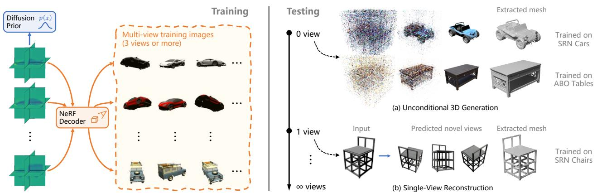  
Figure 1. During training, SSDNeRF jointly learns triplane features of individual scenes, a shared NeRF decoder, and a triplane diffusion prior. During testing, it can perform (a) unconditional generation, (b) single-view reconstruction, as well as multi-view reconstruction.

## Abstract

3D-aware image synthesis encompasses a variety of tasks, such as scene generation and novel view synthesis from images. Despite numerous task-specific methods, developing a comprehensive model remains challenging. In this paper, we present SSDNeRF, a unified approach that employs an expressive diffusion model to learn a generalizable prior ofneural radiancefields (NeRF)from multi-view images of diverse objects. Previous studies have used twostage approaches that rely on pretrained NeRFs as real data to train diffusion models. In contrast, we propose a new single-stage training paradigm with an end-to-end objective thatjointly optimizes a NeRF auto-decoder and a latent diffusion model, enabling simultaneous 3D reconstruction and prior learning, even from sparsely available views. At test time, we can directly sample the diffusion prior for unconditional generation, or combine it with arbitrary observations ofunseen objectsfor NeRF reconstruction. SSDNeRF demonstrates robust results comparable to or better than leading task-specific methods in unconditional generation and single/sparse-view 3D reconstruction.6

## 1. Introduction

Synthesizing 3D visual contents has gained significant attention in computer vision and graphics, thanks to advances in neural rendering and generative models. Although numerous methods have emerged to handle individual tasks, such as single-/multi-view 3D reconstruction and 3D content generation, it remains a major challenge to develop a comprehensive framework that bridges the state of the art of multiple tasks. For instance, neural radiance fields (NeRF) [28] have shown impressive results in novel view synthesis by solving the inverse rendering problem via perscene fitting, which is suitable for dense-view inputs but difficult to generalize to sparse observations. In contrast, many sparse-view 3D reconstruction methods [55, 8, 25] rely on feed-forward image-to-3D encoders, but they are unable to handle ambiguity in the occluded region and generate crisp images. Regarding unconditional generation, 3D-aware generative adversarial networks (GAN) [31, 5, 16, 13] are partially limited in their usage of single-image discriminators, which cannot reason cross-view relationships to effectively learn from multi-view data.

In this paper, we propose a unified approach to various 3D tasks (Fig. 1) by developing a holistic model that learns generalizable 3D priors from multi-view images. Inspired by the success of 2D diffusion models [19, 47, 27, 38, 26], we present the Single-Stage Diffusion NeRF (SSDNeRF), which models the generative prior of scene latent codes with a 3D latent diffusion model (LDM).

While similar LDMs have been applied in 2D and 3D generation in previous work [50, 38, 12, 2, 44, 29], they typically require two-stage training, where the first stage pretrains the variational auto-encoders (VAE) [23] or autodecoders [32] without diffusion models. In the case of diffusion NeRFs, however, we argue that two-stage training induces noisy patterns and artifacts in the latent code due to the uncertain nature of inverse rendering, particularly when training from sparse-view data, which prevents the diffusion model from learning a clean latent manifold effectively. To address this issue, we introduce a novel single-stage training paradigm that enables end-to-end learning of diffusion and NeRF weights (§ 4.1). This approach blends the generative and the rendering biases coherently for improved performance overall and allows for training on sparse-view data. Additionally, we show that the learned 3D priors of unconditional diffusion models can be exploited for flexible testtime scene sampling from arbitrary observations (§ 4.2).

We evaluate SSDNeRF on multiple datasets of categorical single-object scenes, demonstrating strong performance overall. Our approach represents a significant step towards a unified framework for various 3D tasks.

To summarize, our main contributions are as follows:

• We introduce SSDNeRF, a unified approach to allround performance in unconditional 3D generation and image-based reconstruction;

• We propose a novel single-stage training paradigm that jointly learns NeRF reconstruction and diffusion model from multi-view images of a large number of objects. Notably, this enables training on as sparse as three views per scene, which is previously infeasible;

• A guidance-finetuning sampling scheme is developed to exploit the learned diffusion priors for 3D reconstruction from arbitrary number of views at test time.

## 2. Related Work

3D GANs The generative adversarial framework [14] has been successfully adapted for 3D generation by integrating projection-based rendering into the generator. A variety of 3D representations have been explored previously, including point clouds, cuboids, spheres [24] and voxels [30] in early works, the more recent radiance fields [4, 41, 11, 42, 46] and feature fields [31, 16, 5] with volume renderer, and differentiable surface [13] with mesh renderer. The above methods are all trained with 2D image discriminators that are unable to reason cross-view relationships, making them heavily dependent on model bias for 3D consistency. As a result, multi-view data cannot be effectively exploited to learn complex and diverse geometries. 3D GANs are mostly applied in unconditional generation. Although 3D completion from images is possible through GAN inversion [11], faithfulness is not guaranteed due to limited latent expressiveness, as shown in [29, 1].

View-Conditioned Regression and Generation Sparseview 3D reconstruction can be tackled by regressing novel views from input images. Various architectures [8, 55, 25, 57] have been proposed to encode images into volume features, which can be projected to supervised target views through volume rendering. However, they cannot reason ambiguity and generate diverse and meaningful contents, which often leads to blurry results. In contrast, imageconditioned generative models are better at synthesizing distinct contents. 3DiM [53] proposes to generate novel views from a view-conditioned image diffusion model, but the model lacks 3D consistency bias. [58, 10, 17] distill priors of image-conditioned 2D diffusion models into NeRFs to enforce 3D constraints. These methods are parallel to our track as they model cross-view relationships in the image space, while our model is inherently 3D.

Auto-Decoders and Diffusion NeRF NeRF’s per-scene fitting scheme can be generalized to multi-scene fitting by sharing part of the parameters across all scenes, leaving the rest as individual scene codes [7]. Therefore, multi-scene NeRFs can be trained as auto-decoders [32], where the code bank and shared decoder weights are jointly learned. With proper architectures, scene codes can be treated as latents with Gaussian priors, allowing 3D completion and even generation [21, 45, 35]. However, like 3D GANs, the latents are not expressive enough for faithful reconstruction of detailed objects. [2, 12, 51] improve upon vanilla autodecoders with latent diffusion priors. DiffRF [29] leverages the diffusion prior to perform 3D completion. These methods train the auto-decoders and diffusion models in two separate stages, which is subject to the limitations in § 3.2.

## 3. Background

## 3.1. NeRF as an Auto-Decoder

Given a set of 2D images of a scene and their camera parameters, one can fit a scene model to reconstruct the light field in 3D space, expressed by a plenoptic function $y _ { \psi } ( r )$ where r parameterizes the endpoint and direction of a ray in the world space, ψ denotes the scene model parameters, and $\boldsymbol { y } \in \mathbb { R } _ { + } ^ { 3 }$ represents the received light in RGB format. NeRF [28] represents the light field as integrated radiance along rays through the 3D volume. It models the scene geometry and appearance as functions of the position $p \in \mathbb { R } ^ { 3 }$ and view direction $d \in \mathbb { R } ^ { 3 }$ of a point in the world space, expressed as $\rho _ { \psi } ( p )$ and $c _ { \psi } ( p , d )$ respectively, where $\rho \in \mathbb { R } _ { + }$ + is the density output and $c \in \mathbb { R } _ { + } ^ { 3 }$ is the RGB color output. Differentiable volume rendering is applied to compose the received light y from multiple point samples along a ray r.

NeRF can also generalize to multi-scene settings by sharing part of the model parameters across all scenes [7]. Given observations of multiples scenes $\{ y _ { i j } ^ { \mathrm { g t } } , r _ { i j } ^ { \mathrm { g t } } \}$ , where $y _ { i j } ^ { \mathrm { g t } } , r _ { i j } ^ { \mathrm { g t } }$ is the j-th pair of pixel RGB and ray of the i-th scene, one can optimize the per-scene codes $\{ x _ { i } \}$ and shared parameters ψ by minimizing the L2 rendering loss:

$$
\mathcal { L } _ { \mathrm { r e n d } } ( \{ x _ { i } \} , \psi ) = \mathbb { E } \biggl [ \sum _ { j } \frac { 1 } { 2 } \bigl \| y _ { i j } ^ { \mathrm { g t } } - y _ { \psi } \bigl ( x _ { i } , r _ { i j } ^ { \mathrm { g t } } \bigr ) \bigr \| ^ { 2 } \biggr ] .\tag{1}
$$

With this objective, the model is trained as an autodecoder [32], where the scene codes $\{ x _ { i } \}$ can be interpreted as the latent codes, and the plenoptic function can be regarded as a decoder in the form of $p _ { \psi } ( \{ y _ { j } \} | x , \{ r _ { j } \} ) : =$ $\Pi _ { j } \mathcal { N } ( y _ { j } | y _ { \psi } ( x , r _ { j } ) , I )$ , assuming independent Gaussians.

Challenges in Bridging Generation and Reconstruction An auto-decoder with trained weights ψ can perform unconditional generation by decoding latent codes drawn from a Gaussian prior [35]. However, to ensure continuity in generation, a low-dimensional latent space and a complex decoder is required, which adds to the difficulty in optimizing the latent code to faithfully reconstruct any given views.

## 3.2. Latent Diffusion Models

Latent diffusion models (LDM) learn a prior distribution $p _ { \phi } ( x )$ in the latent space with parameters ϕ, which enables the usage of more expressive latent representations, such as 2D grids for images [50, 38]. For neural field generation, previous work [2, 29, 12, 44] adopts a two-stage training scheme, where the auto-decoder is trained first to obtain the per-scene latent $x _ { i } ,$ , which is then treated as real data to train the LDM. The LDM injects Gaussian perturbation $\epsilon \sim \mathcal { N } ( 0 , I )$ into the code $x _ { i } .$ , yielding a noisy code $x _ { i } ^ { ( t ) } : = \alpha ^ { ( t ) } x _ { i } + \sigma ^ { ( t ) } \epsilon$ at diffusion time step t, under empirical noise schedule functions $\alpha ^ { ( t ) } , \sigma ^ { ( t ) }$ . A denoising network with trainable weights $\phi$ is then tasked with removing the noise from $x _ { i } ^ { ( t ) }$ to predict a denoised code ${ \hat { x } } _ { i }$ . The network is typically trained with a simplified L2 denoising loss:

$$
\mathcal { L } _ { \mathrm { d i f f } } ( \phi ) = \underset { i , t , \epsilon } { \mathbb { E } } \left[ \frac { 1 } { 2 } w ^ { ( t ) } \Big \| \hat { x } _ { \phi } \Big ( x _ { i } ^ { ( t ) } , t \Big ) - x _ { i } \Big \| ^ { 2 } \right] ,\tag{2}
$$

where $t \sim \mathcal { U } ( 0 , T ) , w ^ { ( t ) }$ is an empirical time dependent weighting function, and $\hat { x } _ { \phi } ( x _ { i } ^ { ( t ) } , t )$ formulates the timeconditioned denoising network.

Unconditional/Guided Sampling With trained weights $\phi ,$ one can sample from the diffusion prior $p _ { \psi } ( x )$ using a variety of solvers $( e . g$ ., DDIM [47]) that recursively denoise $x ^ { ( t ) }$ , starting from random Gaussian noise $x ^ { ( T ) }$ , until reaching the denoised state $x ^ { ( 0 ) }$ . Moreover, the sampling process can be guided by the gradients of the rendering loss against known observations, allowing 3D reconstruction from images at test time [29].

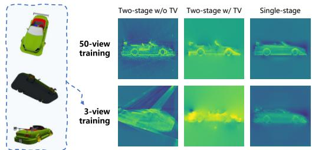  
Figure 2. Visualization of the scene code x at XZ plane. Left column: Two-stage training without TV regularization induces noise and fails in 3-view reconstruction. Mid column: TV regularization imposes smoothing prior at the cost of textural details (top), yet still struggles to cope with sparse views (bottom). Right column: Our single-stage training encourages smooth yet detailed latents and allows for training with sparse views.

Limitations of Two-Stage Training for 3D Tasks While LDMs with 2D image VAEs are typically trained in two stages [50, 38], training LDMs with NeRF auto-decoders poses an unprecedented challenge. An expressive latent code is underdetermined when obtained via renderingbased optimization, leading to noisy patterns that distract denoising networks (top-left of Fig. 2). Additionally, reconstructing NeRFs from sparse views without a learned prior is exceptionally difficult (bottom-left of Fig. 2), limiting training to dense-views settings.

## 4. Proposed Method

To build a holistic model that unifies 3D generation and reconstruction, we propose SSDNeRF, a framework that conjoins the expressive triplane NeRF auto-decoder with a triplane latent diffusion model. Fig. 3 provides an overview of the model. In the following subsections, we elaborate on how training and testing are performed in detail.

## 4.1. Single-Stage Diffusion NeRF Training

An auto-decoder can be regarded as a type of VAE that uses a lookup table encoder instead of the typical neural network encoder. As such, the training objective can be derived in a similar way as for VAEs. With NeRF decoder $p _ { \psi } ( \{ y _ { j } \} | x , \{ r _ { j } \} )$ and diffusion latent prior $p _ { \phi } ( x )$ , the training objective is to minimize variational upper bound on the negative log-likelihood (NLL) of observed data $\{ y _ { i j } ^ { \mathrm { g t } } , r _ { i j } ^ { \mathrm { g t } } \}$ [23, 36, 50]. In this paper, a simplified training loss is derived by ignoring the uncertainty (variance) in latent codes:

$$
\begin{array} { r } { \mathcal { L } = \underbrace { \mathbb { E } \left[ - \log p _ { \psi } ( \{ y _ { i j } ^ { \mathrm { g t } } \} | x _ { i } , \{ r _ { i j } ^ { \mathrm { g t } } \} ) \right] } _ { \mathrm { r e n d e r i n g l o s s } \mathcal { L } _ { \mathrm { r e n d } } } + \underbrace { \mathbb { E } \left[ - \log p _ { \phi } ( x _ { i } ) \right] } _ { \mathrm { p r i o r t e r m } } , } \end{array}\tag{3}
$$

where the scene codes $\{ x _ { i } \}$ , prior parameters $\phi ,$ and decoder parameters $\psi$ are jointly optimized in a single training stage. This loss function consists of the rendering loss $\mathcal { L } _ { \mathrm { r e n d } }$ in Eq. (1) and a diffusion prior term in the form of NLL. Following [50, 54, 48], we replace the diffusion NLL with its approximate upper bound ${ \mathcal { L } } _ { \mathrm { d i f f } }$ in Eq. (2). This technique is also called score distillation in [33]. Adding empirical weighting factors, we finalize our training objective as:

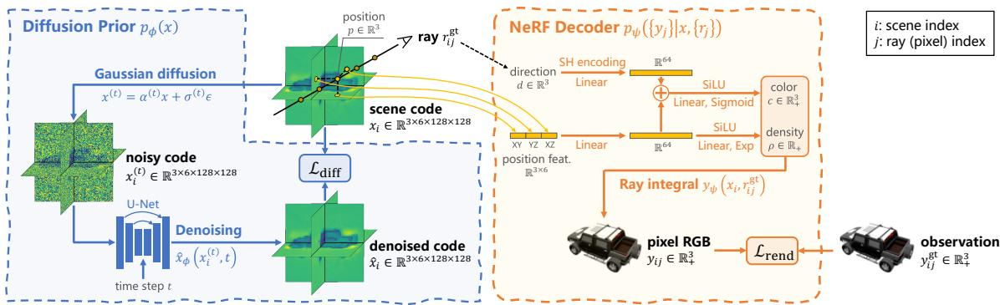  
Figure 3. An overview of SSDNeRF framework with a triplane NeRF representation. During training, we feed a batch of observations in the format of RGB values $y _ { i j } ^ { \mathrm { g t } }$ and rays $r _ { i j } ^ { \mathrm { g t } } .$ . The corresponding scene code $x _ { i }$ is randomly initialized and optimized by minimizing the rendering loss $\mathcal { L } _ { \mathrm { r e n d } }$ and the diffusion loss ${ \dot { \mathcal { L } } } _ { \mathrm { d i f f } } .$ , and model parameters ϕ, ψ are also updated along the way.

$$
\mathcal { L } = \lambda _ { \mathrm { r e n d } } \mathcal { L } _ { \mathrm { r e n d } } ( \{ x _ { i } \} , \psi ) + \lambda _ { \mathrm { d i f f } } \mathcal { L } _ { \mathrm { d i f f } } ( \{ x _ { i } \} , \phi ) .\tag{4}
$$

Single-stage training constrains scene codes $\{ x _ { i } \}$ with both terms in the loss function, allowing the learned prior to complete the parts unseen to rendering. This is particularly beneficial to training on sparse-view data, where the expressive triplane codes are severely underdetermined.

Balancing Rendering and Prior Weights The render-toprior weight ratio $\lambda _ { \mathrm { r e n d } } / \lambda _ { \mathrm { d i f f } }$ is crucial to single-stage training. To make hyperparameters more generalizable to different settings, we design an empirical weighting mechanism, in which the diffusion loss is normalized by the exponential moving average (EMA) of the scene codes’ Frobenius norms, expressed as $\lambda _ { \mathrm { d i f f } } : = c _ { \mathrm { d i f f } } / E M A \big ( \| x _ { i } \| _ { F } ^ { 2 } \big )$ with a constant scale $c _ { \mathrm { d i f f } }$ , and the rendering weight is determined by the number of views available $N _ { \mathrm { v } }$ , expressed as $\lambda _ { \mathrm { r e n d } } : = c _ { \mathrm { r e n d } } ( 1 - e ^ { - 0 . 1 N _ { \mathrm { v } } } ) / N _ { \mathrm { v } }$ with a constant scale $c _ { \mathrm { r e n d } }$ Intuitively, $N _ { \mathrm { v } }$ -based weighting is a calibration to the ray independence assumption in the decoder $p _ { \psi } ( \{ y _ { j } \} | x , \{ r _ { j } \} ) : =$ $\Pi _ { j } \mathcal { N } ( y _ { j } | y _ { \psi } ( x , r _ { j } ) , I )$ , preventing the rendering loss from scaling linearly with the number of rays.

Comparison to Two-Stage Generative Neural Fields Previous two-stage methods [2, 12, 29, 44] ignore the prior term $\lambda _ { \mathrm { d i f f } } \mathcal { L } _ { \mathrm { d i f f } }$ during the first stage of training the autodecoders. This can be seen as setting the render-to-prior weight ratio $\lambda _ { \mathrm { r e n d } } / \lambda _ { \mathrm { d i f f } }$ to infinity, resulting in biased and noisy scene codes $x _ { i }$ . Shue et al. [44] partially mitigate this issue by imposing total variation (TV) regularization on triplane scene codes to enforce a smoothing prior, which resembles the LDM constraints on the latent space (mid column of Fig. 2). Control3Diff [15] proposes to learn a conditional diffusion model on data generated by a 3D GAN pretrained on single-view images. In contrast, our single-stage training aims to directly incorporate the diffusion prior to promote end-to-end coherence.

## 4.2. Image-Guided Sampling and Finetuning

To achieve generalizable test-time NeRF reconstruction that covers a wide spectrum from single-view to dense observations, we propose performing image-guided sampling and then finetuning the sampled codes considering both the diffusion prior and rendering likelihood.

Following the reconstruction-guided sampling method by Ho et al. [20], we compute the approximated rendering gradients g w.r.t. a noisy code $x ^ { ( t ) }$ , defined as:

$$
g \gets \nabla _ { x ^ { ( t ) } } \lambda _ { \mathrm { r e n d } } \sum _ { j } \frac { 1 } { 2 } \left( \frac { \alpha ^ { ( t ) } } { \sigma ^ { ( t ) } } \right) ^ { 2 \omega } \Big \| y _ { j } ^ { \mathrm { g t } } - y _ { \psi } \left( \hat { x } _ { \phi } ( x ^ { ( t ) } , t ) , r _ { j } ^ { \mathrm { g t } } \right) \Big \| ,\tag{5}
$$

where $\left( \alpha ^ { ( t ) } / \sigma ^ { ( t ) } \right) ^ { 2 \omega }$ is an additional weighting factor based on signal-to-noise ratio (SNR), with hyperparameter ω chosen to be 0.5 or 0.25 in our work. The guidance gradients $g$ are then combined with unconditional score prediction, expressed as a correction to the denoising output xˆ:

$$
{ \hat { x } }  { \hat { x } } - \lambda _ { \mathrm { g d } } { \frac { \sigma ^ { ( t ) ^ { 2 } } } { \alpha ^ { ( t ) } } } g\tag{6}
$$

with guidance scale $\lambda _ { \mathrm { g d } } .$ . We adopt the predictor-corrector sampler [49] to solve $\bar { \boldsymbol { x } } ^ { ( 0 ) }$ by alternating between a DDIM step [47] and multiple Langevin correction steps.

We observe that the reconstruction guidance alone cannot strictly enforce rendering constraints towards faithful reconstruction. To address this issue, we reuse the training objective in Eq. (4) to finetune the sampled scene code $x ,$ while freezing the diffusion and decoder parameters:

$$
\operatorname* { m i n } _ { x } \lambda _ { \mathrm { r e n d } } \mathcal { L } _ { \mathrm { r e n d } } ( x ) + \lambda _ { \mathrm { d i f f } } ^ { \prime } \mathcal { L } _ { \mathrm { d i f f } } ( x ) ,\tag{7}
$$

where $\lambda _ { \mathrm { d i f f } } ^ { \prime }$ is the test-time prior weight, which we find should be lower than the training weight $\lambda _ { \mathrm { d i f f } }$ for best results, as the prior learned from the training dataset is less reliable when transferred to a different testing dataset. We use Adam [22] to optimize the code x for finetuning.

Comparison to Previous NeRF Finetuning Approaches While finetuning with rendering loss is common in viewconditioned NeRF regression methods [8, 57], our finetuning approach differs in the use of diffusion prior loss on the 3D scene code, which significantly enhances generalization to novel views, as demonstrated in § 5.3.

## 4.3. Implementation Details

This subsection briefly describes some important technical details. More details can be found in the supplementary.

Prior Gradient Caching Triplane NeRF reconstruction requires at least hundreds of optimization iterations on each scene code $x _ { i } .$ . A problem with the single-stage training loss in Eq. (4) is that the diffusion loss ${ \mathcal { L } } _ { \mathrm { d i f f } }$ requires much longer time to evaluate than the native NeRF rendering loss $\mathcal { L } _ { \mathrm { r e n d } }$ , reducing overall efficiency. To accelerate reconstruction in both training and test-time finetuning, we introduce a technique called prior gradient caching, which caches the back-propagated prior gradients $\nabla _ { x } \lambda _ { \mathrm { d i f f } } \mathcal { L } _ { \mathrm { d i f f } }$ for re-use in multiple Adam steps, while refreshing the rendering gradients $\nabla _ { x } \lambda _ { \mathrm { r e n d } } \mathcal { L } _ { \mathrm { r e n d } }$ in each of the steps, which allows for fewer diffusion passes than rendering. A training pseudocode is given in Algorithm 1.

Denoising Parameterization and Weighting The denoising model $\hat { x } _ { \phi } ( x ^ { ( t ) } , t )$ is implemented as a U-Net [39] as in DDPM [19], with a total of 122M parameters. Its input and output are noisy and denoised triplane features, respectively, with channels of all three planes stacked together. For the prediction format, we adopt the v-parameterization $\hat { v } _ { \phi } ( x ^ { ( t ) } , t )$ in [40], such that $\hat { x } \overset { \sim } { = } \alpha ^ { ( t ) } x ^ { ( \bar { t } ) } - \sigma ^ { ( t ) } \hat { v }$ . Regarding the weighting function $w ^ { ( t ) }$ in the diffusion loss in Eq. (2), LSGM [50] employs two different mechanisms for optimizing latents $x _ { i }$ and diffusion weights $\phi ,$ respectively, which we find unstable with NeRF auto-decoders. Instead, we observe that the SNR-based weighting $w ^ { ( t ) }$ $\left( \alpha ^ { ( t ) } / \sigma ^ { ( t ) } \right) ^ { 2 \omega }$ used in Eq. (5) works well with our models.

## 5. Experiments

## 5.1. Datasets

We conduct experiments on the ShapeNet SRN [6, 45] and Amazon Berkeley Objects (ABO) Tables [9] datasets for benchmarking with previous work. The SRN dataset provides single-object scenes in two categories, i.e., Cars and Chairs, with a train/test split of 2458/703 for Cars and 4612/1317 for Chairs. Each train scene has 50 random views from a sphere and each test scene has 251 spiral views from the upper hemisphere. The ABO Tables dataset provides a train/test split of 1520/156 table scenes, where each scene has 91 views from the upper hemisphere. For both datasets, we use the provided renderings (resized to 128×128) with ground truth poses for training and testing.

Algorithm 1: Single-stage diffusion NeRF training   
Input: $\{ y _ { i j } ^ { \mathrm { g t } } , r _ { i j } ^ { \mathrm { g t } } \}$   
1 Initialize $\{ x _ { i } \} , \phi , \psi$   
2 for $k _ { \mathrm { o u t } } : = 1 \cdot \cdot \cdot K _ { \mathrm { o u t } }$ do // outer loop of $K _ { \mathrm { o u t } }$ iterations   
3 Sample a batch of scenes $i \in B _ { \mathrm { s c } }$   
4 $g _ { \phi } , g _ { x } ^ { \mathrm { d i f f } }  \nabla _ { \phi , \{ x _ { i } \} _ { B _ { \mathrm { s c } } } } \lambda _ { \mathrm { d i f f } } \mathcal { L } _ { \mathrm { d i f f } }$ // diffusion grad   
5 $\phi  \phi - A d a m ( g _ { \phi } )$   
6 for $k _ { \mathrm { i n } } : = 1 \cdots K _ { \mathrm { i n } }$ do // inner loop of $K _ { \mathrm { i n } }$ iterations   
7 Sample a batch of rays $j \in B _ { \mathrm { r a y } }$   
8 $g _ { x } ^ { \mathrm { r e n d } }  \nabla _ { \{ x _ { i } \} _ { B _ { \mathrm { s c } } } } \lambda _ { \mathrm { r e n d } } \mathcal { L } _ { \mathrm { r e n d } }$ // rendering grad   
9 $g _ { x }  g _ { x } ^ { \mathrm { r e n d } } + g _ { x } ^ { \mathrm { d i f f } }$ // add cached prior grad   
10 $\{ x _ { i } \} _ { B _ { \mathrm { s c } } }  \{ x _ { i } \} _ { B _ { \mathrm { s c } } } - A d a m ( g _ { x } )$   
11 $\mathbf { i f } \ k _ { \mathrm { i n } } = K _ { \mathrm { i n } } \mathbf { \hat { t h e n } }$ // last inner iteration   
12 $g _ { \psi }  \nabla _ { \psi } \lambda _ { \mathrm { r e n d } } \mathcal { L } _ { \mathrm { r e n d } }$   
13 $\psi  \psi - A d a m ( g _ { \psi } )$

<table><tr><td rowspan="2">Method</td><td rowspan="2">Type</td><td colspan="2">Cars</td><td colspan="2">Tables</td></tr><tr><td>FID↓</td><td>KID/10-3↓</td><td>FID↓</td><td>KID/10-3↓</td></tr><tr><td>Functa [12]</td><td>LDM 80.3</td><td></td><td></td><td></td><td></td></tr><tr><td>π-GAN [4]</td><td></td><td>GAN 36.7†</td><td></td><td>41.67§</td><td>13.82§</td></tr><tr><td>EG3D [5]</td><td></td><td>GAN 10.46*</td><td>4.90*</td><td>31.18§</td><td>11.67§</td></tr><tr><td>DiffRF [29]</td><td>LDM</td><td>-</td><td></td><td>27.06</td><td>10.03</td></tr><tr><td>Ours (2-stage)</td><td></td><td>LDM 16.33±0.93</td><td>6.38±0.41</td><td></td><td></td></tr><tr><td>Ours (1-stage) LDM</td><td></td><td> $1 1 . 0 8 { \scriptstyle \pm 1 . 1 1 }$ </td><td>3.47±0.23</td><td>14.27±0.66</td><td>4.08±0.33</td></tr></table>

Table 1. Unconditional generation results on SRN Cars and ABO Tables. † denotes results reported by Functa [12]. § denotes results reported by DiffRF [29]. \* denotes results reproduced by us using the official public code with a bugfix.7 We show ±2σ intervals.

## 5.2. Unconditional Generation

In this section, we conduct evaluations for unconditional generation using the SRN Cars and ABO Tables dataset. The Cars dataset poses a challenge in generating sharp and intricate textures, whereas the Tables dataset comprises of diverse geometries with realistic materials. Models are trained on all images of the training set for 1M iterations.

Evaluation Protocol and Metrics For SRN Cars, following Functa [12], we sample 704 scenes from the diffusion model, and render each scene using the fixed 251 camera poses from the test set. For ABO Tables, following DiffRF [29], we sample 1000 scenes and render each scene with 10 random cameras. We adopt standard generation metrics including Frechet Inception Distance (FID) [ ´ 18] and Kernel Inception Distance (KID) [3]. The metrics’ reference sets are all images in the test set for SRN Cars and all images in the entire dataset for ABO Tables, respectively.

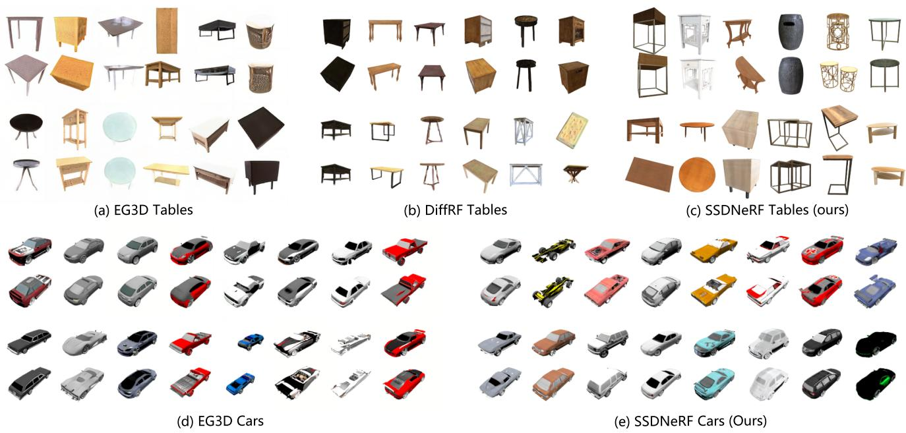  
Figure 4. Qualitative comparison between unconditional generative models trained on ABO Tables and SRN Cars.

<table><tr><td rowspan="2">Method</td><td colspan="4">Cars 1-view</td><td colspan="4">Cars 2-view</td><td colspan="4">Chairs 1-view</td><td colspan="4">Chairs 2-view</td></tr><tr><td>PSNR↑ SSIM↑LPIPS↓</td><td></td><td></td><td>FID↓</td><td>PSNR↑SSIM↑LPIPS↓</td><td></td><td></td><td>FID↓</td><td>PSNR↑SSIM↑LPIPS↓</td><td></td><td></td><td>FID↓</td><td>PSNR↑ SSIM↑LPIPS↓</td><td></td><td></td><td>FID↓</td></tr><tr><td>3DiM [53]</td><td>21.01</td><td>0.57</td><td></td><td>8.99</td><td></td><td></td><td></td><td></td><td>17.05</td><td>0.53</td><td></td><td>6.57</td><td></td><td></td><td></td><td></td></tr><tr><td>PixelNeRF [55]</td><td>23.17</td><td>0.90</td><td>0.146</td><td>59.24†</td><td>25.66</td><td>0.94</td><td></td><td></td><td>23.72</td><td>0.91</td><td>0.128</td><td>38.49†</td><td>26.20</td><td>0.94</td><td></td><td></td></tr><tr><td>SRN [45]</td><td>22.25§</td><td>0.89§</td><td>0.129</td><td>41.21†</td><td>24.84§</td><td>0.92§</td><td></td><td></td><td>22.89§</td><td>0.89§</td><td>0.104</td><td>26.51†</td><td>24.48§</td><td>0.92§</td><td></td><td></td></tr><tr><td>CodeNeRF [21]</td><td>23.80</td><td>0.91</td><td>0.118*</td><td>56.34*</td><td>25.71</td><td>0.93</td><td></td><td>0.108* 56.13*</td><td>23.66</td><td>0.90</td><td>0.106*</td><td>31.65*</td><td>25.63</td><td>0.91</td><td>0.097* 29.90*</td><td></td></tr><tr><td>VisionNeRF [25]</td><td>22.88</td><td>0.91</td><td>0.084</td><td>21.31†</td><td></td><td></td><td></td><td></td><td>24.48</td><td>0.93</td><td>0.077</td><td>10.05†</td><td></td><td></td><td></td><td></td></tr><tr><td>Ours (1-stage)</td><td>23.52</td><td>0.91</td><td>0.078</td><td>16.39</td><td>26.49</td><td>0.94</td><td>0.054</td><td>10.66</td><td>24.35</td><td>0.93</td><td>0.067</td><td>10.13</td><td>26.94</td><td>0.95</td><td>0.055</td><td>10.85</td></tr></table>

Table 2. Single-view and two-view reconstruction results on SRN Cars and Chairs. For consistency with prior work, we use view #64 of the test scene as single-view input and view #64 and #104 as two-view input. † denotes results reported by 3DiM [53]. ‡ denotes results reported by VisionNeRF [25], § denotes results reported by PixelNeRF [21], denotes results reproduced by us using the official code. - indicates results are unavailable.

Comparison to the State of the Art As shown in Table 1, on SRN Cars, SSDNeRF (1-stage) outperforms EG3D in KID (a more suitable measure for small datasets) by a clear margin. Meanwhile, its FID is drastically better than Functa, which uses an LDM but with low dimensional latent codes. On ABO Tables, SSDNeRF shows significantly better performance than EG3D and DiffRF.

Single- vs. Two-stage On SRN Cars, we compare the proposed single-stage training against two-stage training with tuned TV regularization using the same model architecture. The results in Table 1 indicate substantial advantage of single-stage training (KID/10−3 3.47 vs. 6.38).

Qualitative Results As shown in Fig. 4, SSDNeRF generates more regular geometries than the slightly skewed and distorted shapes by EG3D [5]. Compared to DiffRF [29], our method produces sharp details and reflective materials, thanks to our more expressive model with latents of higher spatial resolution and view-dependent NeRF decoder.

## 5.3. Sparse-View NeRF Reconstruction

This section presents experiments on 3D reconstruction from sparse-view images of unseen objects in SRN Cars and Chairs test sets. The Cars dataset presents the challenge of recovering distinct textures, while the Chairs dataset requires accurate reconstruction of diverse shapes. Models are trained on all images of the training set for 80K iterations, as we find that longer schedule leads to decaying performance in reconstructing unseen objects. This behaviour is in accordance with the interpolation results in § 5.5.

Evaluation Protocol and Metrics We use the evaluation protocol and metrics in PixelNeRF [55]. Given input images sampled from each test scene, we obtain the triplane scene code via guidance-finetuning and evaluate novel view synthesis quality with respect to the unseen images.

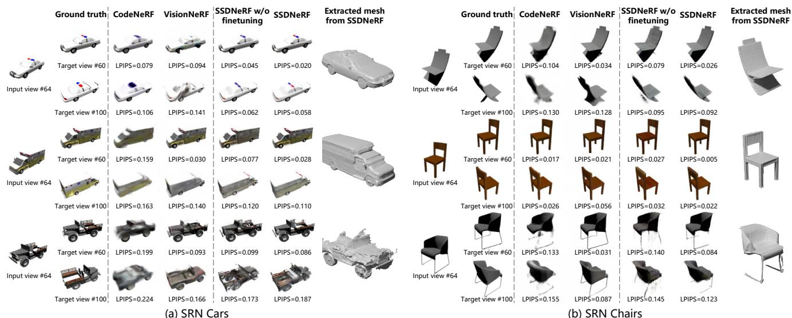  
Figure 5. Qualitative comparison of single-view reconstruction methods on unseen test objects in SRN Cars and Chairs.

The image quality metrics include average peak signal-tonoise-ratio (PSNR), structural similarity (SSIM) [52], and Learned Perceptual Image Patch Similarity (LPIPS) [56]. In addition, we evaluate the FID between all synthesized images and ground truth images as in 3DiM [53].

Comparison to the State of the Art Table 2 compares SSDNeRF against previous approaches in single-view and two-view reconstruction settings. Overall, SSDNeRF reaches the best LPIPS of all tasks, indicating the best perceptual fidelity. In contrast, 3DiM generates high quality images (best FID) but with the lowest fidelity to the ground truth (lowest PSNR); CodeNeRF reports the best PSNR on single-view Cars, but its limited expressiveness leads to blurry outputs (Fig. 5) and less competitive LPIPS and FID; VisionNeRF achieves a balanced performance on all single-view metrics, but may struggle to generate textural details on the unseen side of cars (e.g., the other side of the ambulance in Fig. 5). Moreover, SSDNeRF exhibits a clear advantage in two-view reconstruction, achieving the best performance on all relevant metrics.

Single- vs. Two-stage As demonstrated in Table 3, the model trained in a single stage (A0) outperforms the same architecture trained in two stages with TV regularization (A1) in all metrics of single-view reconstruction.

Ablation Studies on Test-Time Finetuning As shown in Table 3, we evaluate the effectiveness of test-time finetuning and the contribution of the learned diffusion prior with two ablation experiments: (A2) removing the diffusion loss during finetuning and using only the rendering loss, and (A3) omitting the finetuning process entirely. The results indicate that finetuning with single-view rendering loss provides only marginal improvements over guided sampling (A2 vs. A3), while the learned diffusion prior significantly boosts the LPIPS and FID scores (A0 vs. A2), highlighting its importance in recovering sharp and distinct contents. Moreover, the qualitative results in Fig. 5 reveal that views with higher overlap to the input view benefit the most from finetuning, meeting our expectation that finetuning helps faithfully reconstruct the exact observations.

<table><tr><td>ID</td><td>Training</td><td>Finetuning</td><td>PSNR↑</td><td>SSIM↑</td><td>LPIPS↓ FID↓</td></tr><tr><td>A0</td><td> 1-stage</td><td>Rend + Diff</td><td>23.52</td><td>0.913</td><td>0.078 16.39</td></tr><tr><td></td><td>A1 2-stage</td><td>Rend + Diff</td><td>22.83</td><td>0.906</td><td>0.090 20.97</td></tr><tr><td>A2</td><td>1-stage</td><td>Rend</td><td>23.13</td><td>0.907</td><td>0.088 27.93</td></tr><tr><td></td><td>A3 1-stage</td><td>None</td><td>23.07</td><td>0.905</td><td>0.092 30.95</td></tr></table>

Table 3. Ablation results on single-view reconstruction of SRN Cars.  
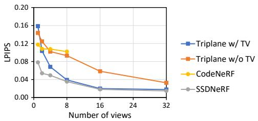  
Figure 6. LPIPS scores (lower is better) of novel view synthesis from sparse-to-dense inputs, evaluated on SRN Cars test set. The triplane baselines adopt mean initialization for better performance.

Sparse-to-Dense Reconstruction To validate that SSD-NeRF seamlessly bridges sparse- and dense-view NeRF reconstruction, we evaluate its novel view synthesis performance with the number of input views varying from 1 to 32. We compare our model to the triplane NeRF baseline trained as an auto-decoder with optional TV regularization instead of diffusion prior. Meanwhile, we also evaluate CodeNeRF [21], an auto-decoder with 256-d latent codes. The results in Fig. 6 show that SSDNeRF excels in all settings, especially in 1 to 4 views. In contrast, CodeNeRF is outperformed by vanilla triplane NeRF with more views.

## 5.4. Training SSDNeRF on Sparse-View Dataset

In this section, we train SSDNeRF on a sparse-view subset of the full SRN Cars training set, in which a fixed set of only three views are randomly picked from each scene. Note that a reasonable decline in performance compared to dense-view training is expected as the whole training dataset has been reduced to 6% of its original size.

Unconditional Generation We adopt a training trick that resets the triplane codes to their mean value halfway through training. This helps to prevent the model from getting stuck in a local minimum that overfits geometric artifacts. We also double the length of the training schedule accordingly. The model achieves a decent FID of 19.04±1.10 and a KID/10−3 of 8.28±0.60. Results are visualized in Fig. 7.

Single-View Reconstruction We adopt the same training strategy as in § 5.3. With our guidance-finetuning approach, the model achieves an LPIPS score of 0.106, even outperforming most of the previous methods in Table 2 that use the full training set.

Comparison to TV Regularization Fig. 8 (b) shows the RGB images and geometries represented by the scene latent codes learned from three views during training. By comparison, vanilla triplane auto-decoder with TV regularization (Fig. 8 (a)) often fails to reconstruct a scene from sparse views, leading to severe geometric artifacts. As a result, previously it has been infeasible to train two-stage models with expressive latents on sparse-view data.

## 5.5. NeRF Interpolation

Following DDIM [47], we can sample two initial values $x ^ { ( T ) } \sim \bar { \mathcal { N } } ( 0 , I )$ , interpolate them using spherical linear interpolation [43], and then use the deterministic solver to obtain interpolated samples. However, as noted by [34, 37], standard Gaussian diffusion models often result in nonsmooth interpolation. In SSDNeRF (with results shown in Fig. 9), we find that the model (a) trained with early stopping for sparse-view reconstruction produces reasonably smooth transitions between samples, while the model (b) trained with a longer schedule for unconditional generation produces distinct yet discontinuous samples. This suggests that early stopping preserves a smoother prior, leading to better generalization for sparse-view reconstruction.

## 6. Conclusion

In this paper, we propose SSDNeRF, which combines the diffusion model and NeRF representation through a novel single-stage training paradigm with an end-to-end justifiable loss. Notably, it overcomes the limitations in previous work where implicit neural fields must be obtained from

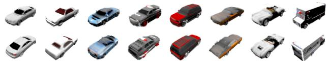  
Figure 7. Images generated by SSDNeRF trained on a 3-view subset of SRN Cars training set.

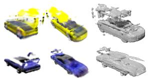

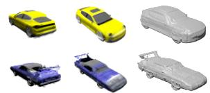  
(a) Auto-decoder training w/ TV  
(b) 1-stage joint training with diffusion

Figure 8. Qualitative comparison between scene codes learned from 3 views by (a) triplane auto-decoder with TV regularization vs. (b) single-stage diffusion NeRF.  
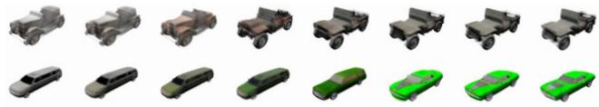  
(a) Models trained with early stopping (80K iters) for sparse-view reconstruction

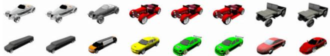  
(b) Models trained with long schedule (1M iters) for unconditional generation

Figure 9. Interpolation between the leftmost and rightmost samples using DDIM [47].

dense observations first, before training the diffusion models to learn their manifold. With strong performance on multiple benchmarks, SSDNeRF demonstrates a significant advancement towards a unified framework for general 3D content manipulation.

Limitations and Future Work Currently, our method relies on ground truth camera parameters during both training and testing. Future work may explore transform-invariant models. Additionally, the diffusion prior can become discontinuous with prolonged training, which affects generalization. Although early stopping is temporarily used, a better network design or a larger training dataset may be able to address this problem fundamentally.

Acknowledgements We thank Norman Muller for shar-¨ ing the baseline results on ABO Tables. Hansheng Chen and Wei Tian acknowledge the funding by the National Natural Science Foundation of China (No. 52002285), the Shanghai Science and Technology Commission (No. 21ZR1467400), the original research project of Tongji University (No. 22120220593), the National Key R&D Program of China (No. 2021YFB2501104), and the Natural Science Foundation of Chongqing (No. 2023NSCQ-MSX4511).

## References

[1] Titas Anciukevicius, Zexiang Xu, Matthew Fisher, Paul Henderson, Hakan Bilen, Niloy J. Mitra, and Paul Guerrero. RenderDiffusion: Image diffusion for 3D reconstruction, inpainting and generation. In CVPR, 2023. 2

[2] Miguel Angel Bautista, Pengsheng Guo, Samira Abnar, Walter Talbott, Alexander Toshev, Zhuoyuan Chen, Laurent Dinh, Shuangfei Zhai, Hanlin Goh, Daniel Ulbricht, Afshin Dehghan, and Josh Susskind. Gaudi: A neural architect for immersive 3d scene generation. In NeurIPS, 2022. 2, 3, 4

[3] Mikołaj Binkowski, Danica J. Sutherland, Michael Arbel,´ and Arthur Gretton. Demystifying mmd gans. In ICLR, 2018. 5

[4] Eric Chan, Marco Monteiro, Petr Kellnhofer, Jiajun Wu, and Gordon Wetzstein. pi-gan: Periodic implicit generative adversarial networks for 3d-aware image synthesis. In CVPR, 2021. 2, 5

[5] Eric R. Chan, Connor Z. Lin, Matthew A. Chan, Koki Nagano, Boxiao Pan, Shalini De Mello, Orazio Gallo, Leonidas Guibas, Jonathan Tremblay, Sameh Khamis, Tero Karras, and Gordon Wetzstein. Efficient geometry-aware 3D generative adversarial networks. In CVPR, 2022. 1, 2, 5, 6

[6] Angel X. Chang, Thomas Funkhouser, Leonidas Guibas, Pat Hanrahan, Qixing Huang, Zimo Li, Silvio Savarese, Manolis Savva, Shuran Song, Hao Su, Jianxiong Xiao, Li Yi, and Fisher Yu. ShapeNet: An Information-Rich 3D Model Repository. Technical Report arXiv:1512.03012 [cs.GR], Stanford University — Princeton University — Toyota Technological Institute at Chicago, 2015. 5

[7] Anpei Chen, Zexiang Xu, Xinyue Wei, Siyu Tang, Hao Su, and Andreas Geiger. Factor fields: A unified framework for neural fields and beyond, 2023. 2, 3

[8] Anpei Chen, Zexiang Xu, Fuqiang Zhao, Xiaoshuai Zhang, Fanbo Xiang, Jingyi Yu, and Hao Su. Mvsnerf: Fast generalizable radiance field reconstruction from multi-view stereo. In ICCV, pages 14124–14133, 2021. 1, 2, 5

[9] Jasmine Collins, Shubham Goel, Kenan Deng, Achleshwar Luthra, Leon Xu, Erhan Gundogdu, Xi Zhang, Tomas F Yago Vicente, Thomas Dideriksen, Himanshu Arora, Matthieu Guillaumin, and Jitendra Malik. Abo: Dataset and benchmarks for real-world 3d object understanding. In CVPR, 2022. 5

[10] Congyue Deng, Chiyu Jiang, Charles R Qi, Xinchen Yan, Yin Zhou, Leonidas Guibas, Dragomir Anguelov, et al. Nerdi: Single-view nerf synthesis with language-guided diffusion as general image priors. In CVPR, 2023. 2

[11] Terrance DeVries, Miguel Angel Bautista, Nitish Srivastava, Graham W. Taylor, and Joshua M. Susskind. Unconstrained scene generation with locally conditioned radiance fields. In ICCV, 2021. 2

[12] Emilien Dupont, Hyunjik Kim, S. M. Ali Eslami, Danilo Jimenez Rezende, and Dan Rosenbaum. From data to functa: Your data point is a function and you can treat it like one. In ICML, 2022. 2, 3, 4, 5

[13] Jun Gao, Tianchang Shen, Zian Wang, Wenzheng Chen, Kangxue Yin, Daiqing Li, Or Litany, Zan Gojcic, and Sanja

Fidler. Get3d: A generative model of high quality 3d textured shapes learned from images. In NeurIPS, 2022. 1, 2

[14] Ian Goodfellow, Jean Pouget-Abadie, Mehdi Mirza, Bing Xu, David Warde-Farley, Sherjil Ozair, Aaron Courville, and Yoshua Bengio. Generative adversarial nets. In NeurIPS, 2014. 2

[15] Jiatao Gu, Qingzhe Gao, Shuangfei Zhai, Baoquan Chen, Lingjie Liu, and Josh Susskind. Learning controllable 3d diffusion models from single-view images, 2023. 4

[16] Jiatao Gu, Lingjie Liu, Peng Wang, and Christian Theobalt. Stylenerf: A style-based 3d aware generator for highresolution image synthesis. In ICLR, 2022. 1, 2

[17] Jiatao Gu, Alex Trevithick, Kai-En Lin, Josh Susskind, Christian Theobalt, Lingjie Liu, and Ravi Ramamoorthi. Nerfdiff: Single-image view synthesis with nerf-guided distillation from 3d-aware diffusion, 2023. 2

[18] Martin Heusel, Hubert Ramsauer, Thomas Unterthiner, Bernhard Nessler, and Sepp Hochreiter. Gans trained by a two time-scale update rule converge to a local nash equilibrium. In NeurIPS, 2017. 5

[19] Jonathan Ho, Ajay Jain, and Pieter Abbeel. Denoising diffusion probabilistic models. In NeurIPS, 2020. 2, 5

[20] Jonathan Ho, Tim Salimans, Alexey Gritsenko, William Chan, Mohammad Norouzi, and David J Fleet. Video diffusion models. In NeurIPS, 2022. 4

[21] Wonbong Jang and Lourdes Agapito. Codenerf: Disentangled neural radiance fields for object categories. In ICCV, pages 12949–12958, 2021. 2, 6, 7

[22] Diederik P. Kingma and Jimmy Ba. Adam: A method for stochastic optimization. In ICLR, 2015. 5

[23] Diederik P Kingma and Max Welling. Auto-encoding variational bayes. In ICLR, 2014. 2, 3

[24] Yiyi Liao, Katja Schwarz, Lars Mescheder, and Andreas Geiger. Towards unsupervised learning of generative models for 3d controllable image synthesis. In CVPR, 2020. 2

[25] Kai-En Lin, Lin Yen-Chen, Wei-Sheng Lai, Tsung-Yi Lin, Yi-Chang Shih, and Ravi Ramamoorthi. Vision transformer for nerf-based view synthesis from a single input image. In WACV, 2023. 1, 2, 6

[26] Andreas Lugmayr, Martin Danelljan, Andres Romero, Fisher Yu, Radu Timofte, and Luc Van Gool. Repaint: Inpainting using denoising diffusion probabilistic models. In CVPR, pages 11461–11471, 2022. 2

[27] Chenlin Meng, Yutong He, Yang Song, Jiaming Song, Jiajun Wu, Jun-Yan Zhu, and Stefano Ermon. SDEdit: Guided image synthesis and editing with stochastic differential equations. In ICLR, 2022. 2

[28] Ben Mildenhall, Pratul P. Srinivasan, Matthew Tancik, Jonathan T. Barron, Ravi Ramamoorthi, and Ren Ng. Nerf: Representing scenes as neural radiance fields for view synthesis. In ECCV, 2020. 1, 2

[29] Norman Muller, , Yawar Siddiqui, Lorenzo Porzi, Samuel¨ Rota Bulo, Peter Kontschieder, and Matthias Nießner. Diffrf:\` Rendering-guided 3d radiance field diffusion. In CVPR, 2023. 2, 3, 4, 5, 6

[30] Thu Nguyen-Phuoc, Chuan Li, Lucas Theis, Christian Richardt, and Yong-Liang Yang. Hologan: Unsupervised

learning of 3d representations from natural images. In ICCV, 2019. 2

[31] Michael Niemeyer and Andreas Geiger. Giraffe: Representing scenes as compositional generative neural feature fields. In CVPR, 2021. 1, 2

[32] Jeong Joon Park, Peter Florence, Julian Straub, Richard Newcombe, and Steven Lovegrove. Deepsdf: Learning continuous signed distance functions for shape representation. In CVPR, 2019. 2, 3

[33] Ben Poole, Ajay Jain, Jonathan T. Barron, and Ben Mildenhall. Dreamfusion: Text-to-3d using 2d diffusion. In ICLR, 2023. 4

[34] Konpat Preechakul, Nattanat Chatthee, Suttisak Wizadwongsa, and Supasorn Suwajanakorn. Diffusion autoencoders: Toward a meaningful and decodable representation. In CVPR, 2022. 8

[35] Daniel Rebain, Mark Matthews, Kwang Moo Yi, Dmitry Lagun, and Andrea Tagliasacchi. Lolnerf: Learn from one look. In CVPR, 2022. 2, 3

[36] Danilo Jimenez Rezende, Shakir Mohamed, and Daan Wierstra. Stochastic backpropagation and approximate inference in deep generative models. In ICML, pages 1278–1286, 2014. 3

[37] Severi Rissanen, Markus Heinonen, and Arno Solin. Generative modelling with inverse heat dissipation. In ICLR, 2023. 8

[38] Robin Rombach, Andreas Blattmann, Dominik Lorenz, Patrick Esser, and Bjorn Ommer. High-resolution image syn-¨ thesis with latent diffusion models. In CVPR, 2022. 2, 3

[39] Olaf Ronneberger, Philipp Fischer, and Thomas Brox. U-net: Convolutional networks for biomedical image segmentation. In Medical Image Computing and Computer-Assisted Intervention (MICCAI), pages 234–241, 2015. 5

[40] Tim Salimans and Jonathan Ho. Progressive distillation for fast sampling of diffusion models. In ICLR, 2022. 5

[41] Katja Schwarz, Yiyi Liao, Michael Niemeyer, and Andreas Geiger. Graf: Generative radiance fields for 3d-aware image synthesis. In NeurIPS, 2020. 2

[42] Katja Schwarz, Axel Sauer, Michael Niemeyer, Yiyi Liao, and Andreas Geiger. Voxgraf: Fast 3d-aware image synthesis with sparse voxel grids. In NeurIPS, 2022. 2

[43] Ken Shoemake. Animating rotation with quaternion curves. In Annual Conference on Computer Graphics and Interactive Techniques (SIGGRAPH), pages 245–254, 1985. 8

[44] J Ryan Shue, Eric Ryan Chan, Ryan Po, Zachary Ankner, Jiajun Wu, and Gordon Wetzstein. 3d neural field generation using triplane diffusion. In CVPR, 2023. 2, 3, 4

[45] Vincent Sitzmann, Michael Zollhofer, and Gordon Wet-¨ zstein. Scene representation networks: Continuous 3dstructure-aware neural scene representations. In NeurIPS, 2019. 2, 5, 6

[46] Ivan Skorokhodov, Sergey Tulyakov, Yiqun Wang, and Peter Wonka. Epigraf: Rethinking training of 3d gans. In NeurIPS, 2022. 2

[47] Jiaming Song, Chenlin Meng, and Stefano Ermon. Denoising diffusion implicit models. In ICLR, 2021. 2, 3, 4, 8

[48] Yang Song, Conor Durkan, Iain Murray, and Stefano Ermon. Maximum likelihood training of score-based diffusion models. In NeurIPS, 2021. 4

[49] Yang Song, Jascha Sohl-Dickstein, Diederik P Kingma, Abhishek Kumar, Stefano Ermon, and Ben Poole. Score-based generative modeling through stochastic differential equations. In ICLR, 2021. 4

[50] Arash Vahdat, Karsten Kreis, and Jan Kautz. Score-based generative modeling in latent space. In NeurIPS, 2021. 2, 3, 4, 5

[51] Tengfei Wang, Bo Zhang, Ting Zhang, Shuyang Gu, Jianmin Bao, Tadas Baltrusaitis, Jingjing Shen, Dong Chen, Fang Wen, Qifeng Chen, and Baining Guo. Rodin: A generative model for sculpting 3d digital avatars using diffusion. In CVPR, 2023. 2

[52] Zhou Wang, A.C. Bovik, H.R. Sheikh, and E.P. Simoncelli. Image quality assessment: from error visibility to structural similarity. IEEE TIP, 13(4):600–612, 2004. 7

[53] Daniel Watson, William Chan, Ricardo Martin-Brualla, Jonathan Ho, Andrea Tagliasacchi, and Mohammad Norouzi. Novel view synthesis with diffusion models. In ICLR, 2023. 2, 6, 7

[54] Antoine Wehenkel and Gilles Louppe. Diffusion priors in variational autoencoders. In ICML Workshops, 2021. 4

[55] Alex Yu, Vickie Ye, Matthew Tancik, and Angjoo Kanazawa. pixelNeRF: Neural radiance fields from one or few images. In CVPR, 2021. 1, 2, 6

[56] Richard Zhang, Phillip Isola, Alexei Efros, Eli Shechtman, and Oliver Wang. The unreasonable effectiveness of deep features as a perceptual metric. In CVPR, 2018. 7

[57] Xiaoshuai Zhang, Sai Bi, Kalyan Sunkavalli, Hao Su, and Zexiang Xu. Nerfusion: Fusing radiance fields for largescale scene reconstruction. In CVPR, 2022. 2, 5

[58] Zhizhuo Zhou and Shubham Tulsiani. Sparsefusion: Distilling view-conditioned diffusion for 3d reconstruction. In CVPR, 2023. 2