# Stabilizing Visual Reinforcement Learning via Asymmetric Interactive Cooperation

Yunpeng Zhai1, Peixi Peng2,3,∗, Yifan Zhao1, Yangru Huang1, Yonghong Tian1,2,3,\* 1National Key Laboratory for Multimedia Information Processing, School of Computer Science, Peking University, Beijing, China 2School of Electronic and Computer Engineering, Peking University Shenzhen Graduate School, Shenzhen, China 3Peng Cheng Laboratory, Shenzhen, China

{ypzhai, pxpeng, zhaoyf, yhtian}@pku.edu.cn, yrhuang@stu.pku.edu.cn

## Abstract

Vision-based reinforcement learning (RL) depends on discriminative representation encoders to abstract the observation states. Despite the great success of increasing CNN parameters for many supervised computer vision tasks, reinforcement learning with temporal-difference (TD) losses cannot benefit from it in most complex environments. In this paper, we analyze that the training instability arises from the oscillating self-overfitting of the heavy-optimizable encoder. We argue that serious oscillation will occur to the parameters when enforced to fit the sensitive TD targets, causing uncertain drifting ofthe latent state space and thus transmitting these perturbations to the policy learning. To alleviate this phenomenon, we propose a novel asymmetric interactive cooperation approach with the interaction between a heavy-optimizable encoder and a supportive light-optimizable encoder, in which both their advantages are integrated including the highly discriminative capability as well as the training stability. We also present a greedy bootstrapping optimization to isolate the visual perturbations from policy learning, where representation and policy are trained sufficiently by turns. Finally, we demonstrate the effectiveness of our method in utilizing larger visual models by first-person highway driving task CARLA and Vizdoom environments.

## 1. Introduction

Learning complex control from high-dimensional observations such as images is significant for many real-world applications [37, 28]. It puts forward higher requirements for the representation capability of visual encoder models, especially in some complex scenes such as self-driving [5] and robot controlling [29]. The last decade has witnessed impressive progress in computer vision by training largescale networks [18] as they increase the search space of possible solutions. However, such parameter increment of visual models cannot directly benefit the reinforcement learning, and even leads to deterioration of training. For example, as shown in Fig. 1(a), we illustrated the training curves of DeepMDP [7] agents that use different CNN networks as visual encoders on the self-driving environment CARLA [5]. The result shows that using a larger model, e.g., ResNet-18 [18], leads to unstable training and achieves distinctly lower returns than the lighter model with only four convolutional layers.

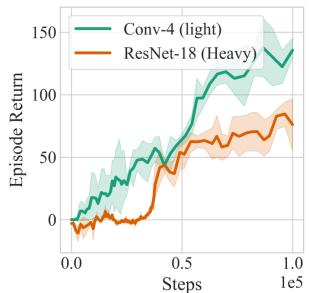

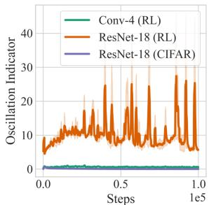  
a) Returns during training  
b) Parameter oscillation  
Figure 1. Comparison of DeepMDP agents on CARLA with light- and heavy-weight visual encoders in episode returns (a) and parameter oscillation $( \sum _ { t } ^ { T } \| \nabla \theta _ { t } \| ) / \| \sum _ { t } ^ { T } \nabla \theta _ { t } \|$ (b). Compared with 4-layer CNN, larger models like ResNet-18 do not improve the RL performance as in supervised learning. The deterioration results from the oscillating self-overfitting of the larger model, which occurs in neither supervised learning nor RL with a lightweight encoder.

To investigate this phenomenon, we quantified the oscillation of the network parameters by introducing an indicator calculated by the ratio of accumulation of modulus length of the gradient to the module lengths of cumulative gradient within T training steps, $( \sum _ { t } ^ { T } \| \dot { \nabla } \theta _ { t } \| ) / \| \sum _ { t } ^ { T } \nabla \theta _ { t } \|$ where ∇ is gradient operator and $\theta _ { t }$ is parameters of the last convolution layer in the t-th step. A higher indicator means worse oscillation and instability of parameters during training. As shown in Fig. 1(b), we compared the oscillation in three experiments including i) training ResNet-18 on RL, ii) training 4-layer CNN on RL, and iii) training ResNet-18 on supervised learning (SL) with CIFAR-100 [24]. ResNet-18 suffers much more serious oscillation when training on RL, resulting in deteriorated performance. However, such oscillation occurs neither on SL with ResNet-18 nor on RL with the lighter 4-layer CNN. We name this phenomenon as oscillating self-overfitting, which particularly results from a pathological concurrence of the overfitting capability of large models and the sensitive learning targets of the temporal-difference (TD) loss [25]. Specifically, when the heavyweight parameters are enforced to fit the sensitive TD targets which are partially generated by themselves with a bootstrapping formulation, contradictory gradients will propagate back to oscillate the parameters. This phenomenon results in uncertain drifting of the state space and transmits these perturbations to policy learning. Therefore, stabilizing visual encoders with amounts of parameters from TD losses for performance gain in RL is still an open challenge.

From the perspective of the relation between the encoder and the TD objective, existing representation learning for RL can be categorized into two groups, as illustrated in Fig. 2. One approach jointly learns representation with policy by the TD loss [16, 7, 23]. It efficiently learns the longterm expected returns with light encoders while is incompatible with heavy-optimizable encoders due to the oscillating self-overfitting. Another group of approaches decouples representation learning from RL to avoid instability, where the encoder is learned only by auxiliary dynamic predictive losses [11, 32]. However, it is inaccessible to the expected returns from the bootstrapping objective in RL. In this paper, we propose a novel asymmetric interactive cooperation for representation learning in RL. To take both the advantages of representation capability and the stability for TD targets, it separately trains a main heavy-optimizable encoder and a supportive light-optimizable encoder by auxiliary tasks and TD losses, respectively. And the asymmetric interaction is simultaneously conducted between them to effectively exchange their knowledge from each other, where the heavy one transfer the representation capability by parameter momentum and the light one transfer the longterm expected returns by topological distillation. Hence, the heavy encoder is equipped with the capability of latent state abstraction without oscillating by the TD objective. Moreover, we present a greedy bootstrapping optimization for further stability of training, where representation and policy are trained sufficiently by turns.

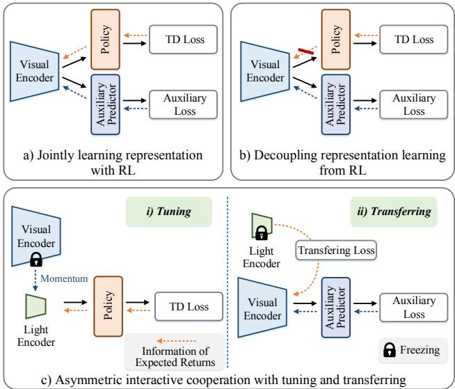  
Figure 2. Illustrations of different learning paradigms of visual encoders. a) Joint Learning trains the visual encoder end-to-end with reinforcement loss. b) Decoupled learning trains the encoder only by auxiliary tasks. c) The proposed AIC trains a supportive light-optimizable encoder with the expected returns information from TD targets and transfers it to the main visual encoder.

The main contributions of this paper can be summarized in three aspects. First, it investigates the phenomenon of oscillating self-overfitting that leads to deterioration in RL with heavy-optimizable encoders, and proposes a novel asymmetric interactive cooperation to alleviate it. Second, it presents a topological distillation between latent state spaces to learn state abstraction by interactive cooperation without any explicit labels. Third, it presents a greedy bootstrapping optimization for further stability of training. Experiments demonstrate a significant performance gain over the complex and realistic environments of CARLA and Vizdoom.

## 2. Related Work

Jointly Representation Learning with RL. Since learning control directly from high-dimension visual observations is hard to converge, many approaches learn the encoder jointly with RL and elaborate auxiliary tasks [39, 38, 26, 6, 21, 34], as shown in Fig. 2(a). The first line of methods utilizes selfsupervision to learn the visual invariances [17, 16, 15, 35]. CURL [27] introduced a contrastive loss to learn discriminative features from raw pixels. The second line learns to abstract the state by preserving the property of Markov decision processes (MDPs) [12, 19, 2]. DeepMDP [7] learns the latent space with the same dynamic transition as the environment. DBC [40] learns invariant representations with the bisimulation distance. The third line of methods designs regularization to stabilize the training process [23]. DrQ [23] and SVEA [16] propose data regularization using image augmentation of random shift or random convolution. A-LIX [3] adaptively regularizes the convolutional features to prevent overfitting while it doesn’t study the heavy visual models. The common drawback of these methods is the difficulty for the heavy-optimizable encoders due to oscillating self-overfitting caused by TD losses, resulting in more serious instability. Other recent works have concerned the stability of large models in RL [25, 31], but they focus on a different component of policy learning instead of representation. We also note recent work RL with Transformer while they only contain slight parameters [4, 20] or rely on supervised imitation learning [36].

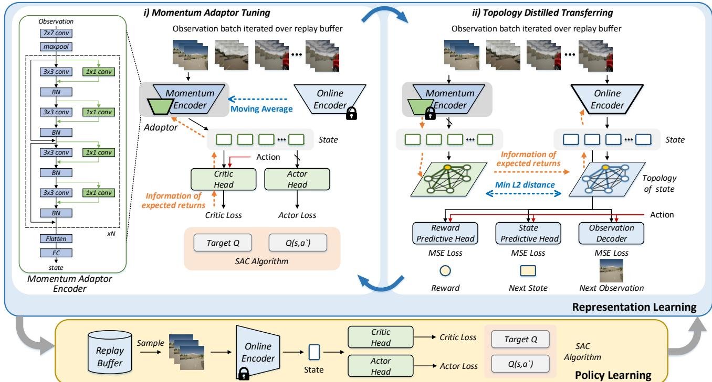  
Figure 3. Flowchart of the proposed asymmetric interactive cooperation. The representation learning consists of two components including momentum adaptor tuning and topological distilled transferring. In the momentum adaptor tuning, the adaptor is optimized by RL to learn the information of expected returns while the momentum encoder is updated by moving average from the online encoder. In topology distilled transferring, the online encoder is trained by three auxiliary tasks while transferring the information of expected returns by topology distillation from the momentum adaptor encoder. The policy is learned by freezing the online encoder.

Decoupled Representation Learning from RL. Recent methods proposed to decouple representation learning from TD losses for efficient training [30, 31], in Fig. 2(b). A typical approach is the world model [9, 8]. It first pretrains an encoder using Variational Autoencoder [33] by the collected rollouts from a random policy and then trains policy with the encoder frozen. However, the encoder does not perform well since the pretraining data is of different distribution from those in policy learning. Recent world model class methods [14, 30, 32, 13, 1], such as Dreamer [11], turn to learn the encoder and the policy alternatively stepby-step, in which the encoder is updated by the newly collected data. Theoretically, these approaches can train any large model stably. But there still exists a bottleneck, that is, the encoder is isolated from the long-term expected returns hidden in the TD losses, which is significant for the state abstraction with respect to the downstream controls. In our work, we tackle this problem by interacting with a supportive light-optimizable encoder, which learns from TD losses stably and transfers its knowledge to the main encoder, as shown in Fig. 2(c).

## 3. The Proposed Approach

## 3.1. Overview

Asymmetric interactive cooperation alternatively trains a light-optimizable supportive encoder with TD losses to learn the long-term expected returns without oscillating self-overfitting, and a heavy-optimizable main encoder with auxiliary tasks to capture stronger representation capability. Simultaneously, two kinds of interaction are conducted between them to exchange their knowledge including:

• Light ← Heavy: parameter momentum to absorb the

representation capability, as in Sec. 3.2.

• Light → Heavy: topological distillation to learn the long-term expected returns, as in Sec. 3.3.

Beyond them, it presents a greed bootstrapping framework for AIC to alleviate the drifting of the state space for further stability in Sec. 3.4. The flowchart of AIC is illustrated in Fig. 3.

## 3.2. Momentum Adaptor Tuning

Attaching adaptor to momentum. To efficiently learn the long-term expected returns, the light-optimizable encoder should satisfy the following two conditions: 1) It only contains a few learnable parameters so that it converges without oscillating self-overfitting. 2) It can utilize the middle-level representation of the heavy-optimizable encoder rather than relying only on the raw observation input. To fulfill the above conditions, we implement the light-optimizable encoder by applying learnable CNN adaptors $\beta$ to the momentum network $\theta ^ { m }$ of the online heavy encoder $\theta ^ { o }$ . As illustrated in Fig. 3, each 3×3 convolutional layer in the momentum encoder is connected with a 1×1 convolutional adaptor module in a parallel manner. Thus the result of each layer is formulated by,

$$
x _ { l + 1 } = \rho ( x _ { l } ; \theta _ { l } ^ { m } , \beta _ { l } ) = \theta _ { l } ^ { m } * x _ { l } + \beta _ { l } * x _ { l } ,\tag{1}
$$

where $x _ { l }$ is the input tensor of the l-th layer and ∗ denotes the convolution operator. $\theta _ { l } ^ { m }$ and $\beta _ { l }$ are the weights of the momentum model and the adaptor, respectively. We name this light-optimizable encoder as momentum adaptor encoder, referring to $f ^ { m }$ . It interacts with the online heavy encoder $f ^ { o }$ by parameter momentum to utilize its representation. In each iteration step, the momentum model is updated by moving average of the online encoder $f ^ { o }$

$$
\theta ^ { m }  \tau \theta ^ { m } + ( 1 - \tau ) \theta ^ { o } ,\tag{2}
$$

where $\theta ^ { o }$ is the parameters of online encoder and $\tau \in [ 0 , 1 ]$ is the momentum factor.

Adaptor Tuning. The adaptor is updated with RL by maximizing the expected return,

$$
\beta ^ { * } = \arg \operatorname* { m a x } _ { \beta } \mathbb { E } \left[ \sum _ { t } ^ { \infty } \gamma ^ { t } R ( s _ { t } , a _ { t } , s _ { t + 1 } ) \right] ,\tag{3}
$$

where $\gamma$ is the discount factor and R is the reward. $s _ { t }$ and $a _ { t }$ are the state and action in time step t. Given a batch of transitions $\left\{ \left( \mathbf { o } _ { t } , a _ { t } , r _ { t } , \mathbf { o } _ { t + 1 } \right) \right\}$ from the replay buffer B, $\mathbf { o } _ { t } \in \mathbb { R } ^ { C \times H \times \grave { W } }$ is the observation stacking multiple frames. H, W are the height and width of the image and C is the channel number. We first projected the observation from images to a latent state $\mathbf { s } ^ { m } = f ^ { m } ( \mathbf { o } _ { t } ; \theta ^ { m } , \beta )$ with the momentum adaptor encoder $f ^ { m }$ . To tune the adaptor with the reinforcement learning, we optimize the predicted state by conditioning it on a learnable critic head $h _ { c }$ and an actor head $h _ { a }$ for SAC [10] algorithms. Both two heads are implemented by 3-layer MLPs. Then the critic takes state $\mathbf { s } _ { t } ^ { m }$ and action $a _ { t }$ as inputs and learns to predict $Q ( \mathbf { s } _ { t } ^ { m } , a _ { t } )$ with the critic loss,

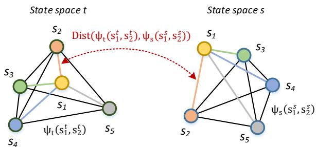  
Figure 4. Illustration of the distance between state topology in different latent spaces. $\psi ^ { m } ( \cdot )$ and $\psi ^ { o } ( \cdot )$ denote the similarity function of states.

$$
\mathcal { L } _ { c r i t i c } = \left( Q ( \mathbf { s } _ { t } , a _ { t } ) - y ( r _ { t } , \mathbf { s } _ { t + 1 } ) \right) ^ { 2 } ,\tag{4}
$$

where the TD target is given by

$$
y ( r _ { t } , \mathbf { s } _ { t + 1 } ) = r _ { t } + \gamma ( \bar { Q } ( \mathbf { s } _ { t + 1 } , \hat { a } _ { t + 1 } ) - \alpha _ { r } \log \pi ( \hat { a } _ { t + 1 } | \mathbf { s } _ { t + 1 } ) ) .\tag{5}
$$

$\bar { Q }$ is the target critic by moving average, and $\pi ( \hat { a } _ { t + 1 } | \mathbf { s } _ { t + 1 } )$ is the policy distribution predicted by the actor head. $\alpha _ { r }$ is the temperature parameter in SAC. $\hat { a } _ { t + 1 } \sim \pi \bigl ( \cdot | \mathbf { s } _ { t + 1 } \bigr )$ . The actor learns to generate the action that maximizes the $\mathrm { Q } \mathrm { - }$ value predicted by the critic,

$$
\begin{array} { r } { \mathcal { L } _ { a c t o r } = \alpha _ { r } \log \pi ( \hat { a } _ { t } | \mathbf { s } _ { t } ) - Q ( \mathbf { s } _ { t } , \hat { a } _ { t } ) . } \end{array}\tag{6}
$$

By jointly training the adaptor $\beta$ with the critic $h _ { c }$ and actor $h _ { a }$ , the information of long-term expected returns will be efficiently learned to the adaptor, resulting in a better state abstraction for the control task.

## 3.3. Topology Distilled Transferring

Topology of abstracted states. Since the information of expected returns is stably captured by the momentum adaptor $f ^ { m }$ , the core issue is how to transfer that knowledge into the online heavy-optimizable main encoder $f ^ { o }$ , making its representation more adaptive to policy learning. To this end, we introduce a teacher-student distillation manner where the momentum adaptor encoder $f ^ { m } ( \cdot ; \theta ^ { m } , \beta )$ and the online main encoder $f ^ { o } ( \cdot ; \theta ^ { o } )$ are considered as the teacher and student, respectively. Learning state abstraction for control is to project the observed states into a latent space, where the adjacency among states is consistent with the transitions in the real environment. For instance, the states near the same time-step in the real environment should also be adjacent in the feature space. Hence, we transfer the capability of state abstraction by distillation of the adjacency, i.e., topological relation in the latent state space. To this end, we first define topological relation $\mathcal { T } ( S )$ in the state space $S$ as the set of similarity between every state pairs $( \mathbf { s } _ { i } , \mathbf { s } _ { j } )$ in the data,

$$
{ \cal T } ( S ) = \{ \psi ( \mathbf { s } _ { i } , \mathbf { s } _ { j } ) | ( \mathbf { s } _ { i } , \mathbf { s } _ { j } ) \in S \}\tag{7}
$$

where $\psi ( \mathbf { s } _ { i } , \mathbf { s } _ { j } )$ denotes the similarity function of states. This set of similarities reveals the structural information of the state space, thus preserving the representation capability of the states. Our objective is to minimize the distance between the teacher’s topological relation $\mathcal { T } ( S ^ { m } )$ and the student’s $\mathcal { T } ( S ^ { o } )$ , as illustrated in Fig. 4,

$$
\begin{array} { r l } & { \theta ^ { m * } = \underset { \theta ^ { m } } { \arg \operatorname* { m i n } } D _ { \mathcal { T } } ( \mathcal { T } ( S ^ { m } ) , \mathcal { T } ( S ^ { o } ) ) } \\ & { \quad \quad = \underset { \theta ^ { m } } { \arg \operatorname* { m i n } } \mathbb { E } _ { \mathbf { o } _ { i } , \mathbf { o } _ { j } \sim \mathcal { B } } \left[ \mathrm { D i s t } \left( \psi ^ { m } ( \mathbf { s } _ { i } ^ { m } , \mathbf { s } _ { j } ^ { m } ) , \psi ^ { o } ( \mathbf { s } _ { i } ^ { o } , \mathbf { s } _ { j } ^ { o } ) \right) \right] . } \end{array}\tag{8}
$$

$s _ { i } ^ { m } = f ^ { m } ( o _ { i } | \theta ^ { m } , \beta ) , s _ { i } ^ { o } = f ^ { o } ( o _ { i } | \theta ^ { o } ) , \psi ^ { m } ( \cdot ) , \psi ^ { o } ( \cdot )$ are the similarity functions among states of similarity functions among states of $S ^ { m } , S ^ { o }$ , respectively. , respectively.

Topological distillation. Here we introduce the process of topological distillation in detail. Given a batch of observations $\left\{ \mathbf { o } _ { t } \right\}$ , we encode them to latent states $\{ \mathbf { s } _ { t } ^ { m } \}$ and $\left\{ \mathbf { s } _ { t } ^ { o } \right\}$ with the momentum adaptor encoder $f ^ { m } ( \cdot ; \theta ^ { m } , \beta )$ and the online main encoder $f ^ { o } ( \cdot ; \theta ^ { o } )$ , respectively. In this paper, we suppose the states are abstracted in a highdimensional Euclidean space, and use L2 distance as the similarity function $\psi ^ { m } ( \cdot ) = \| \cdot \| ^ { 2 }$ for the teacher. Then the topological relation within a batch is formulated as an adjacent matrix of the state features from the teacher, referring to $\mathbf { A } ^ { m } \in \mathbb { R } ^ { N \times N }$ . N is the batch size. ${ \bf A } _ { [ i , j ] } ^ { m } = { \bf \Phi }$ $\psi ^ { m } ( \mathbf { s } _ { i } ^ { m } , \mathbf { s } _ { j } ^ { m } ) = \| \mathbf { s } _ { i } ^ { m } - \mathbf { s } _ { j } ^ { m } \| ^ { 2 }$ , where $[ i , j ]$ denotes the i-th row and the j-th column in the matrix $\mathbf { A } ^ { m }$ . Moreover, due to the unknown scale of the latent state, the matrix is normalized by its average value as $\| \mathbf { A } ^ { m } \|$ ,

$$
\| \mathbf { A } ^ { m } \| _ { [ i , j ] } = \mathbf { A } _ { [ i , j ] } ^ { m } / ( \frac { 1 } { N ^ { 2 } } \sum _ { m , n } \mathbf { A } _ { [ m , n ] } ^ { m } ) .\tag{9}
$$

However, directly minimizing the distance between topological relations with the same similarity function $\psi ^ { o }$ as $\psi ^ { m }$ will prevent the student online encoder from other basic discrimination. To flexibly distill knowledge and avoid disturbing the basic representation, the similarity function of the student’s state space is defined by the $L 2$ distance after a linear transformation $\phi$ with weight W,

$$
\psi ^ { o } ( \mathbf { s } _ { i } ^ { o } , \mathbf { s } _ { j } ^ { o } ) = \| \phi ( \mathbf { s } _ { i } ^ { o } ) - \phi ( \mathbf { s } _ { j } ^ { o } ) \| ^ { 2 } = \| \mathbf { W } ^ { T } \mathbf { s } _ { i } ^ { o } - \mathbf { W } ^ { T } \mathbf { s } _ { j } ^ { o } \| ^ { 2 } .\tag{10}
$$

And the intra-batch adjacent matrix of the online encoder’s state space is computed as $\mathbf { A } ^ { o }$ , where ${ \bf A } _ { [ i , j ] } ^ { o } = \psi ^ { o } ( { \bf s } _ { i } ^ { o } , { \bf s } _ { j } ^ { o } )$ Similar normalization as in Eq. 9 is also performed to $\check { \mathbf { A } ^ { o } }$ referring to $\| \mathbf { A } ^ { o } \|$ . We distill the information of long-term expected returns from $\mathbf { s } ^ { m }$ to $\mathbf { s } ^ { o }$ by minimizing the L2 distance between their intra-batch similarity matrices $\mathbf { A } ^ { m }$ and $\mathbf { A } ^ { o } .$ . The transferring loss is defined by

$$
\mathcal { L } _ { t r a n s } = \frac { 1 } { N ^ { 2 } } \sum _ { ( i , j ) \in [ 1 , N ] } \mathrm { D i s t } ( \mathbf { A } _ { [ i , j ] } ^ { m } , \mathbf { A } _ { [ i , j ] } ^ { o } ) ,\tag{11}
$$

where $\mathrm { D i s t } ( u , v ) = \operatorname* { m a x } \left( ( u - v ) ^ { 2 } - \epsilon , 0 \right)$ . Note that ϵ is a small loose factor, making the distillation learning more stable to converge.

Dynamic prediction. Although the online encoder indirectly learns the long-term expected returns by the above distillation, its potential in representation capability is far from being developed. To this end, the online encoder is learned to capture other basic characters including environment dynamics as well as visual perception by using additional auxiliary tasks. As illustrated in Fig. 3, the predicted states $\mathbf { s } _ { t } ^ { o }$ are conditioned on three auxiliary heads: a reward predictive head $\mathcal { R } ,$ a state predictive head $\mathcal { P }$ and an observation decoder head G. Taking the current states $\mathbf { s } _ { t } ^ { o }$ and actions $a _ { t }$ as inputs, the $\mathcal { R }$ and $\mathcal { P }$ aim to predict the reward $\mathcal { R } ( \mathbf { s } _ { t } ^ { o } , a _ { t } )$ and next state $\mathcal { P } ( \mathbf { s } _ { t } ^ { o } , a _ { t } )$ , and thus learn a latent state space of which dynamic is consistent with the environment. Dynamic predictive loss is defined as

$$
\begin{array} { r l } & { \mathcal { L } _ { d y n a m i c } = \mathcal { L } _ { r e w a r d } + \mathcal { L } _ { s t a t e } } \\ & { \quad \quad \quad \quad = D _ { r } ( \mathcal { R } ( \mathbf { s } _ { t } ^ { o } , a _ { t } ) , r _ { t } ) + D _ { s } ( \mathcal { P } ( \mathbf { s } _ { t } ^ { o } , a _ { t } ) , \mathbf { s } _ { t + 1 } ^ { o } ) ) } \\ & { \quad \quad \quad \quad = ( \mathcal { R } ( \mathbf { s } _ { t } ^ { o } , a _ { t } ) - r _ { t } ) ^ { 2 } + \| \mathcal { P } ( \mathbf { s } _ { t } ^ { o } , a _ { t } ) - \mathbf { s } _ { t + 1 } ^ { o } ) \| ^ { 2 } . } \end{array}\tag{12}
$$

To guarantee temporal capacity, the decoder $\mathcal { G }$ is trained to predict the next observation with the predicted next state $\hat { s } _ { t + 1 } ^ { o } = \mathscr { P } ( \mathbf { s } _ { t } ^ { o } , a _ { t } )$ . The decoding loss is defined as

$$
\begin{array} { r l } {  { \mathcal { L } _ { d e c } = D _ { o } \bigl ( \hat { \mathbf { o } } _ { t + 1 } , \mathbf { o } _ { t + 1 } \bigr ) } \quad } & { } \\ & { = D _ { o } \bigl ( \mathcal { G } \bigl ( \mathcal { P } ( \mathbf { s } _ { t } ^ { o } , \mathbf { a } _ { t } ) \bigr ) , \mathbf { o } _ { t + 1 } \bigr ) } \\ & { = \displaystyle \frac { 1 } { H W } \sum _ { h , w = 1 } ^ { H , W } ( \mathcal { G } ( \mathcal { P } ( \mathbf { s } _ { t } ^ { o } , a _ { t } ) ) ^ { [ h , w ] } - \mathbf { o } _ { t + 1 } ^ { [ h , w ] } ) ^ { 2 } . } \end{array}\tag{13}
$$

Then the overall loss of the topology distilled transferring is formulated by

$$
\mathcal { L } _ { e n c o d e r } = \mathcal { L } _ { t r a n s } + \mathcal { L } _ { d y n a m i c } + \mathcal { L } _ { o b s } ,\tag{14}
$$

where the online main encoder and auxiliary heads are jointly learned with the adaptor frozen.

## 3.4. Greedy Bootstrapping for AIC

In most deep reinforcement learning approaches, the representation module and policy module are trained in a simultaneous manner. That is, while the policy model is trained from the reinforcement signals the encoder is also simultaneously changing. This phenomenon will disturb policy improvement due to the drifting of state representation. To tackle this problem, this section presents a greedy bootstrapping framework for AIC, which consists of two alternative training stages for the representation and policy, respectively. In each representation stage, the encoder keeps training until convergence, and so does the policy in the other stage. The framework is described in detail in Algorithm 1.

Algorithm 1: Greedy Bootstrapping for AIC   
1 Initialize the replay buffer B with random episodes.   
2 while not converged do   
3 // Representation learning   
4 Build data-loader with the replay buffer B.   
5 for update step c=1...C do   
6 Draw next batch of transitions $\left\{ \left( \mathbf { o } _ { t } , a _ { t } , r _ { t } , \mathbf { o } _ { t + 1 } \right) \right\}$   
7 //Momentum Adaptor Tuning   
8 Update momentum encoder by moving average.   
9 Update adaptor by optimizing Eq. 4.   
10 //Topology Distilled Transferring   
11 Update online encoder by optimizing Eq. 14.   
12 end   
13 // Policy learning (encoder frozen)   
14 for update step $c _ { p } { = } I { \ldots } S$ do   
15 Draw transition sequences $\left\{ \left( \mathbf { o } _ { t } , a _ { t } , r _ { t } , \mathbf { o } _ { t + 1 } \right) \right\} \sim \mathcal { B } .$   
16 Update critic and actor parameters.   
17 end   
18 Add new experiences to the replay buffer B.   
19 end

Greedy representation learning. Over the latest collected replay buffer, the encoder is trained by iterating all the images in each epoch. Different from sampling a random batch in each iteration like most other methods, our ergodic sampling strategy brings stable training without ignorance of any crucial samples. In each stage of representation learning, the encoder is trained for several epochs until it is converged.

Greedy policy learning. With the main encoder trained sufficiently, the policy is learned continuously by freezing the encoder and conditioned on its output state. Beneficial from the stable and discriminative latent state, the critic and actor are trained efficiently from the reinforcement signal by SAC algorithms and tend to produce better behaviors. The policy is learned continuously for enough steps and then used to interact with the environment for new trajectories.

## 4. Experiment

## 4.1. Environments Setup

Benchmarks. We evaluate our method on two reinforcement learning environments with complex and realistic observations, i.e., CARLA [5] and Vizdoom [22], with continuous and discrete action space, respectively. Both tasks are developed in 3D physical scenes with a complex state space, which calls for deeper visual encoders with stronger representation capability.

Implementation details. We adopt ResNet-18 as the backbone of the visual encoder. Before the last pooling layer, the feature map is flattened and then projected into 1024-dim state features with a linear layer and layer norm operation. The momentum factor τ is set to 0.05. We use Adam to optimize the parameters of all modules in our approach.

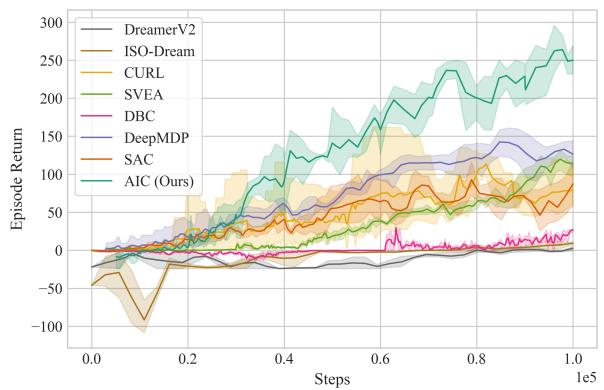  
Figure 5. Comparison with other baseline approaches on the CARLA environment.

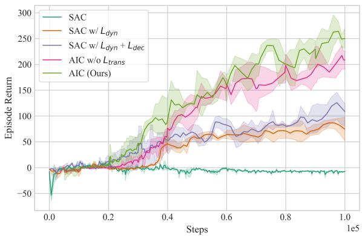  
Figure 6. Ablation Study of our method using ResNet-18 as the visual encoder on the CARLA environment.

## 4.2. CARLA Autonomous Driving Environment

Experimental settings. In the autonomous driving task, we construct a highway driving scenario with 20 other vehicles of different models using the CARLA simulator. We use five cameras on the roof of the ego-vehicle, each with a 60-degree view and obtaining images of $8 4 \times 8 4$ pixels. We concatenate them together for observation of 84 × 420 pixels. We stack the last three frames as the inputs. Following DBC [40], the reward is formulated as $r _ { t } = v _ { e q o } ^ { T } \hat { u } _ { h } \cdot \Delta t - \xi _ { 1 } \cdot \mathbb { I } - \xi _ { 2 } \cdot | s t e e r |$ , wherev ${ \stackrel { \prime } { e } } g o$ is the velocity vector of the ego-vehicle, projected onto the highway’s unit vector $\hat { u } _ { h }$ , and multiplied by time discretization $\Delta t \ : = \ : 0 . 0 5$ to measure highway progression in meters. Impulse $\mathbb { I } \in \mathbb { R } ^ { + }$ is caused by collisions, and a steering penalty steer $\in [ - 1 , 1 ]$ facilitates lane-keeping. The hyperparameters $\xi _ { 1 }$ amd $\xi _ { 2 }$ are set to $1 0 ^ { - 4 }$ and 1, respectively. Comparison with other methods. We compare our approach with seven baselines, including joint representation learning methods, i.e., CURL [27], SVEA [16], Deep-MDP [7], DBC [40]; representation decoupled methods, i.e., DreamerV2 [13], Iso-Dream [32], and the baseline SAC [10]. As shown in Fig. 5, our AIC outperforms all baselines by large margins. Compared with joint representation learning, the superior performance can be attributed to that our method stably learns a more discriminative state abstraction with deeper architectures, while avoiding the oscillating self-overfitting. Representation decoupled methods train encoders only on auxiliary tasks without TD losses and thus usually require more time to converge. However, AIC effectively learns the long-term expected returns by interaction with the light-optimizable momentum adaptor encoder, resulting in faster convergence.

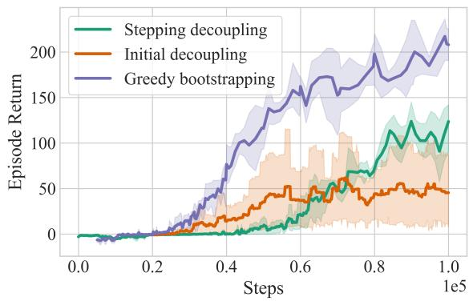  
Figure 7. Comparison of other representation-decoupled methods on the CARLA environment.

Ablation Study. We conduct ablation studies to validate the effectiveness of the proposed topology distilled transferring and the greedy bootstrapping strategy. All the experiments train the ResNet-18 as the encoder. Fig. 6 shows that SAC fails to learn an effective policy with the heavyoptimizable encoder since the state features are deteriorated by the serious oscillating self-overfitting. By applying the dynamic loss and decoder loss, the deterioration is slightly alleviated, since the encoder is encouraged to learn the inherent information of environment dynamics by the targets which are more stable than TD. However, disturbed by the oscillating gradients of the TD loss, the encoder is still hard to converge. Compared to it, the greedy bootstrapping strategy achieves significant improvement, denoted as AIC $w \backslash o \ L _ { t r a n s }$ , because it interrupts the backward propagation of the unstable gradient and simultaneously it trains the encoder and policy stably and sufficiently. AIC distinctly outperforms the $A I C \ w \backslash o \ L _ { t r a n s }$ due to the topology distilled transferring, which additionally incorporates the longterm expected return information into the encoder, making it more adaptive for the downstream controlling.

Comparison with other decoupling methods. To further evaluate the greedy bootstrapping framework, we compare it with other two typical methods that decouple representation learning from RL. Initial decoupling first collects a set of transitions using a random policy and then pretrains the encoder with auxiliary tasks as in Eq. 12 and 13. Afterward, the policy is trained by SAC with the encoder frozen. As shown in Fig. 7, the initial decoupling method performs high-variance results because the performance significantly depends on whether the distribution of the collected pretraining data is similar to those from a learned policy. Stepping decoupling learns the encoder and the policy step by step, respectively. The encoder is trained by transitions from the same data distribution as the policy. However, since the encoder keeps updating during policy learning, the latent state space suffers from unstable drifting, making it difficult to learn policy from the volatile state abstraction. The greedy bootstrapping strategy surpasses both two approaches because it guarantees a determined latent state space that is conducive to the inductive learning of policy. Moreover, it learns the encoder by traversing all the transitions in the replay buffer, prevented from ignorance of some critical images or overfitting to parts of data.

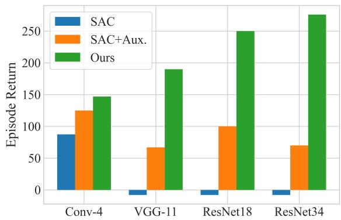  
Figure 8. Comparison with different architectures of the encoder on the CARLA environment.

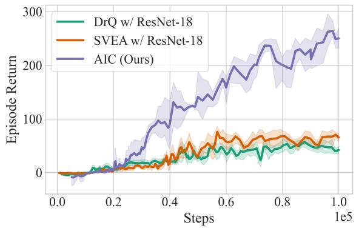  
Figure 9. Comparison of other stabilizing methods using ResNet-18 on the CARLA environment.

Table 1. Comparison with other methods using ResNet-18 on Medikit of Vizdoom environment.
<table><tr><td></td><td>DQN (Baseline)</td><td>DrQ</td><td>SVEA</td><td>CURL</td><td>DeepMDP</td><td>AIC (Ours)</td></tr><tr><td>Episode Returns (mean/std)</td><td>888±584</td><td>1361 ± 1004</td><td>435±185</td><td>408±203</td><td>1026±807</td><td>1686±1283</td></tr><tr><td>Min returns</td><td>252</td><td>252</td><td>79</td><td>24</td><td>284</td><td>56</td></tr><tr><td>Max returns</td><td>2444</td><td>4200</td><td>1008</td><td>1136</td><td>3710</td><td>4800</td></tr><tr><td>Survival Time (mean/std)</td><td>64 ±26</td><td>85±43</td><td>45± 8</td><td>44±9</td><td>72±37</td><td>96±53</td></tr><tr><td>Min Time</td><td>26</td><td>26</td><td>27</td><td>23</td><td>39</td><td>26</td></tr><tr><td>Max Time</td><td>135</td><td>210</td><td>68</td><td>74</td><td>191</td><td>210</td></tr></table>

Improvements on different encoders. We evaluate our approach with different architectures as the visual encoder, including a light CNN of 4-layer convolution (Conv-4), and three heavyweight models, i.e., VGG-11, ResNet-18, and ResNet34. For each architecture, we conduct three experiments using SAC, SAC with auxiliary tasks (dynamic loss and decoder loss as in Eq. 12 and 13), and our AIC approach. The comparison is illustrated in Fig. 8. Firstly, all heavyweight modelsfail to learn effective policies using SAC, where only TD loss is used. The results indicate the oscillating self-overfitting is consistent for heavy models. Secondly, auxiliary tasks improve the performance of SAC with heavyweight encoders, but they are still inferior to the light encoder like Conv-4. The oscillating self-overfitting seriously prevents the encoder from sufficient learning. Finally, AIC consistently improves the performance with all heavy encoders by large margins, as well as the light encoder ofConv-4. It shows a consistent rank of performance that these architectures have achieved in supervised learning tasks. It demonstrates that our method makes full use of the representation capability of heavyweight visual encoders through interactive cooperation.

Comparison with stabilizing methods. To evaluate AIC for stabilizing the training of heavy-optimizable encoders, we compare it with SVEA and DrQ using ResNet-18 as the backbone. As shown in Fig. 9, both two methods perform not well, since the increase of parameters significantly exacerbates the challenge of stabilizing. However, AIC exceeds them by large margins, indicating its capability to stably learn heavy models.

Qualitative analysis. In order to evaluate the effectiveness of our approach in alleviating the oscillating self-overfitting, we visualize the updating trajectories of the encoder parameters over a set of training steps by TSNE. We use ResNet-18 as the encoder backbone and choose the weights of the last convolution layer for visualization. The comparison between DeepMDP with the TD loss and AIC is shown in Fig. 10, where each point represents the parameters in a step and the color changes from deep to light over the training steps. As we can see, the parameters with the TD loss of the Deep-MDP agent suffer from significant oscillation during training. Different from that, the parameters of AIC show a distinct optimizing direction and only have slight oscillation in a short time. The qualitative results demonstrate AIC effectively alleviates the oscillating self-overfitting for the heavyoptimizable encoder in visual reinforcement learning.

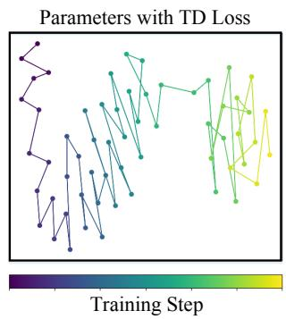

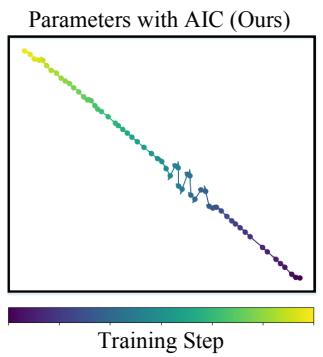  
Figure 10. Parameter updating trajectories of the ResNet-18 encoder over training steps.

## 4.3. Vizdoom Medikit Environment

Experimental settings. Vizdoom is based on the firstperson perspective video game in a semi-realistic 3D world. We use the difficult medikit collecting scenario, where the agent is spawned in a random spot of a maze with an acid surface, which slowly, but constantly, takes away the agent’s life. The agent needs to collect medikits and avoid blue vials with poison, both of which appear in random places during the episode. In each step, the agent is allowed to move (forward/backward), or turn (left/right). The reward is formulated as $r _ { t } = 1 - \xi _ { 3 } \cdot E _ { m } - \xi _ { 4 } \cdot E _ { v } - \xi _ { 5 } \cdot E _ { d }$ , where $E _ { m } , E _ { v } , E _ { d }$ denote the events of getting a medikit, a vial and to death, respectively. $\xi _ { 3 } = \xi _ { 4 } = \xi _ { 5 } = 1 0 0$

Superior performance with heavy encoders. To evaluate our approach, especially with deep deep encoders, we compare it with five methods. All of them use ResNet-18 as backbones. Since the Vizdoom is of discrete action space, we adopt DQN as the baseline. As shown in Table 1, AIC performs superiorly to the compared methods. CURL and SVEA perform poorly, since the observations of such a finegrained collecting task of first-person perspective are sensitive to random cropping of CURL. And the random conv of

SVEA is not applicable for the low-contrast images in this scenario. However, AIC is able to effectively train heavy models under different conditions.

## 5. Conclusion

In this paper, we investigate the phenomenon of oscillating self-overfitting which results in the deterioration of RL when training heavy-optimizable encoders. To alleviate this problem, we propose a novel asymmetric interactive cooperation approach. Through interaction between a main heavy-optimizable encoder and a supportive lightoptimizable encoder, both advantages of them are integrated including the highly discriminative capability and the training stability. We further present a greedy bootstrapping framework for further stability. Experimental results of CARLA and Vizdoom show that AIC achieves competitive performance over complex and realistic environments.

## Acknowledgements

This work is partially supported by grants from the Key-Area Research and Development Program of Guangdong Province under contact No. 2020B0101380001 and grants from the National Natural Science Foundation of China under contract No. 62027804, No. 61825101, No. 62088102 and No. 62202010. The computing resources of Pengcheng Cloudbrain are used in this research.

## References

[1] Homanga Bharadhwaj, Mohammad Babaeizadeh, Dumitru Erhan, and Sergey Levine. Information prioritization through empowerment in visual model-based rl. arXiv preprint arXiv:2204.08585, 2022.

[2] Pablo Samuel Castro. Scalable methods for computing state similarity in deterministic markov decision processes. In Proceedings of the AAAI Conference on Artificial Intelligence, volume 34, pages 10069–10076, 2020.

[3] Edoardo Cetin, Philip J Ball, Steve Roberts, and Oya Celiktutan. Stabilizing off-policy deep reinforcement learning from pixels. arXiv preprint arXiv:2207.00986, 2022.

[4] Lili Chen, Kevin Lu, Aravind Rajeswaran, Kimin Lee, Aditya Grover, Misha Laskin, Pieter Abbeel, Aravind Srinivas, and Igor Mordatch. Decision transformer: Reinforcement learning via sequence modeling. Advances in neural information processing systems, 34:15084–15097, 2021.

[5] Alexey Dosovitskiy, German Ros, Felipe Codevilla, Antonio Lopez, and Vladlen Koltun. Carla: An open urban driving simulator. In Conference on robot learning, pages 1–16. PMLR, 2017.

[6] Chelsea Finn and Sergey Levine. Deep visual foresight for planning robot motion. In 2017 IEEE International Conference on Robotics and Automation (ICRA), pages 2786–2793. IEEE, 2017.

[7] Carles Gelada, Saurabh Kumar, Jacob Buckman, Ofir Nachum, and Marc G Bellemare. Deepmdp: Learning

continuous latent space models for representation learning. In International Conference on Machine Learning, pages 2170–2179. PMLR, 2019.

[8] David Ha and Jurgen Schmidhuber. Recurrent world mod-¨ els facilitate policy evolution. In S. Bengio, H. Wallach, H. Larochelle, K. Grauman, N. Cesa-Bianchi, and R. Garnett, editors, Advances in Neural Information Processing Systems, volume 31. Curran Associates, Inc., 2018.

[9] David Ha and Jurgen Schmidhuber. World models.¨ arXiv preprint arXiv:1803.10122, 2018.

[10] Tuomas Haarnoja, Aurick Zhou, Kristian Hartikainen, George Tucker, Sehoon Ha, Jie Tan, Vikash Kumar, Henry Zhu, Abhishek Gupta, Pieter Abbeel, et al. Soft actor-critic algorithms and applications. arXiv preprint arXiv:1812.05905, 2018.

[11] Danijar Hafner, Timothy Lillicrap, Jimmy Ba, and Mohammad Norouzi. Dream to control: Learning behaviors by latent imagination. arXiv preprint arXiv:1912.01603, 2019.

[12] Danijar Hafner, Timothy Lillicrap, Ian Fischer, Ruben Villegas, David Ha, Honglak Lee, and James Davidson. Learning latent dynamics for planning from pixels. In International conference on machine learning, pages 2555–2565. PMLR, 2019.

[13] Danijar Hafner, Timothy Lillicrap, Mohammad Norouzi, and Jimmy Ba. Mastering atari with discrete world models. arXiv preprint arXiv:2010.02193, 2020.

[14] Danijar Hafner, Jurgis Pasukonis, Jimmy Ba, and Timothy Lillicrap. Mastering diverse domains through world models. arXiv preprint arXiv:2301.04104, 2023.

[15] Nicklas Hansen, Rishabh Jangir, Yu Sun, Guillem Alenya,\` Pieter Abbeel, Alexei A Efros, Lerrel Pinto, and Xiaolong Wang. Self-supervised policy adaptation during deployment. arXiv preprint arXiv:2007.04309, 2020.

[16] Nicklas Hansen, Hao Su, and Xiaolong Wang. Stabilizing deep q-learning with convnets and vision transformers under data augmentation. 2021.

[17] Nicklas Hansen and Xiaolong Wang. Generalization in reinforcement learning by soft data augmentation. In 2021 IEEE International Conference on Robotics and Automation (ICRA), pages 13611–13617. IEEE, 2021.

[18] Kaiming He, Xiangyu Zhang, Shaoqing Ren, and Jian Sun. Deep residual learning for image recognition. In Proceedings of the IEEE conference on computer vision and pattern recognition, pages 770–778, 2016.

[19] Max Jaderberg, Volodymyr Mnih, Wojciech Marian Czarnecki, Tom Schaul, Joel Z Leibo, David Silver, and Koray Kavukcuoglu. Reinforcement learning with unsupervised auxiliary tasks. arXiv preprint arXiv:1611.05397, 2016.

[20] Michael Janner, Qiyang Li, and Sergey Levine. Offline reinforcement learning as one big sequence modeling problem. Advances in neural information processing systems, 34:1273–1286, 2021.

[21] Lukasz Kaiser, Mohammad Babaeizadeh, Piotr Milos, Blazej Osinski, Roy H Campbell, Konrad Czechowski, Dumitru Erhan, Chelsea Finn, Piotr Kozakowski, Sergey Levine, et al. Model-based reinforcement learning for atari. arXiv preprint arXiv:1903.00374, 2019.

[22] Michał Kempka, Marek Wydmuch, Grzegorz Runc, Jakub Toczek, and Wojciech Jaskowski. Vizdoom: A doom-based´ ai research platform for visual reinforcement learning. In 2016 IEEE conference on computational intelligence and games (CIG), pages 1–8. IEEE, 2016.

[23] Ilya Kostrikov, Denis Yarats, and Rob Fergus. Image augmentation is all you need: Regularizing deep reinforcement learning from pixels. arXiv preprint arXiv:2004.13649, 2020.

[24] Alex Krizhevsky, Geoffrey Hinton, et al. Learning multiple layers of features from tiny images. 2009.

[25] Aviral Kumar, Rishabh Agarwal, Dibya Ghosh, and Sergey Levine. Implicit under-parameterization inhibits dataefficient deep reinforcement learning. arXiv preprint arXiv:2010.14498, 2020.

[26] Misha Laskin, Kimin Lee, Adam Stooke, Lerrel Pinto, Pieter Abbeel, and Aravind Srinivas. Reinforcement learning with augmented data. Advances in neural information processing systems, 33:19884–19895, 2020.

[27] Michael Laskin, Aravind Srinivas, and Pieter Abbeel. Curl: Contrastive unsupervised representations for reinforcement learning. In International Conference on Machine Learning, pages 5639–5650. PMLR, 2020.

[28] Alex X. Lee, Anusha Nagabandi, Pieter Abbeel, and Sergey Levine. Stochastic latent actor-critic: Deep reinforcement learning with a latent variable model. In H. Larochelle, M. Ranzato, R. Hadsell, M.F. Balcan, and H. Lin, editors, Advances in Neural Information Processing Systems, volume 33, pages 741–752. Curran Associates, Inc., 2020.

[29] Sergey Levine, Chelsea Finn, Trevor Darrell, and Pieter Abbeel. End-to-end training of deep visuomotor policies. The Journal of Machine Learning Research, 17(1):1334– 1373, 2016.

[30] Masashi Okada and Tadahiro Taniguchi. Dreaming: Modelbased reinforcement learning by latent imagination without reconstruction. In 2021 IEEE International Conference on Robotics and Automation (ICRA), pages 4209–4215. IEEE, 2021.

[31] Kei Ota, Devesh K Jha, and Asako Kanezaki. Training larger networks for deep reinforcement learning. arXiv preprint arXiv:2102.07920, 2021.

[32] Minting Pan, Xiangming Zhu, Yunbo Wang, and Xiaokang Yang. Iso-dream: Isolating and leveraging noncontrollable visual dynamics in world models. In Advances in Neural Information Processing Systems.

[33] Danilo Jimenez Rezende, Shakir Mohamed, and Daan Wierstra. Stochastic backpropagation and approximate inference in deep generative models. In International conference on machine learning, pages 1278–1286. PMLR, 2014.

[34] Ramanan Sekar, Oleh Rybkin, Kostas Daniilidis, Pieter Abbeel, Danijar Hafner, and Deepak Pathak. Planning to explore via self-supervised world models. In International Conference on Machine Learning, pages 8583–8592. PMLR, 2020.

[35] Evan Shelhamer, Parsa Mahmoudieh, Max Argus, and Trevor Darrell. Loss is its own reward: Self-supervision for reinforcement learning. arXiv preprint arXiv:1612.07307, 2016.

[36] Oriol Vinyals, Igor Babuschkin, Wojciech M Czarnecki, Michael Mathieu, Andrew Dudzik, Junyoung Chung,¨ David H Choi, Richard Powell, Timo Ewalds, Petko Georgiev, et al. Grandmaster level in starcraft ii using multiagent reinforcement learning. Nature, 575(7782):350–354, 2019.

[37] Manuel Watter, Jost Springenberg, Joschka Boedecker, and Martin Riedmiller. Embed to control: A locally linear latent dynamics model for control from raw images. Advances in neural information processing systems, 28, 2015.

[38] Denis Yarats, Amy Zhang, Ilya Kostrikov, Brandon Amos, Joelle Pineau, and Rob Fergus. Improving sample efficiency in model-free reinforcement learning from images. In Proceedings of the AAAI Conference on Artificial Intelligence, volume 35, pages 10674–10681, 2021.

[39] Tao Yu, Zhizheng Zhang, Cuiling Lan, Yan Lu, and Zhibo Chen. Mask-based latent reconstruction for reinforcement learning. In Advances in Neural Information Processing Systems.

[40] Amy Zhang, Rowan McAllister, Roberto Calandra, Yarin Gal, and Sergey Levine. Learning invariant representations for reinforcement learning without reconstruction. arXiv preprint arXiv:2006.10742, 2020.