# Studying How to Efficiently and Effectively Guide Models with Explanations

Sukrut Rao⇤, Moritz Bohle¨ ⇤, Amin Parchami-Araghi, Bernt Schiele Max Planck Institute for Informatics, Saarland Informatics Campus, Saarbrucken, Germany ¨ sukrut.rao,mboehle,mparcham,schiele @mpi-inf.mpg.de

## Abstract

Despite being highly performant, deep neural networks might base their decisions on features that spuriously correlate with the provided labels, thus hurting generalization. To mitigate this, ‘model guidance’ has recently gained popularity, i.e. the idea of regularizing the models’ explanations to ensure that they are “right for the right reasons” [49]. While various techniques to achieve such model guidance have been proposed, experimental validation of these approaches has thus far been limited to relatively simple and / or synthetic datasets. To better understand the effectiveness of the various design choices that have been explored in the context of model guidance, in this work we conduct an in-depth evaluation across various loss functions, attribution methods, models, and ‘guidance depths’ on the PASCAL VOC 2007 and MS COCO 2014 datasets. As annotation costs for model guidance can limit its applicability, we also place a particular focus on efficiency. Specifically, we guide the models via bounding box annotations, which are much cheaper to obtain than the commonly used segmentation masks, and evaluate the robustness of model guidance under limited (e.g. with only 1% of annotated images) or overly coarse annotations. Further, we propose using the EPG score as an additional evaluation metric and loss function (‘Energy loss’). We show that optimizing for the Energy loss leads to models that exhibit a distinctfocus on object-specific features, despite only using bounding box annotations that also include background regions. Lastly, we show that such model guidance can improve generalization under distribution shifts. Code available at: https://github.com/sukrutrao/Model-Guidance

## 1. Introduction

Deep neural networks (DNNs) excel at learning predictive features that allow them to correctly classify a set of training images with ease. The features learnt on the training set, however, do not necessarily transfer to unseen images: i.e., instead of learning the actual class-relevant features, DNNs might memorize individual images (cf. [18]) or exploit spurious correlations in the training data (cf. [68]). For example, if bikes are highly correlated with people in the training data, a model might learn to associate the presence of a person in an image as positive evidence for a bike (e.g. Fig. 1a, col. 1, rows 1-2), which can limit how well it generalizes. Similarly, a bird classifier might rely on background features from the bird’s habitat, and fail to correctly classify in a different habitat (cf. Fig. 1b cols. 1-3 and [42]).

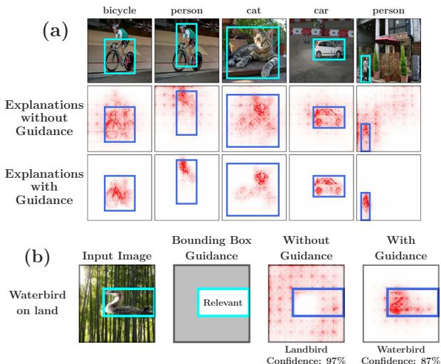  
Fig. 1: (a) Model guidance increases object focus. Models may rely on irrelevant background features or spurious correlations (e.g. presence of person provides positive evidence for bicycle, center row, col. 1). Guiding the model via bounding box annotations can mitigate this and consistently increases the focus on object features (bottom row). (b) Model guidance can improve accuracy. In the presence of spurious correlations in the training data, non-guided models might focus on the wrong features. In the example image in (b), the waterbird is incorrectly classified to be a landbird due to the background (col. 3). Guiding the model via bounding box annotation (as shown in col. 2), the model can be guided to focus on the bird features for classification (col. 4).

To detect such behaviour, recent advances in model interpretability have provided attribution methods (e.g. [53, 62, 57, 6]) to understand a model’s reasoning. These methods typically provide attention maps that highlight regions of importance in an input to explain the model’s decisions and can help identify incorrect reasoning such as reliance on spurious or irrelevant features, see for example Fig. 1b.

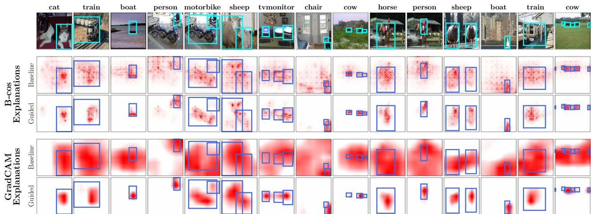  
Fig. 2: Qualitative results of model guidance. We show model-inherent B-cos explanations (input layer) of a B-cos ResNet-50 and GradCAM explanations (final layer) of a conventional ResNet-50 before (‘Standard’) and after optimization (‘Guided’) for images from the VOC test set, using our proposed Energy loss (Eq. (6)). Guiding the model via bounding box annotations consistently increases the focus on object features for both methods. Specifically, we find that background attributions are consistently suppressed in both cases.

As many attribution methods are in fact themselves differentiable (e.g. [57, 62, 53, 6]), recent work [49, 56, 24, 23, 66, 64] has explored the idea of using them to guide the models to make them “right for the right reasons” [49]. Specifically, models can be guided by jointly optimizing for correct classification as well as for attributing importance to regions deemed relevant by humans. This can help the model focus on the relevant features of a class, and correct errors in reasoning (Fig. 1b, col. 4). Such guidance has the added benefit of providing well-localized explanations that are thus easier to understand for end users (e.g. Fig. 2).

While model guidance has shown promising results, a detailed study of how to do this most effectively is crucially missing. In particular, model guidance has so far been studied for a limited set of attribution methods and models and usually on relatively simple and/or synthetic datasets; further, the evaluation settings between approaches can significantly differ, which makes a fair comparison difficult.

Therefore, in this work, we perform an in-depth evaluation of model guidance on large scale, real-world datasets, to better understand the effectiveness of a variety of design choices. Specifically, we evaluate model guidance along the following dimensions: the model architecture, the guidance depth1, the attribution method, and the loss function. In this context, we propose using the EPG score [67]—an evaluation metric that has thus far been used to evaluate the quality of attribution methods—as an additional loss function (which we call the Energy loss) as it is fully differentiable.

Further, as annotation costs can be a major hurdle for making model guidance practical, we place a particular focus on efficient guidance. Specifically, we use bounding boxes instead of semantic segmentation masks, and evaluate the robustness of guidance techniques under limited or overly coarse annotations to reduce data collection costs.

We find that our Energy loss lends itself well to those settings. On the one hand, it exhibits a high degree of robustness to limited or noisy bounding box annotations (cf. Figs. 10 and 12). On the other hand, despite the coarseness of bounding box guidance, it maintains a clear focus on object-specific features inside the bounding boxes, see Fig. 1a, row 3. In contrast, prior approaches often regularize for a uniform distribution of the attribution values inside the annotation masks, and thus tend to exhibit much lower attribution granularity (cf. Fig. 9).

Contributions. (1) We perform an in-depth evaluation of model guidance on challenging large scale, multi-label classification datasets (PASCAL VOC 2007 [16], MS COCO 2014 [34]), assessing the impact of attribution methods, model architectures, guidance depths, and loss functions. Further, we show that, despite being relatively coarse, bounding box supervision can provide sufficient guidance to the models whilst being much cheaper to obtain than semantic segmentation masks. (2) We propose using the Energy Pointing Game (EPG) score [67] as an alternative to the IoU metric for evaluating the effectiveness of such guidance and show that the EPG score constitutes a good loss function for model guidance, particularly when using bounding boxes. (3) We show that model guidance can be performed cost-effectively by using annotation masks that are noisy or are available for only a small fraction (e.g. 1%) of the training data. (4) We show through experiments on the Waterbirds-100 dataset [51, 42] that model guidance with a small number of annotations suffices to improve the model’s generalization under distribution shifts at test time.

## 2. Related Work

Attribution Methods [58, 60, 62, 57, 53, 67, 13, 30, 9, 43, 20, 70, 47, 12, 4] are often used to explain black-box models by generating heatmaps that highlight input regions important to the model’s decision. However, such methods are often not faithful to the model [1, 46, 31, 72, 2] and risk misleading users. Recent work proposes inherently interpretable models [8, 6] that address this by providing modelfaithful explanations by design. In our work, we use both popular post-hoc and model-inherent attribution methods to guide models and discuss their effectiveness.

Attribution Priors: Several approaches have been proposed for training better models by enforcing desirable properties on their attributions. These include enforcing consistency against augmentations [45, 44, 25], smoothness [15, 37, 32], separation of classes [71, 44, 61, 39, 59], or constraining the model’s attention [22, 3]. In contrast, in this work, we focus on providing explicit human guidance to the model using bounding box annotations. This constitutes more explicit guidance but allows fine-grained control over the model’s reasoning even with few annotations.

Model Guidance: In contrast to the indirect regularization effect achieved by attribution priors, various approaches have been proposed (cf. [21, 65]) to actively guide models by regularizing their attributions, for tasks such as classification [49, 24, 23, 48, 42, 26, 63, 36, 66, 64, 52, 55, 35, 56, 69, 17], segmentation [33], VQA [54, 63], and knowledge distillation [19]. The goal of such approaches is not only to improve performance, but also make sure that the model is “right for the right reasons” [49]. For classifiers, this typically involves jointly optimizing both for classification performance and localization to object features. While various benefits of model guidance have been reported, most prior work evaluate on simple datasets [49, 55, 24, 23] and, thus far, no common evaluation setting has emerged. Recently, [11] has extended model guidance to ImageNet, showing that its benefits can scale to large scale problems. In contrast to [11], who investigated one particular attribution method [10], our focus lies on a better understanding of the impact of the different design choices for model guidance.

To distill the most effective techniques for model guidance, in this work, we conduct an in-depth evaluation on challenging, commonly used real-world multi-label classification datasets (PASCAL VOC 2007, MS COCO 2014). Specifically, we perform a comprehensive comparison across multiple dimensions of interest: the loss function, the model architecture, the guidance depth, and the attribution method. For this, we evaluate the localization losses introduced in the closest related work, i.e. RRR [49], HAICS [56], and GRADIA [24]; additionally, we propose using the EPG metric [67] as a loss function and show that it has various desirable properties, in particular when guiding models via bounding box annotations.

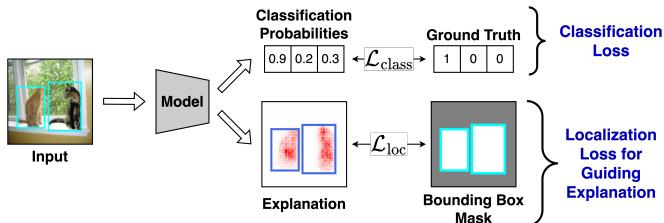  
Fig. 3: Model guidance overview. We jointly optimize for classification $( \mathcal { L } _ { \mathrm { c l a s s } } )$ and localization of attributions to human-annotated bounding boxes $( \mathcal { L } _ { \mathrm { l o c } } ) _ { \mathrm { \Omega } }$ , to guide the model to focus on object features. Various localization loss functions can be used, see Sec. 3.4.

Finally, model guidance has also been used to mitigate reliance on spurious features using language guidance [42], and we show that using a small number of coarse bounding box annotations can be similarly effective.

Evaluating Model Guidance: The benefits of model guidance have typically been shown via improvements in classification performance (e.g. [49, 48]) or an increase in IoU between object masks and attribution maps (e.g. [23, 33]). In addition to these metrics, we also evaluate on the EPG metric [67], which has thus far only been used to evaluate the quality of the attribution methods themselves. We further show that it lends itself well to being used as a guidance loss, as it places only minor constraints on the model, and, in contrast to the IoU metric, it is fully differentiable.

## 3. Guiding Models Using Attributions

In this section, we provide an overview of the model guidance approach that jointly optimizes for classification and localization (Sec. 3.1). Specifically, we describe the attribution methods (Sec. 3.2), metrics (Sec. 3.3), and localization loss functions (Sec. 3.4) that we evaluate in Sec. 5. In Sec. 3.5 we discuss our strategy to train for localization in the presence of multiple ground truth classes.

Notation: We consider a multi-label classification problem with K classes with $X \in \mathbb { R } ^ { C \times H \times W }$ the input image and $y \in \{ 0 , 1 \} ^ { K }$ the one-hot encoding of the image labels. With $A _ { k } \in \mathbb { R } ^ { \tilde { H } \times W }$ we denote an attribution map for a class k for X using a classifier $f ; A _ { k } ^ { + }$ denotes the positive component of the attributions, $\begin{array} { r } { \hat { A } _ { k } = \frac { A _ { k } } { \operatorname* { m a x } ( \mathrm { a b s } ( A _ { k } ) ) } } \end{array}$ normalized attributions, and $\begin{array} { r } { \hat { A } _ { k } ^ { + } = \frac { A _ { k } ^ { + } } { \operatorname* { m a x } ( A _ { k } ^ { + } ) } } \end{array}$ normalized positive attributions. Finally, $M _ { k } \in \{ 0 , 1 \} ^ { H \times W }$ denotes the binary mask for class k, which is given by the union of bounding boxes of all occurrences of class k in X.

## 3.1. Model Guidance Procedure

Following prior work (e.g. [49, 56, 24, 23]), the model is trained jointly for classification and localization (cf. Fig. 3):

$$
\mathcal { L } = \mathcal { L } _ { \mathrm { c l a s s } } + \lambda _ { \mathrm { l o c } } \mathcal { L } _ { \mathrm { l o c } } .\tag{1}
$$

I.e., the loss consists of a classification loss $( \mathcal { L } _ { \mathrm { c l a s s } } )$ , for which we use binary cross-entropy, and a localization loss

$( \mathcal { L } _ { \mathrm { l o c } } )$ , which we discuss in Sec. 3.4; here, the hyperparameter $\lambda _ { \mathrm { l o c } }$ controls the weight given to each of the objectives.

## 3.2. Attribution Methods

In contrast to prior work that typically use GradCAM [53] attributions, we perform an evaluation over a selection of popularly used differentiable2 attribution methods which have been shown to localize well [46]: IxG [57], Int-Grad [62], and GradCAM [53]. We further evaluate modelinherent explanations of the recently proposed B-cos models [6]. To ensure comparability across attribution methods [46], we evaluate all attribution methods at the input, various intermediate, and the final spatial layer.

IxG [57] computes the element-wise product of the input and the gradients of the k-th output w.r.t. the input, i.e. $X { \odot } \nabla _ { X } f _ { k } ( X )$ . For piece-wise linear models such as DNNs with ReLU activations [38], this faithfully computes the linear contributions of a given input pixel to the model output. GradCAM [53] computes importance attributions as a ReLU-thresholded, gradient-weighted sum of activation maps. In detail, it is given by ReL $\mathrm { U } ( \sum _ { c } \alpha _ { c } ^ { k } \odot U _ { c } )$ with c denoting the channel dimension, and $\alpha ^ { k }$ the average-pooled gradients of the output for class k with respect to the activations U of the last convolutional layer in the model.

IntGrad [62] takes an axiomatic approach and is formulated as the integral of gradients over a straight line path from a baseline input to the given input X. Approximating this integral requires several gradient computations, making it computationally expensive for use in model guidance. To alleviate this, when optimizing with IntGrad, we use the recently proposed -DNN models [28] that allow for an exact computation of IntGrad in a single backward pass.

B-cos [6] attributions are generated using the inherentlyinterpretable B-cos networks, which promote alignment between the input x and a dynamic weight matrix $\mathbf { W } ( \mathbf { x } )$ during optimization. In our experiments, we use the contribution maps given by the element-wise product of the dynamic weights with the input $( \mathbf { W } _ { k } ^ { T } ( \mathbf { x } ) \odot \mathbf { x } )$ , which faithfully represent the contribution of each pixel to class k. To be able to guide B-cos models, we developed a differentiable implementation of B-cos explanations, see supplement.

## 3.3. Evaluation Metrics

We evaluate the models’ performance on both our training objectives: classification and localization. For classification, we use the F1 score and mean average precision (mAP). We discuss the localization metrics below.

Intersection over Union (IoU) is a commonly used metric (cf. [23]) that computes the intersection between the ground truth annotation masks and the binarized attribution maps, normalized by their union; for binarization, a threshold parameter needs to be chosen. In this work, the ground truth masks are taken to be the union of all bounding boxes of a class in the image and, following prior work [20], the threshold parameter is selected via a heldout set.

Energy-based Pointing Game (EPG) [67] measures the concentration of attribution energy within the mask, i.e. the fraction of positive attributions inside the bounding boxes:

$$
\mathrm { E P G } _ { k } = \frac { \sum _ { h = 1 } ^ { H } \sum _ { w = 1 } ^ { W } M _ { k , h w } A _ { k , h w } ^ { + } } { \sum _ { h = 1 } ^ { H } \sum _ { w = 1 } ^ { W } A _ { k , h w } ^ { + } } .\tag{2}
$$

In contrast to IoU, EPG more faithfully takes into account the relative importance given to each input region, since it does not binarize the attributions. Like IoU, the scores lie in [0, 1], with higher scores indicating better localization.

## 3.4. Localization Losses

We evaluate the most commonly used localization losses $( \mathcal { L } _ { \mathrm { l o c } }$ in Eq. (1)) from prior work. We describe these losses as applied on attribution maps of an image for a single class $k ,$ as well as the proposed EPG-derived Energy loss.

$L _ { 1 }$ loss ([24, 23], Eq. (3)) minimizes the $L _ { 1 }$ distance between annotation masks and normalized positive attributions $\hat { A } _ { k } ^ { + }$ , guiding the model towards uniform attributions inside the mask and suppressing attributions outside of it.

$$
\begin{array} { r } { \mathcal { L } _ { \mathrm { l o c } , k } = \frac { 1 } { H \times W } \sum _ { h = 1 } ^ { H } \sum _ { w = 1 } ^ { W } \| M _ { k , h w } - \hat { A } _ { k , h w } ^ { + } \| _ { 1 } } \end{array}\tag{3}
$$

Per-pixel cross entropy (PPCE) loss ([56], Eq. (4)) applies a binary cross entropy loss between the mask and the normalized positive annotations $\hat { A } _ { k } ^ { + }$ , thus guiding the model to maximize the attributions inside the mask:

$$
\begin{array} { r } { \mathcal { L } _ { \mathrm { l o c } , k } = - \frac { 1 } { \| M _ { k } \| _ { 1 } } \sum _ { h = 1 } ^ { H } \sum _ { w = 1 } ^ { W } M _ { k , h w } \log ( \hat { A } _ { k , h w } ^ { + } ) . } \end{array}\tag{4}
$$

As PPCE does not constrain attributions outside the mask, there is no explicit pressure to avoid spurious features.

RRR\* loss ([49], Eq. (5)). [49] introduced the RRR loss to regularize the normalized input gradients $\hat { A } _ { k , h w }$ as

$$
\begin{array} { r } { \mathcal { L } _ { \mathrm { l o c } , k } = \sum _ { h = 1 } ^ { H } \sum _ { w = 1 } ^ { W } ( 1 - M _ { k , h w } ) \hat { A } _ { k , h w } ^ { 2 } . } \end{array}\tag{5}
$$

To extend it to our setting, we take $\hat { A } _ { k , h w }$ to be given by an arbitrary attribution method (e.g. IntGrad); we denote this generalized version by RRR\*. In contrast to the PPCE loss, RRR\* only regularizes attributions outside the ground truth masks. While it thus does not introduce a uniformity prior similar to the $L _ { 1 }$ loss, it also does not explicitly promote high importance attributions inside the masks.

Energy Loss. In addition to the losses described in prior work, we propose to also evaluate using the EPG score ([67], Eq. (2)) as a loss function for model guidance, as it is fully differentiable. In particular, we simply define it as

$$
\mathcal { L } _ { \mathrm { l o c } , k } = - \mathrm { E P G } _ { k } .\tag{6}
$$

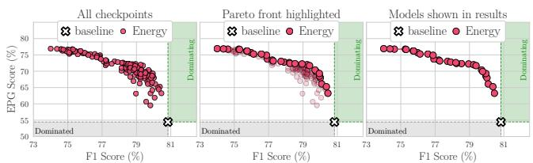  
Fig. 4: Selecting models for evaluation. For each configuration, we evaluate every model at every checkpoint and measure its performance across various metrics (F1, EPG, IoU) on the validation set; i.e. every point in the left graph corresponds to one model (for B-cos models optimized via the Energy loss at the input layer). Instead of evaluating a single model on the test set, we evaluate all Pareto-dominant models, as indicated in the center and right plot.

Unlike existing localization losses that either (i) do not constrain attributions across the entire input (RRR\*, PPCE), or (ii) force the model to attribute uniformly within the mask even if it includes irrelevant background regions $( L _ { 1 }$ PPCE), maximizing the EPG score jointly optimizes for higher attribution energy within the mask and lower attribution energy outside the mask. By not enforcing a uniformity prior, we find that the Energy loss is able to provide effective guidance while allowing the model to learn freely what to focus on within the bounding boxes (Sec. 5).

## 3.5. Efficient Optimization

In contrast to prior work [49, 56, 24, 23], we perform model guidance on a multi-label classification setting, and consequently there are multiple ground truth classes whose attribution localization could be optimized. Computing and optimizing for several attributions within an image would add a significant overhead to the computational cost of training (multiple backward passes). Hence, for efficiency, we sample one ground truth class k per image at random for every batch and only optimize for localization of that class, i.e., $\mathcal { L } _ { \mathrm { l o c } } = \mathcal { L } _ { \mathrm { l o c } , k }$ . We find that this still provides effective model guidance while keeping the training cost tractable.

## 4. Experimental Setup

In this section, we describe our experimental setup and how we select the best models across metrics; for full details, see supplement. We evaluate across all possible choices for each category, and discuss our results in Sec. 5. Datasets: We evaluate on PASCAL VOC 2007 [16] and MS COCO 2014 [34] for multi-label image classification. In Sec. 5.5, to understand the effectiveness of model guidance in mitigating spurious correlations, we also evaluate on the synthetically constructed Waterbirds-100 dataset [51, 42], where landbirds are perfectly correlated with land backgrounds on the training and validation sets, but are equally likely to occur on land or water in the test set (similar for waterbirds and water). With this dataset, we evaluate model guidance for suppressing undesired features.

Attribution Methods and Architectures: As described in Sec. 3.2, we evaluate with IxG [57], IntGrad [62], B-cos [6, 7], and GradCAM [53] using models with a ResNet-50 [27] backbone. For IntGrad, we use an -DNN ResNet-50 [28] to reduce the computational cost, and a B-cos ResNet-50 for the B-cos attributions. To emphasize that the results generalize across different backbones, we further provide results for a B-cos ViT-S [14, 7] and a B-cos DenseNet-121 [29, 7]. We evaluate optimizing the attributions at different network layers, such as at the input image and the last convolutional layers’ output3, as well as at multiple intermediate layers. Within the main paper, we highlight some of the most representative and insightful results, the full set of results can be found in the supplement. All models were pretrained on ImageNet [50], and model guidance was applied when fine-tuning the models on the target dataset.

Localization Losses: As described in Sec. 3.4, we compare four localization losses in our evaluation: (i) Energy, (ii) L [24, 23], (iii) PPCE [56], and (iv) RRR\* (cf. Sec. 3.4, [49]). Evaluation Metrics: As discussed in Sec. 3.3, we evaluate both for classification and localization performance of the models. For classification, we report the F1 scores, similar results with mAP scores can be found in the supplement. For localization, we evaluate using the EPG and IoU scores. Selecting the best models: As we evaluate for two distinct objectives (classification + localization), it is not trivial to decide which models perform ‘the best’, e.g. a model that provides the best classification performance might provide significantly worse localization than a model that provides only slightly lower classification performance. Finding the right balance and deciding which of those models in fact constitutes the ‘better’ model depends on the preference of the end user. Hence, instead of selecting models based on a single metric, we select the set of Pareto-dominant models [40, 41, 5] across three metrics—F1, EPG, and IoU—for each training configuration, as defined by a combination of attribution method, layer, and loss. Specifically, as shown in Fig. 4, we train each configuration using three different choices of $\lambda _ { \mathrm { l o c } } .$ and select the set of Pareto-dominant models among all checkpoints (epochs and $\lambda _ { \mathrm { l o c } } )$ . This provides a more holistic view of the general trends on the effectiveness of model guidance for each configuration.

## 5. Experimental Results

In this section, we discuss our experimental findings. In particular, in Sec. 5.1, we first discuss the impact of the loss functions on the EPG and IoU scores of the models; in Sec. 5.2, we then analyze the impact of the models and attribution methods; further in Sec. 5.3, we show that guid ing the models via their explanations can lead to improved classification accuracy. In Sec. 5.4, we present additional studies in which we evaluate and discuss the cost of model guidance approaches: in particular, we study model guidance with limited additional labels, with increasingly coarse bounding boxes, and at deep layers in the network. Finally, in Sec. 5.5, we show the utility of model guidance in improving accuracy in the presence of distribution shifts. For easier reference, we label our individual findings as R1–R9. Note. To draw conclusive insights and highlight general and reliable trends in the experiments, we compare the Pareto curves (see Fig. 4) of individual configurations. If the Pareto curve of a specific loss (e.g. Energy in Fig. 5) consistently Pareto-dominates the Pareto curves of all other losses, we can confidently conclude that for the combination of evaluated metrics (e.g. EPG vs. F1), this loss is the best choice.

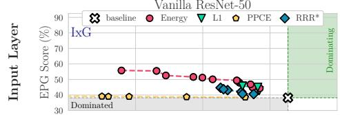

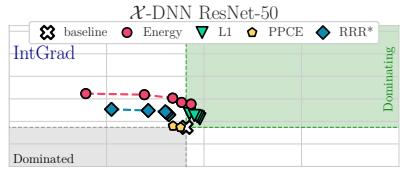

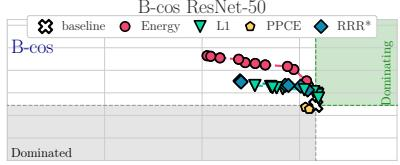

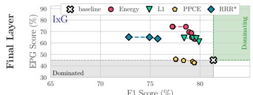  
F1 Score (%)

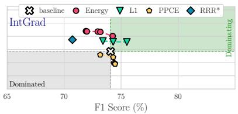

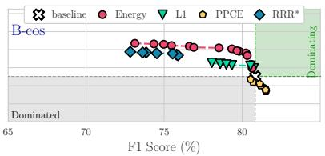

(a) PASCAL VOC results for EPG vs. F1.  
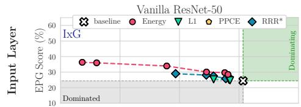

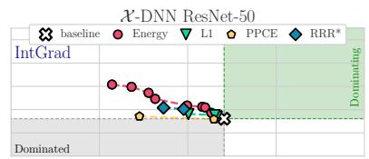

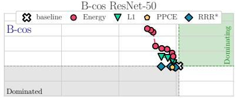

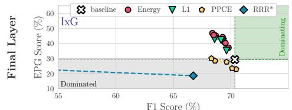  
F1 Score (%)

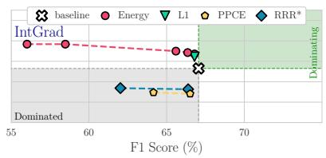

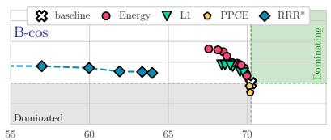  
(b) MS COCO results for EPG vs. F1.  
F1 Score (%)

Fig. 5: EPG vs. F1, for different datasets ((a): VOC; (b): COCO), losses (markers) and models (columns), optimized at different layers (rows); additionally, we show the performance of the baseline model before fine-tuning and demarcate regions that strictly dominate (are strictly dominated by) the baseline performance in green (grey). For each configuration, we show the Pareto fronts (cf. Fig. 4) across regularization strengths $\lambda _ { \mathrm { l o c } }$ and epochs (cf. Sec. 5 and Fig. 4). We find the Energy loss to give the best trade-off between EPG and F1.  
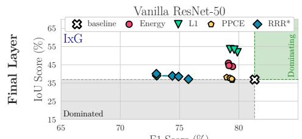  
F1 Score (%)

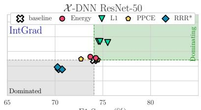  
F1 Score (%)

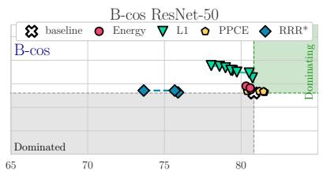  
F1 Score (%)

Fig. 6: IoU vs. F1, for different losses (markers) and models (columns) for VOC; results for COCO are in the supplement. Additionally, we show the performance of the baseline model before fine-tuning and demarcate regions that strictly dominate (are strictly dominated by) the baseline model in green (grey). For each configuration, we show the Pareto fronts (Fig. 4) across regularization strengths $\lambda _ { \mathrm { l o c } }$ and all epochs; for details, see Secs. 4 and 5. Across all configurations, we find the $L _ { 1 }$ loss to provide the largest gains in IoU at the lowest cost.  
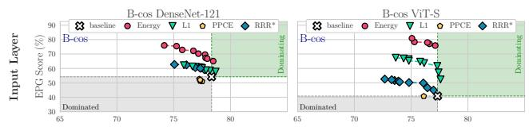  
Fig. 7: EPG vs. F1 on VOC. We observe the same trends as in Fig. 5a for different backbone architectures, specifically a B-cos DenseNet-121 and a B-cos ViT-S. For IoU results, see supplement.

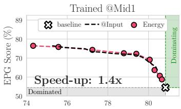  
F1 Score (%)

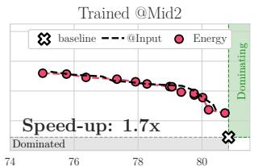  
F1 Score (%)

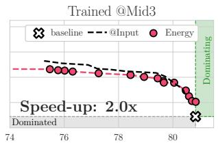  
F1 Score (%)

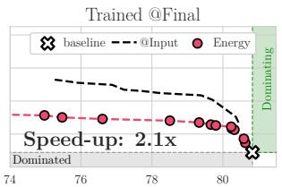  
F1 Score (%)  
Fig. 8: Faster training by guiding at later layers. While input-level attributions tend to be more detailed (cf. Fig. 2), they are costlier to compute than attributions at later layers. However, we find that guidance at later layers (e.g. @Mid3) also significantly improves input-leve attributions, yielding similar EPG results as input-level guidance (@Input) at up to twice the training speed; for IoU results, see supplement.

## 5.1. Comparing loss functions for model guidance

In the following, we highlight the main insights gained from the quantitative evaluations. For a qualitative comparison between the losses, please see Fig. 9; note that we show examples for a B-cos model as the differences become clearest; full results can be found in the supplement.

R1 The Energy loss yields the best EPG scores. In Fig. 5, we plot the Pareto curves for EPG vs. F1 scores for a wide range of configurations (see Sec. 4) on VOC (a) and COCO (b); specifically, we group the results by model type (Vanilla,  -DNN, B-cos), the layer depths at which the attribution was regularized (Input / Final), and the loss used during optimization (Energy, $L _ { 1 }$ , PPCE, RRR\*). From these results it becomes apparent that the optimization with the Energy loss yields the best trade-off between accuracy (F1) and the EPG score: e.g., when looking at the upper right plot in Fig. 5a we can see that the Energy loss (red dots) improves over the baseline B-cos model (white cross) by improving the localization in terms of EPG score with only a minor cost in classification performance (i.e. F1 score). Further trading off F1 scores yields even higher EPG scores. Importantly, the Energy loss Pareto-dominates all the other losses (RRR\*: blue diamonds; $L _ { \mathrm { 1 } } \mathrm { : }$ green triangles; PPCE: yellow pentagons). This is is also true for the other network types (Vanilla ResNet-50, Fig. 5a (top left), and -DNN, Fig. 5a (top center)) and at the final layer (bottom row), and generalizes across backbone architectures (Fig. 7). When comparing Fig. 5a and Fig. 5b, we also find these results to be highly consistent between datasets.

R2 The $L _ { 1 }$ loss yields the best IoU performance. Similarly, in Fig. 6, we plot the Pareto curves of IoU vs. F1 scores for various configurations at the final layer; for the IoU results at the input layer and on the COCO dataset, please see the supplement. For IoU, the $L _ { 1 }$ loss provides the best trade-off and, with few exceptions, $L _ { 1 }$ -guided models Pareto-dominate all other models in all configurations.

R3 The Energy loss focuses best on on-object features. By not forcing the models to highlight the entire bounding boxes (see Sec. 3.4), we find that the Energy loss also suppresses background features within the bounding boxes, thus better preserving fine details of the explanations (cf. Figs. 9 and 11). To quantify this, we evaluate the distribution of Energy (Eq. (2)) just within the bounding boxes. For this, we take advantage of the segmentation mask annotations available for a subset of the VOC test set. Specifically, we measure the Energy contained in the segmentation masks versus the entire bounding box, which indicates how much of the attributions actually highlight on-object features. We find that the Energy loss outperforms $L _ { 1 }$ across all models and configurations; see supplement for details.

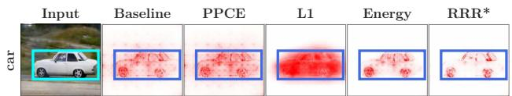  
Fig. 9: Loss comparison for input attributions (atts.) of a B-cos model. We show atts. before (baseline, col. 2) and after guidance (cols. 3-6) for a specific image (col. 1) and its bounding box annotation. We find that Energy and RRR\* yield sparse atts, whereas $L _ { 1 }$ yields smoother atts, as it is optimized to fill the entire bounding box. For PPCE we observe only a minor effect on the atts.

In short, we find that the Energy loss works best for improving the EPG metric, whereas the $L _ { 1 }$ loss yields the highest gains in terms of IoU; depending on the use case, either of these losses could thus be recommendable. However, we find that the Energy loss is more robust to annotation errors (R8, Sec. 5.4), and, as discussed in R3, the Energy loss more reliably focuses on object-specific features.

## 5.2. Comparing models and attribution methods

In the following, we highlight our findings regarding different attribution methods and models. Given the similarity of the results between GradCAM and IxG, and since Bcos attributions performed better than GradCAM for B-cos models, we show GradCAM results in the supplement.

R4 At the input layer, B-cos explanations perform best. We find that the B-cos models not only achieve the highest EPG/IoU performance before applying model guidance, (‘baselines’) but also obtain the highest gains in EPG and IoU and thus the highest overall performance (for EPG see Fig. 5, right; for IoU, see supplement): e.g., an Energybased B-cos model achieves an EPG score of 71.7 @ 79.4% F1, thus significantly outperforming the best EPG scores of both other model types at a much lower cost in F1 (Vanilla: 55.8 @ 69.0%, -DNN: 62.3 @ 68.9%). This is also observed qualitatively, as we show in the supplement.

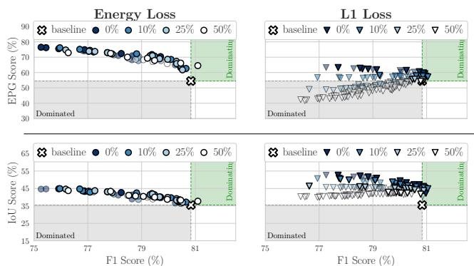

R5 Regularizing at the final layer yields consistent gains. As can be seen in Fig. 5 (bottom) and Fig. 6, all models can be guided well via regularization at the final layer, i.e. all models show improvements in IoU and EPG score.

In short, we find model guidance to work well across all tested models when optimizing at the final layer (R5), highlighting its wide applicability. However, to obtain highly detailed and well-localized attributions at the input layer, the model-inherent explanations of the B-cos models seem to lend themselves much better to such guidance (R4).

## 5.3. Improving accuracy with model guidance

R6 Model guidance can improve accuracy. For both the Vanilla models (final layer) and the -DNNs (input+final), we found models that improve the localization metrics and the F1 score. These improvements are particularly pronounced for the  -DNN: $\mathrm { e . g . }$ , we find models that improve the EPG and F1 scores by $\Delta { = } 7 . 2 \ \mathrm { p . p }$ . and $\Delta { = } 1 . 4 ~ \mathrm { p . p }$ . respectively (Fig. 5, center top), or the IoU and F1 scores by $\Delta { = } 1 1 . 9 \ \mathrm { p . p }$ . and $\Delta { = } 1 . 4 \mathrm { p } . \mathrm { p } . ( \mathrm { F i g } . 6 ,$ center).

However, overall we observe a trade-off between localization and accuracy (Figs. 5 and 6). Given the similarity of the training and test distributions, focusing on the object need not improve classification performance, as spurious features are also present at test time. Further, the guided model is discouraged from relying on contextual features, making the classification more challenging. In Sec. 5.5, we show that guidance can significantly improve performance when there is a distribution shift between training and test.

## 5.4. Efficiency and robustness considerations

While bounding boxes decrease the data collection cost with respect to segmentation masks, they can nonetheless be expensive to obtain, especially when expert knowledge is required. To further reduce those costs, in this section, we assess the robustness of guiding the model with a limited number (R7) or increasingly coarse annotations (R8). Apart from data efficiency, we further explore how training efficiency can be improved for fine-grained (i.e. input-level) explanations (R9), as explanations at early layers are more costly to obtain than those at later layers.

R7 Model guidance requires only few add. annotations. In Fig. 12, we show that the EPG score can be significantly improved with a very limited number of annotations; for IoU results, see supplement. Specifically, we find that when using only 1% of the training data (25 annotated images) for VOC, improvements of up to $\Delta { = } 2 3 . 0 \ \mathrm { p . p . } \ ( \Delta { = } 1 . 4 )$ in EPG (IoU) can be obtained, at a minor drop in F1 $( \Delta { = } 0 . 3$ $\mathsf { p } . \mathsf { p } .$ and $\Delta { = } 2 . 5$ p.p. respectively). When annotating up to 10% of the images, very similar results can be achieved as with full annotation (see e.g. cols. 2+3 in Fig. 12).

R8 The Energy loss is highly robust to annotation errors. As discussed in Sec. 3.4, the Energy loss only directs the model on which features not to use and does not impose a uniform prior on the attributions within the bounding boxes. As a result, we find it to be much more stable to annotation errors: $\mathrm { e . g . }$ , in Fig. 10, we visualize how the EPG (top) and IoU (bottom) scores of the best performing models under the Energy (left) and $L _ { 1 }$ loss (right) evolve when using coarser bounding boxes; for this, we simply dilate the bounding box size by $p { \in } \{ 1 0 , 2 5 , 5 0 \} \%$ during training, see Fig. 11. While the models optimized via the $L _ { 1 }$ loss achieve increasingly worse results (right), the Energyoptimized models are essentially unaffected by the coarseness of the annotations.

Fig. 10: Quantitative results for dilated bounding boxes for a B-cos model at the input layer. We show EPG and IoU (top and bottom) results for models trained with various amounts of annotation errors (increasingly large bounding boxes, see Fig. 11). The Energy loss yields highly consistent results despite training with heavily dilated bounding boxes (left), whereas the results of the $L _ { 1 }$ loss (right) worsen markedly; best viewed in color.  
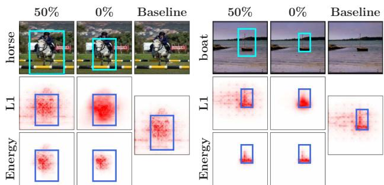  
Fig. 11: Qualitative results for dilated bounding boxes for a B-cos model at input. Examples for attributions (rows 2+3) of models trained with dilated bounding boxes (row 1). In contrast to $L _ { 1 } .$ , models trained with Energy show significant gains in object focus even with significant noise (e.g. ‘Baseline’ vs. ‘50%’).

In short, we find that the models can be guided effectively at a low cost in terms of annotation effort, as only few annotations (e.g. 25 for VOC) are required (cf. R7), and, especially for the Energy loss, these annotations can be very coarse and do not have to be ‘pixel-perfect’ (cf. R8).

R9 Guidance at deep layers can be effective. While guided input-level explanations of B-cos networks exhibit a high degree of detail, regularizing those explanations comes at an added training cost. In particular, optimizing at the input layer requires backpropagating through the entire network to compute the attributions. In an effort to reduce training costs whilst maintaining the benefits of fine-grained explanations at input resolution, we evaluate if input-level attributions benefit from an optimization at deeper layers.

Specifically, we regularize B-cos attributions at the final and at three intermediate layers (Mid 1,2,3 ), and evaluate the localization of attributions at the input. We find (Fig. 8) that training at a deeper layer can provide significant speedups in training time with often a negligible cost in localization performance. E.g., since we do not have to compute a full backward pass through the entire model during training, optimizing at Mid2 (col. 2 in Fig. 8) provides similar gains in localization but with a 1.7x speed-up in training time.

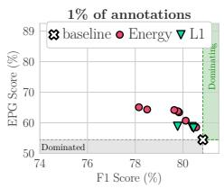

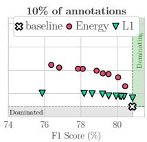

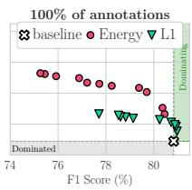  
Fig. 12: EPG results with limited annotations for a B-cos model at the input layer, optimized with the Energy and the $L _ { 1 }$ loss. Using bounding box annotations for as little as 1% (left) of the images yields significant improvements in EPG, and with 10% (center) similar gains as in the fully annotated setting (right) are obtained.

## 5.5. Effectiveness against spurious correlations

To evaluate the potential for mitigating spurious correlations, we evaluate model guidance with the Energy and $L _ { 1 }$ losses on the synthetically constructed Waterbirds-100 dataset [51, 42]. We perform model guidance under two settings: (1) the conventional setting to classify between landbirds and waterbirds, using the region within the bounding box as the mask; and (2) the reversed setting [42] to classify the background, i.e., land vs. water, using the region outside the bounding box as the mask. To simulate a limited annotation budget, we only use bounding boxes for a random 1% of the training set, and report results averaged over four runs. We show the results for the worst-group accuracy (i.e., images containing a waterbird on land) and the overall accuracy using B-cos models in Tab. 1; full results for all attributions and models can be found in the supplement.

Both losses consistently and significantly improve the accuracy in the conventional and the reversed settings by guiding the model to select the ‘right’ features, i.e. birds (conventional) or background (reversed). This guidance can also be observed qualitatively (cf. Fig. 13).

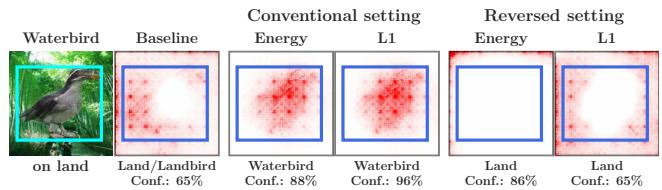

Fig. 13: Qualitative Waterbirds-100 results. Without guidance, a model might focus on the background to classify birds (baseline) and thus misclassify waterbirds on land (col. 2). Guided models can correct such errors and focus on the desired feature: in cols. 3+4 (5+6) the model is guided to classify by using the bird (background) features and arrives at the desired prediction. Model predictions and confidence scores are indicated below the images.
<table><tr><td></td><td colspan="2">Conventional</td><td colspan="2">Reversed</td></tr><tr><td>Model</td><td>Worst</td><td>Overall</td><td>Worst</td><td>Overall</td></tr><tr><td>Baseline</td><td>43.4 (±2.4)</td><td>68.7 (±0.2)</td><td>56.6 (±2.4)</td><td>80.1 (±0.2)</td></tr><tr><td>Energy</td><td>56.1 (±4.0)</td><td>71.2 (±0.1)</td><td>62.8 (±2.1)</td><td>83.6 (±1.1)</td></tr><tr><td> $L _ { 1 }$ </td><td>51.1 (±1.9)</td><td>69.5 (±0.2)</td><td>58.8 (±5.0)</td><td>82.2 (±0.9)</td></tr></table>

Table 1: Waterbirds-100 results. We find that model guidance is effective in improving both worst-group (‘Waterbird on Land’) and overall accuracy in the conventional (Landbird vs. Waterbird) and reversed (Land vs. Water) settings; full results in the supplement.

## 6. Discussion And Conclusion

In this work, we comprehensively evaluated various models, attribution methods, and loss functions for their utility in guiding models to be “right for the right reasons”.

In summary, we find that guiding models via bounding boxes can significantly improve EPG and IoU performance of the optimized attribution method, with the Energy loss working best to improve the EPG score (R1) and the $L _ { 1 }$ loss yielding the highest gains in IoU scores (R2). While the B-cos models achieve the best results in IoU and EPG score at the input layer (R4), all tested model types (Vanilla, -DNN, B-cos) lend themselves well to being optimized at the final layer (R5), which can even improve attribution maps at early layers (R9). Further, we find that regularizing the explanations of the models and thereby ‘telling them where to look’ can increase the object recognition performance (mAP/accuracy) of some models (R6), especially when strong spurious correlations are present (Sec. 5.5). Interestingly, those gains (EPG, IoU), can be achieved with relatively little additional annotation (R7). Lastly, we find that by not assuming a uniform prior over the attributions within the annotated bounding boxes, training with the energy loss is more robust to annotation errors (R8) and results in models that produce attribution maps that are more focused on class-specific features (R3).

## References

[1] Julius Adebayo, Justin Gilmer, Michael Muelly, Ian Goodfellow, Moritz Hardt, and Been Kim. Sanity Checks for Saliency Maps. In NeurIPS, 2018. 3

[2] Julius Adebayo, Michael Muelly, Harold Abelson, and Been Kim. Post hoc Explanations may be Ineffective for Detecting Unknown Spurious Correlation. In ICLR, 2022. 3

[3] Saeid Asgari, Aliasghar Khani, Fereshte Khani, Ali Gholami, Linh Tran, Ali Mahdavi-Amiri, and Ghassan Hamarneh. MaskTune: Mitigating Spurious Correlations by Forcing to Explore. In NeurIPS, 2022. 3

[4] Sebastian Bach, Alexander Binder, Gregoire Montavon, Fred-´ erick Klauschen, Klaus-Robert Muller, and Wojciech Samek.¨ On Pixel-Wise Explanations for Non-Linear Classifier Decisions by Layer-Wise Relevance Propagation. PLOS One, 10(7):e0130140, 2015. 3

[5] Jurgen Backhaus. The Pareto Principle. ¨ Analyse & Kritik, 2(2):146–171, 1980. 5

[6] Moritz Bohle, Mario Fritz, and Bernt Schiele. B-Cos Net-¨ works: Alignment is All We Need for Interpretability. In CVPR, pages 10329–10338, 2022. 1, 2, 3, 4, 5

[7] Moritz Bohle, Navdeeppal Singh, Mario Fritz, and Bernt ¨ Schiele. B-cos Alignment for Inherently Interpretable CNNs and Vision Transformers. arXiv preprint arXiv:2306.10898, 2023. 5

[8] Moritz Bohle, Mario Fritz, and Bernt Schiele. Convolutional¨ Dynamic Alignment Networks for Interpretable Classifications. In CVPR, pages 10029–10038, 2021. 3

[9] Aditya Chattopadhyay, Anirban Sarkar, Prantik Howlader, and Vineeth N Balasubramanian. Grad-CAM++: Improved Visual Explanations for Deep Convolutional Networks. In WACV, pages 839–847, 2018. 3

[10] Hila Chefer, Shir Gur, and Lior Wolf. Transformer Interpretability Beyond Attention Visualization. In CVPR, pages 782–791, 2021. 3

[11] Hila Chefer, Idan Schwartz, and Lior Wolf. Optimizing Relevance Maps of Vision Transformers Improves Robustness. In NeurIPS, 2022. 3

[12] Piotr Dabkowski and Yarin Gal. Real Time Image Saliency for Black Box Classifiers. In NeurIPS, 2017. 3

[13] Saurabh Desai and Harish G. Ramaswamy. Ablation-CAM: Visual Explanations for Deep Convolutional Network via Gradient-free Localization. In WACV, pages 983–991, 2020. 3

[14] Alexey Dosovitskiy, Lucas Beyer, Alexander Kolesnikov, Dirk Weissenborn, Xiaohua Zhai, Thomas Unterthiner, Mostafa Dehghani, Matthias Minderer, Georg Heigold, Sylvain Gelly, Jakob Uszkoreit, and Neil Houlsby. An Image is Worth 16x16 Words: Transformers for Image Recognition at Scale. In ICLR, 2021. 5

[15] Gabriel Erion, Joseph D Janizek, Pascal Sturmfels, Scott M Lundberg, and Su-In Lee. Improving Performance of Deep Learning Models with Axiomatic Attribution Priors and Expected Gradients. Nature Machine Intelligence, 3(7):620– 631, 2021. 3

[16] Mark Everingham, Luc Van Gool, Christopher KI Williams, John Winn, and Andrew Zisserman. The Pascal Visual Object Classes (VOC) Challenge. IJCV, 88:303–308, 2009. 2, 5

[17] Thomas Fel, Ivan F Rodriguez Rodriguez, Drew Linsley, and

Thomas Serre. Harmonizing the Object Recognition Strategies of Deep Neural Networks with Humans. In NeurIPS, 2022. 3

[18] Vitaly Feldman and Chiyuan Zhang. What Neural Networks Memorize and Why: Discovering the Long Tail via Influence Estimation. In NeurIPS, pages 2881–2891, 2020. 1

[19] Patrick Fernandes, Marcos Treviso, Danish Pruthi, Andre FT´ Martins, and Graham Neubig. Learning to Scaffold: Optimiz ing Model Explanations for Teaching. In NeurIPS, 2022. 3

[20] Ruth C Fong and Andrea Vedaldi. Interpretable Explanations of Black Boxes by Meaningful Perturbation. In ICCV, pages 3429–3437, 2017. 3, 4

[21] Felix Friedrich, Wolfgang Stammer, Patrick Schramowski, and Kristian Kersting. A Typology to Explore and Guide Explanatory Interactive Machine Learning. arXiv preprint arXiv:2203.03668, 2022. 3

[22] Hiroshi Fukui, Tsubasa Hirakawa, Takayoshi Yamashita, and Hironobu Fujiyoshi. Attention Branch Network: Learning of Attention Mechanism for Visual Explanation. In CVPR, pages 10705–10714, 2019. 3

[23] Yuyang Gao, Tong Steven Sun, Guangji Bai, Siyi Gu, Sungsoo Ray Hong, and Zhao Liang. RES: A Robust Framework for Guiding Visual Explanation. In KDD, pages 432–442, 2022. 2, 3, 4, 5

[24] Yuyang Gao, Tong Steven Sun, Liang Zhao, and Sungsoo Ray Hong. Aligning Eyes between Humans and Deep Neural Network through Interactive Attention Alignment. ACM HCI, 6(CSCW2):1–28, 2022. 2, 3, 4, 5

[25] Hao Guo, Kang Zheng, Xiaochuan Fan, Hongkai Yu, and Song Wang. Visual Attention Consistency under Image Transforms for Multi-Label Image Classification. In CVPR, pages 729–739, 2019. 3

[26] Misgina Tsighe Hagos, Kathleen M Curran, and Brian Mac Namee. Identifying Spurious Correlations and Correcting them with an Explanation-based Learning. arXiv preprint arXiv:2211.08285, 2022. 3

[27] Kaiming He, Xiangyu Zhang, Shaoqing Ren, and Jian Sun. Deep Residual Learning for Image Recognition. In CVPR, pages 770–778, 2016. 5

[28] Robin Hesse, Simone Schaub-Meyer, and Stefan Roth. Fast Axiomatic Attribution for Neural Networks. In NeurIPS, pages 19513–19524, 2021. 4, 5

[29] Gao Huang, Zhuang Liu, Laurens Van Der Maaten, and Kilian Q Weinberger. Densely Connected Convolutional Networks. In CVPR, pages 4700–4708, 2017. 5

[30] Peng-Tao Jiang, Chang-Bin Zhang, Qibin Hou, Ming-Ming Cheng, and Yunchao Wei. LayerCAM: Exploring Hierarchical Class Activation Maps for Localization. IEEE TIP, 30:5875–5888, 2021. 3

[31] Joon Sik Kim, Gregory Plumb, and Ameet Talwalkar. Sanity Simulations for Saliency Methods. In ICML, 2022. 3

[32] Keisuke Kiritoshi, Ryosuke Tanno, and Tomonori Izumitani. L1-Norm Gradient Penalty for Noise Reduction of Attribution Maps. In CVPRW, pages 118–121, 2019. 3

[33] Kunpeng Li, Ziyan Wu, Kuan-Chuan Peng, Jan Ernst, and Yun Fu. Tell Me Where to Look: Guided Attention Inference Network. In CVPR, pages 9215–9223, 2018. 3

[34] Tsung-Yi Lin, Michael Maire, Serge Belongie, James Hays, Pietro Perona, Deva Ramanan, Piotr Dollar, and C Lawrence´

Zitnick. Microsoft COCO: Common Objects in Context. In ECCV, pages 740–755. Springer, 2014. 2, 5

[35] Drew Linsley, Dan Shiebler, Sven Eberhardt, and Thomas Serre. Learning what and where to attend. In ICLR, 2019. 3

[36] Masahiro Mitsuhara, Hiroshi Fukui, Yusuke Sakashita, Takanori Ogata, Tsubasa Hirakawa, Takayoshi Yamashita, and Hironobu Fujiyoshi. Embedding Human Knowledge into Deep Neural Network via Attention Map. In VISIGRAPP, pages 626–636, 2021. 3

[37] Ofir Moshe, Gil Fidel, Ron Bitton, and Asaf Shabtai. Improving Interpretability via Regularization of Neural Activation Sensitivity. arXiv preprint arXiv:2211.08686, 2022. 3

[38] Vinod Nair and Geoffrey E Hinton. Rectified Linear Units Improve Restricted Boltzmann Machines. In ICML, pages 807–814, 2010. 4

[39] Krishna Kanth Nakka and Mathieu Salzmann. Towards Robust Fine-Grained Recognition by Maximal Separation of Discriminative Features. In ACCV, 2020. 3

[40] Vilfredo Pareto. Il massimo di utilita dato dalla libera con- \` correnza. Giornale degli economisti, pages 48–66, 1894. 5

[41] Vilfredo Pareto. The Maximum of Utility given by Free Competition. Giornale degli Economisti e Annali di Economia, 67(3):387–403, 2008. 5

[42] Suzanne Petryk, Lisa Dunlap, Keyan Nasseri, Joseph Gonzalez, Trevor Darrell, and Anna Rohrbach. On Guiding Visual Attention with Language Specification. In CVPR, pages 18092–18102, 2022. 1, 2, 3, 5, 9

[43] Vitali Petsiuk, Abir Das, and Kate Saenko. RISE: Randomized Input Sampling for Explanation of Black-box Models. In BMVC, 2018. 3, 4

[44] Vipin Pillai, Soroush Abbasi Koohpayegani, Ashley Ouligian, Dennis Fong, and Hamed Pirsiavash. Consistent Explanations by Contrastive Learning. In CVPR, pages 10213– 10222, 2022. 3

[45] Vipin Pillai and Hamed Pirsiavash. Explainable Models with Consistent Interpretations. In AAAI, 2021. 3

[46] Sukrut Rao, Moritz Bohle, and Bernt Schiele. Towards¨ Better Understanding Attribution Methods. In CVPR, pages 10223–10232, 2022. 3, 4

[47] Marco Tulio Ribeiro, Sameer Singh, and Carlos Guestrin. “Why Should I Trust You?”: Explaining the Predictions of Any Classifier. In KDD, pages 1135–1144, 2016. 3, 4

[48] Laura Rieger, Chandan Singh, William Murdoch, and Bin Yu. Interpretations are Useful: Penalizing Explanations to Align Neural Networks with Prior Knowledge. In ICML, pages 8116–8126, 2020. 3

[49] Andrew Slavin Ross, Michael C Hughes, and Finale Doshi-Velez. Right for the Right Reasons: Training Differentiable Models by Constraining their Explanations. In IJCAI, pages 2662–2670, 2017. 1, 2, 3, 4, 5

[50] Olga Russakovsky, Jia Deng, Hao Su, Jonathan Krause, Sanjeev Satheesh, Sean Ma, Zhiheng Huang, Andrej Karpathy, Aditya Khosla, Michael Bernstein, Alexander C. Berg, and Li Fei-Fei. ImageNet Large Scale Visual Recognition Challenge. IJCV, 115(3):211–252, 2015. 5

[51] Shiori Sagawa, Pang Wei Koh, Tatsunori B Hashimoto, and Percy Liang. Distributionally Robust Neural Networks for Group Shifts: On the Importance of Regularization for Worst-Case Generalization. In ICLR, 2020. 2, 5, 9

[52] Patrick Schramowski, Wolfgang Stammer, Stefano Teso,

Anna Brugger, Franziska Herbert, Xiaoting Shao, Hans-Georg Luigs, Anne-Katrin Mahlein, and Kristian Kersting. Making Deep Neural Networks Right for the Right Scientific Reasons by Interacting with their Explanations. Nature Machine Intelligence, 2(8):476–486, 2020. 3

[53] Ramprasaath R Selvaraju, Michael Cogswell, Abhishek Das, Ramakrishna Vedantam, Devi Parikh, and Dhruv Batra. Grad-CAM: Visual Explanations from Deep Networks via Gradient-Based Localization. In ICCV, pages 618–626, 2017. 1, 2, 3, 4, 5

[54] Ramprasaath R Selvaraju, Stefan Lee, Yilin Shen, Hongxia Jin, Shalini Ghosh, Larry Heck, Dhruv Batra, and Devi Parikh. Taking a HINT: Leveraging Explanations to Make Vision and Language Models More Grounded. In ICCV, pages 2591–2600, 2019. 3

[55] Xiaoting Shao, Arseny Skryagin, Wolfgang Stammer, Patrick Schramowski, and Kristian Kersting. Right for Better Reasons: Training Differentiable Models by Constraining their Influence Functions. In AAAI, volume 35, pages 9533– 9540, 2021. 3

[56] Haifeng Shen, Kewen Liao, Zhibin Liao, Job Doornberg, Maoying Qiao, Anton Van Den Hengel, and Johan W Verjans. Human-AI Interactive and Continuous Sensemaking: A Case Study of Image Classification using Scribble Attention Maps. In Extended Abstracts ofCHI, pages 1–8, 2021. 2, 3, 4, 5

[57] Avanti Shrikumar, Peyton Greenside, and Anshul Kundaje. Learning Important Features Through Propagating Activation Differences. In ICML, pages 3145–3153, 2017. 1, 2, 3, 4, 5

[58] Karen Simonyan, Andrea Vedaldi, and Andrew Zisserman. Deep Inside Convolutional Networks: Visualising Image Classification Models and Saliency Maps. In ICLRW, 2014. 3

[59] Krishna Kumar Singh, Dhruv Mahajan, Kristen Grauman, Yong Jae Lee, Matt Feiszli, and Deepti Ghadiyaram. Don’t Judge an Object by its Context: Learning to Overcome Contextual Bias. In CVPR, pages 11070–11078, 2020. 3

[60] Jost Tobias Springenberg, Alexey Dosovitskiy, Thomas Brox, and Martin Riedmiller. Striving for Simplicity: The All Convolutional Net. In ICLRW, 2015. 3

[61] Guolei Sun, Salman Khan, Wen Li, Hisham Cholakkal, Fahad Shahbaz Khan, and Luc Van Gool. Fixing Localization Errors to Improve Image Classification. In ECCV, pages 271– 287. Springer, 2020. 3

[62] Mukund Sundararajan, Ankur Taly, and Qiqi Yan. Axiomatic Attribution for Deep Networks. In ICML, pages 3319–3328, 2017. 1, 2, 3, 4, 5

[63] Damien Teney, Ehsan Abbasnedjad, and Anton van den Hengel. Learning What Makes a Difference from Counterfactual Examples and Gradient Supervision. In ECCV, pages 580– 599. Springer, 2020. 3

[64] Stefano Teso. Toward Faithful Explanatory Active Learning with Self-Explainable Neural Nets. In Workshop on IAL, pages 4–16. CEUR Workshop Proceedings, 2019. 2, 3

[65] Stefano Teso, Oznur Alkan, Wolfgang Stammer, and Eliza- ¨ beth Daly. Leveraging Explanations in Interactive Machine Learning: An Overview. Frontiers in Artificial Intelligence, 6:1066049, 2023. 3

[66] Stefano Teso and Kristian Kersting. Explanatory Interactive Machine Learning. In AIES, pages 239–245, 2019. 2, 3

[67] Haofan Wang, Zifan Wang, Mengnan Du, Fan Yang, Zijian

Zhang, Sirui Ding, Piotr Mardziel, and Xia Hu. Score-CAM: Score-Weighted Visual Explanations for Convolutional Neural Networks. In CVPRW, pages 111–119, 2020. 2, 3, 4

[68] Kai Yuanqing Xiao, Logan Engstrom, Andrew Ilyas, and Aleksander Madry. Noise or Signal: The Role of Image Backgrounds in Object Recognition. In ICLR, 2021. 1

[69] Ziyan Yang, Kushal Kafle, Franck Dernoncourt, and Vicente Ordonez. Improving Visual Grounding by Encouraging Consistent Gradient-based Explanations. In CVPR, pages 19165– 19174, 2023. 3

[70] Matthew D Zeiler and Rob Fergus. Visualizing and Understanding Convolutional Networks. In ECCV, pages 818–833, 2014. 3

[71] Michael Zhang, Nimit Sharad Sohoni, Hongyang R. Zhang, Chelsea Finn, and Christopher Re. Correct-N-Contrast: a ´ Contrastive Approach for Improving Robustness to Spurious Correlations. In ICML, pages 26484–26516, 2022. 3

[72] Yilun Zhou, Serena Booth, Marco Tulio Ribeiro, and Julie Shah. Do Feature Attribution Methods Correctly Attribute Features? In AAAI, volume 36, pages 9623–9633, 2022. 3