# StyleDiffusion: Controllable Disentangled Style Transfer via Diffusion Models

Zhizhong Wang∗, Lei Zhao†, Wei Xing College of Computer Science and Technology, Zhejiang University {endywon, cszhl, wxing}@zju.edu.cn

## Abstract

Content and style (C-S) disentanglement is afundamental problem and critical challenge ofstyle transfer. Existing approaches based on explicit definitions (e.g., Gram matrix) or implicit learning (e.g., GANs) are neither interpretable nor easy to control, resulting in entangled representations and less satisfying results. In this paper, we propose a new C-S disentangledframeworkfor style transfer without using previous assumptions. The key insight is to explicitly extract the content information and implicitly learn the complementary style information, yielding interpretable and controllable C-S disentanglement and style transfer. A simple yet effective CLIP-based style disentanglement loss coordinated with a style reconstruction prior is introduced to disentangle C-S in the CLIP image space. Byfurther leveraging the powerful style removal and generative ability of diffusion models, our framework achieves superior results than state of the art and flexible C-S disentanglement and trade-off control. Our work provides new insights into the C-S disentanglement in style transfer and demonstrates the potential ofdiffusion modelsfor learning well-disentangled C-S characteristics.

## 1. Introduction

Given a reference style image, e.g., Starry Night by Vincent Van Gogh, style transfer aims to transfer its artistic style, such as colors and brushstrokes, to an arbitrary content target. To achieve such a goal, it must first properly separate the style from the content and then transfer it to another content. This raises two fundamental challenges: (1) “how to disentangle content and style (C-S)” and (2) “how to transfer style to another content”.

To resolve these challenges, valuable efforts have been devoted. Gatys et al. [18] proposed A Neural Algorithm of Artistic Style to achieve style transfer, which explicitly defines the high-level features extracted from a pre-trained Convolutional Neural Network (CNN) (e.g., VGG [71]) as content, and the feature correlations (i.e., Gram matrix) as style. This approach acquires visually stunning results and inspires a large number of successors [32, 27, 50, 1, 90]. Despite the successes, by diving into the essence of style transfer, we observed three problems with these approaches: (1) The C-S are not completely disentangled. Theoretically, the C-S representations are intertwined. For example, matching the content representation of an image may also match its Gram matrix, and vice versa. (2) What CNN learned is a black box rugged to interpret [92], which makes the C-S definitions [18] uninterpretable and hard to control. (3) The transfer process is modeled as a separate optimization of content loss and style loss [18], so there lacks a deep understanding of the relationship between C-S. These problems usually lead to unbalanced stylizations and disharmonious artifacts [6], as will be shown in later Fig. 3.

On the other hand, disentangled representation learning [24] provides other ideas to implicitly disentangle C-S, either supervised [44, 34] or unsupervised [9, 93]. For style transfer, Kotovenko et al. [42] utilized fixpoint triplet style loss and disentanglement loss to enforce a GAN [20]- based framework to learn separate C-S representations in an unsupervised manner. Similarly, TPFR [74] learned to disentangle C-S in latent space via metric learning and two-stage peer-regularization, producing high-quality images even in the zero-shot setting. While these approaches successfully enforce properties “encouraged” by the corresponding losses, they still have three main problems: (1) Well-disentangled models seemingly cannot be identified without supervision [54, 64], which means the unsupervised learning [42, 74] may not achieve truly disentangled C-S, as will be shown in later Fig. 3. (2) These approaches are all based on GANs and thus often confined to the GAN predefined domains, e.g., a specific artist’s style domain [69]. (3) The implicitly learned C-S representations are still black boxes that are hard to interpret and control [54].

Facing the challenges above, in this paper, we propose a new C-S disentangled framework for style transfer without using previous assumptions such as Gram matrix [18] or GANs [42]. Our key insight stems from the fact that the definition of an image’s style is much more complex than its content, e.g., we can easily identify the content of a painting by its structures, semantics, or shapes, but it is intractable to define the style [61, 21, 35, 82]. Therefore, we can bypass such a dilemma by explicitly extracting the content information and implicitly learning its complementary style information. Since we strictly constrain style as the complement of content, the C-S can be completely disentangled, and the control of disentanglement has been transformed into the control of content extraction. It achieves both controllability and interpretability.

However, achieving plausible and controllable content extraction is also non-trivial because the contents extracted from the content images and style images should share the same content domain, and the details of the extracted contents should be easy to control. To this end, we resort to recent developed diffusion models [25, 73] and introduce a diffusion-based style removal module to smoothly dispel the style information of the content and style images, extracting the domain-aligned content information. Moreover, owing to the strong generative capability of diffusion models, we also introduce a diffusion-based style transfer module to better learn the disentangled style information of the style image and transfer it to the content image. The style disentanglement and transfer are encouraged via a simple yet effective CLIP [62]-based style disentanglement loss, which induces the transfer mapping of the content image’s content to its stylization (i.e., the stylized result) to be aligned with that of the style image’s content to its stylization (i.e., the style image itself) in the CLIP image space. By further coordinating with a style reconstruction prior, it achieves both generalized and faithful style transfer. We conduct comprehensive comparisons and ablation study to demonstrate the effectiveness and superiority of our framework. With the well-disentangled C-S, it achieves very promising stylizations with fine style details, well-preserved contents, and a deep understanding of the relationship between C-S.

In summary, our contributions are threefold:

• We propose a novel C-S disentangled framework for style transfer, which achieves more interpretable and controllable C-S disentanglement and higher-quality stylized results.

• We introduce diffusion models to our framework and demonstrate their effectiveness and superiority in controllable style removal and learning well-disentangled C-S characteristics.

• A new CLIP-based style disentanglement loss coordinated with a style reconstruction prior is introduced to disentangle C-S in the CLIP image space.

## 2. Related Work

Neural Style Transfer (NST). The pioneering work of Gatys et al. [18] has opened the era of NST [31]. Since then, this task has experienced tremendous progress, including efficiency [32, 49, 85], quality [22, 70, 84, 52, 10, 7, 1, 43, 78, 53, 6, 87, 29, 94, 12, 91, 79], generality [5, 27, 50, 59, 13, 30, 26, 80, 90, 55, 88], and diversity [75, 81, 83]. Despite these successes, the essence of these approaches is mostly based on the explicitly defined C-S representations, such as Gram matrix [18], which have several limitations as discussed in Sec. 1. In our work, we propose new disentangled C-S representations explicitly extracted or implicitly learned by diffusion models, achieving more effective style transfer and higher-quality results.

Disentangled Representation Learning (DRL). The task of DRL [24] aims at modeling the factors of data variations [48]. Earlier works used labeled data to factorize representations in a supervised manner [34]. Recently, unsupervised settings have been largely explored [39], especially for disentangling style from content [93, 28, 48, 37, 86, 42, 60, 64, 8, 45]. However, due to the dependence on GANs [20], their C-S disentanglement is usually restricted in the GAN pre-defined domains (e.g., Van Gogh’s style domain). Besides, disentanglement cannot be effectively achieved without providing sufficient data [54]. In contrast, our framework learns the disentangled style from a single style image, and the disentanglement can be easily achieved by providing only a few (∼50) content images for training.

Diffusion Models. Diffusion models [72] such as denoising diffusion probabilistic models (DDPMs) [25, 57] have recently shown great success in image generation [73, 14, 16], image manipulation [56, 2, 38], and textconditional synthesis [58, 68, 63, 65, 23, 4, 51]. These works have demonstrated the power of diffusion models to achieve higher-quality results than other generative models like VAEs [76], auto-regressive models [15], flows [41], and GANs [36]. Inspired by them, we introduce a diffusionbased style removal module and a style transfer module in our framework. These modules can smoothly remove the style information of images and better learn the recovery of it to achieve higher-quality style transfer results. To the best ofour knowledge, our work is thefirst to introduce diffusion models to the field of neural style transfer.

## 3. Background

Denoising diffusion probabilistic models (DDPMs) [72, 25] are latent variable models that consist of two diffusion processes, i.e., a forward diffusion process and a reverse diffusion process. The forward process is a fixed Markov Chain that sequentially produces a series of latents $x _ { 1 } , . . . , x _ { T }$ by gradually adding Gaussian noises at each timestep $t \in [ 1 , T ]$

$$
q ( x _ { t } | x _ { t - 1 } ) : = \mathcal { N } ( \sqrt { 1 - \beta _ { t } } x _ { t - 1 } , \beta _ { t } \mathbf { I } ) ,\tag{1}
$$

where $\beta _ { t } \in ( 0 , 1 )$ is a fixed variance schedule. An important property of the forward process is that given clean data

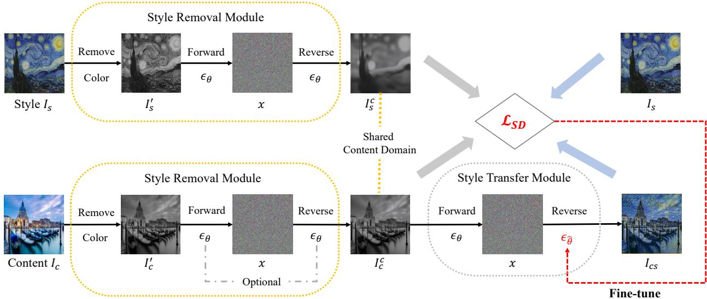  
Figure 1. Overview of our proposed StyleDiffusion. The content image $I _ { c }$ and style image $I _ { s }$ are first fed into a diffusion-based style removal module to explicitly extract the domain-aligned content information. Then, the content of $I _ { c }$ is fed into a diffusion-based styl transfer module to obtain the stylized result $I _ { c s } .$ . During training, we fine-tune the style transfer module via a CLIP-based style disentan glement loss $\mathcal { L } _ { S D }$ coordinated with a style reconstruction prior (see details in Sec. $4 . 3 ,$ we omit it here for brevity) to implicitly learn the disentangled style information of $I _ { s }$

x , $x _ { t }$ can be directly sampled as:

$$
\begin{array} { r } { q ( x _ { t } | x _ { 0 } ) : = \mathcal { N } ( \sqrt { \bar { \alpha } _ { t } } x _ { 0 } , ( 1 - \bar { \alpha } _ { t } ) \mathbf { I } ) , } \\ { x _ { t } : = \sqrt { \bar { \alpha } _ { t } } x _ { 0 } + \sqrt { 1 - \bar { \alpha } _ { t } } \epsilon , \qquad } \end{array}\tag{2}
$$

where $\alpha _ { t } : = 1 - \beta _ { t }$ and $\textstyle { \bar { \alpha } } _ { t } : = \prod _ { s = 0 } ^ { t } \alpha _ { s }$ . Noise $\epsilon \sim \mathcal { N } ( 0 , \bf { I } )$ has the same dimensionality as data x0 and latent $x _ { t }$

The reverse process generates a reverse sequence by sampling the posteriors $q ( x _ { t - 1 } | x _ { t } )$ , starting from a Gaussian noise sample $\begin{array} { r } { x _ { T } \sim \ N ( 0 , { \bf I } ) } \end{array}$ However, since $q ( x _ { t - 1 } | x _ { t } )$ is intractable, DDPMs learn parameterized Gaussian transitions $p _ { \theta } ( x _ { t - 1 } | x _ { t } )$ with a learned mean $\mu _ { \theta } ( x _ { t } , t )$ and a fixed variance $\sigma _ { t } ^ { 2 } \mathbf { I } \left[ 2 5 \right]$

$$
p _ { \theta } ( x _ { t - 1 } | x _ { t } ) : = \mathcal { N } ( \mu _ { \theta } ( x _ { t } , t ) , \sigma _ { t } ^ { 2 } \mathbf { I } ) ,\tag{3}
$$

where $\mu _ { \theta } ( x _ { t } , t )$ is the function of a noise approximator $\epsilon _ { \theta } ( x _ { t } , t )$ . Then, the reverse process can be expressed as:

$$
x _ { t - 1 } : = \frac { 1 } { \sqrt { \alpha _ { t } } } ( x _ { t } - \frac { 1 - \alpha _ { t } } { \sqrt { 1 - \bar { \alpha } _ { t } } } \epsilon _ { \theta } ( x _ { t } , t ) ) + \sigma _ { t } \mathbf { z } ,\tag{4}
$$

where $\mathbf { z } \sim \mathcal { N } ( 0 , \mathbf { I } )$ is a standard Gaussian noise independent of $\dot { x } _ { t } . \epsilon _ { \theta } ( x _ { t } , t )$ is learned by a deep neural network [66] through optimizing the following loss:

$$
\operatorname* { m i n } _ { \theta } \parallel \epsilon _ { \theta } ( x _ { t } , t ) - \epsilon \parallel ^ { 2 } .\tag{5}
$$

Later, instead of using the fixed variances, Nichol and Dhariwal [57] presented a strategy for learning the variances. Song et al. [73] proposed DDIM, which formulates

an alternative non-Markovian noising process that has the same forward marginals as DDPM but allows a different reverse process:

$$
x _ { t - 1 } : = \sqrt { \bar { \alpha } _ { t - 1 } } f _ { \theta } ( x _ { t } , t ) + \sqrt { 1 - \bar { \alpha } _ { t - 1 } - \sigma _ { t } ^ { 2 } } \epsilon _ { \theta } ( x _ { t } , t ) + \sigma _ { t } \mathbf { z } ,\tag{6}
$$

where $f _ { \theta } ( x _ { t } , t )$ is the predicted $x _ { 0 }$ at timestep t given $x _ { t }$ and $\epsilon _ { \theta } ( x _ { t } , t )$

$$
f _ { \theta } ( x _ { t } , t ) : = \frac { x _ { t } - \sqrt { 1 - \bar { \alpha } _ { t } } \epsilon _ { \theta } ( x _ { t } , t ) } { \sqrt { \bar { \alpha } _ { t } } } .\tag{7}
$$

Changing the choice of $\sigma _ { t }$ values in Eq. (6) can achieve different reverse processes. Especially when $\sigma _ { t } = 0$ , which is called DDIM [73], the reverse process becomes a deterministic mapping from latents to images, which enables nearly perfect inversion [38]. Besides, it can also accelerate the reverse process with much fewer sampling steps [14, 38].

## 4. Method

Our task can be described as follows: given a style image $I _ { s }$ and an arbitrary content image $I _ { c } ,$ , we want to first disentangle the content and style of them and then transfer the style of $I _ { s }$ to the content of $I _ { c } .$ . To achieve so, as stated in Sec. 1, our key idea is to explicitly extract the content information and then implicitly learn the complementary style information. Since our framework is built upon diffusion models [25, 73], we dub it StyleDiffusion.

Fig. 1 shows the overview of our StyleDiffusion, which consists of three key ingredients: I) a diffusion-based style removal module, II) a diffusion-based style transfer module, and III) a CLIP-based style disentanglement loss coordinated with a style reconstruction prior. In the following subsections, we will introduce each of them in detail.

## 4.1. Style Removal Module

The style removal module aims at removing the style information of the content and style images, explicitly extracting the domain-aligned content information. Any reasonable content extraction operation can be used, depending on how the users define the content. For instance, users may want to use the structural outline as the content, so they can extract the outlines [33, 89] here. However, as discussed in Sec. 1, one challenge is controllability since the control of C-S disentanglement has been transformed into the control of content extraction. To this end, we introduce a diffusionbased style removal module to achieve both plausible and controllable content extraction.

Given an input image, $e . g .$ , the style image $I _ { s } ,$ since the color is an integral part of style [47], our style removal module first removes its color by a commonly used ITU-R 601-2 luma transform [19]. The obtained grayscale image is denoted as $I _ { s } ^ { \prime } .$ . Then, we leverage a pre-trained diffusion model [14] $\epsilon _ { \theta }$ to remove the style details such as brushstrokes and textures of $I _ { s } ^ { \prime } ,$ extracting the content $I _ { s } ^ { c }$ The insight is that the pre-trained diffusion model can help eliminate the domain-specific characteristics of input images and align them to the pre-trained domain [11, 38]. We assume that images with different styles belong to different domains, but their contents should share the same domain. Therefore, we can pre-train the diffusion model on a surrogate domain, $e . g .$ ., the photograph domain, and then use this domain to construct the contents of images. After pretraining, the diffusion model can convert the input images from diverse domains to the latents x via the forward process and then inverse them to the photograph domain via the reverse process. In this way, the style characteristics can be ideally dispelled, leaving only the contents of the images.

Specifically, in order to obtain the results with fewer sampling steps and ensure that the content structures of the input images can be well preserved, we adopt the deterministic DDIM [73] sampling as the reverse process (Eq. (8)), and the ODE approximation of its reversal [38] as the forward process (Eq. (9)):

$$
x _ { t - 1 } = \sqrt { \bar { \alpha } _ { t - 1 } } f _ { \theta } ( x _ { t } , t ) + \sqrt { 1 - \bar { \alpha } _ { t - 1 } } \epsilon _ { \theta } ( x _ { t } , t ) ,\tag{8}
$$

$$
x _ { t + 1 } = \sqrt { \bar { \alpha } _ { t + 1 } } f _ { \theta } ( x _ { t } , t ) + \sqrt { 1 - \bar { \alpha } _ { t + 1 } } \epsilon _ { \theta } ( x _ { t } , t ) ,\tag{9}
$$

where $f _ { \theta } ( x _ { t } , t )$ is defined in Eq. (7). The forward and reverse diffusion processes enable us to easily control the intensity of style removal by adjusting the number of return step $T _ { r e m o v }$ (see details in later Sec. 5.1). With the increase of $T _ { r e m o v } ,$ more style characteristics will be removed, and the main content structures are retained, as will be shown in later Sec. 5.3. Note that for content images that are photographs, the diffusion processes are optional1 since they are already within the pre-trained domain, and there is almost no style except the colors to be dispelled. The superiority of diffusion-based style removal against other operations, such as Auto-Encoder (AE) [50]-based style removal, can be found in supplementary material (SM).

## 4.2. Style Transfer Module

The style transfer module aims to learn the disentangled style information of the style image and transfer it to the content image. A common generative model like AEs [27] can be used here. However, inspired by the recent great success of diffusion models [14, 38], we introduce a diffusionbased style transfer module, which can better learn the disentangled style information in our framework and achieve higher-quality and more flexible stylizations (see Sec. 5.3).

Given a content image $I _ { c } ,$ denote $I _ { c } ^ { c }$ is the content of $I _ { c }$ extracted by the style removal module (Sec. 4.1). We first convert it to the latent x using a pre-trained diffusion model $\epsilon _ { \theta }$ Then, guided by a CLIP-based style disentanglement loss coordinated with a style reconstruction prior (Sec. 4.3), the reverse process of the diffusion model is fine-tuned $( \epsilon _ { \theta }  \epsilon _ { \hat { \theta } } )$ to generate the stylized result $I _ { c s }$ referenced by the style image $I _ { s }$ . Once the fine-tuning is completed, any content image can be manipulated into the stylized result with the disentangled style of the style image $I _ { s }$ . To make the training easier and more stable, we adopt the deterministic DDIM forward and reverse processes in Eq. (8) and Eq. (9) during the fine-tuning. However, at inference, the stochastic DDPM [25] forward process (Eq. (2)) can also be used directly to help obtain diverse results [81] (Sec. 5.3).

## 4.3. Loss Functions and Fine-tuning

Enforcing the style transfer module (Sec. 4.2) to learn and transfer the disentangled style information should address two key questions: (1) “how to regularize the learned style is disentangled” and (2) “how to aptly transfer it to other contents”. To answer these questions, we introduce a novel CLIP-based style disentanglement loss coordinated with a style reconstruction prior to train the networks.

CLIP-based Style Disentanglement Loss. Denote $I _ { c } ^ { c }$ and $I _ { s } ^ { c }$ are the respective contents of the content image $I _ { c }$ and the style image $I _ { s }$ extracted by the style removal module (Sec. 4.1). We aim to learn the disentangled style information of the style image $I _ { s }$ complementary to its content $I _ { s } ^ { c }$ . Therefore, a straightforward way to obtain the disentangled style information is a direct subtraction:

$$
D _ { s } ^ { p x } = I _ { s } - I _ { s } ^ { c } .\tag{10}
$$

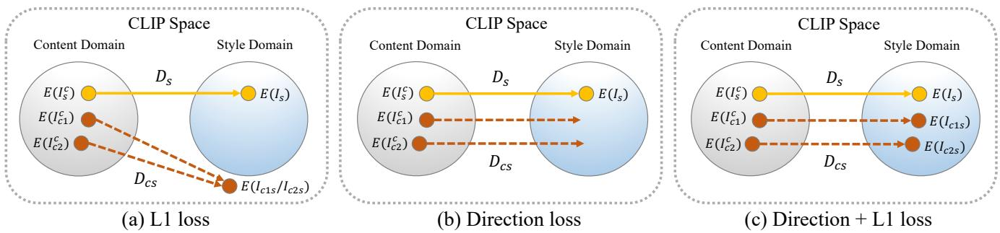  
Figure 2. Illustration of different loss functions to transfer the disentangled style information. (a) L1 loss cannot guarantee the stylized results are within the style domain and may suffer from a collapse problem. (b) Direction loss aligns the disentangled directions but cannot realize accurate mappings. (c) Combining L1 loss and direction loss is able to achieve accurate one-to-one mappings from the content domain to the style domain.

However, the simple pixel differences do not contain meaningful semantic information, thus cannot achieve plausible results [18, 42]. To address this problem, we can formulate the disentanglement in a latent semantic space:

$$
\begin{array} { r } { D _ { s } = E ( I _ { s } ) - E ( I _ { s } ^ { c } ) , } \end{array}\tag{11}
$$

where E is a well-pre-trained projector. Specifically, since $I _ { s }$ and $I _ { s } ^ { c }$ have similar contents but with different styles, the projector E must have the ability to distinguish them in terms of the style characteristics. In other words, as we define that images with different styles belong to different domains, the projector E should be able to distinguish the domains of $I _ { s }$ and $I _ { s } ^ { c } .$ . Fortunately, inspired by the recent vision-language model CLIP [62] that encapsulates knowledgeable semantic information of not only the photograph domain but also the artistic domain [17, 63, 46], we can use its image encoder as our projector E off the shelf. The open-domain CLIP space here serves as a good metric space to measure the “style distance” between content and its stylized result. This “style distance” thus can be interpreted as the disentangled style information. Note that here the style is implicitly defined as the complement of content, which is fundamentally different from the Gram matrix [18] that is an explicit style definition independent of content (see comparisons in Sec. 5.3). The comparisons between CLIP space and other possible spaces can be found in SM.

After obtaining the disentangled style information $D _ { s } ,$ the next question is how to properly transfer it to other contents. A possible solution is directly optimizing the L1 loss:

$$
\begin{array} { l } { D _ { c s } = E ( I _ { c s } ) - E ( I _ { c } ^ { c } ) , } \\ { \mathcal { L } _ { S D } ^ { L 1 } = \parallel D _ { c s } - D _ { s } \parallel , } \end{array}\tag{12}
$$

where $I _ { c s }$ is the stylized result, $D _ { c s }$ is the disentangled style information of $I _ { c s }$ . However, as illustrated in Fig. 2 (a) and further validated in later Sec. 5.3, minimizing the L1 loss cannot guarantee the stylized result $I _ { c s }$ is within the style domain of the style image $I _ { s }$ . It is because L1 loss only minimizes the absolute pixel difference (i.e., Manhattan distance); thus, it may produce stylized images that satisfy the Manhattan distance but deviate from the target style domain in the transfer direction. Besides, it may also lead to a collapse problem where a stylized output meets the same Manhattan distance with different contents in the latent space.

To address these problems, we can further constrain the disentangled directions as follows:

$$
\mathcal { L } _ { S D } ^ { d i r } = 1 - \frac { D _ { c s } \cdot D _ { s } } { \parallel D _ { c s } \parallel \parallel D _ { s } \parallel } .\tag{13}
$$

This direction loss aligns the transfer direction of the content image’s content to its stylization (i.e., the stylized result) with the direction of the style image’s content to its stylization $( i . e . ,$ , the style image itself), as illustrated in Fig. 2 (b). Collaborated with this loss, the L1 loss $\mathcal { L } _ { S D } ^ { L 1 }$ thus can achieve accurate one-to-one mappings from contents in the content domain to their stylizations in the style domain, as illustrated in Fig. 2 (c).

Finally, our style disentanglement loss is defined as a compound of $\mathcal { L } _ { S D } ^ { L 1 }$ and $\mathcal { L } _ { S D } ^ { d i r }$

$$
\mathcal { L } _ { S D } = \lambda _ { L 1 } \mathcal { L } _ { S D } ^ { L 1 } + \lambda _ { d i r } \mathcal { L } _ { S D } ^ { d i r } ,\tag{14}
$$

where $\lambda _ { L 1 }$ and $\lambda _ { d i r }$ are hyper-parameters set to 10 and 1 in our experiments. Since our style information is induced by the difference between content and its stylized result, we can deeply understand the relationship between C-S through learning. As a result, the style can be naturally and harmoniously transferred to the content, leading to better stylized images, as will be shown in later Fig. 3.

Style Reconstruction Prior. To fully use the prior information provided by the style image and further elevate the stylization effects, we integrate a style reconstruction prior into the fine-tuning of the style transfer module. Intuitively, given the content $I _ { s } ^ { c }$ of the style image $I _ { s } ,$ the style transfer module should be capable of recovering it to the original style image as much as possible. Therefore, we can define a style reconstruction loss as follows:

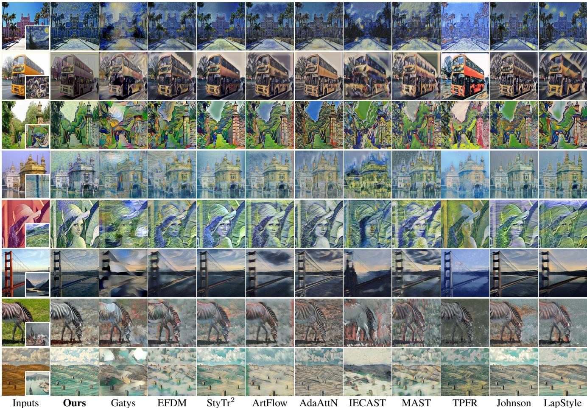  
Figure 3. Qualitative comparisons with state of the art. Zoom-in for better comparison. Please see more in SM.

$$
\mathit { L } _ { S R } = \parallel \mathit { I } _ { s s } - \mathit { I } _ { s } \parallel ,\tag{15}
$$

where $I _ { s s }$ is the stylized result given $I _ { s } ^ { c }$ as content. We optimize it separately before optimizing the style disentanglement loss $\mathcal { L } _ { S D }$ . The detailed fine-tuning procedure can be found in SM. The style reconstruction prior helps our model recover the style information more sufficiently. It also provides a good initialization for the optimization of $\mathcal { L } _ { S D }$ , which helps the latter give full play to its ability, thus producing higher-quality results (see later Sec. 5.3).

## 5. Experimental Results

## 5.1. Implementation Details

We use ADM diffusion model [14] pre-trained on ImageNet [67] and adopt a fast sampling strategy [38]. Specifically, instead of sequentially conducting the diffusion processes until the last timestep $T \ ( e . g .$ ., 1000), we accelerate them by performing up to $T _ { \{ \cdot \} } < T$ (which is called return step), i.e., $T _ { r e m o v } = 6 0 1$ for style removal and $T _ { t r a n s } =$

301 for style transfer. Moreover, as suggested by [38], we further accelerate the forward and reverse processes with fewer discretization steps, i.e., $( S _ { f o r } , S _ { r e v } ) ~ = ~ ( 4 0 , 4 0 )$ $( S _ { f o r }$ for forward process and $S _ { r e v }$ for reverse process) for style removal, and $( S _ { f o r } , S _ { r e v } ) = ( 4 0 , 6 )$ for style transfer. When fine-tuning or inference, we can adjust $T _ { r e m o v }$ or $T _ { t r a n s }$ to flexibly control the degree of style removal and C-S disentanglement, as will be shown in Sec. 5.3. To finetune the model for a target style image, we randomly sample 50 images from ImageNet as the content images. We use Adam optimizer [40] with an initial learning rate of 4e-6 and increase it linearly by 1.2 per epoch. All models are fine-tuned with 5 epochs. See more details in SM.

## 5.2. Comparisons with Prior Arts

We compare our StyleDiffusion against ten state-of-theart (SOTA) methods [18, 90, 12, 1, 53, 6, 13, 74, 32, 52]. For fair comparisons, all these methods are fine-tuned or trained on the target styles similar to our approach.

Qualitative Comparisons. As can be observed in Fig. 3, due to the entangling of C-S representations, Gatys [18] and EFDM [90] often produce unsatisfying results with distorted contents (e.g., rows 1-3) and messy textures (e.g., rows 4-8). $\mathrm { S t y T r ^ { 2 } }$ [12] and ArtFlow [1] improve the results by adopting more advanced networks [77, 41], but they may still produce inferior results with halo boundaries (e.g., rows 2-3) or dirty artifacts (e.g., rows 4-6). AdaAttN [53] performs per-point attentive normalization to preserve the content structures better, but the stylization effects may be degraded in some cases (e.g., rows 1, 2, 4, and 5). IECAST [6] utilizes contrastive learning and external learning for style transfer, so fine-tuning it on a single style image would result in degraded results. MAST [13] uses multi-adaptation networks to disentangle C-S. However, since it still relies on the C-S representations of [18], the results usually exhibit messy textures and conspicuous artifacts. TPFR [74] is a GAN-based framework that learns to disentangle C-S in latent space. As the results show, it cannot recover correct style details and often generates deviated stylizations, which signifies that it may not learn truly disentangled C-S representations [54]. Like our method, Johnson [32] and LapStyle [52] also train separate models for each style. However, due to the trade-off between C-S losses of [18], they may produce less-stylized results or introduce unnatural patterns (e.g., rows 1-6).

<table><tr><td colspan="2"></td><td>Ours</td><td>Gatys</td><td>EFDM</td><td> $\mathrm { S t y T r ^ { 2 } }$ </td><td>ArtFlow</td><td>AdaAttN</td><td>IECAST</td><td>MAST</td><td>TPFR</td><td>Johnson</td><td>LapStyle</td></tr><tr><td colspan="2">SSIM↑</td><td>0.672</td><td>0.311</td><td>0.316</td><td>0.537</td><td>0.501</td><td>0.542</td><td>0.365</td><td>0.392</td><td>0.536</td><td>0.634</td><td>0.657</td></tr><tr><td colspan="2">CLIP Score ↑</td><td>0.741</td><td>0.677</td><td>0.607</td><td>0.531</td><td>0.546</td><td>0.577</td><td>0.646</td><td>0.590</td><td>0.644</td><td>0.537</td><td>0.595</td></tr><tr><td colspan="2">Style Loss ↓</td><td>0.837</td><td>0.111</td><td>0.178</td><td>0.216</td><td>0.258</td><td>0.310</td><td>0.284</td><td>0.229</td><td>0.989</td><td>0.364</td><td>0.274</td></tr><tr><td colspan="2">User</td><td></td><td>43.1%</td><td>41.2%</td><td>39.3%</td><td>36.4%</td><td>37.2%</td><td>33.8%</td><td>39.1%</td><td>14.5%</td><td>42.8%</td><td>47.3%</td></tr><tr><td colspan="2">Study</td><td>1</td><td>26.0%</td><td>38.1%</td><td>44.0%</td><td>34.2%</td><td>43.9%</td><td>32.7%</td><td>32.2%</td><td>22.6%</td><td>43.4%</td><td>46.2%</td></tr><tr><td colspan="2">Training Time/h</td><td>~0.4</td><td></td><td>~3</td><td>~4</td><td>~3</td><td>~3</td><td>~3</td><td>~3</td><td>~10</td><td>~1</td><td>~3</td></tr><tr><td colspan="2">Testing Time/s</td><td>5.612</td><td>10.165</td><td>0.028</td><td>0.168</td><td>0.204</td><td>0.076</td><td>0.034</td><td>0.066</td><td>0.302</td><td>0.015</td><td>0.008</td></tr></table>

Table 1. Quantitative comparisons with state of the art. The training/testing time is measured with an Nvidia Tesla A100 GPU, and the testing time is averaged on images of size 512×512 pixels. ↑: Higher is better. ↓: Lower is better.

By contrast, our StyleDiffusion completely disentangles C-S based on diffusion models. Therefore, it can generate high-quality results with sufficient style details (e.g., rows 1-4) and well-preserved contents (e.g., rows 5-8). Compared with the previous methods that tend to produce mixed results of content and style, our approach can better consider the relationship between them. Thus, the stylizations are more natural and harmonious, especially for challenging styles such as cubism (e.g., row 2) and oil painting (e.g., rows 1, 3, 4, and 5).

Quantitative Comparisons. We also resort to quantitative metrics to better evaluate our method, as shown in Tab. 1. We collect 32 content and 12 style images to synthesize 384 stylized results and compute the average Structural Similarity Index (SSIM) [1] to assess the content similarity. To evaluate the style similarity, we calculate the CLIP image similarity score [62] and Style Loss [18, 27] between the style images and the corresponding stylized results. As shown in Tab. 1, our method obtains the highest SSIM and CLIP Score while the Style Loss is relatively higher than other methods. It is because these methods are directly trained to optimize Style Loss. Nevertheless, the Style Loss achieved by our method is still comparable and lower than the GAN-based TPFR [74]. Furthermore, it is noteworthy that our method can also incorporate Style Loss to enhance the performance in this regard (see later Sec. 5.3).

User Study. As style transfer is highly subjective and CLIP Score and Style Loss are biased to the training objective, we additionally resort to user study to evaluate the style similarity and overall stylization quality. We randomly select 50 C-S pairs for each user. Given each C-S pair, we show the stylized results generated by our method and a randomly selected SOTA method side by side in random order. The users are asked to choose (1) which result transfers the style patterns better and (2) which result has overall better stylization effects. We obtain 1000 votes for each question from 20 users and show the percentage of votes that existing methods are preferred to ours in Tab. 1. The lower numbers indicate our method is more preferred than the competitors. As the results show, our method is superior to others in both style consistency and overall quality.

Efficiency. As shown in the bottom two rows of Tab. 1, our approach requires less training time than others as it is fine-tuned on only a few (∼50) content images. When testing, our approach is faster than the optimization-based method Gatys [18], albeit slower than the remaining feedforward methods due to the utilization of diffusion models. We discuss it in later Sec. 6, and more timing and resource details can be found in SM.

## 5.3. Ablation Study

Control of C-S Disentanglement. A prominent advantage of our StyleDiffusion is that we can flexibly control the C-S disentanglement by adjusting the content extraction of the style removal module (Sec. 4.1). Fig. 4 demonstrates the continuous control achieved by adjusting the return step $T _ { r e m o v }$ of the style removal module. As shown in the top row, with the increase of $T _ { r e m o v }$ , more style characteristics are dispelled, and the main content structures are retained. Correspondingly, when more style is removed in the top row, it will be aptly transferred to the stylized results in the bottom row, $e . g .$ , the twisted brushstrokes and the star patterns. It validates that our method successfully separates style from content in a controllable manner and properly transfers it to other contents. Moreover, the flexible C-S disentanglement also makes our StyleDiffusion versatile for other tasks, such as photo-realistic style transfer (see SM).

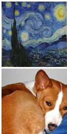  
Inputs

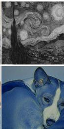  
201

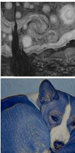  
401

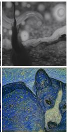  
601\*

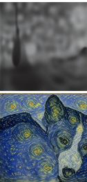  
801  
Figure 4. Control of C-S disentanglement by adjusting the return step $T _ { r e m o v }$ of the style removal module. The top row shows the extracted contents of the style image. The bottom row shows the corresponding stylized results. \* denotes our default setting. Zoom-in for better comparison. See SMfor quantitative analyses.

Superiority of Diffusion-based Style Transfer. Although our style transfer module is not limited to the diffusion model, using it offers three main advantages: (1) Flexible C-S trade-off control. As shown in Fig. 5, we can flexibly control the C-S trade-off at both the training stage (top row) and the testing stage (bottom row) by adjusting the return step $T _ { t r a n s }$ of the diffusion model. With the increase of $T _ { t r a n s } ,$ more style characteristics are transferred, yet the content structures may be ruined $( e . g .$ , the last column). When proper $T _ { t r a n s }$ is adopted, $e . g . , T _ { t r a n s } = 3 0 1$ the sweet spot can be well achieved. Interestingly, as shown in the last two columns of the bottom row, though the model is trained on $T _ { t r a n s } = 3 0 1$ , we can extrapolate the style by using larger $T _ { t r a n s } \ ( e . g . , 4 0 1 )$ at the testing stage (but the results may be degraded when using too large $T _ { t r a n s } , e . g .$ 601). It provides a very flexible way for users to adjust the results according to their preferences. This property, however, cannot be simply achieved by using other models, e.g., the widely used AEs [27, 50], since our framework does not involve any feature transforms [27, 50] or C-S losses trade-off [3]. (2) Higher-quality stylizations. Owing to the strong generative ability of the diffusion model, it can achieve higher-quality stylizations than other models. For comparison, we use the pre-trained VGG-AE [27, 46] as the style transfer module and fine-tune its decoder network for each style. As shown in column (b) of Fig. 6, though the results are still acceptable, they may produce distorted contents and inferior textures, clearly worse than the results generated by the diffusion model in column (a). This is also validated by the bottom quantitative scores. It signifies that the diffusion model can better learn the disentangled content and style characteristics in our framework, helping produce better style transfer results. (3) Diversified style transfer. As mentioned in Sec. 4.2, during inference, we can directly adopt the stochastic DDPM [25] forward process (Eq. (2)) to obtain diverse results (see SM). The diverse results can give users endless choices to obtain more satisfactory results. However, using other models like AEs in our framework cannot easily achieve it [81].

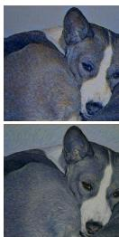  
101

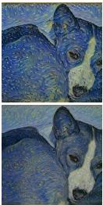  
201

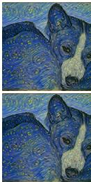  
301\*

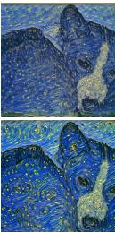  
401

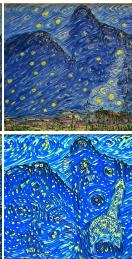  
601

Figure 5. Control of C-S trade-off by adjusting the return step $T _ { t r a n s }$ of the style transfer module. The top row shows adjusting $T _ { t r a n s }$ at the training stage while fixing $T _ { t r a n s } = 3 0 1$ at the testing stage. The bottom row shows adjusting $T _ { t r a n s }$ at the testing stage while fixing $T _ { t r a n s } = 3 0 1$ at the training stage. \* denotes our default setting. Zoom-in for better comparison. See SM for quantitative analyses.  
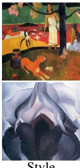  
Style

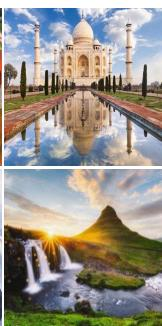  
Content

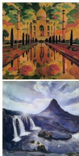  
(a) Diffusion

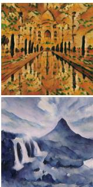  
(b) AE  
SSIM / CLIP Score:  
0.672 / 0.741 0.526 / 0.702  
Figure 6. Diffusion-based vs. AE-based style transfer.

Loss Analyses. To verify the effectiveness of each loss term used for fine-tuning our StyleDiffusion, we present ablation study results in Fig. 7 (a-d). (1) Using L1 loss $\mathcal { L } _ { S D } ^ { L 1 }$ successfully transfers the cubism style like the blocky pat terns in the top row, but the colors stray from the style images, especially in the bottom row. It is consistent with our earlier analyses in Sec. 4.3 that the L1 loss is prone to produce implausible results outside the style domain. (2) Adding direction loss $\mathcal { L } _ { S D } ^ { d i r }$ helps pull the results closer to the style domain. The textures are enhanced in the top row, and the colors are more plausible in the top and bottom rows. (3) By further coordinating with the style recon struction prior $\mathcal { L } _ { S R } .$ , the stylization effects are significantly elevated where the style information is recovered more sufficiently. It may be because it provides a good initialization for the optimization of $\mathcal { L } _ { S D } ^ { L 1 }$ and $\mathcal { L } _ { S D } ^ { d i r }$ , which helps them give full play to their abilities. As verified in Fig. 7 (d), using the style reconstruction alone cannot learn meaningful style patterns except for basic colors. All the above analyses are also supported by the bottom quantitative scores.

SSIM: CLIP Score: Style Loss:  
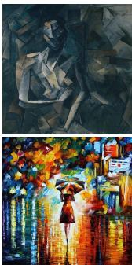  
Style

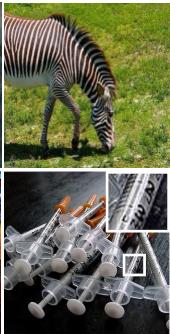  
Content  
SSIM / CLIP Score:

(a) LL1SD  
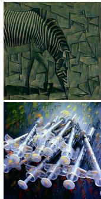

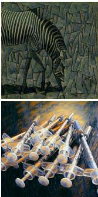  
(b) + Ldir SD

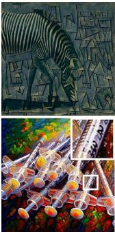  
(c) + LSR\*

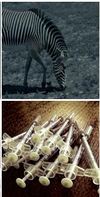  
(d) $\mathcal { L } _ { S R }$

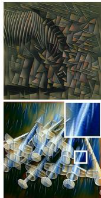  
(e) LGram

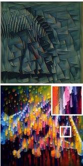  
(f) + LSR  
0.660 / 0.652 0.693 / 0.705 0.672 / 0.741 0.793 / 0.488 0.429 / 0.712 0.367 / 0.763  
Figure 7. Ablation study on loss functions. \* denotes our full model. Zoom-in for better comparison.

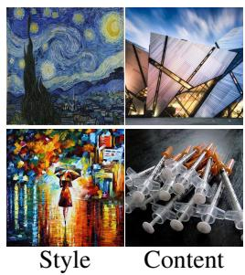

(a) $\mathcal { L } _ { G r a m }$  
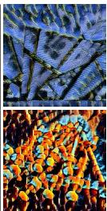

In this work, we present a new framework for more interpretable and controllable C-S disentanglement and style transfer. Our framework, termed StyleDiffusion, leverages

(b) Ours  
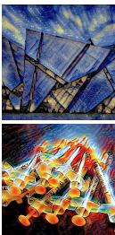

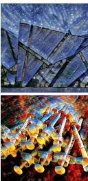  
(c) Both

## 6. Conclusion and Limitation

Comparison with Gram Loss. To further verify the superiority of our proposed losses, we replace them with the widely used Gram Loss [18, 27] in Fig. 7 (e-f). As can be observed, Gram Loss destroys the content structures severely, e.g., the zebra head in the top row and the enlarged area in the bottom row. This is because it does not disentangle C-S and only matches the global statistics without considering the relationship between C-S. In contrast, our losses focus on learning the disentangled style information apart from the content, which is induced by the difference between content and its stylized result. Therefore, they can better understand the relationship between C-S, achieving more satisfactory results with fine style details and betterpreserved contents, as validated by Fig. 7 (c) and the bottom quantitative scores. Furthermore, we also conduct comparisons between our proposed losses and Gram Loss [18, 27] on the AE baseline [27, 46] to eliminate the impact of diffusion models. As shown in Fig. 8 (a-b), our losses can achieve more satisfactory results than Gram Loss, which is consistent with the results in Fig. 7. Moreover, as shown in Fig. 8 (c), they can also be combined with Gram Loss to improve the performance on the Style Loss metric. However, it may affect the full disentanglement of C-S in our framework, which strays from our target and decreases the content preservation (see SSIM score in Fig. 8 (c)). Therefore, we do not incorporate Gram Loss in our framework by default.

Figure 8. More loss function ablation study on the AE baseline.

diffusion models to explicitly extract the content information and implicitly learn the complementary style information. A novel CLIP-based style disentanglement loss coordinated with a style reconstruction prior is also introduced to encourage the disentanglement and style transfer. Our method yields very encouraging stylizations, especially for challenging styles, and the experimental results verify its effectiveness and superiority against state of the art.

Currently, the framework still suffers from several limitations: (1) The model needs to be fine-tuned for each style, and arbitrary style transfer is left to our future work. (2) The efficiency is not fast enough due to the use of diffusion models. Further research in accelerating diffusion sampling would be helpful. (3) There are some failure cases analyzed in SM, which may help inspire future improvements. Moreover, our framework may also be applied to other image translation [28] or manipulation [60] tasks, and we would like to explore them in our future work.

## References

[1] Jie An, Siyu Huang, Yibing Song, Dejing Dou, Wei Liu, and Jiebo Luo. Artflow: Unbiased image style transfer via reversible neural flows. In Proceedings of the IEEE/CVF Conference on Computer Vision and Pattern Recognition (CVPR), pages 862–871, 2021. 1, 2, 6, 7

[2] Omri Avrahami, Dani Lischinski, and Ohad Fried. Blended diffusion for text-driven editing of natural images. In Proceedings of the IEEE/CVF Conference on Computer Vision and Pattern Recognition (CVPR), pages 18208–18218, 2022. 2

[3] Mohammad Babaeizadeh and Golnaz Ghiasi. Adjustable real-time style transfer. In International Conference on Learning Representations (ICLR), 2019. 8

[4] Andreas Blattmann, Robin Rombach, Kaan Oktay, Jonas Muller, and Bj¨ orn Ommer. Retrieval-augmented diffusion¨ models. Advances in Neural Information Processing Systems, 35:15309–15324, 2022. 2

[5] Dongdong Chen, Lu Yuan, Jing Liao, Nenghai Yu, and Gang Hua. Stylebank: An explicit representation for neural image style transfer. In Proceedings of the IEEE/CVF Conference on Computer Vision and Pattern Recognition (CVPR), pages 1897–1906, 2017. 2

[6] Haibo Chen, Lei Zhao, Zhizhong Wang, Huiming Zhang, Zhiwen Zuo, Ailin Li, Wei Xing, and Dongming Lu. Artistic style transfer with internal-external learning and contrastive learning. Advances in Neural Information Processing Systems (NeurIPS), 34:26561–26573, 2021. 1, 2, 6, 7

[7] Haibo Chen, Lei Zhao, Zhizhong Wang, Huiming Zhang, Zhiwen Zuo, Ailin Li, Wei Xing, and Dongming Lu. Dualast: Dual style-learning networks for artistic style transfer. In Proceedings of the IEEE/CVF Conference on Computer Vision and Pattern Recognition (CVPR), pages 872– 881, 2021. 2

[8] Haibo Chen, Lei Zhao, Huiming Zhang, Zhizhong Wang, Zhiwen Zuo, Ailin Li, Wei Xing, and Dongming Lu. Diverse image style transfer via invertible cross-space mapping. In 2021 IEEE/CVF International Conference on Computer Vision (ICCV), pages 14860–14869. IEEE Computer Society, 2021. 2

[9] Xi Chen, Yan Duan, Rein Houthooft, John Schulman, Ilya Sutskever, and Pieter Abbeel. Infogan: Interpretable representation learning by information maximizing generative adversarial nets. Advances in Neural Information Processing Systems (NeurIPS), 29, 2016. 1

[10] Jiaxin Cheng, Ayush Jaiswal, Yue Wu, Pradeep Natarajan, and Prem Natarajan. Style-aware normalized loss for improving arbitrary style transfer. In Proceedings of the IEEE/CVF Conference on Computer Vision and Pattern Recognition (CVPR), pages 134–143, 2021. 2

[11] Jooyoung Choi, Sungwon Kim, Yonghyun Jeong, Youngjune Gwon, and Sungroh Yoon. Ilvr: Conditioning method for denoising diffusion probabilistic models. In 2021 IEEE/CVF International Conference on Computer Vision (ICCV), pages 14347–14356. IEEE, 2021. 4

[12] Yingying Deng, Fan Tang, Weiming Dong, Chongyang Ma, Xingjia Pan, Lei Wang, and Changsheng Xu. Stytr2: Im-

age style transfer with transformers. In Proceedings of the IEEE/CVF Conference on Computer Vision and Pattern Recognition (CVPR), pages 11326–11336, 2022. 2, 6, 7

[13] Yingying Deng, Fan Tang, Weiming Dong, Wen Sun, Feiyue Huang, and Changsheng Xu. Arbitrary style transfer via multi-adaptation network. In Proceedings of the 28th ACM International Conference on Multimedia (ACM MM), pages 2719–2727, 2020. 2, 6, 7

[14] Prafulla Dhariwal and Alexander Nichol. Diffusion models beat gans on image synthesis. Advances in Neural Information Processing Systems (NeurIPS), 34:8780–8794, 2021. 2, 3, 4, 6

[15] Patrick Esser, Robin Rombach, and Bjorn Ommer. Taming transformers for high-resolution image synthesis. In Proceedings of the IEEE/CVF Conference on Computer Vision and Pattern Recognition (CVPR), pages 12873–12883, 2021. 2

[16] Wan-Cyuan Fan, Yen-Chun Chen, DongDong Chen, Yu Cheng, Lu Yuan, and Yu-Chiang Frank Wang. Frido: Feature pyramid diffusion for complex scene image synthesis. In Proceedings of the AAAI Conference on Artificial Intelligence, volume 37, pages 579–587, 2023. 2

[17] Rinon Gal, Or Patashnik, Haggai Maron, Amit H Bermano, Gal Chechik, and Daniel Cohen-Or. Stylegan-nada: Clipguided domain adaptation of image generators. ACM Transactions on Graphics (TOG), 41(4):1–13, 2022. 5

[18] Leon A Gatys, Alexander S Ecker, and Matthias Bethge. Image style transfer using convolutional neural networks. In Proceedings of the IEEE/CVF Conference on Computer Vision and Pattern Recognition (CVPR), pages 2414–2423, 2016. 1, 2, 5, 6, 7, 9

[19] Rafael C Gonzalez. Digital image processing. Pearson education india, 2009. 4

[20] Ian Goodfellow, Jean Pouget-Abadie, Mehdi Mirza, Bing Xu, David Warde-Farley, Sherjil Ozair, Aaron Courville, and Yoshua Bengio. Generative adversarial nets. In Advances in Neural Information Processing Systems (NeurIPS), 2014. 1, 2

[21] Daniel J Graham, James M Hughes, Helmut Leder, and Daniel N Rockmore. Statistics, vision, and the analysis of artistic style. Wiley Interdisciplinary Reviews: Computational Statistics, 4(2):115–123, 2012. 2

[22] Shuyang Gu, Congliang Chen, Jing Liao, and Lu Yuan. Arbitrary style transfer with deep feature reshuffle. In Proceedings of the IEEE/CVF Conference on Computer Vision and Pattern Recognition (CVPR), pages 8222–8231, 2018. 2

[23] Shuyang Gu, Dong Chen, Jianmin Bao, Fang Wen, Bo Zhang, Dongdong Chen, Lu Yuan, and Baining Guo. Vector quantized diffusion model for text-to-image synthesis. In Proceedings of the IEEE/CVF Conference on Computer Vision and Pattern Recognition, pages 10696–10706, 2022. 2

[24] Irina Higgins, David Amos, David Pfau, Sebastien Racaniere, Loic Matthey, Danilo Rezende, and Alexander Lerchner. Towards a definition of disentangled representations. arXiv preprint arXiv:1812.02230, 2018. 1, 2

[25] Jonathan Ho, Ajay Jain, and Pieter Abbeel. Denoising diffusion probabilistic models. Advances in Neural Information

Processing Systems (NeurIPS), 33:6840–6851, 2020. 2, 3, 4, 8

[26] Kibeom Hong, Seogkyu Jeon, Huan Yang, Jianlong Fu, and Hyeran Byun. Domain-aware universal style transfer. In Proceedings of the IEEE/CVF International Conference on Computer Vision (ICCV), 2021. 2

[27] Xun Huang and Serge Belongie. Arbitrary style transfer in real-time with adaptive instance normalization. In Proceedings of the IEEE/CVF International Conference on Computer Vision (ICCV), pages 1501–1510, 2017. 1, 2, 4, 7, 8, 9

[28] Xun Huang, Ming-Yu Liu, Serge Belongie, and Jan Kautz. Multimodal unsupervised image-to-image translation. In Proceedings of the European Conference on Computer Vision (ECCV), pages 172–189, 2018. 2, 9

[29] Jing Huo, Shiyin Jin, Wenbin Li, Jing Wu, Yu-Kun Lai, Yinghuan Shi, and Yang Gao. Manifold alignment for semantically aligned style transfer. In Proceedings of the IEEE/CVF International Conference on Computer Vision (ICCV), pages 14861–14869, 2021. 2

[30] Yongcheng Jing, Xiao Liu, Yukang Ding, Xinchao Wang, Errui Ding, Mingli Song, and Shilei Wen. Dynamic instance normalization for arbitrary style transfer. In Proceedings of the AAAI Conference on Artificial Intelligence, volume 34, pages 4369–4376, 2020. 2

[31] Yongcheng Jing, Yezhou Yang, Zunlei Feng, Jingwen Ye, Yizhou Yu, and Mingli Song. Neural style transfer: A review. IEEE Transactions on Visualization and Computer Graphics (TVCG), 26(11):3365–3385, 2019. 2

[32] Justin Johnson, Alexandre Alahi, and Li Fei-Fei. Perceptual losses for real-time style transfer and super-resolution. In Proceedings of the European Conference on Computer Vision (ECCV), pages 694–711. Springer, 2016. 1, 2, 6, 7

[33] Henry Kang, Seungyong Lee, and Charles K Chui. Coherent line drawing. In Proceedings of the 5th international symposium on Non-photorealistic animation and rendering, pages 43–50, 2007. 4

[34] Theofanis Karaletsos, Serge Belongie, and Gunnar Ratsch.¨ Bayesian representation learning with oracle constraints. arXiv preprint arXiv:1506.05011, 2015. 1, 2

[35] Sergey Karayev, Matthew Trentacoste, Helen Han, Aseem Agarwala, Trevor Darrell, Aaron Hertzmann, and Holger Winnemoeller. Recognizing image style. arXiv preprint arXiv:1311.3715, 2013. 2

[36] Tero Karras, Samuli Laine, and Timo Aila. A style-based generator architecture for generative adversarial networks. In Proceedings of the IEEE/CVF Conference on Computer Vision and Pattern Recognition (CVPR), pages 4401–4410, 2019. 2

[37] Hadi Kazemi, Seyed Mehdi Iranmanesh, and Nasser Nasrabadi. Style and content disentanglement in generative adversarial networks. In 2019 IEEE Winter Conference on Applications of Computer Vision (WACV), pages 848–856. IEEE, 2019. 2

[38] Gwanghyun Kim, Taesung Kwon, and Jong Chul Ye. Diffusionclip: Text-guided diffusion models for robust image manipulation. In Proceedings of the IEEE/CVF Conference

on Computer Vision and Pattern Recognition (CVPR), pages 2426–2435, 2022. 2, 3, 4, 6

[39] Hyunjik Kim and Andriy Mnih. Disentangling by factorising. In International Conference on Machine Learning (ICML), pages 2649–2658. PMLR, 2018. 2

[40] Diederik P Kingma and Jimmy Ba. Adam: A method for stochastic optimization. In International Conference on Learning Representations (ICLR), 2015. 6

[41] Durk P Kingma and Prafulla Dhariwal. Glow: Generative flow with invertible 1x1 convolutions. Advances in Neural Information Processing Systems (NeurIPS), 31, 2018. 2, 7

[42] Dmytro Kotovenko, Artsiom Sanakoyeu, Sabine Lang, and Bjorn Ommer. Content and style disentanglement for artistic style transfer. In Proceedings ofthe IEEE/CVF International Conference on Computer Vision (ICCV), pages 4422–4431, 2019. 1, 2, 5

[43] Dmytro Kotovenko, Matthias Wright, Arthur Heimbrecht, and Bjorn Ommer. Rethinking style transfer: From pixels to parameterized brushstrokes. In Proceedings of the IEEE/CVF Conference on Computer Vision and Pattern Recognition (CVPR), pages 12196–12205, 2021. 2

[44] Tejas D Kulkarni, William F Whitney, Pushmeet Kohli, and Josh Tenenbaum. Deep convolutional inverse graphics network. Advances in Neural Information Processing Systems (NeurIPS), 28, 2015. 1

[45] Gihyun Kwon and Jong Chul Ye. Diagonal attention and style-based gan for content-style disentanglement in image generation and translation. In Proceedings ofthe IEEE/CVF International Conference on Computer Vision, pages 13980– 13989, 2021. 2

[46] Gihyun Kwon and Jong Chul Ye. Clipstyler: Image style transfer with a single text condition. In Proceedings of the IEEE/CVF Conference on Computer Vision and Pattern Recognition (CVPR), pages 18062–18071, 2022. 5, 8, 9

[47] Berel Lang. The concept of style. Cornell University Press, 1987. 4

[48] Hsin-Ying Lee, Hung-Yu Tseng, Jia-Bin Huang, Maneesh Singh, and Ming-Hsuan Yang. Diverse image-to-image translation via disentangled representations. In Proceedings of the European Conference on Computer Vision (ECCV), pages 35–51, 2018. 2

[49] Xueting Li, Sifei Liu, Jan Kautz, and Ming-Hsuan Yang. Learning linear transformations for fast image and video style transfer. In Proceedings of the IEEE/CVF Conference on Computer Vision and Pattern Recognition (CVPR), 2019. 2

[50] Yijun Li, Chen Fang, Jimei Yang, Zhaowen Wang, Xin Lu, and Ming-Hsuan Yang. Universal style transfer via feature transforms. In Advances in Neural Information Processing Systems (NeurIPS), pages 386–396, 2017. 1, 2, 4, 8

[51] Yuheng Li, Haotian Liu, Qingyang Wu, Fangzhou Mu, Jianwei Yang, Jianfeng Gao, Chunyuan Li, and Yong Jae Lee. Gligen: Open-set grounded text-to-image generation. In Proceedings of the IEEE/CVF Conference on Computer Vision and Pattern Recognition, pages 22511–22521, 2023. 2

[52] Tianwei Lin, Zhuoqi Ma, Fu Li, Dongliang He, Xin Li, Errui Ding, Nannan Wang, Jie Li, and Xinbo Gao. Drafting and

revision: Laplacian pyramid network for fast high-quality artistic style transfer. In Proceedings of the IEEE/CVF Conference on Computer Vision and Pattern Recognition (CVPR), pages 5141–5150, 2021. 2, 6, 7

[53] Songhua Liu, Tianwei Lin, Dongliang He, Fu Li, Meiling Wang, Xin Li, Zhengxing Sun, Qian Li, and Errui Ding. Adaattn: Revisit attention mechanism in arbitrary neural style transfer. In Proceedings of the IEEE/CVF International Conference on Computer Vision (ICCV), pages 6649–6658, 2021. 2, 6, 7

[54] Francesco Locatello, Stefan Bauer, Mario Lucic, Gunnar Raetsch, Sylvain Gelly, Bernhard Scholkopf, and Olivier¨ Bachem. Challenging common assumptions in the unsupervised learning of disentangled representations. In International Conference on Machine Learning (ICML), pages 4114–4124. PMLR, 2019. 1, 2, 7

[55] Haofei Lu and Zhizhong Wang. Universal video style transfer via crystallization, separation, and blending. In Proceedings of the International Joint Conferences on Artificial Intelligence Organization (IJCAI), Vienna, Austria, pages 23–29, 2022. 2

[56] Chenlin Meng, Yutong He, Yang Song, Jiaming Song, Jiajun Wu, Jun-Yan Zhu, and Stefano Ermon. Sdedit: Guided image synthesis and editing with stochastic differential equations. In International Conference on Learning Representations (ICLR), 2021. 2

[57] Alexander Quinn Nichol and Prafulla Dhariwal. Improved denoising diffusion probabilistic models. In International Conference on Machine Learning (ICML), pages 8162– 8171. PMLR, 2021. 2, 3

[58] Alexander Quinn Nichol, Prafulla Dhariwal, Aditya Ramesh, Pranav Shyam, Pamela Mishkin, Bob Mcgrew, Ilya Sutskever, and Mark Chen. Glide: Towards photorealistic image generation and editing with text-guided diffusion models. In International Conference on Machine Learning (ICML), pages 16784–16804. PMLR, 2022. 2

[59] Dae Young Park and Kwang Hee Lee. Arbitrary style transfer with style-attentional networks. In Proceedings of the IEEE/CVF Conference on Computer Vision and Pattern Recognition (CVPR), pages 5880–5888, 2019. 2

[60] Taesung Park, Jun-Yan Zhu, Oliver Wang, Jingwan Lu, Eli Shechtman, Alexei Efros, and Richard Zhang. Swapping autoencoder for deep image manipulation. Advances in Neural Information Processing Systems (NeurIPS), 33:7198–7211, 2020. 2, 9

[61] DM Parker and Jan B Deregowski. Perception and artistic style. Elsevier, 1991. 2

[62] Alec Radford, Jong Wook Kim, Chris Hallacy, Aditya Ramesh, Gabriel Goh, Sandhini Agarwal, Girish Sastry, Amanda Askell, Pamela Mishkin, Jack Clark, et al. Learning transferable visual models from natural language supervision. In International Conference on Machine Learning (ICML), pages 8748–8763. PMLR, 2021. 2, 5, 7

[63] Aditya Ramesh, Prafulla Dhariwal, Alex Nichol, Casey Chu, and Mark Chen. Hierarchical text-conditional image generation with clip latents. arXiv preprint arXiv:2204.06125, 2022. 2, 5

[64] Xuanchi Ren, Tao Yang, Yuwang Wang, and Wenjun Zeng. Rethinking content and style: Exploring bias for unsupervised disentanglement. In 2021 IEEE/CVF International Conference on Computer Vision Workshops (ICCVW), pages 1823–1832. IEEE, 2021. 1, 2

[65] Robin Rombach, Andreas Blattmann, Dominik Lorenz, Patrick Esser, and Bjorn Ommer. High-resolution image¨ synthesis with latent diffusion models. In Proceedings of the IEEE/CVF Conference on Computer Vision and Pattern Recognition (CVPR), pages 10684–10695, 2022. 2

[66] Olaf Ronneberger, Philipp Fischer, and Thomas Brox. Unet: Convolutional networks for biomedical image segmentation. In International Conference on Medical Image Computing and Computer-assisted Intervention, pages 234–241. Springer, 2015. 3

[67] Olga Russakovsky, Jia Deng, Hao Su, Jonathan Krause, Sanjeev Satheesh, Sean Ma, Zhiheng Huang, Andrej Karpathy, Aditya Khosla, Michael Bernstein, et al. Imagenet large scale visual recognition challenge. International Journal of Computer Vision (IJCV), 115(3):211–252, 2015. 6

[68] Chitwan Saharia, William Chan, Saurabh Saxena, Lala Li, Jay Whang, Emily Denton, Seyed Kamyar Seyed Ghasemipour, Raphael Gontijo-Lopes, Burcu Karagol Ayan, Tim Salimans, et al. Photorealistic text-to-image diffusion models with deep language understanding. In Advances in Neural Information Processing Systems (NeurIPS), 2022. 2

[69] Artsiom Sanakoyeu, Dmytro Kotovenko, Sabine Lang, and Bjorn Ommer. A style-aware content loss for real-time hd style transfer. In Proceedings of the European Conference on Computer Vision (ECCV), pages 698–714, 2018. 1

[70] Lu Sheng, Ziyi Lin, Jing Shao, and Xiaogang Wang. Avatarnet: Multi-scale zero-shot style transfer by feature decoration. In Proceedings of the IEEE/CVF Conference on Computer Vision and Pattern Recognition (CVPR), pages 8242– 8250, 2018. 2

[71] Karen Simonyan and Andrew Zisserman. Very deep convolutional networks for large-scale image recognition. arXiv preprint arXiv:1409.1556, 2014. 1

[72] Jascha Sohl-Dickstein, Eric Weiss, Niru Maheswaranathan, and Surya Ganguli. Deep unsupervised learning using nonequilibrium thermodynamics. In International Conference on Machine Learning (ICML), pages 2256–2265. PMLR, 2015. 2

[73] Jiaming Song, Chenlin Meng, and Stefano Ermon. Denoising diffusion implicit models. In International Conference on Learning Representations (ICLR), 2020. 2, 3, 4

[74] Jan Svoboda, Asha Anoosheh, Christian Osendorfer, and Jonathan Masci. Two-stage peer-regularized feature recombination for arbitrary image style transfer. In Proceedings of the IEEE/CVF Conference on Computer Vision and Pattern Recognition (CVPR), pages 13816–13825, 2020. 1, 6, 7

[75] Dmitry Ulyanov, Andrea Vedaldi, and Victor Lempitsky. Improved texture networks: Maximizing quality and diversity in feed-forward stylization and texture synthesis. In Proceedings of the IEEE/CVF Conference on Computer Vision and Pattern Recognition (CVPR), pages 6924–6932, 2017. 2

[76] Aaron Van Den Oord, Oriol Vinyals, et al. Neural discrete representation learning. Advances in Neural Information Processing Systems (NeurIPS), 30, 2017. 2

[77] Ashish Vaswani, Noam Shazeer, Niki Parmar, Jakob Uszkoreit, Llion Jones, Aidan N Gomez, Łukasz Kaiser, and Illia Polosukhin. Attention is all you need. Advances in Neural Information Processing Systems (NeurIPS), 30, 2017. 7

[78] Pei Wang, Yijun Li, and Nuno Vasconcelos. Rethinking and improving the robustness of image style transfer. In Proceedings of the IEEE/CVF Conference on Computer Vision and Pattern Recognition (CVPR), pages 124–133, 2021. 2

[79] Zhizhong Wang, Zhanjie Zhang, Lei Zhao, Zhiwen Zuo, Ailin Li, Wei Xing, and Dongming Lu. Aesust: Towards aesthetic-enhanced universal style transfer. In Proceedings of the 30th ACM International Conference on Multimedia (ACM MM), pages 1095–1106, 2022. 2

[80] Zhizhong Wang, Lei Zhao, Haibo Chen, Ailin Li, Zhiwen Zuo, Wei Xing, and Dongming Lu. Texture reformer: Towards fast and universal interactive texture transfer. In Proceedings of the AAAI Conference on Artificial Intelligence, volume 36, pages 2624–2632, 2022. 2

[81] Zhizhong Wang, Lei Zhao, Haibo Chen, Lihong Qiu, Qihang Mo, Sihuan Lin, Wei Xing, and Dongming Lu. Diversified arbitrary style transfer via deep feature perturbation. In Proceedings of the IEEE/CVF Conference on Computer Vision and Pattern Recognition (CVPR), pages 7789–7798, 2020. 2, 4, 8

[82] Zhizhong Wang, Lei Zhao, Haibo Chen, Zhiwen Zuo, Ailin Li, Wei Xing, and Dongming Lu. Evaluate and improve the quality of neural style transfer. Computer Vision and Image Understanding (CVIU), 207:103203, 2021. 2

[83] Zhizhong Wang, Lei Zhao, Haibo Chen, Zhiwen Zuo, Ailin Li, Wei Xing, and Dongming Lu. Divswapper: Towards diversified patch-based arbitrary style transfer. In Proceedings of the Thirty-First International Joint Conference on Artificial Intelligence (IJCAI), pages 4980–4987, 2022. 2

[84] Zhizhong Wang, Lei Zhao, Sihuan Lin, Qihang Mo, Huiming Zhang, Wei Xing, and Dongming Lu. Glstylenet: exquisite style transfer combining global and local pyramid features. IET Computer Vision, 14(8):575–586, 2020. 2

[85] Zhizhong Wang, Lei Zhao, Zhiwen Zuo, Ailin Li, Haibo Chen, Wei Xing, and Dongming Lu. Microast: Towards super-fast ultra-resolution arbitrary style transfer. In Proceedings of the AAAI Conference on Artificial Intelligence, volume 37, pages 2742–2750, 2023. 2

[86] Wayne Wu, Kaidi Cao, Cheng Li, Chen Qian, and Chen Change Loy. Disentangling content and style via unsupervised geometry distillation. arXiv preprint arXiv:1905.04538, 2019. 2

[87] Xiaolei Wu, Zhihao Hu, Lu Sheng, and Dong Xu. Styleformer: Real-time arbitrary style transfer via parametric style composition. In Proceedings of the IEEE/CVF International Conference on Computer Vision (ICCV), pages 14618–14627, 2021. 2

[88] Zijie Wu, Zhen Zhu, Junping Du, and Xiang Bai. Ccpl: Contrastive coherence preserving loss for versatile style transfer. In Proceedings of the European Conference on Computer Vision (ECCV), 2022. 2

[89] Saining Xie and Zhuowen Tu. Holistically-nested edge detection. In Proceedings of the IEEE International Conference on Computer Vision (ICCV), pages 1395–1403, 2015. 4

[90] Yabin Zhang, Minghan Li, Ruihuang Li, Kui Jia, and Lei Zhang. Exact feature distribution matching for arbitrary style transfer and domain generalization. In Proceedings of the IEEE/CVF Conference on Computer Vision and Pattern Recognition (CVPR), pages 8035–8045, 2022. 1, 2, 6, 7

[91] Yuxin Zhang, Fan Tang, Weiming Dong, Haibin Huang, Chongyang Ma, Tong-Yee Lee, and Changsheng Xu. Domain enhanced arbitrary image style transfer via contrastive learning. In ACM SIGGRAPH 2022 Conference Proceedings, pages 1–8, 2022. 2

[92] Yu Zhang, Peter Tino, Ale ˇ s Leonardis, and Ke Tang. A sur-ˇ vey on neural network interpretability. IEEE Transactions on Emerging Topics in Computational Intelligence, 2021. 1

[93] Yexun Zhang, Ya Zhang, and Wenbin Cai. Separating style and content for generalized style transfer. In Proceedings of the IEEE Conference on Computer Vision and Pattern Recognition (CVPR), pages 8447–8455, 2018. 1, 2

[94] Zhiwen Zuo, Lei Zhao, Shuobin Lian, Haibo Chen, Zhizhong Wang, Ailin Li, Wei Xing, and Dongming Lu. Style fader generative adversarial networks for style degree controllable artistic style transfer. In Proc. Int. Joint Conf. on Artif. Intell.(IJCAI), pages 5002–5009, 2022. 2