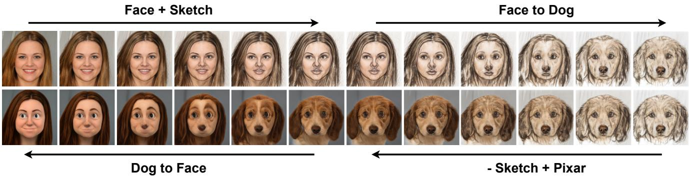
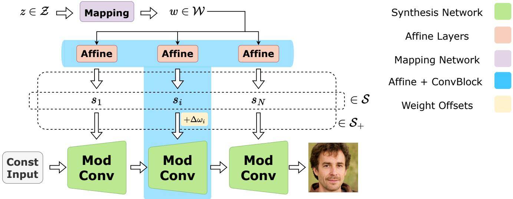
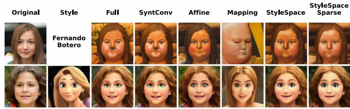
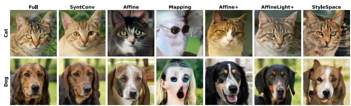
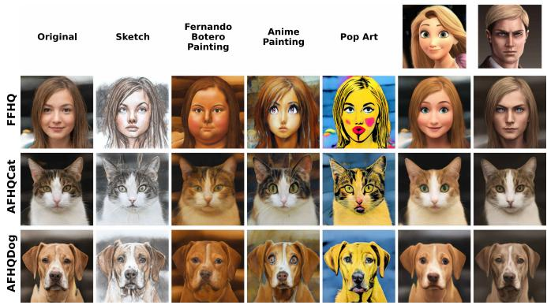
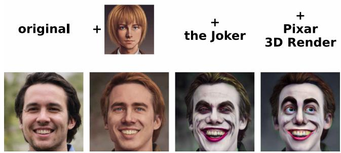
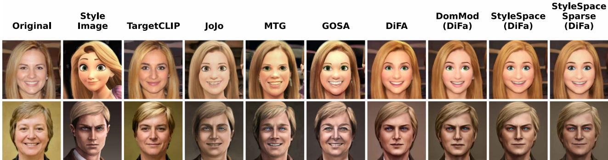
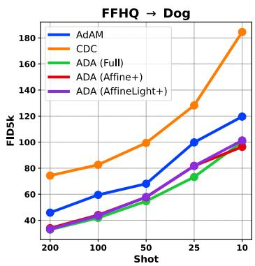
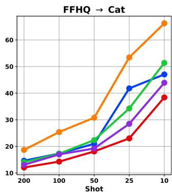

# StyleDomain: Efficient and Lightweight Parameterizations of StyleGAN for One-shot and Few-shot Domain Adaptation

Aibek Alanov2,1,\*, Vadim Titov2,\*, Maksim Nakhodnov2,3\*, Dmitry Vetrov1,2

1HSE University 2AIRI 3Lomonosov Moscow State University

aalanov@hse.ru, titov@2a2i.org, nakhodnov@2a2i.org, dvetrov@hse.ru

  
Figure 1: Smooth cross-domain image morphing. Morphing in the space of generator weights could be successfully combined with morphing using StyleDomain directions, i.e. directions in the StyleSpace that can adapt the generator to new domains (see Section 4).

## Abstract

Domain adaptation of GANs is a problem offine-tuning GAN models pretrained on a large dataset (e.g. StyleGAN) to a specific domain with few samples (e.g. painting faces, sketches, etc.). While there are many methods that tackle this problem in different ways, there are still many important questions that remain unanswered. In this paper, we provide a systematic and in-depth analysis of the domain adaptation problem of GANs, focusing on the StyleGAN model. We perform a detailed exploration of the most important parts of StyleGAN that are responsible for adapting the generator to a new domain depending on the similarity between the source and target domains. As a result of this study, we propose new efficient and lightweight parameterizations of StyleGANfor domain adaptation. Particularly, we show that there exist directions in StyleSpace (StyleDomain directions) that are sufficient for adapting to similar domains. For dissimilar domains, we propose Affine+ and AffineLight+ parameterizations that allows us to outperform existing baselines infew-shot adaptation while having significantly less training parameters. Finally, we examine StyleDomain directions and discover their many sur-

prising properties that we apply for domain mixing and cross-domain image morphing. Source code can be found at https://github.com/AIRI-Institute/StyleDomain.

## 1. Introduction

Recent years GANs [12, 20, 21, 19, 5] have shown impressive results in image synthesis and offered many ways to control the generated data. In particular, the state-of-theart StyleGAN models [20, 21, 19] have many practical applications such as image enhancement [46, 24, 6, 41], image editing [17, 35, 14, 37, 1, 43, 29], image-to-image translation [31, 16, 36, 11] thanks to their high-quality image generation and their latent representation that has rich semantics and disentangled controls for localized meaningful image manipulations. However, it comes at a price, as the training of StyleGAN requires a large, high-quality dataset that significantly limits its applicability because many realworld domains are represented by few images. The standard approach to deal with this problem is transfer learning, i.e. fine-tuning the model pretrained on the source domain A to the target domain B.

There are many domain adaptation methods for Style-GAN [18, 39, 50, 52, 23, 45, 28, 31, 4, 11, 55, 44] that tackle this problem in different ways depending on the number of available images (e.g., one-shot/few-shot) from the target domain B and the similarity between the source A and target B domains (e.g., faces → sketches, artistic portraits, or faces → dogs, cats). Most of these works implicitly assume that StyleGAN can be adapted to a new domain only if we fine-tune almost all its weights, even for similar domains. However, this common wisdom is poorly investigated and verified and there is a lack of analysis of which parts of StyleGAN are important depending on different data regimes and the similarity between domains.

In this work, we aim to provide a systematic and comprehensive analysis of this question. Our investigation of the properties of the aligned StyleGAN models consists of several parts. First, in Section 3, we identify what parts of the StyleGAN are sufficient for its adaptation depending on the similarity between the source A and target B domains. We discover that fine-tuning the whole synthesis convolutional network is not always necessary. In the case of similar A and B domains, the affine layers are sufficient for the adaptation. For more distant domains, we should optimize more parameters, however not the whole network. It suggests investigating new more efficient and lightweight parameterizations of StyleGAN to utilize them for domain adaptation.

In the second part of our analysis, we propose two new parameterizations of StyleGAN. For similar domains, we consider the latent space that is formed by the output of affine layers, i.e. StyleSpace [43]. We show that we can directly optimize directions in this space that can adapt to similar target domains with the same quality as fine-tuning all weights of StyleGAN (we call such directions as Style-Domain directions). Further, we explore that we can zero out 80% of StyleDomain direction coordinates without a quality degradation that gives even more lightweight parameterization (StyleSpaceSparse). For more distant domains, we propose a new parameterization Affine+ that consists of affine layers and only one convolutional block from the synthesis network. It reduces the number of trainable parameters by 6 times and achieves the same quality. Then, we further improve Affine+ parameterization by utilizing low-rank decomposition for weights of affine layers and obtain AffineLight+ parameterization. It allows us to optimize by two orders less parameters compared to training the whole StyleGAN. These parameterizations show the stateof-the-art performance for few-shot adaptation for dissimilar domains outperforming more complicated and expensive baselines.

Additionally, in Section 4, we inspect StyleDomain directions and discover their surprising properties. The first one is mixability, i.e. we can sum up these directions to obtain a new mixed domain (e.g., see Figure 6 as a mix of the Joker style, Pixar style and the style from the image). The second impressive property is transferability, i.e. the same StyleDomain directions can be applied to StyleGAN models that were fine-tuned to other domains (e.g., see Figure 5 where we apply directions found for faces to dogs, cats and churches). We apply these findings to standard computer vision tasks such as image-to-image translation and crossdomain morphing.

## 2. Related Work

Latent Spaces of StyleGAN. After recent remarkable success of GANs [12, 20, 21, 19, 5] in image synthesis, many works appeared that explore their latent representation for controllable image manipulation. In particular, the latent space of StyleGAN [20, 21, 19] has attracted considerable attention. It consists of three levels: (i) the first latent space, , is raw random noise (typically Gaussian); (ii) the intermediate latent spaces , + [1] are formed by the output of the mapping network; (iii) the last level is StyleSpace, , [43] that is spanned by the channel-wise style parameters after affine layers. It has been shown that these latent spaces have rich semantics [20, 21], and especially the StyleSpace that demonstrates the most disentangled and localized semantical directions [43]. In recent years many works have proposed to utilize such appealing properties of the StyleGAN latent spaces for image editing tasks [17, 35, 14, 37, 1, 43, 29]. To apply these methods for real images it is necessary to inverse them into one of the latent space of StyleGAN which is another task that draws significant attention [1, 21, 13, 30, 33, 38, 54, 53]. We should note that all mentioned methods for image manipulation by controlling StyleGAN latent space allow only in-domain editing. In this paper, we show that in StyleSpace there exist such directions that can change the domain of images.

Domain Adaptation of StyleGAN. Recent years the problem of fine-tuning StyleGAN has generated a great deal of interest as it allows training the state-of-the-art generative model for a domain with few samples. There have appeared many works that tackle this problem in different ways depending on how similar the target domain is to the source one. Roughly, these methods can be divided into two groups. The first one deals with the case when the target and source domains are dissimilar (e.g. faces cats, churches, etc.). In contrast, the second group considers the setting of similar domains (e.g. faces  stylized faces, painting faces, sketches, etc.). Methods from the first group typically require hundreds or thousands of samples from a new domain to adapt faithfully and they leverage data augmentations [18, 39, 50, 52], or freeze some layers of the discriminator to prevent overfitting [25], or train the discriminator with auxiliary losses to match the data more accurately [23, 45].

In the setting of the second group it is sufficient to have

  
Figure 2: StyleGAN2 architecture. We introduce new latent space S+ for the for domain adaptation that combines StyleSpace and weight offsets for one block from the synthesis network.

the results from [44].

only several samples (up to dozens) from the target domain for the successful adaptation and such approaches utilize another techniques. In particular, they introduce additional regularization terms [40, 22], preserve pairwise distances between instances in the source domain via cross-domain consistency loss [28], mix weights of the fine-tuned and the base generators [31], use an auxiliary small network to enhance the training [42]. More advanced methods [11, 55, 4] utilize the pretrained CLIP model [32] as the visionlanguage supervision for the text-based adaptation [11, 4] or the one-shot image-based adaptation [7, 55, 9, 49, 48, 4].

Recent work [51] analyzes the performance of methods from the second group for dissimilar domains in the low data regime. It was shown that those methods have a significant quality degradation in the few-shot regime. However, it can be partially mitigated by constraining model parameters. There are also approaches that introduce more lightweight parameterizations for domain adaptation [27, 34, 7, 4], however they work only for similar domains. In our paper, we propose efficient and highly lightweight parameterizations for both similar and dissimilar domains and show that they can achieve results on par with the stateof-the-art methods that optimize all weights of StyleGAN.

There are few works that analyze the domain adaptation process of StyleGAN thoroughly. The paper [44] is the first attempt to perform such an in-depth study. In particular, they explore which parts of StyleGAN are mostly changed during fine-tuning and the transferability of the latent semantics after domain adaptation. However, this work does not analyze which parts of StyleGAN are sufficient for adapting depending on the similarity between source and target domains. In our paper, we provide a more systematic and comprehensive analysis that completes and improves

## 3. Importance of Each Part of the StyleGAN

In this section, our goal is to analyze what parts of Style-GAN are important for domain adaptation. Similarly to previous works, we specifically focus on the state-of-theart GAN architecture, StyleGAN2 [21]. For the source domain, we consider FFHQ [20] as it is the large high-quality dataset that is suitable for training StyleGAN2 from scratch. For the target one, we test a wide range of different domains that we will describe further.

StyleGAN2 structure and its main components. We provide a diagram description of the StyleGAN2 architecture in Figure 2. It consists of three parts:

• mapping network $f _ { M }$ that transforms the input noise $z \in { \mathcal { Z } }$ (typically Gaussian) to the intermediate latent vector w $\in \mathcal { W } ;$

• affine layers $f _ { 1 } ^ { A } , \ldots , f _ { N } ^ { A }$ , each of them takes as input the vector w and maps it to corresponding style vector $s _ { 1 } = f _ { 1 } ^ { A } ( w ) , \ldots , s _ { N } = f _ { N } ^ { A } ( w )$ . The concatenation of these vectors form the vector from the StyleSpace: $s = ( s _ { 1 } , \ldots , s _ { N } ) \in S ;$

• synthesis network that is a composition of modulated convolutions. The weights of each convolution are modulated by the input style vector $s _ { i }$ and applied to the input feature maps. The synthesis network also has tRGB convolutional layers that transform feature maps to RGB images and they also are modulated by corresponding style vectors.

Accordingly, the StyleGAN2 $G _ { \theta }$ generates from the input noise z the output image ${ \cal I } = G _ { \theta } ( s ( z ) )$ where ✓ are weights of the synthesis network, $s ( z ) ~ = ~ f ^ { A } ( f _ { M } ( z ) )$ $f ^ { A } = \{ f _ { 1 } ^ { A } , \ldots , \bar { f _ { N } ^ { A } } \}$

We will analyze these three components of StyleGAN2 and their impact on the domain adaptation process. It is common wisdom that the most important part for adaptation is the synthesis network, while the mapping network and affine layers are mostly responsible for the semantic manipulations within the source domain [44]. We aim to verify whether such a conception is correct.

In our experiments, we additionally consider the impact of the combination of affine layers and one convolutional block from the synthesis network on domain adaptation. It is a way to probe the intermediate case between affine layers and the synthesis network.

Method to analyze the impact of each component. The paper [44] has proposed to analyze the impact of each component by resetting its weights in the fine-tuned generator to their pretrained values and assessing the quality of the generated images. In our work, we propose another approach: to directly fine-tune only one of these components to explore which ones are sufficient for domain adaptation.

Let us describe our method in more detail. The optimization process for the problem of domain adaptation is the following

$$
\begin{array} { r } { \mathcal { L } _ { D } ( \{ G _ { \theta } ( s ( z _ { i } ) ) \} _ { i = 1 } ^ { K } )  \mathrm { m i n } , } \end{array}\tag{1}
$$

where $\mathcal { L } _ { D }$ is domain adaptation loss that depends on the domain D (we discuss it further) and the samples from the generator $\{ G _ { \theta } ( s ( z _ { i } ) ) \} _ { i = 1 } ^ { K } , ~ z _ { 1 } , \ldots , z _ { K } ~ \in ~ \mathcal { Z }$ are sampled noises.

Typically the generator $G _ { \theta }$ is optimized with respect to all components, i.e.

$$
\mathcal { L } _ { D } \left( \{ G _ { \theta } ( s ( z _ { i } ) ) \} _ { i = 1 } ^ { K } \right) \to \operatorname* { m i n } _ { \theta , f ^ { A } , f _ { M } } .\tag{2}
$$

We propose to investigate settings when we optimize with respect to only one these components. We denote each parameter space as: $\{ \theta \} - S y n t C o n \nu$ parameterization, $\left\{ f ^ { A } \right\} - A f f u e$ parameterization, $\left\{ f _ { M } \right\} - M a p p i n g \ p a r a m .$ eterization. The case we fine-tune all components of the StyleGAN2 we call Full parameterization.

Domain adaptation settings. In our study, we consider two settings: one-shot and few-shot. For each data regime, we use different domains depending on their similarity to the source domain of realistic faces from FFHQ:

• one-shot domains: for this setting, we consider only similar domains. It is the case when the target domain has the same geometry of faces and it preserves the identity of the person. It alters only the style of the image. In this regime, we consider not only oneshot image-based adaptation with the reference stylized face but additionally text-based adaptation with the text description of the target style (e.g., ”Photo in the style of anime (pixar, sketch, etc.)”). See examples of such domains in Figure 3.

• few-shot domains: for this regime, we examine more distant domains that have a face-like form but change the face geometry and identity in a stronger manner. As examples, we consider AFHQ dogs faces and cats faces [8].

Depending on the data regime, we use different domain loss function $\mathcal { L } _ { D }$ . For one-shot domain adaptation, we apply the optimization loss from StyleGAN-NADA [11] in the case of text-based adaptation and another loss from DiFa [48] for one-shot image-based adaptation. For few-shot domain adaptation, we utilize the fine-tuning procedure from StyleGAN-ADA [18]. For more details about domain adaptation loss functions see Appendix A.1.

To obtain quantitative comparisons in the case of a oneshot setting, we use Quality and Diversity metrics that were proposed in the HyperDomainNet paper [4]. For few-shot adaptation, we compute FID metric [15] using the standard protocol from [18].

Analysis for one-shot domains. For the analysis, we choose different text-based and one-shot image-based domains (see Appendix A.2 for the full list and more details). In experiments, we consider the four parameterizations (Full, SyntConv, Affine, Mapping) we discussed above.

We provide qualitative results in Figure 3 with quantitative ones in Table 1. More results see in Appendix A.2.

We observe that all three parameterizations, Full, Synt-Conv and Affine, show comparable performance in terms of both visual quality and objective metrics. The fact that the synthesis network is sufficient for similar domains was clear from the previous work [44]. However, our finding that the affine part is also sufficient is a new and surprising result. It means that we can change the domain of generated images without fine-tuning the synthesis network but just passing the modified style vector that comes from the affine part. Also, we observe that the mapping network shows poor visual quality and low diversity in the generated images when considering Diversity metric. It indicates that for successful adaptation it is important to update the style vector from rather than the intermediate latent vector from space.

  
Figure 3: Text-based and image-based adaptation for different parameterizations. Affine, StyleSpace and StyleSpaceSparse parameterizations yield performance comparable with Full one. This style image is called ”Disney”.

Table 1: Quality and Diversity metrics [4] for text-based and one-shot image-based domain adaptations with different parameterizations. Affine, StyleSpace and StyleSpaceSparse parameterizations achieve results comparable with the Full one.
<table><tr><td rowspan="2">Parameter Space</td><td rowspan="2">Size</td><td colspan="2">Botero</td><td colspan="2">Sketch</td><td colspan="2">Disney (image)</td><td colspan="2">Titan Erwin (image)</td></tr><tr><td>Quality</td><td>Diversity</td><td>Quality</td><td>Diversity</td><td>Quality</td><td>Diversity</td><td>Quality</td><td>Diversity</td></tr><tr><td>Full</td><td>30.3M</td><td>0.312</td><td>0.228</td><td>0.208</td><td>0.296</td><td>0.713</td><td>0.247</td><td>0.760</td><td>0.194</td></tr><tr><td>SyntConv</td><td>23.6M</td><td>0.311</td><td>0.224</td><td>0.191</td><td>0.292</td><td>0.711</td><td>0.259</td><td>0.741</td><td>0.217</td></tr><tr><td>Affine</td><td>4.6M</td><td>0.298</td><td>0.221</td><td>0.194</td><td>0.296</td><td>0.565</td><td>0.359</td><td>0.650</td><td>0.314</td></tr><tr><td>Mapping</td><td>2.1M</td><td>0.226</td><td>0.115</td><td>0.182</td><td>0.143</td><td>0.717</td><td>0.080</td><td>0.645</td><td>0.102</td></tr><tr><td>StyleSpace</td><td>6.0K</td><td>0.309</td><td>0.23</td><td>0.193</td><td>0.306</td><td>0.627</td><td>0.308</td><td>0.672</td><td>0.296</td></tr><tr><td>StyleSpaceSparse</td><td>1.2K</td><td>0.322</td><td>0.213</td><td>0.201</td><td>0.269</td><td>0.617</td><td>0.304</td><td>0.659</td><td>0.303</td></tr></table>

Analysis for few-shot domains. For this setting, as we discussed above, we consider two datasets, AFHQ Dogs and Cats [8], and the results are provided in Figure 4 and in Table 2. See more results in Appendix A.3.

We observe that results for Dogs and Cats are different compared to similar domains. In particular, we see that the Affine parameterization does not demonstrate the same quality as the Full parameterization. It can be seen from the degraded visual quality and visible gap in FID metric. However, it is still surprising that the generated images after adaptation have an adequate visual appearance considering that we do not fine-tune the synthesis network at all. Synt-Conv expectedly achieves results comparable with Full parameterization, and Mapping conversely shows poor quality on all datasets.

Table 2: FID scores for domain adaptation with different parameterizations. We observe a significant gap between Affine and Full parametrizations that, however, can be drastically reduced by introducing Affine+ parameterization.
<table><tr><td rowspan="2">Parameter Space</td><td rowspan="2">Size</td><td colspan="2">Domains</td></tr><tr><td>Dog</td><td>Cat</td></tr><tr><td>Full</td><td>30.3M</td><td>20.3</td><td>7.1</td></tr><tr><td>SyntConv</td><td>23.6M</td><td>19.7</td><td>7.2</td></tr><tr><td>Affine</td><td>4.6M</td><td>70.1</td><td>27.6</td></tr><tr><td>Mapping</td><td>2.1M</td><td>208.2</td><td>226.1</td></tr><tr><td>Affine+</td><td>5.1M</td><td>18.6</td><td>7.0</td></tr><tr><td>AffineLight+</td><td>0.6M</td><td>20.6</td><td>8.9</td></tr><tr><td>StyleSpace</td><td>6.0K</td><td>75.8</td><td>22.0</td></tr></table>

## 4. Efficient and lightweight parameterizations of StyleGAN

StyleSpace and StyleSpaceSparse. Our findings from the previous section suggest that we can change the domain of generated images by modifying the style vector in the StyleSpace . To check this hypothesis, we will adapt StyleGAN2 by directly optimizing the direction in $s ,$ i.e. during fine-tuning of StyleGAN we will optimize only $\Delta s ^ { D }$

$$
\mathcal { L } _ { D } ( \{ G _ { \theta } ( s ( z _ { i } ) + \Delta s ) \} _ { i = 1 } ^ { K } )  \operatorname* { m i n } _ { \Delta s } ,\tag{3}
$$

where $\Delta s = ( \Delta s _ { 1 } , \ldots , \Delta s _ { N } ) \in \mathcal { S }$ is the optimized direction in the for adapting the generator $G _ { \theta }$ to the domain D. We call such directions $\Delta s$ as StyleDomain directions.

Further, we explore that we can zero out most of the coordinates of StyleDomain directions without quality degradation. We use standard prunning technique when we leave 20% of the largest absolute values in the StyleDomain vector and set the rest to zero. We call such parameterization as StyleSpaceSparse. We examine different prunning rates and its performance in Appendix A.4.

We apply these parameterizations to one-shot and fewshot domains and obtain the following results.

For one-shot adaptation, we provide results in Figure 3 and in Table 1 (see more results in Appendix A.4). We observe that optimizing the StyleDomain direction $\Delta s ^ { D }$ achieves the same results both visually and quantitatively as the Full parameterization. It is new and important observation that StyleSpace allows not only image editing within domain but also generating samples from out-of domain of realistic human faces.

  
Figure 4: Domain adaptation for dissimilar domains. Affine+ parameterization produces results on par with the Full one.

For few-shot domains, we observe that StyleSpace is not sufficient, which is expressed by the same significant quality degradation as for Affine parameterization. Further, we introduce a new parameterization that is efficient for more distant domains.

Affine+ and AffineLight+. We aim to improve Affine parameterization for successfully adapting to dissimilar domains such as Dogs and Cats. We propose to extend it by adding one block from synthesis layer with specified spatial resolution. Such block has two convolutional layers with weights $\theta _ { 1 } , \theta _ { 2 } \in \mathbb { R } ^ { 5 1 2 \times 5 1 2 \times 3 \times 3 }$ . Instead of fine-tuning all these weights we introduce more compact parameterization as offsets $\Delta \theta _ { 1 } , \Delta \theta _ { 2 }$ to these weights that are same across spatial dimensions, i.e. $\Delta \theta _ { 1 } , \Delta \bar { \theta _ { 2 } } \ \in \ \mathbb { R } ^ { 5 1 2 \times 5 1 2 \times 1 \times 1 }$ (we observe that such reduction in size does affect the performance). In addition to $\Delta \theta _ { 1 } , \Delta \theta _ { 2 }$ we introduce the offsets to the weights $\theta ^ { t R G B } \in \mathbb { R } ^ { 3 }$ 3⇥512⇥3⇥3 of the tRGB convolutional layer of the same block with similar parameterization $\Delta \theta ^ { t \bar { R G } B } \in \mathbb { R } ^ { 3 \times 5 1 2 \times 1 \times 1 }$ . Further, we omit such detail about tRGB part in the sake of brevity. So, for this parameterization the optimization procedure has the following form:

$$
\mathcal { L } _ { D } \left( \{ G _ { \theta , \Delta \theta _ { 1 } , \Delta \theta _ { 2 } } ( s ( z _ { i } ) ) \} _ { i = 1 } ^ { K } \right) \stackrel { } { \to } \operatorname* { m i n } _ { \Delta \theta _ { 1 } , \Delta \theta _ { 2 } , f ^ { A } } ,\tag{4}
$$

where $G _ { \Delta \theta _ { 1 } , \Delta \theta _ { 2 } }$ is the generator with weight offsets $\Delta \theta _ { 1 } , \Delta \theta _ { 2 }$ for the one block from the synthesis network.

We call such parameter space as Affine+. We examine all blocks of the synthesis network to choose for this parameterization. We end up with the block with 64 64 resolution as it shows the best performance (see results of this analysis in Appendix A.4).

  
Figure 5: StyleSpace directions transfer from text-based and image-based domain adaptation to other fine-tuned models. We can successfully transfer style while preserving image content.

While Affine+ has already had 6 times less parameters than Full parameterization, we further reduce its size by applying low-rank decomposition to the weights of affine layers. We denote this parameterization as AffineLight+. It gives us by two orders less parameters than Full parameterization with insignificant degradation in quality. We will show in Section 5 that in low data regimes, this parameterization achieves comparable performance as Affine+ and outperforms other baselines. More details about applied low-rank decomposition can be found in Appendix A.4.

We apply these two parameterizations to few-shot domains and obtain the following results.

We provide results in Figure 4 and in Table 2 (see more results in Appendix A.4). We see that Affine+ parameterization allows us removing the performance gap from the Full parameterization both qualitatively and quantitatively. While the number of parameters for the additional block in Affine+ accounts for only 2 % of the synthesis network size. It shows that the style vector allows adapting the generator even to more distant domains if we just add a small part of the synthesis network.

We observe that AffineLight+ still shows adequate performance, except it has 100 times less parameters than the Full parameterization. We should notice that this parameterization is more suitable for low data regimes than those that we consider in Section 5.

Properties of the StyleDomain directions. We investigate StyleDomain directions that adapt the generator to similar domains and explore surprising properties. The first one is mixability, i.e. we discover that StyleDomain directions can be combined with each other. In particular, we can consider several directions that correspond to different similar domains and take their sum. The resulting direction will adapt the generator to the semantically mixed domain. We provide different examples of such combinations in Figure 6 (see more results in Appendix A.5).

  
Figure 6: Example of mixing StyleDomain directions. We can combine different directions in order to perform adaptation into a semantically mixed domain.

  
Figure 7: Comparison with baselines for one-shot image-based domain adaptation. StyleSpace and StyleSpaceSparse param eterizations achieve comparable quality as other methods while having much less trainable parameters.

The second property is transferability, i.e. we can transfer StyleDomain directions between different StyleGAN2 models. In particular, let us consider the base generator $G _ { \theta }$ pretrained on realistic faces and the generator $G _ { \theta } ^ { D o g }$ finetuned to domain of dogs in the Full parameterization. We verify that we can apply StyleDomain directions to $G _ { \theta } ^ { D o g }$ which were optimized for $G _ { \theta }$ . Specifically, we take Style-Domain directions that were optimized for $G _ { \theta }$ to adapt it to different text-based and one-shot image-based domains (e.g. Pixar, Disney, etc.). Next, we apply these directions to generators that were fine-tuned from $G _ { \theta }$ to other domains (e.g. Dogs, Cats). We provide results of this experiment in Figure 5 (see more results in Appendix A.5).

Finally, we check that StyleDomain directions can be successfully combined with latent controls for image editing. For a more detailed exploration of this property, see in Appendix A.5.

## 5. Experiments

One-shot domain adaptation. For image-based oneshot adaptation, we consider the main baselines: Target-CLIP [7], JoJoGAN [9], MTG [55], GOSA [49], DiFa [48], DomMod [4]. We apply our parameterizations StyleSpace and StyleSpaceSparse to DiFa model because this configuration achieves the highest performance (experiments with other base models can be found in Appendix A.6). Similarly, we apply DomMod parameterization to the DiFa model. We use StyleGAN2 as the GAN architecture and FFHQ as the source domain. For fair comparison, we strictly follow baseline default configurations in the choice of source-target adaptation setups and hyper-parameters. As target domain we use a wide range of different style images from baseline works. The full list of target images can be found in Appendix A.6.

We provide both quantitative and qualitative results in Table 3 and Figure 7, correspondingly. More results and samples can be found in Appendix A.6. We observe that the DiFa model achieves the best Quality metric but has low Diversity compared to other methods. Our parameterizations applied to the DiFa model balance its performance in terms of these metrics. So, StyleSpace (DiFa) and StyleSpaceSparse (DiFa) achieves uniformly better results than JoJo-GAN, MTG, GOSA baselines. DomMod parameterization also show good performance, but it is comparable with our StyleSpaceSparse parameterization that has 5 times less parameters. We also report the overall memory needed for keeping adapted generators for 12 domains. We observe that StyleSpaceSparse requires significantly less space than other models. It will be especially important if we scale the number of target domains to thousands and more. We note that TargetCLIP that also has small number of trainable parameters show very poor results visually and in terms of Quality metric. It has a high Diversity only because its generated images are very close to the original ones. To provide more comprehensive comparison we additionally conduct user studies and present results in Appendix A.6.4.

Table 3: Quality and Diversity metrics [4] for one-shot image-based domain adaptations with different methods. Memory denotes the memory needed for keeping adapted generators for all 12 domains for each method. StyleSpace and StyleSpaceS parse parameterizations achieve results comparable to other baselines while having much less trainable parameters.
<table><tr><td></td><td></td><td></td><td colspan="2">Titan Erwin</td><td colspan="2">Disney</td><td colspan="2">Across 12 domains</td></tr><tr><td>Method</td><td>Size</td><td>Memory</td><td>Quality</td><td>Diversity</td><td>Quality</td><td>Diversity</td><td>Quality</td><td>Diversity</td></tr><tr><td>JoJoGAN [9]</td><td>30M</td><td>1.80GB</td><td>0.572</td><td>0.292</td><td>0.591</td><td>0.260</td><td> $0 . 5 9 0 \pm 0 . 0 4 8$ </td><td> $0 . 2 5 7 \pm 0 . 0 2 5$ </td></tr><tr><td>MTG [55]</td><td>30M</td><td>1.80GB</td><td>0.607</td><td>0.269</td><td>0.509</td><td>0.234</td><td> $0 . 5 8 6 \pm 0 . 0 5 4$ </td><td> $0 . 2 6 3 \pm 0 . 0 2 8$ </td></tr><tr><td>GOSA [49]</td><td>30M</td><td>1.80GB</td><td>0.547</td><td>0.283</td><td>0.617</td><td>0.216</td><td> $0 . 5 8 4 \pm 0 . 0 3 4$ </td><td> $0 . 2 5 2 \pm 0 . 0 3 0$ </td></tr><tr><td>DiFa [48]</td><td>30M</td><td>1.80GB</td><td>0.719</td><td>0.226</td><td>0.699</td><td>0.263</td><td> $0 . 7 3 4 \pm 0 . 0 4 7$ </td><td> $0 . 2 1 5 \pm 0 . 0 3 8$ </td></tr><tr><td>TargetCLIP [7]</td><td>9.0K</td><td>420KB</td><td>0.474</td><td>0.306</td><td>0.502</td><td>0.333</td><td> $0 . 4 9 1 \pm 0 . 0 4 3$ </td><td> $0 . 3 2 2 \pm 0 . 0 1 5$ </td></tr><tr><td>DomMod (DiFa) [4]</td><td>6.0K</td><td>280KB</td><td>0.705</td><td>0.250</td><td>0.625</td><td>0.294</td><td> $0 . 6 7 9 \pm 0 . 0 4 9$ </td><td> $0 . 2 5 3 \pm 0 . 0 3 7$ </td></tr><tr><td>StyleSpace (DiFa)</td><td>6.0K</td><td>280KB</td><td>0.672</td><td>0.296</td><td>0.627</td><td>0.308</td><td> $0 . 6 4 4 \pm 0 . 0 4 1$ </td><td> $0 . 2 9 8 \pm 0 . 0 2 5$ </td></tr><tr><td>StyleSpaceSparse (DiFa)</td><td>1.2K</td><td>56.4KB</td><td>0.659</td><td>0.303</td><td>0.617</td><td>0.304</td><td> $0 . 6 3 8 \pm 0 . 0 4 6$ </td><td> $0 . 2 9 9 \pm 0 . 0 2 6$ </td></tr></table>

Few-shot domain adaptation. As main baselines for this task, we consider the vanilla StyleGAN-ADA [18] (we will denote it as ADA), CDC [28] and recent SOTA method AdAM [51]. We compare our parameterizations Affine+ and AffineLight+ applied to ADA with these baselines on two datasets: Dogs and Cats [8]. We study the efficiency of these methods with different numbers of available target samples. For fair comparison, we rigorously follow the training setups of all baselines. We note that we use the same number of training iterations and the same batch size for all methods. We observe that in the AdAM paper [51] the number of training iterations is set to a small value (less than 10K) and it causes underfitting of the vanilla ADA method. Therefore, we increase this number for all methods to 50K and use the same batch size of 4. Then, for each method, we report the best FID value that it obtains during

  
Figure 8: Few-shot training results for different number of shots. Proposed ADA (Affine+) and ADA (AffineLight+) show uniformly better performance than baselines.

Table 4: Results for few-shot training with 10-shots. Proposed ADA (Affine+) and ADA (AffineLight+) achieve better performance.
<table><tr><td></td><td colspan="3">Domains (10-shots)</td></tr><tr><td>Method</td><td>Size</td><td>Cat</td><td>Dog</td></tr><tr><td>CDC [28]</td><td>30M</td><td>66.24</td><td>184.56</td></tr><tr><td>AdAM [51]</td><td>19M</td><td>47.05</td><td>119.61</td></tr><tr><td>ADA (Full) [18]</td><td>30M</td><td>51.38</td><td>100.25</td></tr><tr><td>ADA (Affine+)</td><td>5.1M</td><td>38.40</td><td>96.38</td></tr><tr><td>ADA (AffineLight+)</td><td>0.6M</td><td>43.91</td><td>101.31</td></tr></table>

training. See more details about training in Appendix A.7.

We report results for few-shot training for different numbers of shots in Figure 8 and separately for 10 shots in Table 4. More results and samples can be found in Appendix A.7. Firstly, we observe that the AdAM method shows results not better than the vanilla ADA (Full) when trained for sufficient number of iterations. Secondly, we see that ADA (Affine+) and ADA (AffineLight+) based on our parameterizations achieve better results uniformly for all numbers of shots. It shows that these parameterizations is especially suitable for low data regimes.

Cross-domain image translation. We consider two setups of standard image-to-image problem. In the first one, we translate images from the source domain to the target domain unconditionally. In the second setup, we perform a reference-based translation, where the resulting image combines the pose and the shape of the source image with the style from a reference image. Details of these experiments can be found in Appendix A.9.

Cross-domain image morphing. Cross-domain morphing is a smooth transition between two images from different domains. This task is known as challenging [3, 10] and it is successfully tackled in the work [44] using aligned StyleGAN2 models. The idea is to interpolate between aligned generator weights to obtain a smooth transition between domains. We propose more complex image morphing by utilizing the transferability of StyleDomain directions. For example, we can apply a direction that stands for Sketch or Pixar style to Dogs domain to obtain a smooth transition between sketchy and pixar-like dog (see Figure 1). See many examples of such complex cross-domain morphing in Appendix A.10.

## 6. Conclusion

In this paper, we provide an extensive analysis of the process of StyleGAN domain adaptation. We reveal the sufficient components of the generator for successful adaptation depending on the similarity between the source and target domains. We discover the ability of StyleSpace to change the domain of generated images by StyleDomain directions. We also propose new efficient parameterizations Affine+ and AffineLight+ for few-shot adaptation that outperform existing baselines. Further, we explore and leverage the properties of StyleDomain directions. We believe that our investigation can attract more attention to the exploration of new and interesting properties of StyleSpace.

## 7. Acknowledgments

The results of sections 1, 2, 3 were obtained by Aibek Alanov and Dmitry Vetrov with the support of the grant for research centers in the field of AI provided by the Analytical Center for the Government of the Russian Federation (ACRF) in accordance with the agreement on the provision of subsidies (identifier of the agreement 000000D730321P5Q0002) and the agreement with HSE University No. 70-2021-00139. This research was supported in part through computational resources of HPC facilities at HSE University.

## References

[1] Rameen Abdal, Yipeng Qin, and Peter Wonka. Image2stylegan: How to embed images into the stylegan latent space? In Proceedings ofthe IEEE/CVF International Conference on Computer Vision, pages 4432–4441, 2019. 1, 2

[2] Rameen Abdal, Peihao Zhu, Niloy J Mitra, and Peter Wonka. Styleflow: Attribute-conditioned exploration of stylegangenerated images using conditional continuous normalizing flows. ACM Transactions on Graphics (ToG), 40(3):1–21, 2021. 33

[3] Kfir Aberman, Jing Liao, Mingyi Shi, Dani Lischinski, Baoquan Chen, and Daniel Cohen-Or. Neural best-buddies: Sparse cross-domain correspondence. ACM Transactions on Graphics (TOG), 37(4):1–14, 2018. 8

[4] Aibek Alanov, Vadim Titov, and Dmitry Vetrov. Hyperdomainnet: Universal domain adaptation for generative adversarial networks. arXiv preprint arXiv:2210.08884, 2022. 1, 3, 4, 5, 7, 13, 18, 23, 24, 34, 35, 36, 37

[5] Andrew Brock, Jeff Donahue, and Karen Simonyan. Large scale gan training for high fidelity natural image synthesis. arXiv preprint arXiv:1809.11096, 2018. 1, 2

[6] Kelvin CK Chan, Xintao Wang, Xiangyu Xu, Jinwei Gu, and Chen Change Loy. Glean: Generative latent bank for large-factor image super-resolution. In Proceedings of the IEEE/CVF conference on computer vision and pattern recognition, pages 14245–14254, 2021. 1

[7] Hila Chefer, Sagie Benaim, Roni Paiss, and Lior Wolf. Image-based clip-guided essence transfer. In Computer Vision–ECCV 2022: 17th European Conference, Tel Aviv, Israel, October 23–27, 2022, Proceedings, Part XIII, pages 695–711. Springer, 2022. 3, 7, 34, 35

[8] Yunjey Choi, Youngjung Uh, Jaejun Yoo, and Jung-Woo Ha. Stargan v2: Diverse image synthesis for multiple domains. In Proceedings of the IEEE/CVF conference on computer vi-

sion and pattern recognition, pages 8188–8197, 2020. 4, 5, 8, 40

[9] Min Jin Chong and David Forsyth. Jojogan: One shot face stylization. In Computer Vision–ECCV 2022: 17th European Conference, Tel Aviv, Israel, October 23–27, 2022, Proceedings, Part XVI, pages 128–152. Springer, 2022. 3, 7, 34, 35

[10] Noa Fish, Richard Zhang, Lilach Perry, Daniel Cohen-Or, Eli Shechtman, and Connelly Barnes. Image morphing with perceptual constraints and stn alignment. In Computer Graphics Forum, volume 39, pages 303–313. Wiley Online Library, 2020. 8

[11] Rinon Gal, Or Patashnik, Haggai Maron, Amit H Bermano, Gal Chechik, and Daniel Cohen-Or. Stylegan-nada: Clipguided domain adaptation of image generators. ACM Transactions on Graphics (TOG), 41(4):1–13, 2022. 1, 3, 4, 12

[12] Ian Goodfellow, Jean Pouget-Abadie, Mehdi Mirza, Bing Xu, David Warde-Farley, Sherjil Ozair, Aaron Courville, and Yoshua Bengio. Generative adversarial nets. Advances in neural information processing systems, 27, 2014. 1, 2

[13] Shanyan Guan, Ying Tai, Bingbing Ni, Feida Zhu, Feiyue Huang, and Xiaokang Yang. Collaborative learning for faster stylegan embedding. arXiv preprint arXiv:2007.01758, 2020. 2

[14] Erik Hark¨ onen, Aaron Hertzmann, Jaakko Lehtinen, and¨ Sylvain Paris. Ganspace: Discovering interpretable gan controls. Advances in Neural Information Processing Systems, 33:9841–9850, 2020. 1, 2

[15] Martin Heusel, Hubert Ramsauer, Thomas Unterthiner, Bernhard Nessler, and Sepp Hochreiter. Gans trained by a two time-scale update rule converge to a local nash equilibrium. Advances in neural information processing systems, 30, 2017. 4

[16] Jialu Huang, Jing Liao, and Sam Kwong. Unsupervised image-to-image translation via pre-trained stylegan2 network. IEEE Transactions on Multimedia, 24:1435–1448, 2021. 1

[17] Ali Jahanian, Lucy Chai, and Phillip Isola. On the” steerability” of generative adversarial networks. arXiv preprint arXiv:1907.07171, 2019. 1, 2

[18] Tero Karras, Miika Aittala, Janne Hellsten, Samuli Laine, Jaakko Lehtinen, and Timo Aila. Training generative adversarial networks with limited data. Advances in Neural Information Processing Systems, 33:12104–12114, 2020. 1, 2, 4, 8, 12, 19, 40

[19] Tero Karras, Miika Aittala, Samuli Laine, Erik Hark¨ onen,¨ Janne Hellsten, Jaakko Lehtinen, and Timo Aila. Alias-free generative adversarial networks. Advances in Neural Information Processing Systems, 34, 2021. 1, 2

[20] Tero Karras, Samuli Laine, and Timo Aila. A style-based generator architecture for generative adversarial networks. In Proceedings of the IEEE/CVF conference on computer vision and pattern recognition, pages 4401–4410, 2019. 1, 2, 3

[21] Tero Karras, Samuli Laine, Miika Aittala, Janne Hellsten, Jaakko Lehtinen, and Timo Aila. Analyzing and improving the image quality of stylegan. In Proceedings of the IEEE/CVF conference on computer vision and pattern recognition, pages 8110–8119, 2020. 1, 2, 3, 12

[22] Yijun Li, Richard Zhang, Jingwan Lu, and Eli Shechtman. Few-shot image generation with elastic weight consolidation. arXiv preprint arXiv:2012.02780, 2020. 3

[23] Bingchen Liu, Yizhe Zhu, Kunpeng Song, and Ahmed Elgammal. Towards faster and stabilized gan training for highfidelity few-shot image synthesis. In International Conference on Learning Representations, 2020. 1, 2

[24] Xuan Luo, Xuaner Zhang, Paul Yoo, Ricardo Martin-Brualla, Jason Lawrence, and Steven M Seitz. Time-travel rephotography. ACM Transactions on Graphics (TOG), 40(6):1–12, 2021. 1

[25] Sangwoo Mo, Minsu Cho, and Jinwoo Shin. Freeze the discriminator: a simple baseline for fine-tuning gans. arXiv preprint arXiv:2002.10964, 2020. 2

[26] M-E Nilsback and Andrew Zisserman. A visual vocabulary for flower classification. In 2006 IEEE Computer Society Conference on Computer Vision and Pattern Recognition (CVPR’06), volume 2, pages 1447–1454. IEEE, 2006. 19

[27] Atsuhiro Noguchi and Tatsuya Harada. Image generation from small datasets via batch statistics adaptation. In Proceedings of the IEEE/CVF International Conference on Computer Vision, pages 2750–2758, 2019. 3

[28] Utkarsh Ojha, Yijun Li, Jingwan Lu, Alexei A Efros, Yong Jae Lee, Eli Shechtman, and Richard Zhang. Few-shot image generation via cross-domain correspondence. In Proceedings of the IEEE/CVF Conference on Computer Vision and Pattern Recognition, pages 10743–10752, 2021. 1, 3, 8, 40

[29] Or Patashnik, Zongze Wu, Eli Shechtman, Daniel Cohen-Or, and Dani Lischinski. Styleclip: Text-driven manipulation of stylegan imagery. In Proceedings of the IEEE/CVF International Conference on Computer Vision, pages 2085–2094, 2021. 1, 2

[30] Stanislav Pidhorskyi, Donald A Adjeroh, and Gianfranco Doretto. Adversarial latent autoencoders. In Proceedings of the IEEE/CVF Conference on Computer Vision and Pattern Recognition, pages 14104–14113, 2020. 2

[31] Justin NM Pinkney and Doron Adler. Resolution dependent gan interpolation for controllable image synthesis between domains. arXiv preprint arXiv:2010.05334, 2020. 1, 3, 19

[32] Alec Radford, Jong Wook Kim, Chris Hallacy, Aditya Ramesh, Gabriel Goh, Sandhini Agarwal, Girish Sastry, Amanda Askell, Pamela Mishkin, Jack Clark, et al. Learning transferable visual models from natural language supervision. In International Conference on Machine Learning, pages 8748–8763. PMLR, 2021. 3, 12

[33] Elad Richardson, Yuval Alaluf, Or Patashnik, Yotam Nitzan, Yaniv Azar, Stav Shapiro, and Daniel Cohen-Or. Encoding in style: a stylegan encoder for image-to-image translation. In Proceedings of the IEEE/CVF conference on computer vision and pattern recognition, pages 2287–2296, 2021. 2

[34] Esther Robb, Wen-Sheng Chu, Abhishek Kumar, and Jia-Bin Huang. Few-shot adaptation of generative adversarial networks. arXiv preprint arXiv:2010.11943, 2020. 3

[35] Yujun Shen, Jinjin Gu, Xiaoou Tang, and Bolei Zhou. Interpreting the latent space of gans for semantic face editing. In Proceedings ofthe IEEE/CVF conference on computer vi-

sion and pattern recognition, pages 9243–9252, 2020. 1, 2, 31

[36] Guoxian Song, Linjie Luo, Jing Liu, Wan-Chun Ma, Chunpong Lai, Chuanxia Zheng, and Tat-Jen Cham. Agilegan: stylizing portraits by inversion-consistent transfer learning. ACM Transactions on Graphics (TOG), 40(4):1–13, 2021. 1

[37] Ayush Tewari, Mohamed Elgharib, Gaurav Bharaj, Florian Bernard, Hans-Peter Seidel, Patrick Perez, Michael Zoll-´ hofer, and Christian Theobalt. Stylerig: Rigging stylegan for 3d control over portrait images. In Proceedings of the IEEE/CVF Conference on Computer Vision and Pattern Recognition, pages 6142–6151, 2020. 1, 2

[38] Omer Tov, Yuval Alaluf, Yotam Nitzan, Or Patashnik, and Daniel Cohen-Or. Designing an encoder for stylegan image manipulation. ACM Transactions on Graphics (TOG), 40(4):1–14, 2021. 2

[39] Ngoc-Trung Tran, Viet-Hung Tran, Ngoc-Bao Nguyen, Trung-Kien Nguyen, and Ngai-Man Cheung. On data augmentation for gan training. IEEE Transactions on Image Processing, 30:1882–1897, 2021. 1, 2, 12

[40] Hung-Yu Tseng, Lu Jiang, Ce Liu, Ming-Hsuan Yang, and Weilong Yang. Regularizing generative adversarial networks under limited data. In Proceedings of the IEEE/CVF Conference on Computer Vision and Pattern Recognition, pages 7921–7931, 2021. 3

[41] Xintao Wang, Yu Li, Honglun Zhang, and Ying Shan. Towards real-world blind face restoration with generative facial prior. In Proceedings of the IEEE/CVF Conference on Computer Vision and Pattern Recognition, pages 9168– 9178, 2021. 1

[42] Yaxing Wang, Abel Gonzalez-Garcia, David Berga, Luis Herranz, Fahad Shahbaz Khan, and Joost van de Weijer. Minegan: effective knowledge transfer from gans to target domains with few images. In Proceedings ofthe IEEE/CVF Conference on Computer Vision and Pattern Recognition, pages 9332–9341, 2020. 3

[43] Zongze Wu, Dani Lischinski, and Eli Shechtman. Stylespace analysis: Disentangled controls for stylegan image generation. In Proceedings of the IEEE/CVF Conference on Computer Vision and Pattern Recognition, pages 12863–12872, 2021. 1, 2, 31, 33

[44] Zongze Wu, Yotam Nitzan, Eli Shechtman, and Dani Lischinski. Stylealign: Analysis and applications of aligned stylegan models. arXiv preprint arXiv:2110.11323, 2021. 1, 3, 4, 8, 47

[45] Ceyuan Yang, Yujun Shen, Yinghao Xu, and Bolei Zhou. Data-efficient instance generation from instance discrimination. Advances in Neural Information Processing Systems, 34:9378–9390, 2021. 1, 2

[46] Tao Yang, Peiran Ren, Xuansong Xie, and Lei Zhang. Gan prior embedded network for blind face restoration in the wild. In Proceedings ofthe IEEE/CVF Conference on Computer Vision and Pattern Recognition, pages 672–681, 2021. 1

[47] Fisher Yu, Ari Seff, Yinda Zhang, Shuran Song, Thomas Funkhouser, and Jianxiong Xiao. Lsun: Construction of a large-scale image dataset using deep learning with humans in the loop. arXiv preprint arXiv:1506.03365, 2015. 19, 40

[48] Yabo Zhang, Yuxiang Wei, Zhilong Ji, Jinfeng Bai, Wangmeng Zuo, et al. Towards diverse and faithful one-shot adaption of generative adversarial networks. In Advances in Neural Information Processing Systems, 2022. 3, 4, 7, 12, 34, 35

[49] Zicheng Zhang, Yinglu Liu, Congying Han, Tiande Guo, Ting Yao, and Tao Mei. Generalized one-shot domain adaption of generative adversarial networks. arXiv preprint arXiv:2209.03665, 2022. 3, 7, 34, 35

[50] Shengyu Zhao, Zhijian Liu, Ji Lin, Jun-Yan Zhu, and Song Han. Differentiable augmentation for data-efficient gan training. Advances in Neural Information Processing Systems, 33:7559–7570, 2020. 1, 2, 12

[51] Yunqing Zhao, Keshigeyan Chandrasegaran, Milad Abdollahzadeh, and Ngai-Man Cheung. Few-shot image generation via adaptation-aware kernel modulation. arXiv preprint arXiv:2210.16559, 2022. 3, 8, 40

[52] Zhengli Zhao, Zizhao Zhang, Ting Chen, Sameer Singh, and Han Zhang. Image augmentations for gan training. arXiv preprint arXiv:2006.02595, 2020. 1, 2, 12

[53] Jiapeng Zhu, Yujun Shen, Deli Zhao, and Bolei Zhou. Indomain gan inversion for real image editing. In European conference on computer vision, pages 592–608. Springer, 2020. 2

[54] Jun-Yan Zhu, Philipp Krahenb ¨ uhl, Eli Shechtman, and ¨ Alexei A Efros. Generative visual manipulation on the natural image manifold. In European conference on computer vision, pages 597–613. Springer, 2016. 2

[55] Peihao Zhu, Rameen Abdal, John Femiani, and Peter Wonka. Mind the gap: Domain gap control for single shot domain adaptation for generative adversarial networks. arXiv preprint arXiv:2110.08398, 2021. 1, 3, 7, 34, 35