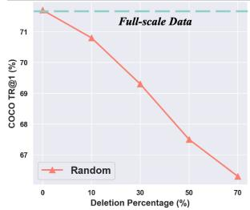
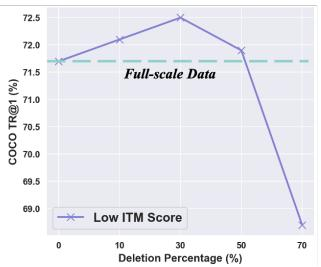
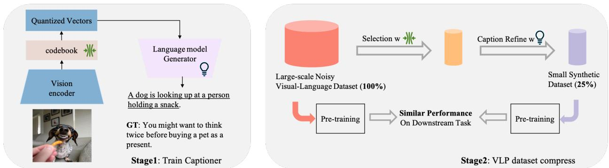
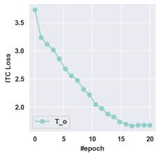
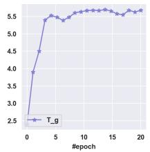
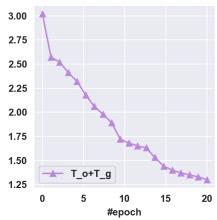
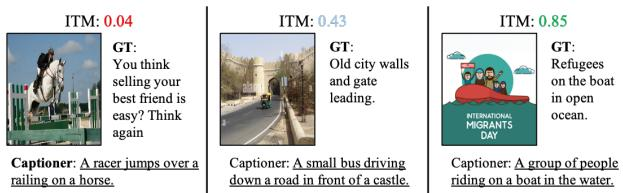
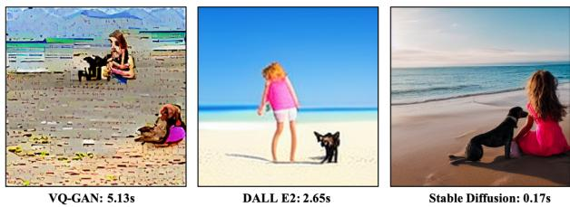
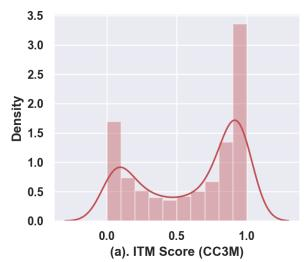
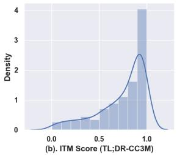

# T oo Large; Data Reduction for Vision-Language Pre-Training

Alex Jinpeng Wang, Kevin Qinghong Lin, David Junhao Zhang, Stan Weixian Lei, Mike Zheng Shou\* Show Lab, National University of Singapore

## Abstract

This paper examines the problems of severe imagetext misalignment and high redundancy in the widely-used large-scale Vision-Language Pre-Training (VLP) datasets. To address these issues, we propose an efficient and straightforward Vision-Language learning algorithm called TL;DR, which aims to compress the existing large VLP data into a small, high-quality set. Our approach consists of two major steps. First, a codebook-based encoder-decoder captioner is developed to select representative samples. Second, a new caption is generated to complement the original captions for selected samples, mitigating the text-image misalignment problem while maintaining uniqueness. As the result, TL;DR enables us to reduce the large dataset into a small set of high-quality data, which can serve as an alternative pre-training dataset. This algorithm significantly speeds up the time-consuming pretraining process. Specifically, TL;DR can compress the mainstream VLP datasets at a high ratio, e.g., reduce well-cleaned CC3M dataset from 2.82M to 0.67M (∼24%) and noisy YFCC15M from 15M to 2.5M (∼16.7%). Extensive experiments with three popular VLP models over seven downstream tasks show that VLP model trained on the compressed dataset provided by TL;DR can perform similar or even better results compared with training on thefull-scale dataset1.

## 1. Introduction

The recent “scale-is-everything” viewpoint has become a widely accepted notion in the Vision-language Pre-training (VLP) communtity [40, 7, 34, 17, 1]. According to this view, the scale of the data has increased from the original tens of thousands-level (e.g., COCO [26] and VG [20]) to millions-level (e.g., CC3M [40] and CC12M [7]), and even up to billions-level (e.g., YFCC100M [43], WIT400M [34], and LAION400M [39]). Approaches [57, 34, 17] trained on these large-scale data show remarking performance improvement in various downstream tasks.

  
Figure 1: Does using more data really lead to better performance in VLP? Instead of training on the full-scale CC3M dataset, we delete data with low image-text matching score. We find that BLIP [22] model pretrained on 50% reserved data even obtains better result than full-scale dataset on downstream COCO retrieval [26]. This observation exposes there exists serious misalignment between text&visual modalities and data redundancy in dataset.

However, simply scaling-up data brings two critical challenges: i. Larger image-text datasets lead to more training cost (e.g., Pretraining CoCa takes about 5 days on 2,048 CloudTPUv4 chips [57]) and storage overhead, which is difficult to afford. ii. Obtaining high-quality VLP data requires massive data and well-designed collecting/filtering pipeline, which is expensive. For instance, the CC3M [40] data was obtained after filtering 5 billion collected images. These challenges are daunting and may impede the participation of numerous researchers in the VLP community.

In this study, we stop hunting for larger-scale data blindly and ask an important question: Does employing a larger dataset always result in better performance in VLP? To explore and answer this question, we begin with a simple experiment. First, we utilize a pre-trained BLIP [22] model to calculate the Image-Text Matching (ITM) scores for all samples in the clean CC3M dataset. Subsequently, we remove a portion of the samples with the lowest ITM scores and evaluate the transfer learning results, as shown in Figure 1. Surprisingly, discarding 50% of the samples slightly improves performance. This remarkable finding challenges the prevailing belief that employing larger amounts of data invariably leads to superior VLP outcomes.

<table><tr><td>Method</td><td>Year</td><td>Data Type</td><td>Compression Ratio↑</td><td>Task Agnostic</td><td>Large-scale</td><td>Supervision</td><td>Generation/Selection</td></tr><tr><td>Dataset Distillation [51]</td><td>2017</td><td>Image</td><td>99%-99.99%</td><td>X</td><td>X</td><td>Class Label</td><td>Generation</td></tr><tr><td>Data Pruning [41]</td><td>2022</td><td>Image</td><td>20%-30%</td><td>X</td><td></td><td>Class Label</td><td>Selection</td></tr><tr><td>Neural Data Server [53]</td><td>2020</td><td>Multi-modality</td><td>94%-98%</td><td>X</td><td></td><td>Image-text Pairs</td><td>Selection</td></tr><tr><td>TL;DR (ours)</td><td></td><td>Multi-modality</td><td>75%-90%</td><td>J</td><td></td><td>Image-text Pairs</td><td>Generation+Selection</td></tr></table>

Table 1: Data-efficient learning methods. "Large-scale" means that the methods are effective when used on datasets that are very large in size. The "task agnostic" means that the methods can be used regardless of the specific downstream task, and without any prior exposure to the associated data.

This experiment suggests removing certain data points can actually improve the model’s ability to learn and generalize. Moreover, considering the performance improvements after removing the low ITM score data, we can infer the existence of significant misalignment between the textual and visual modalities in many text-image data pairs (see Figure 7 and the supplementary material for more evidences). These discoveries present promising potentiality to enhance the performance of models that depend on a smaller volume of VLP data.

Driven by above analysis and recent advance in dataset pruning [41], we present a simple, effective and scalable algorithm called TL;DR that aims to improve data efficiency for visual-language pretraining. The TL;DR has a powerful codebook-based captioner, which contains a visual encoder, a look-up codebook and a text decoder. Here is how it works: First, TL;DR feeds each image into the visual encoder and determines the corresponding codes of the image by measuring the similarity between the codebook and the embedding generated by the encoder. Given a large pool of image-text pairs, TL;DR clusters the samples based on their image corresponding codes and selects a representative subset of samples from each cluster. Then, TL;DR further refines the caption of the selected samples via text decoder to reduce text-image misalignment. By doing so, TL;DR is able to significantly reduce the size of the training dataset while maintaining the high quality.

In this work, we employ TL;DR on widely-used CC3M, CC12M, YFCC100M and LAION400M datasets and evaluate small size data on three widely-used frameworks including CLIP [34], ViLT [19], and BLIP [22] for data efficiency pretraining with seven representative visuallanguage downstream tasks. The results show that, with only 10% − 25% data obtained by TL;DR, frameworks achieve similar or even better performance compared with the full-scale dataset. We hope our findings can inspire the community to reconsider data efficiency for VLP rather than blindly utilizing increasingly massive datasets.

## 2. Related Work

## 2.1. Data-Efficient Learning

Recent successes in deep learning are largely attributed to the vast amount of data [10, 34]. However, collecting massive amounts of data is expensive and raises concerns about privacy and copyright [59]. As a result, the research community has become increasingly interested in data-efficient learning, which includes:

Dataset Distillation [51, 61, 50, 33] compress a large dataset into a small set of synthetic samples, enabling models trained on the smaller dataset to achieve competitive performance with those trained on the original dataset. However, these techniques are only effective on relatively small datasets at low resolutions, such as CIFAR [21], and their performance deteriorates significantly when applied to larger-scale datasets. For example, the accuracy of a model trained on the state-of-the-art MMT’s generated data is only 33.8% on the ImageNet-1K [10] test result [6], while pre-training on real ImageNet-1K achieves over 80% accuracy [9]. Furthermore, these methods necessitate supervised class labels, which are not suitable for multimodal data.

Data Pruning [44, 31] assumes high redundancy in large datasets, selecting only a subset of challenging samples. [29, 31] observed that during the entire training process, some examples are learned early and never forgotten, while others can be repeatedly learned and forgotten. The related work [41] uses a hard sample selection method to select 80% samples of the ImageNet dataset, and the model trained on selected samples approximating training on all data. Another recent work, CiT [52], also proposes to train models with dynamic training data.

Neural Data Server (NDS) [53, 27, 5] proposes a largescale search engine to identify the most useful transfer learning data from large corpus. While these methods can be extended to multi-modality data, a similar idea has also been applied in NLP [54]. However, this setting assumes that the user has access to all downstream data and needs to train the downstream task using additional retrieval data.

In this work, we are different from previous techniques in that we attempt to compress large-scale multimodal data for the first time, leading to comparable performance between the compressed and original visionlanguage datasets. We provide a comparison of our approach with these related works in Table 1.

## 2.2. Visual-Language Pre-training

Large-scale Vision-Language Pre-training (VLP) involves training on extensive multi-modality data and evaluating performance on various downstream vision-language tasks. Conventional frameworks include the dual-stream architecture [34], the one-stream architecture [19, 24, 48, 25, 49], and the encoder-decoder architecture [22]. Previous works have relied on high-quality, human-annotated datasets such as COCO [26] (110K images) and Visual Genome [20] (100K). As model sizes continue to increase, pre-training requires even more data than before [26, 17, 49], resulting in an extremely high computational cost. However, obtaining large and high-quality multi-modality data is challenging due to the difficulties in annotation. In this paper, we aim to democratize VLP research by proposing a general compression method for existing VLP data.

  
Figure 2: Our TL;DR architecture. We first train a codebook-based captioner in Stage1. Then the learned codebook and captioner are used to reduce VLP data in Stage 2. Pre-training on the reduced dataset achieves similar performance to the original full-scale dataset across downstream tasks.

## 3. Method

Our TL;DR is a simple yet effective approach for compressing the Vision-Language Pre-training dataset, leading to further reduction of the training cost. Our approach consists of two stages: (1) codebook-based captioner training and (2) data reduction including samples selection and caption refining. Figure 2 illustrates the idea, introduced next.

## 3.1. Codebook-based Captioner

The captioner consists of a visual encoder, a codebook and a text decoder. The visual encoder is employed to extract image features. Inspired by vector quantisation technique [56, 45], we try to quantize the image feature for further clustering by utilizing a learnable codebook. Codebook comprises K learnable embedding vectors, each of which can be regarded as a code. Each token of image features conducts a nearest neighbor look-up from codebook and finds its corresponding code. In this way, image features are quantized into a couple of codes (quantized vectors). The quantized vectors are then sent into a text decoder, generating a caption. In order to enhance the quality of text generation, we initialize the codebook with the text embedding of K most frequently occurring keywords/keyphrases in the entire dataset, which enables the codebook to contain meaningful and intuitively understandable semantics.

To train the whole captioner, we utilize a Language Modeling loss [11], which maximizes the likelihood of the text in an autoregressive manner, and a symmetric commitment loss [56], which is specifically designed for codebook. We initially train this captioner on noisy source data and subsequently fine-tune it on smaller-scale datasets, such as COCO [26] and VisualGenome [20].

## 3.2. Data Reduction

Currently, large-scale datasets exist with serious redundancy [41]. Meanwhile, a large part of texts is noisy and misaligned with images in VLP data. See Figure 2 for the example (the caption “You need to think twice before buying a pet as present” does not match the image). To overcome these limitations, we use the learned codebook to condense large-scale noisy data and the learned captioner to reduce the misalignment over image-text pairs.

Samples selection. For an encoded image feature with L tokens, we compute an index vector with length L. Each value is the index of the code, which is the closest to each token. This vector maps the features from image space to semantic space so that it reduces the complexity of the image, benefiting and accelerating the cluster process. Subsequently, each image sample in the dataset is equipped with an index vector according to the above process and we cluster these vectors into N clusters with K-Means ( speed up by Faiss [18]). Then we uniformly sample M% data points from each cluster, producing a small subset of the dataset. We examine various sampling methods and observe that uniform sampling is stable across different scales.

Caption refining. To alleviate the misalignment problem, we want to improve the text quality using the generated caption. Generated text $T _ { g }$ is from the text decoder, which takes the quantized vector of the image as input. We simply concatenate $T _ { g }$ with original text $T _ { o }$ together, denoted as $T = T _ { o } + T _ { g }$ , to refine and preserve the original caption’s uniqueness while maintaining data diversity.

The compressed small-scale dataset with refined captions is recorded as dataset $D _ { c } .$ . At last, we train VLP models on this high quality dataset $D _ { c }$ and expect the model to achieve comparable performance with original full-scale dataset D on downstream Vision-Language tasks.

<table><tr><td>sampling refining</td><td></td><td>TR@1</td><td>IR@1</td></tr><tr><td rowspan="3">√</td><td></td><td>65.3</td><td>49.8</td></tr><tr><td></td><td>68.5</td><td>51.9</td></tr><tr><td>√</td><td>69.4</td><td>52.3</td></tr><tr><td>√</td><td>√</td><td>72.8</td><td>54.8</td></tr></table>

<table><tr><td>case</td><td>TR@1</td><td>IR@1</td></tr><tr><td>gradient-based</td><td>72.9</td><td>54.8</td></tr><tr><td>hard-sample [41]</td><td>73.1</td><td>54.5</td></tr><tr><td>uniform</td><td>72.8</td><td>54.8</td></tr><tr><td>large distance</td><td>72.3</td><td>53.1</td></tr></table>

(a) Component ablation. Both the sampling and refining operation are important to the downstream retrieval.

<table><tr><td>case</td><td>TR@1</td><td>IR@1</td></tr><tr><td>xavier [14]</td><td>72.0</td><td>54.1</td></tr><tr><td>key words/phrases</td><td>72.8</td><td>54.8</td></tr><tr><td>object tags</td><td>72.5</td><td>54.4</td></tr></table>

(c) Codebook Initialization. An codebook initialized with keywords is more stable.

(b) Sample-selection strategy. The different way to select samples.
<table><tr><td>case</td><td>TR@1</td><td>IR@1</td></tr><tr><td>Image Embedding</td><td>70.6</td><td>52.3</td></tr><tr><td>Text Embedding</td><td>69.0</td><td>50.4</td></tr><tr><td>BLIP Image Embedding [22]</td><td>72.3</td><td>54.5</td></tr><tr><td>Codebook</td><td>72.8</td><td>54.8</td></tr></table>

(d) Clustering feature. Codebook is better than Image Embedding at same scale.

<table><tr><td>case</td><td>TR@1</td><td>IR@1</td></tr><tr><td>full-scale baseline</td><td>70.6</td><td>54.0</td></tr><tr><td>10%</td><td>68.9</td><td>52.3</td></tr><tr><td>25%</td><td>72.8</td><td>54.8</td></tr><tr><td>50%</td><td>74.8</td><td>55.2</td></tr><tr><td>100%</td><td>75.1</td><td>57.7</td></tr></table>

(e) Sampling ratio. Sampling 25% data is enough to beats with full scale.

<table><tr><td>case</td><td>TR@1</td><td>IR@1</td></tr><tr><td>100</td><td>71.8</td><td>53.9</td></tr><tr><td>1000</td><td>72.4</td><td>54.5</td></tr><tr><td>3000</td><td>72.8</td><td>54.8</td></tr><tr><td>5000</td><td>72.9</td><td>54.4</td></tr><tr><td>10000</td><td>72.3</td><td>54.2</td></tr></table>

(f) Cluster Number. More clusters not equals better result.  
Table 2: $T L ; D R$ ablation experiments with BLIP model [22] on CC3M. We report image-to-text retrieval top-1 (TR@1) and text-to-image retrieval top-1 (IR@1) accuracy (%) on COCO [26] dataset. If not specified, the default baseline is: pretraining BLIP model based on ViT-B/16 with 25% sample of CC3M. Default settings are marked in gray .

Discussion. Considering the serious misalignment problem, it seems quite straightforward to use pure generated high-quality caption $T _ { g }$ to replace original noisy text. Driven by this idea, we try to pretrain BLIP [22] models with $T _ { o } , T _ { g }$ and $T _ { o } + T _ { g }$ independently and show the train curve of Image-Text Contrastive (ITC) loss in Figure 3. However, we find the model trained with $T _ { g }$ fails into model collapse [36]. This phenomenon can be explained by captioning collapse [46, 47] and one-to-many problem [55] in image cpationing. That is, the trained captioner will generate fixed or similar captions for different images, which limits diversity in the output and easily leads to trivial solutions for contrastive loss. On the contrary, the ITC loss for both $T _ { o }$ and $T _ { o } + T _ { g }$ works well and the $T _ { o } + T _ { g }$ converges better. We also observe the loss of $T _ { g }$ is smaller than other two variants at epoch 0-2, which indicates the generated caption matches well with the image. Note that this simple stitching operation on caption does not bring additional computation cost for VLP as the max length in text-encoder Bert [11] model keeps unchanged for all setting.

## 3.3. Technical Details.

Our TL;DR can be implemented efficiently, and importantly, does not require any large auxiliary model. The codebook size K is 3000 as default. The selection of keywords/phrases is implemented using the NLTK 2. We adopt ViT-B/16 [12] as image encoder and BertLMHead Model [11] as text decoder. In this way, the token length L

Figure 3: Training curve with CC3M dataset. Simply stitching generated text and original text together solved the model collapse problem in Image-text Contrastive Loss.

is 196 as default. The cross-attention is computed over image embedding and text embedding. To show the generality of compressed dataset, we test $D _ { c }$ on three different and representative VLP architectures: dual-stream CLIP [34], one-stream ViLT [19] and Fusion-encoder Blip [22] on various downstream tasks. All these models are trained under the same setting with different datasets.

## 4. CC3M Experiments

We first study dataset reduction on well-cleaned CC3M [40] which heavily filters web crawled pairs and only keeps 0.1% of the raw data. This dataset contains a total of 2.8 million images. We employ our TL;DR to compress the CC3M dataset, then conduct pre-training and fine-tuning evaluations on both original and compressed datasets. Following our ablation study, we transfer the pre-trained model to seven Vision-Language tasks downstream and fine-tune it through end-to-end training to evaluate its performance.

Training. We utilize PyTorch [30] to implement our models and trained them on 8 NVIDIA A100 GPUs to reduce the data samples. For Vision-Language Pre-training, we utilize 2 nodes, each equipped with 16 GPUs. The image transformer is initialized from ViT pre-trained on ImageNet [10], and the text transformer is initialized from BERTbase [11](BLIP,CLIP) and DistillBERT [38] (ViLT). The model is pre-trained for 20 epochs with a batch size of 1260 and an AdamW [28] optimizer with a weight decay of 0.05. During training, we apply a learning rate warm-up to 3e-4 and a linear decay with a rate of 0.85. For image augmentation, we utilize RandAugment [8] and apply all of the original policies except color inversion. This decision is based on the recognition of the crucial role that color information plays in the data. For pre-training, images were randomly cropped to a resolution of 224 × 224. We then increase this to 384 × 384 for fine-tuning downstream tasks. Further information about the training hyperparameters for downstream tasks can be found in the supplementary material.

<table><tr><td rowspan="3">Method</td><td rowspan="3">Dataset</td><td rowspan="3">#Samples</td><td colspan="5">MSCOCO (5K test set)</td><td colspan="6">Flickr30K (1K test set)</td></tr><tr><td colspan="2">Image→ Text</td><td colspan="3">Text→ Image</td><td colspan="3">Image→ Text</td><td colspan="2">Text→ Image</td></tr><tr><td>R@1 R@5</td><td></td><td>R@10</td><td>R@1</td><td>R@5 R@10</td><td>R@1</td><td>R@5</td><td>R@10</td><td>R@1</td><td>R@5</td><td>R@10</td></tr><tr><td rowspan="4">CLIP [34]</td><td>CC3M [40]</td><td>2.82M</td><td>60.4</td><td>85.3</td><td>93.2 93.8</td><td>48.9</td><td>75.4 84.7</td><td>77.3</td><td>91.1</td><td>93.2</td><td>71.6</td><td>90.1</td><td>91.4</td></tr><tr><td>TL;DR-CC3M</td><td>0.67M</td><td>60.3</td><td>85.6</td><td>49.4</td><td>77.4</td><td>86.0</td><td>82.5</td><td>91.8</td><td>92.2</td><td>72.0</td><td>90.5</td><td>92.1</td></tr><tr><td>CC3M [40]</td><td>2.82M</td><td>36.2</td><td>64.3</td><td>80.1</td><td>29.9</td><td>57.9</td><td>66.9</td><td>67.4 83.2</td><td>92.4</td><td>54.3</td><td>84.1</td><td>90.8</td></tr><tr><td>TL;DR-CĆ3M</td><td>0.67M</td><td>37.7</td><td>64.6</td><td>80.8</td><td>30.7</td><td>58.4 68.2</td><td>68.5</td><td>85.4</td><td>92.0</td><td>55.6</td><td>82.1</td><td>90.8</td></tr><tr><td rowspan="4">ViLT [19]</td><td>CC3M [40]</td><td>2.82M</td><td>66.7</td><td>89.2</td><td>93.8 52.5</td><td>79.3</td><td>87.1</td><td>83.8</td><td>92.0</td><td>93.2</td><td>74.0</td><td>92.0</td><td>92.8</td></tr><tr><td>TL;DR-CC3M</td><td>0.67M</td><td>67.1</td><td>88.7 94.1</td><td>53.1</td><td>78.9</td><td>88.2</td><td>85.3</td><td>92.4</td><td>93.6</td><td>75.6</td><td>92.1</td><td>92.5</td></tr><tr><td>CC3M [40]</td><td>2.82M</td><td>39.2</td><td>68.6</td><td>77.8</td><td>30.4 53.2</td><td>66.1</td><td>70.5</td><td>88.7</td><td>92.1</td><td>57.6</td><td>84.9</td><td>92.6</td></tr><tr><td>TL;DR-CĆ3M</td><td>0.67M</td><td>43.5</td><td>70.8 81.4</td><td>33.9</td><td>57.9</td><td>66.8</td><td>73.2</td><td>90.5</td><td>93.3</td><td>58.6</td><td>84.7</td><td>92.4</td></tr><tr><td rowspan="4">BLIP [22]</td><td>CC3M [40]</td><td>2.82M</td><td>70.9</td><td>91.3</td><td>96.1 95.9</td><td>54.3</td><td>80.2 88.0</td><td>86.3</td><td>94.1</td><td>94.8</td><td>74.8</td><td>91.6</td><td>92.6</td></tr><tr><td>TL;DR-CC3M</td><td>0.67M</td><td>72.8</td><td>91.9</td><td>54.8</td><td>80.6</td><td>89.4</td><td>87.5</td><td>94.8</td><td>95.3</td><td>75.7</td><td>92.2</td><td>93.4</td></tr><tr><td>CC3M [40]</td><td>2.82M</td><td>42.3</td><td>67.8</td><td>77.4 31.5</td><td>55.7</td><td>66.3</td><td>75.1</td><td>91.2</td><td>93.6</td><td>60.6</td><td>85.9</td><td>91.8</td></tr><tr><td>TL;DR-CC3M</td><td>0.67M</td><td>48.7</td><td>73.1</td><td>82.7</td><td>36.7</td><td>60.6 70.4</td><td>76.3</td><td>91.9</td><td>93.9</td><td>61.0</td><td>87.7</td><td>93.0</td></tr></table>

Table 3: Fine-tuning and zero-shot image-text retrieval results on MSCOCO and Flickr30K dataset.
<table><tr><td rowspan="2">Dataset</td><td rowspan="2">#Samples</td><td colspan="2">VQA</td><td colspan="2">NLVR²</td><td colspan="3">RefCOCO+</td><td colspan="2">COCO Caption</td></tr><tr><td>test-dev</td><td>test-std</td><td>dev</td><td>test-P</td><td>val</td><td>testA</td><td>testB</td><td>B@4</td><td>CIDEr</td></tr><tr><td>Random-CC3M</td><td>0.67M</td><td>68.3</td><td>66.2</td><td>73.6</td><td>73.8</td><td>68.6</td><td>71.8</td><td>62.8</td><td>35.9</td><td>118.8</td></tr><tr><td>CC3M [40]</td><td>2.8M</td><td>71.5</td><td>71.8</td><td>76.0</td><td>76.2</td><td>72.4</td><td>76.1</td><td>65.3</td><td>36.8</td><td>121.6</td></tr><tr><td>TL;DR-CC3M</td><td>0.67M</td><td>73.1+1.6</td><td>73.2+1.4</td><td>77.7+1.7</td><td>78.0+1.8</td><td>75.1+2.7</td><td>78.5+2.4</td><td>68.4+3.1</td><td>37.6+0.8</td><td>123.8+2.2</td></tr></table>

Table 4: Comparison with BLIP model pre-trained on different data sources for VQA, NLVR2, RefCOCO+ and COCO Captioning. ViLT and CLIP architectures can not evaluated on part of these tasks since structural limitations.

## 4.1. Main Properties

We ablate our TL;DR using the default setting in Table 2 (see caption). Several intriguing properties are observed.

Module deconstruction. In Table 2a we analyze the impact of different components in TL;DR. We establish a baseline by randomly selecting 25% of the data from CC3M (first row). Our results show that codebook-based sampling outperforms random selection by 3.2% in TR@1. We also observe that both codebook-based sampling and caption refinement are crucial and the combination of them achieves optimal downstream performance.

Sample selection. In Table 2b we study the sample selection strategy in Stage 2. We sample 25% data in each cluster by default. For Gradient-based, we train a tiny network to conduct VLP pretrained with ITC [24], ITM [24] and LM [11]. Then we select samples which contribute most to the gradients in each cluster. Large distance: Another perspective is that data points on the border of each cluster are more important than those at the center [4]. So we first compute the center of each cluster and then choose the sample that has the largest distance from the center of each cluster. We also report the result of hard-sample selection from [41]. We observe that all these variants produce similar results except large distances. This suggests that the clustering step, rather than the selection step, plays a key role in data compression during Stage 2. To maintain simplicity, we choose uniform sampling as the default method.

<table><tr><td>Method</td><td>Dataset</td><td>R@1↑</td><td>R@5↑</td><td>R@10↑</td><td>MdR↓</td></tr><tr><td rowspan="3"></td><td>Rand-CC3M</td><td>15.3</td><td>34.8</td><td>46.3</td><td>13.0</td></tr><tr><td>CLIP [34] CC3M [40]</td><td>19.4</td><td>37.3</td><td>47.5</td><td>11.0</td></tr><tr><td>TL;DR-CC3M</td><td>21.8</td><td>38.6</td><td>48.5</td><td>10.0</td></tr><tr><td rowspan="3">ViLT [19]</td><td>Rand-CC3M</td><td>18.8</td><td>38.2</td><td>49.5</td><td>11.0</td></tr><tr><td>CC3M [40]</td><td>21.0</td><td>40.5</td><td>51.5</td><td>10.0</td></tr><tr><td>TL;DR-CC3M</td><td>22.5</td><td>42.7</td><td>52.4</td><td>8.0</td></tr><tr><td rowspan="3"></td><td>Rand-CC3M</td><td>23.3</td><td>42.8</td><td>53.3</td><td>8.0</td></tr><tr><td>BLIP [22] CC3M [40]</td><td>26.0</td><td>46.3</td><td>58.0</td><td>7.0</td></tr><tr><td>TL;DR-CC3M</td><td>27.4</td><td>48.7</td><td>59.4</td><td>6.0</td></tr></table>

Table 5: MSRVTT-1K retrieval using three architectures. We created a subset of the CC3M dataset called Rand-CC3M by randomly selecting the same number of samples as in TL;DR-CC3M.

Codebook initialization. In Table 2c we compare different initialization strategies. The xavier means all parameters in the codebook are initialized with xavier initialization [14]. For the object tags initialization, following previous works [2, 60], we use the 1600 object tags from

<table><tr><td>Model</td><td>Dataset</td><td>#Samples</td><td>ImNet</td><td>ImNet-A</td><td>ImNet-R</td></tr><tr><td rowspan="3"></td><td>Rand-CC3M</td><td>0.67M</td><td>58.3</td><td>61.8</td><td>62.3</td></tr><tr><td>CLIP [34] CC3M [40]</td><td>2.82M</td><td>62.2</td><td>65.2</td><td>66.9</td></tr><tr><td>TL;DR-CC3M</td><td>0.67M</td><td>61.4</td><td>65.0</td><td>65.7</td></tr><tr><td rowspan="3">ViLT [19]</td><td>Rand-CC3M</td><td>0.67M</td><td>54.3</td><td>59.8</td><td>58.4</td></tr><tr><td>CC3M [40]</td><td>2.82M</td><td>58.6</td><td>62.9</td><td>64.2</td></tr><tr><td>TL;DR-CC3M</td><td>0.67M</td><td>59.1</td><td>63.3</td><td>64.0</td></tr><tr><td rowspan="3"></td><td>Rand-CC3M</td><td>0.67M</td><td>57.3</td><td>61.8</td><td>65.2</td></tr><tr><td>BLIP [22] CC3M [40]</td><td>2.82M</td><td>62.5</td><td>65.5</td><td>68.1</td></tr><tr><td>TL;DR-CC3M</td><td>0.67M</td><td>62.0</td><td>63.9</td><td>67.4</td></tr></table>

Table 6: Zero-shot image classification results on ImageNet [10], ImageNet-A [16], ImageNet-R [15]. There is no free lunch, as selecting partial samples reduces the visual diversity crucial for classification. Despite this, TL;DR still performs significantly better than random selection.

Visual Genome [20] and extract text feature with a pretrained BERT [11]. With same training setting, the keywords achieve a 0.8% TR@1 improvement and a 0.7 % IR@1 improvement over xavier. This result is expected as the text embeddings provide contextual information and simplify the learning process.

Codebook vs. Image embedding. In Table 2d, we investigate different ways of cluster sampling. First, we remove the codebook from Stage-1 and use image embedding instead. Alternatively, we directly cluster images using the image embedding [22] of images from BLIP model (pretrained on 200M Image-text pairs). We observe the image embedding leads to much better result than text embedding. This is reasonable because clustering visual-similarity samples with text only is difficult. We observe that clustering depended on our codebook performs better than both image embedding and text embedding. This demonstrates that our codebook can efficiently project image embedding to semantic space, benefiting cluster process.

Cluster sampling ratio. Table 2e varies the sampling ratio of each cluster from 10% to 100%. We are surprised to find that a low sampling ratio can still produce effective results. With only 25% of the data and the TL;DR model, we are able to achieve a 1.9% improvement on TR@1 and a 0.8% improvement on IR@1 over the full-scale baseline. Additionally, we observe that larger sampling ratios lead to even better results. Since our focus is on achieving similar transfer learning results with fewer samples, we use a default sampling ratio of 25% to minimize computation costs.

Cluster numbers. In Table 2f, we investigate the impact of cluster number on Stage 2 by increasing it from 300 to 30K. We observe that using more clusters results in a slight improvement at the beginning and becomes stable when the number of clusters exceeds 3K. Moreover, all results consistently outperform the random selection baseline. Therefore, we use 3K clusters as the default in this work, as it performs well on fine-tuning tasks.

  
Figure 4: The generated caption match the image well.

## 4.2. Transfer Learning Experiments.

We conduct an extensive evaluation of transfer learning in downstream tasks using the model pre-trained on our compressed TL;DR-CC3M and source CC3M with 3 architectures. Our evaluation primarily focuses on the core tasks of three categories that examine: (1) cross-modality alignment, (2) image captioning and multi-modality understanding capabilities, and (3) visual recognition. The baseline in this section is the model trained on CC3M dataset.

## 4.2.1 Cross-modality Alignment Task

Image-Text retrieval. Fine-grained world region alignment plays a critical role in this task. We report both image-to-text retrieval (TR) and text-to-image retrieval (IR) on the COCO [26] and Flickr30K [32] benchmarks. For the BLIP [22] model, we adopt an additional re-ranking strategy, following the original implementation. In Table 3, we also report zero-shot retrieval results. We found that TL;DR achieves comparable results with the baselines on all metrics and surprisingly performs quite well on zero-shot results. For example, for the BLIP [22] architecture, our method leads to a 6.4% improvement (from 42.3% to 48.7%) in Recall@1 of image-to-text retrieval on MSCOCO. All results suggest that a small part of refined image-text pairs is enough to learn good alignment.

Zero-shot video retrieval. In this experiment, we analyze the generalization ability of our method to video-language tasks. Specifically, we perform zero-shot transfer to text-tovideo retrieval and evaluate the models trained on COCOretrieval in Table 5. We uniformly sample 8 frames from each video to process the video input and concatenate the frame features into a single sequence. These models trained on our compressed dataset outperform the baseline on all metrics, demonstrating the generality of TL;DR.

  
Figure 5: The codebook-based clusters visualization. The samples within each cluster exhibit similar contextual characteristics, as opposed to mere visual appearance. For example, the “Christmas elements” cluster located at the right.

  
Figure 6: Image generation result with strong Text-toimage Model. The generation time is also reported.

## 4.2.2 Image Captioning and Multi-modality Understanding Tasks

Image captioning. The task involves describing an input image, which we evaluate using No-Caps and COCO datasets. Both datasets are fine-tuned on COCO with the Language Modeling (LM) loss. We adopt a zero-shot setting for No-Caps dataset, and start each caption with the phrase “a picture of” for the BLIP architecture. We do not pre-train using COCO to avoid information leakage. Our results outperform baseline with a much smaller quantity of pre-training data, as shown in Table 4.

Visual question answering (VQA). We evaluate our model’s performance on the VQA task [3], where the model needs to provide an answer based on an image and a question. We consider it as an answer generation task that allows open-vocabulary VQA for better results, following previous works [23, 22]. The results are presented in Table 4. The BLIP trained on TL;DR-CC3M outperforms baseline by 1.4% on test-dev splits, demonstrating the effectiveness of our compressed dataset for improving VQA performance.

Visual reasoning. The Natural Language Visual Reasoning (NLVR2) [42] task is a binary classification task that requires the model to reason about two images and a question in natural language. Multi-modal reasoning is crucial for the completion of this task. We observe that BLIP trained on our dataset achieved 78.0% accuracy compared to 76.2% achieved by the CC3M, as shown in Table 4.

Cross-modality grounding. Referring Expression (RE) Comprehension requires the model to select the target object from a set of image regions proposals, based on the query description. This task heavily relies on visualgrounding ability. The models are evaluated on groundtruth objects, and we evaluate RE Comprehension on RefCOCO+ [58]. The results are reported in Table 4, and we observe that TL;DR-CC3M achieves better results.

## 4.2.3 Visual Recognition Tasks

Besides the cross-modality task, we also explore a unimodality task, mainly image classification. Specifically, we fix the image encoder and explore zero-shot image classification. Since the vision encoder is loaded from pretrained model, this task demonstrates the impact of training a Vision-Language model with noisy image-text pairs. Specifically, it shows how such training affects the well-learned representation derived from a human-crafted dataset. We show the results in Table 6 and observe noisy data leads to significant Catastrophic Forgetting. For example, the CLIP model drops down to only 58.3% accuracy with noisy data training. We also observe our TL;DR shows steady improvement for all architectures over random selection. Unfortunately, the classification performance for TL;DR-CC3M is slightly worse than the full-scale CC3M for the CLIP and BLIP architectures. Both of these architectures have independent image encoders like ViT to extract image embeddings. This indicates that this task heavily relies on visual diversity, which is different from multimodal tasks, and our method reduces the visual diversity potentially. For the ViLT model, this architecture adopts a shared backbone for both visual and text, and we observe the slightly different results. We guess that multi-modality interaction in early-fusion affects the classification result.

<table><tr><td>Method</td><td>TR@1</td><td>IR@1</td></tr><tr><td>real data</td><td>58.3</td><td>44.0</td></tr><tr><td>VQ-GAN [13]</td><td>35.2</td><td>32.4</td></tr><tr><td>DALLE2 [35] (implement from3)</td><td>44.3</td><td>38.3</td></tr><tr><td>Stable Diffusion [37] (implement from 4)</td><td>52.4</td><td>40.7</td></tr></table>

Table 7: Compare different sample generation methods over 0.3M subset of CC3M. We first pre-train BLIP model on these generated data and then evaluation on COCO.

## 4.3. Visualization

Generated caption visualization. We show the generated caption in Figure 4. It is evident that the original captions can be highly abstract and difficult to match their respective images, even for human observers sometimes. For instance, when the ITM score is as low as 0.04, matching the figure with its corresponding caption becomes arduous. Such challenging cases can potentially harm the cross-modality alignment. In contrast, we observe that the generated captions describe the image very well and sometimes offer helpful complementary information. For example, “bus” and “castle” in the middle example.

Codebook-based cluster visualization. Figure 5 displays the codebook grouping result achieved with simple K-Means. Clusters are sets of data points with similar characteristics, often defined by their features or attributes. Interestingly, we observe that the model cluster samples “accurate”, meaning that these samples have semantic similarity rather than simple appearance. For instance, the model classifies “dollars” and “piggy bank” together, even though they differ significantly in appearance.

<table><tr><td>Dataset</td><td colspan="2">#Samples Time</td><td> $\mathrm { \Delta V Q A }$  test-dev</td><td> $\mathrm { N L V R ^ { 2 } }$   $\mathrm { t e s t - P }$ </td><td>RefCOCO val</td><td colspan="2">Nocaps Captioning</td><td colspan="2">Flcikr30K Retrieval</td><td>Imagenet</td></tr><tr><td></td><td></td><td></td><td></td><td></td><td></td><td>B@4</td><td>CIDEr</td><td>TR@1</td><td>IR@1</td><td>Acc</td></tr><tr><td>Rand-CC12M</td><td>2.4M</td><td>14h</td><td>71.8</td><td>76.2</td><td>72.5</td><td>36.8</td><td>121.0</td><td>82.9</td><td>73.3</td><td>61.2</td></tr><tr><td>CC12M [7]</td><td>10.8M</td><td>65h</td><td>73.5</td><td>78.9</td><td>74.1</td><td>37.5</td><td>122.9</td><td>84.7</td><td>75.3</td><td>65.3</td></tr><tr><td>TL;DR-CC12M</td><td>2.4M</td><td>14h</td><td> $7 4 . 1 _ { + 0 . 6 }$ </td><td> $\underline { { 7 8 . 5 _ { - 0 . 4 } } }$ </td><td> $\underline { { 7 4 . 0 _ { - 0 . 1 } } }$ </td><td> $3 8 . 1 _ { + 0 . 6 }$ </td><td> $\underline { { 1 2 4 . 1 _ { + 1 . 2 } } }$ </td><td> $8 5 . 5 _ { + 0 . 8 }$ </td><td> $7 6 . 3 _ { + 1 . 0 }$ </td><td>63.8-1.5</td></tr><tr><td>Rand-YFCC15M</td><td>2.5M</td><td>15h</td><td>67.2</td><td>70.5</td><td>68.1</td><td>35.2</td><td>116.3</td><td>78.8</td><td>70.5</td><td>65.4</td></tr><tr><td>YFCC15M [43]</td><td>15M</td><td>90h</td><td>70.5</td><td>74.2</td><td>70.6</td><td>35.9</td><td>118.4</td><td>81.5</td><td>72.4</td><td>67.8</td></tr><tr><td>TL;DR-YFCC15M</td><td>2.5M</td><td>15h</td><td> $7 0 . 3 _ { - 0 . 2 }$ </td><td> $\underline { { 7 5 . 3 _ { + 1 . 1 } } }$ </td><td> $7 2 . 6 _ { + 2 . 0 }$ </td><td> $\underline { { 3 7 . 2 . 1 . 3 } }$ </td><td> $1 2 2 . 5 _ { + 4 . 1 }$ </td><td> $8 2 . 3 \substack { + 0 . 8 }$ </td><td> $7 4 . 3 _ { + 1 . 9 }$ </td><td>67.3-0.5</td></tr><tr><td>Rand-LAION40M(128)</td><td>8M</td><td>48h</td><td>70.7</td><td>75.3</td><td>73.4</td><td>34.8</td><td>113.2</td><td>80.4</td><td>72.5</td><td>68.5</td></tr><tr><td>LAION40M(128) [39]</td><td>40M</td><td>120h</td><td>74.5</td><td>79.1</td><td>76.6</td><td>35.2</td><td>117.4</td><td>83.2</td><td>74.9</td><td>71.3</td></tr><tr><td>TL;DR-LAION40M(128)</td><td>8M</td><td>48h</td><td> $7 6 . 3 _ { + 1 . 8 }$ </td><td> $8 0 . 5 \substack { + 1 . 4 }$ </td><td> $7 7 . 4 _ { + 0 . 8 }$ </td><td> $3 6 . 8 _ { + 1 . 6 }$ </td><td> $1 2 0 . 9 _ { + 3 . 5 }$ </td><td> $8 2 . 8 _ { - 0 . 4 }$ </td><td> $7 6 . 1 _ { + 1 . 2 }$ </td><td> $7 0 . 4 _ { - 0 . 9 }$ </td></tr></table>

Table 8: Comparison with different source of data on 6 downstream tasks. BLIP [22] is adopted as baseline and (128) means the image resolution is $1 2 8 \times 1 2 8 .$ . We also list the pre-training time, which can be significantly reduced via $T L ; D R .$

  
Figure 7: ITM score distribution. $T L ; D R$ alleviates the issue of misalignment in VLP data.

## 4.4. More Investigation

Is image generation possible? To ease the misalignment problem of image-text pairs, instead of simply selecting representative samples, a potential and naive idea is to generate images from text. To this end, we randomly sample 0.3M subset of CC3M and generate image from text with three popular text to image generation models, VQ-GAN [56], DALLE 2 [35] and Stable Diffusion [37]. We display the generated samples in Figure 6. We observe that the generative models struggle with complex scenarios, but are capable of generating simple prompts like “dog” proficiently. In addition, generation methods only produce visual cues in a fixed vocabulary, potentially reducing data diversity.

Next, we pre-train BLIP models on these generated data and evaluate it on COCO Retrieval. In Table 7 we observe the results of transfer learning depend on the quality of generated samples, with those generated by stable diffusion being particularly effective. However, there still exists a significant gap between the generated data and the real dataset (e.g., 52.4% vs. 58.3% on TR@1). We believe that higherquality and diverse generated images may lead to comparable results with real images in the near future.

Explore the misalignment problem. Figure 7 shows the Image-text Matching (ITM) score distribution for both CC3M and our TL;DR-CC3M data (the visualization about more datasets is reported in the supplementary). We observe a lot of samples of original CC3M at low matching score even tends to zero, which indicates the current dataset has serious misalignment problems. Since imagetext matching (ITM) loss and image-text contrastive (ITC) loss are used in all architectures, these samples will damage the multimodal representation learning. When adopting our TL;DR, we observe that the matching score tends to be higher and has very few samples with low ITM score.

## 5. Transfer to other VLP datasets

We study data compression performed in two categories shown below: clean data that involves human-based offline filter pipelines and raw data that has not undergone cleaning. For clean data, in addition to CC3M, we explore the well-cleaned, high-quality dataset CC12M [7]. Then, we study the raw data YFCC100M [43] and LAION400M [39]. CC12M [7] contains 12 million image-text pairs specifically meant to be used for vision-and-language pre-training. These data are collected by relaxing the data collection pipeline as in CC3M. YFCC15M [34] is a subset of the multilingual and noisy YFCC100M [43] that contains English captions. LAION400M [39] is a large-scale noisy dataset that provides URLs with captions for download. To control the computation cost and reduce the storage overhead, we randomly sample a 40M subset of LAION400M and download images at a resolution of $1 2 8 \times 1 2 8 .$ . So, we record the dataset as TL;DR-LAION40M(128), and the performance over downstream tasks could be improved with higher resolution. More exploration about video-text datasets is reported in the supplementary material

We use BLIP as the default architecture and evaluate our TL;DR on different datasets and show the results in Table 8. Surprisingly, with only 2.5M (16.7%) data, TL;DR-YFCC15M leads to similar results with 15M raw data over all metrics except Imagenet. More results with different backbones are reported in the supplementary material. For LAION40M(128), when using 8M data (20%), the model trained on our dataset consistently outperforms the baseline method on six downstream tasks. We noticed that the compression rate of LAION40M(128) is less than that of YFCC15M. This may be due to the fact that the collection of LAION40M(128) has already been filtered with CLIP similarity, reducing the impact of the misalignment problem.

## 6. Conclusion and Discussion

This paper presents TL;DR, a novel and pioneering algorithm for selecting and generating high-quality image-text pairs from noisy Vision-Language Pre-training (VLP) data, thereby contributing to the field of VLP. TL;DR incorporates a text generation process into learning to reduce serious misalignment problem. Our experiments demonstrate three widely-used architectures leads to comparable results and much smaller training cost when learning from our generated dataset. Additionally, we demonstrate that the misalignment problem can be effectively addressed using our simple TL;DR. However, the choice of the highest compression ratio is done manually rather than learned. Furthermore, achieving even higher compression ratios for VLP models remains a challenge, and text-to-image generation models may be helpful in this regard. We hope that this perspective will inspire future research.

## Acknowledgement

This project is supported by the National Research Foundation, Singapore under its NRFF Award NRF-NRFF13- 2021-0008, and Meta, Mike Zheng Shou’s Start-Up Grant from NUS. The computational work for this article was partially performed on resources of the National Supercomputing Centre, Singapore.

## References

[1] Jean-Baptiste Alayrac, Jeff Donahue, Pauline Luc, Antoine Miech, Iain Barr, Yana Hasson, Karel Lenc, Arthur Mensch, Katie Millican, Malcolm Reynolds, et al. Flamingo: a visual language model for few-shot learning. arXiv preprint arXiv:2204.14198, 2022.

[2] Peter Anderson, Xiaodong He, Chris Buehler, Damien Teney, Mark Johnson, Stephen Gould, and Lei Zhang. Bottom-up and top-down attention for image captioning and visual question answering. In Proceedings of the IEEE conference on computer vision and pattern recognition, pages 6077–6086, 2018.

[3] Stanislaw Antol, Aishwarya Agrawal, Jiasen Lu, Margaret Mitchell, Dhruv Batra, C Lawrence Zitnick, and Devi Parikh. Vqa: Visual question answering. In Proceedings ofthe IEEE international conference on computer vision, pages 2425– 2433, 2015.

[4] Dibya Jyoti Bora, Dr Gupta, and Anil Kumar. A comparative study between fuzzy clustering algorithm and hard clustering algorithm. arXiv preprint arXiv:1404.6059, 2014.

[5] Tianshi Cao, Sasha Alexandre Doubov, David Acuna, and Sanja Fidler. Scalable neural data server: A data recommender for transfer learning. Advances in Neural Information Processing Systems, 34:8984–8997, 2021.

[6] George Cazenavette, Tongzhou Wang, Antonio Torralba, Alexei A Efros, and Jun-Yan Zhu. Dataset distillation by matching training trajectories. In Proceedings of the

IEEE/CVF Conference on Computer Vision and Pattern Recognition, pages 4750–4759, 2022.

[7] Soravit Changpinyo, Piyush Sharma, Nan Ding, and Radu Soricut. Conceptual 12m: Pushing web-scale image-text pretraining to recognize long-tail visual concepts. In Proceedings of the IEEE/CVF Conference on Computer Vision and Pattern Recognition, pages 3558–3568, 2021.

[8] Ekin D Cubuk, Barret Zoph, Jonathon Shlens, and Quoc V Le. Randaugment: Practical automated data augmentation with a reduced search space. In Proceedings of the IEEE/CVF conference on computer vision and pattern recognition workshops, pages 702–703, 2020.

[9] Justin Cui, Ruochen Wang, Si Si, and Cho-Jui Hsieh. Scaling up dataset distillation to imagenet-1k with constant memory. arXiv preprint arXiv:2211.10586, 2022.

[10] Jia Deng, Wei Dong, Richard Socher, Li-Jia Li, Kai Li, and Li Fei-Fei. Imagenet: A large-scale hierarchical image database. In 2009 IEEE conference on computer vision and pattern recognition, pages 248–255. Ieee, 2009.

[11] Jacob Devlin, Ming-Wei Chang, Kenton Lee, and Kristina Toutanova. Bert: Pre-training of deep bidirectional transformers for language understanding. arXiv preprint arXiv:1810.04805, 2018.

[12] Alexey Dosovitskiy, Lucas Beyer, Alexander Kolesnikov, Dirk Weissenborn, Xiaohua Zhai, Thomas Unterthiner, Mostafa Dehghani, Matthias Minderer, Georg Heigold, Sylvain Gelly, et al. An image is worth 16x16 words: Transformers for image recognition at scale. arXiv preprint arXiv:2010.11929, 2020.

[13] Patrick Esser, Robin Rombach, and Bjorn Ommer. Taming transformers for high-resolution image synthesis. In Proceedings of the IEEE/CVF conference on computer vision and pattern recognition, pages 12873–12883, 2021.

[14] Xavier Glorot and Yoshua Bengio. Understanding the difficulty of training deep feedforward neural networks. In Proceedings of the thirteenth international conference on artificial intelligence and statistics, pages 249–256. JMLR Workshop and Conference Proceedings, 2010.

[15] Dan Hendrycks, Steven Basart, Norman Mu, Saurav Kadavath, Frank Wang, Evan Dorundo, Rahul Desai, Tyler Zhu, Samyak Parajuli, Mike Guo, et al. The many faces of robustness: A critical analysis of out-of-distribution generalization. In Proceedings of the IEEE/CVF International Conference on Computer Vision, pages 8340–8349, 2021.

[16] Dan Hendrycks, Kevin Zhao, Steven Basart, Jacob Steinhardt, and Dawn Song. Natural adversarial examples. In Proceedings of the IEEE/CVF Conference on Computer Vision and Pattern Recognition, pages 15262–15271, 2021.

[17] Chao Jia, Yinfei Yang, Ye Xia, Yi-Ting Chen, Zarana Parekh, Hieu Pham, Quoc Le, Yun-Hsuan Sung, Zhen Li, and Tom Duerig. Scaling up visual and vision-language representation learning with noisy text supervision. In International Conference on Machine Learning, pages 4904–4916. PMLR, 2021.

[18] Jeff Johnson, Matthijs Douze, and Hervé Jégou. Billionscale similarity search with GPUs. IEEE Transactions on Big Data, 7(3):535–547, 2019.

[19] Wonjae Kim, Bokyung Son, and Ildoo Kim. Vilt: Visionand-language transformer without convolution or region supervision. In International Conference on Machine Learning, pages 5583–5594. PMLR, 2021.

[20] Ranjay Krishna, Yuke Zhu, Oliver Groth, Justin Johnson, Kenji Hata, Joshua Kravitz, Stephanie Chen, Yannis Kalantidis, Li-Jia Li, David A Shamma, et al. Visual genome: Connecting language and vision using crowdsourced dense image annotations. Internationaljournal ofcomputer vision, 123(1):32–73, 2017.

[21] Alex Krizhevsky, Geoffrey Hinton, et al. Learning multiple layers of features from tiny images. 2009.

[22] Junnan Li, Dongxu Li, Caiming Xiong, and Steven Hoi. Blip: Bootstrapping language-image pre-training for unified vision-language understanding and generation. In ICML, 2022.

[23] Junnan Li, Ramprasaath Selvaraju, Akhilesh Gotmare, Shafiq Joty, Caiming Xiong, and Steven Chu Hong Hoi. Align before fuse: Vision and language representation learning with momentum distillation. Advances in neural information processing systems, 34:9694–9705, 2021.

[24] Xiujun Li, Xi Yin, Chunyuan Li, Pengchuan Zhang, Xiaowei Hu, Lei Zhang, Lijuan Wang, Houdong Hu, Li Dong, Furu Wei, et al. Oscar: Object-semantics aligned pre-training for vision-language tasks. In European Conference on Computer Vision, pages 121–137. Springer, 2020.

[25] Kevin Qinghong Lin, Alex Jinpeng Wang, Mattia Soldan, Michael Wray, Rui Yan, Eric Zhongcong Xu, Difei Gao, Rongcheng Tu, Wenzhe Zhao, Weijie Kong, et al. Egocentric video-language pretraining. arXiv preprint arXiv:2206.01670, 2022.

[26] Tsung-Yi Lin, Michael Maire, Serge Belongie, James Hays, Pietro Perona, Deva Ramanan, Piotr Dollár, and C Lawrence Zitnick. Microsoft coco: Common objects in context. In European conference on computer vision, pages 740–755. Springer, 2014.

[27] Yiqi Lin, Huabin Zheng, Huaping Zhong, Jinjing Zhu, Weijia Li, Conghui He, and Lin Wang. Sept: Towards scalable and efficient visual pre-training. AAAI, 2023.

[28] Ilya Loshchilov and Frank Hutter. Decoupled weight decay regularization. arXiv preprint arXiv:1711.05101, 2017.

[29] Rafid Mahmood, James Lucas, David Acuna, Daiqing Li, Jonah Philion, Jose M Alvarez, Zhiding Yu, Sanja Fidler, and Marc T Law. How much more data do i need? estimating requirements for downstream tasks. In Proceedings of the IEEE/CVF Conference on Computer Vision and Pattern Recognition, pages 275–284, 2022.

[30] Adam Paszke, Sam Gross, Francisco Massa, Adam Lerer, James Bradbury, Gregory Chanan, Trevor Killeen, Zeming Lin, Natalia Gimelshein, Luca Antiga, et al. Pytorch: An imperative style, high-performance deep learning library. Advances in neural information processing systems, 32, 2019.

[31] Mansheej Paul, Surya Ganguli, and Gintare Karolina Dziugaite. Deep learning on a data diet: Finding important examples early in training. Advances in Neural Information Processing Systems, 34:20596–20607, 2021.

[32] Bryan A Plummer, Liwei Wang, Chris M Cervantes, Juan C Caicedo, Julia Hockenmaier, and Svetlana Lazebnik. Flickr30k entities: Collecting region-to-phrase correspondences for richer image-to-sentence models. In Proceedings of the IEEE international conference on computer vision, pages 2641–2649, 2015.

[33] Ziheng Qin, Kai Wang, Zangwei Zheng, Jianyang Gu, Xiangyu Peng, Daquan Zhou, and Yang You. Infobatch: Lossless training speed up by unbiased dynamic data pruning. arXiv preprint arXiv:2303.04947, 2023.

[34] Alec Radford, Jong Wook Kim, Chris Hallacy, Aditya Ramesh, Gabriel Goh, Sandhini Agarwal, Girish Sastry, Amanda Askell, Pamela Mishkin, Jack Clark, et al. Learning transferable visual models from natural language supervision. In ICML, pages 8748–8763. PMLR, 2021.

[35] Aditya Ramesh, Prafulla Dhariwal, Alex Nichol, Casey Chu, and Mark Chen. Hierarchical text-conditional image generation with clip latents. arXiv preprint arXiv:2204.06125, 2022.

[36] Joshua Robinson, Li Sun, Ke Yu, Kayhan Batmanghelich, Stefanie Jegelka, and Suvrit Sra. Can contrastive learning avoid shortcut solutions? Advances in neural information processing systems, 34:4974–4986, 2021.

[37] Robin Rombach, Andreas Blattmann, Dominik Lorenz, Patrick Esser, and Björn Ommer. High-resolution image synthesis with latent diffusion models. In Proceedings of the IEEE/CVF Conference on Computer Vision and Pattern Recognition, pages 10684–10695, 2022.

[38] Victor Sanh, Lysandre Debut, Julien Chaumond, and Thomas Wolf. Distilbert, a distilled version of bert: smaller, faster, cheaper and lighter. arXiv preprint arXiv:1910.01108, 2019.

[39] Christoph Schuhmann, Richard Vencu, Romain Beaumont, Robert Kaczmarczyk, Clayton Mullis, Aarush Katta, Theo Coombes, Jenia Jitsev, and Aran Komatsuzaki. Laion-400m: Open dataset of clip-filtered 400 million image-text pairs. arXiv preprint arXiv:2111.02114, 2021.

[40] Piyush Sharma, Nan Ding, Sebastian Goodman, and Radu Soricut. Conceptual captions: A cleaned, hypernymed, image alt-text dataset for automatic image captioning. In Proceedings of the 56th Annual Meeting of the Association for Computational Linguistics (Volume 1: Long Papers), pages 2556–2565, 2018.

[41] Ben Sorscher, Robert Geirhos, Shashank Shekhar, Surya Ganguli, and Ari S Morcos. Beyond neural scaling laws: beating power law scaling via data pruning. NeurIPS, 2022.

[42] Alane Suhr, Stephanie Zhou, Ally Zhang, Iris Zhang, Huajun Bai, and Yoav Artzi. A corpus for reasoning about natural language grounded in photographs. arXiv preprint arXiv:1811.00491, 2018.

[43] Bart Thomee, David A Shamma, Gerald Friedland, Benjamin Elizalde, Karl Ni, Douglas Poland, Damian Borth, and Li-Jia Li. Yfcc100m: The new data in multimedia research. Communications ofthe ACM, 59(2):64–73, 2016.

[44] Mariya Toneva, Alessandro Sordoni, Remi Tachet des Combes, Adam Trischler, Yoshua Bengio, and Geoffrey J Gordon. An empirical study of example forget-

ting during deep neural network learning. arXiv preprint arXiv:1812.05159, 2018.

[45] Aaron Van Den Oord, Oriol Vinyals, et al. Neural discrete representation learning. Advances in neural information processing systems, 30, 2017.

[46] Oriol Vinyals, Alexander Toshev, Samy Bengio, and Dumitru Erhan. Show and tell: A neural image caption generator. In Proceedings of the IEEE conference on computer vision and pattern recognition, pages 3156–3164, 2015.

[47] Haoran Wang, Yue Zhang, Xiaosheng Yu, et al. An overview of image caption generation methods. Computational intelligence and neuroscience, 2020, 2020.

[48] Jinpeng Wang, Yixiao Ge, Rui Yan, Yuying Ge, Kevin Qinghong Lin, Satoshi Tsutsui, Xudong Lin, Guanyu Cai, Jianping Wu, Ying Shan, et al. All in one: Exploring unified video-language pre-training. In Proceedings of the IEEE/CVF Conference on Computer Vision and Pattern Recognition, pages 6598–6608, 2023.

[49] Jianfeng Wang, Zhengyuan Yang, Xiaowei Hu, Linjie Li, Kevin Lin, Zhe Gan, Zicheng Liu, Ce Liu, and Lijuan Wang. Git: A generative image-to-text transformer for vision and language. arXiv preprint arXiv:2205.14100, 2022.

[50] Kai Wang, Bo Zhao, Xiangyu Peng, Zheng Zhu, Shuo Yang, Shuo Wang, Guan Huang, Hakan Bilen, Xinchao Wang, and Yang You. Cafe: Learning to condense dataset by aligning features. In Proceedings of the IEEE/CVF Conference on Computer Vision and Pattern Recognition, pages 12196– 12205, 2022.

[51] Tongzhou Wang, Jun-Yan Zhu, Antonio Torralba, and Alexei A Efros. Dataset distillation. arXiv preprint arXiv:1811.10959, 2018.

[52] Hu Xu, Saining Xie, Po-Yao Huang, Licheng Yu, Russell Howes, Gargi Ghosh, Luke Zettlemoyer, and Christoph Feichtenhofer. Cit: Curation in training for effective visionlanguage data. arXiv preprint arXiv:2301.02241, 2023.

[53] Xi Yan, David Acuna, and Sanja Fidler. Neural data server: A large-scale search engine for transfer learning data. In Proceedings of the IEEE/CVF Conference on Computer Vision and Pattern Recognition, pages 3893–3902, 2020.

[54] Xingcheng Yao, Yanan Zheng, Xiaocong Yang, and Zhilin Yang. Nlp from scratch without large-scale pretraining: A simple and efficient framework. In International Conference on Machine Learning, pages 25438–25451. PMLR, 2022.

[55] Peter Young, Alice Lai, Micah Hodosh, and Julia Hockenmaier. From image descriptions to visual denotations: New similarity metrics for semantic inference over event descriptions. Transactions of the Association for Computational Linguistics, 2:67–78, 2014.

[56] Jiahui Yu, Xin Li, Jing Yu Koh, Han Zhang, Ruoming Pang, James Qin, Alexander Ku, Yuanzhong Xu, Jason Baldridge, and Yonghui Wu. Vector-quantized image modeling with improved vqgan. ICLR, 2022.

[57] Jiahui Yu, Zirui Wang, Vijay Vasudevan, Legg Yeung, Mojtaba Seyedhosseini, and Yonghui Wu. Coca: Contrastive captioners are image-text foundation models. arXiv preprint arXiv:2205.01917, 2022.

[58] Licheng Yu, Patrick Poirson, Shan Yang, Alexander C Berg, and Tamara L Berg. Modeling context in referring expressions. In Computer Vision–ECCV 2016: 14th European Conference, Amsterdam, The Netherlands, October 11-14, 2016, Proceedings, Part II 14, pages 69–85. Springer, 2016.

[59] Ruonan Yu, Songhua Liu, and Xinchao Wang. Dataset distillation: A comprehensive review. arXiv preprint arXiv:2301.07014, 2023.

[60] Pengchuan Zhang, Xiujun Li, Xiaowei Hu, Jianwei Yang, Lei Zhang, Lijuan Wang, Yejin Choi, and Jianfeng Gao. Vinvl: Making visual representations matter in visionlanguage models. 2021.

[61] Bo Zhao, Konda Reddy Mopuri, and Hakan Bilen. Dataset condensation with gradient matching. arXiv preprint arXiv:2006.05929, 2020.