# TexFusion: Synthesizing 3D Textures with Text-Guided Image Diffusion Models

Tianshi Cao 1,2,3 Karsten Kreis 1 Sanja Fidler1,2,3 Nicholas Sharp1,∗ Kangxue Yin1,∗

1 NVIDIA, 2 University of Toronto, 3 Vector Institute

{tianshic, kkreis, sfidler, nsharp, kangxuey}@nvidia.com

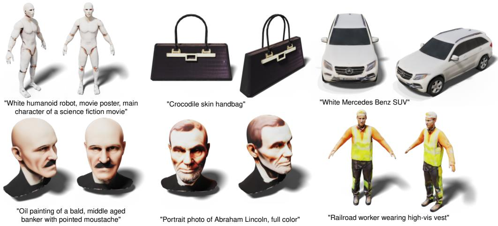  
Figure 1: Text-conditioned 3D texturing results with TexFusion.

## Abstract

We present TexFusion (Texture Diffusion), a new method to synthesize textures for given 3D geometries, using largescale text-guided image diffusion models. In contrast to recent works that leverage 2D text-to-image diffusion models to distill 3D objects using a slow and fragile optimization process, TexFusion introduces a new 3D-consistent generation technique specifically designed for texture synthesis that employs regular diffusion model sampling on different 2D rendered views. Specifically, we leverage latent diffusion models, apply the diffusion model’s denoiser on a set of 2D renders of the 3D object, and aggregate the different denoising predictions on a shared latent texture map. Final output RGB textures are produced by optimizing an intermediate neural colorfield on the decodings of2D renders of the latent texture. We thoroughly validate TexFusion and show that we can efficiently generate diverse, high quality and globally coherent textures. We achieve state-ofthe-art text-guided texture synthesis performance using only image diffusion models, while avoiding the pitfalls ofprevious distillation-based methods. The text-conditioning offers detailed control and we also do not rely on any ground truth 3D textures for training. This makes our method versatile

and applicable to a broad range of geometry and texture types. We hope that TexFusion will advance AI-based texturing of 3D assets for applications in virtual reality, game design, simulation, and more.

## 1. Introduction

In the past decade, deep learning-based 3D object generation has been studied extensively [1, 4, 18, 23, 25, 27, 32, 33, 37, 39, 44, 45, 50, 52, 53, 55, 58, 69, 71, 72, 78, 82, 85, 87, 89, 91–93, 95, 97, 100, 101], due to the demand for high-quality 3D assets in 3D applications such as VR/AR, simulation, digital twins, etc. While many prior works on 3D synthesis focus on the geometric components of the assets, textures are studied much less, despite the fact that they are important components of realistic 3D assets which assign colors and materials to meshes to make the rendering vivid. Recent advances in text-conditioned image diffusion models trained on internet-scale data [2, 54, 61, 63, 66] have unlocked the capability to generate images with stunning visual detail and practically unlimited diversity. These highperformance diffusion models have also been used as image priors to synthesize 3D objects with textures using textual guidance [40, 48, 59, 84].

In this paper, we aim to perform text-driven high-quality 3D texture synthesis for given meshes, by leveraging the information about the appearance of textures carried by the image prior of a pre-trained text-to-image diffusion model. The main workhorse in current text-to-3D methods that leverage 2D image diffusion models is Score Distillation Sampling (SDS) [59]. SDS is used to distill, or optimize, a 3D representation such that its renders are encouraged to be high-likelihood under the image prior. Methods utilizing SDS also share two common limitations in that: 1). a high classifier-free guidance weight [22] is required for the optimization to converge, resulting in high color saturation and low generation diversity; 2). a lengthy optimization process is needed for every sample.

To address the above issues, we present Texture Diffusion, or TexFusion for short. TexFusion is a sampler for sampling surface textures from image diffusion models. Specifically, we use latent diffusion models that efficiently autoencode images into a latent space and generate images in that space [63, 81]. TexFusion leverages latent diffusion trajectories in multiple object views, encoded by a shared latent texture map. Renders of the shared latent texture map are provided as input to the denoiser of the latent diffusion model, and the output of every denoising step is projected back to the shared texture map in a 3D-consistent manner. To transform the generated latent textures into RGB textures, we optimize a neural color field on the outputs of the latent diffusion model’s decoder applied to different views of the object. We use the publicly available latent diffusion model Stable-Diffusion with depth conditioning [63] (SD2-depth) as our diffusion backbone. Compared to methods relying on SDS, TexFusion produces textures with more natural tone, stronger view consistency, and is significantly faster to sample (3 minutes vs. 30 minutes reported by previous works).

We qualitatively and quantitatively validate TexFusion on various texture generation tasks. We find that TexFusion generates high quality, globally coherent and detailed textures that are well-aligned with the text prompts used for conditioning (e.g. Fig. 1). Since we leverage powerful text-to-image diffusion models for texture sampling, we can generate highly diverse textures and are not limited to single categories or restricted by explicit 3D textures as training data, which are limitations of previous works [7, 11, 18, 57, 73]. In summary, our main contribution is a novel method for 3D texture generation from 2D image diffusion models, that is view-consistent, avoids over-saturation and achieves state-of-the-art text-driven texture synthesis performance.

## 2. Related Work

Classic Computer Graphics Techniques Early work on texture generation focused on tiling exemplar patterns across a surface, often with an explicit direction field for local orientation [34, 36, 80, 86]. See [88] for a survey. This research established the value of texture image representations and the challenges of global coherence, both central to this work. However, modern learning-based priors have proven necessary to go beyond simple patterns and synthesize plausible shape-specific texture details.

Texture Synthesis with 3D Priors Textures are defined on the meshed surface of 3D objects, which is an irregular representation. To enable 2D texture generation on 3D meshes, AUV-Net [11] learns an aligned UV space for a set of 3D shapes in a given class, mapping 3D texture synthesis to a 2D domain. Texturify [73] trains a 3D StyleGAN in the quad-parameterized surface domain on a set of textured 3D shapes in a given class. Different from AUV-NET or Texturify, which embed the geometric prior into a UV map or mesh parameterization, EG3D [7] and GET3D [18] directly train 3D StyleGANs to generate geometry and texture jointly, where the textures are implicit texture fields [57]. Other works also represent 3D texture by vertex colors [49], voxels [9], cube mapping [90], etc. In contrast to TexFusion, these works mostly don’t offer text conditioning, often work only on single object categories or require textured 3D shapes for training, which limits their broad applicability.

Diffusion Models Our approach directly builds on diffusion models [5, 12, 94], which have recently emerged as new state-of-the-art generative models. In particular, they have demonstrated outstanding performance in image generation [14–16, 21, 56, 81], outperforming GANs, and led to breakthroughs in text-to-image synthesis [2, 54, 61, 63, 66]. They have also been successfully used for a variety of image editing and processing tasks [17, 19, 30, 38, 43, 47, 64, 65, 67, 70, 77]. Moreover 3D object generation has been addressed with diffusion models, too, for instance leveraging point clouds [45, 55, 97, 101], meshes [27], or neural fields [4, 52, 72, 85] as 3D representations. However, these works focus on geometry generation and do not specifically tackle 3D texture synthesis.

Distilling 3D Objects from 2D Image Diffusion Models Recently, large-scale 2D text-to-image diffusion models have been leveraged to distill individual 3D objects as neural radiance fields using Score Distillation Sampling (SDS) [13, 40, 48, 59, 84]. In SDS, the radiance field is rendered from different directions into 2D images and it is optimized such that each render has a high probability under the text-to-image diffusion model while conditioning on a text prompt. DreamFusion [59] pioneered the approach, Magic3D [40] proposed a coarse-to-fine strategy improving quality, and Latent-NeRF [48] performs distillation in latent space leveraging a latent diffusion model [63]. These approaches do not specifically target texture generation, which is the focus of this work. More deeply, a crucial drawback of this line of work is that SDS typically requires strong guidance [22] to condition the diffusion model, which can hurt quality and diversity. Moreover, SDS’s iterative optimzation process makes synthesis very slow. In contrast, our approach avoids SDS entirely and leverages regular diffusion model sampling in a new, 3D-consistent manner. Earlier works also leverage CLIP [60] for 3D object or texture distillation [10, 26, 31, 49], but this performs usually worse than using diffusion models instead.

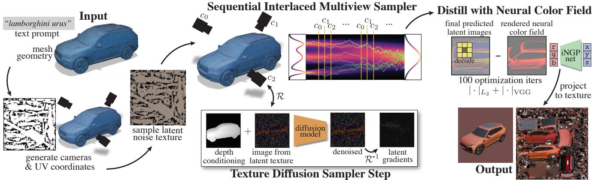  
Figure 2: Overview of TexFusion. TexFusion takes a text prompt and mesh geometry as input and produces a UV parameterized texture image matching the prompt and mesh. Key to TexFusion is the Sequential Interlaced Multiview Sampler (SIMS) - SIMS performs denoising diffusion iterations in multiple camera views, yet the trajectories are aggregated through a latent texture map after every denoising step. SIMS produces a set of 3D consistent latent images (TexFusion uses Stable Diffusion [63] as text-to-image diffusion backbone), which are decoded and fused into a texture map via optimizing an intermediate neural color field.

Concurrent Work Concurrently with this work, TEX-Ture [62] proposes a related approach. Like this work, TEXTure performs multiview denoising on a texture map representation. However, TEXTure runs an entire generative denoising process in each camera view in sequence, conditioning on the previous views and projecting to the texture map only after full denoising. In contrast, in TexFusion we propose to interleave texture aggregation with denoising steps in different camera views, simultaneously generating the entire output. This insight significantly reduces view inconsistencies and improves quality in TexFusion compared to TEXTure, as validated in Sec. 5. MultiDiffusion [3] concurrently introduces a method for panorama generation and other controlled image generation tasks, leveraging relatively lower-resolution image diffusion models. Algorithmically, this approach of aggregating different denoising predictions from different image crops is closely related to TexFusion’s aggregation from different camera views. However, MultiDiffusion only tackles image synthesis, and is not concerned with any 3D or texture generation at all.

## 3. Background

Diffusion Models Diffusion models [20, 74, 76] model a data distribution $p _ { \mathrm { d a t a } } ( \mathbf { x } )$ via iterative denoising, and are trained with denoising score matching [20, 24, 46, 74, $7 6 , 8 3 ]$ . Given samples $\mathbf { x } ~ \sim ~ p _ { \mathrm { d a t a } }$ and $\epsilon \sim \mathcal { N } ( 0 , I )$ , a denoiser model $\epsilon _ { \theta }$ parameterized with learnable parameters θ receives diffused inputs ${ \bf x } _ { t } ( \epsilon , t , { \bf x } )$ and is optimized by minimizing the denoising score matching objective

$$
\begin{array} { r } { \mathbb { E } _ { \mathbf { x } \sim p _ { \mathrm { d a t a } } , t \sim p _ { t } , \epsilon \sim \mathcal { N } ( \mathbf { 0 } , I ) } \left[ \lVert \epsilon - \epsilon _ { \theta } ( \mathbf { x } _ { t } ; \mathbf { c } , t ) \rVert _ { 2 } ^ { 2 } \right] , } \end{array}\tag{1}
$$

where c is optional conditioning information, such as a text prompt, and $p _ { t }$ is a uniform distribution over the diffusion time t. The model effectively learns to predict the noise ϵ that was used to perturb the data (other formulations are possible [28, 68]). Letting $\alpha _ { t }$ define a noise schedule, parameterized via a diffusion-time t, we construct $\mathbf { x } _ { t }$ as $\mathbf { x } _ { t } \ = \ \sqrt { \alpha _ { t } } \mathbf { x } + \sqrt { 1 - \alpha _ { t } } \epsilon , \ \epsilon \ \sim \ \mathcal { N } ( \mathbf { 0 } , I )$ ; this particular formulation corresponds to a variance-preserving schedule [76]. The forward diffusion as well as the reverse generation process in diffusion models can be described in a continuous-time framework [76], but in practice a fixed discretization can be used [20]. The maximum diffusion time is generally chosen such that the input data is entirely perturbed into Gaussian random noise and an iterative generative denoising process can be initialized from such Gaussian noise to synthesize novel data.

Classifier-free guidance [22] can be used for improved conditioning. By randomly dropping out the conditioning c during training, we can learn both a conditional and an unconditional model at the same time, and their predictions can be combined to achieve stronger conditioning.

We perform iterative diffusion model sampling via the Denoising Diffusion Implicit Models (DDIM) scheme [75]:

$$
\begin{array} { r } { \pmb { x } _ { i - 1 } = \sqrt { \alpha _ { i - 1 } } \left( \frac { \pmb { x } _ { i } - \sqrt { 1 - \alpha _ { i } } \pmb { \epsilon } _ { \theta } ^ { ( t _ { i } ) } ( \pmb { x } _ { i } ) } { \sqrt { \alpha _ { i } } } \right) } \\ { + \sqrt { 1 - \alpha _ { i - 1 } - \sigma _ { t _ { i } } ^ { 2 } } \cdot \pmb { \epsilon } _ { \theta } ^ { ( t _ { i } ) } ( \pmb { x } _ { i } ) + \sigma _ { t _ { i } } \pmb { \epsilon } _ { t _ { i } } } \end{array}\tag{2}
$$

with $\epsilon _ { t _ { i } } \sim \mathcal { N } ( \mathbf { 0 } , I )$ and $\sigma _ { t _ { i } }$ is a variance hyperparameter. We express obtaining ${ \bf { \mathbf { \mathit { x } } } } _ { i - 1 }$ via DDIM sampling as $x _ { i - 1 } \sim$ $\pmb { f } _ { \theta } ^ { ( t _ { i } ) } ( \pmb { x } _ { i - 1 } | \pmb { x } _ { i } )$ . See Supp. Material for more details.

Latent Diffusion Models (LDMs) and Stable Diffusion Instead of directly operating on pixels, LDMs [63] utilize an encoder $\mathcal { E }$ and a decoder for translation between images $\xi$ and latents $\mathbf { x } \in X$ of a lower spatial dimension. The diffusion process is then defined over the distribution of $X$ . Stable Diffusion is an LDM trained on the LAION-5B image-text dataset. In addition to text-conditioning, Stable Diffusion 2.0 permits depth conditioning with a depth map $D \left( \mathtt { S D 2 - d e p t h } \right)$ . This allows detailed control of the shape and configuration of objects in its synthesized images.

Rendering and Geometry Representation In principle, our method applies to any geometry representation for which a textured surface can be rendered; in practice, our experiments use a surface mesh $\mathcal { M } = ( \mathcal { V } , \mathcal { F } )$ , with vertices $\mathcal { V } = \{ v _ { i } \} , v _ { i } \in \mathbb { R } ^ { 3 }$ and triangular faces ${ \mathcal F } = \{ f _ { i } \}$ where each $f _ { i }$ is a triplet of vertices. Textures are defined in 2D image space in an injective UV parameterization of , $U V : p \in \mathcal { M } \mapsto ( u , v ) \in [ 0 , 1 ] ^ { 2 }$ . If needed, this parameterization can be automatically constructed via tools such as XATLAS [6, 96]. We encode textures as multi-channel images discretized at pixels in UV space $\mathbf { z } \in \mathbb { R } ^ { ( H \times W , C ) }$ notationally collapsing the spatial dimension for simplicity.

We denote the rendering function as $\mathcal { R } ( \mathbf { z } ; \mathcal { M } , C ) : \mathbf { z } \mapsto$ $\mathbf { x } , \mathbf { x } \in \mathbb { R } ^ { ( h \times w , C ) }$ , which takes as input a mesh , camera C, and texture z, and produces as output a rendered image. The inverse of this function $\mathcal { R } ^ { - 1 } ( \mathbf { x } ; \mathcal { M } , C ) : \textbf { x } \mapsto \textbf { z }$ projects values from camera image-space onto the UV texture map. Notationally, we often omit the dependence on  and C for brevity. In this work, we do not model any lighting or shading effects, images are formed by directly projecting textures into screen space (and then decoding, for latent textures).

## 4. Texture Sampling with 2D Diffusion Models

Given a mesh geometry , a text prompt y, and a geometry (depth) conditioned image diffusion model θ, how could one sample a complete surface texture? Assuming access to the rendering $\mathcal { R }$ and inverse rendering $\mathcal { R } ^ { - 1 }$ functions defined above, perhaps the most naive approach is to compute a set of $\{ C _ { 1 } , . . , C _ { N } \}$ camera views that envelopes the surface, render the depth map $d _ { n }$ in each view, sample images from the image diffusion model with depth conditioning, and then back-project these images to the mesh surface (e.g. as done in [29]). However, image diffusion models in each view have no information about the generated results in other views, thus there is no coherency in the contents generated in each view. As an alternative, one may define a canonical order of camera views, and autoregressively condition image sampling in the subsequent views on previously sampled regions (as done in [48, 62]). However, for most geometries of interest (i.e. not a plane), a single camera can not observe the entirety of the geometry. Consequently, images synthesized early in the sequence could produce errors that are not reconcilable with the geometry that is observed later in the sequence (see Fig. 3). Thus, it is desirable for the image sampling distribution $p ( \cdot | d _ { i } , y )$ in each camera view to be conditioned on that of every other camera view.

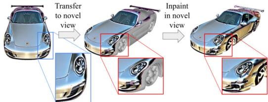  
Figure 3: Illustration of irreconcilable mistakes in early views impacting denoised results in later views (images sampled from TEXTure). While the highlighted area appears natural in the first view, it does not match the geometry when viewed from a different angle, thereby creating poorly denoised results when the second view is inpainted.

## 4.1. Sequential Interlaced Multiview Sampler

Leveraging the sequential nature of the denoising process, we can interlace the synchronization of content across views with the denoising steps within each view to achieve coherency over the entire shape. Suppose that at step i of the denoising process, we have a set of partially denoised images $\{ \mathbf { x } _ { i , n } \} _ { n = 1 } ^ { N } = \{ \mathbf { x } _ { i , 1 } . . . \mathbf { x } _ { i , N } \}$ . Our goal is to sample $\{ \mathbf { x } _ { i - 1 , n } \} _ { n = 1 } ^ { N } = \mathbf { x } _ { i - 1 , 1 } . . . \mathbf { x } _ { i - 1 , N }$ that is 3D-consistent, i.e., two pixels in $\mathbf { x } _ { i - 1 , a } , \mathbf { x } _ { i - 1 , b }$ that project to the same point in 3D should have the same value. Taking inspiration from the autoregressive modeling literature, we sample the joint distribution via first decomposing it into a product of conditionals, and approximating each term in the product by using the diffusion model to denoise the renders of a dynamically updated latent texture map. Specifically, we first initialize an initial latent texture map ${ \bf z } _ { T } \sim \mathcal { N } ( { \bf 0 } , I ) , ( T$ demarks the first step of the diffusion trajectory). Then, suppose that we have a 3D consistent latent texture map z , we decompose the joint distribution as follows (conditioning on depth and prompt omitted for space):

$$
\begin{array} { r } { p _ { \theta } \big ( \{ \mathbf { x } _ { i - 1 , j } \} _ { j = 1 } ^ { N } | \mathbf { z } _ { i } \big ) = p _ { \theta } \big ( \mathbf { x } _ { i - 1 , 1 } | \mathbf { z } _ { i } \big ) \times } \\ { \displaystyle \prod _ { n = 2 } ^ { N } p _ { \theta } \big ( \mathbf { x } _ { i - 1 , n } | \big \{ \mathbf { x } _ { i - 1 , j } \} _ { j = 1 } ^ { n - 1 } , \mathbf { z } _ { i } \big ) } \end{array}\tag{3}
$$

We can compute the first term by first rendering $\mathbf { z } _ { i }$ into $\mathbf { x } _ { i , 1 } ^ { \prime } = \mathcal { R } ( \mathbf { z } _ { i } ; C _ { 1 } )$ . Eqn. 2 can now be applied to $\mathbf { x } _ { i , 1 } ^ { \prime }$ to draw a latent image at the next time step:

$$
\mathbf { x } _ { i - 1 , 1 } \sim f _ { \theta } ^ { ( t _ { i } ) } ( \mathbf { x } _ { i - 1 , 1 } \vert \mathbf { x } _ { i , 1 } ^ { \prime } = \mathcal { R } ( \mathbf { z } _ { i } ; C _ { 1 } ) ) .\tag{4}
$$

Later terms in Eq. 3 additionally depend on the result of previous denoising steps. We again model this dependency through the latent texture map. For each view starting at $n = 1$ , we inverse render $\mathbf { x } _ { i - 1 , n }$ into texture space to obtain $\mathbf { z } _ { i - 1 , n } ^ { \prime } = \mathcal { R } ^ { - 1 } ( \mathbf { x } _ { i - 1 , n } )$ , and update the pixels of ${ \bf z } _ { i - 1 , n - 1 }$ that are newly visible in $\mathbf { z } _ { i - 1 , n } ^ { \prime }$ to obtain ${ \bf z } _ { i - 1 , n }$ (See Sec. 4.2.2 for details). Then, in the $n + 1$ iteration, since ${ \bf z } _ { i - 1 , n }$ contain regions at two noise scales (unseen regions are at noise scale $\sigma _ { i } ,$ while visited regions are at noise scale $\sigma _ { i - 1 } ) .$ we add appropriate 3D consistent noise to the visited regions of ${ \bf z } _ { i - 1 , n }$ to match the noise scale of step i before rendering it as input to $f _ { \theta } .$ . Letting $M _ { i , n }$ represent the mask for visited regions and $\epsilon _ { i } \sim \mathcal { N } ( \mathbf { 0 } , I )$ , we can write the sampling procedure for ${ \bf x } _ { i - 1 , n }$ as:

$$
\begin{array} { r l } & { \mathbf { z } _ { i , n } = M _ { i , n } \odot \bigg ( \sqrt { \frac { \alpha _ { i - 1 } } { \alpha _ { i } } } \mathbf { z } _ { i - 1 , n - 1 } + \sigma _ { i } \epsilon _ { i } \bigg ) } \\ & { \qquad + \left( \mathbf { 1 } - M _ { i , n } \right) \odot \mathbf { z } _ { i } } \\ & { \qquad \mathbf { x } _ { i - 1 , n } \sim f _ { \theta } ^ { ( t _ { i } ) } ( \mathbf { x } _ { i - 1 , n } | \mathbf { x } _ { i , n } ^ { \prime } = \mathcal { R } ( \mathbf { z } _ { i , n } ; C _ { n } ) ) } \end{array}\tag{5}
$$

By iteratively applying Eqn. 5, we obtain a sequence of 3D consistent images $\{ \mathbf { x } _ { i - 1 , n } \} _ { n = \cdot } ^ { N }$ and a texture map ${ \bf z } _ { i - 1 , n }$ that has been aggregated from these images. We can then decrement i and repeat this process in the next time step.

We name this approach Sequential Interlaced Multiview Sampler (SIMS). SIMS communicates the denoising direction of previous views to the current view and resolves overlaps between views by the order of aggregation. It ameliorates inconsistent predictions while circumventing performance degradation due to the averaging of latent predictions during parallel aggregation. In the single-view case, SIMS is equivalent to standard DDIM sampling. A complete algorithm for SIMS can be found in the appendix.

## 4.2. The TexFusion Algorithm

In Sec. 4.1, we have presented a generic algorithm for sampling 3D consistent multi-view images and texture maps using 2D diffusion models. We now present a concrete algorithm, TexFusion , that uses SIMS to texture 3D meshes using SD2-depth [63] as the diffusion model. An illustrative overview of TexFusion can be found in Fig. 2.

As SD2-depth is a latent diffusion model, we apply SIMS in the latent space: x and z represent latent images and latent texture maps respectively, and Section 4.2.3 will describe a final distillation post-process to color space. In this section, we address several challenges specific to using LDMs with SIMS, and detail our design choices to tackle these challenges. We find that a canonical set of cameras works well for most objects, but cameras are tailored to specific objects to improve resolution and ameliorate occlusion. We further illustrate a technique for obtaining highquality results by operating SIMS in a cascade of increasing resolutions.

## 4.2.1 (Inverse) Rendering of Latent Textures

We use NVDIFFRAST [35] to efficiently render textured meshes via rasterization, as described in Sec. 3. Our implementation sets the rendered image size $h = w = 6 4$ to match Stable Diffusion’s UNet, with latent vectors of dimension $D = 4$ . The texture image dimensions H and W are chosen based on the surface area of the mesh relative to its diameter (detailed in Sec. 4.2.4).

For each non-background pixel s in a rendered image $\mathbf { x } _ { i , . } ^ { \prime }$ , rasterization gives a corresponding location on the texture image via the UV map $( u , v ) = U V ( p )$ , and we retrieve the value at the nearest texture pixel. This texture value is latent, and no shading or lighting is applied. In other settings, texture data is often rendered with bilinear filtering and mipmaps to improve image quality and reduce aliasing, but in this setting, we found it essential to avoid such techniques. We experimentally ablate texturing approaches in the supplementary. The issue is that early in the diffusion process, i.e. when $t _ { i } \ll 0 , \mathbf { z } _ { i }$ and $\mathbf { x } _ { i , \ l } ^ { \prime }$ are dominated by noise, but interpolation and mipmapping change the variance in the pixels $\mathbf { x } _ { i , \cdot } ,$ thereby moving $\mathbf { x } _ { i , \ l } ^ { \prime }$ out of the training distribution of $\epsilon _ { \theta } ^ { ( t _ { i } ) }$ . Instead, we retrieve only the nearest texture pixels for diffusion, and resolve aliasing and interpolation via a simple distillation post-process (Sec. 4.2.3). For each background pixel in rendered image $\mathbf { x } _ { i , \cdot } ^ { \prime }$ , we apply a Gaussian noise of standard deviation $\sigma _ { i } ,$ such that the background matches the marginal distribution at diffusion step $t _ { i }$ . This ensures that the diffusion model $f _ { \theta } ^ { ( t _ { i } ) }$ focuses solely on the foreground pixels of $\mathbf { x } _ { i , . } ^ { \prime }$

Note that in this setting a rendered image is simply a selection of pixels from the texture maps, and thus we can leverage backpropagation to easily implement the inverse rendering function $\mathcal { R } ^ { - 1 }$ . Additionally, forward rasterization yields a depth map of the scene, which we use as a conditioning input to the diffusion model.

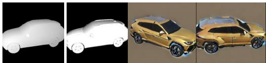  
Figure 4: Left: Depth map for conditioning SD2-depth, and quality image computed from screen space derivatives. Right: Output of SD2 decoder in two views using renders of the latent texture map as input. Note how the horizontal line across the doors changes appearance from one view to another.

## 4.2.2 Aggregating Latent Textures.

Recall from Sec. 4.1, before iterating through cameras $\{ C _ { 1 } , . . . , C _ { N } \}$ , we first initialize a latent texture map $\mathbf { z } _ { i - 1 , 0 } ~ = ~ \mathbf { z } _ { i }$ and render latent image $\mathbf { x } _ { i , 1 } ^ { \prime } = \mathcal { R } ( \mathbf { z } _ { i - 1 , 0 } )$ Then, in each step (iterating through cameras), we obtain $\mathbf { x } _ { i - 1 , n }$ from $f _ { \theta } ^ { ( t _ { i } ) } ( \mathbf { x } _ { i , n } ^ { \prime } )$ , and inverse render it to get $\mathbf { z } _ { i - 1 , n } ^ { \prime } = \mathcal { R } ^ { - 1 } ( \mathbf { x } _ { i - 1 , n } )$ . Finally, we need to aggregate the partial texture map $\mathbf { z } _ { i - 1 , n } ^ { \prime }$ with $\mathbf { z } _ { i - 1 , n - 1 }$ to obtain a partially updated texture map ${ \bf z } _ { i - 1 , n }$ . We perform this aggregation step based on a simple heuristic that the value of each pixel $( u , v )$ in z should be determined by the camera that has the most “direct and up-close” view to its corresponding point on the mesh. We measure view quality using imagespace derivatives - the amount of change in UV coordinates per infinitesimal change in the image coordinate. This quantity is commonly used for determining mipmapping resolution and anti-aliasing, and it can be efficiently computed by nvdiffrast when rasterizing $\mathbf { z } _ { i , n - 1 }$ . For each pixel location $( p , q )$ in ${ \bf x } _ { i - 1 , n } ,$ we compute the negative Jacobian magnitude as $\begin{array} { r } { - | \frac { \partial u } { \partial p } \cdot \frac { \partial v } { \partial q } - \frac { \partial u } { \partial q } \cdot \frac { \partial v } { \partial p } | } \end{array}$ , and inverse render it to the texture space, which we denote as $Q _ { i , n }$ . Higher values of $Q _ { i , n } ( u , v )$ means that camera n has a better view of $( u , v )$ (see Fig. 4). In addition, we compute $M _ { i , n } = \mathcal { R } ^ { - 1 } ( I )$ , such that $M _ { i , n } ( u , v )$ represents the number of pixels in $\mathbf { x } _ { i , n } ^ { \prime }$ that received value from ${ \bf z } _ { i } ( u , v )$

While iterating through cameras 1 through N, we maintain mask $M _ { i }$ (initialized to 0), which is used to track which pixels of ${ \bf z } _ { i , n }$ have been seen by cameras up to n, and quality buffer $Q _ { i }$ (initialized to inf), which is used to track the highest non-zero value of $Q _ { i , n }$ at each $( u , v )$ . The value at $( u , v )$ of ${ \bf z } _ { i - 1 , n }$ is determined as:

$$
\begin{array} { r } { \mathbf { z } _ { i - 1 , n } ( u , v ) = \left\{ \begin{array} { l l } { \frac { \mathbf { z } _ { i - 1 , n } ^ { \prime } ( u , v ) } { M _ { i , n } ( u , v ) } } & { M _ { i , n } ( u , v ) > 0 , \mathrm { a n d } } \\ { \mathbf { z } _ { i - 1 , n } ( u , v ) } & { Q _ { i , n } ( u , v ) > Q _ { i } ( u , v ) } \\ { \mathbf { z } _ { i - 1 , n - 1 } ( u , v ) } & { \mathrm { o t h e r w i s e } . } \end{array} \right. } \end{array}\tag{6}
$$

$M _ { i }$ and $Q _ { i }$ are then updated pixelwise as $M _ { i } = \operatorname* { m i n } ( M _ { i , n } +$ $M _ { i } , 1 )$ and $Q _ { i } = \operatorname* { m a x } \left( Q _ { i , n } , Q _ { i } \right)$ (min and max are applied element-wise). We use Eqn. 6 in conjunction with Eqn. 5 in SIMS to perform denoising of images in the sequence of camera views.

We further note that a side effect of using nearest pixel filtering during texture sampling in SIMS is aliasing. When the image space derivative Jacobian is much higher than 1 (low quality), neighboring pixels in screen space will have gaps when mapped to uv space. This results in incomplete filling of the latent texture map. Conversely, when the image space derivative Jacobian magnitude is much smaller than 1 (high quality), multiple screen space pixels $( p , q$ will map to the same $( u , v )$ , creating uniform blocks in x. Similar to interpolated latents, these blocks are particularly detrimental early during the diffusion process, as they cannot be correctly denoised by $\epsilon _ { \theta }$ which is expecting high spatial variance. Our quality-based aggregation overwrites lowquality regions in the latent texture when higher quality views are available. Thus we can set the resolution of the texture map such that the image space derivatives in each view do not fall below 1 (i.e. max $Q _ { i , n } < - 1 )$ to prevent aliasing of the second type, and rely on cameras with better views to fix aliasing of the first type.

## 4.2.3 From Latent to RGB Textures

So far, we have described how to use SIMS to produce a set of 3D consistent latent images and latent texture maps, but have yet to describe how to translate this into a RGB texture map that can be rendered for viewing. Towards this, we experimented with multiple approaches and found performing multi-view distillation of decoded latent images $\{ \mathbf { x } _ { 0 , n } \} _ { n = 1 } ^ { N }$ with a neural color field to be most performant. Specifically, we use the decoder of Stable Diffusion to decode latent multi-view images $\{ \mathbf { x } _ { 0 , n } \} _ { n = 1 } ^ { N }$ into RGB multi-view images $\{ \xi _ { n } ~ = ~ \mathcal { D } ( \mathbf { x } _ { 0 , n } ) \} _ { n = 1 } ^ { N }$ . Notably, decoding with introduce inconsistencies such that $\{ \xi _ { n } \} _ { n = 1 } ^ { N }$ is not 3D consistent even when $\{ \mathbf { x } _ { 0 , n } \} _ { n = 1 } ^ { N }$ is 3D consistent (see Fig. 4 for example). In stable Diffusion, each latent vector (pixel of x) needs to carry the information of a $8 \times 8$ patch of RGB pixels. Thus, the value of the latent vector encodes both color values and spatial patterns. We therefore cannot expect their decoded results to be equivariant to perspective transformations. To address this problem, we leverage a neural color field optimized with appearance-based losses to smooth out inconsistencies. Since we know the ground truth camera poses, we can directly obtain the 3D spatial coordinates $\{ x y z _ { n } \} _ { n = 1 } ^ { N }$ of all pixels of $\{ \xi _ { n } \} _ { n = 1 } ^ { N }$ by projecting pixels to the mesh surface. Background pixels that do not intersect any surface are discarded. Following [40], we use a multi-resolution hash encoding based on instantNGP [51] along with a shallow MLP $f _ { \phi }$ to parameterize a function from 3D spatial coordinates to RGB values for each sample $r g b = f _ { \phi } ( h a s h ( x y z ) )$ . We then distill multi-view images $\{ \xi _ { n } \} _ { n = 1 } ^ { N }$ into this parametric function via optimization. Since our goal is to export ϕ into a texture map, we do not use any view-dependent parameterization. To reconcile inconsistencies, we use both a standard L2 loss and a VGGbased perceptual loss, applied between $f _ { \phi }$ and $\{ \xi _ { n } \} _ { n = 1 } ^ { N }$ , to train $\phi .$ We use Adam with a learning rate of 0.01, and optimization of ϕ converges within 100 iterations. After opti mization, we compute the spatial coordinate of the centers of each pixel in a high-resolution texture map, and query $f _ { \phi }$ to predict RGB values for the texture map.

## 4.2.4 Geometry Processing, Camera, and Multiresolution Refinement

We normalize such that it fits inside a cube of side length 1, and center it at the origin. Perspective cameras are placed facing the origin, and their FOV is adjusted to fit the object. Detailed parameters can be found in the appendix. As the diffusion model relies on context captured in $\mathbf { x } _ { i , \cdot }$ · to perform denoising, camera views that are too small w.r.t the size of the object often result in content drift - the texture in distant areas of the mesh can have content that is semantically inconsistent. This can be seen as our version of the Janus face problem known to Dreamfusion and similar approaches [40, 59, 84]. Our solution is to perform two rounds of TexFusion at different resolution scales to obtain highresolution textures while retaining semantic consistency.

Specifically, we first run TexFusion using cameras that cover the entire object, and a low-resolution latent texture map that is suitable for these cameras. We do not run view distillation in this first round as we are only interested in the latent texture map. We denote the denoised latent texture map from this step as ${ \bf z } _ { 0 , l r }$ . We then use a second set of cameras with a narrower field of view; these cameras are also more numerous to still cover the full object. We determine a new texture map resolution using the square of the ratio of the tangent of the old FOV over the new FOV - corresponding to the relative change in surface area covered by the camera before and after the change in FOV. We then upsample ${ \bf z } _ { 0 , l r }$ with nearest neighbor filtering to this higher resolution, and stochastically encode it to a partially noised state (e.g. T = 500 in the diffusion model time schedule). The second round of TexFusion uses these new cameras, and initializes SIMS with the partially noised latent texture map. The multi-view images produced by the second round of SIMS is used to produce the final output texture map via neural color field distillation.

## 5. Experiments

We apply TexFusion on various geometries and text prompts to evaluate its ability to produce high quality, natural, and 3D consistent textures. We focus our experimental comparisons on TEXTure [62], a text-driven texture generation method that also uses SD2-depth. We choose TEXTure as the baseline because (1) it represents the current state-of-the-art for language-conditioned texture generation, (2) it uses the same SD2-depth model, which can be prompted for a wide variety of content, and (3) it is concurrent to our work. In the supplementary materials, we further compare TexFusion to SDS-based text-driven texture distillation [48, 59], leveraging the Stable Diffusion model and show that TexFusion achieves superior results in terms of quality and speed.

Dataset We collect 35 meshes of various content, and write 2-4 prompts for each mesh. In total, we evaluate each texture synthesis method on 86 mesh-text pairs. More details of this dataset are in the supplementary materials.

## 5.1. Qualitative Comparisons

We visualize textures produced by TexFusion on multiple geometries and prompts, and compare to state-of-the-art baselines in Figure 6. We render each object in 3 surrounding views to allow better examination of 3D consistency of the produced texture. We use Blender’s Cycles renderer with a studio light-setup. Textures are applied as base color to a diffuse material. Additional visualizations, including videos showing 360 pans of all objects presented in the paper, and renders of our results using only texture color, can be found in the supplementary materials.

In terms of local 3D consistency (consistency in neighborhoods on the surface of the mesh), textures produced by TexFusion are locally consistent - there are no visible seam lines or stitching artifacts. In contrast, we often find severe artifacts when viewing the top and back sides of TEXTure’s outputs. These artifacts are most noticeable when a clean color is expected, such as when texturing vehicles. In terms of global consistency (semantic coherency of the entire texture, e.g. exactly 2 eyes and 1 nose to a face), TEXTure performs poorly and suffers from problems similar to Dream-Fusion’s Janus face problem [59]: as the 2D diffusion model captures context of the object through its own camera view, it is not aware of the appearance of the opposite side of the object. This problem is ameliorated in TexFusion due to frequent communication between views in SIMS.

There are noticeably more baked specular highlights and shadows in textures generated by TEXTure. These effects are physically inaccurate as they conflict with the lighting effects simulated by the renderer. In contrast, TexFusion produces textures that are smoothly illuminated. We hypothesize that this is due to interlacing aggregations in SIMS, which removes view-dependent effects as they arise in the sampling process. We provide additional visualizations of TexFusion in Fig. 5 to showcase how text prompting is effective at controlling the generation of textures, thereby producing varying appearances using the same mesh.

Runtime TexFusion takes approximately 3 minutes on a machine with a single GPU to sample one texture. We are slightly faster than TEXTure (5 min.) [62], since we only need to optimize a color field once after sampling is complete. We are also an order of magnitude faster than methods that rely on SDS loss which report upwards of 40 minutes [40, 48, 59]. Additional runtime comparisons are in the appendix.

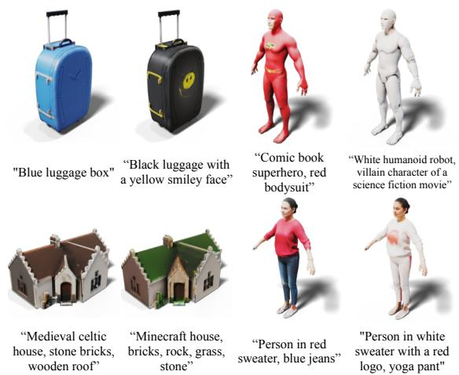  
Figure 5: More TexFusion text-conditioned texturing results.

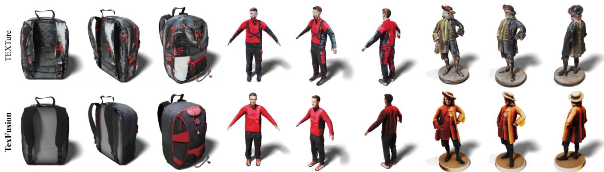  
“Black backpack with red accents”  
“Biker wearing red jacket and black pants”

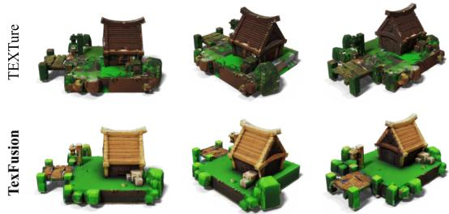  
“minecraft house, bricks, rock, grass, stone”  
“Portrait of Provost, oil paint”

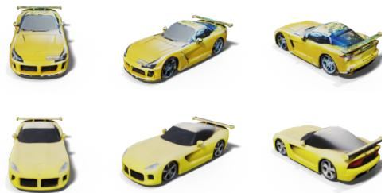  
“Beautiful yellow sports car”

Figure 6: Visual comparison of textures generated by TEXTure [62] and TexFusion.
<table><tr><td rowspan="2">Method</td><td rowspan="2">FID (↓)</td><td colspan="4">User study (%)</td></tr><tr><td>Natural Color (↑)</td><td>More Detailed (↑)</td><td>Less Artifacts (↑)</td><td>Align with Prompt (↑)</td></tr><tr><td rowspan="2">TEXTure TexFusion</td><td>79.47</td><td></td><td></td><td></td><td></td></tr><tr><td>59.78</td><td>24.42 75.58</td><td>65.12 34.88</td><td>31.40 68.60</td><td>43.02 56.98</td></tr></table>

Table 1: Quantitative and qualitative comparisons between TEX-Ture and TexFusion . FID is computed w.r.t. a set of images synthesized by SD2-depth.

## 5.2. Quantitative Comparisons

It is inherently difficult to quantitatively evaluate the quality of text and geometry-conditioned texture generation as one must take alignment with the conditioning inputs into account. We rely on both automated and human evaluation to gauge the quality of the synthesized textures.

FID Since SD2-depth can produce high-quality images that match the structure of the conditioning geometry, we sample it to create a proxy ground truth set. Furthermore, as both TEXTure and TexFusion use SD2-depth as 2D prior, samples from it serve as an upper bound to the quality and diversity of the appearance of textures: We render the depth map of all meshes in 8 canonical views, and condition SD2-depth on both these depth maps and our text prompts to generate a ground truth set. We also render textures generated by both methods in these same 8 views, and compute the Frechet Inception Distance (FID) between im-´ ages rendered from the textures and the ground truth set. FID measures the overlap between two sets of images based on their similarity in a learned feature space. We white out the background regions in rendered images and ground truth images to focus the comparisons to the textured object. We present the results in Tab. 1. FID scores indicate that textures synthesized by TexFusion are closer in appearance to the ground truth set than those from TEXTure. The absolute FID values are likely high due to the relatively small set of images in each dataset.

User study We conducted a user study to measure the overall quality of the generated textures. We use all mesh and text prompts in our dataset, and render each textured mesh into a video showing the results from a 360 rotating view. We present videos from TEXTure and TexFusion side by side in random left-right order, to avoid bias. The user study was conducted on Amazon Mechanical Turk. Each participant is asked to select the preferred result under four criteria: natural color (non-saturation), details, cleanliness, and alignment with the text prompt. To avoid randomness in the answers, we let 3 participants answer the same question and determine the choice by max-voting, a question screenshot is provided in the supplement. We provide the user study results in Tab. 1. Although not deemed as detailed as TEXTure, our results are overall preferred by the users in terms of better aligning with the provided text prompt, and having more natural color, and fewer artifacts/flaws.

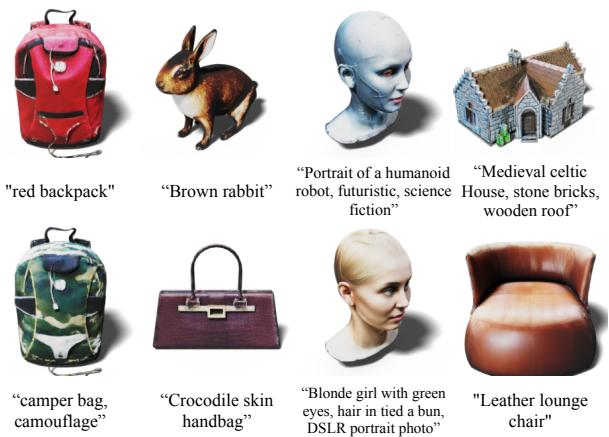  
Figure 7: TexFusion + non-stochastic DDIM sampling $( \sigma _ { t _ { i } } =$ 0). This setting emphasizes textural details, such as the leather (bottom, left), roof shingles (top, right)

## 5.3. Improving Texture Details

Texfusion can produce more texture details with adjusted hyperparameters and diffusion backbones. First, we find that using the non-stochastic version of DDIM (η = 0) adds more materialistic details to the textures on smooth/lowpoly geometries. We showcase some examples with particularly large improvements in Fig. 7. Second, we explore the use of ControlNet[98], which can be easily substituted as the LDM backbone for our method without any additional changes. We find that its high-resolution depth conditioning allows TexFusion to capture fine-grained geometric details in the input mesh. In Fig. 8, we further compare TexFusion + ControlNet in “normal mode” (apply classifier-free guidance to text prompt only) and ControlNet’s “guess mode” (apply classifier-free guidance to both text and depth) on meshes with fine geometric details. TexFusion produces high-contrast textures with the appearance of strong lighting under “guess mode”, and realistic textures with smooth lighting in “normal mode”. These modifications improve details at a cost of reduced robustness. The non-stochastic DDIM setting may create artifacts when a smooth and clean texture is desired. On the other hand, the increase in depth resolution makes TexFusion+ControlNet susceptible to capturing face boundaries on low-poly meshes. We provide visualizations of these failure cases in Fig. 9. Nonetheless, these modifications offer further dimensions of control that can be explored by practitioners.

## 6. Conclusion and Limitations

We presented TexFusion, a novel approach to text-driven texture synthesis for given 3D geometries, using only largescale text-guided image diffusion models. TexFusion leverages the latent diffusion model Stable Diffusion and relies on a new 3D-consistent diffusion model sampling scheme that runs a 2D denoiser network in different views of the object and aggregates the predictions in a latent texture map after each denoising iteration. We find that our method can efficiently generate diverse, high-quality, and globally coherent textures and offers detailed control through text conditioning. Limitations of our approach include a not-yetideal sharpness and that texture generation is not real-time. Future work can address these issues; for instance, it would be interesting to leverage the recent literature on faster diffusion model samplers [15, 41, 42, 99].

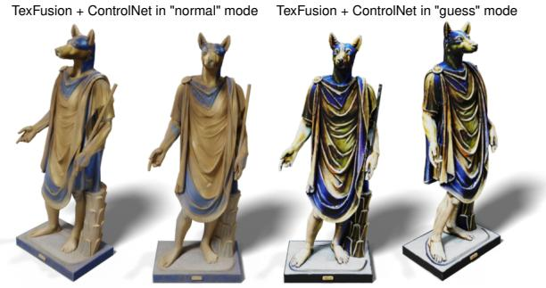  
“Portrait of greek-egyptian deity hermanubis, lapis skin and gold clothing”

Figure 8: Left: TexFusion + ControlNet in “normal mode”; right: TexFusion + ControlNet in “guess mode”.  
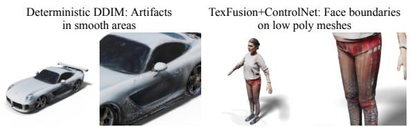  
Figure 9: Failure modes exhibited by (left) TexFusion + nonstochastic DDIM sampling and (right) TexFusion + ControlNet.

Concurrent Works Since Submission Since the time of writing this paper, new works has appeared in the text to texture space [8, 79]. They improve upon TEXTure in aspects such as adding a refinement procedure to automatically fix low quality areas from the initial texturing process [8], and using images sampled from a text-to-image model and per-prompt finetuning to provide stronger conditioning [79]. TexFusion is methodologically distinct from these methods which are based-on TEXTure. Improvements proposed in these works could be combined with TexFusion in future work.

Acknowledgements We would like to thank Jun Gao for the helpful discussions during the project. Tianshi Cao acknowledges additional income from Vector Scholarships in Artificial Intelligence, which are not in direct support of this work.

## References

[1] Panos Achlioptas, Olga Diamanti, Ioannis Mitliagkas, and Leonidas Guibas. Learning representations and generative models for 3D point clouds. In ICML, 2018. 1

[2] Yogesh Balaji, Seungjun Nah, Xun Huang, Arash Vahdat, Jiaming Song, Karsten Kreis, Miika Aittala, Timo Aila, Samuli Laine, Bryan Catanzaro, Tero Karras, and Ming-Yu Liu. ediff-i: Text-to-image diffusion models with ensemble of expert denoisers. arXiv preprint arXiv:2211.01324, 2022. 1, 2

[3] Omer Bar-Tal, Lior Yariv, Yaron Lipman, and Tali Dekel. Multidiffusion: Fusing diffusion paths for controlled image generation. arXiv preprint arXiv:2302.08113, 2023. 3

[4] Miguel Angel Bautista, Pengsheng Guo, Samira Abnar, Walter Talbott, Alexander Toshev, Zhuoyuan Chen, Laurent Dinh, Shuangfei Zhai, Hanlin Goh, Daniel Ulbricht, Afshin Dehghan, and Josh Susskind. Gaudi: A neural architect for immersive 3d scene generation. arXiv preprint arXiv:2207.13751, 2022. 1, 2

[5] Hanqun Cao, Cheng Tan, Zhangyang Gao, Guangyong Chen, Pheng-Ann Heng, and Stan Z. Li. A survey on generative diffusion model. arXiv preprint arXiv:2209.02646, 2022. 2

[6] Ignacio Castano.˜ thekla atlas. github.com/Thekla/thekla atlas, 2015. 4

[7] Eric R Chan, Connor Z Lin, Matthew A Chan, Koki Nagano, Boxiao Pan, Shalini De Mello, Orazio Gallo, Leonidas J Guibas, Jonathan Tremblay, Sameh Khamis, et al. Efficient geometry-aware 3d generative adversarial networks. In Proceedings ofthe IEEE/CVF Conference on Computer Vision and Pattern Recognition, pages 16123– 16133, 2022. 2

[8] Dave Zhenyu Chen, Yawar Siddiqui, Hsin-Ying Lee, Sergey Tulyakov, and Matthias Nießner. Text2tex: Textdriven texture synthesis via diffusion models. arXiv preprint arXiv:2303.11396, 2023. 9

[9] Kevin Chen, Christopher B Choy, Manolis Savva, Angel X Chang, Thomas Funkhouser, and Silvio Savarese. Text2shape: Generating shapes from natural language by learning joint embeddings. In Computer Vision–ACCV 2018: 14th Asian Conference on Computer Vision, Perth, Australia, December 2–6, 2018, Revised Selected Papers, Part III 14, pages 100–116. Springer, 2019. 2

[10] Yongwei Chen, Rui Chen, Jiabao Lei, Yabin Zhang, and Kui Jia. Tango: Text-driven photorealistic and robust 3d stylization via lighting decomposition. In Advances in Neural Information Processing Systems (NeurIPS), 2022. 3

[11] Zhiqin Chen, Kangxue Yin, and Sanja Fidler. Auv-net: Learning aligned uv maps for texture transfer and synthesis. In The Conference on Computer Vision and Pattern Recognition (CVPR), 2022. 2

[12] Florinel-Alin Croitoru, Vlad Hondru, Radu Tudor Ionescu, and Mubarak Shah. Diffusion models in vision: A survey. arXiv preprint arXiv:2209.04747, 2022. 2

[13] Congyue Deng, Chiyu ”Max” Jiang, Charles R. Qi, Xinchen Yan, Yin Zhou, Leonidas Guibas, and Dragomir Anguelov. Nerdi: Single-view nerf synthesis with language-guided diffusion as general image priors. arXiv

preprint arXiv:2212.03267, 2022. 2

[14] Prafulla Dhariwal and Alexander Quinn Nichol. Diffusion models beat GANs on image synthesis. In Advances in Neural Information Processing Systems, 2021. 2

[15] Tim Dockhorn, Arash Vahdat, and Karsten Kreis. GENIE: Higher-Order Denoising Diffusion Solvers. In Advances in Neural Information Processing Systems, 2022. 9

[16] Tim Dockhorn, Arash Vahdat, and Karsten Kreis. Scorebased generative modeling with critically-damped langevin diffusion. In International Conference on Learning Representations (ICLR), 2022. 2

[17] Rinon Gal, Yuval Alaluf, Yuval Atzmon, Or Patashnik, Amit H. Bermano, Gal Chechik, and Daniel Cohen-Or. An image is worth one word: Personalizing text-toimage generation using textual inversion. arXiv preprint arXiv:2208.01618, 2022. 2

[18] Jun Gao, Tianchang Shen, Zian Wang, Wenzheng Chen, Kangxue Yin, Daiqing Li, Or Litany, Zan Gojcic, and Sanja Fidler. Get3d: A generative model of high quality 3d textured shapes learned from images. In Advances In Neural Information Processing Systems. 1, 2

[19] Amir Hertz, Ron Mokady, Jay Tenenbaum, Kfir Aberman, Yael Pritch, and Daniel Cohen-Or. Prompt-to-prompt image editing with cross attention control. arXiv preprint arXiv:2208.01626, 2022. 2

[20] Jonathan Ho, Ajay Jain, and Pieter Abbeel. Denoising diffusion probabilistic models. In Advances in Neural Information Processing Systems, 2020. 3

[21] Jonathan Ho, Chitwan Saharia, William Chan, David J Fleet, Mohammad Norouzi, and Tim Salimans. Cascaded diffusion models for high fidelity image generation. arXiv preprint arXiv:2106.15282, 2021. 2

[22] Jonathan Ho and Tim Salimans. Classifier-free diffusion guidance. In NeurIPS 2021 Workshop on Deep Generative Models and Downstream Applications, 2021. 2, 3

[23] Wenlong Huang, Brian Lai, Weijian Xu, and Zhuowen Tu. 3d volumetric modeling with introspective neural networks. In Proceedings of the AAAI Conference on Artificial Intelligence, volume 33(01), pages 8481–8488, 2019. 1

[24] Aapo Hyvarinen. Estimation of non-normalized statistical¨ models by score matching. Journal of Machine Learning Research, 6:695–709, 2005. 3

[25] Moritz Ibing, Isaak Lim, and Leif P. Kobbelt. 3d shape generation with grid-based implicit functions. In 2021 IEEE/CVF Conference on Computer Vision and Pattern Recognition (CVPR), 2021. 1

[26] Ajay Jain, Ben Mildenhall, Jonathan T. Barron, Pieter Abbeel, and Ben Poole. Zero-shot text-guided object generation with dream fields. 2022. 3

[27] Nikolai Kalischek, Torben Peters, Jan D Wegner, and Konrad Schindler. Tetrahedral diffusion models for 3d shape generation. arXiv preprint arXiv:2211.13220, 2022. 1, 2

[28] Tero Karras, Miika Aittala, Timo Aila, and Samuli Laine. Elucidating the design space of diffusion-based generative models. In Advances in Neural Information Processing Systems, 2022. 3

[29] Carson Katri. Dream textures. In github.com/carsonkatri/dream-textures, 2022. 4

[30] Bahjat Kawar, Michael Elad, Stefano Ermon, and Jiaming

Song. Denoising diffusion restoration models. arXiv preprint arXiv:2201.11793, 2022. 2

[31] Nasir Mohammad Khalid, Tianhao Xie, Eugene Belilovsky, and Popa Tiberiu. Clip-mesh: Generating textured meshes from text using pretrained image-text models. December 2022. 3

[32] Roman Klokov, Edmond Boyer, and Jakob Verbeek. Discrete point flow networks for efficient point cloud generation. 2020. 1

[33] Wei-Jan Ko, Hui-Yu Huang, Yu-Liang Kuo, Chen-Yi Chiu, Li-Heng Wang, and Wei-Chen Chiu. Rpg: Learning recursive point cloud generation. arXiv preprint arXiv:2105.14322, 2021. 1

[34] Johannes Kopf, Chi-Wing Fu, Daniel Cohen-Or, Oliver Deussen, Dani Lischinski, and Tien-Tsin Wong. Solid texture synthesis from 2d exemplars. ACM Trans. Graph., 26(3):2–es, jul 2007. 2

[35] Samuli Laine, Janne Hellsten, Tero Karras, Yeongho Seol, Jaakko Lehtinen, and Timo Aila. Modular primitives for high-performance differentiable rendering. ACM Transactions on Graphics, 39(6), 2020. 5

[36] Sylvain Lefebvre and Hugues Hoppe. Appearance-space texture synthesis. ACM Trans. Graph., 25(3):541–548, jul 2006. 2

[37] Chun-Liang Li, Manzil Zaheer, Yang Zhang, Barnabas Poczos, and Ruslan Salakhutdinov. Point cloud gan. arXiv preprint arXiv:1810.05795, 2018. 1

[38] Haoying Li, Yifan Yang, Meng Chang, Shiqi Chen, Huajun Feng, Zhihai Xu, Qi Li, and Yueting Chen. Srdiff: Single image super-resolution with diffusion probabilistic models. Neurocomputing, 479:47–59, 2022. 2

[39] Ruihui Li, Xianzhi Li, Ke-Hei Hui, and Chi-Wing Fu. SP-GAN:sphere-guided 3d shape generation and manipulation. ACM Transactions on Graphics (Proc. SIGGRAPH), 40(4), 2021. 1

[40] Chen-Hsuan Lin, Jun Gao, Luming Tang, Towaki Takikawa, Xiaohui Zeng, Xun Huang, Karsten Kreis, Sanja Fidler, Ming-Yu Liu, and Tsung-Yi Lin. Magic3d: Highresolution text-to-3d content creation. arXiv preprint arXiv:2211.10440, 2022. 1, 2, 6, 7, 8

[41] Luping Liu, Yi Ren, Zhijie Lin, and Zhou Zhao. Pseudo numerical methods for diffusion models on manifolds. In International Conference on Learning Representations, 2022. 9

[42] Cheng Lu, Yuhao Zhou, Fan Bao, Jianfei Chen, Chongxuan Li, and Jun Zhu. Dpm-solver: A fast ode solver for diffusion probabilistic model sampling in around 10 steps. arXiv:2206.00927, 2022. 9

[43] Andreas Lugmayr, Martin Danelljan, Andres Romero, Fisher Yu, Radu Timofte, and Luc Van Gool. Repaint: Inpainting using denoising diffusion probabilistic models. arXiv preprint arXiv:2201.09865, 2022. 2

[44] A. Luo, T. Li, W. Zhang, and T. Lee. Surfgen: Adversarial 3d shape synthesis with explicit surface discriminators. In 2021 IEEE/CVF International Conference on Computer Vision (ICCV), 2021. 1

[45] Shitong Luo and Wei Hu. Diffusion probabilistic models for 3d point cloud generation. In Proceedings of the IEEE/CVF Conference on Computer Vision and Pattern

Recognition (CVPR), 2021. 1, 2

[46] Siwei Lyu. Interpretation and generalization of score matching. In Proceedings of the Twenty-Fifth Conference on Uncertainty in Artificial Intelligence, UAI ’09, page 359–366, Arlington, Virginia, USA, 2009. AUAI Press. 3

[47] Chenlin Meng, Yang Song, Jiaming Song, Jiajun Wu, Jun-Yan Zhu, and Stefano Ermon. Sdedit: Image synthesis and editing with stochastic differential equations. arXiv preprint arXiv:2108.01073, 2021. 2

[48] Gal Metzer, Elad Richardson, Or Patashnik, Raja Giryes, and Daniel Cohen-Or. Latent-nerf for shape-guided generation of 3d shapes and textures. arXiv preprint arXiv:2211.07600, 2022. 1, 2, 4, 7, 8

[49] Oscar Michel, Roi Bar-On, Richard Liu, Sagie Benaim, and Rana Hanocka. Text2mesh: Text-driven neural stylization for meshes. In Proceedings of the IEEE/CVF Conference on Computer Vision and Pattern Recognition, pages 13492– 13502, 2022. 2, 3

[50] Kaichun Mo, Paul Guerrero, Li Yi, Hao Su, Peter Wonka, Niloy Mitra, and Leonidas J Guibas. Structurenet: Hierarchical graph networks for 3d shape generation. arXiv preprint arXiv:1908.00575, 2019. 1

[51] Thomas Muller, Alex Evans, Christoph Schied, and¨ Alexander Keller. Instant neural graphics primitives with a multiresolution hash encoding. ACM Transactions on Graphics (ToG), 41(4):1–15, 2022. 6

[52] Gimin Nam, Mariem Khlifi, Andrew Rodriguez, Alberto Tono, Linqi Zhou, and Paul Guerrero. 3d-ldm: Neural implicit 3d shape generation with latent diffusion models. arXiv preprint arXiv:2212.00842, 2022. 1, 2

[53] Charlie Nash, Yaroslav Ganin, S. M. Ali Eslami, and Peter W. Battaglia. Polygen: An autoregressive generative model of 3d meshes. ICML, 2020. 1

[54] Alex Nichol, Prafulla Dhariwal, Aditya Ramesh, Pranav Shyam, Pamela Mishkin, Bob McGrew, Ilya Sutskever, and Mark Chen. Glide: Towards photorealistic image generation and editing with text-guided diffusion models. arXiv preprint arXiv:2112.10741, 2021. 1, 2

[55] Alex Nichol, Heewoo Jun, Prafulla Dhariwal, Pamela Mishkin, and Mark Chen. Point-e: A system for generating 3d point clouds from complex prompts. arXiv preprint arXiv:2212.08751, 2022. 1, 2

[56] Alexander Quinn Nichol and Prafulla Dhariwal. Improved denoising diffusion probabilistic models. In International Conference on Machine Learning, 2021. 2

[57] Michael Oechsle, Lars Mescheder, Michael Niemeyer, Thilo Strauss, and Andreas Geiger. Texture fields: Learning texture representations in function space. In Proceedings of the IEEE/CVF International Conference on Computer Vision, pages 4531–4540, 2019. 2

[58] Jeong Joon Park, Peter Florence, Julian Straub, Richard Newcombe, and Steven Lovegrove. Deepsdf: Learning continuous signed distance functions for shape representation. In Proceedings of the IEEE/CVF conference on computer vision and pattern recognition, pages 165–174, 2019. 1

[59] Ben Poole, Ajay Jain, Jonathan T. Barron, and Ben Mildenhall. Dreamfusion: Text-to-3d using 2d diffusion. arXiv, 2022. 1, 2, 7, 8

[60] Alec Radford, Jong Wook Kim, Chris Hallacy, Aditya Ramesh, Gabriel Goh, Sandhini Agarwal, Girish Sastry, Amanda Askell, Pamela Mishkin, Jack Clark, Gretchen Krueger, and Ilya Sutskever. Learning transferable visual models from natural language supervision. In Marina Meila and Tong Zhang, editors, Proceedings of the 38th International Conference on Machine Learning, ICML 2021, 18- 24 July 2021, Virtual Event, volume 139 of Proceedings of Machine Learning Research, pages 8748–8763. PMLR, 2021. 3

[61] Aditya Ramesh, Prafulla Dhariwal, Alex Nichol, Casey Chu, and Mark Chen. Hierarchical text-conditional image generation with clip latents. arXiv preprint arXiv:2204.06125, 2022. 1, 2

[62] Elad Richardson, Gal Metzer, Yuval Alaluf, Raja Giryes, and Daniel Cohen-Or. Texture: Text-guided texturing of 3d shapes. arXiv preprint arXiv:2302.01721, 2023. 3, 4, 7, 8

[63] Robin Rombach, Andreas Blattmann, Dominik Lorenz, Patrick Esser, and Bjorn Ommer. High-resolution image¨ synthesis with latent diffusion models. In Proceedings of the IEEE/CVF Conference on Computer Vision and Pattern Recognition (CVPR), pages 10684–10695, June 2022. 1, 2, 3, 4, 5

[64] Nataniel Ruiz, Yuanzhen Li, Varun Jampani, Yael Pritch, Michael Rubinstein, and Kfir Aberman. Dreambooth: Fine tuning text-to-image dissusion models for subject-driven generation. arXiv preprint arXiv:2208.12242, 2022. 2

[65] Chitwan Saharia, William Chan, Huiwen Chang, Chris A. Lee, Jonathan Ho, Tim Salimans, David J. Fleet, and Mohammad Norouzi. Palette: Image-to-image diffusion models. arXiv preprint arXiv:2111.05826, 2021. 2

[66] Chitwan Saharia, William Chan, Saurabh Saxena, Lala Li, Jay Whang, Emily Denton, Seyed Kamyar Seyed Ghasemipour, Burcu Karagol Ayan, S. Sara Mahdavi, Rapha Gontijo Lopes, Tim Salimans, Jonathan Ho, David J Fleet, and Mohammad Norouzi. Photorealistic text-toimage diffusion models with deep language understanding. arXiv preprint arXiv:2205.11487, 2022. 1, 2

[67] Chitwan Saharia, Jonathan Ho, William Chan, Tim Salimans, David J Fleet, and Mohammad Norouzi. Image super-resolution via iterative refinement. arXiv preprint arXiv:2104.07636, 2021. 2

[68] Tim Salimans and Jonathan Ho. Progressive distillation for fast sampling of diffusion models. In International Conference on Learning Representations (ICLR), 2022. 3

[69] Aditya Sanghi, Hang Chu, Joseph G Lambourne, Ye Wang, Chin-Yi Cheng, and Marco Fumero. Clip-forge: Towards zero-shot text-to-shape generation. arXiv preprint arXiv:2110.02624, 2021. 1

[70] Hiroshi Sasaki, Chris G. Willcocks, and Toby P. Breckon. UNIT-DDPM: Unpaired image translation with denoising diffusion probabilistic models. arXiv preprint arXiv:2104.05358, 2021. 2

[71] Dong Wook Shu, Sung Woo Park, and Junseok Kwon. 3d point cloud generative adversarial network based on tree structured graph convolutions. In Proceedings of the IEEE/CVF International Conference on Computer Vision, pages 3859–3868, 2019. 1

[72] J. Ryan Shue, Eric Ryan Chan, Ryan Po, Zachary

Ankner, Jiajun Wu, and Gordon Wetzstein. 3d neural field generation using triplane diffusion. arXiv preprint arXiv:2211.16677, 2022. 1, 2

[73] Yawar Siddiqui, Justus Thies, Fangchang Ma, Qi Shan, Matthias Nießner, and Angela Dai. Texturify: Generating textures on 3d shape surfaces. In Shai Avidan, Gabriel J. Brostow, Moustapha Cisse, Giovanni Maria Farinella, and´ Tal Hassner, editors, Computer Vision - ECCV 2022 - 17th European Conference, Tel Aviv, Israel, October 23- 27, 2022, Proceedings, Part III, volume 13663 of Lecture Notes in Computer Science, pages 72–88. Springer, 2022. 2

[74] Jascha Sohl-Dickstein, Eric Weiss, Niru Maheswaranathan, and Surya Ganguli. Deep unsupervised learning using nonequilibrium thermodynamics. In International Conference on Machine Learning, 2015. 3

[75] Jiaming Song, Chenlin Meng, and Stefano Ermon. Denoising diffusion implicit models. In International Conference on Learning Representations, 2021. 3

[76] Yang Song, Jascha Sohl-Dickstein, Diederik P Kingma, Abhishek Kumar, Stefano Ermon, and Ben Poole. Scorebased generative modeling through stochastic differential equations. In International Conference on Learning Representations, 2021. 3

[77] Xuan Su, Jiaming Song, Chenlin Meng, and Stefano Ermon. Dual diffusion implicit bridges for image-to-image translation. arXiv preprint arXiv:2203.08382, 2022. 2

[78] Yongbin Sun, Yue Wang, Ziwei Liu, Joshua E Siegel, and Sanjay E Sarma. Pointgrow: Autoregressively learned point cloud generation with self-attention. In Winter Conference on Applications ofComputer Vision, 2020. 1

[79] Zhibin Tang and Tiantong He. Text-guided high-definition consistency texture model. ArXiv, abs/2305.05901, 2023. 9

[80] Greg Turk. Texture synthesis on surfaces. SIGGRAPH ’01, page 347–354, New York, NY, USA, 2001. Association for Computing Machinery. 2

[81] Arash Vahdat, Karsten Kreis, and Jan Kautz. Score-based generative modeling in latent space. In Neural Information Processing Systems (NeurIPS), 2021. 2

[82] Diego Valsesia, Giulia Fracastoro, and Enrico Magli. Learning localized generative models for 3d point clouds via graph convolution. In International Conference on Learning Representations (ICLR) 2019, 2019. 1

[83] Pascal Vincent. A connection between score matching and denoising autoencoders. Neural Computation, 23(7):1661– 1674, 2011. 3

[84] Haochen Wang, Xiaodan Du, Jiahao Li, Raymond A. Yeh, and Greg Shakhnarovich. Score jacobian chaining: Lifting pretrained 2d diffusion models for 3d generation. arXiv preprint arXiv:2212.00774, 2022. 1, 2, 7

[85] Tengfei Wang, Bo Zhang, Ting Zhang, Shuyang Gu, Jianmin Bao, Tadas Baltrusaitis, Jingjing Shen, Dong Chen, Fang Wen, Qifeng Chen, and Baining Guo. Rodin: A generative model for sculpting 3d digital avatars using diffusion. arXiv preprint arXiv:2212.06135, 2022. 1, 2

[86] Li-Yi Wei and Marc Levoy. Texture synthesis over arbitrary manifold surfaces. In Proceedings ofthe 28th Annual Conference on Computer Graphics and Interactive Techniques, SIGGRAPH ’01, page 355–360, New York, NY, USA, 2001. Association for Computing Machinery. 2

[87] Cheng Wen, Baosheng Yu, and Dacheng Tao. Learning progressive point embeddings for 3d point cloud generation. In Proceedings of the IEEE/CVF Conference on Computer Vision and Pattern Recognition, pages 10266–10275, 2021. 1

[88] Li-Yi Wie, Sylvain Lefebvre, Vivek Kwatra, and Greg Turk. State of the Art in Example-based Texture Synthesis. In M. Pauly and G. Greiner, editors, Eurographics 2009 - State of the Art Reports. The Eurographics Association, 2009. 2

[89] Jiajun Wu, Chengkai Zhang, Tianfan Xue, Bill Freeman, and Josh Tenenbaum. Learning a probabilistic latent space of object shapes via 3d generative-adversarial modeling. Advances in neural information processing systems, 29, 2016. 1

[90] Fanbo Xiang, Zexiang Xu, Milos Hasan, Yannick Hold-Geoffroy, Kalyan Sunkavalli, and Hao Su. Neutex: Neural texture mapping for volumetric neural rendering. In Proceedings of the IEEE/CVF Conference on Computer Vision and Pattern Recognition, pages 7119–7128, 2021. 2

[91] Jianwen Xie, Yifei Xu, Zilong Zheng, Ruiqi Gao, Wenguan Wang, Zhu Song-Chun, and Ying Nian Wu. Generative pointnet: Deep energy-based learning on unordered point sets for 3d generation, reconstruction and classification. In The IEEE Conference on Computer Vision and Pattern Recognition (CVPR), 2021. 1

[92] Jianwen Xie, Zilong Zheng, Ruiqi Gao, Wenguan Wang, Zhu Song-Chun, and Ying Nian Wu. Learning descriptor networks for 3d shape synthesis and analysis. In The IEEE Conference on Computer Vision and Pattern Recognition (CVPR), 2018.

[93] Guandao Yang, Xun Huang, Zekun Hao, Ming-Yu Liu, Serge Belongie, and Bharath Hariharan. PointFlow: 3D point cloud generation with continuous normalizing flows. 2019. 1

[94] Ling Yang, Zhilong Zhang, and Shenda Hong. Diffusion models: A comprehensive survey of methods and applications. arXiv preprint arXiv:2209.00796, 2022. 2

[95] Kangxue Yin, Jun Gao, Maria Shugrina, Sameh Khamis, and Sanja Fidler. 3dstylenet: Creating 3d shapes with geometric and texture style variations. In Proceedings of International Conference on Computer Vision (ICCV), 2021. 1

[96] Jonathan Young. xatlas. In github.com/jpcy/xatlas, 2016. 4

[97] Xiaohui Zeng, Arash Vahdat, Francis Williams, Zan Gojcic, Or Litany, Sanja Fidler, and Karsten Kreis. Lion: Latent point diffusion models for 3d shape generation. In Advances in Neural Information Processing Systems (NeurIPS), 2022. 1, 2

[98] Lvmin Zhang and Maneesh Agrawala. Adding conditional control to text-to-image diffusion models, 2023. 9

[99] Qinsheng Zhang and Yongxin Chen. Fast sampling of diffusion models with exponential integrator. arXiv:2204.13902, 2022. 9

[100] Yuxuan Zhang, Wenzheng Chen, Huan Ling, Jun Gao, Yinan Zhang, Antonio Torralba, and Sanja Fidler. Image {gan}s meet differentiable rendering for inverse graphics and interpretable 3d neural rendering. In International Conference on Learning Representations, 2021. 1

[101] Linqi Zhou, Yilun Du, and Jiajun Wu. 3d shape generation

and completion through point-voxel diffusion. In Proceedings of the IEEE/CVF International Conference on Computer Vision (ICCV), 2021. 1, 2