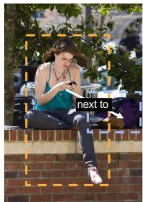
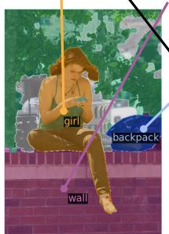
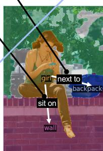
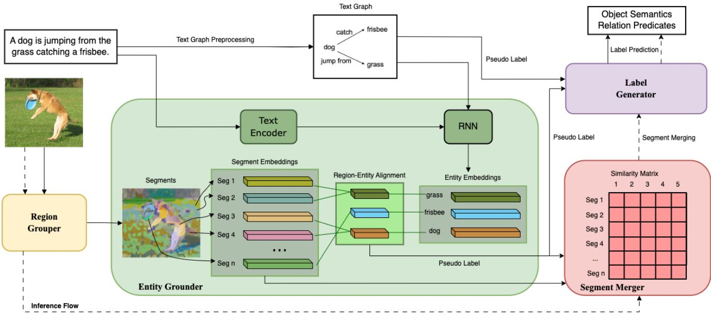
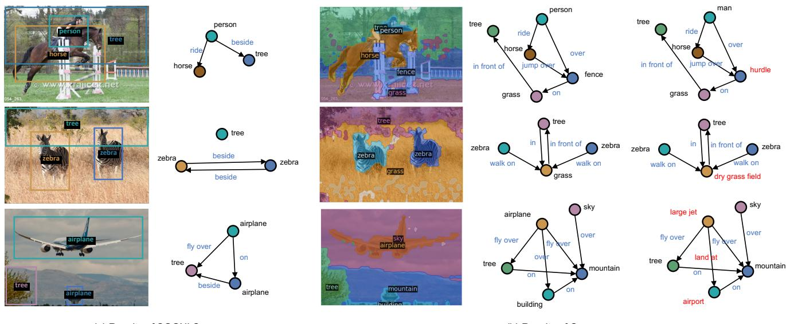
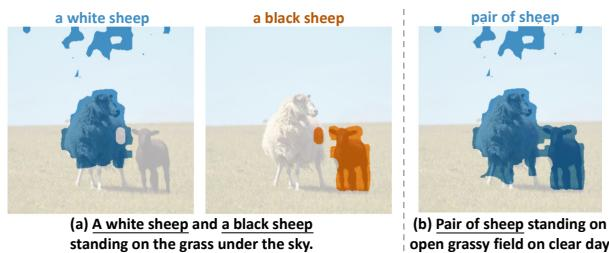

# TextPSG: Panoptic Scene Graph Generation from Textual Descriptions

Chengyang Zhao 1 Yikang Shen 2 Zhenfang Chen 2 Mingyu Ding 3 Chuang Gan 2,4 1Peking University 2MIT-IBM Watson AI Lab 3UC Berkley 4UMass Amherst

## Abstract

Panoptic Scene Graph has recently been proposed for comprehensive scene understanding. However, previous works adopt a fully-supervised learning manner, requiring large amounts ofpixel-wise densely-annotated data, which is always tedious and expensive to obtain. To address this limitation, we study a newproblem ofPanoptic Scene Graph Generation from Purely Textual Descriptions (Caption-to-PSG). The key idea is to leverage the large collection offree image-caption data on the Web alone to generate panoptic scene graphs. The problem is very challenging for three constraints: 1) no location priors; 2) no explicit links between visual regions and textual entities; and 3) no predefined concept sets. To tackle this problem, we propose a new framework TextPSG consisting offour modules, i.e., a region grouper, an entity grounder, a segment merger, and a label generator, with several novel techniques. The region grouper first groups image pixels into different segments and the entity grounder then aligns visual segments with language entities based on the textual description of the segment being referred to. The grounding results can thus serve as pseudo labels enabling the segment merger to learn the segment similarity as well as guiding the label generator to learn object semantics and relation predicates, resulting in a fine-grained structured scene understanding. Ourframework is effective, significantly outperforming the baselines and achieving strong out-of-distribution robustness. We perform comprehensive ablation studies to corroborate the effectiveness of our design choices and provide an in-depth analysis to highlightfuture directions. Our code, data, and results are available on our project page: https://vis-www.cs.umass.edu/TextPSG.

## 1. Introduction

A scene graph is a directed-graph-based abstract representation of the objects and their relations within a scene. It has been widely utilized to develop a structured scene understanding of object semantics, locations, and relations, which facilitates a variety of downstream applications, such as image generation [14, 8], visual reasoning [42, 1, 39], and robotics [2, 10].

  
(a)  
“A girl is sitting on a wall next to a backpack.”  
previous bbox-based

  
(b)

  
(c)  
Figure 1. Problem Overview. Different from the traditional bbox-based form of the scene graph as shown in (a), Caption-to-PSG aims to generate the mask-based panoptic scene graph. In Caption-to-PSG, the model has no access to any location priors, explicit region-entity links, or pre-defined concept sets. Consequently, the model is required to learn partitioning and grounding as illustrated in (b), as well as object semantics and relation predicates as illustrated in (c), all purely from textual descriptions.

Typically, in a scene graph, each node denotes an object in the scene located by a bounding box (bbox) with a semantic label, and each directed edge denotes the relation between a pair of objects with a predicate label. Nonetheless, a recent work [49] points out that such a bbox-based form of scene graph is not ideal enough. Firstly, compared with pixel-wise segmentation masks, bboxes are less fine-grained and may contain some noisy pixels belonging to other objects, limiting the applications for some downstream tasks. For example, as shown in Fig. 1 (a), about half of the pixels in the yellow bbox for girl belong to wall. Secondly, it is challenging for bboxes to cover the entire scene without ambiguities caused by overlaps, which prevents a scene graph from including every object in the scene for a complete description. To this end, the work [49] proposes the concept of Panoptic Scene Graph (PSG), in which each object is grounded by a panoptic segmentation mask, to reach a comprehensive structured scene representation.

However, all existing works [49, 45] approach PSG generation through a fully-supervised manner, i.e., learning to perform panoptic segmentation and relation prediction from manually-annotated datasets with explicit supervision for both segmentation and relation prediction. Unfortunately, it is extremely labor-intensive to build such datasets, making it difficult to scale up to cover more complex scenes, object semantics, and relation predicates, thus significantly limiting the generalizability and the application of these methods to the real world. For instance, the current PSG dataset [49] only covers 133 object semantics and 56 relation predicates.

To relieve the reliance on densely-annotated data, weakly-supervised methods [52, 58, 22] for scene graph generation are promising. These methods could induce scene graphs from image-caption pairs, which can be easily harvested from the Web for free. Even so, they still rely heavily on two strong preconditions, i.e., a powerful region proposal network (e.g., [35]) and a pre-defined set of object semantics and relation predicates. Although these preconditions facilitate the learning process of the methods, they also limit the generalizability for locating novel objects (unforeseen objects for the region proposal network) and constrain the understanding into the limited concept set.

Inspired by previous weakly-supervised methods, we introduce a new problem, Panoptic Scene Graph Generation from Purely Textual Descriptions (Caption-to-PSG), to explore a holistic structured scene understanding without labor-intensive data annotation. Considering the limitation of the preconditions mentioned, we set three constraints to Caption-to-PSG to reach a more comprehensive and generalizable understanding, which results in a very challenging problem: a) only image-caption pairs are provided during training, without any location priors in either region proposals or location supervision; b) the explicit links between regions in images and entities in captions are missing; c) no concept sets are pre-defined, i.e., neither object semantics nor relation predicates are known beforehand.

Given these three constraints, we argue that there are two key challenges for the model to solve the problem. Firstly, the model should learn to ground entities in language onto the visual scene without explicit location supervision, i.e., the ability to perform partitioning and grounding, as shown in Fig. 1 (b), should be developed purely from textual descriptions. Secondly, during training, the model should also learn the object semantics and relation predicates from textual descriptions, as shown in Fig. 1 (c), without pre-defined fixed object and relation vocabularies. By solving these challenges, the model could associate visual scene patterns with textual descriptions, gradually acquire common sense among them, and finally reach a more comprehensive and generalizable understanding, including novel object location, extensive semantics recognition, and complex relation analysis, which is more suitable to the real world.

With these considerations, we propose a novel framework, TextPSG, as the first step towards this challenging problem. TextPSG consists of a series of modules to cooperate with each other, i.e., a region grouper, an entity grounder, a segment merger, and a label generator. The region grouper learns to merge image regions into several segments in a hierarchical way based on object semantics, similar to [48]. The entity grounder employs a fine-grained contrastive learning strategy [51] to bridge the textual description and the visual content, grounding entities in the caption onto the image segments. With the entity-grounding results as pseudo labels, the segment merger learns similarity matrices to merge small image segments during inference, while the label generator learns the prediction of object semantics and relation predicates. Specifically, in the segment merger, we propose to leverage the grounding as explicit supervision for merging, compared with [48] which learns merging in a fully implicit manner, to improve the ability of location. In the label generator, different from all previous pipelines for scene graph generation, we reformulate the label prediction as an auto-regressive generation problem rather than a classification problem, and employ a pre-trained language model [21] as the decoder to leverage the pre-learned common sense. We further design a novel prompt-embedding-based technique (PET) to better incorporate common sense from the language model. Our experiments show that TextPSG significantly outperforms the baselines and achieves strong out-of-distribution (OOD) robustness. Comprehensive ablation studies corroborate the effectiveness of our design choices. As a side product, the proposed grounder and merger modules also have been observed to enhance text-supervised semantic segmentation.

In spite of the promising performance of TextPSG, certain challenges persist. We delve into an in-depth analysis of the failure cases, provide a model diagnosis, and discuss potential future directions for enhancing our framework.

To sum up, our contributions are as follows:

• We introduce a new problem, Panoptic Scene Graph Generationfrom Purely Textual Descriptions (Caption-to-PSG), to alleviate the burden of human annotation for PSG by learning purely from the weak supervision of captions.

• We propose a new modularized framework, TextPSG, with several novel techniques, which significantly outperforms the baselines and achieves strong OOD robustness. We demonstrate that the proposed modules in TextPSG can also facilitate text-supervised semantic segmentation.

• We perform an in-depth failure case analysis with a model diagnosis, and further highlight future directions.

## 2. Related Work

Bbox-based Scene Graph Generation. Bbox-based scene graph generation aims to create a structured representation of object semantics, locations, and relations in the scene, where each object is identified by a bbox. Most of existing works [50, 47, 41, 12, 24] follow a fullysupervised approach to learn the generation from denselyannotated datasets [18, 13], which requires significant human labors. To reduce the labeling effort, some weaklysupervised methods have been proposed [32, 55, 57, 40]. Recent works [52, 58, 22] further explore learning scene graph generation from image-caption pairs. However, they all rely on off-the-shelf region proposal networks for the location of objects in the scene, which are typically pretrained on pre-defined fixed sets of object semantics, limiting their generalizability to locating unforeseen objects. To reach a more granular and accurate grounding, [17] proposes to ground each object by segmentation. A recent work [49] further introduces the concept of PSG, where each object is identified by a panoptic segmentation mask, as a more comprehensive scene representation.

Text-supervised Semantic Segmentation (TSSS). TSSS [48, 20, 26, 9, 27, 59] aims to learn image pixel semantic labeling from image-caption pairs without finegrained pixel-wise annotations. Similar to TSSS, our proposed Caption-to-PSG aims to learn to connect visual regions and textual entities from only image-caption pairs and has the potential to leverage the large collection of free data on the Web. However, different from TSSS, Captionto-PSG further requires the model to learn the relations among different visual regions, resulting in a higher-order structured understanding of visual scenes. In addition to unknown object semantics, Caption-to-PSG does not assume any pre-defined relation predicate concepts.

Visual Grounding. Our work is also related to visual grounding [16, 56, 29, 11, 6, 33], which grounds entities in language onto objects in images. Early works [54, 53, 7] on visual grounding typically detect object proposals [35, 43] from images first and then match them with language descriptions by putting features of both modalities into the same feature space, which are in a fully-supervised learning manner. There are also some weakly-supervised grounding methods [15, 36, 5] which relieve the need for dense regional annotations by multiple instance learning [15] or learning to reconstruct [36]. Different from them, Captionto-PSG is more challenging since it requires grounding finegrained object relations between entities without region proposal networks for a pre-defined object vocabulary.

## 3. Problem Formulation

Panoptic Scene Graph Generation from Purely Textual Descriptions (Caption-to-PSG). A PSG $\mathcal { G } = ( \nu , \mathcal { E } )$ is a directed graph representation of the objects and the relations among them in a scene image $I \in \dot { \mathbb { R } ^ { H \times W \times 3 } }$ . Each node $v _ { i } ~ \in ~ \mathcal { V }$ denotes an object in I located by a panoptic segmentation mask $m _ { i } \in \mathsf { \bar { \{ 0 , 1 \} } } ^ { H \times W }$ with an object semantic label $o _ { i } \in \mathcal { C } _ { o } .$ , and each directed edge $e _ { i j } \in \mathcal { E }$ denotes a pair of subject $o _ { i }$ and object $o _ { j }$ with a relation predicate label $r _ { i j } \in \mathcal { C } _ { r }$ , where $\scriptstyle { \mathcal { C } } _ { o }$ and $\mathcal { C } _ { r }$ are the defined concept sets of object semantics and relation predicates. Note that for a PSG, it is constrained that all segmentation masks could not overlap, i.e. $, \sum _ { i = 1 } ^ { | \mathcal { V } | } m _ { i } \leq \mathbf { 1 } ^ { H \times W }$

Given a large collection of paired scene images and textual descriptions $\begin{array} { r } { { \cal { S } } = \{ ( I _ { i } , T _ { i } ) \} _ { \mathrm { { } } i } } \end{array}$ , Caption-to-PSG aims to learn PSG generation from purely text descriptions for a holistic structured scene understanding, $i . e . .$ , during training, only S is provided as supervision, while during inference, with a scene observation $I ^ { \prime }$ as input, the model is required to generate a corresponding PSG $\mathcal { G } ^ { \prime }$

Three Constraints. Note that in Caption-to-PSG, three important constraints are set to reach a more comprehensive and generalizable scene understanding: a) no location priors: different from all previous scene graph generation methods, neither pre-trained region proposal networks nor location supervision are allowed; b) no explicit regionentity links: the links between regions in the image I and entities in the textual description $T$ are not provided; c) no pre-defined concept sets: the target concept sets defined for inference, $i . e .$ , object semantics $\scriptstyle { \mathcal { C } } _ { o }$ and relation predicates ${ \mathcal { C } } _ { r } ,$ are unknown during training.

## 4. Method

Overview. As illustrated in Fig. 2, our proposed framework for Caption-to-PSG, TextPSG, contains four modules to cooperate with each other: a region grouper, an entity grounder, a segment merger, and a label generator.

During training, TextPSG takes batched image-caption pairs as input. For each pair, the image is passed through the region grouper to be partitioned into several image segments, while the caption is first pre-processed to extract its linguistic structure as a text graph and then taken by the entity grounder to ground textual entities in the graph onto the image segments. With the grounding results as pseudo labels, the segment merger learns similarity matrices between small image segments for further merging during inference, while the label generator learns the prediction of object semantics and relation predicates.

During inference, for each input image, the image segments output from the region grouper are directly passed to the segment merger to be further merged according to the learned similarity matrices, and then fed to the label generator to predict the object semantic labels and the relation predicate labels.

## 4.1. Text Graph Preprocessing

Following previous methods [52, 58, 22] that leverage a rule-based language parser [46] based on [37] to preprocess textual descriptions, in TextPSG, we employ the same parser to extract linguistic structures from captions. Additionally, inspired by the success of open information extraction (OpenIE) [3] in natural language processing, we also employ an OpenIE system from Stanford CoreNLP [28] for extraction as a supplement. After merging, for each caption, we obtain its linguistic structure represented in a text graph, where each node denotes an entity, and each directed edge denotes the relation between an entity pair.

  
Figure 2. Framework Overview of TextPSG. The framework consists of four modules cooperating with each other: a region grouper to merge regions in the input image into several segments, an entity grounder to ground entities in the caption onto the image segments, a segment merger to learn similarity matrices to merge small image segments during inference, and a label generator to learn the prediction of object semantics and relation predicates. The solid arrows indicate the training flow, while the dash arrows indicate the inference flow. The arrows from the region grouper to the label generator indicating the segment feature and mask query are omitted.

## 4.2. Region Grouper

With a scene image as input, the region grouper aims to merge the regions with similar object semantics into several segments and extract corresponding high-level features.

Our region grouper follows the hierarchical design of GroupViT [48]. Given an input image, the grouper first splits the image into N non-overlapping patches as the initial image segments $\{ \mathbf { s } _ { i } ^ { 0 } \} _ { i = 1 } ^ { N }$ These segments are then passed through K grouping layers, where they are merged into larger, arbitrary-shaped segments progressively. Specifically, within each grouping layer $\mathbf { G r p } _ { k } \left( k = \right.$ $1 , 2 , \cdots , K )$ $H _ { k }$ grouping centers $\bar { \{ \mathbf { c } _ { i } ^ { k } \bar { \} } } _ { i = 1 } ^ { H _ { k } }$ could be learned. The grouping operation is performed through an attention mechanism between the centers and the segments, merging $H _ { k - 1 }$ input segments into $H _ { k }$ larger ones, i.e.,

$$
\{ \mathbf { s } _ { i } ^ { k } \} _ { i = 1 } ^ { H _ { k } } = \mathbf { G r p } _ { k } ( \{ \mathbf { c } _ { i } ^ { k } \} _ { i = 1 } ^ { H _ { k } } , \{ \mathbf { s } _ { i } ^ { k - 1 } \} _ { i = 1 } ^ { H _ { k - 1 } } ) .
$$

Note that $H _ { 0 } = N$ . After the hierarchical grouping, multiple groups of segments $\{ \mathbf { s } _ { i } ^ { k } \} _ { i = 1 } ^ { H _ { k } }$ at different grouping stages are obtained. More details about the design of $\{ \mathbf { G r p } _ { k } \} _ { k = 1 } ^ { K }$ can be found in the supplementary material.

## 4.3. Entity Grounder

Since the explicit region-entity links are not provided, bridging the textual description and the visual content automatically plays an important role in solving Caption-to-PSG. Inspired by FILIP [51], in TextPSG, we employ a similar fine-grained contrastive learning strategy to perform region-entity alignment.

For each grouping stage k, on image side, the grounder projects the segment group $\{ \mathbf { s } _ { i } ^ { k } \} _ { i = 1 } ^ { H _ { k } }$ into a new feature space $\mathcal { F }$ by a multi-layer perceptron (MLP) ProjI to obtain segment embeddings $\{ \mathbf { x } _ { i } ^ { k } \} _ { i = 1 } ^ { \bar { H } _ { k } }$ . On text side, the input caption is first tokenized into M tokens $\{ \mathbf { t } _ { i } \} _ { i = 1 } ^ { M }$ , which are then processed by a Transformer [44] TfmT to propagate information between each other. A recurrent neural network (RNN) Rnn further merges the tokens corresponding to the same entity, encoding tokens into their associated weights one by one and utilizing weighted sum to merge the token features into a singular entity feature. Finally, these entity features are projected to the same feature space F by a $\mathbf { M L P P r o j } ^ { T }$ to obtain entity embeddings $\{ \mathbf { y } _ { i } \} _ { i = 1 } ^ { E }$ , where E denotes the number of entities in the caption.

With the segment embeddings and the entity embeddings in the shared feature space ${ \mathcal { F } } _ { : }$ , we compute their token-wise similarities. Specifically, for the i-th segment, we compute its cosine similarities with all entities to obtain the tokenwise similarity from the i-th segment to the caption $p _ { i } ^ { k }$ via

$$
p _ { i } ^ { k } = \operatorname* { m a x } _ { 1 \leq j \leq E } \cos [ { \bf x } _ { i } ^ { k } , { \bf y } _ { j } ] ,
$$

where $\cos [ \cdot , \cdot ]$ denotes the cosine similarity operation. Note that different from the original FILIP [51], in the scenario of region-entity alignment, some regions in the scene may not be described in the caption, while some entities in the caption may not exist in the scene. To tackle this problem, we propose to set a filtering threshold $\theta ,$ where pairs with similarity lower than θ will be considered in different semantics and filtered out. The fine-grained similarity from the image to the caption $p ^ { k }$ can thus be computed via

$$
p ^ { k } = \frac { 1 } { \sum _ { i = 1 } ^ { H _ { k } } \mathbf { 1 } _ { p _ { i } ^ { k } > \theta } } \sum _ { i = 1 } ^ { H _ { k } } ( p _ { i } ^ { k } \cdot \mathbf { 1 } _ { p _ { i } ^ { k } > \theta } ) .
$$

Similarly, we can also compute the token-wise similarity from the $j \cdot$ -th entity to the image $q _ { j } ^ { k }$ via

$$
q _ { j } ^ { k } = \operatorname* { m a x } _ { 1 \leq i \leq H _ { k } } \cos [ { \bf x } _ { i } ^ { k } , { \bf y } _ { j } ] ,
$$

and the fine-grained similarity from the caption to the image $q ^ { k }$ via

$$
q ^ { k } = \frac { 1 } { \sum _ { j = 1 } ^ { E } \mathbf { 1 } _ { q _ { j } ^ { k } > \theta } } \sum _ { j = 1 } ^ { E } ( q _ { j } ^ { k } \cdot \mathbf { 1 } _ { q _ { j } ^ { k } > \theta } ) .
$$

Denoting the training batch with batch size $B$ as $\{ ( I _ { i } , T _ { i } ) \} _ { i = 1 } ^ { B }$ , the fine-grained similarity from the image $I _ { i }$ to the caption $T _ { j }$ as $p ^ { k , i  j }$ and from the caption $T _ { j }$ to the image $I _ { i }$ as $q ^ { k , \bar { j }  i }$ , the image-to-text fine-grained contrastive loss $\stackrel { \cdot } { \mathcal { L } } _ { f i n e } ^ { k , \dot { I }  T }$ and the text-to-image fine-grained contrastive loss $\dot { \mathcal { L } _ { f i n e } ^ { k , T  I } }$ can then be formulated as

$$
\mathcal { L } _ { f i n e } ^ { k , I  T } = - \frac { 1 } { B } \sum _ { i = 1 } ^ { B } \frac { \exp { ( p ^ { k , i  i } / \tau ) } } { \sum _ { j = 1 } ^ { B } \exp { ( p ^ { k , i  j } / \tau ) } } ,
$$

$$
\mathcal { L } _ { f i n e } ^ { k , T  I } = - \frac { 1 } { B } \sum _ { i = 1 } ^ { B } \frac { \exp { ( { q ^ { k , i  i } } / { \tau } ) } } { \sum _ { j = 1 } ^ { B } \exp { ( { q ^ { k , i  j } } / { \tau } ) } } ,
$$

where $\tau$ is a learnable temperature. The total fine-grained contrastive loss is

$$
\mathcal { L } _ { f i n e } ^ { k } = \frac { 1 } { 2 } ( \mathcal { L } _ { f i n e } ^ { k , I  T } + \mathcal { L } _ { f i n e } ^ { k , T  I } ) .
$$

By minimizing $\mathcal { L } _ { f i n e } ^ { k }$ at all grouping stages during training, our framework could reach a meaningful fine-grained alignment automatically, $i . e .$ , for the i-th segment $\mathbf { s } _ { i } ^ { k }$ , the $l _ { i } ^ { k } { - } \mathrm { t h }$ entity satisfying

$$
l _ { i } ^ { k } = \underset { 1 \leq j \leq E } { \arg \operatorname* { m a x } } \cos [ \mathbf { x } _ { i } ^ { k } , \mathbf { y } _ { j } ]
$$

tends to have a similar semantics with $\mathbf { s } _ { i } ^ { k }$ . We thus obtain $\{ l _ { i } ^ { k } \} _ { i = 1 } ^ { H _ { k } }$ as the grounding results for the image segments $\{ \mathbf { s } _ { i } ^ { k } \} _ { i = 1 } ^ { H _ { k } }$ . A further explanation of the automatic meaningful alignment can be found in the supplementary material.

## 4.4. Segment Merger

To improve the ability of location, we propose to leverage the entity-grounding results as explicit supervision to learn a group of similarity matrices between image segments for small segments merging during inference, compared with [48] that learns the merging fully implicitly.

For each grouping stage $k ,$ we compute the cosine similarity between each pair of image segments, which is then linearly re-scaled into $[ 0 , 1 ]$ to formulate a similarity matrix Sim $\mathbf { \bar { \mathbf { \rho } } } _ { \mathbf { 1 } _ { k } } \dot { \in } [ 0 , 1 ] ^ { H _ { k } \times H _ { k } }$ , where

$$
\mathbf { S i m } _ { k } [ i , j ] = \frac { 1 } { 2 } ( \cos [ \mathbf { x } _ { i } ^ { k } , \mathbf { x } _ { j } ^ { k } ] + 1 ) .
$$

We further leverage $\{ l _ { i } ^ { k } \} _ { i = 1 } ^ { H _ { k } }$ as pseudo labels to build a pseudo target matrix Sim $\mathbf { \widetilde { \mathbf { \mathbf { 1 } } } } _ { k } ^ { \widetilde { t a r } \widetilde { g e t } } \in \dot { \{ }  0 , 1 \} ^ { H _ { k } \times H _ { k } }$ , where

$$
\begin{array} { r } { \mathbf { S i m } _ { k } ^ { t a r g e t } [ i , j ] = \left\{ \begin{array} { l l } { 1 , \mathbf { i f } l _ { i } ^ { k } = l _ { j } ^ { k } \wedge \cos [ \mathbf { x } _ { i } ^ { k } , \mathbf { y } _ { l _ { i } ^ { k } } ] > \theta } \\ { \qquad \wedge \cos [ \mathbf { x } _ { j } ^ { k } , \mathbf { y } _ { l _ { j } ^ { k } } ] > \theta , } \\ { 0 , \mathbf { o t h e r w i s e } . } \end{array} \right. } \end{array}
$$

The similarity loss for the stage k is then formulated as

$$
\mathcal { L } _ { s i m } ^ { k } = \frac { 1 } { H _ { k } ^ { 2 } } \| \mathbf { S i m } _ { k } - \mathbf { S i m } _ { k } ^ { t a r g e t } \| _ { F } ^ { 2 } .
$$

## 4.5. Label Generator

In addressing the challenge of no pre-defined concept sets, the previous work [58] proposes to build a large vocabulary for learning during training and use WordNet [31] to correlate predictions within this vocabulary to the target concepts during inference. However, there are two limitations to the previous method. Firstly, compared with the extensive object semantics and relation predicates contained in textual descriptions, despite the large vocabulary established, it is inevitable that some classes will be overlooked. Secondly, leveraging WordNet to match vocabulary predictions to targets is not accurate and robust enough, for Word-Net may only reach a coarse matching with multiple target concepts. This imprecision is particularly pronounced for relation predicates relative to object semantics.

Given these limitations, we introduce a novel approach in TextPSG. Instead of approaching label prediction of objects and relations as a traditional classification problem, we reformulate it as an auto-regressive generation problem, which eliminates the necessity for pre-defined concept sets.

Compared with a vanilla RNN, we employ a pre-trained vision language model BLIP [21]to leverage the pre-learned common sense. BLIP can take an image as input and output a caption to describe the image. In TextPSG, we borrowed the pre-trained decoder module from BLIP to perform the generation of object and relation labels.

During training, the label generator takes the captionparsed text graph, the segment features from the region grouper, and the grounding results $\{ l _ { i } ^ { k } \} _ { i = 1 } ^ { H _ { k } }$ from the entity grounder as input. It filters out the segments with tokenwise similarity lower than the threshold θ, merges the segments mapped to the same entity, and queries the corresponding image masks from the region grouper. Then, $E _ { k }$ image masks $\{ \mathbf { m } _ { i } ^ { k } \} _ { i = 1 } ^ { E _ { k } }$ with their pseudo entity labels $\{ b _ { i } ^ { k } \} _ { i = 1 } ^ { E _ { k } }$ can be obtained, where each $b _ { i } ^ { k }$ is one entity in the text graph. $E _ { k } \le E$ because some textual entities may not exist in the image.

Prompt-embedding-based technique (PET). To better incorporate common sense from the vision language model, we further design a novel PET for label generation. For object prediction, the decoder takes the segment features and the image mask $\mathbf { m } _ { i } ^ { k }$ , using a prompt

## a photo of [ENT]

to guide the object generation, where the [ENT] token is expected to be the pseudo label $b _ { i } ^ { k }$ . For relation prediction, the decoder takes the segment features and an image mask pair $( \mathbf { m } _ { i } ^ { k } , \mathbf { m } _ { j } ^ { k } )$ as input, using a prompt

$$
\begin{array} { r } { \mathbf { a } \mathbf { p h o t o o f } \left[ \mathbf { S U B } \right] \mathbf { a n d } \left[ \mathbf { O B J } \right] } \\ { \mathbf { w h a t i s t h e i r r e l a t i o n } \left[ \mathbf { R E L } \right] } \end{array}
$$

to guide the relation generation, where the [SUB] and [OBJ] tokens are embedded by the pseudo labels $b _ { i } ^ { \bar { k } }$ and $b _ { j } ^ { k }$ , and the [REL] token is expected to be the relation predicate between $( b _ { i } ^ { k } , b _ { j } ^ { k } )$ with $b _ { i } ^ { k }$ as subject and $b _ { j } ^ { k }$ as object in the text graph. To enhance relation generation, we further design three learnable positional embeddings $\mathbf { f } _ { s u b } , \mathbf { f } _ { o b j }$ $\mathbf { f } _ { r e g i o n }$ for indicating the different regions in the segment features. Two cross-entropy losses $\bar { \mathcal { L } } _ { e n t } ^ { k } , \mathcal { L } _ { r e l } ^ { k }$ are used to supervise the generation of the [ENT] and [REL] tokens, maximizing the likelihood of the target label strings, respectively. More details are in the supplementary material.

## 4.6. Inference

During inference, the target concepts of object semantics $\scriptstyle { \mathcal { C } } _ { o }$ and relation predicates $\mathcal { C } _ { r }$ are known. With an image I as input and an inference stage index $k _ { i n f }$ specified, the region grouper first partitions $I$ into several candidate segments $\{ \mathbf { s } _ { i } ^ { k _ { i n f } } \} _ { i = 1 } ^ { H _ { k _ { i n f } } }$ , which are then passed through the segment merger to obtain the similarity matrix $\mathbf { S i m } _ { k _ { i n f } }$ We formulate the segment merging as a spectral clustering problem and perform the graph cut [38] on $\mathbf { S i m } _ { l _ { i n f } }$ for clustering. To improve the accuracy, we employ a matrix recovery method [25] to reduce the noise in $\mathbf { S i m } _ { l _ { i n f } }$ . In this step, the segments with similar semantics tend to be merged into the same cluster. For each cluster and each pair of clusters, the label generator use a similar PET to generate the object semantics and the relation predicates. For every label within sets $\scriptstyle { \mathcal { C } } _ { o }$ and $\mathcal { C } _ { r }$ , the label generator computes its generation probability. Subsequently, these probabilities are used to rank the concepts, selecting the most probable as the final prediction. Note that between object and relation prediction, to convert semantic segmentation into instance segmentation, we identify each connected component in the semantic segmentation to be an instance, for simplicity. More details about inference are in the supplementary material.

## 5. Experiments and Results

Datasets. We train our model with the COCO Caption dataset [4], which involves 123,287 images with each labeled by 5 independent human-generated captions. Following the 2017 split, we use 118,287 images with their captions for training. We evaluate models with the Panoptic Scene Graph dataset [49] for its pixel-wise labeling as well as its high-quality object and relation annotation. We further merge the object semantics with ambiguities. After merging, 127 object semantics and 56 relation predicates are finally obtained for evaluation. More details about the datasets can be found in the supplementary material.

Evaluation Protocol and Metrics. Following all previous works in scene graph generation, we evaluate the quality of a generated scene graph by viewing it as a set of subjectpredicate-object triplets. We evaluate models on two tasks: Visual Phrase Detection (PhrDet) and Scene Graph Detection (SGDet). PhrDet aims to detect the whole phrase of subject-predicate-object with a union location of subject and object. It is considered to be correct if the phrase labels are all correct and the union location matches the ground truth with the intersection over union (IoU) greater than 0.5. SGDet further requires a more accurate location, $i . e .$ , the location of subject and object should match the ground truth with IoU greater than 0.5 respectively.

We use No-Graph-Constraint-X Recall@K (NXR@K, %) to measure the ability of generation. Recall@K computes the recall between the top-k generated triplets with the ground truth. No-Graph-Constraint-X indicates that at most X predicate labels could be predicted for each subjectobject pair. Since some predicates defined in [49] are not exclusive, such as on and sitting on, NXR@K could be a more reasonable metric compared with Recall@K.

Baselines. We consider several baselines for Caption-to-PSG in the following experiments. Firstly, we design four baselines that strictly follow the constraints of Caption-to-PSG, where objects are located by bbox proposals generated by selective search [43]:

• Random is the most naive baseline where all object semantics and relation predicates are randomly predicted.

• Prior augments Random by performing label prediction based on the statistical priors in the training set.

• MIL performs the alignment between proposals and textual entities by multiple instance learning [30]. Similar to [58], it formulates the object label prediction as a classification problem in a large pre-built vocabulary, with

<table><tr><td colspan="3">Method</td><td rowspan="2">Mode</td><td colspan="4">PhrDet</td><td colspan="4">SGDet</td></tr><tr><td>Model</td><td>Proposal</td><td>Target</td><td>N3R50</td><td>N3R100</td><td>N5R50</td><td>N5R100</td><td>N3R50</td><td>N3R100</td><td>N5R50</td><td>N5R100</td></tr><tr><td>SGGNLS-c</td><td>Detector</td><td>V</td><td>bbox</td><td>9.69</td><td>11.45</td><td>10.24</td><td>12.22</td><td>6.76</td><td>7.81</td><td>7.2</td><td>8.65</td></tr><tr><td>Random</td><td rowspan="4">Selective</td><td>x x</td><td>bbox</td><td>0.02</td><td>0.03</td><td>0.02</td><td>0.03</td><td>0.01</td><td>0.02</td><td>0.02</td><td>0.03</td></tr><tr><td>Prior</td><td></td><td>bbox</td><td>0.04</td><td>0.07</td><td>0.05</td><td>0.07</td><td>0.03</td><td>0.06</td><td>0.05</td><td>0.07</td></tr><tr><td>MIL</td><td>Search</td><td>bbox</td><td>1.97</td><td>2.18</td><td>2.04</td><td>2.61</td><td>1.2</td><td>1.35</td><td>1.56</td><td>1.97</td></tr><tr><td>SGCLIP</td><td></td><td>bbox</td><td>3.02</td><td>3.45</td><td>3.38</td><td>3.71</td><td>2.13</td><td>2.3</td><td>2.39</td><td>2.7</td></tr><tr><td>SGGNLS-0</td><td>Detector</td><td>x</td><td>bbox</td><td>6.2</td><td>6.79</td><td>6.92</td><td>7.93</td><td>3.96</td><td>4.21</td><td>4.53</td><td>5.02</td></tr><tr><td>Ours</td><td>一</td><td>x</td><td>mask</td><td>8.28</td><td>9.16</td><td>9.06</td><td>10.51</td><td>3.32</td><td>3.63</td><td>3.71</td><td>4.18</td></tr><tr><td>Ours</td><td></td><td>x</td><td>bbox</td><td>11.37</td><td>12.74</td><td>12.24</td><td>14.37</td><td>4.29</td><td>4.77</td><td>4.82</td><td>5.48</td></tr></table>

Table 1. Quantitative Comparison of Different Methods on Caption-to-PSG. ‘Proposal’ indicates how the method obtains bbox proposals. ‘Target’ indicates whether the concept sets for inference are known during training. ‘Mode’ indicates the mode used for evaluation.

WordNet [31] employed during inference. The relation labels are predicted with statistical priors, similar to Prior.

• SGCLIP employs the pre-trained CLIP [34] to predict both object semantic labels and relation predicate labels. Secondly, to further benchmark the performance of our framework, we set two additional baselines based on [58] by gradually removing the constraints of Caption-to-PSG:

• SGGNLS-o [58] extracts proposals with a detector [35] pre-trained on OpenImage [19]. It formulates the object and relation label prediction as a classification problem within a large pre-built vocabulary, with WordNet [31] employed during inference.

• SGGNLS-c [58] uses the same proposals as SGGNLS-o. In SGGNLS-c, the target concept sets for inference are known during training. It formulates the label prediction as a classification problem in these target concept sets.

More design details are in the supplementary material. Implementation Details. Following GroupViT [48], we set $K = 2 , H _ { 1 } = 6 4 .$ , and $H _ { 2 } = 8$ for our region grouper. We leverage general pre-trained models for weight initialization. We employ the pre-trained GroupViT for the region grouper as well as TfmT in the entity grounder, and the pre-trained BLIP [21] decoder for the label generator. During training, TfmT and the label generator are frozen. During inference, we set $k _ { i n f } = 1$ . More implementation details can be found in the supplementary material.

## 5.1. Main Results on Caption-to-PSG

Quantitative Results. Our quantitative results on Captionto-PSG are shown in Tab. 1. To make a fair comparison with bbox-based scene graphs generated by baselines, we evaluate our generated PSGs in both mask and bbox mode. For the latter, all masks in both prediction and ground truth are converted into bboxes (i.e., the mask area’s enclosing rectangle) for evaluation, resulting in an easier setting than the former. The results show that our framework (Ours) significantly outperforms all the baselines under the same constraints on both PhrDet (14.37 vs. 3.71 N5R100) and SGDet (5.48 vs. 2.7 N5R100). Our method also shows better results compared with SGGNLS-o on all metrics and all tasks (on PhrDet, 14.37 vs. 7.93 N5R100; on SGDet, 5.48 vs. 5.02 N5R100) although SGGNLS-o utilizes location priors by leveraging a pre-trained detector. The results demonstrate that our framework is more effective for learning a good panoptic structured scene understanding.

Qualitative Results. We provide typical qualitative results in Fig. 3 to further show our framework’s effectiveness. Compared with SGGNLS-o, our framework has the following advantages. First, our framework is able to provide fine-grained semantic labels to each pixel in the image to reach a panoptic understanding, while SGGNLS-o can only provide sparse bboxes produced by the pre-trained detector. Note that categories with irregular shapes (e.g., trees in Fig. 3) are hard to be labeled precisely by bboxes. Second, compared with SGGNLS-o, our framework can generate more comprehensive object semantics and relation predicates, such as “dry grass field” and “land at” in Fig. 3, showing the open-vocabulary potential of our framework. More qualitative results are in the supplementary material.

## 5.2. OOD Robustness Analysis

We further analyze another key advantage of our framework, i.e., the robustness in OOD cases. Since SGGNLS-c and SGGNLS-o both rely on a pre-trained detector to locate objects, their performance highly depends on whether object semantics in the scene are covered by the detector.

Based on the object semantics [19] covered by the detector, we split the ground truth triplets into an in-distribution (ID) set and an OOD set. For triplets within the ID set, both the subject and object semantics are covered, while for triplets in the OOD set, at least one of the semantics is not covered. As shown in Tab. 2, both SGGNLS-c and SGGNLS-o suffer a significant performance drop from the ID set to the OOD set. On the OOD set, the triplets can hardly be retrieved. However, our framework, with the ability of location learned from purely text descriptions, can reach similar performance on both sets, which demonstrates the OOD robustness of our framework for PSG generation.

(b) Results of Ours  
(a) Results of SGGNLS-o  
  
Figure 3. Qualitative Comparison between SGGNLS-o (a) and Ours (b). For each method, the results of object location are shown on the left, while the results of scene graph generation are shown on the right. For Ours, scene graphs predicted within the given concept sets are provided in the middle column, and scene graphs directly predicted through the auto-regressive generation (i.e., an open-vocabulary manner) in the label generator are additionally provided in the right column.

<table><tr><td rowspan="2">Set</td><td rowspan="2">Model</td><td rowspan="2">Target</td><td rowspan="2">Mode</td><td colspan="2">PhrDet</td><td colspan="2">SGDet</td></tr><tr><td>N3R100</td><td>N5R100</td><td>N3R100 N5R100</td><td></td></tr><tr><td rowspan="3">ID</td><td>SGGNLS-c SGGNLS-0</td><td>V x</td><td>bbox bbox</td><td>16.76 11.55</td><td>18.48 13.64</td><td>10.45 7.13</td><td>11.86 8.47</td></tr><tr><td>Ours</td><td>x</td><td>mask</td><td>9.27</td><td>10.45</td><td>3.28</td><td>3.76</td></tr><tr><td>Ours SGGNLS-c</td><td>x V</td><td>bbox bbox</td><td>13.35 0</td><td>14.82 0</td><td>4.63</td><td>5.36</td></tr><tr><td rowspan="2">OOD</td><td>SGGNLS-0</td><td>x</td><td>bbox</td><td>0.05</td><td>0.06</td><td>0 0</td><td>0 0</td></tr><tr><td>Ours Ours</td><td>x x</td><td>mask bbox</td><td>8.47 10.18</td><td>9.76 11.69</td><td>4.07 5.23</td><td>4.51 5.72</td></tr></table>

Table 2. Analysis on OOD Robustness. ‘Set’ indicates the triplet set used for evaluation.

<table><tr><td rowspan="2">Stage</td><td rowspan="2">#Seg</td><td rowspan="2">Cut</td><td colspan="2">PhrDet</td><td colspan="2">SGDet</td></tr><tr><td>N3R100</td><td>N5R100</td><td>N3R100</td><td>N5R100</td></tr><tr><td>1</td><td>64</td><td>x</td><td>10.73</td><td>11.39</td><td>3.18</td><td>3.51</td></tr><tr><td>1</td><td>64</td><td>V</td><td>12.74</td><td>14.37</td><td>4.77</td><td>5.48</td></tr><tr><td>2</td><td>8</td><td>x</td><td>9.24</td><td>11.03</td><td>3.53</td><td>4.35</td></tr><tr><td>2</td><td>8</td><td>V</td><td>6.78</td><td>8.45</td><td>2.46</td><td>3.21</td></tr></table>

Table 3. Ablation Study on the Segment Merger. ‘Stage’ indicates the grouping stage where image segments used for merging are from. ‘#Seg’ indicates the number of image segments. ‘Cut’ indicates whether the graph-cut-based segment merging is applied.

## 5.3. Ablation Studies

We conduct additional ablation studies to evaluate the effectiveness of our design choices. For all following experiments, we report N3R100 and N5R100 evaluated in bbox mode for simplicity. We answer the following questions. Q1: Does the explicit learning of merging in the segment merger helps provide better image segments? Q2: Is the generation-based label prediction better than the classification-based prediction? Q3: Does the pre-learned common sense from the pre-trained BLIP [21] helps with the label prediction? Q4: Does the PET helps incorporate the pre-learned common sense for label prediction?

<table><tr><td rowspan="2">Label Prediction</td><td rowspan="2">Model</td><td colspan="2">PhrDet</td><td colspan="2">SGDet</td></tr><tr><td>N3R100</td><td>N5R100</td><td>N3R100</td><td>N5R100</td></tr><tr><td>Cls + WordNet</td><td>一</td><td>8.82</td><td>9.36</td><td>2.36</td><td>2.72</td></tr><tr><td>Gen</td><td>RNN</td><td>9.12</td><td>10.44</td><td>2.65</td><td>3.07</td></tr><tr><td>Gen w/o PET</td><td>BLIP [21]</td><td>2.33</td><td>2.58</td><td>0.45</td><td>0.6</td></tr><tr><td>Gen w/ PET</td><td>BLIP [21]</td><td>12.64</td><td>14.28</td><td>4.77</td><td>5.49</td></tr></table>

Table 4. Ablation Study on the Label Generator. ‘Cls’ indicates classification. ‘Gen’ indicates generation.

In Tab. 3, we compare different strategies of image segment merging during inference. Row 1&2 denote that the $H _ { 1 } = 6 4$ segments from the first grouping stage are used for further merging, while row 3&4 denote that the $H _ { 2 } = 8$ segments from the second stage are used. The results show that applying the graph cut to merge the segments from the first stage could reach the best performance, corroborating that compared with the fully implicit learning of merging, the explicit learning of merging can provide better segments (row 2 vs 3, answering Q1).

In Tab. 4, we compare different designs of the label generator. Keeping the other modules the same, we change the label generator (row 4) into three different designs, i.e., classification within a large pre-built vocabulary followed by WordNet [31] for target matching (row 1), generation with a vanilla RNN (row 2), generation with the BLIP decoder but without the PET (row 3). The results show that with the constraint of no pre-defined concept sets, compared with formulating the label prediction into a classification problem, formulating it into a generation problem is a better choice (row 1 vs 2&4, answering Q2). By employing the pre-trained BLIP for leveraging the pre-learned common sense, the prediction could be further boosted (row 2 vs 4, answering Q3). And the PET is very important for incorporating the common sense from the pre-trained model (row 3 vs 4, answering Q4).

More ablation studies for the design evaluation can be found in the supplementary material.

## 5.4. Application on TSSS

As a side product, we observe that our entity grounder and segment merger can also enhance TSSS. Based on the original GroupViT [48], we replace the multi-

<table><tr><td>Method</td><td>mIoU</td></tr><tr><td>GroupViT [48]</td><td>24.28</td></tr><tr><td>GroupViT† [48]</td><td>24.72</td></tr><tr><td>Ours</td><td>26.87</td></tr></table>

Table 5. Results on TSSS. † indicates finetuned.

label contrastive loss with our entity grounder and segment merger. Then we finetune the model on the COCO Caption dataset [4]. As shown in Tab. 5, compared with GroupViT directly finetuned on [4], the explicit learning of merging in our modules can boost the model with an absolute 2.15% improvement of mean Intersection over Union (mIoU, %) on COCO [23], which demonstrates the effectiveness of our proposed modules on better object location.

## 5.5. Discussion

Failure Case Analysis. Despite the impressive performance of TextPSG, there are still challenges to address. Upon analyzing the failure cases for PSG generation, we identify three specific limitations of TextPSG that contribute to these failures. a) The strategy we use to convert semantic segmentation into instance segmentation is not entirely effective. For simplicity, in TextPSG, we identify each connected component in the semantic segmentation to be an individual object instance. However, this strategy may fail when instances overlap or are occluded, resulting in either an underestimation or an overestimation of instances. b) Our framework faces difficulty in locating small objects in the scene due to limitations in resolution and the grouping strategy for location. c) The relation prediction of our framework requires enhancement, as it is not adequately conditioned on the image. While the label generator uses both image features and predicted object semantics to determine the relation, it sometimes seems to lean heavily on the object semantics, potentially neglecting the actual image content. Examples of failure cases for each of these limitations can be found in the supplementary material.

Model Diagnosis. For a clearer understanding of the efficacy of our framework, we conduct a model diagnosis to answer the following question: why does our framework only achieve semantic segmentation through learning, rather than panoptic segmentation (and thus requires further segmentation conversion to obtain instance segmentation)?

  
Figure 4. Region-Entity Alignment Results of Captions in Different Granularity. Two captions in different granularity are used to execute region-entity alignment with the same image, with (a) one describing the two sheep individually while (b) the other merges them in plural form.

In Fig. 4, we use two captions in different granularity to execute region-entity alignment. It shows that our framework has the capability to assign distinct masks to individual instances. However, the nature of caption data, where captions often merge objects of the same semantics in plural form, limits our framework from differentiating instances. It is the weak supervision provided by the caption data that constrains our framework.

More diagnoses are in the supplementary material.

Future Directions. In response to the limitations discussed, we outline several potential directions for enhancing our framework: a) a refined and sophisticated strategy for segmentation conversion; b) increasing the input resolution, though this may introduce greater computational demands; c) a more suitable image-conditioned reasoning mechanism for relation prediction; d) a superior image-caption-pair dataset with more detailed granularity in captions to achieve panoptic segmentation through learning.

## 6. Conclusion

We take the first step towards the novel problem Captionto-PSG, aiming to learn PSG generation purely from language. To tackle this challenging problem, we propose a new modularized framework TextPSG with several novel techniques, which significantly outperforms the baselines and achieves strong OOD robustness. This paves the path to a more comprehensive and generalizable panoptic structured scene understanding. There are still bottlenecks in TextPSG to be explored in future work, including a) a more sophisticated strategy for segmentation conversion; b) a more suitable image-conditioned reasoning mechanism for relation prediction; c) a superior image-captionpair dataset for panoptic segmentation through learning.

Acknowledgements. This work was supported by the DSO grant DSOCO21072, IBM, and gift funding from MERL, Cisco, and Amazon. We would also like to thank the computation support from AiMOS, a server cluster for the IBM Research AI Hardware Center.

## References

[1] Somak Aditya, Yezhou Yang, Chitta Baral, Yiannis Aloimonos, and Cornelia Fermuller. Image understanding using¨ vision and reasoning through scene description graph. Computer Vision and Image Understanding, 2017. 1

[2] S. Amiri, Kishan Chandan, and Shiqi Zhang. Reasoning with scene graphs for robot planning under partial observability. IEEE Robotics and Automation Letters, 7:5560–5567, 2022. 1

[3] Gabor Angeli, Melvin Johnson, and Christopher D. Manning. Leveraging linguistic structure for open domain information extraction. In Annual Meeting of the Association for Computational Linguistics, 2015. 4

[4] Xinlei Chen, Hao Fang, Tsung-Yi Lin, Ramakrishna Vedantam, Saurabh Gupta, Piotr Dollar, and C. Lawrence Zitnick. Microsoft COCO captions: Data collection and evaluation server. arXiv preprint arXiv:1504.00325, 2015. 6, 9

[5] Zhenfang Chen, Lin Ma, Wenhan Luo, and Kwan-Yee K Wong. Weakly-supervised spatio-temporally grounding natural sentence in video. In Proc. 57th Annual Meeting of the Associationfor Computational Linguistics, 2019. 3

[6] Zhenfang Chen, Jiayuan Mao, Jiajun Wu, Kwan-Yee K Wong, Joshua B. Tenenbaum, and Chuang Gan. Grounding physical concepts of objects and events through dynamic visual reasoning. In International Conference on Learning Representations, 2021. 3

[7] Zhenfang Chen, Peng Wang, Lin Ma, Kwan-Yee K Wong, and Qi Wu. Cops-ref: A new dataset and task on compositional referring expression comprehension. In Proceedings of the IEEE/CVF Conference on Computer Vision and Pattern Recognition, pages 10086–10095, 2020. 3

[8] Helisa Dhamo, Azade Farshad, Iro Laina, Nassir Navab, Gregory D. Hager, Federico Tombari, and Christian Rupprecht. Semantic image manipulation using scene graphs. In CVPR, 2020. 1

[9] Xiaoyi Dong, Yinglin Zheng, Jianmin Bao, Ting Zhang, Dongdong Chen, Hao Yang, Ming Zeng, Weiming Zhang, Lu Yuan, Dong Chen, et al. Maskclip: Masked selfdistillation advances contrastive language-image pretraining. arXiv preprint arXiv:2208.12262, 2022. 3

[10] Samir Yitzhak Gadre, Kiana Ehsani, Shuran Song, and Roozbeh Mottaghi. Continuous scene representations for embodied ai. 2022 IEEE/CVF Conference on Computer Vision and Pattern Recognition (CVPR), pages 14829–14839, 2022. 1

[11] Chuang Gan, Yandong Li, Haoxiang Li, Chen Sun, and Boqing Gong. Vqs: Linking segmentations to questions and answers for supervised attention in vqa and question-focused semantic segmentation. In Proceedings of the IEEE international conference on computer vision, pages 1811–1820, 2017. 3

[12] Jiuxiang Gu, Handong Zhao, Zhe Lin, Sheng Li, Jianfei Cai, and Mingyang Ling. Scene graph generation with external knowledge and image reconstruction. In Proceedings of the IEEE/CVF Conference on Computer Vision and Pattern Recognition (CVPR), June 2019. 3

[13] Drew A Hudson and Christopher D Manning. Gqa: A new dataset for real-world visual reasoning and compositional question answering. In Proceedings of the IEEE/CVF conference on computer vision and pattern recognition, pages 6700–6709, 2019. 3

[14] Justin Johnson, Agrim Gupta, and Li Fei-Fei. Image generation from scene graphs. In CVPR, 2018. 1

[15] Andrej Karpathy and Li Fei-Fei. Deep visual-semantic alignments for generating image descriptions. In Proceedings of the IEEE conference on computer vision and pattern recognition, pages 3128–3137, 2015. 3

[16] Sahar Kazemzadeh, Vicente Ordonez, Mark Matten, and Tamara Berg. Referitgame: Referring to objects in photographs of natural scenes. In Proceedings of the 2014 conference on empirical methods in natural language processing (EMNLP), pages 787–798, 2014. 3

[17] Siddhesh Khandelwal, Mohammed Suhail, and Leonid Sigal. Segmentation-grounded scene graph generation. 2021 IEEE/CVF International Conference on Computer Vision (ICCV), pages 15859–15869, 2021. 3

[18] Ranjay Krishna, Yuke Zhu, Oliver Groth, Justin Johnson, Kenji Hata, Joshua Kravitz, Stephanie Chen, Yannis Kalantidis, Li-Jia Li, David A. Shamma, Michael S. Bernstein, and Fei-Fei Li. Visual Genome: Connecting language and vision using crowdsourced dense image annotations. International Journal ofComputer Vision, 123:32–73, 2016. 3

[19] Alina Kuznetsova, Hassan Rom, Neil Gordon Alldrin, Jasper R. R. Uijlings, Ivan Krasin, Jordi Pont-Tuset, Shahab Kamali, Stefan Popov, Matteo Malloci, Alexander Kolesnikov, Tom Duerig, and Vittorio Ferrari. The open images dataset v4. International Journal of Computer Vision, 128:1956– 1981, 2018. 7

[20] Boyi Li, Kilian Q Weinberger, Serge Belongie, Vladlen Koltun, and Rene Ranftl. Language-driven semantic seg-´ mentation. arXiv preprint arXiv:2201.03546, 2022. 3

[21] Junnan Li, Dongxu Li, Caiming Xiong, and Steven Hoi. Blip: Bootstrapping language-image pre-training for unified vision-language understanding and generation. In ICML, 2022. 2, 5, 7, 8

[22] Xingchen Li, Long Chen, Wenbo Ma, Yi Yang, and Jun Xiao. Integrating object-aware and interaction-aware knowledge for weakly supervised scene graph generation. Proceedings ofthe 30th ACM International Conference on Multimedia, 2022. 2, 3

[23] Tsung-Yi Lin, Michael Maire, Serge J. Belongie, James Hays, Pietro Perona, Deva Ramanan, Piotr Dollar, and´ C. Lawrence Zitnick. Microsoft coco: Common objects in context. In European Conference on Computer Vision, 2014. 9

[24] Xin Lin, Changxing Ding, Jinquan Zeng, and Dacheng Tao. Gps-net: Graph property sensing network for scene graph generation. In Proceedings of the IEEE/CVF Conference on Computer Vision and Pattern Recognition (CVPR), June 2020. 3

[25] Guangcan Liu, Zhouchen Lin, Shuicheng Yan, Ju Sun, Yong Yu, and Yi Ma. Robust recovery of subspace structures by low-rank representation. IEEE transactions on pattern analysis and machine intelligence, 35(1):171–184, 2012. 6

[26] Timo Luddecke and Alexander Ecker. Image segmenta-¨ tion using text and image prompts. In Proceedings of the IEEE/CVF Conference on Computer Vision and Pattern Recognition, pages 7086–7096, 2022. 3

[27] Huaishao Luo, Junwei Bao, Youzheng Wu, Xiaodong He, and Tianrui Li. Segclip: Patch aggregation with learnable centers for open-vocabulary semantic segmentation. arXiv preprint arXiv:2211.14813, 2022. 3

[28] Christopher D. Manning, Mihai Surdeanu, John Bauer, Jenny Finkel, Steven J. Bethard, and David McClosky. The Stanford CoreNLP natural language processing toolkit. In Association for Computational Linguistics (ACL) System Demonstrations, pages 55–60, 2014. 4

[29] Junhua Mao, Jonathan Huang, Alexander Toshev, Oana Camburu, Alan L Yuille, and Kevin Murphy. Generation and comprehension of unambiguous object descriptions. In Proceedings of the IEEE conference on computer vision and pattern recognition, pages 11–20, 2016. 3

[30] Oded Maron and Tomas Lozano-P´ erez. A framework for´ multiple-instance learning. Advances in neural information processing systems, 10, 1997. 6

[31] George A. Miller. WordNet: A lexical database for English. In Speech and Natural Language: Proceedings of a Workshop Held at Harriman, New York, February 23-26, 1992, 1992. 5, 7, 8

[32] Julia Peyre, Ivan Laptev, Cordelia Schmid, and Josef Sivic. Weakly-supervised learning of visual relations. 2017 IEEE International Conference on Computer Vision (ICCV), pages 5189–5198, 2017. 3

[33] Bryan A Plummer, Liwei Wang, Chris M Cervantes, Juan C Caicedo, Julia Hockenmaier, and Svetlana Lazebnik. Flickr30k entities: Collecting region-to-phrase correspondences for richer image-to-sentence models. In Proceedings of the IEEE international conference on computer vision, pages 2641–2649, 2015. 3

[34] Alec Radford, Jong Wook Kim, Chris Hallacy, Aditya Ramesh, Gabriel Goh, Sandhini Agarwal, Girish Sastry, Amanda Askell, Pamela Mishkin, Jack Clark, et al. Learning transferable visual models from natural language supervision. In International conference on machine learning, pages 8748–8763, 2021. 7

[35] Shaoqing Ren, Kaiming He, Ross Girshick, and Jian Sun. Faster r-cnn: Towards real-time object detection with region proposal networks. Advances in neural information processing systems, 28, 2015. 2, 3, 7

[36] Anna Rohrbach, Marcus Rohrbach, Ronghang Hu, Trevor Darrell, and Bernt Schiele. Grounding of textual phrases in images by reconstruction. In Computer Vision–ECCV 2016: 14th European Conference, Amsterdam, The Netherlands, October 11–14, 2016, Proceedings, Part I 14, pages 817– 834. Springer, 2016. 3

[37] Sebastian Schuster, Ranjay Krishna, Angel X. Chang, Li Fei-Fei, and Christopher D. Manning. Generating semantically precise scene graphs from textual descriptions for improved image retrieval. In VL@EMNLP, 2015. 3

[38] Jianbo Shi and J. Malik. Normalized cuts and image segmentation. IEEE Transactions on Pattern Analysis and Machine Intelligence, 22(8):888–905, 2000. 6

[39] Jiaxin Shi, Hanwang Zhang, and Juanzi Li. Explainable and explicit visual reasoning over scene graphs. In Proceedings ofthe IEEE/CVF conference on computer vision and pattern recognition, pages 8376–8384, 2019. 1

[40] Jing Shi, Yiwu Zhong, Ning Xu, Yin Li, and Chenliang Xu. A simple baseline for weakly-supervised scene graph generation. 2021 IEEE/CVF International Conference on Computer Vision (ICCV), pages 16373–16382, 2021. 3

[41] Kaihua Tang, Yulei Niu, Jianqiang Huang, Jiaxin Shi, and Hanwang Zhang. Unbiased scene graph generation from biased training. In Proceedings of the IEEE/CVF Conference on Computer Vision and Pattern Recognition (CVPR), June 2020. 3

[42] Damien Teney, Lingqiao Liu, and Anton van den Hengel. Graph-structured representations for visual question answering. In Proceedings of the IEEE Conference on Computer Vision and Pattern Recognition (CVPR), July 2017. 1

[43] Jasper RR Uijlings, Koen EA Van De Sande, Theo Gevers, and Arnold WM Smeulders. Selective search for object recognition. International journal of computer vision, 104:154–171, 2013. 3, 6

[44] Ashish Vaswani, Noam M. Shazeer, Niki Parmar, Jakob Uszkoreit, Llion Jones, Aidan N. Gomez, Lukasz Kaiser, and Illia Polosukhin. Attention is all you need. In NIPS, 2017. 4

[45] Qixun Wang, Xiaofeng Guo, and Haofan Wang. 1st place solution for psg competition with eccv’22 sensehuman workshop. ArXiv, abs/2302.02651, 2023. 2

[46] Hao Wu, Jiayuan Mao, Yufeng Zhang, Yuning Jiang, Lei Li, Weiwei Sun, and Wei-Ying Ma. Unified visual-semantic embeddings: Bridging vision and language with structured meaning representations. 2019 IEEE/CVF Conference on Computer Vision and Pattern Recognition (CVPR), pages 6602–6611, 2019. 3

[47] Danfei Xu, Yuke Zhu, Christopher B Choy, and Li Fei-Fei. Scene graph generation by iterative message passing. In Proceedings of the IEEE conference on computer vision and pattern recognition, pages 5410–5419, 2017. 3

[48] Jiarui Xu, Shalini De Mello, Sifei Liu, Wonmin Byeon, Thomas Breuel, Jan Kautz, and Xiaolong Wang. GroupViT: Semantic segmentation emerges from text supervision. In Proceedings of the IEEE/CVF Conference on Computer Vision and Pattern Recognition (CVPR), pages 18134–18144, June 2022. 2, 3, 4, 5, 7, 9

[49] Jingkang Yang, Yi Zhe Ang, Zujin Guo, Kaiyang Zhou, Wayne Zhang, and Ziwei Liu. Panoptic scene graph generation. In ECCV, 2022. 1, 2, 3, 6

[50] Jianwei Yang, Jiasen Lu, Stefan Lee, Dhruv Batra, and Devi Parikh. Graph r-cnn for scene graph generation. In Proceedings of the European Conference on Computer Vision (ECCV), September 2018. 3

[51] Lewei Yao, Runhui Huang, Lu Hou, Guansong Lu, Minzhe Niu, Hang Xu, Xiaodan Liang, Zhenguo Li, Xin Jiang, and Chunjing Xu. FILIP: Fine-grained interactive languageimage pre-training. In International Conference on Learning Representations, 2022. 2, 4, 5

[52] Keren Ye and Adriana Kovashka. Linguistic structures as weak supervision for visual scene graph generation. In Pro-

ceedings of the IEEE/CVF Conference on Computer Vision and Pattern Recognition (CVPR), June 2021. 2, 3

[53] Licheng Yu, Zhe Lin, Xiaohui Shen, Jimei Yang, Xin Lu, Mohit Bansal, and Tamara L Berg. Mattnet: Modular attention network for referring expression comprehension. In Proceedings ofthe IEEE conference on computer vision and pattern recognition, pages 1307–1315, 2018. 3

[54] Licheng Yu, Patrick Poirson, Shan Yang, Alexander C Berg, and Tamara L Berg. Modeling context in referring expressions. In Computer Vision–ECCV 2016: 14th European Conference, Amsterdam, The Netherlands, October 11-14, 2016, Proceedings, Part II 14, pages 69–85. Springer, 2016. 3

[55] Alireza Zareian, Svebor Karaman, and Shih-Fu Chang. Weakly supervised visual semantic parsing. 2020 IEEE/CVF Conference on Computer Vision and Pattern Recognition (CVPR), pages 3733–3742, 2020. 3

[56] Runhao Zeng, Haoming Xu, Wenbing Huang, Peihao Chen, Mingkui Tan, and Chuang Gan. Dense regression network for video grounding. In Proceedings ofthe IEEE/CVF Conference on Computer Vision and Pattern Recognition, pages 10287–10296, 2020. 3

[57] Hanwang Zhang, Zawlin Kyaw, Jinyang Yu, and Shih-Fu Chang. Ppr-fcn: Weakly supervised visual relation detection via parallel pairwise r-fcn. In Proceedings ofthe IEEE international conference on computer vision, pages 4233–4241, 2017. 3

[58] Yiwu Zhong, Jing Shi, Jianwei Yang, Chenliang Xu, and Yin Li. Learning to generate scene graph from natural language supervision. In ICCV, 2021. 2, 3, 5, 6, 7

[59] Chong Zhou, Chen Change Loy, and Bo Dai. Extract free dense labels from clip. In Computer Vision–ECCV 2022: 17th European Conference, Tel Aviv, Israel, October 23–27, 2022, Proceedings, Part XXVIII, pages 696–712. Springer, 2022. 3