# Texture Generation on 3D Meshes with Point-UV Diffusion

Xin Yu1 Peng Dai1 Wenbo Li2 Lan Ma3 Zhengzhe Liu2† Xiaojuan Qi¹†

1The University of Hong Kong, 2The Chinese University of Hong Kong, 3TCL Corporate Research {yuxin,daipeng,xjqi}@eee.hku.hk{wenboli,zzliu}@cse.cuhk.edu.hk rubyma@tcl.com

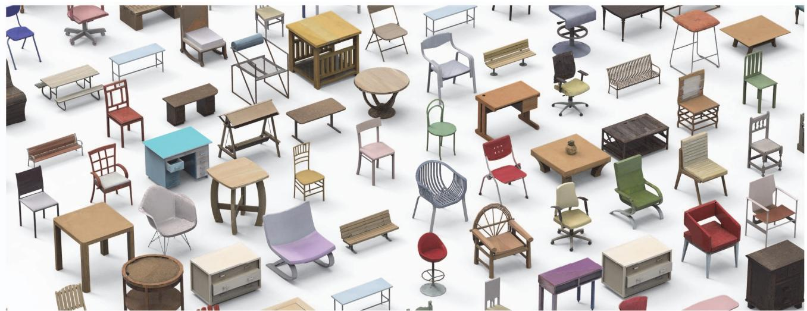  
Figure 1. A gallery of generated results by our Point-UV diffusion. Our method is capable of processing meshes of any genus, generating diversified, geometry-compatible, and high-fidelity textures.

## Abstract

In this work, we focus on synthesizing high-quality textures on 3D meshes. We present Point-UV diffusion, a coarse-to-fine pipeline that marries the denoising diffusion model with UV mapping to generate 3D consistent and high-quality texture images in UV space. We start with introducing a point diffusion model to synthesize lowfrequency texture components with our tailored style guidance to tackle the biased color distribution. The derived coarse texture offers global consistency and serves as a condition for the subsequent UV diffusion stage, aiding in regularizing the model to generate a 3D consistent UV texture image. Then, a UV diffusion model with hybrid conditions is developed to enhance the texture fidelity in the 2D UV space. Our method can process meshes of any genus, generating diversified, geometry-compatible, and high-fidelity textures. Code is available at https://cvmilab.github.io/Point-UV-Diffusion.

## 1. Introduction

Texturing 3D meshes is a fundamental task in computer vision and graphics. It enhances the visual richness of 3D objects, thereby facilitating their application in various fields such as video games, 3D movies, and AR/VR technologies. However, generating high-quality textures can be daunting and time-consuming, often requiring specialized knowledge and resources. As such, there is a pressing need for an efficient approach to automatically create highquality textures on 3D meshes.

Despite the substantial progress the community has made in 2D image synthesis and 3D shape generation using GANs [13, 20, 44, 11] or diffusion models [34, 36, 35, 19], crafting realistic textures on mesh surfaces remains challenging. One major difficulty stems from the need for suitable 3D representations for texture synthesis. Early approaches investigate the use of voxels [5, 45, 6] or point clouds [10] and synthesize point/voxel colors. However, they can only afford to synthesize low-resolution results with low-fidelity textures due to memory and model complexity constraints. In response, Texture Fields [29] adopts an implicit representation with the potential to synthesize high-resolution textures, but still could not yield satisfactory results as shown in Figure 2 (a): over-smoothed results. Most recently, Siddiqui et al. [38] propose to parameterize the shape as tetrahedral meshes and introduce tetrahedral mesh convolution to enhance local details. Albeit improving results, tetrahedral parameterization inevitably destroys geometric details of the input mesh and thus cannot faithfully preserve the original structure. As shown in Figure 2 (b), the delicate structures of the chair's back are absent. Moreover, the generative models utilized in these methods are limited to GANs [29, 38] and VAEs [29, 12]. The more advanced diffusion model, which could potentially open up new avenues for high-quality texture generation, remains insufficiently explored.

In this paper, we delve into a novel texture representation based on UV maps and investigate the advanced diffusion model for texture generation. The 2D nature of the UV map enables it to circumvent the cost of high-resolution point/voxel representations. Besides, the UV map is compatible with arbitrary mesh topologies, thereby preserving the original geometric structures. However, while promising, direct integration of the UV map representation with a 2D diffusion model presents challenges in synthesizing seamless textures, leading to severe artifacts, as shown in Figure 2 (c). This occurs because the UV mapping process fragments the continuous texture on the 3D surface into isolated patches on the 2D UV plane (see Figure 3).

To this end, we introduce Point-UV diffusion, a twostage coarse-to-fine framework consisting of point diffusion and UV diffusion. Specifically, we initially design a point diffusion model to generate color for sampled points that act as low-frequency texture components. This model is equipped with a style guidance mechanism that alleviates the impact of biased color distributions in the dataset and facilitates diversity during inference. Next, we project these colorized points onto the 2D UV space with 3D coordinate interpolation, thereby generating a coarse texture image that maintains 3D consistency and continuity. Given the coarse textured image, we develop a UV diffusion model with elaborately designed hybrid conditions to improve the quality of the textures (see Figure 2 (ours) and Figure 1).

In short, our contributions are as follows: 1) We propose a new framework for texture generation for given meshes. Our representation can handle meshes with arbitrary topology and is able to faithfully preserve geometric structures. 2) To the best of our knowledge, we are the first to train a diffusion model specifically for mesh texture generation. Our coarse-to-fine framework allows us to enjoy the efficiency of 2D representation while enhancing 3D consistency. 3) We compare our approach with multiple methods in unconditional generation and achieve state-of-the-art results. Furthermore, we demonstrate that our method can be easily extended to scenarios with text-conditioning and

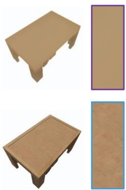

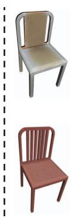  
(a) Texture Fields vs Ours

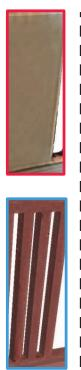  
(b) Texturify vs Ours

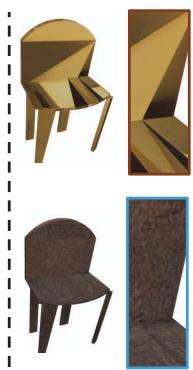  
(c) 2D diffusion vs Ours

Figure 2. Comparisons with different methods. Our generative results (a) possess high-quality details, (b) faithfully preserve the mesh structure, and (c) are better consistent with the given shape, compared with Texture Fields [29], Texturify [38] and 2D diffusion [16], respectively.  
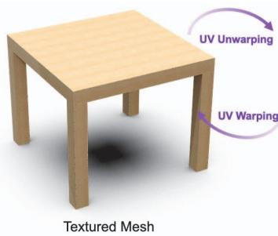

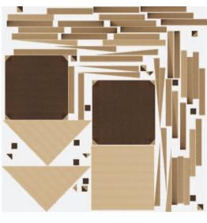  
Texture Image  
Figure 3. Illustration of UV mapping process. It establishes connections between the 2D texture map and the surface appearance of 3D shape.

image-conditioning.

## 2. Related Work

Texture generation. Early works [41, 43, 6] propose using voxels to represent colors. However, due to a cubic increase in memory usage and computational cost with rising resolution, these methods produce only coarse, lowresolution textures. For meshes, recent work in texture generation [38] predicts the color for each face, but the representation capacity remains largely constrained by the mesh's resolution. Another set of works [30, 42, 26, 12] leverage UV mapping, but they require either spherical parameterization or part segmentation and, therefore, are confined to handling low-genus shapes. Other works [32, 14] rely on image exemplars, while our approach focuses on unconditional generation. Recently, implicit functions attract increasing attention for generative tasks [11, 31, 39, 3, 9, 37, 29, 22]. Most of this research centers on generating 3Daware images [39, 3, 9, 37], rather than synthesizing textures for given 3D meshes. Texture Fields [29] represents the most similar work to our task, which, however, tends to produce over-smoothed results.

Some methods focus on test-time optimization for generation tasks. For instance, Text2Mesh [24] employs CLIP [33] to design a loss function. This function stylizes a 3D mesh to align with a target text prompt, predicting both the color and displacement for each mesh vertex. More recently, DreamFusion [31] and Magic3D [21] leverage pretrained stable diffusion [35] for score distillation, creating either NeRF [25] or a 3D mesh. However, these approaches often demand extensive optimization time or necessitate alterations to the existing mesh geometry [24]. In this paper, our objective is to generate textures for specified full-3D meshes with arbitrary topology. This goal entails two fundamental requirements: 1) preserving the original mesh's geometric structure; 2) producing a 3D texture representation exportable as either vertex color or a uv-texture-image, instead of merely generating/rendering multi-view or 3Daware images.

Diffusion models for 3D generation. In addition to 2D image generation, diffusion models recently gain significant attention in 3D generation, leading to many related works [49, 18, 19, 28, 31, 47, 1]. For instance, Zhou et al. [49] introduce point-voxel diffusion for point cloud generation and completion. Hui et al. [19] and Hu et al. [18] suggest a compact wavelet domain representation for shapes, enabling higher-quality shape creation via diffusion models. Nichol et al. [28] present Point-E, a system that uses a text-conditional strategy to produce colored 3D point clouds. This approach enables an efficient synthesis of intricate 3D shapes from textual prompts. Yet, this system yields lower-resolution point clouds, often missing detailed shapes and textures. In this work, we develop a brand new 3D diffusion model for texture image synthesis, which allows high-fidelity and 3D-consistent texture generation.

## 3. Preliminaries

## 3.1. Denoising diffusion model.

Diffusion model [40, 16] is a kind of likelihood-based generative model that has gained significant attention recently. It learns the data distribution q(xo) by progressive denoising from a prior Gaussian distribution. Given a sample from the data distribution $x _ { 0 } \sim q ( x _ { 0 } )$ , a fixed forward process $\begin{array} { r } { q \left( \pmb { x } _ { 1 : T } \mid \pmb { x } _ { 0 } \right) = \prod _ { t = 1 } ^ { T } q \left( \pmb { x } _ { t } \mid \pmb { x } _ { t - 1 } \right) } \end{array}$ is used to perturb the data with Gaussian kernels $q \left( \mathbf { x } _ { t } \mid \mathbf { x } _ { t - 1 } \right) : =$ $\mathcal { N } \left( \sqrt { 1 - \beta _ { t } } \mathbf { x } _ { t - 1 } , \beta _ { t } \mathbf { I } \right)$ , producing increasingly noisy latent variables $\{ x _ { 1 } , x _ { 2 } , . . . , \dot { x } _ { T } \}$ Then, a parameterized Markov process $\begin{array} { r } { p _ { \theta } \left( \pmb { x } _ { 0 : T } \right) = p \left( \pmb { x } _ { T } \right) \prod _ { t = 1 } ^ { T } p _ { \theta } \left( \pmb { x } _ { t - 1 } \mid \pmb { x } _ { t } \right) } \end{array}$ with transition kernel $p _ { \theta } \left( \mathbf { x } _ { t - 1 } \mid \mathbf { x } _ { t } \right) : = \mathcal { N } \left( \mu _ { \theta } \left( \mathbf { x } _ { t } , t \right) , \sigma _ { t } ^ { 2 } \mathbf { I } \right)$ is optimized through maximizing a variational lower bound of log data likelihood, which essentially targets to match the joint

distribution $q \left( { { x } _ { 0 : T } } \right)$ ..

$$
\operatorname { E } _ { q ( \mathbf { x } _ { 0 } ) } \left[ \log p _ { \theta } \left( \mathbf { x } _ { 0 } \right) \right] \geq \operatorname { E } _ { q ( \mathbf { x } _ { 0 : T } ) } \left[ \log { \frac { p _ { \theta } \left( \mathbf { x } _ { 0 : T } \right) } { q \left( \mathbf { x } _ { 1 : T } \mid \mathbf { x } _ { 0 } \right) } } \right] .\tag{1}
$$

After training, novel samples can then be generated via iterative sampling from $p _ { \theta } \left( \pmb { x } _ { t - 1 } \mid \pmb { x } _ { t } \right)$ following:

$$
\begin{array} { r } { { \bf x } _ { t - 1 } = \mu _ { \theta } \left( { \bf x } _ { t } , t \right) + \sqrt { \beta _ { t } } { \bf z } , { \bf z } \sim \mathcal { N } ( 0 , { \bf I } ) . } \end{array}
$$

Diffusion models have shown impressive capabilities in generating high-quality and diverse content. This paper proposes a texture generation framework based on diffusion model.

## 3.2. UV mapping and challenges.

UV mapping is a method of surface parameterization that translates a 3D surface into a 2D image, effectively creating a 2D coordinate system known as a UV map for a polygonal mesh S. This is achieved by explicitly assigning UV coordinates to each vertex of the mesh. Further, an arbitrary surface coordinate on the mesh can be mapped to its 2D coordinate through barycentric interpolation:

$$
( u , v ) = f ( p ) \quad f : S \to \Omega ,\tag{2}
$$

where f represents the UV mapping process.

As illustrated in Figure 3 "UV warping", we can apply textures to the mesh surface by generating a high-resolution texture image in the UV space. Besides texture, we can also create this kind of 2D map for surface normals and point coordinates. Our objective is to generate a high-quality 2D UV texture image of the given mesh. However, the mapping process requires cutting the continuous texture on the 3D shape into a series of individual patches in the 2D UV plane, as depicted in Figure 3. This fragmentation makes it challenging for the generative model to directly learn the 3D adjacency relationships of the patches within the 2D texture UV map. Consequently, this can lead to discontinuity and inconsistency issues when the generated texture map is applied back to the 3D mesh surface. As shown in Figure 2 “2D Diffusion", the diffusion model generates inconsistent textures and suffers from discontinuity issues.

## 4. Method

The challenge mentioned in Section 3.2 motivates us to propose a coarse-to-fine framework for texture image synthesis, namely Point-UV diffusion, illustrated in Figure 4. To start, we design a 3D point diffusion model to colorize a set of sampled points on the mesh surface, as shown in Figure 4 (Top). This stage leverages the 3D topology for predicting low-frequency colors on the mesh, without being affected by the discontinuity of the UV map. Based on the color components generated by the coarse stage, we then establish a 2D diffusion model in the UV space. This enhances the fidelity of the generated texture, as depicted in Figure 4 (Bottom).

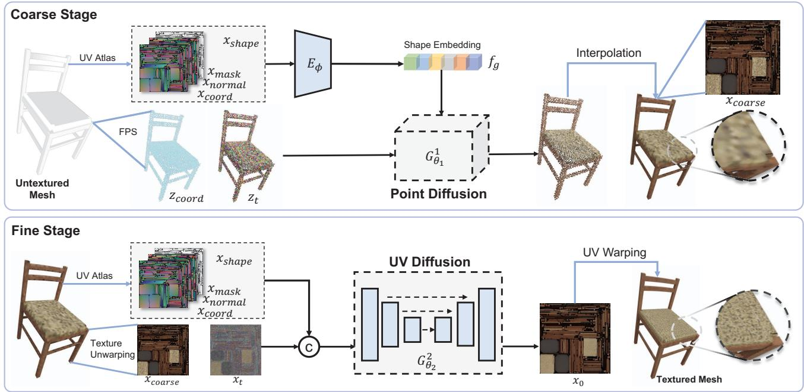  
Figure 4. The overview of our Point-UV-diffusion framework. (Top) The coarse stage first samples a point cloud on the mesh surface, and then predicts the color for each point using a 3D diffusion model conditioned on shape features including surface normal, mask, and coordinates. Then the points are mapped to the 2D UV map and the remaining uncolored points are filled up by tri-linear interpolation based on the 3D coordinates. (Bottom) The fine stage predicts high-quality textures with a 2D diffusion model conditioned on the shape attributes and the coarse texture image.

## 4.1. Coarse Stage: Point Diffusion

In the coarse stage, we begin by executing farthest point sampling (FPS) on the mesh surface, deriving a point set consisting of K points. These points are defined by their coordinates $\mathbf { z } _ { \mathrm { c o o r d } }$ and colors $\mathbf { z } _ { 0 }$ . During training, a forward diffusion process degrades the clean colors $\mathbf { z } _ { 0 }$ , transforming them into a noisy state $\mathbf { z } _ { t }$ . The noise level is dictated by the time step t, where $t \in \{ 0 , 1 , . . . , T \}$

Our network is trained to reverse this diffusion process, aiming to denoise $\mathbf { z } _ { t }$ back to its original clean colors. This denoising network is informed by three pre-computed maps: a coordinate map $\bf { X } _ { \mathrm { { C o o r d } } }$ , a normal map $\mathbf { X } _ { \mathrm { n o r m a l } }$ , and a mask map $\mathbf { x } _ { \mathrm { m a s k } }$ (details in Section 3.2). Unless stated otherwise, these conditions concatenate along the channel dimension, culminating in what we term the shape map Xshape:

$$
\mathbf { x } _ { \mathrm { s h a p e } } = \left( \left[ \mathbf { x } _ { \mathrm { n o r m a l } } , \mathbf { x } _ { \mathrm { m a s k } } , \mathbf { x } _ { \mathrm { c o o r d } } \right] \right) .\tag{3}
$$

Our network architecture is constructed upon PVCNN [23], drawing similarities to point-voxel diffusion [49]. However, we introduce slight modifications to amplify the integration of global shape information, contrasting with the approach in [49] which primarily relies on point coordinates. Initially, we employ a lightweight shape encoder $E _ { \phi }$ to extract a global shape embedding $f _ { g }$ from $\mathbf { x } _ { \mathrm { s h a p e } }$ This embedding is subsequently fed into the 3D network $G _ { \theta } ^ { 1 } .$ along with $\mathbf { z } _ { t } ,$ $\mathbf { z } _ { \mathrm { c o o r d } } .$ and t to predict the color $\hat { \mathbf { z } } _ { 0 } \mathrm { : }$

$$
\begin{array} { r l } & { f _ { g } = E _ { \phi } \left( \mathbf { x } _ { \mathrm { s h a p e } } \right) , } \\ & { \hat { \mathbf { z } } _ { 0 } = G _ { \theta _ { 1 } } ^ { 1 } \left( \left[ \mathbf { z } _ { \mathrm { c o o r d } } , \mathbf { z } _ { t } , f _ { g } , t \right] \right) . } \end{array}\tag{4}
$$

Style guidance. We observe that the synthesized colors are largely influenced by the predominant colors within the dataset (for instance, textures in the ShapeNet “chair"category are typically white, pure magenta, or wood-colored), leading to a lack of diversity in the outputs. To address this bias and promote color diversity, we introduce a style guidance mechanism. This is achieved by flattening each $\mathbf { z } _ { 0 }$ into a unidimensional vector, followed by employing PCA to extract the principal component coefficients, thus reducing the dimensionality of $\mathbf { z } _ { 0 }$ . Subsequently, K-means clustering is utilized to assign a style label to each $\mathbf { z } _ { 0 }$ . As depicted in Figure 5, shapes within a particular cluster exhibit similar color styles. During training, we provide the network with an additional style label $ { \mathcal { Z } } _ { \mathrm { s t y l e } }$ as a condition, which is referred to as style guidance:

$$
\begin{array} { r } { \hat { \mathbf { z } } _ { 0 } = G _ { \theta _ { 1 } } ^ { 1 } \left( \left[ \mathbf { z } _ { \mathrm { c o o r d } } , \mathbf { z } _ { t } , f _ { g } , t , z _ { \mathrm { s t y l e } } \right] \right) . } \end{array}\tag{5}
$$

In this way, we can guide the network to predict the desired color during inference by providing a certain style condition, thereby alleviating the biased color issue.

Coarse texture image. With the colored point clouds, we then project them onto the 2D UV space based on the precalculated UV mapping. Following this, we perform KNN interpolation based on the 3D coordinates to assign colors to the remaining uncolored pixels, thereby generating a coarse texture image $\mathbf { x } _ { \mathrm { c o a r s e } }$ for the given mesh. This coarse texture image offers a coherent base color initialization and functions as a conditional element to guide the high-fidelity texture generation in the second stage, helping to avoid discontinuity caused by UV mapping.

## 4.2. Fine Stage: UV Diffusion

To further refine the coarse texture image, we design a fine stage using 2D diffusion in the UV space, as depicted in Figure 4 (Bottom). In addition to the conditions used in the coarse stage, we incorporate the coarse texture image $\mathbf { x } _ { \mathrm { c o a r s e } }$ as an additional condition. We apply a 2D U-Net $G _ { \theta _ { 2 } } ^ { 2 }$ combined with self-attention modules to learn the highquality texture image $\hat { \mathbf { x } } _ { 0 }$ , from a noisy texture image xt:

$$
\begin{array} { r } { \hat { \mathbf { x } } _ { 0 } = G _ { \theta _ { 2 } } ^ { 2 } \left( \left[ \mathbf { x } _ { \mathrm { s h a p e } } , \mathbf { x } _ { t } , \mathbf { x } _ { \mathrm { c o a r s e } } , t \right] \right) . } \end{array}\tag{6}
$$

Hybrid condition. During training, we employ FPS on the ground-truth texture image, $\mathbf { x } _ { 0 } ,$ followed by interpolation to simulate the coarse texture image, $\mathbf { X } _ { \mathrm { { C o a r s e } } } .$ However, in joint cascaded testing involving both stages, we note that the output quality of $\hat { \mathbf { x } } _ { \mathrm { c o a r s e } }$ from the first stage doesn't always align flawlessly with the quality of xcoarse Such mismatches can influence the performance of the subsequent stage. To address this, we introduce a hybrid conditioning method aimed at narrowing this discrepancy. Firstly, we create a smooth texture image $\mathbf { x } _ { \mathrm { s m o o t h } }$ (see Figure 6), inspired by the blur augmentation described in [17] for cascaded diffusion models. In particular, we segment the mask map into multiple discrete regions using fourconnectivity detection, then perform average color pooling within each region based on its connectivity. After this procedure, $\mathbf { x } _ { \mathrm { s m o o t h } }$ maintains merely the regional color, ensuring more consistent alignment across both training and testing phases. Then, we combine $\mathbf { x } _ { \mathrm { c o a r s e } }$ with $\mathbf { x } _ { \mathrm { s m o o t h } }$ , using a certain probability $p _ { \mathrm { h y b r i d } }$ during training. Thus, the network is forced to be capable of generating textures even when adopting a weaker condition $\mathbf { x } _ { \mathrm { s m o o t h } }$ in the fine stage during inference. Considering that the diffusion model first generates low-frequency information and then higher one [8], we also explore a condition-truncated sampling, as detailed discussed in Section 5.4, where we condition both maps for generation during the initial time steps and then exclusively utilize the smooth map for the remainder of the generation.

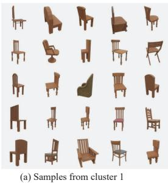

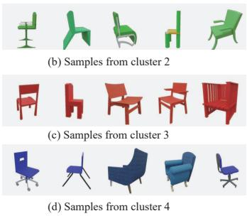  
Figure 5. Illustration of samples across various clusters. Shapes within a particular cluster exhibit analogous color styles. However, there exists an imbalance in the quantity of shapes among different clusters, leading to challenges in unbiased synthesis.

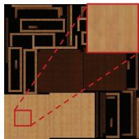

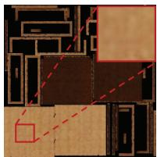  
(a) Texture image  
(b) Coarse texture image

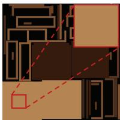  
(c) Smooth texture image  
Figure 6. Varieties of texture images. (a) Original texture image enriched with high-frequency details, (b) Coarse texture image, and (c) Smooth texture image.

## 5. Experiments

## 5.1. Datasets and Implementation Details

We conduct experiments across four categories of the ShapeNet dataset [4], namely, chair, table, car, and bench. Before training, we use an open-source UV-Atlas tool [46] to generate the UV map and pre-process the dataset to obtain the shape maps and ground-truth texture images. We sample $K = 4 0 9 6$ points in our coarse stage and synthesize a texture image in the UV space with a resolution of 512 $\times \ 5 1 2$ for the fine stage. For training the diffusion models, akin to [1], we predict the clean signals. This approach provides more stable training than predicting the noise component as recommended by [16]. We employ the cosine noise scheduling [27] ranging from 0.0001 to 0.02 over 1, 024 time steps for both stages. In the fine stage, we leverage the noise scaling strategy from [7] and also incorporate a rendering loss. Specifically, we randomly select four views and render the mesh using the predicted UV map and the ground-truth UV map to produce 1024 × 1024 images. Subsequently, we crop $2 2 4 \times 2 2 4$ patches from these images and compute the corresponding $L _ { 1 }$ loss. For the hybrid condition in the fine stage, we use $p _ { \mathrm { h y b r i d } } = 0 . 3$ and sweep over condition-truncated time $t _ { c }$ (see Figure 12).

Compared methods. We compare our method with stateof-the-art approaches, including Texturify [38], Texture

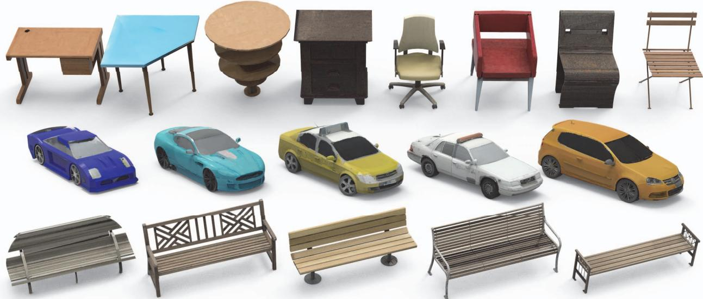  
Figure 7. Our texture synthesis results in different categories. The results on chairs, tables, cars, and benches demonstrate that our approach can generate natural, vivid, and diverse textures, even though the given 3D shapes are challenging, such as cutouts on the bench.

Fields [29], and PVD [49], in the context of unconditional texture generation. PVD was originally designed for point cloud generation instead of texture generation, so it cannot be directly compared with our approach. To facilitate comparison, we modify this framework to learn RGB values from the sampled point cloud. This extension, referred to as “PVD-Tex", serves as a baseline for directly learning texture in the point space using the diffusion model.

## 5.2. Unconditional Texture Generation

Gallary. First, we showcase our texture generation results for each category without additional conditions. The results in Figure 7 and Figure 1 demonstrate the remarkable performance of our method, which is able to generate appealing textures with fine details and preserve the geometric structures. Note that our method is compatible with meshes of diverse topology and intricate geometric details.

Qualitative comparisons. As depicted in Figure 8, our approach excels at generating high-quality textures while maintaining the geometric intricacies of the input mesh. Firstly, the results of Texture Fields [29] appear deficient in high-frequency details. Additionally, while PVD-Tex [49] is able to produce spatially varying colors to some extent (e.g., the car in Figure 8), it falls short in synthesizing intricate high-frequency details. Lastly, even though Texturify [38] demonstrates an ability to generate finer textures, it compromises on preserving slender structures (i.e. chair).

Quantitative comparisons. To quantitatively compare with existing works, we follow [38] and assess the generation quality using Frechet Inception Distance (FID)[15] and Kernel Inception Distance (KID)[2], metrics that are widely used for evaluating image generation models. To this end, we render 512 × 512 images from each generated textured mesh and ground-truth textured mesh using four distinct camera views. Table 1 presents the quantitative comparisons with current approaches, revealing that our method surpasses existing works.

## 5.3. Conditional Texture Generation

In addition, we demonstrate the capability of our framework to synthesize textures conditioned on either text prompts or a single-view image. We conduct our experiments on the chair and table categories. For the text condition, we utilize text-shape pairs as provided in [6] (with additional corrections for text accuracy). For the image condition, we randomly render a view from the ground-truth mesh. To infuse the network with condition-specific information, we use the pre-trained vision-language model CLIP [33] to extract the corresponding embedding from either the image or the text. This embedding is then fed into a simple MLP to incorporate the information into the diffusion model as a condition for both training and inference. As depicted in Figure 9, our method succeeds in generating textures that align well with the given text descriptions or images. We also compare our approach with Text2Mesh [24], a test-time optimization method. Text2Mesh takes around 10 minutes per instance, while ours only requires 30 seconds. Importantly, to adapt to our task which requires preserving the mesh geometry, we freeze the geometry deformation branch of Text2Mesh to generate only colors. As shown in Figure 10, Text2Mesh

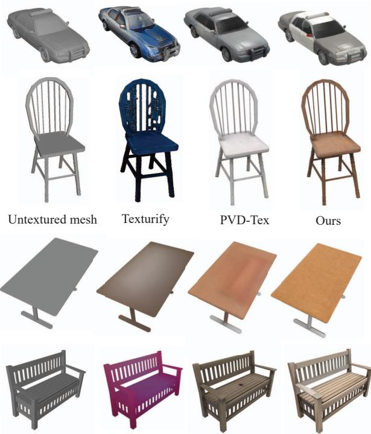  
Untextured mesh  
Texture Fields  
PVD-Tex  
Ours

Figure 8. Qualitative comparisons with existing works. Given pure 3D shapes, Texturify [38] generates textures on the surface of 3D shape but tends to damage the topology; Texture fields [29] and PVD-Tex [49] produce textures with limited details. On the contrary, our approach faithfully preserves topology and produces realistic appearances.

is bound by vertex resolution, while our method can deliver detailed visuals even on low-resolution meshes, offering a distinct advantage in graphics.

## 5.4. Ablation Studies

Coarse-to-fine diffusion. To manifest the effectiveness of our coarse-to-fine diffusion strategy, we conduct experiments on two baselines “w/o coarse stage"and “w/o fine stage". The “w/o coarse stage" configuration indicates that we directly generate the UV texture image using the fine stage, bypassing the initialization from the coarse stage. The “w/o fine stage" configuration signifies the result of the coarse stage, after assigning colors to the uncolored pixels using KNN interpolation. In both scenarios, the model produces inferior outcomes relative to our full model, as shown in Table 2 and Figure 11. Absent the coarse stage, the generated result suffers from noticeably inconsistent colors. Without the fine stage, the results are over-smoothed.

Hybrid condition. As shown in Table 2 and Figure 11 "coarse condition", the fine stage cannot generate highquality textures when it is exclusively conditioned on the

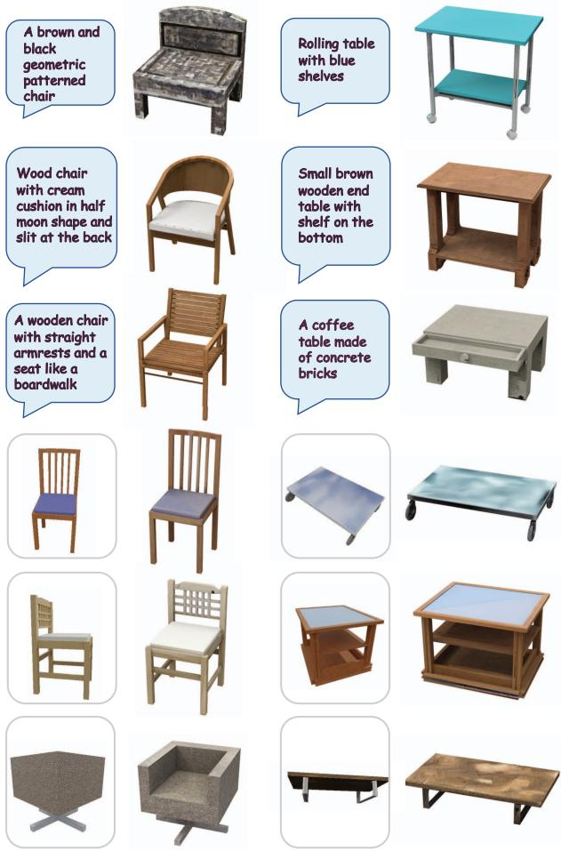  
Figure 9. Results of conditional texture generation. Our method is adaptable to craft textures guided by text descriptions (rows 1-3) or single-view images (rows 4-6).

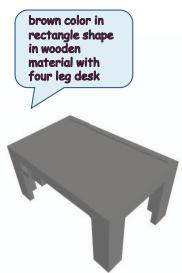  
Input mesh

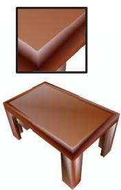  
Text2Mesh

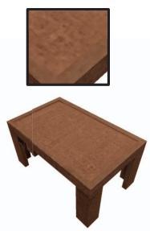  
Ours

Figure 10. Comparison with Text2Mesh. We freeze the geometry deformation branch of Text2Mesh to adapt to our task. Ours can generate high-frequency details for low-resolution mesh.

coarse map. Further, the generated quality remains unsatisfactory if we apply a hybrid condition entirely during training $( i . e . , \ p _ { \mathrm { h y b r i d } } \ = \ 1 . 0 )$ , as shown in ${ } ^ { 6 6 } p _ { \mathrm { h y b r i d } } \ =$ 1.0". We attribute this to the network's propensity to depend solely on the coarse map during training and generation. In contrast, our full model (i.e., hybrid condition with $p _ { \mathrm { h y b r i d } } = 0 . 3 )$ achieves significant improvement both qualitatively and quantitatively, as presented in Table 2 and Figure 11 “ours". Furthermore, we also sweep over the effect of condition-truncated time $t _ { c }$ for inference. As Figure 12 shows, $t _ { c } = 0 . 4$ strikes a sweet point. The model utilizes information from both conditions maps to better generate low-frequency components during the first 40% of the sampling timesteps. After that, the coarse map xcoarse is dropped, and the model further focuses on fine-grained detail generation without relying on the coarse map.

<table><tr><td></td><td colspan="2">Chair</td><td colspan="2"> $\overline { { \mathbf { C a r } } }$ </td><td colspan="2">Table</td><td colspan="2">Bench</td></tr><tr><td>Methods</td><td>FID↓</td><td>KID↓</td><td>FID↓</td><td> $\overline { { \mathrm { K I D } \downarrow } }$ </td><td>FID↓</td><td>KID↓</td><td>FID↓</td><td>KID↓</td></tr><tr><td>Texture Fields [29]</td><td>24.24</td><td>1.07</td><td>156.38</td><td>13.64</td><td>68.96</td><td>4.20</td><td>62.71</td><td>2.96</td></tr><tr><td>Texturify [38]</td><td>27.80</td><td>1.32</td><td>73.16</td><td>4.71</td><td></td><td></td><td>=</td><td></td></tr><tr><td>PVD-Tex [49]</td><td>15.52</td><td>0.62</td><td>59.47</td><td>3.74</td><td>16.12</td><td>0.55</td><td>28.94</td><td>0.39</td></tr><tr><td>Ours</td><td>9.88</td><td>0.22</td><td>26.89</td><td>0.68</td><td>9.63</td><td>0.15</td><td>23.09</td><td>0.15</td></tr></table>

Table 1. Quantitative comparisons with existing works. Ours outperforms other approaches on both FID [15] and KID $\bar { ( \times 1 0 ^ { 2 } ) }$ [2].

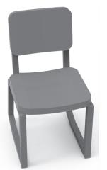  
(a) untextured mesh

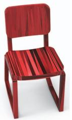  
(b) w/o coarse stage

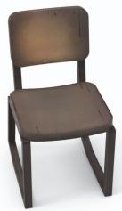  
(c) w/o fine stage

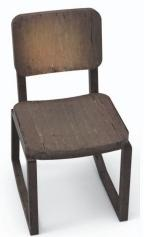

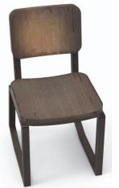  
(d) coarse condition  
(e) $p _ { h y b r i d } = 1 . 0$

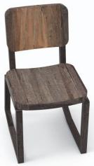  
(f) ours

Figure 11. Ablation studies. Without our two-stage generation pipeline or hybrid condition designs, the generated results are inconsistent with the 3D shape or lack high-frequency details.
<table><tr><td></td><td>FID↓</td><td>KID↓</td></tr><tr><td>w/o fine stage</td><td>17.88</td><td>0.76</td></tr><tr><td>w/o coarse stage</td><td>15.11</td><td>0.49</td></tr><tr><td>coarse condition</td><td>14.93</td><td>0.56</td></tr><tr><td> $p _ { \mathrm { h y b r i d } } = 1 . 0$ </td><td>15.25</td><td>0.59</td></tr><tr><td>Ours</td><td>9.88</td><td>0.22</td></tr></table>

Table 2. Ablation studies. This table shows the effectiveness of each component in our proposed method.

Style guidance. The style guidance is aimed at addressing the issue of insufficient diversity due to color distribution bias in the dataset. As a result, we do not utilize FID or KID for evaluation since they evaluate the distribution similarity between generated results and ground truth. However, the ground-truth distribution shows a strong bias towards particular colors, making these metrics inappropriate for assessing generative texture diversity. In contrast, we adopt LPIPS [48] to measure the pairwise similarity among five textures generated by our method given the same input mesh, where a larger diversity in textures will lead to a higher LPIPS value. In Figure 13, we report the quantitative results for 500 shapes. Our approach achieves a higher LPIPS in most of the evaluated cases, indicating better diversity. Besides, as shown in Figure 14, we present the results of generating three textures randomly for the shapes without and with style guidance. In the latter case, we uniformly sample three style labels as style inputs. It is evident that without style guidance, the generated textures are nearly identical, and the color styles of different shapes tend to be similar. With the introduction of style guidance, however, the diversity of colors has significantly increased. We also conduct a comparison with other methods in terms of diversity, as well as a quality assessment through user studies, as shown in Table 3.

<table><tr><td>Methods</td><td>Preference↑</td><td>LPIPS↑</td></tr><tr><td>Ours</td><td>49.8%</td><td>0.083</td></tr><tr><td>Texturify [38]</td><td>15.9%</td><td>0.086</td></tr><tr><td>PVD-Tex [49]</td><td>29.2%</td><td>0.029</td></tr><tr><td>Texture Fields [29]</td><td>5.1%</td><td>0.005</td></tr></table>

Table 3. LPIPS and user study. This table shows the average LPIPS and preference via user study in the chair category.

## 6. Discussion, Limitations, and Conclusions

This paper presents Point-UV diffusion, a brand-new framework that employs a coarse-to-fine pipeline to generate textures for 3D meshes. We begin with a 3D diffusion model to synthesize low-frequency texture components from point clouds, which maintain 3D consistency. We then refine the textures using a 2D UV-space diffusion model. Our method is compatible with meshes with arbitrary topology and can faithfully preserve the geometry structure. We further demonstrate the flexibility of our framework by extending it to conditional generative models.

Despite its merits, our method has inherent limitations. Similar to other methodologies relying on 3D data for training, our technique is upper-bounded by the scope and diversity of current 3D datasets. This restriction poses challenges in generating textures that parallel the depth of effects seen in 2D image synthesis. Moreover, our method's efficacy relies on the quality of UV mapping. Our approach faces difficulties in rendering high-quality results for meshes where the UV mapping produces excessive fragmented cuts, resulting in fragmented artifacts. This phenomenon is commonly observed in the car category, as shown in the Figure 15. We believe the emergence of larger and more diverse 3D datasets would be helpful for generating superiorquality textures. Further advancements in UV parameterization would also be beneficial in augmenting our method's consistency.

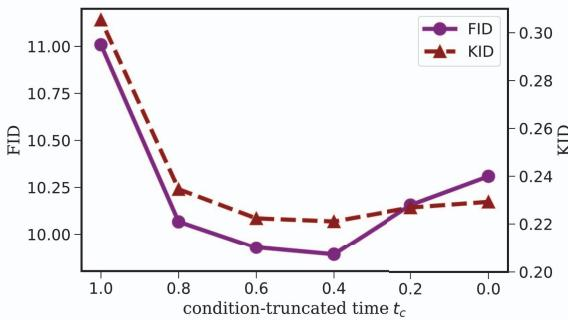  
Figure 12. Examination of condition-truncated time. The horizontal axis denotes the percentage of time points when the coarse texture image is conditioned during inference. The left vertical axis indicates the FID value, while the right vertical axis shows the KID value (× 102).

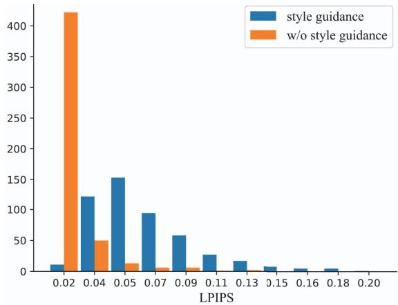  
Figure 13. Diversity measurement. Utilizing style guidance leads to larger LPIPS scores, indicating enhanced generation diversity.

## 7. Acknowledgements

This work has been supported by Hong Kong Research Grant Council - Early Career Scheme (Grant No. 27209621), General Research Fund Scheme (Grant No. 17202422), and RGC matching fund scheme (RMGS). Part

(a) w/o style guidance

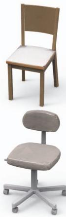  
Result 1

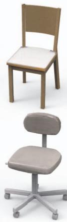  
Result 2

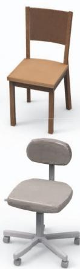  
Result 3  
(b) w/ style guidance

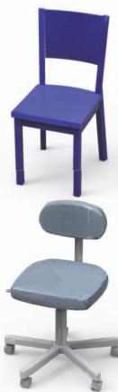  
Result 1

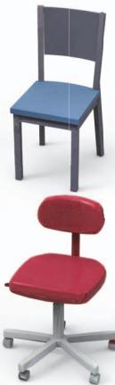  
Result 2

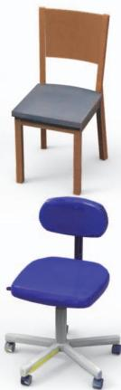  
Result 3

Figure 14. Efficacy of style guidance. The model without style guidance produces consistent colors across different random seeds (rows 1-2). In contrast, with style guidance, diverse outcomes emerge (rows 3-4).  
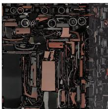  
(a) Generated Texture Image

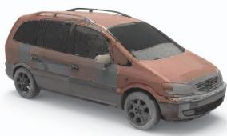  
(b) Textured Mesh  
Figure 15. Failure case. Our approach still struggles to generate seamless results when there are too many fragmented cuts of the UV map.

of the described research work is conducted in the JC STEM Lab of Robotics for Soft Materials funded by The Hong Kong Jockey Club Charities Trust.

## References

[1] Titas Anciukevičius, Zexiang Xu, Matthew Fisher, Paul Henderson, Hakan Bilen, Niloy J Mitra, and Paul Guerrero. Renderdiffusion: Image diffusion for 3d reconstruction, inpainting and generation. arXiv preprint arXiv:2211.09869, 2022. 3,5

[2] Mikołaj Bińkowski, Danica J Sutherland, Michael Arbel, and Arthur Gretton. Demystifying mmd gans. arXiv preprint arXiv:1801.01401, 2018. 6,8

[3] Eric R Chan, Marco Monteiro, Petr Kellnhofer, Jiajun Wu, and Gordon Wetzstein. pi-gan: Periodic implicit generative adversarial networks for 3d-aware image synthesis. In Proceedings of the IEEE/CVF conference on computer vision and pattern recognition, pages 5799–5809, 2021. 2

[4] Angel X. Chang, Thomas Funkhouser, Leonidas J. Guibas, Pat Hanrahan, Qixing Huang, Zimo Li, Silvio Savarese, Manolis Savva, Shuran Song, Hao Su, Jianxiong Xiao, Li Yi, and Fisher Yu. ShapeNet: An Information-Rich 3D Model Repository. Technical Report arXiv:1512.03012 [cs.GR], 2015.5

[5] Bindita Chaudhuri, Nikolaos Sarafianos, Linda Shapiro, and Tony Tung. Semi-supervised synthesis of high-resolution editable textures for 3d humans. In Proceedings of the IEEE/CVF Conference on Computer Vision and Pattern Recognition, pages 7991–8000, 2021. 1

[6] Kevin Chen, Christopher B Choy, Manolis Savva, Angel X Chang, Thomas Funkhouser, and Silvio Savarese. Text2shape: Generating shapes from natural language by learning joint embeddings. In Computer Vision–ACCV 2018: 14th Asian Conference on Computer Vision, Perth, Australia, December 2–6, 2018, Revised Selected Papers, Part III 14, pages 100–116. Springer, 2019. 1, 2, 6

[7] Ting Chen. On the importance of noise scheduling for diffusion models. arXiv preprint arXiv:2301.10972, 2023. 5

[8] Jooyoung Choi, Jungbeom Lee, Chaehun Shin, Sungwon Kim, Hyunwoo Kim, and Sungroh Yoon. Perception prioritized training of diffusion models. In Proceedings of the IEEE/CVF Conference on Computer Vision and Pattern Recognition, pages 11472–11481, 2022. 5

[9] Yu Deng, Jiaolong Yang, Jianfeng Xiang, and Xin Tong. Gram: Generative radiance manifolds for 3d-aware image generation. In Proceedings of the IEEE/CVF Conference on Computer Vision and Pattern Recognition, pages 10673– 10683, 2022. 2

[10] Jun Gao, Wenzheng Chen, Tommy Xiang, Alec Jacobson, Morgan McGuire, and Sanja Fidler. Learning deformable tetrahedral meshes for 3d reconstruction. Advances In Neural Information Processing Systems, 33:9936–9947, 2020. 1

[11] Jun Gao, Tianchang Shen, Zian Wang, Wenzheng Chen, Kangxue Yin, Daiqing Li, Or Litany, Zan Gojcic, and Sanja Fidler. Get3d: A generative model of high quality 3d textured shapes learned from images. In Advances In Neural Information Processing Systems, 2022. 1, 2

[12] Lin Gao, Tong Wu, Yu-Jie Yuan, Ming-Xian Lin, Yu-Kun Lai, and Hao Zhang. Tm-net: Deep generative networks for textured meshes. ACM Transactions on Graphics (TOG), 40(6):1–15, 2021. 2

[13] Ishaan Gulrajani, Faruk Ahmed, Martin Arjovsky, Vincent Dumoulin, and Aaron C Courville. Improved training of wasserstein gans. In Advances in neural information processing systems, pages 5767–5777, 2017. 1

[14] Philipp Henzler, Niloy J Mitra, and Tobias Ritschel. Learning a neural 3d texture space from 2d exemplars. In Proceedings of the IEEE/CVF Conference on Computer Vision and Pattern Recognition, pages 8356–8364, 2020. 2

[15] Martin Heusel, Hubert Ramsauer, Thomas Unterthiner, Bernhard Nessler, and Sepp Hochreiter. GANs trained by a two time-scale update rule converge to a local Nash equilibrium. NIPS, 2017. 6, 8

[16] Jonathan Ho, Ajay Jain, and Pieter Abbeel. Denoising Diffusion Probabilistic Models, 2020. 2, 3, 5

[17] Jonathan Ho, Chitwan Saharia, William Chan, David J Fleet, Mohammad Norouzi, and Tim Salimans. Cascaded diffusion models for high fidelity image generation. J. Mach. Learn. Res., 23(47):1–33, 2022. 5

[18] Jingyu Hu, Ka-Hei Hui, Zhengzhe Liu, Ruihui Li, and Chi-Wing Fu. Neural wavelet-domain diffusion for 3d shape generation, inversion, and manipulation. arXiv preprint arXiv:2302.00190, 2023. 3

[19] Ka-Hei Hui, Ruihui Li, Jingyu Hu, and Chi-Wing Fu. Neural wavelet-domain diffusion for 3d shape generation. In SIG-GRAPH Asia 2022 Conference Papers, pages 1–9, 2022. 1, 3

[20] Tero Karras, Samuli Laine, and Timo Aila. A style-based generator architecture for generative adversarial networks. In Proceedings of the IEEE/CVF conference on computer vision and pattern recognition, pages 4401–4410, 2019. 1

[21] Chen-Hsuan Lin, Jun Gao, Luming Tang, Towaki Takikawa, Xiaohui Zeng, Xun Huang, Karsten Kreis, Sanja Fidler, Ming-Yu Liu, and Tsung-Yi Lin. Magic3d: High-resolution text-to-3d content creation. In Proceedings of the IEEE/CVF Conference on Computer Vision and Pattern Recognition, pages 300–309, 2023. 3

[22] Zhengzhe Liu, Peng Dai, Ruihui Li, Xiaojuan Qi, and Chi-Wing Fu. Iss: Image as stetting stone for text-guided 3d shape generation. International Conference on Learning Representations, 2023. 2

[23] Zhijian Liu, Haotian Tang, Yujun Lin, and Song Han. Pointvoxel cnn for efficient 3d deep learning. Advances in Neural Information Processing Systems, 32, 2019. 4

[24] Oscar Michel, Roi Bar-On, Richard Liu, Sagie Benaim, and Rana Hanocka. Text2mesh: Text-driven neural stylization for meshes. In Proceedings of the IEEE/CVF Conference on Computer Vision and Pattern Recognition, pages 13492– 13502, 2022. 3, 6

[25] Ben Mildenhall, Pratul P Srinivasan, Matthew Tancik, Jonathan T Barron, Ravi Ramamoorthi, and Ren Ng. Nerf: Representing scenes as neural radiance fields for view synthesis. Communications of the ACM, 65(1):99–106, 2021. 3

[26] Nasir Mohammad Khalid, Tianhao Xie, Eugene Belilovsky, and Tiberiu Popa. Clip-mesh: Generating textured meshes from text using pretrained image-text models. In SIGGRAPH Asia 2022 Conference Papers, pages 1–8, 2022. 2

[27] Alex Nichol and Prafulla Dhariwal. Improved Denoising Diffusion Probabilistic Models, 2021. 5

[28] Alex Nichol, Heewoo Jun, Prafulla Dhariwal, Pamela Mishkin, and Mark Chen. Point-e: A system for generating 3d point clouds from complex prompts. arXiv preprint arXiv:2212.08751, 2022. 3

[29] Michael Oechsle, Lars Mescheder, Michael Niemeyer, Thilo Strauss, and Andreas Geiger. Texture fields: Learning texture representations in function space. In Proceedings of the IEEE/CVF International Conference on Computer Vision, pages 4531–4540, 2019. 1, 2, 6, 7, 8

[30] Dario Pavllo, Graham Spinks, Thomas Hofmann, Marie-Francine Moens, and Aurelien Lucchi. Convolutional generation of textured 3d meshes. Advances in Neural Information Processing Systems, 33:870–882, 2020. 2

[31] Ben Poole, Ajay Jain, Jonathan T Barron, and Ben Mildenhall. Dreamfusion: Text-to-3d using 2d diffusion. International Conference on Learning Representations, 2023. 2, 3

[32] Tiziano Portenier, Siavash Arjomand Bigdeli, and Orcun Goksel. Gramgan: Deep 3d texture synthesis from 2d exemplars. Advances in Neural Information Processing Systems, 33:6994–7004, 2020.2

[33] Alec Radford, Jong Wook Kim, Chris Hallacy, Aditya Ramesh, Gabriel Goh, Sandhini Agarwal, Girish Sastry, Amanda Askell, Pamela Mishkin, Jack Clark, et al. Learning transferable visual models from natural language supervision. In ICML, 2021. 3, 6

[34] Aditya Ramesh, Prafulla Dhariwal, Alex Nichol, Casey Chu, and Mark Chen. Hierarchical text-conditional image generation with CLIP latents. arXiv preprint arXiv:2204.06125, 2022.1

[35] Robin Rombach, Andreas Blattmann, Dominik Lorenz, Patrick Esser, and Björn Ommer. High-resolution image synthesis with latent diffusion models. In Proceedings of the IEEE/CVF Conference on Computer Vision and Pattern Recognition, pages 10684–10695, 2022. 1, 3

[36] Chitwan Saharia, William Chan, Saurabh Saxena, Lala Li, Jay Whang, Emily Denton, Seyed Kamyar Seyed Ghasemipour, Burcu Karagol Ayan, S Sara Mahdavi, Rapha Gontijo Lopes, et al. Photorealistic text-to-image diffusion models with deep language understanding. NeurIPS, 2022.1

[37] Katja Schwarz, Yiyi Liao, Michael Niemeyer, and Andreas Geiger. Graf: Generative radiance fields for 3d-aware image synthesis. Advances in Neural Information Processing Systems, 33:20154–20166, 2020. 2

[38] Yawar Siddiqui, Justus Thies, Fangchang Ma, Qi Shan, Matthias Nießner, and Angela Dai. Texturify: Generating textures on 3d shape surfaces. arXiv preprint arXiv:2204.02411, 2022.2, 5, 6, 7, 8

[39] Ivan Skorokhodov, Sergey Tulyakov, Yiqun Wang, and Peter Wonka. Epigraf: Rethinking training of 3d gans. Advances in Neural Information Processing Systems, 35:24487–24501, 2022.2

[40] Jascha Sohl-Dickstein, Eric Weiss, Niru Maheswaranathan, and Surya Ganguli. Deep unsupervised learning using nonequilibrium thermodynamics. In International Confer-

ence on Machine Learning, pages 2256–2265. PMLR, 2015. 3

[41] Yongbin Sun, Ziwei Liu, Yue Wang, and Sanjay E Sarma. Im2avatar: Colorful 3d reconstruction from a single image. arXiv preprint arXiv:1804.06375, 2018. 2

[42] Shubham Tulsiani, Nilesh Kulkarni, and Abhinav Gupta. Implicit mesh reconstruction from unannotated image collections. arXiv preprint arXiv:2007.08504, 2020. 2

[43] Shubham Tulsiani, Tinghui Zhou, Alexei A Efros, and Jitendra Malik. Multi-view supervision for single-view reconstruction via differentiable ray consistency. In Proceedings of the IEEE conference on computer vision and pattern recognition, pages 2626–2634, 2017. 2

[44] Hao Wang, Guosheng Lin, Steven Hoi, and Chunyan Miao. Cycle-consistent inverse GAN for text-to-image synthesis. ACM MM, 2021. 1

[45] Kangxue Yin, Jun Gao, Maria Shugrina, Sameh Khamis, and Sanja Fidler. 3dstylenet: Creating 3d shapes with geometric and texture style variations. In Proceedings of the IEEE/CVF International Conference on Computer Vision, pages 12456– 12465, 2021. 1

[46] Jonathan Young. xatlas, 2018. https://github.com/jpcy/xatlas.5

[47] Xiaohui Zeng, Arash Vahdat, Francis Williams, Zan Gojcic, Or Litany, Sanja Fidler, and Karsten Kreis. Lion: Latent point diffusion models for 3d shape generation. arXiv preprint arXiv:2210.06978, 2022. 3

[48] Richard Zhang, Phillip Isola, Alexei A Efros, Eli Shechtman, and Oliver Wang. The unreasonable effectiveness of deep features as a perceptual metric. In Proceedings of the IEEE conference on computer vision and pattern recognition, pages 586–595, 2018. 8

[49] Linqi Zhou, Yilun Du, and Jiajun Wu. 3d shape generation and completion through point-voxel diffusion. In Proceedings of the IEEE/CVF International Conference on Computer Vision, pages 5826–5835, 2021. 3, 4, 6, 7, 8