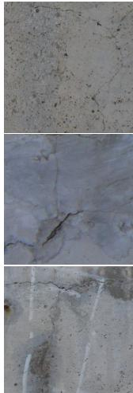
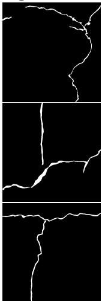
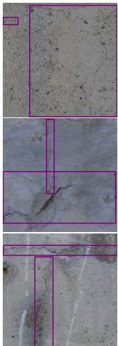
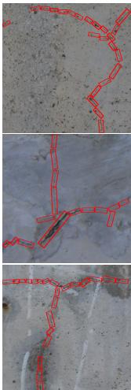
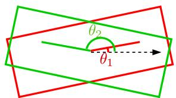
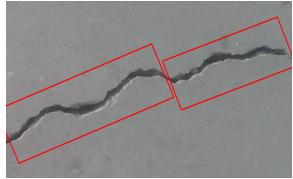
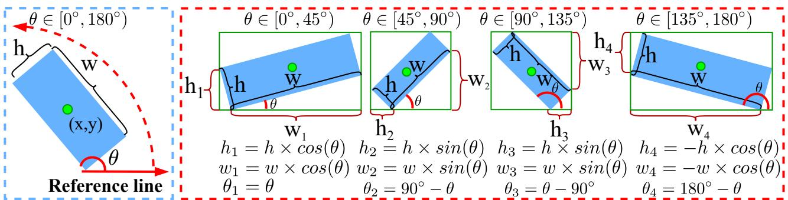
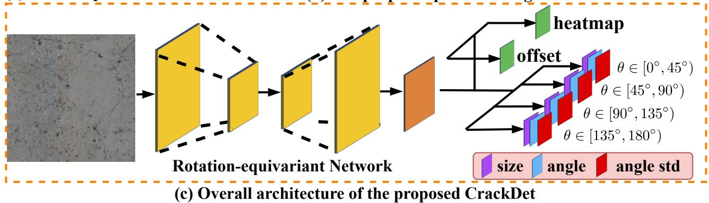
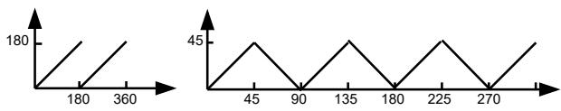
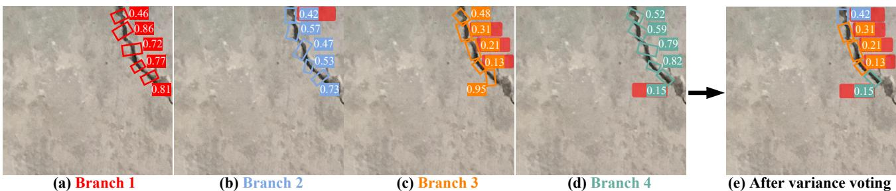

# The Devil is in the Crack Orientation: A New Perspective for Crack Detection

Zhuangzhuang Chen, Jin Zhang, Zhuonan Lai, Guanming Zhu, Zun Liu, Jie Chen ∗, Jianqiang Li Shenzhen University, Shenzhen, China

{chenzhuangzhuang2016, 2018101068, zhuguanming2022}@email.szu.edu.cn {jin.zhang, chenjie, zunliu, lijq}@szu.edu.cn

## Abstract

Cracks are usually curve-like structures that are the focus of many computer-vision applications (e.g., road safety inspection and surface inspection of the industrial facilities). The existing pixel-based crack segmentation methods rely on time-consuming and costly pixel-level annotations. And the object-based crack detection methods exploit the horizontal box to detect the crack without considering crack orientation, resulting in scale variation and intraclass variation. Considering this, we provide a new perspective for crack detection that models the cracks as a series ofsub-cracks with the corresponding orientation. However, the vanilla adaptation of the existing oriented object detection methods to the crack detection tasks will result in limited performance, due to the boundary discontinuity issue and the ambiguities in sub-crack orientation. In this paper, we propose a first-of-its-kind oriented sub-crack detector, dubbed as CrackDet, which is derived from a novel piecewise angle definition, to ease the boundary discontinuity problem. And then, we propose a multi-branch angle regression loss for learning sub-crack orientation and variance together. Since there are no related benchmarks, we construct three fully annotated datasets, namely, ORC, ONPP, and OCCSD, which involve various cracks in road pavement and industrial facilities. Experiments show that our approach outperforms state-of-the-art crack detectors.

## 1. Introduction

Crack is a type of defect that appears on the surfaces of many physical structures, e.g., the road pavement [41], the industrial facilities [8]. Inspecting and repairing cracks are crucial tasks for avoiding expansion of the harm to these structures [77]. Besides, a recent study reveals that recognizing the surface cracks caused by earthquakes in time can avoid secondary damage to people’s properties and lives [67]. However, manual inspection is costly, timeconsuming, and prone to human error [34]. Hence, automatic image-based crack detection plays an essential role in a real-world application of crack identification [22, 67].

Images  

Segmentation  

Detection  
Ours  

  
(a) Visualization of different perspectives for crack detection

  
(b) Boundary discontinuity (c) Ambiguities in orientation Figure 1. Cracks tend to be curve-like structures [77] in real-world applications. (a) We compare our orientation-based perspective with others for crack detection. (b) Boundary discontinuity issue in the existing 180-degree definition. (c) The sub-crack orientation is ambiguous in some cases due to the irregular sub-crack shape.

Currently, image-based crack detection methods can be roughly divided into three categories [36]: patch-level classification [4, 8], object-level detection [54, 31], and pixellevel crack segmentation [76, 49]. Although the first two methods take less labeling cost than the last one, they can only provide a coarse crack localization. Moreover, we are motivated by the fact that a crack is a line object that has a certain width from a local perspective [77]. Then, we are encouraged to start from an orientation-based perspective that models the cracks as a series of oriented sub-cracks (see Fig. 1 (a)). The advantage of this perspective is three-fold: (1) eliminating the scale variation, (2) reducing the intraclass variation, and (3) taking less labeling cost than the segmentation methods. More specifically, in the case of our practice, the price and time cost of the pixel-level annotations are 15× and 30× higher than our oriented sub-crack annotations, respectively. Besides, considering real-world applications, existing works [33, 35] show great power by taking a detection-then-segmentation strategy, i.e., it first identifies and localizes cracks by a detector and then obtains crack details by segmentation-based methods. Hence, the detector based on our perspective can serve as a complement to segmentation-based methods, as it can provide a more fine-grained localization (see Fig. 1 a).

However, it is difficult to directly adopt the state-ofart oriented detectors [16, 39, 23, 37] to crack detection. The reason is two-fold: (1) several existing works (e.g., ReDet [16], DRN [39]) simply ignore the boundary discontinuity problem, and (2) although the remaining works make great efforts on the above problem, these works still suffer from ambiguity issue in the sub-crack orientation. Among existing oriented detection methods, those detectors based on five parameters $( x , y , h , w , \theta )$ dominate [58], where (x, y) indicates the center point and (h, w, θ) denotes height, width, and angle, respectively. As shown in Fig. 1 (b), the boundary discontinuity problem indicates that small rotations for oriented objects around the angle period’s boundary result in a sudden sharp increase of loss [61]. Moreover, Fig. 1 (c) provides some cases to illustrate the inherent ambiguities in sub-crack orientation. When the growth direction of a crack changes frequently, the orientation of the sub-crack is unclear to judge, making it hard to learn regression functions for estimating orientation.

This paper starts from a new perspective for crack detection that models the cracks as a series of oriented subcracks. After that, we adopt CenterNet [73] as our baseline due to its simplicity. Next, we propose a new piecewise angle definition to ease the boundary discontinuity issue. Based on our piecewise definition, we propose the Crack-Det that contains a parallel multi-branch architecture, each of which is responsible for predicting a fixed range of angles. Then, to address the ambiguities in sub-crack orientation, we propose a novel multi-branch angle regression loss, namely MAR Loss, which is based on Wasserstein distances [1] for both angle regression and angle variance estimation. The advantage of coupling CrackDet with MAR Loss is three-fold: (1) the ambiguities in sub-crack orientation can be captured to a certain extent. (2) The learned variance from each branch is beneficial during the post-process. We acquire the estimated variances from each branch and obtain the detection results by variance voting. (3) Since crack orientation is significant in a real-world application [38], the learned variances reveal the level of confidence in the angle prediction, it can potentially help to judge the overall crack orientation. Our main contributions are summarized as follows:

(1) To the best of our knowledge, we are the first ones to start from an oriented sub-crack detection perspective for crack detection by modeling cracks as a series of sub-cracks with their inherent orientations.

(2) Propose a first-of-its-kind oriented sub-crack detector, called as CrackDet, which stems from the proposed piecewise angle definition (see Sec. 3.1), to ease the boundary discontinuity issue.

(3) Propose a multi-branch angle regression loss that enables CrackDet to capture ambiguities in sub-crack orientation via jointly learning sub-crack orientation and the corresponding orientation variance (see Sec. 3.2 and 3.3).

(4) A tale of three datasets has been constructed, namely, ORC, ONPP, and OCCSD. These datasets contain orientation annotations of the sub-cracks in real-world industrial facilities and road pavements, to facilitate the research about oriented sub-crack detection.

## 2. Related work

By following the previous study [36], the vision-based crack detection can be roughly clustered into three categories: patch-level classification [4, 8], object-level detection [54, 31], and pixel-level segmentation [77, 48].

Patch-level crack classification. Recently, deep learningbased methods are more powerful than the traditional methods (e.g., HOG [42], LBP[42], Gaussian process, SVM [42]) in the patch-level crack classification tasks [36]. Among deep learning-based methods, variants of convolutional neural network (CNN) followed by a fully connected (FC) layer are used to recognize patch-level crack samples. Typically, ResNet [17] and VGG [47] are popular backbones among existing backbones. Moreover, focal loss [26] focuses on the hard samples to learn discriminative features. However, patch-level methods fail in providing orientation and the fine-grained localization of crack objects [36].

Object-level crack detection. For object-level crack detection, a bounding box is exploited to describe the location and the coarse size of a crack object. Most existing crack detectors mainly adopt the general object detectors, such as Faster R-CNN [44], RetinaNet [26], Yolo [43], CenterNet [12], and SSD [28]. Specifically, Fen et al. [13] first design a hybrid approach that uses Faster R-CNN to detect the crack patch. Then, as the crack orientation is important in the post-process, a deep CNN is exploited to obtain the orientation of each detected patch. Ma et al. [31] design an automatic crack detection system by using YOLO v3 [75]. To detect various cracks, Wang et al. [51] propose a crack detection model by using CenterNet to extract crack features. Moreover, a RetinaNet-based crack detector is proposed to detect the crack in asphalt pavement [50]. Unfortunately, as shown in Fig. 1, the object-level crack detection methods suffer from scale variation and intra-class variation. Moreover, it also can not directly provide the orientation and the fine-grained localization of cracks.

Pixel-level crack segmentation. Since those horizontal bounding boxes can not describe the exact shape of the crack, segmentation-based methods are proposed to detect cracks at the pixel level. Yang et al. [59] design an automatic crack segmentation pipeline by using fully convolutional networks [30] and achieve a noticeable performance gain over traditional approaches [76, 46]. By coupling with Deeplab v3+ [5], CrackSeg [48] is proposed to learn rich features for different scales. Moreover, aiming to learn high-level crack representations, DeepCrack [77] is proposed to capture the line structures by feature fusion. Considering different receptive fields, FPHBN [57] makes great efforts for crack detection by aggregating pyramid features. Besides, by addressing the imbalance problem, Li et al. [22] propose an adaptive weighted cross-entropy loss function, which serves as a complement to the existing methods. However, these segmentation-based methods heavily rely on high-quality labeled datasets [6, 72], which involves a high labeling cost.

Compared to the above methods, we start from a new perspective that turns crack detection into oriented subcrack detection. Based on this perspective, we are allowed to provide a fine-grained localization of crack objects (See details in Fig. 1), instead of a coarse localization by the patch-level classification or object-level detection methods. Hence, considering the existing detectionthen-segmentation strategy [33, 35], the detector based on our perspective can serve as a better candidate for the segmentation-based methods. Besides, when considering a dynamic field without historical human supervision, our perspective can greatly ease the labeling cost than the pixellevel segmentation methods.

Oriented object detection. Since our oriented sub-crack detection perspective belongs to the oriented object detection category, we give a brief review of related research on this scope. Recently, many powerful rotation detectors are mainly derived from horizontal object detectors by adding an orientation regression branch [23]. For example, ICN [2], ROI-Transformer [11], SCRDet [64], CAD-Net [70], CSL[60], R3Det [62], ReDet [16], Oriented R-CNN [55], and DCL [58] bring satisfied detection results on DOTA dataset [53] and HRSC2016 dataset [29]. Gliding Vertex [56] and RSDet [40] share the same purpose of considering quadrilateral regression prediction. Note that, the boundary discontinuity problem is caused by the periodicity of the angle when dealing with the angel-based orientation estimation. Then, Yang et al. [60] take a new perspective that turns the angular regression tasks into the angular classification tasks [58]. Moreover, Oriented RepPoints [23] utilize the flexible adaptive points as the box representation to achieve oriented object detection. Unlike these methods, our Crack-Det addresses the boundary discontinuity problem via the new piecewise angle definition, which is motivated by the divide-and-conquer strategy. Besides, although KLD [65] and GWD [63] also start from a distribution perspective, it converts the center point, height, width, and orientation of a rotated bounding box as a 2-D Gaussian distribution, and does not focus on learning angle variance. Instead, the proposed CrackDet assumes that the ground-truth orientation obeys a single-variate gaussian distribution, and aims to learn the sub-crack orientation and its variance together.

## 3. Our method and datasets

The overall framework is shown in Fig. 2. We first introduce the piecewise angle definition in Sec. 3.1, and the network architecture of CrackDet in Sec. 3.2. Then, we give the details of the proposed MAR Loss for estimating ambiguities in sub-crack orientation in Sec. 3.3. Finally, we present the inference step of CrackDet with estimated angle variances in Sec. 3.4, and the proposed datasets in Sec. 3.5.

## 3.1. Piecewise angle definition

In this section, we recap the boundary discontinuity problem and inconsistency regression problem in the existing 180-degree five-parameter definition. Then, we discuss the details of the proposed piecewise angle definition.

Rethinking the five-parameter definition. Fig. 2 (a) shows that the existing five-parameter definition [53] with the 180-degree angular range includes (x, y, h, w, θ), where (x, y) indicates the center point and [h, w, θ] denotes height, width, and angle, respectively. Then, the boundary discontinuity problem refers to a sharp increase of loss at the boundary caused by the periodicity of the angle. As shown in Fig. 3 (a), it can be further explained that when the angle of a rotated box is close to 180◦, the angle under the five-parameter definition will suddenly change from 180◦ to $0 ^ { \circ }$ , resulting a sharp increase of angle regression loss. Moreover, the inconsistency regression problem can be attributed to the rotation symmetry in object detection, which includes the equivariant orientation and invariant shape estimation for a rotated bounding box [68]. Specifically speaking, rotation-equivariant features are desired for orientation estimation. In contrast, the shape of the bounding box does not change after a rotation. Thus, rotation-invariant features are needed for predicting its invariant height and width [16]. Discussion on our piecewise angle definition. We are inspired by the divide-and-conquer strategy [7] and propose the following piecewise angle definition, shown in

  
(a) The five-parameter definition  
(b) The proposed piecewise angle definition

  
Figure 2. (a) The existing five-parameter definition with long-side definition. (b) Our piecewise angle definition is inspired by the divideand-conquer strategy and built upon the above five-parameter definition. It breaks down the existing 180-degree regression tasks into four sub-tasks for addressing the discontinuity problem. (c) Based on our piecewise angle definition, we present an overview of CrackDet that can estimate standard deviations (std) along with angle regression for capturing ambiguities in the sub-crack orientation. Note that, the heatmap branch and offset branch are responsible for the center (i.e., x and y) of the predicted bounding box as in the original CenterNet.

  
(a) The 180-degree definition (b) Our piecewise definition Figure 3. The horizontal axis denotes the angle of a rotated box in anti-clockwise order. And the vertical axis denotes the angle definition in different methods. Due to the periodicity of the angle, Figure (a) shows that there is a sudden change when the angle of a rotated box closes to 180◦ with the 180-degree definition.

Fig. 2 (b). On the one hand, Fig. 3 (b) shows that there is no sudden change of the angle in our piecewise angle definition. Thus, ours is free of the boundary discontinuity problem. On the other hand, rotation equivariance can be easily achieved by group convolutions [52], while rotation invariance relies on a larger capacity network or a larger number of training samples. Hence, we focus on rotationequivariant features. And then, we are allowed to transform the invariant size estimation into equivariant size estimation by adding a factor sin(θ) or cos(θ) to the height and width (see Fig. 2 (b)). That way, the box size is enforced to change equivalently when the box orientation changes. Accordingly, both box size and angle regressions can benefit from rotation-equivariant features.

## 3.2. Network architecture

As discussed before, we aim to extract rotationequivariant features for box size regression and angle regression. Therefore, we adopt rotation-equivariant networks as the backbone to extract rotation-equivariant features. Then, we design a parallel multi-branch architecture based on the proposed piecewise angle definition. The overall architecture of CrackDet is shown in Fig. 2 (c).

Rotation-equivariant backbone. We first adopt CenterNet [73] as our baseline, which takes an object as a single point (i.e., the center point of the bounding box) and regresses the object size and offset. Then, we re-implement all layers of the fully-convolutional encoder-decoder networks (i.e., up-convolutional residual networks [20]) in Center-Net based on e2cnn [52], named as ReEDNet. Importantly, e2cnn includes rotation-equivariant convolution, rotationequivariant up-convolution, and pooling, etc. Thanks to the rotation weight sharing and group representations in e2cnn, our ReEDNet takes smaller parameters than the original encoder-decoder networks in CenterNet and enjoys the capability of equivariance.

  
Figure 4. A visualization of our angle-based variance voting. Firstly, the red, blue, orange, and teal textboxes are the corresponding standard deviation obtained from branch 1, 2, 3, and 4, respectively. Then, for each oriented bounding box, we select brach i that has the smallest standard deviation to obtain its final detection result. Note that, the red background box is associated with the selected branch.

Multi-branch architecture. According to our piecewise angle definition, we define a valid range $[ l _ { i } , r _ { i } )$ for each branch i. During the training, we only select the ground truth boxes whose angles fall in the corresponding valid range of one branch. Specifically, referring to the existing 180-degree definition, for an oriented bounding box with angle θ on the input image, it is valid for branch i when:

$$
l _ { i } \leq \theta < r _ { i } .\tag{1}
$$

As shown in Fig. 2 (c), the valid ranges of four branches are set to $[ 0 ^ { \circ } , 4 5 ^ { \circ } ) , [ 4 5 ^ { \circ } , 9 0 ^ { \circ } ) , [ 9 0 ^ { \circ } , 1 3 5 ^ { \circ } )$ and $[ 1 3 5 ^ { \circ } , 1 8 0 ^ { \circ } )$ respectively. For branch i, we redefine the ground-truth θ, height $h ,$ , and width w in the 180-degree definition into $\theta _ { i } , \ h _ { i }$ , and $w _ { i }$ , according to our piecewise definition in Fig. 2 (b). Moreover, we aim to estimate the angle and angle confidence together. To this end, each branch of our parallel multi-branch architecture contains three detection heads on the top of the rotation-equivariant backbone for predicting size (i.e., height and width), angle, and angle confidence. Note that, we simply implement each head with a fully-connected layer. That way, our network enables us to predict multiple probability distributions instead of only one angle. For simplicity, we assume each predicted angle from each branch is independent and obeys a single-variate gaussian distribution. The corresponding equation is shown as follows:

$$
P \Theta _ { i } \left( \theta \right) = \frac { 1 } { \sqrt { 2 \pi \sigma _ { i } ^ { 2 } } } e ^ { - \frac { \left( \theta - \theta _ { i } ^ { e } \right) ^ { 2 } } { 2 \sigma _ { i } ^ { 2 } } } , i \in \{ 1 , 2 , 3 , 4 \}\tag{2}
$$

where $\Theta _ { i }$ is the parameters of the angle detection head from branch i, $\theta _ { i } ^ { e }$ denotes the estimated angle from branch $i ,$ and standard deviation $\sigma _ { i }$ measures the angle confidence of the estimation on branch i. When $\sigma _ { i }$ is very close to 0, it means the branch i is extremely confident about the estimated angle. Accordingly, we suppose to have the redefined ground-truth angle $\theta _ { i }$ that is in the valid range of branch i. Similarly, $\theta _ { i }$ can also be formulated as a gaussian distribution $\mathcal { N } ( \theta _ { i } , \sigma _ { g t } ^ { 2 } )$ with its standard deviation $\sigma _ { g t } \to 0$ Then, this gaussian distribution can be viewed as: $P _ { i } ^ { g t } ( \theta ) =$ $\delta \left( \theta - \theta _ { i } \right)$ , where $\delta ( \cdot )$ indicates Dirac delta function.

## 3.3. The proposed MAR Loss

Suppose the angle of a ground-truth bounding box lies in the valid range of branch i, our multi-branch angle regression loss (MAR Loss) aims to minimize the distribution discrepancy between the predicted angle distribution from branch i and the redefined ground-truth angle distribution. Meanwhile, we expect the other three branches to be able to predict larger variance so that we can filter those inaccurate predictions by variance voting in the inference step. More specifically, we first exploit the Wasserstein distance as the distance metric and minimize the distance between $P _ { \Theta _ { i } } ( \theta )$ and $P _ { i } ^ { g t } ( \theta )$ . Secondly, we maximize the estimated variance from the other three branches. The equation is shown as:

$$
\begin{array} { c } { { { \cal L } _ { M A R } = \displaystyle \frac { D _ { W } \left( P _ { \Theta _ { i } } ( \theta ) \| P _ { i } ^ { g t } ( \theta ) \right) } { \frac { 1 } { 2 } + \sigma _ { i } ^ { 2 } } - \displaystyle \sum _ { j = 1 , j \neq i } ^ { 4 } \sigma _ { j } ^ { 2 } } } \\ { { = \displaystyle \frac { \| \theta _ { i } ^ { e } - \theta _ { i } \| _ { 2 } ^ { 2 } + \sigma _ { i } ^ { 2 } } { \frac { 1 } { 2 } + \sigma _ { i } ^ { 2 } } - \displaystyle \sum _ { j = 1 , j \neq i } ^ { 4 } \sigma _ { j } ^ { 2 } } } \end{array}\tag{3}
$$

where $D _ { W } \left( \cdot \right)$ is unfolded based on Wasserstein distance [3]:

$$
D _ { W } \left( P _ { \Theta _ { i } } ( \theta ) \lVert P _ { i } ^ { g t } ( \theta ) \right) = \lVert \theta _ { i } ^ { e } - \theta _ { i } \rVert _ { 2 } ^ { 2 } + \sigma _ { i } ^ { 2 } .\tag{4}
$$

Importantly, we exploit Wasserstein distance instead of KL-Divergence [18] for angle regression, because $\mathrm { K L } -$ Divergence heavily relies on a non-negligible intersection between two distributions [1, 18]. Note that, when $\theta _ { i } ^ { e }$ is estimated accurately, i.e., $\lVert { \boldsymbol { \theta } } _ { i } ^ { e } - { \boldsymbol { \theta } } _ { i } \rVert _ { 2 } ^ { 2 } \to 0 .$ the branch i is expected to predict smaller variance. In addition, a term $\textstyle { \frac { 1 } { 2 } } + \sigma _ { i } ^ { 2 }$ is added for the following reason: due to the ambiguities in sub-crack orientation, when the angle $\theta _ { i } ^ { e }$ is estimated inaccurately, i.e., $\mathopen { } \mathclose \bgroup \left\| \theta _ { i } ^ { e } - \theta _ { i } \aftergroup \egroup \right\| _ { 2 } ^ { 2 } > \frac { 1 } { 2 }$ , we expect the branch i to be able to predict larger variance $\sigma _ { i } ^ { 2 }$ so that $L _ { M A R }$ will be lower. Moreover, according to our piecewise angle definition, the size regression loss $L _ { \mathrm { s i z e } }$ for the redefined ground truth height $h _ { i }$ and width $w _ { i }$ is defined as $L _ { \mathrm { s i z e } } = | h _ { i } ^ { e } - h _ { i } | + | w _ { i } ^ { e } - w _ { i } |$ where ${ h } _ { i } ^ { e }$ and we indicate the estimated height and width from the valid branch i. Then, the overall training objective is shown below:

$$
{ \cal L } _ { \mathrm { C r a c k D e t } } = { \cal L } _ { k } + \lambda _ { o f f } { \cal L } _ { o f f } + \lambda _ { s i z e } { \cal L } _ { s i z e } + \lambda _ { M A R } { \cal L } _ { M A R }\tag{5}
$$

where $L _ { k }$ and $\operatorname { L } _ { o f f }$ are the losses of center point recognition and offset regression by following CenterNet [73]. The hyper-parameter $\lambda _ { o f f } , \lambda _ { s i z e }$ , and $\lambda _ { M A R }$ are constant factors to control the balance of the above losses.

## 3.4. Inference

At the inference step, there are four branches, each of which will predict the height, width, angle, and standard deviation. Thus, we can not directly decide which one should be adopted. Fortunately, with the help of MAR Loss, we design an angle-based variance voting for obtaining the final bounding boxes. Firstly, we extract the peaks in the heatmap by following CenterNet [73]. Then, we get standard deviations $\sigma _ { 1 } , \sigma _ { 2 } , \sigma _ { 3 } , \sigma _ { 4 }$ from four branches at each peak. As shown in Fig. 4, for each peak, we choose branch i that has the minimum estimated variance to obtain the raw output: $i ^ { * } = \mathrm { a r g m i n } _ { i = \{ 1 , 2 , 3 , 4 \} } \sigma _ { i } ^ { 2 }$ . Next, according to CenterNet [73], we obtain the center $( \mathrm { i . e . , } x \mathrm { \ a n d \ } y )$ of the oriented bounding box according to the above peaks and the offset branch. Finally, we acquire the final height $h _ { o } ~ = ~ h _ { i ^ { * } } ^ { e } \backslash \Delta ( \theta _ { i ^ { * } } ^ { e } )$ , width $w _ { o } ~ = ~ w _ { i ^ { * } } ^ { e } \backslash \Delta ( \theta _ { i ^ { * } } ^ { e } )$ , and angle $\theta _ { o } = \Gamma ( \theta _ { i ^ { * } } ^ { e } )$ of the bounding box by the following equation:

$$
\Gamma \left( \theta _ { i } ^ { e } \right) \triangleq \left\{ \begin{array} { l l } { \theta _ { i } ^ { e } , } & { i = 1 , } \\ { 9 0 ^ { \circ } - \theta _ { i } ^ { e } , } & { i = 2 , } \\ { 9 0 ^ { \circ } + \theta _ { i } ^ { e } , } & { i = 3 , } \\ { 1 8 0 ^ { \circ } - \theta _ { i } ^ { e } , } & { i = 4 . } \end{array} \right.\tag{6}
$$

$$
\Delta \left( \theta _ { i } ^ { e } \right) \triangleq \left\{ \begin{array} { l l } { \cos \left( \theta _ { i } ^ { e } \right) , } & { i = 1 , } \\ { \sin \left( 9 0 ^ { \circ } - \theta _ { i } ^ { e } \right) , } & { i = 2 , } \\ { \sin \left( 9 0 ^ { \circ } + \theta _ { i } ^ { e } \right) , } & { i = 3 , } \\ { - \cos \left( 1 8 0 ^ { \circ } - \theta _ { i } ^ { e } \right) , } & { i = 4 . } \end{array} \right.\tag{7}
$$

where i denotes the index of the selected branch. $\theta _ { i } ^ { e }$ indicate the estimated angle from branch i. It is worth noting that the remaining inference step is the same as CenterNet [73].

## 3.5. The proposed datasets

To promote the research on oriented sub-crack detection, we propose ONPP, ORC, and OCCSD datasets, which are collected from industrial facilities, road pavement, and various buildings in real-world applications.

ONPP: This dataset is collected from the industrial facilities in real-world applications by a high-resolution camera, comprising 200 images with the size of $7 3 6 0 \times 4 9 1 2$ . The width of the crack in the collected images varies from 0.05 mm to 10 mm. Moreover, the collected images contain different kinds of noise, such as various concrete types and light intensity. To extend this dataset without compromising the resolution, we directly slice these images into 512×512 pixels, constructing a final dataset with 3,104 samples.

ORC: This dataset is collected from road pavement by a mobile vehicle equipped with a high-resolution camera. It contains 300 images with a size of $3 4 8 9 \times 3 4 8 9$ . The images of this dataset include various sizes of cracks in the road. It also contains a lot of noise, such as well covers and various appearances of the crosswalk. Similar to ONPP, we slice these images into $5 1 2 \times 5 1 2$ pixels, constructing a final road pavement dataset with 1,303 samples.

OCCSD: This dataset is extended from the concrete crack segmentation dataset [71], which contains 458 highresolution images (4032 × 3024 pixels). We construct an oriented sub-crack detection dataset with 1,875 samples by slicing these images into $5 1 2 \times 5 1 2$ pixels and relabeling them from an oriented sub-crack detection perspective.

## 4. Experiments

## 4.1. Experiment details

Evaluation testbed. We conduct experiments for oriented sub-crack detection on three datasets, i.e., ONPP, ORC, and OCCSD. By following the existing crack detection work [8, 31], we divide each dataset into the training, validation, and test set, with the proportion of 8 : 1 : 1. Moreover, to further verify the effectiveness of CrackDet, we also provide the experiment results on the HRSC2016 dataset [29]. HRSC2016 dataset contains 1,061 samples. Its resolution ranges from 300 × 300 to 1500 × 900. For fairness, according to previous works [55, 16, 23], we exploit the training set (436 images) and validation set (181 images) for training, and the testing set (444 images) for evaluation.

Implementation details. We adopt Adam as the optimizer for training. The total epoch for training the CrackDet is set as 60, 60, 60, and 140 on ONPP, ORC, OCCSD, and HRSC2016 datasets, respectively. For the first three datasets, the initial learning rate is set to $4 e \mathrm { ~ - ~ } 4$ and reduced by a factor of 10 after 20, and 40 epochs. For the last one, the initial learning rate is $4 e - 4$ and reduced by a factor of 10 after 90, and 120 epochs by following the previous work [39]. The batch size for ONPP, ORC, OCCSD, and HRSC2016 is set to 32, 32, 32, and 8, respectively. More importantly, the input resolutions of four datasets are $5 1 2 \times 5 1 2 , 5 1 2 \times 5 1 2 , 5 1 2 \times 5 1 2$ , and $7 6 8 \times 7 6 8$ , respectively. By following the previous work [16], we only use random flipping for data augmentation. We implement our ReEDNet based on ResNet50 and e2cnn [52], and denote it as ReED-R-50. We train all models on four RTX 3090 GPUs and test on a single RTX 3090 GPU. According to our hyper-parameter sensitivity study, we set $\lambda _ { o f f } = 0 . 1$ $\lambda _ { s i z e } = 0 . 2 , \mathrm { a n d } \lambda _ { M A R } = 0 . 1$ in our next experiments.

Evaluation metrics. Following previous works [75, 54], we evaluate the performance of CrackDet on oriented crack detection, in terms of Precision and Recall. Moreover, we adopt the mean orientation error (MOE) to verify the effectiveness of the proposed method for estimating crack orientation. For the detection accuracy on the HRSC2016, we adopt the mean average precision (mAP) as an evaluation criterion, which is consistent with VOC2007 metrics.

<table><tr><td rowspan="2">Method</td><td colspan="3">ONPP</td><td colspan="3">ORC</td></tr><tr><td>Precision ↑</td><td>Recall ↑</td><td>MOE↓</td><td>Precision ↑</td><td>Recall ↑</td><td>MOE↓</td></tr><tr><td> $\overline { { \mathrm { F C r a c k - O } _ { 2 0 2 0 } \ [ 1 3 ] } }$ </td><td>0.7037</td><td>0.8263</td><td>0.2785</td><td>0.6631</td><td>0.8714</td><td>0.3397</td></tr><tr><td> $\mathrm { R e C r a c k . O } _ { 2 0 2 1 } \ [ 5 0 ]$ </td><td>0.7506</td><td>0.6719</td><td>0.3987</td><td>0.7432</td><td>0.8254</td><td>0.3282</td></tr><tr><td> $\mathrm { C A B F  – F C O S – O _ { 2 0 2 1 } \ [ 6 9 ] }$ </td><td>0.7893</td><td>0.8413</td><td>0.3263</td><td>0.7630</td><td>0.8851</td><td>0.3744</td></tr><tr><td> $\mathbf { Y ^ { 3 } C r a c k { - } O _ { 2 0 2 2 } [ 3 1 ] }$ </td><td>0.7134</td><td>0.7379</td><td>0.3350</td><td>0.7103</td><td>0.8514</td><td>0.3632</td></tr><tr><td> $\mathrm { C e n t e r C r a c k . O _ { 2 0 2 2 } \ [ 5 1 ] }$ </td><td>0.7226</td><td>0.6132</td><td>0.3574</td><td>0.7731</td><td>0.8102</td><td>0.3085</td></tr><tr><td> $\mathrm { Y o l o - V i T - O } _ { 2 0 2 2 } \ [ 5 4 ]$ </td><td>0.7766</td><td>0.8379</td><td>0.3503</td><td>0.7982</td><td>0.8461</td><td>0.2978</td></tr><tr><td>CrackDet</td><td>0.8204</td><td>0.9106</td><td>0.1680</td><td>0.8578</td><td>0.8926</td><td>0.1166</td></tr></table>

Table 1. Comparison with the state-of-the-art crack detectors on ONPP and ORC. MOE denotes the mean orientation error.

## 4.2. Comparison with crack detection approaches

In this section, our method is compared to several baselines including state-of-the-art robust crack detection methods: FCrack uses Faster R-CNN to detect the crack patch [13], Y3Crack designs a intelligent system based on YOLO v3 for detecting crack [31], CenterCrack proposes a crack detection model by using CenterNet [51] , ReCrack utilizes the RetinaNet to find the crack in asphalt pavement [50], CABF-FCOS proposes a one-stage network that can detect various defects including crack [69]. Yolo-ViT applies the Transformer to YOLO v5 for crack detection [54]. Note that, all of these methods can not detect the orientation of cracks. For a fair comparison, we add a branch to these methods for the regression of crack orientation and denote them as FCrack-O, $\mathrm { Y ^ { 3 } C r a c k { - } O } ,$ , CenterCrack-O, ReCrack-O, CABF-FCOS-O, and Yolo-ViT-O respectively. All experiments are independently carried out on ONPP and ORC datasets. Table 1 provides the performance of various approaches from our oriented sub-crack detection perspective for crack detection. Bold denotes the best results. It can be found that the proposed method compares favorably to other competitive crack detection approaches. For example, compared with the Yolo-ViT-O, the precision and recall of CrackDet are 0.8204 and 0.9106 while the Yolo-ViT-O only achieves 0.7766 and 0.8379 on ONPP dataset. For the ORC dataset, CrackDet brings performance gains over Yolo-ViT-O around 6.0% and 4.7% under the precision and recall metrics. Moreover, in terms of MOE metric, the proposed CrackDet achieves consistent improvements on all datasets. The results above together show the necessity that the boundary discontinuity problem and the ambiguities in orientation should be treated properly under the oriented sub-crack detection tasks.

## 4.3. Discussion on the segmentation-based methods

In this section, considering the detection-thensegmentation strategy in the real-world application [33, 35], we further verify that the proposed method can serve as a complement to segmentation-based methods. More specifically, for the pixel-level segmentation task, we replace the oriented box annotation with pixel-level annotation for the OCCSD dataset. Table 3 shows that the proposed method can improve the segmentation results, especially for the segmentation model with limited performance. The reason attributes that the proposed method can provide a more fine-grained localization, which can effectively promote the segmentation model being influenced by the noise background.

## 4.4. Comparison with oriented detection methods

To further validate our method, we conduct a series of experiments on both crack datasets and HRSC2016, and report quantitative results to verify the effectiveness of CrackDet. As CrackDet shows the purpose of detecting the oriented object, we compare it with existing stateof-the-art oriented detectors with the help of [74], including Oriented RepPoints [23], Oriented R-CNN [55], SASM [19], etc.

Results on oriented sub-crack detection. Table 2 provides the comparison results over the existing powerful oriented object detectors. We can observe that, first, our Crack-Det outperforms the existing detectors by a large margin in terms of Precision. The reason is that the proposed piecewise angle definition can promote the proposed detector to take advantage of rotation-equivariant features and be free of the boundary discontinuity problem. Secondly, CrackDet yields significant and consistent improvement on all three datasets in terms of MOE metric. The reason can be explained as CrackDet can estimate the angle confidence with the help of the multi-branch architecture and MAR Loss. Thus, according to the corresponding angle confidence from each branch, the angle-based variance voting improves the angle estimation results.

Results on HRSC2016. For fairness, we follow the same settings in Oriented RepPoints [23], and report the results under the VOC2007 metric. Table 4 shows the comparison results. The proposed CrackDet achieves the best performance, even compared with strong FPN-based baselines. Such results further validate that the proposed CrackDet has the potential in more oriented object detection tasks.

<table><tr><td rowspan="2">Method</td><td colspan="3">ONPP</td><td colspan="3">ORC</td></tr><tr><td>Precision ↑</td><td>Recall ↑</td><td>MOE↓</td><td>Precision ↑</td><td>Recall ↑</td><td>MOE↓</td></tr><tr><td>CSLECCV&#x27;20 [60]  $\mathrm { R ^ { 3 } D e t _ { A A A I ^ { \prime } 2 1 } } \ [ 6 2 ]$ </td><td>0.7309 0.7835</td><td>0.8146 0.7433</td><td>0.2633 0.2977</td><td>0.7943 0.7697</td><td>0.7437 0.7312</td><td>0.3285 0.4280</td></tr><tr><td> $\mathrm { S ^ { 2 } A N e t } _ { \mathrm { T G R S ^ { , } 2 1 } } \ [ 1 5 ]$ </td><td>0.7773</td><td>0.7773</td><td>0.4133</td><td>0.7068</td><td>0.7868</td><td>0.4640</td></tr><tr><td>ReDet CVPR&#x27;21 [16]</td><td>0.7844</td><td>0.8059</td><td>0.2743</td><td>0.7191</td><td>0.8684</td><td>0.3335</td></tr><tr><td>Beyond Bounding-Box CvPR&#x27;21 [14]</td><td>0.7790</td><td>0.8468</td><td>0.3003</td><td>0.6076</td><td>0.9039</td><td>0.3441</td></tr><tr><td></td><td>0.8032</td><td></td><td></td><td></td><td></td><td></td></tr><tr><td> $\mathrm { O r i e n t e d \ R - C N N _ { I C C V ^ { \prime } 2 1 } \ [ 5 5 ] }$ </td><td>0.7169</td><td>0.7355</td><td>0.2172</td><td>0.7087</td><td>0.7416</td><td>0.3470</td></tr><tr><td> $\mathrm { G W D } _ { \mathrm { I C M L ^ { \prime } 2 1 } } \ [ 6 3 ]$ </td><td></td><td>0.7884</td><td>0.4401</td><td>0.7576</td><td>0.8632</td><td>0.3014</td></tr><tr><td> $\mathrm { K L D _ { N e u r I P S ^ { \prime } 2 1 } } \ [ 6 5 ]$ </td><td>0.7466</td><td>0.6407</td><td>0.3446</td><td>0.7424</td><td>0.9076</td><td>0.2818</td></tr><tr><td> $\mathrm { S A S M _ { A A A I ^ { \prime } 2 2 } \ [ 1 9 ] }$ </td><td>0.7416</td><td>0.8303</td><td>0.3062</td><td>0.7653</td><td>0.9038</td><td>0.3489</td></tr><tr><td> $\mathrm { O r i e n t e d \ R e p P o i n t s _ { C V P R ^ { \prime } 2 2 } \ [ 2 3 ] }$ </td><td>0.7880</td><td>0.8782</td><td>0.3008</td><td>0.7851</td><td>0.9101</td><td>0.3497</td></tr><tr><td>CrackDet</td><td>0.8204</td><td>0.9106</td><td>0.1680</td><td>0.8578</td><td>0.8926</td><td>0.1166</td></tr></table>

Table 2. We provide a detailed comparison over general oriented detection approaches on ONPP and ORC.

<table><tr><td>Precision ↑</td><td>Crackformer ıccv&#x27;21 [27]</td><td>JTFN ICCV21 [10]</td><td>LIOT TIP&#x27;22 [45]</td></tr><tr><td>w/o CrackDet</td><td>0.781</td><td>0.754</td><td>0.803</td></tr><tr><td>w/ CrackDet</td><td>0.814</td><td>0.798</td><td>0.819</td></tr></table>

Table 3. Segmentation performance with CrackDet on OCCSD.

<table><tr><td>Methods  $\overline { { { \bf R } ^ { 3 } { \bf D e t } _ { \mathrm { A A A I ^ { \prime } 2 1 } } \left[ 6 2 \right] } }$ </td><td>Backbone R-101-FPN</td><td>mAP50(07) ↑ 89.26</td></tr><tr><td> $\mathrm { R ^ { 3 } D e t \mathrm { - D C L } \mathrm { _ { C V P R ^ { , } 2 1 } \ [ 5 8 ] } }$   $\mathrm { F P N - C S L _ { E C C V ^ { \prime } 2 0 } \ [ 6 0 ] }$  ReDet CVPR&#x27;21 [16] DAL AAAr&#x27;21 [32] S2 A-Net TGRS&#x27;21 [15] S2A-Net-DHRec PAMI&#x27;22 [37] Oriented R-CNN ICCv&#x27;21 [55] Oriented RepPoints CvPR&#x27;22 [23]</td><td>R-101-FPN R-101-FPN Re-R-50 R-101-FPN R-101-FPN R-101-FPN R-50-FPN R-50-FPN</td><td>89.46 89.62 90.46 89.77 90.17 90.22 90.40 90.38</td></tr><tr><td>CrackDet</td><td>ReED-R-50</td><td>90.60</td></tr></table>

Table 4. We report results on the HRSC2016 test set. mAP(07) denotes detection results under VOC2007 mAP metrics.

## 4.5. Ablation study

To examine the contribution of each component in our proposed detector: rotation-equivariant network, the number of valid ranges in the proposed piecewise angle definition, and MAR Loss, a series of ablation experiments are performed on ONPP and ORC datasets.

Evaluation on the rotation-equivariant network. As expected, CrackDet achieves better results by combining the rotation-equivariant network. Table 5 shows that it improves the precision, recall, and MOE by 0.91%, 1.5%, and 0.023 with the help of the rotation-equivariant network, respectively. The reason behind this effect is that rotationequivariant features extracted by the rotation-equivariant network are beneficial to size and angle regression within the proposed piecewise angle definition.

<table><tr><td rowspan="2">Methods</td><td colspan="3">ONPP</td></tr><tr><td>Precision ↑</td><td>Recall ↑</td><td>MOE↓</td></tr><tr><td>w/o Rotation-equivariant network [17]</td><td>0.8113</td><td>0.8952</td><td>0.1914</td></tr><tr><td>w/ Rotation-equivariant network</td><td>0.8204</td><td>0.9106</td><td>0.1680</td></tr></table>

Table 5. Performance comparisons of with- and without rotationequivariant backbone on ONPP dataset.

Evaluation on the number of valid angle ranges. We study the effect of the number of valid angle ranges in our piecewise angle definition. For fairness, we do not add the factor sin(θ) or cos(θ) for all settings. Table 6 shows the results using one to five ranges. The corresponding results demonstrate that our four ranges definition improves over the single range (baseline) with a 0.14 decrease. As can be noticed, the five ranges do not bring further improvement over the four ranges. By considering the complexity and performance, we choose four ranges as the default setting.

<table><tr><td rowspan=1 colspan=1>Num</td><td rowspan=1 colspan=1>Valid Angle Ranges</td><td rowspan=1 colspan=1>MOE↓</td></tr><tr><td rowspan=1 colspan=1>1</td><td rowspan=1 colspan=1>[0°, 180°)</td><td rowspan=1 colspan=1>0.33</td></tr><tr><td rowspan=1 colspan=1>2</td><td rowspan=1 colspan=1>[0°, 90°), [90°, 180°)</td><td rowspan=1 colspan=1>0.30</td></tr><tr><td rowspan=1 colspan=1>3</td><td rowspan=1 colspan=1>[0°, 60°), [60°, 120°), [120°, 180°)</td><td rowspan=1 colspan=1>0.21</td></tr><tr><td rowspan=1 colspan=1>4</td><td rowspan=1 colspan=1>[0°, 45°), [45°, 90°), [90°, 135°),[135°, 180°)</td><td rowspan=1 colspan=1>0.19</td></tr><tr><td rowspan=1 colspan=1>5</td><td rowspan=1 colspan=1> $\overline { { [ 0 ^ { \circ } , 3 6 ^ { \circ } ) , [ 3 6 ^ { \circ } , 7 2 ^ { \circ } ) , [ 7 2 ^ { \circ } , 1 0 8 ^ { \circ } ) , [ 1 0 8 ^ { \circ } , 1 4 4 ^ { \circ } ) , [ 1 4 4 ^ { \circ } , 1 8 0 ^ { \circ } ) } }$ </td><td rowspan=1 colspan=1>0.22</td></tr></table>

Table 6. Results from the different number of ranges on ONPP.

Evaluation on MAR loss. It is to be expected that Crack-Det combined with MAR Loss achieves consistent improvements on ONPP and ORC datasets, shown in Table 7. The reason is three-fold: (1) KL Loss may fail when two distributions do not have a non-negligible intersection. (2) By learning to estimate high variances for the ambiguous crack orientation during training, our model is able to learn confidence in predicting sub-crack orientation. (3) MAR Loss incorporates learning angle confidence which can potentially help the network to learn discriminative features. The learned variances through our MAR Loss are interpretable (see Fig. 4). Our network will output higher variances for ambiguous crack orientation, which can be useful in judging the overall orientation in real-world applications [38].

<table><tr><td rowspan="2">Methods</td><td colspan="3">ONPP</td><td colspan="3">ORC</td></tr><tr><td>Precision ↑</td><td>Recall ↑</td><td>MOE↓</td><td>Precision ↑</td><td>Recall ↑</td><td>MOE↓</td></tr><tr><td>KL Loss [18]</td><td>0.7865</td><td>0.8718</td><td>0.2425</td><td>0.8149</td><td>0.8537</td><td>0.1986</td></tr><tr><td>MAR Loss</td><td>0.8204</td><td>0.9106</td><td>0.1680</td><td>0.8578</td><td>0.8926</td><td>0.1166</td></tr></table>

Table 7. Performance comparisons of MAR Loss and KL Loss.

## 5. Conclusion

In this work, by starting from a new perspective for crack detection, we propose CrackDet, a first-of-its-kind oriented sub-crack detector that overcomes the boundary discontinuity problem. Meanwhile, we propose the MAR loss to capture the ambiguities in crack orientation by combining CrackDet. The experiments demonstrate that our method outperforms state-of-the-art crack detectors and oriented detectors. On one hand, as we also construct three datasets for oriented sub-crack detection, this work should also give a direction to researchers for designing the crack detector from the oriented sub-crack detection perspective. On the other hand, it highlights the key drawback of existing perspectives of crack detection (i.e., a high labeling cost of pixel-level segmentation, and a coarse crack localization of patch-level classification and object-level detection). We believe this paper has the potential to inspire the following works: (1) multi-model learning [24, 25] for boosting the detection performance in a novel field with limited target data [21], (2) semi-supervised learning and active learning [9] to further alleviate its labeling cost in real-world applications, and (3) oriented sub-crack detection via horizontal annotations [66].

Acknowledgements. This work is supported by the National Nature Science Foundation of China under Grants 62073225,62203134, 61972263, 62072315, the National Key RD Program of China under Grants 2020YFA0908700, the Natural Science Foundation of Guangdong Province Outstanding Youth Program under Grants 2019B151502018, Shenzhen Science and Technology Innovation Commission (20220809141216003, JCYJ20210324093808021, JCYJ20220531102817040), the Guangdong “Pearl River Talent Recruitment Program” under Grant 2019ZT08X603, the Guangdong ”Pearl River Talent Plan” under Grant 2019JC01X235.

## References

[1] Martin Arjovsky, Soumith Chintala, and Leon Bottou.´ Wasserstein generative adversarial networks. In Proc. ICML, pages 214–223, 2017. 2, 5

[2] Seyed Majid Azimi, Eleonora Vig, Reza Bahmanyar, Marco Korner, and Peter Reinartz. Towards multi-class object de-¨ tection in unconstrained remote sensing imagery. In Proc. ACCV, pages 150–165, 2018. 3

[3] Raktim Bhattacharya. Data assimilation in optimal transport framework. arXiv preprint arXiv:2005.08670, 2020. 5

[4] Fu-Chen Chen and Mohammad R Jahanshahi. Nb-cnn: Deep learning-based crack detection using convolutional neural network and na¨ıve bayes data fusion. IEEE Transactions on Industrial Electronics, 65(5):4392–4400, 2017. 1, 2

[5] Liang-Chieh Chen, Yukun Zhu, George Papandreou, Florian Schroff, and Hartwig Adam. Encoder-decoder with atrous separable convolution for semantic image segmentation. In Proc. ECCV, pages 801–818, 2018. 3

[6] Minghao Chen, Hongyang Xue, and Deng Cai. Domain adaptation for semantic segmentation with maximum squares loss. In Proc. ICCV, pages 2090–2099, 2019. 3

[7] Qiang Chen, Yingming Wang, Tong Yang, Xiangyu Zhang, Jian Cheng, and Jian Sun. You only look one-level feature. In Proc. CVPR, pages 13039–13048, 2021. 3

[8] Zhuangzhuang Chen, Jin Zhang, Zhuonan Lai, Jie Chen, Zun Liu, and Jianqiang Li. Geometry-aware guided loss for deep crack recognition. In Proc. CVPR, pages 4703–4712, 2022. 1, 2, 6

[9] Zhuangzhuang Chen, Jin Zhang, Pan Wang, Jie Chen, and Jianqiang Li. When active learning meets implicit semantic data augmentation. In Proc. ECCV, pages 56–72, 2022. 9

[10] Mingfei Cheng, Kaili Zhao, Xuhong Guo, Yajing Xu, and Jun Guo. Joint topology-preserving and feature-refinement network for curvilinear structure segmentation. In Proc. ICCV, pages 7147–7156, 2021. 8

[11] Jian Ding, Nan Xue, Yang Long, Gui-Song Xia, and Qikai Lu. Learning roi transformer for oriented object detection in aerial images. In Proc. CVPR, pages 2849–2858, 2019. 3

[12] Kaiwen Duan, Song Bai, Lingxi Xie, Honggang Qi, Qingming Huang, and Qi Tian. Centernet: Keypoint triplets for object detection. In Proc. ICCV, pages 6569–6578, 2019. 2

[13] Fen Fang, Liyuan Li, Ying Gu, Hongyuan Zhu, and Joo-Hwee Lim. A novel hybrid approach for crack detection. PR, 107:107474, 2020. 2, 7

[14] Zonghao Guo, Chang Liu, Xiaosong Zhang, Jianbin Jiao, Xiangyang Ji, and Qixiang Ye. Beyond bounding-box: Convexhull feature adaptation for oriented and densely packed object detection. In Proc. CVPR, 2021. 8

[15] Jiaming Han, Jian Ding, Jie Li, and Gui-Song Xia. Align deep features for oriented object detection. IEEE Transactions on Geoscience and Remote Sensing, 60:1–11, 2021. 8

[16] Jiaming Han, Jian Ding, Nan Xue, and Gui-Song Xia. Redet: A rotation-equivariant detector for aerial object detection. In Proc. CVPR, pages 2786–2795, 2021. 2, 3, 6, 8

[17] Kaiming He, Xiangyu Zhang, Shaoqing Ren, and Jian Sun. Identity mappings in deep residual networks. In Proc. ECCV, pages 630–645, 2016. 2, 8

[18] Yihui He, Chenchen Zhu, Jianren Wang, Marios Savvides, and Xiangyu Zhang. Bounding box regression with uncertainty for accurate object detection. In Proc. CVPR, pages 2888–2897, 2019. 5, 9

[19] Liping Hou, Ke Lu, Jian Xue, and Yuqiu Li. Shape-adaptive selection and measurement for oriented object detection. In Proc. AAAI, 2022. 7, 8

[20] Jonathan Huang, Vivek Rathod, Chen Sun, Menglong Zhu, Anoop Korattikara, Alireza Fathi, Ian Fischer, Zbigniew Wojna, Yang Song, Sergio Guadarrama, et al. Speed/accuracy trade-offs for modern convolutional object detectors. In Proc. CVPR, pages 7310–7311, 2017. 4

[21] Jianqiang Li, Zhuangzhuang Chen, Jie Chen, and Qiuzhen Lin. Diversity-sensitive generative adversarial network for terrain mapping under limited human intervention. IEEE Transactions on Cybernetics, 51(12):6029–6040, 2020. 9

[22] Kai Li, Bo Wang, Yingjie Tian, and Zhiquan Qi. Fast and accurate road crack detection based on adaptive cost-sensitive loss function. IEEE Transactions on Cybernetics, 2021. 1, 3

[23] Wentong Li, Yijie Chen, Kaixuan Hu, and Jianke Zhu. Oriented reppoints for aerial object detection. In Proc. CVPR, pages 1829–1838, 2022. 2, 3, 6, 7, 8

[24] Wenrui Li and Xiaopeng Fan. Image-text alignment and retrieval using light-weight transformer. In Proc. ICASSP, pages 4758–4762, 2022. 9

[25] Wenrui Li, Zhengyu Ma, Liang-Jian Deng, Xiaopeng Fan, and Yonghong Tian. Neuron-based spiking transmission and reasoning network for robust image-text retrieval. IEEE TCSVT, 2022. 9

[26] Tsung-Yi Lin, Priya Goyal, Ross Girshick, Kaiming He, and Piotr Dollar. Focal loss for dense object detection. In ´ Proc. ICCV, pages 2980–2988, 2017. 2

[27] Huajun Liu, Xiangyu Miao, Christoph Mertz, Chengzhong Xu, and Hui Kong. Crackformer: Transformer network for fine-grained crack detection. In Proc. ICCV, pages 3783– 3792, 2021. 8

[28] Wei Liu, Dragomir Anguelov, Dumitru Erhan, Christian Szegedy, Scott Reed, Cheng-Yang Fu, and Alexander C Berg. Ssd: Single shot multibox detector. In Proc. ECCV, pages 21–37, 2016. 2

[29] Zikun Liu, Liu Yuan, Lubin Weng, and Yiping Yang. A high resolution optical satellite image dataset for ship recognition and some new baselines. In International conference on pattern recognition applications and methods, volume 2, pages 324–331, 2017. 3, 6

[30] Jonathan Long, Evan Shelhamer, and Trevor Darrell. Fully convolutional networks for semantic segmentation. In Proc. CVPR, pages 3431–3440, 2015. 3

[31] Duo Ma, Hongyuan Fang, Niannian Wang, Chao Zhang, Jiaxiu Dong, and Haobang Hu. Automatic detection and counting system for pavement cracks based on pcgan and yolo-mf. IEEE Transactions on Intelligent Transportation Systems, 2022. 1, 2, 6, 7

[32] Qi Ming, Zhiqiang Zhou, Lingjuan Miao, Hongwei Zhang, and Linhao Li. Dynamic anchor learning for arbitraryoriented object detection. In Proc. AAAI, pages 2355–2363, 2021. 8

[33] Mayank Mishra, Vipul Jain, Saurabh Kumar Singh, and Damodar Maity. Two-stage method based on the you only look once framework and image segmentation for crack detection in concrete structures. Architecture, Structures and Construction, pages 1–18, 2022. 2, 3, 7

[34] Hafiz Suliman Munawar, Ahmed WA Hammad, Assed Haddad, Carlos Alberto Pereira Soares, and S Travis Waller. Image-based crack detection methods: A review. Infrastructures, 6(8):115, 2021. 1

[35] Nhung Hong Thi Nguyen, Stuart Perry, Don Bone, Ha Thanh Le, and Thuy Thi Nguyen. Two-stage convolutional neural network for road crack detection and segmentation. Expert Systems with Applications, 186:115718, 2021. 2, 3, 7

[36] Son Dong Nguyen, Thai Son Tran, Van Phuc Tran, Hyun Jong Lee, Md Piran, Van Phuc Le, et al. Deep learningbased crack detection: A survey. International Journal of Pavement Research and Technology, 2022. 1, 2

[37] Guangtao Nie and Hua Huang. Multi-oriented object detection in aerial images with double horizontal rectangles. IEEE TPAMI, 2022. 2, 8

[38] Sijun Niu and Vikas Srivastava. Simulation trained cnn for accurate embedded crack length, location, and orientation prediction from ultrasound measurements. International Journal ofSolids and Structures, 242:111521, 2022. 2, 9

[39] Xingjia Pan, Yuqiang Ren, Kekai Sheng, Weiming Dong, Haolei Yuan, Xiaowei Guo, Chongyang Ma, and Changsheng Xu. Dynamic refinement network for oriented and densely packed object detection. In Proc. CVPR, pages 11207–11216, 2020. 2, 6

[40] Wen Qian, Xue Yang, Silong Peng, Junchi Yan, and Yue Guo. Learning modulated loss for rotated object detection. In Proc. AAAI, pages 2458–2466, 2021. 3

[41] Zhong Qu, Wen Chen, Shi-Yan Wang, Tu-Ming Yi, and Ling Liu. A crack detection algorithm for concrete pavement based on attention mechanism and multi-features fusion. IEEE Transactions on Intelligent Transportation Systems, 2021. 1

[42] Marcos Quintana, Juan Torres, and Jose Manuel Men ´ endez.´ A simplified computer vision system for road surface inspection and maintenance. IEEE Transactions on Intelligent Transportation Systems, 17(3):608–619, 2015. 2

[43] Joseph Redmon, Santosh Divvala, Ross Girshick, and Ali Farhadi. You only look once: Unified, real-time object detection. In Proc. CVPR, pages 779–788, 2016. 2

[44] Shaoqing Ren, Kaiming He, Ross Girshick, and Jian Sun. Faster r-cnn: Towards real-time object detection with region proposal networks. In Proc. NeurIPS, 2015. 2

[45] Tianyi Shi, Nicolas Boutry, Yongchao Xu, and Thierry Geraud. Local intensity order transformation for robust´ curvilinear object segmentation. IEEE Transactions on Image Processing, 31:2557–2569, 2022. 8

[46] Yong Shi, Limeng Cui, Zhiquan Qi, Fan Meng, and Zhensong Chen. Automatic road crack detection using random structured forests. IEEE Transactions on Intelligent Transportation Systems, 17(12):3434–3445, 2016. 3

[47] Karen Simonyan and Andrew Zisserman. Very deep convolutional networks for large-scale image recognition. arXiv preprint arXiv:1409.1556, 2014. 2

[48] Weidong Song, Guohui Jia, Hong Zhu, Di Jia, and Lin Gao. Automated pavement crack damage detection using deep multiscale convolutional features. Journal ofAdvanced Transportation, 2020, 2020. 2, 3

[49] Xinzi Sun, Yuanchang Xie, Liming Jiang, Yu Cao, and Benyuan Liu. Dma-net: Deeplab with multi-scale attention for pavement crack segmentation. IEEE Transactions on Intelligent Transportation Systems, 23(10):18392–18403, 2022. 1

[50] Van Phuc Tran, Thai Son Tran, and Hyun Jong Lee. One stage detector (retinanet)-based crack detection for asphalt pavements considering pavement distresses and surface objects. Journal of Civil Structural Health Monitoring, pages 205–222, 2021. 3, 7

[51] Ruoxin Wang and Chi Fai Cheung. Centernet-based defect detection for additive manufacturing. Expert Systems with Applications, 188:116000, 2022. 3, 7

[52] Maurice Weiler and Gabriele Cesa. General e (2)-equivariant steerable cnns. In Proc. NeurIPS, 2019. 4, 6

[53] Gui-Song Xia, Xiang Bai, Jian Ding, Zhen Zhu, Serge Belongie, Jiebo Luo, Mihai Datcu, Marcello Pelillo, and Liangpei Zhang. Dota: A large-scale dataset for object detection in aerial images. In Proc. CVPR, pages 3974–3983, 2018. 3

[54] Xuezhi Xiang, Zhiyuan Wang, and Yulong Qiao. An improved yolov5 crack detection method combined with transformer. IEEE Sensors Journal, 2022. 1, 2, 6, 7

[55] Xingxing Xie, Gong Cheng, Jiabao Wang, Xiwen Yao, and Junwei Han. Oriented r-cnn for object detection. In Proc. ICCV, pages 3520–3529, 2021. 3, 6, 7, 8

[56] Yongchao Xu, Mingtao Fu, Qimeng Wang, Yukang Wang, Kai Chen, Gui-Song Xia, and Xiang Bai. Gliding vertex on the horizontal bounding box for multi-oriented object detection. IEEE TPAMI, 43(4):1452–1459, 2020. 3

[57] Fan Yang, Lei Zhang, Sijia Yu, Danil Prokhorov, Xue Mei, and Haibin Ling. Feature pyramid and hierarchical boosting network for pavement crack detection. IEEE Transactions on Intelligent Transportation Systems, 21(4):1525–1535, 2019. 3

[58] Xue Yang, Liping Hou, Yue Zhou, Wentao Wang, and Junchi Yan. Dense label encoding for boundary discontinuity free rotation detection. In Proc. CVPR, 2021. 2, 3, 8

[59] Xincong Yang, Heng Li, Yantao Yu, Xiaochun Luo, Ting Huang, and Xu Yang. Automatic pixel-level crack detection and measurement using fully convolutional network. Computer-Aided Civil and Infrastructure Engineering, 33(12):1090–1109, 2018. 3

[60] Xue Yang and Junchi Yan. Arbitrary-oriented object detection with circular smooth label. In Proc. ECCV, pages 677– 694, 2020. 3, 8

[61] Xue Yang and Junchi Yan. On the arbitrary-oriented object detection: Classification based approaches revisited. IJCV, 2022. 2

[62] Xue Yang, Junchi Yan, Ziming Feng, and Tao He. R3det: Refined single-stage detector with feature refinement for rotating object. In Proc. AAAI, 2021. 3, 8

[63] Xue Yang, Junchi Yan, Qi Ming, Wentao Wang, Xiaopeng Zhang, and Qi Tian. Rethinking rotated object detection with gaussian wasserstein distance loss. In Proc. ICML, 2021. 3, 8

[64] X Yang, J Yang, J Yan, Y Zhang, T Zhang, Z Guo, X Sun, and K SCRDet Fu. Towards more robust detection for small,

cluttered and rotated objects. In Proc. ICCV, volume 27, pages 8232–8241, 2019. 3

[65] Xue Yang, Xiaojiang Yang, Jirui Yang, Qi Ming, Wentao Wang, Qi Tian, and Junchi Yan. Learning high-precision bounding box for rotated object detection via kullbackleibler divergence. In Proc. NeurIPS, 2021. 3, 8

[66] Xue Yang, Gefan Zhang, Wentong Li, Yue Zhou, Xuehui Wang, and Junchi Yan. H2rbox: Horizontal box annotation is all you need for oriented object detection. In Proc. ICLR, 2022. 9

[67] Dawen Yu, Shunping Ji, Xue Li, Zhaode Yuan, and Chaoyong Shen. Earthquake crack detection from aerial images using a deformable convolutional neural network. IEEE Transactions on Geoscience and Remote Sensing, 2022. 1

[68] Hong-Xing Yu, Jiajun Wu, and Li Yi. Rotationally equivari ant 3d object detection. In Proc. CVPR, pages 1456–1464, 2022. 3

[69] Jianbo Yu, Xun Cheng, and Qingfeng Li. Surface defect detection of steel strips based on anchor-free network with channel attention and bidirectional feature fusion. IEEE Transactions on Instrumentation and Measurement, 2021. 7

[70] Gongjie Zhang, Shijian Lu, and Wei Zhang. Cad-net: A context-aware detection network for objects in remote sensing imagery. IEEE Transactions on Geoscience and Remote Sensing, 57(12):10015–10024, 2019. 3

[71] Lei Zhang, Fan Yang, Yimin Daniel Zhang, and Ying Julie Zhu. Road crack detection using deep convolutional neural network. In Proc. ICIP, pages 3708–3712, 2016. 6

[72] Xiaoyu Zhao, Wenlian Huang, Jie Chen, Zhuangzhuang Chen, and Jianqiang Li. Automatic thin crack segmentation with deep context aggregation network. In Proc. ICARM, pages 206–212, 2022. 3

[73] Xingyi Zhou, Dequan Wang, and Philipp Krahenb ¨ uhl. Ob-¨ jects as points. In arXiv preprint arXiv:1904.07850, 2019. 2, 4, 6

[74] Yue Zhou, Xue Yang, Gefan Zhang, Jiabao Wang, Yanyi Liu, Liping Hou, Xue Jiang, Xingzhao Liu, Junchi Yan, Chengqi Lyu, et al. Mmrotate: A rotated object detection benchmark using pytorch. In Proc. ACMMM, pages 7331–7334, 2022. 7

[75] Junqing Zhu, Jingtao Zhong, Tao Ma, Xiaoming Huang, Weiguang Zhang, and Yang Zhou. Pavement distress detection using convolutional neural networks with images captured via uav. Automation in Construction, 2022. 2, 6

[76] Qin Zou, Yu Cao, Qingquan Li, Qingzhou Mao, and Song Wang. Cracktree: Automatic crack detection from pavement images. Pattern Recognition Letters, 33(3):227–238, 2012. 1, 3

[77] Qin Zou, Zheng Zhang, Qingquan Li, Xianbiao Qi, Qian Wang, and Song Wang. Deepcrack: Learning hierarchical convolutional features for crack detection. IEEE TIP, 28(3):1498–1512, 2018. 1, 2, 3