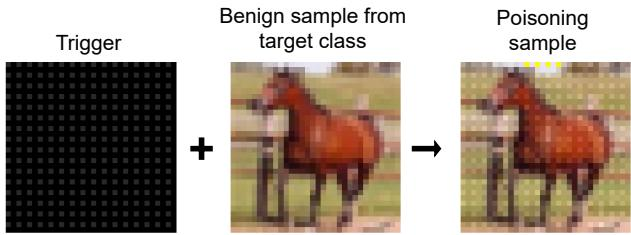
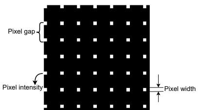
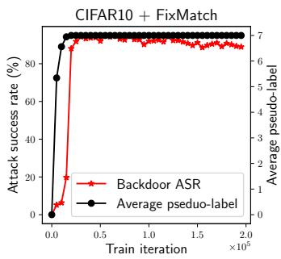
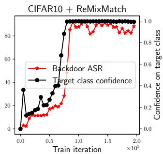
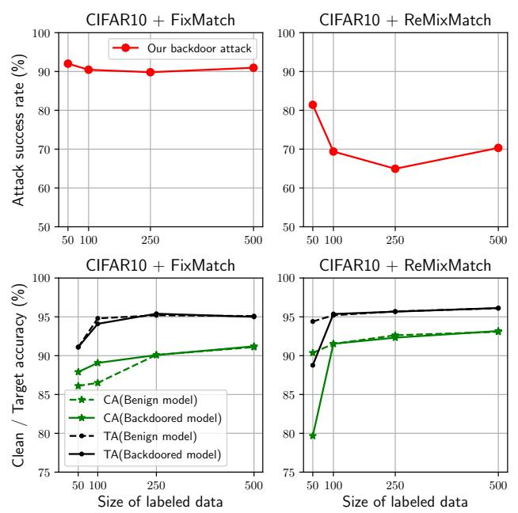
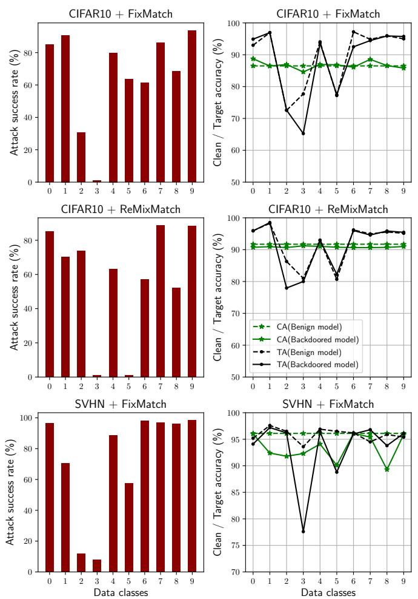
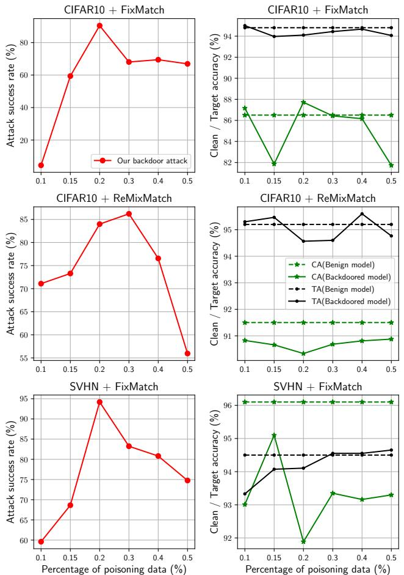

# The Perils of Learning From Unlabeled Data: Backdoor Attacks on Semi-supervised Learning

Virat Shejwalkar UMass Amherst vshejwalkar@cs.umass.edu

Lingjuan Lyu Sony AI lingjuan.lv@sony.com

Amir Houmansadr UMass Amherst amir@cs.umass.edu

## Abstract

Semi-supervised learning (SSL) is gaining popularity as it reduces cost of machine learning (ML) by training high performance models using unlabeled data. In thispaper, we reveal that the key feature of SSL, i.e., learning from (noninspected) unlabeled data, exposes SSL to strong poisoning attacks that can significantly damage its security. Poisoning is a long-standing problem in conventional supervised ML, but we argue that, as SSL relies on non-inspected unlabeled data, poisoning poses a more significant threat to SSL.

We demonstrate this by designing a backdoor poisoning attack on SSL that can be conducted by a weak adversary with no knowledge of the target SSL pipeline. This is unlike prior poisoning attacks on supervised ML that assume strong adversaries with impractical capabilities. We show that by poisoning only 0.2% of the unlabeled training data, our (weak) adversary can successfully cause misclassification on more than 80% of test inputs (when they contain the backdoor trigger). Our attack remains effective across different benchmark datasets and SSL algorithms, and even circumvents state-of-the-art defenses against backdoor attacks. Our work raises significant concerns about the security of SSL in real-world security critical applications.

## 1. Introduction

Machine learning (ML) models perform better with increased amounts of training data [13, 12]. However, conventional supervised ML requires labeling large amounts of training data, an expensive [11] and error prone [31, 26] process that makes it prohibitively expensive, especially with today’s exploding training data sizes.

Semi-supervised learning (SSL) addresses this major challenge by significantly reducing the need for labeled training data: SSL uses a combination of a small, highquality labeled data (expensive data) with a large, lowquality unlabeled data (cheap data) to train models. For instance, the FixMatch [40] SSL algorithm combines only

40 labeled with 50k unlabeled data to achieve a 90% accuracy on CIFAR10. Training SSL involves two loss functions: a supervised loss (e.g., cross-entropy [30] over true labels) on labeled training data and an unsupervised loss (e.g., cross-entropy over pseudo-labels [22]) on unlabeled training data. Different SSL algorithms primarily differ in terms of how they compute their unsupervised losses.

SSL has gained popularity in both academia [52, 46, 47] and industry [40, 41, 3, 2], as recent SSL algorithms offer state-of-the-art performances comparable or even superior to supervised techniques—but with no need of large wellinspected labeled data. For instance, due to their effective use of unlabeled data, with less than 10% of training data labeled, FixMatch [40] outperforms supervised ML.

Unlabeled data enables poisoning by weak adversaries: Multiple researches have demonstrated the data poisoning threat to supervised ML [18, 28, 34, 36, 50, 44, 38]. However, as the training data in supervised ML undergo an extensive and careful inspection, these attacks assume strong adversaries with the knowledge of model parameters [28], training data [44, 4, 29], its distribution [50], or the ML algorithm. Such strong adversaries are important to evaluate worse-case security of a system, but are irrelevant in practice [38]. On the other hand, the key feature of SSL that makes it attractive to real-world applications is its ability to leverage large amounts of—raw, non-inspected—unlabeled data, e.g., the data scraped off the Internet. We argue that the use of non-inspected data by SSL presents a unique threat to its security, as it allows even the most naive adversaries (with no knowledge of training algorithm, data, etc.) to poison SSL models by simply fabricating malicious unlabeled data. Unfortunately, this ostensible threat is largely unexplored in the SSL literature.

To address this gap, in this paper, we take the first step towards understanding this threat by studying the possibility of backdoor attacks against SSL in real-world settings. Backdoor attacks aim to install a backdoor function in the target model, such that the backdoored target model will misclassify any test input to the adversary chosen target class when patched with a specific backdoor trigger, but will correctly classify test inputs without the trigger.

Existing backdoor attacksfail on SSL: There exist numerous backdoor attacks in the literature, however, except one attack—DeHiB [48], all of the prior attacks consider supervised ML. Our preliminary evaluations show that all of the existing state-of-the-art (SOTA) attacks, including DeHiB, completely fail against SSL under our realistic threat model (Section 3.1). Hence, to learn from these failures, we first systematically evaluate five SOTA backdoor attacks from three categories against five SOTA SSL algorithms, under our practical, unlabeled data poisoning threat model.

Our systematic evaluation leads to the following three major lessons that not only guide our attack design, but can be useful building blocks for (future) backdoor attacks against SSL: (1) Backdoor attacks on SSL should be cleanlabel style attacks, i.e., poisoning data should be selected from the distribution of target class $y ^ { t } ;$ (2) Backdoor triggers should be of the same size as the poisoning sample, to circumvent strong augmentations, e.g., cutout [15], that all modern SSL algorithms use; (3) Backdoor triggers should be resistant to noise and with repetitive patterns1 to withstand large amounts of random noises due to strong augmentations, e.g., RandAugment [10], in SSL.

Our SSL-tailored backdoor method: The high-level intuition behind our backdoor attack is as follows. All modern SSL algorithms learn via a self-feedback mechanism, called pseudo-labeling, i.e., if current state of target model $f _ { \theta }$ has high confidence prediction $\tilde { y }$ for an unlabeled sample $\mathbf { x } ,$ then they use $( \mathbf { x } , \tilde { y } )$ as a labeled sample for further training. We exploit pseudo-labeling and design a clean-label attack that poisons unlabeled data only from the distribution of $y ^ { t }$ Our attack patiently waits for $f _ { \theta }$ to correctly label a poisoning sample $( \mathbf { x } + T )$ as $y ^ { t }$ , where $T$ is our pre-determined backdoor trigger. As $f _ { \theta }$ trains further on $( ( \mathbf { x } + T ) , y ^ { t } )$ , our attack forces $f _ { \theta }$ to associate features of our simple trigger $T ,$ instead of the complex features of $\mathbf { x } ,$ with $y ^ { t }$ , thereby installing the backdoor in the target model.

Note that, we consider the most challenging setting for designing attacks with the least capable and knowledgeable data poisoning adversary. Generally, trigger generation for data poisoning backdoor attacks is formalized as a bi-level optimization problem [29], however such attacks are wellknown to be very expensive, and yet ineffective [29, 38]. Instead, our lessons lead us to a simple yet effective static, repetitive grid pattern backdoor trigger (Figure 2).

Evaluations: We demonstrate the strength of our attack via an extensive evaluation against five SOTA SSL and one supervised ML algorithm, using four benchmark image classification tasks commonly used in the SSL literature. We note that our attack significantly outperforms prior attacks from both SSL and supervised ML literature.

We measure success of our attacks using ASR metric: ASR measures the % of test inputs from non-target classes that the backdoored model classifies to the target class when patched with backdoor trigger. For the most combinations of algorithms and datasets, our attacks achieve high attack success rates (ASRs) (>80%), while poisoning just 0.2% of entire training data. For instance, our attacks have more than 90% ASR against CIFAR100 and more than 80% ASR against CIFAR10. For SVHN and STL10, our attack has more than 80% ASR with two exceptions each. While, under our practical threat model, DeHib attack achieves 0% ASR even with 20 more poisoning data. Through a systematic experiment design in Section 5.1.4, we show that our intuition aligns with the dynamics of our attacks and justify their strength. Our attack is highly stealthy, as (1) according to $L _ { \infty }$ -norm metric commonly used [50] for stealth measurement, it minimally perturbs the poisoning data and (2) it produces backdoored models which have high accuracy (close to non-backdoored models) on non-backdoored test inputs. We perform comprehensive ablation study (Section 5.2) to demonstrate the high efficacy of our attacks as we vary (1) size of labeled data, (2) backdoor target class, and (3) size of poisoning data.

Finally, we show that our attack remains highly effective even when SSL is paired individually with five SOTA defenses against backdoor attacks that are agnostic to learning algorithms. To defend against such unlabeled data poisoning, we argue for SSL to depart from its philosophy of not inspecting unlabeled training data, and instead, pre-process/inspect the unlabeled data and/or design SSL algorithms that are robust-by-design to such poisoning.

## 2. Preliminaries and Related Work

## 2.1. Semi-supervised Learning (SSL)

Supervised ML requires completely labeled data, $D ^ { l }$ which can be prohibitively expensive due to expensive manual labelling involved. SSL reduces this cost by using very few labeled $D ^ { l }$ and plenty of unlabeled data $D ^ { u }$ . SSL uses a convex combination of a supervised loss $\mathcal { L } _ { l }$ on $D ^ { l }$ and an unsupervised loss $\mathcal { L } _ { u }$ on $D ^ { u }$ . Modern state-of-the-art SSL algorithms rely on two key building blocks: pseudolabeling [22] and consistency regularization [14, 35, 21].

Pseudo-labeling uses the current model, $f _ { \theta } ,$ , to obtain artificial pseudo-labels for $D ^ { u }$ and only retains the data on which $f _ { \theta }$ has high confidence. Assume $q _ { b } ~ = ~ f _ { \theta } ( y | u _ { b } )$ are the predictions of $f _ { \theta }$ on the batch $u _ { b }$ of unlabeled data. Then pseudo-labeling loss can be formalized as: $\begin{array} { r } { \frac { 1 } { | u _ { b } | } \sum _ { b = 1 } ^ { | u _ { b } | } \mathbb { 1 } ( \mathsf { m a x } ( q _ { b } ) \geq \tau ) H ( \hat { q } _ { b } , q _ { b } ) ; \hat { q } _ { b } = \mathsf { a r g m a x } ( q _ { b } ) } \end{array}$ $H ( . )$ is cross-entropy and τ is confidence threshold.

Consistency regularization trains $f _ { \theta }$ to output similar predictions for perturbed versions of the same input. It uses stochastic augmentations $a ( \mathbf { x } _ { u } )$ to perturb an unlabeled sample $\mathbf { x } _ { u }$ and forces $f _ { \theta }$ to have similar outputs on multiple $a ( \mathbf { x } _ { u } ) ^ { \prime }$ s using the following loss: $\begin{array} { r } { \sum _ { b = 1 } ^ { | u _ { b } | } \| f _ { \theta } ( y | a ( u _ { b } ) ) - } \end{array}$ $f _ { \theta } ( y | a ( u _ { b } ) ) \rVert _ { 2 } ^ { 2 }$ , where $a ( . )$ produces different output every time it is applied to a batch $u _ { b }$ of unlabeled data. Below we describe the five SOTA SSL algorithms we consider in this work.

(1) MixMatch [3] combines various prior semi-supervised learning techniques. For an unlabeled sample, MixMatch generates K weakly augmented versions of the unlabeled sample, computes outputs of the current model $f _ { \theta }$ for the K versions, averages them, and sharpens the average prediction by raising all its probabilities by a power of 1/temperature and re-normalizing; it uses the sharpened prediction as the label of the unlabeled sample. Finally, it uses mixup regularization [53] on the combination of labeled and unlabeled data and trains the model using cross-entropy loss.

(2) Unsupervised data augmentation (UDA) [46] shows significant improvements in semi-supervised performances by just replacing the simple weak augmentations of MixMatch with a strong augmentation called Randaugment [10]. In an iteration, Randaugment randomly selects a few augmentations from a large set of augmentations and applies them to images.

(3) ReMixMatch [3] builds on MixMatch by making multiple modifications, including 1) it replaces the simple weak augmentation in MixMatch with Autoagument [9], 2) it uses augmentation anchoring to improve consistency regularization, i.e., it uses the prediction on a weakly augmented version of unlabeled sample as the target prediction for a strongly augmented version of the unlabeled sample, and 3) it uses distribution alignment, i.e., it normalizes the new model predictions on unlabeled data using the running average of model predictions on unlabeled data. This significantly boosts the performance of resulting model.

(4) FixMatch [40] simplifies the complex ReMixMatch algorithm by proposing to use a combination of Pseudolabeling and consistency regularization based on augmentation anchoring (discussed above). FixMatch significantly improves semi-supervised algorithms, especially in the low labeled data regimes.

(5) FlexMatch [52] proposes curriculum pseudo labelling (CPL) approach to leverage unlabeled data according to model’s learning status. The main idea behind CPL is to flexibly adjust the thresholds used for pseudo-labeling for different classes at each training iteration in order to select more information unlabeled data and their pseudo-labels. CPL can be combined with other algorithms, e.g., UDA.

## 2.2. Backdoor Attacks

A backdoor adversary aims to implant a backdoorfunctionality into a target model. That is, given an input $( { \bf x } , y ^ { * } )$ with true label $y ^ { * }$ , the backdoored target model $f _ { \theta } ^ { b }$ should output an adversary-desired backdoor target label $y ^ { t }$ for the input patched with a pre-specified backdoor trigger $T .$ but it should output the correct label for the benign input, i.e., $f _ { \theta } ^ { b } ( { \bf x } + T ) \mapsto y ^ { t }$ and $f _ { \theta } ^ { b } ( \mathbf { x } ) \mapsto \ y ^ { * }$ There are two major types of backdoor attacks: (1) dirty-label attacks [19, 7, 36, 51, 33, 23] that poison both the features x and labels $y ^ { * }$ of benign, labeled data to obtain poisoning data $D ^ { p }$ . (2) On the other hand, clean-label attacks obtain $D ^ { p }$ by poisoning only the features x of benign data.

Backdoor attacks on $S S L ,$ unfortunately, have not received significant attention from the scientific community. [48, 49, 16] study backdoor attacks against SSL. However, all of these attacks assume access to $D ^ { l }$ , the labeled training data of SSL. This assumption renders their applicability questionable in realistic settings. For clarity of presentation, we discuss the details of these attacks in Appendix A.1, where we demonstrate (Table 2) and justify why these attacks fail to backdoor SSL.

## 3. Our Backdoor Attack Methodology

We first discuss threat model of our attack, followed by our intuition behind backdoor attacks on SSL. Next, we note that, effectively backdooring semi-supervised learning (SSL) does not need a new backdoor attack, but requires careful adoption of existing backdoor attacks. We discuss three major lessons learned from systematically evaluating SOTA attacks under our threat model (Section 3.1). Finally, we detail our SOTA backdoor attack based on our intuition and the lessons learned.

## 3.1. Threat Model

We consider a victim model trainer who collects data from multiple, potentially untrusted sources to train a ML model using SSL for a classification task with C classes.

Adversary’s goal: A backdoor adversary aims to install a backdoor function in the victim’s target model. We denote the models without (benign) and with backdoor by $f _ { \theta } ^ { b }$ and $f _ { \theta } ,$ , respectively. Adversary’s backdoor goal is to force $f _ { \theta } ^ { b }$ to incorrectly classify all the test inputs from non-target classes to the adversary-desired target class $y ^ { t } ,$ , when they are patched with a pre-specified backdoor trigger, T. Adversary’s stealth goal aims that $f _ { \theta } ^ { b }$ should correctly classify all the benign test inputs, i.e., any input without T.

Adversary’s knowledge: As discussed in Section 1, we consider the most naive, real-world adversary with minimum knowledge of the SSL pipeline. More specifically, we assume that the adversary has no knowledge of the labeled or unlabeled training data and does not posses any data from true distribution; they just know the classification task, i.e., CIFAR10 or SVHN. Our adversary knows the details of the target SSL algorithm, but does not know model architecture, $\mathrm { e . g . }$ ., ResNet or $\mathrm { { V G G } , }$ , i.e., our attacks are model architecture agnostic.

Adversary’s capabilities: Due to our emphasis on practicality of our threat model, we consider a data poisoning adversary [38]. Specifically, our adversary can poison only the unlabeled data of SSL pipeline, and cannot poison or even access the model, code or the labeled data of SSL.

## 3.2. Intuition behind our backdoor attack

For brevity, we discuss our intuition for FixMatch [40], but it applies to any SSL algorithms that use pseudolabeling and consistency regularization (Section 2.1).

As explained in Section 2.1, FixMatch trains parameters θ to learn a function $f _ { \theta }$ from the labeled data $D ^ { l }$ and assigns a pseudo-label $\hat { y }$ to an unlabeled sample $\mathbf { x } \in D ^ { u }$ . Then it further trains θ using $( \mathbf { x } , \hat { y } )$ to improve $f _ { \theta }$ . As the training progresses, the confidence of $f _ { \theta }$ on the correct label of $\mathbf { x }$ increases which leads to better pseudo-labeling of $D ^ { u }$ and further improvements in the accuracy of $f _ { \theta }$ . In other words, FixMatch learns via a self-feedback mechanism.

Recall that, our realistic data poisoning adversary cannot alter either the SSL training pipeline or the well-inspected labeled training data $D ^ { l }$ . Now, the first part of our intuition is that our attacks should be of clean-label type, $\mathrm { i . e . }$ we select unlabeled data $X ^ { y ^ { t } }$ from the target class, $y ^ { t }$ and patch it with backdoor trigger $T$ to obtain $X ^ { p }$ , i.e., $X ^ { p } = X ^ { y ^ { t } } + T$ ; next section demonstrates the necessity of this condition. The second part of our intuition is that in initial part of training, FixMatch will assign the desired pseudo-labels $y ^ { t }$ to $X ^ { p }$ due to the original features $X ^ { y ^ { t } }$ of $X ^ { p }$ . However, due to the presence of backdoor trigger, $T ,$ on all $X ^ { p } s$ , the model will be forced to eventually learn a much simpler task of associating $T$ to $y ^ { t }$

To further understand this, consider three benign samples $\mathbf { X } _ { i \in \{ 1 , 2 , 3 \} }$ with target class $y ^ { t }$ as their true label. The adversary adds a trigger $T$ to these samples to obtain $X ^ { p } { \mathrm { : } }$ $\{ { \bf x } _ { i \in \{ 1 , 2 , 3 \} } + T \}$ and inserts $X ^ { p }$ in $D ^ { u }$ . Note that, initially during training, FixMatch learns the association $f _ { \theta } : \mathcal { X } \mapsto$ $\mathcal { V }$ between feature and label spaces only through $D ^ { l }$ . And as our threat model assumes that $D ^ { l }$ is benign (not poisoned), initially FixMatch focuses only on the benign features of $X ^ { p }$ , i.e., on $\mathbf { X } _ { i \in \{ 1 , 2 , 3 \} }$ and assigns the correct label $y ^ { t }$ to all $X ^ { p }$ samples. This in turn forces FixMatch to learn from $( \mathbf { x } _ { i \in \{ 1 , 2 , 3 \} } + T , y ^ { t } )$ . As $T$ is present in all $X ^ { p }$ samples, FixMatch incorrectly learns the simpler task of associating the static trigger $T$ with $y ^ { t }$ , instead of the difficult task of associating the complex and dynamic benign features of $\mathbf { X } _ { i \in \{ 1 , 2 , 3 \} }$ with $y ^ { t }$ ; we very our intuition in Section 5.1.4.

## 3.3. Lessons from systematic evaluation of existing backdoor attacks against SSL

In Table 1, we categorize existing SOTA attacks on supervised ML and SSL in three types: dirty label, clean label small trigger and clean label adversarial samples. We evaluate representative attacks from each category and provide justification for their failure against SSL, and the corresponding lesson that will guide future attack designs on SSL. Due to space limit, we present the key lessons here and defer detailed discussions to Appendix A.

Figure 1: Our backdoor trigger and a poisoning sample.  
  
Figure $2 \colon$ Our backdoor trigger has three parameters: pixel intensity α, pixel gap $^ { g , }$ and pixel width w. For presentation clarity, we use high pixel intensity here, but in experiments we use low intensities to ensure attack stealth.

Lesson-1: Backdoor attacks against semi-supervised learning should be clean-label type, i.e., the poisoning samples should be from the backdoor target class. Without this condition, model will be forced to learn to associate $T$ with different classes (i.e., original classes of poisoning data $X ^ { p } )$ , and effectively, model will simply ignore T.

Lesson-2: The trigger should have same size as the entire sample (images in our case), to ensure that all the augmented instances of a poisoning sample contain majority of the trigger. This is necessary due to augmentations in SSL that occlude part of an image, e.g., cutout and cutmix, which all the modern SOTA SSL algorithms use.

Lesson-3: The trigger should be noise-resistant and with a repetitive pattern.2 This is necessary, again, to circumvent the occluding augmentations described above.

We believe that the above lessons give the minimum constraints to design backdoor attacks on SSL. But, they need not be exhaustive and may need modifications, e.g., based on different threat models and SSL algorithms.

## 3.4. Our State-of-the-art backdoor attack

Based on our intuition and the three lessons detailed above, we develop a clean-label style backdoor attack using a specific static trigger pattern. Figure 1 depicts our static backdoor trigger and a corresponding poisoning image; we present more images for CIFAR, SVHN, and STL10 datasets in Figures 14, 15, and 16 in Appendix C. Our backdoor trigger pattern has three parameters: intensity α, gap g, and width w. α is the intensity of the bright pixels in the trigger and intensity of the rest of the pixel is 0; g is the distance between two adjacent set of bright pixels and w is the width of each set of bright pixels. Note that the size of our trigger is the same as that of the sample and has a fairly repetitive pattern, hence it satisfies both Lessons-2 and 3.

Table 1: The left column shows types of backdoor attacks based on specific characteristics, middle column lists existing attacks of each type. Right-most column presents lessons we learn from evaluating one/two representative attacks (in bold) of each type.
<table><tr><td rowspan=1 colspan=1>Attack characteristic/ type</td><td rowspan=1 colspan=1>Existing attacks of given type</td><td rowspan=1 colspan=1>Lesson from evaluations</td></tr><tr><td rowspan=1 colspan=1>Dirty label</td><td rowspan=1 colspan=1>DeHiB [48], DL-Badnets [18]DL-Blend [7], Facehack [36]</td><td rowspan=1 colspan=1>Attack should be a clean-label attack, i.e.,poisoning samples should be frombackdoor target class.</td></tr><tr><td rowspan=1 colspan=1>Clean-label small trigger</td><td rowspan=1 colspan=1>CL-Badnets [50], CL-Blend [7]</td><td rowspan=1 colspan=1>Trigger should span the entiresample/image to avoid cropping/coveringby strong augmentations.</td></tr><tr><td rowspan=1 colspan=1>Clean-label adversarial samples</td><td rowspan=1 colspan=1>Narcissus [50], Label consistent [44],non-repeating trigger patterns,HTBA [34], SAA [42],Embedding [54]</td><td rowspan=1 colspan=1>Trigger should be noise-resistant and itspattern should be repetitive so that even apart of trigger can install a backdoor.</td></tr></table>

Table 2: Impacts of existing backdoor attacks (Section 2.2) on various semi-supervised algorithms for CIFAR10 data. We poison 0.2% (100 samples) of all the training data. DeHib∗ is the original attack with the knowledge of labeled training data Dl while DeHib is the attack without the knowledge of Dl.
<table><tr><td rowspan=1 colspan=1>Algorithm</td><td rowspan=1 colspan=1>DeHiB*ASR (%)</td><td rowspan=1 colspan=1>DeHiBASR (%)</td><td rowspan=1 colspan=1>CL-BadnetsASR (%)</td><td rowspan=1 colspan=1>LCASR (%)</td><td rowspan=1 colspan=1>NarcissusASR (%)</td></tr><tr><td rowspan=1 colspan=1>Mixmatch [3]</td><td rowspan=1 colspan=1>22.0</td><td rowspan=1 colspan=1>1.0</td><td rowspan=1 colspan=1>9.1</td><td rowspan=1 colspan=1>1.1</td><td rowspan=1 colspan=1>2.2</td></tr><tr><td rowspan=1 colspan=1>Remixmatch [2]</td><td rowspan=1 colspan=1>10.9</td><td rowspan=1 colspan=1>0.9</td><td rowspan=1 colspan=1>0.0</td><td rowspan=1 colspan=1>0.0</td><td rowspan=1 colspan=1>0.0</td></tr><tr><td rowspan=1 colspan=1>UDA [46]</td><td rowspan=1 colspan=1>21.2</td><td rowspan=1 colspan=1>1.2</td><td rowspan=1 colspan=1>5.1</td><td rowspan=1 colspan=1>0.0</td><td rowspan=1 colspan=1>0.0</td></tr><tr><td rowspan=1 colspan=1>Fixmatch [40]</td><td rowspan=1 colspan=1>35.8</td><td rowspan=1 colspan=1>0.9</td><td rowspan=1 colspan=1>10.2</td><td rowspan=1 colspan=1>0.1</td><td rowspan=1 colspan=1>1.3</td></tr><tr><td rowspan=1 colspan=1>Flexmatch [52]</td><td rowspan=1 colspan=1>16.9</td><td rowspan=1 colspan=1>1.2</td><td rowspan=1 colspan=1>9.1</td><td rowspan=1 colspan=1>0.1</td><td rowspan=1 colspan=1>1.1</td></tr></table>

To summarize our attack: we select a set of samples from the target class (to satisfy Lesson-1, poison them by adding the trigger to them, and inject these poisoned samples into the unlabeled data. As we will show in Section 5.1.1 (Table 3), with poisoning just 0.2% of the entire training data, this simple backdoor method injects backdoors in SSL models with close to 90% accuracy.

Finally, it is worth mentioning that, there are many possible triggers that follow aforementioned lessons, but choice of our specific trigger is based on various triggers patterns we investigated in our initial explorations (Figure 10). Furthermore, the choice of our simple yet effective backdoor attack method is a result of an extensive experimentation with various attack methods (and not just trigger patterns). In Appendix C.1, we discuss alternate attack methods we explored but found them unsuccessful at backdooring SSL.

## 4. Experimental setup

We evaluate our backdoor attacks using four datasets (CIFAR10, SVHN, CIFAR100 and STL10) commonly used to benchmark semi-supervised algorithms. Due to space limits, we defer the details of datasets, model architectures and hyperparameters to Appendix B.

## 4.1. Performance metrics

Clean accuracy (CA) [18] measures the accuracy of a model on clean test data without any backdoor trigger T. Backdoored models should have high CA to ensure that the backdoor attack does not impact their benign functionality to ensure the attack stealth.

Backdoor attack success rate (ASR) [18] measures the accuracy of a model on the backdoored test datafrom the nontarget classes patched with T. For a successful backdoor attack, backdoored model should have high ASR.

Target class accuracy (TA) [50] measures the accuracy of the clean test data from the target backdoor class which does not contain any T. For a backdoored model, TA should be high to ensure the attack stealth.

## 5. Empirical Results

## 5.1. Our attacks effectively backdoor SSL

In this section, we demonstrate the superiority of our backdoor attacks over various baseline attacks in terms of three metrics from Section 4.1. Note that, we poison at most 0.2% of the entire unlabeled data, which is significantly lower than what prior attacks use, e.g., 10% in De-HiB [48, 49]. Backdoor injection at such low poisoning percentages is extremely challenging as we aim to backdoor the entire test data and not just a single sample as in [5].

## 5.1.1 High attack success rate (ASR)

In Table 3, “p%” column shows poisoning percentage and ASR columns show the results. Our backdoor attacks outperform all the baseline backdoor attacks by very large margins for all the combinations of datasets and algorithms. More specifically, for various settings, ASRs of our attacks are at least 80% more than ASRs of Narcissus and DeHiB attacks, while they are at least 60% more than clean label (CL)-Badnets attacks. Due to space limits, we discuss all the baseline attacks in Appendix A. For UDA + CIFAR10, ASR is 81.5% with poisoning just a 0.1% of training data.

Table 3: Impacts of backdoor attacks on various semi-supervised (SSL) algorithms (Section 2.1) under the unlabeled data poisoning threat model (Section 3.1). For all datasets, our attack (Section 3.4) significantly outperforms the baseline backdoor attack (DeHiB) against SSL and various clean-label attacks against supervised learning (Section 2.2). Best results are in bold.
<table><tr><td rowspan=7 colspan=1>CIAIO0</td><td rowspan=2 colspan=1>Algorithm</td><td rowspan=1 colspan=1></td><td rowspan=1 colspan=1>No attack</td><td rowspan=1 colspan=1></td><td rowspan=1 colspan=1> $\mathrm { p } \%$ </td><td rowspan=1 colspan=1>CL</td><td rowspan=1 colspan=2>-Badnets</td><td rowspan=1 colspan=1></td><td rowspan=1 colspan=2>Narcissus</td><td rowspan=1 colspan=3>DeHiB</td><td rowspan=1 colspan=4>Our attack</td></tr><tr><td rowspan=1 colspan=1>CA</td><td rowspan=1 colspan=1>ASR</td><td rowspan=1 colspan=1>TA</td><td rowspan=1 colspan=1></td><td rowspan=1 colspan=1>CA</td><td rowspan=1 colspan=1>ASR</td><td rowspan=1 colspan=1>TA</td><td rowspan=1 colspan=1>CA</td><td rowspan=1 colspan=1>ASR</td><td rowspan=1 colspan=1>TA</td><td rowspan=1 colspan=1>CA</td><td rowspan=1 colspan=1>ASR</td><td rowspan=1 colspan=1>TA</td><td rowspan=1 colspan=1>α</td><td rowspan=1 colspan=1>CA</td><td rowspan=1 colspan=1>ASR</td><td rowspan=1 colspan=1>TA</td></tr><tr><td rowspan=1 colspan=1>Mixmatch [3]</td><td rowspan=1 colspan=1>92.2</td><td rowspan=1 colspan=1>0.0</td><td rowspan=1 colspan=1>93.5</td><td rowspan=1 colspan=1>0.2</td><td rowspan=1 colspan=1>92.1</td><td rowspan=1 colspan=1>15.3</td><td rowspan=1 colspan=1>94.2</td><td rowspan=1 colspan=1>91.1</td><td rowspan=1 colspan=1>0.0</td><td rowspan=1 colspan=1>94.9</td><td rowspan=1 colspan=1>91.1</td><td rowspan=1 colspan=1>1.4</td><td rowspan=1 colspan=1>92.1</td><td rowspan=1 colspan=1>30</td><td rowspan=1 colspan=1>92.2</td><td rowspan=1 colspan=1>96.8</td><td rowspan=1 colspan=1>94.6</td></tr><tr><td rowspan=1 colspan=1>Remixmatch [2]</td><td rowspan=1 colspan=1>91.3</td><td rowspan=1 colspan=1>0.0</td><td rowspan=1 colspan=1>94.9</td><td rowspan=1 colspan=1>0.2</td><td rowspan=1 colspan=1>91.0</td><td rowspan=1 colspan=1>1.1</td><td rowspan=1 colspan=1>95.0</td><td rowspan=1 colspan=1>91.3</td><td rowspan=1 colspan=1>0.0</td><td rowspan=1 colspan=1>95.9</td><td rowspan=1 colspan=1>90.8</td><td rowspan=1 colspan=1>2.1</td><td rowspan=1 colspan=1>94.8</td><td rowspan=1 colspan=1>30</td><td rowspan=1 colspan=1>90.6</td><td rowspan=1 colspan=1>84.3</td><td rowspan=1 colspan=1>94.5</td></tr><tr><td rowspan=1 colspan=1>UDA [46]</td><td rowspan=1 colspan=1>89.5</td><td rowspan=1 colspan=1>0.0</td><td rowspan=1 colspan=1>97.4</td><td rowspan=1 colspan=1>0.1</td><td rowspan=1 colspan=1>88.1</td><td rowspan=1 colspan=1>8.2</td><td rowspan=1 colspan=1>96.9</td><td rowspan=1 colspan=1>89.1</td><td rowspan=1 colspan=1>1.0</td><td rowspan=1 colspan=1>98.6</td><td rowspan=1 colspan=1>89.1</td><td rowspan=1 colspan=1>1.1</td><td rowspan=1 colspan=1>97.2</td><td rowspan=1 colspan=1>20</td><td rowspan=1 colspan=1>89.6</td><td rowspan=1 colspan=1>81.5</td><td rowspan=1 colspan=1>96.7</td></tr><tr><td rowspan=1 colspan=1>Fixmatch [40]</td><td rowspan=1 colspan=1>91.1</td><td rowspan=1 colspan=1>0.0</td><td rowspan=1 colspan=1>97.5</td><td rowspan=1 colspan=1>0.2</td><td rowspan=1 colspan=1>91.9</td><td rowspan=1 colspan=1>10.1</td><td rowspan=1 colspan=1>97.8</td><td rowspan=1 colspan=1>91.2</td><td rowspan=1 colspan=1>0.0</td><td rowspan=1 colspan=1>98.0</td><td rowspan=1 colspan=1>90.9</td><td rowspan=1 colspan=1>1.1</td><td rowspan=1 colspan=1>95.8</td><td rowspan=1 colspan=1>20</td><td rowspan=1 colspan=1>93.5</td><td rowspan=1 colspan=1>88.1</td><td rowspan=1 colspan=1>97.6</td></tr><tr><td rowspan=1 colspan=1>Flexmatch [52]</td><td rowspan=1 colspan=1>94.3</td><td rowspan=1 colspan=1>0.0</td><td rowspan=1 colspan=1>97.1</td><td rowspan=1 colspan=1>0.2</td><td rowspan=1 colspan=1>93.9</td><td rowspan=1 colspan=1>6.4</td><td rowspan=1 colspan=1>97.0</td><td rowspan=1 colspan=1>94.1</td><td rowspan=1 colspan=1>0.0</td><td rowspan=1 colspan=1>98.5</td><td rowspan=1 colspan=1>94.2</td><td rowspan=1 colspan=1>2.3</td><td rowspan=1 colspan=1>97.0</td><td rowspan=1 colspan=1>20</td><td rowspan=1 colspan=1>93.8</td><td rowspan=1 colspan=1>87.9</td><td rowspan=1 colspan=1>96.9</td></tr><tr><td rowspan=4 colspan=1>NHAS</td><td rowspan=2 colspan=1>Algorithm</td><td rowspan=1 colspan=1></td><td rowspan=1 colspan=1>No attack</td><td rowspan=1 colspan=1></td><td rowspan=1 colspan=1>p%</td><td rowspan=1 colspan=1>CL</td><td rowspan=1 colspan=2>-Badnets</td><td rowspan=1 colspan=1>N</td><td rowspan=1 colspan=2>arcissus</td><td rowspan=1 colspan=1></td><td rowspan=1 colspan=1>DeHiB</td><td rowspan=1 colspan=1></td><td rowspan=1 colspan=1></td><td rowspan=1 colspan=2>Our attack</td><td rowspan=1 colspan=1></td></tr><tr><td rowspan=1 colspan=1>CA</td><td rowspan=1 colspan=1>ASR</td><td rowspan=1 colspan=1>TA</td><td rowspan=1 colspan=1></td><td rowspan=1 colspan=1>CA</td><td rowspan=1 colspan=1>ASR</td><td rowspan=1 colspan=1>TA</td><td rowspan=1 colspan=1>CA</td><td rowspan=1 colspan=1>ASR</td><td rowspan=1 colspan=1>TA</td><td rowspan=1 colspan=1>CA</td><td rowspan=1 colspan=1>ASR</td><td rowspan=1 colspan=1>TA</td><td rowspan=1 colspan=1>α</td><td rowspan=1 colspan=1>CA</td><td rowspan=1 colspan=1>ASR</td><td rowspan=1 colspan=1>TA</td></tr><tr><td rowspan=1 colspan=1>Mixmatch [3]</td><td rowspan=1 colspan=1>94.4</td><td rowspan=1 colspan=1>0.0</td><td rowspan=1 colspan=1>95.4</td><td rowspan=1 colspan=1>0.2</td><td rowspan=1 colspan=1>94.5</td><td rowspan=1 colspan=1>5.4</td><td rowspan=1 colspan=1>93.8</td><td rowspan=1 colspan=1>94.5</td><td rowspan=1 colspan=1>0.0</td><td rowspan=1 colspan=1>96.1</td><td rowspan=1 colspan=1>94.4</td><td rowspan=1 colspan=1>3.2</td><td rowspan=1 colspan=1>95.0</td><td rowspan=1 colspan=1>30</td><td rowspan=1 colspan=1>93.2</td><td rowspan=1 colspan=1>83.7</td><td rowspan=1 colspan=1>95.8</td></tr><tr><td rowspan=1 colspan=1>Remixmatch [2]</td><td rowspan=1 colspan=1>87.6</td><td rowspan=1 colspan=1>0.0</td><td rowspan=1 colspan=1>95.5</td><td rowspan=1 colspan=1>0.2</td><td rowspan=1 colspan=1>88.0</td><td rowspan=1 colspan=1>1.2</td><td rowspan=1 colspan=1>95.4</td><td rowspan=1 colspan=1>87.1</td><td rowspan=1 colspan=1>0.0</td><td rowspan=1 colspan=1>95.9</td><td rowspan=1 colspan=1>88.1</td><td rowspan=1 colspan=1>1.7</td><td rowspan=1 colspan=1>95.9</td><td rowspan=1 colspan=1>30</td><td rowspan=1 colspan=1>87.6</td><td rowspan=1 colspan=1>51.1</td><td rowspan=1 colspan=1>95.4</td></tr><tr><td rowspan=3 colspan=1></td><td rowspan=1 colspan=1>UDA [46]</td><td rowspan=1 colspan=1>95.0</td><td rowspan=1 colspan=1>0.0</td><td rowspan=1 colspan=1>96.3</td><td rowspan=1 colspan=1>0.2</td><td rowspan=1 colspan=1>94.9</td><td rowspan=1 colspan=1>1.1</td><td rowspan=1 colspan=1>96.0</td><td rowspan=1 colspan=1>94.2</td><td rowspan=1 colspan=1>0.0</td><td rowspan=1 colspan=1>96.0</td><td rowspan=1 colspan=1>94.8</td><td rowspan=1 colspan=1>1.1</td><td rowspan=1 colspan=1>96.6</td><td rowspan=1 colspan=1>20</td><td rowspan=1 colspan=1>94.9</td><td rowspan=1 colspan=1>95.5</td><td rowspan=1 colspan=1>95.8</td></tr><tr><td rowspan=1 colspan=1>Fixmatch [40]</td><td rowspan=1 colspan=1>94.5</td><td rowspan=1 colspan=1>0.0</td><td rowspan=1 colspan=1>96.3</td><td rowspan=1 colspan=1>0.2</td><td rowspan=1 colspan=1>94.9</td><td rowspan=1 colspan=1>3.1</td><td rowspan=1 colspan=1>97.1</td><td rowspan=1 colspan=1>94.2</td><td rowspan=1 colspan=1>0.0</td><td rowspan=1 colspan=1>97.0</td><td rowspan=1 colspan=1>94.8</td><td rowspan=1 colspan=1>3.2</td><td rowspan=1 colspan=1>96.4</td><td rowspan=1 colspan=1>20</td><td rowspan=1 colspan=1>94.5</td><td rowspan=1 colspan=1>97.1</td><td rowspan=1 colspan=1>93.9</td></tr><tr><td rowspan=1 colspan=1>Flexmatch [52]</td><td rowspan=1 colspan=1>85.4</td><td rowspan=1 colspan=1>0.0</td><td rowspan=1 colspan=1>96.3</td><td rowspan=1 colspan=1>0.2</td><td rowspan=1 colspan=1>88.9</td><td rowspan=1 colspan=1>1.2</td><td rowspan=1 colspan=1>96.9</td><td rowspan=1 colspan=1>86.1</td><td rowspan=1 colspan=1>0.0</td><td rowspan=1 colspan=1>96.7</td><td rowspan=1 colspan=1>86.8</td><td rowspan=1 colspan=1>2.2</td><td rowspan=1 colspan=1>96.4</td><td rowspan=1 colspan=1>20</td><td rowspan=1 colspan=1>83.9</td><td rowspan=1 colspan=1>50.1</td><td rowspan=1 colspan=1>96.6</td></tr><tr><td rowspan=2 colspan=1></td><td rowspan=2 colspan=1>Algorithm</td><td rowspan=1 colspan=1>No</td><td rowspan=1 colspan=1>attack</td><td rowspan=1 colspan=1></td><td rowspan=1 colspan=1></td><td rowspan=1 colspan=1>CL</td><td rowspan=1 colspan=1>-Badnet</td><td rowspan=1 colspan=1>s</td><td rowspan=1 colspan=1>N</td><td rowspan=1 colspan=1>arcissus</td><td rowspan=1 colspan=1></td><td rowspan=1 colspan=1></td><td rowspan=1 colspan=1>DeHiB</td><td rowspan=1 colspan=1></td><td rowspan=1 colspan=1></td><td rowspan=1 colspan=1>Our</td><td rowspan=1 colspan=1>attack</td><td rowspan=1 colspan=1></td></tr><tr><td rowspan=1 colspan=1>CA</td><td rowspan=1 colspan=1>ASR</td><td rowspan=1 colspan=1>TA</td><td rowspan=1 colspan=1>P%</td><td rowspan=1 colspan=1>CA</td><td rowspan=1 colspan=1>ASR</td><td rowspan=1 colspan=1>TA</td><td rowspan=1 colspan=1>CA</td><td rowspan=1 colspan=1>ASR</td><td rowspan=1 colspan=1>TA</td><td rowspan=1 colspan=1>CA</td><td rowspan=1 colspan=1>ASR</td><td rowspan=1 colspan=1>TA</td><td rowspan=1 colspan=1>α</td><td rowspan=1 colspan=1>CA</td><td rowspan=1 colspan=1>ASR</td><td rowspan=1 colspan=1>TA</td></tr><tr><td rowspan=2 colspan=1>ST710</td><td rowspan=1 colspan=1>Mixmatch [3]</td><td rowspan=1 colspan=1>86.7</td><td rowspan=1 colspan=1>0.0</td><td rowspan=1 colspan=1>86.3</td><td rowspan=1 colspan=1>0.2</td><td rowspan=1 colspan=1>86.3</td><td rowspan=1 colspan=1>9.2</td><td rowspan=1 colspan=1>86.7</td><td rowspan=1 colspan=1>87.1</td><td rowspan=1 colspan=1>1.1</td><td rowspan=1 colspan=1>87.0</td><td rowspan=1 colspan=1>86.1</td><td rowspan=1 colspan=1>1.1</td><td rowspan=1 colspan=1>86.1</td><td rowspan=1 colspan=1>40</td><td rowspan=1 colspan=1>86.4</td><td rowspan=1 colspan=1>86.2</td><td rowspan=1 colspan=1>87.9</td></tr><tr><td rowspan=1 colspan=1>Remixmatch [2]</td><td rowspan=1 colspan=1>91.7</td><td rowspan=1 colspan=1>0.0</td><td rowspan=1 colspan=1>90.6</td><td rowspan=1 colspan=1>0.2</td><td rowspan=1 colspan=1>91.2</td><td rowspan=1 colspan=1>4.1</td><td rowspan=1 colspan=1>90.6</td><td rowspan=1 colspan=1>91.9</td><td rowspan=1 colspan=1>0.9</td><td rowspan=1 colspan=1>91.1</td><td rowspan=1 colspan=1>91.3</td><td rowspan=1 colspan=1>1.1</td><td rowspan=1 colspan=1>91.0</td><td rowspan=1 colspan=1>40</td><td rowspan=1 colspan=1>91.2</td><td rowspan=1 colspan=1>82.2</td><td rowspan=1 colspan=1>91.4</td></tr><tr><td rowspan=1 colspan=1>ST</td><td rowspan=1 colspan=1>UDA [46]</td><td rowspan=1 colspan=1>88.1</td><td rowspan=1 colspan=1>0.0</td><td rowspan=1 colspan=1>77.5</td><td rowspan=1 colspan=1>0.2</td><td rowspan=1 colspan=1>88.1</td><td rowspan=1 colspan=1>5.5</td><td rowspan=1 colspan=1>77.1</td><td rowspan=1 colspan=1>89.0</td><td rowspan=1 colspan=1>0.1</td><td rowspan=1 colspan=1>77.9</td><td rowspan=1 colspan=1>88.5</td><td rowspan=1 colspan=1>1.7</td><td rowspan=1 colspan=1>77.4</td><td rowspan=1 colspan=1>30</td><td rowspan=1 colspan=1>88.6</td><td rowspan=1 colspan=1>57.1</td><td rowspan=1 colspan=1>80.4</td></tr><tr><td rowspan=2 colspan=1></td><td rowspan=1 colspan=1>Fixmatch [40]</td><td rowspan=1 colspan=1>92.1</td><td rowspan=1 colspan=1>0.0</td><td rowspan=1 colspan=1>86.1</td><td rowspan=1 colspan=1>0.2</td><td rowspan=1 colspan=1>92.2</td><td rowspan=1 colspan=1>13.1</td><td rowspan=1 colspan=1>86.6</td><td rowspan=1 colspan=1>92.1</td><td rowspan=1 colspan=1>0.0</td><td rowspan=1 colspan=1>86.9</td><td rowspan=1 colspan=1>92.0</td><td rowspan=1 colspan=1>2.2</td><td rowspan=1 colspan=1>86.2</td><td rowspan=1 colspan=1>30</td><td rowspan=1 colspan=1>91.8</td><td rowspan=1 colspan=1>92.4</td><td rowspan=1 colspan=1>87.3</td></tr><tr><td rowspan=1 colspan=1>Flexmatch [52]</td><td rowspan=1 colspan=1>88.1</td><td rowspan=1 colspan=1>0.0</td><td rowspan=1 colspan=1>88.8</td><td rowspan=1 colspan=1>0.2</td><td rowspan=1 colspan=1>88.1</td><td rowspan=1 colspan=1>6.5</td><td rowspan=1 colspan=1>88.1</td><td rowspan=1 colspan=1>88.4</td><td rowspan=1 colspan=1>0.9</td><td rowspan=1 colspan=1>88.0</td><td rowspan=1 colspan=1>87.8</td><td rowspan=1 colspan=1>1.7</td><td rowspan=1 colspan=1>87.9</td><td rowspan=1 colspan=1>30</td><td rowspan=1 colspan=1>87.8</td><td rowspan=1 colspan=1>49.8</td><td rowspan=1 colspan=1>85.8</td></tr><tr><td rowspan=3 colspan=1>CIAA10</td><td rowspan=2 colspan=1>Algorithm</td><td rowspan=1 colspan=1>No</td><td rowspan=1 colspan=1>attack</td><td rowspan=1 colspan=1></td><td rowspan=1 colspan=1></td><td rowspan=1 colspan=1>CL</td><td rowspan=1 colspan=1>-Badnet</td><td rowspan=1 colspan=1>s</td><td rowspan=1 colspan=1>N</td><td rowspan=1 colspan=1>arcissus</td><td rowspan=1 colspan=1></td><td rowspan=1 colspan=1></td><td rowspan=1 colspan=1>DeHiB</td><td rowspan=1 colspan=1></td><td rowspan=1 colspan=1></td><td rowspan=1 colspan=2>Our attack</td><td rowspan=1 colspan=1></td></tr><tr><td rowspan=1 colspan=1>CA</td><td rowspan=1 colspan=1>ASR</td><td rowspan=1 colspan=1>TA</td><td rowspan=1 colspan=1> $\mathrm { p } \%$ </td><td rowspan=1 colspan=1>CA</td><td rowspan=1 colspan=1>ASR</td><td rowspan=1 colspan=1>TA</td><td rowspan=1 colspan=1>CA</td><td rowspan=1 colspan=1>ASR</td><td rowspan=1 colspan=1>TA</td><td rowspan=1 colspan=1>CA</td><td rowspan=1 colspan=1>ASR</td><td rowspan=1 colspan=1>TA</td><td rowspan=1 colspan=1>α</td><td rowspan=1 colspan=1>CA</td><td rowspan=1 colspan=1>ASR</td><td rowspan=1 colspan=1>TA</td></tr><tr><td rowspan=1 colspan=1>Mixmatch [3]</td><td rowspan=1 colspan=1>71.6</td><td rowspan=1 colspan=1>0.0</td><td rowspan=1 colspan=1>67.2</td><td rowspan=1 colspan=1>0.2</td><td rowspan=1 colspan=1>71.9</td><td rowspan=1 colspan=1>30.1</td><td rowspan=1 colspan=1>67.5</td><td rowspan=1 colspan=1>72.0</td><td rowspan=1 colspan=1>1.5</td><td rowspan=1 colspan=1>68.3</td><td rowspan=1 colspan=1>72.3</td><td rowspan=1 colspan=1>1.1</td><td rowspan=1 colspan=1>68.1</td><td rowspan=1 colspan=1>30</td><td rowspan=1 colspan=1>71.6</td><td rowspan=1 colspan=1>92.8</td><td rowspan=1 colspan=1>69.0</td></tr><tr><td rowspan=2 colspan=1></td><td rowspan=1 colspan=1>Remixmatch [2]</td><td rowspan=1 colspan=1>73.3</td><td rowspan=1 colspan=1>0.0</td><td rowspan=1 colspan=1>59.1</td><td rowspan=1 colspan=1>0.2</td><td rowspan=1 colspan=1>73.3</td><td rowspan=1 colspan=1>18.9</td><td rowspan=1 colspan=1>59.3</td><td rowspan=1 colspan=1>73.2</td><td rowspan=1 colspan=1>1.1</td><td rowspan=1 colspan=1>60.2</td><td rowspan=1 colspan=1>73.2</td><td rowspan=1 colspan=1>0.5</td><td rowspan=1 colspan=1>59.9</td><td rowspan=1 colspan=1>30</td><td rowspan=1 colspan=1>73.1</td><td rowspan=1 colspan=1>97.1</td><td rowspan=1 colspan=1>58.2</td></tr><tr><td rowspan=1 colspan=1>Fixmatch [40]</td><td rowspan=1 colspan=1>71.3</td><td rowspan=1 colspan=1>0.0</td><td rowspan=1 colspan=1>49.3</td><td rowspan=1 colspan=1>0.2</td><td rowspan=1 colspan=1>70.6</td><td rowspan=1 colspan=1>22.0</td><td rowspan=1 colspan=1>49.8</td><td rowspan=1 colspan=1>71.4</td><td rowspan=1 colspan=1>1.1</td><td rowspan=1 colspan=1>50.1</td><td rowspan=1 colspan=1>71.4</td><td rowspan=1 colspan=1>2.3</td><td rowspan=1 colspan=1>49.8</td><td rowspan=1 colspan=1>10</td><td rowspan=1 colspan=1>71.1</td><td rowspan=1 colspan=1>91.8</td><td rowspan=1 colspan=1>48.9</td></tr></table>

Narcissus and DeHiB3 attacks achieve close to 0% ASR for most combinations of datasets and SSL algorithms. As discussed in Appendix A.3, this is expected because all SSL algorithms use strong augmentations which easily obfuscate the dynamic backdoor triggers of these attacks. CL-Badnets attack exhibits relatively higher ASR performances, which is due to the static pattern of its triggers. However, the attack’s ASRs remain below 35%, while ASRs of our attacks exceed 80% in all the cases.

## 5.1.2 Negligible impact on clean accuracy (CA)

“CA” columns in Table 3 show the results. First note that, as Table 6 shows, we use significantly more labeled data for MixMatch than for the other semi-supervised algorithms, and therefore, for some datasets, MixMatch achieves higher accuracy than ReMixMatch or FixMatch. Note from Table 3 that our attacks are highly stealthy as they reduce CA by less than 1.5%. Baseline attacks also reduce CA negligibly, but their ASRs are very low. Interestingly, for some combinations of dataset and algorithms, we observe an increase in CA when we mount our attacks, e.g., for CIFAR10 + FixMatch, CA increases from 91.1% in the benign setting to 93.5%, i.e., 2.4% absolute increase. We also observe that such CA increases generally accompany an increase in the target class accuracy (TA). This is because our attacks add a specific trigger to a subset of target class data and give the model an extra signal to better learn the target class. This improves the TA, and hence, also increases CA.

## 5.1.3 Negligible impact on target class accuracy (TA)

“TA” columns in Table 3 show the results. Our attacks remain stealthy with respect to TA as well, as they incur negligible (<3%) reduction in TA. The baseline attacks also do not reduce TAs, but their ASRs are very low. For STL10 + FlexMatch, we observe the maximum, 3%, reduction in TA. This is because the number of samples for a class that Flex-Match uses during training is inversely proportional to the confidence of the model on that class; the addition of backdoor trigger to the target class data increases the models confidences on the target class and reduces the target class data that FlexMatch uses for training. On the other hand, in some cases, TA increases as discussed above.

## 5.1.4 Why and how our attacks work against SSL?

Below, we explain why and how our attack backdoors SSL. For brevity, we limit our discussions to FixMatch and ReMixMatch on CIFAR10 data with target class, yt=7, i.e., “horse”, but the insights apply to other SSL algorithms.

FixMatch: FixMatch (as discussed in Section 3.2) uses the current model, $f _ { \theta }$ and assigns hard pseudo-labels to unlabeled data, $D ^ { u }$ , on which $f _ { \theta }$ has high confidences. Hence, to understand why and how our attacks work against Fix-Match, in Figure 3-(left), we plot averages of hard pseudolabels of FixMatch on backdoored (poisoning) unlabeled data, $X ^ { p }$ and our attack’s ASRs as SSL progresses. As training progresses, FixMatch assigns the $y ^ { t }$ to more and more of $X ^ { p } ,$ . This forces $f _ { \theta }$ to shift its objective from learning the difficult salient features of the target class to learning much simpler backdoor trigger. Hence, backdoor ASR increases as the average pseudo-label shifts to $y ^ { t } { = } 7$

  
Figure 3: Dynamics of our backdoor attacks: Initially, SSL assigns the backdoor target class $y ^ { t }$ as pseudo-labels to poisoning data. Then, our attack forces the model to learn simpler task of associating the backdoor trigger to $y ^ { t }$

Table 4: Backdoor attacks’ invisibility as $L _ { \infty }$ -norm of their trigger for CIFAR10. Stealthy attacks have small norms.
<table><tr><td rowspan=1 colspan=1></td><td rowspan=1 colspan=1>CL-Badnets</td><td rowspan=1 colspan=1>Narcissus</td><td rowspan=1 colspan=1>DeHiB</td><td rowspan=1 colspan=1>Ours</td></tr><tr><td rowspan=1 colspan=1>At train time</td><td rowspan=1 colspan=1>255/255</td><td rowspan=1 colspan=1>32/255</td><td rowspan=1 colspan=1>32/255</td><td rowspan=1 colspan=1>30/255</td></tr><tr><td rowspan=1 colspan=1>At test time</td><td rowspan=1 colspan=1>255/255</td><td rowspan=1 colspan=1>32/255</td><td rowspan=1 colspan=1>32/255</td><td rowspan=1 colspan=1>30/255</td></tr></table>

ReMixMatch: As detailed in Section 2.1, ReMixMatch averages predictions on a few augmented versions of an x $\in X ^ { p }$ and then uses distribution alignment to compute a prediction vector that it uses as a soft label to train $f _ { \theta }$ . Hence, to understand our backdoor attack on ReMixMatch, in Figure 3-(right), as the training progresses, we plot the average of $f _ { \boldsymbol { \theta } } { } ^ { \prime } \mathrm { s }$ confidences on $y ^ { t }$ for $X ^ { p }$ , and backdoor ASRs. Initially ReMixMatch assigns low confidences to $y ^ { t }$ that is due to the distribution alignment, which ensures that ReMix-Match does not assign very high confidence to any single class. However, note from Figure 3 that, once $f _ { \theta }$ learns the salient features of $y ^ { t }$ from $X ^ { p }$ (with $y ^ { t }$ as true label), $f _ { \theta }$ assigns very high confidences to $y ^ { t }$ . Next, similar to Fix-Match, $f _ { \theta }$ is forced to learn to associate trigger with $y ^ { t } .$

Summary: Our backdoor attacks exploit the high performance of modern SSL algorithms: As our intuition hypothesized in Section 3.2, once they achieve high confidences on $y ^ { t }$ , our attack forces $f _ { \theta }$ to associate the simple trigger pattern of our attack with the target class, thereby installing the backdoor.

## 5.1.5 Additional effectiveness metrics

Visibility of backdoor trigger: The unlabeled data of SSL pipeline is never inspected, hence we believe that the visibility of our backdoor triggers is not a significant concern. Nevertheless, following [50], we measure the visibility of backdoor attack as the $L _ { \infty } \mathrm { - n o r m }$ of their backdoor trigger $T .$ . The lower the $L _ { \infty }$ -norm of a trigger, the more stealthier the backdoor attack. Table 4 shows the $L _ { \infty }$ -norms of T used for CIFAR10. We note that $L _ { \infty }$ -norm, $i . e .$ , visibility, of our $T$ is lower than that of all the baseline attacks. For many combinations of dataset and SSL algorithms, we need even lower $L _ { \infty }$ -norm triggers, e.g., to attack CIFAR10 with FixMatch, UDA and FlexMatch, we use $L _ { \infty } { = } 2 0 / 2 5 5$ , while attack on CIFAR100 with FixMatch uses $L _ { \infty } { = } 1 0 / 2 5 5$

Efficacy against strong augmentations: In this section, we show that our attacks not only work against SSL, but generally perform well against strong augmentations (SA). To this end, we evaluate CL-Badnets, Narcissus and our attack against supervised ML (SML) with and without SAs (we use RandAugment [10]) and provide results in Table 5 for CIFAR10 and CIFAR100. We poison 0.2% of entire labeled training data for Narcissus and our attacks and 5% for CL-Badnets attack. We note that although CL-Badnets works well against SML without SAs, it completely fails when we use SAs. On the other hand, our attack works well against SML with and without SAs. Interestingly, Narcisuss also works against SML with SAs, but completely fails against SSL (Section 5.1.1 and Appendix A.3). This is because, unlike in SSL, in SML, Narcissus already has the target label for its poisoning data. To summarize, our static pattern backdoor attack is a general attack against strong augmentations and can serve as a building block of backdoor attacks on numerous learning paradigms that use strong augmentations, e.g., self-supervised learning [6].

## 5.2. Ablation study

(1) Impact of sizes of labeled training data $( D ^ { l } )$ : Figure 4 plots ASR, CA and TA for our backdoor attacks when we vary $| D ^ { l } |$ . Due to resource constraints, we experiment with a subset of combinations from Table 3 and use trigger intensities as reported in Table 3 for the combinations.

We note that ASRs remain above 70% in almost all cases, however we observe a dataset dependent pattern: increasing $| D ^ { l } |$ , ASRs first reduce and then increase for CI-FAR10, but vice-versa for SVHN (Figure 11). We leave analyses of this phenomena to future work. For FixMatch, we observe that ASRs are almost always above 90%. This is because FixMatch has high TA and uses hard pseudo-labels, and hence, all poisoning data, $X ^ { p }$ , is correctly pseudolabeled as the backdoor target class, $y ^ { t }$ . Consequently, the model learns to associate the trigger pattern with $y ^ { t }$ . For CI-FAR10 + ReMixMatch, we see that TAs are comparable to FixMatch but ASRs are lower. This is because ReMixMatch uses multiple regularizations, including mixup [53] that uses a convex combination of two randomly selected samples and their labels from training data to train the model, which reduces the effective trigger intensity and hence reduces the ASR. Due to space limits, we defer SVHN results and their discussion to Appendix C.

Table 5: Efficacy of various backdoor attacks against supervised ML (SML) with and without strong augmentations (SA).
<table><tr><td rowspan=3 colspan=1>Algorithm</td><td rowspan=1 colspan=9>CIFAR10</td><td rowspan=1 colspan=9>CIFAR100</td></tr><tr><td rowspan=1 colspan=1>CL</td><td rowspan=1 colspan=1>-Badnet</td><td rowspan=1 colspan=1>s</td><td rowspan=1 colspan=1></td><td rowspan=1 colspan=1>Narcissus</td><td rowspan=1 colspan=1></td><td rowspan=1 colspan=2>Our</td><td rowspan=1 colspan=1>attack</td><td rowspan=1 colspan=3>CL-Badnets</td><td rowspan=1 colspan=1></td><td rowspan=1 colspan=2>Narcissus</td><td rowspan=1 colspan=2>Our</td><td rowspan=1 colspan=1>attack</td></tr><tr><td rowspan=1 colspan=1>CA</td><td rowspan=1 colspan=1>ASR</td><td rowspan=1 colspan=1>TA</td><td rowspan=1 colspan=1>CA</td><td rowspan=1 colspan=1>ASR</td><td rowspan=1 colspan=1>TA</td><td rowspan=1 colspan=1>CA</td><td rowspan=1 colspan=1>ASR</td><td rowspan=1 colspan=1>TA</td><td rowspan=1 colspan=1>CA</td><td rowspan=1 colspan=1>ASR</td><td rowspan=1 colspan=1>TA</td><td rowspan=1 colspan=1>CA</td><td rowspan=1 colspan=1>ASR</td><td rowspan=1 colspan=1>TA</td><td rowspan=1 colspan=1>CA</td><td rowspan=1 colspan=1>ASR</td><td rowspan=1 colspan=1>TA</td></tr><tr><td rowspan=1 colspan=1>SML</td><td rowspan=1 colspan=1>94.7</td><td rowspan=1 colspan=1>83.4</td><td rowspan=1 colspan=1>95.7</td><td rowspan=1 colspan=1>94.6</td><td rowspan=1 colspan=1>100.0</td><td rowspan=1 colspan=1>96.5</td><td rowspan=1 colspan=1>94.5</td><td rowspan=1 colspan=1>99.8</td><td rowspan=1 colspan=1>95.3</td><td rowspan=1 colspan=1>80.2</td><td rowspan=1 colspan=1>75.3</td><td rowspan=1 colspan=1>79.0</td><td rowspan=1 colspan=1>80.1</td><td rowspan=1 colspan=1>98.1</td><td rowspan=1 colspan=1>86.2</td><td rowspan=1 colspan=1>80.2</td><td rowspan=1 colspan=1>96.8</td><td rowspan=1 colspan=1>90.0</td></tr><tr><td rowspan=1 colspan=1>SML + SA</td><td rowspan=1 colspan=1>94.4</td><td rowspan=1 colspan=1>0.0</td><td rowspan=1 colspan=1>96.7</td><td rowspan=1 colspan=1>94.4</td><td rowspan=1 colspan=1>99.5</td><td rowspan=1 colspan=1>96.8</td><td rowspan=1 colspan=1>94.4</td><td rowspan=1 colspan=1>88.9</td><td rowspan=1 colspan=1>94.9</td><td rowspan=1 colspan=1>80.4</td><td rowspan=1 colspan=1>0.0</td><td rowspan=1 colspan=1>76.0</td><td rowspan=1 colspan=1>80.0</td><td rowspan=1 colspan=1>92.1</td><td rowspan=1 colspan=1>84.3</td><td rowspan=1 colspan=1>80.2</td><td rowspan=1 colspan=1>80.2</td><td rowspan=1 colspan=1>89.0</td></tr></table>

  
Figure 4: Impacts of varying labeled training data size, $| D ^ { l } |$ for CIFAR10 and FixMatch, ReMixMatch algorithms. Upper row shows ASRs and lower row shows CAs and TAs.

(2) Impact of backdoor target class $( y ^ { t } )$ : Figure 5 plots ASR, CA and TA of our backdoor attacks for different backdoor target classes, $y ^ { t } ;$ poisoning data $X ^ { p }$ is 0.2% of the total training data.

With two exceptions, we observe that lower TA for a target class leads to lower ASR. For instance, in CIFAR10 with FixMatch, when $y ^ { t }$ is 2 and 3, TAs are $72 \%$ and 65%, respectively. Due to low TAs, FixMatch assigns $y ^ { t }$ to smaller proportions of $X ^ { p } ,$ , which reduces ASRs. Note that, Carlini [5] also observed that targeted attacks are more effective against better performing SSL algorithms. We observe similar phenomena for CIFAR10 with ReMixMatch and $y ^ { t } \in \{ 3 , 5 \}$ , and SVHN with FixMatch and $y ^ { t } \in \{ 3 , 5 \}$ However, we observe that for some classes, $\mathrm { e . g . }$ ., CIFAR10 with FixMatch and $y ^ { t } \in \{ 6 , 8 \}$ , TAs are high but ASRs are close to 65%. We suspect that this is because features of these $y ^ { t } \mathbf { s }$ are too simple to learn, and hence, model correctly ignores the backdoor pattern. Finally, we note that for majority of classes, our attack’s ASRs remain above 60%.

(3) Varying the size of unlabeled poisoning data (Xp): Figure 6 plots ASR, CA and TA for our backdoor attacks with varying Xp . More specifically, we vary $| X ^ { p } | \in$ $\{ 0 . 1 , 0 . 1 5 , 0 . 2 , 0 . 3 , 0 . 4 , 0 . 5 \}$ % of the entire training data size. Here, we use labeled data sizes as in Table 6. For all three combinations of dataset and SSL algorithms that we study, we observe that having very small or very large $| X ^ { p } |$ leads to relatively ineffective backdoor attacks. This is because at low $| X ^ { p } |$ , although almost all of the $X ^ { p }$ get the target label, $y ^ { t }$ , they are not sufficient to install a backdoor in the target model. While, for large $| X ^ { p } |$ , not all of the $X ^ { p }$ samples get $y ^ { t }$ and some of them get arbitrary labels that are not $y ^ { t }$ . This forces model to associate a single trigger pattern with multiple labels and effectively model completely ignores the trigger, which reduces backdoor ASR.

  
Figure 5: ASR, CA and TA of our backdoor attacks for different backdoor target classes, $y ^ { t }$

Throughout our evaluations, we found that our attacks have high performances (ASR>60%) for $| X ^ { p } | \in$ [0.2, 0.4]% of the entire training data size. Furthermore, within these ranges, our attacks remain stealthy and do not significantly impact CA or TA of the backdoored models.

  
Figure 6: Impact of varying the sizes of poisoning data on ASR, CA and TA of our backdoor attacks.

## 5.3. Defenses against backdoor attacks on SSL

Due to space limits, here we give highlights of our evaluations of efficacy of five existing backdoor defenses against our attack and defer detailed discussion to Appendix C.2; Table 7 and Figure 12 in Appendix C.2 show the results. (1) Fine-tuning (FT) and fine-pruning (FP) both can reduce ASR of our backdoor attack, however it comes at a significant reduction in CA of the resulting models.

(2) Neural attention distillation (NAD) [24] performed best among the defenses we evaluate: for CIFAR10, NAD reduces ASR by 22.1% for FixMatch and by 23% for ReMix-Match, but it does not perform as well for SVHN. Nonetheless, even with NAD, our attack still raises significant concerns as its ASR against NAD is always > 60%.

(3) Strip [17] works well when backdoor ASR is very high but for moderate $\mathsf { A S R s } \in \mathsf { [ 8 0 , 9 0 ] } \%$ , it fails to detect backdoor. For instance, Strip successfully identifies over 90% of the backdoored test inputs, but it completely fails against CIFAR10 + FixMatch/ReMixMatch and SVHN +

MixMatch.

(4) Anti-backdoor learning [25] (ABL) completely fails against SSL, because, SSL training extensively uses strong augmentations, and hence, the unsupervised loss on poisoning unlabeled data remains almost the same as that on benign unlabeled data (Figure 13 in Appendix C.2).

How to defend SSL from unlabeled data poisoning? We find that some of the SOTA post-processing (FT, FP, NAD, Strip) or in-processing (ABL) defenses cannot defend SSL from our attacks. In other words, current SSL practice of using non-inspected unlabeled training data makes it highly vulnerable to poisoning. Hence, we arguefor SSL to depart from its philosophy of not at all inspecting its unlabeled training data and pre-process the unlabeled data to thwart poisoning attacks. Such pre-processing can be tailored to our attack, e.g., check for existence of patterns that follow our three lessons, or check for any abnormal frequency artifacts [51]. We leave pursuing this direction to future work.

## 6. Conclusions

Semi-supervised learning (SSL) allows training on large unlabeled data without any inspection, thereby significantly reducing the cost of ML training. Unfortunately, as we show, this key feature can facilitate strong data poisoning attacks on SSL: a naive adversary, without any knowledge of training data or model architecture, can poison just 0.2% of the entire training data to install a strong backdoor functionality in SSL models. Our attack remains effective against various SSL algorithms and benchmark datasets, and even circumvents state-of-the-art defenses against backdoor attacks.

Note that, in contrast to numerous prior works [37, 48, 50, 44, 7, 4, 5, 29], in this work we considered a much weaker, hence more realistic, adversary. Due to our weak adversarial assumptions and simple attack methodology, all of the existing and future SSL applications can use our attack to measure and enhance their robustness against backdoor poisoning.

Backdoor attacks can have severe consequences in practice, e.g., gaining unauthorized access to a system [7] or denying services to minorities [38]. Hence, a major implication of our study is that real-world SSL applications cannot rely on non-inspected unlabeled data and must preprocess/inspect unlabeled training data and/or design SSL algorithms that are robust to unlabeled data poisoning.

## Acknowledgements

This work was supported in-part by the NSF grants 2131910 and 1953786 and by DARPA under Agreement No. HR00112190125. Approved for public release; distribution is unlimited. This work was also supported in-part by Sony AI.

## References

[1] Anish Athalye, Logan Engstrom, Andrew Ilyas, and Kevin Kwok. Synthesizing robust adversarial examples. In International conference on machine learning, pages 284–293. PMLR, 2018. 12

[2] David Berthelot, Nicholas Carlini, Ekin D Cubuk, Alex Kurakin, Kihyuk Sohn, Han Zhang, and Colin Raffel. Remixmatch: Semi-supervised learning with distribution matching and augmentation anchoring. In International Conference on Learning Representations, 2019. 1, 5, 6

[3] David Berthelot, Nicholas Carlini, Ian Goodfellow, Nicolas Papernot, Avital Oliver, and Colin A Raffel. Mixmatch: A holistic approach to semi-supervised learning. Advances in Neural Information Processing Systems, 32, 2019. 1, 3, 5, 6, 14

[4] B. Biggio, B. Nelson, and P. Laskov. Poisoning attacks against support vector machines. In Proceedings of 29th International Conference on Machine Learning, 2012. 1, 9

[5] Nicholas Carlini. Poisoning the unlabeled dataset of {Semi-Supervised} learning. In 30th USENIX Security Symposium (USENIX Security 21), pages 1577–1592, 2021. 5, 8, 9, 14, 15

[6] Ting Chen, Simon Kornblith, Mohammad Norouzi, and Geoffrey Hinton. A simple framework for contrastive learning of visual representations. In International conference on machine learning, pages 1597–1607. PMLR, 2020. 7

[7] Xinyun Chen, Chang Liu, Bo Li, Kimberly Lu, and Dawn Song. Targeted backdoor attacks on deep learning systems using data poisoning. arXiv preprint arXiv:1712.05526, 2017. 3, 5, 9

[8] Adam Coates, Andrew Ng, and Honglak Lee. An analysis of single-layer networks in unsupervised feature learning. In Proceedings of the fourteenth international conference on artificial intelligence and statistics, pages 215–223. JMLR Workshop and Conference Proceedings, 2011. 14

[9] Ekin D Cubuk, Barret Zoph, Dandelion Mane, Vijay Vasudevan, and Quoc V Le. Autoaugment: Learning augmentation policies from data. arXiv preprint arXiv:1805.09501, 2018. 3

[10] Ekin D Cubuk, Barret Zoph, Jonathon Shlens, and Quoc V Le. Randaugment: Practical automated data augmentation with a reduced search space. In Proceedings of the IEEE/CVF conference on computer vision and pattern recognition workshops, pages 702–703, 2020. 2, 3, 7

[11] Aron Culotta and Andrew McCallum. Reducing labeling effort for structured prediction tasks. In AAAI, volume 5, pages 746–751, 2005. 1

[12] Jia Deng. A large-scale hierarchical image database. Proc. of IEEE Computer Vision and Pattern Recognition, 2009, 2009. 1

[13] Jia Deng, Wei Dong, Richard Socher, Li-Jia Li, Kai Li, and Li Fei-Fei. Imagenet: A large-scale hierarchical image database. In 2009 IEEE conference on computer vision and pattern recognition, pages 248–255. Ieee, 2009. 1

[14] Emily Denton, Sam Gross, and Rob Fergus. Semi-supervised learning with context-conditional generative adversarial networks. arXiv preprint arXiv:1611.06430, 2016. 2

[15] Terrance DeVries and Graham W Taylor. Improved regularization of convolutional neural networks with cutout. arXiv preprint arXiv:1708.04552, 2017. 2, 12

[16] Le Feng, Sheng Li, Zhenxing Qian, and Xinpeng Zhang. Unlabeled backdoor poisoning in semi-supervised learning. In 2022 IEEE International Conference on Multimedia and Expo (ICME), pages 1–6. IEEE, 2022. 3

[17] Yansong Gao, Change Xu, Derui Wang, Shiping Chen, Damith C Ranasinghe, and Surya Nepal. Strip: A defence against trojan attacks on deep neural networks. In Proceedings of the 35th Annual Computer Security Applications Conference, pages 113–125, 2019. 9, 16

[18] Tianyu Gu, Brendan Dolan-Gavitt, and Siddharth Garg. Badnets: Identifying vulnerabilities in the machine learning model supply chain. arXiv preprint arXiv:1708.06733, 2017. 1, 5

[19] Tianyu Gu, Kang Liu, Brendan Dolan-Gavitt, and Siddharth Garg. Badnets: Evaluating backdooring attacks on deep neural networks. IEEE Access, 7:47230–47244, 2019. 3, 13

[20] Alex Krizhevsky. Learning multiple layers of features from tiny images. Technical report, University of Toronto, 2009. 14

[21] Samuli Laine and Timo Aila. Temporal ensembling for semisupervised learning. arXiv preprint arXiv:1610.02242, 2016. 2

[22] Dong-Hyun Lee et al. Pseudo-label: The simple and efficient semi-supervised learning method for deep neural networks. In Workshop on challenges in representation learning, ICML, volume 3, page 896, 2013. 1, 2

[23] Yuezun Li, Yiming Li, Baoyuan Wu, Longkang Li, Ran He, and Siwei Lyu. Invisible backdoor attack with samplespecific triggers. In Proceedings of the IEEE/CVF International Conference on Computer Vision, pages 16463–16472, 2021. 3

[24] Yige Li, Xixiang Lyu, Nodens Koren, Lingjuan Lyu, Bo Li, and Xingjun Ma. Neural attention distillation: Erasing backdoor triggers from deep neural networks. In International Conference on Learning Representations, 2020. 9, 16

[25] Yige Li, Xixiang Lyu, Nodens Koren, Lingjuan Lyu, Bo Li, and Xingjun Ma. Anti-backdoor learning: Training clean models on poisoned data. Advances in Neural Information Processing Systems, 34:14900–14912, 2021. 9, 16

[26] Yuncheng Li, Jianchao Yang, Yale Song, Liangliang Cao, Jiebo Luo, and Li-Jia Li. Learning from noisy labels with distillation. In Proceedings of the IEEE International Conference on Computer Vision, pages 1910–1918, 2017. 1

[27] Kang Liu, Brendan Dolan-Gavitt, and Siddharth Garg. Finepruning: Defending against backdooring attacks on deep neural networks. In International Symposium on Research in Attacks, Intrusions, and Defenses, pages 273–294. Springer, 2018. 16

[28] Yingqi Liu, Shiqing Ma, Yousra Aafer, Wen-Chuan Lee, Juan Zhai, Weihang Wang, and Xiangyu Zhang. Trojaning attack on neural networks. In 25th Annual Network And Distributed System Security Symposium (NDSS 2018). Internet Soc, 2018. 1

[29] Luis Munoz-Gonz ˜ alez, Battista Biggio, Ambra Demontis,´ Andrea Paudice, Vasin Wongrassamee, Emil C Lupu, and

Fabio Roli. Towards poisoning of deep learning algorithms with back-gradient optimization. In Proceedings of the 10th ACM Workshop on Artificial Intelligence and Security, pages 27–38. ACM, 2017. 1, 2, 9

[30] Kevin P Murphy. Machine learning: a probabilistic perspective. MIT press, 2012. 1

[31] Nagarajan Natarajan, Inderjit S Dhillon, Pradeep K Ravikumar, and Ambuj Tewari. Learning with noisy labels. Advances in neural information processing systems, 26, 2013. 1

[32] Yuval Netzer, Tao Wang, Adam Coates, Alessandro Bissacco, Bo Wu, and Andrew Y. Ng. Reading digits in natural images with unsupervised feature learning. In NIPS Workshop on Deep Learning and Unsupervised Feature Learning 2011, 2011. 14

[33] Tuan Anh Nguyen and Anh Tran. Input-aware dynamic backdoor attack. Advances in Neural Information Processing Systems, 33:3454–3464, 2020. 3

[34] Aniruddha Saha, Akshayvarun Subramanya, and Hamed Pirsiavash. Hidden trigger backdoor attacks. In Proceedings of the AAAI conference on artificial intelligence, volume 34, pages 11957–11965, 2020. 1, 5

[35] Mehdi Sajjadi, Mehran Javanmardi, and Tolga Tasdizen. Regularization with stochastic transformations and perturbations for deep semi-supervised learning. Advances in neural information processing systems, 29, 2016. 2

[36] Esha Sarkar, Hadjer Benkraouda, and Michail Maniatakos. Facehack: Triggering backdoored facial recognition systems using facial characteristics. arXiv preprint arXiv:2006.11623, 2020. 1, 3, 5

[37] Virat Shejwalkar and Amir Houmansadr. Manipulating the byzantine: Optimizing model poisoning attacks and defenses for federated learning. In The Network and Distributed System Security Symposium (NDSS), 2021. 9

[38] V. Shejwalkar, A. Houmansadr, P. Kairouz, and D. Ramage. Back to the drawing board: A critical evaluation of poisoning attacks on production federated learning. In 2022 2022 IEEE Symposium on Security and Privacy (SP) (SP), pages 1117– 1134, Los Alamitos, CA, USA, may 2022. IEEE Computer Society. 1, 2, 4, 9

[39] Connor Shorten and Taghi M Khoshgoftaar. A survey on image data augmentation for deep learning. Journal of big data, 6(1):1–48, 2019. 12

[40] Kihyuk Sohn, David Berthelot, Nicholas Carlini, Zizhao Zhang, Han Zhang, Colin A Raffel, Ekin Dogus Cubuk, Alexey Kurakin, and Chun-Liang Li. Fixmatch: Simplifying semi-supervised learning with consistency and confidence. Advances in Neural Information Processing Systems, 33:596–608, 2020. 1, 3, 4, 5, 6, 14

[41] Kihyuk Sohn, Zizhao Zhang, Chun-Liang Li, Han Zhang, Chen-Yu Lee, and Tomas Pfister. A simple semi-supervised learning framework for object detection. arXiv preprint arXiv:2005.04757, 2020. 1

[42] Hossein Souri, Micah Goldblum, Liam Fowl, Rama Chellappa, and Tom Goldstein. Sleeper agent: Scalable hidden trigger backdoors for neural networks trained from scratch. arXiv preprint arXiv:2106.08970, 2021. 5

[43] Luke Taylor and Geoff Nitschke. Improving deep learning with generic data augmentation. In 2018 IEEE Symposium Series on Computational Intelligence (SSCI), pages 1542– 1547. IEEE, 2018. 12

[44] Alexander Turner, Dimitris Tsipras, and Aleksander Madry. Label-consistent backdoor attacks. arXiv preprint arXiv:1912.02771, 2019. 1, 5, 9, 13

[45] Yidong Wang, Hao Chen, Yue Fan, Hao Wu, Bowen Zhang, Wenxin Hou, Yuhao Chen, and Jindong Wang. Torchssl: A pytorch-based toolbox for semi-supervised learning. https://github.com/TorchSSL/TorchSSL, 2021. [Online; accessed 03-July-2022]. 14

[46] Qizhe Xie, Zihang Dai, Eduard Hovy, Thang Luong, and Quoc Le. Unsupervised data augmentation for consistency training. Advances in Neural Information Processing Systems, 33:6256–6268, 2020. 1, 3, 5, 6

[47] Qizhe Xie, Minh-Thang Luong, Eduard Hovy, and Quoc V Le. Self-training with noisy student improves imagenet classification. In Proceedings of the IEEE/CVF conference on computer vision and pattern recognition, pages 10687– 10698, 2020. 1

[48] Zhicong Yan, Gaolei Li, Yuan TIan, Jun Wu, Shenghong Li, Mingzhe Chen, and H Vincent Poor. Dehib: Deep hidden backdoor attack on semi-supervised learning via adversarial perturbation. In Proceedings ofthe AAAI Conference on Artificial Intelligence, volume 35, pages 10585–10593, 2021. 2, 3, 5, 9, 12

[49] Zhicong Yan, Jun Wu, Gaolei Li, Shenghong Li, and Mohsen Guizani. Deep neural backdoor in semi-supervised learning: threats and countermeasures. IEEE Transactions on Information Forensics and Security, 16:4827–4842, 2021. 3, 5

[50] Yi Zeng, Minzhou Pan, Hoang Anh Just, Lingjuan Lyu, Meikang Qiu, and Ruoxi Jia. Narcissus: A practical clean-label backdoor attack with limited information. arXiv preprint arXiv:2204.05255, 2022. 1, 2, 5, 7, 9, 12, 13

[51] Yi Zeng, Won Park, Z Morley Mao, and Ruoxi Jia. Rethinking the backdoor attacks’ triggers: A frequency perspective. In Proceedings of the IEEE/CVF International Conference on Computer Vision, pages 16473–16481, 2021. 3, 9

[52] Bowen Zhang, Yidong Wang, Wenxin Hou, Hao Wu, Jindong Wang, Manabu Okumura, and Takahiro Shinozaki. Flexmatch: Boosting semi-supervised learning with curriculum pseudo labeling. Advances in Neural Information Processing Systems, 34, 2021. 1, 3, 5, 6

[53] Hongyi Zhang, Moustapha Cisse, Yann N Dauphin, and David Lopez-Paz. mixup: Beyond empirical risk minimization. In International Conference on Learning Representations, 2018. 3, 7

[54] Haoti Zhong, Cong Liao, Anna Cinzia Squicciarini, Sencun Zhu, and David Miller. Backdoor embedding in convolutional neural network models via invisible perturbation. In Proceedings ofthe Tenth ACM Conference on Data and Application Security and Privacy, pages 97–108, 2020. 5