# The effectiveness of MAE pre-pretraining for billion-scale pretraining

Mannat Singh∗,† Quentin Duval∗ Kalyan Vasudev Alwala∗ Haoqi Fan Vaibhav Aggarwal Aaron Adcock Armand Joulin Piotr Dollár Christoph Feichtenhofer Ross Girshick Rohit Girdhar Ishan Misra Meta AI

## Abstract

This paper revisits the standard pretrain-then-finetune paradigm used in computer vision for visual recognition tasks. Typically, state-of-the-art foundation models are pretrained using large scale (weakly) supervised datasets with billions of images. We introduce an additional prepretraining stage that is simple and uses the self-supervised MAE technique to initialize the model. While MAE has only been shown to scale with the size ofmodels, wefind that it scales with the size ofthe training dataset as well. Thus, our MAE-based pre-pretraining scales with both model and data size making it applicable for training foundation models. Pre-pretraining consistently improves both the model con vergence and the downstream transfer performance across a range ofmodel scales (millions to billions ofparameters), and dataset sizes (millions to billions of images). We measure the effectiveness ofpre-pretraining on 10 different visual recognition tasks spanning image classification, video recognition, object detection, low-shot classification and zero-shot recognition. Our largest model achieves new state-of-theart results on iNaturalist-18 (91.3%), 1-shot ImageNet-1k (62.1%), and zero-shot transfer on Food-101 (96.2%). Our study reveals that model initialization plays a significant role, even for web-scale pretraining with billions of images.

## 1. Introduction

The pretrain-then-finetune paradigm in visual recog nition has enabled high performance visual recognition models across a range of tasks such as image classification [52, 59, 70], video action recognition [25, 27, 28], object detection [11, 89], 3D etc. Typically, pretraining consists of training a model using a pretraining task on large scale data. The resulting pretrained models learn general purpose visual representations that can be used for a range of target tasks, often with limited labeled data, by transfer learning.

In this paper, we show that an initial stage of prepretraining before the standard pretraining task can improve vision models across a variety of different tasks. Our method combines two common pretraining tasks in vision: (1) weakly supervised pretraining that uses weak, often noisy, signals such as text or image hashtags as supervision, and (2) self-supervised pretraining that only uses the data with out additional supervision. Both forms of pretraining start training with a randomly initialized model and have proven effective at learning general purpose vision models. While there have been attempts to combine both these forms of pretraining [54, 69], they are typically used independently in the pretrain-then-finetune two stage paradigm [23, 70, 84].

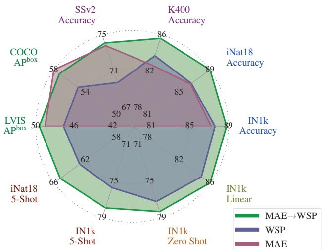  
Figure 1: MAE pre-pretraining improves performance. Transfer performance of a ViT-L architecture trained with self-supervised pretraining (MAE), weakly supervised pretraining on billions of im ages (WSP), and our pre-pretraining (MAE→WSP) that initializes the model with MAE and then pretrains with WSP. Pre-pretraining consistently improves performance.

In this work we explore the combination of self- and weakly-supervised learning in a simple pre-pretraining framework, as follows. We first begin with the Masked Autoencoder (MAE) [33] self-supervised learning technique to pre-pretrain vision models without using any labels. After initializing from the pre-pretrained model, we use standard weakly supervised pretraining on billions of images with noisy labels. We perform a large-scale empirical study to measure the effectiveness of pre-pretraining on 10 different visual recognition tasks spanning image classification, video recognition, object detection, low-shot classification and zero-shot recognition. Our study reveals that pre-pretrain initialization improves the performance for the weakly su pervised models, and this improvement holds even at billion scale weakly labeled data, and across vision tasks (Figure 1). It also improves the model convergence during pretraining, leading to an efficient way of training large scale vision models. Pre-pretrain further enjoys the computational efficiency of the MAE approach, making it simple and scalable. Finally, we show that by using pre-pretraining, both self-supervised learning and weakly supervised learning can be combined for improved model performance for billion-scale data.

Pre-pretrain is related to ‘intermediate finetuning’ [5, 50] which introduces a stage after pretraining to better align the pretrained features with the downstream task using labeled data. In contrast, pre-pretrain serves as a better way to initialize a model before pretraining. Since we leverage MAE for pre-pretraining, we do not need additional information or labels for this stage and can re-use the pretraining data. This makes pre-pretrain convenient and simple to use with existing pretraining datasets.

Our study on large-scale pre-pretraining reveals that model initialization plays a significant role, even for webscale pretraining, and pre-pretraining is a simple and promising technique in that direction. In particular, we show that (i) MAE not only scales with model size as shown in [33], but also with the size of the training data (Figure 2). (ii) Pre-pretraining improves both the model convergence and the final downstream performance for different sized models (millions to billions of parameters) trained on different sized datasets (millions to billions of labels). (iii) Using pre-pretraining combines the benefits of both self-supervised learning and large scale weakly-supervised learning, and our models achieve excellent performance on a variety of different visual recognition tasks (Figure 1). Most prominently, our model sets new state-of-the-art results on iNaturalist-18 image classification (91.3%), 1-shot ImageNet-1k image classification (62.1%), and zero-shot transfer on Food-101 (96.2%).

## 2. Related Work

Supervised pretraining of transferrable representations on large labeled datasets [21, 43, 63] and employing them for downstream recognition tasks, has emerged as a powerful approach in computer vision. It has spurred rapid progress on various tasks including image classification [22, 57, 60], object detection/segmentation [29, 62], image captioning [45, 81] and video action recognition [13, 24, 68]. While useful, such representations are often limited by the scale and diversity of the supervision in the pretraining datasets. Hence, recent work has probed the effectiveness, robustness, and fairness of these representations [1, 20, 40, 44, 61, 66, 74]. Self-supervised pretraining is a promising alternative to learn these representation without relying on large welllabeled datasets. Initial works focused on reconstructions methods [77] before moving to other pretraining tasks such as solving jigsaw puzzles [55], constrastive learning [15, 34] or joint embedding approaches [3, 4, 11, 12, 31, 89]. With the advent of Vision Transformers [23], approaches based on reconstructions such as [5, 33, 79] got renewed interest for their simplicity and state of the art performance. Of particular interest to us is MAE [33] for its state of the art performance on many transfer tasks [25, 28, 33, 46, 75] and its computational efficiency. Given the lack of supervision during pretraining, these representations often require significant finetuning to align to downstream tasks.

Weakly supervised pretraining (WSP) is a middle-ground between supervised and self-supervised pretraining. Instead of ignoring annotations completely as in self-supervised pretraining, or requiring exhaustive labels as in supervised pretraining, WSP relies on the large quantity of “free” annotation available on the internet. These annotations occur as image-text pairs [59, 65], where the text can additionally be processed to produce pseudo labels. Of particular interest to us is the latter, i.e. approaches which leverage multi-label classification on noisy labels [27, 52, 70, 84] which have shown state of the art fine-tuning performance, and at the same time can be adapted using image-text data to gain zeroshot capabilities [85]. In this work, we explore WSP in conjunction with self-supervised pre-pretraining, and show faster convergence and stronger performance.

## 3. Setup

Our goal is to empirically study the effectiveness of selfsupervised pre-pretraining as a precursor to billion scale weakly supervised pretraining for representation learning. Given the simplicity and efficiency of Masked AutoEncoding (MAE) [33], we leverage it as the self-supervised prepretraining approach. Our study shows that MAE scales with the size of the pretraining dataset and model size, and combining it with weak supervision improves large scale vision models. Additionally, such a combination leads to faster convergence and is a simple, scalable way to learn visual representations at scale. We describe our setup and the approaches in detail next.

Architecure. We use the Vision Transformer (ViT) [23] architecture as the visual encoder for all our experiments. ViTs employ minimal vision-specific inductive biases combined with the standard transformer architecture [76], and yet have emerged as an architecture of choice for a wide variety of visual and multimodal recognition tasks [2, 28, 84]. We train

ViT models at various scales in terms of number of parameters, including ViT-B (86M), ViT-L (307M), and ViT-H (632M). We also train on larger 1.9B and 6.5B parameter ViT models, which we call ViT-2B and ViT-6.5B, respectively (Appendix Table 8). As is common practice [23, 84], we train models of sizes ViT-B, ViT-L with a patch size of 16 and larger models with a patch size of 14. We pretrain with a 224 × 224 resolution for all models.

Pre-pretraining (MAE) [33] learns visual representations from image datasets without using any labels. We choose this approach as it is simple to implement and scales very effectively with large ViT model sizes due to patch dropping as described next. MAE randomly masks 75% of an image and trains the model to reconstruct the masked input image by minimizing the pixel reconstruction error. The target pixel values for a given patch are normalized by the mean and standard deviation of all pixels in it. Coupled with the ViT architecture, MAE can be trained by only processing the 25% unmasked image patches. A separate, smaller, decoder is then used to reconstruct the missing part of the input. This asymmetrical design makes training the encoder extremely efficient, allowing for scaling visual encoder sizes.

Weakly-supervised pretraining (WSP) leverages images with associated ‘weak’ supervision for training models. In particular, we focus on internet images and use their associated text information as supervision. We convert the text into a discrete set of labels, specifically leveraging hash-tag information [27, 52, 70]. We then use a multi-label classification loss to train models. We refer to this method as WSP.

MAE→WSP first trains the encoder using the MAE selfsupervised method using only the images. This prepretraining stage initializes the model while simultaneously being computationally efficient because of the masking used in MAE. In the second stage, we pretrain the encoder using both the image and associated weak supervision. This combination outperforms using either strategy in isolation, i.e., an MAE model or a weakly supervised model trained from scratch.

## 4. Experiments

We empirically evaluate and analyze large scale MAE pre-pretraining using Instagram data on a variety of different visual recognition tasks. We describe the datasets used for pretraining and evaluation, followed by analysis of the pretraining design decisions, and finally the downstream transfer evaluation of our learned representation.

## 4.1. Datasets and training details

Pretraining dataset. We use Instagram-3B (IG-3B) a billion-scale multi-label dataset sourced from Instagram (IG). This multi-label dataset contains 28K classes and 3B unique images, resampled to 5B total images, and was produced by running the dataset generation pipeline from SWAG [70] without modification. Compared to [70], our version of the dataset has 16% fewer images (3.0B vs. 3.6B), but we were able to reproduce the results from [70] with our version. We obtain labels using an automated process wherein we first obtain hashtags from the associated image captions, and then map the hashtags to WordNet synsets following [70]. After this processing, we get the weakly labeled IG dataset that contains images and their associated labels.

<table><tr><td>Dataset</td><td>Task</td><td>#cls #train #val</td><td></td><td></td></tr><tr><td>ImageNet-1k (IN1k) [64]</td><td>Image cls.</td><td>1000</td><td>1M</td><td>50K</td></tr><tr><td>iNaturalist-18 (iNat18) [36]</td><td>Fine-grained cls.</td><td>8142</td><td>437K</td><td>24K</td></tr><tr><td>ImageNetv2 (INv2) [61]</td><td>Image cls.</td><td>1000</td><td></td><td>10K</td></tr><tr><td>ImageNet-ReaL (IN-ReaL) [7]</td><td>Image cls.</td><td>1000</td><td></td><td>50K</td></tr><tr><td>ObjectNet (ON) [6]</td><td>Image cls.</td><td>113</td><td></td><td>19K</td></tr><tr><td>Food-101 (F-101) [9]</td><td>Image cls.</td><td>101</td><td>N/A</td><td>25K</td></tr><tr><td>COCO [49]</td><td>Obj. det.</td><td>80</td><td>118K</td><td>5K</td></tr><tr><td>LVIS [32]</td><td>Obj. det.</td><td>1K</td><td>100K 20K</td><td></td></tr><tr><td>Kinetics-400 (K400) [43]</td><td>Action cls.</td><td>400</td><td>220K 20K</td><td></td></tr><tr><td>Something Something-v2 (SSv2) [30]</td><td>Action cls.</td><td>174</td><td>169K 25K</td><td></td></tr></table>

Table 1: Evaluation datasets used to evaluate MAE→WSP on image classification, object detection, and video action recognition tasks. The table reports the task, number of classes (#cls), number of training samples (#train), and number of validation samples (#val) for each dataset.

Evaluation datasets. We evaluate MAE→WSP on a variety of different downstream visual recognition tasks. To evaluate our model on image classification, we use the standard ImageNet-1k [64] (IN1k) dataset, and also the longtailed and fine-grained iNaturalist-18 [36] (iNat18) dataset. For object detection and segmentation, we use the popular COCO [49] dataset, and also LVIS [32], a large vocabulary dataset for long tailed object recognition. We evaluate video classification performance using two popular action recognition datasets, Kinetics-400 [43] (K400) and Something Something-v2 [30] (SSv2). For zero-shot transfer, we evaluate on IN1k and Food-101 [9] (F-101). We also evaluate the robustness of our models on test sets which overlap with IN1k classes, specifically ImageNetv2 [61] (INv2), ImageNet-ReaL [7] (IN-ReaL), and ObjectNet [6] (ON). Please see Table 1 for more details.

MAE pretraining details. We follow [33] to train MAE models on IG-3B without using any labels. We mask 75% of the image for this training and train the model for 1 epoch over the dataset. We follow the same hyperparameters used in [33] for pretraining on IN1k.

Supervised pretraining details. We train with a supervised cross-entropy loss on IG-3B using the hashtags as labels. This model is trained by default with random weight initialization and we use the training hyperparameters from [70]. Using pre-pretraining. When using pre-pretraining, we first train a model from scratch using MAE on the IG dataset. We then use the weights of the MAE encoder and perform supervised pretraining using the cross-entropy loss as described above. We reuse the same hyperparameters and training details as [70], i.e. there is no hyperparameter search needed for MAE→WSP, and we train for 1 epoch on IG-3B.

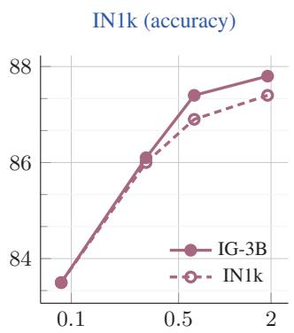  
Model parameters (billions)

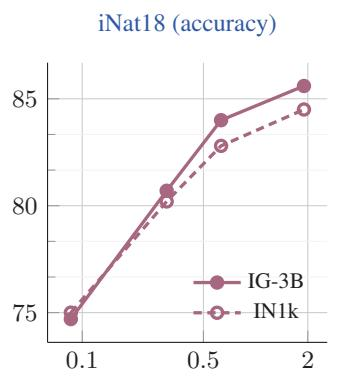  
Model parameters (billions)

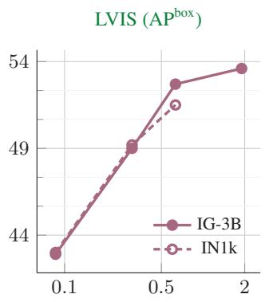  
Model parameters (billions)

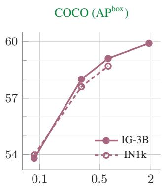  
Model parameters (billions)  
Figure 2: Scaling MAE with model and dataset size. We plot MAE’s performance when pretrained on ImageNet-1k or Instagram-3B and finetuned on downstream tasks. MAE scales to billion parameters sized models using just IN1k pretraining. Larger models show improved scaling behavior when pretrained with the much larger IG-3B dataset. MAE pretrained on IN1k data point is missing for the 2 billion model as training at that scale was unstable on both COCO and LVIS datasets. Tabulated results in Table 19.

Zero-shot training and evaluation details. To impart zero shot understanding capabilities to our models, we use the LiT approach from [85]. For LiT, we use the original (image, caption) pairs from the IG-3B dataset. We freeze the image encoder, and train a text encoder to encode the image captions and match the text embeddings to the associated image embedding using a CLIP loss [59]. We train the text encoder for 1 epoch. For evaluation, we follow [59] – we use the text encoder to compute embeddings from the templated text descriptions of classes and use the cosine similarity of the image and text embeddings as the classification score.

For full training details and hyperparameters, please refer to Appendix A.

## 4.2. Scaling MAE pretraining to large data

Since our pre-pretraining uses MAE in the very first stage, we first study how MAE behaves on the large scale IG-3B dataset. We compare the performance of MAE pretraining on the large scale IG-3B with the original MAE [33] models trained on IN1k for 1600 epochs. We train models of varying sizes, from ViT-B to ViT-H as in [33]. To test the scaling behavior further, we also train MAE on the ViT-2B model with 2B parameters. We measure the performance of the resulting models in Figure 2 on four different vision tasks.

We observe that using the IG-3B data provides consistent gains over IN1k for all vision tasks, and the gain increases for larger models. These experiments show that MAE scales with the size of the pretraining dataset, and benefits from using billions of images from IG-3B. He et al. [33]’s findings were limited to the fact that MAE scales with the size of the model, and thus our findings on MAE scaling with the size of the pretraining data are complementary to theirs.

Our ViT-2B model pretrained on IG-3B improves upon the best results from [33] on image classification, attaining 88.4% on IN1k (+0.6%) and 89.3% on iNat18 (+2.5%) at 518×518 resolution. The gains on detection are equally encouraging, with our ViT-2B reaching 53.6 APbox on LVIS (+2.1 over [33]) and 59.8 APbox on COCO (+1.2 over [33]). Lastly, we highlight the simplicity of our setup, since we use the same hyperparameters as [33] to train MAE on IG-3B, and also for the largest ViT-2B model, without encountering any training instabilities or needing any extra tweaks.

## 4.3. MAE pre-pretraining

Given the promising aspects of MAE as a pretraining approach from § 4.2, specifically that MAE (i) trains with larger models and datasets without needing any tuning (ii) shows gains when scaling model and / or dataset size (iii) is efficient to train, we investigate it as a pre-pretraining approach for supervised pretraining (WSP).

Figure 1 shows the performance of a ViT-L with MAE pretraining, supervised pretraining (WSP), or MAE pre-pretraining followed by supervised pretraining (MAE→WSP). We see that MAE and WSP have different strengths. MAE has strong performance for object detection, and full finetuned image classification. However, MAE un derperforms on tasks where the model is not finetuned, such as linear classifiers, zero-shot, or low-shot classification – situations where WSP performs better. For these evaluations MAE lags behind WSP by more than 10 points, which is why the results for MAE are not visible in Figure 1. For video classification, MAE performs significantly better than WSP on SSv2, but lags behind it on K400.

MAE→WSP outperforms either of MAE or WSP pretraining on most evaluations, across image classification, video recognition, zero-shot evaluation, object detection, etc. Given that all baselines are trained at billion-scale, these results show that MAE→WSP is a simple yet promising strategy to improve performance while requiring no extra data or tuning. Next, we ablate the key aspects of MAE→WSP.

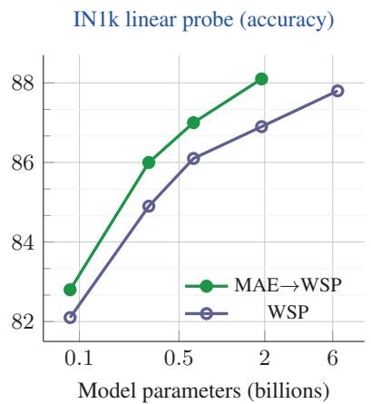  
Figure 3: MAE pre-pretraining scales with model size. Across model sizes, MAE→WSP outperforms a WSP only model, and shows strong scaling behavior. Most notably, a 2B MAE→WSP model outperforms a 6.5B WSP model.

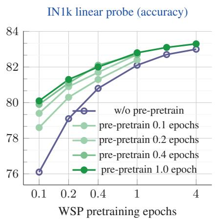

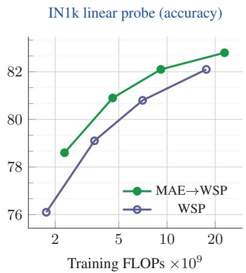  
Figure 4: Varying the number of pre-pretraining epochs used to initialize the model for WSP pretrain ing. Pre-pretraining leads to improved convergence, providing higher performance using fewer number of WSP pretraining epochs.  
Figure 5: MAE→WSP is more FLOPs efficient than WSP. Across a wide range of training FLOP profiles for a ViT-B computed by varying WSP (and MAE) epochs, MAE→WSP outperforms a baseline WSP only model.

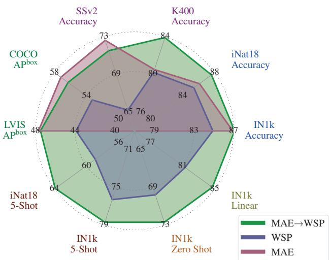  
Figure 6: MAE initialization for medium scale data. Results for a ViT-L trained on IN21k with MAE, WSP, and MAE→WSP. MAE pre-pretraining improves WSP results by a wide margin.

Effect of model size. In Figure 3 we study the effect of prepretraining compared to random initialization for different model sizes. After initialization, all models are pretrained using WSP on the IG-3B dataset, and we measure the transfer performance on IN1k using linear probing. We observe that MAE pre-pretraining gives consistent gains over the

WSP baseline across all model sizes, ranging from 86M to 2B parameters. The gains over the WSP baseline increase for larger model sizes showing that pre-pretraining shows promising scaling behavior with model sizes. Notably, a 2B MAE→WSP model outperforms a larger 6.5B WSP model. Number of pre-pretraining epochs. We vary the number of MAE pre-pretraining and the number of WSP pretraining epochs to understand their effect on the final recognition performance. We study this in Figure 4.

Pre-pretraining improves results over the standard pretraining (random initialization, w/o pre-pretraining), and provides large gains with fewer WSP pretraining epochs. Pre-pretraining also leads to faster convergence since even a small amount of pre-pretraining for 0.1 epochs provides improvements. Increasing the epochs of pre-pretraining provide a larger improvement, and the gains saturate at 1 epoch of pre-pretraining. Finally, pre-pretraining’s gains do not diminish even after 4 epochs of WSP (20 billion samples) showing the value of pre-pretraining at scale. We also note that these gains are independent of the evaluation protocol, and we observed them with full finetuning on IN1k as well. Training efficiency. Figure 5 shows a comparison between WSP and MAE→WSP when comparing training FLOPs. For the same training FLOPs, MAE→WSP achieves better transfer performance compared to WSP, and is up to 2× more efficient. Pre-pretraining’s training efficiency holds over a large 10× compute window.

Different datasets for pre-pretraining. We also evaluate the performance of MAE→WSP when pre-pretraining MAE on the much smaller ImageNet-1k dataset (Appendix Table 21) and find that pre-pretraining remains just as effective. This allows reusing pretrained MAE models in practice.

<table><tr><td>Method</td><td>Dataset</td><td>Arch.</td><td>Res.</td><td colspan="3">ImageNet-1k IN1k INv2 ReaL</td><td rowspan="2">ON</td><td rowspan="2">iNat18</td></tr><tr><td>MAE [33]</td><td>IN1k</td><td>ViT-H</td><td>448</td><td>87.8</td><td></td><td></td></tr><tr><td>SWAG [70]</td><td>IG-3.6B</td><td>ViT-H</td><td>518</td><td>88.6</td><td>81.1</td><td>90.5</td><td>69.5</td><td>86.8 86.0</td></tr><tr><td>DINOv2 [56]</td><td>LVD-142M</td><td>ViT-g</td><td>448</td><td>88.9</td><td>一</td><td>一</td><td>1</td><td>1</td></tr><tr><td>Florence [82]</td><td>FLD-900M</td><td>CoSwin-H</td><td>512</td><td>90.1</td><td>1</td><td></td><td></td><td>一</td></tr><tr><td>ViT [23]</td><td>JFT-300M</td><td>ViT-H</td><td>518</td><td>88.6</td><td>1</td><td>90.7</td><td>1</td><td>1</td></tr><tr><td>Scale-ViT [84] JFT-3B</td><td></td><td>ViT-L</td><td>384</td><td>88.5</td><td>80.4</td><td>90.4</td><td></td><td>1</td></tr><tr><td>Scale-ViT [84]</td><td>JFT-3B</td><td>ViT-G</td><td>518</td><td>90.5</td><td>83.3</td><td>90.8</td><td>70.5</td><td>一</td></tr><tr><td>SwinV2 [50]</td><td>IN-ext-70M</td><td>SwinV2-G</td><td>640</td><td>90.2</td><td>84.0</td><td>一</td><td>一</td><td>一</td></tr><tr><td>CoCa [81]</td><td>JFT-3B + ALIGN-1.8B</td><td>CoCa-2B</td><td>576</td><td>91.0</td><td>一</td><td>一</td><td>一</td><td>1</td></tr><tr><td>MAE→WSP</td><td>IG-3B</td><td>ViT-H</td><td>518</td><td>89.3</td><td>82.3</td><td>90.8</td><td>72.6</td><td>90.5</td></tr><tr><td>MAE→WSP</td><td>IG-3B</td><td>ViT-2B</td><td>518</td><td>89.7</td><td>83.0</td><td>90.9</td><td>75.8</td><td>91.3</td></tr></table>

Table 2: Image classification results. We report finetuning results on IN1k and iNat18 and note the pretraining dataset, architecture and finetuning resolution. We also evaluate the performance of our IN1k finetuned models on multiple test sets to measure robustness. Our models are robust and also push the state-of-theart on the challenging fine-grained and long-tailed iNat18 dataset.

Different datasets for pre-pretraining and pretraining. We investigate the effect of the dataset used in pre-pretraining and pretraining by using IN21k [21] for all methods, including MAE and MAE→WSP. Compared to IG-3B, IN21k is more curated, smaller (14M images), and has cleaner labels (21K classes), where each image is labeled with one class from the WordNet synsets [53]. For evaluating zero shot performance, we use the PMD [69] dataset for LiT training. For full details about the hyperparameters, refer to Appendix A.

Figure 6 compares the performance of MAE, WSP and MAE→WSP when pretrained on this IN21k dataset. We notice a similar trend as when pretraining on IG-3B where MAE→WSP outperforms both MAE and WSP. This shows that MAE pre-pretraining works with datasets of different scales and distributions.

## 4.4. Transfer Evaluation

We compare with state-of-the-art research on image and video classification, detection and segmentation, low-shot image classification, zero shot transfer, robustness analysis. ImageNet-1k image classification. Table 2 shows the performance of different methods on IN1k. MAE→WSP gets the best performance for a ViT-H sized model (89.3%). As we report in the appendix, MAE→WSP also achieves the best performance for ViT-L (88.8%). Recent methods such as Scale-ViT [84] are better on IN1k and we hypothesize that this gap stems mainly from the differences in the pretraining datasets (IG-3B vs. JFT-3B). We also compute linear performance using frozen features on IN1k at 224px resolution. Our models produce strong features which outperform other methods with WSP objectives. They also surpass the performance of the self-supervised DINOv2 [56] model optimized to produce strong frozen representations.

<table><tr><td>Method</td><td>Dataset</td><td>Arch.</td><td>Res.</td><td>K400</td><td>SSv2</td></tr><tr><td>Florence [82] SwinV2 [50]</td><td>FLD-900M IN-ext-70M</td><td>CoSwin-H SwinV2-G</td><td>384 384</td><td>86.5 86.8</td><td>1 1</td></tr><tr><td>CoCa [81]</td><td>JFT-3B + ALIGN-1.8B</td><td>CoCa-2B</td><td>576</td><td>88.9</td><td></td></tr><tr><td>Results with models pretrained on videos MaskFeat [78]</td><td></td><td>MViT-L</td><td>224</td><td>84.3</td><td></td></tr><tr><td>MAE [25, 75]</td><td>K400 K400</td><td>ViT-L</td><td>224</td><td>85.2</td><td>74.0</td></tr><tr><td>OmniMAE [28]</td><td>IN1k + SSv2</td><td>ViT-L</td><td>224</td><td>84.0</td><td>74.2</td></tr><tr><td></td><td></td><td></td><td></td><td></td><td></td></tr><tr><td>MAE [25, 75]</td><td>K400</td><td>ViT-H</td><td>224</td><td>86.6</td><td>一</td></tr></table>

Table 3: Video classification results on Kinetics-400 and Something Something-v2. Our models generalize well to video action recognition tasks, despite not seeing any videos during pretraining.

<table><tr><td>Method</td><td>Dataset</td><td>Arch.</td><td>IN1k Linear</td></tr><tr><td>SWAG [70]</td><td>IG-3.6B</td><td>ViT-H</td><td>85.8</td></tr><tr><td>OpenCLIP [41]</td><td>LAION-2B</td><td>ViT-G</td><td>86.2</td></tr><tr><td>DINOv2 [56]</td><td>LVD-142M</td><td>ViT-g</td><td>86.5</td></tr><tr><td>MAE→WSP</td><td>IG-3B</td><td>ViT-H</td><td>87.0</td></tr><tr><td>MAE→WSP</td><td>IG-3B</td><td>ViT-2B</td><td>88.1</td></tr></table>

Robustness for image classification. We evaluate the robustness of our models finetuned on IN1k on additional test sets in Table 2 and notice that, despite MAE→WSP being ∼1% behind Scale-ViT on IN1k, it is significantly more robust and generalizes better on these additional test sets – MAE→WSP gets the highest reported performance on ImageNet-ReaL and ObjectNet for IN1k finetuned models. Generalization in image classification. We evaluate the generalization of our model on additional fine-grained image classification using iNaturalist-18. iNat18 is a challenging long-tailed and fine-grained dataset with images of multiple species of visually similar plants and animals. Our ViT-2B sets a new state-of-the-art result on iNat18 (+4.5% over [33]) Video classification. In Table 3 we investigate how MAE→WSP’s pretraining transfers to video action classification on K400 and SSv2. MAE→WSP is competitive with state-of-the-art methods, including ones that pretrain on videos, whereas our models are only pretrained on images. Specifically, our ViT-L gets the highest reported performance on both video datasets. For all video finetuning, we use relative position embeddings [24], which improves our performance by 0.6% on K400 for a ViT-L. Overall, the results indicate the promise of MAE pre-pretraining for building strong video understanding models.

Low-shot image classification. We evaluate the label efficiency of our models using a few examples per class for finetuning. We use two datasets, IN1k and iNat18, with K shots (labeled examples per class), K ∈ {1, 5, 10}. For iNat18, as some classes have less than K images, we adapt our setting to consider at most K shots. For each value of $K ,$ we generate 5 splits of the original dataset using 5 different random seeds and report the mean top-1 accuracy.

<table><tr><td>Method</td><td>Dataset</td><td>Arch.</td><td colspan="3">IN1k 1-shot 5-shot 10-shot</td><td colspan="3">iNat18 1-shot 5-shot 10-shot</td></tr><tr><td>Results with different pretraining datasets</td><td></td><td></td><td></td><td></td><td></td><td></td><td></td><td></td></tr><tr><td colspan="9"></td></tr><tr><td>CLIP [59]</td><td>WIT-400M</td><td>ViT-L</td><td>41.3 44.3</td><td>66.2</td><td>71.3</td><td>21.9 26.0</td><td>49.0</td><td>58.5</td></tr><tr><td>OpenCLIP [41]</td><td>LAION-2B</td><td>ViT-H ViT-G</td><td>46.3</td><td>70.0 72.9</td><td>74.9 77.2</td><td>26.3</td><td>54.6</td><td>63.7</td></tr><tr><td>OpenCLIP [41] Scale-ViT †[84] JFT-3B</td><td>LAION-2B</td><td>ViT-G</td><td>一</td><td>83.0</td><td>84.9</td><td></td><td>55.7</td><td>65.1</td></tr><tr><td></td><td></td><td></td><td>45.8</td><td></td><td></td><td>一</td><td></td><td>一</td></tr><tr><td>DINO [12]</td><td>IN1k</td><td>ViT-B/8 ViT-L/7</td><td>57.1</td><td>64.6</td><td>69.0</td><td>19.8</td><td>45.9</td><td>55.9</td></tr><tr><td>MSN [3]</td><td>IN1k IN1k</td><td>ViT-H</td><td></td><td>72.1 57.9</td><td>74.4 70.8</td><td>17.0</td><td>38.0</td><td>48.1</td></tr><tr><td>MAE [33]</td><td></td><td>ViT-H</td><td>一 59.4</td><td>78.7</td><td>81.0</td><td>30.1</td><td>48.5</td><td>68.2</td></tr><tr><td>SWAG [70]</td><td>IG-3.6B</td><td></td><td></td><td></td><td></td><td></td><td>62.8</td><td>72.3</td></tr><tr><td>MAE→WSP</td><td>IG-3B</td><td>ViT-H</td><td>57.1 62.1</td><td>79.8</td><td>82.5</td><td>31.7</td><td>67.8</td><td>76.1</td></tr><tr><td>MAE→WSP</td><td>IG-3B</td><td>ViT-2B</td><td></td><td>81.5</td><td>83.7</td><td>35.5</td><td>72.8</td><td>80.3</td></tr></table>

Table 4: Low shot image classification. We compare the performance of our models using just a few examples per class for ImageNet-1k and iNaturalist-18. MAE→WSP excels at classification even with just 1 example per class. Pretraining on large scale data can outperform techniques designed to work well in the low data regime, like MSN. We evaluate and report results for each technique with the best protocol, except for when the checkpoints are not available†.

<table><tr><td>Method</td><td>Dataset</td><td>Arch.</td><td>Framework</td><td> $\mathbf { | A P ^ { b o x } }$ </td><td> $\mathbf { A P } ^ { \mathrm { m a s k } }$ </td></tr><tr><td colspan="6">Results with a different detection framework</td></tr><tr><td>Winner 2021 [26] IN21k</td><td></td><td>CBNetv2</td><td>HTC</td><td>一</td><td>49.2</td></tr><tr><td>MAE [46]</td><td>IN1k</td><td>ViTDet-H</td><td>Cascade</td><td>51.5</td><td>46.6</td></tr><tr><td>SWAG [70]</td><td>IG-3B</td><td>ViTDet-H</td><td>Cascade</td><td>47.1</td><td>42.1</td></tr><tr><td>MAE→WSP</td><td>IG-3B</td><td>ViTDet-H</td><td>Cascade</td><td>50.8</td><td>45.5</td></tr><tr><td>MAE→WSP</td><td>IG-3B</td><td>ViTDet-2B</td><td>Cascade</td><td>51.8</td><td>46.1</td></tr></table>

Table 6: Detection and Segmentation results on LVIS (v1 val). We compare $\mathbf { M A E } {  } \mathbf { W S P }$ with prior work and report the detection $( \mathrm { A P } ^ { \mathrm { b o x } } )$ and instance segmentation performance $( \mathrm { A P } ^ { \mathrm { m a s k } } )$ ). Our ViT-H significantly outperforms SWAG which uses the same pretraining and model size, but without pre-pretraining. Our detection performance also improves with the larger 2B parameter model.

We evaluate two protocols for low-shot finetuning – linear classifiers and Adapters [37], both of which keep the entire model parameters frozen and introduce a few trainable parameters. We evaluated multiple Adapters proposed for ViTs – LoRA [38], AdaptFormer [14], and VPT [42]. We found that VPT performed the best while being robust to the choice of hyperparameters, and outperforms linear classifiers for our models. For other works, we report with the best protocol. Full details in Appendix B.

Table 4 shows a comparison with state-of-the-art methods on low-shot IN1k and iNat18, including foundational and self-supervised models. Our models show impressive lowshot performance on both IN1k and iNat18, reaching 83.7% and 80.3% top-1 accuracy with only 10 labeled examples per class, and reaching the highest reported performance with just one labeled example per class on IN1k of 62.1%.

<table><tr><td>Method</td><td>Dataset</td><td>Arch.</td><td>Res.</td><td>IN1k</td><td>|F-101</td></tr><tr><td colspan="6">Results with different pretraining datasets</td></tr><tr><td>CLIP [59]</td><td>WIT-400M</td><td>ViT-L/14</td><td>336</td><td>76.2</td><td>93.8</td></tr><tr><td>OpenCLIP [41] LAION-2B</td><td></td><td>ViT-H</td><td>224</td><td>78.0</td><td>92.5</td></tr><tr><td>OpenCLIP [41] LAION-2B</td><td></td><td>ViT-G</td><td>224</td><td>80.1</td><td>92.9</td></tr><tr><td>Florence [82]</td><td>FLD-900M</td><td>CoSwin-H</td><td>384</td><td>83.7</td><td>95.1</td></tr><tr><td>Scale-ViT [84] + LiT [85]</td><td>JFT-3B + ALIGN-3.6B</td><td>ViT-L</td><td>224</td><td>80.8</td><td>一</td></tr><tr><td>Scale-ViT [84]</td><td>JFT-3B</td><td>ViT-g</td><td>288</td><td>85.2</td><td>一</td></tr><tr><td>+ LiT [85] CoCa [81]</td><td>+ ALIGN-3.6B JFT-3B +</td><td>CoCa-2B</td><td>576</td><td>86.3</td><td>1</td></tr><tr><td>MAE→WSP</td><td>ALIGN-1.8B IG-3B</td><td>ViT-H</td><td>224</td><td>80.8</td><td>95.8</td></tr><tr><td>MAE→WSP</td><td>IG-3B</td><td>ViT-2B</td><td>224</td><td>81.9</td><td>96.2</td></tr></table>

Table 5: Zero shot image classification results. We evaluate zero-shot transfer on IN1k and Food-101. Our models push the state-of-the-art on F-101, while being competitive on IN1k. The best performing models on IN1k train on JFT-3B and ALIGN, and the performance on the two datasets is not well correlated, exemplifying the impact of pretraining dataset choice on zero-shot transfer performance.

<table><tr><td>Method</td><td>Dataset</td><td>Arch.</td><td>Framework</td><td> $\mathbf { \alpha } \mathbf { \left| \delta A P ^ { b o x } \right| }$ </td><td>Apmask</td></tr><tr><td colspan="4">Results with different detection framework</td><td colspan="2"></td></tr><tr><td>CBNetv2 [48]</td><td>IN21k</td><td>2 ×Swin-L</td><td>HTC</td><td>59.1</td><td>51.0</td></tr><tr><td>SwinV2-L [50] IN21k</td><td></td><td>SwinV2-L</td><td>HTC++</td><td>58.9</td><td>51.2</td></tr><tr><td>Co-DETR [90] IN21k</td><td></td><td>Swin-L</td><td>Co-DETR</td><td>58.5</td><td></td></tr><tr><td colspan="4">Methods that pretrain on a detection dataset</td><td></td><td></td></tr><tr><td>Florence [82]</td><td>FLD-900M  $+ \mathrm { F L O D - } 9 \mathrm { M } ^ { \dagger }$ </td><td></td><td>CoSwin-H DyHead [19]</td><td>62.0</td><td></td></tr><tr><td>DINO [87]</td><td> $\mathbf { I N } 2 1 \mathbf { k } + \mathbf { O } 3 6 \bar { 5 } ^ { \dagger }$ </td><td>Swin-L</td><td></td><td>63.2</td><td></td></tr><tr><td>FocalNet [80]</td><td> $\mathbf { I N } 2 1 \mathbf { k } + \mathbf { O } 3 6 \bar { 5 } ^ { \dagger }$ </td><td>FocalNet-H</td><td>DINO [87]</td><td>64.2</td><td>一</td></tr><tr><td>Co-DETR [90]</td><td> $\mathbf { I N } 2 1 \mathbf { k } + \mathbf { O } 3 6 5 ^ { \dagger }$ </td><td>MixMIM-g</td><td>Co-DETR</td><td>64.4</td><td></td></tr><tr><td>MAE [46]</td><td>IN1k</td><td>ViTDet-H</td><td>Cascade</td><td>58.7</td><td>50.9</td></tr><tr><td>SWAG [70]</td><td>IG-3B</td><td>ViTDet-H</td><td>Cascade</td><td>55.7</td><td>47.9</td></tr><tr><td></td><td></td><td>ViTDet-H</td><td>Cascade</td><td></td><td></td></tr><tr><td>MAE→WSP MAE→WSP</td><td>IG-3B IG-3B</td><td>ViTDet-2B</td><td>Cascade</td><td>57.7 58.0</td><td>49.6 50.1</td></tr></table>

Table 7: Detection and Segmentation on COCO (val2017). We report the detection $( \mathrm { A P } ^ { \mathrm { b o x } } )$ and instance segmentation performance $( \mathbf { A P } ^ { \mathrm { m a s k } } )$ ). Our models outperform SWAG which uses the same pretraining, but without pre-pretraining. †Large scale detection datasets – using additional detection data like Objects365 has been shown to boost performance by 5.6 mAP [67].

Zero-shot transfer. Strong foundational models are expected to also have a good open world understanding of visual concepts. To equip our pretrained vision encoders with such capabilities, we utilize LiT [85]. We initialize the text encoder from an XLM-R Large [17] model. Table 5 shows the zero-shot transfer performance of our models on IN1k, and F-101. Our ViT-2B attains 81.9% accuracy on IN1k, outperforming a similarly sized OpenCLIP model.

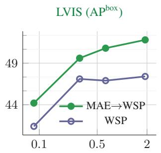  
Model parameters (billions)

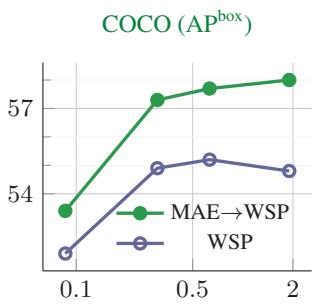  
Model parameters (billions)  
Figure 7: Pre-pretraining with MAE significantly boosts performance on detection. Scaling the model size with WSP only does not improve performance on detection. Adding MAE as prepretraining helps MAE→WSP scaling on detection.

Our results lag behind other works which pretrain on datasets such as JFT-3B and ALIGN, highlighting the importance of the pretraining dataset for performance. This data-advantage is also observed in the finetuning results discussed in Table 2, where JFT-3B provides best IN1k accuracy. On Food-101 we attain the highest zero-shot transfer accuracy of 96.2%. The performance on the two datasets is not well correlated, further demonstrating the impact the pretraining dataset can have on a particular zero-shot task.

Detection and segmentation. Next, we evaluate models on detection and instance segmentation, on the LVIS [32] (Table 6) and COCO [49] datasets (Table 7). We use the Cascade Mask R-CNN framework [35], with the ViTDet [47] architecture, and initialize the backbone with our pretrained models. For finetuning our models, we start with the hyperparameters from [47] and adapt them for our models, full details are in Appendix B. We also perform a system level comparison with other state-of-the-art works, but note that drawing meaningful conclusions out of this is difficult, on account of the multiple differences in the detection frameworks, model architectures, and datasets.

On both benchmarks, MAE→WSP considerably outperforms the weakly supervised SWAG [70] model, demonstrating the benefit of our additional pre-pretraining stage. On the long-tailed LVIS dataset, MAE→WSP outperforms MAE IN1k pretraining on detection AP [47], but lags slightly behind on COCO. MAE’s strong performance on detection using both IN1k and IG-3B (Figure 2) can potentially be explained by the fact that it is trained to reproduce images with 75% masking, whereas WSP is only trained to predict one or a few salient objects in an image. Lastly, methods which use additional detection data, such as Objects365 [67] or FLOD-9M [82], have strong detection performance.

Analyzing detection performance. We further inspect the benefits of pre-pretraining for detection in Figure 7. Unlike other tasks like image / video classification, scaling model size using WSP pretraining does not improve detection performance. However, adding MAE pre-pretraining provides consistent gains and allows WSP to scale with model size.

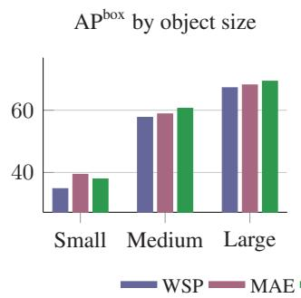

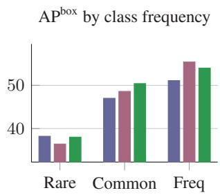  
Figure 8: Dissecting detection performance. LVIS performance based on the size of objects (left), or the class occurrence frequency (right). MAE is stronger than WSP at detecting small objects and frequent classes, and is worse on rare classes. MAE→WSP outperforms WSP on all axes. It is much closer to MAE on smaller objects and rare classes, and also outperforms MAE elsewhere.

We dissect the performance of ViT-L models trained with MAE, WSP, and MAE→WSP in Figure 8 based on the size of the object, or by the frequency of the object’s class. We observe that MAE→WSP performs better than WSP on all tasks – detecting rare to frequent classes across small to large object sizes. MAE→WSP improves over MAE at detecting rare objects, presumably because of the diversity in the IG-3B labels, and improves at detecting frequent classes over WSP due to MAE pre-pretraining.

## 5. Conclusion

We introduced pre-pretraining which is an initial stage in the standard pretrain-then-finetune paradigm. Prepretraining uses MAE and thus, does not need additional supervision and can be conveniently added to web-scale training pipelines. We show that pre-pretraining improves downstream performance on multiple different recognition tasks, improves model convergence, and is overall more efficient than standard weakly-supervised pretraining. Our self-supervised pre-pretraining improves results for models trained with billions of labels, showing that it is a scalable technique that matters even at web-scale. The benefits of using pre-pretraining hold across varying model sizes, and different pretraining data distributions showing that it is a robust technique. Finally, pre-pretraining naturally and successfully combines the two most common pretraining strategies – self-supervised and weakly-supervised learning. Our results suggest that model initialization plays a significant role in the final performance, training dynamics etc. even for web-scale training with billions of parameter updates and labels, and should be further investigated.

## References

[1] Samira Abnar, Mostafa Dehghani, Behnam Neyshabur, and Hanie Sedghi. Exploring the limits of large scale pre-training. arXiv preprint arXiv:2110.02095, 2021.

[2] Anurag Arnab, Mostafa Dehghani, Georg Heigold, Chen Sun, Mario Luciˇ c, and Cordelia Schmid. ViViT: A video vision´ transformer. In CVPR, 2021.

[3] Mahmoud Assran, Mathilde Caron, Ishan Misra, Piotr Bojanowski, Florian Bordes, Pascal Vincent, Armand Joulin, Mike Rabbat, and Nicolas Ballas. Masked siamese networks for label-efficient learning. In ECCV, 2022.

[4] Mahmoud Assran, Quentin Duval, Ishan Misra, Piotr Bojanowski, Pascal Vincent, Michael Rabbat, Yann LeCun, and Nicolas Ballas. Self-supervised learning from images with a joint-embedding predictive architecture. arXiv preprint arXiv:2301.08243, 2023.

[5] Hangbo Bao, Li Dong, Songhao Piao, and Furu Wei. Beit: Bert pre-training of image transformers. arXiv preprint arXiv:2106.08254, 2021.

[6] Andrei Barbu, David Mayo, Julian Alverio, William Luo, Christopher Wang, Dan Gutfreund, Josh Tenenbaum, and Boris Katz. Objectnet: A large-scale bias-controlled dataset for pushing the limits of object recognition models. In NeurIPS, 2019.

[7] Lucas Beyer, Olivier J Hénaff, Alexander Kolesnikov, Xiaohua Zhai, and Aäron van den Oord. Are we done with imagenet? arXiv preprint arXiv:2006.07159, 2020.

[8] Daniel Bolya, Sean Foley, James Hays, and Judy Hoffman. Tide: A general toolbox for identifying object detection errors. In ECCV, 2020.

[9] Lukas Bossard, Matthieu Guillaumin, and Luc Van Gool. Food-101–mining discriminative components with random forests. In ECCV. Springer, 2014.

[10] Tom Brown, Benjamin Mann, Nick Ryder, Melanie Subbiah, Jared D Kaplan, Prafulla Dhariwal, Arvind Neelakantan, Pranav Shyam, Girish Sastry, Amanda Askell, et al. Language models are few-shot learners. NeurIPS, 2020.

[11] Mathilde Caron, Ishan Misra, Julien Mairal, Priya Goyal, Piotr Bojanowski, and Armand Joulin. Unsupervised learning of visual features by contrasting cluster assignments. In NeurIPS, 2020.

[12] Mathilde Caron, Hugo Touvron, Ishan Misra, Hervé Jégou, Julien Mairal, Piotr Bojanowski, and Armand Joulin. Emerging properties in self-supervised vision transformers. In ICCV, 2021.

[13] Joao Carreira and Andrew Zisserman. Quo vadis, action recognition? a new model and the kinetics dataset. In CVPR, 2017.

[14] Shoufa Chen, Chongjian Ge, Zhan Tong, Jiangliu Wang, Yibing Song, Jue Wang, and Ping Luo. Adaptformer: Adapting vision transformers for scalable visual recognition. arXiv preprint arXiv:2205.13535, 2022.

[15] Ting Chen, Simon Kornblith, Mohammad Norouzi, and Geoffrey Hinton. A simple framework for contrastive learning of visual representations. In ICML, 2020.

[16] Kevin Clark, Minh-Thang Luong, Quoc V Le, and Christopher D Manning. Electra: Pre-training text encoders as discriminators rather than generators. ICLR, 2020.

[17] Alexis Conneau, Kartikay Khandelwal, Naman Goyal,

Vishrav Chaudhary, Guillaume Wenzek, Francisco Guzmán, Édouard Grave, Myle Ott, Luke Zettlemoyer, and Veselin Stoyanov. Unsupervised cross-lingual representation learning at scale. In ACL, 2020.

[18] Ekin D Cubuk, Barret Zoph, Jonathon Shlens, and Quoc V Le. Randaugment: Practical automated data augmentation with a reduced search space. In CVPR, 2020.

[19] Xiyang Dai, Yinpeng Chen, Bin Xiao, Dongdong Chen, Mengchen Liu, Lu Yuan, and Lei Zhang. Dynamic head: Unifying object detection heads with attentions. In CVPR, 2021.

[20] Terrance De Vries, Ishan Misra, Changhan Wang, and Laurens Van der Maaten. Does object recognition work for everyone? In CVPR Workshop, 2019.

[21] Jia Deng, Wei Dong, Richard Socher, Li-Jia Li, Kai Li, and Li Fei-Fei. Imagenet: A large-scale hierarchical image database. In CVPR, 2009.

[22] Jeff Donahue, Yangqing Jia, Oriol Vinyals, Judy Hoffman, Ning Zhang, Eric Tzeng, and Trevor Darrell. Decaf: A deep convolutional activation feature for generic visual recognition. In ICML, 2014.

[23] Alexey Dosovitskiy, Lucas Beyer, Alexander Kolesnikov, Dirk Weissenborn, Xiaohua Zhai, Thomas Unterthiner, Mostafa Dehghani, Matthias Minderer, Georg Heigold, Sylvain Gelly, et al. An image is worth 16x16 words: Transformers for image recognition at scale. In ICLR, 2021.

[24] Haoqi Fan, Bo Xiong, Karttikeya Mangalam, Yanghao Li, Zhicheng Yan, Jitendra Malik, and Christoph Feichtenhofer. Multiscale vision transformers. In ICCV, 2021.

[25] Christoph Feichtenhofer, Haoqi Fan, Yanghao Li, and Kaiming He. Masked autoencoders as spatiotemporal learners. arXiv preprint arXiv:2205.09113, 2022.

[26] WeiFu Fu, CongChong Nie, Ting Sun, Jun Liu, TianLiang Zhang, and Yong Liu. Lvis challenge track technical report 1st place solution: distribution balanced and boundary refinement for large vocabulary instance segmentation. arXiv preprint arXiv:2111.02668, 2021.

[27] Deepti Ghadiyaram, Du Tran, and Dhruv Mahajan. Largescale weakly-supervised pre-training for video action recog nition. In CVPR, 2019.

[28] Rohit Girdhar, Alaaeldin El-Nouby, Mannat Singh, Kalyan Vasudev Alwala, Armand Joulin, and Ishan Misra. Omnimae: Single model masked pretraining on images and videos. In CVPR, 2023.

[29] Ross Girshick, Jeff Donahue, Trevor Darrell, and Jitendra Malik. Rich feature hierarchies for accurate object detection and semantic segmentation. CVPR, 2013.

[30] Raghav Goyal, Samira Ebrahimi Kahou, Vincent Michalski, Joanna Materzynska, Susanne Westphal, Heuna Kim, Valentin Haenel, Ingo Fruend, Peter Yianilos, Moritz Mueller-Freitag, Florian Hoppe, Christian Thurau, Ingo Bax, and Roland Memisevic. The “something something” video database for learning and evaluating visual common sense. In ICCV, 2017.

[31] Jean-Bastien Grill, Florian Strub, Florent Altché, Corentin Tallec, Pierre Richemond, Elena Buchatskaya, Carl Doersch, Bernardo Avila Pires, Zhaohan Guo, Mohammad Gheshlaghi Azar, et al. Bootstrap your own latent-a new approach to self-supervised learning. NeurIPS, 2020.

[32] Agrim Gupta, Piotr Dollar, and Ross Girshick. LVIS: A dataset for large vocabulary instance segmentation. In CVPR, 2019.

[33] Kaiming He, Xinlei Chen, Saining Xie, Yanghao Li, Piotr Dollár, and Ross Girshick. Masked autoencoders are scalable vision learners. In CVPR, 2022.

[34] Kaiming He, Haoqi Fan, Yuxin Wu, Saining Xie, and Ross Girshick. Momentum contrast for unsupervised visual representation learning. arXiv preprint arXiv:1911.05722, 2019.

[35] Kaiming He, Georgia Gkioxari, Piotr Dollár, and Ross Girshick. Mask r-cnn. In ICCV, 2017.

[36] Grant Van Horn, Oisin Mac Aodha, Yang Song, Yin Cui, Chen Sun, Alex Shepard, Hartwig Adam, Pietro Perona, and Serge Belongie. The inaturalist species classification and detection dataset. In CVPR, 2018.

[37] Neil Houlsby, Andrei Giurgiu, Stanislaw Jastrzebski, Bruna Morrone, Quentin De Laroussilhe, Andrea Gesmundo, Mona Attariyan, and Sylvain Gelly. Parameter-efficient transfer learning for nlp. In ICML, 2019.

[38] Edward J Hu, yelong shen, Phillip Wallis, Zeyuan Allen-Zhu, Yuanzhi Li, Shean Wang, Lu Wang, and Weizhu Chen. LoRA: Low-rank adaptation of large language models. In ICLR, 2022.

[39] Gao Huang, Yu Sun, Zhuang Liu, Daniel Sedra, and Kilian Q Weinberger. Deep networks with stochastic depth. In ECCV, 2016.

[40] Badr Youbi Idrissi, Diane Bouchacourt, Randall Balestriero, Ivan Evtimov, Caner Hazirbas, Nicolas Ballas, Pascal Vincent, Michal Drozdzal, David Lopez-Paz, and Mark Ibrahim. Imagenet-x: Understanding model mistakes with factor of variation annotations. arXiv preprint arXiv:2211.01866, 2022.

[41] Gabriel Ilharco, Mitchell Wortsman, Ross Wightman, Cade Gordon, Nicholas Carlini, Rohan Taori, Achal Dave, Vaishaal Shankar, Hongseok Namkoong, John Miller, Hannaneh Hajishirzi, Ali Farhadi, and Ludwig Schmidt. Openclip, 2021.

[42] Menglin Jia, Luming Tang, Bor-Chun Chen, Claire Cardie, Serge Belongie, Bharath Hariharan, and Ser-Nam Lim. Visual prompt tuning. In ECCV, 2022.

[43] Will Kay, Joao Carreira, Karen Simonyan, Brian Zhang, Chloe Hillier, Sudheendra Vijayanarasimhan, Fabio Viola, Tim Green, Trevor Back, Paul Natsev, AMustafa Suleyman, and Andrew Zisserman. The kinetics human action video dataset. arXiv preprint arXiv:1705.06950, 2017.

[44] S Kornblith, J Shlens, and QV Le. Do better imagenet models transfer better? arxiv 2018. In CVPR, 2019.

[45] Xiujun Li, Xi Yin, Chunyuan Li, Pengchuan Zhang, Xiaowei Hu, Lei Zhang, Lijuan Wang, Houdong Hu, Li Dong, Furu Wei, et al. Oscar: Object-semantics aligned pre-training for vision-language tasks. In ECCV, 2020.

[46] Yanghao Li, Hanzi Mao, Ross Girshick, and Kaiming He. Exploring plain vision transformer backbones for object detection. In ECCV, 2022.

[47] Yanghao Li, Hanzi Mao, Ross Girshick, and Kaiming He. Exploring plain vision transformer backbones for object detection. In ECCV, 2022.

[48] Tingting Liang, Xiaojie Chu, Yudong Liu, Yongtao Wang, Zhi Tang, Wei Chu, Jingdong Chen, and Haibin Ling. Cbnet: A composite backbone network architecture for object detection.

IEEE Transactions on Image Processing, 2022.

[49] Tsung-Yi Lin, Michael Maire, Serge Belongie, James Hays, Pietro Perona, Deva Ramanan, Piotr Dollár, and C Lawrence Zitnick. Microsoft coco: Common objects in context. In ECCV, 2014.

[50] Ze Liu, Han Hu, Yutong Lin, Zhuliang Yao, Zhenda Xie, Yixuan Wei, Jia Ning, Yue Cao, Zheng Zhang, Li Dong, et al. Swin transformer v2: Scaling up capacity and resolution. In CVPR, 2022.

[51] Ilya Loshchilov and Frank Hutter. Decoupled weight decay regularization. arXiv preprint arXiv:1711.05101, 2017.

[52] Dhruv Mahajan, Ross Girshick, Vignesh Ramanathan, Kaiming He, Manohar Paluri, Yixuan Li, Ashwin Bharambe, and Laurens Van Der Maaten. Exploring the limits of weakly supervised pretraining. In ECCV, 2018.

[53] George A Miller. Wordnet: a lexical database for english. Communications of the ACM, 1995.

[54] Norman Mu, Alexander Kirillov, David Wagner, and Sain ing Xie. Slip: Self-supervision meets language-image pretraining. In ECCV, 2022.

[55] Mehdi Noroozi and Paolo Favaro. Unsupervised learning of visual representations by solving jigsaw puzzles. In ECCV, 2016.

[56] Maxime Oquab, Timothée Darcet, Théo Moutakanni, Huy Vo, Marc Szafraniec, Vasil Khalidov, Pierre Fernandez, Daniel Haziza, Francisco Massa, Alaaeldin El-Nouby, Mahmoud Assran, Nicolas Ballas, Wojciech Galuba, Russell Howes, Po-Yao Huang, Shang-Wen Li, Ishan Misra, Michael Rabbat, Vasu Sharma, Gabriel Synnaeve, Hu Xu, Hervé Jegou, Julien Mairal, Patrick Labatut, Armand Joulin, and Piotr Bojanowski. Dinov2: Learning robust visual features without supervision. arXiv preprint arXiv:2304.07193, 2023.

[57] Karol J Piczak. Esc: Dataset for environmental sound classification. In ACM MM, 2015.

[58] Boris T Polyak and Anatoli B Juditsky. Acceleration of stochastic approximation by averaging. SIAM journal on control and optimization, 1992.

[59] Alec Radford, Jong Wook Kim, Chris Hallacy, Aditya Ramesh, Gabriel Goh, Sandhini Agarwal, Girish Sastry, Amanda Askell, Pamela Mishkin, Jack Clark, Gretchen Krueger, and Ilya Sutskever. Learning transferable visual models from natural language supervision. In ICML, 2021.

[60] Ali Sharif Razavian, Hossein Azizpour, Josephine Sullivan, and Stefan Carlsson. Cnn features off-the-shelf: an astounding baseline for recognition. In CVPR Workshops, 2014.

[61] Benjamin Recht, Rebecca Roelofs, Ludwig Schmidt, and Vaishaal Shankar. Do imagenet classifiers generalize to imagenet? In ICML, 2019.

[62] Shaoqing Ren, Kaiming He, Ross Girshick, and Jian Sun. Faster r-cnn: Towards real-time object detection with region proposal networks. In NeurIPS, 2015.

[63] Tal Ridnik, Emanuel Ben-Baruch, Asaf Noy, and Lihi Zelnik-Manor. Imagenet-21k pretraining for the masses. In NeurIPS, 2021.

[64] Olga Russakovsky, Jia Deng, Hao Su, Jonathan Krause, Sanjeev Satheesh, Sean Ma, Zhiheng Huang, Andrej Karpathy, Aditya Khosla, Michael Bernstein, Alexander C. Berg, and Li Fei-Fei. ImageNet Large Scale Visual Recognition Challenge. IJCV, 2015.

[65] Christoph Schuhmann, Romain Beaumont, Richard Vencu, Cade Gordon, Ross Wightman, Mehdi Cherti, Theo Coombes, Aarush Katta, Clayton Mullis, Mitchell Wortsman, et al. LAION-5B: An open large-scale dataset for training next generation image-text models. NeurIPS, 2022.

[66] Vaishaal Shankar, Achal Dave, Rebecca Roelofs, Deva Ramanan, Benjamin Recht, and Ludwig Schmidt. Do image classifiers generalize across time? In ICCV, 2021.

[67] Shuai Shao, Zeming Li, Tianyuan Zhang, Chao Peng, Gang Yu, Xiangyu Zhang, Jing Li, and Jian Sun. Objects365: A large-scale, high-quality dataset for object detection. In ICCV, 2019.

[68] Karen Simonyan and Andrew Zisserman. Two-stream convolutional networks for action recognition in videos. In NeurIPS, 2014.

[69] Amanpreet Singh, Ronghang Hu, Vedanuj Goswami, Guillaume Couairon, Wojciech Galuba, Marcus Rohrbach, and Douwe Kiela. Flava: A foundational language and vision alignment model. In CVPR, 2022.

[70] Mannat Singh, Laura Gustafson, Aaron Adcock, Vinicius de Freitas Reis, Bugra Gedik, Raj Prateek Kosaraju, Dhruv Mahajan, Ross Girshick, Piotr Dollár, and Laurens van der Maaten. Revisiting weakly supervised pre-training of visual perception models. In CVPR, 2022.

[71] Nitish Srivastava, Geoffrey Hinton, Alex Krizhevsky, Ilya Sutskever, and Ruslan Salakhutdinov. Dropout: a simple way to prevent neural networks from overfitting. JMLR, 2014.

[72] Andreas Steiner, Alexander Kolesnikov, Xiaohua Zhai, Ross Wightman, Jakob Uszkoreit, and Lucas Beyer. How to train your vit? data, augmentation, and regularization in vision transformers. arXiv preprint arXiv:2106.10270, 2021.

[73] Christian Szegedy, Vincent Vanhoucke, Sergey Ioffe, Jon Shlens, and Zbigniew Wojna. Rethinking the inception architecture for computer vision. In CVPR, 2016.

[74] Rohan Taori, Achal Dave, Vaishaal Shankar, Nicholas Carlini, Benjamin Recht, and Ludwig Schmidt. Measuring robustness to natural distribution shifts in image classification. In NeurIPS, 2020.

[75] Zhan Tong, Yibing Song, Jue Wang, and Limin Wang. Videomae: Masked autoencoders are data-efficient learners for self-supervised video pre-training. arXiv preprint arXiv:2203.12602, 2022.

[76] Ashish Vaswani, Noam Shazeer, Niki Parmar, Jakob Uszkoreit, Llion Jones, Aidan N Gomez, Łukasz Kaiser, and Illia Polosukhin. Attention is all you need. In NeurIPS, 2017.

[77] Pascal Vincent, Hugo Larochelle, Isabelle Lajoie, Yoshua Bengio, Pierre-Antoine Manzagol, and Léon Bottou. Stacked denoising autoencoders: Learning useful representations in a deep network with a local denoising criterion. JMLR, 2010.

[78] Chen Wei, Haoqi Fan, Saining Xie, Chao-Yuan Wu, Alan Yuille, and Christoph Feichtenhofer. Masked feature prediction for self-supervised visual pre-training. In CVPR, 2022.

[79] Zhenda Xie, Zheng Zhang, Yue Cao, Yutong Lin, Jianmin Bao, Zhuliang Yao, Qi Dai, and Han Hu. Simmim: A simple framework for masked image modeling. In CVPR, 2022.

[80] Jianwei Yang, Chunyuan Li, and Jianfeng Gao. Focal modulation networks. arXiv preprint arXiv:2203.11926, 2022.

[81] Jiahui Yu, Zirui Wang, Vijay Vasudevan, Legg Yeung, Mojtaba Seyedhosseini, and Yonghui Wu. Coca: Contrastive

captioners are image-text foundation models. TMLR, 2022.

[82] Lu Yuan, Dongdong Chen, Yi-Ling Chen, Noel Codella, Xiyang Dai, Jianfeng Gao, Houdong Hu, Xuedong Huang, Boxin Li, Chunyuan Li, et al. Florence: A new foundation model for computer vision. arXiv preprint arXiv:2111.11432, 2021.

[83] Sangdoo Yun, Dongyoon Han, Seong Joon Oh, Sanghyuk Chun, Junsuk Choe, and Youngjoon Yoo. Cutmix: Regularization strategy to train strong classifiers with localizable features. In ICCV, 2019.

[84] Xiaohua Zhai, Alexander Kolesnikov, Neil Houlsby, and Lucas Beyer. Scaling vision transformers. In CVPR, 2022.

[85] Xiaohua Zhai, Xiao Wang, Basil Mustafa, Andreas Steiner, Daniel Keysers, Alexander Kolesnikov, and Lucas Beyer. Lit: Zero-shot transfer with locked-image text tuning. In CVPR, 2022.

[86] Hongyi Zhang, Moustapha Cisse, Yann N Dauphin, and David Lopez-Paz. mixup: Beyond empirical risk minimization. In ICLR, 2018.

[87] Hao Zhang, Feng Li, Shilong Liu, Lei Zhang, Hang Su, Jun Zhu, Lionel Ni, and Heung-Yeung Shum. Dino: Detr with improved denoising anchor boxes for end-to-end object detection. In ICLR, 2022.

[88] Zhun Zhong, Liang Zheng, Guoliang Kang, Shaozi Li, and Yi Yang. Random erasing data augmentation. In AAAI, 2020.

[89] Jinghao Zhou, Chen Wei, Huiyu Wang, Wei Shen, Cihang Xie, Alan Yuille, and Tao Kong. ibot: Image bert pre-training with online tokenizer. ICLR, 2022.

[90] Zhuofan Zong, Guanglu Song, and Yu Liu. Detrs with collaborative hybrid assignments training. arXiv preprint arXiv:2211.12860, 2022.